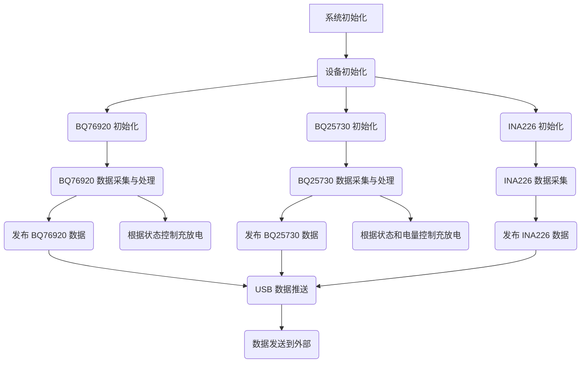

# 项目 MVP 业务流程计划

**目标：** 创建一个 Markdown 文件，详细描述基于 BQ76920、BQ25730 和 INA226 的项目 MVP 业务流程。

**主要设备：**

- BQ76920：电池监控芯片
- BQ25730：充电管理芯片
- INA226：电流/电压传感器
- USB 模块：负责数据推送

**流程概述：**

1. **系统初始化：**
    - 初始化 STM32 微控制器、I2C 总线和 USB 驱动。
    - 初始化任务间通信的消息队列。
    - 生成并启动 BQ76920、BQ25730、INA226 和 USB 任务。

2. **设备初始化（并行进行）：**
    - **BQ76920 初始化：**
        - 禁止充电和放电。
        - 设置输入输出过流保护为 500mA。
        - 配置 5 串磷酸铁锂电池保护（每节电池 2.5V - 3.65V）。
        - 设置 CC_CFG 寄存器为 0x19。
        - 清除初始状态标志。
    - **BQ25730 初始化：**
        - 设置 18V 充电截止电压。
        - 配置 4 串电池。
        - 不充电不放电。
    - **INA226 初始化：**
        - 正常初始化（根据代码，似乎只需要创建实例）。

3. **数据采集与处理（并行进行）：**
    - **BQ76920 任务：**
        - 定期轮询采集电池电压、总电压、温度、电流和系统状态。
        - 监听警报捕获事件（通过读取系统状态寄存器）。
        - 根据电池状态（判断电池还能放电）允许放电。
        - 根据温度状态（温度正常）允许充电。
        - 发布 BQ76920 的告警和测量数据。
    - **BQ25730 任务：**
        - 定期轮询采集充电器状态、Prochot 状态和 ADC 测量数据。
        - 监听警报捕获事件（通过读取状态寄存器）。
        - 只要 BQ76920 报告状态正常，就允许充放电。
        - 根据电池电量决策充电逻辑。
        - 发布 BQ25730 的告警和测量数据。
    - **INA226 任务：**
        - 定期轮询采集总线电压、电流和计算功率。
        - 发布 INA226 的测量数据。

4. **USB 数据推送：**
    - USB 任务订阅 BQ76920、BQ25730 和 INA226 的测量数据。
    - 从 pubhub 获取数据。
    - 通过 USB 接口将数据推送出去。

**流程图 (Mermaid):**

**详细步骤：**

1. **系统启动：** 微控制器上电，执行 [`src/main.rs`](src/main.rs) 中的 `main` 函数。
2. **初始化阶段：**
    - 分配堆内存。
    - 初始化消息队列（pub/sub）。
    - 初始化 STM32 外设，包括 USB 和 I2C1。
    - 创建 I2C 总线共享互斥锁。
    - 获取设备 I2C 地址。
    - 生成并启动 `bq76920_task`、`bq25730_task`、`ina226_task` 和 `usb_task`。
3. **BQ76920 任务执行 (`bq76920_task.rs`)：**
    - 创建 BQ76920 实例。
    - 调用 `set_config` 应用电池配置（包括 5 串磷酸铁锂电池保护）。
    - 写入 `CC_CFG` 寄存器为 0x19。
    - 写入 `SYS_STAT` 寄存器 0xFF 清除初始标志。
    - 进入主循环：
        - 确保 `CC_EN` 在 `SYS_CTRL2` 中启用。
        - 读取电池电压、总电压、温度、电流和系统状态。
        - 根据读取到的系统状态判断是否允许放电（例如，检查是否有过放电保护触发）。
        - 根据读取到的温度判断是否允许充电（例如，检查温度是否在正常范围内）。
        - 将告警信息发布到 `bq76920_alerts_publisher`。
        - 将测量数据（电压、温度、电流、状态、MOS 状态）构建成 `Bq76920Measurements` 结构体，并发布到 `bq76920_measurements_publisher`。
        - 等待 1 秒。
4. **BQ25730 任务执行 (`bq25730_task.rs`)：**
    - 创建 BQ25730 实例（使用 4 串电池配置）。
    - 进入主循环：
        - 读取充电器状态和 Prochot 状态。
        - 将充电器状态和 Prochot 状态构建成 `Bq25730Alerts` 结构体，并发布到 `bq25730_alerts_publisher`。
        - 读取 ADC 测量数据（PSYS, VBUS, IDCHG, ICHG, CMPIN, IIN, VBAT, VSYS）。
        - 根据 BQ76920 报告的状态（通过订阅 BQ76920 的测量数据或告警数据，这部分在当前代码中尚未明确实现任务间的控制逻辑，需要在后续开发中添加）来决定是否允许 BQ25730 进行充放电。
        - 根据电池电量（需要从 BQ76920 的测量数据中获取电池电压或总电压来估算电量，这部分也需要在后续开发中添加逻辑）来决策充电逻辑（例如，是否进入恒流或恒压充电）。
        - 将 ADC 测量数据构建成 `Bq25730Measurements` 结构体，并发布到 `bq25730_measurements_publisher`。
        - 等待 1 秒。
5. **INA226 任务执行 (`ina226_task.rs`)：**
    - 创建 INA226 实例。
    - 进入主循环：
        - 读取总线电压和电流。
        - 计算功率。
        - 将测量数据（电压、电流、功率）构建成 `Ina226Measurements` 结构体，并发布到 `ina226_measurements_publisher`。
        - 等待 1 秒。
6. **USB 任务执行 (`usb/mod.rs`)：**
    - 初始化 USB 设备。
    - 订阅 BQ76920、BQ25730 和 INA226 的测量数据。
    - 进入主循环：
        - 等待 USB 连接。
        - 从订阅的消息队列中获取最新的测量数据。
        - 将获取到的数据整合成一个数据包。
        - 通过 USB 接口将数据包发送出去。
        - 处理 USB 事件。

**需要进一步明确和实现的部分：**

- BQ76920 和 BQ25730 之间的控制逻辑：如何根据 BQ76920 的状态（特别是充放电允许状态）来控制 BQ25730 的充放电行为。这需要在 BQ25730 任务中订阅 BQ76920 的状态信息，并根据这些信息调用 BQ25730 库的相应函数来控制充电和放电。
- 电池电量决策充电逻辑：如何在 BQ25730 任务中根据电池电压或总电压来估算电池电量，并根据电量状态调整充电策略。
- 警报处理：虽然任务中读取了警报状态并发布了告警信息，但具体的警报处理逻辑（例如，触发警报时采取什么措施）尚未详细说明和实现。
- USB 数据格式和协议：通过 USB 推送的数据的具体格式和使用的协议需要明确。
