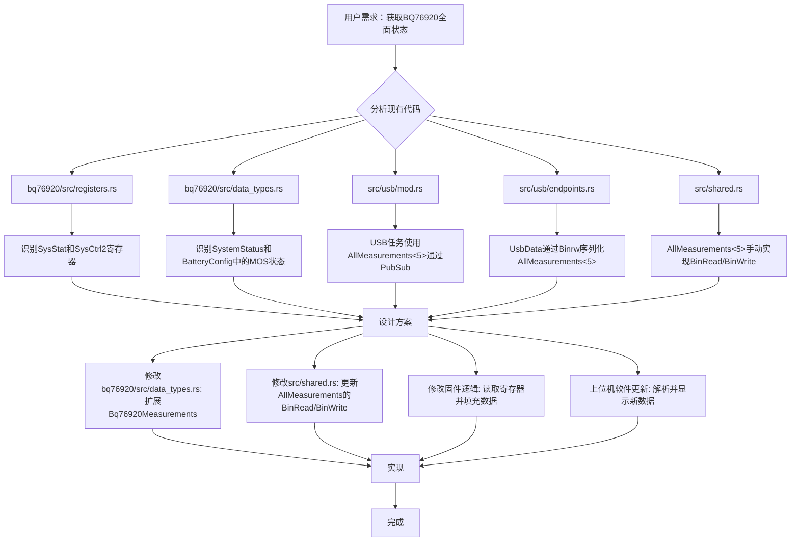

# BQ76920 状态信息 USB 上位机显示方案

## 方案概述

为了在上位机上看到 BQ76920 的比较全面的状态信息，包括充电放电 MOS 管的状态以及其他状态，我们需要进行以下修改：

1. **扩展 `Bq76920Measurements` 结构体：** 在 `bq76920/src/data_types.rs` 中，将 `SystemStatus` 和 MOS 管状态（`charge_on`, `discharge_on`）添加到 `Bq76920Measurements` 结构体中。
2. **修改 `AllMeasurements` 的 `BinRead` 和 `BinWrite` 实现：** 在 `src/shared.rs` 中，更新 `AllMeasurements` 的 `BinRead` 和 `BinWrite` 实现，以包含新的 BQ76920 状态数据。
3. **固件读取 BQ76920 状态：** 在固件中，读取 `SysStat` 和 `SysCtrl2` 寄存器，并将这些状态信息填充到 `Bq76920Measurements` 结构体中。
4. **上位机软件更新：** 上位机软件需要更新以解析新的 USB 数据格式，并显示这些状态信息。

## 详细计划

以下是实现此功能的详细步骤：

**步骤 1：修改 `bq76920/src/data_types.rs`**

* 在 `Bq76920Measurements` 结构体中添加 `system_status: SystemStatus` 和 `mos_status: MosStatus` 字段。
* 定义一个新的 `MosStatus` 枚举或结构体来表示充电/放电 MOS 管的状态。

**步骤 2：修改 `src/shared.rs`**

* 更新 `AllMeasurements` 结构体中的 `bq76920` 字段，使其包含新的 `SystemStatus` 和 `MosStatus`。
* 修改 `AllMeasurements` 的 `impl BinRead for AllMeasurements<N>` 和 `impl BinWrite for AllMeasurements<N>` 实现，以正确地序列化和反序列化新的状态字段。

**步骤 3：修改固件逻辑（`src/main.rs` 或相关 BQ76920 驱动文件）**

* 在读取 BQ76920 测量数据的地方，添加读取 `SysStat` (0x00) 和 `SysCtrl2` (0x05) 寄存器的逻辑。
* 解析这些寄存器的值，提取 `CHG_ON` 和 `DSG_ON` 位以及其他系统状态位。
* 将这些状态信息填充到 `Bq76920Measurements` 结构体的新字段中。
* 确保这些更新后的 `AllMeasurements` 数据通过 `MEASUREMENTS_PUBSUB` 发布。

**步骤 4：上位机软件更新（不在当前任务范围内，但需要考虑）**

* 上位机应用程序需要更新其 USB 数据解析逻辑，以匹配新的 `AllMeasurements` 结构体。
* 在用户界面上添加新的显示元素，以展示充电/放电 MOS 管状态和 BQ76920 的其他系统状态。

## Mermaid 图

