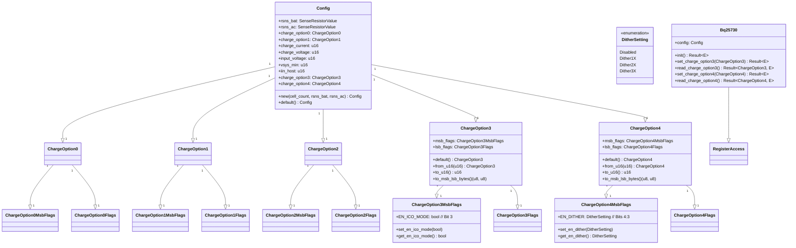

# BQ25730 驱动更新计划

**目标：** 在 `bq25730` 驱动中添加对 `ChargeOption3` 和 `ChargeOption4` 的配置，并在初始化时写入这些寄存器。同时，为 `EN_ICO_MODE` 和 `EN_DITHER` 提供便捷的设置方法。

**步骤：**

1.  **修改 `bq25730/src/registers.rs`:**
    *   **定义 `ChargeOption4Flags` 和 `ChargeOption4MsbFlags`:**
        *   根据数据手册 (`bq25730/docs/bq25730.md:1043` 和 `bq25730/docs/bq25730.md:1047`) 定义 `ChargeOption4Flags` (对应 REG0x3Ch) 和 `ChargeOption4MsbFlags` (对应 REG0x3Dh) 的位域。
            *   `ChargeOption4MsbFlags` (REG0x3Dh, 复位值 `0x00`):
                *   `VSYS_UVP` (bits 7:5)
                *   `EN_DITHER` (bits 4:3)
                *   `VSYS_UVP_NO_HICCUP` (bit 2)
                *   `PP_VBUS_VAP` (bit 1)
                *   `STAT_VBUS_VAP` (bit 0)
            *   `ChargeOption4Flags` (REG0x3Ch, 复位值 `0x48`):
                *   `IDCHG_DEG2` (bits 7:6)
                *   `IDCHG_TH2` (bits 5:3)
                *   `PP_IDCHG2` (bit 2)
                *   `STAT_IDCHG2` (bit 1)
                *   `STAT_PTM` (bit 0)
        *   为这些新的 `bitflags` 结构体实现 `defmt::Format`（如果启用了 `defmt`）。
    *   **为 `ChargeOption3MsbFlags` 添加便捷方法:**
        *   在 `ChargeOption3MsbFlags` (`bq25730/src/registers.rs:348`) 中添加：
            ```rust
            pub fn set_en_ico_mode(&mut self, enable: bool) {
                if enable {
                    self.insert(ChargeOption3MsbFlags::EN_ICO_MODE);
                } else {
                    self.remove(ChargeOption3MsbFlags::EN_ICO_MODE);
                }
            }

            pub fn get_en_ico_mode(&self) -> bool {
                self.contains(ChargeOption3MsbFlags::EN_ICO_MODE)
            }
            ```
    *   **为 `ChargeOption4MsbFlags` 添加便捷方法:**
        *   定义 `DitherSetting` 枚举：
            ```rust
            #[derive(Debug, Copy, Clone, PartialEq, Eq)]
            #[cfg_attr(feature = "defmt", derive(defmt::Format))]
            pub enum DitherSetting {
                Disabled = 0b00,
                Dither1X = 0b01, // +/- 2%
                Dither2X = 0b10, // +/- 4%
                Dither3X = 0b11, // +/- 6%
            }

            impl DitherSetting {
                pub fn from_bits(bits: u8) -> Self {
                    match (bits >> 3) & 0b11 { // EN_DITHER is bits 4:3
                        0b01 => DitherSetting::Dither1X,
                        0b10 => DitherSetting::Dither2X,
                        0b11 => DitherSetting::Dither3X,
                        _ => DitherSetting::Disabled, // Default or 00b
                    }
                }
                pub fn bits(self) -> u8 {
                    (self as u8) << 3
                }
            }
            ```
        *   在 `ChargeOption4MsbFlags` 中添加：
            ```rust
            pub fn set_en_dither(&mut self, setting: DitherSetting) {
                self.bits &= !(0b11 << 3); // Clear EN_DITHER bits
                self.bits |= setting.bits();
            }

            pub fn get_en_dither(&self) -> DitherSetting {
                DitherSetting::from_bits(self.bits())
            }
            ```
    *   **在 `Register` 枚举中添加 `ChargeOption4` 和 `ChargeOption4Msb`:**
        *   `ChargeOption4 = 0x3C,`
        *   `ChargeOption4Msb = 0x3D,`

2.  **修改 `bq25730/src/data_types.rs`:**
    *   **导入新的 Flags 类型:**
        *   `use crate::registers::{ChargeOption4Flags, ChargeOption4MsbFlags};`
    *   **定义 `ChargeOption4` 结构体:**
        *   创建 `pub struct ChargeOption4`，包含 `pub msb_flags: ChargeOption4MsbFlags` 和 `pub lsb_flags: ChargeOption4Flags`。
        *   为其实现 `Default` trait，使用复位值 `0x0048` (MSB `0x00`, LSB `0x48`)。
            ```rust
            impl Default for ChargeOption4 {
                fn default() -> Self {
                    Self {
                        msb_flags: ChargeOption4MsbFlags::from_bits_truncate(0x00),
                        lsb_flags: ChargeOption4Flags::from_bits_truncate(0x48),
                    }
                }
            }
            ```
        *   实现 `from_u16(value: u16) -> Self`，`to_u16(&self) -> u16` 和 `to_msb_lsb_bytes(&self) -> (u8, u8)` 方法。
        *   如果启用了 `defmt` 特性，为其实现 `defmt::Format`。
        *   如果启用了 `binrw` 特性，为其添加 `#[cfg_attr(feature = "binrw", derive(BinRead, BinWrite))]` 并实现相应的映射。
    *   **为 `ChargeOption3` 实现 `Default` trait:**
        *   为现有的 `ChargeOption3` (`bq25730/src/data_types.rs:1419`) 结构体实现 `Default` trait，使用复位值 `0x0434` (MSB `0x04`, LSB `0x34`)。
            ```rust
            impl Default for ChargeOption3 {
                fn default() -> Self {
                    Self {
                        msb_flags: ChargeOption3MsbFlags::from_bits_truncate(0x04),
                        lsb_flags: ChargeOption3Flags::from_bits_truncate(0x34),
                    }
                }
            }
            ```
    *   **更新 `Config` 结构体:**
        *   在 `Config` 结构体 (`bq25730/src/data_types.rs:1546`) 中添加以下字段：
            ```rust
            pub charge_option3: ChargeOption3,
            pub charge_option4: ChargeOption4,
            ```
    *   **更新 `Config::new()` 方法:**
        *   在 `Config::new()` (`bq25730/src/data_types.rs:1572`) 方法中初始化 `charge_option3` 和 `charge_option4` 为它们的默认值。
            ```rust
            // 在 charge_option1 初始化之后添加
            charge_option3: ChargeOption3::default(),
            charge_option4: ChargeOption4::default(),
            ```
    *   **更新 `Config::default()` 方法:**
        *   确保 `Config::default()` (`bq25730/src/data_types.rs:1630`) 调用 `Config::new()` 时，新的 `charge_option3` 和 `charge_option4` 字段能被正确初始化。

3.  **修改 `bq25730/src/lib.rs`:**
    *   **导入类型:**
        *   在文件顶部 (`bq25730/src/lib.rs:15`) 导入 `ChargeOption4`。
    *   **更新 `init()` 函数:**
        *   在 `init()` 函数 (`bq25730/src/lib.rs:225`) 中，在写入其他配置寄存器之后，添加写入 `ChargeOption3` 和 `ChargeOption4` 寄存器的逻辑。
            ```rust
            // 在写入 IinHost 之后添加
            let (lsb_co3, msb_co3) = self.config.charge_option3.to_msb_lsb_bytes();
            self.write_registers(Register::ChargeOption3, &[lsb_co3, msb_co3])
                .await?;

            let (lsb_co4, msb_co4) = self.config.charge_option4.to_msb_lsb_bytes();
            self.write_registers(Register::ChargeOption4, &[lsb_co4, msb_co4])
                .await?;
            ```
    *   **添加 `read_charge_option4()` 和 `set_charge_option4()` 函数:**
        *   在文件末尾附近，添加这两个函数，逻辑类似于 `read_charge_option3()` (`bq25730/src/lib.rs:559`) 和 `set_charge_option3()` (`bq25730/src/lib.rs:552`)。
            ```rust
            /// Sets the ChargeOption4 register.
            pub async fn set_charge_option4(&mut self, options: ChargeOption4) -> Result<(), Error<E>> {
                let raw_value = options.to_u16();
                self.write_registers(Register::ChargeOption4, &raw_value.to_le_bytes())
                    .await
            }

            /// Reads the ChargeOption4 register.
            pub async fn read_charge_option4(&mut self) -> Result<ChargeOption4, Error<E>> {
                let raw_options = self.read_registers(Register::ChargeOption4, 2).await?;
                Ok(ChargeOption4::from_u16(u16::from_le_bytes([
                    raw_options.as_ref()[0],
                    raw_options.as_ref()[1],
                ])))
            }
            ```

**Mermaid 图 (数据结构和流程):**



```mermaid
sequenceDiagram
    participant User
    participant Bq25730
    User->>Bq25730: new(config)
    User->>Bq25730: init()
    Bq25730->>Bq25730: write_registers(ChargeOption0, config.charge_option0)
    Bq25730->>Bq25730: write_registers(ChargeCurrent, config.charge_current)
    Bq25730->>Bq25730: write_registers(ChargeVoltage, config.charge_voltage)
    Bq25730->>Bq25730: write_registers(ChargeOption1, config.charge_option1)
    Bq25730->>Bq25730: write_registers(InputVoltage, config.input_voltage)
    Bq25730->>Bq25730: write_registers(VsysMin, config.vsys_min)
    Bq25730->>Bq25730: write_registers(IinHost, config.iin_host)
    Bq25730->>Bq25730: write_registers(ChargeOption3, config.charge_option3)
    Bq25730->>Bq25730: write_registers(ChargeOption4, config.charge_option4)
    Bq25730->>User: Result
