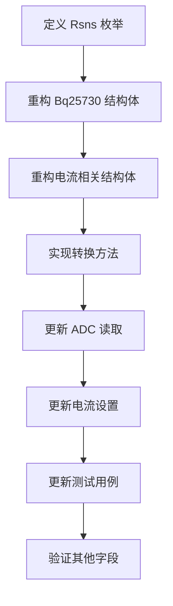

# BQ25730 ADC电流测量重构计划

## 目标
重构电流相关ADC测量和设置的结构体，使其正确反映RSNS电阻值的影响，确保物理值计算准确。

## 详细重构步骤

### 1. 定义 RSNS 枚举类型
- 文件: [`bq25730/src/lib.rs`](bq25730/src/lib.rs)
- 添加枚举:
  ```rust
  #[derive(Debug, Copy, Clone, PartialEq)]
  pub enum Rsns {
      R5mOhm,  // 5mΩ 电流采样电阻
      R10mOhm, // 10mΩ 电流采样电阻
  }
  ```

### 2. 重构 Bq25730 结构体
- 文件: [`bq25730/src/lib.rs`](bq25730/src/lib.rs)
- 修改字段:
  ```diff
  pub struct Bq25730<I2C> {
      address: u8,
      pub i2c: I2C,
      cell_count: u8,
  -   rsns_rac_is_5m_ohm: bool,
  +   rsns: Rsns,  // 电流采样电阻类型
  }
  ```
- 更新 `new()` 方法
- 更新 `init()` 方法从寄存器读取 RSNS 设置

### 3. 重构电流相关结构体
- 文件: [`bq25730/src/data_types.rs`](bq25730/src/data_types.rs)
- 为以下结构体添加 `rsns: Rsns` 字段:
  - `AdcIchg` (充电电流ADC)
  - `AdcIdchg` (放电电流ADC)
  - `AdcIin` (输入电流ADC)
  - `ChargeCurrent` (充电电流设置)
  - `OtgCurrent` (OTG电流设置)
  - `IinHost` (主机输入电流)
  - `IinDpm` (DPM输入电流)

### 4. 实现新的转换方法
- 为每个电流相关结构体实现:
  ```rust
  pub fn from_raw(raw: u8, rsns: Rsns) -> Self {
      // 根据 RSNS 选择正确的 LSB 值
      let lsb = match rsns {
          Rsns::R5mOhm => 128, // mA/LSB for 5mΩ
          Rsns::R10mOhm => 64, // mA/LSB for 10mΩ
      };
      Self {
          milliamps: (raw as u16) * lsb,
          rsns,
      }
  }
  
  pub fn to_raw(&self) -> u8 {
      let lsb = match self.rsns {
          Rsns::R5mOhm => 128,
          Rsns::R10mOhm => 64,
      };
      (self.milliamps / lsb) as u8
  }
  ```

### 5. 更新 ADC 读取方法
- 文件: [`bq25730/src/lib.rs`](bq25730/src/lib.rs)
- 修改 `read_adc_measurements()`:
  ```diff
  Ok(AdcMeasurements {
      vbat: ...,
      vsys: ...,
  -   ichg: AdcIchg::from_u8(adc_data_raw.as_ref()[3]),
  +   ichg: AdcIchg::from_raw(adc_data_raw.as_ref()[3], self.rsns),
      // 同样更新其他电流字段
  })
  ```

### 6. 更新电流设置方法
- 修改所有电流设置方法如 `set_charge_current()`:
  ```diff
  pub async fn set_charge_current(&mut self, current: ChargeCurrent) -> Result<(), Error<E>> {
  -   let raw_value = current.to_u16();
  +   let raw_value = current.to_raw();
      self.write_registers(Register::ChargeCurrent, &[raw_value])
          .await
  }
  ```

### 7. 更新测试用例
- 更新 `bq25730/tests/` 目录下所有测试
- 添加针对不同 RSNS 值的测试用例
- 验证电流计算在不同配置下的正确性

### 8. 验证其他相关字段
- 检查以下字段是否受 RSNS 影响：
  - `ChargeOption1` (充电选项1)
  - `AdcOption` (ADC选项)
  - `ProchotOption0` (PROCHOT选项0)
- 根据数据手册更新相关转换逻辑

## 需要修改的文件清单
1. [`bq25730/src/lib.rs`](bq25730/src/lib.rs)
2. [`bq25730/src/data_types.rs`](bq25730/src/data_types.rs)
3. [`bq25730/tests/status_and_adc.rs`](bq25730/tests/status_and_adc.rs)
4. [`bq25730/tests/charge_control.rs`](bq25730/tests/charge_control.rs)
5. [`bq25730/tests/input_power_management.rs`](bq25730/tests/input_power_management.rs)
6. [`bq25730/tests/otg_control.rs`](bq25730/tests/otg_control.rs)

## 实施路线图


计划生成时间: 2025-06-01 00:50:13 (UTC+8)
