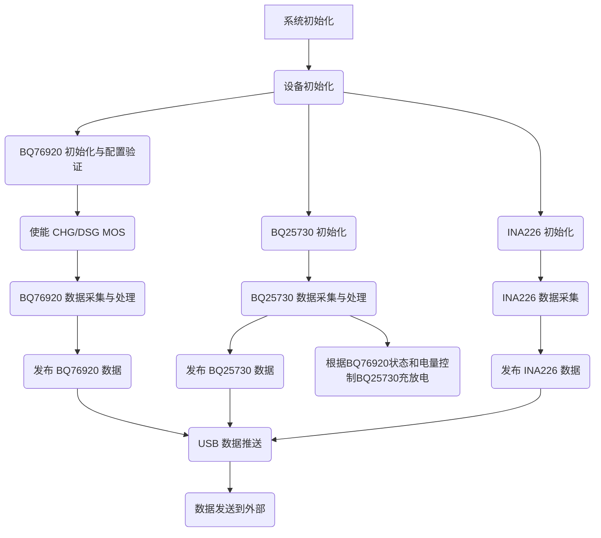

# 项目 MVP 业务流程计划

**目标：** 创建一个 Markdown 文件，详细描述基于 BQ76920、BQ25730 和 INA226 的项目 MVP 业务流程。

**主要设备：**

- BQ76920：电池监控芯片
- BQ25730：充电管理芯片
- INA226：电流/电压传感器
- USB 模块：负责数据推送

**流程概述：**

1.  **系统初始化：**
    - 初始化 STM32 微控制器、I2C 总线和 USB 驱动。
    - 初始化任务间通信的消息队列。
    - 生成并启动 BQ76920、BQ25730、INA226 和 USB 任务。

2.  **设备初始化（并行进行）：**
    - **BQ76920 初始化：**
        - 应用电池配置（例如，通过 `BatteryConfig::default()`），包括设置各项保护参数（如5串磷酸铁锂电池的过压/欠压阈值、过流保护阈值和延迟等）。
        - 配置 CC_CFG 寄存器（例如，设置为 0x19 以优化性能）。
        - 清除初始状态标志（例如，通过写入 SYS_STAT 寄存器 0xFF）。
        - **关键步骤：**调用驱动库提供的配置与验证方法（例如 `try_apply_config`），回读并验证关键安全配置寄存器（例如 OV_TRIP, UV_TRIP, PROTECT1, PROTECT2, CC_CFG 等）是否已按预期正确写入芯片。若验证失败，则报告严重错误，并可能中止后续的MOS管使能操作，以确保系统安全。
        - 若配置验证成功，则主动使能充电MOS管 (CHG_ON) 和放电MOS管 (DSG_ON)，以默认允许充电和放电通路。
    - **BQ25730 初始化：**
        - 设置 18V 充电截止电压。
        - 配置 4 串电池。
        - 初始状态不主动进行充电或放电（等待 BQ76920 的状态）。
    - **INA226 初始化：**
        - 正常初始化（根据代码，似乎只需要创建实例）。

3.  **数据采集与处理（并行进行）：**
    - **BQ76920 任务：**
        - 定期轮询采集电池电压、总电压、温度、电流、系统状态（包括芯片自主保护触发的标志）和MOS管状态。
        - 监听警报捕获事件（通过读取系统状态寄存器）。
        - 发布 BQ76920 的告警和测量数据。这些数据将反映 BQ76920 芯片的自主保护动作和MOS管的实际状态。
    - **BQ25730 任务：**
        - 定期轮询采集充电器状态、Prochot 状态和 ADC 测量数据。
        - 监听警报捕获事件（通过读取状态寄存器）。
        - 根据从 BQ76920 任务获取的状态信息（特别是 MOS管使能状态 `CHG_ON` 和是否有关键故障如 `OV`），来决定是否允许 BQ25730 进行充电操作（即控制 `CHRG_INHIBIT` 位）。
        - 根据从 BQ76920 获取的系统状态（例如 MOS 管状态、故障标志）控制充电使能/禁止。
        - 发布 BQ25730 的告警和测量数据。
    - **INA226 任务：**
        - 定期轮询采集总线电压、电流和计算功率。
        - 发布 INA226 的测量数据。

4.  **USB 数据推送：**
    - USB 任务订阅 BQ76920、BQ25730 和 INA226 的测量数据。
    - 从 pubhub 获取数据。
    - 通过 USB 接口将数据推送出去。

**流程图 (Mermaid):**



**详细步骤：**

1.  **系统启动：** 微控制器上电，执行 [`src/main.rs`](src/main.rs:1) 中的 `main` 函数。
2.  **初始化阶段：**
    - 分配堆内存。
    - 初始化消息队列（pub/sub）。
    - 初始化 STM32 外设，包括 USB 和 I2C1。
    - 创建 I2C 总线共享互斥锁。
    - 获取设备 I2C 地址。
    - 生成并启动 `bq76920_task`、`bq25730_task`、`ina226_task` 和 `usb_task`。
3.  **BQ76920 任务执行 (`bq76920_task.rs`)：**
    - 创建 BQ76920 实例。
    - 调用驱动库提供的配置与验证方法（例如 `try_apply_config`）来应用电池配置（包括5串磷酸铁锂电池的各项保护参数、CC_CFG 等）并**验证这些关键安全配置是否已正确写入芯片**。
    - **如果配置验证失败：**
        - 报告严重错误（包含不匹配的寄存器、期望值和实际值）。
        - **任务不应使能MOS管，并应进入安全停机或持续报错状态，以防止不安全操作。**
    - **如果配置验证成功：**
        - **主动使能充电MOS管 (CHG_ON) 和放电MOS管 (DSG_ON)**，以默认允许充电和放电通路。
        - 记录配置成功并已尝试使能MOS管。
    - 进入主循环：
        - （如果 `try_apply_config` 未处理 `CC_EN` 的持续确保，则保留此项，但通常初始化时已设置）确保 `CC_EN` 在 `SYS_CTRL2` 中启用。
        - 定期读取电池电压、总电压、温度、电流、系统状态（包括芯片自主保护触发的标志）和MOS管状态。
        - 将告警信息（基于系统状态）发布到 `bq76920_alerts_publisher`。
        - 将测量数据（电压、温度、电流、状态、MOS 状态）构建成 `Bq76920Measurements` 结构体，并发布到 `bq76920_measurements_publisher`。
        - 等待 1 秒。
4.  **BQ25730 任务执行 (`bq25730_task.rs`)：**
    - 创建 BQ25730 实例（使用 4 串电池配置）。
    - 进入主循环：
        - 订阅并等待 `BQ76920` 的测量数据。
        - 读取充电器状态和 Prochot 状态。
        - 将充电器状态和 Prochot 状态构建成 `Bq25730Alerts` 结构体，并发布到 `bq25730_alerts_publisher`。
        - 读取 ADC 测量数据（PSYS, VBUS, IDCHG, ICHG, CMPIN, IIN, VBAT, VSYS）。
        - 根据从 `BQ76920` 获取的状态信息（特别是 `MosStatus` 中的 `CHG_ON` 标志和 `SystemStatus` 中的故障标志如 `OV`），来决定是否允许 `BQ25730` 进行充电操作（即控制 `BQ25730` 的 `CHRG_INHIBIT` 位）。
        - 此处的充电逻辑主要是指根据 BQ76920 的状态（如MOS管是否允许充电，是否有严重故障）来决定是否通过 BQ25730 的 `CHRG_INHIBIT` 位来允许或禁止充电。BQ25730 本身不执行复杂的基于电量的充电阶段（如CC/CV）切换，这些高级策略应由更高层逻辑（如果需要）或 BQ76920 的自主保护机制间接影响。
        - 将 ADC 测量数据构建成 `Bq25730Measurements` 结构体，并发布到 `bq25730_measurements_publisher`。
        - 等待 1 秒。
5.  **INA226 任务执行 (`ina226_task.rs`)：**
    - 创建 INA226 实例。
    - 进入主循环：
        - 读取总线电压和电流。
        - 计算功率。
        - 将测量数据（电压、电流、功率）构建成 `Ina226Measurements` 结构体，并发布到 `ina226_measurements_publisher`。
        - 等待 1 秒。
6.  **USB 任务执行 (`usb/mod.rs`)：**
    - 初始化 USB 设备。
    - 订阅 BQ76920、BQ25730 和 INA226 的测量数据。
    - 进入主循环：
        - 等待 USB 连接。
        - 从订阅的消息队列中获取最新的测量数据。
        - 将获取到的数据整合成一个数据包。
        - 通过 USB 接口将数据包发送出去。
        - 处理 USB 事件。

**需要进一步明确和实现的部分：**

- BQ76920 和 BQ25730 之间的控制逻辑：`bq25730_task` 如何精确地使用 `bq76920_task` 发布的数据来控制充放电，确保时序和状态判断的准确性。
- BQ25730 充电控制澄清：BQ25730 主要负责执行由 BQ76920 状态决定的充电使能/禁止。文档已更新以反映 BQ25730 不直接执行基于电量的复杂充电策略。
- 警报处理：虽然任务中读取了警报状态并发布了告警信息，但具体的警报处理逻辑（例如，触发警报时采取什么措施）尚未详细说明和实现。
- USB 数据格式和协议：通过 USB 推送的数据的具体格式和使用的协议需要明确。

### BQ25730 角色与充电逻辑澄清

BQ25730 在本系统中主要扮演一个**受控的充电器前端**角色，其核心职责是根据主控制器（通过 BQ76920 的状态间接反映）的指令来使能或禁止充电路径，并设置基础的充电参数（如充电电压和电流限制）。

**关键点：**

*   **非自主决策充电阶段：** BQ25730 本身不具备根据电池实时电量（SOC）或电压状态自主进行复杂充电阶段（如恒流 CC、恒压 CV、涓流充电）切换的逻辑。这些高级充电策略如果需要，应由 STM32 微控制器（例如，在 `bq25730_task` 或一个专门的电源管理任务中）实现，通过读取 BQ76920 提供的电池信息，然后动态配置 BQ25730 的充电参数。
*   **依赖 BQ76920 状态：** `bq25730_task` 的主要逻辑是订阅 BQ76920 的状态（特别是 MOS 管状态和故障标志）。如果 BQ76920 指示不允许充电（例如，`CHG_ON` MOS 管关闭，或发生严重电池故障如过压），`bq25730_task` 会通过设置 BQ25730 的 `CHRG_INHIBIT` 位来禁止充电。
*   **参数设置：** `bq25730_task` 会根据预设或（未来可能实现的）动态逻辑来配置 BQ25730 的目标充电电压和最大充电电流。

因此，文档中提及的“充电逻辑”应主要理解为基于 BQ76920 安全状态的“充电允许控制”，而非复杂的、基于电池SOC的充电曲线管理。

---

## 附录：BQ76920充电问题修复方案与实施计划

**1. 问题概述**

设备当前无法充电。根本原因在于 `BQ76920` 电池管理芯片的充电MOS管使能位 (`CHG_ON` 在 `SYS_CTRL2` 寄存器中) 在初始化后未被主动设置为 `true`。这导致 `bq25730_task` 在检查 `BQ76920` 状态时，认为充电不被允许，进而设置 `BQ25730` 充电芯片的 `CHRG_INHIBIT` 位，禁止了充电操作。

**2. 核心修复思路**

在 `BQ76920` 初始化过程中，首先应用所有安全相关的配置参数（如过压、欠压、过流保护阈值等）。然后，严格验证这些关键配置是否已成功写入芯片。只有在配置验证通过的前提下，才主动使能 `BQ76920` 的充电MOS管 (`CHG_ON`) 和放电MOS管 (`DSG_ON`)，从而默认允许充电和放电通路。后续的实际充放电控制将依赖 `BQ76920` 芯片自身的硬件保护机制以及 `bq25730_task` 根据 `BQ76920` 报告的状态进行的判断。

**3. 详细实施步骤**

**阶段一：修改 `bq769x0_async_rs` 驱动库 ([`bq76920/`](bq76920/))**

1.  **更新 `bq76920/src/errors.rs`**:
    *   在 `Error` 枚举中添加新的错误变体，用于表示配置验证失败：
        ```rust
        ConfigVerificationFailed {
            register: registers::Register, // 确保 Register 类型可被包含
            expected: u8,
            actual: u8,
        }
        ```

2.  **在 `bq76920/src/lib.rs` 中实现 `async fn try_apply_config()`**:
    *   定义新的公共方法 `pub async fn try_apply_config(&mut self, config: &BatteryConfig) -> Result<(), Error<E>>`。
    *   **内部实现**:
        *   **调用现有 `set_config`**: 首先调用 `self.set_config(config).await?` 执行实际的寄存器写入。
        *   **实现配置验证逻辑**:
            *   读取ADC校准值 (`adc_gain_uv_per_lsb`, `adc_offset_mv`)。
            *   回读关键安全配置寄存器：`OV_TRIP`, `UV_TRIP`, `PROTECT1`, `PROTECT2`, `PROTECT3`, `CC_CFG`, `SYS_CTRL1`, `SYS_CTRL2` (基础配置部分，此时 `CHG_ON`/`DSG_ON` 应为0)。
            *   根据传入的 `config` 和ADC校准值，计算这些寄存器的期望原始值。
            *   逐个比较回读值与期望值。若任何关键配置不匹配，则返回 `Err(Error::ConfigVerificationFailed { register, expected, actual })`。
        *   如果所有验证都通过，则返回 `Ok(())`。

**阶段二：修改应用层代码 (`src/bq76920_task.rs`)**

1.  **在 `bq76920_task` 的初始化部分**:
    *   替换原有的 `bq.set_config(...)` 调用为 `bq.try_apply_config(&battery_config).await`。
    *   **错误处理**:
        *   若 `try_apply_config` 返回 `Ok(_)`:
            *   记录配置成功和已验证的日志。
            *   继续调用 `bq.enable_charging().await` 和 `bq.enable_discharging().await` 来使能MOS管。
            *   记录尝试使能MOS管的日志，并处理这两个调用可能产生的I2C错误。
        *   若 `try_apply_config` 返回 `Err(Error::ConfigVerificationFailed {..})`):
            *   记录包含详细不匹配信息的**严重错误**日志。
            *   **任务不应继续使能MOS管**，并应考虑进入安全停机状态或持续报错，以防止在保护配置不正确的情况下运行。
        *   若 `try_apply_config` 返回其他错误 (如 `Error::I2c(_)`):
            *   记录错误，并同样考虑采取安全措施。
    *   移除在 `bq76920_task.rs` 中对 `bq.write_register(Register::CcCfg, 0x19).await` 和 `bq.clear_status_flags(0xFF).await` 的直接调用，因为这些操作已包含在驱动库的 `set_config` (并因此在 `try_apply_config`) 内部。

**4. 预期效果**

完成上述修改后，`BQ76920` 将在初始化时进行严格的配置验证。只有在关键安全参数确认无误后，才会默认开启充电和放电通路。这将使得 `BQ76920` 的 `CHG_ON` 和 `DSG_ON` 标志被正确设置为 `true`（前提是配置验证通过且使能命令成功），从而允许 `BQ25730` 根据其自身的逻辑以及从 `BQ76920` 获取的状态信息来控制充电过程。`BQ76920` 芯片自身的硬件保护机制在此基础上依然有效，提供底层的安全保障。
