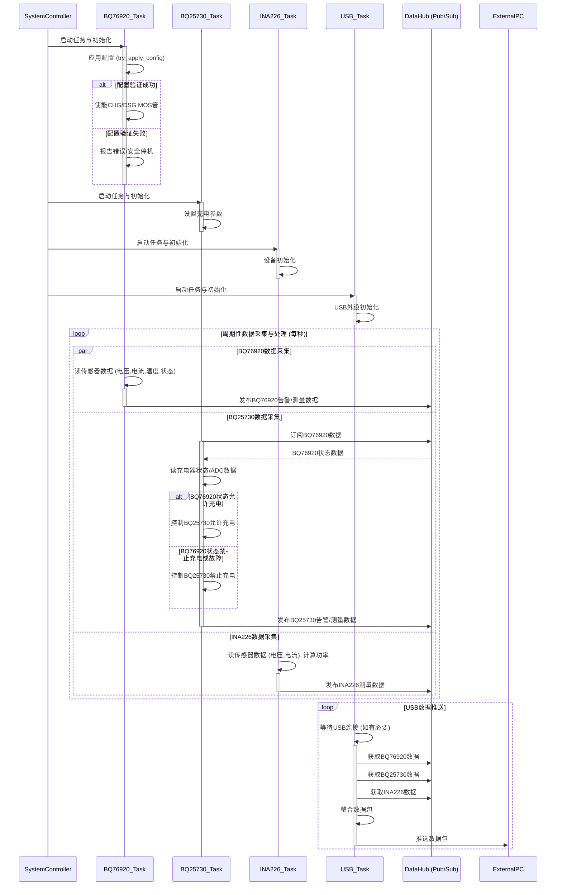

# 项目 MVP 业务流程计划

**目标：** 创建一个 Markdown 文件，详细描述基于 BQ76920、BQ25730 和 INA226 的项目 MVP 业务流程。

**主要设备：**

- BQ76920：电池监控芯片 (例如，用于3至5串锂离子/磷酸铁锂电池的监控器)
- BQ25730：充电管理芯片 (例如，NVDC 降压-升压电池充电控制器)
- INA226：电流/电压传感器 (例如，具有I2C接口的电流分流和功率监视器，配置为16V，400uV/LSB)
- USB 模块：负责数据推送 (例如，基于STM32内部USB外设或外部USB转串口芯片)

**流程概述：**

1.  **系统初始化：**
    - 初始化 STM32 微控制器、I2C 总线和 USB 驱动。
    - 初始化任务间通信的消息队列。
    - 生成并启动 BQ76920、BQ25730、INA226 和 USB 任务。

2.  **设备初始化（并行进行）：**
    - **BQ76920 初始化：**
        - 调用驱动库提供的配置与验证方法（例如 `try_apply_config(&battery_config)`）。此方法内部会：
            - 首先尝试写入所有配置到 BQ76920 芯片，这些配置源于 `BatteryConfig` 结构体（例如，针对5串磷酸铁锂电池，可能包含过压保护阈值约 3.65V/节，欠压保护阈值约 2.5V/节，一级短路放电保护阈值如 60mV/200µs，二级短路放电保护阈值如 100mV/400µs，过流放电保护阈值如 40mV/8ms 等）。
            - 配置 `CC_CFG` 寄存器（例如，设置为 `0x19` 以优化电流测量和库仑计功能）。
            - 清除初始状态标志（例如，通过向 `SYS_STAT` 寄存器写入 `0xFF` 来清除所有状态位）。
            - **关键步骤：**在写入配置后，回读并验证关键安全配置寄存器（例如 `PROTECT1` (SCD/OCD1 设置), `PROTECT2` (OCD2/OCC 设置), `PROTECT3` (过放/充电保护设置), `OV_TRIP` (过压阈值), `UV_TRIP` (欠压阈值), `CC_CFG` 等）是否已按预期正确写入芯片。
        - 若所有关键配置验证成功，则主动通过写入 `SYS_CTRL2` 寄存器来使能充电MOS管 (`CHG_ON` 位置1) 和放电MOS管 (`DSG_ON` 位置1)，以默认允许充电和放电通路。
        - 若配置验证失败（例如，某个寄存器的回读值与期望值不符），则报告包含不匹配详情的严重错误，并且**不**会尝试使能MOS管，以确保系统安全。
    - **BQ25730 初始化：**
        - 设置充电截止电压为 18.0V (对应5串磷酸铁锂电池的典型充满电压，例如通过配置 `ChargeVoltageLimit` 寄存器实现，如写入 `0x4650` 代表18000mV)。
        - 配置为5串电池 (例如通过配置 `ChargeOption0` 寄存器的 `CELL_BATPRESZ` 位域为 `0b100` 代表5串)。
        - 初始状态不主动进行充电或放电（等待 BQ76920 的状态）。
    - **INA226 初始化：**
        - 正常初始化（根据代码，似乎只需要创建实例）。

3.  **数据采集与处理（并行进行）：**
    - **BQ76920 任务：**
        - 定期轮询采集电池电压、总电压、温度、电流、系统状态（包括芯片自主保护触发的标志）和MOS管状态。
        - 监听警报捕获事件（通过读取系统状态寄存器）。
        - 发布 BQ76920 的告警和测量数据。这些数据将反映 BQ76920 芯片的自主保护动作和MOS管的实际状态。
    - **BQ25730 任务：**
        - 定期轮询采集充电器状态、Prochot 状态和 ADC 测量数据。
        - 监听警报捕获事件（通过读取状态寄存器）。
        - 根据从 BQ76920 任务获取的状态信息（特别是 MOS管使能状态 `CHG_ON` 和是否有关键故障如 `OV`），来决定是否允许 BQ25730 进行充电操作（即控制 `CHRG_INHIBIT` 位）。
        - 根据从 BQ76920 获取的系统状态（例如 MOS 管状态、故障标志）控制充电使能/禁止。
        - 发布 BQ25730 的告警和测量数据。
    - **INA226 任务：**
        - 定期轮询采集总线电压、电流和计算功率。
        - 发布 INA226 的测量数据。

4.  **USB 数据推送：**
    - USB 任务订阅 BQ76920、BQ25730 和 INA226 的测量数据。
    - 从 pubhub 获取数据。
    - 通过 USB 接口将数据推送出去。

**流程图 (Mermaid):**

**详细步骤：**

1.  **系统启动：** 微控制器上电，执行 [`src/main.rs`](src/main.rs:1) 中的 `main` 函数。
2.  **初始化阶段：**
    - 分配堆内存。
    - 初始化消息队列（pub/sub）。
    - 初始化 STM32 外设，包括 USB 和 I2C1。
    - 创建 I2C 总线共享互斥锁。
    - 获取设备 I2C 地址。
    - 生成并启动 `bq76920_task`、`bq25730_task`、`ina226_task` 和 `usb_task`。
3.  **BQ76920 任务执行 (`bq76920_task.rs`)：**
    - 创建 BQ76920 实例。
    - 调用驱动库提供的 `bq.try_apply_config(&battery_config).await` 方法。此方法会：
        - 应用 `battery_config` 中的电池配置（例如，针对5串磷酸铁锂电池，可能包含过压保护阈值约 3.65V/节对应 `OV_TRIP` 寄存器值，欠压保护阈值约 2.5V/节对应 `UV_TRIP` 寄存器值，一级短路放电保护阈值如 60mV/200µs 和二级短路放电保护阈值如 100mV/400µs 分别配置到 `PROTECT1` 寄存器的 `SCD_THRESH` 和 `SCD_DELAY` 位域，过流放电保护阈值如 40mV/8ms 配置到 `PROTECT2` 寄存器的 `OCD_THRESH` 和 `OCD_DELAY` 位域等）。
        - 写入 `CC_CFG` 寄存器（例如，值 `0x19`）。
        - 清除 `SYS_STAT` 寄存器的所有状态位（例如，写入 `0xFF`）。
        - **然后严格验证这些关键安全配置（如 `OV_TRIP`, `UV_TRIP`, `PROTECT1`, `PROTECT2`, `CC_CFG` 等）是否已正确写入芯片。**
    - **处理 `try_apply_config` 的结果：**
        - **如果返回 `Ok(_)` (配置验证成功)：**
            - 记录配置成功和已验证的日志。
            - **主动调用 `bq.enable_charging().await` 和 `bq.enable_discharging().await`** (即设置 `SYS_CTRL2` 寄存器中的 `CHG_ON` 和 `DSG_ON` 位为1)，以默认允许充电和放电通路。
            - 记录尝试使能MOS管的日志，并处理这两个调用可能产生的I2C错误（例如，记录错误并继续，或认为这是关键故障）。
        - **如果返回 `Err(Error::ConfigVerificationFailed { register, expected, actual })` (配置验证失败)：**
            - 记录包含不匹配寄存器（例如 `Register::OvTrip`）、期望值和实际值的**严重错误**日志。
            - **任务不应继续使能MOS管，并应进入安全停机或持续报错状态，以防止不安全操作。**
        - **如果返回其他错误 (例如 `Error::I2c(_)` أثناء `try_apply_config`)：**
            - 记录I2C通信错误。
            - **同样，任务不应继续使能MOS管，并应考虑采取安全措施。**
    - 进入主循环：
        - 定期读取电池电压、总电压、温度、电流、系统状态（包括芯片自主保护触发的标志）和MOS管状态。
        - 将告警信息（基于系统状态）发布到 `bq76920_alerts_publisher`。
        - 将测量数据（电压、温度、电流、状态、MOS 状态）构建成 `Bq76920Measurements` 结构体，并发布到 `bq76920_measurements_publisher`。
        - 等待 1 秒。
4.  **BQ25730 任务执行 (`bq25730_task.rs`)：**
    - 创建 BQ25730 实例（例如，使用配置：5串电池，充电电压上限18.0V，充电电流上限3A通过 `ChargeCurrentLimit` 寄存器设置，输入电流限制2A通过 `InputCurrentLimit` 寄存器设置等）。
    - 进入主循环：
        - 订阅并等待 `BQ76920` 的测量数据。
        - 读取充电器状态和 Prochot 状态。
        - 将充电器状态和 Prochot 状态构建成 `Bq25730Alerts` 结构体，并发布到 `bq25730_alerts_publisher`。
        - 读取 ADC 测量数据（PSYS, VBUS, IDCHG, ICHG, CMPIN, IIN, VBAT, VSYS）。
        - 根据从 `BQ76920` 获取的状态信息（特别是 `MosStatus` 中的 `CHG_ON` 标志和 `SystemStatus` 中的故障标志如 `OV` (过压)），来决定是否允许 `BQ25730` 进行充电操作（即控制 `BQ25730` 的 `ChargeOption0` 寄存器中的 `CHRG_INHIBIT` 位：`CHG_ON` 为true且无严重故障时，清除 `CHRG_INHIBIT` 位以允许充电；否则设置 `CHRG_INHIBIT` 位以禁止充电）。
        - 此处的充电逻辑主要是指根据 BQ76920 的状态（如MOS管是否允许充电，是否有严重故障）来决定是否通过 BQ25730 的 `CHRG_INHIBIT` 位来允许或禁止充电。BQ25730 本身不执行复杂的基于电量的充电阶段（如CC/CV）切换，这些高级策略应由更高层逻辑（如果需要）或 BQ76920 的自主保护机制间接影响。
        - 将 ADC 测量数据构建成 `Bq25730Measurements` 结构体，并发布到 `bq25730_measurements_publisher`。
        - 等待 1 秒。
5.  **INA226 任务执行 (`ina226_task.rs`)：**
    - 创建 INA226 实例。
    - 进入主循环：
        - 读取总线电压和电流。
        - 计算功率。
        - 将测量数据（电压、电流、功率）构建成 `Ina226Measurements` 结构体，并发布到 `ina226_measurements_publisher`。
        - 等待 1 秒。
6.  **USB 任务执行 (`usb/mod.rs`)：**
    - 初始化 USB 设备。
    - 订阅 BQ76920、BQ25730 和 INA226 的测量数据。
    - 进入主循环：
        - 等待 USB 连接。
        - 从订阅的消息队列中获取最新的测量数据。
        - 将获取到的数据整合成一个数据包。
        - 通过 USB 接口将数据包发送出去。
        - 处理 USB 事件。

**需要进一步明确和实现的部分：**

- BQ76920 和 BQ25730 之间的控制逻辑：`bq25730_task` 如何精确地使用 `bq76920_task` 发布的数据来控制充放电，确保时序和状态判断的准确性。
- BQ25730 充电控制澄清：BQ25730 主要负责执行由 BQ76920 状态决定的充电使能/禁止。文档已更新以反映 BQ25730 不直接执行基于电量的复杂充电策略。
- 警报处理：虽然任务中读取了警报状态并发布了告警信息，但具体的警报处理逻辑（例如，触发警报时采取什么措施）尚未详细说明和实现。
- USB 数据格式和协议：通过 USB 推送的数据的具体格式和使用的协议需要明确。

### BQ25730 角色与充电逻辑澄清

BQ25730 在本系统中主要扮演一个**受控的充电器前端**角色，其核心职责是根据主控制器（通过 BQ76920 的状态间接反映）的指令来使能或禁止充电路径，并设置基础的充电参数（如充电电压和电流限制）。

**关键点：**

*   **非自主决策充电阶段：** BQ25730 本身不具备根据电池实时电量（SOC）或电压状态自主进行复杂充电阶段（如恒流 CC、恒压 CV、涓流充电）切换的逻辑。这些高级充电策略如果需要，应由 STM32 微控制器（例如，在 `bq25730_task` 或一个专门的电源管理任务中）实现，通过读取 BQ76920 提供的电池信息，然后动态配置 BQ25730 的充电参数。
*   **依赖 BQ76920 状态：** `bq25730_task` 的主要逻辑是订阅 BQ76920 的状态（特别是 MOS 管状态和故障标志）。如果 BQ76920 指示不允许充电（例如，`CHG_ON` MOS 管关闭，或发生严重电池故障如过压），`bq25730_task` 会通过设置 BQ25730 的 `CHRG_INHIBIT` 位来禁止充电。
*   **参数设置：** `bq25730_task` 会根据预设或（未来可能实现的）动态逻辑来配置 BQ25730 的目标充电电压和最大充电电流。

因此，文档中提及的“充电逻辑”应主要理解为基于 BQ76920 安全状态的“充电允许控制”，而非复杂的、基于电池SOC的充电曲线管理。

---
