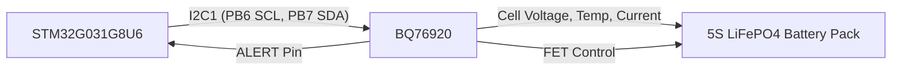

# BQ76920 Demo 程序实现计划 (STM32G031G8U6)

## 任务目标

在 STM32G031G8U6 微控制器上，使用 `bq76920` 驱动库实现一个 Demo 程序。该程序应能连接 BQ76920 芯片，将其配置为适用于 5 串磷酸铁锂电池的状态，并定时获取所有关键状态信息，包括电池电压、温度、电流和异常事件等。如果现有的 `bq76920` 驱动库功能不全，需要对其进行补全。

## 硬件连接方案

*   **MCU:** STM32G031G8U6
*   **BQ76920 I2C 地址:** 0x08 (7-bit)
*   **I2C 外设:** I2C1
*   **SCL 引脚:** PB6
*   **SDA 引脚:** PB7

## 执行计划步骤

1.  **项目依赖配置:**
    *   确认主项目 (`ups120`) 的 [`Cargo.toml`](Cargo.toml) 文件中已正确配置对本地 `bq76920` crate 的依赖，并启用 `bq76920` feature。根据实际使用的 STM32G0xx HAL 库和异步运行时 (如 Embassy)，添加或调整相应的依赖和 features。

2.  **评估 `bq76920` 驱动库功能:**
    *   阅读 [`bq76920/src/lib.rs`](bq76920/src/lib.rs) 和 [`bq76920/src/registers.rs`](bq76920/src/registers.rs) 文件，评估当前驱动库是否已实现任务所需的核心功能，包括：
        *   基于 `embedded-hal` 或 `embedded-hal-async` 的 I2C 通信读写方法。
        *   BQ76920 寄存器的定义和访问（特别是 [`SYS_STAT`](bq76920.pdf:2595), [`SYS_CTRL1`](bq76920.pdf:2607), [`SYS_CTRL2`](bq76920.pdf:2825), PROTECT 寄存器）。
        *   读取电池单元电压、总电压、温度、库仑计数器原始值的方法。
        *   将原始 ADC 值转换为物理单位（V, °C, A）的函数，需要考虑 ADC GAIN 和 OFFSET。
        *   配置 PROTECT 寄存器（OV/UV/OCD/SCD 阈值和延迟）的方法。
        *   清除 [`SYS_STAT`](bq76920.pdf:2595) 寄存器中故障标志的方法。

3.  **补全驱动库功能 (如果需要):**
    *   根据步骤 2 的评估结果，如果在 [`bq76920/src/lib.rs`](bq76920/src/lib.rs) 或 [`bq76920/src/registers.rs`](bq76920/src/registers.rs) 中发现缺失实现任务所需的功能，则需要补全代码。重点关注：
        *   确保所有必要的寄存器（特别是状态、控制和保护寄存器）在 [`bq76920/src/registers.rs`](bq76920/src/registers.rs) 中有准确的定义。
        *   在 [`bq76920/src/lib.rs`](bq76920/src/lib.rs) 中实现读取所有电池单元电压的便捷函数。
        *   实现读取所有状态寄存器（如 [`SYS_STAT`](bq76920.pdf:2595), [`CELLBAL1`](bq76920.pdf:2768), [`CELLBAL2`](bq76920.pdf:2777), [`CELLBAL3`](bq76920.pdf:2785) 等）并解析故障标志的函数。
        *   实现配置 PROTECT 寄存器以设置适合 5 串磷酸铁锂的 OV/UV/OCD/SCD 阈值和延迟的函数。这些阈值需要根据 5 串磷酸铁锂电池的特性（例如，单节标称 3.2V，充电限制 3.6V，放电限制 2.5V）来计算寄存器值。
        *   实现清除 [`SYS_STAT`](bq76920.pdf:2595) 寄存器中故障标志的函数。
        *   仔细核对 [`bq76920.pdf`](bq76920.pdf) 数据手册中关于 ADC 转换、寄存器位定义和保护阈值计算的部分，确保驱动中的实现准确无误。

4.  **实现 Demo 程序 (`src/main.rs`):**
    *   在 [`src/main.rs`](src/main.rs) 文件中，编写以下逻辑：
        *   初始化 STM32G031G8U6 的时钟系统。
        *   配置 PB6 和 PB7 引脚为 I2C1 功能（需要查阅 STM32G031G8U6 参考手册确定正确的 GPIO 配置）。
        *   初始化 I2C1 外设，设置合适的时钟频率（BQ76920 支持标准模式 100 kHz 和快速模式 400 kHz）。
        *   创建 `bq76920` 驱动库的主结构体实例，传入初始化好的 I2C 外设句柄和芯片 I2C 地址 (0x08)。
        *   执行 BQ76920 的初始化序列：
            *   如果芯片处于 SHIP 模式，可能需要通过 TS1 引脚或其他方式唤醒（这通常是硬件设计的一部分，驱动库主要负责发送进入 SHIP 模式的命令）。假设芯片处于 NORMAL 模式或已通过外部硬件唤醒。
            *   向 [`SYS_CTRL1`](bq76920.pdf:2607) 寄存器写入值，启用所需的 ADC 通道（例如，启用所有电池电压、内部温度、外部温度和库仑计数器）。
            *   向 [`SYS_CTRL2`](bq76920.pdf:2825) 寄存器写入值，配置为 5 串模式，并根据需要配置其他系统控制位（如使能充电/放电 FET 控制）。
            *   调用驱动函数配置 PROTECT 寄存器，设置适合 5 串磷酸铁锂的 OV/UV/OCD/SCD 阈值和延迟。
            *   调用驱动函数清除 [`SYS_STAT`](bq76920.pdf:2595) 寄存器中的所有初始故障标志。
        *   进入一个无限循环（或使用异步运行时创建定时任务），定时（例如每秒）执行以下操作：
            *   调用驱动函数读取所有电池单元电压，并打印或记录。
            *   调用驱动函数读取总电池组电压，并打印或记录。
            *   调用驱动函数读取内部和外部温度，并打印或记录。
            *   调用驱动函数读取库仑计数器原始值，并转换为电流值，打印或记录。
            *   调用驱动函数读取 [`SYS_STAT`](bq76920.pdf:2595) 寄存器，解析并打印或记录当前状态和故障标志。
            *   根据读取到的状态信息，判断是否有过压、欠压、过流、短路、温度异常等事件发生。
            *   如果检测到故障标志，调用驱动函数清除 [`SYS_STAT`](bq76920.pdf:2595) 寄存器中的相应标志，以便下次循环可以检测新的故障。
            *   加入适当的延时，实现定时读取。
        *   在整个程序中加入错误处理逻辑，例如在 I2C 通信失败或驱动函数返回错误时进行处理和日志输出。

## 系统架构图



## 驱动程序内部结构 (参考 [`BQ769x0_Driver_Plan.md`](bq76920/BQ769x0_Driver_Plan.md))

```mermaid
C4Container
    title BQ769x0 驱动程序容器图
    System_Boundary(driver_boundary, "BQ769x0 驱动程序") {
        Container(i2c_abstraction, "I2C 抽象模块", "处理与芯片的底层 I2C 通信，支持同步/异步。")
        Container(register_definitions, "寄存器定义模块", "定义芯片寄存器和位字段的枚举和常量。")
        Container(data_structures, "数据结构模块", "定义芯片配置、状态和测量结果的结构体。")
        Container(features_module, "功能模块", "实现芯片功能的高级函数（测量、保护、控制等）。")
        Container(conversion_module, "转换模块", "处理原始 ADC 值与物理单位之间的转换。")
        Container(error_handling, "错误处理模块", "定义自定义错误类型。")
    }
    System(mcu, "主控微控制器", "运行驱动程序的嵌入式系统")
    System(bq769x0, "BQ769x0 芯片", "电池监控 AFE")
    Rel(mcu, features_module, "调用函数")
    Rel(features_module, i2c_abstraction, "使用进行通信")
    Rel(features_module, register_definitions, "使用寄存器地址和位掩码")
    Rel(features_module, data_structures, "使用/返回数据结构")
    Rel(features_module, conversion_module, "使用进行数据转换")
    Rel(features_module, error_handling, "返回自定义错误")
    Rel(i2c_abstraction, bq769x0, "通过 I2C 通信")
    Rel(conversion_module, register_definitions, "使用寄存器信息进行转换")