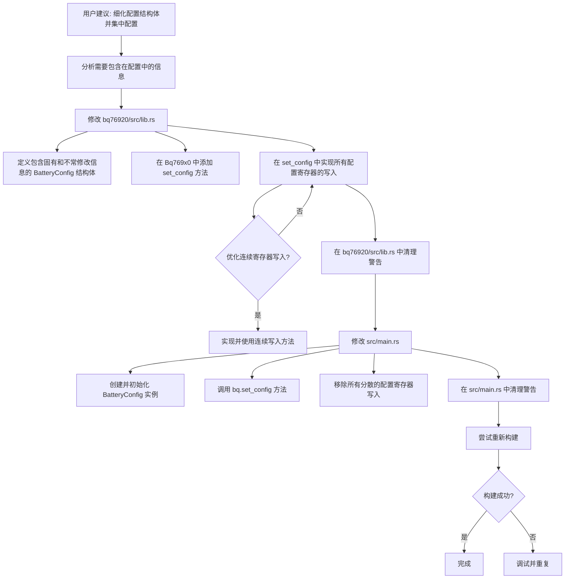

# BQ76920 配置重构计划

## 目标

将 BQ76920 驱动库的配置逻辑进行重构，创建一个集中的配置结构体和方法，以便在应用代码中更清晰、更方便地设置电池组参数，同时封装底层寄存器操作。解决 `cargo build` 产生的 `E0599` 错误以及相关的警告。

## 当前问题

1.  `src/main.rs` 中直接调用了 `bq.write_register` 方法，这暴露了底层寄存器操作，不符合良好的软件设计原则。
2.  编译器报错 `E0599`，提示找不到 `write_register` 方法，原因是 `RegisterAccess` trait 未在 `src/main.rs` 中导入。
3.  存在未使用的导入和变量警告。

## 计划步骤

1.  **修改 `bq76920/src/lib.rs` 文件：**
    *   **创建 `BatteryConfig` 结构体：** 定义一个公共结构体 `BatteryConfig`，包含电池组的固有信息和不经常修改的配置参数。初步确定包含以下字段：
        *   `sys_ctrl1_val: u8`
        *   `sys_ctrl2_val: u8`
        *   `ov_trip_8bit: u8`
        *   `uv_trip_8bit: u8`
        *   `protect1_rsense: u8`
        *   `protect1_scd_delay: u8`
        *   `protect1_scd_threshold: u8`
        *   `protect2_ocd_delay: u8`
        *   `protect2_ocd_threshold: u8`
        *   `protect3_uv_delay: u8`
        *   `protect3_ov_delay: u8`
        *   `cc_cfg_val: u8`
    *   **添加 `set_config` 方法：** 在 `Bq769x0` 结构体的通用实现块中，添加一个公共异步方法 `pub async fn set_config(&mut self, config: &BatteryConfig) -> Result<(), Error<E>>`。
    *   **在 `set_config` 方法中实现配置逻辑：** 在 `set_config` 方法内部，使用 `config` 结构体中的值，调用底层的 `write_register` 或 `write_registers` 方法来配置相应的寄存器。
    *   **优化连续寄存器写入：** 检查需要配置的寄存器地址是否连续。如果存在连续的寄存器需要配置（例如 SYS_CTRL1 和 SYS_CTRL2），考虑在 `RegisterAccess` trait 中添加或使用一个连续写入的方法，并在 `set_config` 方法中调用以提高效率。
    *   清理 `bq76920/src/lib.rs` 中未使用的导入和变量警告。
2.  **修改 `src/main.rs` 文件：**
    *   **创建 `BatteryConfig` 实例：** 在 `main` 函数中，创建一个 `BatteryConfig` 结构体的实例，并使用适当的值初始化。
    *   **调用 `set_config` 方法：** 在初始化序列中，调用 `bq.set_config(&config)` 方法来应用配置。
    *   移除所有分散的配置寄存器写入调用（包括 SYS_CTRL1, SYS_CTRL2, PROTECT1, PROTECT2, PROTECT3, OV_TRIP, UV_TRIP, CC_CFG 的写入）。
    *   清理 `src/main.rs` 中未使用的导入和变量警告。
3.  **重新构建项目**，确认错误和警告已解决。

## 流程图

## 实施

在您确认此计划后，我将切换到 Code 模式来执行上述步骤。