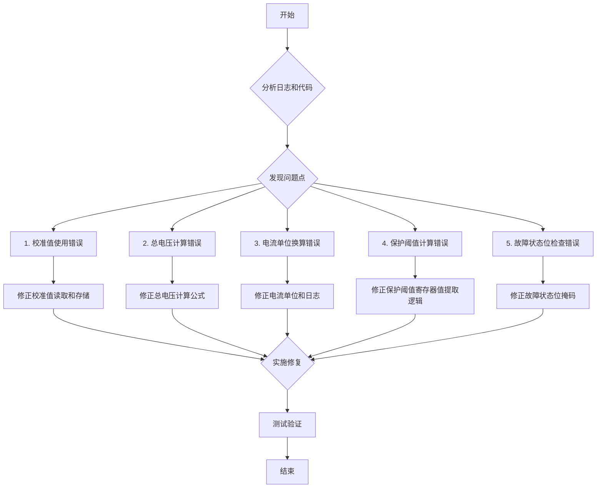

# BQ76920 电压读数修正计划

本文档详细说明了修正 `src/bq76920.rs` 中 BQ76920 电池电压读数不准确问题的计划。问题主要源于校准值处理不当和电压计算公式与数据手册不符。

## 问题分析

根据日志 `Cell Voltages (mV): [3394, 25076, 3419, 24771, 3419]` 和对 `src/bq76920.rs` 的代码分析，发现以下关键问题：

1.  **校准值使用错误：** `read_and_print_data` 函数使用了 `init` 函数中未正确初始化的 `adc_gain` 和 `adc_offset` 值。正确的校准值虽在 `read_basic_info` 中计算，但未被存储和使用。
2.  **总电压计算错误：** `read_and_print_data` 中计算总电压的公式与数据手册（第 21 页，公式 9）不符。
3.  **电流单位换算可能错误：** `read_and_print_data` 中电流计算结果单位与日志标签 (mA) 可能不符。
4.  **保护阈值计算错误：** `configure_protections` 函数中计算 OV/UV 寄存器值时，依赖了错误的校准值，且提取 ADC 值的方式与数据手册（第 22 页和第 34 页）描述不符。
5.  **故障状态位检查错误：** `read_and_print_data` 中检查 `SYS_STAT` 寄存器故障位的位掩码与数据手册（第 30 页）不符。

## 修复步骤

1.  **修正校准值处理 (`init` 或新函数):**
    *   正确读取 `ADCGAIN1` (0x50), `ADCOFFSET` (0x51), 和 `ADCGAIN2` (0x59)。
    *   根据数据手册公式计算 `adc_gain` (μV/LSB) 和 `adc_offset` (mV):
        *   `adc_gain_raw = ((adc_gain_reg1 & 0b00011000) >> 3) | ((adc_gain_reg2 & 0b11100000) >> 5);`
        *   `self.adc_gain = 365 + adc_gain_raw as u16;`
        *   `self.adc_offset = adc_offset_reg as i8 as i16;`
    *   将正确的值存储到 `Bq76920` 结构体的 `adc_gain` 和 `adc_offset` 成员。
    *   调整或移除 `read_basic_info` 中的重复逻辑。

2.  **修正电压转换公式 (`read_and_print_data`):**
    *   确保使用结构体中存储的**正确**校准值。
    *   确认单节电压转换公式 `(raw_val as i32 * self.adc_gain as i32 / 1000) + self.adc_offset as i32;` (单位 mV) 与数据手册 `V(cell) = GAIN x ADC(cell) + OFFSET` 逻辑一致。

3.  **修正总电压计算公式 (`read_and_print_data`):**
    *   修改总电压计算以符合数据手册 `V(BAT) = 4 × GAIN × ADC(BAT) + (#Cells x OFFSET)`。
    *   新计算: `let total_voltage_mv = 4 * self.adc_gain as i32 * total_voltage_raw_val as i32 / 1000 + 5 * self.adc_offset as i32;` (结果单位 mV)。

4.  **修正电流单位 (`read_and_print_data`):**
    *   检查电流计算结果单位。如果为 μA，修改日志信息为 `info!("Current (uA): {}", current_ua);` 并调整变量名。

5.  **修正保护阈值计算 (`configure_protections`):**
    *   确保计算前 `self.adc_gain` 和 `self.adc_offset` 已正确初始化。
    *   修正提取 OV/UV 寄存器值的逻辑，提取 ADC 值的**中间 8 位**:
        *   OV (`10-OV_T<7:0>-1000`): `ov_trip_reg = ((ov_adc_val >> 4) & 0xFF) as u8;`
        *   UV (`01-UV_T<7:0>-0000`): `uv_trip_reg = ((uv_adc_val >> 4) & 0xFF) as u8;`

6.  **修正故障状态位检查 (`read_and_print_data`):**
    *   根据数据手册（第 30 页）修正检查 `SYS_STAT` 寄存器故障位的位掩码：
        *   OCD: `(1 << 0)`
        *   SCD: `(1 << 1)`
        *   OV: `(1 << 2)`
        *   UV: `(1 << 3)`
        *   OVRD_ALERT: `(1 << 4)`
        *   DEVICE_XREADY: `(1 << 5)`
        *   CC_READY: `(1 << 7)`

## 后续步骤

1.  将此计划写入 `doc/bq76920_fix_plan.md` 文件。
2.  切换到 Code 模式，根据此计划修改 `src/bq76920.rs` 文件。
3.  编译、烧录并测试修改后的代码，验证电压读数是否正确。