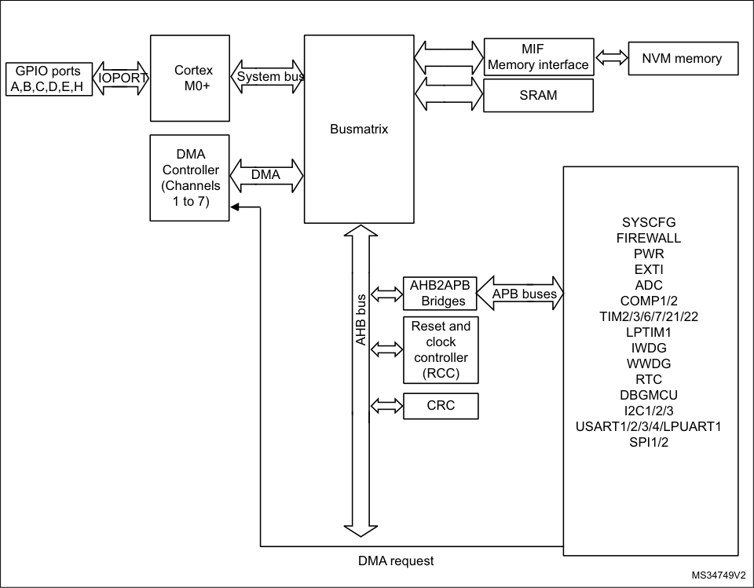

# RM0377 STM32L0x1 — Pages 1–50

# **RM0377** **Reference manual**
##### Ultra-low-power STM32L0x1 advanced Arm [®] -based 32-bit MCUs

###### **Introduction**

This reference manual targets application developers. It provides complete information on
how to use the STM32L0x1 microcontroller memory and peripherals.

The STM32L0x1 is a line of microcontrollers with different memory sizes, packages and
peripherals.

For ordering information, mechanical and electrical device characteristics please refer to the
corresponding datasheets.

For information on the Arm [®] Cortex [®] -M0+ core, refer to the _Cortex_ _[®]_ -M0+ _Technical_
_Reference Manual_ .

The STM32L0x1 microcontrollers include state-of-the-art patented technology.

###### **Related documents**

      - Cortex [®] -M0+ Technical Reference Manual, available from www.arm.com.

      - STM32L0 Series Cortex [®] -M0+ programming manual (PM0223).

      - STM32L0x1 datasheets.

      - STM32L0x1 erratasheet.

February 2022 RM0377 Rev 10 1/905

_[www.st.com](http://www.st.com)_

1

--- end of page=0 ---

**Contents** **RM0377**

### **Contents**

**1** **Documentation conventions . . . . . . . . . . . . . . . . . . . . . . . . . . . . . . . . . 45**

1.1 General information . . . . . . . . . . . . . . . . . . . . . . . . . . . . . . . . . . . . . . . . . 45

1.2 List of abbreviations for registers . . . . . . . . . . . . . . . . . . . . . . . . . . . . . . . 45

1.3 Glossary . . . . . . . . . . . . . . . . . . . . . . . . . . . . . . . . . . . . . . . . . . . . . . . . . . 46

1.4 Availability of peripherals . . . . . . . . . . . . . . . . . . . . . . . . . . . . . . . . . . . . . 46

1.5 Product category definition . . . . . . . . . . . . . . . . . . . . . . . . . . . . . . . . . . . . 46

**2** **System and memory overview . . . . . . . . . . . . . . . . . . . . . . . . . . . . . . . . 49**

2.1 System architecture . . . . . . . . . . . . . . . . . . . . . . . . . . . . . . . . . . . . . . . . . 49

2.1.1 S0: Cortex®-bus . . . . . . . . . . . . . . . . . . . . . . . . . . . . . . . . . . . . . . . . . . 50

2.1.2 S1: DMA-bus . . . . . . . . . . . . . . . . . . . . . . . . . . . . . . . . . . . . . . . . . . . . . 50

2.1.3 BusMatrix . . . . . . . . . . . . . . . . . . . . . . . . . . . . . . . . . . . . . . . . . . . . . . . . 50

AHB/APB bridges . . . . . . . . . . . . . . . . . . . . . . . . . . . . . . . . . . . . . . . . . . . . . . . . .50

2.2 Memory organization . . . . . . . . . . . . . . . . . . . . . . . . . . . . . . . . . . . . . . . . 51

2.2.1 Introduction . . . . . . . . . . . . . . . . . . . . . . . . . . . . . . . . . . . . . . . . . . . . . . 51

2.2.2 Memory map and register boundary addresses . . . . . . . . . . . . . . . . . . 52

2.3 Embedded SRAM . . . . . . . . . . . . . . . . . . . . . . . . . . . . . . . . . . . . . . . . . . . 56

2.4 Boot configuration . . . . . . . . . . . . . . . . . . . . . . . . . . . . . . . . . . . . . . . . . . 56

BOOT0/GPIO pin sharing (category 1 devices only) . . . . . . . . . . . . . . . . . . . . . .57

Empty check (category 1 devices only) . . . . . . . . . . . . . . . . . . . . . . . . . . . . . . . .57

Bank swapping (category 5 devices only) . . . . . . . . . . . . . . . . . . . . . . . . . . . . . .58

Physical remap . . . . . . . . . . . . . . . . . . . . . . . . . . . . . . . . . . . . . . . . . . . . . . . . . . .58

Embedded bootloader . . . . . . . . . . . . . . . . . . . . . . . . . . . . . . . . . . . . . . . . . . . . .58

**3** **Flash program memory and data EEPROM (FLASH) . . . . . . . . . . . . . . 59**

3.1 Introduction . . . . . . . . . . . . . . . . . . . . . . . . . . . . . . . . . . . . . . . . . . . . . . . 59

3.2 NVM main features . . . . . . . . . . . . . . . . . . . . . . . . . . . . . . . . . . . . . . . . . . 59

3.3 NVM functional description . . . . . . . . . . . . . . . . . . . . . . . . . . . . . . . . . . . . 60

3.3.1 NVM organization . . . . . . . . . . . . . . . . . . . . . . . . . . . . . . . . . . . . . . . . . 60

3.3.2 Dual-bank boot capability . . . . . . . . . . . . . . . . . . . . . . . . . . . . . . . . . . . 65

3.3.3 Reading the NVM . . . . . . . . . . . . . . . . . . . . . . . . . . . . . . . . . . . . . . . . . 66

Protocol to read . . . . . . . . . . . . . . . . . . . . . . . . . . . . . . . . . . . . . . . . . . . . . . . . . .66

Relation between CPU frequency/Operation mode/NVM read time. . . . . . . . . . .67

Data buffering . . . . . . . . . . . . . . . . . . . . . . . . . . . . . . . . . . . . . . . . . . . . . . . . . . . .69

2/905 RM0377 Rev 10

--- end of page=1 ---

**RM0377** **Contents**

3.3.4 Writing/erasing the NVM . . . . . . . . . . . . . . . . . . . . . . . . . . . . . . . . . . . . 75

Write/erase protocol . . . . . . . . . . . . . . . . . . . . . . . . . . . . . . . . . . . . . . . . . . . . . . .75

Unlocking/locking operations . . . . . . . . . . . . . . . . . . . . . . . . . . . . . . . . . . . . . . . .76

Detailed description of NVM write/erase operations. . . . . . . . . . . . . . . . . . . . . . .79

Parallel write half-page Flash program memory. . . . . . . . . . . . . . . . . . . . . . . . . .85

Status register . . . . . . . . . . . . . . . . . . . . . . . . . . . . . . . . . . . . . . . . . . . . . . . . . . .89

3.4 Memory protection . . . . . . . . . . . . . . . . . . . . . . . . . . . . . . . . . . . . . . . . . . 90

3.4.1 RDP (Read Out Protection) . . . . . . . . . . . . . . . . . . . . . . . . . . . . . . . . . . 91

3.4.2 PcROP (Proprietary Code Read-Out Protection) . . . . . . . . . . . . . . . . . . 92

3.4.3 Protections against unwanted write/erase operations . . . . . . . . . . . . . . 94

3.4.4 Write/erase protection management . . . . . . . . . . . . . . . . . . . . . . . . . . . 95

3.4.5 Protection errors . . . . . . . . . . . . . . . . . . . . . . . . . . . . . . . . . . . . . . . . . . 96

Write protection error flag (WRPERR) . . . . . . . . . . . . . . . . . . . . . . . . . . . . . . . . .96

Read error (RDERR) . . . . . . . . . . . . . . . . . . . . . . . . . . . . . . . . . . . . . . . . . . . . . .96

3.5 NVM interrupts . . . . . . . . . . . . . . . . . . . . . . . . . . . . . . . . . . . . . . . . . . . . . 96

3.5.1 Hard fault . . . . . . . . . . . . . . . . . . . . . . . . . . . . . . . . . . . . . . . . . . . . . . . . 97

3.6 Memory interface management . . . . . . . . . . . . . . . . . . . . . . . . . . . . . . . . 97

3.6.1 Operation priority and evolution . . . . . . . . . . . . . . . . . . . . . . . . . . . . . . . 97

Read . . . . . . . . . . . . . . . . . . . . . . . . . . . . . . . . . . . . . . . . . . . . . . . . . . . . . . . . . . .97

Write/erase . . . . . . . . . . . . . . . . . . . . . . . . . . . . . . . . . . . . . . . . . . . . . . . . . . . . . .97

Option byte loading. . . . . . . . . . . . . . . . . . . . . . . . . . . . . . . . . . . . . . . . . . . . . . . .98

3.6.2 Sequence of operations . . . . . . . . . . . . . . . . . . . . . . . . . . . . . . . . . . . . . 98

Read as data while write . . . . . . . . . . . . . . . . . . . . . . . . . . . . . . . . . . . . . . . . . . .98

Fetch while write. . . . . . . . . . . . . . . . . . . . . . . . . . . . . . . . . . . . . . . . . . . . . . . . . .98

Write while another write operation is ongoing. . . . . . . . . . . . . . . . . . . . . . . . . . .99

3.6.3 Change the number of wait states while reading . . . . . . . . . . . . . . . . . . 99

3.6.4 Power-down . . . . . . . . . . . . . . . . . . . . . . . . . . . . . . . . . . . . . . . . . . . . . . 99

3.7 Flash register description . . . . . . . . . . . . . . . . . . . . . . . . . . . . . . . . . . . . 100

Read registers . . . . . . . . . . . . . . . . . . . . . . . . . . . . . . . . . . . . . . . . . . . . . . . . . .100

Write to registers . . . . . . . . . . . . . . . . . . . . . . . . . . . . . . . . . . . . . . . . . . . . . . . .100

3.7.1 Access control register (FLASH_ACR) . . . . . . . . . . . . . . . . . . . . . . . . 101

3.7.2 Program and erase control register (FLASH_PECR) . . . . . . . . . . . . . 102

3.7.3 Power-down key register (FLASH_PDKEYR) . . . . . . . . . . . . . . . . . . . 106

3.7.4 PECR unlock key register (FLASH_PEKEYR) . . . . . . . . . . . . . . . . . . 106

3.7.5 Program and erase key register (FLASH_PRGKEYR) . . . . . . . . . . . . 106

3.7.6 Option bytes unlock key register (FLASH_OPTKEYR) . . . . . . . . . . . . 107

3.7.7 Status register (FLASH_SR) . . . . . . . . . . . . . . . . . . . . . . . . . . . . . . . . 108

3.7.8 Option bytes register (FLASH_OPTR) . . . . . . . . . . . . . . . . . . . . . . . . . 110

RM0377 Rev 10 3/905

34

--- end of page=2 ---

**Contents** **RM0377**

3.7.9 Write protection register 1 (FLASH_WRPROT1) . . . . . . . . . . . . . . . . . 112

3.7.10 Write protection register 2 (FLASH_WRPROT2) . . . . . . . . . . . . . . . . . 113

3.7.11 Flash register map . . . . . . . . . . . . . . . . . . . . . . . . . . . . . . . . . . . . . . . . 114

3.8 Option bytes . . . . . . . . . . . . . . . . . . . . . . . . . . . . . . . . . . . . . . . . . . . . . . .115

3.8.1 Option bytes description . . . . . . . . . . . . . . . . . . . . . . . . . . . . . . . . . . . 115

3.8.2 Mismatch when loading protection flags . . . . . . . . . . . . . . . . . . . . . . . 116

3.8.3 Reloading Option bytes by software . . . . . . . . . . . . . . . . . . . . . . . . . . 116

**4** **Cyclic redundancy check calculation unit (CRC) . . . . . . . . . . . . . . . . 117**

4.1 Introduction . . . . . . . . . . . . . . . . . . . . . . . . . . . . . . . . . . . . . . . . . . . . . . .117

4.2 CRC main features . . . . . . . . . . . . . . . . . . . . . . . . . . . . . . . . . . . . . . . . . .117

4.3 CRC functional description . . . . . . . . . . . . . . . . . . . . . . . . . . . . . . . . . . . .118

4.3.1 CRC block diagram . . . . . . . . . . . . . . . . . . . . . . . . . . . . . . . . . . . . . . . 118

4.3.2 CRC internal signals . . . . . . . . . . . . . . . . . . . . . . . . . . . . . . . . . . . . . . 118

4.3.3 CRC operation . . . . . . . . . . . . . . . . . . . . . . . . . . . . . . . . . . . . . . . . . . . 118

Polynomial programmability . . . . . . . . . . . . . . . . . . . . . . . . . . . . . . . . . . . . . . . .119

4.4 CRC registers . . . . . . . . . . . . . . . . . . . . . . . . . . . . . . . . . . . . . . . . . . . . . 120

4.4.1 CRC data register (CRC_DR) . . . . . . . . . . . . . . . . . . . . . . . . . . . . . . . 120

4.4.2 CRC independent data register (CRC_IDR) . . . . . . . . . . . . . . . . . . . . 120

4.4.3 CRC control register (CRC_CR) . . . . . . . . . . . . . . . . . . . . . . . . . . . . . 121

4.4.4 CRC initial value (CRC_INIT) . . . . . . . . . . . . . . . . . . . . . . . . . . . . . . . 122

4.4.5 CRC polynomial (CRC_POL) . . . . . . . . . . . . . . . . . . . . . . . . . . . . . . . 122

4.4.6 CRC register map . . . . . . . . . . . . . . . . . . . . . . . . . . . . . . . . . . . . . . . . 123

**5** **Firewall (FW) . . . . . . . . . . . . . . . . . . . . . . . . . . . . . . . . . . . . . . . . . . . . . 124**

5.1 Introduction . . . . . . . . . . . . . . . . . . . . . . . . . . . . . . . . . . . . . . . . . . . . . . 124

5.2 Firewall main features . . . . . . . . . . . . . . . . . . . . . . . . . . . . . . . . . . . . . . 124

5.3 Firewall functional description . . . . . . . . . . . . . . . . . . . . . . . . . . . . . . . . 125

5.3.1 Firewall AMBA bus snoop . . . . . . . . . . . . . . . . . . . . . . . . . . . . . . . . . . 125

5.3.2 Functional requirements . . . . . . . . . . . . . . . . . . . . . . . . . . . . . . . . . . . 125

Debug consideration. . . . . . . . . . . . . . . . . . . . . . . . . . . . . . . . . . . . . . . . . . . . . .125

Write protection . . . . . . . . . . . . . . . . . . . . . . . . . . . . . . . . . . . . . . . . . . . . . . . . .126

Interrupts management . . . . . . . . . . . . . . . . . . . . . . . . . . . . . . . . . . . . . . . . . . .126

5.3.3 Firewall segments . . . . . . . . . . . . . . . . . . . . . . . . . . . . . . . . . . . . . . . . 126

Code segment . . . . . . . . . . . . . . . . . . . . . . . . . . . . . . . . . . . . . . . . . . . . . . . . . .126

Non-volatile data segment . . . . . . . . . . . . . . . . . . . . . . . . . . . . . . . . . . . . . . . . .126

Volatile data segment . . . . . . . . . . . . . . . . . . . . . . . . . . . . . . . . . . . . . . . . . . . . .127

4/905 RM0377 Rev 10

--- end of page=3 ---

**RM0377** **Contents**

5.3.4 Segment accesses and properties . . . . . . . . . . . . . . . . . . . . . . . . . . . 127

Segment access depending on the Firewall state . . . . . . . . . . . . . . . . . . . . . . .127

Segments properties . . . . . . . . . . . . . . . . . . . . . . . . . . . . . . . . . . . . . . . . . . . . .128

5.3.5 Firewall initialization . . . . . . . . . . . . . . . . . . . . . . . . . . . . . . . . . . . . . . . 128

5.3.6 Firewall states . . . . . . . . . . . . . . . . . . . . . . . . . . . . . . . . . . . . . . . . . . . 129

Opening the Firewall. . . . . . . . . . . . . . . . . . . . . . . . . . . . . . . . . . . . . . . . . . . . . .130

Closing the Firewall . . . . . . . . . . . . . . . . . . . . . . . . . . . . . . . . . . . . . . . . . . . . . .130

5.4 Firewall registers . . . . . . . . . . . . . . . . . . . . . . . . . . . . . . . . . . . . . . . . . . 131

5.4.1 Code segment start address (FW_CSSA) . . . . . . . . . . . . . . . . . . . . . . 131

5.4.2 Code segment length (FW_CSL) . . . . . . . . . . . . . . . . . . . . . . . . . . . . . 131

5.4.3 Non-volatile data segment start address (FW_NVDSSA) . . . . . . . . . . 132

5.4.4 Non-volatile data segment length (FW_NVDSL) . . . . . . . . . . . . . . . . . 132

5.4.5 Volatile data segment start address (FW_VDSSA) . . . . . . . . . . . . . . . 133

5.4.6 Volatile data segment length (FW_VDSL) . . . . . . . . . . . . . . . . . . . . . . 133

5.4.7 Configuration register (FW_CR) . . . . . . . . . . . . . . . . . . . . . . . . . . . . . 134

5.4.8 Firewall register map . . . . . . . . . . . . . . . . . . . . . . . . . . . . . . . . . . . . . . 135

**6** **Power control (PWR) . . . . . . . . . . . . . . . . . . . . . . . . . . . . . . . . . . . . . . . 136**

6.1 Power supplies . . . . . . . . . . . . . . . . . . . . . . . . . . . . . . . . . . . . . . . . . . . . 136

6.1.1 Independent A/D converter supply and reference voltage . . . . . . . . . . 137

On packages with V **REF+** pin. . . . . . . . . . . . . . . . . . . . . . . . . . . . . . . . . . . . . . .137

On packages without V **REF+** pin . . . . . . . . . . . . . . . . . . . . . . . . . . . . . . . . . . . .137

6.1.2 RTC and RTC backup registers . . . . . . . . . . . . . . . . . . . . . . . . . . . . . . 138

RTC registers access . . . . . . . . . . . . . . . . . . . . . . . . . . . . . . . . . . . . . . . . . . . . .138

6.1.3 Voltage regulator . . . . . . . . . . . . . . . . . . . . . . . . . . . . . . . . . . . . . . . . . 138

6.1.4 Dynamic voltage scaling management . . . . . . . . . . . . . . . . . . . . . . . . 138

Range 1 . . . . . . . . . . . . . . . . . . . . . . . . . . . . . . . . . . . . . . . . . . . . . . . . . . . . . . .139

Range 2 and 3 . . . . . . . . . . . . . . . . . . . . . . . . . . . . . . . . . . . . . . . . . . . . . . . . . .139

6.1.5 Dynamic voltage scaling configuration . . . . . . . . . . . . . . . . . . . . . . . . 140

6.1.6 Voltage regulator and clock management when VDD drops
below 1.71 V . . . . . . . . . . . . . . . . . . . . . . . . . . . . . . . . . . . . . . . . . . . . 140

6.1.7 Voltage regulator and clock management when modifying the
VCORE range . . . . . . . . . . . . . . . . . . . . . . . . . . . . . . . . . . . . . . . . . . . 141

6.1.8 Voltage range and limitations when VDD ranges from 1.71 V to 2.0 V 141

6.2 Power supply supervisor . . . . . . . . . . . . . . . . . . . . . . . . . . . . . . . . . . . . 142

6.2.1 Power-on reset (POR)/power-down reset (PDR) . . . . . . . . . . . . . . . . . 144

6.2.2 Brown out reset (BOR) . . . . . . . . . . . . . . . . . . . . . . . . . . . . . . . . . . . . 144

6.2.3 Programmable voltage detector (PVD) . . . . . . . . . . . . . . . . . . . . . . . . 145

RM0377 Rev 10 5/905

34

--- end of page=4 ---

**Contents** **RM0377**

6.2.4 Internal voltage reference (VREFINT) . . . . . . . . . . . . . . . . . . . . . . . . . 146

6.3 Low-power modes . . . . . . . . . . . . . . . . . . . . . . . . . . . . . . . . . . . . . . . . . 147

6.3.1 Behavior of clocks in low-power modes . . . . . . . . . . . . . . . . . . . . . . . . 148

Sleep and Low-power sleep modes . . . . . . . . . . . . . . . . . . . . . . . . . . . . . . . . . .148

Stop and Standby modes . . . . . . . . . . . . . . . . . . . . . . . . . . . . . . . . . . . . . . . . . .148

6.3.2 Slowing down system clocks . . . . . . . . . . . . . . . . . . . . . . . . . . . . . . . . 149

6.3.3 Peripheral clock gating . . . . . . . . . . . . . . . . . . . . . . . . . . . . . . . . . . . . 149

6.3.4 Low-power run mode (LP run) . . . . . . . . . . . . . . . . . . . . . . . . . . . . . . . 149

Entering Low-power run mode . . . . . . . . . . . . . . . . . . . . . . . . . . . . . . . . . . . . . .149

Exiting Low-power run mode . . . . . . . . . . . . . . . . . . . . . . . . . . . . . . . . . . . . . . .150

6.3.5 Entering low-power mode . . . . . . . . . . . . . . . . . . . . . . . . . . . . . . . . . . 150

6.3.6 Exiting low-power mode . . . . . . . . . . . . . . . . . . . . . . . . . . . . . . . . . . . . 150

6.3.7 Sleep mode . . . . . . . . . . . . . . . . . . . . . . . . . . . . . . . . . . . . . . . . . . . . . 151

I/O states in Sleep mode . . . . . . . . . . . . . . . . . . . . . . . . . . . . . . . . . . . . . . . . . .151

Entering Sleep mode . . . . . . . . . . . . . . . . . . . . . . . . . . . . . . . . . . . . . . . . . . . . .151

Exiting Sleep mode. . . . . . . . . . . . . . . . . . . . . . . . . . . . . . . . . . . . . . . . . . . . . . .151

6.3.8 Low-power sleep mode (LP sleep) . . . . . . . . . . . . . . . . . . . . . . . . . . . 152

I/O states in Low-power sleep mode . . . . . . . . . . . . . . . . . . . . . . . . . . . . . . . . .152

Entering Low-power sleep mode . . . . . . . . . . . . . . . . . . . . . . . . . . . . . . . . . . . .152

Exiting Low-power sleep mode. . . . . . . . . . . . . . . . . . . . . . . . . . . . . . . . . . . . . .153

6.3.9 Stop mode . . . . . . . . . . . . . . . . . . . . . . . . . . . . . . . . . . . . . . . . . . . . . . 154

I/O states in Low-power sleep mode . . . . . . . . . . . . . . . . . . . . . . . . . . . . . . . . .154

Entering Stop mode . . . . . . . . . . . . . . . . . . . . . . . . . . . . . . . . . . . . . . . . . . . . . .154

Exiting Stop mode . . . . . . . . . . . . . . . . . . . . . . . . . . . . . . . . . . . . . . . . . . . . . . .155

6.3.10 Standby mode . . . . . . . . . . . . . . . . . . . . . . . . . . . . . . . . . . . . . . . . . . . 157

I/O states in Standby mode . . . . . . . . . . . . . . . . . . . . . . . . . . . . . . . . . . . . . . . .157

Entering Standby mode . . . . . . . . . . . . . . . . . . . . . . . . . . . . . . . . . . . . . . . . . . .157

Exiting Standby mode. . . . . . . . . . . . . . . . . . . . . . . . . . . . . . . . . . . . . . . . . . . . .157

Debug mode . . . . . . . . . . . . . . . . . . . . . . . . . . . . . . . . . . . . . . . . . . . . . . . . . . . .158

6.3.11 Waking up the device from Stop and Standby modes using the RTC
and comparators . . . . . . . . . . . . . . . . . . . . . . . . . . . . . . . . . . . . . . . . . 158

RTC auto-wakeup (AWU) from the Stop mode . . . . . . . . . . . . . . . . . . . . . . . . .159

RTC auto-wakeup (AWU) from the Standby mode. . . . . . . . . . . . . . . . . . . . . . .159

Comparator auto-wakeup (AWU) from the Stop mode. . . . . . . . . . . . . . . . . . . .160

6.4 Power control registers . . . . . . . . . . . . . . . . . . . . . . . . . . . . . . . . . . . . . . 161

6.4.1 PWR power control register (PWR_CR) . . . . . . . . . . . . . . . . . . . . . . . 161

6.4.2 PWR power control/status register (PWR_CSR) . . . . . . . . . . . . . . . . . 164

6.4.3 PWR register map . . . . . . . . . . . . . . . . . . . . . . . . . . . . . . . . . . . . . . . . 166

**7** **Reset and clock control (RCC) . . . . . . . . . . . . . . . . . . . . . . . . . . . . . . . 167**

6/905 RM0377 Rev 10

--- end of page=5 ---

**RM0377** **Contents**

7.1 Reset . . . . . . . . . . . . . . . . . . . . . . . . . . . . . . . . . . . . . . . . . . . . . . . . . . . 167

7.1.1 System reset . . . . . . . . . . . . . . . . . . . . . . . . . . . . . . . . . . . . . . . . . . . . 167

Software reset . . . . . . . . . . . . . . . . . . . . . . . . . . . . . . . . . . . . . . . . . . . . . . . . . .167

Low-power management reset . . . . . . . . . . . . . . . . . . . . . . . . . . . . . . . . . . . . . .167

Option byte loader reset . . . . . . . . . . . . . . . . . . . . . . . . . . . . . . . . . . . . . . . . . . .167

7.1.2 Power reset . . . . . . . . . . . . . . . . . . . . . . . . . . . . . . . . . . . . . . . . . . . . . 168

7.1.3 RTC and backup registers reset . . . . . . . . . . . . . . . . . . . . . . . . . . . . . 168

7.2 Clocks . . . . . . . . . . . . . . . . . . . . . . . . . . . . . . . . . . . . . . . . . . . . . . . . . . . 169

7.2.1 HSE clock . . . . . . . . . . . . . . . . . . . . . . . . . . . . . . . . . . . . . . . . . . . . . . 172

External source (HSE bypass) . . . . . . . . . . . . . . . . . . . . . . . . . . . . . . . . . . . . . .173

External crystal/ceramic resonator (HSE crystal) . . . . . . . . . . . . . . . . . . . . . . . .173

7.2.2 HSI16 clock . . . . . . . . . . . . . . . . . . . . . . . . . . . . . . . . . . . . . . . . . . . . . 174

Calibration . . . . . . . . . . . . . . . . . . . . . . . . . . . . . . . . . . . . . . . . . . . . . . . . . . . . .174

7.2.3 MSI clock . . . . . . . . . . . . . . . . . . . . . . . . . . . . . . . . . . . . . . . . . . . . . . . 174

Calibration . . . . . . . . . . . . . . . . . . . . . . . . . . . . . . . . . . . . . . . . . . . . . . . . . . . . .175

7.2.4 PLL . . . . . . . . . . . . . . . . . . . . . . . . . . . . . . . . . . . . . . . . . . . . . . . . . . . . 175

7.2.5 LSE clock . . . . . . . . . . . . . . . . . . . . . . . . . . . . . . . . . . . . . . . . . . . . . . . 176

External source (LSE bypass) . . . . . . . . . . . . . . . . . . . . . . . . . . . . . . . . . . . . . .176

7.2.6 LSI clock . . . . . . . . . . . . . . . . . . . . . . . . . . . . . . . . . . . . . . . . . . . . . . . 176

LSI measurement . . . . . . . . . . . . . . . . . . . . . . . . . . . . . . . . . . . . . . . . . . . . . . . .176

7.2.7 System clock (SYSCLK) selection . . . . . . . . . . . . . . . . . . . . . . . . . . . . 177

7.2.8 System clock source frequency versus voltage range . . . . . . . . . . . . . 177

7.2.9 HSE clock security system (CSS) . . . . . . . . . . . . . . . . . . . . . . . . . . . . 177

7.2.10 LSE Clock Security System . . . . . . . . . . . . . . . . . . . . . . . . . . . . . . . . . 178

7.2.11 RTC clock . . . . . . . . . . . . . . . . . . . . . . . . . . . . . . . . . . . . . . . . . . . . . . 178

7.2.12 Watchdog clock . . . . . . . . . . . . . . . . . . . . . . . . . . . . . . . . . . . . . . . . . . 179

7.2.13 Clock-out capability . . . . . . . . . . . . . . . . . . . . . . . . . . . . . . . . . . . . . . . 179

7.2.14 Internal/external clock measurement using TIM21 . . . . . . . . . . . . . . . 179

7.2.15 Clock-independent system clock sources for TIM2/TIM21/TIM22 . . . . 180

7.3 RCC registers . . . . . . . . . . . . . . . . . . . . . . . . . . . . . . . . . . . . . . . . . . . . . 181

7.3.1 Clock control register (RCC_CR) . . . . . . . . . . . . . . . . . . . . . . . . . . . . . 181

7.3.2 Internal clock sources calibration register (RCC_ICSCR) . . . . . . . . . . 184

7.3.3 Clock configuration register (RCC_CFGR) . . . . . . . . . . . . . . . . . . . . . 185

7.3.4 Clock interrupt enable register (RCC_CIER) . . . . . . . . . . . . . . . . . . . . 187

7.3.5 Clock interrupt flag register (RCC_CIFR) . . . . . . . . . . . . . . . . . . . . . . 189

7.3.6 Clock interrupt clear register (RCC_CICR) . . . . . . . . . . . . . . . . . . . . . 190

7.3.7 GPIO reset register (RCC_IOPRSTR) . . . . . . . . . . . . . . . . . . . . . . . . . 191

7.3.8 AHB peripheral reset register (RCC_AHBRSTR) . . . . . . . . . . . . . . . . 192

RM0377 Rev 10 7/905

34

--- end of page=6 ---

**Contents** **RM0377**

7.3.9 APB2 peripheral reset register (RCC_APB2RSTR) . . . . . . . . . . . . . . 193

7.3.10 APB1 peripheral reset register (RCC_APB1RSTR) . . . . . . . . . . . . . . 194

7.3.11 GPIO clock enable register (RCC_IOPENR) . . . . . . . . . . . . . . . . . . . . 196

7.3.12 AHB peripheral clock enable register (RCC_AHBENR) . . . . . . . . . . . 198

7.3.13 APB2 peripheral clock enable register (RCC_APB2ENR) . . . . . . . . . . 199

7.3.14 APB1 peripheral clock enable register (RCC_APB1ENR) . . . . . . . . . . 201

7.3.15 GPIO clock enable in Sleep mode register (RCC_IOPSMENR) . . . . . 203

7.3.16 AHB peripheral clock enable in Sleep mode
register (RCC_AHBSMENR) . . . . . . . . . . . . . . . . . . . . . . . . . . . . . . . . 204

7.3.17 APB2 peripheral clock enable in Sleep mode
register (RCC_APB2SMENR) . . . . . . . . . . . . . . . . . . . . . . . . . . . . . . . 205

7.3.18 APB1 peripheral clock enable in Sleep mode
register (RCC_APB1SMENR) . . . . . . . . . . . . . . . . . . . . . . . . . . . . . . . 206

7.3.19 Clock configuration register (RCC_CCIPR) . . . . . . . . . . . . . . . . . . . . . 208

7.3.20 Control/status register (RCC_CSR) . . . . . . . . . . . . . . . . . . . . . . . . . . . 209

7.3.21 RCC register map . . . . . . . . . . . . . . . . . . . . . . . . . . . . . . . . . . . . . . . . 213

**8** **General-purpose I/Os (GPIO) . . . . . . . . . . . . . . . . . . . . . . . . . . . . . . . . 216**

8.1 Introduction . . . . . . . . . . . . . . . . . . . . . . . . . . . . . . . . . . . . . . . . . . . . . . 216

8.2 GPIO main features . . . . . . . . . . . . . . . . . . . . . . . . . . . . . . . . . . . . . . . . 216

8.3 GPIO functional description . . . . . . . . . . . . . . . . . . . . . . . . . . . . . . . . . . 216

8.3.1 General-purpose I/O (GPIO) . . . . . . . . . . . . . . . . . . . . . . . . . . . . . . . . 218

8.3.2 I/O pin alternate function multiplexer and mapping . . . . . . . . . . . . . . . 219

8.3.3 I/O port control registers . . . . . . . . . . . . . . . . . . . . . . . . . . . . . . . . . . . 220

8.3.4 I/O port data registers . . . . . . . . . . . . . . . . . . . . . . . . . . . . . . . . . . . . . 220

8.3.5 I/O data bitwise handling . . . . . . . . . . . . . . . . . . . . . . . . . . . . . . . . . . . 220

8.3.6 GPIO locking mechanism . . . . . . . . . . . . . . . . . . . . . . . . . . . . . . . . . . 220

8.3.7 I/O alternate function input/output . . . . . . . . . . . . . . . . . . . . . . . . . . . . 221

8.3.8 External interrupt/wakeup lines . . . . . . . . . . . . . . . . . . . . . . . . . . . . . . 221

8.3.9 Input configuration . . . . . . . . . . . . . . . . . . . . . . . . . . . . . . . . . . . . . . . . 221

8.3.10 Output configuration . . . . . . . . . . . . . . . . . . . . . . . . . . . . . . . . . . . . . . 222

8.3.11 Alternate function configuration . . . . . . . . . . . . . . . . . . . . . . . . . . . . . . 223

8.3.12 Analog configuration . . . . . . . . . . . . . . . . . . . . . . . . . . . . . . . . . . . . . . 224

8.3.13 Using the HSE or LSE oscillator pins as GPIOs . . . . . . . . . . . . . . . . . 224

8.3.14 Using the GPIO pins in the RTC supply domain . . . . . . . . . . . . . . . . . 224

8.3.15 BOOT0/GPIO pin sharing . . . . . . . . . . . . . . . . . . . . . . . . . . . . . . . . . . 225

8.4 GPIO registers . . . . . . . . . . . . . . . . . . . . . . . . . . . . . . . . . . . . . . . . . . . . 225

8/905 RM0377 Rev 10

--- end of page=7 ---

**RM0377** **Contents**

8.4.1 GPIO port mode register (GPIOx_MODER)
(x =A to E and H) . . . . . . . . . . . . . . . . . . . . . . . . . . . . . . . . . . . . . . . . . 225

8.4.2 GPIO port output type register (GPIOx_OTYPER)
(x = A to E and H) . . . . . . . . . . . . . . . . . . . . . . . . . . . . . . . . . . . . . . . . . 225

8.4.3 GPIO port output speed register (GPIOx_OSPEEDR)
(x = A to E and H) . . . . . . . . . . . . . . . . . . . . . . . . . . . . . . . . . . . . . . . . . 226

8.4.4 GPIO port pull-up/pull-down register (GPIOx_PUPDR)
(x = A to E and H) . . . . . . . . . . . . . . . . . . . . . . . . . . . . . . . . . . . . . . . . . 226

8.4.5 GPIO port input data register (GPIOx_IDR)
(x = A to E and H) . . . . . . . . . . . . . . . . . . . . . . . . . . . . . . . . . . . . . . . . . 227

8.4.6 GPIO port output data register (GPIOx_ODR)
(x = A to E and H) . . . . . . . . . . . . . . . . . . . . . . . . . . . . . . . . . . . . . . . . . 227

8.4.7 GPIO port bit set/reset register (GPIOx_BSRR)
(x = A to E and H) . . . . . . . . . . . . . . . . . . . . . . . . . . . . . . . . . . . . . . . . . 228

8.4.8 GPIO port configuration lock register (GPIOx_LCKR)
(x = A to E and H) . . . . . . . . . . . . . . . . . . . . . . . . . . . . . . . . . . . . . . . . . 228

8.4.9 GPIO alternate function low register (GPIOx_AFRL)
(x = A to E and H) . . . . . . . . . . . . . . . . . . . . . . . . . . . . . . . . . . . . . . . . . 229

8.4.10 GPIO alternate function high register (GPIOx_AFRH)
(x = A to E and H) . . . . . . . . . . . . . . . . . . . . . . . . . . . . . . . . . . . . . . . . . 230

8.4.11 GPIO port bit reset register (GPIOx_BRR) (x = A to E and H) . . . . . . . 230

8.4.12 GPIO register map . . . . . . . . . . . . . . . . . . . . . . . . . . . . . . . . . . . . . . . . 231

**9** **System configuration controller (SYSCFG) . . . . . . . . . . . . . . . . . . . . 233**

9.1 Introduction . . . . . . . . . . . . . . . . . . . . . . . . . . . . . . . . . . . . . . . . . . . . . . 233

9.2 SYSCFG registers . . . . . . . . . . . . . . . . . . . . . . . . . . . . . . . . . . . . . . . . . 234

9.2.1 SYSCFG memory remap register (SYSCFG_CFGR1) . . . . . . . . . . . . 234

9.2.2 SYSCFG peripheral mode configuration register (SYSCFG_CFGR2) 235

9.2.3 Reference control and status register (SYSCFG_CFGR3) . . . . . . . . . 236

9.2.4 SYSCFG external interrupt configuration register 1
(SYSCFG_EXTICR1) . . . . . . . . . . . . . . . . . . . . . . . . . . . . . . . . . . . . . 237

9.2.5 SYSCFG external interrupt configuration register 2
(SYSCFG_EXTICR2) . . . . . . . . . . . . . . . . . . . . . . . . . . . . . . . . . . . . . 238

9.2.6 SYSCFG external interrupt configuration register 3
(SYSCFG_EXTICR3) . . . . . . . . . . . . . . . . . . . . . . . . . . . . . . . . . . . . . 238

9.2.7 SYSCFG external interrupt configuration register 4
(SYSCFG_EXTICR4) . . . . . . . . . . . . . . . . . . . . . . . . . . . . . . . . . . . . . 239

9.2.8 SYSCFG register map . . . . . . . . . . . . . . . . . . . . . . . . . . . . . . . . . . . . . 239

**10** **Direct memory access controller (DMA) . . . . . . . . . . . . . . . . . . . . . . . 241**

10.1 Introduction . . . . . . . . . . . . . . . . . . . . . . . . . . . . . . . . . . . . . . . . . . . . . . 241

RM0377 Rev 10 9/905

34

--- end of page=8 ---

**Contents** **RM0377**

10.2 DMA main features . . . . . . . . . . . . . . . . . . . . . . . . . . . . . . . . . . . . . . . . . 241

10.3 DMA implementation . . . . . . . . . . . . . . . . . . . . . . . . . . . . . . . . . . . . . . . 242

10.3.1 DMA . . . . . . . . . . . . . . . . . . . . . . . . . . . . . . . . . . . . . . . . . . . . . . . . . . . 242

10.3.2 DMA request mapping . . . . . . . . . . . . . . . . . . . . . . . . . . . . . . . . . . . . . 242

DMA controller . . . . . . . . . . . . . . . . . . . . . . . . . . . . . . . . . . . . . . . . . . . . . . . . . .242

10.4 DMA functional description . . . . . . . . . . . . . . . . . . . . . . . . . . . . . . . . . . . 244

10.4.1 DMA block diagram . . . . . . . . . . . . . . . . . . . . . . . . . . . . . . . . . . . . . . . 244

10.4.2 DMA transfers . . . . . . . . . . . . . . . . . . . . . . . . . . . . . . . . . . . . . . . . . . . 245

10.4.3 DMA arbitration . . . . . . . . . . . . . . . . . . . . . . . . . . . . . . . . . . . . . . . . . . 246

10.4.4 DMA channels . . . . . . . . . . . . . . . . . . . . . . . . . . . . . . . . . . . . . . . . . . . 247

Programmable data sizes. . . . . . . . . . . . . . . . . . . . . . . . . . . . . . . . . . . . . . . . . .247

Pointer incrementation . . . . . . . . . . . . . . . . . . . . . . . . . . . . . . . . . . . . . . . . . . . .247

Channel configuration procedure . . . . . . . . . . . . . . . . . . . . . . . . . . . . . . . . . . . .248

Channel state and disabling a channel. . . . . . . . . . . . . . . . . . . . . . . . . . . . . . . .248

Circular mode (in memory-to-peripheral/peripheral-to-memory transfers) . . . . .249

Memory-to-memory mode . . . . . . . . . . . . . . . . . . . . . . . . . . . . . . . . . . . . . . . . .249

Peripheral-to-peripheral mode . . . . . . . . . . . . . . . . . . . . . . . . . . . . . . . . . . . . . .250

Programming transfer direction, assigning source/destination. . . . . . . . . . . . . .250

10.4.5 DMA data width, alignment and endianness . . . . . . . . . . . . . . . . . . . . 250

Addressing AHB peripherals not supporting byte/half-word write transfers . . . .251

10.4.6 DMA error management . . . . . . . . . . . . . . . . . . . . . . . . . . . . . . . . . . . 252

10.5 DMA interrupts . . . . . . . . . . . . . . . . . . . . . . . . . . . . . . . . . . . . . . . . . . . . 252

10.6 DMA registers . . . . . . . . . . . . . . . . . . . . . . . . . . . . . . . . . . . . . . . . . . . . . 252

10.6.1 DMA interrupt status register (DMA_ISR) . . . . . . . . . . . . . . . . . . . . . . 253

10.6.2 DMA interrupt flag clear register (DMA_IFCR) . . . . . . . . . . . . . . . . . . 255

10.6.3 DMA channel x configuration register (DMA_CCRx) . . . . . . . . . . . . . . 256

10.6.4 DMA channel x number of data to transfer register (DMA_CNDTRx) . 259

10.6.5 DMA channel x peripheral address register (DMA_CPARx) . . . . . . . . 260

10.6.6 DMA channel x memory address register (DMA_CMARx) . . . . . . . . . 260

10.6.7 DMA channel selection register (DMA_CSELR) . . . . . . . . . . . . . . . . . 262

10.6.8 DMA register map . . . . . . . . . . . . . . . . . . . . . . . . . . . . . . . . . . . . . . . . 262

**11** **Nested vectored interrupt controller (NVIC) . . . . . . . . . . . . . . . . . . . . 265**

11.1 Main features . . . . . . . . . . . . . . . . . . . . . . . . . . . . . . . . . . . . . . . . . . . . . 265

11.2 SysTick calibration value register . . . . . . . . . . . . . . . . . . . . . . . . . . . . . . 265

11.3 Interrupt and exception vectors . . . . . . . . . . . . . . . . . . . . . . . . . . . . . . . 265

**12** **Extended interrupt and event controller (EXTI) . . . . . . . . . . . . . . . . . 268**

10/905 RM0377 Rev 10

--- end of page=9 ---

**RM0377** **Contents**

12.1 Introduction . . . . . . . . . . . . . . . . . . . . . . . . . . . . . . . . . . . . . . . . . . . . . . 268

12.2 EXTI main features . . . . . . . . . . . . . . . . . . . . . . . . . . . . . . . . . . . . . . . . . 268

12.3 EXTI functional description . . . . . . . . . . . . . . . . . . . . . . . . . . . . . . . . . . . 268

12.3.1 EXTI block diagram . . . . . . . . . . . . . . . . . . . . . . . . . . . . . . . . . . . . . . . 269

12.3.2 Wakeup event management . . . . . . . . . . . . . . . . . . . . . . . . . . . . . . . . 269

12.3.3 Peripherals asynchronous interrupts . . . . . . . . . . . . . . . . . . . . . . . . . . 270

12.3.4 Hardware interrupt selection . . . . . . . . . . . . . . . . . . . . . . . . . . . . . . . . 270

12.3.5 Hardware event selection . . . . . . . . . . . . . . . . . . . . . . . . . . . . . . . . . . 270

12.3.6 Software interrupt/event selection . . . . . . . . . . . . . . . . . . . . . . . . . . . . 270

12.4 EXTI interrupt/event line mapping . . . . . . . . . . . . . . . . . . . . . . . . . . . . . 271

12.5 EXTI registers . . . . . . . . . . . . . . . . . . . . . . . . . . . . . . . . . . . . . . . . . . . . . 273

12.5.1 EXTI interrupt mask register (EXTI_IMR) . . . . . . . . . . . . . . . . . . . . . . 273

12.5.2 EXTI event mask register (EXTI_EMR) . . . . . . . . . . . . . . . . . . . . . . . . 273

12.5.3 EXTI rising edge trigger selection register (EXTI_RTSR) . . . . . . . . . . 274

12.5.4 Falling edge trigger selection register (EXTI_FTSR) . . . . . . . . . . . . . . 275

12.5.5 EXTI software interrupt event register (EXTI_SWIER) . . . . . . . . . . . . 275

12.5.6 EXTI pending register (EXTI_PR) . . . . . . . . . . . . . . . . . . . . . . . . . . . . 276

12.5.7 EXTI register map . . . . . . . . . . . . . . . . . . . . . . . . . . . . . . . . . . . . . . . . 277

**13** **Analog-to-digital converter (ADC) . . . . . . . . . . . . . . . . . . . . . . . . . . . . 278**

13.1 Introduction . . . . . . . . . . . . . . . . . . . . . . . . . . . . . . . . . . . . . . . . . . . . . . 278

13.2 ADC main features . . . . . . . . . . . . . . . . . . . . . . . . . . . . . . . . . . . . . . . . . 279

13.3 ADC functional description . . . . . . . . . . . . . . . . . . . . . . . . . . . . . . . . . . . 280

13.3.1 ADC pins and internal signals . . . . . . . . . . . . . . . . . . . . . . . . . . . . . . . 280

13.3.2 ADC voltage regulator (ADVREGEN) . . . . . . . . . . . . . . . . . . . . . . . . . 281

Analog reference for the ADC internal voltage regulator . . . . . . . . . . . . . . . . . .281

ADVREG enable sequence . . . . . . . . . . . . . . . . . . . . . . . . . . . . . . . . . . . . . . . .282

ADVREG disable sequence . . . . . . . . . . . . . . . . . . . . . . . . . . . . . . . . . . . . . . . .282

13.3.3 Calibration (ADCAL) . . . . . . . . . . . . . . . . . . . . . . . . . . . . . . . . . . . . . . 282

Calibration factor forcing software procedure. . . . . . . . . . . . . . . . . . . . . . . . . . .284

13.3.4 ADC on-off control (ADEN, ADDIS, ADRDY) . . . . . . . . . . . . . . . . . . . . 284

13.3.5 ADC clock (CKMODE, PRESC[3:0], LFMEN) . . . . . . . . . . . . . . . . . . . 285

Low frequency . . . . . . . . . . . . . . . . . . . . . . . . . . . . . . . . . . . . . . . . . . . . . . . . . .286

13.3.6 ADC connectivity . . . . . . . . . . . . . . . . . . . . . . . . . . . . . . . . . . . . . . . . . 287

13.3.7 Configuring the ADC . . . . . . . . . . . . . . . . . . . . . . . . . . . . . . . . . . . . . . 288

13.3.8 Channel selection (CHSEL, SCANDIR) . . . . . . . . . . . . . . . . . . . . . . . . 288

Temperature sensor, V REFINT internal channels . . . . . . . . . . . . . . . . . . . . . . . .288

RM0377 Rev 10 11/905

34

--- end of page=10 ---

**Contents** **RM0377**

13.3.9 Programmable sampling time (SMP) . . . . . . . . . . . . . . . . . . . . . . . . . . 289

13.3.10 Single conversion mode (CONT = 0) . . . . . . . . . . . . . . . . . . . . . . . . . . 289

13.3.11 Continuous conversion mode (CONT = 1) . . . . . . . . . . . . . . . . . . . . . . 290

13.3.12 Starting conversions (ADSTART) . . . . . . . . . . . . . . . . . . . . . . . . . . . . 290

13.3.13 Timings . . . . . . . . . . . . . . . . . . . . . . . . . . . . . . . . . . . . . . . . . . . . . . . . 291

13.3.14 Stopping an ongoing conversion (ADSTP) . . . . . . . . . . . . . . . . . . . . . 292

13.4 Conversion on external trigger and trigger polarity (EXTSEL, EXTEN) . 292

13.4.1 Discontinuous mode (DISCEN) . . . . . . . . . . . . . . . . . . . . . . . . . . . . . . 293

13.4.2 Programmable resolution (RES) - Fast conversion mode . . . . . . . . . . 293

13.4.3 End of conversion, end of sampling phase (EOC, EOSMP flags) . . . . 294

13.4.4 End of conversion sequence (EOS flag) . . . . . . . . . . . . . . . . . . . . . . . 294

13.4.5 Example timing diagrams (single/continuous modes
hardware/software triggers) . . . . . . . . . . . . . . . . . . . . . . . . . . . . . . . . . 295

13.5 Data management . . . . . . . . . . . . . . . . . . . . . . . . . . . . . . . . . . . . . . . . . 297

13.5.1 Data register and data alignment (ADC_DR, ALIGN) . . . . . . . . . . . . . 297

13.5.2 ADC overrun (OVR, OVRMOD) . . . . . . . . . . . . . . . . . . . . . . . . . . . . . . 297

13.5.3 Managing a sequence of data converted without using the DMA . . . . 298

13.5.4 Managing converted data without using the DMA without overrun . . . 298

13.5.5 Managing converted data using the DMA . . . . . . . . . . . . . . . . . . . . . . 298

DMA one shot mode (DMACFG = 0) . . . . . . . . . . . . . . . . . . . . . . . . . . . . . . . . .299

DMA circular mode (DMACFG = 1) . . . . . . . . . . . . . . . . . . . . . . . . . . . . . . . . . .299

13.6 Low-power features . . . . . . . . . . . . . . . . . . . . . . . . . . . . . . . . . . . . . . . . 300

13.6.1 Wait mode conversion . . . . . . . . . . . . . . . . . . . . . . . . . . . . . . . . . . . . . 300

13.6.2 Auto-off mode (AUTOFF) . . . . . . . . . . . . . . . . . . . . . . . . . . . . . . . . . . . 301

13.7 Analog window watchdog (AWDEN, AWDSGL, AWDCH,
ADC_TR) . . . . . . . . . . . . . . . . . . . . . . . . . . . . . . . . . . . . . . . . . . . . . . . . 302

13.7.1 Description of the analog watchdog . . . . . . . . . . . . . . . . . . . . . . . . . . . 302

13.7.2 ADC_AWD1_OUT output signal generation . . . . . . . . . . . . . . . . . . . . 303

13.7.3 Analog watchdog threshold control . . . . . . . . . . . . . . . . . . . . . . . . . . . 305

13.8 Oversampler . . . . . . . . . . . . . . . . . . . . . . . . . . . . . . . . . . . . . . . . . . . . . . 306

13.8.1 ADC operating modes supported when oversampling . . . . . . . . . . . . 308

13.8.2 Analog watchdog . . . . . . . . . . . . . . . . . . . . . . . . . . . . . . . . . . . . . . . . . 308

13.8.3 Triggered mode . . . . . . . . . . . . . . . . . . . . . . . . . . . . . . . . . . . . . . . . . . 308

13.9 Temperature sensor and internal reference voltage . . . . . . . . . . . . . . . . 309

Main features . . . . . . . . . . . . . . . . . . . . . . . . . . . . . . . . . . . . . . . . . . . . . . . . . . .310

Reading the temperature . . . . . . . . . . . . . . . . . . . . . . . . . . . . . . . . . . . . . . . . . .310

Calculating the actual V DDA voltage using the internal reference voltage . . . . .311

Converting a supply-relative ADC measurement to an absolute voltage value .311

12/905 RM0377 Rev 10

--- end of page=11 ---

**RM0377** **Contents**

13.10 ADC interrupts . . . . . . . . . . . . . . . . . . . . . . . . . . . . . . . . . . . . . . . . . . . . 312

13.11 ADC registers . . . . . . . . . . . . . . . . . . . . . . . . . . . . . . . . . . . . . . . . . . . . . 313

13.11.1 ADC interrupt and status register (ADC_ISR) . . . . . . . . . . . . . . . . . . . 313

13.11.2 ADC interrupt enable register (ADC_IER) . . . . . . . . . . . . . . . . . . . . . . 314

13.11.3 ADC control register (ADC_CR) . . . . . . . . . . . . . . . . . . . . . . . . . . . . . 316

13.11.4 ADC configuration register 1 (ADC_CFGR1) . . . . . . . . . . . . . . . . . . . 318

13.11.5 ADC configuration register 2 (ADC_CFGR2) . . . . . . . . . . . . . . . . . . . 322

13.11.6 ADC sampling time register (ADC_SMPR) . . . . . . . . . . . . . . . . . . . . . 323

13.11.7 ADC watchdog threshold register (ADC_TR) . . . . . . . . . . . . . . . . . . . 324

13.11.8 ADC channel selection register (ADC_CHSELR) . . . . . . . . . . . . . . . . 324

13.11.9 ADC data register (ADC_DR) . . . . . . . . . . . . . . . . . . . . . . . . . . . . . . . 325

13.11.10 ADC Calibration factor (ADC_CALFACT) . . . . . . . . . . . . . . . . . . . . . . 325

13.11.11 ADC common configuration register (ADC_CCR) . . . . . . . . . . . . . . . . 326

13.12 ADC register map . . . . . . . . . . . . . . . . . . . . . . . . . . . . . . . . . . . . . . . . . . 327

**14** **Comparator (COMP) . . . . . . . . . . . . . . . . . . . . . . . . . . . . . . . . . . . . . . . 329**

14.1 Introduction . . . . . . . . . . . . . . . . . . . . . . . . . . . . . . . . . . . . . . . . . . . . . . 329

14.2 COMP main features . . . . . . . . . . . . . . . . . . . . . . . . . . . . . . . . . . . . . . . 329

14.3 COMP functional description . . . . . . . . . . . . . . . . . . . . . . . . . . . . . . . . . 330

14.3.1 COMP block diagram . . . . . . . . . . . . . . . . . . . . . . . . . . . . . . . . . . . . . . 330

14.3.2 COMP pins and internal signals . . . . . . . . . . . . . . . . . . . . . . . . . . . . . 330

14.3.3 COMP reset and clocks . . . . . . . . . . . . . . . . . . . . . . . . . . . . . . . . . . . . 331

14.3.4 Comparator LOCK mechanism . . . . . . . . . . . . . . . . . . . . . . . . . . . . . . 331

14.3.5 Power mode . . . . . . . . . . . . . . . . . . . . . . . . . . . . . . . . . . . . . . . . . . . . . 331

14.4 COMP interrupts . . . . . . . . . . . . . . . . . . . . . . . . . . . . . . . . . . . . . . . . . . . 331

14.5 COMP registers . . . . . . . . . . . . . . . . . . . . . . . . . . . . . . . . . . . . . . . . . . . 331

14.5.1 Comparator 1 control and status register (COMP1_CSR) . . . . . . . . . . 331

14.5.2 Comparator 2 control and status register (COMP2_CSR) . . . . . . . . . . 333

14.5.3 COMP register map . . . . . . . . . . . . . . . . . . . . . . . . . . . . . . . . . . . . . . . 336

**15** **AES hardware accelerator (AES) . . . . . . . . . . . . . . . . . . . . . . . . . . . . . 337**

15.1 Introduction . . . . . . . . . . . . . . . . . . . . . . . . . . . . . . . . . . . . . . . . . . . . . . 337

15.2 AES main features . . . . . . . . . . . . . . . . . . . . . . . . . . . . . . . . . . . . . . . . . 337

15.3 AES implementation . . . . . . . . . . . . . . . . . . . . . . . . . . . . . . . . . . . . . . . . 338

15.4 AES functional description . . . . . . . . . . . . . . . . . . . . . . . . . . . . . . . . . . . 338

15.4.1 AES block diagram . . . . . . . . . . . . . . . . . . . . . . . . . . . . . . . . . . . . . . . 338

RM0377 Rev 10 13/905

34

--- end of page=12 ---

**Contents** **RM0377**

15.4.2 AES internal signals . . . . . . . . . . . . . . . . . . . . . . . . . . . . . . . . . . . . . . . 338

15.4.3 AES cryptographic core . . . . . . . . . . . . . . . . . . . . . . . . . . . . . . . . . . . . 339

Overview. . . . . . . . . . . . . . . . . . . . . . . . . . . . . . . . . . . . . . . . . . . . . . . . . . . . . . .339

Typical data processing . . . . . . . . . . . . . . . . . . . . . . . . . . . . . . . . . . . . . . . . . . .339

Chaining modes . . . . . . . . . . . . . . . . . . . . . . . . . . . . . . . . . . . . . . . . . . . . . . . . .339

Electronic codebook (ECB) mode . . . . . . . . . . . . . . . . . . . . . . . . . . . . . . . . . . .340

Cipher block chaining (CBC) mode . . . . . . . . . . . . . . . . . . . . . . . . . . . . . . . . . .341

Counter (CTR) mode . . . . . . . . . . . . . . . . . . . . . . . . . . . . . . . . . . . . . . . . . . . . .342

15.4.4 AES procedure to perform a cipher operation . . . . . . . . . . . . . . . . . . . 342

Introduction. . . . . . . . . . . . . . . . . . . . . . . . . . . . . . . . . . . . . . . . . . . . . . . . . . . . .342

Initialization of AES. . . . . . . . . . . . . . . . . . . . . . . . . . . . . . . . . . . . . . . . . . . . . . .343

Data append . . . . . . . . . . . . . . . . . . . . . . . . . . . . . . . . . . . . . . . . . . . . . . . . . . . .343

15.4.5 AES decryption key preparation . . . . . . . . . . . . . . . . . . . . . . . . . . . . . 345

15.4.6 AES ciphertext stealing and data padding . . . . . . . . . . . . . . . . . . . . . . 346

15.4.7 AES task suspend and resume . . . . . . . . . . . . . . . . . . . . . . . . . . . . . . 346

15.4.8 AES basic chaining modes (ECB, CBC) . . . . . . . . . . . . . . . . . . . . . . . 347

Overview. . . . . . . . . . . . . . . . . . . . . . . . . . . . . . . . . . . . . . . . . . . . . . . . . . . . . . .347

ECB/CBC encryption sequence . . . . . . . . . . . . . . . . . . . . . . . . . . . . . . . . . . . . .350

ECB/CBC decryption sequence . . . . . . . . . . . . . . . . . . . . . . . . . . . . . . . . . . . . .350

Suspend/resume operations in ECB/CBC modes . . . . . . . . . . . . . . . . . . . . . . .351

Alternative single ECB/CBC decryption using Mode 4 . . . . . . . . . . . . . . . . . . . .352

15.4.9 AES counter (CTR) mode . . . . . . . . . . . . . . . . . . . . . . . . . . . . . . . . . . 352

Overview. . . . . . . . . . . . . . . . . . . . . . . . . . . . . . . . . . . . . . . . . . . . . . . . . . . . . . .352

CTR encryption and decryption . . . . . . . . . . . . . . . . . . . . . . . . . . . . . . . . . . . . .353

Suspend/resume operations in CTR mode . . . . . . . . . . . . . . . . . . . . . . . . . . . .355

15.4.10 AES data registers and data swapping . . . . . . . . . . . . . . . . . . . . . . . . 355

Data input and output . . . . . . . . . . . . . . . . . . . . . . . . . . . . . . . . . . . . . . . . . . . . .355

Data swapping . . . . . . . . . . . . . . . . . . . . . . . . . . . . . . . . . . . . . . . . . . . . . . . . . .355

Data padding . . . . . . . . . . . . . . . . . . . . . . . . . . . . . . . . . . . . . . . . . . . . . . . . . . .357

15.4.11 AES key registers . . . . . . . . . . . . . . . . . . . . . . . . . . . . . . . . . . . . . . . . 357

15.4.12 AES initialization vector registers . . . . . . . . . . . . . . . . . . . . . . . . . . . . 357

15.4.13 AES DMA interface . . . . . . . . . . . . . . . . . . . . . . . . . . . . . . . . . . . . . . . 357

Data input using DMA. . . . . . . . . . . . . . . . . . . . . . . . . . . . . . . . . . . . . . . . . . . . .358

Data output using DMA . . . . . . . . . . . . . . . . . . . . . . . . . . . . . . . . . . . . . . . . . . .358

DMA operation in different operating modes . . . . . . . . . . . . . . . . . . . . . . . . . . .359

15.4.14 AES error management . . . . . . . . . . . . . . . . . . . . . . . . . . . . . . . . . . . . 360

Read error flag (RDERR) . . . . . . . . . . . . . . . . . . . . . . . . . . . . . . . . . . . . . . . . . .360

Write error flag (WDERR). . . . . . . . . . . . . . . . . . . . . . . . . . . . . . . . . . . . . . . . . .360

15.5 AES interrupts . . . . . . . . . . . . . . . . . . . . . . . . . . . . . . . . . . . . . . . . . . . . 360

15.6 AES processing latency . . . . . . . . . . . . . . . . . . . . . . . . . . . . . . . . . . . . . 361

14/905 RM0377 Rev 10

--- end of page=13 ---

**RM0377** **Contents**

15.7 AES registers . . . . . . . . . . . . . . . . . . . . . . . . . . . . . . . . . . . . . . . . . . . . . 362

15.7.1 AES control register (AES_CR) . . . . . . . . . . . . . . . . . . . . . . . . . . . . . . 362

15.7.2 AES status register (AES_SR) . . . . . . . . . . . . . . . . . . . . . . . . . . . . . . 364

15.7.3 AES data input register (AES_DINR) . . . . . . . . . . . . . . . . . . . . . . . . . 365

15.7.4 AES data output register (AES_DOUTR) . . . . . . . . . . . . . . . . . . . . . . 365

15.7.5 AES key register 0 (AES_KEYR0) . . . . . . . . . . . . . . . . . . . . . . . . . . . . 366

15.7.6 AES key register 1 (AES_KEYR1) . . . . . . . . . . . . . . . . . . . . . . . . . . . . 367

15.7.7 AES key register 2 (AES_KEYR2) . . . . . . . . . . . . . . . . . . . . . . . . . . . . 367

15.7.8 AES key register 3 (AES_KEYR3) . . . . . . . . . . . . . . . . . . . . . . . . . . . . 367

15.7.9 AES initialization vector register 0 (AES_IVR0) . . . . . . . . . . . . . . . . . . 368

15.7.10 AES initialization vector register 1 (AES_IVR1) . . . . . . . . . . . . . . . . . . 368

15.7.11 AES initialization vector register 2 (AES_IVR2) . . . . . . . . . . . . . . . . . . 369

15.7.12 AES initialization vector register 3 (AES_IVR3) . . . . . . . . . . . . . . . . . . 369

15.7.13 AES register map . . . . . . . . . . . . . . . . . . . . . . . . . . . . . . . . . . . . . . . . . 369

**16** **General-purpose timers (TIM2/TIM3) . . . . . . . . . . . . . . . . . . . . . . . . . . 371**

16.1 TIM2/TIM3 introduction . . . . . . . . . . . . . . . . . . . . . . . . . . . . . . . . . . . . . 371

16.2 TIM2/TIM3 main features . . . . . . . . . . . . . . . . . . . . . . . . . . . . . . . . . . . . 371

16.3 TIM2/TIM3 functional description . . . . . . . . . . . . . . . . . . . . . . . . . . . . . . 373

16.3.1 Time-base unit . . . . . . . . . . . . . . . . . . . . . . . . . . . . . . . . . . . . . . . . . . . 373

Prescaler description . . . . . . . . . . . . . . . . . . . . . . . . . . . . . . . . . . . . . . . . . . . . .373

16.3.2 Counter modes . . . . . . . . . . . . . . . . . . . . . . . . . . . . . . . . . . . . . . . . . . 375

Upcounting mode . . . . . . . . . . . . . . . . . . . . . . . . . . . . . . . . . . . . . . . . . . . . . . . .375

Downcounting mode. . . . . . . . . . . . . . . . . . . . . . . . . . . . . . . . . . . . . . . . . . . . . .378

Center-aligned mode (up/down counting) . . . . . . . . . . . . . . . . . . . . . . . . . . . . .381

16.3.3 Clock selection . . . . . . . . . . . . . . . . . . . . . . . . . . . . . . . . . . . . . . . . . . . 385

Internal clock source (CK_INT) . . . . . . . . . . . . . . . . . . . . . . . . . . . . . . . . . . . . .385

External clock source mode 1 . . . . . . . . . . . . . . . . . . . . . . . . . . . . . . . . . . . . . .386

External clock source mode 2 . . . . . . . . . . . . . . . . . . . . . . . . . . . . . . . . . . . . . .388

16.3.4 Capture/compare channels . . . . . . . . . . . . . . . . . . . . . . . . . . . . . . . . . 389

16.3.5 Input capture mode . . . . . . . . . . . . . . . . . . . . . . . . . . . . . . . . . . . . . . . 391

16.3.6 PWM input mode . . . . . . . . . . . . . . . . . . . . . . . . . . . . . . . . . . . . . . . . . 393

16.3.7 Forced output mode . . . . . . . . . . . . . . . . . . . . . . . . . . . . . . . . . . . . . . . 394

16.3.8 Output compare mode . . . . . . . . . . . . . . . . . . . . . . . . . . . . . . . . . . . . . 394

16.3.9 PWM mode . . . . . . . . . . . . . . . . . . . . . . . . . . . . . . . . . . . . . . . . . . . . . 395

PWM edge-aligned mode . . . . . . . . . . . . . . . . . . . . . . . . . . . . . . . . . . . . . . . . . .396

Downcounting configuration . . . . . . . . . . . . . . . . . . . . . . . . . . . . . . . . . . . . . . . .397

PWM center-aligned mode . . . . . . . . . . . . . . . . . . . . . . . . . . . . . . . . . . . . . . . . .397

RM0377 Rev 10 15/905

34

--- end of page=14 ---

**Contents** **RM0377**

16.3.10 One-pulse mode . . . . . . . . . . . . . . . . . . . . . . . . . . . . . . . . . . . . . . . . . 399

Particular case: OCx fast enable: . . . . . . . . . . . . . . . . . . . . . . . . . . . . . . . . . . . .400

16.3.11 Clearing the OCxREF signal on an external event . . . . . . . . . . . . . . . 400

16.3.12 Encoder interface mode . . . . . . . . . . . . . . . . . . . . . . . . . . . . . . . . . . . . 401

16.3.13 Timer input XOR function . . . . . . . . . . . . . . . . . . . . . . . . . . . . . . . . . . . 403

16.3.14 Timers and external trigger synchronization . . . . . . . . . . . . . . . . . . . . 404

Slave mode: Reset mode . . . . . . . . . . . . . . . . . . . . . . . . . . . . . . . . . . . . . . . . . .404

Slave mode: Gated mode. . . . . . . . . . . . . . . . . . . . . . . . . . . . . . . . . . . . . . . . . .405

Slave mode: Trigger mode . . . . . . . . . . . . . . . . . . . . . . . . . . . . . . . . . . . . . . . . .406

Slave mode: External Clock mode 2 + trigger mode . . . . . . . . . . . . . . . . . . . . .407

16.3.15 Timer synchronization . . . . . . . . . . . . . . . . . . . . . . . . . . . . . . . . . . . . . 408

Using one timer as prescaler for another timer . . . . . . . . . . . . . . . . . . . . . . . . .408

Using one timer to enable another timer . . . . . . . . . . . . . . . . . . . . . . . . . . . . . .409

Using one timer to start another timer . . . . . . . . . . . . . . . . . . . . . . . . . . . . . . . .411

Starting 2 timers synchronously in response to an external trigger . . . . . . . . . .413

16.3.16 Debug mode . . . . . . . . . . . . . . . . . . . . . . . . . . . . . . . . . . . . . . . . . . . . 414

16.4 TIM2/TIM3 registers . . . . . . . . . . . . . . . . . . . . . . . . . . . . . . . . . . . . . . . . 415

16.4.1 TIMx control register 1 (TIMx_CR1) . . . . . . . . . . . . . . . . . . . . . . . . . . 415

16.4.2 TIMx control register 2 (TIMx_CR2) . . . . . . . . . . . . . . . . . . . . . . . . . . 417

16.4.3 TIMx slave mode control register (TIMx_SMCR) . . . . . . . . . . . . . . . . . 418

16.4.4 TIMx DMA/Interrupt enable register (TIMx_DIER) . . . . . . . . . . . . . . . . 420

16.4.5 TIMx status register (TIMx_SR) . . . . . . . . . . . . . . . . . . . . . . . . . . . . . . 421

16.4.6 TIMx event generation register (TIMx_EGR) . . . . . . . . . . . . . . . . . . . . 423

16.4.7 TIMx capture/compare mode register 1 (TIMx_CCMR1) . . . . . . . . . . . 424

Output compare mode . . . . . . . . . . . . . . . . . . . . . . . . . . . . . . . . . . . . . . . . . . . .424

Input capture mode. . . . . . . . . . . . . . . . . . . . . . . . . . . . . . . . . . . . . . . . . . . . . . .425

16.4.8 TIMx capture/compare mode register 2 (TIMx_CCMR2) . . . . . . . . . . . 427

Output compare mode . . . . . . . . . . . . . . . . . . . . . . . . . . . . . . . . . . . . . . . . . . . .427

Input capture mode. . . . . . . . . . . . . . . . . . . . . . . . . . . . . . . . . . . . . . . . . . . . . . .428

16.4.9 TIMx capture/compare enable register (TIMx_CCER) . . . . . . . . . . . . 428

16.4.10 TIMx counter (TIMx_CNT) . . . . . . . . . . . . . . . . . . . . . . . . . . . . . . . . . . 430

16.4.11 TIMx prescaler (TIMx_PSC) . . . . . . . . . . . . . . . . . . . . . . . . . . . . . . . . 430

16.4.12 TIMx auto-reload register (TIMx_ARR) . . . . . . . . . . . . . . . . . . . . . . . . 430

16.4.13 TIMx capture/compare register 1 (TIMx_CCR1) . . . . . . . . . . . . . . . . . 431

16.4.14 TIMx capture/compare register 2 (TIMx_CCR2) . . . . . . . . . . . . . . . . . 431

16.4.15 TIMx capture/compare register 3 (TIMx_CCR3) . . . . . . . . . . . . . . . . . 432

16.4.16 TIMx capture/compare register 4 (TIMx_CCR4) . . . . . . . . . . . . . . . . . 432

16.4.17 TIMx DMA control register (TIMx_DCR) . . . . . . . . . . . . . . . . . . . . . . . 433

16/905 RM0377 Rev 10

--- end of page=15 ---

**RM0377** **Contents**

16.4.18 TIMx DMA address for full transfer (TIMx_DMAR) . . . . . . . . . . . . . . . 433

Example of how to use the DMA burst feature . . . . . . . . . . . . . . . . . . . . . . . . . .434

16.4.19 TIM2 option register (TIM2_OR) . . . . . . . . . . . . . . . . . . . . . . . . . . . . . 435

16.4.20 TIM3 option register (TIM3_OR) . . . . . . . . . . . . . . . . . . . . . . . . . . . . . 436

16.5 TIMx register map . . . . . . . . . . . . . . . . . . . . . . . . . . . . . . . . . . . . . . . . . 437

**17** **General-purpose timers (TIM21/22) . . . . . . . . . . . . . . . . . . . . . . . . . . . 439**

17.1 Introduction . . . . . . . . . . . . . . . . . . . . . . . . . . . . . . . . . . . . . . . . . . . . . . 439

17.2 TIM21/22 main features . . . . . . . . . . . . . . . . . . . . . . . . . . . . . . . . . . . . . 439

17.2.1 TIM21/22 main features . . . . . . . . . . . . . . . . . . . . . . . . . . . . . . . . . . . . 439

17.3 TIM21/22 functional description . . . . . . . . . . . . . . . . . . . . . . . . . . . . . . . 441

17.3.1 Timebase unit . . . . . . . . . . . . . . . . . . . . . . . . . . . . . . . . . . . . . . . . . . . 441

Prescaler description . . . . . . . . . . . . . . . . . . . . . . . . . . . . . . . . . . . . . . . . . . . . .441

17.3.2 Counter modes . . . . . . . . . . . . . . . . . . . . . . . . . . . . . . . . . . . . . . . . . . 443

Upcounting mode . . . . . . . . . . . . . . . . . . . . . . . . . . . . . . . . . . . . . . . . . . . . . . . .443

Downcounting mode. . . . . . . . . . . . . . . . . . . . . . . . . . . . . . . . . . . . . . . . . . . . . .447

Center-aligned mode (up/down counting) . . . . . . . . . . . . . . . . . . . . . . . . . . . . .450

17.3.3 Clock selection . . . . . . . . . . . . . . . . . . . . . . . . . . . . . . . . . . . . . . . . . . . 454

Internal clock source (CK_INT) . . . . . . . . . . . . . . . . . . . . . . . . . . . . . . . . . . . . .454

External clock source mode 2 . . . . . . . . . . . . . . . . . . . . . . . . . . . . . . . . . . . . . .456

17.3.4 Capture/compare channels . . . . . . . . . . . . . . . . . . . . . . . . . . . . . . . . . 457

17.3.5 Input capture mode . . . . . . . . . . . . . . . . . . . . . . . . . . . . . . . . . . . . . . . 459

17.3.6 PWM input mode . . . . . . . . . . . . . . . . . . . . . . . . . . . . . . . . . . . . . . . . . 461

17.3.7 Forced output mode . . . . . . . . . . . . . . . . . . . . . . . . . . . . . . . . . . . . . . . 462

17.3.8 Output compare mode . . . . . . . . . . . . . . . . . . . . . . . . . . . . . . . . . . . . . 462

17.3.9 PWM mode . . . . . . . . . . . . . . . . . . . . . . . . . . . . . . . . . . . . . . . . . . . . . 463

PWM center-aligned mode . . . . . . . . . . . . . . . . . . . . . . . . . . . . . . . . . . . . . . . . .465

Hints on using center-aligned mode . . . . . . . . . . . . . . . . . . . . . . . . . . . . . . . . . .466

17.3.10 Clearing the OCxREF signal on an external event . . . . . . . . . . . . . . . 466

17.3.11 One-pulse mode . . . . . . . . . . . . . . . . . . . . . . . . . . . . . . . . . . . . . . . . . 467

Particular case: OCx fast enable . . . . . . . . . . . . . . . . . . . . . . . . . . . . . . . . . . . .469

17.3.12 Encoder interface mode . . . . . . . . . . . . . . . . . . . . . . . . . . . . . . . . . . . . 469

17.3.13 TIM21/22 external trigger synchronization . . . . . . . . . . . . . . . . . . . . . . 471

Slave mode: Reset mode . . . . . . . . . . . . . . . . . . . . . . . . . . . . . . . . . . . . . . . . . .471

Slave mode: Gated mode. . . . . . . . . . . . . . . . . . . . . . . . . . . . . . . . . . . . . . . . . .472

Slave mode: Trigger mode . . . . . . . . . . . . . . . . . . . . . . . . . . . . . . . . . . . . . . . . .473

17.3.14 Timer synchronization (TIM21/22) . . . . . . . . . . . . . . . . . . . . . . . . . . . . 474

17.3.15 Debug mode . . . . . . . . . . . . . . . . . . . . . . . . . . . . . . . . . . . . . . . . . . . . 474

RM0377 Rev 10 17/905

34

--- end of page=16 ---

**Contents** **RM0377**

17.4 TIM21/22 registers . . . . . . . . . . . . . . . . . . . . . . . . . . . . . . . . . . . . . . . . . 475

17.4.1 TIM21/22 control register 1 (TIMx_CR1) . . . . . . . . . . . . . . . . . . . . . . . 475

17.4.2 TIM21/22 control register 2 (TIMx_CR2) . . . . . . . . . . . . . . . . . . . . . . . 477

17.4.3 TIM21/22 slave mode control register (TIMx_SMCR) . . . . . . . . . . . . . 478

17.4.4 TIM21/22 Interrupt enable register (TIMx_DIER) . . . . . . . . . . . . . . . . 481

17.4.5 TIM21/22 status register (TIMx_SR) . . . . . . . . . . . . . . . . . . . . . . . . . . 481

17.4.6 TIM21/22 event generation register (TIMx_EGR) . . . . . . . . . . . . . . . . 483

17.4.7 TIM21/22 capture/compare mode register 1 (TIMx_CCMR1) . . . . . . . 484

Output compare mode . . . . . . . . . . . . . . . . . . . . . . . . . . . . . . . . . . . . . . . . . . . .484

Input capture mode. . . . . . . . . . . . . . . . . . . . . . . . . . . . . . . . . . . . . . . . . . . . . . .486

17.4.8 TIM21/22 capture/compare enable register (TIMx_CCER) . . . . . . . . . 487

17.4.9 TIM21/22 counter (TIMx_CNT) . . . . . . . . . . . . . . . . . . . . . . . . . . . . . . 488

17.4.10 TIM21/22 prescaler (TIMx_PSC) . . . . . . . . . . . . . . . . . . . . . . . . . . . . . 488

17.4.11 TIM21/22 auto-reload register (TIMx_ARR) . . . . . . . . . . . . . . . . . . . . 488

17.4.12 TIM21/22 capture/compare register 1 (TIMx_CCR1) . . . . . . . . . . . . . 489

17.4.13 TIM21/22 capture/compare register 2 (TIMx_CCR2) . . . . . . . . . . . . . 489

17.4.14 TIM21 option register (TIM21_OR) . . . . . . . . . . . . . . . . . . . . . . . . . . . 490

17.4.15 TIM22 option register (TIM22_OR) . . . . . . . . . . . . . . . . . . . . . . . . . . . 491

17.4.16 TIM21/22 register map . . . . . . . . . . . . . . . . . . . . . . . . . . . . . . . . . . . . . 492

**18** **Basic timers (TIM6/7) . . . . . . . . . . . . . . . . . . . . . . . . . . . . . . . . . . . . . . 494**

18.1 Introduction . . . . . . . . . . . . . . . . . . . . . . . . . . . . . . . . . . . . . . . . . . . . . . 494

18.2 TIM6/7 main features . . . . . . . . . . . . . . . . . . . . . . . . . . . . . . . . . . . . . . . 494

18.3 TIM6/7 functional description . . . . . . . . . . . . . . . . . . . . . . . . . . . . . . . . . 495

18.3.1 Time-base unit . . . . . . . . . . . . . . . . . . . . . . . . . . . . . . . . . . . . . . . . . . . 495

Prescaler description . . . . . . . . . . . . . . . . . . . . . . . . . . . . . . . . . . . . . . . . . . . . .495

18.3.2 Counting mode . . . . . . . . . . . . . . . . . . . . . . . . . . . . . . . . . . . . . . . . . . 497

18.3.3 Clock source . . . . . . . . . . . . . . . . . . . . . . . . . . . . . . . . . . . . . . . . . . . . 500

18.3.4 Debug mode . . . . . . . . . . . . . . . . . . . . . . . . . . . . . . . . . . . . . . . . . . . . 501

18.4 TIM6/7 registers . . . . . . . . . . . . . . . . . . . . . . . . . . . . . . . . . . . . . . . . . . . 502

18.4.1 TIM6/7 control register 1 (TIMx_CR1) . . . . . . . . . . . . . . . . . . . . . . . . . 502

18.4.2 TIM6/7 control register 2 (TIMx_CR2) . . . . . . . . . . . . . . . . . . . . . . . . . 503

18.4.3 TIM6/7 DMA/Interrupt enable register (TIMx_DIER) . . . . . . . . . . . . . . 503

18.4.4 TIM6/7 status register (TIMx_SR) . . . . . . . . . . . . . . . . . . . . . . . . . . . . 504

18.4.5 TIM6/7 event generation register (TIMx_EGR) . . . . . . . . . . . . . . . . . . 504

18.4.6 TIM6/7 counter (TIMx_CNT) . . . . . . . . . . . . . . . . . . . . . . . . . . . . . . . . 504

18.4.7 TIM6/7 prescaler (TIMx_PSC) . . . . . . . . . . . . . . . . . . . . . . . . . . . . . . . 505

18/905 RM0377 Rev 10

--- end of page=17 ---

**RM0377** **Contents**

18.4.8 TIM6/7 auto-reload register (TIMx_ARR) . . . . . . . . . . . . . . . . . . . . . . 505

18.4.9 TIM6/7 register map . . . . . . . . . . . . . . . . . . . . . . . . . . . . . . . . . . . . . . . 506

**19** **Low-power timer (LPTIM) . . . . . . . . . . . . . . . . . . . . . . . . . . . . . . . . . . . 507**

19.1 Introduction . . . . . . . . . . . . . . . . . . . . . . . . . . . . . . . . . . . . . . . . . . . . . . 507

19.2 LPTIM main features . . . . . . . . . . . . . . . . . . . . . . . . . . . . . . . . . . . . . . . 507

19.3 LPTIM implementation . . . . . . . . . . . . . . . . . . . . . . . . . . . . . . . . . . . . . . 508

19.4 LPTIM functional description . . . . . . . . . . . . . . . . . . . . . . . . . . . . . . . . . 508

19.4.1 LPTIM block diagram . . . . . . . . . . . . . . . . . . . . . . . . . . . . . . . . . . . . . . 508

19.4.2 LPTIM trigger mapping . . . . . . . . . . . . . . . . . . . . . . . . . . . . . . . . . . . . 509

19.4.3 LPTIM reset and clocks . . . . . . . . . . . . . . . . . . . . . . . . . . . . . . . . . . . . 509

19.4.4 Glitch filter . . . . . . . . . . . . . . . . . . . . . . . . . . . . . . . . . . . . . . . . . . . . . . 509

19.4.5 Prescaler . . . . . . . . . . . . . . . . . . . . . . . . . . . . . . . . . . . . . . . . . . . . . . . 510

19.4.6 Trigger multiplexer . . . . . . . . . . . . . . . . . . . . . . . . . . . . . . . . . . . . . . . . 511

19.4.7 Operating mode . . . . . . . . . . . . . . . . . . . . . . . . . . . . . . . . . . . . . . . . . . 511

One-shot mode. . . . . . . . . . . . . . . . . . . . . . . . . . . . . . . . . . . . . . . . . . . . . . . . . .511

Continous mode . . . . . . . . . . . . . . . . . . . . . . . . . . . . . . . . . . . . . . . . . . . . . . . . .512

19.4.8 Timeout function . . . . . . . . . . . . . . . . . . . . . . . . . . . . . . . . . . . . . . . . . 513

19.4.9 Waveform generation . . . . . . . . . . . . . . . . . . . . . . . . . . . . . . . . . . . . . . 513

19.4.10 Register update . . . . . . . . . . . . . . . . . . . . . . . . . . . . . . . . . . . . . . . . . . 514

19.4.11 Counter mode . . . . . . . . . . . . . . . . . . . . . . . . . . . . . . . . . . . . . . . . . . . 515

19.4.12 Timer enable . . . . . . . . . . . . . . . . . . . . . . . . . . . . . . . . . . . . . . . . . . . . 516

19.4.13 Encoder mode . . . . . . . . . . . . . . . . . . . . . . . . . . . . . . . . . . . . . . . . . . . 516

19.4.14 Debug mode . . . . . . . . . . . . . . . . . . . . . . . . . . . . . . . . . . . . . . . . . . . . 517

19.5 LPTIM low-power modes . . . . . . . . . . . . . . . . . . . . . . . . . . . . . . . . . . . . 517

19.6 LPTIM interrupts . . . . . . . . . . . . . . . . . . . . . . . . . . . . . . . . . . . . . . . . . . . 518

19.7 LPTIM registers . . . . . . . . . . . . . . . . . . . . . . . . . . . . . . . . . . . . . . . . . . . 518

19.7.1 LPTIM interrupt and status register (LPTIM_ISR) . . . . . . . . . . . . . . . . 519

19.7.2 LPTIM interrupt clear register (LPTIM_ICR) . . . . . . . . . . . . . . . . . . . . 520

19.7.3 LPTIM interrupt enable register (LPTIM_IER) . . . . . . . . . . . . . . . . . . . 520

19.7.4 LPTIM configuration register (LPTIM_CFGR) . . . . . . . . . . . . . . . . . . . 521

19.7.5 LPTIM control register (LPTIM_CR) . . . . . . . . . . . . . . . . . . . . . . . . . . 524

19.7.6 LPTIM compare register (LPTIM_CMP) . . . . . . . . . . . . . . . . . . . . . . . 525

19.7.7 LPTIM autoreload register (LPTIM_ARR) . . . . . . . . . . . . . . . . . . . . . . 526

19.7.8 LPTIM counter register (LPTIM_CNT) . . . . . . . . . . . . . . . . . . . . . . . . . 526

19.7.9 LPTIM register map . . . . . . . . . . . . . . . . . . . . . . . . . . . . . . . . . . . . . . . 527

RM0377 Rev 10 19/905

34

--- end of page=18 ---

**Contents** **RM0377**

**20** **Independent watchdog (IWDG) . . . . . . . . . . . . . . . . . . . . . . . . . . . . . . 528**

20.1 Introduction . . . . . . . . . . . . . . . . . . . . . . . . . . . . . . . . . . . . . . . . . . . . . . 528

20.2 IWDG main features . . . . . . . . . . . . . . . . . . . . . . . . . . . . . . . . . . . . . . . . 528

20.3 IWDG functional description . . . . . . . . . . . . . . . . . . . . . . . . . . . . . . . . . . 528

20.3.1 IWDG block diagram . . . . . . . . . . . . . . . . . . . . . . . . . . . . . . . . . . . . . . 528

20.3.2 Window option . . . . . . . . . . . . . . . . . . . . . . . . . . . . . . . . . . . . . . . . . . . 529

Configuring the IWDG when the window option is enabled . . . . . . . . . . . . . . . .529

Configuring the IWDG when the window option is disabled . . . . . . . . . . . . . . . .529

20.3.3 Hardware watchdog . . . . . . . . . . . . . . . . . . . . . . . . . . . . . . . . . . . . . . . 530

20.3.4 Register access protection . . . . . . . . . . . . . . . . . . . . . . . . . . . . . . . . . 530

20.3.5 Debug mode . . . . . . . . . . . . . . . . . . . . . . . . . . . . . . . . . . . . . . . . . . . . 530

20.4 IWDG registers . . . . . . . . . . . . . . . . . . . . . . . . . . . . . . . . . . . . . . . . . . . . 531

20.4.1 IWDG key register (IWDG_KR) . . . . . . . . . . . . . . . . . . . . . . . . . . . . . . 531

20.4.2 IWDG prescaler register (IWDG_PR) . . . . . . . . . . . . . . . . . . . . . . . . . 532

20.4.3 IWDG reload register (IWDG_RLR) . . . . . . . . . . . . . . . . . . . . . . . . . . . 533

20.4.4 IWDG status register (IWDG_SR) . . . . . . . . . . . . . . . . . . . . . . . . . . . . 534

20.4.5 IWDG window register (IWDG_WINR) . . . . . . . . . . . . . . . . . . . . . . . . 535

20.4.6 IWDG register map . . . . . . . . . . . . . . . . . . . . . . . . . . . . . . . . . . . . . . . 536

**21** **System window watchdog (WWDG) . . . . . . . . . . . . . . . . . . . . . . . . . . 537**

21.1 Introduction . . . . . . . . . . . . . . . . . . . . . . . . . . . . . . . . . . . . . . . . . . . . . . 537

21.2 WWDG main features . . . . . . . . . . . . . . . . . . . . . . . . . . . . . . . . . . . . . . 537

21.3 WWDG functional description . . . . . . . . . . . . . . . . . . . . . . . . . . . . . . . . 537

21.3.1 WWDG block diagram . . . . . . . . . . . . . . . . . . . . . . . . . . . . . . . . . . . . . 538

21.3.2 Enabling the watchdog . . . . . . . . . . . . . . . . . . . . . . . . . . . . . . . . . . . . 538

21.3.3 Controlling the down-counter . . . . . . . . . . . . . . . . . . . . . . . . . . . . . . . . 538

21.3.4 How to program the watchdog timeout . . . . . . . . . . . . . . . . . . . . . . . . 538

21.3.5 Debug mode . . . . . . . . . . . . . . . . . . . . . . . . . . . . . . . . . . . . . . . . . . . . 540

21.4 WWDG interrupts . . . . . . . . . . . . . . . . . . . . . . . . . . . . . . . . . . . . . . . . . . 540

21.5 WWDG registers . . . . . . . . . . . . . . . . . . . . . . . . . . . . . . . . . . . . . . . . . . 540

21.5.1 WWDG control register (WWDG_CR) . . . . . . . . . . . . . . . . . . . . . . . . . 540

21.5.2 WWDG configuration register (WWDG_CFR) . . . . . . . . . . . . . . . . . . . 541

21.5.3 WWDG status register (WWDG_SR) . . . . . . . . . . . . . . . . . . . . . . . . . 541

21.5.4 WWDG register map . . . . . . . . . . . . . . . . . . . . . . . . . . . . . . . . . . . . . . 542

**22** **Real-time clock (RTC) . . . . . . . . . . . . . . . . . . . . . . . . . . . . . . . . . . . . . . 543**

20/905 RM0377 Rev 10

--- end of page=19 ---

**RM0377** **Contents**

22.1 Introduction . . . . . . . . . . . . . . . . . . . . . . . . . . . . . . . . . . . . . . . . . . . . . . 543

22.2 RTC main features . . . . . . . . . . . . . . . . . . . . . . . . . . . . . . . . . . . . . . . . . 544

22.3 RTC implementation . . . . . . . . . . . . . . . . . . . . . . . . . . . . . . . . . . . . . . . . 544

22.4 RTC functional description . . . . . . . . . . . . . . . . . . . . . . . . . . . . . . . . . . . 545

22.4.1 RTC block diagram . . . . . . . . . . . . . . . . . . . . . . . . . . . . . . . . . . . . . . . 545

22.4.2 GPIOs controlled by the RTC . . . . . . . . . . . . . . . . . . . . . . . . . . . . . . . 546

22.4.3 Clock and prescalers . . . . . . . . . . . . . . . . . . . . . . . . . . . . . . . . . . . . . . 547

22.4.4 Real-time clock and calendar . . . . . . . . . . . . . . . . . . . . . . . . . . . . . . . 548

22.4.5 Programmable alarms . . . . . . . . . . . . . . . . . . . . . . . . . . . . . . . . . . . . . 549

22.4.6 Periodic auto-wakeup . . . . . . . . . . . . . . . . . . . . . . . . . . . . . . . . . . . . . 549

22.4.7 RTC initialization and configuration . . . . . . . . . . . . . . . . . . . . . . . . . . . 550

RTC register access . . . . . . . . . . . . . . . . . . . . . . . . . . . . . . . . . . . . . . . . . . . . . .550

RTC register write protection . . . . . . . . . . . . . . . . . . . . . . . . . . . . . . . . . . . . . . .550

Calendar initialization and configuration. . . . . . . . . . . . . . . . . . . . . . . . . . . . . . .550

Daylight saving time . . . . . . . . . . . . . . . . . . . . . . . . . . . . . . . . . . . . . . . . . . . . . .551

Programming the alarm . . . . . . . . . . . . . . . . . . . . . . . . . . . . . . . . . . . . . . . . . . .551

Programming the wakeup timer . . . . . . . . . . . . . . . . . . . . . . . . . . . . . . . . . . . . .551

22.4.8 Reading the calendar . . . . . . . . . . . . . . . . . . . . . . . . . . . . . . . . . . . . . . 551

When BYPSHAD control bit is cleared in the RTC_CR register. . . . . . . . . . . . .551

When the BYPSHAD control bit is set in the RTC_CR register (bypass shadow registers) . . . . . . . . . . . . . . . . . . . . . . . . . . . . . . . . . . . . . . . . . . . . . . . . . . . . . . . . .552

22.4.9 Resetting the RTC . . . . . . . . . . . . . . . . . . . . . . . . . . . . . . . . . . . . . . . . 552

22.4.10 RTC synchronization . . . . . . . . . . . . . . . . . . . . . . . . . . . . . . . . . . . . . . 553

22.4.11 RTC reference clock detection . . . . . . . . . . . . . . . . . . . . . . . . . . . . . . 553

22.4.12 RTC smooth digital calibration . . . . . . . . . . . . . . . . . . . . . . . . . . . . . . . 554

Calibration when PREDIV_A<3 . . . . . . . . . . . . . . . . . . . . . . . . . . . . . . . . . . . . .555

Verifying the RTC calibration . . . . . . . . . . . . . . . . . . . . . . . . . . . . . . . . . . . . . . .555

Re-calibration on-the-fly . . . . . . . . . . . . . . . . . . . . . . . . . . . . . . . . . . . . . . . . . . .556

22.4.13 Time-stamp function . . . . . . . . . . . . . . . . . . . . . . . . . . . . . . . . . . . . . . 556

22.4.14 Tamper detection . . . . . . . . . . . . . . . . . . . . . . . . . . . . . . . . . . . . . . . . . 557

RTC backup registers. . . . . . . . . . . . . . . . . . . . . . . . . . . . . . . . . . . . . . . . . . . . .557

Tamper detection initialization . . . . . . . . . . . . . . . . . . . . . . . . . . . . . . . . . . . . . .557

Trigger output generation on tamper event . . . . . . . . . . . . . . . . . . . . . . . . . . . .558

Timestamp on tamper event. . . . . . . . . . . . . . . . . . . . . . . . . . . . . . . . . . . . . . . .558

Edge detection on tamper inputs . . . . . . . . . . . . . . . . . . . . . . . . . . . . . . . . . . . .558

Level detection with filtering on RTC_TAMPx inputs . . . . . . . . . . . . . . . . . . . . .558

22.4.15 Calibration clock output . . . . . . . . . . . . . . . . . . . . . . . . . . . . . . . . . . . . 559

22.4.16 Alarm output . . . . . . . . . . . . . . . . . . . . . . . . . . . . . . . . . . . . . . . . . . . . 559

Alarm output . . . . . . . . . . . . . . . . . . . . . . . . . . . . . . . . . . . . . . . . . . . . . . . . . . . .559

RM0377 Rev 10 21/905

34

--- end of page=20 ---

**Contents** **RM0377**

22.5 RTC low-power modes . . . . . . . . . . . . . . . . . . . . . . . . . . . . . . . . . . . . . . 560

22.6 RTC interrupts . . . . . . . . . . . . . . . . . . . . . . . . . . . . . . . . . . . . . . . . . . . . 560

22.7 RTC registers . . . . . . . . . . . . . . . . . . . . . . . . . . . . . . . . . . . . . . . . . . . . . 561

22.7.1 RTC time register (RTC_TR) . . . . . . . . . . . . . . . . . . . . . . . . . . . . . . . . 561

22.7.2 RTC date register (RTC_DR) . . . . . . . . . . . . . . . . . . . . . . . . . . . . . . . . 562

22.7.3 RTC control register (RTC_CR) . . . . . . . . . . . . . . . . . . . . . . . . . . . . . . 563

22.7.4 RTC initialization and status register (RTC_ISR) . . . . . . . . . . . . . . . . . 566

22.7.5 RTC prescaler register (RTC_PRER) . . . . . . . . . . . . . . . . . . . . . . . . . 569

22.7.6 RTC wakeup timer register (RTC_WUTR) . . . . . . . . . . . . . . . . . . . . . . 570

22.7.7 RTC alarm A register (RTC_ALRMAR) . . . . . . . . . . . . . . . . . . . . . . . . 571

22.7.8 RTC alarm B register (RTC_ALRMBR) . . . . . . . . . . . . . . . . . . . . . . . . 572

22.7.9 RTC write protection register (RTC_WPR) . . . . . . . . . . . . . . . . . . . . . 573

22.7.10 RTC sub second register (RTC_SSR) . . . . . . . . . . . . . . . . . . . . . . . . . 573

22.7.11 RTC shift control register (RTC_SHIFTR) . . . . . . . . . . . . . . . . . . . . . . 574

22.7.12 RTC timestamp time register (RTC_TSTR) . . . . . . . . . . . . . . . . . . . . . 575

22.7.13 RTC timestamp date register (RTC_TSDR) . . . . . . . . . . . . . . . . . . . . 576

22.7.14 RTC time-stamp sub second register (RTC_TSSSR) . . . . . . . . . . . . . 577

22.7.15 RTC calibration register (RTC_CALR) . . . . . . . . . . . . . . . . . . . . . . . . . 578

22.7.16 RTC tamper configuration register (RTC_TAMPCR) . . . . . . . . . . . . . . 579

22.7.17 RTC alarm A sub second register (RTC_ALRMASSR) . . . . . . . . . . . . 582

22.7.18 RTC alarm B sub second register (RTC_ALRMBSSR) . . . . . . . . . . . . 583

22.7.19 RTC option register (RTC_OR) . . . . . . . . . . . . . . . . . . . . . . . . . . . . . . 584

22.7.20 RTC backup registers (RTC_BKPxR) . . . . . . . . . . . . . . . . . . . . . . . . . 585

22.7.21 RTC register map . . . . . . . . . . . . . . . . . . . . . . . . . . . . . . . . . . . . . . . . 585

**23** **Inter-integrated circuit (I2C) interface . . . . . . . . . . . . . . . . . . . . . . . . . 588**

23.1 Introduction . . . . . . . . . . . . . . . . . . . . . . . . . . . . . . . . . . . . . . . . . . . . . . 588

23.2 I2C main features . . . . . . . . . . . . . . . . . . . . . . . . . . . . . . . . . . . . . . . . . . 588

23.3 I2C implementation . . . . . . . . . . . . . . . . . . . . . . . . . . . . . . . . . . . . . . . . 589

23.4 I2C functional description . . . . . . . . . . . . . . . . . . . . . . . . . . . . . . . . . . . . 589

23.4.1 I2C1/3 block diagram . . . . . . . . . . . . . . . . . . . . . . . . . . . . . . . . . . . . . . 590

23.4.2 I2C2 block diagram . . . . . . . . . . . . . . . . . . . . . . . . . . . . . . . . . . . . . . . 591

23.4.3 I2C pins and internal signals . . . . . . . . . . . . . . . . . . . . . . . . . . . . . . . . 592

23.4.4 I2C clock requirements . . . . . . . . . . . . . . . . . . . . . . . . . . . . . . . . . . . . 592

23.4.5 Mode selection . . . . . . . . . . . . . . . . . . . . . . . . . . . . . . . . . . . . . . . . . . . 592

Communication flow . . . . . . . . . . . . . . . . . . . . . . . . . . . . . . . . . . . . . . . . . . . . . .593

22/905 RM0377 Rev 10

--- end of page=21 ---

**RM0377** **Contents**

23.4.6 I2C initialization . . . . . . . . . . . . . . . . . . . . . . . . . . . . . . . . . . . . . . . . . . 593

Enabling and disabling the peripheral . . . . . . . . . . . . . . . . . . . . . . . . . . . . . . . .593

Noise filters. . . . . . . . . . . . . . . . . . . . . . . . . . . . . . . . . . . . . . . . . . . . . . . . . . . . .593

I2C timings . . . . . . . . . . . . . . . . . . . . . . . . . . . . . . . . . . . . . . . . . . . . . . . . . . . . .595

23.4.7 Software reset . . . . . . . . . . . . . . . . . . . . . . . . . . . . . . . . . . . . . . . . . . . 598

23.4.8 Data transfer . . . . . . . . . . . . . . . . . . . . . . . . . . . . . . . . . . . . . . . . . . . . 599

Reception . . . . . . . . . . . . . . . . . . . . . . . . . . . . . . . . . . . . . . . . . . . . . . . . . . . . . .599

Transmission . . . . . . . . . . . . . . . . . . . . . . . . . . . . . . . . . . . . . . . . . . . . . . . . . . .600

Hardware transfer management. . . . . . . . . . . . . . . . . . . . . . . . . . . . . . . . . . . . .600

23.4.9 I2C slave mode . . . . . . . . . . . . . . . . . . . . . . . . . . . . . . . . . . . . . . . . . . 601

I2C slave initialization . . . . . . . . . . . . . . . . . . . . . . . . . . . . . . . . . . . . . . . . . . . . .601

Slave clock stretching (NOSTRETCH = 0). . . . . . . . . . . . . . . . . . . . . . . . . . . . .602

Slave without clock stretching (NOSTRETCH = 1). . . . . . . . . . . . . . . . . . . . . . .602

Slave byte control mode . . . . . . . . . . . . . . . . . . . . . . . . . . . . . . . . . . . . . . . . . . .603

Slave transmitter. . . . . . . . . . . . . . . . . . . . . . . . . . . . . . . . . . . . . . . . . . . . . . . . .604

Slave receiver. . . . . . . . . . . . . . . . . . . . . . . . . . . . . . . . . . . . . . . . . . . . . . . . . . .608

23.4.10 I2C master mode . . . . . . . . . . . . . . . . . . . . . . . . . . . . . . . . . . . . . . . . . 610

I2C master initialization . . . . . . . . . . . . . . . . . . . . . . . . . . . . . . . . . . . . . . . . . . .610

Master communication initialization (address phase). . . . . . . . . . . . . . . . . . . . .612

Initialization of a master receiver addressing a 10-bit address slave . . . . . . . . .613

Master transmitter. . . . . . . . . . . . . . . . . . . . . . . . . . . . . . . . . . . . . . . . . . . . . . . .614

Master receiver. . . . . . . . . . . . . . . . . . . . . . . . . . . . . . . . . . . . . . . . . . . . . . . . . .618

23.4.11 I2C_TIMINGR register configuration examples . . . . . . . . . . . . . . . . . . 622

23.4.12 SMBus specific features . . . . . . . . . . . . . . . . . . . . . . . . . . . . . . . . . . . 623

**Introduction. . . . . . . . . . . . . . . . . . . . . . . . . . . . . . . . . . . . . . . . . . . . . . . . . . . .623**

Bus protocols . . . . . . . . . . . . . . . . . . . . . . . . . . . . . . . . . . . . . . . . . . . . . . . . . . .623

Address resolution protocol (ARP) . . . . . . . . . . . . . . . . . . . . . . . . . . . . . . . . . . .623

Received command and data acknowledge control . . . . . . . . . . . . . . . . . . . . . .624

Host notify protocol. . . . . . . . . . . . . . . . . . . . . . . . . . . . . . . . . . . . . . . . . . . . . . .624

SMBus alert . . . . . . . . . . . . . . . . . . . . . . . . . . . . . . . . . . . . . . . . . . . . . . . . . . . .624

Packet error checking. . . . . . . . . . . . . . . . . . . . . . . . . . . . . . . . . . . . . . . . . . . . .624

Timeouts. . . . . . . . . . . . . . . . . . . . . . . . . . . . . . . . . . . . . . . . . . . . . . . . . . . . . . .624

Bus idle detection . . . . . . . . . . . . . . . . . . . . . . . . . . . . . . . . . . . . . . . . . . . . . . . .626

23.4.13 SMBus initialization . . . . . . . . . . . . . . . . . . . . . . . . . . . . . . . . . . . . . . . 626

Received command and data acknowledge control (Slave mode). . . . . . . . . . .626

Specific address (Slave mode). . . . . . . . . . . . . . . . . . . . . . . . . . . . . . . . . . . . . .626

Packet error checking. . . . . . . . . . . . . . . . . . . . . . . . . . . . . . . . . . . . . . . . . . . . .626

Timeout detection . . . . . . . . . . . . . . . . . . . . . . . . . . . . . . . . . . . . . . . . . . . . . . . .627

Bus idle detection . . . . . . . . . . . . . . . . . . . . . . . . . . . . . . . . . . . . . . . . . . . . . . . .627

23.4.14 SMBus: I2C_TIMEOUTR register configuration examples . . . . . . . . . 628

23.4.15 SMBus slave mode . . . . . . . . . . . . . . . . . . . . . . . . . . . . . . . . . . . . . . . 628

RM0377 Rev 10 23/905

34

--- end of page=22 ---

**Contents** **RM0377**

SMBus slave transmitter. . . . . . . . . . . . . . . . . . . . . . . . . . . . . . . . . . . . . . . . . . .628

SMBus Slave receiver . . . . . . . . . . . . . . . . . . . . . . . . . . . . . . . . . . . . . . . . . . . .630

SMBus master transmitter . . . . . . . . . . . . . . . . . . . . . . . . . . . . . . . . . . . . . . . . .632

SMBus master receiver . . . . . . . . . . . . . . . . . . . . . . . . . . . . . . . . . . . . . . . . . . .634

23.4.16 Wakeup from Stop mode on address match . . . . . . . . . . . . . . . . . . . . 636

23.4.17 Error conditions . . . . . . . . . . . . . . . . . . . . . . . . . . . . . . . . . . . . . . . . . . 636

Bus error (BERR) . . . . . . . . . . . . . . . . . . . . . . . . . . . . . . . . . . . . . . . . . . . . . . . .636

Arbitration lost (ARLO) . . . . . . . . . . . . . . . . . . . . . . . . . . . . . . . . . . . . . . . . . . . .637

Overrun/underrun error (OVR) . . . . . . . . . . . . . . . . . . . . . . . . . . . . . . . . . . . . . .637

Packet error checking error (PECERR) . . . . . . . . . . . . . . . . . . . . . . . . . . . . . . .637

Timeout Error (TIMEOUT) . . . . . . . . . . . . . . . . . . . . . . . . . . . . . . . . . . . . . . . . .637

Alert (ALERT) . . . . . . . . . . . . . . . . . . . . . . . . . . . . . . . . . . . . . . . . . . . . . . . . . . .638

23.4.18 DMA requests . . . . . . . . . . . . . . . . . . . . . . . . . . . . . . . . . . . . . . . . . . . 638

Transmission using DMA . . . . . . . . . . . . . . . . . . . . . . . . . . . . . . . . . . . . . . . . . .638

Reception using DMA. . . . . . . . . . . . . . . . . . . . . . . . . . . . . . . . . . . . . . . . . . . . .639

23.4.19 Debug mode . . . . . . . . . . . . . . . . . . . . . . . . . . . . . . . . . . . . . . . . . . . . 639

23.5 I2C low-power modes . . . . . . . . . . . . . . . . . . . . . . . . . . . . . . . . . . . . . . . 639

23.6 I2C interrupts . . . . . . . . . . . . . . . . . . . . . . . . . . . . . . . . . . . . . . . . . . . . . 640

23.7 I2C registers . . . . . . . . . . . . . . . . . . . . . . . . . . . . . . . . . . . . . . . . . . . . . . 641

23.7.1 I2C control register 1 (I2C_CR1) . . . . . . . . . . . . . . . . . . . . . . . . . . . . . 641

23.7.2 I2C control register 2 (I2C_CR2) . . . . . . . . . . . . . . . . . . . . . . . . . . . . . 644

23.7.3 I2C own address 1 register (I2C_OAR1) . . . . . . . . . . . . . . . . . . . . . . . 646

23.7.4 I2C own address 2 register (I2C_OAR2) . . . . . . . . . . . . . . . . . . . . . . . 647

23.7.5 I2C timing register (I2C_TIMINGR) . . . . . . . . . . . . . . . . . . . . . . . . . . . 648

23.7.6 I2C timeout register (I2C_TIMEOUTR) . . . . . . . . . . . . . . . . . . . . . . . . 649

23.7.7 I2C interrupt and status register (I2C_ISR) . . . . . . . . . . . . . . . . . . . . . 650

23.7.8 I2C interrupt clear register (I2C_ICR) . . . . . . . . . . . . . . . . . . . . . . . . . 652

23.7.9 I2C PEC register (I2C_PECR) . . . . . . . . . . . . . . . . . . . . . . . . . . . . . . . 653

23.7.10 I2C receive data register (I2C_RXDR) . . . . . . . . . . . . . . . . . . . . . . . . 654

23.7.11 I2C transmit data register (I2C_TXDR) . . . . . . . . . . . . . . . . . . . . . . . . 654

23.7.12 I2C register map . . . . . . . . . . . . . . . . . . . . . . . . . . . . . . . . . . . . . . . . . 655

**24** **Universal synchronous/asynchronous receiver**
**transmitter (USART/UART) . . . . . . . . . . . . . . . . . . . . . . . . . . . . . . . . . . 657**

24.1 Introduction . . . . . . . . . . . . . . . . . . . . . . . . . . . . . . . . . . . . . . . . . . . . . . 657

24.2 USART main features . . . . . . . . . . . . . . . . . . . . . . . . . . . . . . . . . . . . . . 657

24.3 USART extended features . . . . . . . . . . . . . . . . . . . . . . . . . . . . . . . . . . . 658

24.4 USART implementation . . . . . . . . . . . . . . . . . . . . . . . . . . . . . . . . . . . . . 659

24/905 RM0377 Rev 10

--- end of page=23 ---

**RM0377** **Contents**

24.5 USART functional description . . . . . . . . . . . . . . . . . . . . . . . . . . . . . . . . 659

24.5.1 USART character description . . . . . . . . . . . . . . . . . . . . . . . . . . . . . . . 662

24.5.2 USART transmitter . . . . . . . . . . . . . . . . . . . . . . . . . . . . . . . . . . . . . . . . 664

Character transmission. . . . . . . . . . . . . . . . . . . . . . . . . . . . . . . . . . . . . . . . . . . .664

Single byte communication. . . . . . . . . . . . . . . . . . . . . . . . . . . . . . . . . . . . . . . . .665

Break characters . . . . . . . . . . . . . . . . . . . . . . . . . . . . . . . . . . . . . . . . . . . . . . . .666

Idle characters . . . . . . . . . . . . . . . . . . . . . . . . . . . . . . . . . . . . . . . . . . . . . . . . . .666

24.5.3 USART receiver . . . . . . . . . . . . . . . . . . . . . . . . . . . . . . . . . . . . . . . . . . 667

Start bit detection . . . . . . . . . . . . . . . . . . . . . . . . . . . . . . . . . . . . . . . . . . . . . . . .667

Character reception . . . . . . . . . . . . . . . . . . . . . . . . . . . . . . . . . . . . . . . . . . . . . .668

Break character . . . . . . . . . . . . . . . . . . . . . . . . . . . . . . . . . . . . . . . . . . . . . . . . .668

Idle character . . . . . . . . . . . . . . . . . . . . . . . . . . . . . . . . . . . . . . . . . . . . . . . . . . .668

Overrun error . . . . . . . . . . . . . . . . . . . . . . . . . . . . . . . . . . . . . . . . . . . . . . . . . . .669

Selecting the proper oversampling method . . . . . . . . . . . . . . . . . . . . . . . . . . . .669

Framing error . . . . . . . . . . . . . . . . . . . . . . . . . . . . . . . . . . . . . . . . . . . . . . . . . . .671

Configurable stop bits during reception . . . . . . . . . . . . . . . . . . . . . . . . . . . . . . .672

24.5.4 USART baud rate generation . . . . . . . . . . . . . . . . . . . . . . . . . . . . . . . . 672

How to derive USARTDIV from USART_BRR register values . . . . . . . . . . . . . .673

24.5.5 Tolerance of the USART receiver to clock deviation . . . . . . . . . . . . . . 674

24.5.6 USART auto baud rate detection . . . . . . . . . . . . . . . . . . . . . . . . . . . . . 676

24.5.7 Multiprocessor communication using USART . . . . . . . . . . . . . . . . . . . 677

Idle line detection (WAKE=0) . . . . . . . . . . . . . . . . . . . . . . . . . . . . . . . . . . . . . . .678

4-bit/7-bit address mark detection (WAKE=1) . . . . . . . . . . . . . . . . . . . . . . . . . .678

24.5.8 Modbus communication using USART . . . . . . . . . . . . . . . . . . . . . . . . 679

Modbus/RTU . . . . . . . . . . . . . . . . . . . . . . . . . . . . . . . . . . . . . . . . . . . . . . . . . . .679

Modbus/ASCII . . . . . . . . . . . . . . . . . . . . . . . . . . . . . . . . . . . . . . . . . . . . . . . . . .679

24.5.9 USART parity control . . . . . . . . . . . . . . . . . . . . . . . . . . . . . . . . . . . . . . 680

Even parity . . . . . . . . . . . . . . . . . . . . . . . . . . . . . . . . . . . . . . . . . . . . . . . . . . . . .680

Odd parity . . . . . . . . . . . . . . . . . . . . . . . . . . . . . . . . . . . . . . . . . . . . . . . . . . . . . .680

Parity checking in reception . . . . . . . . . . . . . . . . . . . . . . . . . . . . . . . . . . . . . . . .680

Parity generation in transmission . . . . . . . . . . . . . . . . . . . . . . . . . . . . . . . . . . . .680

24.5.10 USART LIN (local interconnection network) mode . . . . . . . . . . . . . . . 681

LIN transmission. . . . . . . . . . . . . . . . . . . . . . . . . . . . . . . . . . . . . . . . . . . . . . . . .681

LIN reception . . . . . . . . . . . . . . . . . . . . . . . . . . . . . . . . . . . . . . . . . . . . . . . . . . .681

24.5.11 USART synchronous mode . . . . . . . . . . . . . . . . . . . . . . . . . . . . . . . . . 683

24.5.12 USART Single-wire Half-duplex communication . . . . . . . . . . . . . . . . . 686

24.5.13 USART Smartcard mode . . . . . . . . . . . . . . . . . . . . . . . . . . . . . . . . . . . 686

Block mode (T=1) . . . . . . . . . . . . . . . . . . . . . . . . . . . . . . . . . . . . . . . . . . . . . . . .689

Direct and inverse convention . . . . . . . . . . . . . . . . . . . . . . . . . . . . . . . . . . . . . .690

24.5.14 USART IrDA SIR ENDEC block . . . . . . . . . . . . . . . . . . . . . . . . . . . . . . 691

RM0377 Rev 10 25/905

34

--- end of page=24 ---

**Contents** **RM0377**

IrDA low-power mode . . . . . . . . . . . . . . . . . . . . . . . . . . . . . . . . . . . . . . . . . . . . .692

24.5.15 USART continuous communication in DMA mode . . . . . . . . . . . . . . . . 693

Transmission using DMA . . . . . . . . . . . . . . . . . . . . . . . . . . . . . . . . . . . . . . . . . .693

Reception using DMA. . . . . . . . . . . . . . . . . . . . . . . . . . . . . . . . . . . . . . . . . . . . .694

Error flagging and interrupt generation in multibuffer communication . . . . . . . .695

24.5.16 RS232 hardware flow control and RS485 driver enable
using USART . . . . . . . . . . . . . . . . . . . . . . . . . . . . . . . . . . . . . . . . . . . . 695

RS232 RTS flow control . . . . . . . . . . . . . . . . . . . . . . . . . . . . . . . . . . . . . . . . . . .696

RS232 CTS flow control . . . . . . . . . . . . . . . . . . . . . . . . . . . . . . . . . . . . . . . . . . .696

RS485 Driver Enable . . . . . . . . . . . . . . . . . . . . . . . . . . . . . . . . . . . . . . . . . . . . .697

24.5.17 Wakeup from Stop mode using USART . . . . . . . . . . . . . . . . . . . . . . . . 697

Using Mute mode with Stop mode . . . . . . . . . . . . . . . . . . . . . . . . . . . . . . . . . . .698

Determining the maximum USART baud rate allowing to wakeup correctly from
Stop mode when the USART clock source is the HSI clock. . . . . . . . . . . . . . . .698

24.6 USART in low-power modes . . . . . . . . . . . . . . . . . . . . . . . . . . . . . . . . . 699

24.7 USART interrupts . . . . . . . . . . . . . . . . . . . . . . . . . . . . . . . . . . . . . . . . . . 699

24.8 USART registers . . . . . . . . . . . . . . . . . . . . . . . . . . . . . . . . . . . . . . . . . . 701

24.8.1 USART control register 1 (USART_CR1) . . . . . . . . . . . . . . . . . . . . . . 701

24.8.2 USART control register 2 (USART_CR2) . . . . . . . . . . . . . . . . . . . . . . 704

24.8.3 USART control register 3 (USART_CR3) . . . . . . . . . . . . . . . . . . . . . . 708

24.8.4 USART baud rate register (USART_BRR) . . . . . . . . . . . . . . . . . . . . . 712

24.8.5 USART guard time and prescaler register (USART_GTPR) . . . . . . . . 712

24.8.6 USART receiver timeout register (USART_RTOR) . . . . . . . . . . . . . . . 713

24.8.7 USART request register (USART_RQR) . . . . . . . . . . . . . . . . . . . . . . . 714

24.8.8 USART interrupt and status register (USART_ISR) . . . . . . . . . . . . . . 715

24.8.9 USART interrupt flag clear register (USART_ICR) . . . . . . . . . . . . . . . 720

24.8.10 USART receive data register (USART_RDR) . . . . . . . . . . . . . . . . . . . 722

24.8.11 USART transmit data register (USART_TDR) . . . . . . . . . . . . . . . . . . . 722

24.8.12 USART register map . . . . . . . . . . . . . . . . . . . . . . . . . . . . . . . . . . . . . . 723

**25** **Low-power universal asynchronous receiver**
**transmitter (LPUART) . . . . . . . . . . . . . . . . . . . . . . . . . . . . . . . . . . . . . . 725**

25.1 Introduction . . . . . . . . . . . . . . . . . . . . . . . . . . . . . . . . . . . . . . . . . . . . . . 725

25.2 LPUART main features . . . . . . . . . . . . . . . . . . . . . . . . . . . . . . . . . . . . . 726

25.3 LPUART implementation . . . . . . . . . . . . . . . . . . . . . . . . . . . . . . . . . . . . 726

25.4 LPUART functional description . . . . . . . . . . . . . . . . . . . . . . . . . . . . . . . 727

25.4.1 LPUART character description . . . . . . . . . . . . . . . . . . . . . . . . . . . . . . 730

25.4.2 LPUART transmitter . . . . . . . . . . . . . . . . . . . . . . . . . . . . . . . . . . . . . . . 732

26/905 RM0377 Rev 10

--- end of page=25 ---

**RM0377** **Contents**

Character transmission. . . . . . . . . . . . . . . . . . . . . . . . . . . . . . . . . . . . . . . . . . . .732

Single byte communication. . . . . . . . . . . . . . . . . . . . . . . . . . . . . . . . . . . . . . . . .733

Break characters . . . . . . . . . . . . . . . . . . . . . . . . . . . . . . . . . . . . . . . . . . . . . . . .734

Idle characters . . . . . . . . . . . . . . . . . . . . . . . . . . . . . . . . . . . . . . . . . . . . . . . . . .734

25.4.3 LPUART receiver . . . . . . . . . . . . . . . . . . . . . . . . . . . . . . . . . . . . . . . . . 734

Start bit detection . . . . . . . . . . . . . . . . . . . . . . . . . . . . . . . . . . . . . . . . . . . . . . . .734

Character reception . . . . . . . . . . . . . . . . . . . . . . . . . . . . . . . . . . . . . . . . . . . . . .735

Break character . . . . . . . . . . . . . . . . . . . . . . . . . . . . . . . . . . . . . . . . . . . . . . . . .735

Idle character . . . . . . . . . . . . . . . . . . . . . . . . . . . . . . . . . . . . . . . . . . . . . . . . . . .735

Overrun error . . . . . . . . . . . . . . . . . . . . . . . . . . . . . . . . . . . . . . . . . . . . . . . . . . .736

Selecting the clock source . . . . . . . . . . . . . . . . . . . . . . . . . . . . . . . . . . . . . . . . .736

Framing error . . . . . . . . . . . . . . . . . . . . . . . . . . . . . . . . . . . . . . . . . . . . . . . . . . .737

Configurable stop bits during reception . . . . . . . . . . . . . . . . . . . . . . . . . . . . . . .737

25.4.4 LPUART baud rate generation . . . . . . . . . . . . . . . . . . . . . . . . . . . . . . . 737

25.4.5 Tolerance of the LPUART receiver to clock deviation . . . . . . . . . . . . . 739

25.4.6 Multiprocessor communication using LPUART . . . . . . . . . . . . . . . . . . 740

Idle line detection (WAKE=0) . . . . . . . . . . . . . . . . . . . . . . . . . . . . . . . . . . . . . . .740

4-bit/7-bit address mark detection (WAKE=1) . . . . . . . . . . . . . . . . . . . . . . . . . .741

25.4.7 LPUART parity control . . . . . . . . . . . . . . . . . . . . . . . . . . . . . . . . . . . . . 742

Even parity . . . . . . . . . . . . . . . . . . . . . . . . . . . . . . . . . . . . . . . . . . . . . . . . . . . . .742

Odd parity . . . . . . . . . . . . . . . . . . . . . . . . . . . . . . . . . . . . . . . . . . . . . . . . . . . . . .742

Parity checking in reception . . . . . . . . . . . . . . . . . . . . . . . . . . . . . . . . . . . . . . . .743

Parity generation in transmission . . . . . . . . . . . . . . . . . . . . . . . . . . . . . . . . . . . .743

25.4.8 Single-wire Half-duplex communication using LPUART . . . . . . . . . . . 743

25.4.9 Continuous communication in DMA mode using LPUART . . . . . . . . . 743

Transmission using DMA . . . . . . . . . . . . . . . . . . . . . . . . . . . . . . . . . . . . . . . . . .744

Reception using DMA. . . . . . . . . . . . . . . . . . . . . . . . . . . . . . . . . . . . . . . . . . . . .745

Error flagging and interrupt generation in multibuffer communication . . . . . . . .746

25.4.10 RS232 Hardware flow control and RS485 Driver Enable

using LPUART . . . . . . . . . . . . . . . . . . . . . . . . . . . . . . . . . . . . . . . . . . . 746

RS232 RTS flow control . . . . . . . . . . . . . . . . . . . . . . . . . . . . . . . . . . . . . . . . . . .747

RS232 CTS flow control . . . . . . . . . . . . . . . . . . . . . . . . . . . . . . . . . . . . . . . . . . .747

RS485 Driver Enable . . . . . . . . . . . . . . . . . . . . . . . . . . . . . . . . . . . . . . . . . . . . .748

25.4.11 Wakeup from Stop mode using LPUART . . . . . . . . . . . . . . . . . . . . . . . 749

Using Mute mode with Stop mode . . . . . . . . . . . . . . . . . . . . . . . . . . . . . . . . . . .750

Determining the maximum LPUART baud rate allowing to wakeup correctly from
Stop mode when the LPUART clock source is the HSI clock. . . . . . . . . . . . . . .750

25.5 LPUART in low-power mode . . . . . . . . . . . . . . . . . . . . . . . . . . . . . . . . . 751

25.6 LPUART interrupts . . . . . . . . . . . . . . . . . . . . . . . . . . . . . . . . . . . . . . . . . 751

25.7 LPUART registers . . . . . . . . . . . . . . . . . . . . . . . . . . . . . . . . . . . . . . . . . 753

RM0377 Rev 10 27/905

34

--- end of page=26 ---

**Contents** **RM0377**

25.7.1 Control register 1 (LPUART_CR1) . . . . . . . . . . . . . . . . . . . . . . . . . . . . 753

25.7.2 Control register 2 (LPUART_CR2) . . . . . . . . . . . . . . . . . . . . . . . . . . . . 756

25.7.3 Control register 3 (LPUART_CR3) . . . . . . . . . . . . . . . . . . . . . . . . . . . . 758

25.7.4 Baud rate register (LPUART_BRR) . . . . . . . . . . . . . . . . . . . . . . . . . . . 760

25.7.5 Request register (LPUART_RQR) . . . . . . . . . . . . . . . . . . . . . . . . . . . . 760

25.7.6 Interrupt & status register (LPUART_ISR) . . . . . . . . . . . . . . . . . . . . . . 761

25.7.7 Interrupt flag clear register (LPUART_ICR) . . . . . . . . . . . . . . . . . . . . . 764

25.7.8 Receive data register (LPUART_RDR) . . . . . . . . . . . . . . . . . . . . . . . . 765

25.7.9 Transmit data register (LPUART_TDR) . . . . . . . . . . . . . . . . . . . . . . . . 765

25.7.10 LPUART register map . . . . . . . . . . . . . . . . . . . . . . . . . . . . . . . . . . . . . 767

**26** **Serial peripheral interface/ inter-IC sound (SPI/I2S) . . . . . . . . . . . . . 768**

26.1 Introduction . . . . . . . . . . . . . . . . . . . . . . . . . . . . . . . . . . . . . . . . . . . . . . 768

26.1.1 SPI main features . . . . . . . . . . . . . . . . . . . . . . . . . . . . . . . . . . . . . . . . 768

26.1.2 SPI extended features . . . . . . . . . . . . . . . . . . . . . . . . . . . . . . . . . . . . . 769

26.1.3 I2S features . . . . . . . . . . . . . . . . . . . . . . . . . . . . . . . . . . . . . . . . . . . . . 769

26.2 SPI/I2S implementation . . . . . . . . . . . . . . . . . . . . . . . . . . . . . . . . . . . . . 769

26.3 SPI functional description . . . . . . . . . . . . . . . . . . . . . . . . . . . . . . . . . . . . 770

26.3.1 General description . . . . . . . . . . . . . . . . . . . . . . . . . . . . . . . . . . . . . . . 770

26.3.2 Communications between one master and one slave . . . . . . . . . . . . . 771

Full-duplex communication. . . . . . . . . . . . . . . . . . . . . . . . . . . . . . . . . . . . . . . . .771

Half-duplex communication . . . . . . . . . . . . . . . . . . . . . . . . . . . . . . . . . . . . . . . .771

Simplex communications . . . . . . . . . . . . . . . . . . . . . . . . . . . . . . . . . . . . . . . . . .772

26.3.3 Standard multi-slave communication . . . . . . . . . . . . . . . . . . . . . . . . . . 774

26.3.4 Multi-master communication . . . . . . . . . . . . . . . . . . . . . . . . . . . . . . . . 775

26.3.5 Slave select (NSS) pin management . . . . . . . . . . . . . . . . . . . . . . . . . . 775

26.3.6 Communication formats . . . . . . . . . . . . . . . . . . . . . . . . . . . . . . . . . . . . 777

Clock phase and polarity controls. . . . . . . . . . . . . . . . . . . . . . . . . . . . . . . . . . . .777

Data frame format. . . . . . . . . . . . . . . . . . . . . . . . . . . . . . . . . . . . . . . . . . . . . . . .778

26.3.7 SPI configuration . . . . . . . . . . . . . . . . . . . . . . . . . . . . . . . . . . . . . . . . . 779

26.3.8 Procedure for enabling SPI . . . . . . . . . . . . . . . . . . . . . . . . . . . . . . . . . 779

26.3.9 Data transmission and reception procedures . . . . . . . . . . . . . . . . . . . 780

Rx and Tx buffers . . . . . . . . . . . . . . . . . . . . . . . . . . . . . . . . . . . . . . . . . . . . . . . .780

Tx buffer handling. . . . . . . . . . . . . . . . . . . . . . . . . . . . . . . . . . . . . . . . . . . . . . . .780

Rx buffer handling . . . . . . . . . . . . . . . . . . . . . . . . . . . . . . . . . . . . . . . . . . . . . . .780

Sequence handling. . . . . . . . . . . . . . . . . . . . . . . . . . . . . . . . . . . . . . . . . . . . . . .780

26.3.10 Procedure for disabling the SPI . . . . . . . . . . . . . . . . . . . . . . . . . . . . . . 782

26.3.11 Communication using DMA (direct memory addressing) . . . . . . . . . . . 783

28/905 RM0377 Rev 10

--- end of page=27 ---

**RM0377** **Contents**

26.3.12 SPI status flags . . . . . . . . . . . . . . . . . . . . . . . . . . . . . . . . . . . . . . . . . . 785

Tx buffer empty flag (TXE) . . . . . . . . . . . . . . . . . . . . . . . . . . . . . . . . . . . . . . . . .785

Rx buffer not empty (RXNE). . . . . . . . . . . . . . . . . . . . . . . . . . . . . . . . . . . . . . . .785

Busy flag (BSY) . . . . . . . . . . . . . . . . . . . . . . . . . . . . . . . . . . . . . . . . . . . . . . . . .785

26.3.13 SPI error flags . . . . . . . . . . . . . . . . . . . . . . . . . . . . . . . . . . . . . . . . . . . 786

Overrun flag (OVR). . . . . . . . . . . . . . . . . . . . . . . . . . . . . . . . . . . . . . . . . . . . . . .786

Mode fault (MODF). . . . . . . . . . . . . . . . . . . . . . . . . . . . . . . . . . . . . . . . . . . . . . .786

CRC error (CRCERR) . . . . . . . . . . . . . . . . . . . . . . . . . . . . . . . . . . . . . . . . . . . .787

TI mode frame format error (FRE) . . . . . . . . . . . . . . . . . . . . . . . . . . . . . . . . . . .787

26.4 SPI special features . . . . . . . . . . . . . . . . . . . . . . . . . . . . . . . . . . . . . . . . 787

26.4.1 TI mode . . . . . . . . . . . . . . . . . . . . . . . . . . . . . . . . . . . . . . . . . . . . . . . . 787

TI protocol in master mode. . . . . . . . . . . . . . . . . . . . . . . . . . . . . . . . . . . . . . . . .787

26.4.2 CRC calculation . . . . . . . . . . . . . . . . . . . . . . . . . . . . . . . . . . . . . . . . . . 788

CRC principle . . . . . . . . . . . . . . . . . . . . . . . . . . . . . . . . . . . . . . . . . . . . . . . . . . .788

CRC transfer managed by CPU . . . . . . . . . . . . . . . . . . . . . . . . . . . . . . . . . . . . .788

CRC transfer managed by DMA. . . . . . . . . . . . . . . . . . . . . . . . . . . . . . . . . . . . .789

Resetting the SPIx_TXCRC and SPIx_RXCRC values . . . . . . . . . . . . . . . . . . .789

26.5 SPI interrupts . . . . . . . . . . . . . . . . . . . . . . . . . . . . . . . . . . . . . . . . . . . . . 790

26.6 I [2] S functional description . . . . . . . . . . . . . . . . . . . . . . . . . . . . . . . . . . . . 791

26.6.1 I [2] S general description . . . . . . . . . . . . . . . . . . . . . . . . . . . . . . . . . . . . 791

26.6.2 I2S full-duplex . . . . . . . . . . . . . . . . . . . . . . . . . . . . . . . . . . . . . . . . . . . 792

26.6.3 Supported audio protocols . . . . . . . . . . . . . . . . . . . . . . . . . . . . . . . . . . 793

I [2] S Philips standard . . . . . . . . . . . . . . . . . . . . . . . . . . . . . . . . . . . . . . . . . . . . . .794

MSB justified standard . . . . . . . . . . . . . . . . . . . . . . . . . . . . . . . . . . . . . . . . . . . .796

LSB justified standard. . . . . . . . . . . . . . . . . . . . . . . . . . . . . . . . . . . . . . . . . . . . .797

PCM standard. . . . . . . . . . . . . . . . . . . . . . . . . . . . . . . . . . . . . . . . . . . . . . . . . . .799

26.6.4 Clock generator . . . . . . . . . . . . . . . . . . . . . . . . . . . . . . . . . . . . . . . . . . 800

26.6.5 I [2] S master mode . . . . . . . . . . . . . . . . . . . . . . . . . . . . . . . . . . . . . . . . . 802

Procedure . . . . . . . . . . . . . . . . . . . . . . . . . . . . . . . . . . . . . . . . . . . . . . . . . . . . . .802

Transmission sequence . . . . . . . . . . . . . . . . . . . . . . . . . . . . . . . . . . . . . . . . . . .802

Reception sequence. . . . . . . . . . . . . . . . . . . . . . . . . . . . . . . . . . . . . . . . . . . . . .803

26.6.6 I [2] S slave mode . . . . . . . . . . . . . . . . . . . . . . . . . . . . . . . . . . . . . . . . . . 804

Transmission sequence . . . . . . . . . . . . . . . . . . . . . . . . . . . . . . . . . . . . . . . . . . .804

Reception sequence. . . . . . . . . . . . . . . . . . . . . . . . . . . . . . . . . . . . . . . . . . . . . .805

26.6.7 I [2] S status flags . . . . . . . . . . . . . . . . . . . . . . . . . . . . . . . . . . . . . . . . . . . 805

Busy flag (BSY) . . . . . . . . . . . . . . . . . . . . . . . . . . . . . . . . . . . . . . . . . . . . . . . . .805

Tx buffer empty flag (TXE) . . . . . . . . . . . . . . . . . . . . . . . . . . . . . . . . . . . . . . . . .806

RX buffer not empty (RXNE) . . . . . . . . . . . . . . . . . . . . . . . . . . . . . . . . . . . . . . .806

Channel Side flag (CHSIDE) . . . . . . . . . . . . . . . . . . . . . . . . . . . . . . . . . . . . . . .806

26.6.8 I [2] S error flags . . . . . . . . . . . . . . . . . . . . . . . . . . . . . . . . . . . . . . . . . . . . 806

RM0377 Rev 10 29/905

34

--- end of page=28 ---

**Contents** **RM0377**

Underrun flag (UDR). . . . . . . . . . . . . . . . . . . . . . . . . . . . . . . . . . . . . . . . . . . . . .806

Overrun flag (OVR). . . . . . . . . . . . . . . . . . . . . . . . . . . . . . . . . . . . . . . . . . . . . . .807

Frame error flag (FRE) . . . . . . . . . . . . . . . . . . . . . . . . . . . . . . . . . . . . . . . . . . . .807

26.6.9 I [2] S interrupts . . . . . . . . . . . . . . . . . . . . . . . . . . . . . . . . . . . . . . . . . . . . 807

26.6.10 DMA features . . . . . . . . . . . . . . . . . . . . . . . . . . . . . . . . . . . . . . . . . . . . 807

26.7 SPI and I [2] S registers . . . . . . . . . . . . . . . . . . . . . . . . . . . . . . . . . . . . . . . 808

26.7.1 SPI control register 1 (SPI_CR1) (not used in I [2] S mode) . . . . . . . . . . 808

26.7.2 SPI control register 2 (SPI_CR2) . . . . . . . . . . . . . . . . . . . . . . . . . . . . . 810

26.7.3 SPI status register (SPI_SR) . . . . . . . . . . . . . . . . . . . . . . . . . . . . . . . . 811

26.7.4 SPI data register (SPI_DR) . . . . . . . . . . . . . . . . . . . . . . . . . . . . . . . . . 813

26.7.5 SPI CRC polynomial register (SPI_CRCPR) (not used in I [2] S
mode) . . . . . . . . . . . . . . . . . . . . . . . . . . . . . . . . . . . . . . . . . . . . . . . . . . 813

26.7.6 SPI RX CRC register (SPI_RXCRCR) (not used in I [2] S mode) . . . . . . 814

26.7.7 SPI TX CRC register (SPI_TXCRCR) (not used in I [2] S mode) . . . . . . . 814

26.7.8 SPI_I [2] S configuration register (SPI_I2SCFGR) . . . . . . . . . . . . . . . . . . 815

26.7.9 SPI_I [2] S prescaler register (SPI_I2SPR) . . . . . . . . . . . . . . . . . . . . . . . 816

26.7.10 SPI register map . . . . . . . . . . . . . . . . . . . . . . . . . . . . . . . . . . . . . . . . . 817

**27** **Debug support (DBG) . . . . . . . . . . . . . . . . . . . . . . . . . . . . . . . . . . . . . . 818**

27.1 Overview . . . . . . . . . . . . . . . . . . . . . . . . . . . . . . . . . . . . . . . . . . . . . . . . 818

27.2 Reference Arm® documentation . . . . . . . . . . . . . . . . . . . . . . . . . . . . . . 819

27.3 Pinout and debug port pins . . . . . . . . . . . . . . . . . . . . . . . . . . . . . . . . . . 819

27.3.1 SWD port pins . . . . . . . . . . . . . . . . . . . . . . . . . . . . . . . . . . . . . . . . . . . 819

27.3.2 SW-DP pin assignment . . . . . . . . . . . . . . . . . . . . . . . . . . . . . . . . . . . . 819

27.3.3 Internal pull-up & pull-down on SWD pins . . . . . . . . . . . . . . . . . . . . . . 820

27.4 ID codes and locking mechanism . . . . . . . . . . . . . . . . . . . . . . . . . . . . . . 820

27.4.1 MCU device ID code . . . . . . . . . . . . . . . . . . . . . . . . . . . . . . . . . . . . . . 820

DBG_IDCODE . . . . . . . . . . . . . . . . . . . . . . . . . . . . . . . . . . . . . . . . . . . . . . . . . .820

27.5 SWD port . . . . . . . . . . . . . . . . . . . . . . . . . . . . . . . . . . . . . . . . . . . . . . . . 821

27.5.1 SWD protocol introduction . . . . . . . . . . . . . . . . . . . . . . . . . . . . . . . . . . 821

27.5.2 SWD protocol sequence . . . . . . . . . . . . . . . . . . . . . . . . . . . . . . . . . . . 821

27.5.3 SW-DP state machine (reset, idle states, ID code) . . . . . . . . . . . . . . . 822

27.5.4 DP and AP read/write accesses . . . . . . . . . . . . . . . . . . . . . . . . . . . . . . 823

27.5.5 SW-DP registers . . . . . . . . . . . . . . . . . . . . . . . . . . . . . . . . . . . . . . . . . 823

27.5.6 SW-AP registers . . . . . . . . . . . . . . . . . . . . . . . . . . . . . . . . . . . . . . . . . 824

27.6 Core debug . . . . . . . . . . . . . . . . . . . . . . . . . . . . . . . . . . . . . . . . . . . . . . 825

27.7 BPU (Break Point Unit) . . . . . . . . . . . . . . . . . . . . . . . . . . . . . . . . . . . . . . 825

30/905 RM0377 Rev 10

--- end of page=29 ---

**RM0377** **Contents**

27.7.1 BPU functionality . . . . . . . . . . . . . . . . . . . . . . . . . . . . . . . . . . . . . . . . . 825

27.8 DWT (Data Watchpoint) . . . . . . . . . . . . . . . . . . . . . . . . . . . . . . . . . . . . . 826

27.8.1 DWT functionality . . . . . . . . . . . . . . . . . . . . . . . . . . . . . . . . . . . . . . . . . 826

27.8.2 DWT Program Counter Sample Register . . . . . . . . . . . . . . . . . . . . . . . 826

27.9 MCU debug component (DBG) . . . . . . . . . . . . . . . . . . . . . . . . . . . . . . . 826

27.9.1 Debug support for low-power modes . . . . . . . . . . . . . . . . . . . . . . . . . . 826

27.9.2 Debug support for timers, watchdog and I [2] C . . . . . . . . . . . . . . . . . . . . 827

27.9.3 Debug MCU configuration register (DBG_CR) . . . . . . . . . . . . . . . . . . 827

27.9.4 Debug MCU APB1 freeze register (DBG_APB1_FZ) . . . . . . . . . . . . . 829

27.9.5 Debug MCU APB2 freeze register (DBG_APB2_FZ) . . . . . . . . . . . . . 831

27.10 DBG register map . . . . . . . . . . . . . . . . . . . . . . . . . . . . . . . . . . . . . . . . . . 832

**28** **Device electronic signature . . . . . . . . . . . . . . . . . . . . . . . . . . . . . . . . . 833**

28.1 Memory size register . . . . . . . . . . . . . . . . . . . . . . . . . . . . . . . . . . . . . . . 833

28.1.1 Flash size register . . . . . . . . . . . . . . . . . . . . . . . . . . . . . . . . . . . . . . . . 833

28.2 Unique device ID registers (96 bits) . . . . . . . . . . . . . . . . . . . . . . . . . . . . 833

**Appendix A** **Code examples. . . . . . . . . . . . . . . . . . . . . . . . . . . . . . . . . . . . . . . . . 835**

A.1 Introduction . . . . . . . . . . . . . . . . . . . . . . . . . . . . . . . . . . . . . . . . . . . . . . . 835

A.2 NVM/RCC Operation code example . . . . . . . . . . . . . . . . . . . . . . . . . . . . 835

A.2.1 Increasing the CPU frequency preparation sequence code . . . . . . . . . 835

A.2.2 Decreasing the CPU frequency preparation sequence code . . . . . . . . 835

A.2.3 Switch from PLL to HSI16 sequence code . . . . . . . . . . . . . . . . . . . . . . 836

A.2.4 Switch to PLL sequence code. . . . . . . . . . . . . . . . . . . . . . . . . . . . . . . . 836

A.3 NVM Operation code example . . . . . . . . . . . . . . . . . . . . . . . . . . . . . . . . 837

A.3.1 Unlocking the data EEPROM and FLASH_PECR register
code example . . . . . . . . . . . . . . . . . . . . . . . . . . . . . . . . . . . . . . . . . . . . 837

A.3.2 Locking data EEPROM and FLASH_PECR register code example. . . 837

A.3.3 Unlocking the NVM program memory code example . . . . . . . . . . . . . . 837

A.3.4 Unlocking the option bytes area code example . . . . . . . . . . . . . . . . . . 838

A.3.5 Write to data EEPROM code example . . . . . . . . . . . . . . . . . . . . . . . . . 838

A.3.6 Erase to data EEPROM code example . . . . . . . . . . . . . . . . . . . . . . . . 838

A.3.7 Program Option byte code example . . . . . . . . . . . . . . . . . . . . . . . . . . . 839

A.3.8 Erase Option byte code example . . . . . . . . . . . . . . . . . . . . . . . . . . . . . 839

A.3.9 Program a single word to Flash program memory code example . . . . 840

A.3.10 Program half-page to Flash program memory code example . . . . . . . 841

A.3.11 Erase a page in Flash program memory code example . . . . . . . . . . . . 842

RM0377 Rev 10 31/905

34

--- end of page=30 ---

**Contents** **RM0377**

A.3.12 Mass erase code example . . . . . . . . . . . . . . . . . . . . . . . . . . . . . . . . . . 843

A.4 Clock Controller. . . . . . . . . . . . . . . . . . . . . . . . . . . . . . . . . . . . . . . . . . . . 844

A.4.1 HSE start sequence code example . . . . . . . . . . . . . . . . . . . . . . . . . . . 844

A.4.2 PLL configuration modification code example . . . . . . . . . . . . . . . . . . . 845

A.4.3 MCO selection code example. . . . . . . . . . . . . . . . . . . . . . . . . . . . . . . . 846

A.5 GPIOs . . . . . . . . . . . . . . . . . . . . . . . . . . . . . . . . . . . . . . . . . . . . . . . . . . . 846

A.5.1 Locking mechanism code example. . . . . . . . . . . . . . . . . . . . . . . . . . . . 846

A.5.2 Alternate function selection sequence code example. . . . . . . . . . . . . . 846

A.5.3 Analog GPIO configuration code example . . . . . . . . . . . . . . . . . . . . . . 846

A.6 DMA . . . . . . . . . . . . . . . . . . . . . . . . . . . . . . . . . . . . . . . . . . . . . . . . . . . . 847

A.6.1 DMA Channel Configuration sequence code example . . . . . . . . . . . . . 847

A.7 Interrupts and event . . . . . . . . . . . . . . . . . . . . . . . . . . . . . . . . . . . . . . . . 847

A.7.1 NVIC initialization example . . . . . . . . . . . . . . . . . . . . . . . . . . . . . . . . . . 847

A.7.2 Extended interrupt selection code example . . . . . . . . . . . . . . . . . . . . . 847

A.8 ADC. . . . . . . . . . . . . . . . . . . . . . . . . . . . . . . . . . . . . . . . . . . . . . . . . . . . . 848

A.8.1 Calibration code example . . . . . . . . . . . . . . . . . . . . . . . . . . . . . . . . . . . 848

A.8.2 ADC enable sequence code example . . . . . . . . . . . . . . . . . . . . . . . . . 848

A.8.3 ADC disable sequence code example . . . . . . . . . . . . . . . . . . . . . . . . . 849

A.8.4 ADC clock selection code example . . . . . . . . . . . . . . . . . . . . . . . . . . . 849

A.8.5 Single conversion sequence code example - Software trigger. . . . . . . 849

A.8.6 Continuous conversion sequence code example - Software trigger. . . 850

A.8.7 Single conversion sequence code example - Hardware trigger . . . . . . 850

A.8.8 Continuous conversion sequence code example - Hardware trigger . . 851

A.8.9 DMA one shot mode sequence code example . . . . . . . . . . . . . . . . . . . 851

A.8.10 DMA circular mode sequence code example . . . . . . . . . . . . . . . . . . . . 852

A.8.11 Wait mode sequence code example. . . . . . . . . . . . . . . . . . . . . . . . . . . 852

A.8.12 Auto off and no wait mode sequence code example . . . . . . . . . . . . . . 852

A.8.13 Auto off and wait mode sequence code example . . . . . . . . . . . . . . . . . 853

A.8.14 Analog watchdog code example. . . . . . . . . . . . . . . . . . . . . . . . . . . . . . 853

A.8.15 Oversampling code example . . . . . . . . . . . . . . . . . . . . . . . . . . . . . . . . 854

A.8.16 Temperature configuration code example. . . . . . . . . . . . . . . . . . . . . . . 854

A.8.17 Temperature computation code example . . . . . . . . . . . . . . . . . . . . . . . 854

A.9 Timers . . . . . . . . . . . . . . . . . . . . . . . . . . . . . . . . . . . . . . . . . . . . . . . . . . . 855

A.9.1 Upcounter on TI2 rising edge code example . . . . . . . . . . . . . . . . . . . . 855

A.9.2 Up counter on each 2 ETR rising edges code example . . . . . . . . . . . . 855

A.9.3 Input capture configuration code example . . . . . . . . . . . . . . . . . . . . . . 856

32/905 RM0377 Rev 10

--- end of page=31 ---

**RM0377** **Contents**

A.9.4 Input capture data management code example . . . . . . . . . . . . . . . . . . 856

A.9.5 PWM input configuration code example . . . . . . . . . . . . . . . . . . . . . . . . 857

A.9.6 PWM input with DMA configuration code example . . . . . . . . . . . . . . . . 857

A.9.7 Output compare configuration code example . . . . . . . . . . . . . . . . . . . . 858

A.9.8 Edge-aligned PWM configuration example. . . . . . . . . . . . . . . . . . . . . . 858

A.9.9 Center-aligned PWM configuration example . . . . . . . . . . . . . . . . . . . . 859

A.9.10 ETR configuration to clear OCxREF code example . . . . . . . . . . . . . . . 859

A.9.11 Encoder interface code example . . . . . . . . . . . . . . . . . . . . . . . . . . . . . 860

A.9.12 Reset mode code example. . . . . . . . . . . . . . . . . . . . . . . . . . . . . . . . . . 860

A.9.13 Gated mode code example. . . . . . . . . . . . . . . . . . . . . . . . . . . . . . . . . . 861

A.9.14 Trigger mode code example . . . . . . . . . . . . . . . . . . . . . . . . . . . . . . . . . 861

A.9.15 External clock mode 2 + trigger mode code example. . . . . . . . . . . . . . 862

A.9.16 One-Pulse mode code example . . . . . . . . . . . . . . . . . . . . . . . . . . . . . . 862

A.9.17 Timer prescaling another timer code example . . . . . . . . . . . . . . . . . . . 863

A.9.18 Timer enabling another timer code example. . . . . . . . . . . . . . . . . . . . . 863

A.9.19 Master and slave synchronization code example . . . . . . . . . . . . . . . . . 864

A.9.20 Two timers synchronized by an external trigger code example . . . . . . 866

A.9.21 DMA burst feature code example . . . . . . . . . . . . . . . . . . . . . . . . . . . . . 867

A.10 Low-power timer (LPTIM) . . . . . . . . . . . . . . . . . . . . . . . . . . . . . . . . . . . . 868

A.10.1 Pulse counter configuration code example. . . . . . . . . . . . . . . . . . . . . . 868

A.11 IWDG code example . . . . . . . . . . . . . . . . . . . . . . . . . . . . . . . . . . . . . . . . 868

A.11.1 IWDG configuration code example . . . . . . . . . . . . . . . . . . . . . . . . . . . . 868

A.11.2 IWDG configuration with window code example. . . . . . . . . . . . . . . . . . 868

A.12 WWDG code example. . . . . . . . . . . . . . . . . . . . . . . . . . . . . . . . . . . . . . . 869

A.12.1 WWDG configuration code example. . . . . . . . . . . . . . . . . . . . . . . . . . . 869

A.13 RTC code example . . . . . . . . . . . . . . . . . . . . . . . . . . . . . . . . . . . . . . . . . 869

A.13.1 RTC calendar configuration code example. . . . . . . . . . . . . . . . . . . . . . 869

A.13.2 RTC alarm configuration code example . . . . . . . . . . . . . . . . . . . . . . . . 870

A.13.3 RTC WUT configuration code example . . . . . . . . . . . . . . . . . . . . . . . . 870

A.13.4 RTC read calendar code example . . . . . . . . . . . . . . . . . . . . . . . . . . . . 870

A.13.5 RTC calibration code example . . . . . . . . . . . . . . . . . . . . . . . . . . . . . . . 871

A.13.6 RTC tamper and time stamp configuration code example . . . . . . . . . . 871

A.13.7 RTC tamper and time stamp code example . . . . . . . . . . . . . . . . . . . . . 872

A.13.8 RTC clock output code example. . . . . . . . . . . . . . . . . . . . . . . . . . . . . . 872

A.14 I2C code example . . . . . . . . . . . . . . . . . . . . . . . . . . . . . . . . . . . . . . . . . . 872

A.14.1 I2C configured in slave mode code example . . . . . . . . . . . . . . . . . . . . 872

RM0377 Rev 10 33/905

34

--- end of page=32 ---

**Contents** **RM0377**

A.14.2 I2C slave transmitter code example . . . . . . . . . . . . . . . . . . . . . . . . . . . 873

A.14.3 I2C slave receiver code example . . . . . . . . . . . . . . . . . . . . . . . . . . . . . 873

A.14.4 I2C configured in master mode to receive code example. . . . . . . . . . . 873

A.14.5 I2C configured in master mode to transmit code example . . . . . . . . . . 874

A.14.6 I2C master transmitter code example. . . . . . . . . . . . . . . . . . . . . . . . . . 874

A.14.7 I2C master receiver code example . . . . . . . . . . . . . . . . . . . . . . . . . . . . 874

A.14.8 I2C configured in master mode to transmit with DMA code example . . 874

A.14.9 I2C configured in slave mode to receive with DMA code example . . . . 875

A.15 USART code example. . . . . . . . . . . . . . . . . . . . . . . . . . . . . . . . . . . . . . . 875

A.15.1 USART transmitter configuration code example. . . . . . . . . . . . . . . . . . 875

A.15.2 USART transmit byte code example. . . . . . . . . . . . . . . . . . . . . . . . . . . 875

A.15.3 USART transfer complete code example . . . . . . . . . . . . . . . . . . . . . . . 875

A.15.4 USART receiver configuration code example. . . . . . . . . . . . . . . . . . . . 875

A.15.5 USART receive byte code example . . . . . . . . . . . . . . . . . . . . . . . . . . . 876

A.15.6 USART LIN mode code example . . . . . . . . . . . . . . . . . . . . . . . . . . . . . 876

A.15.7 USART synchronous mode code example. . . . . . . . . . . . . . . . . . . . . . 876

A.15.8 USART single-wire half-duplex code example . . . . . . . . . . . . . . . . . . . 877

A.15.9 USART smartcard mode code example . . . . . . . . . . . . . . . . . . . . . . . . 877

A.15.10 USART IrDA mode code example . . . . . . . . . . . . . . . . . . . . . . . . . . . . 877

A.15.11 USART DMA code example . . . . . . . . . . . . . . . . . . . . . . . . . . . . . . . . . 878

A.15.12 USART hardware flow control code example . . . . . . . . . . . . . . . . . . . . 878

A.16 LPUART code example. . . . . . . . . . . . . . . . . . . . . . . . . . . . . . . . . . . . . . 879

A.16.1 LPUART receiver configuration code example. . . . . . . . . . . . . . . . . . . 879

A.16.2 LPUART receive byte code example . . . . . . . . . . . . . . . . . . . . . . . . . . 879

A.17 SPI code example . . . . . . . . . . . . . . . . . . . . . . . . . . . . . . . . . . . . . . . . . . 879

A.17.1 SPI master configuration code example. . . . . . . . . . . . . . . . . . . . . . . . 879

A.17.2 SPI slave configuration code example . . . . . . . . . . . . . . . . . . . . . . . . . 879

A.17.3 SPI full duplex communication code example . . . . . . . . . . . . . . . . . . . 879

A.17.4 SPI master configuration with DMA code example. . . . . . . . . . . . . . . . 880

A.17.5 SPI slave configuration with DMA code example . . . . . . . . . . . . . . . . . 880

A.17.6 SPI interrupt code example . . . . . . . . . . . . . . . . . . . . . . . . . . . . . . . . . 880

A.18 DBG code example . . . . . . . . . . . . . . . . . . . . . . . . . . . . . . . . . . . . . . . . . 880

A.18.1 DBG read device Id code example . . . . . . . . . . . . . . . . . . . . . . . . . . . . 880

A.18.2 DBG debug in LPM code example . . . . . . . . . . . . . . . . . . . . . . . . . . . . 880

**Revision history . . . . . . . . . . . . . . . . . . . . . . . . . . . . . . . . . . . . . . . . . . . . . . . . . . . 881**

34/905 RM0377 Rev 10

--- end of page=33 ---

**RM0377** **List of tables**

### **List of tables**

Table 1. STM32L0x1 memory density . . . . . . . . . . . . . . . . . . . . . . . . . . . . . . . . . . . . . . . . . . . . . . . 47
Table 2. Overview of features per category . . . . . . . . . . . . . . . . . . . . . . . . . . . . . . . . . . . . . . . . . . . 47
Table 3. STM32L0x1 peripheral register boundary addresses. . . . . . . . . . . . . . . . . . . . . . . . . . . . . 53
Table 4. Boot modes. . . . . . . . . . . . . . . . . . . . . . . . . . . . . . . . . . . . . . . . . . . . . . . . . . . . . . . . . . . . . 56
Table 5. NVM organization (category 1 devices) . . . . . . . . . . . . . . . . . . . . . . . . . . . . . . . . . . . . . . . 60
Table 6. NVM organization (category 2 devices) . . . . . . . . . . . . . . . . . . . . . . . . . . . . . . . . . . . . . . . 61
Table 7. NVM organization (category 3 devices) . . . . . . . . . . . . . . . . . . . . . . . . . . . . . . . . . . . . . . . 61
Table 8. NVM organization for UFB = 0 (192 Kbyte category 5 devices) . . . . . . . . . . . . . . . . . . . . . 62
Table 9. Flash memory and data EEPROM remapping
(192 Kbyte category 5 devices) . . . . . . . . . . . . . . . . . . . . . . . . . . . . . . . . . . . . . . . . . . . . . 63
Table 10. NVM organization for UFB = 0 (128 Kbyte category 5 devices) . . . . . . . . . . . . . . . . . . . . . 63
Table 11. Flash memory and data EEPROM remapping (128 Kbyte category 5 devices). . . . . . . . . 64
Table 12. NVM organization for UFB = 0 (64 Kbyte category 5 devices) . . . . . . . . . . . . . . . . . . . . . . 64
Table 13. Boot pin and BFB2 bit configuration . . . . . . . . . . . . . . . . . . . . . . . . . . . . . . . . . . . . . . . . . . 65
Table 14. Link between master clock power range and frequencies . . . . . . . . . . . . . . . . . . . . . . . . . 67
Table 15. Delays to memory access and number of wait states. . . . . . . . . . . . . . . . . . . . . . . . . . . . . 67
Table 16. Internal buffer management . . . . . . . . . . . . . . . . . . . . . . . . . . . . . . . . . . . . . . . . . . . . . . . . 70
Table 17. Configurations for buffers and speculative reading . . . . . . . . . . . . . . . . . . . . . . . . . . . . . . 73
Table 18. Dhrystone performances in all memory interface configurations . . . . . . . . . . . . . . . . . . . . 74
Table 19. NVM write/erase timings. . . . . . . . . . . . . . . . . . . . . . . . . . . . . . . . . . . . . . . . . . . . . . . . . . . 88
Table 20. NVM write/erase duration . . . . . . . . . . . . . . . . . . . . . . . . . . . . . . . . . . . . . . . . . . . . . . . . . 88
Table 21. Protection level and content of RDP Option bytes. . . . . . . . . . . . . . . . . . . . . . . . . . . . . . . 92
Table 22. Link between protection bits of FLASH_WRPROTx register
and protected address in Flash program memory . . . . . . . . . . . . . . . . . . . . . . . . . . . . . . . 93
Table 23. Memory access vs mode, protection and Flash program memory sectors. . . . . . . . . . . . . 94
Table 24. Flash interrupt request . . . . . . . . . . . . . . . . . . . . . . . . . . . . . . . . . . . . . . . . . . . . . . . . . . . . 97
Table 25. Flash interface - register map and reset values . . . . . . . . . . . . . . . . . . . . . . . . . . . . . . . . 114
Table 26. Option byte format . . . . . . . . . . . . . . . . . . . . . . . . . . . . . . . . . . . . . . . . . . . . . . . . . . . . . . 115
Table 27. Option byte organization. . . . . . . . . . . . . . . . . . . . . . . . . . . . . . . . . . . . . . . . . . . . . . . . . . 115
Table 28. CRC internal input/output signals . . . . . . . . . . . . . . . . . . . . . . . . . . . . . . . . . . . . . . . . . . . 118
Table 29. CRC register map and reset values . . . . . . . . . . . . . . . . . . . . . . . . . . . . . . . . . . . . . . . . . 123
Table 30. Segment accesses according to the Firewall state. . . . . . . . . . . . . . . . . . . . . . . . . . . . . . 127
Table 31. Segment granularity and area ranges . . . . . . . . . . . . . . . . . . . . . . . . . . . . . . . . . . . . . . . 128
Table 32. Firewall register map and reset values . . . . . . . . . . . . . . . . . . . . . . . . . . . . . . . . . . . . . . . 135
Table 33. Performance versus VCORE ranges . . . . . . . . . . . . . . . . . . . . . . . . . . . . . . . . . . . . . . . . 139
Table 34. Summary of low-power modes . . . . . . . . . . . . . . . . . . . . . . . . . . . . . . . . . . . . . . . . . . . . . 147
Table 35. Sleep-now. . . . . . . . . . . . . . . . . . . . . . . . . . . . . . . . . . . . . . . . . . . . . . . . . . . . . . . . . . . . . 151
Table 36. Sleep-on-exit. . . . . . . . . . . . . . . . . . . . . . . . . . . . . . . . . . . . . . . . . . . . . . . . . . . . . . . . . . . 152
Table 37. Sleep-now (Low-power sleep) . . . . . . . . . . . . . . . . . . . . . . . . . . . . . . . . . . . . . . . . . . . . . 153
Table 38. Sleep-on-exit (Low-power sleep) . . . . . . . . . . . . . . . . . . . . . . . . . . . . . . . . . . . . . . . . . . . 154
Table 39. Stop mode . . . . . . . . . . . . . . . . . . . . . . . . . . . . . . . . . . . . . . . . . . . . . . . . . . . . . . . . . . . . 156
Table 40. Standby mode. . . . . . . . . . . . . . . . . . . . . . . . . . . . . . . . . . . . . . . . . . . . . . . . . . . . . . . . . . 158
Table 41. PWR - register map and reset values. . . . . . . . . . . . . . . . . . . . . . . . . . . . . . . . . . . . . . . . 166
Table 42. HSE/LSE clock sources . . . . . . . . . . . . . . . . . . . . . . . . . . . . . . . . . . . . . . . . . . . . . . . . . . 172
Table 43. System clock source frequency . . . . . . . . . . . . . . . . . . . . . . . . . . . . . . . . . . . . . . . . . . . . 177
Table 44. RCC register map and reset values . . . . . . . . . . . . . . . . . . . . . . . . . . . . . . . . . . . . . . . . . 213
Table 45. Port bit configuration table . . . . . . . . . . . . . . . . . . . . . . . . . . . . . . . . . . . . . . . . . . . . . . . . 218
Table 46. GPIO register map and reset values . . . . . . . . . . . . . . . . . . . . . . . . . . . . . . . . . . . . . . . . 231

RM0377 Rev 10 35/905

38

--- end of page=34 ---

**List of tables** **RM0377**

Table 47. SYSCFG register map and reset values. . . . . . . . . . . . . . . . . . . . . . . . . . . . . . . . . . . . . . 239
Table 48. DMA implementation . . . . . . . . . . . . . . . . . . . . . . . . . . . . . . . . . . . . . . . . . . . . . . . . . . . . 242
Table 49. DMA requests for each channel . . . . . . . . . . . . . . . . . . . . . . . . . . . . . . . . . . . . . . . . . . . . 243
Table 50. Programmable data width and endian behavior (when PINC = MINC = 1) . . . . . . . . . . . 251
Table 51. DMA interrupt requests. . . . . . . . . . . . . . . . . . . . . . . . . . . . . . . . . . . . . . . . . . . . . . . . . . . 252
Table 52. DMA register map and reset values . . . . . . . . . . . . . . . . . . . . . . . . . . . . . . . . . . . . . . . . 262
Table 53. List of vectors . . . . . . . . . . . . . . . . . . . . . . . . . . . . . . . . . . . . . . . . . . . . . . . . . . . . . . . . . . 265

Table 54. EXTI lines connections . . . . . . . . . . . . . . . . . . . . . . . . . . . . . . . . . . . . . . . . . . . . . . . . . . . 272
Table 55. Extended interrupt/event controller register map and reset values. . . . . . . . . . . . . . . . . . 277
Table 56. ADC input/output pins. . . . . . . . . . . . . . . . . . . . . . . . . . . . . . . . . . . . . . . . . . . . . . . . . . . . 280
Table 57. ADC internal input/output signals . . . . . . . . . . . . . . . . . . . . . . . . . . . . . . . . . . . . . . . . . . . 281
Table 58. External triggers . . . . . . . . . . . . . . . . . . . . . . . . . . . . . . . . . . . . . . . . . . . . . . . . . . . . . . . . 281
Table 59. Latency between trigger and start of conversion . . . . . . . . . . . . . . . . . . . . . . . . . . . . . . . 286
Table 60. Configuring the trigger polarity . . . . . . . . . . . . . . . . . . . . . . . . . . . . . . . . . . . . . . . . . . . . . 292
Table 61. tSAR timings depending on resolution . . . . . . . . . . . . . . . . . . . . . . . . . . . . . . . . . . . . . . . 294
Table 62. Analog watchdog comparison. . . . . . . . . . . . . . . . . . . . . . . . . . . . . . . . . . . . . . . . . . . . . . 303
Table 63. Analog watchdog channel selection . . . . . . . . . . . . . . . . . . . . . . . . . . . . . . . . . . . . . . . . . 303
Table 64. Maximum output results vs N and M. Grayed values indicates truncation . . . . . . . . . . . . 307
Table 65. ADC interrupts . . . . . . . . . . . . . . . . . . . . . . . . . . . . . . . . . . . . . . . . . . . . . . . . . . . . . . . . . 312
Table 66. ADC register map and reset values . . . . . . . . . . . . . . . . . . . . . . . . . . . . . . . . . . . . . . . . . 327
Table 67. COMP register map and reset values. . . . . . . . . . . . . . . . . . . . . . . . . . . . . . . . . . . . . . . . 336
Table 68. AES internal input/output signals. . . . . . . . . . . . . . . . . . . . . . . . . . . . . . . . . . . . . . . . . . . 338
Table 69. CTR mode initialization vector definition. . . . . . . . . . . . . . . . . . . . . . . . . . . . . . . . . . . . . . 354
Table 70. Key endianness in AES_KEYRx registers . . . . . . . . . . . . . . . . . . . . . . . . . . . . . . . . . . . . 357
Table 71. DMA channel configuration for memory-to-AES data transfer . . . . . . . . . . . . . . . . . . . . . 358
Table 72. DMA channel configuration for AES-to-memory data transfer . . . . . . . . . . . . . . . . . . . . . 359
Table 73. AES interrupt requests . . . . . . . . . . . . . . . . . . . . . . . . . . . . . . . . . . . . . . . . . . . . . . . . . . . 361
Table 74. Processing latency (in clock cycle) . . . . . . . . . . . . . . . . . . . . . . . . . . . . . . . . . . . . . . . . . . 361
Table 75. AES register map and reset values . . . . . . . . . . . . . . . . . . . . . . . . . . . . . . . . . . . . . . . . . 369
Table 76. Counting direction versus encoder signals . . . . . . . . . . . . . . . . . . . . . . . . . . . . . . . . . . . . 402
Table 77. TIM2/TIM3 internal trigger connection . . . . . . . . . . . . . . . . . . . . . . . . . . . . . . . . . . . . . . . 419
Table 78. Output control bit for standard OCx channels. . . . . . . . . . . . . . . . . . . . . . . . . . . . . . . . . . 429
Table 79. TIM2/3 register map and reset values . . . . . . . . . . . . . . . . . . . . . . . . . . . . . . . . . . . . . . . 437
Table 80. Counting direction versus encoder signals . . . . . . . . . . . . . . . . . . . . . . . . . . . . . . . . . . . . 470
Table 81. TIMx Internal trigger connection . . . . . . . . . . . . . . . . . . . . . . . . . . . . . . . . . . . . . . . . . . . . 480
Table 82. Output control bit for standard OCx channels. . . . . . . . . . . . . . . . . . . . . . . . . . . . . . . . . . 488
Table 83. TIM21/22 register map and reset values . . . . . . . . . . . . . . . . . . . . . . . . . . . . . . . . . . . . . 492
Table 84. TIM6/7 register map and reset values . . . . . . . . . . . . . . . . . . . . . . . . . . . . . . . . . . . . . . . 506
Table 85. STM32L0x1 LPTIM features. . . . . . . . . . . . . . . . . . . . . . . . . . . . . . . . . . . . . . . . . . . . . . . 508

Table 86. LPTIM1 external trigger connection . . . . . . . . . . . . . . . . . . . . . . . . . . . . . . . . . . . . . . . . . 509
Table 87. Prescaler division ratios . . . . . . . . . . . . . . . . . . . . . . . . . . . . . . . . . . . . . . . . . . . . . . . . . . 510

Table 88. Encoder counting scenarios . . . . . . . . . . . . . . . . . . . . . . . . . . . . . . . . . . . . . . . . . . . . . . . 516
Table 89. Effect of low-power modes on the LPTIM. . . . . . . . . . . . . . . . . . . . . . . . . . . . . . . . . . . . . 517
Table 90. Interrupt events. . . . . . . . . . . . . . . . . . . . . . . . . . . . . . . . . . . . . . . . . . . . . . . . . . . . . . . . . 518
Table 91. LPTIM register map and reset values. . . . . . . . . . . . . . . . . . . . . . . . . . . . . . . . . . . . . . . . 527
Table 92. IWDG register map and reset values . . . . . . . . . . . . . . . . . . . . . . . . . . . . . . . . . . . . . . . . 536
Table 93. WWDG register map and reset values . . . . . . . . . . . . . . . . . . . . . . . . . . . . . . . . . . . . . . . 542
Table 94. RTC implementation . . . . . . . . . . . . . . . . . . . . . . . . . . . . . . . . . . . . . . . . . . . . . . . . . . . . . 544
Table 95. RTC pin PC13 configuration . . . . . . . . . . . . . . . . . . . . . . . . . . . . . . . . . . . . . . . . . . . . . . . 546
Table 96. RTC_OUT mapping . . . . . . . . . . . . . . . . . . . . . . . . . . . . . . . . . . . . . . . . . . . . . . . . . . . . . 547
Table 97. Effect of low-power modes on RTC . . . . . . . . . . . . . . . . . . . . . . . . . . . . . . . . . . . . . . . . . 560
Table 98. Interrupt control bits . . . . . . . . . . . . . . . . . . . . . . . . . . . . . . . . . . . . . . . . . . . . . . . . . . . . . 560

36/905 RM0377 Rev 10

--- end of page=35 ---

**RM0377** **List of tables**

Table 99. RTC register map and reset values . . . . . . . . . . . . . . . . . . . . . . . . . . . . . . . . . . . . . . . . . 585
Table 100. STM32L0x1 I2C features . . . . . . . . . . . . . . . . . . . . . . . . . . . . . . . . . . . . . . . . . . . . . . . . . 589

Table 101. I2C input/output pins. . . . . . . . . . . . . . . . . . . . . . . . . . . . . . . . . . . . . . . . . . . . . . . . . . . . . 592
Table 102. I2C internal input/output signals . . . . . . . . . . . . . . . . . . . . . . . . . . . . . . . . . . . . . . . . . . . . 592
Table 103. Comparison of analog vs. digital filters . . . . . . . . . . . . . . . . . . . . . . . . . . . . . . . . . . . . . . . 594
Table 104. I2C-SMBus specification data setup and hold times . . . . . . . . . . . . . . . . . . . . . . . . . . . . 597
Table 105. I2C configuration. . . . . . . . . . . . . . . . . . . . . . . . . . . . . . . . . . . . . . . . . . . . . . . . . . . . . . . . 601
Table 106. I2C-SMBus specification clock timings . . . . . . . . . . . . . . . . . . . . . . . . . . . . . . . . . . . . . . . 612
Table 107. Examples of timing settings for fI2CCLK = 8 MHz . . . . . . . . . . . . . . . . . . . . . . . . . . . . . . 622
Table 108. Examples of timings settings for fI2CCLK = 16 MHz . . . . . . . . . . . . . . . . . . . . . . . . . . . . 622
Table 109. SMBus timeout specifications. . . . . . . . . . . . . . . . . . . . . . . . . . . . . . . . . . . . . . . . . . . . . . 624
Table 110. SMBus with PEC configuration. . . . . . . . . . . . . . . . . . . . . . . . . . . . . . . . . . . . . . . . . . . . . 627
Table 111. Examples of TIMEOUTA settings for various I2CCLK frequencies
(max t TIMEOUT = 25 ms) . . . . . . . . . . . . . . . . . . . . . . . . . . . . . . . . . . . . . . . . . . . . . . . . . . 628
Table 112. Examples of TIMEOUTB settings for various I2CCLK frequencies . . . . . . . . . . . . . . . . . 628
Table 113. Examples of TIMEOUTA settings for various I2CCLK frequencies
(max t IDLE = 50 µs) . . . . . . . . . . . . . . . . . . . . . . . . . . . . . . . . . . . . . . . . . . . . . . . . . . . . . . 628
Table 114. Effect of low-power modes on the I2C . . . . . . . . . . . . . . . . . . . . . . . . . . . . . . . . . . . . . . . 639
Table 115. I2C Interrupt requests . . . . . . . . . . . . . . . . . . . . . . . . . . . . . . . . . . . . . . . . . . . . . . . . . . . . 640
Table 116. I2C register map and reset values . . . . . . . . . . . . . . . . . . . . . . . . . . . . . . . . . . . . . . . . . . 655
Table 117. STM32L0x1 USART/LPUART features . . . . . . . . . . . . . . . . . . . . . . . . . . . . . . . . . . . . . . 659

Table 118. Noise detection from sampled data . . . . . . . . . . . . . . . . . . . . . . . . . . . . . . . . . . . . . . . . . 671
Table 119. Error calculation for programmed baud rates at f CK = 32 MHz in both cases of
oversampling by 16 or by 8. . . . . . . . . . . . . . . . . . . . . . . . . . . . . . . . . . . . . . . . . . . . . . . . 674
Table 120. Tolerance of the USART receiver when BRR [3:0] = 0000. . . . . . . . . . . . . . . . . . . . . . . . 675
Table 121. Tolerance of the USART receiver when BRR [3:0] is different from 0000 . . . . . . . . . . . . 675
Table 122. Frame formats . . . . . . . . . . . . . . . . . . . . . . . . . . . . . . . . . . . . . . . . . . . . . . . . . . . . . . . . . 680

Table 123. Effect of low-power modes on the USART . . . . . . . . . . . . . . . . . . . . . . . . . . . . . . . . . . . . 699
Table 124. USART interrupt requests. . . . . . . . . . . . . . . . . . . . . . . . . . . . . . . . . . . . . . . . . . . . . . . . . 699
Table 125. USART register map and reset values . . . . . . . . . . . . . . . . . . . . . . . . . . . . . . . . . . . . . . . 723
Table 126. STM32L0x1 USART/LPUART features . . . . . . . . . . . . . . . . . . . . . . . . . . . . . . . . . . . . . . 727
Table 127. Error calculation for programmed baud rates at fck = 32.768 kHz . . . . . . . . . . . . . . . . . . 738
Table 128. Error calculation for programmed baud rates at fck = 32 MHz . . . . . . . . . . . . . . . . . . . . . 738
Table 129. Tolerance of the LPUART receiver. . . . . . . . . . . . . . . . . . . . . . . . . . . . . . . . . . . . . . . . . . 739

Table 130. Frame formats . . . . . . . . . . . . . . . . . . . . . . . . . . . . . . . . . . . . . . . . . . . . . . . . . . . . . . . . . 742

Table 131. Effect of low-power modes on the LPUART . . . . . . . . . . . . . . . . . . . . . . . . . . . . . . . . . . . 751
Table 132. LPUART interrupt requests. . . . . . . . . . . . . . . . . . . . . . . . . . . . . . . . . . . . . . . . . . . . . . . . 751
Table 133. LPUART register map and reset values . . . . . . . . . . . . . . . . . . . . . . . . . . . . . . . . . . . . . . 767
Table 134. STM32L0x1 SPI implementation . . . . . . . . . . . . . . . . . . . . . . . . . . . . . . . . . . . . . . . . . . . 769
Table 135. SPI interrupt requests . . . . . . . . . . . . . . . . . . . . . . . . . . . . . . . . . . . . . . . . . . . . . . . . . . . . 790
Table 136. Audio-frequency precision using standard 8 MHz HSE . . . . . . . . . . . . . . . . . . . . . . . . . . 801
Table 137. I [2] S interrupt requests . . . . . . . . . . . . . . . . . . . . . . . . . . . . . . . . . . . . . . . . . . . . . . . . . . . . 807
Table 138. SPI register map and reset values . . . . . . . . . . . . . . . . . . . . . . . . . . . . . . . . . . . . . . . . . . 817
Table 139. SW debug port pins . . . . . . . . . . . . . . . . . . . . . . . . . . . . . . . . . . . . . . . . . . . . . . . . . . . . . 819
Table 140. REV_ID values . . . . . . . . . . . . . . . . . . . . . . . . . . . . . . . . . . . . . . . . . . . . . . . . . . . . . . . . . 821
Table 141. Packet request (8-bits) . . . . . . . . . . . . . . . . . . . . . . . . . . . . . . . . . . . . . . . . . . . . . . . . . . . 821
Table 142. ACK response (3 bits). . . . . . . . . . . . . . . . . . . . . . . . . . . . . . . . . . . . . . . . . . . . . . . . . . . . 822
Table 143. DATA transfer (33 bits) . . . . . . . . . . . . . . . . . . . . . . . . . . . . . . . . . . . . . . . . . . . . . . . . . . . 822
Table 144. SW-DP registers . . . . . . . . . . . . . . . . . . . . . . . . . . . . . . . . . . . . . . . . . . . . . . . . . . . . . . . . 823
Table 145. 32-bit debug port registers addressed through the shifted value A[3:2] . . . . . . . . . . . . . . 824
Table 146. Core debug registers . . . . . . . . . . . . . . . . . . . . . . . . . . . . . . . . . . . . . . . . . . . . . . . . . . . . 825
Table 147. DBG register map and reset values . . . . . . . . . . . . . . . . . . . . . . . . . . . . . . . . . . . . . . . . . 832

RM0377 Rev 10 37/905

38

--- end of page=36 ---

**List of tables** **RM0377**

Table 148. Document revision history . . . . . . . . . . . . . . . . . . . . . . . . . . . . . . . . . . . . . . . . . . . . . . . . 881

38/905 RM0377 Rev 10

--- end of page=37 ---

**RM0377** **List of figures**

### **List of figures**

Figure 1. System architecture . . . . . . . . . . . . . . . . . . . . . . . . . . . . . . . . . . . . . . . . . . . . . . . . . . . . . . 49
Figure 2. Memory map. . . . . . . . . . . . . . . . . . . . . . . . . . . . . . . . . . . . . . . . . . . . . . . . . . . . . . . . . . . . 52
Figure 3. Structure of one internal buffer . . . . . . . . . . . . . . . . . . . . . . . . . . . . . . . . . . . . . . . . . . . . . . 69
Figure 4. Timing to fetch and execute instructions with prefetch disabled. . . . . . . . . . . . . . . . . . . . . 71
Figure 5. Timing to fetch and execute instructions with prefetch enabled . . . . . . . . . . . . . . . . . . . . . 73
Figure 6. RDP levels . . . . . . . . . . . . . . . . . . . . . . . . . . . . . . . . . . . . . . . . . . . . . . . . . . . . . . . . . . . . . 92
Figure 7. CRC calculation unit block diagram . . . . . . . . . . . . . . . . . . . . . . . . . . . . . . . . . . . . . . . . . 118
Figure 8. STM32L0x1 firewall connection schematics. . . . . . . . . . . . . . . . . . . . . . . . . . . . . . . . . . . 125
Figure 9. Firewall functional states . . . . . . . . . . . . . . . . . . . . . . . . . . . . . . . . . . . . . . . . . . . . . . . . . 129
Figure 10. Power supply overview . . . . . . . . . . . . . . . . . . . . . . . . . . . . . . . . . . . . . . . . . . . . . . . . . . . 137
Figure 11. Performance versus VDD and VCORE range . . . . . . . . . . . . . . . . . . . . . . . . . . . . . . . . . 140
Figure 12. Power supply supervisors . . . . . . . . . . . . . . . . . . . . . . . . . . . . . . . . . . . . . . . . . . . . . . . . 143
Figure 13. Power-on reset/power-down reset waveform . . . . . . . . . . . . . . . . . . . . . . . . . . . . . . . . . . 144
Figure 14. BOR thresholds . . . . . . . . . . . . . . . . . . . . . . . . . . . . . . . . . . . . . . . . . . . . . . . . . . . . . . . . 145
Figure 15. PVD thresholds. . . . . . . . . . . . . . . . . . . . . . . . . . . . . . . . . . . . . . . . . . . . . . . . . . . . . . . . . 146
Figure 16. Simplified diagram of the reset circuit. . . . . . . . . . . . . . . . . . . . . . . . . . . . . . . . . . . . . . . . 168
Figure 17. Clock tree . . . . . . . . . . . . . . . . . . . . . . . . . . . . . . . . . . . . . . . . . . . . . . . . . . . . . . . . . . . . . 171
Figure 18. Using TIM21 channel 1 input capture to measure
frequencies . . . . . . . . . . . . . . . . . . . . . . . . . . . . . . . . . . . . . . . . . . . . . . . . . . . . . . . . . . . . 179
Figure 19. Basic structure of an I/O port bit . . . . . . . . . . . . . . . . . . . . . . . . . . . . . . . . . . . . . . . . . . . 217
Figure 20. Basic structure of a 5-Volt tolerant I/O port bit . . . . . . . . . . . . . . . . . . . . . . . . . . . . . . . . . 217
Figure 21. Input floating / pull up / pull down configurations  . . . . . . . . . . . . . . . . . . . . . . . . . . . . . . 222
Figure 22. Output configuration . . . . . . . . . . . . . . . . . . . . . . . . . . . . . . . . . . . . . . . . . . . . . . . . . . . . 223
Figure 23. Alternate function configuration . . . . . . . . . . . . . . . . . . . . . . . . . . . . . . . . . . . . . . . . . . . . 223
Figure 24. High impedance-analog configuration  . . . . . . . . . . . . . . . . . . . . . . . . . . . . . . . . . . . . . . 224
Figure 25. DMA request mapping . . . . . . . . . . . . . . . . . . . . . . . . . . . . . . . . . . . . . . . . . . . . . . . . . . . 243
Figure 26. DMA block diagram    . . . . . . . . . . . . . . . . . . . . . . . . . . . . . . . . . . . . . . . . . . . . . . . . . . 245
Figure 27. Extended interrupts and events controller (EXTI) block diagram . . . . . . . . . . . . . . . . . . . 269
Figure 28. Extended interrupt/event GPIO mapping . . . . . . . . . . . . . . . . . . . . . . . . . . . . . . . . . . . . . 271
Figure 29. ADC block diagram  . . . . . . . . . . . . . . . . . . . . . . . . . . . . . . . . . . . . . . . . . . . . . . . . . . . . 280
Figure 30. ADC calibration. . . . . . . . . . . . . . . . . . . . . . . . . . . . . . . . . . . . . . . . . . . . . . . . . . . . . . . . . 283
Figure 31. Calibration factor forcing . . . . . . . . . . . . . . . . . . . . . . . . . . . . . . . . . . . . . . . . . . . . . . . . . 284
Figure 32. Enabling/disabling the ADC . . . . . . . . . . . . . . . . . . . . . . . . . . . . . . . . . . . . . . . . . . . . . . . 285
Figure 33. ADC clock scheme . . . . . . . . . . . . . . . . . . . . . . . . . . . . . . . . . . . . . . . . . . . . . . . . . . . . . 285
Figure 34. ADC connectivity . . . . . . . . . . . . . . . . . . . . . . . . . . . . . . . . . . . . . . . . . . . . . . . . . . . . . . . 287
Figure 35. Analog to digital conversion time . . . . . . . . . . . . . . . . . . . . . . . . . . . . . . . . . . . . . . . . . . . 291
Figure 36. ADC conversion timings . . . . . . . . . . . . . . . . . . . . . . . . . . . . . . . . . . . . . . . . . . . . . . . . . . 291
Figure 37. Stopping an ongoing conversion . . . . . . . . . . . . . . . . . . . . . . . . . . . . . . . . . . . . . . . . . . . 292
Figure 38. Single conversions of a sequence, software trigger . . . . . . . . . . . . . . . . . . . . . . . . . . . . . 295
Figure 39. Continuous conversion of a sequence, software trigger. . . . . . . . . . . . . . . . . . . . . . . . . . 295
Figure 40. Single conversions of a sequence, hardware trigger . . . . . . . . . . . . . . . . . . . . . . . . . . . . 296
Figure 41. Continuous conversions of a sequence, hardware trigger . . . . . . . . . . . . . . . . . . . . . . . . 296
Figure 42. Data alignment and resolution (oversampling disabled: OVSE = 0). . . . . . . . . . . . . . . . . 297
Figure 43. Example of overrun (OVR) . . . . . . . . . . . . . . . . . . . . . . . . . . . . . . . . . . . . . . . . . . . . . . . . 298
Figure 44. Wait mode conversion (continuous mode, software trigger). . . . . . . . . . . . . . . . . . . . . . . 300
Figure 45. Behavior with WAIT = 0, AUTOFF = 1 . . . . . . . . . . . . . . . . . . . . . . . . . . . . . . . . . . . . . . . 301
Figure 46. Behavior with WAIT = 1, AUTOFF = 1 . . . . . . . . . . . . . . . . . . . . . . . . . . . . . . . . . . . . . . . 302
Figure 47. Analog watchdog guarded area . . . . . . . . . . . . . . . . . . . . . . . . . . . . . . . . . . . . . . . . . . . . 303

RM0377 Rev 10 39/905

44

--- end of page=38 ---

**List of figures** **RM0377**

Figure 48. ADC_AWD1_OUT signal generation . . . . . . . . . . . . . . . . . . . . . . . . . . . . . . . . . . . . . . . . 304
Figure 49. ADC_AWD1_OUT signal generation (AWD flag not cleared by software) . . . . . . . . . . . . 305
Figure 50. ADC1_AWD_OUT signal generation (on a single channel) . . . . . . . . . . . . . . . . . . . . . . . 305
Figure 51. Analog watchdog threshold update . . . . . . . . . . . . . . . . . . . . . . . . . . . . . . . . . . . . . . . . . 306
Figure 52. 20-bit to 16-bit result truncation . . . . . . . . . . . . . . . . . . . . . . . . . . . . . . . . . . . . . . . . . . . . 307
Figure 53. Numerical example with 5-bits shift and rounding . . . . . . . . . . . . . . . . . . . . . . . . . . . . . . 307
Figure 54. Triggered oversampling mode (TOVS bit = 1) . . . . . . . . . . . . . . . . . . . . . . . . . . . . . . . . . 309
Figure 55. Temperature sensor and VREFINT channel block diagram . . . . . . . . . . . . . . . . . . . . . . 310
Figure 56. Comparator 1 and 2 block diagrams . . . . . . . . . . . . . . . . . . . . . . . . . . . . . . . . . . . . . . . . 330
Figure 57. AES block diagram . . . . . . . . . . . . . . . . . . . . . . . . . . . . . . . . . . . . . . . . . . . . . . . . . . . . . . 338
Figure 58. ECB encryption and decryption principle . . . . . . . . . . . . . . . . . . . . . . . . . . . . . . . . . . . . . 340
Figure 59. CBC encryption and decryption principle . . . . . . . . . . . . . . . . . . . . . . . . . . . . . . . . . . . . . 341
Figure 60. CTR encryption and decryption principle . . . . . . . . . . . . . . . . . . . . . . . . . . . . . . . . . . . . . 342
Figure 61. STM32 cryptolib AES flowchart example . . . . . . . . . . . . . . . . . . . . . . . . . . . . . . . . . . . . . 343
Figure 62. Encryption key derivation for ECB/CBC decryption (Mode 2). . . . . . . . . . . . . . . . . . . . . . 346
Figure 63. Example of suspend mode management . . . . . . . . . . . . . . . . . . . . . . . . . . . . . . . . . . . . . 347
Figure 64. ECB encryption. . . . . . . . . . . . . . . . . . . . . . . . . . . . . . . . . . . . . . . . . . . . . . . . . . . . . . . . . 347
Figure 65. ECB decryption. . . . . . . . . . . . . . . . . . . . . . . . . . . . . . . . . . . . . . . . . . . . . . . . . . . . . . . . . 348
Figure 66. CBC encryption. . . . . . . . . . . . . . . . . . . . . . . . . . . . . . . . . . . . . . . . . . . . . . . . . . . . . . . . . 348
Figure 67. CBC decryption. . . . . . . . . . . . . . . . . . . . . . . . . . . . . . . . . . . . . . . . . . . . . . . . . . . . . . . . . 349
Figure 68. ECB/CBC encryption (Mode 1). . . . . . . . . . . . . . . . . . . . . . . . . . . . . . . . . . . . . . . . . . . . . 350
Figure 69. ECB/CBC decryption (Mode 3). . . . . . . . . . . . . . . . . . . . . . . . . . . . . . . . . . . . . . . . . . . . . 351
Figure 70. Message construction in CTR mode. . . . . . . . . . . . . . . . . . . . . . . . . . . . . . . . . . . . . . . . . 353
Figure 71. CTR encryption. . . . . . . . . . . . . . . . . . . . . . . . . . . . . . . . . . . . . . . . . . . . . . . . . . . . . . . . . 353
Figure 72. CTR decryption. . . . . . . . . . . . . . . . . . . . . . . . . . . . . . . . . . . . . . . . . . . . . . . . . . . . . . . . . 354
Figure 73. 128-bit block construction with respect to data swap . . . . . . . . . . . . . . . . . . . . . . . . . . . . 356
Figure 74. DMA transfer of a 128-bit data block during input phase . . . . . . . . . . . . . . . . . . . . . . . . . 358
Figure 75. DMA transfer of a 128-bit data block during output phase . . . . . . . . . . . . . . . . . . . . . . . . 359
Figure 76. AES interrupt signal generation . . . . . . . . . . . . . . . . . . . . . . . . . . . . . . . . . . . . . . . . . . . . 361
Figure 77. General-purpose timer block diagram . . . . . . . . . . . . . . . . . . . . . . . . . . . . . . . . . . . . . . . 372
Figure 78. Counter timing diagram with prescaler division change from 1 to 2 . . . . . . . . . . . . . . . . . 374
Figure 79. Counter timing diagram with prescaler division change from 1 to 4 . . . . . . . . . . . . . . . . . 374
Figure 80. Counter timing diagram, internal clock divided by 1 . . . . . . . . . . . . . . . . . . . . . . . . . . . . . 375
Figure 81. Counter timing diagram, internal clock divided by 2 . . . . . . . . . . . . . . . . . . . . . . . . . . . . . 376
Figure 82. Counter timing diagram, internal clock divided by 4 . . . . . . . . . . . . . . . . . . . . . . . . . . . . . 376
Figure 83. Counter timing diagram, internal clock divided by N. . . . . . . . . . . . . . . . . . . . . . . . . . . . . 377
Figure 84. Counter timing diagram, Update event when ARPE=0 (TIMx_ARR not preloaded). . . . . 377
Figure 85. Counter timing diagram, Update event when ARPE=1 (TIMx_ARR preloaded). . . . . . . . 378
Figure 86. Counter timing diagram, internal clock divided by 1 . . . . . . . . . . . . . . . . . . . . . . . . . . . . . 379
Figure 87. Counter timing diagram, internal clock divided by 2 . . . . . . . . . . . . . . . . . . . . . . . . . . . . . 379
Figure 88. Counter timing diagram, internal clock divided by 4 . . . . . . . . . . . . . . . . . . . . . . . . . . . . . 380
Figure 89. Counter timing diagram, internal clock divided by N. . . . . . . . . . . . . . . . . . . . . . . . . . . . . 380
Figure 90. Counter timing diagram, Update event when repetition counter
is not used . . . . . . . . . . . . . . . . . . . . . . . . . . . . . . . . . . . . . . . . . . . . . . . . . . . . . . . . . . . . 381
Figure 91. Counter timing diagram, internal clock divided by 1, TIMx_ARR=0x6 . . . . . . . . . . . . . . . 382
Figure 92. Counter timing diagram, internal clock divided by 2 . . . . . . . . . . . . . . . . . . . . . . . . . . . . . 383
Figure 93. Counter timing diagram, internal clock divided by 4, TIMx_ARR=0x36 . . . . . . . . . . . . . . 383
Figure 94. Counter timing diagram, internal clock divided by N. . . . . . . . . . . . . . . . . . . . . . . . . . . . . 384
Figure 95. Counter timing diagram, Update event with ARPE=1 (counter underflow). . . . . . . . . . . . 384
Figure 96. Counter timing diagram, Update event with ARPE=1 (counter overflow). . . . . . . . . . . . . 385
Figure 97. Control circuit in normal mode, internal clock divided by 1. . . . . . . . . . . . . . . . . . . . . . . . 386
Figure 98. TI2 external clock connection example. . . . . . . . . . . . . . . . . . . . . . . . . . . . . . . . . . . . . . . 386

40/905 RM0377 Rev 10

--- end of page=39 ---

**RM0377** **List of figures**

Figure 99. Control circuit in external clock mode 1 . . . . . . . . . . . . . . . . . . . . . . . . . . . . . . . . . . . . . . 387
Figure 100. External trigger input block . . . . . . . . . . . . . . . . . . . . . . . . . . . . . . . . . . . . . . . . . . . . . . . . 388
Figure 101. Control circuit in external clock mode 2 . . . . . . . . . . . . . . . . . . . . . . . . . . . . . . . . . . . . . . 389
Figure 102. Capture/compare channel (example: channel 1 input stage) . . . . . . . . . . . . . . . . . . . . . . 390
Figure 103. Capture/compare channel 1 main circuit . . . . . . . . . . . . . . . . . . . . . . . . . . . . . . . . . . . . . 390
Figure 104. Output stage of capture/compare channel (channel 1). . . . . . . . . . . . . . . . . . . . . . . . . . . 391
Figure 105. PWM input mode timing . . . . . . . . . . . . . . . . . . . . . . . . . . . . . . . . . . . . . . . . . . . . . . . . . . 393
Figure 106. Output compare mode, toggle on OC1. . . . . . . . . . . . . . . . . . . . . . . . . . . . . . . . . . . . . . . 395
Figure 107. Edge-aligned PWM waveforms (ARR=8) . . . . . . . . . . . . . . . . . . . . . . . . . . . . . . . . . . . . . 396
Figure 108. Center-aligned PWM waveforms (ARR=8). . . . . . . . . . . . . . . . . . . . . . . . . . . . . . . . . . . . 398
Figure 109. Example of one-pulse mode. . . . . . . . . . . . . . . . . . . . . . . . . . . . . . . . . . . . . . . . . . . . . . . 399
Figure 110. Clearing TIMx OCxREF . . . . . . . . . . . . . . . . . . . . . . . . . . . . . . . . . . . . . . . . . . . . . . . . . . 401
Figure 111. Example of counter operation in encoder interface mode . . . . . . . . . . . . . . . . . . . . . . . . 403
Figure 112. Example of encoder interface mode with TI1FP1 polarity inverted . . . . . . . . . . . . . . . . . 403
Figure 113. Control circuit in reset mode . . . . . . . . . . . . . . . . . . . . . . . . . . . . . . . . . . . . . . . . . . . . . . . 404
Figure 114. Control circuit in gated mode . . . . . . . . . . . . . . . . . . . . . . . . . . . . . . . . . . . . . . . . . . . . . . 405
Figure 115. Control circuit in trigger mode. . . . . . . . . . . . . . . . . . . . . . . . . . . . . . . . . . . . . . . . . . . . . . 406
Figure 116. Control circuit in external clock mode 2 + trigger mode . . . . . . . . . . . . . . . . . . . . . . . . . . 408
Figure 117. Master/Slave timer example . . . . . . . . . . . . . . . . . . . . . . . . . . . . . . . . . . . . . . . . . . . . . . . 408
Figure 118. Gating timer y with OC1REF of timer x. . . . . . . . . . . . . . . . . . . . . . . . . . . . . . . . . . . . . . . 410
Figure 119. Gating timer y with Enable of timer x . . . . . . . . . . . . . . . . . . . . . . . . . . . . . . . . . . . . . . . . 411
Figure 120. Triggering timer y with update of timer x. . . . . . . . . . . . . . . . . . . . . . . . . . . . . . . . . . . . . . 412
Figure 121. Triggering timer y with Enable of timer x . . . . . . . . . . . . . . . . . . . . . . . . . . . . . . . . . . . . . 412
Figure 122. Triggering timer x and y with timer x TI1 input . . . . . . . . . . . . . . . . . . . . . . . . . . . . . . . . . 413
Figure 123. General-purpose timer block diagram (TIM21/22) . . . . . . . . . . . . . . . . . . . . . . . . . . . . . . 440
Figure 124. Counter timing diagram with prescaler division change from 1 to 2 . . . . . . . . . . . . . . . . . 442
Figure 125. Counter timing diagram with prescaler division change from 1 to 4 . . . . . . . . . . . . . . . . . 443
Figure 126. Counter timing diagram, internal clock divided by 1 . . . . . . . . . . . . . . . . . . . . . . . . . . . . . 444
Figure 127. Counter timing diagram, internal clock divided by 2 . . . . . . . . . . . . . . . . . . . . . . . . . . . . . 445
Figure 128. Counter timing diagram, internal clock divided by 4 . . . . . . . . . . . . . . . . . . . . . . . . . . . . . 445
Figure 129. Counter timing diagram, internal clock divided by N. . . . . . . . . . . . . . . . . . . . . . . . . . . . . 446
Figure 130. Counter timing diagram, update event when ARPE=0 (TIMx_ARR not
preloaded). . . . . . . . . . . . . . . . . . . . . . . . . . . . . . . . . . . . . . . . . . . . . . . . . . . . . . . . . . . . . 446
Figure 131. Counter timing diagram, update event when ARPE=1 (TIMx_ARR
preloaded). . . . . . . . . . . . . . . . . . . . . . . . . . . . . . . . . . . . . . . . . . . . . . . . . . . . . . . . . . . . . 447
Figure 132. Counter timing diagram, internal clock divided by 1 . . . . . . . . . . . . . . . . . . . . . . . . . . . . . 448
Figure 133. Counter timing diagram, internal clock divided by 2 . . . . . . . . . . . . . . . . . . . . . . . . . . . . . 448
Figure 134. Counter timing diagram, internal clock divided by 4 . . . . . . . . . . . . . . . . . . . . . . . . . . . . . 449
Figure 135. Counter timing diagram, internal clock divided by N. . . . . . . . . . . . . . . . . . . . . . . . . . . . . 449
Figure 136. Counter timing diagram, internal clock divided by 1, TIMx_ARR=0x6 . . . . . . . . . . . . . . . 451
Figure 137. Counter timing diagram, internal clock divided by 2 . . . . . . . . . . . . . . . . . . . . . . . . . . . . . 451
Figure 138. Counter timing diagram, internal clock divided by 4, TIMx_ARR=0x36 . . . . . . . . . . . . . . 452
Figure 139. Counter timing diagram, internal clock divided by N. . . . . . . . . . . . . . . . . . . . . . . . . . . . . 452
Figure 140. Counter timing diagram, Update event with ARPE=1 (counter underflow). . . . . . . . . . . . 453
Figure 141. Counter timing diagram, Update event with ARPE=1 (counter overflow). . . . . . . . . . . . . 453
Figure 142. Control circuit in normal mode, internal clock divided by 1. . . . . . . . . . . . . . . . . . . . . . . . 454
Figure 143. TI2 external clock connection example. . . . . . . . . . . . . . . . . . . . . . . . . . . . . . . . . . . . . . . 455
Figure 144. Control circuit in external clock mode 1 . . . . . . . . . . . . . . . . . . . . . . . . . . . . . . . . . . . . . . 456
Figure 145. External trigger input block . . . . . . . . . . . . . . . . . . . . . . . . . . . . . . . . . . . . . . . . . . . . . . . . 456
Figure 146. Control circuit in external clock mode 2 . . . . . . . . . . . . . . . . . . . . . . . . . . . . . . . . . . . . . . 457
Figure 147. Capture/compare channel (example: channel 1 input stage) . . . . . . . . . . . . . . . . . . . . . . 458
Figure 148. Capture/compare channel 1 main circuit . . . . . . . . . . . . . . . . . . . . . . . . . . . . . . . . . . . . . 458

RM0377 Rev 10 41/905

44

--- end of page=40 ---

**List of figures** **RM0377**

Figure 149. Output stage of capture/compare channel (channel 1 and 2). . . . . . . . . . . . . . . . . . . . . . 459
Figure 150. PWM input mode timing . . . . . . . . . . . . . . . . . . . . . . . . . . . . . . . . . . . . . . . . . . . . . . . . . . 461
Figure 151. Output compare mode, toggle on OC1. . . . . . . . . . . . . . . . . . . . . . . . . . . . . . . . . . . . . . . 463
Figure 152. Edge-aligned PWM waveforms (ARR=8) . . . . . . . . . . . . . . . . . . . . . . . . . . . . . . . . . . . . . 464
Figure 153. Center-aligned PWM waveforms (ARR=8). . . . . . . . . . . . . . . . . . . . . . . . . . . . . . . . . . . . 465
Figure 154. Clearing TIMx OCxREF . . . . . . . . . . . . . . . . . . . . . . . . . . . . . . . . . . . . . . . . . . . . . . . . . . 467
Figure 155. Example of one pulse mode . . . . . . . . . . . . . . . . . . . . . . . . . . . . . . . . . . . . . . . . . . . . . . . 468
Figure 156. Example of counter operation in encoder interface mode . . . . . . . . . . . . . . . . . . . . . . . . 470
Figure 157. Example of encoder interface mode with TI1FP1 polarity inverted . . . . . . . . . . . . . . . . . 471
Figure 158. Control circuit in reset mode . . . . . . . . . . . . . . . . . . . . . . . . . . . . . . . . . . . . . . . . . . . . . . . 472
Figure 159. Control circuit in gated mode . . . . . . . . . . . . . . . . . . . . . . . . . . . . . . . . . . . . . . . . . . . . . . 473
Figure 160. Control circuit in trigger mode. . . . . . . . . . . . . . . . . . . . . . . . . . . . . . . . . . . . . . . . . . . . . . 474
Figure 161. Basic timer block diagram. . . . . . . . . . . . . . . . . . . . . . . . . . . . . . . . . . . . . . . . . . . . . . . . . 494
Figure 162. Counter timing diagram with prescaler division change from 1 to 2 . . . . . . . . . . . . . . . . . 496
Figure 163. Counter timing diagram with prescaler division change from 1 to 4 . . . . . . . . . . . . . . . . . 496
Figure 164. Counter timing diagram, internal clock divided by 1 . . . . . . . . . . . . . . . . . . . . . . . . . . . . . 497
Figure 165. Counter timing diagram, internal clock divided by 2 . . . . . . . . . . . . . . . . . . . . . . . . . . . . . 498
Figure 166. Counter timing diagram, internal clock divided by 4 . . . . . . . . . . . . . . . . . . . . . . . . . . . . . 498
Figure 167. Counter timing diagram, internal clock divided by N. . . . . . . . . . . . . . . . . . . . . . . . . . . . . 499
Figure 168. Counter timing diagram, update event when ARPE = 0 (TIMx_ARR not
preloaded). . . . . . . . . . . . . . . . . . . . . . . . . . . . . . . . . . . . . . . . . . . . . . . . . . . . . . . . . . . . . 499
Figure 169. Counter timing diagram, update event when ARPE=1 (TIMx_ARR
preloaded). . . . . . . . . . . . . . . . . . . . . . . . . . . . . . . . . . . . . . . . . . . . . . . . . . . . . . . . . . . . . 500
Figure 170. Control circuit in normal mode, internal clock divided by 1. . . . . . . . . . . . . . . . . . . . . . . . 501
Figure 171. Low-power timer block diagram . . . . . . . . . . . . . . . . . . . . . . . . . . . . . . . . . . . . . . . . . . . . 508
Figure 172. Glitch filter timing diagram . . . . . . . . . . . . . . . . . . . . . . . . . . . . . . . . . . . . . . . . . . . . . . . . 510
Figure 173. LPTIM output waveform, single counting mode configuration . . . . . . . . . . . . . . . . . . . . . 512
Figure 174. LPTIM output waveform, Single counting mode configuration
and Set-once mode activated (WAVE bit is set). . . . . . . . . . . . . . . . . . . . . . . . . . . . . . . . 512
Figure 175. LPTIM output waveform, Continuous counting mode configuration . . . . . . . . . . . . . . . . . 513
Figure 176. Waveform generation . . . . . . . . . . . . . . . . . . . . . . . . . . . . . . . . . . . . . . . . . . . . . . . . . . . . 514
Figure 177. Encoder mode counting sequence . . . . . . . . . . . . . . . . . . . . . . . . . . . . . . . . . . . . . . . . . . 517
Figure 178. Independent watchdog block diagram . . . . . . . . . . . . . . . . . . . . . . . . . . . . . . . . . . . . . . . 528
Figure 179. Watchdog block diagram . . . . . . . . . . . . . . . . . . . . . . . . . . . . . . . . . . . . . . . . . . . . . . . . . 538
Figure 180. Window watchdog timing diagram  . . . . . . . . . . . . . . . . . . . . . . . . . . . . . . . . . . . . . . . . . 539
Figure 181. RTC block diagram . . . . . . . . . . . . . . . . . . . . . . . . . . . . . . . . . . . . . . . . . . . . . . . . . . . . . . 545
Figure 182. I2C1/3 block diagram  . . . . . . . . . . . . . . . . . . . . . . . . . . . . . . . . . . . . . . . . . . . . . . . . . . . 590
Figure 183. I2C2 block diagram. . . . . . . . . . . . . . . . . . . . . . . . . . . . . . . . . . . . . . . . . . . . . . . . . . . . . . 591
Figure 184. I2C bus protocol . . . . . . . . . . . . . . . . . . . . . . . . . . . . . . . . . . . . . . . . . . . . . . . . . . . . . . . . 593
Figure 185. Setup and hold timings . . . . . . . . . . . . . . . . . . . . . . . . . . . . . . . . . . . . . . . . . . . . . . . . . . . 595
Figure 186. I2C initialization flow . . . . . . . . . . . . . . . . . . . . . . . . . . . . . . . . . . . . . . . . . . . . . . . . . . . . 598
Figure 187. Data reception . . . . . . . . . . . . . . . . . . . . . . . . . . . . . . . . . . . . . . . . . . . . . . . . . . . . . . . . . 599
Figure 188. Data transmission . . . . . . . . . . . . . . . . . . . . . . . . . . . . . . . . . . . . . . . . . . . . . . . . . . . . . . 600
Figure 189. Slave initialization flow  . . . . . . . . . . . . . . . . . . . . . . . . . . . . . . . . . . . . . . . . . . . . . . . . . . 603
Figure 190. Transfer sequence flow for I2C slave transmitter, NOSTRETCH = 0. . . . . . . . . . . . . . . . 605
Figure 191. Transfer sequence flow for I2C slave transmitter, NOSTRETCH = 1. . . . . . . . . . . . . . . . 606
Figure 192. Transfer bus diagrams for I2C slave transmitter. . . . . . . . . . . . . . . . . . . . . . . . . . . . . . . . 607
Figure 193. Transfer sequence flow for slave receiver with NOSTRETCH = 0 . . . . . . . . . . . . . . . . . 608
Figure 194. Transfer sequence flow for slave receiver with NOSTRETCH = 1 . . . . . . . . . . . . . . . . . 609
Figure 195. Transfer bus diagrams for I2C slave receiver . . . . . . . . . . . . . . . . . . . . . . . . . . . . . . . . . 609
Figure 196. Master clock generation . . . . . . . . . . . . . . . . . . . . . . . . . . . . . . . . . . . . . . . . . . . . . . . . . . 611
Figure 197. Master initialization flow . . . . . . . . . . . . . . . . . . . . . . . . . . . . . . . . . . . . . . . . . . . . . . . . . . 613

42/905 RM0377 Rev 10

--- end of page=41 ---

**RM0377** **List of figures**

Figure 198. 10-bit address read access with HEAD10R = 0 . . . . . . . . . . . . . . . . . . . . . . . . . . . . . . . . 613
Figure 199. 10-bit address read access with HEAD10R = 1 . . . . . . . . . . . . . . . . . . . . . . . . . . . . . . . . 614
Figure 200. Transfer sequence flow for I2C master transmitter for N≤255 bytes . . . . . . . . . . . . . . . . 615
Figure 201. Transfer sequence flow for I2C master transmitter for N>255 bytes . . . . . . . . . . . . . . . . 616
Figure 202. Transfer bus diagrams for I2C master transmitter . . . . . . . . . . . . . . . . . . . . . . . . . . . . . . 617
Figure 203. Transfer sequence flow for I2C master receiver for N≤255 bytes . . . . . . . . . . . . . . . . . . 619
Figure 204. Transfer sequence flow for I2C master receiver for N >255 bytes . . . . . . . . . . . . . . . . . . 620
Figure 205. Transfer bus diagrams for I2C master receiver . . . . . . . . . . . . . . . . . . . . . . . . . . . . . . . . 621
Figure 206. Timeout intervals for t LOW:SEXT, t LOW:MEXT . . . . . . . . . . . . . . . . . . . . . . . . . . . . . . . . . . . . 625
Figure 207. Transfer sequence flow for SMBus slave transmitter N bytes + PEC. . . . . . . . . . . . . . . . 629
Figure 208. Transfer bus diagrams for SMBus slave transmitter (SBC=1) . . . . . . . . . . . . . . . . . . . . . 630
Figure 209. Transfer sequence flow for SMBus slave receiver N Bytes + PEC . . . . . . . . . . . . . . . . . 631
Figure 210. Bus transfer diagrams for SMBus slave receiver (SBC=1). . . . . . . . . . . . . . . . . . . . . . . . 632
Figure 211. Bus transfer diagrams for SMBus master transmitter. . . . . . . . . . . . . . . . . . . . . . . . . . . . 633
Figure 212. Bus transfer diagrams for SMBus master receiver . . . . . . . . . . . . . . . . . . . . . . . . . . . . . . 635
Figure 213. USART block diagram   . . . . . . . . . . . . . . . . . . . . . . . . . . . . . . . . . . . . . . . . . . . . . . . . . 661
Figure 214. Word length programming  . . . . . . . . . . . . . . . . . . . . . . . . . . . . . . . . . . . . . . . . . . . . . . . 663
Figure 215. Configurable stop bits . . . . . . . . . . . . . . . . . . . . . . . . . . . . . . . . . . . . . . . . . . . . . . . . . . . . 665
Figure 216. TC/TXE behavior when transmitting . . . . . . . . . . . . . . . . . . . . . . . . . . . . . . . . . . . . . . . . . 666
Figure 217. Start bit detection when oversampling by 16 or 8. . . . . . . . . . . . . . . . . . . . . . . . . . . . . . . 667
Figure 218. Data sampling when oversampling by 16 . . . . . . . . . . . . . . . . . . . . . . . . . . . . . . . . . . . . . 670
Figure 219. Data sampling when oversampling by 8 . . . . . . . . . . . . . . . . . . . . . . . . . . . . . . . . . . . . . . 671
Figure 220. Mute mode using Idle line detection . . . . . . . . . . . . . . . . . . . . . . . . . . . . . . . . . . . . . . . . . 678
Figure 221. Mute mode using address mark detection . . . . . . . . . . . . . . . . . . . . . . . . . . . . . . . . . . . . 679
Figure 222. Break detection in LIN mode (11-bit break length - LBDL bit is set). . . . . . . . . . . . . . . . . 682
Figure 223. Break detection in LIN mode vs. Framing error detection. . . . . . . . . . . . . . . . . . . . . . . . . 683
Figure 224. USART example of synchronous transmission. . . . . . . . . . . . . . . . . . . . . . . . . . . . . . . . . 684
Figure 225. USART data clock timing diagram (M bits = 00). . . . . . . . . . . . . . . . . . . . . . . . . . . . . . . . 684
Figure 226. USART data clock timing diagram (M bits = 01) . . . . . . . . . . . . . . . . . . . . . . . . . . . . . . . 685
Figure 227. RX data setup/hold time . . . . . . . . . . . . . . . . . . . . . . . . . . . . . . . . . . . . . . . . . . . . . . . . . . 685
Figure 228. ISO 7816-3 asynchronous protocol . . . . . . . . . . . . . . . . . . . . . . . . . . . . . . . . . . . . . . . . . 687
Figure 229. Parity error detection using the 1.5 stop bits . . . . . . . . . . . . . . . . . . . . . . . . . . . . . . . . . . 688
Figure 230. IrDA SIR ENDEC- block diagram . . . . . . . . . . . . . . . . . . . . . . . . . . . . . . . . . . . . . . . . . . . 692
Figure 231. IrDA data modulation (3/16) -Normal Mode . . . . . . . . . . . . . . . . . . . . . . . . . . . . . . . . . . . 693
Figure 232. Transmission using DMA . . . . . . . . . . . . . . . . . . . . . . . . . . . . . . . . . . . . . . . . . . . . . . . . . 694
Figure 233. Reception using DMA . . . . . . . . . . . . . . . . . . . . . . . . . . . . . . . . . . . . . . . . . . . . . . . . . . . . 695
Figure 234. Hardware flow control between 2 USARTs . . . . . . . . . . . . . . . . . . . . . . . . . . . . . . . . . . . 695
Figure 235. RS232 RTS flow control . . . . . . . . . . . . . . . . . . . . . . . . . . . . . . . . . . . . . . . . . . . . . . . . . . 696
Figure 236. RS232 CTS flow control . . . . . . . . . . . . . . . . . . . . . . . . . . . . . . . . . . . . . . . . . . . . . . . . . . 697
Figure 237. USART interrupt mapping diagram . . . . . . . . . . . . . . . . . . . . . . . . . . . . . . . . . . . . . . . . . 700
Figure 238. LPUART block diagram . . . . . . . . . . . . . . . . . . . . . . . . . . . . . . . . . . . . . . . . . . . . . . . . . . 729
Figure 239. Word length programming . . . . . . . . . . . . . . . . . . . . . . . . . . . . . . . . . . . . . . . . . . . . . . . . 731
Figure 240. Configurable stop bits . . . . . . . . . . . . . . . . . . . . . . . . . . . . . . . . . . . . . . . . . . . . . . . . . . . . 732
Figure 241. TC/TXE behavior when transmitting . . . . . . . . . . . . . . . . . . . . . . . . . . . . . . . . . . . . . . . . . 734
Figure 242. Mute mode using Idle line detection . . . . . . . . . . . . . . . . . . . . . . . . . . . . . . . . . . . . . . . . . 741
Figure 243. Mute mode using address mark detection . . . . . . . . . . . . . . . . . . . . . . . . . . . . . . . . . . . . 742
Figure 244. Transmission using DMA . . . . . . . . . . . . . . . . . . . . . . . . . . . . . . . . . . . . . . . . . . . . . . . . . 745
Figure 245. Reception using DMA . . . . . . . . . . . . . . . . . . . . . . . . . . . . . . . . . . . . . . . . . . . . . . . . . . . . 746
Figure 246. Hardware flow control between 2 LPUARTs . . . . . . . . . . . . . . . . . . . . . . . . . . . . . . . . . . 746
Figure 247. RS232 RTS flow control . . . . . . . . . . . . . . . . . . . . . . . . . . . . . . . . . . . . . . . . . . . . . . . . . . 747
Figure 248. RS232 CTS flow control . . . . . . . . . . . . . . . . . . . . . . . . . . . . . . . . . . . . . . . . . . . . . . . . . . 748
Figure 249. LPUART interrupt mapping diagram . . . . . . . . . . . . . . . . . . . . . . . . . . . . . . . . . . . . . . . . 752

RM0377 Rev 10 43/905

44

--- end of page=42 ---

**List of figures** **RM0377**

Figure 250. SPI block diagram. . . . . . . . . . . . . . . . . . . . . . . . . . . . . . . . . . . . . . . . . . . . . . . . . . . . . . . 770
Figure 251. Full-duplex single master/ single slave application. . . . . . . . . . . . . . . . . . . . . . . . . . . . . . 771
Figure 252. Half-duplex single master/ single slave application . . . . . . . . . . . . . . . . . . . . . . . . . . . . . 772
Figure 253. Simplex single master/single slave application (master in transmit-only/
slave in receive-only mode) . . . . . . . . . . . . . . . . . . . . . . . . . . . . . . . . . . . . . . . . . . . . . . . 773
Figure 254. Master and three independent slaves. . . . . . . . . . . . . . . . . . . . . . . . . . . . . . . . . . . . . . . . 774
Figure 255. Multi-master application . . . . . . . . . . . . . . . . . . . . . . . . . . . . . . . . . . . . . . . . . . . . . . . . . . 775
Figure 256. Hardware/software slave select management . . . . . . . . . . . . . . . . . . . . . . . . . . . . . . . . . 776
Figure 257. Data clock timing diagram . . . . . . . . . . . . . . . . . . . . . . . . . . . . . . . . . . . . . . . . . . . . . . . . 778
Figure 258. TXE/RXNE/BSY behavior in master / full-duplex mode (BIDIMODE=0,
RXONLY=0) in the case of continuous transfers . . . . . . . . . . . . . . . . . . . . . . . . . . . . . . . 781
Figure 259. TXE/RXNE/BSY behavior in slave / full-duplex mode (BIDIMODE=0,
RXONLY=0) in the case of continuous transfers . . . . . . . . . . . . . . . . . . . . . . . . . . . . . . . 782
Figure 260. Transmission using DMA . . . . . . . . . . . . . . . . . . . . . . . . . . . . . . . . . . . . . . . . . . . . . . . . . 784
Figure 261. Reception using DMA . . . . . . . . . . . . . . . . . . . . . . . . . . . . . . . . . . . . . . . . . . . . . . . . . . . . 785
Figure 262. TI mode transfer . . . . . . . . . . . . . . . . . . . . . . . . . . . . . . . . . . . . . . . . . . . . . . . . . . . . . . . . 788
Figure 263. I [2] S block diagram . . . . . . . . . . . . . . . . . . . . . . . . . . . . . . . . . . . . . . . . . . . . . . . . . . . . . . 791
Figure 264. Full-duplex communication . . . . . . . . . . . . . . . . . . . . . . . . . . . . . . . . . . . . . . . . . . . . . . . . 793
Figure 265. I [2] S Philips protocol waveforms (16/32-bit full accuracy, CPOL = 0). . . . . . . . . . . . . . . . . 794
Figure 266. I [2] S Philips standard waveforms (24-bit frame with CPOL = 0). . . . . . . . . . . . . . . . . . . . . 794
Figure 267. Transmitting 0x8EAA33 . . . . . . . . . . . . . . . . . . . . . . . . . . . . . . . . . . . . . . . . . . . . . . . . . . 795
Figure 268. Receiving 0x8EAA33 . . . . . . . . . . . . . . . . . . . . . . . . . . . . . . . . . . . . . . . . . . . . . . . . . . . . 795
Figure 269. I [2] S Philips standard (16-bit extended to 32-bit packet frame with CPOL = 0) . . . . . . . . . 795
Figure 270. Example of 16-bit data frame extended to 32-bit channel frame . . . . . . . . . . . . . . . . . . . 796
Figure 271. MSB Justified 16-bit or 32-bit full-accuracy length with CPOL = 0 . . . . . . . . . . . . . . . . . . 796
Figure 272. MSB justified 24-bit frame length with CPOL = 0 . . . . . . . . . . . . . . . . . . . . . . . . . . . . . . . 796
Figure 273. MSB justified 16-bit extended to 32-bit packet frame with CPOL = 0. . . . . . . . . . . . . . . . 797
Figure 274. LSB justified 16-bit or 32-bit full-accuracy with CPOL = 0 . . . . . . . . . . . . . . . . . . . . . . . . 797
Figure 275. LSB justified 24-bit frame length with CPOL = 0. . . . . . . . . . . . . . . . . . . . . . . . . . . . . . . . 797
Figure 276. Operations required to transmit 0x3478AE. . . . . . . . . . . . . . . . . . . . . . . . . . . . . . . . . . . . 798
Figure 277. Operations required to receive 0x3478AE . . . . . . . . . . . . . . . . . . . . . . . . . . . . . . . . . . . . 798
Figure 278. LSB justified 16-bit extended to 32-bit packet frame with CPOL = 0 . . . . . . . . . . . . . . . . 798
Figure 279. Example of 16-bit data frame extended to 32-bit channel frame . . . . . . . . . . . . . . . . . . . 799
Figure 280. PCM standard waveforms (16-bit) . . . . . . . . . . . . . . . . . . . . . . . . . . . . . . . . . . . . . . . . . . 799
Figure 281. PCM standard waveforms (16-bit extended to 32-bit packet frame). . . . . . . . . . . . . . . . . 799
Figure 282. Audio sampling frequency definition . . . . . . . . . . . . . . . . . . . . . . . . . . . . . . . . . . . . . . . . . 800
Figure 283. I [2] S clock generator architecture . . . . . . . . . . . . . . . . . . . . . . . . . . . . . . . . . . . . . . . . . . . . 800
Figure 284. Block diagram of STM32L0x1 MCU and Cortex [®] -M0+-level debug support . . . . . . . . . . 818

44/905 RM0377 Rev 10

--- end of page=43 ---

**RM0377** **Documentation conventions**

#### **1 Documentation conventions**

###### **1.1 General information**

The STM32L0x1 devices have an Arm [®(a)] Cortex [®] -M0+ core.

###### **1.2 List of abbreviations for registers**

The following abbreviations [(b)] are used in register descriptions:

read/write (rw) Software can read and write to this bit.

read-only (r) Software can only read this bit.

write-only (w) Software can only write to this bit. Reading this bit returns the reset value.

read/clear write0 (rc_w0) Software can read as well as clear this bit by writing 0. Writing 1 has no
effect on the bit value.

read/clear write1 (rc_w1) Software can read as well as clear this bit by writing 1. Writing 0 has no
effect on the bit value.

read/clear write (rc_w) Software can read as well as clear this bit by writing to the register. The
value written to this bit is not important.

read/clear by read (rc_r) Software can read this bit. Reading this bit automatically clears it to 0.
Writing this bit has no effect on the bit value.

read/set by read (rs_r) Software can read this bit. Reading this bit automatically sets it to 1.
Writing this bit has no effect on the bit value.

read/set (rs) Software can read as well as set this bit. Writing 0 has no effect on the bit
value.

read/write once (rwo) Software can only write once to this bit and can also read it at any time.
Only a reset can return the bit to its reset value.

toggle (t) The software can toggle this bit by writing 1. Writing 0 has no effect.

read-only write trigger (rt_w1) Software can read this bit. Writing 1 triggers an event but has no effect on
the bit value.

Reserved (Res.) Reserved bit, must be kept at reset value.

a. Arm is a registered trademark of Arm Limited (or its subsidiaries) in the US and/or elsewhere.

b. This is an exhaustive list of all abbreviations applicable to STMicroelectronics microcontrollers, some of
them may not be used in the current document.

RM0377 Rev 10 45/905

48

--- end of page=44 ---

**Documentation conventions** **RM0377**

###### **1.3 Glossary**

This section gives a brief definition of acronyms and abbreviations used in this document:

      - **Sector:** 32 pages write protection granularity in the Code area

      - **Page** : 32 words for Code and System Memory areas, 1 word for Data, Factory Option
and User Option areas

      - **Word** : data of 32-bit length.

      - **Half-word** : data of 16-bit length.

      - **Byte** : data of 8-bit length.

      - **IAP (in-application programming)** : IAP is the ability to re-program the Flash memory
of a microcontroller while the user program is running.

      - **ICP (in-circuit programming)** : ICP is the ability to program the Flash memory of a
microcontroller using the JTAG protocol, the SWD protocol or the bootloader while the
device is mounted on the user application board.

      - **Option bytes** : product configuration bits stored in the Flash memory.

      - **OBL** : option byte loader.

      - **AHB** : advanced high-performance bus.

      - NVM: non-volatile memory.

      - **ECC** : error code correction.

      - **DMA** : direct memory access.

      - **MIF** : NVM interface.

      - **PCROP** : proprietary code readout protection.

###### **1.4 Availability of peripherals**

For availability of peripherals and their number across all sales types, refer to the particular
device datasheet.

###### **1.5 Product category definition**

_Table 1_ gives an overview of memory density versus product line.

The present reference manual describes the superset of features for each product line,
Refer to _Table 2_ for the list of features per category.

46/905 RM0377 Rev 10

--- end of page=45 ---

**RM0377** **Documentation conventions**

**Table 1. STM32L0x1 memory density**

|Memory density|Category 1|Category 2|Category 3|Category 5|
|---|---|---|---|---|
|8 Kbytes|STM32L011x STM32L021x (AES)|-|-|-|
|16 Kbytes|STM32L011x STM32L021x (AES)|STM32L031x STM32L041x (AES)|-|-|
|32 Kbytes|-|STM32L031x STM32L041x (AES)|STM32L051x|-|
|64 Kbytes|-|-|STM32L051x|STM32L071x|
|128 Kbytes|-|-|-|STM32L071x STM32L081x (AES)|
|192 Kbytes|-|-|-|STM32L071x STM32L081x (AES)|

**Table 2. Overview of features per category**

|Feature|Category 1|Category 2|Category 3|Category 5|
|---|---|---|---|---|
|MPU|-|-|full-featured|full-featured|
|NVM|full-featured, single bank|full- featured, single bank|full- featured, single bank|full-featured|
|Cyclic redundancy check calculation unit (CRC)|full-featured|full-featured|full-featured|full-featured|
|Firewall (FW)|-|-|full-featured|full-featured|
|Power control (PWR)|full-featured|full-featured|full-featured|full-featured|
|Reset and clock control (RCC)|HSE supports bypass only, no CSS on HSE|full-featured|full-featured|full-featured|
|GPIOA|full-featured|full-featured|full-featured|full-featured|
|GPIOB|[0:9], BOOT0/PB9 sharing the same pin|full-featured|full-featured|full-featured|
|GPIOC|[14:15]|[0][13:15]|full-featured|full-featured|
|GPIOD|-|-|[2]|full-featured|
|GPIOE|-|-|-|full-featured|
|GPIOH|-|[0:1]|[0:1]|[0:1][9:10]|
|System configuration controller (SYSCFG)|full-featured|full-featured|full-featured|full-featured|
|Direct memory access controller (DMA1)|full-featured|full-featured|full-featured|full-featured|
|Nested vectored interrupt controller (NVIC)|full-featured|full-featured|full-featured|full-featured|
|Extended interrupt and event controller (EXTI)|full-featured|full-featured|full-featured|full-featured|
|Analog-to-digital converter (ADC1)|full-featured|full-featured|full-featured|full-featured|

RM0377 Rev 10 47/905

48

--- end of page=46 ---

**Documentation conventions** **RM0377**

**Table 2. Overview of features per category** **(continued)**

|Feature|Category 1|Category 2|Category 3|Category 5|
|---|---|---|---|---|
|Comparator (COMP1)|full-featured|full-featured|full-featured|full-featured|
|Comparator (COMP2)|full-featured|full-featured|full-featured|full-featured|
|Advanced encryption standard hardware accelerator (AES)|full-featured|full-featured|-|full-featured|
|General-purpose timers (TIM2)|full-featured|full-featured|full-featured|full-featured|
|General-purpose timers (TIM3)|-|-|-|full-featured|
|General-purpose timers (TIM21)|full-featured|full-featured|full-featured|full-featured|
|General-purpose timers (TIM22)|-|full-featured|full-featured|full-featured|
|Basic timers (TIM6)|-|-|full-featured|full-featured|
|Basic timers (TIM7)|-|-|-|full-featured|
|Low power timer (LPTIM1)|full-featured|full-featured|full-featured|full-featured|
|Independent watchdog (IWDG)|full-featured|full-featured|full-featured|full-featured|
|System window watchdog (WWDG)|full-featured|full-featured|full-featured|full-featured|
|Real-time clock (RTC)|full-featured|full-featured|full-featured|full-featured|
|Inter-integrated circuit (I2C1) interface|full-featured|full-featured|full-featured|full-featured|
|Inter-integrated circuit (I2C2) interface|-|-|full-featured|full-featured|
|Inter-integrated circuit (I2C3) interface|-|-|-|full-featured|
|Universal synchronous asynchronous receiver transmitter (USART1)|-|-|full-featured|full-featured|
|Universal synchronous asynchronous receiver transmitter (USART2)|no synchronous mode, no LIN mode, no dual clock, no receiver timeout, no ModBus, no autobaudrate|full-featured|full-featured|full-featured|
|Universal synchronous asynchronous receiver transmitter (USART4)|-|-|-|full-featured|
|Universal synchronous asynchronous receiver transmitter (USART5)|-|-|-|full-featured|
|Low-power universal asynchronous receiver transmitter (LPUART1)|full-featured|full-featured|full-featured|full-featured|
|Serial peripheral interface(SPI1)|full-featured|full-featured|full-featured|full-featured|
|Serial peripheral interface/ inter-IC sound (SPI2/I2S2)|-|-|full-featured|full-featured|
|Debug support (DBG)|full-featured|full-featured|full-featured|full-featured|
|Device electronic signature|full-featured|full-featured|full-featured|full-featured|

48/905 RM0377 Rev 10

--- end of page=47 ---

**RM0377** **System and memory overview**

#### **2 System and memory overview**

###### **2.1 System architecture**

The main system consists of:

      - Two masters:

– Cortex [®] -M0+ core (AHB-lite bus)

–
GP-DMA (general-purpose DMA)

      - Three slaves:

– Internal SRAM

–
Internal Non-volatile memory

–
AHB to APB, which connects all the APB peripherals

These are interconnected using a multilayer AHB bus architecture as shown in _Figure 1_ :

**Figure 1. System architecture**

1. Refer to _Table 1: STM32L0x1 memory density_, to _Table 2: Overview of features per category_ and to the device datasheets
for the GPIO ports and peripherals available on your device.

RM0377 Rev 10 49/905

50

--- end of page=48 ---

**System and memory overview** **RM0377**

**2.1.1** **S0: Cortex** **[®]** **-bus**

This bus connects the DCode/ICode bus of the Cortex [®] -M0+ core to the BusMatrix. This
bus is used by the core to fetch instructions, get data and access the AHB/APB resources.

**2.1.2** **S1: DMA-bus**

This bus connects the AHB master interface of the DMA to the BusMatrix which manages
the access of the different masters to Flash memory and data EEPROM, the SRAM and the
AHB/APB peripherals.

**2.1.3** **BusMatrix**

The BusMatrix manages the access arbitration between masters. The arbitration uses a
Round Robin algorithm. The BusMatrix is composed of two masters (CPU, DMA) and three
slaves (NVM interface, SRAM, AHB2APB1/2 bridges).

**AHB/APB bridges**

The AHB/APB bridge provide full synchronous connections between the AHB and the 2
APB buses. APB1 and APB2 operate at a maximum frequency of 32 MHz.

Refer to _Section 2.2.2: Memory map and register boundary addresses on page 52_ for the
address mapping of the peripherals connected to this bridge.

After each device reset, all peripheral clocks are disabled (except for the SRAM and MIF).
Before using a peripheral you have to enable its clock in the RCC_AHBENR,
RCC_APB2ENR, RCC_APB1ENR or RCC_IOPENR register.

_Note:_ _When a 16- or 8-bit access is performed on an APB register, the access is transformed into_
_a 32-bit access: the bridge duplicates the 16- or 8-bit data to feed the 32-bit vector._

50/905 RM0377 Rev 10

--- end of page=49 ---

