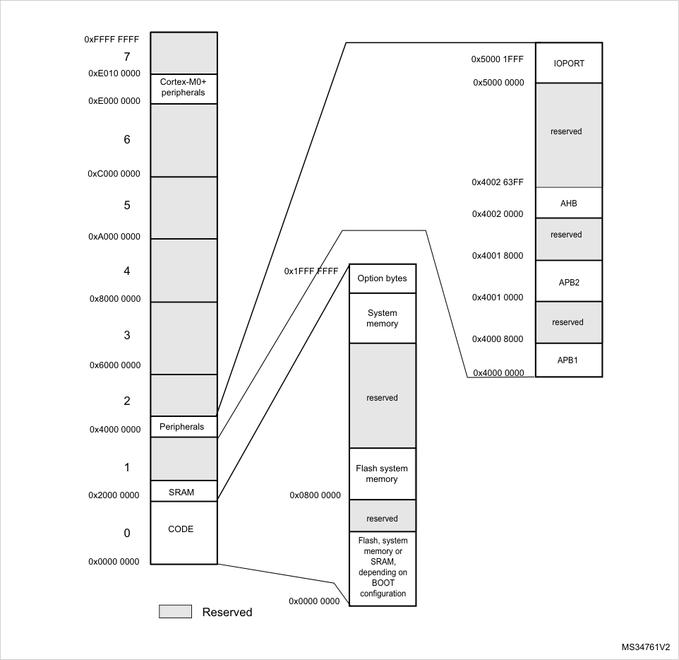
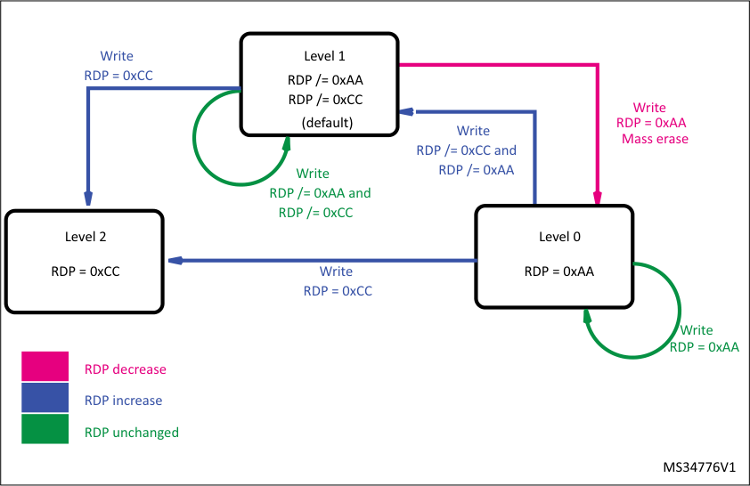

# RM0377 STM32L0x1 — Pages 51–100

**RM0377**

###### **2.2 Memory organization**

**2.2.1** **Introduction**

Program memory, data memory, registers and I/O ports are organized within the same linear
4-Gbyte address space.

The bytes are coded in memory in Little Endian format. The lowest numbered byte in a word
is considered the word’s least significant byte and the highest numbered byte the most
significant.

The addressable memory space is divided into eight main blocks, of 512 Mbytes each.

RM0377 Rev 10 51/905

51

--- end of page=50 ---

**RM0377**

**2.2.2** **Memory map and register boundary addresses**

**Figure 2. Memory map**

All the memory map areas that are not allocated to on-chip memories and peripherals are
considered “Reserved”. For the detailed mapping of available memory and register areas,
refer to the following table.

52/905 RM0377 Rev 10

--- end of page=51 ---

**RM0377**

The following table gives the boundary addresses of the peripherals available in the
devices.

**Table 3. STM32L0x1 peripheral register boundary addresses** **[(1)]**

|Bus|Boundary address|Size (bytes)|Peripheral|Peripheral register map|
|---|---|---|---|---|
|IOPORT|0X5000 1C00 - 0X5000 1FFF|1K|GPIOH|_Section 8.4.12: GPIO register_ _map_|
|IOPORT|0X5000 1400 - 0X5000 1BFF|2 K|Reserved|-|
|IOPORT|0X5000 1000 - 0X5000 13FF|1K|GPIOE|_Section 8.4.12: GPIO register_ _map_|
|IOPORT|0X5000 0C00 - 0X5000 0FFF|1K|GPIOD|_Section 8.4.12: GPIO register_ _map_|
|IOPORT|0X5000 0800 - 0X5000 0BFF|1K|GPIO C|_Section 8.4.12: GPIO register_ _map_|
|IOPORT|0X5000 0400 - 0X5000 07FF|1K|GPIOB|_Section 8.4.12: GPIO register_ _map_|
|IOPORT|0X5000 0000 - 0X5000 03FF|1K|GPIOA|_Section 8.4.12: GPIO register_ _map_|
|AHB|0X4002 6400 - 0X4002 FFFF|49 K|Reserved|-|
|AHB|0X4002 6000 - 0X4002 63FF|1 K|AES (Cat. 1, 2 and 5 with AES only)|_Section 15.7.13: AES register_ _map_|
|AHB|0X4002 5400 - 0X4002 5FFF|3 K|Reserved|-|
|AHB|0X4002 4400 - 0X4002 53FF|3 K|Reserved|-|
|AHB|0X4002 3400 - 0X4002 3FFF|3 K|Reserved|-|
|AHB|0X4002 3000 - 0X4002 33FF|1 K|CRC|_Section 4.4.6: CRC register map_|
|AHB|0X4002 2400 - 0X4002 2FFF|3 K|Reserved|-|
|AHB|0X4002 2000 - 0X4002 23FF|1 K|FLASH|_Section 3.7.11: Flash register_ _map_|
|AHB|0X4002 1400 - 0X4002 1FFF|3 K|Reserved|-|
|AHB|0X4002 1000 - 0X4002 13FF|1 K|RCC|_Section 7.3.21: RCC register_ _map_|
|AHB|0X4002 0400 - 0X4002 0FFF|3 K|Reserved|-|
|AHB|0X4002 0000 - 0X4002 03FF|1 K|DMA1|_Section 10.6.8: DMA register_ _map_|

RM0377 Rev 10 53/905

58

--- end of page=52 ---

**RM0377**

**Table 3. STM32L0x1 peripheral register boundary addresses** **[(1)]** **(continued)**

|Bus|Boundary address|Size (bytes)|Peripheral|Peripheral register map|
|---|---|---|---|---|
|APB2|0X4001 5C00 - 0X4001 FFFF|42 K|Reserved|-|
|APB2|0X4001 5800 - 0X4001 5BFF|1 K|DBG|_Section 27.10: DBG register_ _map_|
|APB2|0X4001 3C00 - 0X4001 57FF|7 K|Reserved|-|
|APB2|0X4001 3800 - 0X4001 3BFF|1 K|USART1|_Section 24.8.12: USART_ _register map_|
|APB2|0X4001 3400 - 0X4001 37FF|1 K|Reserved|-|
|APB2|0X4001 3000 - 0X4001 33FF|1 K|SPI1|_Section 26.7.10: SPI register_ _map_|
|APB2|0X4001 2800 - 0X4001 2FFF|2 K|Reserved|-|
|APB2|0X4001 2400 - 0X4001 27FF|1 K|ADC1|_Section 13.12: ADC register_ _map_|
|APB2|0X4001 2000 - 0X4001 23FF|1 K|Reserved|-|
|APB2|0X4001 1C00 - 0X4001 1FFF|1 K|Firewall|_Section 5.4.8: Firewall register_ _map_|
|APB2|0X4001 1800 - 0X4001 1BFF|1 K|Reserved|-|
|APB2|0X4001 1400 - 0X4001 17FF|1 K|TIM22|_Section 17.4.16: TIM21/22_ _register map_|
|APB2|0X4001 0C000 - 0X4001 13FF|2 K|Reserved|-|
|APB2|0X4001 0800 - 0X4001 0BFF|1 K|TIM21|_Section 17.4.16: TIM21/22_ _register map_|
|APB2|0X4001 0400 - 0X4001 07FF|1 K|EXTI|_Section 12.5.7: EXTI register_ _map_|
|APB2|0X4001 0000 - 0X4001 03FF|1 K|SYSCFG, COMP|_Section 9.2.8: SYSCFG register_ _map_, _Section 14.5.3: COMP_ _register map_|
|APB1|0X4000 8000 - 0X4000 FFFF|32 K|Reserved|-|
|APB1|0X4000 7C00 - 0X4000 7FFF|1 K|LPTIM1|_Section 19.7.9: LPTIM register_ _map_|
|APB1|0X4000 7800 - 0X4000 7BFF|1K|I2C3|_Section 23.7.12: I2C register_ _map_|
|APB1|0X4000 7000 - 0X4000 73FF|1 K|PWR|_Section 6.4.3: PWR register_ _map_|
|APB1|0X4000 5C00 - 0x4000 6FFF|1 K|Reserved|-|

54/905 RM0377 Rev 10

--- end of page=53 ---

**RM0377**

**Table 3. STM32L0x1 peripheral register boundary addresses** **[(1)]** **(continued)**

|Bus|Boundary address|Size (bytes)|Peripheral|Peripheral register map|
|---|---|---|---|---|
|APB1|0X4000 5800 - 0X4000 5BFF|1 K|I2C2|_Section 23.7.12: I2C register_ _map_|
|APB1|0X4000 5400 - 0X4000 57FF|1 K|I2C1|_Section 23.7.12: I2C register_ _map_|
|APB1|0X4000 5000 - 0X4000 53FF|1 K|USART5|_Section 24.8.12: USART_ _register map_|
|APB1|0X4000 4C00 - 0X4000 4FFF|1 K|USART4|_Section 24.8.12: USART_ _register map_|
|APB1|0X4000 4800 - 0X4000 4BFF|1 K|LPUART1|_Section 25.7.10: LPUART_ _register map_|
|APB1|0X4000 4400 - 0X4000 47FF|1 K|USART2|_Section 24.8.12: USART_ _register map_|
|APB1|0X4000 3C000 - 0X4000 43FF|2 K|Reserved|-|
|APB1|0X4000 3800 - 0X4000 3BFF|1 K|SPI2|_Section 26.7.10: SPI register_ _map_|
|APB1|0X4000 3400 - 0X4000 37FF|1 K|Reserved|-|
|APB1|0X4000 3000 - 0X4000 33FF|1 K|IWDG|_Section 20.4.6: IWDG register_ _map_|
|APB1|0X4000 2C00 - 0X4000 2FFF|1 K|WWDG|_Section 21.5.4: WWDG register_ _map_|
|APB1|0X4000 2800 - 0X4000 2BFF|1 K|RTC + BKP_REG|_Section 22.7.21: RTC register_ _map_|
|APB1|0X4000 1800 - 0X4000 27FF|3 K|Reserved|-|
|APB1|0X4000 1400 - 0X4000 17FF|1 K|TIMER7|_Section 18.4.9: TIM6/7 register_ _map_|
|APB1|0X4000 1000 - 0X4000 13FF|1 K|TIMER6|_Section 18.4.9: TIM6/7 register_ _map_|
|APB1|0X4000 0800 - 0X4000 0FFF|1 K|Reserved|-|
|APB1|0X4000 0400 - 0X4000 07FF|1 K|TIMER3|_Section 16.5: TIMx register map_|
|APB1|0X4000 0000 - 0X4000 03FF|1 K|TIMER2|_Section 16.5: TIMx register map_|
|SRAM|0X2000 2000 - 0X3FFF FFFF|~524 M|Reserved|-|
|SRAM|0X2000 0000 - 0X2000 4FFF|up to 20 K|SRAM|-|

RM0377 Rev 10 55/905

58

--- end of page=54 ---

**RM0377**

**Table 3. STM32L0x1 peripheral register boundary addresses** **[(1)]** **(continued)**

|Bus|Boundary address|Size (bytes)|Peripheral|Peripheral register map|
|---|---|---|---|---|
|NVM|0X0800 0000 - 0X0802 FFFF|up to 192 K|Flash program memory|-|
|NVM|0x0808 0000 - 0x0808 17FF|up to 6 K|Data EEPROM|-|
|NVM|0x1FF0 0000 - 0x1FF0 1FFF|8 K|System memory|-|
|NVM|0x1FF8 0020 - 0x1FF8 007F|96|Factory option bytes|-|
|NVM|0x1FF8 0000 - 0x1FF8 001F|32|User option bytes|-|

1. Refer to _Table 1: STM32L0x1 memory density_, to _Table 2: Overview of features per category_ and to the device datasheets
for the GPIO ports and peripherals available on your device. The memory area corresponding to unavailable GPIO ports or
peripherals are reserved.

###### **2.3 Embedded SRAM**

STM32L0x1 devices feature up to 20 Kbytes of static SRAM.

This RAM can be accessed as bytes, half-words (16 bits) or full words (32 bits). This
memory can be addressed at maximum system clock frequency without wait state and thus
by both CPU and DMA.

The SRAM start address is 0x2000 0000.

The CPU can access the SRAM from address 0x0000 0000 when physical remap is
selected through boot pin or MEM_MODE (see _Section 9.2.1: SYSCFG memory remap_
_register (SYSCFG_CFGR1)_ ).

###### **2.4 Boot configuration**

In the STM32L0x1, three different boot modes can be selected through the BOOT0 pin and
boot configuration bits in the User option byte, as shown in the following table.

**Table 4. Boot modes** **[(1)]**

|Boot mode configuration|Col2|Col3|Col4|Aliasing|
|---|---|---|---|---|
|**nBOOT1** **bit**|**BOOT0** **pin**|**nBOOT_SEL** **bit**|**nBOOT0** **bit**|**nBOOT0** **bit**|
|X|0|0|X|Flash program memory is selected as boot area|
|1|1|0|X|System memory is selected as boot area|
|0|1|0|X|Embedded SRAM is selected as boot area|
|X|X|1|1|Flash program memory is selected as boot area|
|1|X|1|0|System memory is selected as boot area|
|0|X|1|0|Embedded SRAM is selected as boot area|

56/905 RM0377 Rev 10

--- end of page=55 ---

**RM0377**

1. Grayed options are available on category 1 devices only.

The boot mode configuration is latched on the 2nd rising edge of SYSCLK after reset. For
category 1 devices, the value present on BOOT0 pin is latched on NRST rising edge. It is up
to the user to set nBOOT1 and BOOT0 to select the required boot mode.

The boot mode configuration is also re-sampled when exiting from Standby mode, except
for category 1 devices where BOOT0 pin is latched on NRST rising edge. Consequently the
boot mode configuration must not be modified in Standby mode (except for category 1
devices). After this startup delay has elapsed, the CPU fetches the top-of-stack value from
address 0x0000 0000, then starts code execution from the boot memory at 0x0000 0004.

Depending on the selected boot mode, Flash program memory, system memory or SRAM is
accessible as follows:

      - Boot from Flash program memory: the Flash program memory is aliased in the boot
memory space (0x0000 0000), but still accessible from its original memory space
(0x0800 0000). In other words, the Flash memory contents can be accessed starting
from address 0x0000 0000 or 0x0800 0000.

      - Boot from system memory: the system memory is aliased in the boot memory space
(0x0000 0000), but still accessible from its original memory space (0x 1FF0 0000 ).

      - Boot from the embedded SRAM: the SRAM is aliased in the boot memory space
(0x0000 0000), but it is still accessible from its original memory space (0x2000 0000).

**BOOT0/GPIO pin sharing (category 1 devices only)**

On category 1 devices, the BOOT0 pin is shared with a GPIO pin. The pin state is latched
on NRST rising edge as BOOT0 state. The pin logic level can then be read as an input value
on the shared GPIO pin. This pin feature specific input voltage characteristics (refer to the
corresponding datasheets for details).

**Empty check (category 1 devices only)**

On category 1 devices, an internal empty check flag is implemented to allow easy
programming of virgin devices by the bootloader. This flag is used when BOOT0 pin is
configured to select Flash program memory as target boot area. When this flag is set, the
device is considered as unprogrammed and the system memory (bootloader) is selected as
boot area instead of the Flash program memory to allow the application to program the
Flash memory.

The empty check flag is updated only when the option bytes are loaded: it is set when the
content of address 0x0800 0000 is read as 0x0000 0000 and cleared otherwise. As a result,
only a power-on reset or setting OBL_LAUNCH bit in FLASH_CR register can clear this flag
after programming a virgin device to execute user code after system reset.

_Note:_ _If the device is programmed for the first time but the option bytes are not reloaded, the_
_system memory will still be selected as boot area after system reset. In this case, the_
_bootloader code switches the boot memory mapping to Flash program memory and_
_performs a jump to the user code it hosts._

RM0377 Rev 10 57/905

58

--- end of page=56 ---

**RM0377**

**Bank swapping (category 5 devices only)**

For devices featuring two banks, the bank swapping mechanism allows the CPU to point
either to bank1 or to bank 2 in the boot memory space (0x0000 0000). Either Flash program
and data EEPROM address are changed (see _Table 10: NVM organization for UFB = 0_
_(128 Kbyte category 5 devices)_, _Table 12: NVM organization for UFB = 0 (64 Kbyte category_
_5 devices)_ ).

**Physical remap**

Once the boot pin and bit are selected, the application software can modify the memory
accessible in the code area. This modification is performed by programming the
MEM_MODE bits in the SYSCFG memory remap register (SYSCFG_CFGR1).

**Embedded bootloader**

The embedded bootloader is located in the System memory, programmed by ST during
production. It is used to reprogram the Flash memory using one of the following serial
interfaces:

      - For category 1 devices: USART2 or SPI1.

      - For category 2 devices: USART2 or SPI1.

      - For category 3 devices: USART1, USART2, SPI1 or SPI2

      - For category 5 devices: USART1, USART2, SPI1, SPI2, I2C1 or I2C2.

For details concerning the bootloader serial interface corresponding I/O, refer to your device
datasheet.

For further details on STM32 bootloader, please refer to AN2606.

58/905 RM0377 Rev 10

--- end of page=57 ---

**RM0377** **Flash program memory and data EEPROM (FLASH)**

#### **3 Flash program memory and data EEPROM (FLASH)**

###### **3.1 Introduction**

The non-volatile memory (NVM) is composed of:

      - Up to 192 Kbytes of Flash program memory. This area is used to store the application
code.

      - Up to 6 Kbytes of data EEPROM

      - An information block:

–
Up to 8 Kbytes of System memory

–
Up to 8x4 bytes of user Option bytes

–
Up to 96 bytes of factory Option bytes

###### **3.2 NVM main features**

The NVM interface features:

      - Read interface organized by word, half-word or byte in every area

      - Programming in the Flash memory performed by word or half-page

      - Programming in the Option bytes area performed by word

      - Programming in the data EEPROM performed by word, half-word or byte (granularity of
the data EEPROM is one word, erase/write endurance cycles are linked to one word
granularity)

      - Erase operation performed by page (in Flash memory, data EEPROM and Option
bytes)

      - Option byte Loader

      - ECC (Error Correction Code): 6 bits stored for every word to recognize and correct just

one error

      - Mass erase operation

      - Read / Write protection

      - PCROP protection

      - Low-power mode

      - Category 5 devices only:

–
Dual-bank memory with read-while-write

–
Dual-bank boot capability allowing to boot either from Bank 1 or Bank 2 at startup

–
Bank swapping capability.

RM0377 Rev 10 59/905

116

--- end of page=58 ---

**Flash program memory and data EEPROM (FLASH)** **RM0377**

###### **3.3 NVM functional description**

**3.3.1** **NVM organization**

The NVM is organized as 32-bit memory cells that can be used to store code, data, boot
code or Option bytes.

The memory array is divided into pages. A page is composed of 32 words (or 128 bytes) in
Flash program memory and System memory, and 1 single word (or 4 bytes) in data
EEPROM and Option bytes areas (user and factory). The erase/write endurance cycles are
linked to one page granularity for Flash program memory and one single word granularity for
data EEPROM.

A Flash sector is made of 32 pages (or 4 Kbytes). The sector is the granularity of the write
protection.

**Table 5. NVM organization (category 1 devices)**

|NVM|NVM addresses|Size (bytes)|Name|Description|
|---|---|---|---|---|
|Flash program memory|0x0800 0000 - 0x0800 007F|128 bytes|Page 0|sector 0|
|Flash program memory|0x0800 0080 - 0x0800 00FF|128 bytes|Page 1|Page 1|
|Flash program memory|-|-|-|-|
|Flash program memory|0x0800 0F80 - 0x0800 0FFF|128 bytes|Page 31|Page 31|
|Flash program memory|. . .|. . .|. . .|. . .|
|Flash program memory|0x0800 3000 - 0x0800 307F|128 bytes|Page 96|sector 3|
|Flash program memory|0x0800 3080 - 0x0800 30FF|128 bytes|Page 97|Page 97|
|Flash program memory|-|-|-|-|
|Flash program memory|0x0800 3F80 - 0x0800 3FFF|128 bytes|Page 127|Page 127|
|Data EEPROM|0x0808 0000 - 0x0808 01FF|512 bytes||Data EEPROM|
|Information block|0x1FF0 0000 - 0x1FF0 0FFF|4 Kbytes||System memory|
|Information block|0x1FF8 0020 - 0x1FF8 007F|96 bytes||Factory Options|
|Information block|0x1FF8 0000 - 0x1FF8 001F|32 bytes||User Option bytes|

60/905 RM0377 Rev 10

--- end of page=59 ---

**RM0377** **Flash program memory and data EEPROM (FLASH)**

**Table 6. NVM organization (category 2 devices)**

|NVM|NVM addresses|Size (bytes)|Name|Description|
|---|---|---|---|---|
|Flash program memory|0x0800 0000 - 0x0800 007F|128 bytes|Page 0|sector 0|
|Flash program memory|0x0800 0080 - 0x0800 00FF|128 bytes|Page 1|Page 1|
|Flash program memory|-|-|-|-|
|Flash program memory|0x0800 0F80 - 0x0800 0FFF|128 bytes|Page 31|Page 31|
|Flash program memory|. . .|. . .|. . .|. . .|
|Flash program memory|0x0800 7000 - 0x0800 707F|128 bytes|Page 224|sector 7|
|Flash program memory|0x0800 7080 - 0x0800 70FF|128 bytes|Page 225|Page 225|
|Flash program memory|-|-|-|-|
|Flash program memory|0x0800 7F80 - 0x0800 7FFF|128 bytes|Page 255|Page 255|
|Data EEPROM|0x0808 0000 - 0x0808 03FF|1 Kbytes||Data EEPROM|
|Information block|0x1FF0 0000 - 0x1FF0 0FFF|4 Kbytes||System memory|
|Information block|0x1FF8 0020 - 0x1FF8 007F|96 bytes||Factory Options|
|Information block|0x1FF8 0000 - 0x1FF8 001F|32 bytes||User Option bytes|

**Table 7. NVM organization (category 3 devices)**

|NVM|NVM addresses|Size (bytes)|Name|Description|
|---|---|---|---|---|
|Flash program memory(1)|0x0800 0000 - 0x0800 007F|128 bytes|Page 0|sector 0|
|Flash program memory(1)|0x0800 0080 - 0x0800 00FF|128 bytes|Page 1|Page 1|
|Flash program memory(1)|-|-|-|-|
|Flash program memory(1)|0x0800 0F80 - 0x0800 0FFF|128 bytes|Page 31|Page 31|
|Flash program memory(1)|. . .|. . .|. . .|. . .|
|Flash program memory(1)|0x0800 7000 - 0x0800 707F|128 bytes|Page 224|sector 7|
|Flash program memory(1)|0x0800 7080 - 0x0800 70FF|128 bytes|Page 225|Page 225|
|Flash program memory(1)|-|-|-|-|
|Flash program memory(1)|0x0800 7F80 - 0x0800 7FFF|128 bytes|Page 255|Page 255|
|Flash program memory(1)|. . .|. . .|. . .|. . .|
|Flash program memory(1)|0x0800 F000 - 0x0800 F07F|128 bytes|Page 480|sector 15|
|Flash program memory(1)|0x0800 F080 - 0x0800 F0FF|128 bytes|Page 481|Page 481|
|Flash program memory(1)|-|-|-|-|
|Flash program memory(1)|0x0800 FF80 - 0x0800 FFFF|128 bytes|Page 511|Page 511|
|Data EEPROM|0x0808 0000 - 0x0808 07FF|2 Kbytes|-|Data EEPROM|

RM0377 Rev 10 61/905

116

--- end of page=60 ---

**Flash program memory and data EEPROM (FLASH)** **RM0377**

**Table 7. NVM organization (category 3 devices)** **(continued)**

|NVM|NVM addresses|Size (bytes)|Name|Description|
|---|---|---|---|---|
|Information block|0x1FF0 0000 - 0x1FF0 0FFF|4 Kbytes|-|System memory|
|Information block|0x1FF8 0020 - 0x1FF8 007F|96 bytes|-|Factory Options|
|Information block|0x1FF8 0000 - 0x1FF8 001F|32 bytes|-|User Option bytes|

1. For 32 Kbyte category 3 devices, the Flash program memory is divided into 256 pages of 128 bytes each.

**Table 8. NVM organization for UFB = 0 (192 Kbyte category 5 devices)**

|NVM|NVM addresses|Size (bytes)|Name|Description|Col6|
|---|---|---|---|---|---|
|Flash program memory|0x0800 0000 - 0x0800 007F|128 bytes|Page 0|sector 0|Bank 1|
|Flash program memory|0x0800 0080 - 0x0800 00FF|128 bytes|Page 1|Page 1|Page 1|
|Flash program memory|-|-|-|-|-|
|Flash program memory|0x0800 0F80 - 0x0800 0FFF|128 bytes|Page 31|Page 31|Page 31|
|Flash program memory|. . .|. . .|. . .|. . .|. . .|
|Flash program memory|0x0800 7000 - 0x0800 707F|128 bytes|Page 224|sector 7|sector 7|
|Flash program memory|0x0800 7080 - 0x0800 70FF|128 bytes|Page 225|Page 225|Page 225|
|Flash program memory|-|-|-|-|-|
|Flash program memory|0x0800 7F80 - 0x0800 7FFF|128 bytes|Page 255|Page 255|Page 255|
|Flash program memory|. . .|. . .|. . .|. . .|. . .|
|Flash program memory|-|-|-|||
|Flash program memory|0x0801 7F80- 0x0801 7FFF|128 bytes|Page 767|sector 23|sector 23|
|Flash program memory|0x0801 8000 - 0x0801 807F|128 bytes|Page 768|sector 24|Bank 2|
|Flash program memory|. . .|. . .|. . .|. . .|. . .|
|Flash program memory|0x0802 F000 - 0x0802 F07F|128 bytes|Page 1504|sector 47|sector 47|
|Flash program memory|0x0802 F080 - 0x0802 F0FF|128 bytes|Page 1505|Page 1505|Page 1505|
|Flash program memory|-|-|-|-|-|
|Flash program memory|0x0802 FF80 - 0x0802 FFFF|128 bytes|Page 1535|Page 1535|Page 1535|
|Data EEPROM|0x0808 0000 - 0x0808 0BFF|6 Kbytes|-|Data EEPROM Bank 1|Data EEPROM Bank 1|
|Data EEPROM|0x0808 0C00 - 0x0808 17FF|0x0808 0C00 - 0x0808 17FF|-|Data EEPROM Bank 2|Data EEPROM Bank 2|
|Information block|0x1FF0 0000 - 0x1FF0 1FFF|8 Kbytes|-|System memory|System memory|
|Information block|0x1FF8 0020 - 0x1FF8 007F|96 bytes|-|Factory Options|Factory Options|
|Information block|0x1FF8 0000 - 0x1FF8 001F|32 bytes|-|User Option bytes|User Option bytes|

62/905 RM0377 Rev 10

--- end of page=61 ---

**RM0377** **Flash program memory and data EEPROM (FLASH)**

**Table 9. Flash memory and data EEPROM remapping**
**(192 Kbyte category 5 devices)**

|NVM|Description|NVM addresses|Col4|Remapped addresses|Col6|
|---|---|---|---|---|---|
|**NVM**|**Description**|**MEM_MODE = 0,** **BOOT0= 0 and** **UFB = 0**|**MEM_MODE = 0,** **BOOT0= 0 and** **UFB = 1**|**MEM_MODE = 0,** **BOOT0= 0 and** **UFB = 0**|**MEM_MODE = 0,** **BOOT0= 0 and** **UFB = 1**|
|Flash program memory|Bank 1|0x0800 0000 - 0x0801 7FFF|0x0801 8000 - 0x0802 FFFF|0x0000 0000 - 0x0001 7FFF|0x0001 8000 - 0x0002 FFFF|
|Flash program memory|Bank 2|0x0801 8000 - 0x0802 FFFF|0x08000 0000 - 0x0801 7FFF|0x0001 8000 - 0x0002 FFFF|0x0000 0000 - 0x0001 7FFF|
|Data EEPROM|Bank 1|0x0808 0000 - 0x0808 0BFF|0x0808 0C00 - 0x0808 17FF|0x0008 0000 - 0x0008 0BFF|0x0008 0C00 - 0x0008 17FF|
|Data EEPROM|Bank 2|0x0808 0C00 - 0x0808 17FF|0x0808 0000 - 0x0008 0BFF|0x0008 0C00 - 0x0008 17FF|0x0008 0000 - 0x0008 0BFF|

**Table 10. NVM organization for UFB = 0 (128 Kbyte category 5 devices)**

|NVM|NVM addresses|Size (bytes)|Name|Description|Col6|
|---|---|---|---|---|---|
|Flash program memory|0x0800 0000 - 0x0800 007F|128 bytes|Page 0|sector 0|Bank 1|
|Flash program memory|0x0800 0080 - 0x0800 00FF|128 bytes|Page 1|Page 1|Page 1|
|Flash program memory|-|-|-|-|-|
|Flash program memory|0x0800 0F80 - 0x0800 0FFF|128 bytes|Page 31|Page 31|Page 31|
|Flash program memory|. . .|. . .|. . .|. . .|. . .|
|Flash program memory|0x0800 7000 - 0x0800 707F|128 bytes|Page 224|sector 7|sector 7|
|Flash program memory|0x0800 7080 - 0x0800 70FF|128 bytes|Page 225|Page 225|Page 225|
|Flash program memory|-|-|-|-|-|
|Flash program memory|0x0800 7F80 - 0x0800 7FFF|128 bytes|Page 255|Page 255|Page 255|
|Flash program memory|. . .|. . .|. . .|. . .|. . .|
|Flash program memory|0x0800 FF80- 0x0800 FFFF|128 bytes|Page 511|sector 15|sector 15|
|Flash program memory|0x0801 0000 - 0x0801 007F|128 bytes|Page 512|sector 16|Bank 2|
|Flash program memory|. . .|. . .|. . .|. . .|. . .|
|Flash program memory|0x0801 F000 - 0x0801 F07F||Page 992|sector 31|sector 31|
|Flash program memory||||||
|Flash program memory|-|-|-|-|-|
|Flash program memory|0x0801 FF80 - 0x0801 FFFF|128 bytes|Page 1023|Page 1023|Page 1023|
|Data EEPROM|0x0808 0000 - 0x0808 0BFF|6 Kbytes|-|Data EEPROM Bank 1|Data EEPROM Bank 1|
|Data EEPROM|0x0808 0C00 - 0x0808 17FF|0x0808 0C00 - 0x0808 17FF|-|Data EEPROM Bank 2|Data EEPROM Bank 2|

RM0377 Rev 10 63/905

116

--- end of page=62 ---

**Flash program memory and data EEPROM (FLASH)** **RM0377**

**Table 10. NVM organization for UFB = 0 (128 Kbyte category 5 devices)** **(continued)**

|NVM|NVM addresses|Size (bytes)|Name|Description|
|---|---|---|---|---|
|Information block|0x1FF0 0000 - 0x1FF0 1FFF|8 Kbytes|-|System memory|
|Information block|0x1FF8 0020 - 0x1FF8 007F|96 bytes|-|Factory Options|
|Information block|0x1FF8 0000 - 0x1FF8 001F|32 bytes||User Option bytes|

**Table 11. Flash memory and data EEPROM remapping** **(128 Kbyte category 5 devices)**

|NVM|Description|NVM addresses|Col4|Remapped addresses|Col6|
|---|---|---|---|---|---|
|**NVM**|**Description**|**MEM_MODE = 0,** **BOOT0= 0 and** **UFB = 0**|**MEM_MODE = 0,** **BOOT0= 0 and** **UFB = 1**|**MEM_MODE = 0,** **BOOT0= 0 and** **UFB = 0**|**MEM_MODE = 0,** **BOOT0= 0 and** **UFB = 1**|
|Flash program memory|Bank 1|0x0800 0000 - 0x0800 FFFF|0x0801 0000 - 0x0801 FFFF|0x0000 0000 - 0x0000 FFFF|0x0001 0000 - 0x0001 FFFF|
|Flash program memory|Bank 2|0x0801 0000 - 0x0801 FFFF|0x0800 0000 - 0x0800 FFFF|0x0001 0000 - 0x0001 FFFF|0x0000 0000 - 0x0000 FFFF|
|Data EEPROM|Bank 1|0x0808 0000 - 0x0808 0BFF|0x0808 0C00 - 0x0808 17FF|0x0008 0000 - 0x0008 0BFF|0x0008 0C00 - 0x0008 17FF|
|Data EEPROM|Bank 2|0x0808 0C00 - 0x0808 17FF|0x0808 0000 - 0x0808 0BFF|0x0008 0C00 - 0x0008 17FF|0x0008 0000 - 0x0008 0BFF|

**Table 12. NVM organization for UFB = 0 (64 Kbyte category 5 devices)** **[(1)]**

|NVM|NVM addresses|Size (bytes)|Name|Description|Col6|
|---|---|---|---|---|---|
|Flash program memory|0x0800 0000 - 0x0800 007F|128 bytes|Page 0|sector 0|Bank 1|
|Flash program memory|0x0800 0080 - 0x0800 00FF|128 bytes|Page 1|Page 1|Page 1|
|Flash program memory|-|-|-|-|-|
|Flash program memory|0x0800 0F80 - 0x0800 0FFF|128 bytes|Page 31|Page 31|Page 31|
|Flash program memory|. . .|. . .|. . .|. . .|. . .|
|Flash program memory|0x0800 F000 - 0x0800 F07F|128 bytes|Page 480|sector 15|sector 15|
|Flash program memory|-|-|-|-|-|
|Flash program memory|-|-|-|-|-|
|Flash program memory|0x0800 FF80 - 0x0800 FFFF|128 bytes|Page 511|Page 511|Page 511|
|Data EEPROM|0x0808 0C00 - 0x0808 17FF|3 Kbytes|-|Data EEPROM Bank 2|Data EEPROM Bank 2|
|Information block|0x1FF0 0000 - 0x1FF0 1FFF|8 Kbytes|-|System memory|System memory|
|Information block|0x1FF8 0020 - 0x1FF8 007F|96 bytes|-|Factory Options|Factory Options|
|Information block|0x1FF8 0000 - 0x1FF8 001F|32 bytes||User Option bytes|User Option bytes|

1. Flash memory and data EEPROM remapping is not possible on 64 Kbyte category 5 devices.

64/905 RM0377 Rev 10

--- end of page=63 ---

**RM0377** **Flash program memory and data EEPROM (FLASH)**

**3.3.2** **Dual-bank boot capability**

Category 5 devices have two Flash memory banks: Bank 1 and Bank 2. They feature an
additional boot mechanism which allows booting either from Bank 2 or from Bank 1
depending on BFB2 bit status (bit 23 in FLASH_OPTR register).

      - When the BFB2 bit is set and the boot pins are configured to boot from Flash memory
(BOOT0 = 0 and BOOT1 = x), the device maps the System memory at address 0. It
boots from the System memory after reset and Standby and executes (during
approximately 440 µs) the embedded bootloader code which implements the dualbank boot mechanism:

a) The System memory code first checks Bank 2. If it contains a valid code (see note
below), it sets the UFB bit in SYSCFG_CFGR1 register to map Bank 2 at address
0x0800 0000, jumps to the application code located in Bank 2, and leaves the
bootloader.

b) If the code located in Bank 2 is not valid, the System memory code checks Bank 1
code. If it is valid (see note below), it jumps to the application located in Bank 1
(UFB is kept at ‘0’ so that Bank 1 remains mapped at address 0x0800 0000).

c) If both Bank 2 and Bank 1 do not contain valid code (see note below), the normal
bootloader operations are executed when the protection level2 is disabled.
Otherwise, the System memory code jumps to Bank 1 regardless of its validity.
Refer to _Table 13_ for more details.

      - When BFB2 bit is reset (default state), the dual-bank boot mechanism is not performed.

_Note:_ _The code is considered as valid when the first data located at the bank start address (which_
_should be the stack pointer) points to a valid address (stack top address)._

For category 5 devices, the Flash memory Bank 1 and Bank 2, System memory or SRAM
can be selected as the boot area, as shown in _Table 13_ below.

**Table 13. Boot pin and BFB2 bit configuration**

|Protection level|BFB2 bit|Boot mode selection|Col4|Boot mode|Aliasing|
|---|---|---|---|---|---|
|**Protection** **level**|**BFB2** **bit**|**nBOOT1** **option** **bit**|**BOOT0** **pin**|**BOOT0** **pin**|**BOOT0** **pin**|
|0 or 1|0|X|0|User Flash memory|User Flash memory Bank1 is selected as the boot area.|
|0 or 1|0|1|1|System memory|Boot on System memory to execute bootloader.|
|0 or 1|0|0|1|Embedded SRAM|Boot on Embedded SRAM|
|0 or 1|1|X|0|System memory|Boot on System memory to execute dual bank boot mechanism. If Bank 2 and Bank 1are not valid, bootloader is executed for Flash update.|
|0 or 1|1|1|1|System memory|Boot on System memory to execute bootloader.|
|0 or 1|1|0|1|Embedded SRAM|Boot on Embedded SRAM.|

RM0377 Rev 10 65/905

116

--- end of page=64 ---

**Flash program memory and data EEPROM (FLASH)** **RM0377**

**Table 13. Boot pin and BFB2 bit configuration (continued)**

|Protection level|BFB2 bit|Boot mode selection|Col4|Boot mode|Aliasing|
|---|---|---|---|---|---|
|**Protection** **level**|**BFB2** **bit**|**nBOOT1** **option** **bit**|**BOOT0** **pin**|**BOOT0** **pin**|**BOOT0** **pin**|
|2|0|X|0|User Flash memory|User Flash memory Bank1 is selected as the boot area.|
|2|0|1|1|User Flash memory|User Flash memory|
|2|0|0|1|User Flash memory|User Flash memory|
|2|1|X|0|System memory|Boot on System memory to execute dual bank boot mechanism. If Bank 2 isn’t valid, it jumps to Bank 1.|
|2|1|1|1|System memory|System memory|
|2|1|0|1|System memory|System memory|

When entering System memory, you can either execute the bootloader (for Flash update) or
execute Dual Bank Jump (see _Table 13_ ).

When protection level2 is enabled, the bootloader is never executed to perform a Flash
update.

When the conditions a, b, and c described below are fulfilled, it is equivalent to configuring
boot pins for System memory boot (BOOT0 = 1 and BOOT1 = 0). In this case when
protection level2 is disabled, normal bootloader operations are executed.

a) BFB2 bit is set.

b) Both banks do not contain valid code.

c) Boot pins configured as follows: BOOT0 = 0 and BOOT1 = x.

When the BFB2 bit is set, and Bank 2 and/or Bank 1 contain valid user application code, the
Dual Bank Boot is always performed (bootloader always jumps to the user code).

Consequently, if you have set the BFB2 bit (to boot from Bank 2) then, to be able to execute
the bootloader code for Flash update when protection level2 is disabled, you have to:

a) Set the BFB2 bit to 0, BOOT0 = 1 and BOOT1 = 0 or,

b) Program the content of address 0x0801 8000/0x0801 0000 (base address of
Bank2) and 0x0800 0000 (base address of Bank1) to 0x0.

**3.3.3** **Reading the NVM**

**Protocol to read**

To read the NVM content, take any address from _Section 3.3.1: NVM organization_ . The
clock of the memory interface must be running. (see MIFEN bit in _Section 7.3.12: AHB_
_peripheral clock enable register (RCC_AHBENR)_ ).

Depending on the clock frequency, a 0 or a 1 wait state can be necessary to read the NVM.

The user must set the correct number of wait states (LATENCY bit in the FLASH_ACR
register). No control is done to verify if the frequency or the power used is correct, with
respect to the number of wait states. A wrong number of wait states can generate wrong
read values (high frequency and 0 wait states) or a long time to execute a code (low
frequency with 1 wait state).

66/905 RM0377 Rev 10

--- end of page=65 ---

**RM0377** **Flash program memory and data EEPROM (FLASH)**

You can read the NVM by word (4 bytes), half-word (2 bytes) or byte.

When the NVM features only one bank, it is not possible to read the NVM during a
write/erase operation. If a write/erase operation is ongoing, the reading will be in a wait state
until the write/erase operation completes, stalling the master that requested the read
operation, except when the address is read-protected. In this case, the error is sent to the
master by a hard fault or a memory interface flag; no stall is generated and no read is
waiting.

When two banks are available (category 5 devices), read operations from one bank can be
performed while write or erase operations are performed on the other bank.

**Relation between CPU frequency/Operation mode/NVM read time**

The device (and the NVM) can work at different power ranges. For every range, some
master clock frequencies can be set. _Table 14_ resumes the link between the power range
and the frequencies to ensure a correct time access to the NVM.

**Table 14. Link between master clock power range and frequencies**

|Name|Power range|Maximum frequency (with 1 wait state)|Maximum frequency (without wait states)|
|---|---|---|---|
|Range 1|1.65 V - 1.95 V|32 MHz|16 MHz|
|Range 2|1.35 V - 1.65 V|16 MHz|8 MHz|
|Range 3|1.05 V - 1.35 V|4.2 MHz|4.2 MHz|

_Table 15_ shows the delays to read a word in the NVM. Comparing the complete time to read
a word (Ttotal) with the clock period, you can see that in Range 3 no wait state is necessary,
also with the maximum frequency (4.2 MHz) allowed by the device. Ttotal is the time that the
NVM needs to return a value, and not the complete time to read it (from memory to Core
through the memory interface); all remaining time is lost.

**Table 15. Delays to memory access and number of wait states**

|Name|Ttotal|Frequency|Period|Number of wait state required|
|---|---|---|---|---|
|Range 1|46.1 ns|32 MHz|31.25|1|
|Range 1|46.1 ns|16 MHz|62.5|0|
|Range 2|86.8 ns|16 MHz|62.5|1|
|Range 2|86.8 ns|8 MHz|125|0|
|Range 3|184.6 ns|4 MHz|250|0|
|Range 3|184.6 ns|2 MHz|500|0|

RM0377 Rev 10 67/905

116

--- end of page=66 ---

**Flash program memory and data EEPROM (FLASH)** **RM0377**

**Change the CPU Frequency**

After reset, the clock used is the MSI (2.1 MHz) and 0 wait state is configured in the
FLASH_ACR register. The following software sequences have to be respected to tune the
number of wait states needed to access the NVM with the CPU frequency.

A CPU clock or a number of wait state configuration changes may take some time before
being effective. Checking the AHB prescaler factor and the clock source status values is a
way to ensure that the correct CPU clock frequency is the configured one. Similarly, the read
of FLASH_ACR is a way to ensure that the number of programmed wait states is effective.

**Increasing the CPU frequency (in the same voltage range)**

1. Program 1 wait state in LATENCY bit of FLASH_ACR register, if necessary.

2. Check that the new number of wait states is taken into account by reading the
FLASH_ACR register. When the number of wait states changes, the memory interface
modifies the way the read access is done to the NVM. The number of wait states
cannot be modified when a read operation is ongoing, so the memory interface waits
until no read is done on the NVM. If the master reads back the content of the
FLASH_ACR register, this reading is stopped (and also the master which requested
the reading) until the number of wait states is really changed. If the user does not read
back the register, the following access to the NVM may be done with 0 wait states,
even if the clock frequency has been increased, and consequently the values are

wrong.

3. Modify the CPU clock source and/or the AHB clock prescaler in the Reset & Clock
Controller (RCC).

4. Check that the new CPU clock source and/or the new CPU clock prescaler value is
taken into account by reading respectively the clock source status and/or the AHB
prescaler value in the Reset & Clock Controller (RCC). This check is important as some
clocks may take time to get available.

For code example, refer to _A.2.1: Increasing the CPU frequency preparation sequence_
_code_, _A.2.3: Switch from PLL to HSI16 sequence code_ and _A.2.4: Switch to PLL sequence_
_code_ .

**Decreasing the CPU frequency (in the same voltage range)**

1. Modify the CPU clock source and/or the AHB clock prescaler in the Reset & Clock
Controller (RCC).

2. Check that the new CPU clock source and/or the new CPU clock prescaler value is
taken into account by reading respectively the clock source status and/or the AHB
prescaler value in the Reset and Clock Controller (RCC).

3. Program 0 wait state in LATENCY bit of the FLASH_ACR register, if needed.

4. Check that the new number of wait states is taken into account by reading
FLASH_ACR. It is necessary to read back the register for the reasons explained in the
previous paragraph.

68/905 RM0377 Rev 10

--- end of page=67 ---

**RM0377** **Flash program memory and data EEPROM (FLASH)**

**Data buffering**

In the NVM, six buffers can impact the performance (and in some conditions help to reduce
the power consumption) during read operations, both for fetch and data. The structure of
one buffer is shown on _Figure 3_ .

**Figure 3. Structure of one internal buffer**

Each buffer stores 3 different types of information: address, data and history. In a read
operation, if the address is found, the memory interface can return data without accessing
the NVM. Data in the buffer is 32 bit wide (even if the master only reads 8 or 16 bits), so that
a value can be returned whatever the size used in a previous reading. The history is used to
know if the content of a buffer is valid and to delete (with a new value) the older one.

The buffers are used to store the value received by the NVM during normal read operations,
and for speculative readings. Disabling the speculative reading makes that only the data
requested by masters is stored in buffers, if enabled (default). This can increase the
performance as no wait state is necessary if the value is already available in buffers, and
reduce the power consumption as the number of reads in memory is reduced and all
combinatorial paths from memory are stable.

The buffers are divided in groups to manage different tasks. The number of buffers in every
group can change starting from the configuration selected by the user (see _Table 16_ ). The
total number of buffers used is always 6 (if enabled). The history is always managed by

group.

The memory interface always searches if a particular address is available in all buffers
without checking the group of buffers and if the read is fetch or data.

At reset or after a write/erase operation that changes several addresses, all buffers are
empty and the history is set to EMPTY. After a program by word, half-word or byte, only the
buffer with the concerned address is cleaned.

RM0377 Rev 10 69/905

116

--- end of page=68 ---

**Flash program memory and data EEPROM (FLASH)** **RM0377**

**Table 16. Internal buffer management**

|DISAB_BUF|PREFTEN|PRE_READ|Buffers for fetch|Col5|Col6|Buffers for data|Col8|
|---|---|---|---|---|---|---|---|
|**DISAB_BUF**|**PREFTEN**|**PRE_READ**|**Buffers for** **jumps**|**Buffers for** **prefetch**|**Buffers for** **last value**|**Buffers for** **pre-read**|**Buffers for** **last value**|
|1|-|-|0|0|0|0|0|
|0|0|0|3|0|1|0|2|
|0|1|0|2|1|1|0|2|
|0|0|1|3|0|1|1|1|
|0|1|1|2|1|1|1|1|

If a value in a buffer is not empty, the history shows the time elapsed between the moment it
has been read or written. The history is organized as a list of values from the latest to the
oldest one. At a given instant, only one buffer in a group can have a particular value of
history (except the empty value). Moving a buffer to the latest position, all other buffers in
the group move one step further, thus maintaining the order. The history is changed to the
latest position when the buffer is read (the master requests for the buffer content) or written
(with a new value from the NVM). The memory interface always writes the oldest buffer (or
one empty buffer, if any) of the right group when a new address is required in memory.

Three configuration bits of the FLASH_ACR register are used to manage the buffering:

      - DISAB_BUF
Setting this bit disables all buffers. When this bit is 1, the prefetch or the pre-read
operations cannot be enabled and if, for example, the master requests the same
address twice, two readings are generated in the NVM.

      - PRFTEN

Setting this bit to 1 (with DISAB_BUF to 0) enables the prefetch. When the memory
interface does not have any operation in progress, the address following the last
address fetched is read and stored in a buffer.

      - PRE_READ
Setting this bit to 1 (with DISAB_BUF to 0) enables the pre-read. When the memory
interface does not have any operation in progress or prefetch to execute, the address
following the last data address is read and stored in a buffer.

**Fetch and prefetch**

A memory interface fetch is a read from the NVM to execute the operation that has been
read. The memory interface does not check the master who performs the read operation, or
the location it reads from, but it only verifies if the read operation is done to execute what
has been read. It means that a fetch can be performed:

      - in all areas,

      - with any size (16 or 32 bits).

The memory interface stores in the buffers:

      - The address of jumps so that, in a loop, it is only necessary to access the NVM the first
time, because then the jump address is already available.

      - The last read address so that, when performing a fetching on 16 bits, the other 16 bits
are already available.

70/905 RM0377 Rev 10

--- end of page=69 ---

**RM0377** **Flash program memory and data EEPROM (FLASH)**

To manage the fetch, the memory interface uses 4 buffers: at reset (DISAB_BUF = 0,
PRFTEN = 0, PRE_READ = 0). 3 buffers are used to manage the jumps and 1 buffer to
store the last value fetched. With this configuration, the 4 buffers for fetch are organized in 2
groups with separate histories: the group for loops and the group for the last value fetched.

Setting the PRFTEN bit to 1 enables the prefetch. The prefetch is a speculative read in the
NVM, which is executed when no read is requested by masters, and where the memory
interface reads from the last address fetched increased by 4 (one word). This read is with a
lower priority and it is aborted if a master requests a read (data or fetch) to a different
address than the prefetch one. When the prefetch is enabled, one buffer for loops is moved
to a new group (of only one buffer) to store the prefetched value: 2 buffers continue to store
the jumps, 1 buffer is used for prefetch and 1 buffer is used for the last value.

The memory interface can only prefetch one address, so the function is temporarily disabled
when no fetch is done and the prefetch is already completed. After a prefetch, if the master
requests the prefetched value, the content of the prefetch buffer is copied to the last value
buffer and a new prefetch is enabled. If, instead, the master requests a different address,
the content of the prefetch buffer is lost, a read in the NVM is started (if necessary) and,
when it is complete, a new prefetch is enabled at the new address fetched increased by 4.

The prefetch can only increase the performance when reading with 1 wait state and for
mostly linear codes: the user must evaluate the pros and cons to enable or not the prefetch
in every situation. The prefetch increases the consumption because many more readings
are done in the NVM (and not all of them will be used by the master). To see the advantages
of prefetch on Dhrystone code, refer to the _Dhrystone performances_ section.

_Figure 4_ shows the timing to fetch a linear code in the NVM when the prefetch is disabled,
both for 0 wait state (a) and 1 wait state (b). You can compare these two sequences with the
ones in _Figure 5_, when the prefetch is enabled, to have an idea of the advantages of a
prefetch on a linear code with 0 and 1 wait states.

**Figure 4. Timing to fetch and execute instructions with prefetch disabled**

cycle cycle cycle cycle cycle cycle cycle cycle cycle cycle cycle

|1|2|3|4|Col5|Col6|Col7|Col8|Col9|Col10|Col11|
|---|---|---|---|---|---|---|---|---|---|---|
|Addr 1 & 2|Fetch 1 & 2|Exec. 1|Exec. 2|Exec. 2|Exec. 2|Exec. 2|Exec. 2|Exec. 2|Exec. 2|Exec. 2|
|||Addr 3 & 4|Fetch 3 & 4|Exec. 3|Exec. 4|Exec. 4|Exec. 4|Exec. 4|Exec. 4|Exec. 4|
|||||Addr 5 & 6|Fetch 5 & 6|Exec. 5|Exec. 6|Exec. 6|Exec. 6|Exec. 6|
||||||||||||
|Addr 1 & 2|Fetch 1 & 2|Wait|Exec. 1|Exec. 2|Exec. 2|Exec. 2|Exec. 2|Exec. 2|Exec. 2|Exec. 2|
|Addr 1 & 2|Fetch 1 & 2|Wait|Addr 3 & 4|Fetch 3 & 4|Wait|Exec. 3|Exec. 4|Exec. 4|Exec. 4|Exec. 4|
|Addr 1 & 2|Fetch 1 & 2|Wait|Addr 3 & 4|Fetch 3 & 4|Wait|Addr 5 & 6|Fetch 5 & 6|Wait|Exec. 5|Exec. 6|

1. (a) corresponds to 0 wait state.

2. (b) corresponds to 1 wait state.

MS32396V1

RM0377 Rev 10 71/905

116

--- end of page=70 ---

**Flash program memory and data EEPROM (FLASH)** **RM0377**

_Figure 5_ shows the timing to fetch and execute instructions from the NVM with 0 wait states
(a) and 1 wait state (b) when the prefetch is enabled. The read executed by the prefetch
appears in green.

**Read as data and pre-read**

A data read from the memory interface, corresponds to any read operation that is not a
fetch. The master reads operation constants and parameters as data. All reads done by
DMA (to copy from one address to another) are read as data. No check is done on the
location of the data read (can be in every area of the NVM).

At reset, (DISAB_BUF = 0, PRFTEN = 0, PRE_READ = 0), the memory interface uses 2
buffers organized in one group to store the last two values read as data.

In some particular cases (for example when the DMA is reading a lot of consecutive words
in the NVM), it can be useful to enable the pre-read (PRE_READ = 1 with DISAB_BUF = 0).
The pre-read works exactly like the prefetch: it is a speculative reading at the last data
address increased by 4 (one word). With this configuration, one buffer of data is moved to a
new group to store the pre-read value, while the second buffer continues to store the last
value read. For a prefetch, the pre-read value is copied in the last read value if the master
requests it, or is lost if the master requests a different address.

The pre-read has a lower priority than a normal read or a prefetch operation: this means that
it will be launched only when no other type of read is ongoing. Pay attention to the fact that
a pre-read used in a wrong situation can be harmful: in a code where a data read is not
done linearly, reducing the number of buffers (from 2 to 1) used for the last read value can
increase the number of accesses to the NVM (and the time to read the value). Moreover,
this can generate a delay on prefetch. An example of this situation is the code Dhrystone,
whose results are shown in the corresponding section.

As for a prefetch operation, the user must select the right moment to enable and disable the
pre-read.

72/905 RM0377 Rev 10

--- end of page=71 ---

**RM0377** **Flash program memory and data EEPROM (FLASH)**

**Figure 5. Timing to fetch and execute instructions with prefetch enabled**

cycle

cycle

cycle

cycle

cycle

cycle

cycle

cycle

cycle

|1|2|3|4|Col5|Col6|Col7|Col8|Col9|
|---|---|---|---|---|---|---|---|---|
|Addr 1 & 2|Fetch 1 & 2|Exec. 1|Exec. 2|Exec. 2|Exec. 2|Exec. 2|Exec. 2|Exec. 2|
|||Addr 3 & 4|Fetch 3 & 4|Exec. 3|Exec. 4|Exec. 4|Exec. 4|Exec. 4|
||Addr 3 & 4|Read 3 & 4||Addr 5 & 6|Fetch 5 & 6|Exec. 5|Exec. 6|Exec. 6|
||||Addr 5 & 6|Read 5 & 6|||||
||||||||||
|Addr 1 & 2|Fetch 1 & 2|Wait|Exec. 1|Exec. 2|Exec. 2|Exec. 2|Exec. 2|Exec. 2|
|Addr 1 & 2|Fetch 1 & 2||Addr 3 & 4|Fetch 3 & 4|Exec. 3|Exec. 4|Exec. 4|Exec. 4|
|Addr 1 & 2|Fetch 1 & 2|Addr 3 & 4|Read 3 & 4|Wait|Addr 5 & 6|Fetch 5 & 6|Exec. 5|Exec. 6|
|Addr 1 & 2|Fetch 1 & 2|Addr 3 & 4|Read 3 & 4|Addr 5 & 6|Read 5 & 6|Wait|Wait|Wait|

_Table 17_ is a summary of the possible configurations.

**Table 17. Configurations for buffers and speculative reading**

MS32397V1

|DISAB_BUF|PRFTEN|PRE_READ|Description|
|---|---|---|---|
|1|X|X|Buffers disabled|
|0|0|0|Buffer enabled: no speculative reading is done|
|0|1|0|Prefetch enabled: speculative reading on fetch enabled|
|0|0|1|pre-read enabled: speculative reading on data enabled|
|0|1|1|Prefetch and pre-read enabled: speculative reading on fetch and data enabled|

RM0377 Rev 10 73/905

116

--- end of page=72 ---

**Flash program memory and data EEPROM (FLASH)** **RM0377**

**Dhrystone performances**

The Dhrystone test is used to evaluate the memory interface performances. The test has
been executed in all memory interface configurations. Refer to _Table 18_ for a summary of
the results.

Common parameters are:

      - the matrix size is 20 x 20

      - the loop is executed 1757 times

      - the version of Arm [®] compiler is 4.1 [Build 561]

Here is some explanation about the results:

**Table 18. Dhrystone performances in all memory interface configurations**

|Number of wait states|DISAB_BUF|PRFTEN|PRE_READ|Number of DMIPS (x1000)|DMIPS x MHz|
|---|---|---|---|---|---|
|0|1|0|0|953|15.25|
|0|0|0|0|953|15.25|
|0|0|1|0|953|15.25|
|0|0|0|1|953|15.25|
|0|0|1|1|953|15.25|
|1|1|0|0|677|21.66|
|1|0|0|0|690|22.08|
|1|0|1|0|823|26.34|
|1|0|0|1|691|22.11|
|1|0|1|1|816|26.11|

      - The pre-read is not useful for this test: when enabled with the prefetch, it reduces the
memory interface performance because only one buffer is used to store the last data
read and, in this code, the master rarely reads the data linearly. This justifies the very
small increase of performance when enabled without a prefetch.

      - The buffers (without speculative readings) with 1 wait state give a little advantage that
can be considered without any costs.

      - At a 0 wait state, the best performance (as certified by Arm [®] ) may be due to a different
code alignment during the compilation.

74/905 RM0377 Rev 10

--- end of page=73 ---

**RM0377** **Flash program memory and data EEPROM (FLASH)**

**3.3.4** **Writing/erasing the NVM**

There are many ways to change the NVM content. The memory interface helps to reduce
the possibility of unwanted changes and to implement by hardware all sequences necessary
to erase or write in the different memory areas.

**Write/erase protocol**

To write/erase memory content when the protections have been removed, the user needs
to:

1. configure the operation to execute,

2. send to the memory interface the right number of data, writing one or several
addresses in the NVM,

3. wait for the operation to complete.

During the waiting time, the user can prepare the next operation (except in very particular
cases) writing the new configuration and starting to write data for the next write/erase
operation.

The waiting time depends on the type of operation. A write/erase can last from Tprog (3.2
ms) to 2 x Tglob (3.7 ms) + Tprog (3.2 ms). The memory interface can be configured to write
a half-page (16 words in the Flash program memory) with only one waiting time. This can
reduce the time to program a big amount of data.

Two different protocols can be used: single programming and multiple programming
operation.

**Single programming operation**

With this protocol, the software has to write a value in a not-protected address of the NVM.
When the memory interface receives this writing request, it stalls the master for some
pulses of clock (for more details, see _Table 19_ ) while it checks the protections and the
previous value and it latches the new value inside the NVM. The software can then start to
configure the next operation. The operation will complete when the EOP bit of FLASH_SR
register rises (if it was 0 at the operation start). The operation time is resumed in _Table 21_
for all operations.

**Multiple programming operation (half page)**

You can write a half-page (16 words) in Flash program memory, To execute this protocol,
follow the next conditions:

      - PGAERR bit in the FLASH_SR register has to be zero (no previous alignment errors).

      - The first address has to be half-page aligned (the 6 lower bits of the address have to be
at zero).

      - All 16 words must be in the same half-page (address bits 7 to 31 must be the same for
all 16 words). This means that the first address sets the half-page and the next ones
must be inside this half-page. The written data will be stored sequentially in the next
addresses. It is not important that the addresses increase or change (for example, the
same address can be used 16 times), as the memory interface will automatically
increase the address internally.

      - Only words (32 bits) can be written.

RM0377 Rev 10 75/905

116

--- end of page=74 ---

**Flash program memory and data EEPROM (FLASH)** **RM0377**

When the memory interface receives the first address, it stalls the master for some pulses of
clock while it checks the protections and the previous value and it latches the new value
inside the NVM (for more details, see _Table 19_ ). Then, the memory interface waits for the
second address. No read is accepted: only a fetch will be executed, but it aborts the ongoing
write operation. After the second address, the memory interface stalls the core for a short
time (less than the previous one) to perform a check and to latch it in the NVM before
waiting for the next one. This sequence continues until all 16 words have been latched
inside the NVM. A wrong alignment or size will abort the write operation. If the 16 addresses
are correctly latched, the memory interface starts the write operation. The operation will
complete when EOP bit of FLASH_SR register rises (if it was 0 at the operation start). The
operation time is resumed in _Table 21_ .

This protocol can be used either through application code running from RAM or through
DMA with application code running from RAM or core sleeping.

**Unlocking/locking operations**

Before performing a write/erase operation, it is necessary to enable it. The user can write
into the Flash program memory, data EEPROM and Option bytes areas.

To perform a write/erase operation, unlock PELOCK bit of the FLASH_PECR register. When
this bit is unlocked (its value is 0), the other bits of the same register can be modified. When
PELOCK is 0, the write/erase operations can be executed in the data EEPROM.

To write/erase the Flash program memory, unlock PRGLOCK bit of the FLASH_PECR
register. The bit can only be unlocked when PELOCK is 0.

To write/erase the user Option bytes, unlock OPTLOCK bit of the FLASH_PECR register.
The bit can only be unlocked when PELOCK is 0. No relation exists between PRGLOCK
and OPTLOCK: the first one can be unlocked when the second one is locked and vice

versa.

**Unlocking the data EEPROM and the FLASH_PECR register**

After a reset, the data EEPROM and the FLASH_PECR register are not accessible in write
mode because PELOCK bit in the FLASH_PECR register is set. The same unlocking
sequence unprotects both of them at the same time.

The following sequence is used to unlock the data EEPROM and the FLASH_PECR
register:

      - Write PEKEY1 = 0x89ABCDEF to the FLASH_PEKEYR register

      - Write PEKEY2 = 0x02030405 to the FLASH_PEKEYR register

For code example, refer to _A.3.1: Unlocking the data EEPROM and FLASH_PECR register_
_code example_ .

76/905 RM0377 Rev 10

--- end of page=75 ---

**RM0377** **Flash program memory and data EEPROM (FLASH)**

Any wrong key sequence will lock up FLASH_PECR until the next reset and generate a
hard fault. Idem if the master tries to write another register between the two key sequences
or if it uses the wrong key. A reading access does not generate an error and does not
interrupt the sequence. A hard fault is returned in any of the four cases below:

      - After the first write access if the PEKEY1 value entered is erroneous.

      - During the second write access if PEKEY1 is correctly entered but the value of
PEKEY2 does not match.

      - If there is any attempt to write a third value to PEKEYR (pay attention: this is also true
for the debugger).

      - If there is any attempt to write a different register of the memory interface between
PEKEY1 and PEKEY2.

When properly executed, the unlocking sequence clears PELOCK bit in the FLASH_PECR
register.

To lock FLASH_PECR and the data EEPROM again, the software only needs to set
PELOCK bit in FLASH_PECR. When locked again, PELOCK bit needs a new sequence to
return to 0.

For code example, refer to _A.3.2: Locking data EEPROM and FLASH_PECR register code_
_example_ .

**Unlocking the Flash program memory**

An additional protection is implemented to write/erase the Flash program memory.

After a reset, the Flash program memory is no more accessible in write mode: PRGLOCK
bit is set in the FLASH_PECR register. A write access to the Flash program memory is
granted by clearing PRGLOCK bit.

The following sequence is used to unlock the Flash program memory:

      - Unlock the FLASH_PECR register (see the _Unlocking the data EEPROM and the_
_FLASH_PECR register_ section).

      - Write PRGKEY1 = 0x8C9DAEBF to the FLASH_PRGKEYR register.

      - Write PRGKEY2 = 0x13141516 to the FLASH_PRGKEYR register.

For code example, refer to _A.3.3: Unlocking the NVM program memory code example_ .

If the keys are written with PELOCK set to 1, no error is generated and PRGLOCK remains
at 1. It will be unlocked while re-executing the sequence with PELOCK = 0.

Any wrong key sequence will lock up PRGLOCK in FLASH_PECR until the next reset, and
return a hard fault. A hard fault is returned in any of the four cases below:

      - After the first write access if the entered PRGKEY1 value is erroneous.

      - During the second write access if PRGKEY1 is correctly entered but the PRGKEY2
value does not match.

      - If there is any attempt to write a third value to PRGKEYR (this is also true for the
debugger).

      - If there is any attempt to write a different register of the memory interface between
PRGKEY1 and PRGKEY2.

When properly executed, the unlocking sequence clears the PRGLOCK bit and the Flash
program memory is write-accessible.

RM0377 Rev 10 77/905

116

--- end of page=76 ---

**Flash program memory and data EEPROM (FLASH)** **RM0377**

To lock the Flash program memory again, the software only needs to set PRGLOCK bit in
FLASH_PECR. When locked again, PRGLOCK bit needs a new sequence to return to 0. If
PELOCK returns to 1 (locked), PRGLOCK is automatically locked, too.

**Unlocking the Option bytes area**

An additional write protection is implemented on the Option bytes area. It is necessary to
unlock OPTLOCK to reload or write/erase the Option bytes area.

After a reset, the Option bytes area is not accessible in write mode: OPTLOCK bit in the
FLASH_PECR register is set. A write access to the Option bytes area is granted by clearing
OPTLOCK.

The following sequence is used to unlock the Option bytes area:

1. Unlock the FLASH_PECR register (see the _Unlocking the data EEPROM and the_
_FLASH_PECR register_ section).

2. Write OPTKEY1 = 0xFBEAD9C8 to the FLASH_OPTKEYR register.

3. Write OPTKEY2 = 0x24252627 to the FLASH_OPTKEYR register.

For code example, refer to _A.3.4: Unlocking the option bytes area code example_ .

If the keys are written with PELOCK = 1, no error is generated, OPTLOCK remains at 1 and
it will be unlocked when re-executing the sequence with PELOCK to 0.

Any wrong key sequence will lock up OPTLOCK in FLASH_PECR until the next reset, and
return a hard fault. A hard fault is returned in any of the four cases below:

      - After the first write access if the OPTKEY1 value entered is erroneous.

      - During the second write access if OPTKEY1 is correctly entered but the OPTKEY2
value does not match.

      - If there is any attempt to write a third value to OPTKEYR (this is also true for the
debugger).

      - If there is any attempt to write a different register of the memory interface between
OPTKEY1 and OPTKEY2.

When properly executed, the unlocking sequence clears the OPTLOCK bit and the Option
bytes area is write-accessible.

To lock the Option bytes area again, the software only needs to set OPTLOCK bit in
FLASH_PECR. When relocked, OPTLOCK bit needs a new sequence to return to 0. If
PELOCK returns to 1 (locked), OPTLOCK is automatically locked, too.

**Select between different types of operations**

When the necessary unlock sequence has been executed (PELOCK, PRGLOCK and
OPTLOCK), the user can enable different types of write and erase operations, writing the
right configuration in the FLASH_PECR register. The bits involved are:

      - PRG

      - DATA

      - FIX

      - ERASE

      - FPRG

78/905 RM0377 Rev 10

--- end of page=77 ---

**RM0377** **Flash program memory and data EEPROM (FLASH)**

**Detailed description of NVM write/erase operations**

This section details the different types of write and erase operations, showing the necessary
bits for each one.

**Write to data EEPROM**

      - Purpose

Write one word in the data EEPROM with a specific value.

      - Size

Write by byte, half-word or word.

      - Address

Select a valid address in the data EEPROM.

      - Protocol

Single programming operation.

      - Requests

PELOCK = 0, ERASE = 0.

      - Errors

WRPERR is set to 1 (and the write operation is not executed) if PELOCK = 1 or if the
memory is read-out protected.

      - **Description**

This operation aims at writing a word or a part of a word in the data EEPROM. The user
must write the right value at the right address and with the right size. The memory
interface automatically executes an erase operation when necessary (if all bits are
currently set to 0, there is no need to delete the old content before writing). Similarly, if
the data to write is at 0, only the erase operation is executed. When only a write
operation or an erase operation is executed, the duration is Tprog (3.2 ms); if both are
executed, the duration is 2 x Tprog (6.4 ms). It is possible to force the memory interface
to execute every time both erase and write operations set the FIX flag to 1.

      - Duration

Tprog (3.2 ms) or 2 x Tprog (6.4 ms).

      - Options

Set the FIX bit to force the memory interface to execute every time an erase (to delete
the old content) and a write operation (to write new data) occur. This gives a fix time for
the operation for any data value and for previous data.

      - Erase/write endurance cycles in data EEPROM are linked to one single word
granularity (one erase/write cycle degrades only one programmed word area in data
EEPROM).

For code example, refer to _A.3.5: Write to data EEPROM code example_ .

RM0377 Rev 10 79/905

116

--- end of page=78 ---

**Flash program memory and data EEPROM (FLASH)** **RM0377**

**Erase data EEPROM**

      - Purpose

Delete one row in data EEPROM. This operation performs the same function as Write a
word which size is null to data EEPROM. It is available for compatibility purpose only.

      - Size

Erase only by word.

      - Address

Select one valid address in the data EEPROM.

      - Protocol

Single programming operation.

      - Requests

PELOCK = 0, ERASE = 1 (optional DATA = 1).

      - Errors

WRPERR is set to 1 if PELOCK = 1 or if the memory is read-out protected.

SIZERR is set to 1 if the size is not a word.

      - Description

This operation aims at deleting the content of a row in the data EEPROM. A row
contains only 1 word. The user must write a value at the right address with a word size.
The data is not important: only an erase is executed (also with data different from zero).

      - Duration

Tprog (3.2 ms).

For code example, refer to _A.3.6: Erase to data EEPROM code example_ .

**Write Option bytes**

      - Purpose

Write one word in the Option bytes area with a specific value.

      - Size

Write only by word.

      - Address

Select a valid address in the Option bytes area.

      - Protocol

Single programming operation.

      - Requests

PELOCK = 0, OPTLOCK = 0, ERASE = 0.

      - Errors

WRPERR is set to 1 if PELOCK = 1 or OPTLOCK = 1.
WRPERR is set to 1 if the actual read-out protection level is 2 (the Option bytes area
cannot be written at Level 2).
SIZERR is set to 1 if the size is not the word

      - Description

80/905 RM0377 Rev 10

--- end of page=79 ---

**RM0377** **Flash program memory and data EEPROM (FLASH)**

This operation aims at writing a word in the Option bytes area. The Option bytes area
can only be written in Level 0 or Level 1.

The user must consider that, in a word, the 16 higher bits (from 16 to 31) have to be the
complement of the 16 lower bits (from 0 to 15): a mismatch between the higher and
lower parts of data would generate an error during the Option bytes loading (see
_Section 3.8: Option bytes_ ) and force the memory interface to load the default values.
The memory interface does not check at the write time if the data is correctly
complemented. The user must write the desired value at the right address with a word
size.

As for data EEPROM, the memory interface deletes the previous content before
writing, if necessary. If the data to write is at 0, the memory interface does not execute
the useless write operation. When only a write operation or only an erase operation is
executed, the duration is Tprog (3.2 ms). If both are executed, the duration is 2 x Tprog
(6.4 ms). The memory interface can be forced to execute every time both erase and
write operations set the FIX flag to 1.

Some configurations need a closer attention because they change the protections. The
memory interface can change the Option bytes write in a Mass Erase or force some
bits not to reduce the protections: for more details, see _Section 3.4.4: Write/erase_
_protection management_ .

      - Duration

Tprog (3.2 ms) or 2 x Tprog (6.4 ms).

      - Options

FIX bit can be set to force the memory interface to execute every time an erase (to
delete the old content) and a write operation (to write the new data) occur. This gives a
fix time to program for every data value and for previous data.

For code example, refer to _A.3.7: Program Option byte code example_ .

RM0377 Rev 10 81/905

116

--- end of page=80 ---

**Flash program memory and data EEPROM (FLASH)** **RM0377**

**Erase Option bytes**

      - Purpose

Delete one row in the Option bytes area. This operation performs the same function as
Write Option Byte with a zero value. It is available for compatibility purpose only.

      - Size

Erase only by word.

      - Address

Select a valid address in the Option bytes area.

      - Protocol

Single programming operation.

      - Requests

PELOCK = 0, OPTLOCK = 0, ERASE = 1 (optional OPT = 1).

      - Errors

WRPERR is set to 1 if PELOCK = 1 or OPTLOCK = 1.

WRPERR is set to 1 if the actual protection level is 2 (the Option bytes area cannot be
erased at Level 2).

SIZERR is set to 1 if the size is not the word.

      - Description

This operation aims at deleting the content of a row in the Option bytes area. A row
contains only 1 word. The use must write zero at the right address with a word size.

Refer to _Section : Write Option bytes_ for additional information.

Since all bits are set to 0 after an erase operation, there will be a mismatch during the
Option bytes loading and the default values will be loaded.

      - Duration

Tprog (3.2 ms).

For code example, refer to _A.3.8: Erase Option byte code example_ .

82/905 RM0377 Rev 10

--- end of page=81 ---

**RM0377** **Flash program memory and data EEPROM (FLASH)**

**Program a single word to Flash program memory**

      - Purpose

Write one word in the Flash program memory with a specific value.

      - Size

Write only by word.

      - Address

Select an address in the Flash program memory.

      - Protocol

Single programming operation.

      - Requests

PELOCK = 0, PRGLOCK = 0.

      - Errors

WRPERR is set to 1 if PELOCK = 1 or PRGLOCK = 1.

WRPERR is set to 1 if the user tries to write in a write-protected sector (see the _PcROP_
_(Proprietary Code Read-Out Protection)_ section).

NOTZEROERR is set to 1 if the user tries to write a value in a word which is not zero.

This error does not stop the write operation on category 3 devices while the operation
is stopped on other categories.

SIZERR is set to 1 if the size is not a word.

      - Description

This operation allows writing a word in Flash program memory. The user must write the
right value at the right address with a word size. The memory interface cannot execute
an erase to delete the previous content before the write operation is performed.

If the previous content is not null:

–
Category 3 devices

NOTZEROERR is set to 1.

The real value written in the memory is the OR of the previous value and the new
value (the memory interface writes 1 when there was 0 before). This is done both
for data and ECC. Reading back the data might not return the old value, the new
one or the ORed values. The ECC is not compatible with the data any more.

–
Other categories

NOTZEROERR is set to 1. Writing a word to an address containing a non-null
value is not performed.

      - Duration

Tprog (3.2 ms).

      - The erase/write endurance cycles in Flash program memory are linked to one page
granularity (one erase/write cycle will degrade one programmed page in word area in
Flash program memory).

For code example, refer to _A.3.9: Program a single word to Flash program memory code_
_example_ .

RM0377 Rev 10 83/905

116

--- end of page=82 ---

**Flash program memory and data EEPROM (FLASH)** **RM0377**

**Program half-page in Flash program memory**

      - Purpose

Write one half page (16 words) in the Flash program memory.

      - Size

Write only by word.

      - Address

Select one address in the Flash program memory aligned to a half-page (for the first
address) and inside the same half-page selected by the second address for the next 15
addresses.

      - Protocol

Multiple programming operation.

      - Requests

PELOCK = 0, PRGLOCK = 0, FPRG = 1, PRG = 1.

      - Errors

WRPERR is set to 1 if PELOCK = 1 or PRGLOCK = 1. WRPERR is set to 1 if the user
tries to write in a write-protected sector (see the _PcROP (Proprietary Code Read-Out_
_Protection)_ section).

NOTZEROERR is set to 1 if the user tries to write a value in a word which is not zero.

This error does not stop the write operation on category 3 devices while the operation
is stopped on other categories. The check is done when all 16 addresses have been
received, before the current write phase in Flash memory. The error flags are set only
when all checks are performed.

SIZERR is set to 1 if the size is not the word.

PGAERR is set to 1 if the first address is not aligned to a half-page and if one of the
following addresses (address from 2 to 16) is outside the half-page determined by the
first address. No check is done to verify if the address has increased or if it has
changed: this is done automatically by the memory interface. What is important is that
the first address is aligned to the half-page, and that the next addresses are in the
same half-page.

FWWERR is set to 1 if the write is aborted because the master fetched in the NVM.

The read as data does not stop the write operation.

      - Description

This operation allows writing a half-page in Flash program memory. The user must
write the 16 desired values at the right address with a word size (as explained in the
multiple programming operation). The memory interface cannot execute an erase to
delete the previous content before writing (the user must delete the page before
writing).

As for the single programming operation, if the previous content is not null:

–
Category 3 devices

NOTZEROERR is set to 1.

The written value is the OR of previous and new data. This means that reading
back the written address may return a value which is different from the written one.

84/905 RM0377 Rev 10

--- end of page=83 ---

**RM0377** **Flash program memory and data EEPROM (FLASH)**

–
Other categories

NOTZEROERR is set to 1. Writing a word to an address containing a non-null
value is not performed.

When a half-page operation starts, the memory interface waits for 16 addresses/data,
aborting (with a hard fault) all read accesses that are not a fetch (refer to _Fetch and_
_prefetch_ ). A fetch stops the half-page operation. The memory content remains
unchanged, the FWWERR error is set in the FLASH_SR register. To complete the halfpage programming operation, all the desired values should be written again.

      - Duration

Tprog (3.2 ms).

For code example, refer to _A.3.10: Program half-page to Flash program memory code_
_example_ .

**Parallel write half-page Flash program memory**

      - Purpose

Write 2 half-pages (one per bank) in parallel in Flash program memory.

      - Size

Write only by word.

      - Address

For each half-page, one address, aligned to half-page start address, must be selected
in Flash program memory. The following 15 addresses must point to the half-page
selected by first address.

Furthermore, the addresses of the second half-page must be on a different bank with
respect to the start address of the first half-page (only the first address is checked).

      - Protocol

Multiple programming operation.

      - Requests

PELOCK = 0, PRGLOCK = 0, FPRG = 1, PRG = 1, PARALLELBANK=1.

      - Errors

This operation can generate the same kind of errors as program half-page in flash
program memory. However, PGAERR is also generated when the second half-page
selected is located in the same bank as the first half-page.

All the errors detected during this operation abort the whole program operation (i.e.
both banks).

      - **Description**

This operation programs in parallel one half-page on both Flash program memory
banks. This speeds up the initial programming of the whole NVM.

It is possible to start with Bank 1 or Bank 2.

      - Duration

Tprog (3.2 ms).

RM0377 Rev 10 85/905

116

--- end of page=84 ---

**Flash program memory and data EEPROM (FLASH)** **RM0377**

**Erase a page in Flash program memory**

      - Purpose

Delete one page (32 words) in the Flash program memory.

      - Size

Erase only by word (it deletes a page of the Flash program memory writing with a word
size)

      - Address

Select a valid address in the Flash program memory.

      - Protocol

Single programming operation.

      - Requests

PELOCK = 0, PRGLOCK = 0, ERASE = 1, PRG = 1.

      - Errors

WRPERR is set to 1 if PELOCK = 1 or PRGLOCK = 1.
WRPERR is set to 1 if the row is in a protected sector (see _PcROP (Proprietary Code_
_Read-Out Protection)_ ).

SIZERR is set to 1 if the size is not the word.

      - **Description**

This operation aims at deleting the content of a row in the Flash program memory. The
user must write a value in the right address with a word size. The data is not important:
only an erase is executed (also with data not at zero). The address does not need to be
aligned to the page: the memory interface will delete the page which contents the
address.

      - Duration

Tprog (3.2 ms).

For code example, refer to _A.3.11: Erase a page in Flash program memory code example_ .

86/905 RM0377 Rev 10

--- end of page=85 ---

**RM0377** **Flash program memory and data EEPROM (FLASH)**

**Mass erase**

      - Purpose

Remove the read and write protection on the Flash program memory and data
EEPROM.

      - Size

Erase only by word.

      - Address

To generate a mass erase, it is necessary to write 0x015500AA to the first Option bytes
address (bits 31 to 25 and 15 to 9 are not complemented because they are not used,
and not checked) with Level 1 as the actual level.

      - Protocol

Single programming operation.

      - Requests

PELOCK = 0, OPTLOCK = 0, Protection Level = 1, the lower nibble of data has to be
0xAA (Level 0), with 0x55 as the third nibble.

      - Errors

WRPERR is set to 1 if PELOCK = 1 or OPTLOCK = 1.

WRPERR is set to 1 if the actual protection level is 2 (the Option bytes area cannot be
written in Level 2).

SIZERR is set to 1 if the size is not the word.

      - Description

This operation is similar to the write user Option byte operation: the memory interface
changes it in a mass erase when the actual Protection Level is 1 and the requested
Protection Level is 0. The user must write the desired value in the first address of the
Option bytes area with a word size.

A mass erase deletes the content of the Flash program memory and data EEPROM,
changes the protection level to Level 0 and disables PcROP. (WPRMOD = 0). The bits
write protection and BOR_LEVEL remain unchanged.

Unlike all other operations, the software cannot request new writing operations while a
mass erase is ongoing. To be sure that a mass erase has completed, the software can
reset the EOP bit of FLASH_SR register before the write operation and check when
EOP goes to 1 (End Of Program). If this limitation is not respected, a wrong value may
be written in the Flash program memory and data EEPROM when the Protection Level
is written, thus adding unwanted protections (also for mismatch) that could make the
device useless.

      - Duration

2 x Tprog (6.4 ms) + Tglob (3.7 ms)

For code example, refer to _A.3.12: Mass erase code example_ .

RM0377 Rev 10 87/905

116

--- end of page=86 ---

**Flash program memory and data EEPROM (FLASH)** **RM0377**

**Timing tables**

**Table 19. NVM write/erase timings**

|Operation|Delay to latch the first address/data (in AHB clock pulses)|Delay to latch the next address/data (in AHB clock pulses)|
|---|---|---|
|Write to data EEPROM|18|-|
|Erase data EEPROM|17|-|
|Write Option bytes|18|-|
|Erase Option bytes|17|-|
|Program a single word in Flash program memory|78|-|
|Program half-page in Flash program memory|63|6|
|Erase a page in Flash program memory|76|-|

**Table 20. NVM write/erase duration**

|Operation|Parameters/Conditions|Duration|
|---|---|---|
|Write to data EEPROM|Previous data = 0 FIX = 0|Tprog (3.2 ms)|
|Write to data EEPROM|Previous data /= 0 New data = 0 Size = word FIX = 0|Tprog (3.2 ms)|
|Write to data EEPROM|Other situations|2 x Tprog (6.4 ms)|
|Erase data EEPROM|-|Tprog (3.2 ms)|
|Write Option bytes|Previous data = 0 FIX = 0|Tprog (3.2 ms)|
|Write Option bytes|Previous data /= 0 New data = 0 FIX = 0|Tprog (3.2 ms)|
|Write Option bytes|Other situations|2 x Tprog (6.4 ms)|
|Erase Option bytes|-|Tprog (3.2 ms)|
|Program a single word in Flash program memory|-|Tprog (3.2 ms)|
|Program a half-page in Flash program memory|-|Tprog (3.2 ms)|
|Erase a page in Flash program memory|-|Tprog (3.2 ms)|
|Mass erase|-|2 x Tprog (6.4 ms) + Tglob (3.7 ms)|

88/905 RM0377 Rev 10

--- end of page=87 ---

**RM0377** **Flash program memory and data EEPROM (FLASH)**

**Status register**

The FLASH_SR Status Register gives some information on the memory interface or the
NVM status (operation(s) ongoing) and about errors that happened.

**BSY**

This flags is set and reset by hardware. It is set to 1 every time the memory interface
executes a write/erase operation, and it informs that no other operation can be executed. If
a new operation is requested, different behaviors can occur:

      - Waiting for read, or waiting for write/erase, or waiting for option loading:

If the software requests a write operation while a write/erase operation is executing
(HVOFF = 0), the memory interface stalls the master and has the pending operation
execute as soon as the write/erase operation is complete.

      - Hard fault:

If the software requests a data read in a half-page operation when the memory
interface is waiting for the next address/data (BSY is already 1 but HVOFF = 0), the
memory interface generates a hard fault (because it cannot execute the read) and
continues to wait for missing addresses.

      - RDERR error:

If the software requests a read operation while a write/erase operation is executing
(HVOFF = 0) but the address is protected, the memory interface rises the flag and
continues to wait for the end of the write/erase operation.

      - Write abort:

If the software fetches in the NVM when the memory interface is waiting for an
address/data in a half-page operation, the write/erase operation is aborted, the
FWWERR flag is raised and the fetch is executed.

**EOP**

This flag is set by hardware and reset by software. The software can reset it writing 1 in the
status register. This bit is set when the write/erase operation is completed and the memory
interface can work on other operations (or start to work on pending operations).

It is useful to clear it before starting a new write/erase operation, in order to know when the
actual operation is complete. It is very important to wait for this flag to rise when a mass
erase is ongoing, before requesting a new operation.

**HVOFF**

This flag is set and reset by hardware and it is a memory interface information copy coming
from the NVM: it informs when the High-Voltage Regulators are on (= 0) or off (= 1).

**PGAERR**

This flag is set by hardware and reset by software. It informs when an alignment error
happened. It is raised when:

      - The first address in a half-page operation is not aligned to a half-page (lower 6 bits
equal to zero).

      - A half-page change happened in a half-page operation (the addresses from 2 to 16 in a
half-page operation are not in the same half-page, selected by the first address).

An alignment error aborts the write/erase operation and an interrupt can be generated (if
ERRIE = 1 in the FLASH_PECR register). The content of the NVM is not changed.

If this flag is set, the memory interface blocks all other half-page operations.

RM0377 Rev 10 89/905

116

--- end of page=88 ---

**Flash program memory and data EEPROM (FLASH)** **RM0377**

To reset this flag, the software need to write it to 1.

**SIZERR**

This flag is set by hardware and reset by software. It informs when a size error happened. It
is raised when:

      - A write by byte and half-word occurs in the Flash program memory and Option bytes.

      - An erase (with bit ERASE = 1 in FLASH_PECR register) by byte or half-word occurs in
all areas.

A size error aborts the write/erase operation and an interrupt can be generated (if
ERRIE = 1 in the FLASH_PECR register). The content of the NVM is not changed.

To reset this flag, the software needs to write it to 1.

**NOTZEROERR**

This flag is set by hardware and reset by software. It indicates that the application software
is attempting to write to one or more NVM addresses that contain a non-zero value.

Except for category 3 devices, the modify operation is always aborted when this condition is
met. For category 3 devices, a not-zero error does not abort the write/erase operation but
the value might be corrupted.

In a write by half-page, all 16 words are checked between the first address/value and the
second one, and the flag is only set when all words are checked. If the flag is set, it means
that at least one word has an actual value not at zero.

In a write by word, only the targeted word is checked and the flag is immediately set if the
content is not zero.

An interrupt is generated if ERRIE = 1 in FLASH_PECR register. To reset this flag, the
application software needs to program it to 1.

_Note:_ _Notification of a not-zero error condition (i.e. NOTZEROERR flag and the associated_
_interrupt) can be disabled by the application software via the NZDISABLE bit in_
_FLASH_PECR register. However, for all device except category 3 devices, the condition is_
_still checked internally and modify operation is anyway blocked_

###### **3.4 Memory protection**

The user can protect part of the NVM (Flash program memory, data EEPROM and Option
bytes areas) from unwanted write and against code hacking (unwanted read).

The read protection is activated by setting the RDP option byte and then applying a system
reset to reload the new RDP option byte.

_Note:_ _If the read protection is set while the debugger has been active (through SWD) after last_
_POR (power-on reset), apply a POR (power-on reset) or wakeup from Standby mode_
_instead of a system reset (the option bytes loading is not sufficient)._

90/905 RM0377 Rev 10

--- end of page=89 ---

**RM0377** **Flash program memory and data EEPROM (FLASH)**

Three types of protections are implemented.

**3.4.1** **RDP (Read Out Protection)**

This type of protection aims at protecting against unwanted read (hacking) of the NVM
content. This protection is managed by RDPROT bitfield in the FLASH_OPTR register. The
value is loaded from the Option bytes area during a boot and copied in the read-only
register.

Three protection levels are defined:

      - Level 0: no protection

Level 0 is set when RDPROT is set to 0xAA. When this level is enabled, and if no other
protection is enabled, read and write can be done in the Flash program memory, data
EEPROM and Option bytes areas without restrictions. It is also possible to read and
write the backup registers freely.

      - Level 1: memory read protection

Level 1 is set when RDPROT is set to any value except 0xAA and 0xCC, respectively
used for Level 0 and Level 2. This is the default protection level after an Option bytes
erase or when there is a mismatch in the RDPROT field.

Level 1 protects the Flash program memory and data EEPROM. When protection Level
1 is set through boot from RAM, bootloader or debugger, a power-down or a standby is
required to execute the user code.

When this level is enabled:

–
No access to the Flash program memory and data EEPROM (read both for fetch
and data and write) and no backup register reading is performed if the debug
features (single-wire), or the device boot in the RAM, or the System memory is
connected. If the user tries to read the Flash memory or data EEPROM, a hard
fault is generated. No restriction is present on other areas: it is possible to read
and write/erase the Option bytes area and to execute or read in the System
Memory.

–
All operations are possible when the boot is done in the Flash program memory.

–
Writing the first Option byte with a value that changes the protection level to Level
0 (it is necessary that byte 0 is 0xAA and byte 2 is 0x55), a mass erase is
generated. The mass erase deletes the Flash program memory and data
EEPROM, deletes the first Option byte and then rewrites it to enable Level 0 and
disable PCROP (WPRMOD = 0), and deletes the backup registers content.

      - Level 2: disable debug and chip read protection

Level 2 is set when RDPROT is set to 0xCC. When this level is enabled, it is only
possible to boot from the Flash program memory, and the debug features (single-wire)
are disabled. The Option bytes are protected against write/erase and the protection
level can no longer be changed. The application can write/erase to the Flash program
memory and data EEPROM (it is only possible to boot from the Flash program memory
and execute the customer code) and access the backup registers. When an Option
bytes loading is executed and Level 2 is enabled, old information on debug or boot in
the RAM or System memory are deleted.

_Note:_ _The debug feature is also disabled under reset. STMicroelectronics is not able to perform_
_analysis on defective parts on which level 2 protection has been set._

_Figure 6_ resumes the way the protection level can be changed and _Table 21_ the link
between the values read in the Option bytes and the protection level.

RM0377 Rev 10 91/905

116

--- end of page=90 ---

**Flash program memory and data EEPROM (FLASH)** **RM0377**

**Figure 6. RDP levels**

**Table 21. Protection level and content of RDP Option bytes**

|RDP byte value|RDP complementary value|Read Protection status|
|---|---|---|
|0xAA|0x55|Level 0|
|0xCC|0x33|Level 2|
|Any other value|Complement of RDP byte|Level 1|
|Any value|Not the complement value of RDP byte|Level 1|

**3.4.2** **PcROP (Proprietary Code Read-Out Protection)**

The Flash program memory can be protected from being read by a hacking code: the read
data are blocked (not for a fetch). The protected code must not access data in the protected
zone, including the literal pool.

The Flash program memory can be protected against a hacking code read: this blocks the
data read (not for a fetch), assuming that the native code is compiled according to the
PcROP option. This mode is activated setting WPRMOD = 1 in the FLASH_OPTR register.

The protection granularity is the sector (1 sector = 32 pages = 4 KB). To protect a sector, set
to 0 the right bit in the WRPROT configuration: 0 means read and write protection, 1 means
no protection.

_Table 22_ shows the link between the bits of the WRPROT configuration and the address of
the Flash memory sectors.

92/905 RM0377 Rev 10

--- end of page=91 ---

**RM0377** **Flash program memory and data EEPROM (FLASH)**

Any read access performed as data (see _Read as data and pre-read_ ) in a protected sector
will trigger the RDERR flag in the FLASH_SR register. Any read-protected sector is also
write-protected and any write access to one of these sectors will trigger the WRPERR flag in
the FLASH_SR register.

**Table 22.** **Link between protection bits of FLASH_WRPROTx register**
**and protected address in Flash program memory** **[(1)]**

|Bit|Start address|End address|Bit|Start address|End address|
|---|---|---|---|---|---|
|0|0x0800 0000|0x0800 0FFF|24|0x0801 8000|0x0801 8FFF|
|1|0x0800 1000|0x0800 1FFF|25|0x0801 9000|0x0801 9FFF|
|2|0x0800 2000|0x0800 2FFF|26|0x0801 A000|0x0801 AFFF|
|3|0x0800 3000|0x0800 3FFF|27|0x0801 B000|0x0801 BFFF|
|4|0x0800 4000|0x0800 4FFF|28|0x0801 C000|0x0801 CFFF|
|5|0x0800 5000|0x0800 5FFF|29|0x0801 D000|0x0801 DFFF|
|6|0x0800 6000|0x0800 6FFF|30|0x0801 E000|0x0801 EFFF|
|7|0x0800 7000|0x0800 7FFF|31|0x0801 F000|0x0801 FFFF|
|8|0x0800 8000|0x0800 8FFF|32|0x0802 0000|0x0802 0FFF|
|9|0x0800 9000|0x0800 9FFF|33|0x0802 1000|0x0802 1FFF|
|10|0x0800 A000|0x0800 AFFF|34|0x0802 2000|0x0802 2FFF|
|11|0x0800 B000|0x0800 BFFF|35|0x0802 3000|0x0802 3FFF|
|12|0x0800 C000|0x0800 CFFF|36|0x0802 4000|0x0802 4FFF|
|13|0x0800 D000|0x0800 DFFF|37|0x0802 5000|0x0802 5FFF|
|14|0x0800 E000|0x0800 EFFF|38|0x0802 6000|0x0802 6FFF|
|15|0x0800 F000|0x0800 FFFF|39|0x0802 7000|0x0802 7FFF|
|16|0x0801 0000|0x0801 0FFF|40|0x0802 8000|0x0802 8FFF|
|17|0x0801 1000|0x0801 1FFF|41|0x0802 9000|0x0802 9FFF|
|18|0x0801 2000|0x0801 2FFF|42|0x0802 A000|0x0802 AFFF|
|19|0x0801 3000|0x0801 3FFF|43|0x0802 B000|0x0802 BFFF|
|20|0x0801 4000|0x0801 4FFF|44|0x0802 C000|0x0802 CFFF|
|21|0x0801 5000|0x0801 5FFF|45|0x0802 D000|0x0802 DFFF|
|22|0x0801 6000|0x0801 6FFF|46|0x0802 E000|0x0802 EFFF|
|23|0x0801 7000|0x0801 7FFF|47|0x0802 F000|0x0802 FFFF|

1. Bits 0 to 3 apply to category 1 devices only, bits 0 to 7 apply to category 2, and bits 0 to 15 to
category 3.

When WPRMOD = 1 (PcROP enabled), it is not possible to reduce the protection on a
sector: new zeros (to protect new sectors) can be set, but new ones (to remove the
protection from sectors) cannot be added. This is valid regardless of the protection level
(RDPROT configuration). When WPRMOD is active, if the user tries to reset WPRMOD or
to remove the protection from a sector, the programming is launched but WPRMOD or
protected sectors remain unchanged.

RM0377 Rev 10 93/905

116

--- end of page=92 ---

**Flash program memory and data EEPROM (FLASH)** **RM0377**

The only way to remove a protection from a sector is to request a mass erase (which
changes the protection level to 0 and disables PcROP): when PcROP is disabled, the
protection on sectors can be changed freely.

**3.4.3** **Protections against unwanted write/erase operations**

The memory interface implements two ways to protect against unwanted write/erase
operations which are valid for all matrix or only for specific sectors of the Flash program

memory.

As explained in the _Unlocking/locking operations_ section, the user can:

      - Write/erase to the data EEPROM only when PELOCK = 0 in the FLASH_PECR
register.

      - Write/erase to the Option bytes area only when PELOCK = 0 and OPTLOCK = 0 in the
FLASH_PECR register.

      - Write/erase to the Flash program memory only when PELOCK = 0 and PRGLOCK = 0
in the FLASH_PECR register.

To see the sequences to set PELOCK, PRGLOCK and OPTLOCK, refer to the _Unlocking_
_the data EEPROM and the FLASH_PECR register_, _Unlocking the Flash program memory_
and _Unlocking the Option bytes area_ sections.

In the Flash program memory, it is possible to add another write protection with the sector
granularity. When PcROP is disabled (WPRMODE = 0), the bits of WRPROT are used to
enable the write protection on the sectors. The polarity is opposed relatively to PcROP: to
protect a sector, it is necessary to set the bit to 1; to remove the protection, it is necessary to
set the bit to 0. _Table 22_ is valid for a write protection as well. As explained, when PcROP is
enabled, the sectors protected against read are also protected against write/erase. It is
always possible to change the write protection on sectors both in Level 0 and Level 1
(provided that it is possible to write/erase to Option bytes and that PcROP is disabled).

_Table 23_ resumes the protections.

|Table 23. Memory|access vs mode, protection and Flash program memory sectors|Col3|Col4|Col5|Col6|
|---|---|---|---|---|---|
|**Flash program memory** **sectors**|**Mode**|**Mode**|**Mode**|**Mode**|**Mode**|
|**Flash program memory** **sectors**|**User** **(including In Application** **Programming)** **no Debug, or** **no Boot in RAM, or** **no Boot in System memory**|**User** **(including In Application** **Programming)** **no Debug, or** **no Boot in RAM, or** **no Boot in System memory**|**User** **in Debug, or** **with Boot in RAM, or** **with Boot in System memory**|**User** **in Debug, or** **with Boot in RAM, or** **with Boot in System memory**|**User** **in Debug, or** **with Boot in RAM, or** **with Boot in System memory**|
|**RDP**|**Level 1** **Level 0**|**Level 2**|**Level 0**|**Level 1**|**Level 2**|
|Flash program memory (FLASH_PRGLOCK = 1)|R|R|R|Protected (no access)|NA(1)|
|Flash memory (FLASH_PRLOCK = 0)|R / W|R / W|R / W|Protected (no access)|NA(1)|
|Flash program memory in WRP pages|R|R|R|Protected (no access)|NA(1)|

94/905 RM0377 Rev 10

--- end of page=93 ---

**RM0377** **Flash program memory and data EEPROM (FLASH)**

**Table 23. Memory access vs mode, protection and Flash program memory sectors (continued)**

|Flash program memory sectors|Mode|Col3|Col4|Col5|Col6|
|---|---|---|---|---|---|
|**Flash program memory** **sectors**|**User** **(including In Application** **Programming)** **no Debug, or** **no Boot in RAM, or** **no Boot in System memory**|**User** **(including In Application** **Programming)** **no Debug, or** **no Boot in RAM, or** **no Boot in System memory**|**User** **in Debug, or** **with Boot in RAM, or** **with Boot in System memory**|**User** **in Debug, or** **with Boot in RAM, or** **with Boot in System memory**|**User** **in Debug, or** **with Boot in RAM, or** **with Boot in System memory**|
|**RDP**|**Level 1** **Level 0**|**Level 2**|**Level 0**|**Level 1**|**Level 2**|
|Flash program memory in PCROP pages|Fetch|Fetch|Fetch|Protected (no access)|NA(1)|
|Data EEPROM (FLASH_PELOCK = 1)|R|R|R|Protected (no access)|NA(1)|
|Data EEPROM (FLASH_PELOCK = 0)|R / W|R / W|R / W|Protected (no access)|NA(1)|
|Option bytes (FLASH_OPTLOCK = 1)|R|R|R|R|NA(1)|
|Option bytes (FLASH_OPTLOCK = 0)|R / W|R|R / W|R / W|NA(1)|

1. NA stands for “not applicable”.

**3.4.4** **Write/erase protection management**

Here is a summary of the rules to change all previous protections:

      - When the protection Level is 2, no protection change can be done.

      - When in Level 0 or 1, it is always possible to move to Level 2, writing xx33xxCC (the x
are the hexadecimal digits that can have any value) in the first Option byte word.

      - When in Level 0, it is possible to move to Level 1, writing any value in the first Option
byte word that is not xx33xxCC (Level 2) or xx55xxAA (Level 0).

      - when in Level 1, the protection can be reduced to Level 0, writing xx55xxAA in the first
Option byte word. This generates a mass erase and deletes the PcROP field too.

      - It is always possible to enable PcROP (except in Level 2), writing x0xxx1xx in the first
Option byte word. If there is a mismatch during an Option byte loading on this flag,
PcROP is enabled.

      - PcROP can be removed on requesting a mass erase (move from Level 1 to Level 0).

      - When PcROP is disabled, a write protection can be added on sectors (writing 1) or
removed (writing 0) in the third word of the Option bytes. A mismatch concerns all
write-protected sectors (if PcROP is disabled).

      - When PcROP is enabled, protected sectors can be added (writing 0) but cannot be
removed. A mismatch concerns all read- and write-protected sectors (if PcROP is
enabled).

      - A mass erase does not delete the third word of the Option bytes: the user must write it
correctly.

RM0377 Rev 10 95/905

116

--- end of page=94 ---

**Flash program memory and data EEPROM (FLASH)** **RM0377**

**3.4.5** **Protection errors**

**Write protection error flag (WRPERR)**

If an erase/program operation to a write-protected page of the Flash program memory and
data EEPROM is launched, the Write Protection Error flag (WRPERR) is set in the
FLASH_SR register. Consequently, the WRPERR flag is set when the software tries to:

      - Write to a WRP page.

      - Write to a System memory page or to factory option bytes.

      - Write to the Flash program memory, data EEPROM or Option bytes if they are not
unlocked by PEKEY, PRGKEY or OPTKEY.

      - Write to the Flash program memory, data EEPROM or Option bytes when the RDP
Option byte is set and the device is in debug mode or is booting from the RAM or from
the System memory.

A write-protection error aborts the write/erase operation and an interrupt can be generated
(if ERRIE = 1 in the FLASH_PECR register).

To reset this flag, the software needs to write it to 1.

**Read error (RDERR)**

If the software tries to read a sector protected by PcROP, the RDERR flag of FLASH_SR is
raised. The data received on the bus is at 0.

If the error interrupt is enabled (ERRIE = 1 in the FLASH_PECR register), an interrupt is
generated.

To reset this flag, the software needs to write it to 1.

###### **3.5 NVM interrupts**

Setting the End of programming interrupt enable bit (EOPIE) in the FLASH_PECR register
enables an interrupt generation when an erase or a programming operation ends
successfully. In this case, the End of programming (EOP) bit in the FLASH_SR register is
set. To reset it, the software needs to write it to 1.

Setting the Error interrupt enable bit (ERRIE) in the FLASH_PECR register enables an
interrupt generation if an error occurs during a programming or an erase operation request.
In this case, one or several error flags are set in the FLASH_SR register:

      - RDERR (PCROP Read protection error flags)

      - WRPERR (Write protection error flags)

      - PGAERR (Programming alignment error flag)

      - OPTVERR (Option validity error flag)

      - SIZERR (Size error flag)

      - FWWERR (Fetch while write error flag)

      - NOTZEROERR (Write a not zero word error flag)

To reset the error flag, the software needs to write the right flag to 1.

96/905 RM0377 Rev 10

--- end of page=95 ---

**RM0377** **Flash program memory and data EEPROM (FLASH)**

**Table 24. Flash interrupt request**

|Interrupt event|Event flag|Enable control bit|
|---|---|---|
|End of operation|EOP|EOPIE|
|Error|RDERR WRPERR PGAERR OPTVERR SIZERR FWWERR NOTZEROERR|ERRIE|

**3.5.1** **Hard fault**

A hard fault is generated on:

      - The memory bus if a read access is attempted when RDP is set.

      - The memory bus if a read as data is received; then, the memory interface is waiting for
a data/address during a half-page write (after the 1 [st] address and before the 16 [th]
address).

      - The register bus if an incorrect value is written in PEKEYR, PRGKEYR, or OPTKEYR.

###### **3.6 Memory interface management**

The purpose of this section is to clarify what happens when one operation is requested
while another is ongoing: the way the different operations work together and are managed
by the memory interface.

**3.6.1** **Operation priority and evolution**

There are three types of operations and each of them has different flows:

**Read**

      - If no operation is ongoing and the read address is not protected, the read is executed
without delays and with the actual configurations.

      - If the read address is protected, the operation is filtered (the read requested is never
sent to the memory) and an error is raised.

      - If the read address is not protected but the memory interface is busy and cannot
perform the operation, the read is put on hold to be executed as soon as possible.

**Write/erase**

      - If no operation is ongoing and the write address is not protected, the write/erase will
start immediately; after some clock pulses (see _Table 19_ ) during which the bus and the

RM0377 Rev 10 97/905

116

--- end of page=96 ---

**Flash program memory and data EEPROM (FLASH)** **RM0377**

master are blocked, the memory interface continues the operation freeing the bus and
the master.

      - If the address is protected, the write/erase is filtered (the write/erase requested is never
sent to the memory) and an error is raised.

      - If the address is not protected but one or several conditions are not met, the operation
is aborted (the abort needs more time to be executed because the NVM and data
EEPROM need to return to default configuration) and an error is raised.

      - If the address to write/erase is not protected and all rules are respected, and if the
memory interface is busy, the operation is put on hold to be executed as soon as
possible.

**Option byte loading**

      - If a write/erase is ongoing, the Option byte loading waits for the end of operation then it
is executed: no other write/erase is accepted, even if waiting.

      - If no write/erase is ongoing, the Option byte is executed directly (the read operation is
executed until the system reset goes to 0 as a result of the Option byte request).

This means that the Option byte loading has a bigger priority than the read and write/erase
operations. All other operations are executed in the order of request.

**3.6.2** **Sequence of operations**

**Read as data while write**

If the master requests a read as data (see _Read as data and pre-read_ ) while a write
operation is ongoing, there are three different cases:

1. If the read is in a protected area, the RDERR flag is raised and the write operation
continues.

2. If the write operation uses a _Single programming operation_ or a _Multiple programming_
_operation (half page)_ and all addresses/data have been sent to the memory interface,
any read operation from the same bank is put on hold and will be executed when the
write operation is complete. It is important to emphasize that, during all the time spent
when the read waits to be executed, the master is blocked and no other operation can
be executed until the write and read operations are complete. However, any authorized
read operation from the other bank is accepted and served.

3. if the write operation uses a _Multiple programming operation (half page)_ and not all
addresses/data have been sent to the memory interface, the read operation is not
accepted whatever the targeted bank, a hard fault is generated and the memory
interface continues to wait for the missing addresses/data to complete the write
operation.

**Fetch while write**

If the master fetches an instruction while a write is ongoing, the situation is similar to a read
as data (see step 1 and 2 above), but the last case is as follows:

      - If the write operation uses a _Multiple programming operation (half page)_ and not all
addresses/data have been sent to the memory interface, the write is aborted and it is
as it had never happened: the read operation is accepted whatever the targeted bank,
and the value is sent to the master.

98/905 RM0377 Rev 10

--- end of page=97 ---

**RM0377** **Flash program memory and data EEPROM (FLASH)**

**Write while another write operation is ongoing**

If the master requests a write operation while another one is ongoing, there are different

cases:

      - If the previous write uses a _Single programming operation_ or a _Multiple programming_
_operation (half page)_ and all addresses/data have been sent to the memory interface,
and if the new write is in a protected area, the WRPERR flag is raised, the previous
write continues and the new write is deleted.

      - If the previous write uses a _Single programming operation_ or a _Multiple programming_
_operation (half page)_ and all addresses/data have been sent to the memory interface,
and if the new _Single programming operation_ or _Multiple programming operation (half_
_page)_ is not in a protected area, the new write is put on hold and will be executed when
the first write operation is complete. It is important to emphasize that the master who
requested the second write is blocked until the first write completes and the second has
stored the address and data internally.

      - It is forbidden to request a new write when a mass erase is ongoing: during all the
steps of the mass erase, the data is not stored internally and the new data can change
the value stored as a protection, adding unwanted protections.

      - It is possible to change configurations to prepare a new write operation when the first
operation uses a _Single programming operation_ or a _Multiple programming operation_
_(half page)_ and all addresses/data have been sent to the memory interface.

**3.6.3** **Change the number of wait states while reading**

To change the number of wait states, it is necessary to write to the FLASH_ACR register.
The read/write of a register uses a different interface than the memory read/write. The
number of wait states cannot be changed while the memory interface is reading and the
memory interface cannot be stopped if a request is sent to the register interface. For this
reason, while a master is reading the memory and another master changes the wait state
number, the register interface will be locked until the change takes effect (until the readings
stop). To stop the master which is changing the number of wait states, it is important to read
back the content of the FLASH_ACR register: it is not possible to know the number of clock
cycles that will be necessary to change the number of wait states as it depends on the
customer code.

**3.6.4** **Power-down**

To put the NVM in power-down, it is necessary to execute an unlocking sequence.

The following sequence is used to unlock RUN_PD bit of the FLASH_ACR register:

      - Write PDKEY1 = 0x04152637 to the FLASH_PDKEYR register.

      - Write PEKEY2 = 0xFAFBFCFD to the FLASH_PDKEYR register.

It is necessary to write the two keys without constraints about other read or write. No error is
generated if the wrong key is used: when both have been written, RUN_PD bit is unlocked
and can be written to 1, putting the NVM in power-down mode.

Resetting the RUN_PD flag to 0 (making the NVM available) automatically resets the
sequence and the two keys are requested to re-enable RUN_PD.

RM0377 Rev 10 99/905

116

--- end of page=98 ---

**Flash program memory and data EEPROM (FLASH)** **RM0377**

###### **3.7 Flash register description**

**Read registers**

To read all internal registers of the memory interface, the user must read at the register
addresses. The content is available immediately (no wait state is necessary to read
registers). If the user tries to read the FLASH_ACR register after modifying the number of
wait states, the content will be available when the change takes effect (when no read is
done in the NVM memory, so the number of wait states is changed).

When no register is selected or when a wrong address is sent to the memory interface, a
zero value is sent as an answer. No error is generated.

When the master sends a request to read 8 or 16 bits, the memory interface returns the
corresponding part of the register on the data output bus. For example, if a register content
is 0x12345678 and the master sends a request to read the second byte, the output will be
0x34343434 (because 0x34 is the content of the second register byte when starting to count
bytes from zero). Similarly, if the master sends a request to read half-word zero of the
previous register, the output will be 0x56785678.

**Write to registers**

In the configuration registers of the memory interface, there are two types of bits:

      - the bits that can be written to directly

      - the bits needing a particular sequence to unlock.

To know which category a bit belongs to, see the next sections where every bit is explained
in details.

When it is possible to write directly to a register or a key-register, the user must write the
expected value at the register address. If the address is not correct, no error is generated. If
the user tries to modify a read-only register, no error is generated and the modify operation
does not take any effect. It is possible to write registers by byte, half-word and word.

When an unlock sequence is necessary, the correct values to use are given.

100/905 RM0377 Rev 10

--- end of page=99 ---

