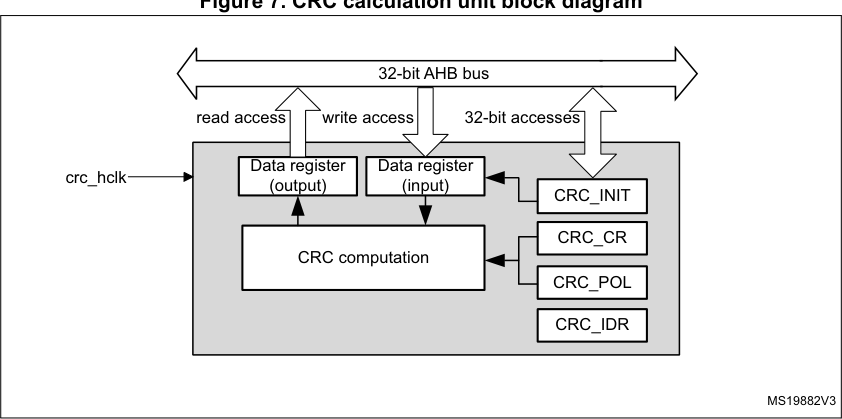
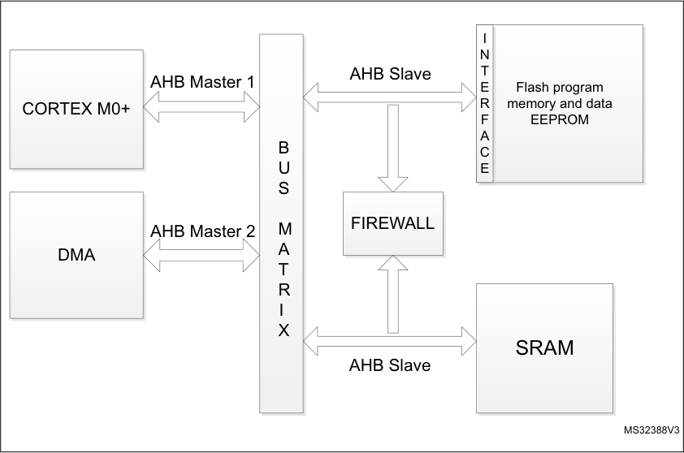
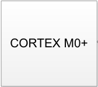
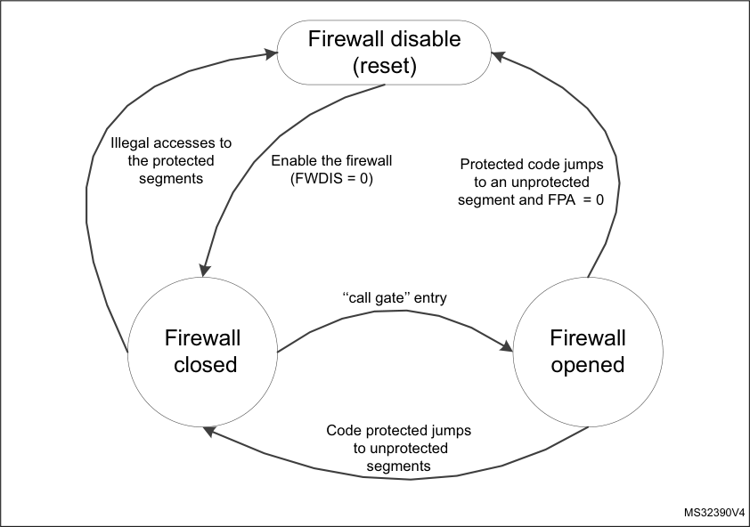
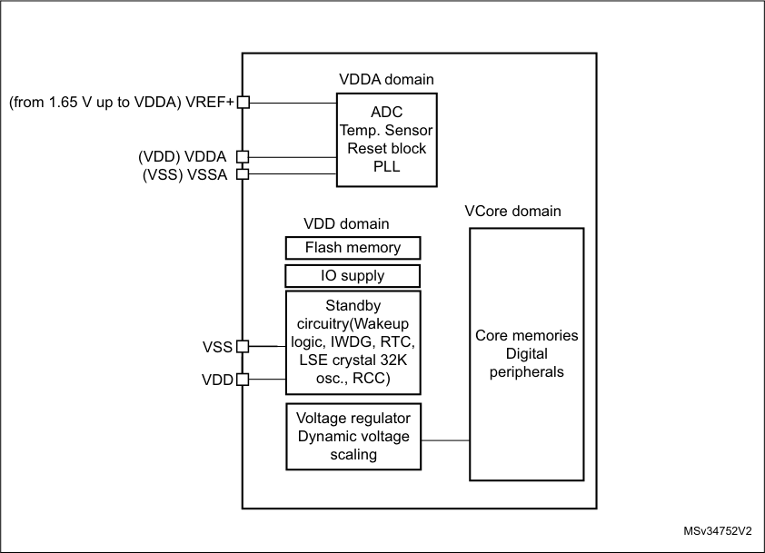
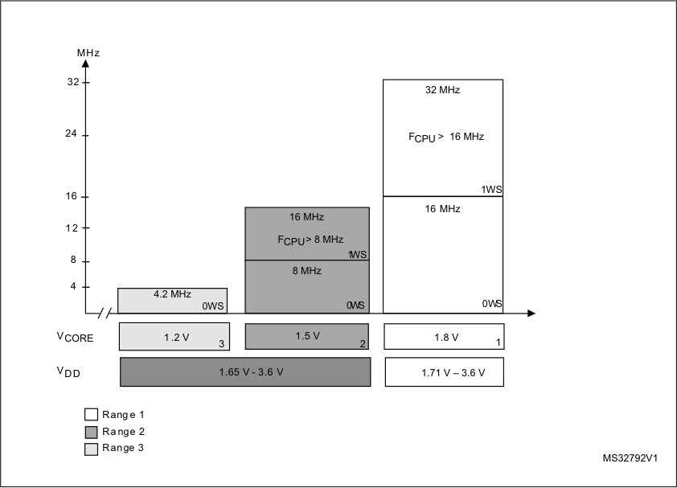
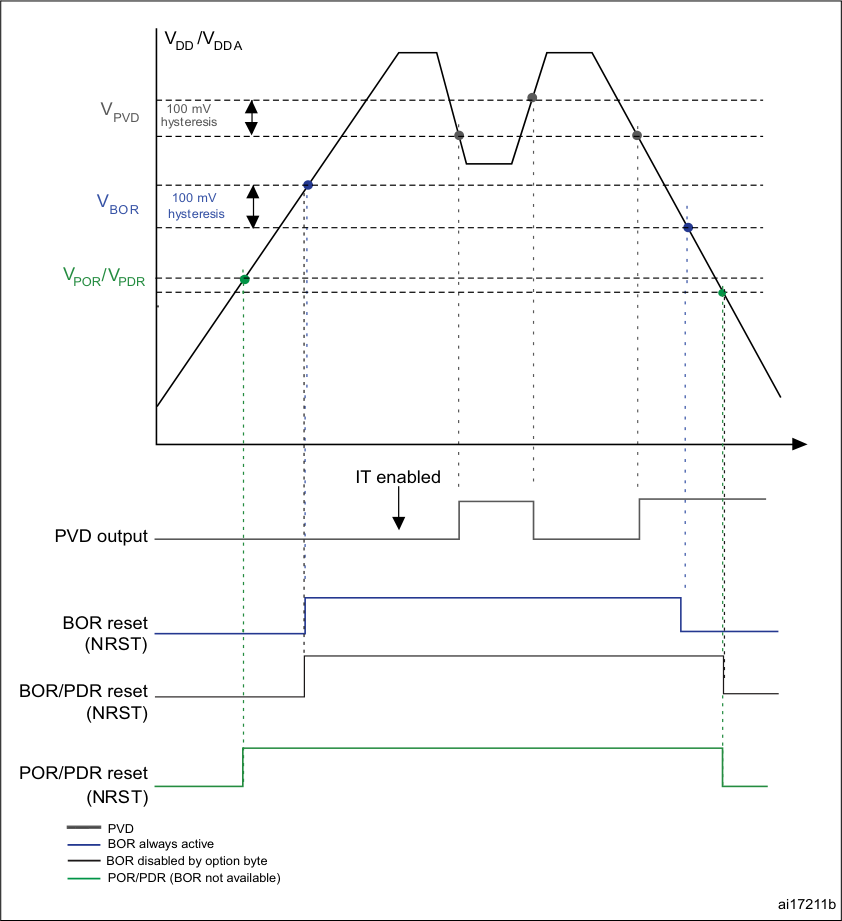
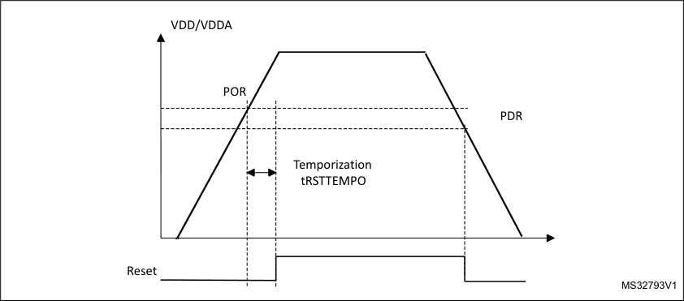
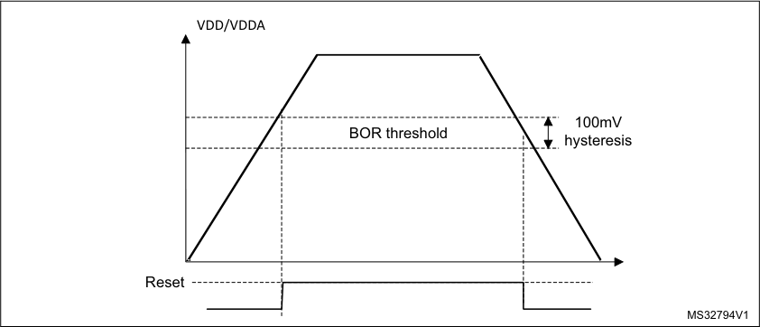
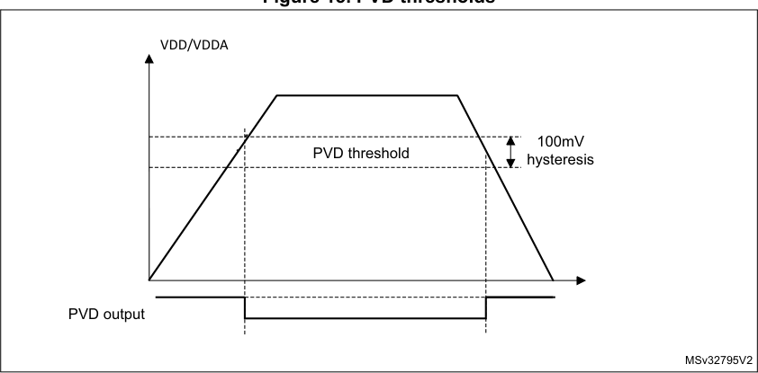

# RM0377 STM32L0x1 — Pages 101–150

**RM0377** **Flash program memory and data EEPROM (FLASH)**

**3.7.1** **Access control register (FLASH_ACR)**

Address offset: 0x00

Reset value: 0x0000 0000

|31|30|29|28|27|26|25|24|23|22|21|20|19|18|17|16|
|---|---|---|---|---|---|---|---|---|---|---|---|---|---|---|---|
|Res.|Res.|Res.|Res.|Res.|Res.|Res.|Res.|Res.|Res.|Res.|Res.|Res.|Res.|Res.|Res.|
|||||||||||||||||

|15|14|13|12|11|10|9|8|7|6|5|4|3|2|1|0|
|---|---|---|---|---|---|---|---|---|---|---|---|---|---|---|---|
|Res.|Res.|Res.|Res.|Res.|Res.|Res.|Res.|Res.|PRE_READ|DISAB_BUF|RUN_PD|SLEEP_PD|Res.|PRFTEN|LATENCY|
||||||||||rw|rw|rw|rw||rw|rw|

Bits 31:7 Reserved, must be kept at reset value

Bit 6 **PRE_READ**

This bit enables the pre-read.

0: The pre-read is disabled
1: The pre-read is enabled. The memory interface stores the last address read as data and
tries to read the next one when no other read or write or prefetch operation is ongoing.

_Note: It is automatically reset every time the DISAB_BUF bit (in this register) is set to 1._

Bit 5 **DISAB_BUF**

This bit disables the buffers used as a cache during a read. This means that every read will
access the NVM even for an address already read (for example, the previous address). When
this bit is reset, the PRFTEN and PRE_READ bits are automatically reset, too.

0: The buffers are enabled

1: The buffers are disabled. Every time one NVM value is necessary, one new memory read
sequence has do be done.

Bit 4 **RUN_PD**

This bit determines if the NVM is in power-down mode or in idle mode when the device is in run
mode. It is possible to write this bit only when there is an unlocked writing of the
FLASH_PDKEYR register.

The correct sequence is explained in _Section 3.6.4: Power-down_ . When writing this bit to 0, the
keys are automatically lost and a new unlock sequence is necessary to re-write it to 1.

0: When the device is in Run mode, the NVM is in Idle mode.

1: When the device is in Run mode, the NVM is in power-down mode.

Bit 3 **SLEEP_PD**

This bit allows to have the Flash program memory and data EEPROM in power-down mode or
in idle mode when the device is in Sleep mode.

0: When the device is in Sleep mode, the NVM is in Idle mode.
1: When the device is in Sleep mode, the NVM is in power-down mode.

RM0377 Rev 10 101/905

116

--- end of page=100 ---

**Flash program memory and data EEPROM (FLASH)** **RM0377**

Bit 2 Reserved, must be kept at reset value

Bit 1 **PRFTEN**

This bit enables the prefetch. It is automatically reset every time the DISAB_BUF bit (in this
register) is set to 1. To know how the prefetch works, see the _Fetch and prefetch_ section.

0: The prefetch is disabled.
1: The prefetch is enabled. The memory interface stores the last address fetched and tries to
read the next one when no other read or write operation is ongoing.

Bit 0 **LATENCY**

The value of this bit specifies if a 0 or 1 wait-state is necessary to read the NVM. The user must
write the correct value relative to the core frequency and the operation mode (power). The
correct value to use can be found in _Table 15_ . No check is done to verify if the configuration is
correct.

To increase the clock frequency, the user has to change this bit to ‘1’, then to increase the
frequency. To reduce the clock frequency, the user has to decrease the frequency, then to
change this bit to ‘0’.

0: Zero wait state is used to read a word in the NVM.

1: One wait state is used to read a word in the NVM.

**3.7.2** **Program and erase control register (FLASH_PECR)**

Address offset: 0x04

Reset value: 0x0000 0007

This register can only be written after a good write sequence done in FLASH_PEKEYR,
resetting the PELOCK bit.

|31|30|29|28|27|26|25|24|23|22|21|20|19|18|17|16|
|---|---|---|---|---|---|---|---|---|---|---|---|---|---|---|---|
|Res.|Res.|Res.|Res.|Res.|Res.|Res.|Res.|NZDISABLE|Res.|Res.|Res.|Res.|OBL_LAUNCH|ERRIE|EOPIE|
|||||||||rw|||||rw|rw|rw|

|15|14|13|12|11|10|9|8|7|6|5|4|3|2|1|0|
|---|---|---|---|---|---|---|---|---|---|---|---|---|---|---|---|
|PARRALELBANK|Res.|Res.|Res.|Res.|FPRG|ERASE|FIX|Res.|Res.|Res.|DATA|PROG|OPT_LOCK|PRG_LOCK|PE_LOCK|
|rw|||||rw|rw|rw||||rw|rw|rs|rs|rs|

102/905 RM0377 Rev 10

--- end of page=101 ---

**RM0377** **Flash program memory and data EEPROM (FLASH)**

Bits 31:24 Reserved, must be kept at reset value

Bit 23 **NZDISABLE:** Non-Zero check notification disable

When this bit is set, the application software does not check if the previous NVM content is
zero before programming a word or an half-page in the program or boot area. As a result,
the NOTZEROERR flag will always remain at 0 and no interrupt will be generated if the
above condition is met. By default, NZDISABLE is set to 0. It can be modified only when
PELOCK is 0.

0: error interrupt disabled
1: error interrupt enabled
On category 3 devices, this bit is not available and the behavior corresponds to
NZDISABLE=0.

Bits 22:19 Reserved, must be kept at reset value

Bit 18 **OBL_LAUNCH**

Setting this bit, the software requests the reloading of Option byte. The Option byte reloading
does not stop an ongoing modify operation, but it blocks new ones. The Option byte reloading
generates a system reset.

0: Option byte loading completed.
1: Option byte loading to be done.

_Note: This bit can only be modified when OPTLOCK is 0. Locking OPTLOCK (or other lock_
_bits) does not reset this bit._

Bit 17 **ERRIE:** Error interrupt enable

0: Error interrupt disable.
1: Error interrupt enable.

_Note: This bit can only be modified when PELOCK is 0. Locking PELOCK does not reset this_
_bit; the interrupt remains enabled._

Bit 16 **EOPIE:** End of programming interrupt enable

0: End of program interrupt disable.
1: End of program interrupt enable.

_Note: This bit can only be modified when PELOCK is 0. Locking PELOCK does not reset this_
_bit; the interrupt remains enabled._

Bit 15 **PARALLELBANK:** Parallel bank programming mode.

This bit can be set and cleared by software when no program or erase operation is ongoing.
When it is set, 2 half-pages can be programmed, the first one in Bank 1 and the second one
in Bank 2.

0: Parallel bank mode disabled

1: Parallel bank mode enabled

This bit is available only for category 5 devices.

Bits 14:11 Reserved, must be kept at reset value

Bit 10 **FPRG:** Half Page programming mode

0: Half Page programming disabled.
1: Half Page programming enabled.

_Note: This bit can be modified when PELOCK is 0. It is reset when PELOCK is set._

Bit 9 **ERASE**

0: No erase operation requested.
1: Erase operation requested.

_Note: This bit can be modified when PELOCK is 0. It is reset when PELOCK is set._

RM0377 Rev 10 103/905

116

--- end of page=102 ---

**Flash program memory and data EEPROM (FLASH)** **RM0377**

Bit 8 **FIX**

0: An erase phase is automatically performed, when necessary, before a program operation
in the data EEPROM and the Option bytes areas. The programming time can be:
Tprog (program operation) or 2 * Tprog (erase + program operations).
1: The program operation is always performed with a preliminary erase and the
programming time is: 2 * Tprog.

_Note: This bit can be modified when PELOCK is 0. It is reset when PELOCK is set._

Bits 7:5 Reserved, must be kept at reset value

Bit 4 **DATA**

0: Data EEPROM not selected.

1: Data memory selected.

_Note: This bit can be modified when PELOCK is 0. It is reset when PELOCK is set.This bit is_

_not very useful as the page and word have the same size in the data EEPROM, but it is_
_used to identify an erase_ operation _(by page) from a word_ operation _._

Bit 3 **PROG**

This bit is used for half-page program operations and for page erase operations in the Flash

program memory.

0: The Flash program memory is not selected.
1: The Flash program memory is selected.

_Note: This bit can be modified when PELOCK is 0. It is reset when PELOCK is set._

104/905 RM0377 Rev 10

--- end of page=103 ---

**RM0377** **Flash program memory and data EEPROM (FLASH)**

Bit 2 **OPTLOCK:** Option bytes lock

This bit blocks the write/erase operations to the user Option bytes area and the
OBL_LAUNCH bit (in this register). It can only be written to 1 to re-lock. To reset to 0, a correct
sequence of unlock with OPTKEYR register is necessary (see _Unlocking the Option bytes_
_area_ ), with PELOCK bit at 0. If the sequence is not correct, the bit will be locked until the next
system reset and a hard fault is generated. If the sequence is executed when PELOCK = 1,
the bit remains locked and no hard fault is generated. The keys to unlock are:

– First key:0xFBEAD9C8

– Second key: 0x24252627

0: The write and erase operations in the Option bytes area are disabled.
1: The write and erase operations in the Option bytes area are enabled.

_Note: This bit is set when PELOCK is set._

Bit 1 **PRGLOCK:** Program memory lock

This bit blocks the write/erase operations to the Flash program memory. It can only be written
to 1 to re-lock. To reset to 0, a correct sequence of unlock with PRGKEYR register is
necessary (see _Unlocking the Flash program memory_ ), with PELOCK bit at 0. If the sequence
is not correct, the bit will be locked until the next system reset and a hard fault is generated. If
the sequence is executed when PELOCK = 1, the bit remains locked and no hard fault is
generated. The keys to unlock are:

– First key:0x8C9DAEBF

– Second key: 0x13141516

0: The write and erase operations in the Flash program memory are disabled.
1: The write and erase operations in the Flash program memory are enabled.

_Note: This bit is set when PELOCK is set._

Bit 0 **PELOCK:** FLASH_PECR lock

This bit locks the FLASH_PECR register. It can only be written to 1 to re-lock. To reset to 0, a
correct sequence of unlock with PEKEYR register (see _Unlocking the data EEPROM and the_
_FLASH_PECR register_ ) is necessary. If the sequence is not correct, the bit will be locked until
the next system reset and one hard fault is generated. The keys to unlock are:

– First key: 0x89ABCDEF

– Second key: 0x02030405

0: The FLASH_PECR register is unlocked; it can be modified and the other bits unlocked.
Data write/erase operations are enabled.
1: The FLASH_PECR register is locked and no write/erase operation can start.

RM0377 Rev 10 105/905

116

--- end of page=104 ---

**Flash program memory and data EEPROM (FLASH)** **RM0377**

**3.7.3** **Power-down key register (FLASH_PDKEYR)**

Address offset: 0x08

Reset value: 0x0000 0000

|31 30 29 28 27 26 25 24 23 22 21 20 19 18 17 16|Col2|Col3|Col4|Col5|Col6|Col7|Col8|Col9|Col10|Col11|Col12|Col13|Col14|Col15|Col16|
|---|---|---|---|---|---|---|---|---|---|---|---|---|---|---|---|
|FLASH_PDKEYR[31:16]|FLASH_PDKEYR[31:16]|FLASH_PDKEYR[31:16]|FLASH_PDKEYR[31:16]|FLASH_PDKEYR[31:16]|FLASH_PDKEYR[31:16]|FLASH_PDKEYR[31:16]|FLASH_PDKEYR[31:16]|FLASH_PDKEYR[31:16]|FLASH_PDKEYR[31:16]|FLASH_PDKEYR[31:16]|FLASH_PDKEYR[31:16]|FLASH_PDKEYR[31:16]|FLASH_PDKEYR[31:16]|FLASH_PDKEYR[31:16]|FLASH_PDKEYR[31:16]|
|w|w|w|w|w|w|w|w|w|w|w|w|w|w|w|w|

|15 14 13 12 11 10 9 8 7 6 5 4 3 2 1 0|Col2|Col3|Col4|Col5|Col6|Col7|Col8|Col9|Col10|Col11|Col12|Col13|Col14|Col15|Col16|
|---|---|---|---|---|---|---|---|---|---|---|---|---|---|---|---|
|FLASH_PDKEYR15:0]|FLASH_PDKEYR15:0]|FLASH_PDKEYR15:0]|FLASH_PDKEYR15:0]|FLASH_PDKEYR15:0]|FLASH_PDKEYR15:0]|FLASH_PDKEYR15:0]|FLASH_PDKEYR15:0]|FLASH_PDKEYR15:0]|FLASH_PDKEYR15:0]|FLASH_PDKEYR15:0]|FLASH_PDKEYR15:0]|FLASH_PDKEYR15:0]|FLASH_PDKEYR15:0]|FLASH_PDKEYR15:0]|FLASH_PDKEYR15:0]|
|w|w|w|w|w|w|w|w|w|w|w|w|w|w|w|w|

Bits 31:0 This is a write-only register. With a sequence of two write operations (the first one with
0x04152637 and the second one with 0xFAFBFCFD), the write size being that of a word, it is
possible to unlock the RUN_PD bit of the FLASH_ACR register. For more details, refer to
_Section 3.6.4: Power-down_ .

**3.7.4** **PECR unlock key register (FLASH_PEKEYR)**

Address offset: 0x0C

Reset value: 0x0000 0000

|31 30 29 28 27 26 25 24 23 22 21 20 19 18 17 16|Col2|Col3|Col4|Col5|Col6|Col7|Col8|Col9|Col10|Col11|Col12|Col13|Col14|Col15|Col16|
|---|---|---|---|---|---|---|---|---|---|---|---|---|---|---|---|
|FLASH_PEKEYR[31:16]|FLASH_PEKEYR[31:16]|FLASH_PEKEYR[31:16]|FLASH_PEKEYR[31:16]|FLASH_PEKEYR[31:16]|FLASH_PEKEYR[31:16]|FLASH_PEKEYR[31:16]|FLASH_PEKEYR[31:16]|FLASH_PEKEYR[31:16]|FLASH_PEKEYR[31:16]|FLASH_PEKEYR[31:16]|FLASH_PEKEYR[31:16]|FLASH_PEKEYR[31:16]|FLASH_PEKEYR[31:16]|FLASH_PEKEYR[31:16]|FLASH_PEKEYR[31:16]|
|w|w|w|w|w|w|w|w|w|w|w|w|w|w|w|w|

|15 14 13 12 11 10 9 8 7 6 5 4 3 2 1 0|Col2|Col3|Col4|Col5|Col6|Col7|Col8|Col9|Col10|Col11|Col12|Col13|Col14|Col15|Col16|
|---|---|---|---|---|---|---|---|---|---|---|---|---|---|---|---|
|FLASH_PEKEYR15:0]|FLASH_PEKEYR15:0]|FLASH_PEKEYR15:0]|FLASH_PEKEYR15:0]|FLASH_PEKEYR15:0]|FLASH_PEKEYR15:0]|FLASH_PEKEYR15:0]|FLASH_PEKEYR15:0]|FLASH_PEKEYR15:0]|FLASH_PEKEYR15:0]|FLASH_PEKEYR15:0]|FLASH_PEKEYR15:0]|FLASH_PEKEYR15:0]|FLASH_PEKEYR15:0]|FLASH_PEKEYR15:0]|FLASH_PEKEYR15:0]|
|w|w|w|w|w|w|w|w|w|w|w|w|w|w|w|w|

Bits 31:0 This is a write-only register. With a sequence of two write operations (the first one with
0x89ABCDEF and the second one with 0x02030405), the write size being that of a word, it is
possible to unlock the FLASH_PECR register. For more details, refer to _Unlocking the data_
_EEPROM and the FLASH_PECR register_ .

**3.7.5** **Program and erase key register (FLASH_PRGKEYR)**

Address offset: 0x10

Reset value: 0x0000 0000

|31 30 29 28 27 26 25 24 23 22 21 20 19 18 17 16|Col2|Col3|Col4|Col5|Col6|Col7|Col8|Col9|Col10|Col11|Col12|Col13|Col14|Col15|Col16|
|---|---|---|---|---|---|---|---|---|---|---|---|---|---|---|---|
|FLASH_PRGKEYR[31:16]|FLASH_PRGKEYR[31:16]|FLASH_PRGKEYR[31:16]|FLASH_PRGKEYR[31:16]|FLASH_PRGKEYR[31:16]|FLASH_PRGKEYR[31:16]|FLASH_PRGKEYR[31:16]|FLASH_PRGKEYR[31:16]|FLASH_PRGKEYR[31:16]|FLASH_PRGKEYR[31:16]|FLASH_PRGKEYR[31:16]|FLASH_PRGKEYR[31:16]|FLASH_PRGKEYR[31:16]|FLASH_PRGKEYR[31:16]|FLASH_PRGKEYR[31:16]|FLASH_PRGKEYR[31:16]|
|w|w|w|w|w|w|w|w|w|w|w|w|w|w|w|w|

|15 14 13 12 11 10 9 8 7 6 5 4 3 2 1 0|Col2|Col3|Col4|Col5|Col6|Col7|Col8|Col9|Col10|Col11|Col12|Col13|Col14|Col15|Col16|
|---|---|---|---|---|---|---|---|---|---|---|---|---|---|---|---|
|FLASH_PRGKEYR15:0]|FLASH_PRGKEYR15:0]|FLASH_PRGKEYR15:0]|FLASH_PRGKEYR15:0]|FLASH_PRGKEYR15:0]|FLASH_PRGKEYR15:0]|FLASH_PRGKEYR15:0]|FLASH_PRGKEYR15:0]|FLASH_PRGKEYR15:0]|FLASH_PRGKEYR15:0]|FLASH_PRGKEYR15:0]|FLASH_PRGKEYR15:0]|FLASH_PRGKEYR15:0]|FLASH_PRGKEYR15:0]|FLASH_PRGKEYR15:0]|FLASH_PRGKEYR15:0]|
|w|w|w|w|w|w|w|w|w|w|w|w|w|w|w|w|

Bits 31:0 This is a write-only register. With a sequence of two write operations (the first one with
0x8C9DAEBF and the second one with 0x13141516), the write size being that of a word, it is
possible to unlock the Flash program memory. The sequence can only be executed when
PELOCK is already unlocked. For more details, refer to _Unlocking the Flash program memory_ .

106/905 RM0377 Rev 10

--- end of page=105 ---

**RM0377** **Flash program memory and data EEPROM (FLASH)**

**3.7.6** **Option bytes unlock key register (FLASH_OPTKEYR)**

Address offset: 0x14

Reset value: 0x0000 0000

|31 30 29 28 27 26 25 24 23 22 21 20 19 18 17 16|Col2|Col3|Col4|Col5|Col6|Col7|Col8|Col9|Col10|Col11|Col12|Col13|Col14|Col15|Col16|
|---|---|---|---|---|---|---|---|---|---|---|---|---|---|---|---|
|FLASH_OPTKEYR[31:16]|FLASH_OPTKEYR[31:16]|FLASH_OPTKEYR[31:16]|FLASH_OPTKEYR[31:16]|FLASH_OPTKEYR[31:16]|FLASH_OPTKEYR[31:16]|FLASH_OPTKEYR[31:16]|FLASH_OPTKEYR[31:16]|FLASH_OPTKEYR[31:16]|FLASH_OPTKEYR[31:16]|FLASH_OPTKEYR[31:16]|FLASH_OPTKEYR[31:16]|FLASH_OPTKEYR[31:16]|FLASH_OPTKEYR[31:16]|FLASH_OPTKEYR[31:16]|FLASH_OPTKEYR[31:16]|
|w|w|w|w|w|w|w|w|w|w|w|w|w|w|w|w|

|15 14 13 12 11 10 9 8 7 6 5 4 3 2 1 0|Col2|Col3|Col4|Col5|Col6|Col7|Col8|Col9|Col10|Col11|Col12|Col13|Col14|Col15|Col16|
|---|---|---|---|---|---|---|---|---|---|---|---|---|---|---|---|
|FLASH_OPTKEYR[15:0]|FLASH_OPTKEYR[15:0]|FLASH_OPTKEYR[15:0]|FLASH_OPTKEYR[15:0]|FLASH_OPTKEYR[15:0]|FLASH_OPTKEYR[15:0]|FLASH_OPTKEYR[15:0]|FLASH_OPTKEYR[15:0]|FLASH_OPTKEYR[15:0]|FLASH_OPTKEYR[15:0]|FLASH_OPTKEYR[15:0]|FLASH_OPTKEYR[15:0]|FLASH_OPTKEYR[15:0]|FLASH_OPTKEYR[15:0]|FLASH_OPTKEYR[15:0]|FLASH_OPTKEYR[15:0]|
|w|w|w|w|w|w|w|w|w|w|w|w|w|w|w|w|

Bits 31:0 This is a write-only register. With a sequence of two write operations (the first one with
0xFBEAD9C8 and the second one with 0x24252627), the write size being that of a word, it is
possible to unlock the Option bytes area and the OBL_LAUNCH bit. The sequence can only be
executed when PELOCK is already unlocked. For more details, refer to _Unlocking the Option_
_bytes area_ .

RM0377 Rev 10 107/905

116

--- end of page=106 ---

**Flash program memory and data EEPROM (FLASH)** **RM0377**

**3.7.7** **Status register (FLASH_SR)**

Address offset: 0x018

Reset value: 0x0000 000C

|31|30|29|28|27|26|25|24|23|22|21|20|19|18|17|16|
|---|---|---|---|---|---|---|---|---|---|---|---|---|---|---|---|
|Res.|Res.|Res.|Res.|Res.|Res.|Res.|Res.|Res.|Res.|Res.|Res.|Res.|Res.|FWWER|NOTZERO ERR|
|||||||||||||||rc_w1|rc_w1|

|15|14|13|12|11|10|9|8|7|6|5|4|3|2|1|0|
|---|---|---|---|---|---|---|---|---|---|---|---|---|---|---|---|
|Res.|Res.|RDERR|Res.|OPTVERR|SIZERR|PGAERR|WRPERR|Res.|Res.|Res.|Res.|READY|ENDHV|EOP|BSY|
|||rc_w1||rc_w1|rc_w1|rc_w1|rc_w1|||||r|r|rc_w1|r|

Bits 31:18 Reserved, must be kept at reset value

Bit 17 **FWWERR**

This bit is set by hardware when a write/erase operation is aborted to perform a fetch. This is
not a real error, but it is used to inform that the write/erase operation did not execute. To reset
this flag, write 1.

0: No write/erase operation aborted to perform a fetch.
1: A write/erase operation aborted to perform a fetch.

Bit 16 **NOTZEROERR**

This bit is set by hardware when a program in the Flash program or System Memory tries to
overwrite a not-zero area. In category 3 devices, this flag does not stop the program operation:
it is possible that the value found when reading back is not what the user wrote. To reset this
flag, write 1.

0: The write operation is done in an erased region or the memory interface can apply an
erase before a write.

1: The write operation is attempting to write to a not-erased region and the memory interface
cannot apply an erase before a write. Except for category 3 devices, the modify operation is
aborted. For category 3 devices a not-zero error does not abort the write/erase operation.

Bits 15:14 Reserved, must be kept at reset value

Bit 13 **RDERR**

This bit is set by hardware when the user tries to read an area protected by PcROP. It is
cleared by writing 1.

0: No read protection error happened.
1: One read protection error happened.

Bit 12 Reserved, must be kept at reset value

Bit 11 **OPTVERR** : Option valid error

This bit is set by hardware when, during an Option byte loading, there was a mismatch for one
or more configurations. It means that the configurations loaded may be different from what the
user wrote in the memory. It is cleared by writing 1.

If an error happens while loading the protections (WPRMOD, RDPROT, WRPROT), the source
code in the Flash program memory may not execute correctly.

0: No error happened during the Option bytes loading.
1: One or more errors happened during the Option bytes loading.

108/905 RM0377 Rev 10

--- end of page=107 ---

**RM0377** **Flash program memory and data EEPROM (FLASH)**

Bit 10 **SIZERR** : Size error

This bit is set by hardware when the size of data to program is not correct. It is cleared by
writing 1.

0: No size error happened.
1: One size error happened.

Bit 9 **PGAERR** : Programming alignment error

This bit is set by hardware when an alignment error has happened: the first word of a half-page
operation is not aligned to a half-page, or one of the following words in a half-page operation
does not belong to the same half-page as the first word. When this bit is set, it has to be
cleared before writing 1, and no half-page operation is accepted.

0: No alignment error happened.
1: One alignment error happened.

Bit 8 **WRPERR** : Write protection error

This bit is set by hardware when an address to be programmed or erased is write-protected. It
is cleared by writing 1.

0: No protection error happened.
1: One protection error happened.

Bits 7:4 Reserved, must be kept at reset value

Bit 3 **READY**

When this bit is set, the NVM is ready for read and write/erase operations.

0: The NVM is not ready. No read or write/erase operation can be done.
1: The NVM is ready.

Bit 2 **ENDHV**

This bit is set and reset by hardware.

0: High voltage is executing a write/erase operation in the NVM.
1: High voltage is off, no write/erase operation is ongoing.

Bit 1 **EOP** : End of program

This bit is set by hardware at the end of a write or erase operation when the operation has not
been aborted. It is reset by software (writing 1).

0: No EOP operation occurred
1: An EOP event occurred. An interrupt is generated if EOPIE bit is set.

Bit 0 **BSY:** Memory interface busy

Write/erase operations are in progress.

0: No write/erase operation is in progress.
1: A write/erase operation is in progress.

RM0377 Rev 10 109/905

116

--- end of page=108 ---

**Flash program memory and data EEPROM (FLASH)** **RM0377**

**3.7.8** **Option bytes register (FLASH_OPTR)**

Address offset 0x1C

Reset value: 0xX0XX 0XXX. It depends on the value programmed in the option bytes.
During production, it is set to 0x8070 00AA.

|31|30|29|28|27|26|25|24|23|22|21|20|19 18 17 16|Col14|Col15|Col16|
|---|---|---|---|---|---|---|---|---|---|---|---|---|---|---|---|
|nBOOT1|nBOOT0|nBOOT_SEL|Res.|Res.|Res.|Res.|Res.|BFB2|nRST_STDBY|nRTS_STOP|WDG_SW|BOR_LEV[3:0]|BOR_LEV[3:0]|BOR_LEV[3:0]|BOR_LEV[3:0]|
|r|r|r||||||r|r|r|r|r|r|r|r|

|15|14|13|12|11|10|9|8|7 6 5 4 3 2 1 0|Col10|Col11|Col12|Col13|Col14|Col15|Col16|
|---|---|---|---|---|---|---|---|---|---|---|---|---|---|---|---|
|Res.|Res.|Res.|Res.|Res.|Res.|Res.|WPRMOD|RDPROT|RDPROT|RDPROT|RDPROT|RDPROT|RDPROT|RDPROT|RDPROT|
||||||||r|r|r|r|r|r|r|r|r|

Bit 31 **nBOOT1**

This bit is used in conjunction with BOOT0 signal to configure the device boot mode (see
_Section 2.4: Boot configuration_ ).

If there is a mismatch on this configuration during the Option bytes loading, it is loaded with 1.
If the device is protected at Level 2, BOOT0 and nBOOT1 lose their meaning: the boot is
always forced in the Flash program memory.

Bit 30 **nBOOT0**

This bit is available on category 1 devices only.

When nBOOT_SEL is set, nBOOT0 bit defines the value of BOOT0 signal that is used to
select the device boot mode (see _Section 2.4: Boot configuration_ ).

Bit 29 **nBOOT_SEL**

0: BOOT0 signal is defined by BOOT0 pin value (default mode)
1: BOOT0 signal is defined by nBOOT0 option bit
This bit is available on category 1 devices only. It is held at ‘0’ on other devices.

Bits 28:24 Reserved, must be kept at reset value

Bit 23 **BFB2** : Boot from Bank 2

This bit contains the user option byte loaded by the device OPTL. This bit is used to boot
from Bank 2. Actually this bit indicates whether a boot from System memory or from Flash
program memory has been selected. If boot from System memory is selected, the jump to
Bank 1 or Bank 2 is performed by software depending on the value of the first two words at
the beginning of each bank. When BFB2 is set, user Flash memory is not aliased at address
0. Instead, the System Flash memory is aliased at address 0 through MEM_MODE bits in
SYSCFG_CFGR1. When BFB2 is set, the PRIMASK is set at code startup. It prevents the
activation of all exceptions that have a configurable priority.
0: BOOT from Bank 1 (category 5 devices) or USER Flash memory (other categories)
1: BOOT from System memory

_Note: This bit is available in category 5 devices only._

Bit 22 **nRST_STDBY**

If there is a mismatch on this configuration during the Option bytes loading, it is loaded with 1.

0: Reset generated when entering the Standby mode.
1: No reset generated.

110/905 RM0377 Rev 10

--- end of page=109 ---

**RM0377** **Flash program memory and data EEPROM (FLASH)**

Bit 21 **nRST_STOP**

If there is a mismatch on this configuration during the Option bytes loading, it is loaded with 1.

0: Reset generated when entering the Stop mode.
1: No reset generated.

Bit 20 **WDG_SW**

If there is a mismatch on this configuration during the Option bytes loading, it is loaded with 1.

0: Hardware watchdog.
1: Software watchdog.

Bits 19:16 **BOR_LEV** : Brownout reset threshold level

These bits reset the threshold level for a 1.45 V to 1.55 V voltage range (power-down only). In
this particular case, V DD must have been above V BOR0 to start the device OBL sequence, in
order to disable the BOR. The power-down is then monitored by the PDR. If the BOR is
disabled, a “grey zone” exists between 1.65 V and the VPDR threshold (this means V DD can
be below the minimum operating voltage (1.65 V) without any reset until the VPDR threshold).

If there is a mismatch on this configuration during the Option bytes loading, it is loaded with
0x8.

0xxx: **BOR OFF** . This is the reset threshold level for the 1.45 V - 1.55 V voltage range
(power-down only).
In this particular case, V DD must have been above BOR LEVEL 1 to start the device OBL
sequence in order to disable the BOR. The power-down is then monitored by the PDR.

_Note: If the BOR is disabled, a "grey zone" exists between 1.65 V and the VPDR threshold_
_(this means that_ V DD _may be below the minimum operating voltage (1.65 V) without_
_causing a reset until it crosses the VPDR threshold)_

1000: **BOR LEVEL 1** is the reset threshold level for V BOR0 (around 1.8 V)
1001: **BOR LEVEL 2** is the reset threshold level for V BOR1 (around 2.0 V)
1010: **BOR LEVEL 3** is the reset threshold level for V BOR2 (around 2.5 V)
1011: **BOR LEVEL 4** is the reset threshold level for V BOR3 (around 2.7 V).
1100: **BOR LEVEL 5** is the reset threshold level for V BOR4 (around 3.0 V)

_Note: Refer to the device datasheets for the exact definition of BOR levels._

Bits 15:9 Reserved, must be kept at reset value

Bit 8 **WPRMOD**

This bit selects between write and read protection of Flash program memory sectors. If there is
a mismatch on this configuration during the Option bytes loading, it is loaded with 1.

0: PCROP disabled. The WRPROT bits are used as a write protection on a sector.
1: PCROP enabled. The WRPROT bits are used as a read protection on a sector.

Bits 7:0 **RDPROT** : Read protection

These bits contain the protection level loaded during the Option byte loading. If there is a
mismatch on this configuration during the Option bytes loading, it is loaded with 0x00.

0xAA: Level 0

0xCC: Level 2

Others: Level 1

RM0377 Rev 10 111/905

116

--- end of page=110 ---

**Flash program memory and data EEPROM (FLASH)** **RM0377**

**3.7.9** **Write protection register 1 (FLASH_WRPROT1)**

Address offset: 0x20

Reset value: 0xXXXX XXXX. It depends on the value programmed in the option bytes.
During production, it is set to 0x0000 0000.

|31 30 29 28 27 26 25 24 23 22 21 20 19 18 17 16|Col2|Col3|Col4|Col5|Col6|Col7|Col8|Col9|Col10|Col11|Col12|Col13|Col14|Col15|Col16|
|---|---|---|---|---|---|---|---|---|---|---|---|---|---|---|---|
|WRPROT1[31:16]|WRPROT1[31:16]|WRPROT1[31:16]|WRPROT1[31:16]|WRPROT1[31:16]|WRPROT1[31:16]|WRPROT1[31:16]|WRPROT1[31:16]|WRPROT1[31:16]|WRPROT1[31:16]|WRPROT1[31:16]|WRPROT1[31:16]|WRPROT1[31:16]|WRPROT1[31:16]|WRPROT1[31:16]|WRPROT1[31:16]|
|r|r|r|r|r|r|r|r|r|r|r|r|r|r|r|r|

|15 14 13 12 11 10 9 8 7 6 5 4 3 2 1 0|Col2|Col3|Col4|Col5|Col6|Col7|Col8|Col9|Col10|Col11|Col12|Col13|Col14|Col15|Col16|
|---|---|---|---|---|---|---|---|---|---|---|---|---|---|---|---|
|WRPROT1[15:0]|WRPROT1[15:0]|WRPROT1[15:0]|WRPROT1[15:0]|WRPROT1[15:0]|WRPROT1[15:0]|WRPROT1[15:0]|WRPROT1[15:0]|WRPROT1[15:0]|WRPROT1[15:0]|WRPROT1[15:0]|WRPROT1[15:0]|WRPROT1[15:0]|WRPROT1[15:0]|WRPROT1[15:0]|WRPROT1[15:0]|
|r|r|r|r|r|r|r|r|r|r|r|r|r|r|r|r|

Bits 31:0 **WRPROT1:** Write protection

– If WPRMOD = 0 in the FLASH_OPTR register, these bits contain the write protection
configuration for the Flash memory (every bit protects a 4-Kbyte sector: the first bit protects
the first sector, the second bit protects the second page and so on). In this case, 1 = sector
protected, 0 = no protection.

– If WPRMOD = 1, these bits are used to protect from reading as data (see _Read as data and_
_pre-read_ ), and then also from writing, with the same granularity and with the same
combination of bits and sectors. The read protection does not protect against a fetch. In this
case, 1 = no protection, 0 = sector protected.

When WPRMOD = 0, it is possible to set or reset these bits without any limitation changing
the relative Option bytes.

When WPRMOD = 1, it is only possible to increase the protection, which means that the user
can add zeros but cannot add ones.

The mass erase deletes the WPRMOD bits but does not delete the content of this register.
After a mass erase, the user must write the relative Option bytes with zeros to remove
completely the write protections.

If there is a mismatch on this configuration during the Option bytes loading, and the content of
WPRMOD in the FLASH_OPTR register is:

1, this configuration is loaded with 0x0000.
0, this configuration is loaded with 0xFFFF.

If there was a mismatch when WPRMOD was loaded in the FLASH_OPTR register (thus
loaded with ones), the register is loaded with 0x0000.

112/905 RM0377 Rev 10

--- end of page=111 ---

**RM0377** **Flash program memory and data EEPROM (FLASH)**

**3.7.10** **Write protection register 2 (FLASH_WRPROT2)**

Address offset: 0x80

Reset value: 0x 0000 XXXX. It depends on the value programmed in the option bytes.
During production, it is set to 0x0000 0000.

|31|30|29|28|27|26|25|24|23|22|21|20|19|18|17|16|
|---|---|---|---|---|---|---|---|---|---|---|---|---|---|---|---|
|Res.|Res.|Res.|Res.|Res.|Res.|Res.|Res.|Res.|Res.|Res.|Res.|Res.|Res.|Res.|Res.|
|||||||||||||||||

|15 14 13 12 11 10 9 8 7 6 5 4 3 2 1 0|Col2|Col3|Col4|Col5|Col6|Col7|Col8|Col9|Col10|Col11|Col12|Col13|Col14|Col15|Col16|
|---|---|---|---|---|---|---|---|---|---|---|---|---|---|---|---|
|WRPROT2 [15:0]|WRPROT2 [15:0]|WRPROT2 [15:0]|WRPROT2 [15:0]|WRPROT2 [15:0]|WRPROT2 [15:0]|WRPROT2 [15:0]|WRPROT2 [15:0]|WRPROT2 [15:0]|WRPROT2 [15:0]|WRPROT2 [15:0]|WRPROT2 [15:0]|WRPROT2 [15:0]|WRPROT2 [15:0]|WRPROT2 [15:0]|WRPROT2 [15:0]|
|r|r|r|r|r|r|r|r|r|r|r|r|r|r|r|r|

Bits 31:16 Reserved, must be kept at reset value

Bits 15:0 **WRPROT2** : Write protection

– If WPRMOD = 0 in the FLASH_OPTR register, these bits contain the write protection
configuration for the Flash memory (every bit protects a 4-Kbyte sector: the first bit protects
the first sector, the second bit protects the second page and so on). In this case, 1 = sector
protected, 0 = no protection.

– If WPRMOD = 1, these bits are used to protect from reading as data (see _Read as data and_
_pre-read_ ), and then also from writing, with the same granularity and with the same
combination of bits and sectors. The read protection does not protect against a fetch. In this
case, 1 = no protection, 0 = sector protected.

When WPRMOD = 0, it is possible to set or reset these bits without any limitation changing
the relative Option bytes.

When WPRMOD = 1, it is only possible to increase the protection, which means that the user
can add zeros but cannot add ones.

The mass erase deletes the WPRMOD bits but does not delete the content of this register.
After a mass erase, the user must write the relative Option bytes with zeros to remove
completely the write protections.

If there is a mismatch on this configuration during the Option bytes loading, and the content of
WPRMOD in the FLASH_OPTR register is:

1, this configuration is loaded with 0x0000.
0, this configuration is loaded with 0xFFFF.

If there was a mismatch when WPRMOD was loaded in the FLASH_OPTR register (thus
loaded with ones), the register is loaded with 0x0000.

RM0377 Rev 10 113/905

116

--- end of page=112 ---

**Flash program memory and data EEPROM (FLASH)** **RM0377**

**3.7.11** **Flash register map**

**Table 25. Flash interface - register map and reset values**

|Off- set|Register|31|30|29|28|27|26|25|24|23|22|21|20|19|18|17|16|15|14|13|12|11|10|9|8|7|6|5|4|3|2|1|0|
|---|---|---|---|---|---|---|---|---|---|---|---|---|---|---|---|---|---|---|---|---|---|---|---|---|---|---|---|---|---|---|---|---|---|
|0x00|**FLASH_ACR**|Res.|Res.|Res.|Res.|Res.|Res.|Res.|Res.|Res.|Res.|Res.|Res.|Res.|Res.|Res.|Res.|Res.|Res.|Res.|Res.|Res.|Res.|Res.|Res.|Res.|PRE_READ|DESAB_8BUF|RUN_PD|SLEEP_PD|Res.|PRFTEN|LATENCY|
|0x00|0x00000000||||||||||||||||||||||||||0|0|0|0||0|0|
|0x004|**FLASH_PECR**|Res.|Res.|Res.|Res.|Res.|Res.|Res.|Res.|NZDISABLE|Res.|Res.|Res.|Res.|OBL_LAUNCH|ERRIE|EOPIE|PARALLELBANK|Res.|Res.|Res.|Res.|FPRG|ERASE|FIX|Res.|Res.|Res.|DATA|PRG|OPTLOCK|PRGLOCK|PELOCK|
|0x004|0x00000007|||||||||0|||||0|0|0|0|||||0|0|0||||0|0|1|1|1|
|0x008|**FLASH_** **PDKEYR**|PDKEYR[31:0]|PDKEYR[31:0]|PDKEYR[31:0]|PDKEYR[31:0]|PDKEYR[31:0]|PDKEYR[31:0]|PDKEYR[31:0]|PDKEYR[31:0]|PDKEYR[31:0]|PDKEYR[31:0]|PDKEYR[31:0]|PDKEYR[31:0]|PDKEYR[31:0]|PDKEYR[31:0]|PDKEYR[31:0]|PDKEYR[31:0]|PDKEYR[31:0]|PDKEYR[31:0]|PDKEYR[31:0]|PDKEYR[31:0]|PDKEYR[31:0]|PDKEYR[31:0]|PDKEYR[31:0]|PDKEYR[31:0]|PDKEYR[31:0]|PDKEYR[31:0]|PDKEYR[31:0]|PDKEYR[31:0]|PDKEYR[31:0]|PDKEYR[31:0]|PDKEYR[31:0]|PDKEYR[31:0]|
|0x008|0x00000000|0|0|0|0|0|0|0|0|0|0|0|0|0|0|0|0|0|0|0|0|0|0|0|0|0|0|0|0|0|0|0|0|
|0x00C|**FLASH_** **PKEYR**|PKEYR[31:0]|PKEYR[31:0]|PKEYR[31:0]|PKEYR[31:0]|PKEYR[31:0]|PKEYR[31:0]|PKEYR[31:0]|PKEYR[31:0]|PKEYR[31:0]|PKEYR[31:0]|PKEYR[31:0]|PKEYR[31:0]|PKEYR[31:0]|PKEYR[31:0]|PKEYR[31:0]|PKEYR[31:0]|PKEYR[31:0]|PKEYR[31:0]|PKEYR[31:0]|PKEYR[31:0]|PKEYR[31:0]|PKEYR[31:0]|PKEYR[31:0]|PKEYR[31:0]|PKEYR[31:0]|PKEYR[31:0]|PKEYR[31:0]|PKEYR[31:0]|PKEYR[31:0]|PKEYR[31:0]|PKEYR[31:0]|PKEYR[31:0]|
|0x00C|0x00000000|0|0|0|0|0|0|0|0|0|0|0|0|0|0|0|0|0|0|0|0|0|0|0|0|0|0|0|0|0|0|0|0|
|0x010|**FLASH_** **PRGKEYR**|PRGKEYR[31:0]|PRGKEYR[31:0]|PRGKEYR[31:0]|PRGKEYR[31:0]|PRGKEYR[31:0]|PRGKEYR[31:0]|PRGKEYR[31:0]|PRGKEYR[31:0]|PRGKEYR[31:0]|PRGKEYR[31:0]|PRGKEYR[31:0]|PRGKEYR[31:0]|PRGKEYR[31:0]|PRGKEYR[31:0]|PRGKEYR[31:0]|PRGKEYR[31:0]|PRGKEYR[31:0]|PRGKEYR[31:0]|PRGKEYR[31:0]|PRGKEYR[31:0]|PRGKEYR[31:0]|PRGKEYR[31:0]|PRGKEYR[31:0]|PRGKEYR[31:0]|PRGKEYR[31:0]|PRGKEYR[31:0]|PRGKEYR[31:0]|PRGKEYR[31:0]|PRGKEYR[31:0]|PRGKEYR[31:0]|PRGKEYR[31:0]|PRGKEYR[31:0]|
|0x010|0x00000000|0|0|0|0|0|0|0|0|0|0|0|0|0|0|0|0|0|0|0|0|0|0|0|0|0|0|0|0|0|0|0|0|
|0x014|**FLASH_** **OPTKEYR**|OPTKEYR[31:0]|OPTKEYR[31:0]|OPTKEYR[31:0]|OPTKEYR[31:0]|OPTKEYR[31:0]|OPTKEYR[31:0]|OPTKEYR[31:0]|OPTKEYR[31:0]|OPTKEYR[31:0]|OPTKEYR[31:0]|OPTKEYR[31:0]|OPTKEYR[31:0]|OPTKEYR[31:0]|OPTKEYR[31:0]|OPTKEYR[31:0]|OPTKEYR[31:0]|OPTKEYR[31:0]|OPTKEYR[31:0]|OPTKEYR[31:0]|OPTKEYR[31:0]|OPTKEYR[31:0]|OPTKEYR[31:0]|OPTKEYR[31:0]|OPTKEYR[31:0]|OPTKEYR[31:0]|OPTKEYR[31:0]|OPTKEYR[31:0]|OPTKEYR[31:0]|OPTKEYR[31:0]|OPTKEYR[31:0]|OPTKEYR[31:0]|OPTKEYR[31:0]|
|0x014|0x00000000|0|0|0|0|0|0|0|0|0|0|0|0|0|0|0|0|0|0|0|0|0|0|0|0|0|0|0|0|0|0|0|0|
|0x018|**FLASH_SR**|Res.|Res.|Res.|Res.|Res.|Res.|Res.|Res.|Res.|Res.|Res.|Res.|Res.|Res.|FWWERR|NOTZEROERR|Res.|Res.|RDERR|Res.|OPTVERR|SIZERR|PGAERR|WRPERR|Res.|Res.|Res.|Res.|READY|ENDHV|EOP|BSY|
|0x018|0x0000000C|||||||||||||||0|0|||0||0|0|0|0|||||1|1|0|0|
|0x01C|**FLASH_OPTR**|nBOOT1|nBOOT0|nBOOT_SEL|Res.|Res.|Res.|Res.|Res.|BFB2|nRST_STBY|nRST_STOP|WDG_SW|BOR_LEV:0]|BOR_LEV:0]|BOR_LEV:0]|BOR_LEV:0]|Res.|Res.|Res.|Res.|Res.|Res.|Res.|WPRMOD|RDPROT[7:0]|RDPROT[7:0]|RDPROT[7:0]|RDPROT[7:0]|RDPROT[7:0]|RDPROT[7:0]|RDPROT[7:0]|RDPROT[7:0]|
|0x01C|0xXXXX0XXX|X|X|X||||||X|X|X|X|X|X|X|X||||||||X|X|X|X|X|X|X|X|X|
|0x020|**FLASH_** **WRPROT1**|WRPROT1[31:0]|WRPROT1[31:0]|WRPROT1[31:0]|WRPROT1[31:0]|WRPROT1[31:0]|WRPROT1[31:0]|WRPROT1[31:0]|WRPROT1[31:0]|WRPROT1[31:0]|WRPROT1[31:0]|WRPROT1[31:0]|WRPROT1[31:0]|WRPROT1[31:0]|WRPROT1[31:0]|WRPROT1[31:0]|WRPROT1[31:0]|WRPROT1[31:0]|WRPROT1[31:0]|WRPROT1[31:0]|WRPROT1[31:0]|WRPROT1[31:0]|WRPROT1[31:0]|WRPROT1[31:0]|WRPROT1[31:0]|WRPROT1[31:0]|WRPROT1[31:0]|WRPROT1[31:0]|WRPROT1[31:0]|WRPROT1[31:0]|WRPROT1[31:0]|WRPROT1[31:0]|WRPROT1[31:0]|
|0x020|0x0000XXXX|X|X|X|X|X|X|X|X|X|X|X|X|X|X|X|X|X|X|X|X|X|X|X|X|X|X|X|X|X|X|X|X|
|0x080|**FLASH_** **WRPROT2**|Res.|Res.|Res.|Res.|Res.|Res.|Res.|Res.|Res.|Res.|Res.|Res.|Res.|Res.|Res.|Res.|WRPROT2[15:0]|WRPROT2[15:0]|WRPROT2[15:0]|WRPROT2[15:0]|WRPROT2[15:0]|WRPROT2[15:0]|WRPROT2[15:0]|WRPROT2[15:0]|WRPROT2[15:0]|WRPROT2[15:0]|WRPROT2[15:0]|WRPROT2[15:0]|WRPROT2[15:0]|WRPROT2[15:0]|WRPROT2[15:0]|WRPROT2[15:0]|
|0x080|0xXXX 0000|||||||||||||||||X|X|X|X|X|X|X|X|X|X|X|X|X|X|X|X|

Refer to _Section 2.2 on page 51_ for the register boundary addresses.

114/905 RM0377 Rev 10

--- end of page=113 ---

**RM0377** **Flash program memory and data EEPROM (FLASH)**

###### **3.8 Option bytes**

On the NVM, an area is reserved to store a set of Option bytes which are used to configure
the product. Some option bytes are written in factory while others can be configured by the
end user.

The configuration managed by an end user is stored the Option bytes area (32 bytes). To be
taken into account, a boot sequence must be executed. This boot sequence occurs after a
power-on reset when exiting from Standby mode, or by reloading the option bytes by
software ( _Section 3.8.3: Reloading Option bytes by software_ ). The Option bytes are
automatically loaded during the boot. They are used to set the content of the FLASH_OPTR
and FLASH_WRPROTx registers.

Every word, when read during the boot, is interpreted as explained in _Table 26_ : the lower 16
bits contain the data to copy in the memory interface registers and the higher 16 bits contain
the complemented value used to check that the data read are correct. If there is an error
during loading operation (the higher part is not the complement of the lower one), the default
value is stored in the registers. The check is done by configuration. _Section 3.8.2_ explains
what happens when there is a mismatch on protection configurations.

During a write, no control is done to check if the higher part of a word is the complement of
the lower part: this check must be performed by the user application.

**Table 26. Option byte format**

|31-24|23-16|15-8|7-0|
|---|---|---|---|
|Complemented Option byte 1|Complemented Option byte 0|Option byte 1|Option byte 0|

**3.8.1** **Option bytes description**

The Option bytes can be read from the memory locations listed in _Table 27_ .

**Table 27. Option byte organization**

|Address|[31:16]|[15:0]|
|---|---|---|
|0x1FF8 0000|nFLASH_OPTR[15:0]|FLASH_OPTR[15:0]|
|0x1FF8 0004|nFLASH_OPTR[31:16]|FLASH_OPTR[31:16]|
|0x1FF8 0008|nFLASH_WRPROT1[15:0]|FLASH_WRPROT1[15:0]|
|0x1FF8 000C|nFLASH_WRPROT1[31:16]|FLASH_WRPROT1[31:16]|
|0x1FF8 0010|nFLASH_WRPROT2[15:0]|FLASH_WRPROT2[15:0]|

Refer to _Section 3.7.8: Option bytes register (FLASH_OPTR)_ and _Section 3.7.9: Write_
_protection register 1 (FLASH_WRPROT1)_ for the meaning of each bit.

RM0377 Rev 10 115/905

116

--- end of page=114 ---

**Flash program memory and data EEPROM (FLASH)** **RM0377**

**3.8.2** **Mismatch when loading protection flags**

When there is a mismatch during an Option byte loading, the memory interface sets the
default value in registers.

In the Option byte area, there are three kinds of protection information:

      - **RDPROT**
This configuration sets the Protection Level. As explained in the next section, changing
this level changes the possibility to access the NVM and the product. The default value
is Level 1. It is possible to return to Level 0 from Level 1 but all content of the data
EEPROM and Flash program memory will be deleted (mass erase). It is always
possible to move to Level 2, but not to change protection levels when Level 2 is loaded
(if the user writes in Option bytes a Level 2 but never reloads the Option bytes, the
memory interface continues to works in the previous level and it is possible to write
again a different protection level in the Option bytes area).

      - **WPRMOD**
This flag is independent from RDPROT and set if the Flash program memory is
protected from read or write. When this flag is 1 (read protection), the only way to reset
it is to request a mass erase (also returning to Level 0). This means that there is no
way to remove the read protection when the device is in Level 2. The default value is 1
(read protection) and a mismatch on this bit also generates the default value for the
WRPROT configuration.

      - **WRPROT**
This configuration sets which sectors of the Flash program memory are read- or writeprotected. If the read protection is disabled (WPRMOD = 0), 1 must be set in the right
bit to protect a sector. If the read protection is enabled (WPRMOD = 1), 0 must be in
the right bit to protect a sector. If during boot there is a mismatch on WPRMOD, this
configuration is loaded with zeros so that all sectors of the Flash program memory are
protected from read. If WPRMOD has been read correctly but there is a mismatch
reading WRPROT, the register will be loaded with zeros if WPRMOD = 1, and with
ones if WPRMOD = 0.

Thus, a mismatch on a protection can have a serious impact on the normal execution of
code (if it is in the Flash program memory): when there is a read protection, only a fetch is
possible. In the Flash program memory, some values are read as data (the constants, for
example) during a code execution; protecting all sectors from read prevents the execution of
the application code from the Flash program memory.

**3.8.3** **Reloading Option bytes by software**

It is possible to request an Option byte reloading by setting the OBL_LAUNCH flag to 1 in
the FLASH_PECR register. This bit can be set only when OPTLOCK = 0 (and PELOCK =
0). Setting this bit, the ongoing write/erase is completed, but no new write/erase or read
operation is executed.

The reload of Option bytes generates a reset of the device but without a power-down. The
options must be reloaded after every change of the Option bytes in the NVM, so that the
changes can apply. It is possible to reload by setting OBL_LAUNCH, or with a power-on of
the V18 domain (i.e. after a power-on reset or after a standby).

116/905 RM0377 Rev 10

--- end of page=115 ---

**RM0377** **Cyclic redundancy check calculation unit (CRC)**

#### **4 Cyclic redundancy check calculation unit (CRC)**

###### **4.1 Introduction**

The CRC (cyclic redundancy check) calculation unit is used to get a CRC code from 8-, 16or 32-bit data word and a generator polynomial.

Among other applications, CRC-based techniques are used to verify data transmission or
storage integrity. In the scope of the functional safety standards, they offer a means of
verifying the Flash memory integrity. The CRC calculation unit helps compute a signature of
the software during runtime, to be compared with a reference signature generated at link
time and stored at a given memory location.

###### **4.2 CRC main features**

      - Uses CRC-32 (Ethernet) polynomial: 0x4C11DB7

X [32] + X [26] + X [23] + X [22] + X [16] + X [12] + X [11] + X [10] +X [8] + X [7] + X [5] + X [4 ] + X [2] + X +1

      - Alternatively, uses fully programmable polynomial with programmable size (7, 8, 16, 32
bits)

      - Handles 8-,16-, 32-bit data size

      - Programmable CRC initial value

      - Single input/output 32-bit data register

      - Input buffer to avoid bus stall during calculation

      - CRC computation done in 4 AHB clock cycles (HCLK) for the 32-bit data size

      - General-purpose 8-bit register (can be used for temporary storage)

      - Reversibility option on I/O data

      - Accessed through AHB slave peripheral by 32-bit words only, with the exception of
CRC_DR register that can be accessed by words, right-aligned half-words and rightaligned bytes

RM0377 Rev 10 117/905

123

--- end of page=116 ---

**Cyclic redundancy check calculation unit (CRC)** **RM0377**

###### **4.3 CRC functional description**

**4.3.1** **CRC block diagram**

**4.3.2** **CRC internal signals**

**Table 28. CRC internal input/output signals**

|Signal name|Signal type|Description|
|---|---|---|
|crc_hclk|Digital input|AHB clock|

**4.3.3** **CRC operation**

The CRC calculation unit has a single 32-bit read/write data register (CRC_DR). It is used to
input new data (write access), and holds the result of the previous CRC calculation (read
access).

Each write operation to the data register creates a combination of the previous CRC value
(stored in CRC_DR) and the new one. CRC computation is done on the whole 32-bit data
word or byte by byte depending on the format of the data being written.

The CRC_DR register can be accessed by word, right-aligned half-word and right-aligned
byte. For the other registers only 32-bit access is allowed.

The duration of the computation depends on data width:

      - 4 AHB clock cycles for 32 bits

      - 2 AHB clock cycles for 16 bits

      - 1 AHB clock cycles for 8 bits

An input buffer allows a second data to be immediately written without waiting for any wait
states due to the previous CRC calculation.

118/905 RM0377 Rev 10

--- end of page=117 ---

**RM0377** **Cyclic redundancy check calculation unit (CRC)**

The data size can be dynamically adjusted to minimize the number of write accesses for a
given number of bytes. For instance, a CRC for 5 bytes can be computed with a word write
followed by a byte write.

The input data can be reversed, to manage the various endianness schemes. The reversing
operation can be performed on 8 bits, 16 bits and 32 bits depending on the REV_IN[1:0] bits
in the CRC_CR register.

For example: input data 0x1A2B3C4D is used for CRC calculation as:

      - 0x58D43CB2 with bit-reversal done by byte

      - 0xD458B23C with bit-reversal done by half-word

      - 0xB23CD458 with bit-reversal done on the full word

The output data can also be reversed by setting the REV_OUT bit in the CRC_CR register.

The operation is done at bit level: for example, output data 0x11223344 is converted into
0x22CC4488.

The CRC calculator can be initialized to a programmable value using the RESET control bit
in the CRC_CR register (the default value is 0xFFFFFFFF).

The initial CRC value can be programmed with the CRC_INIT register. The CRC_DR
register is automatically initialized upon CRC_INIT register write access.

The CRC_IDR register can be used to hold a temporary value related to CRC calculation. It
is not affected by the RESET bit in the CRC_CR register.

**Polynomial programmability**

The polynomial coefficients are fully programmable through the CRC_POL register, and the
polynomial size can be configured to be 7, 8, 16 or 32 bits by programming the
POLYSIZE[1:0] bits in the CRC_CR register. Even polynomials are not supported.

_Note:_ _The type of an even polynomial is X+X_ _[2]_ _+..+X_ _[n]_ _, while the type of an odd polynomial is_
_1+X+X_ _[2]_ _+..+X_ _[n]_ _._

If the CRC data is less than 32-bit, its value can be read from the least significant bits of the
CRC_DR register.

To obtain a reliable CRC calculation, the change on-fly of the polynomial value or size can
not be performed during a CRC calculation. As a result, if a CRC calculation is ongoing, the
application must either reset it or perform a CRC_DR read before changing the polynomial.

The default polynomial value is the CRC-32 (Ethernet) polynomial: 0x4C11DB7.

RM0377 Rev 10 119/905

123

--- end of page=118 ---

**Cyclic redundancy check calculation unit (CRC)** **RM0377**

###### **4.4 CRC registers**

The CRC_DR register can be accessed by words, right-aligned half-words and right-aligned
bytes. For the other registers only 32-bit accesses are allowed.

**4.4.1** **CRC data register (CRC_DR)**

Address offset: 0x00

Reset value: 0xFFFF FFFF

|31 30 29 28 27 26 25 24 23 22 21 20 19 18 17 16|Col2|Col3|Col4|Col5|Col6|Col7|Col8|Col9|Col10|Col11|Col12|Col13|Col14|Col15|Col16|
|---|---|---|---|---|---|---|---|---|---|---|---|---|---|---|---|
|DR[31:16]|DR[31:16]|DR[31:16]|DR[31:16]|DR[31:16]|DR[31:16]|DR[31:16]|DR[31:16]|DR[31:16]|DR[31:16]|DR[31:16]|DR[31:16]|DR[31:16]|DR[31:16]|DR[31:16]|DR[31:16]|
|rw|rw|rw|rw|rw|rw|rw|rw|rw|rw|rw|rw|rw|rw|rw|rw|

|15 14 13 12 11 10 9 8 7 6 5 4 3 2 1 0|Col2|Col3|Col4|Col5|Col6|Col7|Col8|Col9|Col10|Col11|Col12|Col13|Col14|Col15|Col16|
|---|---|---|---|---|---|---|---|---|---|---|---|---|---|---|---|
|DR[15:0]|DR[15:0]|DR[15:0]|DR[15:0]|DR[15:0]|DR[15:0]|DR[15:0]|DR[15:0]|DR[15:0]|DR[15:0]|DR[15:0]|DR[15:0]|DR[15:0]|DR[15:0]|DR[15:0]|DR[15:0]|
|rw|rw|rw|rw|rw|rw|rw|rw|rw|rw|rw|rw|rw|rw|rw|rw|

Bits 31:0 **DR[31:0]:** Data register bits

This register is used to write new data to the CRC calculator.
It holds the previous CRC calculation result when it is read.
If the data size is less than 32 bits, the least significant bits are used to write/read the correct
value.

**4.4.2** **CRC independent data register (CRC_IDR)**

Address offset: 0x04

Reset value: 0x0000 0000

|31|30|29|28|27|26|25|24|23|22|21|20|19|18|17|16|
|---|---|---|---|---|---|---|---|---|---|---|---|---|---|---|---|
|Res.|Res.|Res.|Res.|Res.|Res.|Res.|Res.|Res.|Res.|Res.|Res.|Res.|Res.|Res.|Res.|
|||||||||||||||||

|15|14|13|12|11|10|9|8|7 6 5 4 3 2 1 0|Col10|Col11|Col12|Col13|Col14|Col15|Col16|
|---|---|---|---|---|---|---|---|---|---|---|---|---|---|---|---|
|Res.|Res.|Res.|Res.|Res.|Res.|Res.|Res.|IDR[7:0]|IDR[7:0]|IDR[7:0]|IDR[7:0]|IDR[7:0]|IDR[7:0]|IDR[7:0]|IDR[7:0]|
|||||||||rw|rw|rw|rw|rw|rw|rw|rw|

Bits 31:8 Reserved, must be kept at reset value.

Bits 7:0 **IDR[7:0]** : General-purpose 8-bit data register bits

These bits can be used as a temporary storage location for one byte.
This register is not affected by CRC resets generated by the RESET bit in the CRC_CR
register

120/905 RM0377 Rev 10

--- end of page=119 ---

**RM0377** **Cyclic redundancy check calculation unit (CRC)**

**4.4.3** **CRC control register (CRC_CR)**

Address offset: 0x08

Reset value: 0x0000 0000

|31|30|29|28|27|26|25|24|23|22|21|20|19|18|17|16|
|---|---|---|---|---|---|---|---|---|---|---|---|---|---|---|---|
|Res.|Res.|Res.|Res.|Res.|Res.|Res.|Res.|Res.|Res.|Res.|Res.|Res.|Res.|Res.|Res.|
|||||||||||||||||

|15|14|13|12|11|10|9|8|7|6 5|Col11|4 3|Col13|2|1|0|
|---|---|---|---|---|---|---|---|---|---|---|---|---|---|---|---|
|Res.|Res.|Res.|Res.|Res.|Res.|Res.|Res.|REV_ OUT|REV_IN[1:0]|REV_IN[1:0]|POLYSIZE[1:0]|POLYSIZE[1:0]|Res.|Res.|RESET|
|||||||||rw|rw|rw|rw|rw|||rs|

Bits 31:8 Reserved, must be kept at reset value.

Bit 7 **REV_OUT** : Reverse output data

This bit controls the reversal of the bit order of the output data.

0: Bit order not affected

1: Bit-reversed output format

Bits 6:5 **REV_IN[1:0]** : Reverse input data

These bits control the reversal of the bit order of the input data

00: Bit order not affected

01: Bit reversal done by byte
10: Bit reversal done by half-word
11: Bit reversal done by word

Bits 4:3 **POLYSIZE[1:0]** : Polynomial size

These bits control the size of the polynomial.
00: 32 bit polynomial
01: 16 bit polynomial
10: 8 bit polynomial
11: 7 bit polynomial

Bits 2:1 Reserved, must be kept at reset value.

Bit 0 **RESET** : RESET bit

This bit is set by software to reset the CRC calculation unit and set the data register to the
value stored in the CRC_INIT register. This bit can only be set, it is automatically cleared by
hardware

RM0377 Rev 10 121/905

123

--- end of page=120 ---

**Cyclic redundancy check calculation unit (CRC)** **RM0377**

**4.4.4** **CRC initial value (CRC_INIT)**

Address offset: 0x10

Reset value: 0xFFFF FFFF

|31 30 29 28 27 26 25 24 23 22 21 20 19 18 17 16|Col2|Col3|Col4|Col5|Col6|Col7|Col8|Col9|Col10|Col11|Col12|Col13|Col14|Col15|Col16|
|---|---|---|---|---|---|---|---|---|---|---|---|---|---|---|---|
|CRC_INIT[31:16]|CRC_INIT[31:16]|CRC_INIT[31:16]|CRC_INIT[31:16]|CRC_INIT[31:16]|CRC_INIT[31:16]|CRC_INIT[31:16]|CRC_INIT[31:16]|CRC_INIT[31:16]|CRC_INIT[31:16]|CRC_INIT[31:16]|CRC_INIT[31:16]|CRC_INIT[31:16]|CRC_INIT[31:16]|CRC_INIT[31:16]|CRC_INIT[31:16]|
|rw|rw|rw|rw|rw|rw|rw|rw|rw|rw|rw|rw|rw|rw|rw|rw|

|15 14 13 12 11 10 9 8 7 6 5 4 3 2 1 0|Col2|Col3|Col4|Col5|Col6|Col7|Col8|Col9|Col10|Col11|Col12|Col13|Col14|Col15|Col16|
|---|---|---|---|---|---|---|---|---|---|---|---|---|---|---|---|
|CRC_INIT[15:0]|CRC_INIT[15:0]|CRC_INIT[15:0]|CRC_INIT[15:0]|CRC_INIT[15:0]|CRC_INIT[15:0]|CRC_INIT[15:0]|CRC_INIT[15:0]|CRC_INIT[15:0]|CRC_INIT[15:0]|CRC_INIT[15:0]|CRC_INIT[15:0]|CRC_INIT[15:0]|CRC_INIT[15:0]|CRC_INIT[15:0]|CRC_INIT[15:0]|
|rw|rw|rw|rw|rw|rw|rw|rw|rw|rw|rw|rw|rw|rw|rw|rw|

Bits 31:0 **CRC_INIT[31:0]** _:_ Programmable initial CRC value

This register is used to write the CRC initial value.

**4.4.5** **CRC polynomial (CRC_POL)**

Address offset: 0x14

Reset value: 0x04C1 1DB7

|31 30 29 28 27 26 25 24 23 22 21 20 19 18 17 16|Col2|Col3|Col4|Col5|Col6|Col7|Col8|Col9|Col10|Col11|Col12|Col13|Col14|Col15|Col16|
|---|---|---|---|---|---|---|---|---|---|---|---|---|---|---|---|
|POL[31:16]|POL[31:16]|POL[31:16]|POL[31:16]|POL[31:16]|POL[31:16]|POL[31:16]|POL[31:16]|POL[31:16]|POL[31:16]|POL[31:16]|POL[31:16]|POL[31:16]|POL[31:16]|POL[31:16]|POL[31:16]|
|rw|rw|rw|rw|rw|rw|rw|rw|rw|rw|rw|rw|rw|rw|rw|rw|

|15 14 13 12 11 10 9 8 7 6 5 4 3 2 1 0|Col2|Col3|Col4|Col5|Col6|Col7|Col8|Col9|Col10|Col11|Col12|Col13|Col14|Col15|Col16|
|---|---|---|---|---|---|---|---|---|---|---|---|---|---|---|---|
|POL[15:0]|POL[15:0]|POL[15:0]|POL[15:0]|POL[15:0]|POL[15:0]|POL[15:0]|POL[15:0]|POL[15:0]|POL[15:0]|POL[15:0]|POL[15:0]|POL[15:0]|POL[15:0]|POL[15:0]|POL[15:0]|
|rw|rw|rw|rw|rw|rw|rw|rw|rw|rw|rw|rw|rw|rw|rw|rw|

Bits 31:0 **POL[31:0]** _:_ Programmable polynomial

This register is used to write the coefficients of the polynomial to be used for CRC
calculation.

If the polynomial size is less than 32 bits, the least significant bits have to be used to program
the correct value.

122/905 RM0377 Rev 10

--- end of page=121 ---

**RM0377** **Cyclic redundancy check calculation unit (CRC)**

**4.4.6** **CRC register map**

**Table 29. CRC register map and reset values**

|Offset|Register name|31|30|29|28|27|26|25|24|23|22|21|20|19|18|17|16|15|14|13|12|11|10|9|8|7|6|5|4|3|2|1|0|
|---|---|---|---|---|---|---|---|---|---|---|---|---|---|---|---|---|---|---|---|---|---|---|---|---|---|---|---|---|---|---|---|---|---|
|0x00|**CRC_DR**|DR[31:0]|DR[31:0]|DR[31:0]|DR[31:0]|DR[31:0]|DR[31:0]|DR[31:0]|DR[31:0]|DR[31:0]|DR[31:0]|DR[31:0]|DR[31:0]|DR[31:0]|DR[31:0]|DR[31:0]|DR[31:0]|DR[31:0]|DR[31:0]|DR[31:0]|DR[31:0]|DR[31:0]|DR[31:0]|DR[31:0]|DR[31:0]|DR[31:0]|DR[31:0]|DR[31:0]|DR[31:0]|DR[31:0]|DR[31:0]|DR[31:0]|DR[31:0]|
|0x00|Reset value|1|1|1|1|1|1|1|1|1|1|1|1|1|1|1|1|1|1|1|1|1|1|1|1|1|1|1|1|1|1|1|1|
|0x04|**CRC_IDR**|Res.|Res.|Res.|Res.|Res.|Res.|Res.|Res.|Res.|Res.|Res.|Res.|Res.|Res.|Res.|Res.|Res.|Res.|Res.|Res.|Res.|Res.|Res.|Res.|IDR[7:0]|IDR[7:0]|IDR[7:0]|IDR[7:0]|IDR[7:0]|IDR[7:0]|IDR[7:0]|IDR[7:0]|
|0x04|Reset value|||||||||||||||||||||||||0|0|0|0|0|0|0|0|
|0x08|**CRC_CR**|Res.|Res.|Res.|Res.|Res.|Res.|Res.|Res.|Res.|Res.|Res.|Res.|Res.|Res.|Res.|Res.|Res.|Res.|Res.|Res.|Res.|Res.|Res.|Res.|REV_OUT|REV_IN[1:0]|REV_IN[1:0]|POLYSIZE[1:0]|POLYSIZE[1:0]|Res.|Res.|RESET|
|0x08|Reset value|||||||||||||||||||||||||0|0|0|0|0|||0|
|0x10|**CRC_INIT**|CRC_INIT[31:0]|CRC_INIT[31:0]|CRC_INIT[31:0]|CRC_INIT[31:0]|CRC_INIT[31:0]|CRC_INIT[31:0]|CRC_INIT[31:0]|CRC_INIT[31:0]|CRC_INIT[31:0]|CRC_INIT[31:0]|CRC_INIT[31:0]|CRC_INIT[31:0]|CRC_INIT[31:0]|CRC_INIT[31:0]|CRC_INIT[31:0]|CRC_INIT[31:0]|CRC_INIT[31:0]|CRC_INIT[31:0]|CRC_INIT[31:0]|CRC_INIT[31:0]|CRC_INIT[31:0]|CRC_INIT[31:0]|CRC_INIT[31:0]|CRC_INIT[31:0]|CRC_INIT[31:0]|CRC_INIT[31:0]|CRC_INIT[31:0]|CRC_INIT[31:0]|CRC_INIT[31:0]|CRC_INIT[31:0]|CRC_INIT[31:0]|CRC_INIT[31:0]|
|0x10|Reset value|1|1|1|1|1|1|1|1|1|1|1|1|1|1|1|1|1|1|1|1|1|1|1|1|1|1|1|1|1|1|1|1|
|0x14|**CRC_POL**|POL[31:0]|POL[31:0]|POL[31:0]|POL[31:0]|POL[31:0]|POL[31:0]|POL[31:0]|POL[31:0]|POL[31:0]|POL[31:0]|POL[31:0]|POL[31:0]|POL[31:0]|POL[31:0]|POL[31:0]|POL[31:0]|POL[31:0]|POL[31:0]|POL[31:0]|POL[31:0]|POL[31:0]|POL[31:0]|POL[31:0]|POL[31:0]|POL[31:0]|POL[31:0]|POL[31:0]|POL[31:0]|POL[31:0]|POL[31:0]|POL[31:0]|POL[31:0]|
|0x14|Reset value|0|0|0|0|0|1|0|0|1|1|0|0|0|0|0|1|0|0|0|1|1|1|0|1|1|0|1|1|0|1|1|1|

Refer to _Section 2.2 on page 51_ for the register boundary addresses.

RM0377 Rev 10 123/905

123

--- end of page=122 ---

**Firewall (FW)** **RM0377**

#### **5 Firewall (FW)**

###### **5.1 Introduction**

The Firewall is made to protect a specific part of code or data into the Non-Volatile Memory,
and/or to protect the Volatile data into the SRAM from the rest of the code executed outside
the protected area.

###### **5.2 Firewall main features**

      - The code to protect by the Firewall (Code Segment) may be located in:

–
The Flash program memory map

–
The SRAM memory, if declared as an executable protected area during the
Firewall configuration step.

      - The data to protect can be located either

–
in the Flash program or the Data EEPROM memory (non-volatile data segment)

–
in the SRAM memory (volatile data segment)

The software can access these protected areas once the Firewall is opened. The Firewall
can be opened or closed using a mechanism based on “call gate” (Refer to _Opening the_
_Firewall_ ).

The start address of each segment and its respective length must be configured before
enabling the Firewall (Refer to _Section 5.3.5: Firewall initialization_ ).

Each illegal access into these protected segments (if the Firewall is enabled) generates a
reset which immediately kills the detected intrusion.

Any DMA access to protected segments is forbidden whatever the Firewall state (opened or
closed). It is considered as an illegal access and generates a reset.

124/905 RM0377 Rev 10

--- end of page=123 ---

**RM0377** **Firewall (FW)**

###### **5.3 Firewall functional description**

**5.3.1** **Firewall AMBA bus snoop**

The Firewall peripheral is snooping the AMBA buses on which the memories (volatile and
non-volatile) are connected. A global architecture view is illustrated in _Figure 8_ .

**Figure 8. STM32L0x1 firewall connection schematics**

**5.3.2** **Functional requirements**

There are several requirements to guaranty the highest security level by the application
code/data which needs to be protected by the Firewall and to avoid unwanted Firewall alarm
(reset generation).

**Debug consideration**

In debug mode, if the Firewall is opened, the accesses by the debugger to the protected
segments are not blocked. For this reason, the Read out level 2 protection must be active in
conjunction with the Firewall implementation.

If the debug is needed, it is possible to proceed in the following way:

      - A dummy code having the same API as the protected code may be developed during
the development phase of the final user code. This dummy code may send back
coherent answers (in terms of function and potentially timing if needed), as the
protected code should do in production phase.

      - In the development phase, the protected code can be given to the customer-end under
NDA agreement and its software can be developed in level 0 protection. The customerend code needs to embed an IAP located in a write protected segment in order to allow
future code updates when the production parts will be Level 2 ROP.

RM0377 Rev 10 125/905

135

--- end of page=124 ---

**Firewall (FW)** **RM0377**

**Write protection**

In order to offer a maximum security level, the following points need to be respected:

      - It is mandatory to keep a write protection on the part of the code enabling the Firewall.
This activation code should be located outside the segments protected by the Firewall.

      - The write protection is also mandatory on the code segment protected by the Firewall.

      - The page including the reset vector must be write-protected.

**Interrupts management**

The code protected by the Firewall must not be interruptible. It is up to the user code to
disable any interrupt source before executing the code protected by the Firewall. If this
constraint is not respected, if an interrupt comes while the protected code is executed
(Firewall opened), the Firewall will be closed as soon as the interrupt subroutine is
executed. When the code returns back to the protected code area, a Firewall alarm will raise
since the “call gate” sequence will not be applied and a reset will be generated.

Concerning the interrupt vectors and the first user page in the Flash program memory:

      - If the first user page (including the reset vector) is protected by the Firewall, the NVIC
vector should be reprogrammed outside the protected segment.

      - If the first user page is not protected by the Firewall, the interrupt vectors may be kept
at this location.

There is no interrupt generated by the Firewall.

**5.3.3** **Firewall segments**

The Firewall has been designed to protect three different segment areas:

**Code segment**

This segment is located into the Flash program memory. It should contain the code to
execute which requires the Firewall protection. The segment must be reached using the
“call gate” entry sequence to open the Firewall. A system reset is generated if the “call gate”
entry sequence is not respected (refer to _Opening the Firewall_ ) and if the Firewall is enabled
using the FWDIS bit in the system configuration register. The length of the segment and the
segment base address must be configured before enabling the Firewall (refer to
_Section 5.3.5: Firewall initialization_ ).

**Non-volatile data segment**

This segment contains non-volatile data used by the protected code which must be
protected by the Firewall. The access to this segment is defined into _Section 5.3.4: Segment_
_accesses and properties_ . The Firewall must be opened before accessing the data in this
area. The Non-Volatile data segment should be located into the Flash program or 2-Kbyte
Data EEPROM memory. The segment length and the base address of the segment must be
configured before enabling the Firewall (refer to _Section 5.3.5: Firewall initialization_ ).

126/905 RM0377 Rev 10

--- end of page=125 ---

**RM0377** **Firewall (FW)**

**Volatile data segment**

Volatile data used by the protected code located into the code segment must be defined into
the SRAM memory. The access to this segment is defined into the _Section 5.3.4: Segment_
_accesses and properties_ . Depending on the Volatile data segment configuration, the
Firewall must be opened or not before accessing this segment area. The segment length
and the base address of the segment as well as the segment options must be configured
before enabling the Firewall (refer to _Section 5.3.5: Firewall initialization_ ).

The Volatile data segment can also be defined as executable (for the code execution) or
shared using two bit of the Firewall configuration register (bit VDS for the volatile data
sharing option and bit VDE for the volatile data execution capability). For more details, refer
to _Table 30_ .

**5.3.4** **Segment accesses and properties**

All DMA accesses to the protected segments are forbidden, whatever the Firewall state, and
generate a system reset.

**Segment access depending on the Firewall state**

Each of the three segments has specific properties which are presented in _Table 30_ .

**Table 30. Segment accesses according to the Firewall state**

|Segment|Firewall opened access allowed|Firewall closed access allowed|Firewall disabled access allowed|
|---|---|---|---|
|Code segment|Read and execute|No access allowed. Any access to the segment (except the “call gate” entry) generates a system reset|All accesses are allowed (according to the EEPROM protection properties in which the code is located)|
|Non-volatile data segment|Read and write|No access allowed|All accesses are allowed (according to the EEPROM protection properties in which the code is located)|
|Volatile data segment|Read and Write Execute if VDE = 1 and VDS = 0 into the Firewall configuration register|No access allowed if VDS = 0 and VDE = 0 into the Firewall configuration register Read/write/execute accesses allowed if VDS = 1 (whatever VDE bit value) Execute if VDE = 1 and VDS = 0 but with a “call gate” entry to open the Firewall at first.|All accesses are allowed|

RM0377 Rev 10 127/905

135

--- end of page=126 ---

**Firewall (FW)** **RM0377**

The Volatile data segment is a bit different from the two others. The segment can be:

      - Shared (VDS bit in the register)

It means that the area and the data located into this segment can be shared between
the protected code and the user code executed in a non-protected area. The access is
allowed whether the Firewall is opened or closed or disabled.

The VDS bit gets priority over the VDE bit, this last bit value being ignored in such a
case. It means that the Volatile data segment can execute parts of code located there
without any need to open the Firewall before executing the code.

      - Execute

The VDE bit is considered as soon as the VDS bit = 0 in the FW_CR register. If the
VDS bit = 1, refer to the description above on the Volatile data segment sharing. If VDS
= 0 and VDE = 1, the Volatile data segment is executable. To avoid a system reset
generation from the Firewall, the “call gate” sequence should be applied on the Volatile
data segment to open the Firewall as an entry point for the code execution.

**Segments properties**

Each segment has a specific length register to define the segment size to be protected by
the Firewall: CSL register for the Code segment length register, NVDSL for the Non-volatile
data segment length register, and VDSL register for the Volatile data segment length
register. Granularity and area ranges for each of the segments are presented in _Table 31_ .

**Table 31. Segment granularity and area ranges**

|Segment|Granularity|Area range|
|---|---|---|
|Code segment|256 byte|up to 64 Kbytes - 256 bytes|
|Non-volatile data segment|256 byte|up to 64 Kbytes - 256 bytes|
|Volatile data segment|64 byte|8 Kbytes - 64 bytes|

**5.3.5** **Firewall initialization**

The initialization phase should take place at the beginning of the user code execution (refer
to the _Write protection_ ).

The initialization phase consists of setting up the addresses and the lengths of each
segment which needs to be protected by the Firewall. It must be done before enabling the
Firewall, because the enabling bit can be written once. Thus, when the Firewall is enabled, it
cannot be disabled anymore until the next system reset.

Once the Firewall is enabled, the accesses to the address and length segments are no
longer possible. All write attempts are discarded.

A segment defined with a length equal to 0 is not considered as protected by the Firewall.
As a consequence, there is no reset generation from the Firewall when an access to the
base address of this segment is performed.

After a reset, the Firewall is disabled by default (FWDIS bit in the SYSCFG register is set). It
has to be cleared to enable the Firewall feature.

128/905 RM0377 Rev 10

--- end of page=127 ---

**RM0377** **Firewall (FW)**

Below is the initialization procedure to follow:

1. Configure the RCC to enable the clock to the Firewall module

2. Configure the RCC to enable the clock of the system configuration registers

3. Set the base address and length of each segment (CSSA, CSL, NVDSSA, NVDSL,
VDSSA, VDSL registers)

4. Set the configuration register of the Firewall (FW_CR register)

5. Enable the Firewall clearing the FWDIS bit in the system configuration register.

The Firewall configuration register (FW_CR register) is the only one which can be managed
in a dynamic way even if the Firewall is enabled:

      - when the Non-Volatile data segment is undefined (meaning the NVDSL register is
equal to 0), the accesses to this register are possible whatever the Firewall state
(opened or closed).

      - when the Non-Volatile data segment is defined (meaning the NVDSL register is
different from 0), the accesses to this register are only possible when the Firewall is
opened.

**5.3.6** **Firewall states**

The Firewall has three different states as shown in _Figure 9_ :

      - Disabled: The FWDIS bit is set by default after the reset. The Firewall is not active.

      - Closed: The Firewall protects the accesses to the three segments (Code, Non-volatile
data, and Volatile data segments).

      - Opened: The Firewall allows access to the protected segments as defined in
_Section 5.3.4: Segment accesses and properties_ .

**Figure 9. Firewall functional states**

RM0377 Rev 10 129/905

135

--- end of page=128 ---

**Firewall (FW)** **RM0377**

**Opening the Firewall**

As soon as the Firewall is enabled, it is closed. It means that most of the accesses to the
protected segments are forbidden (refer to _Section 5.3.4: Segment accesses and_
_properties_ ). In order to open the Firewall to interact with the protected segments, it is
mandatory to apply the “call gate” sequence described hereafter.

**“call gate” sequence**

The “call gate” is composed of 3 words located on the first three 32-bit addresses of the
base address of the code segment and of the Volatile data segment if it is declared as
not shared (VDS = 0) and executable (VDE = 1).

–
1st word: Dummy 32-bit words always closed in order to protect the “call gate”
opening from an access due to a prefetch buffer.

–
2nd and 3rd words: 2 specific 32-bit words called “call gate” and always opened.

To open the Firewall, the code currently executed must jump to the 2 [nd] word of the “call
gate” and execute the code from this point. The 2nd word and 3rd word execution must not
be interrupted by any intermediate instruction fetch; otherwise, the Firewall is not
considered open and comes back to a close state. Then, executing the 3 [rd] word after
receiving the intermediate instruction fetch would generate a system reset as a

consequence.

As soon as the Firewall is opened, the protected segments can be accessed as described in
_Section 5.3.4: Segment accesses and properties_ .

**Closing the Firewall**

The Firewall is closed immediately after it is enabled (clearing the FWDIS bit in the system
configuration register).

To close the Firewall, the protected code must:

      - Write the correct value in the Firewall Pre Arm Flag into the FW_CR register.

      - Jump to any executable location outside the Firewall segments.

If the Firewall Pre Arm Flag is not set when the protected code jumps to a non protected
segment, a reset is generated. This control bit is an additional protection to avoid an
undesired attempt to close the Firewall with the private information not yet cleaned (see the
note below).

_For security reasons, following the application for which the Firewall is used, it is advised to_
_clean all private information from CPU registers and hardware cells._

130/905 RM0377 Rev 10

--- end of page=129 ---

**RM0377** **Firewall (FW)**

###### **5.4 Firewall registers**

**5.4.1** **Code segment start address (FW_CSSA)**

Address offset: 0x00

Reset value: 0x0000 0000

|31|30|29|28|27|26|25|24|23 22 21 20 19 18 17 16|
|---|---|---|---|---|---|---|---|---|
|Res.|Res.|Res.|Res.|Res.|Res.|Res.|Res.|ADD[23:16]|
|||||||||rw|

|15 14 13 12 11 10 9 8|7|6|5|4|3|2|1|0|
|---|---|---|---|---|---|---|---|---|
|ADD[15:8]|Res.|Res.|Res.|Res.|Res.|Res.|Res.|Res.|
|rw|||||||||

Bits 31:24 Reserved, must be kept at reset value.

Bits 23:8 **ADD[23:8]:** code segment start address

The LSB bits of the start address (bit 7:0) are reserved and forced to 0 in order to allow a
256-byte granularity.

_Note: These bits can be written only before enabling the Firewall. Refer to Section 5.3.5:_
_Firewall initialization._

Bits 7:0 Reserved, must be kept at the reset value.

**5.4.2** **Code segment length (FW_CSL)**

Address offset: 0x04

Reset value: 0x0000 0000

|31|30|29|28|27|26|25|24|23|22|21 20 19 18 17 16|
|---|---|---|---|---|---|---|---|---|---|---|
|Res.|Res.|Res.|Res.|Res.|Res.|Res.|Res.|Res.|Res.|LENG[21:16]|
|||||||||||rw|

|15 14 13 12 11 10 9 8|7|6|5|4|3|2|1|0|
|---|---|---|---|---|---|---|---|---|
|LENG15:8]|Res.|Res.|Res.|Res.|Res.|Res.|Res.|Res.|
|rw|||||||||

Bits 31:22 Reserved, must be kept at the reset value.

Bits 21:8 **LENG[21:8]** : code segment length

LENG[21:8] selects the size of the code segment expressed in bytes but is a multiple of
256 bytes.

The segment area is defined from {ADD[23:8],0x00} to {ADD[23:8]+LENG[21:8], 0x00} - 0x01

_Note: If LENG[21:8] = 0 after enabling the Firewall, this segment is not defined, thus not_
_protected by the Firewall._

_These bits can only be written before enabling the Firewall. Refer to Section 5.3.5:_
_Firewall initialization._

Bits 7:0 Reserved, must be kept at the reset value.

RM0377 Rev 10 131/905

135

--- end of page=130 ---

**Firewall (FW)** **RM0377**

**5.4.3** **Non-volatile data segment start address (FW_NVDSSA)**

Address offset: 0x08

Reset value: 0x0000 0000

|31|30|29|28|27|26|25|24|23 22 21 20 19 18 17 16|
|---|---|---|---|---|---|---|---|---|
|Res.|Res.|Res.|Res.|Res.|Res.|Res.|Res.|ADD[23:16]|
|||||||||rw|

|15 14 13 12 11 10 9 8|7|6|5|4|3|2|1|0|
|---|---|---|---|---|---|---|---|---|
|ADD[15:8]|Res.|Res.|Res.|Res.|Res.|Res.|Res.|Res.|
|rw|||||||||

Bits 31:24 Reserved, must be kept at the reset value.

Bits 23:8 **ADD[23:8]:** Non-volatile data segment start address

The LSB bits of the start address (bit 7:0) are reserved and forced to 0 in order to allow a
256-byte granularity.

_Note: These bits can only be written before enabling the Firewall. Refer to Section 5.3.5:_
_Firewall initialization._

Bits 7:0 Reserved, must be kept at the reset value.

**5.4.4** **Non-volatile data segment length (FW_NVDSL)**

Address offset: 0x0C

Reset value: 0x0000 0000

|31|30|29|28|27|26|25|24|23|22|21 20 19 18 17 16|
|---|---|---|---|---|---|---|---|---|---|---|
|Res.|Res.|Res.|Res.|Res.|Res.|Res.|Res.|Res.|Res.|LENG[21:16]|
|||||||||||rw|

|15 14 13 12 11 10 9 8|7|6|5|4|3|2|1|0|
|---|---|---|---|---|---|---|---|---|
|LENG[15:8]|Res.|Res.|Res.|Res.|Res.|Res.|Res.|Res.|
|rw|||||||||

Bits 31:22 Reserved, must be kept at the reset value.

Bits 21:8 **LENG[21:8]** : Non-volatile data segment length

LENG[21:8] selects the size of the Non-volatile data segment expressed in bytes but is a
multiple of 256 bytes.

The segment area is defined from {ADD[23:8],0x00} to {ADD[23:8]+LENG[21:8], 0x00} - 0x01

_Note: If LENG[21:8] = 0 after enabling the Firewall, this segment is not defined, thus not_
_protected by the Firewall._

_These bits can only be written before enabling the Firewall. Refer to Section 5.3.5:_
_Firewall initialization._

Bits 7:0 Reserved, must be kept at the reset value.

132/905 RM0377 Rev 10

--- end of page=131 ---

**RM0377** **Firewall (FW)**

**5.4.5** **Volatile data segment start address (FW_VDSSA)**

Address offset: 0x10

Reset value: 0x0000 0000

|31|30|29|28|27|26|25|24|23|22|21|20|19|18|17|16|
|---|---|---|---|---|---|---|---|---|---|---|---|---|---|---|---|
|Res.|Res.|Res.|Res.|Res.|Res.|Res.|Res.|Res.|Res.|Res.|Res.|Res.|Res.|Res.|Res.|
|||||||||||||||||

|15 14 13 12 11 10 9 8 7 6|5|4|3|2|1|0|
|---|---|---|---|---|---|---|
|ADD[15:6]|Res.|Res.|Res.|Res.|Res.|Res.|
|rw|||||||

Bits 31:16 Reserved, must be kept at the reset value.

Bits 15:6 **ADD[15:6]:** Volatile data segment start address

The LSB bit of the start address (bits 5:0) are reserved and forced to 0 in order to allow a
64-byte granularity.

_Note: These bits can only be written before enabling the Firewall. Refer to Section 5.3.5:_
_Firewall initialization._

Bits 5:0 Reserved, must be kept at the reset value.

**5.4.6** **Volatile data segment length (FW_VDSL)**

Address offset: 0x14

Reset value: 0x0000 0000

|31|30|29|28|27|26|25|24|23|22|21|20|19|18|17|16|
|---|---|---|---|---|---|---|---|---|---|---|---|---|---|---|---|
|Res.|Res.|Res.|Res.|Res.|Res.|Res.|Res.|Res.|Res.|Res.|Res.|Res.|Res.|Res.|Res.|
|||||||||||||||||

|15 14 13 12 11 10 9 8 7 6|5|4|3|2|1|0|
|---|---|---|---|---|---|---|
|LENG[15:6]|Res.|Res.|Res.|Res.|Res.|Res.|
|rw|||||||

Bits 31:16 Reserved, must be kept at the reset value.

Bits 15:6 **LENG[15:6]** : Volatile data segment length

LENG[15:6] selects the size of the volatile data segment expressed in bytes but is a multiple
of 64 bytes.

The segment area is defined from {ADD[15:6],0x00} to {ADD[15:6]+LENG[15:6], 0x00} - 0x01

_Note: If LENG[15:6] = 0 after enabling the Firewall, this segment is not defined, thus not_
_protected by the Firewall._

_These bits can only be written before enabling the Firewall. Refer to Section 5.3.5:_
_Firewall initialization._

Bits 5:0 Reserved, must be kept at the reset value.

RM0377 Rev 10 133/905

135

--- end of page=132 ---

**Firewall (FW)** **RM0377**

**5.4.7** **Configuration register (FW_CR)**

Address offset: 0x20

Reset value: 0x0000 0000

|31|30|29|28|27|26|25|24|23|22|21|20|19|18|17|16|
|---|---|---|---|---|---|---|---|---|---|---|---|---|---|---|---|
|Res.|Res.|Res.|Res.|Res.|Res.|Res.|Res.|Res.|Res.|Res.|Res.|Res.|Res.|Res.|Res.|
|||||||||||||||||

|15|14|13|12|11|10|9|8|7|6|5|4|3|2|1|0|
|---|---|---|---|---|---|---|---|---|---|---|---|---|---|---|---|
|Res.|Res.|Res.|Res.|Res.|Res.|Res.|Res.|Res.|Res.|Res.|Res.|Res.|VDE|VDS|FPA|
||||||||||||||rw|rw|rw|

Bits 31:3 Reserved, must be kept at the reset value.

Bit 2 **VDE** : Volatile data execution

0: Volatile data segment cannot be executed if VDS = 0
1: Volatile data segment is declared executable whatever VDS bit value

When VDS = 1, this bit has no meaning. The Volatile data segment can be executed whatever
the VDE bit value.

If VDS = 1, the code can be executed whatever the Firewall state (opened or closed)

If VDS = 0, the code can only be executed if the Firewall is opened or applying the “call gate”
entry sequence if the Firewall is closed.

Refer to _Segment access depending on the Firewall state_ .

Bit 1 **VDS** : Volatile data shared

0: Volatile data segment is not shared and cannot be hit by a non protected executable code
when the Firewall is closed. If it is accessed in such a condition, a system reset will be
generated by the Firewall.
1: Volatile data segment is shared with non protected application code. It can be accessed
whatever the Firewall state (opened or closed).

Refer to _Segment access depending on the Firewall state_ .

Bit 0 **FPA** : Firewall prearm

0: any code executed outside the protected segment when the Firewall is opened will
generate a system reset.
1: any code executed outside the protected segment will close the Firewall.

Refer to _Closing the Firewall_ .

This register is protected in the same way as the Non-volatile data segment (refer to
_Section 5.3.5: Firewall initialization)_ .

134/905 RM0377 Rev 10

--- end of page=133 ---

**RM0377** **Firewall (FW)**

**5.4.8** **Firewall register map**

The table below provides the Firewall register map and reset values.

**Table 32. Firewall register map and reset values**

|Offset|Register|31|30|29|28|27|26|25|24|23|22|21|20|19|18|17|16|15|14|13|12|11|10|9|8|7|6|5|4|3|2|1|0|
|---|---|---|---|---|---|---|---|---|---|---|---|---|---|---|---|---|---|---|---|---|---|---|---|---|---|---|---|---|---|---|---|---|---|
|0x0|FW_CSSA|Res.|Res.|Res.|Res.|Res.|Res.|Res.|Res.|ADD|ADD|ADD|ADD|ADD|ADD|ADD|ADD|ADD|ADD|ADD|ADD|ADD|ADD|ADD|ADD|Res.|Res.|Res.|Res.|Res.|Res.|Res.|Res.|
|0x0|Reset Value|||||||||0|0|0|0|0|0|0|0|0|0|0|0|0|0|0|0|||||||||
|0x4|FW_CSL|Res.|Res.|Res.|Res.|Res.|Res.|Res.|Res.|Res.|Res.|LENG|LENG|LENG|LENG|LENG|LENG|LENG|LENG|LENG|LENG|LENG|LENG|LENG|LENG|Res.|Res.|Res.|Res.|Res.|Res.|Res.|Res.|
|0x4|Reset Value|||||||||||0|0|0|0|0|0|0|0|0|0|0|0|0|0|||||||||
|0x8|FW_NVDSSA|Res.|Res.|Res.|Res.|Res.|Res.|Res.|Res.|ADD|ADD|ADD|ADD|ADD|ADD|ADD|ADD|ADD|ADD|ADD|ADD|ADD|ADD|ADD|ADD|Res.|Res.|Res.|Res.|Res.|Res.|Res.|Res.|
|0x8|Reset Value|||||||||0|0|0|0|0|0|0|0|0|0|0|0|0|0|0|0|||||||||
|0xC|FW_NVDSL|Res.|Res.|Res.|Res.|Res.|Res.|Res.|Res.|Res.|Res.|LENG|LENG|LENG|LENG|LENG|LENG|LENG|LENG|LENG|LENG|LENG|LENG|LENG|LENG|Res.|Res.|Res.|Res.|Res.|Res.|Res.|Res.|
|0xC|Reset Value|||||||||||0|0|0|0|0|0|0|0|0|0|0|0|0|0|||||||||
|0x10|FW_VDSSA|Res.|Res.|Res.|Res.|Res.|Res.|Res.|Res.|Res.|Res.|Res.|Res.|Res.|Res.|Res.|Res.|ADD|ADD|ADD|ADD|ADD|ADD|ADD|ADD|ADD|ADD|Res.|Res.|Res.|Res.|Res.|Res.|
|0x10|Reset Value|||||||||||||||||0|0|0|0|0|0|0|0|0|0|||||||
|0x14|FW_VDSL|Res.|Res.|Res.|Res.|Res.|Res.|Res.|Res.|Res.|Res.|Res.|Res.|Res.|Res.|Res.|Res.|LENG|LENG|LENG|LENG|LENG|LENG|LENG|LENG|LENG|LENG|Res.|Res.|Res.|Res.|Res.|Res.|
|0x18||Res.|Res.|Res.|Res.|Res.|Res.|Res.|Res.|Res.|Res.|Res.|Res.|Res.|Res.|Res.|Res.|Res.|Res.|Res.|Res.|Res.|Res.|Res.|Res.|Res.|Res.|Res.|Res.|Res.|Res.|Res.|Res.|
|0x18|Reset Value|||||||||||||||||||||||||||||||||
|0x1C||Res.|Res.|Res.|Res.|Res.|Res.|Res.|Res.|Res.|Res.|Res.|Res.|Res.|Res.|Res.|Res.|Res.|Res.|Res.|Res.|Res.|Res.|Res.|Res.|Res.|Res.|Res.|Res.|Res.|Res.|Res.|Res.|
|0x1C|Reset Value|||||||||||||||||||||||||||||||||
|0x20|FW_CR|Res.|Res.|Res.|Res.|Res.|Res.|Res.|Res.|Res.|Res.|Res.|Res.|Res.|Res.|Res.|Res.|Res.|Res.|Res.|Res.|Res.|Res.|Res.|Res.|Res.|Res.|Res.|Res.|Res.|VDE|VDS|FPA|
|0x20|Reset Value||||||||||||||||||||||||||||||0|0|0|

Refer to _Section 2.2 on page 51_ for the register boundary addresses.

RM0377 Rev 10 135/905

135

--- end of page=134 ---

**Power control (PWR)** **RM0377**

#### **6 Power control (PWR)**

###### **6.1 Power supplies**

The device requires a 1.8-to-3.6 V V DD operating voltage supply (down to 1.65 V at powerdown) when the BOR is available. The device requires a 1.65-to-3.6 V V DD operating
voltage supply when the BOR is not available.

An embedded linear voltage regulator is used to supply the internal digital power, ranging
from 1.2 to 1.8 V.

      - V DD = 1.8 V (at power-on) or 1.65 V (at power-down) to 3.6 V when the BOR is
available. V DD = 1.65 V to 3.6 V, when BOR is not available

V DD is the external power supply for I/Os and internal regulator. It is provided externally
through V DD pins

      - V CORE = 1.2 to 1.8 V

V CORE is the power supply for digital peripherals, SRAM and Flash memory. It is
generated by a internal voltage regulator. Three V CORE ranges can be selected by
software depending on V DD (refer _Figure 11_ ).

      - V SSA, V DDA = 1.8 V (at power-on) or 1.65 V (at power-down) to 3.6 V, when BOR is
available and V SSA, V DDA = 1.65 to 3.6 V, when BOR is not available.

V DDA is the external analog power supply for ADC, reset blocks, RC oscillators and
PLL. For category 1 devices in low-pin count packages, V DDA is bonded to V DD (refer to
the corresponding datasheets for more details).

      - V REF+

V REF+ is the input reference voltage. It is only available as an external pin on a few
packages, otherwise it is bonded to V DDA .

136/905 RM0377 Rev 10

--- end of page=135 ---

**RM0377** **Power control (PWR)**

**Figure 10. Power supply overview**

1. V DDA and V SSA must be connected to V DD and V SS, respectively.

2. Depending on the operating power supply range used, some peripherals may be used with limited features
or performance.

3. V REF+ is only available on TFBGA64 package.

**6.1.1** **Independent A/D converter supply and reference voltage**

To improve conversion accuracy, the ADC has an independent power supply that can be
filtered separately, and shielded from noise on the PCB.

      - The ADC voltage supply input is available on a separate V DDA pin

      - An isolated supply ground connection is provided on the V SSA pin

_Note:_ _For category 1 devices in 14-pin package,_ V DDA is internally connected to V DD .

**On packages with V** **REF+** **pin**

To ensure a better accuracy on low-voltage inputs and outputs, the user can connect to
V REF+ a separate external reference voltage lower than V DD . V REF+ is the highest voltage,
represented by the full scale value, for an analog input (ADC).

For ADC:

1.65 V ≤ V REF+ < V DDA

**On packages without V** **REF+** **pin**

V REF+ pin is not available. It is internally connected to the ADC voltage supply (V DDA ).

RM0377 Rev 10 137/905

166

--- end of page=136 ---

**Power control (PWR)** **RM0377**

**6.1.2** **RTC and RTC backup registers**

The real-time clock (RTC) is an independent BCD timer/counter. The RTC provides a timeof-day clock/calendar, two programmable alarm interrupts, and a periodic programmable
wakeup flag with interrupt capability. The RTC contains 5 backup data registers (20 bytes).
These backup registers are reset when a tamper detection event occurs. For more details
refer to _Real-time clock (RTC)_ section.

**RTC registers access**

After reset, the RTC Registers (RTC registers and RTC backup registers) are protected
against possible stray write accesses. To enable access to the RTC Registers, proceed as
follows:

1. Enable the power interface clock by setting the PWREN bits in the RCC_APB1ENR
register.

2. Set the DBP bit in the PWR_CR register (see _Section 6.4.1_ ).

3. Select the RTC clock source through RTCSEL[1:0] bits in RCC_CSR register.

4. Enable the RTC clock by programming the RTCEN bit in the RCC_CSR register.

**6.1.3** **Voltage regulator**

An embedded linear voltage regulator supplies all the digital circuitries except for the
Standby circuitry. The regulator output voltage (V CORE ) can be programmed by software to
three different ranges within 1.2 - 1.8 V (typical) (see _Section 6.1.4_ ).

The voltage regulator is always enabled after Reset. It works in three different modes: main
(MR), low-power (LPR) and power-down, depending on the application modes.

      - In Run mode, the regulator is main (MR) mode and supplies full power to the V CORE
domain (core, memories and digital peripherals).

      - In Low-power run mode, the regulator is in low-power (LPR) mode and supplies lowpower to the V CORE domain, preserving the contents of the registers and internal
SRAM.

      - In Sleep mode, the regulator is main (MR) mode and supplies full power to the V CORE
domain, preserving the contents of the registers and internal SRAM.

      - In Low-power sleep mode, the regulator is in low-power (LPR) mode and supplies lowpower to the V CORE domain, preserving the contents of the registers and internal
SRAM.

      - In Stop mode the regulator supplies low power to the V CORE domain, preserving the
content of registers and internal SRAM.

      - In Standby mode, the regulator is powered off. The content of the registers and SRAM
are lost except for the Standby circuitry.

**6.1.4** **Dynamic voltage scaling management**

The dynamic voltage scaling is a power management technique which consists in
increasing or decreasing the voltage used for the digital peripherals (V CORE ), according to
the circumstances.

Dynamic voltage scaling to increase V CORE is known as overvolting. It allows improving the
device performance. Refer to _Figure 11_ for a description of the device operating conditions
versus CPU performance and to the datasheet electrical characteristics for ADC clock
frequency versus dynamic range.

138/905 RM0377 Rev 10

--- end of page=137 ---

**RM0377** **Power control (PWR)**

Dynamic voltage scaling to decrease V CORE is known as undervolting. It is performed to
save power, particularly in laptops and other mobile devices where the energy comes from a
battery and is thus limited.

**Range 1**

Range 1 is the “high performance” range.

The voltage regulator outputs a 1.8 V voltage (typical) as long as the V DD input voltage is
above 1.71 V. Flash program and erase operations can be performed in this range.

When V DD is below 2.0 V, the CPU frequency changes from initial to final state must respect
the following conditions:

      - f CPUfinal < 4xf CPUinitial .

      - In addition, a 5 μs delay must be respected between two changes. For example to
switch from 4.2 to 32 MHz, switch from 4.2 to 16 MHz, wait for 5 μs, then switch from
16 to 32 MHz.

**Range 2 and 3**

The regulator can also be programmed to output a regulated 1.5 V (typical, range 2) or a
1.2 V (typical, range 3) without any limitations on V DD (1.65 to 3.6 V).

      - At 1.5 V, the Flash memory is still functional but with medium read access time. This is
the “medium performance” range. Program and erase operations on the Flash memory
are still possible.

      - At 1.2 V, the Flash memory is still functional but with slow read access time. This is the
“low performance” range. Program and erase operations on the Flash memory are not
possible under these conditions.

Refer to _Table 33_ for details on the performance for each range.

**Table 33. Performance versus V** **CORE** **ranges**

|CPU performance|Power performance|V CORE range|Typical Value (V)|Max frequency (MHz)|Col6|V range DD|
|---|---|---|---|---|---|---|
|**CPU** **performance**|**Power** **performance**|**VCORE** **range**|**Typical** **Value (V)**|**1 WS**|**0 WS**|**0 WS**|
|High|Low|1|1.8|32|16|1.71 - 3.6|
|Medium|Medium|2|1.5|16|8|1.65 - 3.6|
|Low|High|3|1.2|4.2|4.2|4.2|

RM0377 Rev 10 139/905

166

--- end of page=138 ---

**Power control (PWR)** **RM0377**

**Figure 11. Performance versus V** **DD** **and V** **CORE** **range**

**6.1.5** **Dynamic voltage scaling configuration**

The following sequence is required to program the voltage regulator ranges:

1. Check V DD to identify which ranges are allowed (see _Figure 11: Performance versus_
_VDD and VCORE range_ ).

2. Poll VOSF bit of in PWR_CSR. Wait until it is reset to 0.

3. Configure the voltage scaling range by setting the VOS[1:0] bits in the PWR_CR
register.

4. Poll VOSF bit of in PWR_CSR register. Wait until it is reset to 0.

_Note:_ _During voltage scaling configuration, the system clock is stopped until the regulator is_
_stabilized (VOSF=0). This must be taken into account during application development, in_
_case a critical reaction time to interrupt is needed, and depending on peripheral used (timer,_
_communication,...)._

**6.1.6** **Voltage regulator and clock management when V** **DD** **drops**

**below 1.71 V**

When V CORE range 1 is selected and V DD drops below 1.71 V, the application must
reconfigure the system.

A three-step sequence is required to reconfigure the system:

1. Detect that V DD drops below 1.71 V:

Use the PVD to monitor the V DD voltage and to generate an interrupt when the voltage
goes under the selected level. To detect the 1.71 V voltage limit, the application can

140/905 RM0377 Rev 10

--- end of page=139 ---

**RM0377** **Power control (PWR)**

select by software PVD threshold 2 (2.26 V typical). For more details on the PVD, refer
to _Section 6.2.3_ .

2. Adapt the clock frequency to the voltage range that will be selected at next step:

Below 1.71 V, the system clock frequency is limited to 16 MHz for range 2 and 4.2 MHz
for range 3.

3. Select the required voltage range:

Note that when V DD is below 1.71 V, only range 2 or range 3 can be selected.

_Note:_ _When V_ _CORE_ _range 2 or range 3 is selected and V_ _DD_ _drops below 1.71 V, no system_
_reconfiguration is required._

**6.1.7** **Voltage regulator and clock management when modifying the**
**V** **CORE** **range**

When V DD is above 1.71 V, any of the 3 voltage ranges can be selected:

      - When the voltage range is above the targeted voltage range (e.g. from range 1 to 2):

a) Adapt the clock frequency to the lower voltage range that will be selected at next
step.

b) Select the required voltage range.

      - When the voltage range is below the targeted voltage range (e.g. from range 3 to 1):

a) Select the required voltage range.

b) Tune the clock frequency if needed.

When V DD is below 1.71 V, only range 2 and 3 can be selected:

      - From range 2 to range 3

a) Adapt the clock frequency to voltage range 3.

b) Select voltage range 3.

      - From range 3 to range 2

a) Select the voltage range 2.

b) Tune the clock frequency if needed.

**6.1.8** **Voltage range and limitations when V** **DD** **ranges from 1.71 V to 2.0 V**

The STM32L0x1 voltage regulator is based on an architecture designed for Ultra-low-power
a. It does not use any external capacitor. Such regulator is sensitive to fast changes of load.
In this case, the output voltage is reduced for a short period of time. Considering that the
core voltage must be higher than 1.65 V to ensure a 32 MHz operation, this phenomenon is
critical for very low V DD voltages (e.g. 1.71 V V DD minimum value).

To guarantee 32 MHz operation at V DD =1.8 V±5%, with 1 wait state, and V CORE range 1,
the CPU frequency in run mode must be managed to prevent any changes exceeding a
ratio of 4 in one shot. A delay of 5 μs must be respected between 2 changes. There is no
limitation when waking up from low-power mode.

RM0377 Rev 10 141/905

166

--- end of page=140 ---

**Power control (PWR)** **RM0377**

###### **6.2 Power supply supervisor**

The device has an integrated zeropower power-on reset (POR)/power-down reset (PDR),
coupled with a brown out reset (BOR) circuitry. For devices operating between 1.8 and 3.6
V, the BOR is always active at power-on and ensures proper operation starting from 1.8 V.
After the 1.8 V BOR threshold is reached, the option byte loading process starts, either to
confirm or modify default thresholds, or to disable BOR permanently (in which case, the V DD
min value at power-down is 1.65 V). For devices operating between 1.65 V and 3.6 V, the
BOR is permanently disabled. Consequently, the start-up time at power-on can be
decreased down to 1 ms typically.

Five BOR thresholds can be configured by option bytes, starting from 1.65 to 3 V. To reduce
the power consumption in Stop mode, the internal voltage reference, V REFINT, can be
automatically switch off. The device remains in reset mode when V DD is below a specified
threshold, V POR, V PDR or V BOR, without the need for any external reset circuit.

The device features an embedded programmable voltage detector (PVD) that monitors the
V DD /V DDA power supply and compares it to the V PVD threshold. 7 different PVD levels can
be selected by software between 1.85 and 3.05 V, with a 200 mV step. An interrupt can be
generated when V DD /V DDA drops below the V PVD threshold and/or when V DD /V DDA is
higher than the V PVD threshold. The interrupt service routine then generates a warning
message and/or put the MCU into a safe state. The PVD is enabled by software.

The different power supply supervisor (POR, PDR, BOR, PVD) are illustrated in _Figure 12_ .

142/905 RM0377 Rev 10

--- end of page=141 ---

**RM0377** **Power control (PWR)**

**Figure 12. Power supply supervisors**

1. The PVD is available on all devices and it is enabled or disabled by software.

2. The BOR is available only on devices operating from 1.8 to 3.6 V, and unless disabled by option byte it will
mask the POR/PDR threshold.

3. When the BOR is disabled by option byte, the reset is asserted when V DD goes below PDR level

4. For devices operating from 1.65 to 3.6 V, there is no BOR and the reset is released when V DD goes above
POR level and asserted when V DD goes below PDR level

RM0377 Rev 10 143/905

166

--- end of page=142 ---

**Power control (PWR)** **RM0377**

**6.2.1** **Power-on reset (POR)/power-down reset (PDR)**

The device has an integrated POR/PDR circuitry that allows operation down to 1.5 V.

During power-on, the device remains in Reset mode when V DD /V DDA is below a specified
threshold, V POR, without the need for an external reset circuit. The POR feature is always
enabled and the POR threshold is 1.5 V.

During power-down, the PDR keeps the device under reset when the supply voltage (V DD )
drops below the V PDR threshold. The PDR feature is always enabled and the PDR threshold
is 1.5 V.

The POR and PDR are used only when the BOR is disabled (see _Section 6.2.2: Brown out_
_reset (BOR))_ ). To insure the minimum operating voltage (1.65 V), the BOR should be
configured to BOR Level 1. When the BOR is disabled, a “gray zone” exist between the
minimum operating voltage (1.65 V) and the V POR /V PDR threshold. This means that V DD
can be lower than 1.65 V without device reset until the V PDR threshold is reached.

For more details concerning the power-on/power-down reset threshold, refer to the
electrical characteristics of the datasheet.

**Figure 13. Power-on reset/power-down reset waveform**

|POR|Col2|Col3|
|---|---|---|
||||
|||Temporization tRSTTEMPO|
||||

**6.2.2** **Brown out reset (BOR)**

During power-on, the Brown out reset (BOR) keeps the device under reset until the supply
voltage reaches the specified V BOR threshold.

For devices operating from 1.65 to 3.6 V, the BOR option is not available and the power
supply is monitored by the POR/PDR. As the POR/PDR thresholds are at 1.5 V, a “gray
zone” exists between the V POR /V PDR thresholds and the minimum product operating
voltage 1.65 V.

For devices operating from 1.8 to 3.6 V, the BOR is always active at power-on and it's
threshold is 1.8 V.

Then when the system reset is released, the BOR level can be reconfigured or disabled by
option byte loading.

If the BOR level is kept at the lowest level, 1.8 V at power-on and 1.65 V at power-down, the
system reset is fully managed by the BOR and the product operating voltages are within
safe ranges.

144/905 RM0377 Rev 10

--- end of page=143 ---

**RM0377** **Power control (PWR)**

And when the BOR option is disabled by option byte, the power-down reset is controlled by
the PDR and a “gray zone” exists between the 1.65 V and V PDR .

V BOR is configured through device option bytes. By default, the Level 4 threshold is
activated. 5 programmable V BOR thresholds can be selected.

      - BOR Level 1 (V BOR0 ): reset threshold level for 1.69 to 1.80 V voltage range

      - BOR Level 2 (V BOR1 ): reset threshold level for 1.94 to 2.1 V voltage range

      - BOR Level 3 (V BOR2 ): reset threshold level for 2.3 to 2.49 V voltage range

      - BOR Level 4 (V BOR3 ): reset threshold level for 2.54 to 2.74 V voltage range

      - BOR Level 5 (V BOR4 ): reset threshold level for 2.77 to 3.0 V voltage range

When the supply voltage (V DD ) drops below the selected V BOR threshold, a device reset is
generated. When the V DD is above the V BOR upper limit the device reset is released and the
system can start.

BOR can be disabled by programming the device option bytes. To disable the BOR function,
V DD must have been higher than V BOR0 to start the device option byte programming
sequence. The power-on and power-down is then monitored by the POR and PDR (see
_Section 6.2.1: Power-on reset (POR)/power-down reset (PDR)_ )

The BOR threshold hysteresis is ~100 mV (between the rising and the falling edge of the
supply voltage).

**Figure 14. BOR thresholds**

|Col1|BOR threshold|
|---|---|
|||
|||

**6.2.3** **Programmable voltage detector (PVD)**

You can use the PVD to monitor the V DD power supply by comparing it to a threshold
selected by the PLS[2:0] bits in the PWR_CR (see _Section 6.4.1_ ).

The PVD can use an external input analog voltage (PVD_IN) which is compared internally to
VREFINT. The PVD_IN (PB7) has to be configured in Analog mode when PLS[2:0] = 111.
The PVD is enabled by setting the PVDE bit.

A PVDO flag is available in the PWR_CSR register (see _Section 6.4.2_ ). It indicates if V DD is
higher or lower than the PVD threshold. This event is internally connected to EXTI line16
and can generate an interrupt if it has been enabled through the EXTI registers. The
rising/falling edge sensitivity of EXTI Line16 should be configured according to the PVD
output behavior: if EXTI line 16 is configured to rising edge sensitivity, the interrupt will be

RM0377 Rev 10 145/905

166

--- end of page=144 ---

**Power control (PWR)** **RM0377**

generated when V DD drops below the PVD threshold. As an example the service routine
could perform emergency shutdown tasks.

**Figure 15. PVD thresholds**

|Col1|PVD threshold|
|---|---|
|||
|||
|||

**6.2.4** **Internal voltage reference (V** **REFINT** **)**

The internal reference (V REFINT ) provides stable voltage for analog peripherals. The
functions managed through the internal voltage reference (V REFINT ) are BOR, PVD, ADC
and comparators. The internal voltage reference (V REFINT ) is always enabled when one of
these features is used.

The internal voltage reference consumption is not negligible, in particular in Stop and
Standby mode. To reduce power consumption, the ULP bit (ultra-low-power) in the
PWR_CR register can be set to disable the internal voltage reference. However, in this
case, when exiting from the Stop/Standby mode, the functions managed through the internal
voltage reference are not reliable during the internal voltage reference startup time (up to
3 ms).

To reduce the wakeup time, the device can exit from Stop/Standby mode without waiting for
the internal voltage reference startup time. This is performed by setting the FWU bit (Fast
wakeup) in the PWR_CR register before entering Stop/Standby mode.

If the ULP bit is set, the functions that were enabled before entering Stop/Standby mode will
be disabled during these modes, and enabled again only after the end of the internal voltage
reference startup time whatever FWU value. The VREFINTRDYF flag in the PWR_CSR
register indicates that the internal voltage reference is ready.

When the device exits from low-power mode on an NRST pulse, it does not wait for internal
voltage reference startup (even if ULP=1 and FWU=0). The application should check the
VREFINTRDYF flag if necessary.

146/905 RM0377 Rev 10

--- end of page=145 ---

**RM0377** **Power control (PWR)**

###### **6.3 Low-power modes**

By default, the microcontroller is in Run mode after a system or a power-on reset. In Run
mode the CPU is clocked by HCLK and the program code is executed. Several low-power
modes are available to save power when the CPU does not need to be kept running, for
example when waiting for an external event. It is up to the user to select the mode that gives
the best compromise between low-power consumption, performance, short startup time and
available wakeup sources.

The devices feature five low-power modes:

      - Low-power run mode: regulator in low-power mode, limited clock frequency, limited
number of peripherals running (refer to _Section 6.3.4_ )

      - Sleep mode: Cortex [®] -M0+ core stopped, peripherals kept running (refer to
_Section 6.3.7_ )

      - Low-power sleep mode: Cortex [®] -M0+core stopped, limited clock frequency, limited
number of peripherals running, regulator in low-power mode, Flash stopped ((refer to
_Section 6.3.8_ ))

      - Stop mode (all clocks are stopped, regulator running, regulator in low-power mode
(refer to _Section 6.3.9_ )

      - Standby mode: V CORE domain powered off ((refer to _Section 6.3.10_ ))

In addition, the power consumption in Run mode can be reduced by one of the following

means:

      - Slowing down the system clocks

      - Gating the clocks to the APBx and AHBx peripherals when they are unused.

**Table 34. Summary of low-power modes**

|Mode name|Entry|Wakeup|Effect on V CORE domain clocks|Effect on V DD domain clocks|Voltage regulator|
|---|---|---|---|---|---|
|**Low-power** **run**|LPSDSR and LPRUN bits + Clock setting|The regulator is forced in Main regulator (1.8 V)|None|None|In low-power mode|
|**Sleep** **(Sleep now or** **Sleep-on-exit)**|WFI or Return from ISR|Any interrupt|CPU CLK OFF no effect on other clocks or analog clock sources|None|ON|
|**Sleep** **(Sleep now or** **Sleep-on-exit)**|WFE|Wakeup event|Wakeup event|Wakeup event|Wakeup event|
|**Low-power** **sleep (Sleep** **now or Sleep-** **on-exit)**|LPSDSR bits + WFI or Return from ISR|Any interrupt|CPU CLK OFF no effect on other clocks or analog clock sources, Flash CLK OFF|None|In low-power mode|
|**Low-power** **sleep (Sleep** **now or Sleep-** **on-exit)**|LPSDSR bits + WFE|Wakeup event|Wakeup event|Wakeup event|Wakeup event|

RM0377 Rev 10 147/905

166

--- end of page=146 ---

**Power control (PWR)** **RM0377**

**Table 34. Summary of low-power modes (continued)**

|Mode name|Entry|Wakeup|Effect on V CORE domain clocks|Effect on V DD domain clocks|Voltage regulator|
|---|---|---|---|---|---|
|**Stop**|PDDS, LPSDSR or LPDS bits + SLEEPDEEP bit + WFI, Return from ISR or WFE|Any EXTI line (configured in the EXTI registers, internal and external lines)|All VCORE  domain clocks OFF|HSI16(1), HSE and MSI oscillators OFF|In low-power mode|
|**Standby**|PDDS bit + SLEEPDEEP bit + WFI, Return from ISR or WFE|WKUP pin rising edge, RTC alarm (Alarm A or Alarm B), RTC Wakeup event, RTC tamper event, RTC timestamp event, external reset in NRST pin, IWDG reset|WKUP pin rising edge, RTC alarm (Alarm A or Alarm B), RTC Wakeup event, RTC tamper event, RTC timestamp event, external reset in NRST pin, IWDG reset|WKUP pin rising edge, RTC alarm (Alarm A or Alarm B), RTC Wakeup event, RTC tamper event, RTC timestamp event, external reset in NRST pin, IWDG reset|OFF|

1. HSI16 can run in Stop mode provided HSI16KERON is set in _Clock control register (RCC_CR)_ .

**6.3.1** **Behavior of clocks in low-power modes**

APB peripheral and DMA clocks can be disabled by software.

**Sleep and Low-power sleep modes**

The CPU clock is stopped in Sleep and Low-power sleep mode. The memory interface
clocks (Flash memory and RAM interfaces) and all peripherals clocks can be stopped by
software during Sleep. The memory interface clock is stopped and the RAM is in powerdown when in Low-power sleep mode. The AHB to APB bridge clocks are disabled by
hardware during Sleep/Low-power sleep mode when all the clocks of the peripherals
connected to them are disabled.

**Stop and Standby modes**

The system clock and all high speed clocks are stopped in Stop and Standby modes:

       - PLL is disabled

       - Internal RC 16 MHz (HSI16) oscillator is disabled, except if HSI16KERON is set in Stop
mode (see _Section 7.3.1: Clock control register (RCC_CR)_ )

       - External 1-24 MHz (HSE) oscillator is disabled

       - Internal 65 kHz - 4.2 MHz (MSI) oscillator is disabled

When exiting this mode by an interrupt (Stop mode), the internal MSI or HSI16 can be
selected as system clock. For both oscillators, their respective configuration (range and
trimming) value is kept on Stop mode exit.

When exiting this mode by a reset (Standby mode), the internal MSI oscillator is selected as
system clock. The range and the trimming value are reset to the default 2.1 MHz.

If a Flash program operation or an access to APB domain is ongoing, the Stop/Standby
mode entry is delayed until the Flash memory or the APB access has completed.

148/905 RM0377 Rev 10

--- end of page=147 ---

**RM0377** **Power control (PWR)**

**6.3.2** **Slowing down system clocks**

In Run mode the speed of the system clocks (SYSCLK, HCLK, PCLK1, PCLK2) can be
reduced by programming the prescaler registers. These prescalers can also be used to slow
down peripherals before entering Sleep mode.

For more details refer to _Section 7.3.3: Clock configuration register (RCC_CFGR)_ .

**6.3.3** **Peripheral clock gating**

In Run mode, the HCLK and PCLKx for individual peripherals and memories can be stopped
at any time to reduce power consumption.

To further reduce power consumption in Sleep mode the peripheral clocks can be disabled
prior to executing the WFI or WFE instructions.

Peripheral clock gating is controlled by the AHB peripheral clock enable register
(RCC_AHBENR), APB2 peripheral clock enable register (RCC_APB2ENR), APB1
peripheral clock enable register (RCC_APB1ENR) (see _Section 7.3.12: AHB peripheral_
_clock enable register (RCC_AHBENR)_, _Section 7.3.14: APB1 peripheral clock enable_
_register (RCC_APB1ENR)_ and _Section 7.3.13: APB2 peripheral clock enable register_
_(RCC_APB2ENR)_ ).

Disabling the peripherals clocks in Sleep mode can be performed automatically by resetting
the corresponding bit in RCC_AHBLPENR and RCC_APBxLPENR registers (x can 1 or 2).

**6.3.4** **Low-power run mode (LP run)**

To further reduce the consumption when the system is in Run mode, the regulator can be
configured in low-power mode. In this mode, the system frequency should not exceed
f_MSI range1.

Please refer to the product datasheet for more details on voltage regulator and peripherals
operating conditions.

_Note:_ _To be able to read the RTC calendar register when the APB1 clock frequency is less than_
_seven times the RTC clock frequency (7*RTCLCK), the software must read the calendar_
_time and date registers twice._

_If the second read of the RTC_TR gives the same result as the first read, this ensures that_
_the data is correct. Otherwise a third read access must be done._

Low-power run mode can only be entered when V CORE is in range 2. In addition, the
dynamic voltage scaling must not be used when Low-power run mode is selected. Only Stop
and Sleep modes with regulator configured in low-power mode is allowed when Low-power
run mode is selected.

_Note:_ _In Low-power run mode, all I/O pins keep the same state as in Run mode._

**Entering Low-power run mode**

To enter Low-power run mode proceed as follows:

1. Each digital IP clock must be enabled or disabled by using the RCC_APBxENR and
RCC_AHBENR registers.

2. The frequency of the system clock must be decreased to not exceed the frequency of
f_MSI range1.

3. The regulator is forced in low-power mode by software (LPRUN and LPSDSR bits set)

RM0377 Rev 10 149/905

166

--- end of page=148 ---

**Power control (PWR)** **RM0377**

**Exiting Low-power run mode**

To exit Low-power run mode proceed as follows:

1. The regulator is forced in Main regulator mode by software.

2. The Flash memory is switched on, if needed.

3. The frequency of the clock system can be increased.

**6.3.5** **Entering low-power mode**

Low-power modes (except for Low-power run mode) are entered by executing the WFI
(Wait For Interrupt) or WFE (Wait for Event) instructions, or when the SLEEPONEXIT bit in
Cortex [®] -M0+ System Control register is set on Return from ISR.

Entering low-power mode through WFI or WFE will be executed only is no interrupt and no
event is pending.

**6.3.6** **Exiting low-power mode**

The microcontroller exists from Sleep and Stop mode depending on the way the mode was
entered:

      - If the WFI instruction or Return from ISR was used to enter the low-power mode, any
peripheral interrupt acknowledged by the NVIC can wake up the device. This includes
EXTI lines and any GPIO toggle.

      - If the WFE instruction was used to enter low-power mode, the microcontroller exits the
low-power mode as soon as an event occurs. The wakeup event can be generated
either by:

–
An NVIC IRQ interrupt:

This is done by enabling an interrupt in the peripheral control register but not in the
NVIC, and by enabling the SEVONPEND bit in the Cortex [®] -M0+ System Control
register. When the microcontroller resumes from WFE, the peripheral interrupt
pending bit and the peripheral NVIC IRQ channel pending bit (in the NVIC
interrupt clear pending register) have to be cleared.

– An event:

This is done by configuring an external or internal EXTI line in event mode. When
the CPU resumes from WFE, it is not necessary to clear the peripheral interrupt
pending bit or the NVIC IRQ channel pending bit as the pending bit corresponding
to the event line is not set.

150/905 RM0377 Rev 10

--- end of page=149 ---

