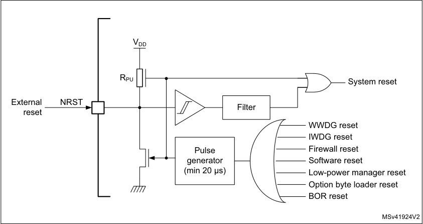
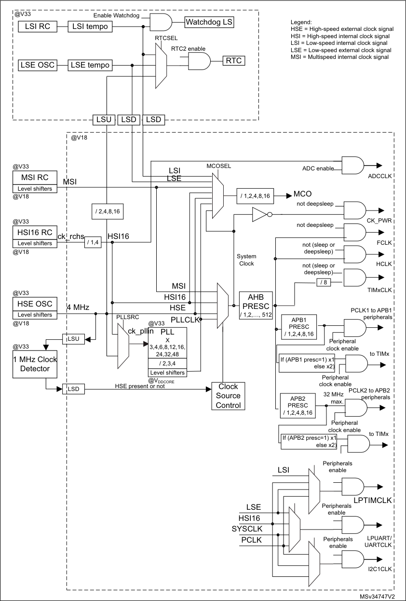
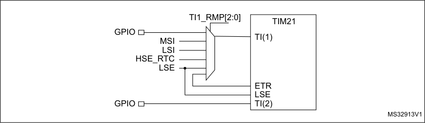

# RM0377 STM32L0x1 — Pages 151–200

**RM0377** **Power control (PWR)**

**6.3.7** **Sleep mode**

**I/O states in Sleep mode**

In Sleep mode, all I/O pins keep the same state as in Run mode.

**Entering Sleep mode**

The Sleep mode is entered according to _Section 6.3.5: Entering low-power mode_ .

Refer to _Table 35: Sleep-now_ and _Table 36: Sleep-on-exit_ for details on how to enter Sleep
mode.

**Exiting Sleep mode**

The Sleep mode is exited according to _Section 6.3.6: Exiting low-power mode_ .

Refer to _Table 35: Sleep-now_ and _Table 36: Sleep-on-exit_ for more details on how to exit
Sleep mode.

**Table 35. Sleep-now**

|Sleep-now mode|Description|
|---|---|
|Mode entry|WFI (Wait for Interrupt) or WFE (Wait for Event) while: – SLEEPDEEP = 0 and – No interrupt (for WFI) or event (for WFE) is pending Refer to the Cortex®-M0+ System Control register (see PM0223 programming manual).|
|Mode entry|On return from ISR while: – SLEEPDEEP = 0 and – SLEEPONEXIT = 1 and – No interrupt is pending Refer to the Cortex®-M0+ System Control register (see PM0223 programming manual).|
|Mode exit|If WFI or return from ISR was used for entry: Interrupt: refer to_Table 53: List of vectors_ If WFE was used for entry and SVONPEND = 0 Wakeup event: refer to_Section 12.3.2: Wakeup event management_ If WFE was used for entry and SVONPEND = 1 Interrupt event when disabled in NVIC (refer to_Table 53: List of vectors)_or wakeup event (refer to_Section 12.3.2: Wakeup event management_)|
|Wakeup latency|None|

RM0377 Rev 10 151/905

166

--- end of page=150 ---

**Power control (PWR)** **RM0377**

**Table 36. Sleep-on-exit**

|Sleep-on-exit|Description|
|---|---|
|Mode entry|WFI (wait for interrupt) while: – SLEEPDEEP = 0 and – No interrupt (for WFI) or event (for WFE) is pending Refer to the Cortex®-M0+ System Control register (see PM0223 programming manual).|
|Mode entry|On return from ISR while: – SLEEPDEEP = 0 and – SLEEPONEXIT = 1 and – No interrupt is pending Refer to the Cortex®-M0+ System Control register (see PM0223 programming manual).|
|Mode exit|Interrupt: refer to_Table 53: List of vectors_|
|Wakeup latency|None|

**6.3.8** **Low-power sleep mode (LP sleep)**

**I/O states in Low-power sleep mode**

In Low-power sleep mode, all I/O pins keep the same state as in Run mode.

**Entering Low-power sleep mode**

To enter Low-power sleep mode, proceed as follows:

1. The Flash memory can be switched off by using the control bits (SLEEP_PD in the
FLASH_ACR register. This reduces power consumption but increases the wake-up
time.

2. Each digital IP clock must be enabled or disabled by using the RCC_APBxENR and
RCC_AHBENR registers.

3. The frequency of the system clock must be decreased.

4. The regulator is forced in low-power mode by software (LPSDSR bits set).

5. Follow the steps described in _Section 6.3.5: Entering low-power mode_ .

Refer to _Table 37: Sleep-now (Low-power sleep)_ and _Table 38: Sleep-on-exit (Low-power_
_sleep)_ for details on how to enter Low-power sleep mode.

In Low-power sleep mode, the Flash memory can be switched off and the RAM memory
remains available.

In this mode, the system frequency should not exceed f_MSI range1.

Please refer to product datasheet for more details on voltage regulator and peripherals
operating conditions.

Low-power sleep mode can only be entered when V CORE is in range 2.

152/905 RM0377 Rev 10

--- end of page=151 ---

**RM0377** **Power control (PWR)**

_Note:_ _To be able to read the RTC calendar register when the APB1 clock frequency is less than_
_seven times the RTC clock frequency (7*RTCLCK), the software must read the calendar_
_time and date registers twice._

_If the second read of the RTC_TR gives the same result as the first read, this ensures that_
_the data is correct. Otherwise a third read access must be done._

**Exiting Low-power sleep mode**

The Low-power sleep mode is exited according to _Section 6.3.6: Exiting low-power mode_ .

When exiting Low-power sleep mode by issuing an interrupt or a wakeup event, the
regulator is configured in Main regulator mode, the Flash memory is switched on (if
necessary), and the system clock can be increased.

When the voltage regulator operates in low-power mode, an additional startup delay is
incurred when waking up from Low-power sleep mode.

Refer to _Table 37: Sleep-now (Low-power sleep)_ and _Table 38: Sleep-on-exit (Low-power_
_sleep)_ for more details on how to exit Sleep low-power mode.

**Table 37. Sleep-now (Low-power sleep)**

|Sleep-now mode|Description|
|---|---|
|Mode entry|Voltage regulator in low-power mode and the Flash memory switched off WFI (Wait for Interrupt) or WFE (wait for event) while: – SLEEPDEEP = 0 and – No interrupt (for WFI) or event (for WFE) is pending Refer to the Cortex®-M0+ System Control register (see PM0223 programming manual).|
|Mode entry|On return from ISR while: – SLEEPDEEP = 0 and – SLEEPONEXIT = 1 and – No interrupt is pending Refer to the Cortex®-M0+ System Control register (see PM0223 programming manual).|
|Mode exit|Voltage regulator in Main regulator mode and the Flash memory switched on If WFI or Return from ISR was used for entry: Interrupt: Refer to_Table 53: List of vectors_ If WFE was used for entry and SEVONPEND = 0 Wakeup event: Refer to_Section 12.3.2: Wakeup event management_ If WFE was used for entry and SVONPEND = 1 Interrupt event when disabled in NVIC (refer to_Table 53: List of vectors)_or wakeup event (refer to_Section 12.3.2: Wakeup event management_)|
|Wakeup latency|Regulator wakeup time from low-power mode|

RM0377 Rev 10 153/905

166

--- end of page=152 ---

**Power control (PWR)** **RM0377**

**Table 38. Sleep-on-exit (Low-power sleep)**

|Sleep-on-exit|Description|
|---|---|
|Mode entry|WFI (wait for interrupt) while: – SLEEPDEEP = 0 and – No interrupt (for WFI) or event (for WFE) is pending Refer to the Cortex®-M0+ System Control register (see PM0223 programming manual).|
|Mode entry|On return from ISR while: – SLEEPDEEP = 0 and – SLEEPONEXIT = 1 and – No interrupt is pending Refer to the Cortex®-M0+ System Control register (see PM0223 programming manual).|
|Mode exit|Interrupt: refer to_Table 53: List of vectors_.|
|Wakeup latency|regulator wakeup time from low-power mode|

**6.3.9** **Stop mode**

The Stop mode is based on the Cortex [®] -M0+ Deepsleep mode combined with peripheral
clock gating. The voltage regulator can be configured either in normal or low-power mode.
In Stop mode, all clocks in the V CORE domain are stopped, the PLL, the MSI, the HSI16
(except if HSI16KERON is set in Stop mode, see _Section 7.3.1: Clock control register_
_(RCC_CR)_ ) and the HSE RC oscillators are disabled. Internal SRAM and register contents
are preserved.

To get the lowest consumption in Stop mode, the internal Flash memory also enters lowpower mode. When the Flash memory is in power-down mode, an additional startup delay is
incurred when waking up from Stop mode.

To minimize the consumption In Stop mode, V REFINT, the BOR, PVD, and temperature
sensor can be switched off before entering Stop mode. This functionality is controlled by the
ULP bit in the PWR_CR register. If the ULP bit is set, the reference is switched off on Stop
mode entry and enabled again on wakeup. .

**I/O states in Low-power sleep mode**

In Stop mode, all I/O pins keep the same state as in Run mode.

**Entering Stop mode**

Refer to _Section 6.3.5: Entering low-power mode_ and to _Table 39_ for details on how to enter
the Stop mode.

If the application needs to disable the external clock before entering Stop mode, the HSEON
bit must be first disabled and the system clock switched to HSI16.

Otherwise, if the HSEON bit is kept enabled while external clock (external oscillator) can be
removed before entering Stop mode, the clock security system (CSS) feature must be
enabled to detect any external oscillator failure and avoid a malfunction behavior when
entering Stop mode.

154/905 RM0377 Rev 10

--- end of page=153 ---

**RM0377** **Power control (PWR)**

To further reduce power consumption in Stop mode, the internal voltage regulator can be put
in low-power mode. This is configured by the LPSDSR or LPDS bit in the PWR_CR register
(see _Section 6.4.1_ ). The internal voltage regulator can also be kept in Main mode but the
consumption will be much higher. As a result, it is always implicitly assumed that the
regulator is in low-power mode during Stop mode. The only advantage of keeping the
regulator in Main mode is that the wakeup time from Stop mode is shorter.

If Flash memory programming or an access to the APB domain is ongoing, the Stop mode
entry is delayed until the memory or APB access has completed.

In Stop mode, the following features can be selected by programming individual control bits:

      - Independent watchdog (IWDG): the IWDG is started by writing to its Key register or by
hardware option. Once started it cannot be stopped except by a Reset. Refer to
_Section 20.3: IWDG functional description_ in _Section 20: Independent watchdog_
_(IWDG)_ .

      - Real-time clock (RTC): this is configured by the RTCEN bit in the RCC_CSR register
(see _Section 7.3.20_ ).

      - Internal RC oscillator (LSI RC): this is configured by the LSION bit in the RCC_CSR
register.

      - External 32.768 kHz oscillator (LSE OSC): this is configured by the LSEON bit in the
RCC_CSR register.

The ADC can also consume power in Stop mode, unless they are disabled before entering
it. To disable them, the ADDIS bit in the ADC_CR register must be set to 1 must be written
to 0.

**Exiting Stop mode**

Refer to _Section 6.3.6: Exiting low-power mode_ and to _Table 39_ for details on how to exit
Stop mode.

When exiting Stop mode by issuing an interrupt or a wakeup event, the MSI or HSI16 RC
oscillator is selected as system clock depending the bit STOPWUCK in the RCC_CFGR
register.

When the voltage regulator operates in low-power mode, an additional startup delay is
incurred when waking up from Stop mode. By keeping the internal regulator ON during Stop
mode, the consumption is higher although the startup time is reduced.

RM0377 Rev 10 155/905

166

--- end of page=154 ---

**Power control (PWR)** **RM0377**

**Table 39. Stop mode**

|Stop mode|Description|
|---|---|
|Mode entry|WFI (Wait for Interrupt) or WFE (Wait for Event) while: – No interrupt (for WFI) or event (for WFE) is pending. – SLEEPDEEP bit is set in Cortex®-M0+ System Control register – PDDS bit = 0 in Power Control register (PWR_CR) – WUF bit = 0 in Power Control/Status register (PWR_CSR) – MSI or HSI16 RC oscillator are selected as system clock for Stop mode exit by configuring the STOPWUCK bit in the RCC_CFGR register. _Note: To enter the Stop mode, all EXTI Line pending bits (in_ _Section 12.5.6: EXTI pending register (EXTI_PR)), all peripherals_ _interrupt pending bits, the RTC Alarm (Alarm A and Alarm B), RTC_ _wakeup, RTC tamper, and RTC time-stamp flags, must be reset._ _Otherwise, the Stop mode entry procedure is ignored and program_ _execution continues._|
|Mode entry|On return from ISR while: – No interrupt is pending. – SLEEPDEEP bit is set in Cortex®-M0+ System Control register – SLEEPONEXIT = 1 – PDDS bit = 0 in Power Control register (PWR_CR) – WUF bit = 0 in Power Control/Status register (PWR_CSR) – MSI or HSI16 RC oscillator are selected as system clock for Stop mode exit by configuring the STOPWUCK bit in the RCC_CFGR register. _Note: To enter the Stop mode, all EXTI Line pending bits (in_ _Section 12.5.6: EXTI pending register (EXTI_PR)), all peripherals_ _interrupt pending bits, the RTC Alarm (Alarm A and Alarm B), RTC_ _wakeup, RTC tamper, and RTC time-stamp flags, must be reset._ _Otherwise, the Stop mode entry procedure is ignored and program_ _execution continues._|
|Mode exit|If WFI or return from ISR was used for entry: Any EXTI Line configured in Interrupt mode (the corresponding EXTI Interrupt vector must be enabled in the NVIC). Refer to_Table 53: List of_ _vectors._ If WFE was used for entry and SEVONPEND = 0 Any EXTI Line configured in event mode. Refer to_Section 12.3.2:_ _Wakeup event management on page 269_ If WFE was used for entry and SEVONPEND = 1 – Any EXTI Line configured in event mode (even if the corresponding EXTI interrupt is disabled in the NVIC). The interrupt source can be an external interrupt or a peripheral with wakeup capability (refer to_Table 53: List of_ _vectors)._ – A wakeup event (refer to_Section 12.3.2: Wakeup event management on_ _page 269_)|
|Wakeup latency|MSI or HSI16 RC wakeup time + regulator wakeup time from Low-power mode + FLASH wakeup time|

156/905 RM0377 Rev 10

--- end of page=155 ---

**RM0377** **Power control (PWR)**

**6.3.10** **Standby mode**

The Standby mode allows to achieve the lowest power consumption. It is based on the
Cortex [®] -M0+ Deepsleep mode, with the voltage regulator disabled. The V CORE domain is
consequently powered off. The PLL, the MSI, the HSI16 oscillator and the HSE oscillator
are also switched off. SRAM and register contents are lost except for the RTC registers,
RTC backup registers and Standby circuitry (see _Figure 10_ ).

**I/O states in Standby mode**

In Standby mode, all I/O pins are high impedance except for:

      - Reset pad

      - Wakeup pins (WKUP1, WKUP2, WKUP3)

      - RTC functions (tamper, time-stamp, RTC Alarm out, RTC clock calibration out) on the
following I/Os:

–
Category 1: PA0, PA2

–
Category 2: PC13, PA0, PA2

–
Category 3: PC13, PA0

–
Category 5: PC13, PA0, PE6

**Entering Standby mode**

Refer to _Section 6.3.5: Entering low-power mode_ and to _Table 40_ for details on how to enter
Standby mode.

In Standby mode, the following features can be selected by programming individual control
bits:

      - Independent watchdog (IWDG): the IWDG is started by writing to its Key register or by
hardware option. Once started it cannot be stopped except by a reset. Refer to
_Section 20.3: IWDG functional description on page 528_ .

      - Real-time clock (RTC): this is configured by the RTCEN bit in the RCC_CSR register
(see _Section 7.3.20_ ).

      - Internal RC oscillator (LSI RC): this is configured by the LSION bit in the RCC_CSR
register.

      - External 32.768 kHz oscillator (LSE OSC): this is configured by the LSEON bit in the
RCC_CSR register.

**Exiting Standby mode**

The microcontroller exits Standby mode when an external Reset (NRST pin), an IWDG
Reset, a rising edge on WKUP pins (WUKP1, WKUP2 or WKUP3), an RTC alarm, a tamper
event, or a time-stamp event is detected.

After waking up from Standby mode, program execution restarts in the same way as after a
Reset (boot pins sampling, vector reset is fetched, etc.). The SBF status flag in the
PWR_CSR register (see _Section 6.4.2_ ) indicates that the microcontroller was in Standby
mode. All registers are reset to their default value after a system reset except for the register
bits in the RTC domain (see _Section 22.7: RTC registers_, SBF status flag in the _PWR power_
_control/status register (PWR_CSR)_, _Control/status register (RCC_CSR)_ and _Clock control_
_register (RCC_CR)_ ).

Refer to _Section 6.3.6: Exiting low-power mode_ and to _Table 40_ for more details on how to
exit Standby mode.

RM0377 Rev 10 157/905

166

--- end of page=156 ---

**Power control (PWR)** **RM0377**

**Table 40. Standby mode**

|Standby mode|Description|
|---|---|
|Mode entry|WFI (Wait for Interrupt) or WFE (Wait for Event) while: – SLEEPDEEP = 1 in Cortex®-M0+ System Control register – PDDS = 1 bit in Power Control register (PWR_CR) – No interrupt (for WFI) or event (for WFE) is pending. – WUF = 0 bit in Power Control/Status register (PWR_CSR) – the RTC flag corresponding to the chosen wakeup source (RTC Alarm A, RTC Alarm B, RTC wakeup, Tamper or Time-stamp flags) is cleared|
|Mode entry|On return from ISR while: – SLEEPDEEP = 1 in Cortex®-M0+ System Control register – SLEEPONEXIT = 1 – PDDS bit = 1 in Power Control register (PWR_CR) – No interrupt is pending. – WUF bit = 0 in Power Control/Status register (PWR_CSR) – the RTC flag corresponding to the chosen wakeup source (RTC Alarm A, RTC Alarm B, RTC wakeup, Tamper or Time-stamp flags) is cleared.|
|Mode exit|WKUP pin rising edge, RTC alarm (Alarm A and Alarm B), RTC wakeup, tamper event, time-stamp event, external reset in NRST pin, IWDG reset.|
|Wakeup latency|Reset phase|

**Debug mode**

By default, the debug connection is lost if the application puts the MCU in Stop or Standby
mode while the debug features are used. This is due to the fact that the Cortex [®] -M0+ core is
no longer clocked.

However, by setting some configuration bits in the DBG_CR register, the software can be
debugged even when using the low-power modes extensively. For more details, refer to
_Section 27.9.1: Debug support for low-power modes_ .

**6.3.11** **Waking up the device from Stop and Standby modes using the RTC**
**and comparators**

The MCU can be woken up from low-power mode by an RTC Alarm event, an RTC Wakeup
event, a tamper event, a time-stamp event, or a comparator event, without depending on an
external interrupt (Auto-wakeup mode).

These RTC alternate functions can wake up the system from Stop and Standby low-power
modes while the comparator events can only wake up the system from Stop mode.

The system can also wake up from low-power modes without depending on an external
interrupt (Auto-wakeup mode) by using the RTC alarm or the RTC wakeup events.

158/905 RM0377 Rev 10

--- end of page=157 ---

**RM0377** **Power control (PWR)**

The RTC provides a programmable time base for waking up from Stop or Standby mode at
regular intervals. For this purpose, two of the three alternative RTC clock sources can be
selected by programming the RTCSEL[1:0] bits in the RCC_CSR register (see
_Section 7.3.20_ ):

      - Low-power 32.768 kHz external crystal oscillator (LSE OSC).
This clock source provides a precise time base with very low-power consumption (less
than 1 µA added consumption in typical conditions)

      - Low-power internal RC oscillator (LSI RC)

This clock source has the advantage of saving the cost of the 32.768 kHz crystal. This
internal RC Oscillator is designed to use minimum power consumption.

**RTC auto-wakeup (AWU) from the Stop mode**

      - To wake up from the Stop mode with an RTC alarm event, it is necessary to:

a) Configure the EXTI Line 17 to be sensitive to rising edges (Interrupt or Event
modes)

b) Enable the RTC Alarm interrupt in the RTC_CR register

c) Configure the RTC to generate the RTC alarm

      - To wake up from the Stop mode with an RTC Tamper or time stamp event, it is
necessary to:

a) Configure the EXTI Line 19 to be sensitive to rising edges (Interrupt or Event
modes)

b) Enable the RTC TimeStamp Interrupt in the RTC_CR register or the RTC Tamper
Interrupt in the RTC_TCR register

c) Configure the RTC to detect the tamper or time stamp event

      - To wake up from the Stop mode with an RTC Wakeup event, it is necessary to:

a) Configure the EXTI Line 20 to be sensitive to rising edges (Interrupt or Event
modes)

b) Enable the RTC Wakeup Interrupt in the RTC_CR register

c) Configure the RTC to generate the RTC Wakeup event

**RTC auto-wakeup (AWU) from the Standby mode**

      - To wake up from the Standby mode with an RTC alarm event, it is necessary to:

a) Enable the RTC Alarm interrupt in the RTC_CR register

b) Configure the RTC to generate the RTC alarm

      - To wake up from the Stop mode with an RTC Tamper or time stamp event, it is
necessary to:

a) Enable the RTC TimeStamp Interrupt in the RTC_CR register or the RTC Tamper
Interrupt in the RTC_TCR register

b) Configure the RTC to detect the tamper or time stamp event

      - To wake up from the Stop mode with an RTC Wakeup event, it is necessary to:

a) Enable the RTC Wakeup Interrupt in the RTC_CR register

b) Configure the RTC to generate the RTC Wakeup event

RM0377 Rev 10 159/905

166

--- end of page=158 ---

**Power control (PWR)** **RM0377**

**Comparator auto-wakeup (AWU) from the Stop mode**

      - To wake up from the Stop mode with a comparator 1 or comparator 2 wakeup event, it
is necessary to:

a) Configure the EXTI Line 21 for comparator 1 or EXTI Line 22 for comparator 2
(Interrupt or Event mode) to be sensitive to the selected edges (falling, rising or
falling and rising)

b) Configure the comparator to generate the event.

160/905 RM0377 Rev 10

--- end of page=159 ---

**RM0377** **Power control (PWR)**

###### **6.4 Power control registers**

The peripheral registers have to be accessed by half-words (16-bit) or words (32-bit).

**6.4.1** **PWR power control register (PWR_CR)**

Address offset: 0x00

Reset value: 0x0000 1000 (reset by wakeup from Standby mode)

|31|30|29|28|27|26|25|24|23|22|21|20|19|18|17|16|
|---|---|---|---|---|---|---|---|---|---|---|---|---|---|---|---|
|Res.|Res.|Res.|Res.|Res.|Res.|Res.|Res.|Res.|Res.|Res.|Res.|Res.|Res.|Res.|LPDS|
||||||||||||||||rw|

|15|14|13|12 11|Col5|10|9|8|7 6 5|Col10|Col11|4|3|2|1|0|
|---|---|---|---|---|---|---|---|---|---|---|---|---|---|---|---|
|Res.|LPRUN|DS_EE _KOFF|VOS[1:0]|VOS[1:0]|FWU|ULP|DBP|PLS[2:0]|PLS[2:0]|PLS[2:0]|PVDE|CSBF|CWUF|PDDS|LPSDSR|
||rw|rw|rw|rw|rw|rw|rw|rw|rw|rw|rw|rc_w1|rc_w1|rw|rw|

Bits 31:17 Reserved, always read as 0.

Bit 16 **LPDS** : Regulator in Low-power deepsleep mode

This bit allows switching the regulator to low-power mode when the CPU enters Stop
mode. Its behavior depends on LPSDSR bit.

– if LPSDSR = 1: bit has no effect.

– if LPSDSR = 0:

0: Voltage regulator in Main mode during Deepsleep mode (Stop mode)
1: Voltage regulator switches to low-power mode when the CPU enters Deepsleep mode
(Stop mode).
The regulator goes back to Main mode when the CPU exits from Deepsleep mode.

_Note: The LPDS bit is available on category 1 devices only._

Bit 15 Reserved, always read as 0.

Bit 14 **LPRUN:** Low-power run mode

When LPRUN bit is set together with the LPSDSR bit, the regulator is switched from Main
mode to low-power mode. Otherwise, it remains in Main mode. The regulator goes back to
operate in Main mode when LPRUN is reset.
If this bit is set (with LPSDSR bit set) and the CPU enters sleep or Deepsleep mode (LP
sleep or Stop mode), then, when the CPU wakes up from these modes, it enters Run
mode but with LPRUN bit set. To enter again Low-power run mode, it is necessary to
perform a reset and set LPRUN bit again.
It is forbidden to reset LPSDSR when the MCU is in Low-power run mode. LPSDSR is
used as a prepositioning for the entry into low-power mode, indicating to the system which
configuration of the regulator will be selected when entering low-power mode. The
LPSDSR bit must be set before the LPRUN bit is set. LPSDSR can be reset only when
LPRUN bit=0.

0: Voltage regulator in Main mode in Low-power run mode
1: Voltage regulator in low-power mode in Low-power run mode

Bit 13 **DS_EE_KOFF** : Deepsleep mode with non-volatile memory kept off

When entering low-power mode (Stop or Standby only), if DS_EE_KOFF and RUN_PD
bits are both set in FLASH_ACR register (refer to _Section 3.7.1: Access control register_
_(FLASH_ACR)_, the non-volatile memory (Flash program memory and data EEPROM) will
not be woken up when exiting from Deepsleep mode.
0: NVM woken up when exiting from Deepsleep mode even if the bit RUN_PD is set
1: NVM not woken up when exiting from low-power mode (if the bit RUN_PD is set)

RM0377 Rev 10 161/905

166

--- end of page=160 ---

**Power control (PWR)** **RM0377**

Bits 12:11 **VOS[1:0]:** Voltage scaling range selection

These bits are used to select the internal regulator voltage range.
Before resetting the power interface by resetting the PWRRST bit in the RCC_APB1RSTR
register, these bits have to be set to ‘10’ and the frequency of the system has to be
configured accordingly.

00: forbidden (bits are unchanged and keep the previous value, no voltage change
occurs)
01: 1.8 V (range 1)
10: 1.5 V (range 2)
11: 1.2 V (range 3)

Bit 10 **FWU** : Fast wakeup

This bit works in conjunction with ULP bit.

If ULP = 0, FWU is ignored

If ULP = 1 and FWU = 1: V REFINT startup time is ignored when exiting from low-power mode.
The VREFINTRDYF flag in the PWR_CSR register indicates when the V REFINT is ready
again.

If ULP=1 and FWU = 0: Exiting from low-power mode occurs only when the V REFINT is ready
(after its startup time). This bit is not reset by resetting the PWRRST bit in the
RCC_APB1RSTR register.

0: Low-power modes exit occurs only when V REFINT is ready
1: V REFINT start up time is ignored when exiting low-power modes

Bit 9 **ULP** : Ultra-low-power mode

When set, the V REFINT is switched off in low-power mode. The BOR, PVD, and temperature
sensor also rely on the voltage reference. This bit is not reset by resetting the PWRRST bit
in the RCC_APB1RSTR register.

0: V REFINT is on in low-power mode
1: V REFINT is off in low-power mode

Bit 8 **DBP** : Disable backup write protection

In reset state, the RTC, RTC backup registers and RCC CSR register are protected against
parasitic write access. This bit must be set to enable write access to these registers.

0: Access to RTC, RTC Backup and RCC CSR registers disabled
1: Access to RTC, RTC Backup and RCC CSR registers enabled

_Note: If the HSE divided by 2, 4, 8 or 16 is used as the RTC clock, this bit must remain set_
_to 1._

Bits 7:5 **PLS[2:0]:** PVD level selection

These bits are written by software to select the voltage threshold detected by the
programmable voltage detector:

000: 1.9 V

001: 2.1 V

010: 2.3 V

011: 2.5 V

100: 2.7 V

101: 2.9 V

110: 3.1 V

111: External input analog voltage (Compare internally to V REFINT )
PVD_IN input (PB7) has to be configured as analog input when PLS[2:0] = 111.

_Note: Refer to the electrical characteristics of the datasheet for more details._

162/905 RM0377 Rev 10

--- end of page=161 ---

**RM0377** **Power control (PWR)**

Bit 4 **PVDE:** Programmable voltage detector enable

This bit is set and cleared by software.

0: PVD disabled

1: PVD enabled

Bit 3 **CSBF** : Clear standby flag

This bit is always read as 0.

0: No effect

1: Clear the SBF Standby flag (write).

Bit 2 **CWUF:** Clear wakeup flag

This bit is always read as 0.

0: No effect

1: Clear the WUF Wakeup flag after 2 system clock cycles

Bit 1 **PDDS** : Power-down deepsleep

This bit is set and cleared by software.

0: Enter Stop mode when the CPU enters Deepsleep.
1: Enter Standby mode when the CPU enters Deepsleep.

Bit 0 **LPSDSR:** Low-power deepsleep/Sleep/Low-power run

– DeepSleep/Sleep modes

When this bit is set, the regulator switches in low-power mode when the CPU enters sleep
or Deepsleep mode. The regulator goes back to Main mode when the CPU exits from
these modes.

– Low-power run mode

When this bit is set, the regulator switches in low-power mode when the bit LPRUN is set.
The regulator goes back to Main mode when the bit LPRUN is reset.

This bit is set and cleared by software.

0: Voltage regulator on during Deepsleep/Sleep/Low-power run mode
1: Voltage regulator in low-power mode during Deepsleep/Sleep/Low-power run mode

_Note: If the sequence below is executed:_
_1) Low-power run_
_2) Low-power sleep_
_3) Run_
_4) Low-power run_
_after returning from Low-power deepsleep/Sleep mode (step 2), the regulator goes_
_back to Main mode (step 3). Then to switch to Low-power run mode (step 4), it is_
_necessary to perform a reset and set LPSDSR bit again._

RM0377 Rev 10 163/905

166

--- end of page=162 ---

**Power control (PWR)** **RM0377**

**6.4.2** **PWR power control/status register (PWR_CSR)**

Address offset: 0x04

Reset value: 0x0000 0008 (not reset by wakeup from Standby mode)

Additional APB cycles are needed to read this register versus a standard APB read.

|31|30|29|28|27|26|25|24|23|22|21|20|19|18|17|16|
|---|---|---|---|---|---|---|---|---|---|---|---|---|---|---|---|
|Res.|Res.|Res.|Res.|Res.|Res.|Res.|Res.|Res.|Res.|Res.|Res.|Res.|Res.|Res.|Res.|
|||||||||||||||||

|15|14|13|12|11|10|9|8|7|6|5|4|3|2|1|0|
|---|---|---|---|---|---|---|---|---|---|---|---|---|---|---|---|
|Res.|Res.|Res.|Res.|Res.|EWUP 3|EWUP 2|EWUP 1|Res.|Res.|REG LPF|VOSF|VREFIN TRDYF|PVDO|SBF|WUF|
||||||rw|rw|rw|||r|r|r|r|r|r|

Bits 31:11 Reserved, must be kept at reset value.

Bit 10 **EWUP3** : Enable WKUP pin 3

This bit is set and cleared by software.

0: WKUP pin 3 is used for general purpose I/Os. An event on the WKUP pin 3 does not
wakeup the device from Standby mode.
1: WKUP pin 3 is used for wakeup from Standby mode and forced in input pull down
configuration (rising edge on WKUP pin 3wakes-up the system from Standby mode).

_Note: This bit is reset by a system reset._

Bit 9 **EWUP2** : Enable WKUP pin 2

This bit is set and cleared by software.

0: WKUP pin 2 is used for general purpose I/Os. An event on the WKUP pin 2 does not
wakeup the device from Standby mode.
1: WKUP pin 2 is used for wakeup from Standby mode and forced in input pull down
configuration (rising edge on WKUP pin 2 wakes-up the system from Standby mode).

_Note: This bit is reset by a system reset._

Bit 8 **EWUP1** : Enable WKUP pin 1

This bit is set and cleared by software.

0: WKUP pin 1 is used for general purpose I/Os. An event on the WKUP pin 1 does not
wakeup the device from Standby mode.
1: WKUP pin 1 is used for wakeup from Standby mode and forced in input pull down
configuration (rising edge on WKUP pin 1 wakes-up the system from Standby mode).

_Note: This bit is reset by a system reset._

Bits 7:6 Reserved, must be kept at reset value.

Bit 5 **REGLPF** : Regulator LP flag

This bit is set by hardware when the MCU is in Low-power run mode.

When the MCU exits from Low-power run mode, this bit stays at 1 until the regulator is ready in
Main mode. A polling on this bit is recommended to wait for the regulator Main mode. This bit is
reset by hardware when the regulator is ready.

0: Regulator is ready in Main mode
1: Regulator voltage is in low-power mode

164/905 RM0377 Rev 10

--- end of page=163 ---

**RM0377** **Power control (PWR)**

Bit 4 **VOSF** : Voltage Scaling select flag

A delay is required for the internal regulator to be ready after the voltage range is changed.
The VOSF bit indicates that the regulator has reached the voltage level defined with bits VOS
of PWR_CR register.

This bit is set when VOS[1:0] in PWR_CR register change.
It is reset once the regulator is ready.

0: Regulator is ready in the selected voltage range
1: Regulator voltage output is changing to the required VOS level.

Bit 3 **VREFINTRDYF** : Internal voltage reference (V REFINT ) ready flag
This bit indicates the state of the internal voltage reference, V REFINT .
0: V REFINT is OFF
1: V REFINT is ready

Bit 2 **PVDO:** PVD output

This bit is set and cleared by hardware. It is valid only if PVD is enabled by the PVDE bit.

0: V DD is higher than the PVD threshold selected with the PLS[2:0] bits.
1: V DD is lower than the PVD threshold selected with the PLS[2:0] bits.
_Note: The PVD is stopped by Standby mode. For this reason, this bit is equal to 0 after_
_Standby or reset until the PVDE bit is set._

Bit 1 **SBF:** Standby flag

This bit is set by hardware and cleared only by a POR/PDR (power-on reset/power-down
reset) or by setting the CSBF bit in the _PWR power control register (PWR_CR)_

0: Device has not been in Standby mode
1: Device has been in Standby mode

Bit 0 **WUF:** Wakeup flag

This bit is set by hardware and cleared by a system reset or by setting the CWUF bit in the
_PWR power control register (PWR_CR)_

0: No wakeup event occurred
1: A wakeup event was received from the WKUP pin or from the RTC alarm (Alarm A or
Alarm B), RTC Tamper event, RTC TimeStamp event or RTC Wakeup).

_Note: An additional wakeup event is detected if the WKUP pins are enabled (by setting the_
_EWUPx (x=1, 2, 3) bits) when the WKUP pin levels are already high._

RM0377 Rev 10 165/905

166

--- end of page=164 ---

**Power control (PWR)** **RM0377**

**6.4.3** **PWR register map**

The following table summarizes the PWR registers.

**Table 41. PWR - register map and reset values**

|Offset|Register|31|30|29|28|27|26|25|24|23|22|21|20|19|18|17|16|15|14|13|12|11|10|9|8|7|6|5|4|3|2|1|0|
|---|---|---|---|---|---|---|---|---|---|---|---|---|---|---|---|---|---|---|---|---|---|---|---|---|---|---|---|---|---|---|---|---|---|
|0x000|**PWR_CR**  |Res. |Res. |Res. |Res. |Res. |Res. |Res. |Res. |Res. |Res. |Res. |Res. |Res. |Res. |Res. |LPDS  |Res. |LPRUN  |DS_EE_KOFF.|VOS [1:0]   |VOS [1:0]   |FWU  |ULP  |DBP |PLS[2:0]    |PLS[2:0]    |PLS[2:0]    |PVDE  |CSBF  |CWUF  |PDDS  |LPSDSR |
|0x000|~~Reset value~~||||||||||||||||~~0~~||~~0~~||~~1~~|~~0~~|~~0~~|~~0~~|~~0~~|~~0~~|~~0~~|~~0~~|~~0~~|~~0~~|~~0~~|~~0~~|~~0~~|
|0x004|**PWR_CSR**  |Res. |Res. |Res. |Res. |Res. |Res. |Res. |Res. |Res. |Res. |Res. |Res. |Res. |Res. |Res. |Res. |Res. |Res. |Res. |Res. |Res. |EWUP3  |EWUP2  |EWUP1  |Res. |Res. |REGLPF  |VOSF  |VREFINTRDYF  |PVDO  |SBF  |WUF |
|0x004|~~Reset value~~||||||||||||||||||||||~~0~~|~~0~~|~~0~~|||~~0~~|~~0~~|~~1~~|~~0~~|~~0~~|~~0~~|

Refer to _Section 2.2 on page 51_ for the register boundary addresses.

166/905 RM0377 Rev 10

--- end of page=165 ---

**RM0377** **Reset and clock control (RCC)**

#### **7 Reset and clock control (RCC)**

###### **7.1 Reset**

There are three types of reset, defined as system reset, power reset and RTC domain reset.

**7.1.1** **System reset**

A system reset sets all registers to their reset values unless specified otherwise in the
register description.

A system reset is generated when one of the following events occurs:

      - A low level on the NRST pin (external reset)

      - Window watchdog end-of-count condition (WWDG reset)

      - Independent watchdog end-of-count condition (IWDG reset)

      - A software reset (SW reset) (see _Software reset_ )

      - Low-power management reset (see _Low-power management reset_ )

      - Option byte loader reset (see _Option byte loader reset_ )

      - Exit from Standby mode

      - Firewall protection (see _Section 5: Firewall (FW)_ )

The reset source can be identified by checking the reset flags in the control/status register,
RCC_CSR (see _Section 7.3.20_ ).

**Software reset**

The SYSRESETREQ bit in Cortex [®] -M0+ AIRCR register (Application Interrupt and Reset
Control Register) must be set to force a software reset on the device. Refer to Arm [®]
Cortex [®] -M0+ Technical Reference Manual for more details.

**Low-power management reset**

There are two ways to generate a low-power management reset:

      - Reset generated when entering Standby mode:

This type of reset is enabled by resetting nRST_STDBY bit in user option bytes. In this
case, whenever a Standby mode entry sequence is successfully executed, the device
is reset instead of entering Standby mode.

      - Reset when entering Stop mode:

This type of reset is enabled by resetting nRST_STOP bit in user option bytes. In this
case, whenever a Stop mode entry sequence is successfully executed, the device is
reset instead of entering Stop mode.

**Option byte loader reset**

The Option byte loader reset is generated when the OBL_LAUNCH bit (bit 18) is set in the
FLASH_PECR register. This bit is used to launch by software the option byte loading.

For further information on the user option bytes, refer to _Section 3: Flash program memory_
_and data EEPROM (FLASH)_ .

RM0377 Rev 10 167/905

215

--- end of page=166 ---

**Reset and clock control (RCC)** **RM0377**

**7.1.2** **Power reset**

A power reset is generated when one of the following events occurs:

      - Power-on/power-down reset (POR/PDR reset)

      - BOR reset

A power reset sets all registers to their reset values including for the RTC domain (see
_Figure 16_ )

These sources act on the NRST pin and it is always kept low during the delay phase. The
RESET service routine vector is fixed at address 0x0000_0004 in the memory map. For
more details, refer to _Table 53: List of vectors_ .

The system reset signal provided to the device is output on the NRST pin (except the Exit
from Standby reset which is not output on the NRST pin but generates system reset).

The pulse generator guarantees a minimum reset pulse duration of 20 µs for each internal
reset source. In case of an external reset, the reset pulse is generated while the NRST pin is
asserted low.

When an internal reset occurs, the internal pull-up resistor (RPU) is deactivated in order to
save the power consumption through the pull-up resistor.

**Figure 16. Simplified diagram of the reset circuit**

**7.1.3** **RTC and backup registers reset**

The RTC peripheral, RTC clock source selection (in RCC_CSR) and the backup registers
are reset only when one of the following events occurs:

      - A software reset, triggered by setting the RTCRST bit in the RCC_CSR register (see
_Section 7.3.20_ )

      - Power reset (BOR/POR/PDR).

168/905 RM0377 Rev 10

--- end of page=167 ---

**RM0377** **Reset and clock control (RCC)**

###### **7.2 Clocks**

Four different clock sources can be used to drive the system clock (SYSCLK):

      - HSI16 (high-speed internal) oscillator clock

      - HSE (high-speed external) oscillator clock

The HSE external quartz connexion is available only on cat. 2 devices in LQFP48
package.

      - PLL clock

      - MSI (multispeed internal) oscillator clock

The MSI at 2.1MHz is used as system clock source after startup from power reset,
system or RTC domain reset, and after wake-up from Standby mode.

The HSI16, HSI16 divided by 4, or the MSI at any of its possible frequency can be used
to wake up from Stop mode.

The devices have two secondary clock sources:

      - 37 kHz low speed internal RC (LSI RC) which drives the independent watchdog and
optionally the RTC used for Auto-wakeup from Stop/Standby mode and the LPTIMER.

      - 32.768 kHz low speed external crystal (LSE crystal) which optionally drives the realtime clock (RTCCLK), the LPTIMER and USARTs.

Each clock source can be switched on or off independently when it is not used to optimize
power consumption.

Several prescalers can be used to configure the AHB frequency and the two APBs (APB1
and APB2) domains. The maximum frequency of AHB, APB1 and the APB2 domains is
32 MHz. It depends on the device voltage range. For more details refer to _Section 6.1.4:_
_Dynamic voltage scaling management_ .

All the peripheral clocks are derived from the system clock (SYSCLK) except:

      - The ADC can be derived either from the APB clock or the HSI16 clock.

      - The LPUART1 and USART1/2 clock which is derived (selected by software) from one
of the four following sources:

–
system clock

– HSI16 clock

– LSE clock

–
APB clock (PCLK)

      - The I2C1 clock which is derived (selected by software) from one of the three following

sources:

–
system clock

– HSI16 clock

–
APB clock (PCLK)

      - The LPTIMER clock which is derived (selected by software) from one of the four
following sources:

– HSI16 clock

– LSE clock

– LSI clock

–
APB clock (PCLK)

RM0377 Rev 10 169/905

215

--- end of page=168 ---

**Reset and clock control (RCC)** **RM0377**

      - The RTC clock which is derived from the following clock sources:

–
LSE clock,

–
LSI clock,

–
4 MHz HSE_RTC (HSE divided by a programmable prescaler).

      - IWDG clock which is always the LSI clock.

The system clock (SYSCLK) frequency must be higher or equal to the RTC clock frequency.

The RCC feeds the Cortex [®] System Timer (SysTick) external clock with the AHB clock
(HCLK) divided by 8. The SysTick can work either with this clock or with the Cortex [®] clock
(HCLK), configurable in the SysTick Control and Status Register.

170/905 RM0377 Rev 10

--- end of page=169 ---

**RM0377** **Reset and clock control (RCC)**

**Figure 17. Clock tree**

|Col1|Col2|Col3|Col4|Col5|Col6|Col7|Col8|Col9|Col10|
|---|---|---|---|---|---|---|---|---|---|
|||||||||||
|||||||||||
|||||||||||
||LS||LS||LSD|LSD|LSD|LSD|LSD|
||LS|||||||||
|@V18 SI|@V18 SI|@V18 SI|@V18 SI|@V18 SI|@V18 SI|@V18 SI|@V18 SI|@V18 SI|@V18 SI|
|@V18 SI|@V18 SI|@V18 SI|@V18 SI|@V18 SI|@V18 SI|LSE|LSE|LSE|LSE|
|/ 2,4 rchs |/ 2,4 rchs |,8,16 HSI16|,8,16 HSI16|,8,16 HSI16|,8,16 HSI16|,8,16 HSI16|,8,16 HSI16|,8,16 HSI16|,8,16 HSI16|
|/ 1,4 4 MHz|/ 1,4 4 MHz|/ 1,4 4 MHz|/ 1,4 4 MHz|/ 1,4 4 MHz|/ 1,4 4 MHz|/ 1,4 4 MHz|/ 1,4 4 MHz|/ 1,4 4 MHz|/ 1,4 4 MHz|
|/ 1,4 4 MHz|/ 1,4 4 MHz|/ 1,4 4 MHz|/ 1,4 4 MHz|/ 1,4 4 MHz|/ 1,4 4 MHz|/ 1,4 4 MHz||||
|/ 1,4 4 MHz|/ 1,4 4 MHz|/ 1,4 4 MHz|HSE|HSE|HSE|HSE|HSE|||
|/ 1,4 4 MHz|/ 1,4 4 MHz|||||||||

1. For full details about the internal and external clock source characteristics, please refer to the “Electrical
characteristics” section in your device datasheet.

RM0377 Rev 10 171/905

215

--- end of page=170 ---

**Reset and clock control (RCC)** **RM0377**

The timer clock frequencies are automatically fixed by hardware. There are two cases:

1. If the APB prescaler is 1, the timer clock frequencies are set to the same frequency as
that of the APB domain to which the timers are connected.

2. Otherwise, they are set to twice (×2) the frequency of the APB domain to which the
timers are connected.

f CLK acts as Cortex [®] -M0+ free running clock. For more details refer to the _Section 27:_
_Debug support (DBG)_ .

**7.2.1** **HSE clock**

The high speed external clock signal (HSE) can be generated from two possible clock

sources:

      - HSE external crystal/ceramic resonator

      - HSE user external clock

The resonator and the load capacitors have to be placed as close as possible to the
oscillator pins in order to minimize output distortion and startup stabilization time. The
loading capacitance values must be adjusted according to the selected oscillator.

**Table 42. HSE/LSE clock sources**

|Clock source|Hardware configuration|
|---|---|
|External clock for category 2 (LQFP48 only), category 3 and 5 devices| MSv31915V1 OSC_IN OSC_OUT GPIO External source|

172/905 RM0377 Rev 10

--- end of page=171 ---

**RM0377** **Reset and clock control (RCC)**

**Table 42. HSE/LSE clock sources (continued)**

|Clock source|Hardware configuration|
|---|---|
|External clock for category 1 and 2 devices (packages with less that 48 pins)| External source CK_IN GPIO MSv36151V1|
|Crystal/Ceramic resonators for category 2 (LQFP48 only), category 3 and 5 devices| MSv31916V1 OSC_IN OSC_OUT CL1 CL2 Load capacitors|

**External source (HSE bypass)**

In this mode, an external clock source must be provided. It can have a frequency of up to
32 MHz. This mode is selected by setting the HSEBYP and HSEON bits in the RCC_CR
register _(see Section 7.3.1: Clock control register (RCC_CR))_ . The external clock signal
with ~50% duty cycle has to drive the following pin (see _Figure 42_ ):

      - On devices where OSC_IN and OSC_OUT pins are available: the OSC_IN pin must be
driven while the OSC_OUT pin should be left hi-Z.

      - Otherwise, the CK_IN pin must be driven.

_Note:_ _For details on pin availability, refers to the pinout section in your device datasheet._

The external clock signal can be square, sinus or triangle. To minimize the consumption, it
is recommended to use the square signal.

**External crystal/ceramic resonator (HSE crystal)**

The 1 to 24 MHz external oscillator has the advantage of producing a very accurate rate on
the main clock.

The associated hardware configuration is shown in _Figure 42_ . Refer to the electrical
characteristics section of the _datasheet_ for more details.

The HSERDY flag of the RCC_CR register _(see Section 7.3.1)_ indicates whether the HSE
oscillator is stable or not. At startup, the HSE clock is not released until this bit is set by
hardware. An interrupt can be generated if enabled in the _RCC_CR register_ .

The HSE Crystal can be switched on and off using the HSEON bit in the _RCC_CR register_ .

For code example, refer to _A.4.1: HSE start sequence code example_ .

RM0377 Rev 10 173/905

215

--- end of page=172 ---

**Reset and clock control (RCC)** **RM0377**

**7.2.2** **HSI16 clock**

The HSI16 clock signal is generated from an internal 16 MHz RC oscillator. It can be used
directly as a system clock or as PLL input.

The HSI16 clock can be used after wake-up from the Stop low-power mode, this ensure a
smaller wake-up time than a wake-up using MSI clock.

The HSI16 RC oscillator has the advantage of providing a clock source at low cost (no
external components). It also has a faster startup time than the HSE crystal oscillator
however, even with calibration the frequency is less accurate than an external crystal
oscillator or ceramic resonator.

The HSI16 clock can be kept running in Stop mode by setting HSI16KERON bit in RCC_CR
register (see _Section 7.3.1: Clock control register (RCC_CR)_ ). In this case the HSI16 clock
can be used for dedicated peripherals which can run in Stop mode.

**Calibration**

RC oscillator frequencies can vary from one chip to another due to manufacturing process
variations, this is why each device is factory calibrated by ST for 1% accuracy at an ambient
temperature, T A, of 25 °C.

After reset, the factory calibration value is loaded in the HSI16CAL[7:0] bits in the Internal
Clock Sources Calibration Register (RCC_ICSCR) _(see Section 7.3.2)._

If the application is subject to voltage or temperature variations, this may affect the RC
oscillator speed. You can trim the HSI16 frequency in the application by using the
HSI16TRIM[4:0] bits in the RCC_ICSCR register. For more details on how to measure the
HSI16 frequency variation please refer to _Section 7.2.14: Internal/external clock_
_measurement using TIM21_ .

The HSI16RDY flag in the RCC_CR register indicates whether the HSI16 oscillator is stable
or not. At startup, the HSI16 RC output clock is not released until this bit is set by hardware.

The HSI16 RC oscillator can be switched on and off using the HSI16ON bit in the RCC_CR
register.

**7.2.3** **MSI clock**

The MSI clock signal is generated from an internal RC oscillator. Its frequency range can be
adjusted by software by using the MSIRANGE[2:0] bits in the RCC_ICSCR register (see
_Section 7.3.2: Internal clock sources calibration register (RCC_ICSCR)_ ). Seven frequency
ranges are available: 65.536 kHz, 131.072 kHz, 262.144 kHz, 524.288 kHz, 1.048 MHz,
2.097 MHz (default value) and 4.194 MHz.

The MSI clock is always used as system clock after restart from Reset and wake-up from
Standby. After wake-up from Stop mode, the MSI clock can be selected as system clock
instead of HSI16 (or HSI16/4).

When the device restarts after a reset or a wake-up from Standby, the MSI frequency is set
to its default value. The MSI frequency does not change after waking up from Stop.

The MSI RC oscillator has the advantage of providing a low-cost (no external components)
low-power clock source. It is used as wake-up clock in low-power modes to reduce power
consumption.

The MSIRDY flag in the RCC_CR register indicates whether the MSI RC is stable or not. At
startup, the MSI RC output clock is not released until this bit is set by hardware.

174/905 RM0377 Rev 10

--- end of page=173 ---

**RM0377** **Reset and clock control (RCC)**

The MSI RC can be switched on and off by using the MSION bit in the RCC_CR register
_(see Section 7.3.1_ ).

It can also be used as a backup clock source (auxiliary clock) if the HSE crystal oscillator
fails. Refer to _Section 7.2.9: HSE clock security system (CSS) on page 177_ .

**Calibration**

The MSI RC oscillator frequency can vary from one chip to another due to manufacturing
process variations, this is why each device is factory calibrated by ST for 1% accuracy at an
ambient temperature, T A, of 25 °C.

After reset, the factory calibration value is loaded in the MSICAL[7:0] bits in the
RCC_ICSCR register. If the application is subject to voltage or temperature variations, this
may affect the RC oscillator speed. You can trim the MSI frequency in the application by
using the MSITRIM[7:0] bits in the RCC_ICSCR register. For more details on how to
measure the MSI frequency variation please refer to _Section 7.2.14: Internal/external clock_
_measurement using TIM21_ .

**7.2.4** **PLL**

The internal PLL can be clocked by the HSI16 RC or HSE clocks.

The PLL input clock frequency must range between 2 and 24 MHz.

The desired frequency is obtained by using the multiplication factor and output division
embedded in the PLL:

      - The system clock is derived from the PLL VCO divided by the output division factor.

_Note:_ _The application software must set correctly the PLL multiplication factor to avoid exceeding_
_96 MHz as PLLVCO when the product is in range 1,_

_48 MHz as PLLVCO when the product is in range 2,_

_24 MHz when the product is in range 3._

_It must also set correctly the output division to avoid exceeding 32 MHz as SYSCLK._

_The minimum input clock frequency for PLL is 2 MHz (when using HSE as PLL source)._

The PLL configuration (selection of the source clock, multiplication factor and output division
factor) must be performed before enabling the PLL. Once the PLL is enabled, these
parameters cannot be changed.

To modify the PLL configuration, proceed as follows:

1. Disable the PLL by setting PLLON to 0.

2. Wait until PLLRDY is cleared. The PLL is now fully stopped.

3. Change the desired parameter.

4. Enable the PLL again by setting PLLON to 1.

An interrupt can be generated when the PLL is ready if enabled in the RCC_CIER register
(see _Section 7.3.4_ ).

For code example, refer to _A.4.2: PLL configuration modification code example_ .

RM0377 Rev 10 175/905

215

--- end of page=174 ---

**Reset and clock control (RCC)** **RM0377**

**7.2.5** **LSE clock**

The LSE crystal is a 32.768 kHz low speed external crystal or ceramic resonator. It has the
advantage of providing a low-power but highly accurate clock source to the real-time clock
peripheral (RTC) for clock/calendar or other timing functions.

The LSE crystal is switched on and off through the LSEON bit in the RCC_CSR register
(see _Section 7.3.20_ ).

The crystal oscillator driving strength can be changed at runtime through the LSEDRV[1:0]
bits of the RCC_CSR register to obtain the best compromise between robustness and short
start-up time on one hand and low power consumption on the other hand. The driving
capability should be changed dynamically to determine the driving level that best matches
the used crystal. In the final application, it is then recommended to program this value in
LSEDRV[1:0] bits.

The LSERDY flag in the RCC_CSR register indicates whether the LSE crystal is stable or
not. At startup, the LSE crystal output clock signal is not released until this bit is set by
hardware. An interrupt can be generated if enabled in the RCC_CIER register (see
_Section 7.3.4_ ).

**External source (LSE bypass)**

In this mode, an external clock source must be provided. It can have a frequency of up to
1 MHz. This mode is selected by setting the LSEBYP and LSEON bits in the RCC_CSR
(see _Section 7.3.1_ ). The external clock signal (square, sinus or triangle) with ~50% duty
cycle has to drive the OSC32_IN pin while the OSC32_OUT pin should be left Hi-Z (see
_Figure 42_ ).

**7.2.6** **LSI clock**

The LSI RC acts as an low-power clock source that can be kept running in Stop and
Standby mode for the independent watchdog (IWDG). The clock frequency is around
37 kHz.

The LSI RC oscillator can be switched on and off using the LSION bit in the RCC_CSR
register (see _Section 7.3.20_ ).

The LSIRDY flag in RCC_CSR indicates whether the low-speed internal oscillator is stable
or not. At startup, the clock is not released until this bit is set by hardware. An interrupt can
be generated if enabled in the RCC_CIER (see _Section 7.3.4_ ).

Since the IWDG is activated, the LSI oscillator cannot be stopped by LSION=0. The LSI
oscillator is stopped by system reset (except if IWDG is enabled by hardware option through
WDG_SW option bit in FLASH_OPTR register). If the IWDG was enabled by software, then
the LSI oscillator must be enabled again after system reset to ensure correct IWDG and/or
RTC operation.

**LSI measurement**

The frequency dispersion of the LSI oscillator can be measured to have accurate RTC time
base and/or IWDG timeout (when LSI is used as clock source for these peripherals) with an
acceptable accuracy. For more details, refer to the electrical characteristics section of the
datasheets. For more details on how to measure the LSI frequency, please refer to
_Section 7.2.14: Internal/external clock measurement using TIM21_ .

176/905 RM0377 Rev 10

--- end of page=175 ---

**RM0377** **Reset and clock control (RCC)**

**7.2.7** **System clock (SYSCLK) selection**

Four different clock sources can be used to drive the system clock (SYSCLK):

      - The HSI16 oscillator

      - The HSE oscillator

      - The PLL

      - The MSI oscillator clock (default after reset)

When a clock source is used directly or through the PLL as system clock, it is not possible to
stop it.

A switch from one clock source to another occurs only if the target clock source is ready
(clock stable after startup delay or PLL locked). If a clock source which is not yet ready is
selected, the switch will occur when the clock source will be ready. Status bits in the
RCC_CR register indicate which clock(s) is (are) ready and which clock is currently used as
system clock.

**7.2.8** **System clock source frequency versus voltage range**

The following table gives the different clock source maximum frequencies depending on the
product voltage range.

|Col1|Table 43. System clock source frequency|Col3|Col4|Col5|
|---|---|---|---|---|
|**Product voltage** **range**|**Clock frequency**|**Clock frequency**|**Clock frequency**|**Clock frequency**|
|**Product voltage** **range**|**MSI**|**HSI16**|**HSE**|**PLL**|
|Range 1 (1.8 V)|4.2 MHz|16 MHz|HSE 32 MHz (external clock) or 24 MHz (crystal)|32 MHz (PLLVCO max = 96 MHz)|
|Range 2 (1.5 V)|4.2 MHz|16 MHz|16 MHz|16 MHz (PLLVCO max = 48 MHz)|
|Range 3 (1.2 V)|4.2 MHz|NA|8 MHz|4 MHz (PLLVCO max = 24 MHz)|

**7.2.9** **HSE clock security system (CSS)**

The Clock security system can be activated on the HSE by software. In this case, the clock
detector is enabled after the HSE oscillator startup delay, and disabled when this oscillator is
stopped.

If an HSE clock failure is detected, this oscillator is automatically disabled and an CSSHSEI
interrupt (Clock Security System Interrupt) is generated to inform the software of the failure,
thus allowing the MCU to perform rescue operations. The CSSHSEI is linked to the
Cortex [®] -M0+ NMI (Non-Maskable Interrupt) exception vector.

_Note:_ _Once the CSSHSE is enabled, if the HSE clock fails, the CSSHSE interrupt occurs and an_
_NMI is automatically generated. The NMI is executed indefinitely unless the CSSHSE_
_interrupt pending bit is cleared. As a consequence, the NMI interrupt service routine (ISR)_
_must clear the CSSHSE interrupt by setting the CSSHSEC bit in the RCC_CICR register._

RM0377 Rev 10 177/905

215

--- end of page=176 ---

**Reset and clock control (RCC)** **RM0377**

If the HSE oscillator is used directly or indirectly as the system clock (indirectly means: it is
used as PLL input clock, and the PLL clock is used as system clock), a detected failure
causes a switch of the system clock and the disabling of the HSE oscillator. If the HSE
oscillator clock is the clock entry of the PLL used as system clock when the failure occurs,
the PLL is disabled too.

When an HSE failure occurs, the system clock can be switched to the MSI or to the internal
16-MHz HSI clock depending on the value of STOPWUCK bit in the RCC_CFGR register.

_Note:_ _Category 1 devices do not feature HSE clock security system. The HSE clock is available_
_only in bypass mode._

**7.2.10** **LSE Clock Security System**

Clock Security System can be activated on the LSE by software. This is done by writing the
CSSLSEON bit in the RCC_CSR register. This bit can be disabled by a hardware reset, an
RTC software reset, or after an LSE clock failure detection. CSSLSEON bit must be written
after the LSE and LSI clocks are enabled (LSEON and LSION set) and ready (LSERDY and
LSIRDY bits set by hardware), and after the RTC clock has been selected through the
RTCSEL bit.

The LSE CSS works in all modes: run, Sleep, Stop and Standby.

If a failure is detected on the external 32 kHz oscillator, the LSE clock is no longer supplied
to the RTC but the content of the registers does not change.

A wakeup is generated in Standby mode. In any other modes, an interrupt can be sent to
wake-up the software (see _Section 7.3.4_ ).

The software MUST then reset the CSSLSEON bit and stop the defective 32 kHz oscillator
by resetting LSEON bit. It can change the RTC clock source (LSI, HSE or no clock) through
the RTCSEL bit, or take any required action to secure the application.

The frequency of LSE oscillator must be higher than 30 kHz to avoid false positive CSS
detection.

**7.2.11** **RTC clock**

The RTC has the same clock source which can be either the LSE, the LSI, or the HSE
4 MHz clock (HSE divided by a programmable prescaler). It is selected by programming the
RTCSEL[1:0] bits in the RCC_CSR register (see _Section 7.3.20_ ) and the RTCPRE[1:0] bits
in the RCC_CR register (see _Section 7.3.1_ ).

Once the RTC clock source have been selected, the only possible way of modifying the
selection is to set the RTCRST bit in the RCC_CSR register, or by a POR.

If the LSE or LSI is used as RTC clock source, the RTC continues to work in Stop and
Standby low-power modes, and can be used as wakeup source. However, when the HSE is
the RTC clock source, the RTC cannot be used in the Stop and Standby low-power modes.

When the RTC is clocked by the LSE, the RTC remains clocked and functional under
system reset.

_Note:_ _To be able to read the RTC calendar register when the APB1 clock frequency is less than_
_seven times the RTC clock frequency (7*RTCLCK), the software must read the calendar_
_time and date registers twice._

_If the second read of the RTC_TR gives the same result as the first read, this ensures that_
_the data is correct. Otherwise a third read access must be done._

178/905 RM0377 Rev 10

--- end of page=177 ---

**RM0377** **Reset and clock control (RCC)**

**7.2.12** **Watchdog clock**

If the Independent watchdog (IWDG) is started by either hardware option or software
access, the LSI oscillator is forced ON and cannot be disabled. After the LSI oscillator
temporization, the clock is provided to the IWDG.

If the IWDG was enabled by software, the LSI clock is disabled after system reset. The LSI
oscillator must then be enabled again to ensure correct IWDG operation.

**7.2.13** **Clock-out capability**

The microcontroller clock output (MCO) capability allows the clock to be output onto the
external MCO pin using a configurable prescaler (1, 2, 4, 8, or 16). The configuration
registers of the corresponding GPIO port must be programmed in alternate function mode.
One of 7 clock signals can be selected as the MCO clock:

      - SYSCLK

      - HSI16

      - MSI

      - HSE

      - PLL

      - LSI

      - LSE

The selection is controlled by the MCOSEL[3:0] bits of the RCC_CFGR register (see
_Section 7.3.19_ ).

For code example, refer to _A.4.3: MCO selection code example_ .

**7.2.14** **Internal/external clock measurement using TIM21**

It is possible to indirectly measure the frequency of all on-board clock source generators by
means of the TIM21 channel 1 input capture, as represented on _Figure 18_ .

**Figure 18. Using TIM21 channel 1 input capture to measure**
**frequencies**

TIM21 has an input multiplexer that selects which of the I/O or the internal clock is to trigger
the input capture. This selection is performed through the TI1_RMP [2:0] bits in the
TIM21_OR register.

RM0377 Rev 10 179/905

215

--- end of page=178 ---

**Reset and clock control (RCC)** **RM0377**

The primary purpose of connecting the LSE to the channel 1 input capture is to be able to
accurately measure the HSI16 and MSI system clocks (for this, either the HSI16 or MSI
should be used as the system clock source). The number of HSI16 (MSI, respectively) clock
counts between consecutive edges of the LSE signal provides a measure of the internal
clock period. Taking advantage of the high precision of LSE crystals (typically a few tens of
ppm’s), it is possible to determine the internal clock frequency with the same resolution, and
trim the source to compensate for manufacturing-process- and/or temperature- and voltagerelated frequency deviations.

The MSI and HSI16 oscillators both have dedicated user-accessible calibration bits for this

purpose.

The basic concept consists in providing a relative measurement (e.g. the HSI16/LSE ratio):
the precision is therefore closely related to the ratio between the two clock sources. The
higher the ratio, the better the measurement.

It is however not possible to have a good enough resolution when the MSI clock is low
(typically below 1 MHz). In this case, it is advised to:

      - accumulate the results of several captures in a row

      - use the timer’s input capture prescaler (up to 1 capture every 8 periods)

      - use the RTC_OUT signal at 512 Hz (when the RTC is clocked by the LSE) as the input
for the channel1 input capture. This improves the measurement precision

TIM21 can also be used to measure the LSI, MSI, or HSE_RTC: this is useful for
applications with no crystal. The ultra-low-power LSI oscillator has a wide manufacturing
process deviation: by measuring it as a function of the HSI16 clock source, its frequency
can be determined with the precision of the HSI16.The HSE_RTC frequency (HSE divided
by a programmable prescaler) being relatively high (4 MHz), the relative frequency
measurement is not very accurate. Its main purpose is consequently to obtain a rough
indication of the external crystal frequency. This can be useful to meet the requirements of
the IEC 60730/IEC 61335 standards, which require to be able to determine harmonic or
subharmonic frequencies (–50/+100% deviations).

**7.2.15** **Clock-independent system clock sources for TIM2/TIM21/TIM22**

In a number of applications using the 32.768 kHz clock as RTC timebase, timebases
completely independently from the system clock are useful. This allows to schedule tasks
without having to take into account the processor state (the processor may be stopped or
executing at low, medium or full speed).

For this purpose, the LSE clock is internally redirected to the 3 timers’ ETR inputs, which are
used as additional clock sources. This gives up to three independent time bases (using the
auto-reload feature) with 1 or 2 compare additional channels for fractional events. For
instance, the TIM21 auto-reload interrupt can be programmed for a 1 second tick interrupt
with an additional interrupt occurring 250 ms after the main tick.

_Note:_ _In this configuration, make sure that you have at least a ratio of 2 between the external clock_
_(LSE) and the APB clock. If the application uses an APB clock frequency lower than twice_
_the LSE clock frequency (typically LSE = 32.768 kHz, so twice LSE = 65.536 kHz), it is_
_mandatory to use the external trigger prescaler feature of the timer: it can divide the ETR_
_clock by up to 8._

180/905 RM0377 Rev 10

--- end of page=179 ---

**RM0377** **Reset and clock control (RCC)**

###### **7.3 RCC registers**

Refer to _Section 1.2_ for a list of abbreviations used in register descriptions.

**7.3.1** **Clock control register (RCC_CR)**

Address offset: 0x00

System Reset value: 0b0000 0000 00XX 0X00 0000 0011 0000 0000 where X is undefined

Power-on reset value: 0x0000 0300

Access: no wait state, word, half-word and byte access

|31|30|29|28|27|26|25|24|23|22|21 20|Col12|19|18|17|16|
|---|---|---|---|---|---|---|---|---|---|---|---|---|---|---|---|
|Res.|Res.|Res.|Res.|Res.|Res.|PLL RDY|PLLON|Res.|Res.|RTCPRE[1:0]|RTCPRE[1:0]|CSSHS EON.|HSE BYP|HSE RDY|HSE ON|
|||||||r|rw|||rw|rw|rw|rw|r|rw|

|15|14|13|12|11|10|9|8|7|6|5|4|3|2|1|0|
|---|---|---|---|---|---|---|---|---|---|---|---|---|---|---|---|
|Res.|Res.|Res.|Res.|Res.|Res.|MSI RDY|MSION|Res.|Res.|HSI16 OUTEN|HSI16 DIVF|HSI16 DIVEN|HSI16 RDYF|HSI16K ERON|HSI16 ON|
|||||||r|rw|||rw|r|rw|r|rw|rw|

Bits 31:26 Reserved, must be kept at reset value.

Bit 25 **PLLRDY:** PLL clock ready flag

This bit is set by hardware to indicate that the PLL is locked.

0: PLL unlocked

1: PLL locked

Bit 24 **PLLON:** PLL enable bit

This bit is set and cleared by software to enable PLL.
Cleared by hardware when entering Stop or Standby mode. This bit can not be reset if the
PLL clock is used as system clock or is selected to become the system clock.

0: PLL OFF

1: PLL ON

Bits 23:22 Reserved, must be kept at reset value.

Bits 21:20 **RTCPRE[1:0]** RTC prescaler

These bits are set and reset by software to obtain a 4 MHz clock from HSE. This prescaler
cannot be modified if HSE is enabled (HSEON = 1).These bits are reset by a power -on
reset,. Their value is not modified by a system reset.
00: HSE is divided by 2 for RTC clock
01: HSE is divided by 4 for RTC clock
10: HSE is divided by 8 for RTC clock
11: HSE is divided by 16 for RTC clock

Bit 19 **CSSHSEON** : Clock security system on HSE enable bit

This bit is set by software to enable the clock security system (CSS) on HSE. This bit is "set
only" (disabled by system reset). When CSSHSEON is set, the clock detector is enabled by
hardware when the HSE oscillator is ready, and disabled by hardware if an oscillator failure
is detected.

0: Clock security system OFF (clock detector OFF)
1: Clock security system ON (clock detector ON if HSE oscillator is stable, OFF otherwise)

RM0377 Rev 10 181/905

215

--- end of page=180 ---

**Reset and clock control (RCC)** **RM0377**

Bit 18 **HSEBYP** : HSE clock bypass bit

This bit is set and cleared by software to bypass the oscillator with an external clock. The
external clock must be enabled with the HSEON bit, to be used by the device.
The HSEBYP bit can be written only if the HSE oscillator is disabled. This bit is reset by
power-on reset. Its value is not modified by system reset
0: HSE oscillator not bypassed
1: HSE oscillator bypassed with an external clock

Bit 17 **HSERDY** : HSE clock ready flag

This bit is set by hardware to indicate that the HSE oscillator is stable. After the HSEON bit is
cleared, HSERDY goes low after 6 HSE oscillator clock cycles.
0: HSE oscillator not ready
1: HSE oscillator ready

Bit 16 **HSEON** : HSE clock enable bit

This bit is set and cleared by software.
Cleared by hardware to stop the HSE oscillator when entering Stop or Standby mode. This
bit cannot be reset if the HSE oscillator is used directly or indirectly as the system clock.

0: HSE oscillator OFF

1: HSE oscillator ON

Bits 15:10 Reserved, must be kept at reset value.

Bit 9 **MSIRDY** : MSI clock ready flag

This bit is set by hardware to indicate that the MSI oscillator is stable.
0: MSI oscillator not ready
1: MSI oscillator ready

_Note: Once the MSION bit is cleared, MSIRDY goes low after 6 MSI clock cycles._

Bit 8 **MSION** : MSI clock enable bit

This bit is set and cleared by software.
Set by hardware to force the MSI oscillator ON when exiting from Stop or Standby mode, or
in case of a failure of the HSE oscillator used directly or indirectly as system clock. This bit
cannot be cleared if the MSI is used as system clock.

0: MSI oscillator OFF

1: MSI oscillator ON

Bits 7:6 Reserved, must be kept at reset value.

Bit 5 **HSI16OUTEN** : 16 MHz high-speed internal clock output enable

This bit is set and cleared by software. When this bit is set, TIM2 ETR input is connected to
the 16 MHz HSI output clock (HSI16) provided ETR_RMP is set to 011 in _TIM2 option_
_register (TIM2_OR)_ . This bit can be written anytime by the application.
0: HSI16 output clock disabled
1: HSI16 output clock enabled

Bit 4 **HSI16DIVF** HSI16 divider flag

This bit is set and reset by hardware. As a write in HSI16DIVEN has not an immediate effect
on the frequency, this flag indicates the current status of the HSI16 divider.

0: 16 MHz HSI clock not divided

1: 16 MHz HSI clock divided by 4

Bit 3 **HSI16DIVEN** HSI16 divider enable bit

This bit is set and reset by software to enable/disable the 16 MHz HSI divider by 4. It can be
written anytime.
0: no 16 MHz HSI division requested
1: 16 MHz HSI division by 4 requested

182/905 RM0377 Rev 10

--- end of page=181 ---

**RM0377** **Reset and clock control (RCC)**

Bit 2 **HSI16RDYF** : Internal high-speed clock ready flag

This bit is set by hardware to indicate that the HSI 16 MHz oscillator is stable. After the
HSI16ON bit is cleared, HSI16RDY goes low after 6 HSI16 clock cycles.
0: HSI 16 MHz oscillator not ready
1: HSI 16 MHz oscillator ready

Bit 1 **HSI16KERON** : High-speed internal clock enable bit for some IP kernels

This bit is set and reset by software to force the HSI 16 MHz oscillator ON, even in Stop
mode, so that it can be quickly available as kernel clock for USARTs or I2C1. This bit has no
effect on the value of HSI16ON.

0: HSI 16 MHz oscillator not forced ON

1: HSI 16 MHz oscillator forced ON even in Stop mode

Bit 0 **HSI16ON** : 16 MHz high-speed internal clock enable

This bit is set and cleared by software. It cannot be cleared if the 16 MHz HSI is used directly
or indirectly as system clock.

0: HSI16 oscillator OFF

1: HSI16 oscillator ON

RM0377 Rev 10 183/905

215

--- end of page=182 ---

**Reset and clock control (RCC)** **RM0377**

**7.3.2** **Internal clock sources calibration register (RCC_ICSCR)**

Address offset: 0x04

Reset value: 0x00XX B0XX where X is undefined.

Access: no wait state, word, half-word and byte access

|31 30 29 28 27 26 25 24|Col2|Col3|Col4|Col5|Col6|Col7|Col8|23 22 21 20 19 18 17 16|Col10|Col11|Col12|Col13|Col14|Col15|Col16|
|---|---|---|---|---|---|---|---|---|---|---|---|---|---|---|---|
|MSITRIM[7:0]|MSITRIM[7:0]|MSITRIM[7:0]|MSITRIM[7:0]|MSITRIM[7:0]|MSITRIM[7:0]|MSITRIM[7:0]|MSITRIM[7:0]|MSICAL[7:0]|MSICAL[7:0]|MSICAL[7:0]|MSICAL[7:0]|MSICAL[7:0]|MSICAL[7:0]|MSICAL[7:0]|MSICAL[7:0]|
|rw|rw|rw|rw|rw|rw|rw|rw|r|r|r|r|r|r|r|r|

|15 14 13|Col2|Col3|12 11 10 9 8|Col5|Col6|Col7|Col8|7 6 5 4 3 2 1 0|Col10|Col11|Col12|Col13|Col14|Col15|Col16|
|---|---|---|---|---|---|---|---|---|---|---|---|---|---|---|---|
|MSIRANGE[2:0]|MSIRANGE[2:0]|MSIRANGE[2:0]|HSI16TRIM[4:0]|HSI16TRIM[4:0]|HSI16TRIM[4:0]|HSI16TRIM[4:0]|HSI16TRIM[4:0]|HSI16CAL[7:0]|HSI16CAL[7:0]|HSI16CAL[7:0]|HSI16CAL[7:0]|HSI16CAL[7:0]|HSI16CAL[7:0]|HSI16CAL[7:0]|HSI16CAL[7:0]|
|rw|rw|rw|rw|rw|rw|rw|rw|r|r|r|r|r|r|r|r|

Bits 31:24 **MSITRIM[7:0]** : MSI clock trimming

These bits are set by software to adjust MSI calibration.
These bits provide an additional user-programmable trimming value that is added to the
MSICAL[7:0] bits. They can be programmed to compensate for the variations in voltage and
temperature that influence the frequency of the internal MSI RC.

Bits 23:16 **MSICAL[7:0]** : MSI clock calibration

These bits are automatically initialized at startup.

Bits 15:13 **MSIRANGE[2:0]** : MSI clock ranges

These bits are set by software to choose the frequency range of MSI.7 frequency ranges are
available:

000: range 0 around 65.536 kHz
001: range 1 around 131.072 kHz
010: range 2 around 262.144 kHz
011: range 3 around 524.288 kHz
100: range 4 around 1.048 MHz
101: range 5 around 2.097 MHz (reset value)
110: range 6 around 4.194 MHz
111: not allowed

Bits 12:8 **HSI16TRIM[4:0]** : High speed internal clock trimming

These bits provide an additional user-programmable trimming value that is added to the
HSI16CAL[7:0] bits. They can be programmed to compensated for the variations in voltage
and temperature that influence the frequency of the internal HSI16 RC.

Bits 7:0 **HSI16CAL[7:0]** Internal high speed clock calibration

These bits are initialized automatically at startup.

184/905 RM0377 Rev 10

--- end of page=183 ---

**RM0377** **Reset and clock control (RCC)**

**7.3.3** **Clock configuration register (RCC_CFGR)**

Address offset: 0x0C

Reset value: 0x0000 0000

Access: 0 ≤ wait state ≤ 2, word, half-word and byte access

1 or 2 wait states inserted only if the access occurs during clock source switch.

|31|30 29 28|Col3|Col4|27 26 25 24|Col6|Col7|Col8|23 22|Col10|21 20 19 18|Col12|Col13|Col14|17|16|
|---|---|---|---|---|---|---|---|---|---|---|---|---|---|---|---|
|Res.|MCOPRE[2:0]|MCOPRE[2:0]|MCOPRE[2:0]|MCOSEL[3:0]|MCOSEL[3:0]|MCOSEL[3:0]|MCOSEL[3:0]|PLLDIV[1:0]|PLLDIV[1:0]|PLLMUL[3:0]|PLLMUL[3:0]|PLLMUL[3:0]|PLLMUL[3:0]|Res.|PLL SRC|
||rw|rw|rw|rw|rw|rw|rw|rw|rw|rw|rw|rw|rw||rw|

|15|14|13 12 11|Col4|Col5|10 9 8|Col7|Col8|7 6 5 4|Col10|Col11|Col12|3 2|Col14|1 0|Col16|
|---|---|---|---|---|---|---|---|---|---|---|---|---|---|---|---|
|STOP WUCK.|Res.|PPRE2[2:0]|PPRE2[2:0]|PPRE2[2:0]|PPRE1[2:0]|PPRE1[2:0]|PPRE1[2:0]|HPRE[3:0]|HPRE[3:0]|HPRE[3:0]|HPRE[3:0]|SWS[1:0]|SWS[1:0]|SW[1:0]|SW[1:0]|
|rw||rw|rw|rw|rw|rw|rw|rw|rw|rw|rw|r|r|rw|rw|

Bit 31 Reserved, must be kept at reset value.

Bits 30:28 **MCOPRE[2:0]:** Microcontroller clock output prescaler

These bits are set and cleared by software.
It is highly recommended to change this prescaler before MCO output is enabled.
000: MCO is divided by 1
001: MCO is divided by 2
010: MCO is divided by 4
011: MCO is divided by 8
100: MCO is divided by 16
Others: not allowed

Bits 27:24 **MCOSEL[3:0]:** Microcontroller clock output selection

These bits are set and cleared by software.
0000: MCO output disabled, no clock on MCO

0001: SYSCLK clock selected

0010: HSI16 oscillator clock selected

0011: MSI oscillator clock selected

0100: HSE oscillator clock selected

0101: PLL clock selected

0110: LSI oscillator clock selected

0111: LSE oscillator clock selected

1000: Reserved

Others: reserved

_Note: This clock output may have some truncated cycles at startup or during MCO clock_
_source switching._

Bits 23:22 **PLLDIV[1:0]** : PLL output division

These bits are set and cleared by software to control PLL output clock division from PLL VCO
clock. These bits can be written only when the PLL is disabled.

00: not allowed

01: PLL clock output = PLLVCO / 2
10: PLL clock output = PLLVCO / 3
11: PLL clock output = PLLVCO / 4

RM0377 Rev 10 185/905

215

--- end of page=184 ---

**Reset and clock control (RCC)** **RM0377**

Bits 21:18 **PLLMUL[3:0]:** PLL multiplication factor

These bits are written by software to define the PLL multiplication factor to generate the PLL
VCO clock. These bits can be written only when the PLL is disabled.
0000: PLLVCO = PLL clock entry x 3
0001: PLLVCO = PLL clock entry x 4
0010: PLLVCO = PLL clock entry x 6
0011: PLLVCO = PLL clock entry x 8
0100: PLLVCO = PLL clock entry x 12
0101: PLLVCO = PLL clock entry x 16
0110: PLLVCO = PLL clock entry x 24
0111: PLLVCO = PLL clock entry x 32
1000: PLLVCO = PLL clock entry x 48
others: not allowed

**Caution:** The PLL VCO clock frequency must not exceed 96 MHz when the product is in
Range 1, 48 MHz when the product is in Range 2 and 24 MHz when the product is in
Range 3.

Bit 17 Reserved, must be kept at reset value.

Bit 16 **PLLSRC:** PLL entry clock source

This bit is set and cleared by software to select PLL clock source. This bit can be written only
when PLL is disabled.

0: HSI16 oscillator clock selected as PLL input clock
1: HSE oscillator clock selected as PLL input clock

_Note: The PLL minimum input clock frequency is 2 MHz._

Bit 15 **STOPWUCK** : Wake-up from Stop clock selection

This bit is set and cleared by software to select the wake-up from Stop clock.
0: internal 64 KHz to 4 MHz (MSI) oscillator selected as wake-up from Stop clock
1: internal 16 MHz (HSI16) oscillator selected as wake-up from Stop clock (or HSI16/4 if
HSI16DIVEN=1)

Bit 14 Reserved, must be kept at reset value.

Bits 13:11 **PPRE2[2:0]** : APB high-speed prescaler (APB2)

These bits are set and cleared by software to control the division factor of the APB highspeed clock (PCLK2).

0xx: HCLK not divided

100: HCLK divided by 2
101: HCLK divided by 4
110: HCLK divided by 8
111: HCLK divided by 16

Bits 10:8 **PPRE1[2:0]** : APB low-speed prescaler (APB1)

These bits are set and cleared by software to control the division factor of the APB low-speed
clock (PCLK1).

0xx: HCLK not divided

100: HCLK divided by 2
101: HCLK divided by 4
110: HCLK divided by 8
111: HCLK divided by 16

186/905 RM0377 Rev 10

--- end of page=185 ---

**RM0377** **Reset and clock control (RCC)**

Bits 7:4 **HPRE[3:0]:** AHB prescaler

These bits are set and cleared by software to control the division factor of the AHB clock.

**Caution:** Depending on the device voltage range, the software has to set correctly these bits
to ensure that the system frequency does not exceed the maximum allowed
frequency (for more details please refer to the Dynamic voltage scaling management
section in the PWR chapter.) After a write operation to these bits and before
decreasing the voltage range, this register must be read to be sure that the new
value has been taken into account.

0xxx: SYSCLK not divided

1000: SYSCLK divided by 2
1001: SYSCLK divided by 4
1010: SYSCLK divided by 8
1011: SYSCLK divided by 16
1100: SYSCLK divided by 64
1101: SYSCLK divided by 128
1110: SYSCLK divided by 256
1111: SYSCLK divided by 512

Bits 3:2 **SWS[1:0]** : System clock switch status

These bits are set and cleared by hardware to indicate which clock source is used as system
clock.

00: MSI oscillator used as system clock
01: HSI16 oscillator used as system clock
10: HSE oscillator used as system clock
11: PLL used as system clock

Bits 1:0 **SW[1:0]** : System clock switch

These bits are set and cleared by software to select SYSCLK source.
Set by hardware to force MSI selection when leaving Standby mode or in case of failure of
the HSE oscillator used directly or indirectly as system clock (if the Clock Security System is
enabled).
00: MSI oscillator used as system clock
01: HSI16 oscillator used as system clock
10: HSE oscillator used as system clock
11: PLL used as system clock

**7.3.4** **Clock interrupt enable register (** **RCC_CIER)**

Address: 0x10

Reset value: 0x0000 0000

Access: no wait state, word, half-word and byte access

|31|30|29|28|27|26|25|24|23|22|21|20|19|18|17|16|
|---|---|---|---|---|---|---|---|---|---|---|---|---|---|---|---|
|Res.|Res.|Res.|Res.|Res.|Res.|Res.|Res.|Res.|Res.|Res.|Res.|Res.|Res.|Res.|Res.|
|||||||||||||||||

|15|14|13|12|11|10|9|8|7|6|5|4|3|2|1|0|
|---|---|---|---|---|---|---|---|---|---|---|---|---|---|---|---|
|Res.|Res.|Res.|Res.|Res.|Res.|Res.|Res.|CSS LSE|Res.|MSI RDYIE|PLL RDYIE|HSE RDYIE|HSI16 RDYIE|LSE RDYIE|LSI RDYIE|
|||||||||rw|rw|rw|rw|rw|rw|rw|rw|

RM0377 Rev 10 187/905

215

--- end of page=186 ---

**Reset and clock control (RCC)** **RM0377**

Bits 31:8 Reserved, must be kept at reset value.

Bit 7 **CSSLSE:** LSE CSS interrupt flag

This bit is set and reset by software to enable/disable the interrupt caused by the Clock
Security System on external 32 kHz oscillator.
0: LSE CSS interrupt disabled
1: LSE CSS interrupt enabled

Bit 6 Reserved, must be kept at reset value.

Bit 5 **MSIRDYIE:** MSI ready interrupt flag

This bit is set and reset by software to enable/disable the interrupt caused by the MSI
oscillator stabilization.

0: MSI ready interrupt disabled
1: MSI ready interrupt enabled

Bit 4 **PLLRDYIE:** PLL ready interrupt flag

This bit is set and reset by software to enable/disable the interrupt caused by the PLL lock.
0: PLL lock interrupt disabled
1: PLL lock interrupt enabled

Bit 3 **HSERDYIE:** HSE ready interrupt flag

This bit is set and reset by software to enable/disable the interrupt caused by the HSE
oscillator stabilization.

0: HSE ready interrupt disabled
1: HSE ready interrupt enabled

Bit 2 **HSI16RDYIE:** HSI16 ready interrupt flag

This bit is set and reset by software to enable/disable the interrupt caused by the HSI16
oscillator stabilization.

0: HSI16 ready interrupt disabled
1: HSI16 ready interrupt enabled

Bit 1 **LSERDYIE:** LSE ready interrupt flag

This bit is set and reset by software to enable/disable the interrupt caused by the LSE
oscillator stabilization.

0: LSE ready interrupt disabled
1: LSE ready interrupt enabled

Bit 0 **LSIRDYIE:** LSI ready interrupt flag

This bit is set and reset by software to enable/disable the interrupt caused by the LSI
oscillator stabilization.

0: LSI ready interrupt disabled
1: LSI ready interrupt enabled

188/905 RM0377 Rev 10

--- end of page=187 ---

**RM0377** **Reset and clock control (RCC)**

**7.3.5** **Clock interrupt flag register (** **RCC_CIFR)**

Address: 0x14

Reset value: 0x0000 0000

Access: no wait state, word, half-word and byte access

|31|30|29|28|27|26|25|24|23|22|21|20|19|18|17|16|
|---|---|---|---|---|---|---|---|---|---|---|---|---|---|---|---|
|Res.|Res.|Res.|Res.|Res.|Res.|Res.|Res.|Res.|Res.|Res.|Res.|Res.|Res.|Res.|Res.|
|||||||||||||||||

|15|14|13|12|11|10|9|8|7|6|5|4|3|2|1|0|
|---|---|---|---|---|---|---|---|---|---|---|---|---|---|---|---|
|Res.|Res.|Res.|Res.|Res.|Res.|Res.|CSS HSEF|CSS LSEF|Res.|MSI RDYF|PLL RDYF|HSE RDYF|HSI16 RDYF|LSE RDYF|LSI RDYF|
||||||||r|r|r|r|r|r|r|r|r|

Bits 31:9 Reserved, must be kept at reset value.

Bit 8 **CSSHSEF:** Clock Security System Interrupt flag

This bit is reset by software by writing the CSSHSEC bit. It is set by hardware in case of HSE
clock failure.

0: No clock security interrupt caused by HSE clock failure
1: Clock security interrupt caused by HSE clock failure

Bit 7 **CSSLSEF:** LSE Clock Security System Interrupt flag

This bit is reset by software by writing the CSSLSEC bit. It is set by hardware in case of LSE
clock failure and the CSSLSE is set.

0: No failure detected on LSE clock failure

1: Failure detected on LSE clock failure

Bit:6 Reserved, must be kept at reset value.

Bit 5 **MSIRDYF:** MSI ready interrupt flag

This bit is reset by software by writing the MSIRDYC bit. It is set by hardware when the MSI
clock becomes stable and the MSIRDYIE is set.

0: No clock ready interrupt caused by MSI clock failure
1: Clock ready interrupt caused by MSI clock failure

Bit 4 **PLLRDYF:** PLL ready interrupt flag

This bit is reset by software by writing the PLLRDYC bit. It is set by hardware when the PLL
clock becomes stable and the PLLRDYIE is set.

0: No clock ready interrupt caused by PLL clock failure
1: Clock ready interrupt caused by PLL clock failure

Bit 3 **HSERDYF:** HSE ready interrupt flag

This bit is reset by software by writing the HSERDYC bit. It is set by hardware when the HSE
clock becomes stable and the HSERDYIE is set.

0: No clock ready interrupt caused by HSE clock failure
1: Clock ready interrupt caused by HSE clock failure

RM0377 Rev 10 189/905

215

--- end of page=188 ---

**Reset and clock control (RCC)** **RM0377**

Bit 2 **HSI16RDYF:** HSI16 ready interrupt flag

This bit is reset by software by writing the HSI16RDYC bit. It is set by hardware when the
HSE clock becomes stable and the HSI16RDYIE is set.

0: No clock ready interrupt caused by HSI16 clock failure
1: Clock ready interrupt caused by HSI16 clock failure

Bit 1 **LSERDYF:** LSE ready interrupt flag

This bit is reset by software by writing the LSERDYC bit. It is set by hardware when the LSE
clock becomes stable and the LSERDYIE is set.

0: No clock ready interrupt caused by LSE clock failure
1: Clock ready interrupt caused by LSE clock failure

Bit 0 **LSIRDYF:** LSI ready interrupt flag

This bit is reset by software by writing the LSIRDYC bit. It is set by hardware when the LSI
clock becomes stable and the LSIRDYIE is set.

0: No clock ready interrupt caused by LSI clock failure
1: Clock ready interrupt caused by LSI clock failure

**7.3.6** **Clock interrupt clear register (** **RCC_CICR)**

Address: 0x18

Reset value: 0x0000 0000

Access: no wait state, word, half-word and byte access

|31|30|29|28|27|26|25|24|23|22|21|20|19|18|17|16|
|---|---|---|---|---|---|---|---|---|---|---|---|---|---|---|---|
|Res.|Res.|Res.|Res.|Res.|Res.|Res.|Res.|Res.|Res.|Res.|Res.|Res.|Res.|Res.|Res.|
|||||||||||||||||

|15|14|13|12|11|10|9|8|7|6|5|4|3|2|1|0|
|---|---|---|---|---|---|---|---|---|---|---|---|---|---|---|---|
|Res.|Res.|Res.|Res.|Res.|Res.|Res.|CSS HSEC|CSS LSEC|Res.|MSI RDYC|PLL RDYC|HSE RDYC|HSI16 RDYC|LSE RDYIC|LSI RDYC|
||||||||w|w||w|w|w|w|w|w|

Bits 31:9 Reserved, must be kept at reset value.

Bit 8 **CSSHSEC:** Clock Security System Interrupt clear

This bit is set by software to clear the CSSHSEF flag. It is reset by hardware.

0: No effect

1: CSSHSEF flag cleared

Bit 7 **CSSLSEC:** LSE Clock Security System Interrupt clear

This bit is set by software to clear the CSSLSEF flag. It is reset by hardware.

0: No effect

1: CSSLSEF flag cleared

Bit:6 Reserved, must be kept at reset value.

Bit 5 **MSIRDYC:** MSI ready Interrupt clear

This bit is set by software to clear the MSIRDYF flag. It is reset by hardware.

0: No effect

1: MSIRDYF flag cleared

190/905 RM0377 Rev 10

--- end of page=189 ---

**RM0377** **Reset and clock control (RCC)**

Bit 4 **PLLRDYC:** PLL ready Interrupt clear

This bit is set by software to clear the PLLRDYF flag. It is reset by hardware.

0: No effect

1: PLLRDYF flag cleared

Bit 3 **HSERDYC:** HSE ready Interrupt clear

This bit is set by software to clear the HSERDYF flag. It is reset by hardware.

0: No effect

1: HSERDYF flag cleared

Bit 2 **HSI16RDYC:** HSI16 ready Interrupt clear

This bit is set by software to clear the HSI16RDYF flag. It is reset by hardware.

0: No effect

1: HSI16RDYF flag cleared

Bit 1 **LSERDYC:** LSE ready Interrupt clear

This bit is set by software to clear the LSERDYF flag. It is reset by hardware.

0: No effect

1: LSERDYF flag cleared

Bit 0 **LSIRDYC:** LSI ready Interrupt clear

This bit is set by software to clear the LSIRDYF flag. It is reset by hardware.

0: No effect

1: LSIRDYF flag cleared

**7.3.7** **GPIO reset register (RCC_IOPRSTR)**

Address: 0x1C

Reset value: 0x0000 0000

Access: no wait state, word, half-word and byte access

|31|30|29|28|27|26|25|24|23|22|21|20|19|18|17|16|
|---|---|---|---|---|---|---|---|---|---|---|---|---|---|---|---|
|Res.|Res.|Res.|Res.|Res.|Res.|Res.|Res.|Res.|Res.|Res.|Res.|Res.|Res.|Res.|Res.|
|||||||||||||||||

|15|14|13|12|11|10|9|8|7|6|5|4|3|2|1|0|
|---|---|---|---|---|---|---|---|---|---|---|---|---|---|---|---|
|Res.|Res.|Res.|Res.|Res.|Res.|Res.|Res.|IOPH RST|Res.|Res.|IOPER ST|IOPD RST|IOPC RST|IOPB RST|IOPA RST|
|||||||||rw|||rw|rw|rw|rw|rw|

Bits 31:8 Reserved, must be kept at reset value.

Bit 7 **IOPHRST:** I/O port H reset

This bit is set and cleared by software.

0: no effect

1: resets I/O port H

Bits 6:5 Reserved, must be kept at reset value.

Bit 4 **IOPERST:** I/O port E reset

This bit is set and cleared by software.

0: no effect

1: resets I/O port E

RM0377 Rev 10 191/905

215

--- end of page=190 ---

**Reset and clock control (RCC)** **RM0377**

Bit 3 **IOPDRST:** I/O port D reset

This bit is set and cleared by software.

0: no effect

1: resets I/O port D

Bit 2 **IOPCRST:** I/O port C reset

This bit is set and cleared by software.

0: no effect

1: resets I/O port C

Bit 1 **IOPBRST:** I/O port B reset

This bit is set and cleared by software.

0: no effect

1: resets I/O port B

Bit 0 **IOPARST:** I/O port A reset

This bit is set and cleared by software.

0: no effect

1: resets I/O port A

**7.3.8** **AHB peripheral reset register (RCC_AHBRSTR)**

Address offset: 0x20

Reset value: 0x0000 0000

Access: no wait state, word, half-word and byte access.

|31|30|29|28|27|26|25|24|23|22|21|20|19|18|17|16|
|---|---|---|---|---|---|---|---|---|---|---|---|---|---|---|---|
|Res.|Res.|Res.|Res.|Res.|Res.|Res.|CRYP RST|Res.|Res.|Res.|Res.|Res.|Res.|Res.|Res.|
||||||||rw||||rw||||rw|

|15|14|13|12|11|10|9|8|7|6|5|4|3|2|1|0|
|---|---|---|---|---|---|---|---|---|---|---|---|---|---|---|---|
|Res.|Res.|Res.|CRC RST|Res.|Res.|Res.|MIF RST|Res.|Res.|Res.|Res.|Res.|Res.|Res.|DMA RST|
||||rw||||rw||||||||rw|

Bits 31:25 Reserved, must be kept at reset value.

Bit 24 **CRYPTRST:** Crypto module reset

This bit is set and reset by software.

0: no effect

1: resets CRYPTO module

Bits 23:20 Reserved, must be kept at reset value.

Bits 19:16 Reserved, must be kept at reset value.

Bits 15: 13 Reserved, must be kept at reset value.

Bit 12 **CRCRST:** Test integration module reset

This bit is set and reset by software.

0: no effect

1: resets test integration module

Bits 11:9 Reserved, must be kept at reset value.

192/905 RM0377 Rev 10

--- end of page=191 ---

**RM0377** **Reset and clock control (RCC)**

Bit 8 **MIFRST:** Memory interface reset

This bit is set and reset by software.
This reset can be activated only when the E2 is in I DDQ mode.
0: no effect

1: resets memory interface

Bits 7:1 Reserved, must be kept at reset value.

Bit 0 **DMARST:** DMA reset

This bit is set and reset by software.

0: no effect

1: resets DMA

**7.3.9** **APB2 peripheral reset register (RCC_APB2RSTR)**

Address offset: 0x24

Reset value: 0x00000 0000

Access: no wait state, word, half-word and byte access

|31|30|29|28|27|26|25|24|23|22|21|20|19|18|17|16|
|---|---|---|---|---|---|---|---|---|---|---|---|---|---|---|---|
|Res.|Res.|Res.|Res.|Res.|Res.|Res.|Res.|Res.|DBG RST|Res.|Res.|Res.|Res.|Res.|Res.|
||||||||||rw|||||||

|15|14|13|12|11|10|9|8|7|6|5|4|3|2|1|0|
|---|---|---|---|---|---|---|---|---|---|---|---|---|---|---|---|
|Res.|USART1 RST|Res.|SPI1 RST|Res.|Res.|ADC RST|Res.|Res.|Res.|TIM22 RST|Res.|Res.|TIM21 RST|Res.|SYSCF GRST|
||rw||rw|||rw||||rw|||rw||rw|

Bits 31:23 Reserved, must be kept at reset value.

Bit 22 **DBGRST:** DBG reset

This bit is set and cleared by software.

0: No effect

1: Resets DBG

Bits 21:15 Reserved, must be kept at reset value.

Bit 14 **USART1RST:** USART1 reset

This bit is set and cleared by software.

0: No effect

1: Reset USART1

Bit 13 Reserved, must be kept at reset value.

Bit 12 **SPI1RST:** SPI 1 reset

This bit is set and cleared by software.

0: No effect

1: Reset SPI 1

Bits 11:10 Reserved, must be kept at reset value.

Bit 9 **ADCRST:** ADC interface reset

This bit is set and cleared by software.

0: No effect

1: Reset ADC interface

RM0377 Rev 10 193/905

215

--- end of page=192 ---

**Reset and clock control (RCC)** **RM0377**

Bits 8:6 Reserved, must be kept at reset value.

Bit 5 **TIM22RST:** TIM22 timer reset

This bit is set and cleared by software.

0: No effect

1: Reset TIM22 timer

Bits 4:3 Reserved, must be kept at reset value.

Bit 2 **TIM21RST:** TIM21 timer reset

This bit is set and cleared by software.

0: No effect

1: Reset TIM21 timer

Bit 1 Reserved, must be kept at reset value.

Bit 0 **SYSCFGRST:** System configuration controller reset

This bit is set and cleared by software.

0: No effect

1: Reset System configuration controller

**7.3.10** **APB1 peripheral reset register (RCC_APB1RSTR)**

Address offset: 0x28

Reset value: 0x0000 0000

Access: no wait state, word, half-word and byte access

|31|30|29|28|27|26|25|24|23|22|21|20|19|18|17|16|
|---|---|---|---|---|---|---|---|---|---|---|---|---|---|---|---|
|LPTIM1 RST|I2C3R ST|Res.|PWR RST|Res.|Res.|Res.|Res.|Res.|I2C2R ST|I2C1R ST|USART5 RST|USART4 RST|LPUART1 RST|USART2 RST|Res.|
|rw|rw||rw||||||rw|rw|rw|rw|rw|rw||

|15|14|13|12|11|10|9|8|7|6|5|4|3|2|1|0|
|---|---|---|---|---|---|---|---|---|---|---|---|---|---|---|---|
|Res.|SPI2R ST|Res.|Res.|WWDG RST|Res.|Res.|Res.|Res.|Res.|TIM7R ST|TIM6RS T|Res.|Res.|TIM3RS T|TIM2 RST|
||rw|||rw||||||rw|rw|||rw|rw|

Bit 31 **LPTIM1RST:** Low-power timer reset

This bit is set and cleared by software.

0: No effect

1: Resets low-power timer

Bit 30 **I2C3RST:** I2C3 reset

This bit is set and cleared by software.

0: No effect

1: Resets I2C3

Bit 29 Reserved, must be kept at reset value.

Bit 28 **PWRRST:** Power interface reset

This bit is set and cleared by software.

0: No effect

1: Reset power interface

Bit 27 Reserved, must be kept at reset value.

194/905 RM0377 Rev 10

--- end of page=193 ---

**RM0377** **Reset and clock control (RCC)**

Bits 26:23 Reserved, must be kept at reset value.

Bit 22 **I2C2RST:** I2C2 reset

This bit is set and cleared by software.

0: No effect

1: Resets I2C2

Bit 21 **I2C1RST:** I2C1 reset

This bit is set and cleared by software.

0: No effect

1: Resets I2C1

Bit 20 **USART5RST:** USART5 reset

This bit is set and cleared by software.

0: No effect

1: Resets USART5

Bit 19 **USART4RST:** USART4 reset

This bit is set and cleared by software.

0: No effect

1: Resets USART4

Bit 18 **LPUART1RST:** LPUART1 reset

This bit is set and cleared by software.

0: No effect

1: Resets LPUART1

Bit 17 **USART2RST:** USART2 reset

This bit is set and cleared by software.

0: No effect

1: Resets USART2

Bits 16:15 Reserved, must be kept at reset value.

Bit 14 **SPI2RST:** SPI2 reset

This bit is set and cleared by software.

0: No effect

1: Resets SPI2

Bits 13:12 Reserved, must be kept at reset value.

Bit 11 **WWDGRST:** Window watchdog reset

This bit is set and cleared by software.

0: No effect

1: Resets window watchdog

Bits 10:9 Reserved, must be kept at reset value.

Bits 8:6 Reserved, must be kept at reset value.

Bit 5 **TIM7RST:** Timer 7 reset

Set and cleared by software.

0: No effect

1: Resets timer7

Bit 4 **TIM6RST:** Timer 6 reset

Set and cleared by software.

0: No effect

1: Resets timer6

RM0377 Rev 10 195/905

215

--- end of page=194 ---

**Reset and clock control (RCC)** **RM0377**

Bits 3:2 Reserved, must be kept at reset value.

Bit 1 **TIM3RST:** Timer3 reset

Set and cleared by software.

0: No effect

1: Resets timer3

Bit 0 **TIM2RST:** Timer2 reset

Set and cleared by software.

0: No effect

1: Resets timer2

**7.3.11** **GPIO clock enable register (RCC_IOPENR)**

Address: 0x2C

Reset value: 0x0000 0000

Access: no wait state, word, half-word and byte access

|31|30|29|28|27|26|25|24|23|22|21|20|19|18|17|16|
|---|---|---|---|---|---|---|---|---|---|---|---|---|---|---|---|
|Res.|Res.|Res.|Res.|Res.|Res.|Res.|Res.|Res.|Res.|Res.|Res.|Res.|Res.|Res.|Res.|
|||||||||||||||||

|15|14|13|12|11|10|9|8|7|6|5|4|3|2|1|0|
|---|---|---|---|---|---|---|---|---|---|---|---|---|---|---|---|
|Res.|Res.|Res.|Res.|Res.|Res.|Res.|Res.|IOPH EN|Res.|Res.|IOPE EN|IOPD EN|IOPC EN|IOPB EN|IOPA EN|
|||||||||rw|||rw|rw|rw|rw|rw|

Bits 31:8 Reserved, must be kept at reset value.

Bit 7 **IOPHEN:** I/O port H clock enable bit

This bit is set and cleared by software.
0: port H clock disabled
1: port H clock enabled

Bits 6:45 Reserved, must be kept at reset value.

Bit 4 **IOPEEN:** I/O port E clock enable bit

This bit is set and cleared by software.
0: port E clock disabled
1: port E clock enabled

Bit 3 **IOPDEN:** I/O port D clock enable bit

This bit is set and cleared by software.
0: port D clock disabled
1: port D clock enabled

196/905 RM0377 Rev 10

--- end of page=195 ---

**RM0377** **Reset and clock control (RCC)**

Bit 2 **IOPCEN:** IO port C clock enable bit

This bit is set and cleared by software.
0: port C clock disabled
1: port C clock enabled

Bit 1 **IOPBEN:** IO port B clock enable bit

This bit is set and cleared by software.
0: port B clock disabled
1: port B clock enabled

Bit 0 **IOPAEN:** IO port A clock enable bit

This bit is set and cleared by software.
0: port A clock disabled
1: port A clock enabled

RM0377 Rev 10 197/905

215

--- end of page=196 ---

**Reset and clock control (RCC)** **RM0377**

**7.3.12** **AHB peripheral clock enable register (RCC_AHBENR)**

Address offset: 0x30

Reset value: 0x0000 0100

Access: no wait state, word, half-word and byte access

_When the peripheral clock is not active, the peripheral register values may not be readable_
_by software and the returned value is always 0x0._

|31|30|29|28|27|26|25|24|23|22|21|20|19|18|17|16|
|---|---|---|---|---|---|---|---|---|---|---|---|---|---|---|---|
|Res.|Res.|Res.|Res.|Res.|Res.|Res.|CRYP EN|Res.|Res.|Res.|Res.|Res.|Res.|Res.|Res.|
||||||||rw|||||||||

|15|14|13|12|11|10|9|8|7|6|5|4|3|2|1|0|
|---|---|---|---|---|---|---|---|---|---|---|---|---|---|---|---|
|Res.|Res.|Res.|CRC EN|Res.|Res.|Res.|MIF EN|Res.|Res.|Res.|Res.|Res.|Res.|Res.|DMA EN|
||||rw||||rw||||||||rw|

Bits 31:25 Reserved, must be kept at reset value.

Bit 24 **CRYPEN:** Crypto clock enable bit

This bit is set and reset by software.
0: Crypto clock disabled
1: Crypto clock enabled

Bits 23:20 Reserved, must be kept at reset value.

Bits 19:16 Reserved, must be kept at reset value.

Bits 15:13 Reserved, must be kept at reset value.

Bit 12 **CRCEN:** CRC clock enable bit

This bit is set and reset by software.
0: Test integration module clock disabled
1: Test integration module clock enabled

Bits 11:9 Reserved, must be kept at reset value.

Bit 8 **MIFEN:** NVM interface clock enable bit

This bit is set and reset by software.
This reset can be activated only when the NVM is in power-down mode.

0: NVM interface clock disabled

1: NVM interface clock enabled

Bits 7:1 Reserved, must be kept at reset value.

Bit 0 **DMAEN:** DMA clock enable bit

This bit is set and reset by software.

0: DMA clock disabled

1: DMA clock enabled

198/905 RM0377 Rev 10

--- end of page=197 ---

**RM0377** **Reset and clock control (RCC)**

**7.3.13** **APB2 peripheral clock enable register (RCC_APB2ENR)**

Address: 0x34

Reset value: 0x0000 0000

Access: word, half-word and byte access

No wait states, except if the access occurs while an access to a peripheral in the APB2
domain is on going. In this case, wait states are inserted until the access to APB2 peripheral
is finished.

_Note:_ _When the peripheral clock is not active, the peripheral register values may not be readable_
_by software and the returned value is always 0x0._

|31|30|29|28|27|26|25|24|23|22|21|20|19|18|17|16|
|---|---|---|---|---|---|---|---|---|---|---|---|---|---|---|---|
|Res.|Res.|Res.|Res.|Res.|Res.|Res.|Res.|Res.|DBG EN|Res.|Res.|Res.|Res.|Res.|Res.|
||||||||||rw|||||||

|15|14|13|12|11|10|9|8|7|6|5|4|3|2|1|0|
|---|---|---|---|---|---|---|---|---|---|---|---|---|---|---|---|
|Res.|USART1 EN|Res.|SPI1 EN|Res.|Res.|ADC EN|Res.|FWEN|Res.|TIM22 EN|Res.|Res.|TIM21 EN|Res.|SYSCF EN|
||rw||rw|||rw||rs||rw|||rw||rw|

Bits 31:23 Reserved, must be kept at reset value.

Bit 22 **DBGEN:** DBG clock enable bit

This bit is set and cleared by software.

0: DBG clock disabled

1: DBG clock enabled

Bits 21:15 Reserved, must be kept at reset value.

Bit 14 **USART1EN:** USART1 clock enable bit

This bit is set and cleared by software.

0: USART1 clock disabled

1: USART1 clock enabled

Bit 13 Reserved, must be kept at reset value.

Bit 12 **SPI1EN:** SPI1 clock enable bit

This bit is set and cleared by software.

0: SPI1 clock disabled

1: SPI1 clock enabled

Bits 11:10 Reserved, must be kept at reset value.

Bit 9 **ADCEN:** ADC clock enable bit

This bit is set and cleared by software.

0: ADC clock disabled

1: ADC clock enabled

Bit 8 Reserved, must be kept at reset value.

Bit 7 **FWEN:** Firewall clock enable bit

This bit is set by software and reset by hardware. Software can only program this bit to 1.
Writing 0 has not effect.

0: Firewall disabled

1: Firewall clock enabled

RM0377 Rev 10 199/905

215

--- end of page=198 ---

**Reset and clock control (RCC)** **RM0377**

Bit 6 Reserved, must be kept at reset value.

Bit 5 **TIM22EN:** TIM22 timer clock enable bit

This bit is set and cleared by software.

0:TIM22 clock disabled

1: TIM22 clock enabled

Bits 4:3 Reserved, must be kept at reset value.

Bit 2 **TIM21EN:** TIM21 timer clock enable bit

This bit is set and cleared by software.

0: TIM21 clock disabled

1: TIM21 clock enabled

Bit 1 Reserved, must be kept at reset value.

Bit 0 **SYSCFGEN:** System configuration controller clock enable bit

This bit is set and cleared by software.
0: System configuration controller clock disabled
1: System configuration controller clock enabled

200/905 RM0377 Rev 10

--- end of page=199 ---

