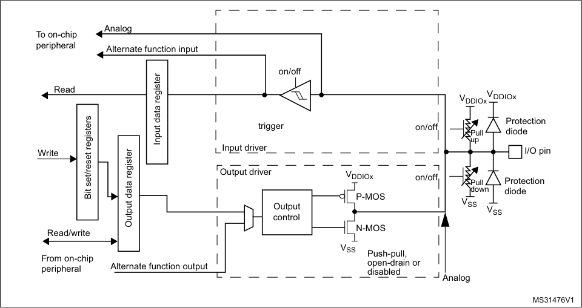
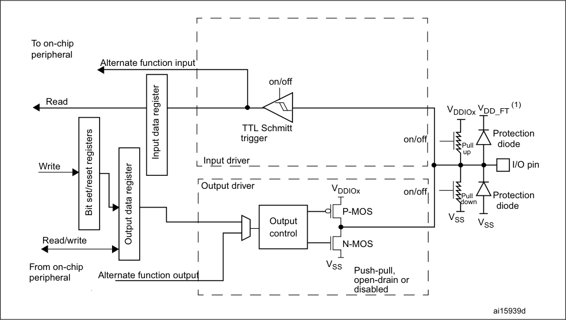
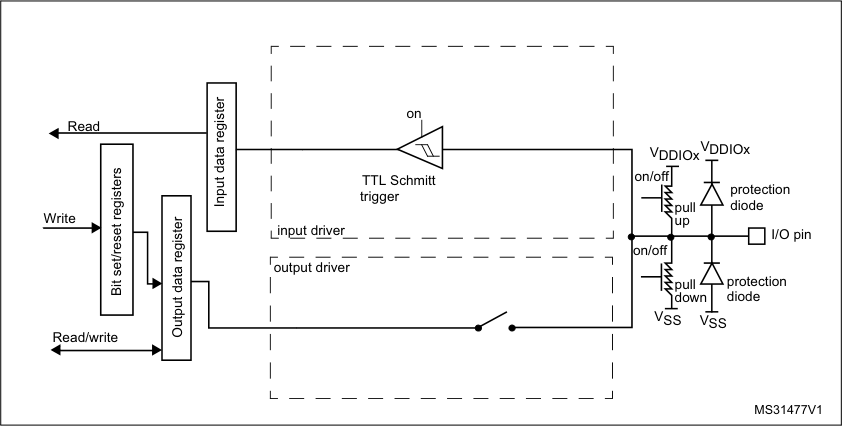
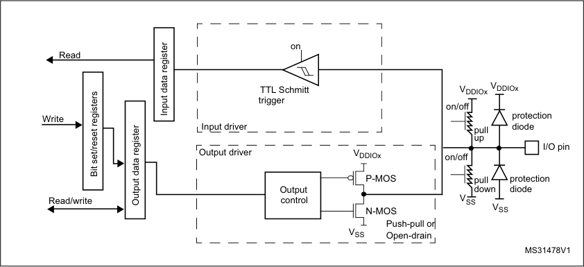
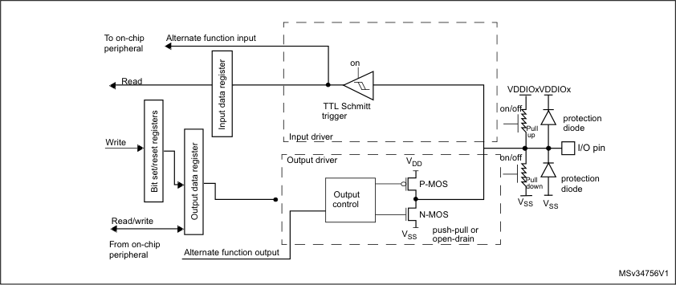
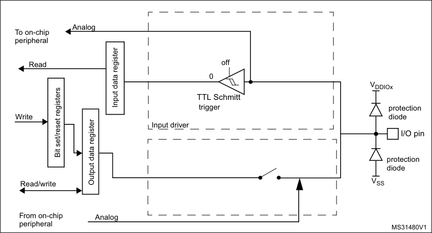
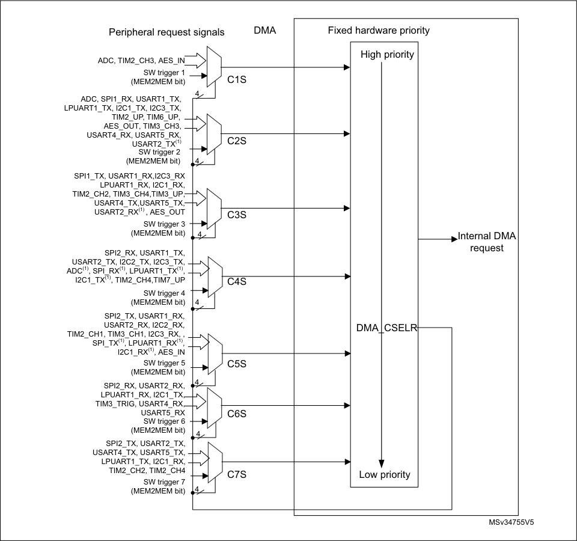
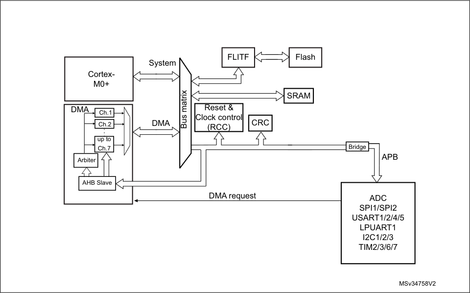

# RM0377 STM32L0x1 — Pages 201–250

**RM0377** **Reset and clock control (RCC)**

**7.3.14** **APB1 peripheral clock enable register (RCC_APB1ENR)**

Address: 0x38

Reset value: 0x0000 0000

Access: word, half-word and byte access

No wait state, except if the access occurs while an access to a peripheral on APB1 domain
is on going. In this case, wait states are inserted until this access to APB1 peripheral is
finished.

_Note:_ _When the peripheral clock is not active, the peripheral register values may not be readable_
_by software and the returned value is always 0x0._

|31|30|29|28|27|26|25|24|23|22|21|20|19|18|17|16|
|---|---|---|---|---|---|---|---|---|---|---|---|---|---|---|---|
|LPTIM1 EN|I2C3E N|Res.|PWRE N|Res|Res.|Res.|Res.|Res.|I2C2E N|I2C1E N|USART5 EN|USART4 EN|LPUART1 EN|USART2 EN|Res.|
|rw|rw||rw||||||rw|rw|rw|rw|rw|rw||

|15|14|13|12|11|10|9|8|7|6|5|4|3|2|1|0|
|---|---|---|---|---|---|---|---|---|---|---|---|---|---|---|---|
|Res.|SPI2E N|Res.|Res.|WWDG EN|Res.|Res.|Res.|Res.|Res.|TIM7E N|TIM6EN|Res.|Res.|TIM3EN|TIM2E N|
||rw|||rw||||||rw|rw|||rw|rw|

Bit 31 **LPTIM1EN:** Low-power timer clock enable bit

This bit is set and cleared by software.
0: Low-power timer clock disabled
1: Low-power timer clock enabled

Bit 30 **I2C3EN:** I2C3 clock enable bit

This bit is set and cleared by software.

0: I2C3 clock disabled

1: I2C3 clock enabled

Bit 28 **PWREN:** Power interface clock enable bit

This bit is set and cleared by software.

0: Power interface clock disabled

1: Power interface clock enabled

Bit 27 Reserved, must be kept at reset value.

Bits 26:23 Reserved, must be kept at reset value.

Bit 22 **I2C2EN:** I2C2 clock enable bit

This bit is set and cleared by software.

0: I2C2 clock disabled

1: I2C2 clock enabled

Bit 21 **I2C1EN:** I2C1 clock enable bit

This bit is set and cleared by software.

0: I2C1 clock disabled

1: I2C1 clock enabled

Bit 20 **USART5EN:** USART5 clock enable bit

This bit is set and cleared by software.

0: USART5 clock disabled

1: USART5 clock enabled

RM0377 Rev 10 201/905

215

--- end of page=200 ---

**Reset and clock control (RCC)** **RM0377**

Bit 19 **USART4EN:** USART4 clock enable bit

This bit is set and cleared by software.

0: USART4 clock disabled

1: USART4 clock enabled

Bit 18 **LPUART1EN:** LPUART1 clock enable bit

This bit is set and cleared by software.

0: LPUART1 clock disabled

1: LPUART1 clock enabled

Bit 17 **USART2EN:** USART2 clock enable bit

This bit is set and cleared by software.

0: USART2 clock disabled

1: USART2 clock enabled

Bits 16:15 Reserved, must be kept at reset value.

Bit 14 **SPI2EN:** SPI2 clock enable bit

This bit is set and cleared by software.

0: SPI2 clock disabled

1: SPI2 clock enabled

Bits 13:12 Reserved, must be kept at reset value.

Bit 11 **WWDGEN:** Window watchdog clock enable bit

This bit is set and cleared by software.
0: Window watchdog clock disabled
1: Window watchdog clock enabled

Bits 10:9 Reserved, must be kept at reset value.

Bits 8:6 Reserved, must be kept at reset value.

Bit 5 **TIM7EN:** Timer 7 clock enable bit

Set and cleared by software.

0: Timer 7 clock disabled

1: Timer 7 clock enabled

Bit 4 **TIM6EN:** Timer 6 clock enable bit

Set and cleared by software.

0: Timer 6 clock disabled

1: Timer 6 clock enabled

Bits 3:2 Reserved, must be kept at reset value.

Bit 1 **TIM3EN:** Timer3 clock enable bit

Set and cleared by software.

0: Timer3 clock disabled

1: Timer3 clock enabled

Bit 0 **TIM2EN:** Timer2 clock enable bit

Set and cleared by software.

0: Timer2 clock disabled

1: Timer2 clock enabled

202/905 RM0377 Rev 10

--- end of page=201 ---

**RM0377** **Reset and clock control (RCC)**

**7.3.15** **GPIO clock enable in Sleep mode register (RCC_IOPSMENR)**

Address: 0x3C

Reset value: the bits corresponding to the available GPIO ports are set

Access: no wait state, word, half-word and byte access

|31|30|29|28|27|26|25|24|23|22|21|20|19|18|17|16|
|---|---|---|---|---|---|---|---|---|---|---|---|---|---|---|---|
|Res.|Res.|Res.|Res.|Res.|Res.|Res.|Res.|Res.|Res.|Res.|Res.|Res.|Res.|Res.|Res.|
|||||||||||||||||

|15|14|13|12|11|10|9|8|7|6|5|4|3|2|1|0|
|---|---|---|---|---|---|---|---|---|---|---|---|---|---|---|---|
|Res.|Res.|Res.|Res.|Res.|Res.|Res.|Res.|IOPHS MEN|Res.|Res.|IOPES MEN|IOPDS MEN|IOPCS MEN|IOPBS MEN|IOPAS MEN|
|||||||||rw|||rw|rw|rw|rw|rw|

Bits 31: 8 Reserved, must be kept at reset value.

Bit 7 **IOPHSMEN:** Port H clock enable during Sleep mode bit

This bit is set and cleared by software.
0: Port H clock is disabled in Sleep mode
1: Port H clock is enabled in Sleep mode (if enabled by IOPHEN)

Bits 6:5 Reserved, must be kept at reset value.

Bit 4 **IOPESMEN:** Port E clock enable during Sleep mode bit

This bit is set and cleared by software.
0: Port E clock is disabled in Sleep mode
1: Port E clock is enabled in Sleep mode (if enabled by IOPDEN)

Bit 3 **IOPDSMEN:** Port D clock enable during Sleep mode bit

This bit is set and cleared by software.
0: Port D clock is disabled in Sleep mode
1: Port D clock is enabled in Sleep mode (if enabled by IOPDEN)

Bit 2 **IOPCSMEN:** Port C clock enable during Sleep mode bit

This bit is set and cleared by software.
0: Port C clock is disabled in Sleep mode
1: Port C clock is enabled in Sleep mode (if enabled by IOPCEN)

Bit 1 **IOPBSMEN:** Port B clock enable during Sleep mode bit

This bit is set and cleared by software.
0: Port B clock is disabled in Sleep mode
1: Port B clock is enabled in Sleep mode (if enabled by IOPBEN)

Bit 0 **IOPASMEN:** Port A clock enable during Sleep mode bit

This bit is set and cleared by software.
0: Port A clock is disabled in Sleep mode
1: Port A clock is enabled in Sleep mode (if enabled by IOPAEN)

RM0377 Rev 10 203/905

215

--- end of page=202 ---

**Reset and clock control (RCC)** **RM0377**

**7.3.16** **AHB peripheral clock enable in Sleep mode**
**register (RCC_AHBSMENR)**

Address: 0x40

Reset value: the bits corresponding to the available peripherals are set

Access: no wait state, word, half-word and byte access

|31|30|29|28|27|26|25|24|23|22|21|20|19|18|17|16|
|---|---|---|---|---|---|---|---|---|---|---|---|---|---|---|---|
|Res.|Res.|Res.|Res.|Res.|Res.|Res.|CRYP SMEN|Res.|Res.|Res.|Res.|Res.|Res.|Res.|Res.|
||||||||rw|||||||||

|15|14|13|12|11|10|9|8|7|6|5|4|3|2|1|0|
|---|---|---|---|---|---|---|---|---|---|---|---|---|---|---|---|
|Res.|Res.|Res.|CRC SMEN|Res.|Res.|SRAM SMEN|MIF SMEN|Res.|Res.|Res.|Res.|Res.|Res.|Res.|DMA SMEN|
||||rw|||rw|rw||||||||rw|

Bits 31:25 Reserved, must be kept at reset value.

Bit 24 **CRYPSMEN:** Crypto clock enable during Sleep mode bit

This bit is set and reset by software.
0: Crypto clock disabled in Sleep mode
1: Crypto clock enabled in Sleep mode

Bits 23:20 Reserved, must be kept at reset value.

Bits 19:16 Reserved, must be kept at reset value.

Bits 15: 13 Reserved, must be kept at reset value.

Bit 12 **CRCSMEN:** CRC clock enable during Sleep mode bit

This bit is set and reset by software.
0: Test integration module clock disabled in Sleep mode
1: Test integration module clock enabled in Sleep mode (if enabled by CRCEN)

Bits 11:10 Reserved, must be kept at reset value.

Bit 9 **SRAMSMEN:** SRAM interface clock enable during Sleep mode bit

This bit is set and reset by software.
0: NVM interface clock disabled in Sleep mode
1: NVM interface clock enabled in Sleep mode

Bit 8 **MIFSMEN:** NVM interface clock enable during Sleep mode bit

This bit is set and reset by software.
0: NVM interface clock disabled in Sleep mode
1: NVM interface clock enabled in Sleep mode

Bits 7:1 Reserved, must be kept at reset value.

Bit 0 **DMASMEN:** DMA clock enable during Sleep mode bit

This bit is set and reset by software.
0: DMA clock disabled in Sleep mode
1: DMA clock enabled in Sleep mode

204/905 RM0377 Rev 10

--- end of page=203 ---

**RM0377** **Reset and clock control (RCC)**

**7.3.17** **APB2 peripheral clock enable in Sleep mode**
**register (RCC_APB2SMENR)**

Address: 0x44

Reset value: the bits corresponding to the available peripherals are set.

Access: no wait state, word, half-word and byte access

|31|30|29|28|27|26|25|24|23|22|21|20|19|18|17|16|
|---|---|---|---|---|---|---|---|---|---|---|---|---|---|---|---|
|Res.|Res.|Res.|Res.|Res.|Res.|Res.|Res.|Res.|DBG SMEN|Res.|Res.|Res.|Res.|Res.|Res.|
||||||||||rw|||||||

|15|14|13|12|11|10|9|8|7|6|5|4|3|2|1|0|
|---|---|---|---|---|---|---|---|---|---|---|---|---|---|---|---|
|Res.|USART1 SMEN|Res.|SPI1 SMEN|Res.|Res.|ADC SMEN|Res.|Res.|Res.|TIM22 SMEN|Res.|Res.|TIM21 SMEN|Res.|SYSCF SMEN|
||rw||rw|||rw||||rw|||rw||rw|

Bits 31:23 Reserved, must be kept at reset value.

Bit 22 **DBGSMEN:** DBG clock enable during Sleep mode bit

This bit is set and cleared by software.
0: DBG clock disabled in Sleep mode
1: DBG clock enabled in Sleep mode (if enabled by DBGEN)

Bits 21:15 Reserved, must be kept at reset value.

Bit 14 **USART1SMEN:** USART1 clock enable during Sleep mode bit

This bit is set and cleared by software.
0: USART1 clock disabled in Sleep mode
1: USART1 clock enabled in Sleep mode (if enabled by USART1EN)

Bit 13 Reserved, must be kept at reset value.

Bit 12 **SPI1SMEN:** SPI1 clock enable during Sleep mode bit

This bit is set and cleared by software.
0: SPI1 clock disabled in Sleep mode
1: SPI1 clock enabled in Sleep mode (if enabled by SPI1EN)

Bits 11:10 Reserved, must be kept at reset value.

Bit 9 **ADCSMEN:** ADC clock enable during Sleep mode bit

This bit is set and cleared by software.
0: ADC clock disabled in Sleep mode
1: ADC clock enabled in Sleep mode (if enabled by ADCEN)

Bits 8:6 Reserved, must be kept at reset value.

Bit 5 **TIM22SMEN:** TIM22 timer clock enable during Sleep mode bit

This bit is set and cleared by software.
0:TIM22 clock disabled in Sleep mode
1: TIM22 clock enabled in Sleep mode (if enabled by TIM22EN)

Bits 4:3 Reserved, must be kept at reset value.

RM0377 Rev 10 205/905

215

--- end of page=204 ---

**Reset and clock control (RCC)** **RM0377**

Bit 2 **TIM21SMEN:** TIM21 timer clock enable during Sleep mode bit

This bit is set and cleared by software.
0: TIM21 clock disabled in Sleep mode
1: TIM21 clock enabled in Sleep mode (if enabled by TIM21EN)

Bit 1 Reserved, must be kept at reset value.

Bit 0 **SYSCFGSMEN:** System configuration controller clock enable during Sleep mode bit

This bit is set and cleared by software.
0: System configuration controller clock disabled in Sleep mode
1: System configuration controller clock enabled in Sleep mode

**7.3.18** **APB1 peripheral clock enable in Sleep mode**
**register (RCC_APB1SMENR)**

Address: 0x48

Reset value: the bits corresponding to the available peripherals are set

_Note:_ Access: no wait state, word, half-word and byte access

|31|30|29|28|27|26|25|24|23|22|21|20|19|18|17|16|
|---|---|---|---|---|---|---|---|---|---|---|---|---|---|---|---|
|LPTIM1 SMEN|I2C3S MEN|Res.|PWRS MEN|Res.|Res.|Res.|Res.|Res.|I2C2S MEN|I2C1S MEN|USART5 SMEN|USART4 SMEN|LPUART1 SMEN|USART2 SMEN|Res.|
|rw|rw||rw||||||rw|rw|rw|rw|rw|rw||

|15|14|13|12|11|10|9|8|7|6|5|4|3|2|1|0|
|---|---|---|---|---|---|---|---|---|---|---|---|---|---|---|---|
|Res.|SPI2S MEN|Res.|Res.|WWDG SMEN|Res.|Res.|Res.|Res.||TIM7S MEN|TIM6SM EN|Res.|Res.|TIM3SM EN|TIM2S MEN|
||rw|||rw||||||rw|rw|||rw|rw|

Bit 31 **LPTIM1SMEN:** Low-power timer clock enable during Sleep mode bit

This bit is set and cleared by software.
0: Low-power timer clock disabled in Sleep mode
1: Low-power timer clock enabled in Sleep mode (if enabled by LPTIM1EN)

Bit 30 **I2C3SMEN:** I2C3 clock enable during Sleep mode bit

This bit is set and cleared by software.
0: I2C3 clock disabled in Sleep mode
1: I2C3 clock enabled in Sleep mode (if enabled by I2C3EN)

Bit 29 Reserved, must be kept at reset value.

Bit 28 **PWRSMEN:** Power interface clock enable during Sleep mode bit

This bit is set and cleared by software.
0: Power interface clock disabled in Sleep mode
1: Power interface clock enabled in Sleep mode (if enabled by PWREN)

Bit 27 Reserved, must be kept at reset value.

Bits 26:23 Reserved, must be kept at reset value.

Bit 22 **I2C2SMEN:** I2C2 clock enable during Sleep mode bit

This bit is set and cleared by software.
0: I2C2 clock disabled in Sleep mode
1: I2C2 clock enabled in Sleep mode (if enabled by I2C2EN)

206/905 RM0377 Rev 10

--- end of page=205 ---

**RM0377** **Reset and clock control (RCC)**

Bit 21 **I2C1SMEN:** I2C1 clock enable during Sleep mode bit

This bit is set and cleared by software.
0: I2C1 clock disabled in Sleep mode
1: I2C1 clock enabled in Sleep mode (if enabled by I2C1EN)

Bit 20 **USART5SMEN:** USART5 clock enable during Sleep mode bit

This bit is set and cleared by software.
0: USART5 clock disabled in Sleep mode
1: USART5 clock enabled in Sleep mode (if enabled by USART5EN)

Bit 19 **USART4SMEN:** USART4 clock enable during Sleep mode bit

This bit is set and cleared by software.
0: USART4 clock disabled in Sleep mode
1: USART4 clock enabled in Sleep mode (if enabled by USART4EN)

Bit 18 **LPUART1SMEN:** LPUART1 clock enable during Sleep mode bit

This bit is set and cleared by software.
0: LPUART1 clock disabled in Sleep mode
1: LPUART1 clock enabled in Sleep mode (if enabled by LPUART1EN)

Bit 17 **USART2SMEN:** USART2 clock enable during Sleep mode bit

This bit is set and cleared by software.
0: USART2 clock disabled in Sleep mode
1: USART2 clock enabled in Sleep mode (if enabled by USART2EN)

Bits 16:15 Reserved, must be kept at reset value.

Bit 14 **SPI2SMEN:** SPI2 clock enable during Sleep mode bit

This bit is set and cleared by software.
0: SPI2 clock disabled in Sleep mode
1: SPI2 clock enabled in Sleep mode (if enabled by SPI2SEN)

Bits 13:12 Reserved, must be kept at reset value.

Bit 11 **WWDGSMEN:** Window watchdog clock enable during Sleep mode bit

This bit is set and cleared by software.
0: Window watchdog clock disabled in Sleep mode
1: Window watchdog clock enabled in Sleep mode (if enabled by WWDGEN)

Bits 10:9 Reserved, must be kept at reset value.

Bits 8:6 Reserved, must be kept at reset value.

Bit 5 **TIM7SMEN:** Timer 7 clock enable during Sleep mode bit

Set and cleared by software.
0: Timer 7 clock disabled in Sleep mode
1: Timer 7 clock enabled in Sleep mode (if enabled by TIM7EN)

Bit 4 **TIM6SMEN:** Timer 6 clock enable during Sleep mode bit

Set and cleared by software.
0: Timer 6 clock disabled in Sleep mode
1: Timer 6 clock enabled in Sleep mode (if enabled by TIM6EN)

RM0377 Rev 10 207/905

215

--- end of page=206 ---

**Reset and clock control (RCC)** **RM0377**

Bits 3:2 Reserved, must be kept at reset value.

Bit 1 **TIM3SMEN:** Timer3 clock enable during Sleep mode bit

Set and cleared by software.
0: Timer3 clock disabled in Sleep mode
1: Timer3 clock enabled in Sleep mode (if enabled by TIM3EN)

Bit 0 **TIM2SMEN:** Timer2 clock enable during Sleep mode bit

Set and cleared by software.
0: Timer2 clock disabled in Sleep mode
1: Timer2 clock enabled in Sleep mode (if enabled by TIM2EN)

**7.3.19** **Clock configuration register (RCC_CCIPR)**

Address: 0x4C

Reset value: 0x0000 0000

Access: no wait state, word, half-word and byte access

|31|30|29|28|27|26|25|24|23|22|21|20|19|18|17|16|
|---|---|---|---|---|---|---|---|---|---|---|---|---|---|---|---|
|Res.|Res.|Res.|Res.|Res.|Res.|Res.|Res.|Res.|Res.|Res.|Res.|LPTIM1 SEL1|LPTIM1S EL0|I2C3SE L1|I2C3SE L0|
|||||||||||||rw|rw|rw|rw|

|15|14|13|12|11|10|9|8|7|6|5|4|3|2|1|0|
|---|---|---|---|---|---|---|---|---|---|---|---|---|---|---|---|
|Res.|Res.|I2C1 SEL1|I2C1 SEL0|LPUART1 SEL1|LPUART1 SEL0|Res.|Res.|Res.|Res.|Res.|Res.|USART2 SEL1|USART2 SEL0|USART1 SEL1|USART1 SEL0|
|||rw|rw|rw|rw|||||||rw|rw|rw|rw|

Bits 31:26 Reserved, must be kept at reset value.

Bits 25:20 Reserved, must be kept at reset value.

Bits 19:18 **LPTIM1SEL:** Low-power Timer clock source selection bits

This bit is set and cleared by software.

00: APB clock selected as LP Timer clock

01: LSI clock selected as LP Timer clock

10: HSI16 clock selected as LP Timer clock

11: LSE clock selected as LP Timer clock

Bits 17:16 **I2C3SEL:** I2C3 clock source selection bits

This bit is set and cleared by software.

00: APB clock selected as I2C3 clock

01: System clock selected as I2C3 clock

10: HSI16 clock selected as I2C3 clock

11: not used

Bits 15:14 Reserved, must be kept at reset value.

Bits 13:12 **I2C1SEL:** I2C1 clock source selection bits

This bit is set and cleared by software.

00: APB clock selected as I2C1 clock

01: System clock selected as I2C1 clock

10: HSI16 clock selected as I2C1 clock

11: not used

208/905 RM0377 Rev 10

--- end of page=207 ---

**RM0377** **Reset and clock control (RCC)**

Bits 11:10 **LPUART1SEL:** LPUART1 clock source selection bits

This bit is set and cleared by software.

00: APB clock selected as LPUART1 clock

01: System clock selected as LPUART1 clock

10: HSI16 clock selected as LPUART1 clock

11: LSE clock selected as LPUART1 clock

Bits 9:4 Reserved, must be kept at reset value.

Bits 3:2 **USART2SEL:** USART2 clock source selection bits

This bit is set and cleared by software.
00: APB clock selected as USART2 clock

01: System clock selected as USART2 clock

10: HSI16 clock selected as USART2 clock

11: LSE clock selected as USART2 clock

Bits 1:0 **USART1SEL:** USART1 clock source selection bits
This bit is set and cleared by software.

00: APB clock selected as USART1 clock

01: System clock selected as USART1 clock

10: HSI16 clock selected as USART1 clock

11: LSE clock selected as USART1 clock

**7.3.20** **Control/status register (RCC_CSR)**

Address: 0x50

Power-on reset value: 0x0C00 0004

Access: 0 ≤ wait state ≤ 3, word, half-word and byte access

Wait states are inserted in case of successive accesses to this register.

_Note:_ _The LSEON, LSEBYP, RTCSEL,LSEDRV and RTCEN bits in the RCC control and status_
_register (RCC_CSR) are in the RTC domain. As these bits are write protected after reset,_
_the DBP bit in the Power control register (PWR_CR) has to be set to be able to modify them._
_Refer to Section 6.1.2: RTC and RTC backup registers for further information. These bits_
_are only reset after a RTC domain reset (see Section 6.1.2). Any internal or external reset_
_does not have any effect on them._

|31|30|29|28|27|26|25|24|23|22|21|20|19|18|17 16|Col16|
|---|---|---|---|---|---|---|---|---|---|---|---|---|---|---|---|
|LPWR RSTF|WWDG RSTF|IWDG RSTF|SFT RSTF|POR RSTF|PIN RSTF|OBL RS TF|FW RSTF|RMVF|Res.|Res.|Res.|RTC RST.|RTC EN|RTCSEL[1:0]|RTCSEL[1:0]|
|r|r|r|r|r|r|r|r|rt_w||||rw|rw|rw|rw|

|15|14|13|12 11|10|9|8|7|6|5|4|3|2|1|0|
|---|---|---|---|---|---|---|---|---|---|---|---|---|---|---|
|Res.|CSSLS ED|CSSLS EON|LSEDRV[1:0]|LSE BYP|LSERDY|LSEON|Res.|Res.|Res.|Res.|Res.|Res.|LSI RDY|LSION|
||r|rw|rw|rw|r|rw|||||||r|rw|

RM0377 Rev 10 209/905

215

--- end of page=208 ---

**Reset and clock control (RCC)** **RM0377**

Bit 31 **LPWRRSTF:** Low-power reset flag

This bit is set by hardware when a Low-power management reset occurs.
It is cleared by writing to the RMVF bit, or by a POR.
0: No Low-power management reset occurred
1: Low-power management reset occurred
For further information on Low-power management reset, refer to _Section : Low-power_
_management reset_ .

Bit 30 **WWDGRSTF:** Window watchdog reset flag

This bit is set by hardware when a window watchdog reset occurs.
It is cleared by writing to the RMVF bit, or by a POR.
0: No window watchdog reset occurred
1: Window watchdog reset occurred

Bit 29 **IWDGRSTF** : Independent watchdog reset flag

This bit is set by hardware when an independent watchdog reset from V DD domain occurs.
It is cleared by writing to the RMVF bit, or by a POR.
0: No watchdog reset occurred
1: Watchdog reset occurred

Bit 28 **SFTRSTF:** Software reset flag

This bit is set by hardware when a software reset occurs.
It is cleared by writing to the RMVF bit, or by a POR.

0: No software reset occurred

1: Software reset occurred

Bit 27 **PORRSTF:** POR/PDR reset flag

This bit is set by hardware when a POR/PDR reset occurs.
It is cleared by writing to the RMVF bit.

0: No POR/PDR reset occurred

1: POR/PDR reset occurred

Bit 26 **PINRSTF:** PIN reset flag

This bit is set by hardware when a reset from the NRST pin occurs.
It is cleared by writing to the RMVF bit, or by a POR.
0: No reset from NRST pin occurred
1: Reset from NRST pin occurred

Bit 25 **OBLRSTF** Options bytes loading reset flag

This bit is set by hardware when an OBL reset occurs.
It is cleared by writing to the RMVF bit, or by a POR.

0: No OBL reset occurred

1: OBL reset occurred

Bit 24 **FWRSTF** : Firewall reset flag

This bit is set by hardware when the firewall has generated a reset. It is cleared by writing to
the RMVF bit, or by a power-on reset.

0: No firewall reset occurred

1: firewall reset occurred

Bit 23 **RMVF:** Remove reset flag

This bit is set by software to clear the reset flags.

0: No effect

1: Clear the reset flags

Bits 22:20 Reserved, must be kept at reset value.

210/905 RM0377 Rev 10

--- end of page=209 ---

**RM0377** **Reset and clock control (RCC)**

Bit 19 **RTCRST:** RTC software reset bit

This bit is set and cleared by software.

0: Reset not activated

1: Resets the RTC peripheral, its clock source selection and the backup registers.

Bit 18 **RTCEN:** RTC clock enable bit

This bit is set and cleared by software.
It is reset by setting the RTCRST bit or by a POR.

0: RTC clock disabled

1: RTC clock enabled

Bits 17:16 **RTCSEL[1:0]:** RTC clock source selection bits

These bits are set by software to select the clock source for the RTC.

Once the RTC clock source has been selected it cannot be switched until RTCRST is set or

a Power On Reset occurred. The only exception is if the LSE oscillator clock was selected, if
the LSE clock stops and it is detected by the CSSLSE, in that case the clock can be
switched.

00: No clock

01: LSE oscillator clock used as RTC clock

10: LSI oscillator clock used as RTC clock

11: HSE oscillator clock divided by a programmable prescaler (selection through the
RTCPRE[1:0] bits in the RCC clock control register (RCC_CR)) used as the RTC clock

If the LSE or LSI is used as RTC clock source, the RTC continues to work in Stop and
Standby low-power modes, and can be used as wake-up source. However, when the HSE
clock is used as RTC clock source, the RTC cannot be used in Stop and Standby low-power
modes.

Bit 15 Reserved, must be kept at reset value.

Bit 14 **CSSLSED:** CSS on LSE failure detection flag

This bit is set by hardware to indicate when a failure has been detected by the clock security
system on the external 32 kHz oscillator (LSE).
It is cleared by a power-on reset or by an RTC software reset (RTCRST bit).
0: No failure detected on LSE (32 kHz oscillator)
1: Failure detected on LSE (32 kHz oscillator)

Bit 13 **CSSLSEON** CSS on LSE enable bit

This bit is set by software to enable the Clock Security System on LSE (32 kHz oscillator).
CSSLSEON must be enabled after the LSE and LSI oscillators are enabled (LSEON and
LSION bits enabled) and ready (LSERDY and LSIRDY flags set by hardware), and after the
RTCSEL bit is selected.

Once enabled this bit cannot be disabled, except after an LSE failure detection (CSSLSED
=1). In that case the software MUST disable the CSSLSEON bit.
Reset by power on reset and RTC software reset (RTCRST bit).
0: CSS on LSE (32 kHz oscillator) OFF
1: CSS on LSE (32 kHz oscillator) ON

Bits 12-11 **LSEDRV;** LSE oscillator Driving capability bits
These bits are set by software to select the driving capability of the LSE oscillator.
They are cleared by a power-on reset or an RTC reset. Once “00” has been written, the
content of LSEDRV cannot be changed by software.

00: Lowest drive

01: Medium low drive

10: Medium high drive
11: Highest drive

RM0377 Rev 10 211/905

215

--- end of page=210 ---

**Reset and clock control (RCC)** **RM0377**

Bit 10 **LSEBYP:** External low-speed oscillator bypass bit

This bit is set and cleared by software to bypass oscillator in debug mode. This bit can be
written only when the LSE oscillator is disabled.
It is reset by setting the RTCRST bit or by a POR.
0: LSE oscillator not bypassed
1: LSE oscillator bypassed

Bit 9 **LSERDY:** External low-speed oscillator ready bit

This bit is set and cleared by hardware to indicate when the LSE oscillator is stable. After the
LSEON bit is cleared, LSERDY goes low after 6 LSE oscillator clock cycles.
It is reset by setting the RTCRST bit or by a POR.
0: External 32 kHz oscillator not ready
1: External 32 kHz oscillator ready

Bit 8 **LSEON:** External low-speed oscillator enable bit

This bit is set and cleared by software.
It is reset by setting the RTCRST bit or by a POR.

0: LSE oscillator OFF

1:LSE oscillator ON

Bits 7:3 Reserved, must be kept at reset value.

Bit 1 **LSIRDY:** Internal low-speed oscillator ready bit

This bit is set and cleared by hardware to indicate when the LSI oscillator is stable. After the
LSION bit is cleared, LSIRDY goes low after 3 LSI oscillator clock cycles.
This bit is reset by system reset.
0: LSI oscillator not ready
1: LSI oscillator ready

Bit 0 **LSION:** Internal low-speed oscillator enable bit

This bit is set and cleared by software.
It is reset by system reset.

0: LSI oscillator OFF

1: LSI oscillator ON

212/905 RM0377 Rev 10

--- end of page=211 ---

**RM0377** **Reset and clock control (RCC)**

**7.3.21** **RCC register map**

The following table gives the RCC register map and the reset values.

**Table 44. RCC register map and reset values**

|Off- set|Register|31|30|29|28|27|26|25|24|23|22|21|20|19|18|17|16|15|14|13|12|11|10|9|8|7|6|5|4|3|2|1|0|
|---|---|---|---|---|---|---|---|---|---|---|---|---|---|---|---|---|---|---|---|---|---|---|---|---|---|---|---|---|---|---|---|---|---|
|0x00|RCC_CR|Res.|Res.|Res.|Res.|Res.|Res.|PLL RDY|PLL ON|Res.|Res.|RTC PRE [1:0]|RTC PRE [1:0]|CSSLSEON|HSEBYP|HSERDY|HSEON|Res.|Res.|Res.|Res.|Res.|Res.|MSIRDY|MSION|Res.|Res.|HSI16OUTEN|HSI16DIVF|HSI16DIVEN|HSI16RDYF|HSI16KERON|HSI16ON|
|0x00|Reset value|||||||0|0|||X|X|0|X|0|0|||||||1|1|||0|0|0|0|0|0|
|0x04|RCC_ICSCR|MSITRIM[7:0]|MSITRIM[7:0]|MSITRIM[7:0]|MSITRIM[7:0]|MSITRIM[7:0]|MSITRIM[7:0]|MSITRIM[7:0]|MSITRIM[7:0]|MSICAL[7:0]|MSICAL[7:0]|MSICAL[7:0]|MSICAL[7:0]|MSICAL[7:0]|MSICAL[7:0]|MSICAL[7:0]|MSICAL[7:0]|MSIRAN GE[2:0]|MSIRAN GE[2:0]|MSIRAN GE[2:0]|HSI16TRIM[4:0 ]|HSI16TRIM[4:0 ]|HSI16TRIM[4:0 ]|HSI16TRIM[4:0 ]|HSI16TRIM[4:0 ]|HSI16CAL[7:0]|HSI16CAL[7:0]|HSI16CAL[7:0]|HSI16CAL[7:0]|HSI16CAL[7:0]|HSI16CAL[7:0]|HSI16CAL[7:0]|HSI16CAL[7:0]|
|0x04|Reset value|0|0|0|0|0|0|0|0|x|x|x|x|x|x|x|x|1|0|1|1|0|0|0|0|x|x|x|x|x|x|x|x|
|0x08|Reserved|Reserved|Reserved|Reserved|Reserved|Reserved|Reserved|Reserved|Reserved|Reserved|Reserved|Reserved|Reserved|Reserved|Reserved|Reserved|Reserved|Reserved|Reserved|Reserved|Reserved|Reserved|Reserved|Reserved|Reserved|Reserved|Reserved|Reserved|Reserved|Reserved|Reserved|Reserved|Reserved|
|0x0C|RCC_CFGR|Res.|MCOPR E [2:0]|MCOPR E [2:0]|MCOPR E [2:0]|Res.|MCOSE L [3:0]|MCOSE L [3:0]|MCOSE L [3:0]|PLL DIV [1:0]|PLL DIV [1:0]|PLLMUL[3: 0]|PLLMUL[3: 0]|PLLMUL[3: 0]|PLLMUL[3: 0]|Res.|PLLSRC|STOPWUCK|Res.|PPRE2 [2:0]|PPRE2 [2:0]|PPRE2 [2:0]|PPRE1 [2:0]|PPRE1 [2:0]|PPRE1 [2:0]|HPRE[3:0]|HPRE[3:0]|HPRE[3:0]|HPRE[3:0]|SWS [1:0]|SWS [1:0]|SW [1:0]|SW [1:0]|
|0x0C|Reset value||0|0|0||0|0|0|0|0|0|0|0|0||0|0||0|0|0|0|0|0|0|0|0|0|0|0|0|0|
|0x10|RCC_CIER|Res.|Res.|Res.|Res.|Res.|Res.|Res.|Res.|Res.|Res.|Res.|Res.|Res.|Res.|Res.|Res.|Res.|Res.|Res.|Res.|Res.|Res.|Res.|Res.|CSSLSE|Res.|MSIRDYIE|PLLRDYIE|HSERDYIE|HSI16RDYIE|LSERDYIE|LSIRDYIE|
|0x10|Reset value|||||||||||||||||||||||||0|0|0|0|0|0|0|0|
|0x14|RCC_CIFR|Res.|Res.|Res.|Res.|Res.|Res.|Res.|Res.|Res.|Res.|Res.|Res.|Res.|Res.|Res.|Res.|Res.|Res.|Res.|Res.|Res.|Res.|Res.|CSSHSEF.|CSSLSEF.|Res.|MSIRDYF|PLLRDYF|HSERDYF|HSI16RDYF|LSERDYF|LSIRDYF|
|0x14|Reset value||||||||||||||||||||||||0|0|0|0|0|0|0|0|0|
|0x18|RCC_CICR|Res.|Res.|Res.|Res.|Res.|Res.|Res.|Res.|Res.|Res.|Res.|Res.|Res.|Res.|Res.|Res.|Res.|Res.|Res.|Res.|Res.|Res.|Res.|CSSHSEC.|CSSLSEC.|Res.|MSIRDYC|PLLRDYC|HSERDYC|HSI16RDYC|LSERDYC|LSIRDYC|
|0x18|Reset value||||||||||||||||||||||||0|0|0|0|0|0|0|0|0|
|0x1C|RCC_IOPRSTR|Res.|Res.|Res.|Res.|Res.|Res.|Res.|Res.|Res.|Res.|Res.|Res.|Res.|Res.|Res.|Res.|Res.|Res.|Res.|Res.|Res.|Res.|Res.|Res.|IOPHRS|Res.|Res.|IOPERST|IOPDRS|IOPCRS|IOPBRST|IOPARST|
|0x1C|Reset value|||||||||||||||||||||||||0|||0|0|0|0|0|
|0x20|RCC_AHBRSTR|Res.|Res.|Res.|Res.|Res.|Res.|Res.|CRYPRST|Res.|Res.|Res.|Res.|Res.|Res.|Res.|Res.|Res.|Res.|Res.|CRCRST|Res.|Res.|Res.|MIFRST|Res.|Res.|Res.|Res.|Res.|Res.|Res.|DMARST|
|0x20|Reset value||||||||0||||0||||0||||0||||0||||||||0|

RM0377 Rev 10 213/905

215

--- end of page=212 ---

**Reset and clock control (RCC)** **RM0377**

**Table 44. RCC register map and reset values (continued)**

|Off- set|Register|31|30|29|28|27|26|25|24|23|22|21|20|19|18|17|16|15|14|13|12|11|10|9|8|7|6|5|4|3|2|1|0|
|---|---|---|---|---|---|---|---|---|---|---|---|---|---|---|---|---|---|---|---|---|---|---|---|---|---|---|---|---|---|---|---|---|---|
|0x24|RCC_APB2RSTR|Res.|Res.|Res.|Res.|Res.|Res.|Res.|Res.|Res.|DBGRST|Res.|Res.|Res.|Res.|Res.|Res.|Res.|USART1RST|Res.|SPI1RST|Res.|Res.|ADCRST|Res.|Res.|Res.|TM12RST|Res.|Res.|TIM21RST|Res.|SYSCFGRST|
|0x24|Reset value||||||||||0||||||||0||0|||0||||0|||0||0|
|0x28|RCC_APB1RSTR|LPTIM1RST|I2C3RST|Res.|PWRRST|Res.|Res.|Res.|Res.|Res.|I2C2RST|I2C1RST|USART5RST|USART4RST|LPUART1RST|USART2RST|Res.|Res.|SPI2RST|Res.|Res.|WWDRST|Res.|Res.|Res.|Res.|Res.|TIM7RST|TIM6RST|Res.|Res.|TIM3RST|TIM2RST|
|0x28|Reset value|0|0||0||||||0|0|0|0|0|0|||0|||0||||||0|0|||0|0|
|0x2C|RCC_IOPENR|Res.|Res.|Res.|Res.|Res.|Res.|Res.|Res.|Res.|Res.|Res.|Res.|Res.|Res.|Res.|Res.|Res.|Res.|Res.|Res.|Res.|Res.|Res.|Res.|IOPHEN|Res.|Res.|IOPEEN|IOPDEN|IOPCEN|IOPBEN|IOPAEN|
|0x2C|Reset value|||||||||||||||||||||||||0|||0|0|0|0|0|
|0x30|RCC_AHBENR|Res.|Res.|Res.|Res.|Res.|Res.|Res.|CRYPEN|Res.|Res.|Res.|Res.|Res.|Res.|Res.|Res.|Res.|Res.|Res.|CRCEN|Res.|Res.|Res.|MIFEN|Res.|Res.|Res.|Res.|Res.|Res.|Res.|DMAEN|
|0x30|Reset value||||||||0||||0||||0||||0||||1||||||||0|
|0x34|RCC_APB2ENR|Res.|Res.|Res.|Res.|Res.|Res.|Res.|Res.|Res.|DBGEN|Res.|Res.|Res.|Res.|Res.|Res.|Res.|USART1EN|Res.|SPI1EN|Res.|Res.|ADCEN|Res.|FWEN|Res.|TIM22EN|Res.|Res.|TIM21EN|Res.|SYSCFGEN|
|0x34|Reset value||||||||||0||||||||0||0|||0||0||0|||0||0|
|0x38|RCC_APB1ENR|LPTIM1EN|I2C3EN|Res.|PWREN|Res.|Res.|Res.|Res.|Res|I2C2EN|I2C1EN|USART5EN|USART4EN|LPUART1EN|USART2EN|Res.|Res.|SPI2EN|Res.|Res.|WWDGEN|Res.|Res|Res.|Res.|Res.|TIM7EN|TIM6EN|Res.|Res.|TIM3EN|TIM2EN|
|0x38|Reset value|0|0||0||||||0|0|0|0|0|0|||0|||0||||||0|0|||0|0|
|0x3C|RCC_IOPSMEN|Res.|Res.|Res.|Res.|Res.|Res.|Res.|Res.|Res.|Res.|Res.|Res.|Res.|Res.|Res.|Res.|Res.|Res.|Res.|Res.|Res.|Res.|Res.|Res.|IOPHSMEN|Res.|Res.|IOPESMEN|IOPDSMEN|IOPCSMEN|IOPBSMEN|IOPASMEN|
|0x3C|Reset value|||||||||||||||||||||||||1|||1|1|1|1|1|
|0x40|RCC_AHBSMENR|Res.|Res.|Res.|Res.|Res.|Res.|Res.|CRYPSMEN|Res.|Res.|Res.|Res.|Res.|Res.|Res.|Res.|Res.|Res.|Res.|CRCSMEN|Res.|Res.|SRAMSMEN|MIFSMEN|Res.|Res.|Res.|Res.|Res.|Res.|Res.|DMASMEN|
|0x40|Reset value||||||||1||||||||||||1|||1|1||||||||1|
|0x44|RCC_APB2SMENR|Res.|Res.|Res.|Res.|Res.|Res.|Res.|Res.|Res.|DBGSMEN|Res.|Res.|Res.|Res.|Res.|Res.|Res.|USART1SMEN|Res.|SPI1SMEN|Res.|Res.|ADCSMEN|Res.|Res.|Res.|TIM22SMEN|Res.|Res.|TIM21SMEN|Res.|SYSCFGSMEN|
|0x44|Reset value||||||||||1||||||||1||1|||1||||1|||1||1|

214/905 RM0377 Rev 10

--- end of page=213 ---

**RM0377** **Reset and clock control (RCC)**

**Table 44. RCC register map and reset values (continued)**

|Off- set|Register|31|30|29|28|27|26|25|24|23|22|21|20|19|18|17|16|15|14|13|12|11|10|9|8|7|6|5|4|3|2|1|0|
|---|---|---|---|---|---|---|---|---|---|---|---|---|---|---|---|---|---|---|---|---|---|---|---|---|---|---|---|---|---|---|---|---|---|
|0x48|RCC_APB1SMENR|LPTIM1SMEN|I2C3SMEN|Res.|PWRSMEN|Res.|Res.|Res.|Res.|Res|I2C2SMEN|I2C1SMEN|USART5SMEN|USART4SMEN|LPUART1SMEN|USART2SMEN|Res.|Res.|SPI2SMEN|Res.|Res.|WWDGSMEN|Res.|Res|Res.|Res.|Res.|TIM7SMEN|TIM6SMEN|Res.|Res.|TIM3SMEN|TIM2SMEN|
|0x48|Reset value|1|1||1||||||1|1|1|1|1|1|||1|||1||||||1|1|||1|1|
|0x4C|RCC_CCIPR|Res.|Res.|Res.|Res.|Res.|Res|Res.|Res.|Res.|Res.|Res.|Res.|LPTIM1SEL1|LPTIM1SEL0|I2C3SEL1|I2C3SEL0|Res.|Res.|I2C1SEL1|I2C1SEL0|LPUART1SEL1|LPUART1SEL0|Res.|Res.|Res.|Res.|Res.|Res.|USART2SEL1|USART2SEL0|USART1SEL1|USART1SEL0|
|0x4C|Reset value|||||||||||||0|0|0|0|||0|0|0|0|||||||0|0|0|0|
|0x50|RCC_CSR|LPWRSTF|WWDGRSTF|IWDGRSTF|SFTRSTF|PORRSTF|PINRSTF|OBLRSTF|FWRSTF|RMVF|Res.|Res.|Res.|RTCRST|RTCEN|RTC SEL [1:0]|RTC SEL [1:0]|Res.|CSSLSED|CSSLSEON|LSE DRV [1:0]|LSE DRV [1:0]|LSEBYP|LSERDY|LSEON|Res.|Res.|Res.|Res.|Res.|Res.|LSIRDY|LSION|
|0x50|Reset value|0|0|0|0|1|1|0|0|0||||0|0|0|0||0|0|0|0|0|0|0|||||||0|0|

Refer to _Section 2.2 on page 51_ for the register boundary addresses.

RM0377 Rev 10 215/905

215

--- end of page=214 ---

**General-purpose I/Os (GPIO)** **RM0377**

#### **8 General-purpose I/Os (GPIO)**

###### **8.1 Introduction**

Each general-purpose I/O port has four 32-bit configuration registers (GPIOx_MODER,
GPIOx_OTYPER, GPIOx_OSPEEDR and GPIOx_PUPDR), two 32-bit data registers
(GPIOx_IDR and GPIOx_ODR) and a 32-bit set/reset register (GPIOx_BSRR). In addition
all GPIOs have a 32-bit locking register (GPIOx_LCKR) and two 32-bit alternate function
selection registers (GPIOx_AFRH and GPIOx_AFRL).

###### **8.2 GPIO main features**

      - Output states: push-pull or open drain + pull-up/down

      - Output data from output data register (GPIOx_ODR) or peripheral (alternate function
output)

      - Speed selection for each I/O

      - Input states: floating, pull-up/down, analog

      - Input data to input data register (GPIOx_IDR) or peripheral (alternate function input)

      - Bit set and reset register (GPIOx_ BSRR) for bitwise write access to GPIOx_ODR

      - Locking mechanism (GPIOx_LCKR) provided to freeze the I/O port configurations

      - Analog function

      - Alternate function selection registers

      - Fast toggle capable of changing every two clock cycles

      - Highly flexible pin multiplexing allows the use of I/O pins as GPIOs or as one of several
peripheral functions

###### **8.3 GPIO functional description**

Subject to the specific hardware characteristics of each I/O port listed in the datasheet, each
port bit of the general-purpose I/O (GPIO) ports can be individually configured by software in
several modes:

      - Input floating

      - Input pull-up

      - Input-pull-down

      - Analog

      - Output open-drain with pull-up or pull-down capability

      - Output push-pull with pull-up or pull-down capability

      - Alternate function push-pull with pull-up or pull-down capability

      - Alternate function open-drain with pull-up or pull-down capability

Each I/O port bit is freely programmable, however the I/O port registers have to be
accessed as 32-bit words, half-words or bytes. The purpose of the GPIOx_BSRR register is
to allow atomic read/modify accesses to any of the GPIOx_ODR registers. In this way, there
is no risk of an IRQ occurring between the read and the modify access.

216/905 RM0377 Rev 10

--- end of page=215 ---

**RM0377** **General-purpose I/Os (GPIO)**

_Figure 19_ and _Figure 20_ show the basic structures of a standard and a 5-Volt tolerant I/O
port bit, respectively. _Table 45_ gives the possible port bit configurations.

**Figure 19. Basic structure of an I/O port bit**

**Figure 20. Basic structure of a 5-Volt tolerant I/O port bit**

1. V DD_FT is a potential specific to 5-Volt tolerant I/Os and different from V DD .

RM0377 Rev 10 217/905

232

--- end of page=216 ---

**General-purpose I/Os (GPIO)** **RM0377**

**Table 45. Port bit configuration table** **[(1)]**

|MODE(i) [1:0]|OTYPER(i)|OSPEED(i) [1:0]|Col4|PUPD(i) [1:0]|Col6|I/O configuration|Col8|
|---|---|---|---|---|---|---|---|
|01|0|SPEED [1:0]|SPEED [1:0]|0|0|GP output|PP|
|01|0|0|0|0|1|GP output|PP + PU|
|01|0|0|0|1|0|GP output|PP + PD|
|01|0|0|0|1|1|Reserved|Reserved|
|01|1|1|1|0|0|GP output|OD|
|01|1|1|1|0|1|GP output|OD + PU|
|01|1|1|1|1|0|GP output|OD + PD|
|01|1|1|1|1|1|Reserved (GP output OD)|Reserved (GP output OD)|
|10|0|SPEED [1:0]|SPEED [1:0]|0|0|AF|PP|
|10|0|0|0|0|1|AF|PP + PU|
|10|0|0|0|1|0|AF|PP + PD|
|10|0|0|0|1|1|Reserved|Reserved|
|10|1|1|1|0|0|AF|OD|
|10|1|1|1|0|1|AF|OD + PU|
|10|1|1|1|1|0|AF|OD + PD|
|10|1|1|1|1|1|Reserved|Reserved|
|00|x|x|x|0|0|Input|Floating|
|00|x|x|x|0|1|Input|PU|
|00|x|x|x|1|0|Input|PD|
|00|x|x|x|1|1|Reserved (input floating)|Reserved (input floating)|
|11|x|x|x|0|0|Input/output|Analog|
|11|x|x|x|0|1|Reserved|Reserved|
|11|x|x|x|1|0|0|0|
|11|x|x|x|1|1|1|1|

1. GP = general-purpose, PP = push-pull, PU = pull-up, PD = pull-down, OD = open-drain, AF = alternate
function.

**8.3.1** **General-purpose I/O (GPIO)**

During and just after reset, the alternate functions are not active and most of the I/O ports
are configured in analog mode.

The debug pins are in AF pull-up/pull-down after reset:

      - PA14: SWCLK in pull-down

      - PA13: SWDIO in pull-up

218/905 RM0377 Rev 10

--- end of page=217 ---

**RM0377** **General-purpose I/Os (GPIO)**

When the pin is configured as output, the value written to the output data register
(GPIOx_ODR) is output on the I/O pin. It is possible to use the output driver in push-pull
mode or open-drain mode (only the low level is driven, high level is HI-Z).

The input data register (GPIOx_IDR) captures the data present on the I/O pin at every AHB
clock cycle.

All GPIO pins have weak internal pull-up and pull-down resistors, which can be activated or
not depending on the value in the GPIOx_PUPDR register.

**8.3.2** **I/O pin alternate function multiplexer and mapping**

The device I/O pins are connected to on-board peripherals/modules through a multiplexer
that allows only one peripheral alternate function (AF) connected to an I/O pin at a time. In
this way, there can be no conflict between peripherals available on the same I/O pin.

Each I/O pin has a multiplexer with up to sixteen alternate function inputs (AF0 to AF15) that
can be configured through the GPIOx_AFRL (for pin 0 to 7) and GPIOx_AFRH (for pin 8 to
15) registers:

      - After reset the multiplexer selection is alternate function 0 (AF0). The I/Os are
configured in alternate function mode through GPIOx_MODER register.

      - The specific alternate function assignments for each pin are detailed in the device
datasheet.

In addition to this flexible I/O multiplexing architecture, each peripheral has alternate
functions mapped onto different I/O pins to optimize the number of peripherals available in
smaller packages.

To use an I/O in a given configuration, the user has to proceed as follows:

      - **Debug function:** after each device reset these pins are assigned as alternate function
pins immediately usable by the debugger host

      - **GPIO:** configure the desired I/O as output, input or analog in the GPIOx_MODER
register.

      - **Peripheral alternate function:**

–
Connect the I/O to the desired AFx in one of the GPIOx_AFRL or GPIOx_AFRH
register.

–
Select the type, pull-up/pull-down and output speed via the GPIOx_OTYPER,
GPIOx_PUPDR and GPIOx_OSPEEDER registers, respectively.

–
Configure the desired I/O as an alternate function in the GPIOx_MODER register.

      - **Additional functions:**

–
For the ADC and COMP, configure the desired I/O in analog mode in the
GPIOx_MODER register and configure the required function in the ADC and
COMP registers.

–
For the additional functions like RTC, WKUPx and oscillators, configure the
required function in the related RTC, PWR and RCC registers. These functions
have priority over the configuration in the standard GPIO registers.

Refer to the “Alternate function mapping” table in the device datasheet for the detailed
mapping of the alternate function I/O pins.

RM0377 Rev 10 219/905

232

--- end of page=218 ---

**General-purpose I/Os (GPIO)** **RM0377**

**8.3.3** **I/O port control registers**

Each of the GPIO ports has four 32-bit memory-mapped control registers (GPIOx_MODER,
GPIOx_OTYPER, GPIOx_OSPEEDR, GPIOx_PUPDR) to configure up to 16 I/Os. The
GPIOx_MODER register is used to select the I/O mode (input, output, AF, analog). The
GPIOx_OTYPER and GPIOx_OSPEEDR registers are used to select the output type (pushpull or open-drain) and speed. The GPIOx_PUPDR register is used to select the pullup/pull-down whatever the I/O direction.

**8.3.4** **I/O port data registers**

Each GPIO has two 16-bit memory-mapped data registers: input and output data registers
(GPIOx_IDR and GPIOx_ODR). GPIOx_ODR stores the data to be output, it is read/write
accessible. The data input through the I/O are stored into the input data register
(GPIOx_IDR), a read-only register.

See _Section 8.4.5: GPIO port input data register (GPIOx_IDR) (x = A to E and H)_ and
_Section 8.4.6: GPIO port output data register (GPIOx_ODR) (x = A to E and H)_ for the
register descriptions.

**8.3.5** **I/O data bitwise handling**

The bit set reset register (GPIOx_BSRR) is a 32-bit register which allows the application to
set and reset each individual bit in the output data register (GPIOx_ODR). The bit set reset
register has twice the size of GPIOx_ODR.

To each bit in GPIOx_ODR, correspond two control bits in GPIOx_BSRR: BS(i) and BR(i).
When written to 1, bit BS(i) **sets** the corresponding ODR(i) bit. When written to 1, bit BR(i)
**resets** the ODR(i) corresponding bit.

Writing any bit to 0 in GPIOx_BSRR does not have any effect on the corresponding bit in
GPIOx_ODR. If there is an attempt to both set and reset a bit in GPIOx_BSRR, the set
action takes priority.

Using the GPIOx_BSRR register to change the values of individual bits in GPIOx_ODR is a
“one-shot” effect that does not lock the GPIOx_ODR bits. The GPIOx_ODR bits can always
be accessed directly. The GPIOx_BSRR register provides a way of performing atomic
bitwise handling.

There is no need for the software to disable interrupts when programming the GPIOx_ODR
at bit level: it is possible to modify one or more bits in a single atomic AHB write access.

**8.3.6** **GPIO locking mechanism**

It is possible to freeze the GPIO control registers by applying a specific write sequence to
the GPIOx_LCKR register. The frozen registers are GPIOx_MODER, GPIOx_OTYPER,
GPIOx_OSPEEDR, GPIOx_PUPDR, GPIOx_AFRL and GPIOx_AFRH.

To write the GPIOx_LCKR register, a specific write / read sequence has to be applied. When
the right LOCK sequence is applied to bit 16 in this register, the value of LCKR[15:0] is used
to lock the configuration of the I/Os (during the write sequence the LCKR[15:0] value must
be the same). When the LOCK sequence has been applied to a port bit, the value of the port
bit can no longer be modified until the next MCU reset or peripheral reset. Each
GPIOx_LCKR bit freezes the corresponding bit in the control registers (GPIOx_MODER,
GPIOx_OTYPER, GPIOx_OSPEEDR, GPIOx_PUPDR, GPIOx_AFRL and GPIOx_AFRH.

220/905 RM0377 Rev 10

--- end of page=219 ---

**RM0377** **General-purpose I/Os (GPIO)**

The LOCK sequence (refer to _Section 8.4.8: GPIO port configuration lock register_
_(GPIOx_LCKR) (x = A to E and H)_ ) can only be performed using a word (32-bit long)
access to the GPIOx_LCKR register due to the fact that GPIOx_LCKR bit 16 has to be set
at the same time as the [15:0] bits.

For code example, refer to _A.5.1: Locking mechanism code example_ .

For more details refer to LCKR register description in _Section 8.4.8: GPIO port configuration_
_lock register (GPIOx_LCKR) (x = A to E and H)_ .

**8.3.7** **I/O alternate function input/output**

Two registers are provided to select one of the alternate function inputs/outputs available for
each I/O. With these registers, the user can connect an alternate function to some other pin
as required by the application.

This means that a number of possible peripheral functions are multiplexed on each GPIO
using the GPIOx_AFRL and GPIOx_AFRH alternate function registers. The application can
thus select any one of the possible functions for each I/O. The AF selection signal being
common to the alternate function input and alternate function output, a single channel is
selected for the alternate function input/output of a given I/O.

To know which functions are multiplexed on each GPIO pin refer to the device datasheet.

For code example, refer to _A.5.2: Alternate function selection sequence code example_ .

**8.3.8** **External interrupt/wakeup lines**

All ports have external interrupt capability. To use external interrupt lines, the port must be
configured in input mode.

Refer to _Section 12: Extended interrupt and event controller (EXTI)_ and to _Section 12.3.2:_
_Wakeup event management._

**8.3.9** **Input configuration**

When the I/O port is programmed as input:

      - The output buffer is disabled

      - The Schmitt trigger input is activated

      - The pull-up and pull-down resistors are activated depending on the value in the
GPIOx_PUPDR register

      - The data present on the I/O pin are sampled into the input data register every AHB
clock cycle

      - A read access to the input data register provides the I/O state

_Figure 21_ shows the input configuration of the I/O port bit.

RM0377 Rev 10 221/905

232

--- end of page=220 ---

**General-purpose I/Os (GPIO)** **RM0377**

**Figure 21. Input floating / pull up / pull down configurations**

**8.3.10** **Output configuration**

When the I/O port is programmed as output:

      - The output buffer is enabled:

–
Open drain mode: A “0” in the Output register activates the N-MOS whereas a “1”
in the Output register leaves the port in Hi-Z (the P-MOS is never activated)

–
Push-pull mode: A “0” in the Output register activates the N-MOS whereas a “1” in
the Output register activates the P-MOS

      - The Schmitt trigger input is activated

      - The pull-up and pull-down resistors are activated depending on the value in the
GPIOx_PUPDR register

      - The data present on the I/O pin are sampled into the input data register every AHB
clock cycle

      - A read access to the input data register gets the I/O state

      - A read access to the output data register gets the last written value

222/905 RM0377 Rev 10

--- end of page=221 ---

**RM0377** **General-purpose I/Os (GPIO)**

_Figure 22_ shows the output configuration of the I/O port bit.

**Figure 22. Output configuration**

**8.3.11** **Alternate function configuration**

When the I/O port is programmed as alternate function:

- The output buffer can be configured in open-drain or push-pull mode

- The output buffer is driven by the signals coming from the peripheral (transmitter
enable and data)

- The Schmitt trigger input is activated

- The weak pull-up and pull-down resistors are activated or not depending on the value
in the GPIOx_PUPDR register

- The data present on the I/O pin are sampled into the input data register every AHB
clock cycle

- A read access to the input data register gets the I/O state

_Figure 23_ shows the alternate function configuration of the I/O port bit.

**Figure 23. Alternate function configuration**

|egister|Col2|
|---|---|
|Input data r|Input data r|

RM0377 Rev 10 223/905

232

--- end of page=222 ---

**General-purpose I/Os (GPIO)** **RM0377**

**8.3.12** **Analog configuration**

When the I/O port is programmed as analog configuration:

      - The output buffer is disabled

      - The Schmitt trigger input is deactivated, providing zero consumption for every analog
value of the I/O pin. The output of the Schmitt trigger is forced to a constant value (0).

      - The weak pull-up and pull-down resistors are disabled by hardware

      - Read access to the input data register gets the value “0”

For code example, refer to _A.5.3: Analog GPIO configuration code example_ .

_Figure 24_ shows the high-impedance, analog-input configuration of the I/O port bits.

**Figure 24. High impedance-analog configuration**

**8.3.13** **Using the HSE or LSE oscillator pins as GPIOs**

When the HSE or LSE oscillator is switched OFF (default state after reset), the related
oscillator pins can be used as normal GPIOs.

When the HSE or LSE oscillator is switched ON (by setting the HSEON or LSEON bit in the
RCC_CSR register) the oscillator takes control of its associated pins and the GPIO
configuration of these pins has no effect.

When the oscillator is configured in a user external clock mode, only the OSC_IN, CK_IN or
OSC32_IN pin is reserved for clock input and the OSC_OUT or OSC32_OUT pin can still be
used as normal GPIO.

**8.3.14** **Using the GPIO pins in the RTC supply domain**

The PC13/PC14/PC15/PA0/PA2 GPIO functionality is lost when the core supply domain is
powered off (when the device enters Standby mode). In this case, if their GPIO configuration
is not bypassed by the RTC configuration, these pins are set in an analog input mode.

For details about I/O control by the RTC, refer to _Section 22.4: RTC functional description_ .

224/905 RM0377 Rev 10

--- end of page=223 ---

**RM0377** **General-purpose I/Os (GPIO)**

**8.3.15** **BOOT0/GPIO pin sharing**

On category 1 devices, the BOOT0 pin is shared with a GPIO pin. The BOOT0 pin input
level can be read as an input value on the shared GPIO pin. This pin features specific input
voltage characteristics (refer to the corresponding datasheet for more details).

###### **8.4 GPIO registers**

For a summary of register bits, register address offsets and reset values, refer to _Table 46_ .

The peripheral registers can be written in word, half word or byte mode.

**8.4.1** **GPIO port mode register (GPIOx_MODER)**
**(x =A to E and H)**

Address offset:0x00

Reset value: 0xEBFF FCFF for port A

Reset value: 0xFFFF FFFF for the other ports

|31 30|Col2|29 28|Col4|27 26|Col6|25 24|Col8|23 22|Col10|21 20|Col12|19 18|Col14|17 16|Col16|
|---|---|---|---|---|---|---|---|---|---|---|---|---|---|---|---|
|MODE15[1:0]|MODE15[1:0]|MODE14[1:0]|MODE14[1:0]|MODE13[1:0]|MODE13[1:0]|MODE12[1:0]|MODE12[1:0]|MODE11[1:0]|MODE11[1:0]|MODE10[1:0]|MODE10[1:0]|MODE9[1:0]|MODE9[1:0]|MODE8[1:0]|MODE8[1:0]|
|rw|rw|rw|rw|rw|rw|rw|rw|rw|rw|rw|rw|rw|rw|rw|rw|

|15 14|Col2|13 12|Col4|11 10|Col6|9 8|Col8|7 6|Col10|5 4|Col12|3 2|Col14|1 0|Col16|
|---|---|---|---|---|---|---|---|---|---|---|---|---|---|---|---|
|MODE7[1:0]|MODE7[1:0]|MODE6[1:0]|MODE6[1:0]|MODE5[1:0]|MODE5[1:0]|MODE4[1:0]|MODE4[1:0]|MODE3[1:0]|MODE3[1:0]|MODE2[1:0]|MODE2[1:0]|MODE1[1:0]|MODE1[1:0]|MODE0[1:0]|MODE0[1:0]|
|rw|rw|rw|rw|rw|rw|rw|rw|rw|rw|rw|rw|rw|rw|rw|rw|

Bits 31:0 **MODE[15:0][1:0]:** Port x configuration I/O pin y (y = 15 to 0)

These bits are written by software to configure the I/O mode.

00: Input mode
01: General purpose output mode

10: Alternate function mode

11: Analog mode (reset state)

**8.4.2** **GPIO port output type register (GPIOx_OTYPER)**
**(x = A to E and H)**

Address offset: 0x04

Reset value: 0x0000 0000

|31|30|29|28|27|26|25|24|23|22|21|20|19|18|17|16|
|---|---|---|---|---|---|---|---|---|---|---|---|---|---|---|---|
|Res.|Res.|Res.|Res.|Res.|Res.|Res.|Res.|Res.|Res.|Res.|Res.|Res.|Res.|Res.|Res.|
|||||||||||||||||

|15|14|13|12|11|10|9|8|7|6|5|4|3|2|1|0|
|---|---|---|---|---|---|---|---|---|---|---|---|---|---|---|---|
|OT15|OT14|OT13|OT12|OT11|OT10|OT9|OT8|OT7|OT6|OT5|OT4|OT3|OT2|OT1|OT0|
|rw|rw|rw|rw|rw|rw|rw|rw|rw|rw|rw|rw|rw|rw|rw|rw|

RM0377 Rev 10 225/905

232

--- end of page=224 ---

**General-purpose I/Os (GPIO)** **RM0377**

Bits 31:16 Reserved, must be kept at reset value.

Bits 15:0 **OT[15:0]:** Port x configuration I/O pin y (y = 15 to 0)

These bits are written by software to configure the I/O output type.

0: Output push-pull (reset state)
1: Output open-drain

**8.4.3** **GPIO port output speed register (GPIOx_OSPEEDR)**
**(x = A to E and H)**

Address offset: 0x08

Reset value: 0x0C00 0000 (for port A)

Reset value: 0x0000 0000 (for the other ports)

|31 30|Col2|29 28|Col4|27 26|Col6|25 24|Col8|23 22|Col10|21 20|Col12|19 18|Col14|17 16|Col16|
|---|---|---|---|---|---|---|---|---|---|---|---|---|---|---|---|
|OSPEED15 [1:0]|OSPEED15 [1:0]|OSPEED14 [1:0]|OSPEED14 [1:0]|OSPEED13 [1:0]|OSPEED13 [1:0]|OSPEED12 [1:0]|OSPEED12 [1:0]|OSPEED11 [1:0]|OSPEED11 [1:0]|OSPEED10 [1:0]|OSPEED10 [1:0]|OSPEED9 [1:0]|OSPEED9 [1:0]|OSPEED8 [1:0]|OSPEED8 [1:0]|
|rw|rw|rw|rw|rw|rw|rw|rw|rw|rw|rw|rw|rw|rw|rw|rw|

|15 14|Col2|13 12|Col4|11 10|Col6|9 8|Col8|7 6|Col10|5 4|Col12|3 2|Col14|1 0|Col16|
|---|---|---|---|---|---|---|---|---|---|---|---|---|---|---|---|
|OSPEED7 [1:0]|OSPEED7 [1:0]|OSPEED6 [1:0]|OSPEED6 [1:0]|OSPEED5 [1:0]|OSPEED5 [1:0]|OSPEED4 [1:0]|OSPEED4 [1:0]|OSPEED3 [1:0]|OSPEED3 [1:0]|OSPEED2 [1:0]|OSPEED2 [1:0]|OSPEED1 [1:0]|OSPEED1 [1:0]|OSPEED0 [1:0]|OSPEED0 [1:0]|
|rw|rw|rw|rw|rw|rw|rw|rw|rw|rw|rw|rw|rw|rw|rw|rw|

Bits 31:0 **OSPEED[15:0][1:0]** : Port x configuration I/O pin y (y = 15 to 0)

These bits are written by software to configure the I/O output speed.

00: Low speed
01: Medium speed
10: High speed
11: Very high speed

_Note: Refer to the device datasheet for the frequency specifications and the power supply_
_and load conditions for each speed.._

**8.4.4** **GPIO port pull-up/pull-down register (GPIOx_PUPDR)**
**(x = A to E and H)**

Address offset: 0x0C

Reset value: 0x2400 0000 (for port A)

Reset value: 0x0000 0000 (for the other ports)

|31 30|Col2|29 28|Col4|27 26|Col6|25 24|Col8|23 22|Col10|21 20|Col12|19 18|Col14|17 16|Col16|
|---|---|---|---|---|---|---|---|---|---|---|---|---|---|---|---|
|PUPD15[1:0]|PUPD15[1:0]|PUPD14[1:0]|PUPD14[1:0]|PUPD13[1:0]|PUPD13[1:0]|PUPD12[1:0]|PUPD12[1:0]|PUPD11[1:0]|PUPD11[1:0]|PUPD10[1:0]|PUPD10[1:0]|PUPD9[1:0]|PUPD9[1:0]|PUPD8[1:0]|PUPD8[1:0]|
|rw|rw|rw|rw|rw|rw|rw|rw|rw|rw|rw|rw|rw|rw|rw|rw|

|15 14|Col2|13 12|Col4|11 10|Col6|9 8|Col8|7 6|Col10|5 4|Col12|3 2|Col14|1 0|Col16|
|---|---|---|---|---|---|---|---|---|---|---|---|---|---|---|---|
|PUPD7[1:0]|PUPD7[1:0]|PUPD6[1:0]|PUPD6[1:0]|PUPD5[1:0]|PUPD5[1:0]|PUPD4[1:0]|PUPD4[1:0]|PUPD3[1:0]|PUPD3[1:0]|PUPD2[1:0]|PUPD2[1:0]|PUPD1[1:0]|PUPD1[1:0]|PUPD0[1:0]|PUPD0[1:0]|
|rw|rw|rw|rw|rw|rw|rw|rw|rw|rw|rw|rw|rw|rw|rw|rw|

226/905 RM0377 Rev 10

--- end of page=225 ---

**RM0377** **General-purpose I/Os (GPIO)**

Bits 31:0 **PUPD[15:0][1:0]:** Port x configuration I/O pin y (y = 15 to 0)

These bits are written by software to configure the I/O pull-up or pull-down

00: No pull-up, pull-down
01: Pull-up
10: Pull-down

11: Reserved

**8.4.5** **GPIO port input data register (GPIOx_IDR)**
**(x = A to E and H)**

Address offset: 0x10

Reset value: 0x0000 XXXX

|31|30|29|28|27|26|25|24|23|22|21|20|19|18|17|16|
|---|---|---|---|---|---|---|---|---|---|---|---|---|---|---|---|
|Res.|Res.|Res.|Res.|Res.|Res.|Res.|Res.|Res.|Res.|Res.|Res.|Res.|Res.|Res.|Res.|
|||||||||||||||||

|15|14|13|12|11|10|9|8|7|6|5|4|3|2|1|0|
|---|---|---|---|---|---|---|---|---|---|---|---|---|---|---|---|
|ID15|ID14|ID13|ID12|ID11|ID10|ID9|ID8|ID7|ID6|ID5|ID4|ID3|ID2|ID1|ID0|
|r|r|r|r|r|r|r|r|r|r|r|r|r|r|r|r|

Bits 31:16 Reserved, must be kept at reset value.

Bits 15:0 **ID[15:0]:** Port x input data I/O pin y (y = 15 to 0)

These bits are read-only. They contain the input value of the corresponding I/O port.

**8.4.6** **GPIO port output data register (GPIOx_ODR)**
**(x = A to E and H)**

Address offset: 0x14

Reset value: 0x0000 0000

|31|30|29|28|27|26|25|24|23|22|21|20|19|18|17|16|
|---|---|---|---|---|---|---|---|---|---|---|---|---|---|---|---|
|Res.|Res.|Res.|Res.|Res.|Res.|Res.|Res.|Res.|Res.|Res.|Res.|Res.|Res.|Res.|Res.|
|||||||||||||||||

|15|14|13|12|11|10|9|8|7|6|5|4|3|2|1|0|
|---|---|---|---|---|---|---|---|---|---|---|---|---|---|---|---|
|OD15|OD14|OD13|OD12|OD11|OD10|OD9|OD8|OD7|OD6|OD5|OD4|OD3|OD2|OD1|OD0|
|rw|rw|rw|rw|rw|rw|rw|rw|rw|rw|rw|rw|rw|rw|rw|rw|

Bits 31:16 Reserved, must be kept at reset value.

Bits 15:0 **OD[15:0]:** Port output data I/O pin y (y = 15 to 0)

These bits can be read and written by software.

_Note: For atomic bit set/reset, the OD bits can be individually set and/or reset by writing to the_
_GPIOx_BSRR register (x = A..E and H)._

RM0377 Rev 10 227/905

232

--- end of page=226 ---

**General-purpose I/Os (GPIO)** **RM0377**

**8.4.7** **GPIO port bit set/reset register (GPIOx_BSRR)**
**(x = A to E and H)**

Address offset: 0x18

Reset value: 0x0000 0000

|31|30|29|28|27|26|25|24|23|22|21|20|19|18|17|16|
|---|---|---|---|---|---|---|---|---|---|---|---|---|---|---|---|
|BR15|BR14|BR13|BR12|BR11|BR10|BR9|BR8|BR7|BR6|BR5|BR4|BR3|BR2|BR1|BR0|
|w|w|w|w|w|w|w|w|w|w|w|w|w|w|w|w|

|15|14|13|12|11|10|9|8|7|6|5|4|3|2|1|0|
|---|---|---|---|---|---|---|---|---|---|---|---|---|---|---|---|
|BS15|BS14|BS13|BS12|BS11|BS10|BS9|BS8|BS7|BS6|BS5|BS4|BS3|BS2|BS1|BS0|
|w|w|w|w|w|w|w|w|w|w|w|w|w|w|w|w|

Bits 31:16 **BR[15:0]:** Port x reset I/O pin y (y = 15 to 0)

These bits are write-only. A read to these bits returns the value 0x0000.

0: No action on the corresponding ODx bit
1: Resets the corresponding ODx bit

_Note: If both BSx and BRx are set, BSx has priority._

Bits 15:0 **BS[15:0]:** Port x set I/O pin y (y = 15 to 0)

These bits are write-only. A read to these bits returns the value 0x0000.

0: No action on the corresponding ODx bit
1: Sets the corresponding ODx bit

**8.4.8** **GPIO port configuration lock register (GPIOx_LCKR)**
**(x = A to E and H)**

This register is used to lock the configuration of the port bits when a correct write sequence
is applied to bit 16 (LCKK). The value of bits [15:0] is used to lock the configuration of the
GPIO. During the write sequence, the value of LCKR[15:0] must not change. When the
LOCK sequence has been applied on a port bit, the value of this port bit can no longer be
modified until the next MCU reset or peripheral reset.

_Note:_ _A specific write sequence is used to write to the GPIOx_LCKR register. Only word access_
_(32-bit long) is allowed during this locking sequence._

Each lock bit freezes a specific configuration register (control and alternate function
registers).

Address offset: 0x1C

Reset value: 0x0000 0000

|31|30|29|28|27|26|25|24|23|22|21|20|19|18|17|16|
|---|---|---|---|---|---|---|---|---|---|---|---|---|---|---|---|
|Res.|Res.|Res.|Res.|Res.|Res.|Res.|Res.|Res.|Res.|Res.|Res.|Res.|Res.|Res.|LCKK|
||||||||||||||||rw|

|15|14|13|12|11|10|9|8|7|6|5|4|3|2|1|0|
|---|---|---|---|---|---|---|---|---|---|---|---|---|---|---|---|
|LCK15|LCK14|LCK13|LCK12|LCK11|LCK10|LCK9|LCK8|LCK7|LCK6|LCK5|LCK4|LCK3|LCK2|LCK1|LCK0|
|rw|rw|rw|rw|rw|rw|rw|rw|rw|rw|rw|rw|rw|rw|rw|rw|

228/905 RM0377 Rev 10

--- end of page=227 ---

**RM0377** **General-purpose I/Os (GPIO)**

Bits 31:17 Reserved, must be kept at reset value.

Bit 16 **LCKK:** Lock key

This bit can be read any time. It can only be modified using the lock key write sequence.

0: Port configuration lock key not active
1: Port configuration lock key active. The GPIOx_LCKR register is locked until the next MCU
reset or peripheral reset.
LOCK key write sequence:
WR LCKR[16] = 1 + LCKR[15:0]
WR LCKR[16] = 0 + LCKR[15:0]
WR LCKR[16] = 1 + LCKR[15:0]

RD LCKR

RD LCKR[16] = 1 (this read operation is optional but it confirms that the lock is active)

_Note: During the LOCK key write sequence, the value of LCK[15:0] must not change._

_Any error in the lock sequence aborts the lock._

_After the first lock sequence on any bit of the port, any read access on the LCKK bit_
_returns 1 until the next MCU reset or peripheral reset._

Bits 15:0 **LCK[15:0]:** Port x lock I/O pin y (y = 15 to 0)

These bits are read/write but can only be written when the LCKK bit is 0.

0: Port configuration not locked
1: Port configuration locked

**8.4.9** **GPIO alternate function low register (GPIOx_AFRL)**
**(x = A to E and H)**

Address offset: 0x20

Reset value: 0x0000 0000

|31 30 29 28|Col2|Col3|Col4|27 26 25 24|Col6|Col7|Col8|23 22 21 20|Col10|Col11|Col12|19 18 17 16|Col14|Col15|Col16|
|---|---|---|---|---|---|---|---|---|---|---|---|---|---|---|---|
|AFSEL7[3:0]|AFSEL7[3:0]|AFSEL7[3:0]|AFSEL7[3:0]|AFSEL6[3:0]|AFSEL6[3:0]|AFSEL6[3:0]|AFSEL6[3:0]|AFSEL5[3:0]|AFSEL5[3:0]|AFSEL5[3:0]|AFSEL5[3:0]|AFSEL4[3:0]|AFSEL4[3:0]|AFSEL4[3:0]|AFSEL4[3:0]|
|rw|rw|rw|rw|rw|rw|rw|rw|rw|rw|rw|rw|rw|rw|rw|rw|

|15 14 13 12|Col2|Col3|Col4|11 10 9 8|Col6|Col7|Col8|7 6 5 4|Col10|Col11|Col12|3 2 1 0|Col14|Col15|Col16|
|---|---|---|---|---|---|---|---|---|---|---|---|---|---|---|---|
|AFSEL3[3:0]|AFSEL3[3:0]|AFSEL3[3:0]|AFSEL3[3:0]|AFSEL2[3:0]|AFSEL2[3:0]|AFSEL2[3:0]|AFSEL2[3:0]|AFSEL1[3:0]|AFSEL1[3:0]|AFSEL1[3:0]|AFSEL1[3:0]|AFSEL0[3:0]|AFSEL0[3:0]|AFSEL0[3:0]|AFSEL0[3:0]|
|rw|rw|rw|rw|rw|rw|rw|rw|rw|rw|rw|rw|rw|rw|rw|rw|

Bits 31:0 **AFSEL[7:0][3:0]:** Alternate function selection for port x I/O pin y (y = 7 to 0)

These bits are written by software to configure alternate function I/Os.

0000: AF0

0001: AF1

0010: AF2

0011: AF3

0100: AF4

0101: AF5

0110: AF6

0111: AF7

Others: Reserved

RM0377 Rev 10 229/905

232

--- end of page=228 ---

**General-purpose I/Os (GPIO)** **RM0377**

**8.4.10** **GPIO alternate function high register (GPIOx_AFRH)**
**(x = A to E and H)**

Address offset: 0x24

Reset value: 0x0000 0000

|31 30 29 28|Col2|Col3|Col4|27 26 25 24|Col6|Col7|Col8|23 22 21 20|Col10|Col11|Col12|19 18 17 16|Col14|Col15|Col16|
|---|---|---|---|---|---|---|---|---|---|---|---|---|---|---|---|
|AFSEL15[3:0]|AFSEL15[3:0]|AFSEL15[3:0]|AFSEL15[3:0]|AFSEL14[3:0]|AFSEL14[3:0]|AFSEL14[3:0]|AFSEL14[3:0]|AFSEL13[3:0]|AFSEL13[3:0]|AFSEL13[3:0]|AFSEL13[3:0]|AFSEL12[3:0]|AFSEL12[3:0]|AFSEL12[3:0]|AFSEL12[3:0]|
|rw|rw|rw|rw|rw|rw|rw|rw|rw|rw|rw|rw|rw|rw|rw|rw|

|15 14 13 12|Col2|Col3|Col4|11 10 9 8|Col6|Col7|Col8|7 6 5 4|Col10|Col11|Col12|3 2 1 0|Col14|Col15|Col16|
|---|---|---|---|---|---|---|---|---|---|---|---|---|---|---|---|
|AFSEL11[3:0]|AFSEL11[3:0]|AFSEL11[3:0]|AFSEL11[3:0]|AFSEL10[3:0]|AFSEL10[3:0]|AFSEL10[3:0]|AFSEL10[3:0]|AFSEL9[3:0]|AFSEL9[3:0]|AFSEL9[3:0]|AFSEL9[3:0]|AFSEL8[3:0]|AFSEL8[3:0]|AFSEL8[3:0]|AFSEL8[3:0]|
|rw|rw|rw|rw|rw|rw|rw|rw|rw|rw|rw|rw|rw|rw|rw|rw|

Bits 31:0 **AFSEL[15:8][3:0]:** Alternate function selection for port x I/O pin y (y = 15 to 8)

These bits are written by software to configure alternate function I/Os.

0000: AF0

0001: AF1

0010: AF2

0011: AF3

0100: AF4

0101: AF5

0110: AF6

0111: AF7

Others: Reserved

**8.4.11** **GPIO port bit reset register (GPIOx_BRR) (x = A to E and H)**

Address offset: 0x28

Reset value: 0x0000 0000

|31|30|29|28|27|26|25|24|23|22|21|20|19|18|17|16|
|---|---|---|---|---|---|---|---|---|---|---|---|---|---|---|---|
|Res.|Res.|Res.|Res.|Res.|Res.|Res.|Res.|Res.|Res.|Res.|Res.|Res.|Res.|Res.|Res.|
|||||||||||||||||

|15|14|13|12|11|10|9|8|7|6|5|4|3|2|1|0|
|---|---|---|---|---|---|---|---|---|---|---|---|---|---|---|---|
|BR15|BR14|BR13|BR12|BR11|BR10|BR9|BR8|BR7|BR6|BR5|BR4|BR3|BR2|BR1|BR0|
|w|w|w|w|w|w|w|w|w|w|w|w|w|w|w|w|

Bits 31:16 Reserved, must be kept at reset value.

Bits 15:0 **BR[15:0]:** Port x reset IO pin y (y = 15 to 0)

These bits are write-only. A read to these bits returns the value 0x0000.
0: No action on the corresponding ODx bit
1: Reset the corresponding ODx bit

230/905 RM0377 Rev 10

--- end of page=229 ---

**RM0377** **General-purpose I/Os (GPIO)**

**8.4.12** **GPIO register map**

The following table gives the GPIO register map and reset values.

**Table 46. GPIO register map and reset values**

|Offset|Register name|31|30|29|28|27|26|25|24|23|22|21|20|19|18|17|16|15|14|13|12|11|10|9|8|7|6|5|4|3|2|1|0|
|---|---|---|---|---|---|---|---|---|---|---|---|---|---|---|---|---|---|---|---|---|---|---|---|---|---|---|---|---|---|---|---|---|---|
|0x00|**GPIOA_MODER**|MODE15[1:0]|MODE15[1:0]|MODE14[1:0]|MODE14[1:0]|MODE13[1:0]|MODE13[1:0]|MODE12[1:0]|MODE12[1:0]|MODE11[1:0]|MODE11[1:0]|MODE10[1:0]|MODE10[1:0]|MODE9[1:0]|MODE9[1:0]|MODE8[1:0]|MODE8[1:0]|MODE7[1:0]|MODE7[1:0]|MODE6[1:0]|MODE6[1:0]|MODE5[1:0]|MODE5[1:0]|MODE4[1:0]|MODE4[1:0]|MODE3[1:0]|MODE3[1:0]|MODE2[1:0]|MODE2[1:0]|MODE1[1:0]|MODE1[1:0]|MODE0[1:0]|MODE0[1:0]|
|0x00|Reset value|1|1|1|0|1|0|1|1|1|1|1|1|1|1|1|1|1|1|1|1|1|1|0|0|1|1|1|1|1|1|1|1|
|0x00|**GPIOx_MODER**  (where x = **B..E, H**)|MODE15[1:0]|MODE15[1:0]|MODE14[1:0]|MODE14[1:0]|MODE13[1:0]|MODE13[1:0]|MODE12[1:0]|MODE12[1:0]|MODE11[1:0]|MODE11[1:0]|MODE10[1:0]|MODE10[1:0]|MODE9[1:0]|MODE9[1:0]|MODE8[1:0]|MODE8[1:0]|MODE7[1:0]|MODE7[1:0]|MODE6[1:0]|MODE6[1:0]|MODE5[1:0]|MODE5[1:0]|MODE4[1:0]|MODE4[1:0]|MODE3[1:0]|MODE3[1:0]|MODE2[1:0]|MODE2[1:0]|MODE1[1:0]|MODE1[1:0]|MODE0[1:0]|MODE0[1:0]|
|0x00|Reset value|1|1|1|1|1|1|1|1|1|1|1|1|1|1|1|1|1|1|1|1|1|1|1|1|1|1|1|1|1|1|1|1|
|0x04|**GPIOx_OTYPER** (where x =**A..E,H**)|Res.|Res.|Res.|Res.|Res.|Res.|Res.|Res.|Res.|Res.|Res.|Res.|Res.|Res.|Res.|Res.|OT15|OT14|OT13|OT12|OT11|OT10|OT9|OT8|OT7|OT6|OT5|OT4|OT3|OT2|OT1|OT0|
|0x04|Reset value|||||||||||||||||0|0|0|0|0|0|0|0|0|0|0|0|0|0|0|0|
|0x08|**GPIOA_OSPEEDR**|OSPEED15[1:0]|OSPEED15[1:0]|OSPEED14[1:0]|OSPEED14[1:0]|OSPEED13[1:0]|OSPEED13[1:0]|OSPEED12[1:0]|OSPEED12[1:0]|OSPEED11[1:0]|OSPEED11[1:0]|OSPEED10[1:0]|OSPEED10[1:0]|OSPEED9[1:0]|OSPEED9[1:0]|OSPEED8[1:0]|OSPEED8[1:0]|OSPEED7[1:0]|OSPEED7[1:0]|OSPEED6[1:0]|OSPEED6[1:0]|OSPEED5[1:0]|OSPEED5[1:0]|OSPEED4[1:0]|OSPEED4[1:0]|OSPEED3[1:0]|OSPEED3[1:0]|OSPEED2[1:0]|OSPEED2[1:0]|OSPEED1[1:0]|OSPEED1[1:0]|OSPEED0[1:0]|OSPEED0[1:0]|
|0x08|Reset value|0|0|0|0|1|1|0|0|0|0|0|0|0|0|0|0|0|0|0|0|0|0|0|0|0|0|0|0|0|0|0|0|
|0x08|**GPIOx_OSPEEDR**  (where x =** B..E,H**)|OSPEED15[1:0]|OSPEED15[1:0]|OSPEED14[1:0]|OSPEED14[1:0]|OSPEED13[1:0]|OSPEED13[1:0]|OSPEED12[1:0]|OSPEED12[1:0]|OSPEED11[1:0]|OSPEED11[1:0]|OSPEED10[1:0]|OSPEED10[1:0]|OSPEED9[1:0]|OSPEED9[1:0]|OSPEED8[1:0]|OSPEED8[1:0]|OSPEED7[1:0]|OSPEED7[1:0]|OSPEED6[1:0]|OSPEED6[1:0]|OSPEED5[1:0]|OSPEED5[1:0]|OSPEED4[1:0]|OSPEED4[1:0]|OSPEED3[1:0]|OSPEED3[1:0]|OSPEED2[1:0]|OSPEED2[1:0]|OSPEED1[1:0]|OSPEED1[1:0]|OSPEED0[1:0]|OSPEED0[1:0]|
|0x08|Reset value|0|0|0|0|0|0|0|0|0|0|0|0|0|0|0|0|0|0|0|0|0|0|0|0|0|0|0|0|0|0|0|0|
|0x0C|**GPIOA_PUPDR**|PUPD15[1:0]|PUPD15[1:0]|PUPD14[1:0]|PUPD14[1:0]|PUPD13[1:0]|PUPD13[1:0]|PUPD12[1:0]|PUPD12[1:0]|PUPD11[1:0]|PUPD11[1:0]|PUPD10[1:0]|PUPD10[1:0]|PUPD9[1:0]|PUPD9[1:0]|PUPD8[1:0]|PUPD8[1:0]|PUPD7[1:0]|PUPD7[1:0]|PUPD6[1:0]|PUPD6[1:0]|PUPD5[1:0]|PUPD5[1:0]|PUPD4[1:0]|PUPD4[1:0]|PUPD3[1:0]|PUPD3[1:0]|PUPD2[1:0]|PUPD2[1:0]|PUPD1[1:0]|PUPD1[1:0]|PUPD0[1:0]|PUPD0[1:0]|
|0x0C|Reset value|0|0|1|0|0|1|0|0|0|0|0|0|0|0|0|0|0|0|0|0|0|0|0|0|0|0|0|0|0|0|0|0|
|0x10|**GPIOx_IDR** (where x =**A..E,H**)|Res.|Res.|Res.|Res.|Res.|Res.|Res.|Res.|Res.|Res.|Res.|Res.|Res.|Res.|Res.|Res.|ID15|ID14|ID13|ID12|ID11|ID10|ID9|ID8|ID7|ID6|ID5|ID4|ID3|ID2|ID1|ID0|
|0x10|Reset value|||||||||||||||||x|x|x|x|x|x|x|x|x|x|x|x|x|x|x|x|
|0x14|**GPIOx_ODR** (where x =**A..E,H**)|Res.|Res.|Res.|Res.|Res.|Res.|Res.|Res.|Res.|Res.|Res.|Res.|Res.|Res.|Res.|Res.|OD15|OD14|OD13|OD12|OD11|OD10|OD9|OD8|OD7|OD6|OD5|OD4|OD3|OD2|OD1|OD0|
|0x14|Reset value|||||||||||||||||0|0|0|0|0|0|0|0|0|0|0|0|0|0|0|0|
|0x18|**GPIOx_BSRR** (where x =**A..E,H**)|BR15|BR14|BR13|BR12|BR11|BR10|BR9|BR8|BR7|BR6|BR5|BR4|BR3|BR2|BR1|BR0|BS15|BS14|BS13|BS12|BS11|BS10|BS9|BS8|BS7|BS6|BS5|BS4|BS3|BS2|BS1|BS0|
|0x18|Reset value|0|0|0|0|0|0|0|0|0|0|0|0|0|0|0|0|0|0|0|0|0|0|0|0|0|0|0|0|0|0|0|0|
|0x1C|**GPIOx_LCKR** (where x =**A..E,H**)|Res.|Res.|Res.|Res.|Res.|Res.|Res.|Res.|Res.|Res.|Res.|Res.|Res.|Res.|Res.|LCKK|LCK15|LCK14|LCK13|LCK12|LCK11|LCK10|LCK9|LCK8|LCK7|LCK6|LCK5|LCK4|LCK3|LCK2|LCK1|LCK0|
|0x1C|Reset value||||||||||||||||0|0|0|0|0|0|0|0|0|0|0|0|0|0|0|0|0|
|0x20|**GPIOx_AFRL**  (where x =**A..E,H**)|AFSEL7[3:0]|AFSEL7[3:0]|AFSEL7[3:0]|AFSEL7[3:0]|AFSEL6[3:0]|AFSEL6[3:0]|AFSEL6[3:0]|AFSEL6[3:0]|AFSEL5[3:0]|AFSEL5[3:0]|AFSEL5[3:0]|AFSEL5[3:0]|AFSEL4[3:0]|AFSEL4[3:0]|AFSEL4[3:0]|AFSEL4[3:0]|AFSEL3[3:0]|AFSEL3[3:0]|AFSEL3[3:0]|AFSEL3[3:0]|AFSEL2[3:0]|AFSEL2[3:0]|AFSEL2[3:0]|AFSEL2[3:0]|AFSEL1[3:0]|AFSEL1[3:0]|AFSEL1[3:0]|AFSEL1[3:0]|AFSEL0[3:0]|AFSEL0[3:0]|AFSEL0[3:0]|AFSEL0[3:0]|
|0x20|Reset value|0|0|0|0|0|0|0|0|0|0|0|0|0|0|0|0|0|0|0|0|0|0|0|0|0|0|0|0|0|0|0|0|
|0x24|**GPIOx_AFRH**  (where x =**A..E,H**)|AFSEL15[3:0 ]|AFSEL15[3:0 ]|AFSEL15[3:0 ]|AFSEL15[3:0 ]|AFSEL14[3:0 ]|AFSEL14[3:0 ]|AFSEL14[3:0 ]|AFSEL14[3:0 ]|AFSEL13[3:0 ]|AFSEL13[3:0 ]|AFSEL13[3:0 ]|AFSEL13[3:0 ]|AFSEL12[3:0 ]|AFSEL12[3:0 ]|AFSEL12[3:0 ]|AFSEL12[3:0 ]|AFSEL11[3:0 ]|AFSEL11[3:0 ]|AFSEL11[3:0 ]|AFSEL11[3:0 ]|AFSEL10[3:0]|AFSEL10[3:0]|AFSEL10[3:0]|AFSEL10[3:0]|AFSEL9[3:0]|AFSEL9[3:0]|AFSEL9[3:0]|AFSEL9[3:0]|AFSEL8[3:0]|AFSEL8[3:0]|AFSEL8[3:0]|AFSEL8[3:0]|
|0x24|Reset value|0|0|0|0|0|0|0|0|0|0|0|0|0|0|0|0|0|0|0|0|0|0|0|0|0|0|0|0|0|0|0|0|

RM0377 Rev 10 231/905

232

--- end of page=230 ---

**General-purpose I/Os (GPIO)** **RM0377**

**Table 46. GPIO register map and reset values (continued)**

|Offset|Register name|31|30|29|28|27|26|25|24|23|22|21|20|19|18|17|16|15|14|13|12|11|10|9|8|7|6|5|4|3|2|1|0|
|---|---|---|---|---|---|---|---|---|---|---|---|---|---|---|---|---|---|---|---|---|---|---|---|---|---|---|---|---|---|---|---|---|---|
|0x28|**GPIOx_BRR**  (where x =**A..E,H**)|Res.|Res.|Res.|Res.|Res.|Res.|Res.|Res.|Res.|Res.|Res.|Res.|Res.|Res.|Res.|Res.|BR15|BR14|BR13|BR12|BR11|BR10|BR9|BR8|BR7|BR6|BR5|BR4|BR3|BR2|BR1|BR0|
|0x28|Reset value|||||||||||||||||0|0|0|0|0|0|0|0|0|0|0|0|0|0|0|0|

Refer to _Section 2.2 on page 51_ for the register boundary addresses.

232/905 RM0377 Rev 10

--- end of page=231 ---

**RM0377** **System configuration controller (SYSCFG)**

#### **9 System configuration controller (SYSCFG)**

###### **9.1 Introduction**

The devices feature a set of configuration registers. The main purposes of the system
configuration controller are the following:

      - Remapping memories

      - Remapping some trigger sources to timer input capture channels

      - Managing external interrupts line multiplexing to the internal edge detector

      - Enabling dedicated functions such as input capture multiplexing or oscillator pin
remapping

      - I2C Fm+ mode management

      - Firewall management

      - Temperature sensor and Internal voltage reference management (including for
Comparator and ADC purposes).

The Cortex [®] -M0+ can wake up from WFE (Wait For Event) when a transition occurs on the
_eventin_ input signal. To support semaphore management in multiprocessor environment,
the core can also output events on the signal output EVENTOUT, during SEV instruction
execution.

In STM32L0x1 devices, an event input can be generated by an external interrupt line or by
an RTC alarm interrupt. It is also possible to select which output pin is connected to the
EVENTOUT signal of the Cortex [®] -M0+. The EVENTOUT multiplexing is managed by the
GPIO alternate function capability (see _Section 8.4.9: GPIO alternate function low register_
_(GPIOx_AFRL) (x = A to E and H)_ and _Section 8.4.10: GPIO alternate function high register_
_(GPIOx_AFRH) (x = A to E and H)_ ).

_Note:_ _EVENTOUT is not mapped on all GPIOs (for example PC13, PC14, PC15)._

RM0377 Rev 10 233/905

240

--- end of page=232 ---

**System configuration controller (SYSCFG)** **RM0377**

###### **9.2 SYSCFG registers**

The peripheral registers have to be accessed by words (32-bit).

**9.2.1** **SYSCFG memory remap register (SYSCFG_CFGR1)**

This register is used for specific configurations related to memory remap:

_Note:_ _This register is not reset through the SYSCFGRST bit in the RCC_APB2RSTR register._

Address offset: 0x00

Reset value: 0x000x 000x (X is the memory mode selected by the boot configuration).

|31|30|) 29|28|27|26|25|24|23|22|21|20|19|18|17|16|
|---|---|---|---|---|---|---|---|---|---|---|---|---|---|---|---|
|Res.|Res.|Res.|Res.|Res.|Res.|Res.|Res.|Res.|Res.|Res.|Res.|Res.|Res.|Res.|Res.|
|||||||||||||||||

|15|14|13|12|11|10|9 8|Col8|7|6|5|4|3|2|1 0|Col16|
|---|---|---|---|---|---|---|---|---|---|---|---|---|---|---|---|
|Res.|Res.|Res.|Res.|Res.|Res.|BOOT_MODE|BOOT_MODE|Res.|Res.|Res.|Res.|UFB|Res.|MEM_MODE|MEM_MODE|
|||||||r|r|||||rw||rw|rw|

Bits 31:10 Reserved, must be kept at reset value

Bits 9:8 **BOOT_MODE:** Boot mode selected by the boot pins status bits

These bits are read-only. They indicate the boot mode selected by the boot configuration
(see _Section 2.4: Boot configuration on page 56_ ).
00: Main Flash memory boot mode
01: System Flash memory boot mode

10: Reserved

11: Embedded SRAM boot mode

Bits 7:4 Reserved, must be kept at reset value

Bit 3 **UFB** : User bank swapping

This bit is available only on category 5 devices and reserved on other categories.
It is set and cleared by software. It controls the Bank 1/2 mapping (see _Table 10: NVM_
_organization for UFB = 0 (128 Kbyte category 5 devices)_ and _Table 12: NVM organization_
_for UFB = 0 (64 Kbyte category 5 devices)_ ).
0: Flash Program memory Bank 1 is mapped at 0x0800 0000 (and aliased at 0x0000 0000 if
MEM_MODE=00) and Data EEPROM Bank 1 at 0x0808 0000 (aliased at 0x0008 0000 if
MEM_MODE=00)
1: Flash Program memory Bank 2 is mapped at 0x0800 0000 (and aliased at 0x0000 0000 if
MEM_MODE=00) and Data EEPROM Bank 2 at 0x0808 0000 (and aliased at 0x0008 0000
if MEM_MODE=00)

Bit 2 Reserved, must be kept at reset value

Bits 1:0 **MEM_MODE:** Memory mapping selection bits

These bits are set and cleared by software. This bit controls the memory’s internal mapping
at address 0x0000 0000. After reset these bits take on the memory mapping selected by the
boot configuration (see _Section 2.4: Boot configuration on page 56_ ).
00: Main Flash memory mapped at 0x0000 0000
01: System Flash memory mapped at 0x0000 0000

10: reserved

11: SRAM mapped at 0x0000 0000.

234/905 RM0377 Rev 10

--- end of page=233 ---

**RM0377** **System configuration controller (SYSCFG)**

**9.2.2** **SYSCFG peripheral mode configuration register (SYSCFG_CFGR2)**

Address offset: 0x04

Reset value: 0x0000 0001

|31|30|29|28|27|26|25|24|23|22|21|20|19|18|17|16|
|---|---|---|---|---|---|---|---|---|---|---|---|---|---|---|---|
|Res.|Res.|Res.|Res.|Res.|Res.|Res.|Res.|Res.|Res.|Res.|Res.|Res.|Res.|Res.|Res.|
|||||||||||||||||

|15|14|13|12|11|10|9|8|7|6|5 4 3 2 1|Col12|Col13|Col14|Col15|0|
|---|---|---|---|---|---|---|---|---|---|---|---|---|---|---|---|
|Res.|I2C3_ FMP|I2C2_FMP|I2C1_FMP|I2C_PB9 _FMP|I2C_PB8 _FMP|I2C_PB7 _FMP|I2C_PB6 _FMP|Res.|Res.|Res.|Res.|Res.|Res.|Res.|FWDIS|
||rw|rw|rw||||||||||||rw|

Bits 31:15 Reserved, must be kept at reset value

Bit 14 **I2C3 FMP** : I2C3 Fm+ drive capability enable bit

This bit is set and cleared by software. When it is set, Fm+ mode is enabled on I2C3 pins
PC0, PC1, PA8 and PB4 selected through the IOPORT control registers AF selection bits.

Bit 13 **I2C2 FMP** : I2C2 Fm+ drive capability enable bit

This bit is set and cleared by software. When it is set, Fm+ mode is enabled on I2C2 pins
PB13 and PB14 selected through the IOPORT control registers AF selection bits.

Bit 12 **I2C1 FMP** : I2C1 Fm+ drive capability enable bit

This bit is set and cleared by software. When it is set, Fm+ mode is enabled on I2C1 pins
selected through the IOPORT control registers AF selection bits. This bit is bit is OR-ed with
I2C_PBx_FMP bits.

Bit 11 **I2C PB9 FMP:** Fm+ drive capability on PB9 enable bit

This bit is set and cleared by software. When it is set, it forces Fm+ drive capability on PB9.

Bit 10 **I2C PB8 FMP:** Fm+ drive capability on PB8 enable bit

This bit is set and cleared by software. When it is set, it forces Fm+ drive capability on PB8.

Bit 9 **I2C PB7 FMP:** Fm+ drive capability on PB7 enable bit

This bit is set and cleared by software. When it is set, it forces Fm+ drive capability on PB7.

Bit 8 **I2C PB6 FMP:** Fm+ drive capability on PB6 enable bit

This bit is set and cleared by software. When it is set, it forces Fm+ drive capability on PB6.

Bits 7:1 Reserved, must be kept at reset value

Bit 0 **FWDIS:** Firewall disable bit

This bit is set by default (after reset). It is cleared by software to protect the access to the
memory segments according to the Firewall configuration.Once cleared it cannot be set by
software. Only a system reset set the bit.

0: Firewall access enabled

1: Firewall access disabled

_Note: This bit cannot be set by an APB reset. A system reset is required to set it._

RM0377 Rev 10 235/905

240

--- end of page=234 ---

**System configuration controller (SYSCFG)** **RM0377**

**9.2.3** **Reference control and status register (SYSCFG_CFGR3)**

The SYSCFG_CFGR3 register is the reference control/status register. It contains all the
bits/flags related to VREFINT and temperature sensor.

Address offset: 0x20

System reset value: 0x0000 0000

|31|30|29|28|27|26|25|24|23|22|21|20|19|18|17|16|
|---|---|---|---|---|---|---|---|---|---|---|---|---|---|---|---|
|REF_ LOCK|VREFINT _RDYF|Res.|Res.|Res.|Res.|Res.|Res.|Res.|Res.|Res.|Res.|Res.|Res.|Res.|Res.|
|rs|r|||||||||||||||

|15|14|13|12|11|10|9|8|7|6|5 4|Col12|3|2|1|0|
|---|---|---|---|---|---|---|---|---|---|---|---|---|---|---|---|
|Res.|Res.|Res.|ENBUF_ VREFINT_ COMP2|Res.|Res.|ENBUF_ SENSOR _ADC|ENBUF_ VREFINT _ ADC|Res.|Res.|SEL_VREF _OUT|SEL_VREF _OUT|Res.|Res.|Res.|EN_VR EFINT|
||||rw|||rw|rw|||rw|rw||||rw|

Bit 31 **REF_LOCK:** SYSCFG_CFGR3 lock bit

This bit is set by software and cleared by a hardware system reset. It locks the whole
content of the reference control/Status register, SYSCFG_CFGR3[31:0].
0: SYSCFG_CFGR3[31:0] bits are read/write
1: SYSCFG_CFGR3[31:0] bits are read-only

Bit 30 **VREFINT_RDYF:** VREFINT ready flag

This bit is read-only. It shows the state of the internal voltage reference, VREFINT. When
set, it indicates that VREFINT is available for BOR, PVD.

0: VREFINT OFF

1: VREFINT ready

Bits 29:13 Reserved, must be kept at reset value

Bit 12 **ENBUF_VREFINT_COMP2** : VREFINT reference for COMP2 scaler enable bit

This bit is set and cleared by software (only if REF_LOCK not set).
0: Disables the buffer used to generate VREFINT references for COMP2.
1: Enables the buffer used to generate VREFINT references for COMP2.

Bits 11:10 Reserved, must be kept at reset value

Bit 9 **ENBUF_SENSOR_ADC** : Temperature sensor reference for ADC enable bit

This bit is set and cleared by software (only if REF_LOCK not set). When this bit is set, the
VREFINT is automatically enabled.
0: Disables the buffer used to generate VREFINT reference for the temperature sensor.
1: Enables the buffer used to generate VREFINT reference for the temperature sensor.

Bit 8 **ENBUF_VREFINT_ADC** : VREFINT reference for ADC enable bit

This bit is set and cleared by software (only if REF_LOCK not set).
0: Disables the buffer used to generate VREFINT reference for the ADC.
1: Enables the buffer used to generate VREFINT reference for the ADC.

Bits 7:6 Reserved, must be kept at reset value

236/905 RM0377 Rev 10

--- end of page=235 ---

**RM0377** **System configuration controller (SYSCFG)**

Bits 5:4 **SEL_VREF_OUT** : VREFINT_ADC connection bit

These bits are set and cleared by software (only if REF_LOCK not set). These bits select
which pad is connected to VREFINT_ADC when ENBUF_VREFINT_ADC is set.
00: no pad connected

01: PB0 connected

10: PB1 connected

11: PB0 and PB1 connected

Bits 3:1 Reserved, must be kept at reset value

Bit 0 **EN_VREFINT** : VREFINT enable and scaler control for COMP2 enable bit

This bit is set and cleared by software (only if REF_LOCK not set). It switches on VREFINT
internal reference voltage and enables the scaler for COMP2.
0: VREFINT voltage disabled in low-power mode (if ULP=1) and scaler for COMP2 disabled
1: VREFINT voltage enabled in low-power mode and scaler for COMP2 enabled

_Note: It is forbidden to configure both EN_VREFINT = 1 and ULP = 1 if the device is in Stop_
_mode or in Sleep/Low-power sleep mode (refer to Section 6.4.1: PWR power control_
_register (PWR_CR) for a description of the ULP bit). If the device is not in low-power_
_mode, VREFINT is always enabled whatever the state of EN_VREFINT and ULP._
_EN_VREFINT controls only COMP2 scaler. The Scaler must be enabled to provide_
_V_ _REFINT_ _voltage or its fraction to COMP2 (scaler performs V_ _REFINT_ _buffering and_
_scaling)._

**9.2.4** **SYSCFG external interrupt configuration register 1**
**(SYSCFG_EXTICR1)**

Address offset: 0x08

Reset value: 0x0000

31 30 29 28 27 26 25 24 23 22 21 20 19 18 17 16

Reserved

|15 14 13 12|Col2|Col3|Col4|11 10 9 8|Col6|Col7|Col8|7 6 5 4|Col10|Col11|Col12|3 2 1 0|Col14|Col15|Col16|
|---|---|---|---|---|---|---|---|---|---|---|---|---|---|---|---|
|EXTI3[3:0]|EXTI3[3:0]|EXTI3[3:0]|EXTI3[3:0]|EXTI2[3:0]|EXTI2[3:0]|EXTI2[3:0]|EXTI2[3:0]|EXTI1[3:0]|EXTI1[3:0]|EXTI1[3:0]|EXTI1[3:0]|EXTI0[3:0]|EXTI0[3:0]|EXTI0[3:0]|EXTI0[3:0]|
|rw|rw|rw|rw|rw|rw|rw|rw|rw|rw|rw|rw|rw|rw|rw|rw|

Bits 31:16 Reserved

Bits 15:0 **EXTIx[3:0]** : EXTI x configuration (x = 0 to 3)

These bits are written by software to select the source input for the EXTIx external interrupt.
0000: PA[x] pin
0001: PB[x] pin
0010: PC[x] pin
0011: PD[x] pin
0100: PE[x] pin
0101: PH[x] (only PH[1:0] and PH[10:9])
Other configurations are reserved

RM0377 Rev 10 237/905

240

--- end of page=236 ---

**System configuration controller (SYSCFG)** **RM0377**

**9.2.5** **SYSCFG external interrupt configuration register 2**
**(SYSCFG_EXTICR2)**

Address offset: 0x0C

Reset value: 0x0000

31 30 29 28 27 26 25 24 23 22 21 20 19 18 17 16

Reserved

|15 14 13 12|Col2|Col3|Col4|11 10 9 8|Col6|Col7|Col8|7 6 5 4|Col10|Col11|Col12|3 2 1 0|Col14|Col15|Col16|
|---|---|---|---|---|---|---|---|---|---|---|---|---|---|---|---|
|EXTI7[3:0]|EXTI7[3:0]|EXTI7[3:0]|EXTI7[3:0]|EXTI6[3:0]|EXTI6[3:0]|EXTI6[3:0]|EXTI6[3:0]|EXTI5[3:0]|EXTI5[3:0]|EXTI5[3:0]|EXTI5[3:0]|EXTI4[3:0]|EXTI4[3:0]|EXTI4[3:0]|EXTI4[3:0]|
|rw|rw|rw|rw|rw|rw|rw|rw|rw|rw|rw|rw|rw|rw|rw|rw|

Bits 31:16 Reserved

Bits 15:0 **EXTIx[3:0]** : EXTI x configuration (x = 4 to 7)

These bits are written by software to select the source input for the EXTIx external interrupt.
0000: PA[x] pin
0001: PB[x] pin
0010: PC[x] pin
0011: PD[x] pin
0100: PE[x] pin
Other configurations are reserved

**9.2.6** **SYSCFG external interrupt configuration register 3**
**(SYSCFG_EXTICR3)**

Address offset: 0x10

Reset value: 0x0000

31 30 29 28 27 26 25 24 23 22 21 20 19 18 17 16

Reserved

|15 14 13 12|Col2|Col3|Col4|11 10 9 8|Col6|Col7|Col8|7 6 5 4|Col10|Col11|Col12|3 2 1 0|Col14|Col15|Col16|
|---|---|---|---|---|---|---|---|---|---|---|---|---|---|---|---|
|EXTI11[3:0]|EXTI11[3:0]|EXTI11[3:0]|EXTI11[3:0]|EXTI10[3:0]|EXTI10[3:0]|EXTI10[3:0]|EXTI10[3:0]|EXTI9[3:0]|EXTI9[3:0]|EXTI9[3:0]|EXTI9[3:0]|EXTI8[3:0]|EXTI8[3:0]|EXTI8[3:0]|EXTI8[3:0]|
|rw|rw|rw|rw|rw|rw|rw|rw|rw|rw|rw|rw|rw|rw|rw|rw|

Bits 31:16 Reserved

Bits 15:0 **EXTIx[3:0]** : EXTI x configuration (x = 8 to 11)

These bits are written by software to select the source input for the EXTIx external interrupt.
0000: PA[x] pin
0001: PB[x] pin
0010: PC[x] pin
0011: PD[x] pin
0100: PE[x] pin
0101: PH[x] (only PH[1:0] and PH[10:9])
Other configurations are reserved.

238/905 RM0377 Rev 10

--- end of page=237 ---

**RM0377** **System configuration controller (SYSCFG)**

**9.2.7** **SYSCFG external interrupt configuration register 4**
**(SYSCFG_EXTICR4)**

Address offset: 0x14

Reset value: 0x0000

31 30 29 28 27 26 25 24 23 22 21 20 19 18 17 16

Reserved

|15 14 13 12|Col2|Col3|Col4|11 10 9 8|Col6|Col7|Col8|7 6 5 4|Col10|Col11|Col12|3 2 1 0|Col14|Col15|Col16|
|---|---|---|---|---|---|---|---|---|---|---|---|---|---|---|---|
|EXTI15[3:0]|EXTI15[3:0]|EXTI15[3:0]|EXTI15[3:0]|EXTI14[3:0]|EXTI14[3:0]|EXTI14[3:0]|EXTI14[3:0]|EXTI13[3:0]|EXTI13[3:0]|EXTI13[3:0]|EXTI13[3:0]|EXTI12[3:0]|EXTI12[3:0]|EXTI12[3:0]|EXTI12[3:0]|
|rw|rw|rw|rw|rw|rw|rw|rw|rw|rw|rw|rw|rw|rw|rw|rw|

Bits 31:16 Reserved

Bits 15:0 **EXTIx[3:0]** : EXTI x configuration (x = 12 to 15)

These bits are written by software to select the source input for the EXTIx external interrupt.
0000: PA[x] pin
0001: PB[x] pin
0010: PC[x] pin
0011: PD[x] pin
0100: PE[x] pin
Other configurations are reserved.

**9.2.8** **SYSCFG register map**

The following table gives the SYSCFG register map and the reset values.

**Table 47. SYSCFG register map and reset values**

|Offset|Register|31|30|29|28|27|26|25|24|23|22|21|20|19|18|17|16|15|14|13|12|11|10|9|8|7|6|5|4|3|2|1|0|
|---|---|---|---|---|---|---|---|---|---|---|---|---|---|---|---|---|---|---|---|---|---|---|---|---|---|---|---|---|---|---|---|---|---|
|0x00|**SYSCFG_CFGR1**|Res.|Res.|Res.|Res.|Res.|Res.|Res.|Res.|Res.|Res.|Res.|Res.|Res.|Res.|Res.|Res.|Res.|Res.|Res.|Res.|Res.|Res.|BOOT_MODE|BOOT_MODE|Res.|Res.|Res.|Res.|UFB.|Res.|MEM_MODE|MEM_MODE|
|0x00|Reset value|||||||||||||||||||||||x|x|||||x||x|x|
|0x04|**SYSCFG_CFGR2**|Res.|Res.|Res.|Res.|Res.|Res.|Res.|Res.|Res.|Res.|Res.|Res.|Res.|Res.|Res.|Res.|Res.|I2C3_FMP|I2C2_FMP|I2C1_FMP|I2C_PB9_FMP|I2C_PB8_FMP|I2C_PB7_FMP|I2C_PB6_FMP|Res.|Res.|Res.|Res.|Res.|Res.|Res.|FWDISEN|
||Reset value||||||||||||||||||0|0|0|0|0|0|0||||||||1|
|0x08|**SYSCFG_** **EXTICR1**|Res.|Res.|Res.|Res.|Res.|Res.|Res.|Res.|Res.|Res.|Res.|Res.|Res.|Res.|Res.|Res.|EXTI3[3:0]|EXTI3[3:0]|EXTI3[3:0]|EXTI3[3:0]|EXTI2[3:0]|EXTI2[3:0]|EXTI2[3:0]|EXTI2[3:0]|EXTI1[3:0]|EXTI1[3:0]|EXTI1[3:0]|EXTI1[3:0]|EXTI0[3:0]|EXTI0[3:0]|EXTI0[3:0]|EXTI0[3:0]|
|0x08|Reset value|||||||||||||||||0|0|0|0|0|0|0|0|0|0|0|0|0|0|0|0|
|0x0C|**SYSCFG_** **EXTICR2**|Res.|Res.|Res.|Res.|Res.|Res.|Res.|Res.|Res.|Res.|Res.|Res.|Res.|Res.|Res.|Res.|EXTI7[3:0]|EXTI7[3:0]|EXTI7[3:0]|EXTI7[3:0]|EXTI6[3:0]|EXTI6[3:0]|EXTI6[3:0]|EXTI6[3:0]|EXTI5[3:0]|EXTI5[3:0]|EXTI5[3:0]|EXTI5[3:0]|EXTI4[3:0]|EXTI4[3:0]|EXTI4[3:0]|EXTI4[3:0]|
|0x0C|Reset value|||||||||||||||||0|0|0|0|0|0|0|0|0|0|0|0|0|0|0|0|

RM0377 Rev 10 239/905

240

--- end of page=238 ---

**System configuration controller (SYSCFG)** **RM0377**

**Table 47. SYSCFG register map and reset values (continued)**

|Offset|Register|31|30|29|28|27|26|25|24|23|22|21|20|19|18|17|16|15|14|13|12|11|10|9|8|7|6|5|4|3|2|1|0|
|---|---|---|---|---|---|---|---|---|---|---|---|---|---|---|---|---|---|---|---|---|---|---|---|---|---|---|---|---|---|---|---|---|---|
|0x10|**SYSCFG_** **EXTICR3**|Res.|Res.|Res.|Res.|Res.|Res.|Res.|Res.|Res.|Res.|Res.|Res.|Res.|Res.|Res.|Res.|EXTI11[3:0]|EXTI11[3:0]|EXTI11[3:0]|EXTI11[3:0]|EXTI10[3:0]|EXTI10[3:0]|EXTI10[3:0]|EXTI10[3:0]|EXTI9[3:0]|EXTI9[3:0]|EXTI9[3:0]|EXTI9[3:0]|EXTI8[3:0]|EXTI8[3:0]|EXTI8[3:0]|EXTI8[3:0]|
|0x10|Reset value|||||||||||||||||0|0|0|0|0|0|0|0|0|0|0|0|0|0|0|0|
|0x14|**SYSCFG_** **EXTICR4**|Res.|Res.|Res.|Res.|Res.|Res.|Res.|Res.|Res.|Res.|Res.|Res.|Res.|Res.|Res.|Res.|EXTI15[3:0]|EXTI15[3:0]|EXTI15[3:0]|EXTI15[3:0]|EXTI14[3:0]|EXTI14[3:0]|EXTI14[3:0]|EXTI14[3:0]|EXTI13[3:0]|EXTI13[3:0]|EXTI13[3:0]|EXTI13[3:0]|EXTI12[3:0]|EXTI12[3:0]|EXTI12[3:0]|EXTI12[3:0]|
|0x14|Reset value|||||||||||||||||0|0|0|0|0|0|0|0|0|0|0|0|0|0|0|0|
|0x18|**COMP1_CTRL**|Refer to_Section 14: Comparator (COMP)_|Refer to_Section 14: Comparator (COMP)_|Refer to_Section 14: Comparator (COMP)_|Refer to_Section 14: Comparator (COMP)_|Refer to_Section 14: Comparator (COMP)_|Refer to_Section 14: Comparator (COMP)_|Refer to_Section 14: Comparator (COMP)_|Refer to_Section 14: Comparator (COMP)_|Refer to_Section 14: Comparator (COMP)_|Refer to_Section 14: Comparator (COMP)_|Refer to_Section 14: Comparator (COMP)_|Refer to_Section 14: Comparator (COMP)_|Refer to_Section 14: Comparator (COMP)_|Refer to_Section 14: Comparator (COMP)_|Refer to_Section 14: Comparator (COMP)_|Refer to_Section 14: Comparator (COMP)_|Refer to_Section 14: Comparator (COMP)_|Refer to_Section 14: Comparator (COMP)_|Refer to_Section 14: Comparator (COMP)_|Refer to_Section 14: Comparator (COMP)_|Refer to_Section 14: Comparator (COMP)_|Refer to_Section 14: Comparator (COMP)_|Refer to_Section 14: Comparator (COMP)_|Refer to_Section 14: Comparator (COMP)_|Refer to_Section 14: Comparator (COMP)_|Refer to_Section 14: Comparator (COMP)_|Refer to_Section 14: Comparator (COMP)_|Refer to_Section 14: Comparator (COMP)_|Refer to_Section 14: Comparator (COMP)_|Refer to_Section 14: Comparator (COMP)_|Refer to_Section 14: Comparator (COMP)_|Refer to_Section 14: Comparator (COMP)_|
|0x1C|**COMP2_CTRL**|**COMP2_CTRL**|**COMP2_CTRL**|**COMP2_CTRL**|**COMP2_CTRL**|**COMP2_CTRL**|**COMP2_CTRL**|**COMP2_CTRL**|**COMP2_CTRL**|**COMP2_CTRL**|**COMP2_CTRL**|**COMP2_CTRL**|**COMP2_CTRL**|**COMP2_CTRL**|**COMP2_CTRL**|**COMP2_CTRL**|**COMP2_CTRL**|**COMP2_CTRL**|**COMP2_CTRL**|**COMP2_CTRL**|**COMP2_CTRL**|**COMP2_CTRL**|**COMP2_CTRL**|**COMP2_CTRL**|**COMP2_CTRL**|**COMP2_CTRL**|**COMP2_CTRL**|**COMP2_CTRL**|**COMP2_CTRL**|**COMP2_CTRL**|**COMP2_CTRL**|**COMP2_CTRL**|**COMP2_CTRL**|
|0x20|**SYSCFG_CFGR3**|REF_LOCK|VREFINT_RDYF|Res.|Res.|Res.|Res.|Res.|Res.|Res.|Res.|Res.|Res.|Res.|Res.|Res.|Res.|Res.|Res.|Res.|ENBUF_VREFINT_COMP2|Res.|Res.|ENBUF_SENSOR_ADC|ENBUF_VREFINT_ADC|Res.|Res.|SEL_VREF_OUT|SEL_VREF_OUT|Res.|Res.|Res.|EN_VREFINT|
|0x20|Reset value|0|0|||||||||||||||||0|0|||0|0|||0|0||||0|

Refer to _Section 2.2 on page 51_ for the register boundary addresses.

240/905 RM0377 Rev 10

--- end of page=239 ---

**RM0377** **Direct memory access controller (DMA)**

#### **10 Direct memory access controller (DMA)**

###### **10.1 Introduction**

The direct memory access (DMA) controller is a bus master and system peripheral.

The DMA is used to perform programmable data transfers between memory-mapped
peripherals and/or memories, upon the control of an off-loaded CPU.

The DMA controller features a single AHB master architecture.

There is one instance of DMA with up to 7 channels, except for the category 1 devices that
only feature 5 channels.

Each channel is dedicated to managing memory access requests from one or more
peripherals. The DMA includes an arbiter for handling the priority between DMA requests.

###### **10.2 DMA main features**

      - Single AHB master

      - Peripheral-to-memory, memory-to-peripheral, memory-to-memory and peripheral-toperipheral data transfers

      - Access, as source and destination, to on-chip memory-mapped devices such as Flash
memory, SRAM, and AHB and APB peripherals

      - All DMA channels independently configurable:

–
Each channel is associated either with a DMA request signal coming from a
peripheral, or with a software trigger in memory-to-memory transfers. This
configuration is done by software.

–
Priority between the requests is programmable by software (4 levels per channel:
very high, high, medium, low) and by hardware in case of equality (such as
request to channel 1 has priority over request to channel 2).

–
Transfer size of source and destination are independent (byte, half-word, word),
emulating packing and unpacking. Source and destination addresses must be
aligned on the data size.

–
Support of transfers from/to peripherals to/from memory with circular buffer
management

– Programmable number of data to be transferred: 0 to 2 [16]        - 1

      - Generation of an interrupt request per channel. Each interrupt request is caused from
any of the three DMA events: transfer complete, half transfer, or transfer error.

RM0377 Rev 10 241/905

264

--- end of page=240 ---

**Direct memory access controller (DMA)** **RM0377**

###### **10.3 DMA implementation**

**10.3.1** **DMA**

DMA is implemented with the hardware configuration parameters shown in the table below.

**Table 48. DMA implementation**

|Feature|DMA|
|---|---|
|Number of channels|up to 7(1)|

1. 7 channels except for category 1 devices that feature 5 channels.

**10.3.2** **DMA request mapping**

**DMA controller**

The hardware requests from the peripherals (TIM2/6, ADC, SPI1/2, I2C1/2, AES (available
only on category 1, 2 and 5 devices, with AES), USART1/2 and LPUART1) are mapped to
the DMA channels through the DMA_CSELR channel selection registers (see _Figure 25_ ).

The peripheral DMA requests can be independently activated/de-activated by programming
the DMA control bit in the registers of the corresponding peripheral.

**Caution:** A same peripheral request can be assigned to two different channels only if the application
ensures that these channels are not requested to be served at the same time. In other
words, if two different channels receive a same asserted peripheral request at the same
time, an unpredictable DMA hardware behavior occurs.

_Table 49_ lists the DMA requests for each channel.

242/905 RM0377 Rev 10

--- end of page=241 ---

**RM0377** **Direct memory access controller (DMA)**

**Figure 25. DMA request mapping**

1. Only available on category 1 devices.

**Table 49. DMA requests for each channel**

|CxS[3:0]|Peripheral|Channel 1|Channel 2|Channel 3|Channel 4|Channel 5|Channel 6 (1)|Channel 7 (1)|
|---|---|---|---|---|---|---|---|---|
|0000|**ADC**|ADC|ADC|-|ADC~~(2)~~|-|-|-|
|0001|**SPI1**|-|SPI1_RX|SPI1_TX|SPI1_RX (2)|SPI1_TX(2)|-|-|
|0010|**SPI2**|-|-|-|SPI2_RX|SPI2_TX|SPI2_RX|SPI2_TX|
|0011|**USART1**|-|USART1_ TX|USART1_ RX|USART1_ TX|USART1_ RX|-|-|
|0100|**USART2**|-|USART2_ TX(2)|USART2_ RX(2)|USART2_ TX|USART2_ RX|USART2_R X|USART2_ TX|

RM0377 Rev 10 243/905

264

--- end of page=242 ---

**Direct memory access controller (DMA)** **RM0377**

**Table 49. DMA requests for each channel (continued)**

|CxS[3:0]|Peripheral|Channel 1|Channel 2|Channel 3|Channel 4|Channel 5|Channel 6 (1)|Channel 7 (1)|
|---|---|---|---|---|---|---|---|---|
|0101|**LPUART1**|-|LPUART1_ TX|LPUART1_ RX|LPUART1_ TX(2) |LPUART1_ RX(2) |LPUART1_ RX|LPUART1_ TX|
|0110|**I2C1**|-|I2C1_TX|I2C1_RX|I2C1_TX~~(2)~~|I2C1_RX~~(2)~~|I2C1_TX|I2C1_RX|
|0111|**I2C2**|-|-|-|I2C2_TX|I2C2_RX|-|-|
|1000|**TIM2**|TIM2_ CH3|TIM2_UP|TIM2_CH2|TIM2_CH4|TIM2_CH1|-|TIM2_CH2 TIM2_CH4|
|1001|**TIM6_UP**|-|TIM6_UP|-|-|-|-|-|
|1010|**TIM3** |-|TIM3_CH3|TIM3_CH4 TIM3_UP|-|TIM3_CH1|TIM3_ TRIG|-|
|1011|**AES**~~**(3)**~~|AES_IN|AES_OUT|AES_OUT|-|AES_IN|-|-|
|1100|**USART4**|-|USART4_ RX|USART4_ TX|-|-|USART4_ RX|USART4_ TX|
|1101|**USART5**|-|USART5_ RX|USART5_ TX|-|-|USART5_ RX|USART5_ TX|
|1110|**I2C3**|-|I2C3_TX|I2C3_RX|I2C3_TX|I2C3_RX|-|-|
|1111|**TIM7_UP**|-|-|-|TIM7_UP|-|-|-|

1. Not available on category 1 devices.

2. Available only on category 1 devices.

3. Available only on category 1, 2 and 5 with AES.

###### **10.4 DMA functional description**

**10.4.1** **DMA block diagram**

244/905 RM0377 Rev 10

--- end of page=243 ---

**RM0377** **Direct memory access controller (DMA)**

The DMA block diagram is shown in the figure below.

**Figure 26. DMA block diagram**

|Col1|Ch.1|Col3|
|---|---|---|
||||

|Col1|Col2|up to|
|---|---|---|
|||up to Ch.7|
|Arbite|Arbite|Arbite|

The DMA controller performs direct memory transfer by sharing the AHB system bus with
other system masters. The bus matrix implements round-robin scheduling. DMA requests
may stop the CPU access to the system bus for a number of bus cycles, when CPU and
DMA target the same destination (memory or peripheral).

According to its configuration through the AHB slave interface, the DMA controller arbitrates
between the DMA channels and their associated received requests. The DMA controller
also schedules the DMA data transfers over the single AHB port master.

The DMA controller generates an interrupt per channel to the interrupt controller.

**10.4.2** **DMA transfers**

The software configures the DMA controller at channel level, in order to perform a block
transfer, composed of a sequence of AHB bus transfers.

A DMA block transfer may be requested from a peripheral, or triggered by the software in
case of memory-to-memory transfer.

RM0377 Rev 10 245/905

264

--- end of page=244 ---

**Direct memory access controller (DMA)** **RM0377**

After an event, the following steps of a single DMA transfer occur:

1. The peripheral sends a single DMA request signal to the DMA controller.

2. The DMA controller serves the request, depending on the priority of the channel
associated to this peripheral request.

3. As soon as the DMA controller grants the peripheral, an acknowledge is sent to the
peripheral by the DMA controller.

4. The peripheral releases its request as soon as it gets the acknowledge from the DMA
controller.

5. Once the request is de-asserted by the peripheral, the DMA controller releases the
acknowledge.

The peripheral may order a further single request and initiate another single DMA transfer.

The request/acknowledge protocol is used when a peripheral is either the source or the
destination of the transfer. For example, in case of memory-to-peripheral transfer, the
peripheral initiates the transfer by driving its single request signal to the DMA controller. The
DMA controller reads then a single data in the memory and writes this data to the peripheral.

For a given channel x, a DMA block transfer consists of a repeated sequence of:

      - a single DMA transfer, encapsulating two AHB transfers of a single data, over the DMA
AHB bus master:

–
a single data read (byte, half-word or word) from the peripheral data register or a
location in the memory, addressed through an internal current peripheral/memory
address register.
The start address used for the first single transfer is the base address of the
peripheral or memory, and is programmed in the DMA_CPARx or DMA_CMARx
register.

–
a single data write (byte, half-word or word) to the peripheral data register or a
location in the memory, addressed through an internal current peripheral/memory
address register.
The start address used for the first transfer is the base address of the peripheral or
memory, and is programmed in the DMA_CPARx or DMA_CMARx register.

      - post-decrementing of the programmed DMA_CNDTRx register
This register contains the remaining number of data items to transfer (number of AHB
‘read followed by write’ transfers).

This sequence is repeated until DMA_CNDTRx is null.

_Note:_ _The AHB master bus source/destination address must be aligned with the programmed size_
_of the transferred single data to the source/destination._

**10.4.3** **DMA arbitration**

The DMA arbiter manages the priority between the different channels.

When an active channel x is granted by the arbiter (hardware requested or software
triggered), a single DMA transfer is issued (such as a AHB ‘read followed by write’ transfer
of a single data). Then, the arbiter considers again the set of active channels and selects the
one with the highest priority.

246/905 RM0377 Rev 10

--- end of page=245 ---

**RM0377** **Direct memory access controller (DMA)**

The priorities are managed in two stages:

      - software: priority of each channel is configured in the DMA_CCRx register, to one of
the four different levels:

–
very high

–
high

– medium

– low

      - hardware: if two requests have the same software priority level, the channel with the
lowest index gets priority. For example, channel 2 gets priority over channel 4.

When a channel x is programmed for a block transfer in memory-to-memory mode,
re arbitration is considered between each single DMA transfer of this channel x. Whenever
there is another concurrent active requested channel, the DMA arbiter automatically
alternates and grants the other highest-priority requested channel, which may be of lower
priority than the memory-to-memory channel.

**10.4.4** **DMA channels**

Each channel may handle a DMA transfer between a peripheral register located at a fixed
address, and a memory address. The amount of data items to transfer is programmable.
The register that contains the amount of data items to transfer is decremented after each
transfer.

A DMA channel is programmed at block transfer level.

**Programmable data sizes**

The transfer sizes of a single data (byte, half-word, or word) to the peripheral and memory
are programmable through, respectively, the PSIZE[1:0] and MSIZE[1:0] fields of the
DMA_CCRx register.

**Pointer incrementation**

The peripheral and memory pointers may be automatically incremented after each transfer,
depending on the PINC and MINC bits of the DMA_CCRx register.

If the **incremented mode** is enabled (PINC or MINC set to 1), the address of the next
transfer is the address of the previous one incremented by 1, 2 or 4, depending on the data
size defined in PSIZE[1:0] or MSIZE[1:0]. The first transfer address is the one programmed
in the DMA_CPARx or DMA_CMARx register. During transfers, these registers keep the
initially programmed value. The current transfer addresses (in the current internal
peripheral/memory address register) are not accessible by software.

If the channel x is configured in **non-circular mode**, no DMA request is served after the last
data transfer (once the number of single data to transfer reaches zero). The DMA channel
must be disabled in order to reload a new number of data items into the DMA_CNDTRx
register.

_Note:_ _If the channel x is disabled, the DMA registers are not reset. The DMA channel registers_
_(DMA_CCRx, DMA_CPARx and DMA_CMARx) retain the initial values programmed during_
_the channel configuration phase._

In **circular mode**, after the last data transfer, the DMA_CNDTRx register is automatically
reloaded with the initially programmed value. The current internal address registers are
reloaded with the base address values from the DMA_CPARx and DMA_CMARx registers.

RM0377 Rev 10 247/905

264

--- end of page=246 ---

**Direct memory access controller (DMA)** **RM0377**

**Channel configuration procedure**

The following sequence is needed to configure a DMA channel x:

1. Set the peripheral register address in the DMA_CPARx register.
The data is moved from/to this address to/from the memory after the peripheral event,
or after the channel is enabled in memory-to-memory mode.

2. Set the memory address in the DMA_CMARx register.
The data is written to/read from the memory after the peripheral event or after the
channel is enabled in memory-to-memory mode.

3. Configure the total number of data to transfer in the DMA_CNDTRx register.
After each data transfer, this value is decremented.

4. Configure the parameters listed below in the DMA_CCRx register:

–
the channel priority

– the data transfer direction

– the circular mode

–
the peripheral and memory incremented mode

–
the peripheral and memory data size

–
the interrupt enable at half and/or full transfer and/or transfer error

5. Activate the channel by setting the EN bit in the DMA_CCRx register.

A channel, as soon as enabled, may serve any DMA request from the peripheral connected
to this channel, or may start a memory-to-memory block transfer.

_Note:_ _The two last steps of the channel configuration procedure may be merged into a single_
_access to the DMA_CCRx register, to configure and enable the channel._

**Channel state and disabling a channel**

A channel x in active state is an enabled channel (read DMA_CCRx.EN = 1). An active
channel x is a channel that must have been enabled by the software (DMA_CCRx.EN set
to 1) and afterwards with no occurred transfer error (DMA_ISR.TEIFx = 0). In case there is a
transfer error, the channel is automatically disabled by hardware (DMA_CCRx.EN = 0).

The three following use cases may happen:

      - Suspend and resume a channel

This corresponds to the two following actions:

–
An active channel is disabled by software (writing DMA_CCRx.EN = 0 whereas
DMA_CCRx.EN = 1).

–
The software enables the channel again (DMA_CCRx.EN set to 1) without
reconfiguring the other channel registers (such as DMA_CNDTRx, DMA_CPARx
and DMA_CMARx).

This case is not supported by the DMA hardware, that does not guarantee that the
remaining data transfers are performed correctly.

      - Stop and abort a channel

If the application does not need any more the channel, this active channel can be
disabled by software. The channel is stopped and aborted but the DMA_CNDTRx

248/905 RM0377 Rev 10

--- end of page=247 ---

**RM0377** **Direct memory access controller (DMA)**

register content may not correctly reflect the remaining data transfers versus the
aborted source and destination buffer/register.

      - Abort and restart a channel

This corresponds to the software sequence: disable an active channel, then
reconfigure the channel and enable it again.

This is supported by the hardware if the following conditions are met:

–
The application guarantees that, when the software is disabling the channel, a
DMA data transfer is not occurring at the same time over its master port. For
example, the application can first disable the peripheral in DMA mode, in order to
ensure that there is no pending hardware DMA request from this peripheral.

–
The software must operate separated write accesses to the same DMA_CCRx
register: First disable the channel. Second reconfigure the channel for a next block
transfer including the DMA_CCRx if a configuration change is needed. There are
read-only DMA_CCRx register fields when DMA_CCRx.EN=1. Finally enable
again the channel.

When a channel transfer error occurs, the EN bit of the DMA_CCRx register is cleared by
hardware. This EN bit can not be set again by software to re-activate the channel x, until the
TEIFx bit of the DMA_ISR register is set.

**Circular mode (in memory-to-peripheral/peripheral-to-memory transfers)**

The circular mode is available to handle circular buffers and continuous data flows (such as
ADC scan mode). This feature is enabled using the CIRC bit in the DMA_CCRx register.

_Note:_ _The circular mode must not be used in memory-to-memory mode. Before enabling a_
_channel in circular mode (CIRC = 1), the software must clear the MEM2MEM bit of the_
_DMA_CCRx register. When the circular mode is activated, the amount of data to transfer is_
_automatically reloaded with the initial value programmed during the channel configuration_
_phase, and the DMA requests continue to be served._

_In order to stop a circular transfer, the software needs to stop the peripheral from generating_
_DMA requests (such as quit the ADC scan mode), before disabling the DMA channel._
_The software must explicitly program the DMA_CNDTRx value before starting/enabling a_
_transfer, and after having stopped a circular transfer._

**Memory-to-memory mode**

The DMA channels may operate without being triggered by a request from a peripheral. This
mode is called memory-to-memory mode, and is initiated by software.

If the MEM2MEM bit in the DMA_CCRx register is set, the channel, if enabled, initiates
transfers. The transfer stops once the DMA_CNDTRx register reaches zero.

_Note:_ _The memory-to-memory mode must not be used in circular mode. Before enabling a_
_channel in memory-to-memory mode (MEM2MEM = 1), the software must clear the CIRC_
_bit of the DMA_CCRx register._

RM0377 Rev 10 249/905

264

--- end of page=248 ---

**Direct memory access controller (DMA)** **RM0377**

**Peripheral-to-peripheral mode**

Any DMA channel can operate in peripheral-to-peripheral mode:

      - when the hardware request from a peripheral is selected to trigger the DMA channel

This peripheral is the DMA initiator and paces the data transfer from/to this peripheral
to/from a register belonging to another memory-mapped peripheral (this one being not
configured in DMA mode).

      - when no peripheral request is selected and connected to the DMA channel

The software configures a register-to-register transfer by setting the MEM2MEM bit of
the DMA_CCRx register.

**Programming transfer direction, assigning source/destination**

The value of the DIR bit of the DMA_CCRx register sets the direction of the transfer, and
consequently, it identifies the source and the destination, regardless the source/destination
type (peripheral or memory):

      - **DIR = 1** defines typically a memory-to-peripheral transfer. More generally, if DIR = 1:

– The **source** attributes are defined by the DMA_MARx register, the MSIZE[1:0]
field and MINC bit of the DMA_CCRx register.
Regardless of their usual naming, these ‘memory’ register, field and bit are used to
define the source peripheral in peripheral-to-peripheral mode.

– The **destination** attributes are defined by the DMA_PARx register, the PSIZE[1:0]
field and PINC bit of the DMA_CCRx register.
Regardless of their usual naming, these ‘peripheral’ register, field and bit are used
to define the destination memory in memory-to-memory mode.

      - **DIR = 0** defines typically a peripheral-to-memory transfer. More generally, if DIR = 0:

– The **source** attributes are defined by the DMA_PARx register, the PSIZE[1:0] field
and PINC bit of the DMA_CCRx register.
Regardless of their usual naming, these ‘peripheral’ register, field and bit are used
to define the source memory in memory-to-memory mode

– The **destination** attributes are defined by the DMA_MARx register, the
MSIZE[1:0] field and MINC bit of the DMA_CCRx register.
Regardless of their usual naming, these ‘memory’ register, field and bit are used to
define the destination peripheral in peripheral-to-peripheral mode.

**10.4.5** **DMA data width, alignment and endianness**

When PSIZE[1:0] and MSIZE[1:0] are not equal, the DMA controller performs some data
alignments as described in the table below.

250/905 RM0377 Rev 10

--- end of page=249 ---

