# RM0377 STM32L0x1 — Pages 251–300

**RM0377** **Direct memory access controller (DMA)**

**Table 50. Programmable data width and endian behavior (when PINC = MINC = 1)**

|Source port width (MSIZE if DIR = 1, else PSIZE)|Destinat ion port width (PSIZE if DIR = 1, else MSIZE)|Number of data items to transfer (NDT)|Source content: address / data (DMA_CMARx if DIR = 1, else DMA_CPARx)|DMA transfers|Destination content: address / data (DMA_CPARx if DIR = 1, else DMA_CMARx)|
|---|---|---|---|---|---|
|8|8|4|@0x0 / B0 @0x1 / B1 @0x2 / B2 @0x3 / B3|1: read B0[7:0] @0x0 then write B0[7:0] @0x0 2: read B1[7:0] @0x1 then write B1[7:0] @0x1 3: read B2[7:0] @0x2 then write B2[7:0] @0x2 4: read B3[7:0] @0x3 then write B3[7:0] @0x3|@0x0 / B0 @0x1 / B1 @0x2 / B2 @0x3 / B3|
|8|16|4|@0x0 / B0 @0x1 / B1 @0x2 / B2 @0x3 / B3|1: read B0[7:0] @0x0 then write 00B0[15:0] @0x0 2: read B1[7:0] @0x1 then write 00B1[15:0] @0x2 3: read B2[7:0] @0x2 then write 00B2[15:0] @0x4 4: read B3[7:0] @0x3 then write 00B3[15:0] @0x6|@0x0 / 00B0 @0x2 / 00B1 @0x4 / 00B2 @0x6 / 00B3|
|8|32|4|@0x0 / B0 @0x1 / B1 @0x2 / B2 @0x3 / B3|1: read B0[7:0] @0x0 then write 000000B0[31:0] @0x0 2: read B1[7:0] @0x1 then write 000000B1[31:0] @0x4 3: read B2[7:0] @0x2 then write 000000B2[31:0] @0x8 4: read B3[7:0] @0x3 then write 000000B3[31:0] @0xC|@0x0 / 000000B0 @0x4 / 000000B1 @0x8 / 000000B2 @0xC / 000000B3|
|16|8|4|@0x0 / B1B0 @0x2 / B3B2 @0x4 / B5B4 @0x6 / B7B6|1: read B1B0[15:0] @0x0 then write B0[7:0] @0x0 2: read B3B2[15:0] @0x2 then write B2[7:0] @0x1 3: read B5B4[15:0] @0x4 then write B4[7:0] @0x2 4: read B7B6[15:0] @0x6 then write B6[7:0] @0x3|@0x0 / B0 @0x1 / B2 @0x2 / B4 @0x3 / B6|
|16|16|4|@0x0 / B1B0 @0x2 / B3B2 @0x4 / B5B4 @0x6 / B7B6|1: read B1B0[15:0] @0x0 then write B1B0[15:0] @0x0 2: read B3B2[15:0] @0x2 then write B3B2[15:0] @0x2 3: read B5B4[15:0] @0x4 then write B5B4[15:0] @0x4 4: read B7B6[15:0] @0x6 then write B7B6[15:0] @0x6|@0x0 / B1B0 @0x2 / B3B2 @0x4 / B5B4 @0x6 / B7B6|
|16|32|4|@0x0 / B1B0 @0x2 / B3B2 @0x4 / B5B4 @0x6 / B7B6|1: read B1B0[15:0] @0x0 then write 0000B1B0[31:0] @0x0 2: read B3B2[15:0] @0x2 then write 0000B3B2[31:0] @0x4 3: read B5B4[15:0] @0x4 then write 0000B5B4[31:0] @0x8 4: read B7B6[15:0] @0x6 then write 0000B7B6[31:0] @0xC|@0x0 / 0000B1B0 @0x4 / 0000B3B2 @0x8 / 0000B5B4 @0xC / 0000B7B6|
|32|8|4|@0x0 / B3B2B1B0 @0x4 / B7B6B5B4 @0x8 / BBBAB9B8 @0xC / BFBEBDBC|1: read B3B2B1B0[31:0] @0x0 then write B0[7:0] @0x0 2: read B7B6B5B4[31:0] @0x4 then write B4[7:0] @0x1 3: read BBBAB9B8[31:0] @0x8 then write B8[7:0] @0x2 4: read BFBEBDBC[31:0] @0xC then write BC[7:0] @0x3|@0x0 / B0 @0x1 / B4 @0x2 / B8 @0x3 / BC|
|32|16|4|@0x0 / B3B2B1B0 @0x4 / B7B6B5B4 @0x8 / BBBAB9B8 @0xC / BFBEBDBC|1: read B3B2B1B0[31:0] @0x0 then write B1B0[15:0] @0x0 2: read B7B6B5B4[31:0] @0x4 then write B5B4[15:0] @0x2 3: read BBBAB9B8[31:0] @0x8 then write B9B8[15:0] @0x4 4: read BFBEBDBC[31:0] @0xC then write BDBC[15:0] @0x6|@0x0 / B1B0 @0x2 / B5B4 @0x4 / B9B8 @0x6 / BDBC|
|32|32|4|@0x0 / B3B2B1B0 @0x4 / B7B6B5B4 @0x8 / BBBAB9B8 @0xC / BFBEBDBC|1: read B3B2B1B0[31:0] @0x0 then write B3B2B1B0[31:0] @0x0 2: read B7B6B5B4[31:0] @0x4 then write B7B6B5B4[31:0] @0x4 3: read BBBAB9B8[31:0] @0x8 then write BBBAB9B8[31:0] @0x8 4: read BFBEBDBC[31:0] @0xC then write BFBEBDBC[31:0] @0xC|@0x0 / B3B2B1B0 @0x4 / B7B6B5B4 @0x8 / BBBAB9B8 @0xC / BFBEBDBC|

**Addressing AHB peripherals not supporting byte/half-word write transfers**

When the DMA controller initiates an AHB byte or half-word write transfer, the data are
duplicated on the unused lanes of the AHB master 32-bit data bus (HWDATA[31:0]).

When the AHB slave peripheral does not support byte or half-word write transfers and does
not generate any error, the DMA controller writes the 32 HWDATA bits as shown in the two
examples below:

- To write the half-word 0xABCD, the DMA controller sets the HWDATA bus to
0xABCDABCD with a half-word data size (HSIZE = HalfWord in AHB master bus).

- To write the byte 0xAB, the DMA controller sets the HWDATA bus to 0xABABABAB
with a byte data size (HSIZE = Byte in the AHB master bus).

RM0377 Rev 10 251/905

264

--- end of page=250 ---

**Direct memory access controller (DMA)** **RM0377**

Assuming the AHB/APB bridge is an AHB 32-bit slave peripheral that does not take into
account the HSIZE data, any AHB byte or half-word transfer is changed into a 32-bit APB
transfer as described below:

      - An AHB byte write transfer of 0xB0 to one of the 0x0, 0x1, 0x2 or 0x3 addresses, is
converted to an APB word write transfer of 0xB0B0B0B0 to the 0x0 address.

      - An AHB half-word write transfer of 0xB1B0 to the 0x0 or 0x2 addresses, is converted to
an APB word write transfer of 0xB1B0B1B0 to the 0x0 address.

**10.4.6** **DMA error management**

A DMA transfer error is generated when reading from or writing to a reserved address
space. When a DMA transfer error occurs during a DMA read or write access, the faulty
channel x is automatically disabled through a hardware clear of its EN bit in the
corresponding DMA_CCRx register.

The TEIFx bit of the DMA_ISR register is set. An interrupt is then generated if the TEIE bit of
the DMA_CCRx register is set.

The EN bit of the DMA_CCRx register can not be set again by software (channel x reactivated) until the TEIFx bit of the DMA_ISR register is cleared (by setting the CTEIFx bit of
the DMA_IFCR register).

When the software is notified with a transfer error over a channel which involves a
peripheral, the software has first to stop this peripheral in DMA mode, in order to disable any
pending or future DMA request. Then software may normally reconfigure both DMA and the
peripheral in DMA mode for a new transfer.

###### **10.5 DMA interrupts**

An interrupt can be generated on a half transfer, transfer complete or transfer error for each
DMA channel x. Separate interrupt enable bits are available for flexibility.

**Table 51. DMA interrupt requests**

|Interrupt request|Interrupt event|Event flag|Interrupt enable bit|
|---|---|---|---|
|Channel x interrupt|Half transfer on channel x|HTIFx|HTIEx|
|Channel x interrupt|Transfer complete on channel x|TCIFx|TCIEx|
|Channel x interrupt|Transfer error on channel x|TEIFx|TEIEx|
|Channel x interrupt|Half transfer or transfer complete or transfer error on channel x|GIFx|-|

###### **10.6 DMA registers**

Refer to _Section 1.2_ for a list of abbreviations used in register descriptions.

The DMA registers have to be accessed by words (32-bit).

252/905 RM0377 Rev 10

--- end of page=251 ---

**RM0377** **Direct memory access controller (DMA)**

**10.6.1** **DMA interrupt status register (DMA_ISR)**

Address offset: 0x00

Reset value: 0x0000 0000

The content of this register is linked to the DMA channels availability. See _Section 10.3:_
_DMA implementation_ for more details.

Every status bit is cleared by hardware when the software sets the corresponding clear bit
or the corresponding global clear bit CGIFx, in the DMA_IFCR register.

|31|30|29|28|27|26|25|24|23|22|21|20|19|18|17|16|
|---|---|---|---|---|---|---|---|---|---|---|---|---|---|---|---|
|Res.|Res.|Res.|Res.|TEIF7|HTIF7|TCIF7|GIF7|TEIF6|HTIF6|TCIF6|GIF6|TEIF5|HTIF5|TCIF5|GIF5|
|||||r|r|r|r|r|r|r|r|r|r|r|r|

|15|14|13|12|11|10|9|8|7|6|5|4|3|2|1|0|
|---|---|---|---|---|---|---|---|---|---|---|---|---|---|---|---|
|TEIF4|HTIF4|TCIF4|GIF4|TEIF3|HTIF3|TCIF3|GIF3|TEIF2|HTIF2|TCIF2|GIF2|TEIF1|HTIF1|TCIF1|GIF1|
|r|r|r|r|r|r|r|r|r|r|r|r|r|r|r|r|

Bits 31:28 Reserved, must be kept at reset value.

Bit 27 **TEIF7** : transfer error (TE) flag for channel 7

0: no TE event

1: a TE event occurred

Bit 26 **HTIF7** : half transfer (HT) flag for channel 7

0: no HT event

1: a HT event occurred

Bit 25 **TCIF7** : transfer complete (TC) flag for channel 7

0: no TC event

1: a TC event occurred

Bit 24 **GIF7** : global interrupt flag for channel 7

0: no TE, HT or TC event

1: a TE, HT or TC event occurred

Bit 23 **TEIF6** : transfer error (TE) flag for channel 6

0: no TE event

1: a TE event occurred

Bit 22 **HTIF6** : half transfer (HT) flag for channel 6

0: no HT event

1: a HT event occurred

Bit 21 **TCIF6** : transfer complete (TC) flag for channel 6

0: no TC event

1: a TC event occurred

Bit 20 **GIF6** : global interrupt flag for channel 6

0: no TE, HT or TC event

1: a TE, HT or TC event occurred

Bit 19 **TEIF5** : transfer error (TE) flag for channel 5

0: no TE event

1: a TE event occurred

RM0377 Rev 10 253/905

264

--- end of page=252 ---

**Direct memory access controller (DMA)** **RM0377**

Bit 18 **HTIF5** : half transfer (HT) flag for channel 5

0: no HT event

1: a HT event occurred

Bit 17 **TCIF5** : transfer complete (TC) flag for channel 5

0: no TC event

1: a TC event occurred

Bit 16 **GIF5** : global interrupt flag for channel 5

0: no TE, HT or TC event

1: a TE, HT or TC event occurred

Bit 15 **TEIF4** : transfer error (TE) flag for channel 4

0: no TE event

1: a TE event occurred

Bit 14 **HTIF4** : half transfer (HT) flag for channel 4

0: no HT event

1: a HT event occurred

Bit 13 **TCIF4** : transfer complete (TC) flag for channel 4

0: no TC event

1: a TC event occurred

Bit 12 **GIF4** : global interrupt flag for channel 4

0: no TE, HT or TC event

1: a TE, HT or TC event occurred

Bit 11 **TEIF3** : transfer error (TE) flag for channel 3

0: no TE event

1: a TE event occurred

Bit 10 **HTIF3** : half transfer (HT) flag for channel 3

0: no HT event

1: a HT event occurred

Bit 9 **TCIF3** : transfer complete (TC) flag for channel 3

0: no TC event

1: a TC event occurred

Bit 8 **GIF3** : global interrupt flag for channel 3

0: no TE, HT or TC event

1: a TE, HT or TC event occurred

Bit 7 **TEIF2** : transfer error (TE) flag for channel 2

0: no TE event

1: a TE event occurred

Bit 6 **HTIF2** : half transfer (HT) flag for channel 2

0: no HT event

1: a HT event occurred

Bit 5 **TCIF2** : transfer complete (TC) flag for channel 2

0: no TC event

1: a TC event occurred

Bit 4 **GIF2** : global interrupt flag for channel 2

0: no TE, HT or TC event

1: a TE, HT or TC event occurred

254/905 RM0377 Rev 10

--- end of page=253 ---

**RM0377** **Direct memory access controller (DMA)**

Bit 3 **TEIF1** : transfer error (TE) flag for channel 1

0: no TE event

1: a TE event occurred

Bit 2 **HTIF1** : half transfer (HT) flag for channel 1

0: no HT event

1: a HT event occurred

Bit 1 **TCIF1** : transfer complete (TC) flag for channel 1

0: no TC event

1: a TC event occurred

Bit 0 **GIF1** : global interrupt flag for channel 1

0: no TE, HT or TC event

1: a TE, HT or TC event occurred

**10.6.2** **DMA interrupt flag clear register (DMA_IFCR)**

Address offset: 0x04

Reset value: 0x0000 0000

The content of this register is linked to the DMA channels availability. See _Section 10.3:_
_DMA implementation_ for more details.

Setting the global clear bit CGIFx of the channel x in this DMA_IFCR register, causes the
DMA hardware to clear the corresponding GIFx bit and any individual flag among TEIFx,
HTIFx, TCIFx, in the DMA_ISR register.

Setting any individual clear bit among CTEIFx, CHTIFx, CTCIFx in this DMA_IFCR register,
causes the DMA hardware to clear the corresponding individual flag and the global flag
GIFx in the DMA_ISR register, provided that none of the two other individual flags is set.

Writing 0 into any flag clear bit has no effect.

|31|30|29|28|27|26|25|24|23|22|21|20|19|18|17|16|
|---|---|---|---|---|---|---|---|---|---|---|---|---|---|---|---|
|Res.|Res.|Res.|Res.|CTEIF7|CHTIF7|CTCIF7|CGIF7|CTEIF6|CHTIF6|CTCIF6|CGIF6|CTEIF5|CHTIF5|CTCIF5|CGIF5|
|||||w|w|w|w|w|w|w|w|w|w|w|w|

|15|14|13|12|11|10|9|8|7|6|5|4|3|2|1|0|
|---|---|---|---|---|---|---|---|---|---|---|---|---|---|---|---|
|CTEIF4|CHTIF4|CTCIF4|CGIF4|CTEIF3|CHTIF3|CTCIF3|CGIF3|CTEIF2|CHTIF2|CTCIF2|CGIF2|CTEIF1|CHTIF1|CTCIF1|CGIF1|
|w|w|w|w|w|w|w|w|w|w|w|w|w|w|w|w|

Bits 31:28 Reserved, must be kept at reset value.

Bit 27 **CTEIF7** : transfer error flag clear for channel 7

Bit 26 **CHTIF7** : half transfer flag clear for channel 7

Bit 25 **CTCIF7** : transfer complete flag clear for channel 7

Bit 24 **CGIF7** : global interrupt flag clear for channel 7

Bit 23 **CTEIF6** : transfer error flag clear for channel 6

Bit 22 **CHTIF6** : half transfer flag clear for channel 6

RM0377 Rev 10 255/905

264

--- end of page=254 ---

**Direct memory access controller (DMA)** **RM0377**

Bit 21 **CTCIF6** : transfer complete flag clear for channel 6

Bit 20 **CGIF6** : global interrupt flag clear for channel 6

Bit 19 **CTEIF5** : transfer error flag clear for channel 5

Bit 18 **CHTIF5** : half transfer flag clear for channel 5

Bit 17 **CTCIF5** : transfer complete flag clear for channel 5

Bit 16 **CGIF5** : global interrupt flag clear for channel 5

Bit 15 **CTEIF4** : transfer error flag clear for channel 4

Bit 14 **CHTIF4** : half transfer flag clear for channel 4

Bit 13 **CTCIF4** : transfer complete flag clear for channel 4

Bit 12 **CGIF4** : global interrupt flag clear for channel 4

Bit 11 **CTEIF3** : transfer error flag clear for channel 3

Bit 10 **CHTIF3** : half transfer flag clear for channel 3

Bit 9 **CTCIF3** : transfer complete flag clear for channel 3

Bit 8 **CGIF3** : global interrupt flag clear for channel 3

Bit 7 **CTEIF2** : transfer error flag clear for channel 2

Bit 6 **CHTIF2** : half transfer flag clear for channel 2

Bit 5 **CTCIF2** : transfer complete flag clear for channel 2

Bit 4 **CGIF2** : global interrupt flag clear for channel 2

Bit 3 **CTEIF1** : transfer error flag clear for channel 1

Bit 2 **CHTIF1** : half transfer flag clear for channel 1

Bit 1 **CTCIF1** : transfer complete flag clear for channel 1

Bit 0 **CGIF1** : global interrupt flag clear for channel 1

**10.6.3** **DMA channel x configuration register (DMA_CCRx)**

Address offset: 0x08 + 0x14 * (x - 1), (x = 1 to 7)

Reset value: 0x0000 0000

The address offsets of these registers are linked to the DMA channels availability. See
_Section 10.3: DMA implementation_ for more details.

The register fields/bits MEM2MEM, PL[1:0], MSIZE[1:0], PSIZE[1:0], MINC, PINC, and DIR
are read-only when EN = 1.

The states of MEM2MEM and CIRC bits must not be both high at the same time.

|31|30|29|28|27|26|25|24|23|22|21|20|19|18|17|16|
|---|---|---|---|---|---|---|---|---|---|---|---|---|---|---|---|
|Res.|Res.|Res.|Res.|Res.|Res.|Res.|Res.|Res.|Res.|Res.|Res.|Res.|Res.|Res.|Res.|
|||||||||||||||||

|15|14|13 12|Col4|11 10|Col6|9 8|Col8|7|6|5|4|3|2|1|0|
|---|---|---|---|---|---|---|---|---|---|---|---|---|---|---|---|
|Res.|MEM2 MEM|PL[1:0]|PL[1:0]|MSIZE[1:0]|MSIZE[1:0]|PSIZE[1:0]|PSIZE[1:0]|MINC|PINC|CIRC|DIR|TEIE|HTIE|TCIE|EN|
||rw|rw|rw|rw|rw|rw|rw|rw|rw|rw|rw|rw|rw|rw|rw|

256/905 RM0377 Rev 10

--- end of page=255 ---

**RM0377** **Direct memory access controller (DMA)**

Bits 31:15 Reserved, must be kept at reset value.

Bit 14 **MEM2MEM** : memory-to-memory mode

0: disabled

1: enabled

_Note: this bit is set and cleared by software._
_It must not be written when the channel is enabled (EN = 1)._
_It is read-only when the channel is enabled (EN = 1)._

Bits 13:12 **PL[1:0]** : priority level

00: low

01: medium

10: high
11: very high

_Note: this field is set and cleared by software._
_It must not be written when the channel is enabled (EN = 1)._
_It is read-only when the channel is enabled (EN = 1)._

Bits 11:10 **MSIZE[1:0]** : memory size

Defines the data size of each DMA transfer to the identified memory.
In memory-to-memory mode, this field identifies the memory source if DIR = 1 and the
memory destination if DIR = 0.
In peripheral-to-peripheral mode, this field identifies the peripheral source if DIR = 1 and the
peripheral destination if DIR = 0.

00: 8 bits

01: 16 bits

10: 32 bits

11: reserved

_Note: this field is set and cleared by software._
_It must not be written when the channel is enabled (EN = 1)._
_It is read-only when the channel is enabled (EN = 1)._

Bits 9:8 **PSIZE[1:0]** : peripheral size

Defines the data size of each DMA transfer to the identified peripheral.
In memory-to-memory mode, this field identifies the memory destination if DIR = 1 and the
memory source if DIR = 0.
In peripheral-to-peripheral mode, this field identifies the peripheral destination if DIR = 1 and
the peripheral source if DIR = 0.

00: 8 bits

01: 16 bits

10: 32 bits

11: reserved

_Note: this field is set and cleared by software._
_It must not be written when the channel is enabled (EN = 1)._
_It is read-only when the channel is enabled (EN = 1)._

RM0377 Rev 10 257/905

264

--- end of page=256 ---

**Direct memory access controller (DMA)** **RM0377**

Bit 7 **MINC** : memory increment mode

Defines the increment mode for each DMA transfer to the identified memory.
In memory-to-memory mode, this field identifies the memory source if DIR = 1 and the
memory destination if DIR = 0.
In peripheral-to-peripheral mode, this field identifies the peripheral source if DIR = 1 and the
peripheral destination if DIR = 0.

0: disabled

1: enabled

_Note: this bit is set and cleared by software._
_It must not be written when the channel is enabled (EN = 1)._
_It is read-only when the channel is enabled (EN = 1)._

Bit 6 **PINC** : peripheral increment mode

Defines the increment mode for each DMA transfer to the identified peripheral.
n memory-to-memory mode, this field identifies the memory destination if DIR = 1 and the
memory source if DIR = 0.
In peripheral-to-peripheral mode, this field identifies the peripheral destination if DIR = 1 and
the peripheral source if DIR = 0.

0: disabled

1: enabled

_Note: this bit is set and cleared by software._
_It must not be written when the channel is enabled (EN = 1)._
_It is read-only when the channel is enabled (EN = 1)._

Bit 5 **CIRC** : circular mode

0: disabled

1: enabled

_Note: this bit is set and cleared by software._
_It must not be written when the channel is enabled (EN = 1)._
_It is not read-only when the channel is enabled (EN = 1)._

Bit 4 **DIR** : data transfer direction

This bit must be set only in memory-to-peripheral and peripheral-to-memory modes.
0: read from peripheral

–
Source attributes are defined by PSIZE and PINC, plus the DMA_CPARx register.
This is still valid in a memory-to-memory mode.

–
Destination attributes are defined by MSIZE and MINC, plus the DMA_CMARx
register. This is still valid in a peripheral-to-peripheral mode.
1: read from memory

–
Destination attributes are defined by PSIZE and PINC, plus the DMA_CPARx
register. This is still valid in a memory-to-memory mode.

–
Source attributes are defined by MSIZE and MINC, plus the DMA_CMARx register.
This is still valid in a peripheral-to-peripheral mode.

_Note: this bit is set and cleared by software._
_It must not be written when the channel is enabled (EN = 1)._
_It is read-only when the channel is enabled (EN = 1)._

Bit 3 **TEIE** : transfer error interrupt enable

0: disabled

1: enabled

_Note: this bit is set and cleared by software._
_It must not be written when the channel is enabled (EN = 1)._
_It is not read-only when the channel is enabled (EN = 1)._

258/905 RM0377 Rev 10

--- end of page=257 ---

**RM0377** **Direct memory access controller (DMA)**

Bit 2 **HTIE** : half transfer interrupt enable

0: disabled

1: enabled

_Note: this bit is set and cleared by software._
_It must not be written when the channel is enabled (EN = 1)._
_It is not read-only when the channel is enabled (EN = 1)._

Bit 1 **TCIE** : transfer complete interrupt enable

0: disabled

1: enabled

_Note: this bit is set and cleared by software._
_It must not be written when the channel is enabled (EN = 1)._
_It is not read-only when the channel is enabled (EN = 1)._

Bit 0 **EN** : channel enable

When a channel transfer error occurs, this bit is cleared by hardware. It can not be set again
by software (channel x re-activated) until the TEIFx bit of the DMA_ISR register is cleared (by
setting the CTEIFx bit of the DMA_IFCR register).

0: disabled

1: enabled

_Note: this bit is set and cleared by software._

**10.6.4** **DMA channel x number of data to transfer register (DMA_CNDTRx)**

Address offset: 0x0C + 0x14 * (x - 1), (x = 1 to 7)

Reset value: 0x0000 0000

The address offsets of these registers are linked to the DMA channels availability. See
_Section 10.3: DMA implementation_ for more details.

|31|30|29|28|27|26|25|24|23|22|21|20|19|18|17|16|
|---|---|---|---|---|---|---|---|---|---|---|---|---|---|---|---|
|Res.|Res.|Res.|Res.|Res.|Res.|Res.|Res.|Res.|Res.|Res.|Res.|Res.|Res.|Res.|Res.|
|||||||||||||||||

|15 14 13 12 11 10 9 8 7 6 5 4 3 2 1 0|Col2|Col3|Col4|Col5|Col6|Col7|Col8|Col9|Col10|Col11|Col12|Col13|Col14|Col15|Col16|
|---|---|---|---|---|---|---|---|---|---|---|---|---|---|---|---|
|NDT[15:0]|NDT[15:0]|NDT[15:0]|NDT[15:0]|NDT[15:0]|NDT[15:0]|NDT[15:0]|NDT[15:0]|NDT[15:0]|NDT[15:0]|NDT[15:0]|NDT[15:0]|NDT[15:0]|NDT[15:0]|NDT[15:0]|NDT[15:0]|
|rw|rw|rw|rw|rw|rw|rw|rw|rw|rw|rw|rw|rw|rw|rw|rw|

Bits 31:16 Reserved, must be kept at reset value.

Bits 15:0 **NDT[15:0]** : number of data to transfer (0 to 2 [16]      - 1)

This field is updated by hardware when the channel is enabled:

–
It is decremented after each single DMA ‘read followed by write’ transfer, indicating
the remaining amount of data items to transfer.

–
It is kept at zero when the programmed amount of data to transfer is reached, if the
channel is not in circular mode (CIRC = 0 in the DMA_CCRx register).

–
It is reloaded automatically by the previously programmed value, when the transfer
is complete, if the channel is in circular mode (CIRC = 1).
If this field is zero, no transfer can be served whatever the channel status (enabled or not).

_Note: this field is set and cleared by software._
_It must not be written when the channel is enabled (EN = 1)._
_It is read-only when the channel is enabled (EN = 1)._

RM0377 Rev 10 259/905

264

--- end of page=258 ---

**Direct memory access controller (DMA)** **RM0377**

**10.6.5** **DMA channel x peripheral address register (DMA_CPARx)**

Address offset: 0x10 + 0x14 * (x - 1), (x = 1 to 7)

Reset value: 0x0000 0000

The address offsets of these registers are linked to the DMA channels availability. See
_Section 10.3: DMA implementation_ for more details.

|31 30 29 28 27 26 25 24 23 22 21 20 19 18 17 16|Col2|Col3|Col4|Col5|Col6|Col7|Col8|Col9|Col10|Col11|Col12|Col13|Col14|Col15|Col16|
|---|---|---|---|---|---|---|---|---|---|---|---|---|---|---|---|
|PA[31:16]|PA[31:16]|PA[31:16]|PA[31:16]|PA[31:16]|PA[31:16]|PA[31:16]|PA[31:16]|PA[31:16]|PA[31:16]|PA[31:16]|PA[31:16]|PA[31:16]|PA[31:16]|PA[31:16]|PA[31:16]|
|rw|rw|rw|rw|rw|rw|rw|rw|rw|rw|rw|rw|rw|rw|rw|rw|

|15 14 13 12 11 10 9 8 7 6 5 4 3 2 1 0|Col2|Col3|Col4|Col5|Col6|Col7|Col8|Col9|Col10|Col11|Col12|Col13|Col14|Col15|Col16|
|---|---|---|---|---|---|---|---|---|---|---|---|---|---|---|---|
|PA[15:0]|PA[15:0]|PA[15:0]|PA[15:0]|PA[15:0]|PA[15:0]|PA[15:0]|PA[15:0]|PA[15:0]|PA[15:0]|PA[15:0]|PA[15:0]|PA[15:0]|PA[15:0]|PA[15:0]|PA[15:0]|
|rw|rw|rw|rw|rw|rw|rw|rw|rw|rw|rw|rw|rw|rw|rw|rw|

Bits 31:0 **PA[31:0]** : peripheral address

It contains the base address of the peripheral data register from/to which the data will be
read/written.

When PSIZE[1:0] = 01 (16 bits), bit 0 of PA[31:0] is ignored. Access is automatically aligned
to a half-word address.

When PSIZE = 10 (32 bits), bits 1 and 0 of PA[31:0] are ignored. Access is automatically
aligned to a word address.
In memory-to-memory mode, this register identifies the memory destination address if
DIR = 1 and the memory source address if DIR = 0.
In peripheral-to-peripheral mode, this register identifies the peripheral destination address
DIR = 1 and the peripheral source address if DIR = 0.

_Note: this register is set and cleared by software._
_It must not be written when the channel is enabled (EN = 1)._
_It is not read-only when the channel is enabled (EN = 1)._

**10.6.6** **DMA channel x memory address register (DMA_CMARx)**

Address offset: 0x14 + 0x14 * (x - 1), (x = 1 to 7)

Reset value: 0x0000 0000

The address offsets of these registers are linked to the DMA channels availability. See
_Section 10.3: DMA implementation_ for more details.

|31 30 29 28 27 26 25 24 23 22 21 20 19 18 17 16|Col2|Col3|Col4|Col5|Col6|Col7|Col8|Col9|Col10|Col11|Col12|Col13|Col14|Col15|Col16|
|---|---|---|---|---|---|---|---|---|---|---|---|---|---|---|---|
|MA[31:16]|MA[31:16]|MA[31:16]|MA[31:16]|MA[31:16]|MA[31:16]|MA[31:16]|MA[31:16]|MA[31:16]|MA[31:16]|MA[31:16]|MA[31:16]|MA[31:16]|MA[31:16]|MA[31:16]|MA[31:16]|
|rw|rw|rw|rw|rw|rw|rw|rw|rw|rw|rw|rw|rw|rw|rw|rw|

|15 14 13 12 11 10 9 8 7 6 5 4 3 2 1 0|Col2|Col3|Col4|Col5|Col6|Col7|Col8|Col9|Col10|Col11|Col12|Col13|Col14|Col15|Col16|
|---|---|---|---|---|---|---|---|---|---|---|---|---|---|---|---|
|MA[15:0]|MA[15:0]|MA[15:0]|MA[15:0]|MA[15:0]|MA[15:0]|MA[15:0]|MA[15:0]|MA[15:0]|MA[15:0]|MA[15:0]|MA[15:0]|MA[15:0]|MA[15:0]|MA[15:0]|MA[15:0]|
|rw|rw|rw|rw|rw|rw|rw|rw|rw|rw|rw|rw|rw|rw|rw|rw|

260/905 RM0377 Rev 10

--- end of page=259 ---

**RM0377** **Direct memory access controller (DMA)**

Bits 31:0 **MA[31:0]** : peripheral address

It contains the base address of the memory from/to which the data will be read/written.
When MSIZE[1:0] = 01 (16 bits), bit 0 of MA[31:0] is ignored. Access is automatically aligned
to a half-word address.

When MSIZE = 10 (32 bits), bits 1 and 0 of MA[31:0] are ignored. Access is automatically
aligned to a word address.
In memory-to-memory mode, this register identifies the memory source address if DIR = 1
and the memory destination address if DIR = 0.
In peripheral-to-peripheral mode, this register identifies the peripheral source address
DIR = 1 and the peripheral destination address if DIR = 0.

_Note: this register is set and cleared by software._
_It must not be written when the channel is enabled (EN = 1)._
_It is not read-only when the channel is enabled (EN = 1)._

RM0377 Rev 10 261/905

264

--- end of page=260 ---

**Direct memory access controller (DMA)** **RM0377**

**10.6.7** **DMA channel selection register (DMA_CSELR)**

Address offset: 0xA8

Reset value: 0x0000 0000

This register is used to manage the mapping of DMA channels as detailed in _Section 10.3.2:_
_DMA request mapping_ .

|31|30|29|28|27 26 25 24|Col6|Col7|Col8|23 22 21 20|Col10|Col11|Col12|19 18 17 16|Col14|Col15|Col16|
|---|---|---|---|---|---|---|---|---|---|---|---|---|---|---|---|
|Res.|Res.|Res.|Res.|C7S[3:0]|C7S[3:0]|C7S[3:0]|C7S[3:0]|C6S[3:0]|C6S[3:0]|C6S[3:0]|C6S[3:0]|C5S[3:0]|C5S[3:0]|C5S[3:0]|C5S[3:0]|
|||||rw|rw|rw|rw|rw|rw|rw|rw|rw|rw|rw|rw|

|15 14 13 12|Col2|Col3|Col4|11 10 9 8|Col6|Col7|Col8|7 6 5 4|Col10|Col11|Col12|3 2 1 0|Col14|Col15|Col16|
|---|---|---|---|---|---|---|---|---|---|---|---|---|---|---|---|
|C4S[3:0]|C4S[3:0]|C4S[3:0]|C4S[3:0]|C3S[3:0]|C3S[3:0]|C3S[3:0]|C3S[3:0]|C2S[3:0]|C2S[3:0]|C2S[3:0]|C2S[3:0]|C1S[3:0]|C1S[3:0]|C1S[3:0]|C1S[3:0]|
|rw|rw|rw|rw|rw|rw|rw|rw|rw|rw|rw|rw|rw|rw|rw|rw|

Bits 31:28 Reserved, must be kept at reset value.

Bits 27:24 **C7S[3:0]** : DMA channel 7 selection

Details available in _Section 10.3.2: DMA request mapping_

Bits 23:20 **C6S[3:0]** : DMA channel 6 selection

Details available in _Section 10.3.2: DMA request mapping_

Bits 19:16 **C5S[3:0]** : DMA channel 5 selection

Details available in _Section 10.3.2: DMA request mapping_

Bits 15:12 **C4S[3:0]** : DMA channel 4 selection

Details available in _Section 10.3.2: DMA request mapping_

Bits 11:8 **C3S[3:0]** : DMA channel 3 selection

Details available in _Section 10.3.2: DMA request mapping_

Bits 7:4 **C2S[3:0]** : DMA channel 2 selection

Details available in _Section 10.3.2: DMA request mapping_

Bits 3:0 **C1S[3:0]** : DMA channel 1 selection

Details available in _Section 10.3.2: DMA request mapping_

**10.6.8** **DMA register map**

The table below gives the DMA register map and reset values.

**Table 52. DMA register map and reset values**

|Offset|Register|31|30|29|28|27|26|25|24|23|22|21|20|19|18|17|16|15|14|13|12|11|10|9|8|7|6|5|4|3|2|1|0|
|---|---|---|---|---|---|---|---|---|---|---|---|---|---|---|---|---|---|---|---|---|---|---|---|---|---|---|---|---|---|---|---|---|---|
|0x000|DMA_ISR|Res.|Res.|Res.|Res.|TEIF7|HTIF7|TCIF7|GIF7|TEIF6|HTIF6|TCIF6|GIF6|TEIF5|HTIF5|TCIF5|GIF5|TEIF4|HTIF4|TCIF4|GIF4|TEIF3|HTIF3|TCIF3|GIF3|TEIF2|HTIF2|TCIF2|GIF2|TEIF1|HTIF1|TCIF1|GIF1|
|0x000|Reset value|||||0|0|0|0|0|0|0|0|0|0|0|0|0|0|0|0|0|0|0|0|0|0|0|0|0|0|0|0|
|0x004|DMA_IFCR|Res.|Res.|Res.|Res.|CTEIF7|CHTIF7|CTCIF7|CGIF7|CTEIF6|CHTIF6|CTCIF6|CGIF6|CTEIF5|CHTIF5|CTCIF5|CGIF5|CTEIF4|CHTIF4|CTCIF4|CGIF4|CTEIF3|CHTIF3|CTCIF3|CGIF3|CTEIF2|CHTIF2|CTCIF2|CGIF2|CTEIF1|CHTIF1|CTCIF1|CGIF1|
|0x004|Reset value|||||0|0|0|0|0|0|0|0|0|0|0|0|0|0|0|0|0|0|0|0|0|0|0|0|0|0|0|0|
|0x008|DMA_CCR1|Res.|Res.|Res.|Res.|Res.|Res.|Res.|Res.|Res.|Res.|Res.|Res.|Res.|Res.|Res.|Res.|Res.|MEM2MEM|PL[1:0]|PL[1:0]|MSIZE[1:0]|MSIZE[1:0]|PSIZE[1:0]|PSIZE[1:0]|MINC|PINC|CIRC|DIR|TEIE|HTIE|TCIE|EN|
|0x008|Reset value||||||||||||||||||0|0|0|0|0|0|0|0|0|0|0|0|0|0|0|

262/905 RM0377 Rev 10

--- end of page=261 ---

**RM0377** **Direct memory access controller (DMA)**

**Table 52. DMA register map and reset values (continued)**

|Offset|Register|31|30|29|28|27|26|25|24|23|22|21|20|19|18|17|16|15|14|13|12|11|10|9|8|7|6|5|4|3|2|1|0|
|---|---|---|---|---|---|---|---|---|---|---|---|---|---|---|---|---|---|---|---|---|---|---|---|---|---|---|---|---|---|---|---|---|---|
|0x00C|DMA_CNDTR1|Res.|Res.|Res.|Res.|Res.|Res.|Res.|Res.|Res.|Res.|Res.|Res.|Res.|Res.|Res.|Res.|NDTR[15:0]|NDTR[15:0]|NDTR[15:0]|NDTR[15:0]|NDTR[15:0]|NDTR[15:0]|NDTR[15:0]|NDTR[15:0]|NDTR[15:0]|NDTR[15:0]|NDTR[15:0]|NDTR[15:0]|NDTR[15:0]|NDTR[15:0]|NDTR[15:0]|NDTR[15:0]|
|0x00C|Reset value|||||||||||||||||0|0|0|0|0|0|0|0|0|0|0|0|0|0|0|0|
|0x010|DMA_CPAR1|PA[31:0]|PA[31:0]|PA[31:0]|PA[31:0]|PA[31:0]|PA[31:0]|PA[31:0]|PA[31:0]|PA[31:0]|PA[31:0]|PA[31:0]|PA[31:0]|PA[31:0]|PA[31:0]|PA[31:0]|PA[31:0]|PA[31:0]|PA[31:0]|PA[31:0]|PA[31:0]|PA[31:0]|PA[31:0]|PA[31:0]|PA[31:0]|PA[31:0]|PA[31:0]|PA[31:0]|PA[31:0]|PA[31:0]|PA[31:0]|PA[31:0]|PA[31:0]|
|0x010|Reset value|0|0|0|0|0|0|0|0|0|0|0|0|0|0|0|0|0|0|0|0|0|0|0|0|0|0|0|0|0|0|0|0|
|0x014|DMA_CMAR1|MA[31:0]|MA[31:0]|MA[31:0]|MA[31:0]|MA[31:0]|MA[31:0]|MA[31:0]|MA[31:0]|MA[31:0]|MA[31:0]|MA[31:0]|MA[31:0]|MA[31:0]|MA[31:0]|MA[31:0]|MA[31:0]|MA[31:0]|MA[31:0]|MA[31:0]|MA[31:0]|MA[31:0]|MA[31:0]|MA[31:0]|MA[31:0]|MA[31:0]|MA[31:0]|MA[31:0]|MA[31:0]|MA[31:0]|MA[31:0]|MA[31:0]|MA[31:0]|
|0x014|Reset value|0|0|0|0|0|0|0|0|0|0|0|0|0|0|0|0|0|0|0|0|0|0|0|0|0|0|0|0|0|0|0|0|
|0x018|Reserved|Reserved.|Reserved.|Reserved.|Reserved.|Reserved.|Reserved.|Reserved.|Reserved.|Reserved.|Reserved.|Reserved.|Reserved.|Reserved.|Reserved.|Reserved.|Reserved.|Reserved.|Reserved.|Reserved.|Reserved.|Reserved.|Reserved.|Reserved.|Reserved.|Reserved.|Reserved.|Reserved.|Reserved.|Reserved.|Reserved.|Reserved.|Reserved.|
|0x01C|DMA_CCR2|Res.|Res.|Res.|Res.|Res.|Res.|Res.|Res.|Res.|Res.|Res.|Res.|Res.|Res.|Res.|Res.|Res.|MEM2MEM|PL[1:0]|PL[1:0]|MSIZE[1:0]|MSIZE[1:0]|PSIZE[1:0]|PSIZE[1:0]|MINC|PINC|CIRC|DIR|TEIE|HTIE|TCIE|EN|
|0x01C|Reset value||||||||||||||||||0|0|0|0|0|0|0|0|0|0|0|0|0|0|0|
|0x020|DMA_CNDTR2|Res.|Res.|Res.|Res.|Res.|Res.|Res.|Res.|Res.|Res.|Res.|Res.|Res.|Res.|Res.|Res.|NDTR[15:0]|NDTR[15:0]|NDTR[15:0]|NDTR[15:0]|NDTR[15:0]|NDTR[15:0]|NDTR[15:0]|NDTR[15:0]|NDTR[15:0]|NDTR[15:0]|NDTR[15:0]|NDTR[15:0]|NDTR[15:0]|NDTR[15:0]|NDTR[15:0]|NDTR[15:0]|
|0x020|Reset value|||||||||||||||||0|0|0|0|0|0|0|0|0|0|0|0|0|0|0|0|
|0x024|DMA_CPAR2|PA[31:0]|PA[31:0]|PA[31:0]|PA[31:0]|PA[31:0]|PA[31:0]|PA[31:0]|PA[31:0]|PA[31:0]|PA[31:0]|PA[31:0]|PA[31:0]|PA[31:0]|PA[31:0]|PA[31:0]|PA[31:0]|PA[31:0]|PA[31:0]|PA[31:0]|PA[31:0]|PA[31:0]|PA[31:0]|PA[31:0]|PA[31:0]|PA[31:0]|PA[31:0]|PA[31:0]|PA[31:0]|PA[31:0]|PA[31:0]|PA[31:0]|PA[31:0]|
|0x024|Reset value|0|0|0|0|0|0|0|0|0|0|0|0|0|0|0|0|0|0|0|0|0|0|0|0|0|0|0|0|0|0|0|0|
|0x028|DMA_CMAR2|MA[31:0]|MA[31:0]|MA[31:0]|MA[31:0]|MA[31:0]|MA[31:0]|MA[31:0]|MA[31:0]|MA[31:0]|MA[31:0]|MA[31:0]|MA[31:0]|MA[31:0]|MA[31:0]|MA[31:0]|MA[31:0]|MA[31:0]|MA[31:0]|MA[31:0]|MA[31:0]|MA[31:0]|MA[31:0]|MA[31:0]|MA[31:0]|MA[31:0]|MA[31:0]|MA[31:0]|MA[31:0]|MA[31:0]|MA[31:0]|MA[31:0]|MA[31:0]|
|0x028|Reset value|0|0|0|0|0|0|0|0|0|0|0|0|0|0|0|0|0|0|0|0|0|0|0|0|0|0|0|0|0|0|0|0|
|0x02C|Reserved|Reserved.|Reserved.|Reserved.|Reserved.|Reserved.|Reserved.|Reserved.|Reserved.|Reserved.|Reserved.|Reserved.|Reserved.|Reserved.|Reserved.|Reserved.|Reserved.|Reserved.|Reserved.|Reserved.|Reserved.|Reserved.|Reserved.|Reserved.|Reserved.|Reserved.|Reserved.|Reserved.|Reserved.|Reserved.|Reserved.|Reserved.|Reserved.|
|0x030|DMA_CCR3|Res.|Res.|Res.|Res.|Res.|Res.|Res.|Res.|Res.|Res.|Res.|Res.|Res.|Res.|Res.|Res.|Res.|MEM2MEM|PL[1:0]|PL[1:0]|MSIZE[1:0]|MSIZE[1:0]|PSIZE[1:0]|PSIZE[1:0]|MINC|PINC|CIRC|DIR|TEIE|HTIE|TCIE|EN|
|0x030|Reset value||||||||||||||||||0|0|0|0|0|0|0|0|0|0|0|0|0|0|0|
|0x034|DMA_CNDTR3|Res.|Res.|Res.|Res.|Res.|Res.|Res.|Res.|Res.|Res.|Res.|Res.|Res.|Res.|Res.|Res.|NDTR[15:0]|NDTR[15:0]|NDTR[15:0]|NDTR[15:0]|NDTR[15:0]|NDTR[15:0]|NDTR[15:0]|NDTR[15:0]|NDTR[15:0]|NDTR[15:0]|NDTR[15:0]|NDTR[15:0]|NDTR[15:0]|NDTR[15:0]|NDTR[15:0]|NDTR[15:0]|
|0x034|Reset value|||||||||||||||||0|0|0|0|0|0|0|0|0|0|0|0|0|0|0|0|
|0x038|DMA_CPAR3|PA[31:0]|PA[31:0]|PA[31:0]|PA[31:0]|PA[31:0]|PA[31:0]|PA[31:0]|PA[31:0]|PA[31:0]|PA[31:0]|PA[31:0]|PA[31:0]|PA[31:0]|PA[31:0]|PA[31:0]|PA[31:0]|PA[31:0]|PA[31:0]|PA[31:0]|PA[31:0]|PA[31:0]|PA[31:0]|PA[31:0]|PA[31:0]|PA[31:0]|PA[31:0]|PA[31:0]|PA[31:0]|PA[31:0]|PA[31:0]|PA[31:0]|PA[31:0]|
|0x038|Reset value|0|0|0|0|0|0|0|0|0|0|0|0|0|0|0|0|0|0|0|0|0|0|0|0|0|0|0|0|0|0|0|0|
|0x03C|DMA_CMAR3|MA[31:0]|MA[31:0]|MA[31:0]|MA[31:0]|MA[31:0]|MA[31:0]|MA[31:0]|MA[31:0]|MA[31:0]|MA[31:0]|MA[31:0]|MA[31:0]|MA[31:0]|MA[31:0]|MA[31:0]|MA[31:0]|MA[31:0]|MA[31:0]|MA[31:0]|MA[31:0]|MA[31:0]|MA[31:0]|MA[31:0]|MA[31:0]|MA[31:0]|MA[31:0]|MA[31:0]|MA[31:0]|MA[31:0]|MA[31:0]|MA[31:0]|MA[31:0]|
|0x03C|Reset value|0|0|0|0|0|0|0|0|0|0|0|0|0|0|0|0|0|0|0|0|0|0|0|0|0|0|0|0|0|0|0|0|
|0x040|Reserved|Reserved.|Reserved.|Reserved.|Reserved.|Reserved.|Reserved.|Reserved.|Reserved.|Reserved.|Reserved.|Reserved.|Reserved.|Reserved.|Reserved.|Reserved.|Reserved.|Reserved.|Reserved.|Reserved.|Reserved.|Reserved.|Reserved.|Reserved.|Reserved.|Reserved.|Reserved.|Reserved.|Reserved.|Reserved.|Reserved.|Reserved.|Reserved.|
|0x044|DMA_CCR4|Res.|Res.|Res.|Res.|Res.|Res.|Res.|Res.|Res.|Res.|Res.|Res.|Res.|Res.|Res.|Res.|Res.|MEM2MEM|PL[1:0]|PL[1:0]|MSIZE[1:0]|MSIZE[1:0]|PSIZE[1:0]|PSIZE[1:0]|MINC|PINC|CIRC|DIR|TEIE|HTIE|TCIE|EN|
|0x044|Reset value||||||||||||||||||0|0|0|0|0|0|0|0|0|0|0|0|0|0|0|
|0x048|DMA_CNDTR4|Res.|Res.|Res.|Res.|Res.|Res.|Res.|Res.|Res.|Res.|Res.|Res.|Res.|Res.|Res.|Res.|NDTR[15:0]|NDTR[15:0]|NDTR[15:0]|NDTR[15:0]|NDTR[15:0]|NDTR[15:0]|NDTR[15:0]|NDTR[15:0]|NDTR[15:0]|NDTR[15:0]|NDTR[15:0]|NDTR[15:0]|NDTR[15:0]|NDTR[15:0]|NDTR[15:0]|NDTR[15:0]|
|0x048|Reset value|||||||||||||||||0|0|0|0|0|0|0|0|0|0|0|0|0|0|0|0|
|0x04C|DMA_CPAR4|PA[31:0]|PA[31:0]|PA[31:0]|PA[31:0]|PA[31:0]|PA[31:0]|PA[31:0]|PA[31:0]|PA[31:0]|PA[31:0]|PA[31:0]|PA[31:0]|PA[31:0]|PA[31:0]|PA[31:0]|PA[31:0]|PA[31:0]|PA[31:0]|PA[31:0]|PA[31:0]|PA[31:0]|PA[31:0]|PA[31:0]|PA[31:0]|PA[31:0]|PA[31:0]|PA[31:0]|PA[31:0]|PA[31:0]|PA[31:0]|PA[31:0]|PA[31:0]|
|0x04C|Reset value|0|0|0|0|0|0|0|0|0|0|0|0|0|0|0|0|0|0|0|0|0|0|0|0|0|0|0|0|0|0|0|0|
|0x050|DMA_CMAR4|MA[31:0]|MA[31:0]|MA[31:0]|MA[31:0]|MA[31:0]|MA[31:0]|MA[31:0]|MA[31:0]|MA[31:0]|MA[31:0]|MA[31:0]|MA[31:0]|MA[31:0]|MA[31:0]|MA[31:0]|MA[31:0]|MA[31:0]|MA[31:0]|MA[31:0]|MA[31:0]|MA[31:0]|MA[31:0]|MA[31:0]|MA[31:0]|MA[31:0]|MA[31:0]|MA[31:0]|MA[31:0]|MA[31:0]|MA[31:0]|MA[31:0]|MA[31:0]|
|0x050|Reset value|0|0|0|0|0|0|0|0|0|0|0|0|0|0|0|0|0|0|0|0|0|0|0|0|0|0|0|0|0|0|0|0|
|0x054|Reserved|Reserved.|Reserved.|Reserved.|Reserved.|Reserved.|Reserved.|Reserved.|Reserved.|Reserved.|Reserved.|Reserved.|Reserved.|Reserved.|Reserved.|Reserved.|Reserved.|Reserved.|Reserved.|Reserved.|Reserved.|Reserved.|Reserved.|Reserved.|Reserved.|Reserved.|Reserved.|Reserved.|Reserved.|Reserved.|Reserved.|Reserved.|Reserved.|
|0x058|DMA_CCR5|Res.|Res.|Res.|Res.|Res.|Res.|Res.|Res.|Res.|Res.|Res.|Res.|Res.|Res.|Res.|Res.|Res.|MEM2MEM|PL[1:0]|PL[1:0]|MSIZE[1:0]|MSIZE[1:0]|PSIZE[1:0]|PSIZE[1:0]|MINC|PINC|CIRC|DIR|TEIE|HTIE|TCIE|EN|
|0x058|Reset value||||||||||||||||||0|0|0|0|0|0|0|0|0|0|0|0|0|0|0|
|0x05C|DMA_CNDTR5|Res.|Res.|Res.|Res.|Res.|Res.|Res.|Res.|Res.|Res.|Res.|Res.|Res.|Res.|Res.|Res.|NDTR[15:0]|NDTR[15:0]|NDTR[15:0]|NDTR[15:0]|NDTR[15:0]|NDTR[15:0]|NDTR[15:0]|NDTR[15:0]|NDTR[15:0]|NDTR[15:0]|NDTR[15:0]|NDTR[15:0]|NDTR[15:0]|NDTR[15:0]|NDTR[15:0]|NDTR[15:0]|
|0x05C|Reset value|||||||||||||||||0|0|0|0|0|0|0|0|0|0|0|0|0|0|0|0|
|0x060|DMA_CPAR5|PA[31:0]|PA[31:0]|PA[31:0]|PA[31:0]|PA[31:0]|PA[31:0]|PA[31:0]|PA[31:0]|PA[31:0]|PA[31:0]|PA[31:0]|PA[31:0]|PA[31:0]|PA[31:0]|PA[31:0]|PA[31:0]|PA[31:0]|PA[31:0]|PA[31:0]|PA[31:0]|PA[31:0]|PA[31:0]|PA[31:0]|PA[31:0]|PA[31:0]|PA[31:0]|PA[31:0]|PA[31:0]|PA[31:0]|PA[31:0]|PA[31:0]|PA[31:0]|
|0x060|Reset value|0|0|0|0|0|0|0|0|0|0|0|0|0|0|0|0|0|0|0|0|0|0|0|0|0|0|0|0|0|0|0|0|

RM0377 Rev 10 263/905

264

--- end of page=262 ---

**Direct memory access controller (DMA)** **RM0377**

**Table 52. DMA register map and reset values (continued)**

|Offset|Register|31|30|29|28|27|26|25|24|23|22|21|20|19|18|17|16|15|14|13|12|11|10|9|8|7|6|5|4|3|2|1|0|
|---|---|---|---|---|---|---|---|---|---|---|---|---|---|---|---|---|---|---|---|---|---|---|---|---|---|---|---|---|---|---|---|---|---|
|0x064|DMA_CMAR5|MA[31:0]|MA[31:0]|MA[31:0]|MA[31:0]|MA[31:0]|MA[31:0]|MA[31:0]|MA[31:0]|MA[31:0]|MA[31:0]|MA[31:0]|MA[31:0]|MA[31:0]|MA[31:0]|MA[31:0]|MA[31:0]|MA[31:0]|MA[31:0]|MA[31:0]|MA[31:0]|MA[31:0]|MA[31:0]|MA[31:0]|MA[31:0]|MA[31:0]|MA[31:0]|MA[31:0]|MA[31:0]|MA[31:0]|MA[31:0]|MA[31:0]|MA[31:0]|
|0x064|Reset value|0|0|0|0|0|0|0|0|0|0|0|0|0|0|0|0|0|0|0|0|0|0|0|0|0|0|0|0|0|0|0|0|
|0x068|Reserved|Reserved.|Reserved.|Reserved.|Reserved.|Reserved.|Reserved.|Reserved.|Reserved.|Reserved.|Reserved.|Reserved.|Reserved.|Reserved.|Reserved.|Reserved.|Reserved.|Reserved.|Reserved.|Reserved.|Reserved.|Reserved.|Reserved.|Reserved.|Reserved.|Reserved.|Reserved.|Reserved.|Reserved.|Reserved.|Reserved.|Reserved.|Reserved.|
|0x06C|DMA_CCR6|Res.|Res.|Res.|Res.|Res.|Res.|Res.|Res.|Res.|Res.|Res.|Res.|Res.|Res.|Res.|Res.|Res.|MEM2MEM|PL[1:0]|PL[1:0]|MSIZE[1:0]|MSIZE[1:0]|PSIZE[1:0]|PSIZE[1:0]|MINC|PINC|CIRC|DIR|TEIE|HTIE|TCIE|EN|
|0x06C|Reset value||||||||||||||||||0|0|0|0|0|0|0|0|0|0|0|0|0|0|0|
|0x070|DMA_CNDTR6|Res.|Res.|Res.|Res.|Res.|Res.|Res.|Res.|Res.|Res.|Res.|Res.|Res.|Res.|Res.|Res.|NDTR[15:0]|NDTR[15:0]|NDTR[15:0]|NDTR[15:0]|NDTR[15:0]|NDTR[15:0]|NDTR[15:0]|NDTR[15:0]|NDTR[15:0]|NDTR[15:0]|NDTR[15:0]|NDTR[15:0]|NDTR[15:0]|NDTR[15:0]|NDTR[15:0]|NDTR[15:0]|
|0x070|Reset value|||||||||||||||||0|0|0|0|0|0|0|0|0|0|0|0|0|0|0|0|
|0x074|DMA_CPAR6|PA[31:0]|PA[31:0]|PA[31:0]|PA[31:0]|PA[31:0]|PA[31:0]|PA[31:0]|PA[31:0]|PA[31:0]|PA[31:0]|PA[31:0]|PA[31:0]|PA[31:0]|PA[31:0]|PA[31:0]|PA[31:0]|PA[31:0]|PA[31:0]|PA[31:0]|PA[31:0]|PA[31:0]|PA[31:0]|PA[31:0]|PA[31:0]|PA[31:0]|PA[31:0]|PA[31:0]|PA[31:0]|PA[31:0]|PA[31:0]|PA[31:0]|PA[31:0]|
|0x074|Reset value|0|0|0|0|0|0|0|0|0|0|0|0|0|0|0|0|0|0|0|0|0|0|0|0|0|0|0|0|0|0|0|0|
|0x078|DMA_CMAR6|MA[31:0]|MA[31:0]|MA[31:0]|MA[31:0]|MA[31:0]|MA[31:0]|MA[31:0]|MA[31:0]|MA[31:0]|MA[31:0]|MA[31:0]|MA[31:0]|MA[31:0]|MA[31:0]|MA[31:0]|MA[31:0]|MA[31:0]|MA[31:0]|MA[31:0]|MA[31:0]|MA[31:0]|MA[31:0]|MA[31:0]|MA[31:0]|MA[31:0]|MA[31:0]|MA[31:0]|MA[31:0]|MA[31:0]|MA[31:0]|MA[31:0]|MA[31:0]|
|0x078|Reset value|0|0|0|0|0|0|0|0|0|0|0|0|0|0|0|0|0|0|0|0|0|0|0|0|0|0|0|0|0|0|0|0|
|0x07C|Reserved|Reserved.|Reserved.|Reserved.|Reserved.|Reserved.|Reserved.|Reserved.|Reserved.|Reserved.|Reserved.|Reserved.|Reserved.|Reserved.|Reserved.|Reserved.|Reserved.|Reserved.|Reserved.|Reserved.|Reserved.|Reserved.|Reserved.|Reserved.|Reserved.|Reserved.|Reserved.|Reserved.|Reserved.|Reserved.|Reserved.|Reserved.|Reserved.|
|0x080|DMA_CCR7|Res.|Res.|Res.|Res.|Res.|Res.|Res.|Res.|Res.|Res.|Res.|Res.|Res.|Res.|Res.|Res.|Res.|MEM2MEM|PL[1:0]|PL[1:0]|MSIZE[1:0]|MSIZE[1:0]|PSIZE[1:0]|PSIZE[1:0]|MINC|PINC|CIRC|DIR|TEIE|HTIE|TCIE|EN|
|0x080|Reset value||||||||||||||||||0|0|0|0|0|0|0|0|0|0|0|0|0|0|0|
|0x084|DMA_CNDTR7|Res.|Res.|Res.|Res.|Res.|Res.|Res.|Res.|Res.|Res.|Res.|Res.|Res.|Res.|Res.|Res.|NDTR[15:0]|NDTR[15:0]|NDTR[15:0]|NDTR[15:0]|NDTR[15:0]|NDTR[15:0]|NDTR[15:0]|NDTR[15:0]|NDTR[15:0]|NDTR[15:0]|NDTR[15:0]|NDTR[15:0]|NDTR[15:0]|NDTR[15:0]|NDTR[15:0]|NDTR[15:0]|
|0x084|Reset value|||||||||||||||||0|0|0|0|0|0|0|0|0|0|0|0|0|0|0|0|
|0x088|DMA_CPAR7|PA[31:0]|PA[31:0]|PA[31:0]|PA[31:0]|PA[31:0]|PA[31:0]|PA[31:0]|PA[31:0]|PA[31:0]|PA[31:0]|PA[31:0]|PA[31:0]|PA[31:0]|PA[31:0]|PA[31:0]|PA[31:0]|PA[31:0]|PA[31:0]|PA[31:0]|PA[31:0]|PA[31:0]|PA[31:0]|PA[31:0]|PA[31:0]|PA[31:0]|PA[31:0]|PA[31:0]|PA[31:0]|PA[31:0]|PA[31:0]|PA[31:0]|PA[31:0]|
|0x088|Reset value|0|0|0|0|0|0|0|0|0|0|0|0|0|0|0|0|0|0|0|0|0|0|0|0|0|0|0|0|0|0|0|0|
|0x08C|DMA_CMAR7|MA[31:0]|MA[31:0]|MA[31:0]|MA[31:0]|MA[31:0]|MA[31:0]|MA[31:0]|MA[31:0]|MA[31:0]|MA[31:0]|MA[31:0]|MA[31:0]|MA[31:0]|MA[31:0]|MA[31:0]|MA[31:0]|MA[31:0]|MA[31:0]|MA[31:0]|MA[31:0]|MA[31:0]|MA[31:0]|MA[31:0]|MA[31:0]|MA[31:0]|MA[31:0]|MA[31:0]|MA[31:0]|MA[31:0]|MA[31:0]|MA[31:0]|MA[31:0]|
|0x08C|Reset value|0|0|0|0|0|0|0|0|0|0|0|0|0|0|0|0|0|0|0|0|0|0|0|0|0|0|0|0|0|0|0|0|
|0x090 to 0x0A4|Reserved|Reserved.|Reserved.|Reserved.|Reserved.|Reserved.|Reserved.|Reserved.|Reserved.|Reserved.|Reserved.|Reserved.|Reserved.|Reserved.|Reserved.|Reserved.|Reserved.|Reserved.|Reserved.|Reserved.|Reserved.|Reserved.|Reserved.|Reserved.|Reserved.|Reserved.|Reserved.|Reserved.|Reserved.|Reserved.|Reserved.|Reserved.|Reserved.|
|0x0A8|DMA_CSELR|Res.|Res.|Res.|Res.|C7S[3:0]|C7S[3:0]|C7S[3:0]|C7S[3:0]|C6S[3:0]|C6S[3:0]|C6S[3:0]|C6S[3:0]|C5S[3:0]|C5S[3:0]|C5S[3:0]|C5S[3:0]|C4S[3:0]|C4S[3:0]|C4S[3:0]|C4S[3:0]|C3S[3:0]|C3S[3:0]|C3S[3:0]|C3S[3:0]|C2S[3:0]|C2S[3:0]|C2S[3:0]|C2S[3:0]|C1S[3:0]|C1S[3:0]|C1S[3:0]|C1S[3:0]|
|0x0A8|Reset value|||||0|0|0|0|0|0|0|0|0|0|0|0|0|0|0|0|0|0|0|0|0|0|0|0|0|0|0|0|

Refer to _Section 2.2_ for the register boundary addresses.

264/905 RM0377 Rev 10

--- end of page=263 ---

**RM0377** **Nested vectored interrupt controller (NVIC)**

#### **11 Nested vectored interrupt controller (NVIC)**

###### **11.1 Main features**

      - Up to 39 maskable interrupt channels (see _Table 53_ ), These do not include the 16
interrupt lines of Cortex [®] -M0+.

      - 4 programmable priority levels (2 bits of interrupt priority are used)

      - Low-latency exception and interrupt handling

      - Power management control

      - Implementation of system control registers

The NVIC and the processor core interface are closely coupled, which enables low-latency
interrupt processing and efficient processing of late arriving interrupts.

All interrupts including the core exceptions are managed by the NVIC. For more information
on exceptions and NVIC programming, refer to the STM32L0 Series Cortex [®] -M0+
programming manual (PM0223).

For code example, refer to _A.7.1: NVIC initialization example_ .

###### **11.2 SysTick calibration value register**

The SysTick calibration value is fixed to 4000, which gives a reference time base of 1 ms
with the SysTick clock set to 4 MHz (max HCLK/8).

###### **11.3 Interrupt and exception vectors**

_Table 53_ is the vector table for STM32L0x1 devices.

**Table 53. List of vectors** **[(1)(2)]**

|Position|Priority|Type of priority|Acronym|Description|Address|
|---|---|---|---|---|---|
||-|-|-|Reserved|0x0000_0000|
||-3|fixed|Reset|Reset|0x0000_0004|
||-2|fixed|NMI_Handler|Non maskable interrupt. The RCC Clock Security System (CSS) is linked to the NMI vector.|0x0000_0008|
||-1|fixed|HardFault_Handler|All class of fault|0x0000_000C|
||-|-|-|Reserved|0x0000_0010 - 0x0000_002B|
||3|settable|SVC_Handler|System service call via SWI instruction|0x0000_002C|
||-|-|-|Reserved|0x0000_0030 - 0x0000_0037|
||5|settable|PendSV_Handler|Pendable request for system service|0x0000_0038|
||6|settable|SysTick_Handler|System tick timer|0x0000_003C|

RM0377 Rev 10 265/905

277

--- end of page=264 ---

**Nested vectored interrupt controller (NVIC)** **RM0377**

**Table 53. List of vectors** **[(1)(2)]** **(continued)**

|Position|Priority|Type of priority|Acronym|Description|Address|
|---|---|---|---|---|---|
|0|7|settable|WWDG|Window Watchdog interrupt|0x0000_0040|
|1|8|settable|PVD|PVD through EXTI Line detection interrupt|0x0000_0044|
|2|9|settable|RTC|RTC global interrupt through EXTI17/19/20 line and LSE CSS interrupt through EXTI 19 line|0x0000_0048|
|3|10|settable|FLASH|Flash memory and data EEPROM global interrupt|0x0000_004C|
|4|11|settable|RCC_CRS|RCC global interrupt|0x0000_0050|
|5|12|settable|EXTI[1:0]|EXTI Line0 and 1 interrupts|0x0000_0054|
|6|13|settable|EXTI[3:2]|EXTI Line2 and 3 interrupts|0x0000_0058|
|7|14|settable|EXTI[15:4]|EXTI Line4 to 15 interrupts|0x0000_005C|
|8|15|settable|-|Reserved|0x0000_0060|
|9|16|settable|DMA1_Channel1|DMA1 Channel1 global interrupt|0x0000_0064|
|10|17|settable|DMA1_Channel[3:2]|DMA1 Channel2 and 3 interrupts|0x0000_0068|
|11|18|settable|DMA1_Channel[7:4]|DMA1 Channel4 to 7 interrupts|0x0000_006C|
|12|19|settable|ADC_COMP|ADC and comparator interrupts through EXTI21 and 22|0x0000_0070|
|13|20|settable|LPTIM1|LPTIMER1 interrupt through EXTI29|0x0000_0074|
|14|21|settable|USART4/USART5|USART4/USART5 global interrupt|0x0000_0078|
|15|22|settable|TIM2|TIMER2 global interrupt|0x0000_007C|
|16|23|settable|TIM3|TIMER3 global interrupt|0x0000_0080|
|17|24|settable|TIM6|TIMER6 global interrupt|0x0000_0084|
|18|25|settable|TIM7|TIMER7 global interrupt|0x0000_0088|
|19|26|settable|-|reserved|0x0000_008C|
|20|27|settable|TIM21|TIMER21 global interrupt|0x0000_0090|
|21|28|settable|I2C3|I2C3 global interrupt|0x0000_0094|
|22|29|settable|TIM22|TIMER22 global interrupt|0x0000_0098|
|23|30|settable|I2C1|I2C1 global interrupt through EXTI23|0x0000_009C|
|24|31|settable|I2C2|I2C2 global interrupt|0x0000_00A0|
|25|32|settable|SPI1|SPI1 global interrupt|0x0000_00A4|
|26|33|settable|SPI2|SPI2 global interrupt|0x0000_00A8|
|27|34|settable|USART1|USART1 global interrupt through EXTI25|0x0000_00AC|

266/905 RM0377 Rev 10

--- end of page=265 ---

**RM0377** **Nested vectored interrupt controller (NVIC)**

**Table 53. List of vectors** **[(1)(2)]** **(continued)**

|Position|Priority|Type of priority|Acronym|Description|Address|
|---|---|---|---|---|---|
|28|35|settable|USART2|USART2 global interrupt through EXTI26|0x0000_00B0|
|29|36|settable|LPUART1 + AES|LPUART1 global interrupt through EXTI28 + AES global interrupt|0x0000_00B4|

1. The grayed cells correspond to the Cortex [®] -M0+ interrupts.

2. Refer to _Table 1: STM32L0x1 memory density_, to _Table 2: Overview of features per category_ and to the device datasheets
for the GPIO ports and peripherals available on your device. The memory area corresponding to unavailable GPIO ports or
peripherals are reserved.

RM0377 Rev 10 267/905

277

--- end of page=266 ---

**Extended interrupt and event controller (EXTI)** **RM0377**

#### **12 Extended interrupt and event controller (EXTI)**

###### **12.1 Introduction**

The extended interrupts and events controller (EXTI) manages the external and internal
asynchronous events/interrupts and generates the event request to the CPU/interrupt
controller plus a wake-up request to the power controller.

The EXTI allows the management of up to 30 event lines which can wake up the device
from Stop mode.

Some of the lines are configurable: in this case the active edge can be chosen
independently, and a status flag indicates the source of the interrupt. The configurable lines
are used by the I/Os external interrupts, and by few peripherals. Some of the lines are
direct: they are used by some peripherals to generate a wakeup from Stop event or
interrupt. In this case the status flag is provided by the peripheral.

Each line can be masked independently for interrupt or event generation.

Te EXTI controller also allows to emulate, by programming to a dedicated register, events or
interrupts by software multiplexed with the corresponding hardware event line.

###### **12.2 EXTI main features**

The EXTI main features are the following:

      - Generation of up to 30 event/interrupt requests (configurable and direct lines).

      - Independent mask on each event/interrupt line

      - Configurable rising or falling edge (configurable lines only)

      - Dedicated status bit (configurable lines only)

      - Emulation of event/interrupt requests (configurable lines only)

###### **12.3 EXTI functional description**

For the configurable interrupt lines, the interrupt line should be configured and enabled in
order to generate an interrupt. This is done by programming the two trigger registers with
the desired edge detection and by enabling the interrupt request by writing a ‘1’ to the
corresponding bit in the interrupt mask register. When the selected edge occurs on the
interrupt line, an interrupt request is generated. The pending bit corresponding to the
interrupt line is also set. This request is cleared by writing a ‘1’ in the pending register.

For the direct interrupt lines: the interrupt is enabled by default in the interrupt mask register
and there is no corresponding pending bit in the pending register.

To generate an event, the event line should be configured and enabled. This is done by
programming the two trigger registers with the desired edge detection and by enabling the
event request by writing a ‘1’ to the corresponding bit in the event mask register. When the
selected edge occurs on the event line, an event pulse is generated. The pending bit
corresponding to the event line is not set.

For the configurable lines, an interrupt/event request can also be generated by software by
writing a ‘1’ in the software interrupt/event register.

268/905 RM0377 Rev 10

--- end of page=267 ---

**RM0377** **Extended interrupt and event controller (EXTI)**

_Note:_ _The interrupts or events associated to the direct lines are triggered only when the system is_
_in Stop mode. If the system is still running, no interrupt/event is generated by the EXTI._

**12.3.1** **EXTI block diagram**

The block diagram is shown in _Figure 27_ .

**Figure 27. Extended interrupts and events controller (EXTI) block diagram**

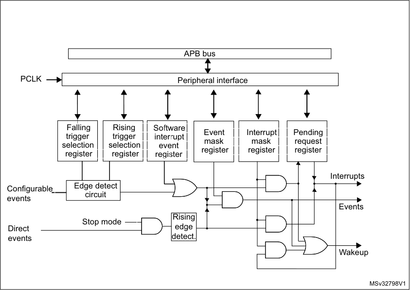

|Falling trigger selection register|Col2|Falling|Col4|Col5|Col6|s|Rising|Col9|Col10|Col11|Sof|tware|Col14|Col15|Col16|Col17|Col18|Col19|Col20|Interrupt mask|Col22|Col23|Col24|Col25|Col26|Col27|Col28|Col29|Col30|
|---|---|---|---|---|---|---|---|---|---|---|---|---|---|---|---|---|---|---|---|---|---|---|---|---|---|---|---|---|---|
|Falling trigger selection register|Falling trigger selection register|Falling|Falling|||s|Rising|Rising|||Sof|tware|tware||||||||Interrupt|Interrupt|Interrupt|||Pendi|Pendi|ng||
|Falling trigger selection register|Falling trigger selection register|trigger|trigger|trigger|trigger|trigger|trigger|trigger|||inte|rrupt|rrupt|||vent|vent|vent|vent|vent|vent|vent|vent|vent|vent|vent|vent|vent|vent|
|Falling trigger selection register|Falling trigger selection register|trigger|trigger|trigger|trigger|trigger|trigger|trigger|||inte|rrupt|rrupt|||||||||mask|mask|||request|request|request||
|Falling trigger selection register|selection|selection|selection|selection|selection|selection|election|election||ev|ev|ent||||||||||||||||||
|Falling trigger selection register|selection|selection|selection|selection|selection|selection|election|election||ev|ev|ent||||egister|egister|egister|||reg|reg|ister|||reg|ister|ister||
|Falling trigger selection register|selection|register|register|register|||reg|ister|||reg|ister|ister||reg|g|g|g|g|g|g|g|g|g|g|g|g|g|g|
|Falling trigger selection register|selection|register|register|register|||reg|ister|||reg|ister|ister||reg|g||||||||||||||
|Falling trigger selection register|selection|register||||||||||||||||||||||||||||

|Edge detect circuit|Edge detect|Col3|Col4|
|---|---|---|---|
|Edge detect  circuit|Edge detect|circuit||

**12.3.2** **Wakeup event management**

The STM32L0x1 microcontrollers are able to handle external or internal events in order to
wake up the core (WFE). The wakeup event can be generated by either:

      - enabling an interrupt in the peripheral control register but not in the NVIC, and enabling
the SEVONPEND bit in the Cortex [®] -M0+ system control register (see STM32L0 Series
Cortex [®] -M0+ programming manual (PM0223)). When the MCU resumes from WFE,
the peripheral interrupt pending bit and the peripheral NVIC IRQ channel pending bit (in
the NVIC interrupt clear pending register) have to be cleared.

      - or configuring an EXTI line in event mode. When the CPU resumes from WFE, it is not
necessary to clear the peripheral interrupt pending bit or the NVIC IRQ channel
pending bit as the pending bit corresponding to the event line is not set.

RM0377 Rev 10 269/905

277

--- end of page=268 ---

**Extended interrupt and event controller (EXTI)** **RM0377**

**12.3.3** **Peripherals asynchronous interrupts**

Some peripherals can generate events when the system is in Run mode or in Stop mode,
thus allowing to wake up the system from Stop mode.

To accomplish this, the peripheral generates both a synchronized (to the system clock, e.g.
APB clock) and an asynchronous version of the event. This asynchronous event is
connected to an EXTI direct line.

_Note:_ _Few peripherals with wakeup from Stop capability are connected to an EXTI configurable_
_line. In this case the EXTI configuration is required to allow the wakeup from Stop mode._

**12.3.4** **Hardware interrupt selection**

To configure a line as an interrupt source, use the following procedure:

1. Configure the mask bits of the Interrupt lines (EXTI_IMR)

2. Configure the Trigger Selection bits of the Interrupt lines (EXTI_RTSR and
EXTI_FTSR)

3. Configure the enable and mask bits that control the NVIC IRQ channel mapped to the
extended interrupt controller (EXTI) so that an interrupt coming from any one of the
lines can be correctly acknowledged.

The direct lines do not require any EXTI configuration.

For code example, refer to _A.7.2: Extended interrupt selection code example_ .

**12.3.5** **Hardware event selection**

To configure a line as an event source, use the following procedure:

1. Configure the mask bits of the Event lines (EXTI_EMR)

2. Configure the Trigger Selection bits of the Event lines (EXTI_RTSR and EXTI_FTSR).

**12.3.6** **Software interrupt/event selection**

Any of the configurable lines can be configured as software interrupt/event lines. The
procedure below must be followed to generate a software interrupt.

1. Configure the mask bits of the Interrupt/Event lines (EXTI_IMR, EXTI_EMR)

2. Set the required bit in the software interrupt register (EXTI_SWIER).

270/905 RM0377 Rev 10

--- end of page=269 ---

**RM0377** **Extended interrupt and event controller (EXTI)**

###### **12.4 EXTI interrupt/event line mapping**

In the STM32L0x1, 30 interrupt/event lines are available.The GPIOs are connected to 16
configurable interrupt/event lines as shown in _Figure 28_ .

**Figure 28. Extended interrupt/event GPIO mapping**

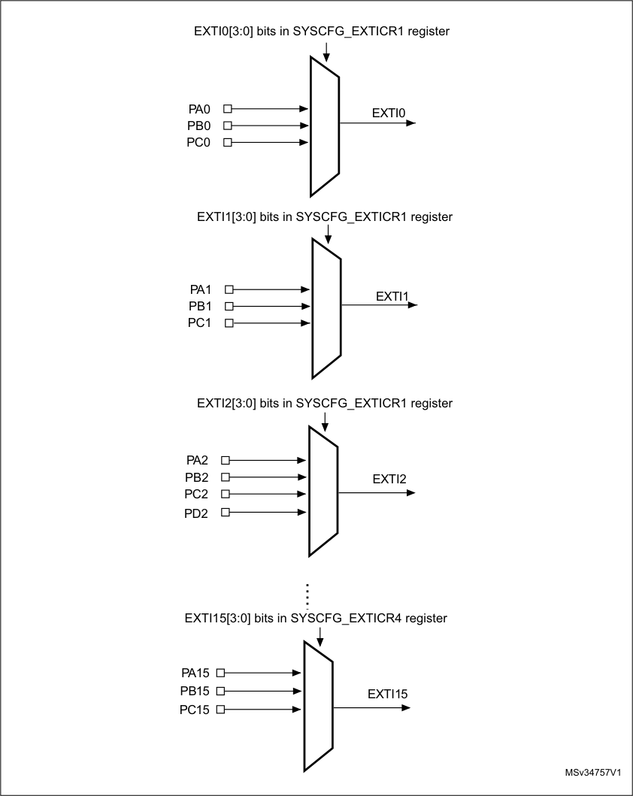

_Note:_ _Refer to the datasheet for the list of available I/O ports._

RM0377 Rev 10 271/905

277

--- end of page=270 ---

**Extended interrupt and event controller (EXTI)** **RM0377**

The 30 lines are connected as shown in _Table 54: EXTI lines connections_ :

**Table 54. EXTI lines connections**

|EXTI line|Line source|Line type|
|---|---|---|
|0-15|GPIO|configurable|
|16|PVD|configurable|
|17|RTC alarm|configurable|
|18|Reserved|Reserved|
|19|RTC tamper or timestamp or CSS_LSE|configurable|
|20|RTC wakeup timer|configurable|
|21|COMP1 output|configurable|
|22|COMP2 output|configurable|
|23|I2C1 wakeup|direct|
|24|I2C3 wakeup|direct|
|25|USART 1 wakeup|direct|
|26|USART2 wakeup|direct|
|27|Reserved|Reserved|
|28|LPUART1 wakeup|direct|
|29|LPTIM1 wakeup|direct|

272/905 RM0377 Rev 10

--- end of page=271 ---

**RM0377** **Extended interrupt and event controller (EXTI)**

###### **12.5 EXTI registers**

Refer to _Section 1.2_ for a list of abbreviations used in register descriptions.

The peripheral registers have to be accessed by words (32-bit).

**12.5.1** **EXTI interrupt mask register (EXTI_IMR)**

Address offset: 0x00

Reset value: 0x3F84 0000

|31|30|29|28|27|26|25|24|23|22|21|20|19|18|17|16|
|---|---|---|---|---|---|---|---|---|---|---|---|---|---|---|---|
|Res.|Res.|IM29|IM28|Res.|IM26|IM25|IM24|IM23|IM22|IM21|IM20|IM19|Res.|IM17|IM16|
|||rw|rw||rw|rw|rw|rw|rw|rw|rw|rw||rw|rw|

|15|14|13|12|11|10|9|8|7|6|5|4|3|2|1|0|
|---|---|---|---|---|---|---|---|---|---|---|---|---|---|---|---|
|IM15|IM14|IM13|IM12|IM11|IM10|IM9|IM8|IM7|IM6|IM5|IM4|IM3|IM2|IM1|IM0|
|rw|rw|rw|rw|rw|rw|rw|rw|rw|rw|rw|rw|rw|rw|rw|rw|

Bits 31:30 Reserved, must be kept at reset value.

Bits 29:28 **IMx:** Interrupt mask on line x (x = 29 to 28)

0: Interrupt request from Line x is masked
1: Interrupt request from Line x is not masked

Bit 27 Reserved, must be kept at reset value.

Bits 26:19 **IMx:** Interrupt mask on line x (x = 26 to 19)

0: Interrupt request from Line x is masked
1: Interrupt request from Line x is not masked

Bit 18 Reserved, must be kept at reset value.

Bits 17:0 **IMx:** Interrupt mask on line x (x = 17 to 0)

0: Interrupt request from Line x is masked
1: Interrupt request from Line x is not masked

**12.5.2** **EXTI event mask register (EXTI_EMR)**

Address offset: 0x04

Reset value: 0x0000 0000

|31|30|29|28|27|26|25|24|23|22|21|20|19|18|17|16|
|---|---|---|---|---|---|---|---|---|---|---|---|---|---|---|---|
|Res.|Res.|EM29|EM28|Res.|EM26|EM25|EM24|EM23|EM22|EM21|EM20|EM19|Res.|EM17|EM16|
|||rw|rw||rw|rw|rw|rw|rw|rw|rw|rw||rw|rw|

|15|14|13|12|11|10|9|8|7|6|5|4|3|2|1|0|
|---|---|---|---|---|---|---|---|---|---|---|---|---|---|---|---|
|EM15|EM14|EM13|EM12|EM11|EM10|EM9|EM8|EM7|EM6|EM5|EM4|EM3|EM2|EM1|EM0|
|rw|rw|rw|rw|rw|rw|rw|rw|rw|rw|rw|rw|rw|rw|rw|rw|

RM0377 Rev 10 273/905

277

--- end of page=272 ---

**Extended interrupt and event controller (EXTI)** **RM0377**

Bits 31:30 Reserved, must be kept at reset value.

Bits 29:28 **EMx:** Event mask on line x (x = 29 to 28)

0: Event request from Line x is masked
1: Event request from Line x is not masked

Bit 27 Reserved, must be kept at reset value.

Bits 26:19 **EMx:** Event mask on line x (x = 26 to 19)

0: Event request from Line x is masked
1: Event request from Line x is not masked

Bit 18 Reserved, must be kept at reset value.

Bits 17:0 **EMx:** Event mask on line x (x = 17 to 0)

0: Event request from Line x is masked
1: Event request from Line x is not masked

**12.5.3** **EXTI rising edge trigger selection register (EXTI_RTSR)**

Address offset: 0x08

Reset value: 0x0000 0000

|31|30|29|28|27|26|25|24|23|22|21|20|19|18|17|16|
|---|---|---|---|---|---|---|---|---|---|---|---|---|---|---|---|
|Res.|Res.|Res.|Res.|Res.|Res.|Res.|Res.|Res.|RT22|RT21|RT20|RT19|Res.|RT17|RT16|
||||||||||rw|rw|rw|rw||rw|rw|
|15 14 13 12 11 10 9 8 7 6 5 4|15 14 13 12 11 10 9 8 7 6 5 4|15 14 13 12 11 10 9 8 7 6 5 4|15 14 13 12 11 10 9 8 7 6 5 4|15 14 13 12 11 10 9 8 7 6 5 4|15 14 13 12 11 10 9 8 7 6 5 4|15 14 13 12 11 10 9 8 7 6 5 4|15 14 13 12 11 10 9 8 7 6 5 4|15 14 13 12 11 10 9 8 7 6 5 4|15 14 13 12 11 10 9 8 7 6 5 4|15 14 13 12 11 10 9 8 7 6 5 4|15 14 13 12 11 10 9 8 7 6 5 4|RT16|2 1 0|2 1 0|2 1 0|
|RT15|RT14|RT13|RT12|RT11|RT10|RT9|RT8|RT7|RT6|RT5|RT4|RT3|RT2|RT1|RT0|
|rw|rw|rw|rw|rw|rw|rw|rw|rw|rw|rw|rw|rw|rw|rw|rw|

Bits 31:23 Reserved, must be kept at reset value.

Bits 22:19 **RTx:** Rising trigger event configuration bit of line x (x = 22 to 19)

0: Rising trigger disabled (for Event and Interrupt) for input line x
1: Rising trigger enabled (for Event and Interrupt) for input line x

Bit 18 Reserved, must be kept at reset value.

Bits 17:0 **RTx:** Rising trigger event configuration bit of line x (x = 17 to 0)

0: Rising trigger disabled (for Event and Interrupt) for input line x
1: Rising trigger enabled (for Event and Interrupt) for input line x

_Note:_ _The configurable wakeup lines are edge triggered, no glitch must be generated on these_
_lines._

_If a rising edge on the configurable interrupt line occurs while writing to the EXTI_RTSR_
_register, the pending bit will not be set._

_Rising and falling edge triggers can be set for the same interrupt line. In this configuration,_
_both generate a trigger condition._

274/905 RM0377 Rev 10

--- end of page=273 ---

**RM0377** **Extended interrupt and event controller (EXTI)**

**12.5.4** **Falling edge trigger selection register (EXTI_FTSR)**

Address offset: 0x0C

Reset value: 0x0000 0000

|31|30|29|28|27|26|25|24|23|22|21|20|19|18|17|16|
|---|---|---|---|---|---|---|---|---|---|---|---|---|---|---|---|
|Res.|Res.|Res.|Res.|Res.|Res.|Res.|Res.|Res.|FT22|FT21|FT20|FT19|Res.|FT17|FT16|
||||||||||rw|rw|rw|rw||rw|rw|

|15|14|13|12|11|10|9|8|7|6|5|4|3|2|1|0|
|---|---|---|---|---|---|---|---|---|---|---|---|---|---|---|---|
|FT15|FT14|FT13|FT12|FT11|FT10|FT9|FT8|FT7|FT6|FT5|FT4|FT3|FT2|FT1|FT0|
|rw|rw|rw|rw|rw|rw|rw|rw|rw|rw|rw|rw|rw|rw|rw|rw|

Bits 31:23 Reserved, must be kept at reset value.

Bits 22:19 **FTx:** Falling trigger event configuration bit of line x (x = 22 to 19)

0: Falling trigger disabled (for Event and Interrupt) for input line x
1: Falling trigger enabled (for Event and Interrupt) for input line x

Bit 18 Reserved, must be kept at reset value.

Bits 17:0 **FTx:** Falling trigger event configuration bit of line x (x = 17 to 0)

0: Falling trigger disabled (for Event and Interrupt) for input line x
1: Falling trigger enabled (for Event and Interrupt) for input line x

_Note:_ _The configurable wakeup lines are edge triggered, no glitch must be generated on these_
_lines._

_If a falling edge on the configurable interrupt line occurs while writing to the EXTI_FTSR_
_register, the pending bit will not be set._

_Rising and falling edge triggers can be set for the same interrupt line. In this configuration,_
_both generate a trigger condition._

**12.5.5** **EXTI software interrupt event register (EXTI_SWIER)**

Address offset: 0x10

Reset value: 0x0000 0000

|31|30|29|28|27|26|25|24|23|22|21|20|19|18|17|16|
|---|---|---|---|---|---|---|---|---|---|---|---|---|---|---|---|
|Res.|Res.|Res.|Res.|Res.|Res.|Res.|Res.|Res.|SWI22|SWI21|SWI20|SWI19|Res.|SWI17|SWI16|
||||||||||rw|rw|rw|rw||rw|rw|

|15|14|13|12|11|10|9|8|7|6|5|4|3|2|1|0|
|---|---|---|---|---|---|---|---|---|---|---|---|---|---|---|---|
|SWI15|SWI14|SWI13|SWI12|SWI11|SWI10|SWI9|SWI8|SWI7|SWI6|SWI5|SWI4|SWI3|SWI2|SWI1|SWI0|
|rw|rw|rw|rw|rw|rw|rw|rw|rw|rw|rw|rw|rw|rw|rw|rw|

RM0377 Rev 10 275/905

277

--- end of page=274 ---

**Extended interrupt and event controller (EXTI)** **RM0377**

Bits 31:23 Reserved, must be kept at reset value.

Bits 22:19 **SWIx:** Software interrupt on line x (x = 22 to 19)

Writing a 1 to this bit when it is at 0 sets the corresponding pending bit in EXTI_PR. If the
interrupt is enabled on this line in EXTI_IMR and EXTI_EMR, an interrupt request is
generated.
This bit is cleared by clearing the corresponding bit in EXTI_PR (by writing a 1 to this bit).

Bit 18 Reserved, must be kept at reset value.

Bits 17:0 **SWIx:** Software interrupt on line x (x = 17 to 0)

Writing a 1 to this bit when it is at 0 sets the corresponding pending bit in EXTI_PR. If the
interrupt is enabled on this line in EXTI_IMR and EXTI_EMR, an interrupt request is
generated.
This bit is cleared by clearing the corresponding bit in EXTI_PR (by writing a 1 to this bit).

**12.5.6** **EXTI pending register (EXTI_PR)**

Address offset: 0x14

Reset value: 0x0000 0000

|31|30|29|28|27|26|25|24|23|22|21|20|19|18|17|16|
|---|---|---|---|---|---|---|---|---|---|---|---|---|---|---|---|
|Res.|Res.|Res.|Res.|Res.|Res.|Res.|Res.|Res.|PIF22|PIF21|PIF20|PIF19|Res.|PIF17|PIF16|
||||||||||rc_w1|rc_w1|rc_w1|rc_w1||rc_w1|rc_w1|

|15|14|13|12|11|10|9|8|7|6|5|4|3|2|1|0|
|---|---|---|---|---|---|---|---|---|---|---|---|---|---|---|---|
|PIF15|PIF14|PIF13|PIF12|PIF11|PIF10|PIF9|PIF8|PIF7|PIF6|PIF5|PIF4|PIF3|PIF2|PIF1|PIF0|
|rc_w1|rc_w1|rc_w1|rc_w1|rc_w1|rc_w1|rc_w1|rc_w1|rc_w1|rc_w1|rc_w1|rc_w1|rc_w1|rc_w1|rc_w1|rc_w1|

Bits 31:23 Reserved, must be kept at reset value.

Bits 22:19 **PIFx:** Pending interrupt flag on line x (x = 22 to 19)

0: No trigger request occurred
1: The selected trigger request occurred
This bit is set when the selected edge event arrives on the interrupt line. This bit is cleared
by writing it to 1 or by changing the sensitivity of the edge detector.

Bit 18 Reserved, must be kept at reset value.

Bits 17:0 **PIFx:** Pending interrupt flag on line x (x = 17 to 0)

0: No trigger request occurred
1: The selected trigger request occurred
This bit is set when the selected edge event arrives on the interrupt line. This bit is cleared
by writing it to 1 or by changing the sensitivity of the edge detector.

276/905 RM0377 Rev 10

--- end of page=275 ---

**RM0377** **Extended interrupt and event controller (EXTI)**

**12.5.7** **EXTI register map**

The following table gives the EXTI register map and the reset values.

**Table 55. Extended interrupt/event controller register map and reset values**

|Offset|Register|31|30|29|28|27|26|25|24|23|22|21|20|19|18|17|16|15|14|13|12|11|10|9|8|7|6|5|4|3|2|1|0|
|---|---|---|---|---|---|---|---|---|---|---|---|---|---|---|---|---|---|---|---|---|---|---|---|---|---|---|---|---|---|---|---|---|---|
|0x00|**EXTI_IMR**  |Res. |Res.|IM[29:28]  |IM[29:28]  |Res.|IM[26:19]  |IM[26:19]  |IM[26:19]  |IM[26:19]  |IM[26:19]  |IM[26:19]  |IM[26:19]  |IM[26:19]  |Res.|IM[17:0] |IM[17:0] |IM[17:0] |IM[17:0] |IM[17:0] |IM[17:0] |IM[17:0] |IM[17:0] |IM[17:0] |IM[17:0] |IM[17:0] |IM[17:0] |IM[17:0] |IM[17:0] |IM[17:0] |IM[17:0] |IM[17:0] |IM[17:0] |
|0x00|~~Reset value~~|||~~1~~|~~1~~||~~1~~|~~1~~|~~1~~|~~1~~|~~0~~|~~0~~|~~0~~|~~0~~||~~0~~|~~0~~|~~0~~|~~0~~|~~0~~|~~0~~|~~0~~|~~0~~|~~0~~|~~0~~|~~0~~|~~0~~|~~0~~|~~0~~|~~0~~|~~0~~|~~0~~|~~0~~|
|0x04|**EXTI_EMR**  |Res. |Res.|EM[29:28]  |EM[29:28]  |Res. |EM[26:19]  |EM[26:19]  |EM[26:19]  |EM[26:19]  |EM[26:19]  |EM[26:19]  |EM[26:19]  |EM[26:19]  |Res.|EM[17:0] |EM[17:0] |EM[17:0] |EM[17:0] |EM[17:0] |EM[17:0] |EM[17:0] |EM[17:0] |EM[17:0] |EM[17:0] |EM[17:0] |EM[17:0] |EM[17:0] |EM[17:0] |EM[17:0] |EM[17:0] |EM[17:0] |EM[17:0] |
|0x04|~~Reset value~~|||~~0~~|~~0~~|~~0~~|~~0~~|~~0~~|~~0~~|~~0~~|~~0~~|~~0~~|~~0~~|~~0~~||~~0~~|~~0~~|~~0~~|~~0~~|~~0~~|~~0~~|~~0~~|~~0~~|~~0~~|~~0~~|~~0~~|~~0~~|~~0~~|~~0~~|~~0~~|~~0~~|~~0~~|~~0~~|
|0x08|**EXTI_RTSR**  |Res. |Res. |Res. |Res. |Res. |Res. |Res. |Res. |Res.|RT[22:19]  |RT[22:19]  |RT[22:19]  |RT[22:19]  |Res.|RT[17:0] |RT[17:0] |RT[17:0] |RT[17:0] |RT[17:0] |RT[17:0] |RT[17:0] |RT[17:0] |RT[17:0] |RT[17:0] |RT[17:0] |RT[17:0] |RT[17:0] |RT[17:0] |RT[17:0] |RT[17:0] |RT[17:0] |RT[17:0] |
|0x08|~~Reset value~~||||||||||~~0~~|~~0~~|~~0~~|~~0~~||~~0~~|~~0~~|~~0~~|~~0~~|~~0~~|~~0~~|~~0~~|~~0~~|~~0~~|~~0~~|~~0~~|~~0~~|~~0~~|~~0~~|~~0~~|~~0~~|~~0~~|~~0~~|
|0x0C|**EXTI_FTSR**  |Res. |Res. |Res. |Res. |Res. |Res. |Res. |Res. |Res.|FT[22:19]  |FT[22:19]  |FT[22:19]  |FT[22:19]  |Res.|FT[17:0] |FT[17:0] |FT[17:0] |FT[17:0] |FT[17:0] |FT[17:0] |FT[17:0] |FT[17:0] |FT[17:0] |FT[17:0] |FT[17:0] |FT[17:0] |FT[17:0] |FT[17:0] |FT[17:0] |FT[17:0] |FT[17:0] |FT[17:0] |
|0x0C|~~Reset value~~||||||||||~~0~~|~~0~~|~~0~~|~~0~~||~~0~~|~~0~~|~~0~~|~~0~~|~~0~~|~~0~~|~~0~~|~~0~~|~~0~~|~~0~~|~~0~~|~~0~~|~~0~~|~~0~~|~~0~~|~~0~~|~~0~~|~~0~~|
|0x10|**EXTI_SWIER**  |Res. |Res. |Res. |Res. |Res. |Res. |Res. |Res. |Res.|SWI [22:19]  |SWI [22:19]  |SWI [22:19]  |SWI [22:19]  |Res.|SWI[17:0] |SWI[17:0] |SWI[17:0] |SWI[17:0] |SWI[17:0] |SWI[17:0] |SWI[17:0] |SWI[17:0] |SWI[17:0] |SWI[17:0] |SWI[17:0] |SWI[17:0] |SWI[17:0] |SWI[17:0] |SWI[17:0] |SWI[17:0] |SWI[17:0] |SWI[17:0] |
|0x10|~~Reset value~~||||||||||~~0~~|~~0~~|~~0~~|~~0~~||~~0~~|~~0~~|~~0~~|~~0~~|~~0~~|~~0~~|~~0~~|~~0~~|~~0~~|~~0~~|~~0~~|~~0~~|~~0~~|~~0~~|~~0~~|~~0~~|~~0~~|~~0~~|
|0x14|**EXTI_PR**  |Res. |Res. |Res. |Res. |Res. |Res. |Res. |Res. |Res.|PIF [22:19]  |PIF [22:19]  |PIF [22:19]  |PIF [22:19]  |Res.|PIF[17:0]                 |PIF[17:0]                 |PIF[17:0]                 |PIF[17:0]                 |PIF[17:0]                 |PIF[17:0]                 |PIF[17:0]                 |PIF[17:0]                 |PIF[17:0]                 |PIF[17:0]                 |PIF[17:0]                 |PIF[17:0]                 |PIF[17:0]                 |PIF[17:0]                 |PIF[17:0]                 |PIF[17:0]                 |PIF[17:0]                 |PIF[17:0]                 |
|0x14|~~Reset value~~||||||||||~~0~~|~~0~~|~~0~~|~~0~~||~~0~~|~~0~~|~~0~~|~~0~~|~~0~~|~~0~~|~~0~~|~~0~~|~~0~~|~~0~~|~~0~~|~~0~~|~~0~~|~~0~~|~~0~~|~~0~~|~~0~~|~~0~~|

Refer to _Section 2.2 on page 51_ for the register boundary addresses.

RM0377 Rev 10 277/905

277

--- end of page=276 ---

**Analog-to-digital converter (ADC)** **RM0377**

#### **13 Analog-to-digital converter (ADC)**

###### **13.1 Introduction**

The 12-bit ADC is a successive approximation analog-to-digital converter. It has up to 18
multiplexed channels allowing it to measure signals from 16 external and 2 internal sources.
A/D conversion of the various channels can be performed in single, continuous, scan or
discontinuous mode. The result of the ADC is stored in a left-aligned or right-aligned 16-bit
data register.

The analog watchdog feature allows the application to detect if the input voltage goes
outside the user-defined higher or lower thresholds.

An efficient low-power mode is implemented to allow very low consumption at low
frequency.

A built-in hardware oversampler allows analog performances to be improved while offloading the related computational burden from the CPU.

278/905 RM0377 Rev 10

--- end of page=277 ---

**RM0377** **Analog-to-digital converter (ADC)**

###### **13.2 ADC main features**

      - High performance

–
12-bit, 10-bit, 8-bit or 6-bit configurable resolution

–
ADC conversion time: 0.87 µs for 12-bit resolution (1.14 MHz), 0.81 µs conversion
time for 10-bit resolution, faster conversion times can be obtained by lowering
resolution.

– Self-calibration

–
Programmable sampling time

–
Data alignment with built-in data coherency

–
DMA support

      - Low-power

–
The application can reduce PCLK frequency for low-power operation while still
keeping optimum ADC performance. For example, 0.87 µs conversion time is
kept, whatever the PCLK frequency

–
Wait mode: prevents ADC overrun in applications with low PCLK frequency

–
Auto off mode: ADC is automatically powered off except during the active
conversion phase. This dramatically reduces the power consumption of the ADC.

      - Analog input channels

–
16 external analog inputs

–
Three fast channels connected to PA0, PA4 and PA5, and up to 13 standard
channels (refer to the device datasheet for details on the corresponding GPIOs)

–
1 channel for internal temperature sensor (V SENSE )

–
1 channel for internal reference voltage (V REFINT )

      - Start-of-conversion can be initiated:

–
By software

–
By hardware triggers with configurable polarity (timer events or GPIO input
events)

      - Conversion modes

–
Can convert a single channel or can scan a sequence of channels.

–
Single mode converts selected inputs once per trigger

–
Continuous mode converts selected inputs continuously

– Discontinuous mode

      - Interrupt generation at the end of sampling, end of conversion, end of sequence
conversion, and in case of analog watchdog or overrun events

      - Analog watchdog

      - Oversampler

–
16-bit data register

–
Oversampling ratio adjustable from 2 to 256x

–
Programmable data shift up to 8-bits

      - ADC input range: V SSA ≤ V IN ≤ V DDA

RM0377 Rev 10 279/905

328

--- end of page=278 ---

**Analog-to-digital converter (ADC)** **RM0377**

###### **13.3 ADC functional description**

_Figure 29_ shows the ADC block diagram and _Table 56_ gives the ADC pin description.

**Figure 29. ADC block diagram**

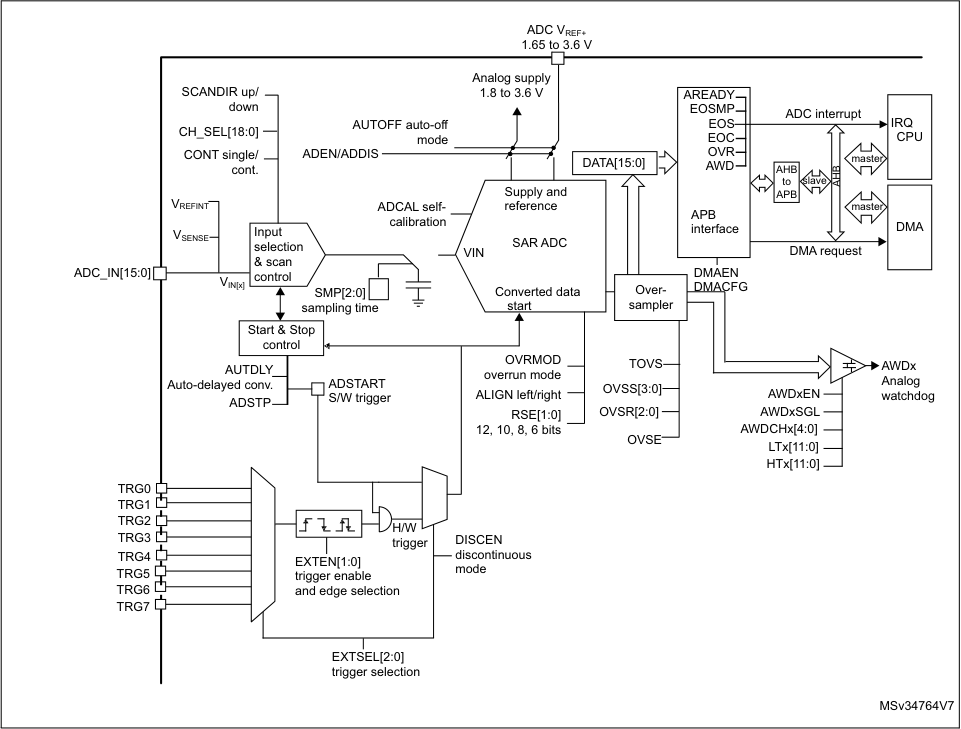

1. TRGi are mapped at product level. Refer to _Table External triggers_ in _Section 13.3.1: ADC pins and internal signals_ .

**13.3.1** **ADC pins and internal signals**

**Table 56. ADC input/output pins**

|Name|Signal type|Remarks|
|---|---|---|
|VDDA|Input, analog power supply|Analog power supply and positive reference voltage for the ADC|
|VSSA|Input, analog supply ground|Ground for analog power supply|
|ADC_INx|Analog input signals|Up to 16 external analog input channels|

280/905 RM0377 Rev 10

--- end of page=279 ---

**RM0377** **Analog-to-digital converter (ADC)**

**Table 57. ADC internal input/output signals**

|Internal signal name|Signal type|Description|
|---|---|---|
|VIN[x]|Analog Input channels|Connected either to internal channels or to ADC_IN_i _ external channels|
|TRGx|Input|ADC conversion triggers|
|VSENSE|Input|Internal temperature sensor output voltage|
|VREFINT|Input|Internal voltage reference output voltage|
|ADC_AWDx_OUT|Output|Internal analog watchdog output signal connected to on- chip timers (x = Analog watchdog number = 1)|

**Table 58. External triggers**

|Name|Source|EXTSEL[2:0]|
|---|---|---|
|TRG0|TIM6_TRGO|000|
|TRG1|TIM21_CH2|001|
|TRG2|TIM2_TRGO|010|
|TRG3|TIM2_CH4|011|
|TRG4|TIM22_TRGO, TIM21_TRGO(1)|100|
|TRG5(2)|TIM2_CH3|101|
|TRG6|TIM3_TRGO|110|
|TRG7|EXTI11|111|

1. TIM21_TRGO is available only in category 1 devices.

2. Available on all categories except category 3.

**13.3.2** **ADC voltage regulator (ADVREGEN)**

The ADC has a specific internal voltage regulator which must be enabled and stable before
using the ADC.

The ADC voltage regulator stabilization time is entirely managed by the hardware and
software does not need to care about it.

After ADC operations are complete, the ADC can be disabled (ADEN = 0). To keep power
consumption low, it is important to disable the ADC voltage regulator before entering lowpower mode (LPRun, LPSleep or Stop mode). Refer to _Section : ADVREG disable_

_sequence_ .

Note: When the internal voltage regulator is disabled, the internal analog calibration is kept.

**Analog reference for the ADC internal voltage regulator**

The internal ADC voltage regulator uses a buffered copy of the internal voltage reference.
This buffer is always enabled when the main voltage regulator is in normal Run mode (MR
mode, with the device operating either in Run or Sleep mode). When the main voltage
regulator is in low-power mode (with the device operating in LPRun, LPSleep or Stop
mode), the voltage reference is disabled and the ADC cannot be used anymore.

RM0377 Rev 10 281/905

328

--- end of page=280 ---

**Analog-to-digital converter (ADC)** **RM0377**

The software must follow the procedure described below to manage the ADC in low-power
mode:

1. Make sure that the ADC is disabled (ADEN = 0).

2. Write ADVREGEN = 0.

3. Enter low-power mode.

4. Resume from low-power mode.

5. Check that REGLPF = 0.

6. Enable the ADC voltage regulator by using the sequence described in _Section :_
_ADVREG enable sequence_ (ADVREGEN = 1 in ADC_CR).

7. Write ADC_CR ADEN = 1 and wait until ADC_CR ADRDY = 1.

8. Write ADRDY = 1 to clear it.

**ADVREG enable sequence**

There are three ways to enable the voltage regulator:

      - by writing ADVREGEN = 1.

      - by launching the calibration by writing by ADCAL = 1 (the ADVREGEN bit is
automatically set).

      - by enabling the ADC by writing ADEN = 1.

**ADVREG disable sequence**

To disable the ADC voltage regulator, perform the sequence below:

1. Ensure that the ADC is disabled (ADEN = 0).

2. Write ADVREGEN = 0.

**13.3.3** **Calibration (ADCAL)**

The ADC has a calibration feature. During the procedure, the ADC calculates a calibration
factor which is internally applied to the ADC until the next ADC power-off. The application
must not use the ADC during calibration and must wait until it is complete.

Calibration should be performed before starting A/D conversion. It removes the offset error
which may vary from chip to chip due to process variation.

The calibration is initiated by software by setting bit ADCAL = 1. Calibration can only be
initiated when the ADC is disabled (when ADEN = 0). ADCAL bit stays at 1 during all the
calibration sequence. It is then cleared by hardware as soon the calibration completes. After
this, the calibration factor can be read from the ADC_DR register (from bits 6 to 0).

The internal analog calibration is kept if the ADC is disabled (ADEN = 0) or if the ADC
voltage reference is disabled (ADVREGEN = 0). When the ADC operating conditions
change (V DDA changes are the main contributor to ADC offset variations and temperature
change to a lesser extend), it is recommended to re-run a calibration cycle.

The calibration factor is lost in the following cases:

      - The product is in Standby mode (power supply removed from the ADC)

      - The ADC peripheral is reset.

The calibration factor is maintained in the following low-power modes: LPRun, LPSleep and
Stop.

282/905 RM0377 Rev 10

--- end of page=281 ---

**RM0377** **Analog-to-digital converter (ADC)**

It is still possible to save and restore the calibration factor by software to save time when
re-starting the ADC (as long as temperature and voltage are stable during the ADC power
down).

The calibration factor can be written if the ADC is enabled but not converting (ADEN = 1 and
ADSTART = 0). Then, at the next start of conversion, the calibration factor is automatically
injected into the analog ADC. This loading is transparent and does not add any cycle
latency to the start of the conversion.

**Software calibration procedure**

1. Ensure that ADEN = 0 and DMAEN = 0.

2. Set ADCAL = 1.

3. Wait until ADCAL = 0 (or until EOCAL = 1). This can be handled by interrupt if the
interrupt is enabled by setting the EOCALIE bit in the ADC_IER register. The ADCAL
bit can remain set for some time even after EOCAL has been set. As a result, the
software must wait for ADCAL = 0 after EOCAL = 1 to be able to set ADEN = 1 for next

ADC conversions.

4. The calibration factor can be read from bits 6:0 of ADC_DR or ADC_CALFACT
registers.

For code example, refer to _A.8.1: Calibration code example_ .

**Figure 30. ADC calibration**

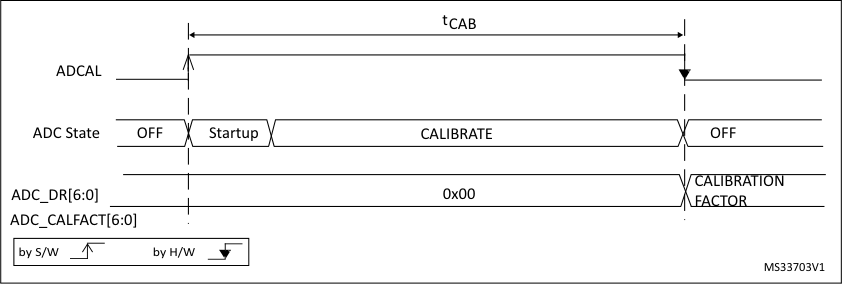

If the ADC voltage regulator was not previously set, it is automatically enabled when setting
ADCAL = 1 (bit ADVREGEN is automatically set by hardware). In this case, the ADC
calibration time is longer to take into account the stabilization time of the ADC voltage
regulator.

At the end of the calibration, the ADC voltage regulator remains enabled.

RM0377 Rev 10 283/905

328

--- end of page=282 ---

**Analog-to-digital converter (ADC)** **RM0377**

**Calibration factor forcing software procedure**

1. Ensure that ADEN= 1 and ADSTART = 0 (ADC started with no conversion ongoing)

2. Write ADC_CALFACT with the saved calibration factor

3. The calibration factor is used as soon as a new conversion is launched.

**Figure 31. Calibration factor forcing**

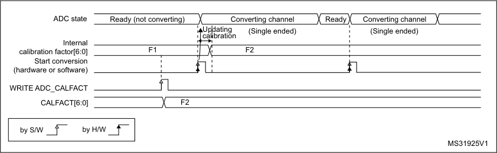

|Col1|Converting channel|Col3|Ready|Converting channel|
|---|---|---|---|---|
||U ca|(Single ended) pdating libration|(Single ended) pdating libration|(Single ended) pdating libration|
||||||
|||F2|F2|F2|
||||||

**13.3.4** **ADC on-off control (ADEN, ADDIS, ADRDY)**

At power-up, the ADC is disabled and put in power-down mode (ADEN = 0).

As shown in _Figure 32_, the ADC needs a stabilization time of t STAB before it starts
converting accurately.

Two control bits are used to enable or disable the ADC:

      - Set ADEN = 1 to enable the ADC. The ADRDY flag is set as soon as the ADC is ready
for operation.

      - Set ADDIS = 1 to disable the ADC and put the ADC in power down mode. The ADEN
and ADDIS bits are then automatically cleared by hardware as soon as the ADC is fully
disabled.

If the ADC voltage regulator was not previously set, it is automatically enabled when setting
ADEN=1 (bit ADVREGEN is automatically set by hardware). In this case, the ADC
stabilization time t STAB is longer to take into account the stabilization time of the ADC
voltage regulator.

Conversion can then start either by setting ADSTART to 1 (refer to _Section 13.4: Conversion_
_on external trigger and trigger polarity (EXTSEL, EXTEN) on page 292_ ) or when an external
trigger event occurs if triggers are enabled.

Follow this procedure to enable the ADC:

1. Clear the ADRDY bit in ADC_ISR register by programming this bit to 1.

2. Set ADEN = 1 in the ADC_CR register.

3. Wait until ADRDY = 1 in the ADC_ISR register (ADRDY is set after the ADC startup
time). This can be handled by interrupt if the interrupt is enabled by setting the
ADRDYIE bit in the ADC_IER register.

For code example, refer to _A.8.2: ADC enable sequence code example_ .

284/905 RM0377 Rev 10

--- end of page=283 ---

**RM0377** **Analog-to-digital converter (ADC)**

Follow this procedure to disable the ADC:

1. Check that ADSTART = 0 in the ADC_CR register to ensure that no conversion is
ongoing. If required, stop any ongoing conversion by writing 1 to the ADSTP bit in the
ADC_CR register and waiting until this bit is read at 0.

2. Set ADDIS = 1 in the ADC_CR register.

3. If required by the application, wait until ADEN = 0 in the ADC_CR register, indicating
that the ADC is fully disabled (ADDIS is automatically reset once ADEN = 0).

4. Clear the ADRDY bit in ADC_ISR register by programming this bit to 1 (optional).

For code example, refer to _A.8.3: ADC disable sequence code example_ .

**Figure 32. Enabling/disabling the ADC**

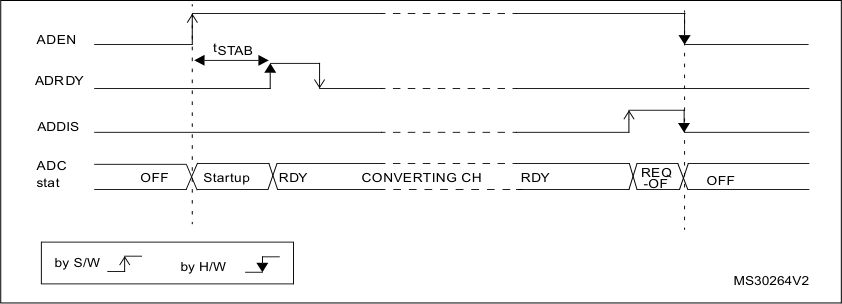

_Note:_ _In Auto-off mode (AUTOFF = 1) the power-on/off phases are performed automatically, by_
_hardware and the ADRDY flag is not set._

**13.3.5** **ADC clock (CKMODE, PRESC[3:0], LFMEN)**

The ADC has a dual clock-domain architecture, so that the ADC can be fed with a clock
(ADC asynchronous clock) independent from the APB clock (PCLK).

**Figure 33. ADC clock scheme**

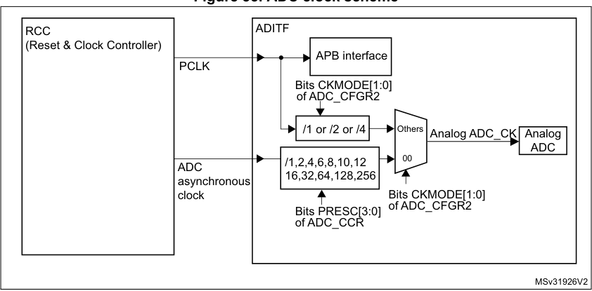

1. Refer to _Section Reset and clock control (RCC_ ) for how the PCLK clock and ADC asynchronous clock are
enabled.

RM0377 Rev 10 285/905

328

--- end of page=284 ---

**Analog-to-digital converter (ADC)** **RM0377**

The input clock of the analog ADC can be selected between two different clock sources (see
_Figure 33: ADC clock scheme_ to see how the PCLK clock and the ADC asynchronous clock
are enabled):

a) The ADC clock can be a specific clock source, named “ADC asynchronous clock“
which is independent and asynchronous with the APB clock.

Refer to RCC Section for more information on generating this clock source.

To select this scheme, bits CKMODE[1:0] of the ADC_CFGR2 register must be
reset.

b) The ADC clock can be derived from the APB clock of the ADC bus interface,
divided by a programmable factor (1, 2 or 4) according to bits CKMODE[1:0].

To select this scheme, bits CKMODE[1:0] of the ADC_CFGR2 register must be
different from “00”.

For code example, refer to _A.8.4: ADC clock selection code example_ .

In option a), the generated ADC clock can eventually be divided by a prescaler (1, 2, 4, 6, 8,
10, 12, 16, 32, 64, 128, 256) when programming the bits PRESC[3:0] in the ADC_CCR
register).

Option a) has the advantage of reaching the maximum ADC clock frequency whatever the
APB clock scheme selected.

Option b) has the advantage of bypassing the clock domain resynchronizations. This can be
useful when the ADC is triggered by a timer and if the application requires that the ADC is
precisely triggered without any uncertainty (otherwise, an uncertainty of the trigger instant is
added by the resynchronizations between the two clock domains).

**Table 59. Latency between trigger and start of conversion** **[(1)]**

|ADC clock source|CKMODE[1:0]|Latency between the trigger event and the start of conversion|
|---|---|---|
|HSI16 MHz clock|00|Latency is not deterministic (jitter)|
|PCLK divided by 2|01|Latency is deterministic (no jitter) and equal to 4.25 ADC clock cycles|
|PCLK divided by 4|10|Latency is deterministic (no jitter) and equal to 4.125 ADC clock cycles|
|PCLK divided by 1|11|Latency is deterministic (no jitter) and equal to 4.5 ADC clock cycles|

1. Refer to the device datasheet for the maximum ADC_CLK frequency.

**Caution:** When selecting CKMODE[1:0] = 11 (PCLK divided by 1), the user must ensure that the
PCLK has a 50% duty cycle. This is done by selecting a system clock with a 50% duty cycle
and configuring the APB prescaler in bypass modes in the RCC (refer to there Reset and
clock controller section). If an internal source clock is selected, the AHB and APB prescalers
do not divide the clock.

**Low frequency**

When selecting an analog ADC clock frequency lower than 3.5 MHz, it is mandatory to first
enable the Low Frequency Mode by setting bit LFMEN = 1 into the ADC_CCR register

286/905 RM0377 Rev 10

--- end of page=285 ---

**RM0377** **Analog-to-digital converter (ADC)**

**13.3.6** **ADC connectivity**

ADC inputs are connected to the external channels as well as internal sources as described
in _Figure 34_ .

**Figure 34. ADC connectivity**

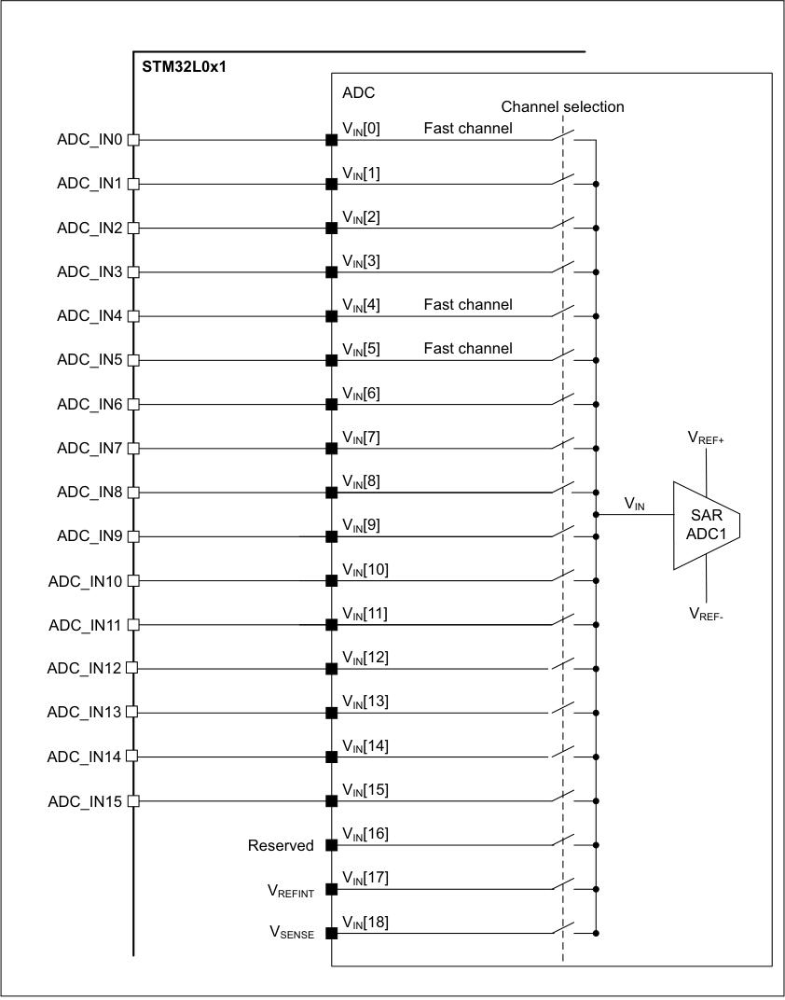

RM0377 Rev 10 287/905

328

--- end of page=286 ---

**Analog-to-digital converter (ADC)** **RM0377**

**13.3.7** **Configuring the ADC**

The software must write the ADCAL and ADEN bits in the ADC_CR register and configure
the ADC_CFGR1 and ADC_CFGR2 registers only when the ADC is disabled (ADEN must
be cleared).

The software must only write to the ADSTART and ADDIS bits in the ADC_CR register only
if the ADC is enabled and there is no pending request to disable the ADC (ADEN = 1 and
ADDIS = 0).

For all the other control bits in the ADC_IER, ADC_SMPR, ADC_TR, ADC_CHSELR and
ADC_CCR registers, refer to the description of the corresponding control bit in
_Section 13.11: ADC registers_ .

The software must only write to the ADSTP bit in the ADC_CR register if the ADC is enabled
(and possibly converting) and there is no pending request to disable the ADC (ADSTART =
1 and ADDIS = 0).

_Note:_ _There is no hardware protection preventing software from making write operations forbidden_
_by the above rules. If such a forbidden write access occurs, the ADC may enter an_
_undefined state. To recover correct operation in this case, the ADC must be disabled (clear_
_ADEN = 0 and all the bits in the ADC_CR register)._

**13.3.8** **Channel selection (CHSEL, SCANDIR)**

There are up to 18 multiplexed channels:

      - 16 analog inputs from GPIO pins (ADC_INx)

      - 2 internal analog inputs (Temperature Sensor, Internal Reference Voltage)

It is possible to convert a single channel or a sequence of channels.

The sequence of the channels to be converted can be programmed in the ADC_CHSELR
channel selection register: each analog input channel has a dedicated selection bit
(CHSELx).

The order in which the channels is scanned can be configured by programming the bit
SCANDIR bit in the ADC_CFGR1 register:

      - SCANDIR = 0: forward scan Channel 0 to Channel 18

      - SCANDIR = 1: backward scan Channel 18 to Channel 0

**Temperature sensor, V** **REFINT** **internal channels**

The temperature sensor is connected to channel ADC V IN [18].

The internal voltage reference V REFINT is connected to channel ADC V IN [17].

288/905 RM0377 Rev 10

--- end of page=287 ---

**RM0377** **Analog-to-digital converter (ADC)**

**13.3.9** **Programmable sampling time (SMP)**

Before starting a conversion, the ADC needs to establish a direct connection between the
voltage source to be measured and the embedded sampling capacitor of the ADC. This
sampling time must be enough for the input voltage source to charge the sample and hold
capacitor to the input voltage level.

Having a programmable sampling time allows the conversion speed to be trimmed
according to the input resistance of the input voltage source.

Refer to the device datasheet to select the correct sampling time depending on the type of
channel you are using (fast or standard).

The ADC samples the input voltage for a number of ADC clock cycles that can be modified
using the SMP[2:0] bits in the ADC_SMPR register.

This programmable sampling time is common to all channels. If required by the application,
the software can change and adapt this sampling time between each conversions.

The total conversion time is calculated as follows:

t CONV = Sampling time + 12.5 x ADC clock cycles

Example:

With ADC_CLK = 16 MHz and a sampling time of 1.5 ADC clock cycles:

t CONV = 1.5 + 12.5 = 14 ADC clock cycles = 0.875 µs

The ADC indicates the end of the sampling phase by setting the EOSMP flag.

**13.3.10** **Single conversion mode (CONT** _=_ **0)**

In Single conversion mode, the ADC performs a single sequence of conversions, converting
all the channels once. This mode is selected when CONT _=_ 0 in the ADC_CFGR1 register.
Conversion is started by either:

      - Setting the ADSTART bit in the ADC_CR register

      - Hardware trigger event

Inside the sequence, after each conversion is complete:

      - The converted data are stored in the 16-bit ADC_DR register

      - The EOC (end of conversion) flag is set

      - An interrupt is generated if the EOCIE bit is set

After the sequence of conversions is complete:

      - The EOS (end of sequence) flag is set

      - An interrupt is generated if the EOSIE bit is set

Then the ADC stops until a new external trigger event occurs or the ADSTART bit is set
again.

_Note:_ _To convert a single channel, program a sequence with a length of 1._

RM0377 Rev 10 289/905

328

--- end of page=288 ---

**Analog-to-digital converter (ADC)** **RM0377**

**13.3.11** **Continuous conversion mode (CONT** _=_ **1)**

In continuous conversion mode, when a software or hardware trigger event occurs, the ADC
performs a sequence of conversions, converting all the channels once and then
automatically re-starts and continuously performs the same sequence of conversions. This
mode is selected when CONT _=_ 1 in the ADC_CFGR1 register. Conversion is started by
either:

      - Setting the ADSTART bit in the ADC_CR register

      - Hardware trigger event

Inside the sequence, after each conversion is complete:

      - The converted data are stored in the 16-bit ADC_DR register

      - The EOC (end of conversion) flag is set

      - An interrupt is generated if the EOCIE bit is set

After the sequence of conversions is complete:

      - The EOS (end of sequence) flag is set

      - An interrupt is generated if the EOSIE bit is set

Then, a new sequence restarts immediately and the ADC continuously repeats the
conversion sequence.

_Note:_ _To convert a single channel, program a sequence with a length of 1._

_It is not possible to have both discontinuous mode and continuous mode enabled: it is_
_forbidden to set both bits DISCEN = 1 and CONT = 1._

**13.3.12** **Starting conversions (ADSTART)**

Software starts ADC conversions by setting ADSTART _=_ 1.

When ADSTART is set, the conversion:

      - Starts immediately if EXTEN _=_ 00 (software trigger)

      - At the next active edge of the selected hardware trigger if EXTEN ≠ 00

The ADSTART bit is also used to indicate whether an ADC operation is currently ongoing. It
is possible to re-configure the ADC while ADSTART _=_ 0, indicating that the ADC is idle.

The ADSTART bit is cleared by hardware:

      - In single mode with software trigger (CONT _=_ 0, EXTEN _=_ 00)

– At any end of conversion sequence (EOS _=_ 1)

      - In discontinuous mode with software trigger (CONT _=_ 0, DISCEN _=_ 1, EXTEN _=_ 00)

– At end of conversion (EOC _=_ 1)

      - In all cases (CONT _=_ x, EXTEN _=_ XX)

–
After execution of the ADSTP procedure invoked by software (see
_Section 13.3.14: Stopping an ongoing conversion (ADSTP) on page 292_ )

_Note:_ _In continuous mode (CONT = 1), the ADSTART bit is not cleared by hardware when the_
_EOS flag is set because the sequence is automatically relaunched._

_When hardware trigger is selected in single mode (CONT = 0 and EXTEN =_ 01 _), ADSTART_
_is not cleared by hardware when the EOS flag is set (except if DMAEN = 1 and_
_DMACFG = 0 in which case ADSTART is cleared at end of the DMA transfer). This avoids_

290/905 RM0377 Rev 10

--- end of page=289 ---

**RM0377** **Analog-to-digital converter (ADC)**

_the need for software having to set the ADSTART bit again and ensures the next trigger_
_event is not missed._

**13.3.13** **Timings**

The elapsed time between the start of a conversion and the end of conversion is the sum of
the configured sampling time plus the successive approximation time depending on data
resolution:

t CONV = t SMPL + t SAR = [ 1.5 |min + 12.5 |12bit ] x t ADC_CLK

t CONV = t SMPL + t SAR = 93.8 ns |min + 781.3 ns |12bit = 0.875 µs |min (for f ADC_CLK = 16 MHz)

**Figure 35. Analog to digital conversion time**

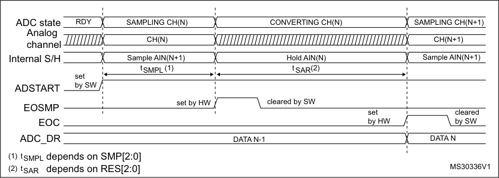

**Figure 36. ADC conversion timings**

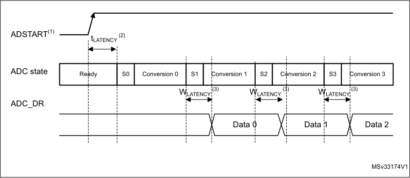

|Rea|dy|S0|Conversion 0 S1 Conversion 1|S2 Conversion 2 S3|Col6|Conversion 3|
|---|---|---|---|---|---|---|
|Rea|||||||
|Rea|||||||

1. EXTEN _=_ 00 or EXTEN ≠ 00

2. Trigger latency (refer to datasheet for more details)

3. ADC_DR register write latency (refer to datasheet for more details)

RM0377 Rev 10 291/905

328

--- end of page=290 ---

**Analog-to-digital converter (ADC)** **RM0377**

**13.3.14** **Stopping an ongoing conversion (ADSTP)**

The software can decide to stop any ongoing conversions by setting ADSTP _=_ 1 in the
ADC_CR register.

This resets the ADC operation and the ADC is idle, ready for a new operation.

When the ADSTP bit is set by software, any ongoing conversion is aborted and the result is
discarded (ADC_DR register is not updated with the current conversion).

The scan sequence is also aborted and reset (meaning that restarting the ADC would restart a new sequence).

Once this procedure is complete, the ADSTP and ADSTART bits are both cleared by
hardware and the software must wait until ADSTART=0 before starting new conversions.

**Figure 37. Stopping an ongoing conversion**

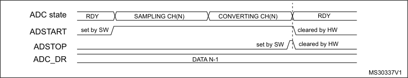

###### **13.4 Conversion on external trigger and trigger polarity (EXTSEL,** **EXTEN)**

A conversion or a sequence of conversion can be triggered either by software or by an
external event (for example timer capture). If the EXTEN[1:0] control bits are not equal to
“0b00”, then external events are able to trigger a conversion with the selected polarity. The
trigger selection is effective once software has set bit ADSTART _=_ 1.

Any hardware triggers which occur while a conversion is ongoing are ignored.

If bit ADSTART _=_ 0, any hardware triggers which occur are ignored.

_Table 60_ provides the correspondence between the EXTEN[1:0] values and the trigger
polarity.

**Table 60. Configuring the trigger polarity**

|Source|EXTEN[1:0]|
|---|---|
|Trigger detection disabled|00|
|Detection on rising edge|01|
|Detection on falling edge|10|
|Detection on both rising and falling edges|11|

_Note:_ _The polarity of the external trigger can be changed only when the ADC is not converting_
_(ADSTART = 0)._

The EXTSEL[2:0] control bits are used to select which of 8 possible events can trigger
conversions.

292/905 RM0377 Rev 10

--- end of page=291 ---

**RM0377** **Analog-to-digital converter (ADC)**

Refer to _Table 58: External triggers_ in _Section 13.3.1: ADC pins and internal signals_ for the
list of all the external triggers that can be used for regular conversion.

The software source trigger events can be generated by setting the ADSTART bit in the
ADC_CR register.

_Note:_ _The trigger selection can be changed only when the ADC is not converting (ADSTART = 0)._

**13.4.1** **Discontinuous mode (DISCEN)**

This mode is enabled by setting the DISCEN bit in the ADC_CFGR1 register.

In this mode (DISCEN _=_ 1), a hardware or software trigger event is required to start each
conversion defined in the sequence. On the contrary, if DISCEN _=_ 0, a single hardware or
software trigger event successively starts all the conversions defined in the sequence.

Example:

      - DISCEN _=_ 1, channels to be converted = 0, 3, 7, 10

–
1st trigger: channel 0 is converted and an EOC event is generated

–
2nd trigger: channel 3 is converted and an EOC event is generated

–
3rd trigger: channel 7 is converted and an EOC event is generated

–
4th trigger: channel 10 is converted and both EOC and EOS events are
generated.

–
5th trigger: channel 0 is converted an EOC event is generated

–
6th trigger: channel 3 is converted and an EOC event is generated

– ...

      - DISCEN _=_ 0, channels to be converted = 0, 3, 7, 10

–
1st trigger: the complete sequence is converted: channel 0, then 3, 7 and 10. Each
conversion generates an EOC event and the last one also generates an EOS
event.

–
Any subsequent trigger events restarts the complete sequence.

_Note:_ _It is not possible to have both discontinuous mode and continuous mode enabled: it is_
_forbidden to set both bits DISCEN = 1 and CONT = 1._

**13.4.2** **Programmable resolution (RES) - Fast conversion mode**

It is possible to obtain faster conversion times (t SAR ) by reducing the ADC resolution.

The resolution can be configured to be either 12, 10, 8, or 6 bits by programming the
RES[1:0] bits in the ADC_CFGR1 register. Lower resolution allows faster conversion times
for applications where high data precision is not required.

_Note:_ _The RES[1:0] bit must only be changed when the ADEN bit is reset._

The result of the conversion is always 12 bits wide and any unused LSB bits are read as

zeros.

Lower resolution reduces the conversion time needed for the successive approximation
steps as shown in _Table 61_ .

RM0377 Rev 10 293/905

328

--- end of page=292 ---

**Analog-to-digital converter (ADC)** **RM0377**

**Table 61. t** **SAR** **timings depending on resolution**

|RES[1:0] bits|t SAR (ADC clock cycles)|t (ns) at SAR f = 16 MHz ADC|t SMPL (min) (ADC clock cycles)|t CONV (ADC clock cycles) (with min. t SMPL)|t (ns) at CONV f = 16 MHz ADC|
|---|---|---|---|---|---|
|12|12.5|781 ns|1.5|14|875 ns|
|10|11.5|719 ns|1.5|13|812 ns|
|8|9.5|594 ns|1.5|11|688 ns|
|6|7.5|469 ns|1.5|9|562 ns|

**13.4.3** **End of conversion, end of sampling phase (EOC, EOSMP flags)**

The ADC indicates each end of conversion (EOC) event.

The ADC sets the EOC flag in the ADC_ISR register as soon as a new conversion data
result is available in the ADC_DR register. An interrupt can be generated if the EOCIE bit is
set in the ADC_IER register. The EOC flag is cleared by software either by writing 1 to it, or
by reading the ADC_DR register.

The ADC also indicates the end of sampling phase by setting the EOSMP flag in the
ADC_ISR register. The EOSMP flag is cleared by software by writing1 to it. An interrupt can
be generated if the EOSMPIE bit is set in the ADC_IER register.

The aim of this interrupt is to allow the processing to be synchronized with the conversions.
Typically, an analog multiplexer can be accessed in hidden time during the conversion
phase, so that the multiplexer is positioned when the next sampling starts.

_Note:_ _As there is only a very short time left between the end of the sampling and the end of the_
_conversion, it is recommenced to use polling or a WFE instruction rather than an interrupt_
_and a WFI instruction._

**13.4.4** **End of conversion sequence (EOS flag)**

The ADC notifies the application of each end of sequence (EOS) event.

The ADC sets the EOS flag in the ADC_ISR register as soon as the last data result of a
conversion sequence is available in the ADC_DR register. An interrupt can be generated if
the EOSIE bit is set in the ADC_IER register. The EOS flag is cleared by software by writing
1 to it.

294/905 RM0377 Rev 10

--- end of page=293 ---

**RM0377** **Analog-to-digital converter (ADC)**

**13.4.5** **Example timing diagrams (single/continuous modes**
**hardware/software triggers)**

**Figure 38. Single conversions of a sequence, software trigger**

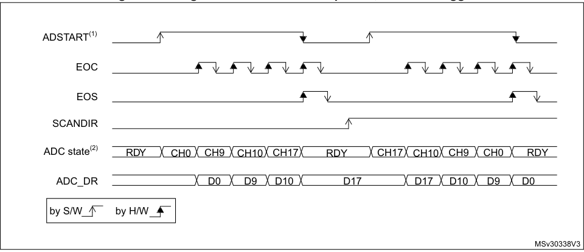

1. EXTEN = 00, CONT = 0

2. CHSEL = 0x20601, WAIT = 0, AUTOFF = 0

For code example, refer to _A.8.5: Single conversion sequence code example - Software_
_trigger_ .

**Figure 39. Continuous conversion of a sequence, software trigger**

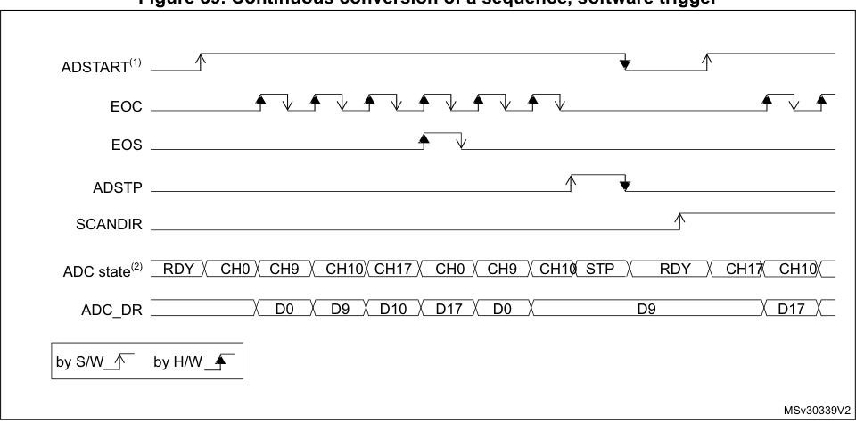

1. EXTEN = 00, CONT = 1,

2. CHSEL = 0x20601, WAIT = 0, AUTOFF = 0

For code example, refer to _A.8.6: Continuous conversion sequence code example -_
_Software trigger_ .

RM0377 Rev 10 295/905

328

--- end of page=294 ---

**Analog-to-digital converter (ADC)** **RM0377**

**Figure 40. Single conversions of a sequence, hardware trigger**

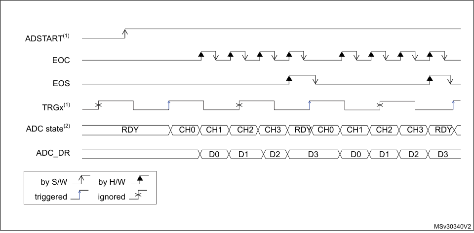

1. EXTSEL = TRGx (over-frequency), EXTEN = 01 (rising edge), CONT = 0

2. CHSEL = 0xF, SCANDIR = 0, WAIT = 0, AUTOFF = 0

For code example, refer to _A.8.7: Single conversion sequence code example - Hardware_
_trigger_ .

**Figure 41. Continuous conversions of a sequence, hardware trigger**

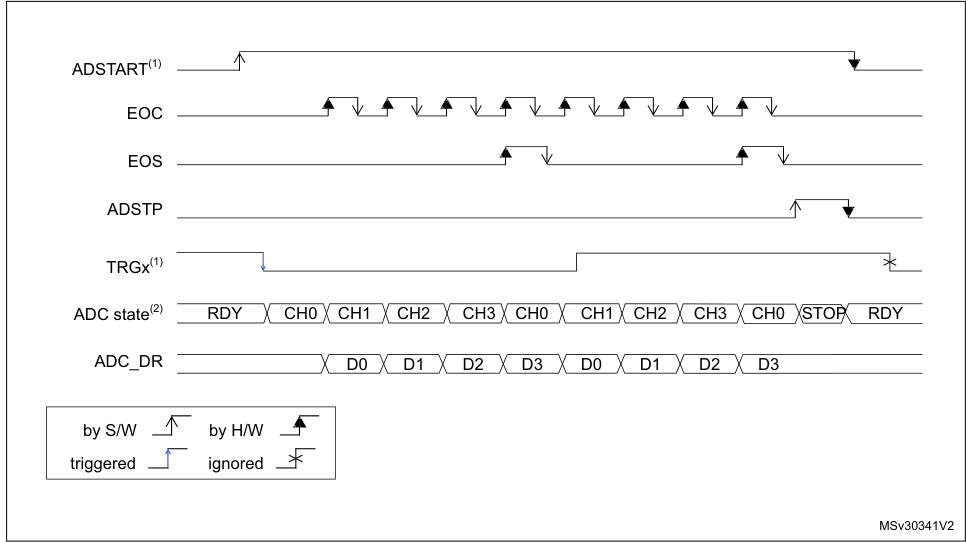

1. EXTSEL = TRGx, EXTEN = 10 (falling edge), CONT = 1

2. CHSEL = 0xF, SCANDIR = 0, WAIT = 0, AUTOFF = 0

For code example, refer to _A.8.8: Continuous conversion sequence code example -_
_Hardware trigger_ .

296/905 RM0377 Rev 10

--- end of page=295 ---

**RM0377** **Analog-to-digital converter (ADC)**

###### **13.5 Data management**

**13.5.1** **Data register and data alignment (ADC_DR, ALIGN)**

At the end of each conversion (when an EOC event occurs), the result of the converted data
is stored in the ADC_DR data register which is 16-bit wide.

The format of the ADC_DR depends on the configured data alignment and resolution.

The ALIGN bit in the ADC_CFGR1 register selects the alignment of the data stored after
conversion. Data can be right-aligned (ALIGN = 0) or left-aligned (ALIGN = 1) as shown in
_Figure 42_ .

**Figure 42. Data alignment and resolution (oversampling disabled: OVSE = 0)**

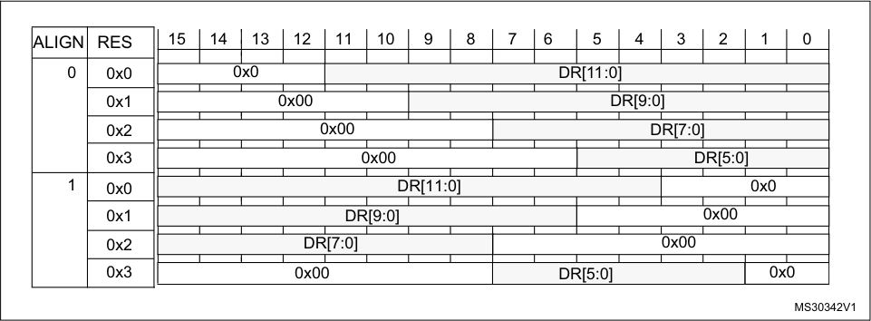

|ALIGN|RES|Col3|Col4|Col5|Col6|Col7|Col8|Col9|Col10|Col11|Col12|Col13|Col14|Col15|Col16|Col17|Col18|
|---|---|---|---|---|---|---|---|---|---|---|---|---|---|---|---|---|---|
|ALIGN|RES|||||||||||||||||
|0|0x0||~~0~~|x0|||||||DR|[11:0|]|||||
|0|0x1|||0|x00|||||||D|R[9:0|]||||
|0|0x2||||0|x00|||||||D|R[7:0]||||
|0|0x3|||||0|x00|||||||D|R[5:0|]||
|1|0x0||||||D|R[11:|0]|||||||0x0||
|1|0x1|||||DR|[9:0]||||||||0x00|||
|1|0x2||||DR|[7:0]||||||||0x00||||
|1|0x3||||0x0|0|||||DR|[5:0]||||0x|0|

**13.5.2** **ADC overrun (OVR, OVRMOD)**

The overrun flag (OVR) indicates a data overrun event, when the converted data was not
read in time by the CPU or the DMA, before the data from a new conversion is available.

The OVR flag is set in the ADC_ISR register if the EOC flag is still at ‘1’ at the time when a
new conversion completes. An interrupt can be generated if the OVRIE bit is set in the
ADC_IER register.

When an overrun condition occurs, the ADC keeps operating and can continue to convert
unless the software decides to stop and reset the sequence by setting the ADSTP bit in the
ADC_CR register.

The OVR flag is cleared by software by writing 1 to it.

It is possible to configure if the data is preserved or overwritten when an overrun event
occurs by programming the OVRMOD bit in the ADC_CFGR1 register:

      - OVRMOD = 0

–
An overrun event preserves the data register from being overwritten: the old data
is maintained and the new conversion is discarded. If OVR remains at 1, further
conversions can be performed but the resulting data is discarded.

      - OVRMOD = 1

–
The data register is overwritten with the last conversion result and the previous
unread data is lost. If OVR remains at 1, further conversions can be performed
and the ADC_DR register always contains the data from the latest conversion.

RM0377 Rev 10 297/905

328

--- end of page=296 ---

**Analog-to-digital converter (ADC)** **RM0377**

**Figure 43. Example of overrun (OVR)**

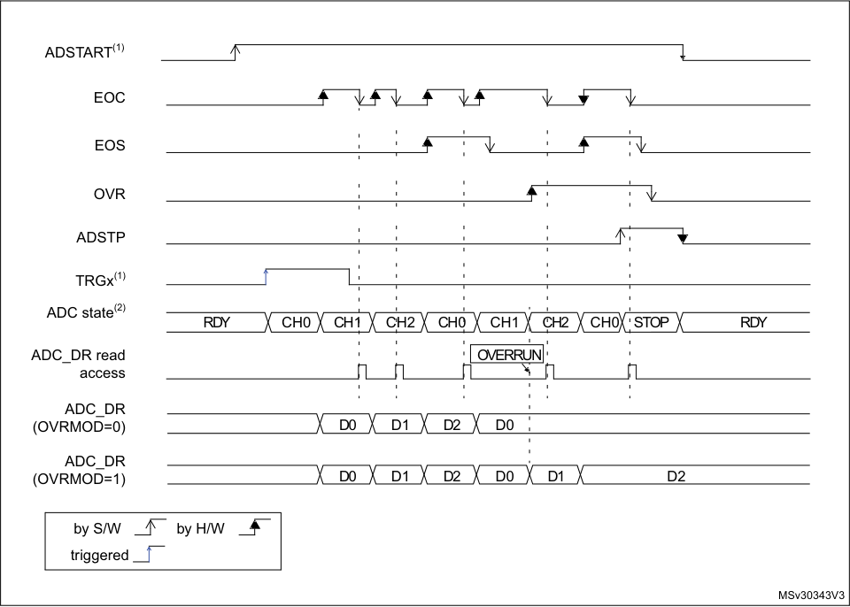

|OVERRUN|Col2|
|---|---|
|||

**13.5.3** **Managing a sequence of data converted without using the DMA**

If the conversions are slow enough, the conversion sequence can be handled by software.
In this case the software must use the EOC flag and its associated interrupt to handle each
data result. Each time a conversion is complete, the EOC bit is set in the ADC_ISR register
and the ADC_DR register can be read. The OVRMOD bit in the ADC_CFGR1 register
should be configured to 0 to manage overrun events as an error.

**13.5.4** **Managing converted data without using the DMA without overrun**

It may be useful to let the ADC convert one or more channels without reading the data after
each conversion. In this case, the OVRMOD bit must be configured at 1 and the OVR flag
should be ignored by the software. When OVRMOD = 1, an overrun event does not prevent
the ADC from continuing to convert and the ADC_DR register always contains the latest
conversion data.

**13.5.5** **Managing converted data using the DMA**

Since all converted channel values are stored in a single data register, it is efficient to use
DMA when converting more than one channel. This avoids losing the conversion data
results stored in the ADC_DR register.

298/905 RM0377 Rev 10

--- end of page=297 ---

**RM0377** **Analog-to-digital converter (ADC)**

When DMA mode is enabled (DMAEN bit set in the ADC_CFGR1 register), a DMA request
is generated after the conversion of each channel. This allows the transfer of the converted
data from the ADC_DR register to the destination location selected by the software.

_Note:_ _The DMAEN bit in the ADC_CFGR1 register must be set after the ADC calibration phase._

Despite this, if an overrun occurs (OVR = 1) because the DMA could not serve the DMA
transfer request in time, the ADC stops generating DMA requests and the data
corresponding to the new conversion is not transferred by the DMA. Which means that all
the data transferred to the RAM can be considered as valid.

Depending on the configuration of OVRMOD bit, the data is either preserved or overwritten
(refer to _Section 13.5.2: ADC overrun (OVR, OVRMOD) on page 297_ ).

The DMA transfer requests are blocked until the software clears the OVR bit.

Two different DMA modes are proposed depending on the application use and are
configured with bit DMACFG in the ADC_CFGR1 register:

      - DMA one shot mode (DMACFG = 0).
This mode should be selected when the DMA is programmed to transfer a fixed
number of data words.

      - DMA circular mode (DMACFG = 1)
This mode should be selected when programming the DMA in circular mode.

**DMA one shot mode (DMACFG** = **0)**

In this mode, the ADC generates a DMA transfer request each time a new conversion data
word is available and stops generating DMA requests once the DMA has reached the last
DMA transfer (when a DMA_EOT interrupt occurs, see _Section 10: Direct memory access_
_controller (DMA) on page 241_ ) even if a conversion has been started again.

For code example, refer to _A.8.9: DMA one shot mode sequence code example_ .

When the DMA transfer is complete (all the transfers configured in the DMA controller have
been done):

      - The content of the ADC data register is frozen.

      - Any ongoing conversion is aborted and its partial result discarded

      - No new DMA request is issued to the DMA controller. This avoids generating an
overrun error if there are still conversions which are started.

      - The scan sequence is stopped and reset

      - The DMA is stopped

**DMA circular mode (DMACFG** = **1)**

In this mode, the ADC generates a DMA transfer request each time a new conversion data
word is available in the data register, even if the DMA has reached the last DMA transfer.
This allows the DMA to be configured in circular mode to handle a continuous analog input
data stream.

For code example, refer to _A.8.10: DMA circular mode sequence code example_ .

RM0377 Rev 10 299/905

328

--- end of page=298 ---

**Analog-to-digital converter (ADC)** **RM0377**

###### **13.6 Low-power features**

**13.6.1** **Wait mode conversion**

Wait mode conversion can be used to simplify the software as well as optimizing the
performance of applications clocked at low frequency where there might be a risk of ADC
overrun occurring.

When the WAIT bit is set in the ADC_CFGR1 register, a new conversion can start only if the
previous data has been treated, once the ADC_DR register has been read or if the EOC bit
has been cleared.

This is a way to automatically adapt the speed of the ADC to the speed of the system that
reads the data.

_Note:_ _Any hardware triggers which occur while a conversion is ongoing or during the wait time_
_preceding the read access are ignored._

**Figure 44. Wait mode conversion (continuous mode, software trigger)**

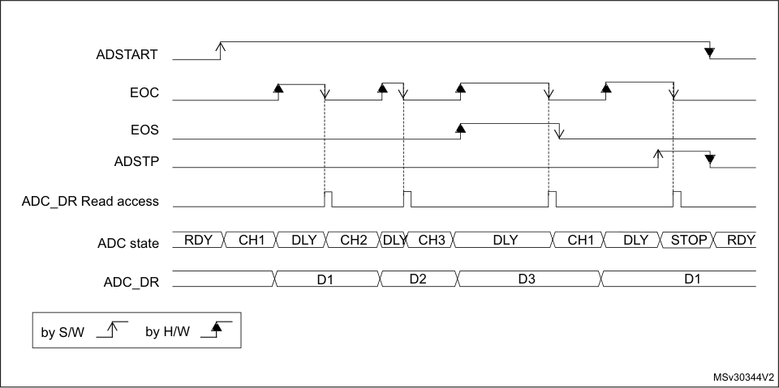

1. EXTEN = 00, CONT = 1

2. CHSEL = 0x3, SCANDIR = 0, WAIT = 1, AUTOFF = 0

For code example, refer to _A.8.11: Wait mode sequence code example_ .

300/905 RM0377 Rev 10

--- end of page=299 ---

