# RM0377 STM32L0x1 — Pages 301–350

**RM0377** **Analog-to-digital converter (ADC)**

**13.6.2** **Auto-off mode (AUTOFF)**

The ADC has an automatic power management feature which is called auto-off mode, and
is enabled by setting AUTOFF = 1 in the ADC_CFGR1 register.

When AUTOFF = 1, the ADC is always powered off when not converting and automatically
wakes-up when a conversion is started (by software or hardware trigger). A startup-time is
automatically inserted between the trigger event which starts the conversion and the
sampling time of the ADC. The ADC is then automatically disabled once the sequence of
conversions is complete.

Auto-off mode can cause a dramatic reduction in the power consumption of applications
which need relatively few conversions or when conversion requests are timed far enough
apart (for example with a low frequency hardware trigger) to justify the extra power and
extra time used for switching the ADC on and off.

Auto-off mode can be combined with the wait mode conversion (WAIT = 1) for applications
clocked at low frequency. This combination can provide significant power savings if the ADC
is automatically powered-off during the wait phase and restarted as soon as the ADC_DR
register is read by the application (see _Figure 46: Behavior with WAIT = 1, AUTOFF = 1_ ).

_Note:_ _Refer to the Section Reset and clock control (RCC) for the description of how to manage_
_the dedicated 14 MHz internal oscillator. The ADC interface can automatically switch_
_ON/OFF the 14 MHz internal oscillator to save power._

**Figure 45. Behavior with WAIT = 0, AUTOFF = 1**

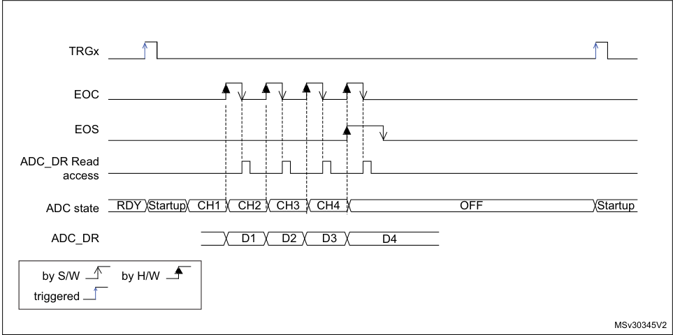

1. EXTSEL = TRGx, EXTEN = 01 (rising edge), CONT = x, ADSTART = 1, CHSEL = 0xF, SCANDIR = 0, WAIT = 1,
AUTOFF = 1

For code example, refer to _A.8.12: Auto off and no wait mode sequence code example_ .

RM0377 Rev 10 301/905

328

--- end of page=300 ---

**Analog-to-digital converter (ADC)** **RM0377**

**Figure 46. Behavior with WAIT = 1, AUTOFF = 1**

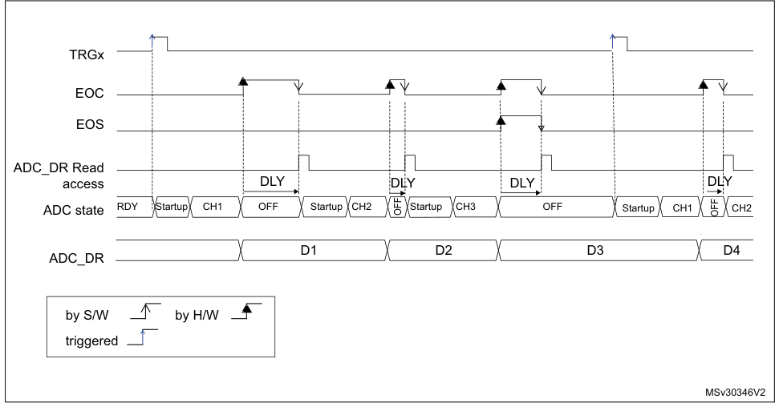

|Col1|Col2|
|---|---|
|||
||DLY|

|Col1|Col2|Col3|Col4|
|---|---|---|---|
|||||
|||||
|DLY|DLY|DLY|DL|

1. EXTSEL = TRGx, EXTEN = 01 (rising edge), CONT = x, ADSTART = 1, CHSEL = 0xF, SCANDIR = 0, WAIT = 1,
AUTOFF = 1

For code example, refer to _A.8.13: Auto off and wait mode sequence code example_ .

###### **13.7 Analog window watchdog (AWDEN, AWDSGL, AWDCH,** **ADC_TR)**

**13.7.1** **Description of the analog watchdog**

The AWD analog watchdog is enabled by setting the AWDEN bit in the ADC_CFGR1
register. It is used to monitor that either one selected channel or all enabled channels (see
_Table 63: Analog watchdog channel selection_ ) remain within a configured voltage range
(window) as shown in _Figure 47_ .

The AWD analog watchdog status bit is set if the analog voltage converted by the ADC is
below a lower threshold or above a higher threshold. These thresholds are programmed in
HT[11:0] and LT[11:0] bit of ADC_TR register. An interrupt can be enabled by setting the
AWDIE bit in the ADC_IER register.

The AWD flag is cleared by software by programming it to it.

When converting data with a resolution of less than 12-bit (according to bits RES[1:0]), the
LSB of the programmed thresholds must be kept cleared because the internal comparison
is always performed on the full 12-bit raw converted data (left aligned).

For code example, refer to _A.8.14: Analog watchdog code example_ .

_Table 62_ describes how the comparison is performed for all the possible resolutions.

302/905 RM0377 Rev 10

--- end of page=301 ---

**RM0377** **Analog-to-digital converter (ADC)**

**Table 62. Analog watchdog comparison**

|Resolution bits RES[1:0]|Analog Watchdog comparison between:|Col3|Comments|
|---|---|---|---|
|**Resolution** **bits** **RES[1:0]**|**Raw converted** **data, left aligned(1) **|**Thresholds**|**Thresholds**|
|00: 12-bit|DATA[11:0]|LT[11:0] and HT[11:0]|-|
|01: 10-bit|DATA[11:2],00|LT[11:0] and HT[11:0]|The user must configure LT1[1:0] and HT1[1:0] to “00”|
|10: 8-bit|DATA[11:4],0000|LT[11:0] and HT[11:0]|The user must configure LT1[3:0] and HT1[3:0] to “0000”|
|11: 6-bit|DATA[11:6],000000|LT[11:0] and HT[11:0]|The user must configure LT1[5:0] and HT1[5:0] to “000000”|

1. The watchdog comparison is performed on the raw converted data before any alignment calculation.

_Table 63_ shows how to configure the AWDSGL and AWDEN bits in the ADC_CFGR1
register to enable the analog watchdog on one or more channels.

**Figure 47. Analog watchdog** **guarded area**

**Table 63. Analog watchdog channel selection**

|Channels guarded by the analog watchdog|AWDSGL bit|AWDEN bit|
|---|---|---|
|None|x|0|
|All channels|0|1|
|Single(1) channel|1|1|

1. Selected by the AWDCH[4:0] bits

**13.7.2** **ADC_AWD1_OUT output signal generation**

The analog watchdog is associated to an internal hardware signal, ADC_AWD1_OUT that is
directly connected to the ETR input (external trigger) of some on-chip timers (refer to the
timers section for details on how to select the ADC_AWD1_OUT signal as ETR).

RM0377 Rev 10 303/905

328

--- end of page=302 ---

**Analog-to-digital converter (ADC)** **RM0377**

ADC_AWD1_OUT is activated when the analog watchdog is enabled:

      - ADC_AWD1_OUT is set when a guarded conversion is outside the programmed
thresholds.

      - ADC_AWD1_OUT is reset after the end of the next guarded conversion which is inside
the programmed thresholds. It remains at 1 if the next guarded conversions are still
outside the programmed thresholds.

      - ADC_AWD1_OUT is also reset when disabling the ADC (when setting ADDIS to 1).
Note that stopping conversions (ADSTP set), might clear the ADC_AWD1_OUT state.

      - ADC_AWD1_OUT state does not change when the ADC converts the none-guarded
channel (see _Figure 48_ )

AWD flag is set by hardware and reset by software: AWD flag has no influence on the
generation of ADC_AWD1_OUT (as an example, ADC_AWD1_OUT can toggle while AWD
flag remains at 1 if the software has not cleared the flag).

The ADC_AWD1_OUT signal is generated by the ADC_CLK domain. This signal can be
generated even the APB clock is stopped.

The AWD comparison is performed at the end of each ADC conversion. The
ADC_AWD1_OUT rising edge and falling edge occurs two ADC_CLK clock cycles after the
comparison.

As ADC_AWD1_OUT is generated by the ADC_CLK domain and AWD flag is generated by
the APB clock domain, the rising edges of these signals are not synchronized.

**Figure 48. ADC_AWD1_OUT signal generation**

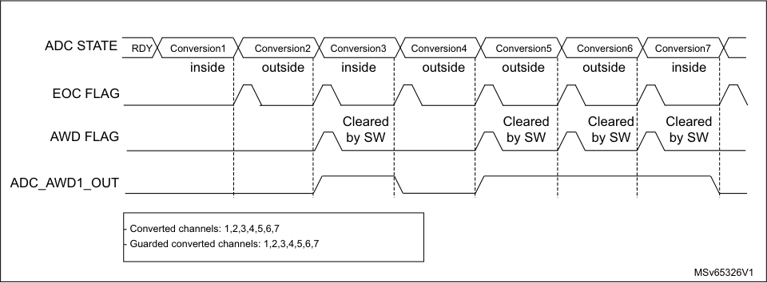

304/905 RM0377 Rev 10

--- end of page=303 ---

**RM0377** **Analog-to-digital converter (ADC)**

**Figure 49. ADC_AWD1_OUT signal generation (AWD flag not cleared by software)**

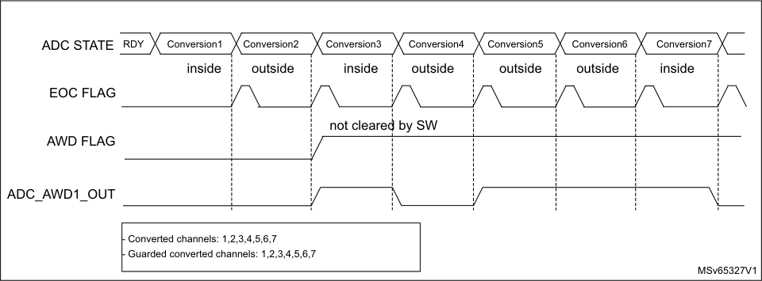

**Figure 50. ADC1_AWD_OUT signal generation (on a single channel)**

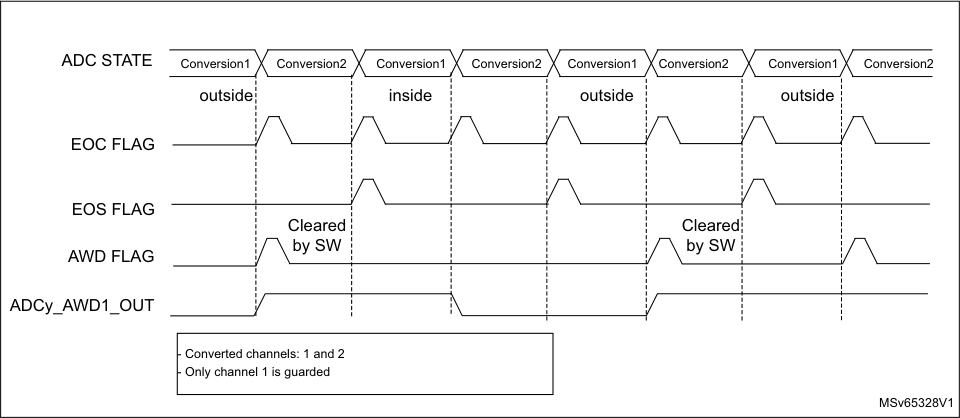

**13.7.3** **Analog watchdog threshold control**

LT[11:0] and HT[11:0] can be changed during an analog-to-digital conversion (that is
between the start of the conversion and the end of conversion of the ADC internal state). If
LT and HT bits are programmed during the ADC guarded channel conversion, the watchdog
function is masked for this conversion. This mask is cleared when starting a new
conversion, and the resulting new AWD threshold is applied starting the next ADC
conversion result. AWD comparison is performed at each end of conversion. If the current
ADC data are out of the new threshold interval, this does not generated any interrupt or an
ADC_AWD1_OUT signal. The Interrupt and the ADC_AWD1_OUT generation only occurs
at the end of the ADC conversion that started after the threshold update. If
ADC_AWD1_OUT is already asserted, programming the new threshold does not deassert
the ADC_AWD1_OUT signal.

RM0377 Rev 10 305/905

328

--- end of page=304 ---

**Analog-to-digital converter (ADC)** **RM0377**

**Figure 51. Analog watchdog threshold update**

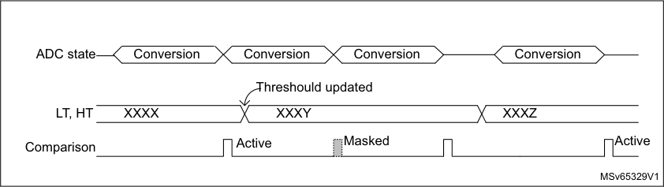

###### **13.8 Oversampler**

The oversampling unit performs data preprocessing to offload the CPU. It can handle
multiple conversions and average them into a single data with increased data width, up to
16-bit.

It provides a result with the following form, where N and M can be adjusted:

n = N – 1

1
## Result = --- M - ×  Conversion t ( n )

n = 0

It allows the following functions to be performed by hardware: averaging, data rate
reduction, SNR improvement, basic filtering.

The oversampling ratio N is defined using the OVFS[2:0] bits in the ADC_CFGR2 register. It
can range from 2x to 256x. The division coefficient M consists of a right bit shift up to 8 bits.
It is configured through the OVSS[3:0] bits in the ADC_CFGR2 register.

For code example, refer to _A.8.15: Oversampling code example_ .

The summation unit can yield a result up to 20 bits (256 x 12-bit), which is first shifted right.
The upper bits of the result are then truncated, keeping only the 16 least significant bits
rounded to the nearest value using the least significant bits left apart by the shifting, before
being finally transferred into the ADC_DR data register.

_Note:_ _If the intermediate result after the shifting exceeds 16 bits, the upper bits of the result are_
_simply truncated._

306/905 RM0377 Rev 10

--- end of page=305 ---

**RM0377** **Analog-to-digital converter (ADC)**

**Figure 52. 20-bit to 16-bit result truncation**

Raw 20-bit data

Shifting

and rounding

|19|15|11|7|0 3|
|---|---|---|---|---|
||||||
||||||
||||||
||0 15|0 15|0 15|0 15|
||||||

MS31928V2

The _Figure 53_ gives a numerical example of the processing, from a raw 20-bit accumulated
data to the final 16-bit result.

**Figure 53. Numerical example with 5-bits shift and rounding**

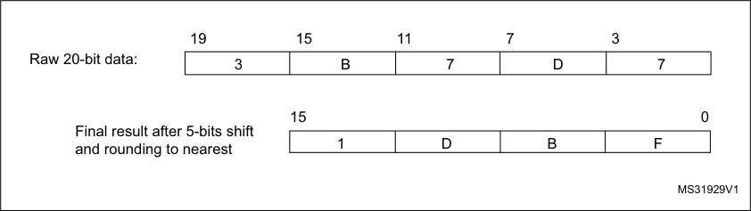

The _Table 64_ below gives the data format for the various N and M combination, for a raw
conversion data equal to 0xFFF.

**Table 64. Maximum output results vs N and M. Grayed values indicates truncation**

|Oversa mpling ratio|Max Raw data|No-shift OVSS = 0000|1-bit shift OVSS = 0001|2-bit shift OVSS = 0010|3-bit shift OVSS = 0011|4-bit shift OVSS = 0100|5-bit shift OVSS = 0101|6-bit shift OVSS = 0110|7-bit shift OVSS = 0111|8-bit shift OVSS = 1000|
|---|---|---|---|---|---|---|---|---|---|---|
|2x|0x1FFE|0x1FFE|0x0FFF|0x0800|0x0400|0x0200|0x0100|0x0080|0x0040|0x0020|
|4x|0x3FFC|0x3FFC|0x1FFE|0x0FFF|0x0800|0x0400|0x0200|0x0100|0x0080|0x0040|
|8x|0x7FF8|0x7FF8|0x3FFC|0x1FFE|0x0FFF|0x0800|0x0400|0x0200|0x0100|0x0080|
|16x|0xFFF0|0xFFF0|0x7FF8|0x3FFC|0x1FFE|0x0FFF|0x0800|0x0400|0x0200|0x0100|
|32x|0x1FFE0|0xFFE0|0xFFF0|0x7FF8|0x3FFC|0x1FFE|0x0FFF|0x0800|0x0400|0x0200|
|64x|0x3FFC0|0xFFC0|0xFFE0|0xFFF0|0x7FF8|0x3FFC|0x1FFE|0x0FFF|0x0800|0x0400|
|128x|0x7FF80|0xFF80|0xFFC0|0xFFE0|0xFFF0|0x7FF8|0x3FFC|0x1FFE|0x0FFF|0x0800|
|256x|0xFFF00|0xFF00|0xFF80|0xFFC0|0xFFE0|0xFFF0|0x7FF8|0x3FFC|0x1FFE|0x0FFF|

The conversion timings in oversampled mode do not change compared to standard
conversion mode: the sample time is maintained equal during the whole oversampling

RM0377 Rev 10 307/905

328

--- end of page=306 ---

**Analog-to-digital converter (ADC)** **RM0377**

sequence. New data are provided every N conversion, with an equivalent delay equal to N x
t CONV = N x (t SMPL + t SAR ). The flags features are raised as following:

      - the end of the sampling phase (EOSMP) is set after each sampling phase

      - the end of conversion (EOC) occurs once every N conversions, when the oversampled
result is available

      - the end of sequence (EOCSEQ) occurs once the sequence of oversampled data is
completed (i.e. after N x sequence length conversions total)

**13.8.1** **ADC operating modes supported when oversampling**

In oversampling mode, most of the ADC operating modes are available:

      - Single or continuous mode conversions, forward or backward scanned sequences

      - ADC conversions start either by software or with triggers

      - ADC stop during a conversion (abort)

      - Data read via CPU or DMA with overrun detection

      - Low-power modes (WAIT, AUTOFF)

      - Programmable resolution: in this case, the reduced conversion values (as per RES[1:0]
bits in ADC_CFGR1 register) are accumulated, truncated, rounded and shifted in the
same way as 12-bit conversions are

_Note:_ _The alignment mode is not available when working with oversampled data. The ALIGN bit in_
_ADC_CFGR1 is ignored and the data are always provided right-aligned._

**13.8.2** **Analog watchdog**

The analog watchdog functionality is available (AWDSGL, AWDEN bits), with the following
differences:

      - the RES[1:0] bits are ignored, comparison is always done on using the full 12-bits
values HT[11:0] and LT[11:0]

      - the comparison is performed on the most significant 12 bits of the 16 bits oversampled
results ADC_DR[15:4]

_Note:_ _Care must be taken when using high shifting values. This reduces the comparison range._
_For instance, if the oversampled result is shifted by 4 bits thus yielding a 12-bit data right-_
_aligned, the affective analog watchdog comparison can only be performed on 8 bits. The_
_comparison is done between ADC_DR[11:4] and HT[7:0] / LT[[7:0], and HT[11:8] / LT[11:8]_
_must be kept reset._

**13.8.3** **Triggered mode**

The averager can also be used for basic filtering purposes. Although not a very efficient filter
(slow roll-off and limited stop band attenuation), it can be used as a notch filter to reject
constant parasitic frequencies (typically coming from the mains or from a switched mode
power supply). For this purpose, a specific discontinuous mode can be enabled with TOVS
bit in ADC_CFGR2, to be able to have an oversampling frequency defined by a user and
independent from the conversion time itself.

_Figure 54_ below shows how conversions are started in response to triggers in discontinuous
mode.

If the TOVS bit is set, the content of the DISCEN bit is ignored and considered as 1.

308/905 RM0377 Rev 10

--- end of page=307 ---

**RM0377** **Analog-to-digital converter (ADC)**

**Figure 54. Triggered oversampling mode (TOVS bit = 1)**

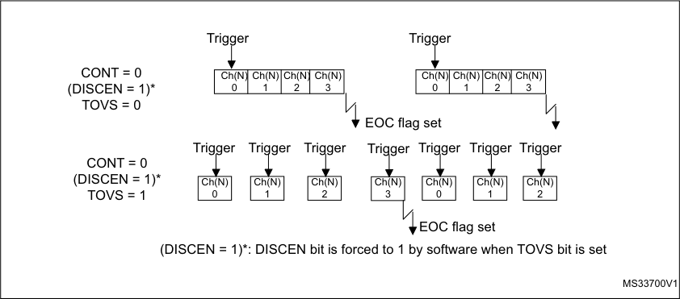

###### **13.9 Temperature sensor and internal reference voltage**

The temperature sensor can be used to measure the junction temperature (T J ) of the
device. The temperature sensor is internally connected to the ADC V IN [18] input channel
which is used to convert the sensor’s output voltage to a digital value. The sampling time for
the temperature sensor analog pin must be greater than the minimum T S_temp value
specified in the datasheet. When not in use, the sensor can be put in power down mode.

The internal voltage reference (V REFINT ) provides a stable (bandgap) voltage output for the
ADC and comparators. V REFINT is internally connected to the ADC V IN [17] input channel.
The precise voltage of V REFINT is individually measured for each part by ST during
production test and stored in the system memory area. It is accessible in read-only mode.

_Figure 55_ shows the block diagram of connections between the temperature sensor, the
internal voltage reference and the ADC.

The TSEN bit must be set to enable the conversion of ADC V IN [18] (temperature sensor)
and the VREFEN bit must be set to enable the conversion of ADC V IN [17] (V REFINT ).

The temperature sensor output voltage changes linearly with temperature. The offset of this
line varies from chip to chip due to process variation (up to 45 °C from one chip to another).

The uncalibrated internal temperature sensor is more suited for applications that detect
temperature variations instead of absolute temperatures. To improve the accuracy of the
temperature sensor measurement, calibration values are stored in system memory for each
device by ST during production.

During the manufacturing process, the calibration data of the temperature sensor and the
internal voltage reference are stored in the system memory area. The user application can
then read them and use them to improve the accuracy of the temperature sensor or the
internal reference. Refer to the datasheet for additional information.

RM0377 Rev 10 309/905

328

--- end of page=308 ---

**Analog-to-digital converter (ADC)** **RM0377**

**Main features**

      - Linearity: ±2 °C max., precision depending on calibration

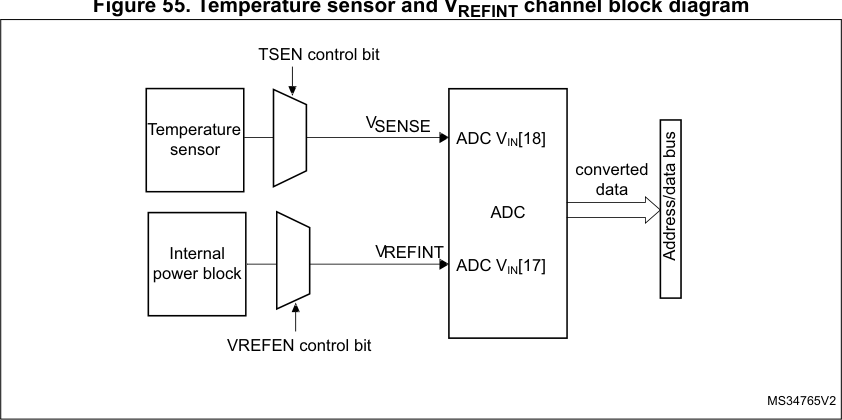

**Reading the temperature**

1. Select the ADC V IN [18] input channel.

2. Select an appropriate sampling time specified in the device datasheet (T S_temp ).

3. Set the TSEN bit in the ADC_CCR register to wake up the temperature sensor from
power down mode and wait for its stabilization time (t START ).

For code example, refer to _A.8.16: Temperature configuration code example_ .

4. Start the ADC conversion by setting the ADSTART bit in the ADC_CR register (or by
external trigger).

5. Read the resulting V SENSE data in the ADC_DR register.

6. Calculate the temperature using the following formula

–
Temperature in °C ( ) = TS_CAL2_TEMP --------------------------------------------------------------------------------------------------– TS_CAL1_TEMP **-** × ( TS_DATA – TS_CAL1 ) + TS_CAL1_TEMP
TS_CAL2 TS_CAL1

Where:

      - TS_CAL2 is the temperature sensor calibration value acquired at TS_CAL2_TEMP
(refer to the datasheet for TS_CAL2 value)

      - TS_CAL1 is the temperature sensor calibration value acquired at TS_CAL1_TEMP
(refer to the datasheet for TS_CAL1 value)

      - TS_DATA is the actual temperature sensor output value converted by ADC

Refer to the specific device datasheet for more information about TS_CAL1 and
TS_CAL2 calibration points.

For code example, refer to _A.8.17: Temperature computation code example_ .

_Note:_ _The sensor has a startup time after waking from power down mode before it can output_
_V_ _SENSE_ _at the correct level. The ADC also has a startup time after power-on, so to minimize_
_the delay, the ADEN and TSEN bits should be set at the same time._

310/905 RM0377 Rev 10

--- end of page=309 ---

**RM0377** **Analog-to-digital converter (ADC)**

**Calculating the actual V** **DDA** **voltage using the internal reference voltage**

The V DDA power supply voltage applied to the device may be subject to variation or not
precisely known. The embedded internal voltage reference (V REFINT ) and its calibration
data, acquired by the ADC during the manufacturing process at V DDA_Charac, can be used to
evaluate the actual V DDA voltage level.

The following formula gives the actual V DDA voltage supplying the device:

V DDA = V DDA_Charac x VREFINT_CAL / VREFINT_DATA

Where:

      - V DDA_Charac is the value of V DDA voltage characterized at V REFINT during the
manufacturing process. It is specified in the device datasheet.

      - VREFINT_CAL is the VREFINT calibration value

      - VREFINT_DATA is the actual VREFINT output value converted by ADC

**Converting a supply-relative ADC measurement to an absolute voltage value**

The ADC is designed to deliver a digital value corresponding to the ratio between the analog
power supply and the voltage applied on the converted channel. For most application use
cases, it is necessary to convert this ratio into a voltage independent of V DDA . For
applications where V DDA is known and ADC converted values are right-aligned you can use
the following formula to get this absolute value:

V CHANNELx = ------------------------------------- FULL_SCALEV DDA × ADC_DATA x

For applications where V DDA value is not known, you must use the internal voltage
reference and V DDA can be replaced by the expression provided in _Section : Calculating the_
_actual V_ _DDA_ _voltage using the internal reference voltage_, resulting in the following formula:

V CHANNELx = V ----------------------------------------------------------------------------------------------------------------------- DDA_Charac × VREFINT_CAL × ADC_DATA x
VREFINT_DATA × FULL_SCALE

Where:

      - V DDA_Charac is the value of V DDA voltage characterized at V REFINT during the
manufacturing process. It is specified in the device datasheet.

      - VREFINT_CAL is the VREFINT calibration value

      - ADC_DATA x is the value measured by the ADC on channelx (right-aligned)

      - VREFINT_DATA is the actual VREFINT output value converted by the ADC

      - full_SCALE is the maximum digital value of the ADC output. For example with 12-bit
resolution, it is 2 [12]           - 1 = 4095 or with 8-bit resolution, 2 [8]           - 1 = 255.

_Note:_ _If ADC measurements are done using an output format other than 12 bit right-aligned, all the_
_parameters must first be converted to a compatible format before the calculation is done._

RM0377 Rev 10 311/905

328

--- end of page=310 ---

**Analog-to-digital converter (ADC)** **RM0377**

###### **13.10 ADC interrupts**

An interrupt can be generated by any of the following events:

      - End Of Calibration (EOCAL flag)

      - ADC power-up, when the ADC is ready (ADRDY flag)

      - End of any conversion (EOC flag)

      - End of a sequence of conversions (EOS flag)

      - When an analog watchdog detection occurs (AWD flag)

      - When the end of sampling phase occurs (EOSMP flag)

      - when a data overrun occurs (OVR flag)

Separate interrupt enable bits are available for flexibility.

**Table 65. ADC interrupts**

|Interrupt event|Event flag|Enable control bit|
|---|---|---|
|End Of Calibration|EOCAL|EOCALIE|
|ADC ready|ADRDY|ADRDYIE|
|End of conversion|EOC|EOCIE|
|End of sequence of conversions|EOS|EOSIE|
|Analog watchdog status bit is set|AWD|AWDIE|
|End of sampling phase|EOSMP|EOSMPIE|
|Overrun|OVR|OVRIE|

312/905 RM0377 Rev 10

--- end of page=311 ---

**RM0377** **Analog-to-digital converter (ADC)**

###### **13.11 ADC registers**

Refer to _Section 1.2_ for a list of abbreviations used in register descriptions.

**13.11.1** **ADC interrupt and status register (ADC_ISR)**

Address offset: 0x00

Reset value: 0x0000 0000

|31|30|29|28|27|26|25|24|23|22|21|20|19|18|17|16|
|---|---|---|---|---|---|---|---|---|---|---|---|---|---|---|---|
|Res.|Res.|Res.|Res.|Res.|Res.|Res.|Res.|Res.|Res.|Res.|Res.|Res.|Res.|Res.|Res.|
|||||||||||||||||

|15|14|13|12|11|10|9|8|7|6|5|4|3|2|1|0|
|---|---|---|---|---|---|---|---|---|---|---|---|---|---|---|---|
|Res.|Res.|Res.|Res.|EOCAL|Res.|Res.|Res.|AWD|Res.|Res.|OVR|EOS|EOC|EOSMP|ADRDY|
|||||rc_w1||||rc_w1|||rc_w1|rc_w1|rc_w1|rc_w1|rc_w1|

Bits 31:13 Reserved, must be kept at reset value.

Bit 12 Reserved, must be kept at reset value.

Bit 11 **EOCAL** : End Of Calibration flag

This bit is set by hardware when calibration is complete. It is cleared by software writing 1 to it.
0: Calibration is not complete
1: Calibration is complete

Bit 10 Reserved, must be kept at reset value.

Bits 9:8 Reserved, must be kept at reset value.

Bit 7 **AWD** : Analog watchdog flag

This bit is set by hardware when the converted voltage crosses the values programmed in ADC_TR
register. It is cleared by software by programming it to 1.
0: No analog watchdog event occurred (or the flag event was already acknowledged and cleared by
software)
1: Analog watchdog event occurred

Bits 6:5 Reserved, must be kept at reset value.

Bit 4 **OVR** : ADC overrun

This bit is set by hardware when an overrun occurs, meaning that a new conversion has complete
while the EOC flag was already set. It is cleared by software writing 1 to it.
0: No overrun occurred (or the flag event was already acknowledged and cleared by software)

1: Overrun has occurred

Bit 3 **EOS** : End of sequence flag

This bit is set by hardware at the end of the conversion of a sequence of channels selected by the
CHSEL bits. It is cleared by software writing 1 to it.
0: Conversion sequence not complete (or the flag event was already acknowledged and cleared by
software)
1: Conversion sequence complete

RM0377 Rev 10 313/905

328

--- end of page=312 ---

**Analog-to-digital converter (ADC)** **RM0377**

Bit 2 **EOC** : End of conversion flag

This bit is set by hardware at the end of each conversion of a channel when a new data result is
available in the ADC_DR register. It is cleared by software writing 1 to it or by reading the ADC_DR
register.
0: Channel conversion not complete (or the flag event was already acknowledged and cleared by
software)
1: Channel conversion complete

Bit 1 **EOSMP** : End of sampling flag

This bit is set by hardware during the conversion, at the end of the sampling phase.It is cleared by
software by programming it to ‘1’.
0: Not at the end of the sampling phase (or the flag event was already acknowledged and cleared by
software)
1: End of sampling phase reached

Bit 0 **ADRDY** : ADC ready

This bit is set by hardware after the ADC has been enabled (ADEN = 1) and when the ADC reaches
a state where it is ready to accept conversion requests.

It is cleared by software writing 1 to it.

0: ADC not yet ready to start conversion (or the flag event was already acknowledged and cleared
by software)
1: ADC is ready to start conversion

**13.11.2** **ADC interrupt enable register (ADC_IER)**

Address offset: 0x04

Reset value: 0x0000 0000

|31|30|29|28|27|26|25|24|23|22|21|20|19|18|17|16|
|---|---|---|---|---|---|---|---|---|---|---|---|---|---|---|---|
|Res.|Res.|Res.|Res.|Res.|Res.|Res.|Res.|Res.|Res.|Res.|Res.|Res.|Res.|Res.|Res.|
|||||||||||||||||

|15|14|13|12|11|10|9|8|7|6|5|4|3|2|1|0|
|---|---|---|---|---|---|---|---|---|---|---|---|---|---|---|---|
|Res.|Res.|Res.|Res.|EOCAL IE|Res.|Res.|Res.|AWDIE|Res.|Res.|OVRIE|EOSIE|EOCIE|EOSMP IE|ADRDY IE|
|||||rw||||rw|||rw|rw|rw|rw|rw|

Bits 31:13 Reserved, must be kept at reset value.

Bit 12 Reserved, must be kept at reset value.

Bit 11 **EOCALIE** : End of calibration interrupt enable

This bit is set and cleared by software to enable/disable the end of calibration interrupt.
0: End of calibration interrupt disabled
1: End of calibration interrupt enabled

_Note: The software is allowed to write this bit only when ADSTART bit is cleared (this ensures that no_
_conversion is ongoing)._

Bit 10 Reserved, must be kept at reset value.

Bits 9:8 Reserved, must be kept at reset value.

314/905 RM0377 Rev 10

--- end of page=313 ---

**RM0377** **Analog-to-digital converter (ADC)**

Bit 7 **AWDIE** : Analog watchdog interrupt enable

This bit is set and cleared by software to enable/disable the analog watchdog interrupt.
0: Analog watchdog interrupt disabled
1: Analog watchdog interrupt enabled

_Note: The Software is allowed to write this bit only when ADSTART bit is cleared (this ensures that no_
_conversion is ongoing)._

Bits 6:5 Reserved, must be kept at reset value.

Bit 4 **OVRIE** : Overrun interrupt enable

This bit is set and cleared by software to enable/disable the overrun interrupt.
0: Overrun interrupt disabled
1: Overrun interrupt enabled. An interrupt is generated when the OVR bit is set.

_Note: The software is allowed to write this bit only when ADSTART bit is cleared (this ensures that no_
_conversion is ongoing)._

Bit 3 **EOSIE** : End of conversion sequence interrupt enable

This bit is set and cleared by software to enable/disable the end of sequence of conversions
interrupt.
0: EOS interrupt disabled
1: EOS interrupt enabled. An interrupt is generated when the EOS bit is set.

_Note: The software is allowed to write this bit only when ADSTART bit is cleared (this ensures that no_
_conversion is ongoing)._

Bit 2 **EOCIE** : End of conversion interrupt enable

This bit is set and cleared by software to enable/disable the end of conversion interrupt.

0: EOC interrupt disabled
1: EOC interrupt enabled. An interrupt is generated when the EOC bit is set.

_Note: The software is allowed to write this bit only when ADSTART bit is cleared (this ensures that no_
_conversion is ongoing)._

Bit 1 **EOSMPIE** : End of sampling flag interrupt enable

This bit is set and cleared by software to enable/disable the end of the sampling phase interrupt.

0: EOSMP interrupt disabled.
1: EOSMP interrupt enabled. An interrupt is generated when the EOSMP bit is set.

_Note: The software is allowed to write this bit only when ADSTART bit is cleared (this ensures that no_
_conversion is ongoing)._

Bit 0 **ADRDYIE** : ADC ready interrupt enable

This bit is set and cleared by software to enable/disable the ADC Ready interrupt.

0: ADRDY interrupt disabled.
1: ADRDY interrupt enabled. An interrupt is generated when the ADRDY bit is set.

_Note: The software is allowed to write this bit only when ADSTART bit is cleared (this ensures that no_
_conversion is ongoing)._

RM0377 Rev 10 315/905

328

--- end of page=314 ---

**Analog-to-digital converter (ADC)** **RM0377**

**13.11.3** **ADC control register (ADC_CR)**

Address offset: 0x08

Reset value: 0x0000 0000

|31|30|29|28|27|26|25|24|23|22|21|20|19|18|17|16|
|---|---|---|---|---|---|---|---|---|---|---|---|---|---|---|---|
|ADCAL|Res.|Res.|ADVR EGEN|Res.|Res.|Res.|Res.|Res.|Res.|Res.|Res.|Res.|Res.|Res.|Res.|
|rs|||rw|||||||||||||

|15|14|13|12|11|10|9|8|7|6|5|4|3|2|1|0|
|---|---|---|---|---|---|---|---|---|---|---|---|---|---|---|---|
|Res.|Res.|Res.|Res.|Res.|Res.|Res.|Res.|Res.|Res.|Res.|ADSTP|Res.|ADSTA RT|ADDIS|ADEN|
||||||||||||rs||rs|rs|rs|

Bit 31 **ADCAL** : ADC calibration

This bit is set by software to start the calibration of the ADC.
It is cleared by hardware after calibration is complete.
0: Calibration complete
1: Write 1 to calibrate the ADC. Read at 1 means that a calibration is in progress.

_Note: The software is allowed to set ADCAL only when the ADC is disabled (ADCAL_ = _0,_
_ADSTART_ = _0, ADSTP_ = _0, ADDIS_ = _0 and ADEN_ = _0)._

_The software is allowed to update the calibration factor by writing ADC_CALFACT only when_
_ADEN = 1 and ADSTART = 0 (ADC enabled and no conversion is ongoing)._

Bits 30:29 Reserved, must be kept at reset value.

Bit 28 **ADVREGEN** : ADC Voltage Regulator Enable

This bit can be set:

– by software, to enable the ADC internal voltage regulator.

– by hardware, when launching the calibration (setting ADCAL = 1) or when enabling the ADC (setting
ADEN = 1)

It is cleared by software to disable the voltage regulator. It can be cleared only if ADEN is cleared.
0: ADC voltage regulator disabled
1: ADC voltage regulator enabled

_Note: The software can program this bit field only when the ADC is disabled (ADCAL_ = _0,_
_ADSTART_ = _0, ADSTP_ = _0, ADDIS_ = _0 and ADEN_ = _0)._

Bits 27:5 Reserved, must be kept at reset value.

Bit 4 **ADSTP** : ADC stop conversion command

This bit is set by software to stop and discard an ongoing conversion (ADSTP Command).
It is cleared by hardware when the conversion is effectively discarded and the ADC is ready to
accept a new start conversion command.
0: No ADC stop conversion command ongoing
1: Write 1 to stop the ADC. Read 1 means that an ADSTP command is in progress.

_Note: Setting ADSTP to ‘1’ is only effective when ADSTART_ = _1 and ADDIS_ = _0 (ADC is enabled and_
_may be converting and there is no pending request to disable the ADC)_

Bit 3 Reserved, must be kept at reset value.

316/905 RM0377 Rev 10

--- end of page=315 ---

**RM0377** **Analog-to-digital converter (ADC)**

Bit 2 **ADSTART** : ADC start conversion command

This bit is set by software to start ADC conversion. Depending on the EXTEN [1:0] configuration bits,
a conversion either starts immediately (software trigger configuration) or once a hardware trigger
event occurs (hardware trigger configuration).
It is cleared by hardware:

– In single conversion mode (CONT = 0, DISCEN = 0), when software trigger is selected
(EXTEN = 00): at the assertion of the end of Conversion Sequence (EOS) flag.

– In discontinuous conversion mode(CONT = 0, DISCEN = 1), when the software trigger is selected
(EXTEN = 00): at the assertion of the end of Conversion (EOC) flag.

– In all other cases: after the execution of the ADSTP command, at the same time as the ADSTP bit is
cleared by hardware.

0: No ADC conversion is ongoing.
1: Write 1 to start the ADC. Read 1 means that the ADC is operating and may be converting.

_Note: The software is allowed to set ADSTART only when ADEN_ = _1 and ADDIS_ = _0 (ADC is enabled_
_and there is no pending request to disable the ADC)._

Bit 1 **ADDIS** : ADC disable command

This bit is set by software to disable the ADC (ADDIS command) and put it into power-down state
(OFF state).
It is cleared by hardware once the ADC is effectively disabled (ADEN is also cleared by hardware at
this time).
0: No ADDIS command ongoing
1: Write 1 to disable the ADC. Read 1 means that an ADDIS command is in progress.

_Note: Setting ADDIS to ‘1’ is only effective when ADEN_ = _1 and ADSTART_ = _0 (which ensures that no_
_conversion is ongoing)_

Bit 0 **ADEN** : ADC enable command

This bit is set by software to enable the ADC. The ADC is effectively ready to operate once the
ADRDY flag has been set.
It is cleared by hardware when the ADC is disabled, after the execution of the ADDIS command.
0: ADC is disabled (OFF state)

1: Write 1 to enable the ADC.

_Note: The software is allowed to set ADEN only when all bits of ADC_CR registers are 0 (ADCAL_ = _0,_
_ADSTP_ = _0, ADSTART_ = _0, ADDIS_ = _0 and ADEN_ = _0)_

RM0377 Rev 10 317/905

328

--- end of page=316 ---

**Analog-to-digital converter (ADC)** **RM0377**

**13.11.4** **ADC configuration register 1 (ADC_CFGR1)**

Address offset: 0x0C

Reset value: 0x0000 0000

The software is allowed to program ADC_CFGR1 only when ADEN is cleared in ADC_CR.

|31|30 29 28 27 26|Col3|Col4|Col5|Col6|25|24|23|22|21|20|19|18|17|16|
|---|---|---|---|---|---|---|---|---|---|---|---|---|---|---|---|
|Res.|AWDCH[4:0]|AWDCH[4:0]|AWDCH[4:0]|AWDCH[4:0]|AWDCH[4:0]|Res.|Res.|AWDEN|AWDSGL|Res.|Res.|Res.|Res.|Res.|DISCEN|
||rw|rw|rw|rw|rw|||rw|rw||||||rw|

|15|14|13|12|11 10|Col6|9|8 7 6|Col9|Col10|5|4 3|Col13|2|1|0|
|---|---|---|---|---|---|---|---|---|---|---|---|---|---|---|---|
|AUTOFF|WAIT|CONT|OVRMOD|EXTEN[1:0]|EXTEN[1:0]|Res.|EXTSEL[2:0]|EXTSEL[2:0]|EXTSEL[2:0]|ALIGN|RES[1:0]|RES[1:0]|SCAND IR|DMAC FG|DMAEN|
|rw|rw|rw|rw|rw|rw||rw|rw|rw|rw|rw|rw|rw|rw|rw|

Bit 31 Reserved, must be kept at reset value.

Bits 30:26 **AWDCH[4:0]** : Analog watchdog channel selection

These bits are set and cleared by software. They select the input channel to be guarded by
the analog watchdog.
00000: ADC analog input Channel 0 monitored by AWD
00001: ADC analog input Channel 1 monitored by AWD

.....

10001: ADC analog input Channel 17 monitored by AWD
10010: ADC analog input Channel 18 monitored by AWD

Others: Reserved

_Note: The channel selected by the AWDCH[4:0] bits must be also set into the CHSELR_
_register._

_The software is allowed to write this bit only when ADSTART bit is cleared (this ensures_
_that no conversion is ongoing).The software is allowed to write this bit only when ADEN_
_bit is cleared._

Bits 25:24 Reserved, must be kept at reset value.

Bit 23 **AWDEN** : Analog watchdog enable

This bit is set and cleared by software.
0: Analog watchdog disabled
1: Analog watchdog enabled

_Note: The software is allowed to write this bit only when ADSTART bit is cleared (this ensures_
_that no conversion is ongoing).The software is allowed to write this bit only when ADEN_
_bit is cleared._

Bit 22 **AWDSGL** : Enable the watchdog on a single channel or on all channels

This bit is set and cleared by software to enable the analog watchdog on the channel
identified by the AWDCH[4:0] bits or on all the channels
0: Analog watchdog enabled on all channels
1: Analog watchdog enabled on a single channel

_Note: The software is allowed to write this bit only when ADSTART bit is cleared (this ensures_
_that no conversion is ongoing).The software is allowed to write this bit only when ADEN_
_bit is cleared._

Bits 21:17 Reserved, must be kept at reset value.

318/905 RM0377 Rev 10

--- end of page=317 ---

**RM0377** **Analog-to-digital converter (ADC)**

Bit 16 **DISCEN** : Discontinuous mode

This bit is set and cleared by software to enable/disable discontinuous mode.

0: Discontinuous mode disabled

1: Discontinuous mode enabled

_Note: It is not possible to have both discontinuous mode and continuous mode enabled: it is_
_forbidden to set both bits DISCEN_ = _1 and CONT_ = _1._

_The software is allowed to write this bit only when ADSTART bit is cleared (this ensures_
_that no conversion is ongoing).The software is allowed to write this bit only when ADEN_
_bit is cleared._

Bit 15 **AUTOFF** : Auto-off mode

This bit is set and cleared by software to enable/disable auto-off mode. _[.]_

0: Auto-off mode disabled

1: Auto-off mode enabled

_Note: The software is allowed to write this bit only when ADSTART bit is cleared (this ensures_
_that no conversion is ongoing).The software is allowed to write this bit only when ADEN_
_bit is cleared._

Bit 14 **WAIT** : Wait conversion mode

This bit is set and cleared by software to enable/disable wait conversion mode. _[.]_

0: Wait conversion mode off

1: Wait conversion mode on

_Note: The software is allowed to write this bit only when ADSTART bit is cleared (this ensures_
_that no conversion is ongoing).The software is allowed to write this bit only when ADEN_
_bit is cleared._

Bit 13 **CONT** : Single / continuous conversion mode

This bit is set and cleared by software. If it is set, conversion takes place continuously until it
is cleared.

0: Single conversion mode

1: Continuous conversion mode

_Note: It is not possible to have both discontinuous mode and continuous mode enabled: it is_
_forbidden to set both bits DISCEN_ = _1 and CONT_ = _1._

_The software is allowed to write this bit only when ADSTART bit is cleared (this ensures_
_that no conversion is ongoing).The software is allowed to write this bit only when ADEN_
_bit is cleared._

Bit 12 **OVRMOD** : Overrun management mode

This bit is set and cleared by software and configure the way data overruns are managed.
0: ADC_DR register is preserved with the old data when an overrun is detected.
1: ADC_DR register is overwritten with the last conversion result when an overrun is
detected.

_Note: The software is allowed to write this bit only when ADSTART bit is cleared (this ensures_
_that no conversion is ongoing).The software is allowed to write this bit only when ADEN_
_bit is cleared._

RM0377 Rev 10 319/905

328

--- end of page=318 ---

**Analog-to-digital converter (ADC)** **RM0377**

Bits 11:10 **EXTEN[1:0]** : External trigger enable and polarity selection

These bits are set and cleared by software to select the external trigger polarity and enable
the trigger.
00: Hardware trigger detection disabled (conversions can be started by software)
01: Hardware trigger detection on the rising edge
10: Hardware trigger detection on the falling edge
11: Hardware trigger detection on both the rising and falling edges

_Note: The software is allowed to write this bit only when ADSTART bit is cleared (this ensures_
_that no conversion is ongoing).The software is allowed to write this bit only when ADEN_
_bit is cleared._

Bit 9 Reserved, must be kept at reset value.

Bits 8:6 **EXTSEL[2:0]** : External trigger selection

These bits select the external event used to trigger the start of conversion (refer to _Table 58:_
_External triggers_ for details):

000: TRG0

001: TRG1

010: TRG2

011: TRG3

100: TRG4

101: TRG5

110: TRG6

111: TRG7

_Note: The software is allowed to write this bit only when ADSTART bit is cleared (this ensures_
_that no conversion is ongoing).The software is allowed to write this bit only when ADEN_
_bit is cleared._

Bit 5 **ALIGN** : Data alignment

This bit is set and cleared by software to select right or left alignment. Refer to _Figure 42:_
_Data alignment and resolution (oversampling disabled: OVSE = 0) on page 297_
0: Right alignment
1: Left alignment

_Note: The software is allowed to write this bit only when ADSTART bit is cleared (this ensures_
_that no conversion is ongoing).The software is allowed to write this bit only when ADEN_
_bit is cleared._

Bits 4:3 **RES[1:0]** : Data resolution

These bits are written by software to select the resolution of the conversion.

00: 12 bits

01: 10 bits

10: 8 bits

11: 6 bits

_Note: The software is allowed to write these bits only when ADEN is cleared._

320/905 RM0377 Rev 10

--- end of page=319 ---

**RM0377** **Analog-to-digital converter (ADC)**

Bit 2 **SCANDIR** : Scan sequence direction

This bit is set and cleared by software to select the direction in which the channels is scanned
in the sequence.
0: Upward scan (from CHSEL0 to CHSEL18)
1: Backward scan (from CHSEL18 to CHSEL0)

_Note: The software is allowed to write this bit only when ADSTART bit is cleared (this ensures_
_that no conversion is ongoing).The software is allowed to write this bit only when ADEN_
_bit is cleared._

Bit 1 **DMACFG** : Direct memory access configuration

This bit is set and cleared by software to select between two DMA modes of operation and is
effective only when DMAEN = 1.

0: DMA one shot mode selected

1: DMA circular mode selected

For more details, refer to _Section 13.5.5: Managing converted data using the DMA on_
_page 298_

_Note: The software is allowed to write this bit only when ADSTART bit is cleared (this ensures_
_that no conversion is ongoing).The software is allowed to write this bit only when ADEN_
_bit is cleared._

Bit 0 **DMAEN** : Direct memory access enable

This bit is set and cleared by software to enable the generation of DMA requests. This allows
the DMA controller to be used to manage automatically the converted data. For more details,
refer to _Section 13.5.5: Managing converted data using the DMA on page 298_ .

0: DMA disabled

1: DMA enabled

_Note: The software is allowed to write this bit only when ADSTART bit is cleared (this ensures_
_that no conversion is ongoing).The software is allowed to write this bit only when ADEN_
_bit is cleared._

RM0377 Rev 10 321/905

328

--- end of page=320 ---

**Analog-to-digital converter (ADC)** **RM0377**

**13.11.5** **ADC configuration register 2 (ADC_CFGR2)**

Address offset: 0x10

Reset value: 0x0000 0000

The software is allowed to program ADC_CFGR2 only when ADEN is cleared in ADC_CR.

|31 30|Col2|29|28|27|26|25|24|23|22|21|20|19|18|17|16|
|---|---|---|---|---|---|---|---|---|---|---|---|---|---|---|---|
|CKMODE[1:0]|CKMODE[1:0]|Res.|Res.|Res.|Res.|Res.|Res.|Res.|Res.|Res.|Res.|Res.|Res.|Res.|Res.|
|rw|rw|||||||||||||||

|15|14|13|12|11|10|9|8 7 6 5|Col9|Col10|Col11|4 3 2|Col13|Col14|1|0|
|---|---|---|---|---|---|---|---|---|---|---|---|---|---|---|---|
|Res.|Res.|Res.|Res.|Res.|Res.|TOVS|OVSS[3:0]|OVSS[3:0]|OVSS[3:0]|OVSS[3:0]|OVSR[2:0]|OVSR[2:0]|OVSR[2:0]|Res.|OVSE|
|||||||rw|rw|rw|rw|rw|rw|rw|rw||rw|

Bits 31:30 **CKMODE[1:0]:** ADC clock mode

These bits are set and cleared by software to define how the analog ADC is clocked:
00: ADCCLK (Asynchronous clock mode), generated at product level (refer to RCC section)
01: PCLK/2 (Synchronous clock mode)
10: PCLK/4 (Synchronous clock mode)
11: PCLK (Synchronous clock mode). This configuration must be enabled only if PCLK has a 50%
duty clock cycle (APB prescaler configured inside the RCC must be bypassed and the system clock
must by 50% duty cycle)
In all synchronous clock modes, there is no jitter in the delay from a timer trigger to the start of a
conversion.

_Note: The software is allowed to write these bits only when the ADC is disabled (ADCAL_ = _0,_
_ADSTART_ = _0, ADSTP_ = _0, ADDIS_ = _0 and ADEN_ = _0)._

Bits 29:10 Reserved, must be kept at reset value.

Bit 9 **TOVS** : Triggered Oversampling

This bit is set and cleared by software.
0: All oversampled conversions for a channel are done consecutively after a trigger
1: Each oversampled conversion for a channel needs a trigger

_Note: The software is allowed to write this bit only when ADSTART bit is cleared (this ensures that no_
_conversion is ongoing).The software is allowed to write this bit only when ADEN bit is cleared._

Bits 8:5 **OVSS[3:0]** : Oversampling shift

This bit is set and cleared by software.

0000: No shift

0001: Shift 1-bit

0010: Shift 2-bits

0011: Shift 3-bits

0100: Shift 4-bits

0101: Shift 5-bits

0110: Shift 6-bits

0111: Shift 7-bits

1000: Shift 8-bits

Others: Reserved

_Note: he software is allowed to write this bit only when ADSTART bit is cleared (this ensures that no_
_conversion is ongoing).The software is allowed to write this bit only when ADEN bit is cleared._

322/905 RM0377 Rev 10

--- end of page=321 ---

**RM0377** **Analog-to-digital converter (ADC)**

Bits 4:2 **OVSR[2:0]** : Oversampling ratio

This bit filed defines the number of oversampling ratio.

000: 2x

001: 4x

010: 8x

011: 16x

100: 32x

101: 64x

110: 128x

111: 256x

_Note: The software is allowed to write this bit only when ADSTART bit is cleared (this ensures that no_
_conversion is ongoing).The software is allowed to write this bit only when ADEN bit is cleared._

Bit 1 Reserved, must be kept at reset value.

Bit 0 **OVSE** : Oversampler Enable

This bit is set and cleared by software.
0: Oversampler disabled
1: Oversampler enabled

_Note: The software is allowed to write this bit only when ADSTART bit is cleared (this ensures that no_
_conversion is ongoing).The software is allowed to write this bit only when ADEN bit is cleared._

**13.11.6** **ADC sampling time register (ADC_SMPR)**

Address offset: 0x14

Reset value: 0x0000 0000

|31|30|29|28|27|26|25|24|23|22|21|20|19|18|17|16|
|---|---|---|---|---|---|---|---|---|---|---|---|---|---|---|---|
|Res.|Res.|Res.|Res.|Res.|Res.|Res.|Res.|Res.|Res.|Res.|Res.|Res.|Res.|Res.|Res.|
|||||||||||||||||

|15|14|13|12|11|10|9|8|7|6|5|4|3|2 1 0|Col15|Col16|
|---|---|---|---|---|---|---|---|---|---|---|---|---|---|---|---|
|Res.|Res.|Res.|Res.|Res.|Res.|Res.|Res.|Res.|Res.|Res.|Res.|Res.|SMP[2:0]|SMP[2:0]|SMP[2:0]|
||||||||||||||rw|rw|rw|

Bits 31:3 Reserved, must be kept at reset value.

Bits 2:0 **SMP[2:0]:** _Sampling time selection_

These bits are written by software to select the sampling time that applies to all channels.
000: 1.5 ADC clock cycles
001: 3.5 ADC clock cycles
010: 7.5 ADC clock cycles
011: 12.5 ADC clock cycles
100: 19.5 ADC clock cycles
101: 39.5 ADC clock cycles
110: 79.5 ADC clock cycles
111: 160.5 ADC clock cycles

_Note: The software is allowed to write this bit only when ADSTART_ = _0 (which ensures that no_
_conversion is ongoing)._

RM0377 Rev 10 323/905

328

--- end of page=322 ---

**Analog-to-digital converter (ADC)** **RM0377**

**13.11.7** **ADC watchdog threshold register (ADC_TR)**

Address offset: 0x20

Reset value: 0x0FFF 0000

|31|30|29|28|27 26 25 24 23 22 21 20 19 18 17 16|Col6|Col7|Col8|Col9|Col10|Col11|Col12|Col13|Col14|Col15|Col16|
|---|---|---|---|---|---|---|---|---|---|---|---|---|---|---|---|
|Res.|Res.|Res.|Res.|HT[11:0]|HT[11:0]|HT[11:0]|HT[11:0]|HT[11:0]|HT[11:0]|HT[11:0]|HT[11:0]|HT[11:0]|HT[11:0]|HT[11:0]|HT[11:0]|
|||||rw|rw|rw|rw|rw|rw|rw|rw|rw|rw|rw|rw|

|15|14|13|12|11 10 9 8 7 6 5 4 3 2 1 0|Col6|Col7|Col8|Col9|Col10|Col11|Col12|Col13|Col14|Col15|Col16|
|---|---|---|---|---|---|---|---|---|---|---|---|---|---|---|---|
|Res.|Res.|Res.|Res.|LT[11:0]|LT[11:0]|LT[11:0]|LT[11:0]|LT[11:0]|LT[11:0]|LT[11:0]|LT[11:0]|LT[11:0]|LT[11:0]|LT[11:0]|LT[11:0]|
|||||rw|rw|rw|rw|rw|rw|rw|rw|rw|rw|rw|rw|

Bits 31:28 Reserved, must be kept at reset value.

Bits 27:16 **HT[11:0]** : _Analog watchdog higher threshold_

These bits are written by software to define the higher threshold for the analog watchdog. Refer to
_Section 13.7: Analog window watchdog (AWDEN, AWDSGL, AWDCH, ADC_TR) on page 302_

_Note: The software is allowed to write this bit only when ADSTART_ = _0 (which ensures that no_
_conversion is ongoing)._

Bits 15:12 Reserved, must be kept at reset value.

Bits 11:0 **LT[11:0]** : Analog watchdog lower threshold

These bits are written by software to define the lower threshold for the analog watchdog.
Refer to _Section 13.7: Analog window watchdog (AWDEN, AWDSGL, AWDCH, ADC_TR) on_
_page 302_ .

_Note: The software is allowed to write this bit only when ADSTART_ = _0 (which ensures that no_
_conversion is ongoing)._

**13.11.8** **ADC channel selection register (ADC_CHSELR)**

Address offset: 0x28

Reset value: 0x0000 0000

|31|30|29|28|27|26|25|24|23|22|21|20|19|18|17|16|
|---|---|---|---|---|---|---|---|---|---|---|---|---|---|---|---|
|Res.|Res.|Res.|Res.|Res.|Res.|Res.|Res.|Res.|Res.|Res.|Res.|Res.|CHSEL 18|CHSEL 17|CHSEL 16|
||||||||||||||rw|rw|rw|

|15|14|13|12|11|10|9|8|7|6|5|4|3|2|1|0|
|---|---|---|---|---|---|---|---|---|---|---|---|---|---|---|---|
|CHSEL 15|CHSEL 14|CHSEL 13|CHSEL 12|CHSEL 11|CHSEL 10|CHSEL 9|CHSEL 8|CHSEL 7|CHSEL 6|CHSEL 5|CHSEL 4|CHSEL 3|CHSEL 2|CHSEL 1|CHSEL 0|
|rw|rw|rw|rw|rw|rw|rw|rw|rw|rw|rw|rw|rw|rw|rw|rw|

324/905 RM0377 Rev 10

--- end of page=323 ---

**RM0377** **Analog-to-digital converter (ADC)**

Bits 31:19 Reserved, must be kept at reset value.

Bits 18:0 **CHSELx** : Channel-x selection

These bits are written by software and define which channels are part of the sequence of channels
to be converted. Refer to _Figure 34: ADC connectivity_ for ADC inputs connected to external
channels and internal sources.

0: Input Channel-x is not selected for conversion
1: Input Channel-x is selected for conversion

_Note: The software is allowed to write this bit only when ADSTART_ = _0 (which ensures that no_
_conversion is ongoing)._

**13.11.9** **ADC data register (ADC_DR)**

Address offset: 0x40

Reset value: 0x0000 0000

|31|30|29|28|27|26|25|24|23|22|21|20|19|18|17|16|
|---|---|---|---|---|---|---|---|---|---|---|---|---|---|---|---|
|Res.|Res.|Res.|Res.|Res.|Res.|Res.|Res.|Res.|Res.|Res.|Res.|Res.|Res.|Res.|Res.|
|||||||||||||||||

|15 14 13 12 11 10 9 8 7 6 5 4 3 2 1 0|Col2|Col3|Col4|Col5|Col6|Col7|Col8|Col9|Col10|Col11|Col12|Col13|Col14|Col15|Col16|
|---|---|---|---|---|---|---|---|---|---|---|---|---|---|---|---|
|DATA[15:0]|DATA[15:0]|DATA[15:0]|DATA[15:0]|DATA[15:0]|DATA[15:0]|DATA[15:0]|DATA[15:0]|DATA[15:0]|DATA[15:0]|DATA[15:0]|DATA[15:0]|DATA[15:0]|DATA[15:0]|DATA[15:0]|DATA[15:0]|
|r|r|r|r|r|r|r|r|r|r|r|r|r|r|r|r|

Bits 31:16 Reserved, must be kept at reset value.

Bits 15:0 **DATA[15:0]** : Converted data

These bits are read-only. They contain the conversion result from the last converted channel. The data
are left- or right-aligned as shown in _Figure 42: Data alignment and resolution (oversampling disabled:_
_OVSE = 0) on page 297_ .

Just after a calibration is complete, DATA[6:0] contains the calibration factor.

**13.11.10 ADC Calibration factor (ADC_CALFACT)**

Address offset: 0xB4

Reset value: 0x0000 0000

|31|30|29|28|27|26|25|24|23|22|21|20|19|18|17|16|
|---|---|---|---|---|---|---|---|---|---|---|---|---|---|---|---|
|Res.|Res.|Res.|Res.|Res.|Res.|Res.|Res.|Res.|Res.|Res.|Res.|Res.|Res.|Res.|Res.|
|||||||||||||||||

|15|14|13|12|11|10|9|8|7|6 5 4 3 2 1 0|Col11|Col12|Col13|Col14|Col15|Col16|
|---|---|---|---|---|---|---|---|---|---|---|---|---|---|---|---|
|Res.|Res.|Res.|Res.|Res.|Res.|Res.|Res.|Res.|CALFACT[6:0]|CALFACT[6:0]|CALFACT[6:0]|CALFACT[6:0]|CALFACT[6:0]|CALFACT[6:0]|CALFACT[6:0]|
||||||||||rw|rw|rw|rw|rw|rw|rw|

RM0377 Rev 10 325/905

328

--- end of page=324 ---

**Analog-to-digital converter (ADC)** **RM0377**

Bits 31:7 Reserved, must be kept at reset value.

Bits 6:0 **CALFACT[6:0]** : Calibration factor

These bits are written by hardware or by software.

– Once a single-ended inputs calibration is complete, they are updated by hardware with the
calibration factors.

– Software can write these bits with a new calibration factor. If the new calibration factor is different

from the current one stored into the analog ADC, it is then applied once a new single-ended
conversion is launched.

– Just after a calibration is complete, DATA[6:0] contains the calibration factor.

_Note: Software can write these bits only when ADEN=1 and ADSTART=0 (ADC is enabled and no_
_calibration is ongoing and no conversion is ongoing)._

**13.11.11 ADC common configuration register (ADC_CCR)**

Address offset: 0x308

Reset value: 0x0000 0000

|31|30|29|28|27|26|25|24|23|22|21 20 19 18|Col12|Col13|Col14|17|16|
|---|---|---|---|---|---|---|---|---|---|---|---|---|---|---|---|
|Res.|Res.|Res.|Res.|Res.|Res.|LFMEN|Res.|TSEN|VREF EN|PRESC[3:0]|PRESC[3:0]|PRESC[3:0]|PRESC[3:0]|Res.|Res.|
|||||||rw||rw|rw|rw|rw|rw|rw|||

|15|14|13|12|11|10|9|8|7|6|5|4|3|2|1|0|
|---|---|---|---|---|---|---|---|---|---|---|---|---|---|---|---|
|Res.|Res.|Res.|Res.|Res.|Res.|Res.|Res.|Res.|Res.|Res.|Res.|Res.|Res.|Res.|Res.|
|||||||||||||||||

Bits 31:26 Reserved, must be kept at reset value.

Bit 25 **LFMEN** : Low Frequency Mode enable

This bit is set and cleared by software to enable/disable the Low Frequency Mode.

It is mandatory to enable this mode the user selects an ADC clock frequency lower than 3.5 MHz

0: Low Frequency Mode disabled
1: Low Frequency Mode enabled

_Note: The software is allowed to write this bit only when ADSTART_ = _0 (which ensures that no_
_conversion is ongoing._

Bit 24 Reserved, must be kept at reset value.

Bit 23 **TSEN** : Temperature sensor enable

This bit is set and cleared by software to enable/disable the temperature sensor.

0: Temperature sensor disabled
1: Temperature sensor enabled

_Note: Software is allowed to write this bit only when ADSTART_ = _0 (which ensures that no conversion_
_is ongoing)._

326/905 RM0377 Rev 10

--- end of page=325 ---

**RM0377** **Analog-to-digital converter (ADC)**

Bit 22 **VREFEN** : V REFINT enable
This bit is set and cleared by software to enable/disable the V REFINT .
0: V REFINT disabled
1: V REFINT enabled
_Note: Software is allowed to write this bit only when ADSTART_ = _0 (which ensures that no conversion_
_is ongoing)._

Bits 21:18 **PRESC[3:0]:** ADC prescaler

Set and cleared by software to select the frequency of the clock to the ADC. The clock is common for
all the ADCs.

0000: input ADC clock not divided
0001: input ADC clock divided by 2
0010: input ADC clock divided by 4
0011: input ADC clock divided by 6
0100: input ADC clock divided by 8
0101: input ADC clock divided by 10
0110: input ADC clock divided by 12
0111: input ADC clock divided by 16
1000: input ADC clock divided by 32
1001: input ADC clock divided by 64
1010: input ADC clock divided by 128
1011: input ADC clock divided by 256
Other: Reserved

_Note: Software is allowed to write these bits only when the ADC is disabled (ADCAL_ = _0,_
_ADSTART_ = _0, ADSTP_ = _0, ADDIS_ = _0 and ADEN_ = _0)._

Bits 17:0 Reserved, must be kept at reset value.

###### **13.12 ADC register map**

The following table summarizes the ADC registers.

**Table 66. ADC register map and reset values**

|Offset|Register|31|30|29|28|27|26|25|24|23|22|21|20|19|18|17|16|15|14|13|12|11|10|9|8|7|6|5|4|3|2|1|0|
|---|---|---|---|---|---|---|---|---|---|---|---|---|---|---|---|---|---|---|---|---|---|---|---|---|---|---|---|---|---|---|---|---|---|
|0x00|**ADC_ISR**|Res.|Res.|Res.|Res.|Res.|Res.|Res.|Res.|Res.|Res.|Res.|Res.|Res.|Res.|Res.|Res.|Res.|Res.|Res.|Res. |EOCAL|Res.|Res.|Res.|AWD|Res.|Res.|OVR|EOS|EOC|EOSMP|ADRDY|
|0x00|Reset value|||||||||||||||||||||0||||0|||0|0|0|0|0|
|0x04|**ADC_IER**|Res.|Res.|Res.|Res.|Res.|Res.|Res.|Res.|Res.|Res.|Res.|Res.|Res.|Res.|Res.|Res.|Res.|Res.|Res.|Res. |EOCALIE|Res.|Res.|Res.|AWDIE|Res.|Res.|OVRIE|EOSIE|EOCIE|EOSMPIE|ADRDYIE|
|0x04|Reset value|||||||||||||||||||||0||||0|||0|0|0|0|0|
|0x08|**ADC_CR**|ADCAL|Res.|Res.|ADVREGEN|Res.|Res.|Res.|Res.|Res.|Res.|Res.|Res.|Res.|Res.|Res.|Res.|Res.|Res.|Res.|Res.|Res.|Res.|Res.|Res.|Res.|Res.|Res.|ADSTP|Res.|ADSTART|ADDIS|ADEN|
|0x08|Reset value|0|||0||||||||||||||||||||||||0||0|0|0|
|0x0C|**ADC_CFGR1**|Res.|AWDCH[4:0]|AWDCH[4:0]|AWDCH[4:0]|AWDCH[4:0]|AWDCH[4:0]|Res.|Res.|AWDEN|AWDSGL|Res.|Res.|Res.|Res.|Res.|DISCEN|AUTOFF|WAIT|CONT|OVRMOD|EXTEN[1:0]|EXTEN[1:0]|Res.|EXTSEL [2:0]|EXTSEL [2:0]|EXTSEL [2:0]|ALIGN|RES [1:0]|RES [1:0]|SCANDIR|DMACFG|DMAEN|
|0x0C|Reset value||0|0|0|0|0|||0|0||||||0|0|0|0|0|0|0||0|0|0|0|0|0|0|0|0|

RM0377 Rev 10 327/905

328

--- end of page=326 ---

**Analog-to-digital converter (ADC)** **RM0377**

**Table 66. ADC register map and reset values (continued)**

|Offset|Register|31|30|29|28|27|26|25|24|23|22|21|20|19|18|17|16|15|14|13|12|11|10|9|8|7|6|5|4|3|2|1|0|
|---|---|---|---|---|---|---|---|---|---|---|---|---|---|---|---|---|---|---|---|---|---|---|---|---|---|---|---|---|---|---|---|---|---|
|0x10|**ADC_CFGR2**|CKMODE[1:0]|CKMODE[1:0]|Res|Res.|Res.|Res.|Res.|Res.|Res.|Res.|Res.|Res.|Res.|Res.|Res.|Res.|Res.|Res.|Res.|Res.|Res.|Res.|TOVS|OVSS[3:0]|OVSS[3:0]|OVSS[3:0]|OVSS[3:0]|OVSR[2:0]|OVSR[2:0]|OVSR[2:0]|Res. |OVSE|
|0x10|Reset value|0|0|||||||||||||||||||||0|0|0|0|0|0|0|0 |0 |0 |
|0x14 |**ADC_SMPR** |Res.|Res.|Res.|Res.|Res.|Res.|Res.|Res.|Res.|Res.|Res.|Res.|Res.|Res.|Res.|Res.|Res.|Res.|Res.|Res.|Res.|Res.|Res.|Res.|Res.|Res.|Res.|Res.|Res.|~~SMP~~ [2:0]   |~~SMP~~ [2:0]   |~~SMP~~ [2:0]   |
|0x14 |~~Reset value~~ ||||||||||||||||||||||||||||||~~0~~|~~0~~|~~0~~|
|~~0x18~~ |~~Reserved~~ |~~Reserved~~ |~~Reserved~~ |~~Reserved~~ |~~Reserved~~ |~~Reserved~~ |~~Reserved~~ |~~Reserved~~ |~~Reserved~~ |~~Reserved~~ |~~Reserved~~ |~~Reserved~~ |~~Reserved~~ |~~Reserved~~ |~~Reserved~~ |~~Reserved~~ |~~Reserved~~ |~~Reserved~~ |~~Reserved~~ |~~Reserved~~ |~~Reserved~~ |~~Reserved~~ |~~Reserved~~ |~~Reserved~~ |~~Reserved~~ |~~Reserved~~ |~~Reserved~~ |~~Reserved~~ |~~Reserved~~ |~~Reserved~~ |~~Reserved~~ |~~Reserved~~ |~~Reserved~~ |
|~~0x1C~~|~~Reserved~~|~~Reserved~~|~~Reserved~~|~~Reserved~~|~~Reserved~~|~~Reserved~~|~~Reserved~~|~~Reserved~~|~~Reserved~~|~~Reserved~~|~~Reserved~~|~~Reserved~~|~~Reserved~~|~~Reserved~~|~~Reserved~~|~~Reserved~~|~~Reserved~~|~~Reserved~~|~~Reserved~~|~~Reserved~~|~~Reserved~~|~~Reserved~~|~~Reserved~~|~~Reserved~~|~~Reserved~~|~~Reserved~~|~~Reserved~~|~~Reserved~~|~~Reserved~~|~~Reserved~~|~~Reserved~~|~~Reserved~~|~~Reserved~~|
|0x20 |**ADC_TR**|Res.|Res.|Res.|Res.|HT[11:0]|HT[11:0]|HT[11:0]|HT[11:0]|HT[11:0]|HT[11:0]|HT[11:0]|HT[11:0]|HT[11:0]|HT[11:0]|HT[11:0]|HT[11:0]|Res.|Res.|Res.|Res.|LT[11:0]|LT[11:0]|LT[11:0]|LT[11:0]|LT[11:0]|LT[11:0]|LT[11:0]|LT[11:0]|LT[11:0]|LT[11:0]|LT[11:0]|LT[11:0]|
|0x20 |Reset value |||||1|1|1|1|1|1|1|1|1|1|1 |1 |||||0|0|0|0|0|0|0|0|0|0|0|0|
|~~0x24~~|~~Reserved~~|~~Reserved~~|~~Reserved~~|~~Reserved~~|~~Reserved~~|~~Reserved~~|~~Reserved~~|~~Reserved~~|~~Reserved~~|~~Reserved~~|~~Reserved~~|~~Reserved~~|~~Reserved~~|~~Reserved~~|~~Reserved~~|~~Reserved~~|~~Reserved~~|~~Reserved~~|~~Reserved~~|~~Reserved~~|~~Reserved~~|~~Reserved~~|~~Reserved~~|~~Reserved~~|~~Reserved~~|~~Reserved~~|~~Reserved~~|~~Reserved~~|~~Reserved~~|~~Reserved~~|~~Reserved~~|~~Reserved~~|~~Reserved~~|
|0x28 |**ADC_CHSELR**|Res.|Res.|Res.|Res.|Res.|Res.|Res.|Res.|Res.|Res.|Res.|Res.|Res.|CHSEL18|CHSEL17|CHSEL16|CHSEL15|CHSEL14|CHSEL13|CHSEL12|CHSEL11|CHSEL10|CHSEL9|CHSEL8|CHSEL7|CHSEL6|CHSEL5|CHSEL4|CHSEL3|CHSEL2|CHSEL1|CHSEL0|
|0x28 |Reset value||||||||||||||0|0|0|0|0|0|0|0|0|0|0|0|0|0|0|0|0|0|0|
|~~0x2C~~ 0x30 0x34 0x38 0x3C|Reserved|Reserved|Reserved|Reserved|Reserved|Reserved|Reserved|Reserved|Reserved|Reserved|Reserved|Reserved|Reserved|Reserved|Reserved|Reserved|Reserved|Reserved|Reserved|Reserved|Reserved|Reserved|Reserved|Reserved|Reserved|Reserved|Reserved|Reserved|Reserved|Reserved|Reserved|Reserved|Reserved|
|0x40 |**ADC_DR**|Res.|Res.|Res.|Res.|Res.|Res.|Res.|Res.|Res.|Res.|Res.|Res.|Res.|Res.|Res.|Res.|DATA[15:0]|DATA[15:0]|DATA[15:0]|DATA[15:0]|DATA[15:0]|DATA[15:0]|DATA[15:0]|DATA[15:0]|DATA[15:0]|DATA[15:0]|DATA[15:0]|DATA[15:0]|DATA[15:0]|DATA[15:0]|DATA[15:0]|DATA[15:0]|
|0x40 |Reset value |||||||||||||||||0 |0 |0|0|0|0|0|0|0|0|0|0|0|0|0|0|
|~~...~~ |~~Reserved~~ |~~Reserved~~ |~~Reserved~~ |~~Reserved~~ |~~Reserved~~ |~~Reserved~~ |~~Reserved~~ |~~Reserved~~ |~~Reserved~~ |~~Reserved~~ |~~Reserved~~ |~~Reserved~~ |~~Reserved~~ |~~Reserved~~ |~~Reserved~~ |~~Reserved~~ |~~Reserved~~ |~~Reserved~~ |~~Reserved~~ |~~Reserved~~ |~~Reserved~~ |~~Reserved~~ |~~Reserved~~ |~~Reserved~~ |~~Reserved~~ |~~Reserved~~ |~~Reserved~~ |~~Reserved~~ |~~Reserved~~ |~~Reserved~~ |~~Reserved~~ |~~Reserved~~ |~~Reserved~~ |
|~~...~~|~~Reserved~~|~~Reserved~~|~~Reserved~~|~~Reserved~~|~~Reserved~~|~~Reserved~~|~~Reserved~~|~~Reserved~~|~~Reserved~~|~~Reserved~~|~~Reserved~~|~~Reserved~~|~~Reserved~~|~~Reserved~~|~~Reserved~~|~~Reserved~~|~~Reserved~~|~~Reserved~~|~~Reserved~~|~~Reserved~~|~~Reserved~~|~~Reserved~~|~~Reserved~~|~~Reserved~~|~~Reserved~~|~~Reserved~~|~~Reserved~~|~~Reserved~~|~~Reserved~~|~~Reserved~~|~~Reserved~~|~~Reserved~~|~~Reserved~~|
|0xB4 |**ADC_CALFACT**|Res.|Res.|Res.|Res.|Res.|Res.|Res.|Res.|Res.|Res.|Res.|Res.|Res.|Res.|Res.|Res.|Res.|Res.|Res.|Res.|Res.|Res.|Res.|Res.|Res.|CALFACT[6:0]|CALFACT[6:0]|CALFACT[6:0]|CALFACT[6:0]|CALFACT[6:0]|CALFACT[6:0]|CALFACT[6:0]|
|0xB4 |Reset value ||||||||||||||||||||||||||0|0|0|0|0|0|0|
|~~...~~|~~Reserved~~|~~Reserved~~|~~Reserved~~|~~Reserved~~|~~Reserved~~|~~Reserved~~|~~Reserved~~|~~Reserved~~|~~Reserved~~|~~Reserved~~|~~Reserved~~|~~Reserved~~|~~Reserved~~|~~Reserved~~|~~Reserved~~|~~Reserved~~|~~Reserved~~|~~Reserved~~|~~Reserved~~|~~Reserved~~|~~Reserved~~|~~Reserved~~|~~Reserved~~|~~Reserved~~|~~Reserved~~|~~Reserved~~|~~Reserved~~|~~Reserved~~|~~Reserved~~|~~Reserved~~|~~Reserved~~|~~Reserved~~|~~Reserved~~|
|0x308|**ADC_CCR**|Res.|Res.|Res.|Res.|Res.|Res.|LFMEN|Res.|TSEN|VREFEN|PRESC3|PRESC2|PRESC1|PRESC0|Res.|Res.|Res.|Res.|Res.|Res.|Res.|Res.|Res.|Res.|Res.|Res.|Res.|Res.|Res.|Res.|Res.|Res.|
|0x308|Reset value|||||||0||0|0|0|0|0|0|||||||||||||||||||

Refer to _Section 2.2 on page 51_ for the register boundary addresses.

328/905 RM0377 Rev 10

--- end of page=327 ---

**RM0377** **Comparator (COMP)**

#### **14 Comparator (COMP)**

###### **14.1 Introduction**

STM32L0x1 devices embed two ultra-low-power comparators COMP1, and COMP2 that
can be used either as standalone devices (all terminal are available on I/Os) or combined
with the timers.

The comparators can be used for a variety of functions including:

      - Wakeup from low-power mode triggered by an analog signal,

      - Analog signal conditioning,

      - Cycle-by-cycle current control loop when combined with a PWM output from a timer.

###### **14.2 COMP main features**

      - COMP1 comparator with ultra low consumption

      - COMP2 comparator with rail-to-rail inputs, fast or slow mode

      - Each comparator has positive and configurable negative inputs used for flexible voltage
selection:

–
I/O pins

–
Internal reference voltage and three submultiple values (1/4, 1/2, 3/4) provided by
scaler (buffered voltage divider)

      - Programmable speed / consumption (COMP2 only)

      - The outputs can be redirected to an I/O or to timer inputs for triggering:

–
Capture events

      - COMP1, and COMP2 can be combined in a window comparator. Each comparator has
interrupt generation capability with wakeup from Sleep and Stop modes (through the
EXTI controller)

RM0377 Rev 10 329/905

336

--- end of page=328 ---

**Comparator (COMP)** **RM0377**

###### **14.3 COMP functional description**

**14.3.1** **COMP block diagram**

The block diagram of the comparators is shown in _Figure 56: Comparator 1 and 2 block_
_diagrams_ .

**Figure 56. Comparator 1 and 2 block diagrams**

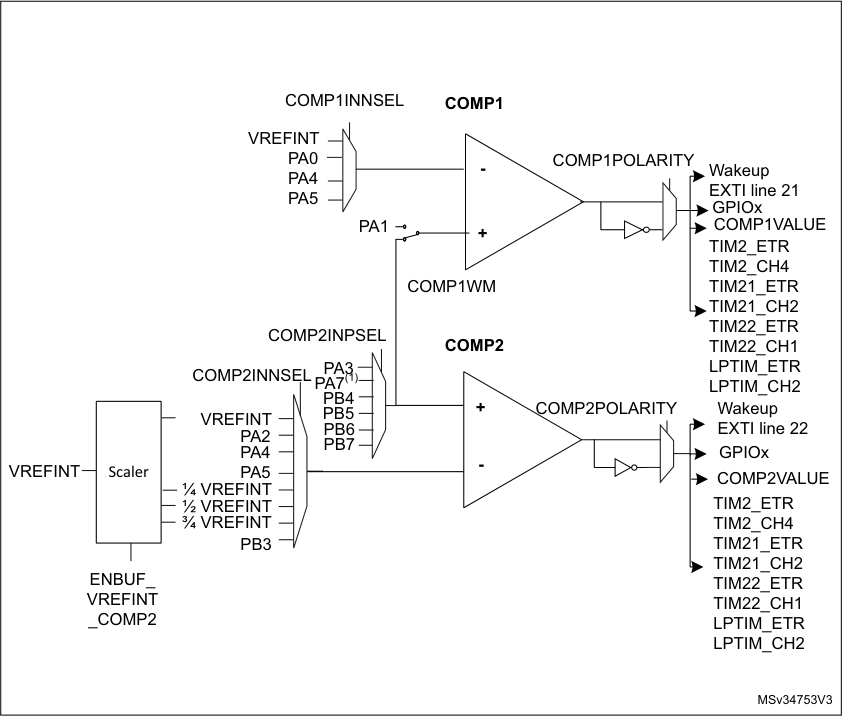

1. Available on category 1 devices only.

**14.3.2** **COMP pins and internal signals**

The I/Os used as comparators inputs must be configured in analog mode in the GPIOs
registers.

The comparator output can be connected to the I/Os using the alternate function channel
given in “Alternate function mapping” table in the datasheet.

The output can also be internally redirected to a variety of timer input for the following

purposes:

      - Input capture for timing measures

It is possible to have the comparator output simultaneously redirected internally and
externally.

330/905 RM0377 Rev 10

--- end of page=329 ---

**RM0377** **Comparator (COMP)**

**14.3.3** **COMP reset and clocks**

The COMP clock provided by the clock controller is synchronous with the PCLK (APB
clock).

There is no clock enable control bit provided in the RCC controller. Reset and clock enable
bits are common for COMP and SYSCFG.

**Important:** The polarity selection logic and the output redirection to the port works
independently from the _PCLK_ clock. This allows the comparator to work even in Stop mode.

**14.3.4** **Comparator LOCK mechanism**

The comparators can be used for safety purposes, such as over-current or thermal
protection. For applications having specific functional safety requirements, it is necessary to
insure that the comparator programming cannot be altered in case of spurious register
access or program counter corruption.

For this purpose, the comparator control and status registers can be write-protected (readonly).

Once the programming is completed, the COMPx LOCK bit can be set to 1. This causes the
whole COMPx_CSR register to become read-only, including the COMPx LOCK bit.

The write protection can only be reset by a MCU reset.

**14.3.5** **Power mode**

COMP2 power consumption versus propagation delay can be adjusted to have the optimum
trade-off for a given application.

COMP2_SPEED bit in the COMP2_CSR register can be programmed to provide either
higher speed/consumption or lower speed/consumption.

###### **14.4 COMP interrupts**

The comparator outputs are internally connected to the Extended interrupts and events
controller. Each comparator has its own EXTI line and can generate either interrupts or
events. The same mechanism is used to exit from low-power modes.

Refer to Interrupt and events section for more details.

###### **14.5 COMP registers**

**14.5.1** **Comparator 1 control and status register (COMP1_CSR)**

The COMP1_CSR is the Comparator1 control/status register. It contains all the bits /flags
related to comparator1.

Address offset: 0x18

System reset value: 0x0000 0000

RM0377 Rev 10 331/905

336

--- end of page=330 ---

**Comparator (COMP)** **RM0377**

|31|30|29|28|27|26|25|24|23|22|21|20|19|18|17|16|
|---|---|---|---|---|---|---|---|---|---|---|---|---|---|---|---|
|COMP1 LOCK|COMP1 VALUE|Res.|Res.|Res.|Res.|Res.|Res.|Res.|Res.|Res.|Res.|Res.|Res.|Res.|Res.|
|rs|r|||||||||||||||

|15|14|13|12|11|10|9|8|7|6|5 4|Col12|3|2|1|0|
|---|---|---|---|---|---|---|---|---|---|---|---|---|---|---|---|
|COMP1 POLARITY|Res.|Res.|COMP1 LPTIMIN1|Res.|Res.|Res.|COMP1 WM|Res.|Res.|COMP1INN SEL|COMP1INN SEL|Res.|Res.|Res.|COMP1 EN|
|rw|||rw||||rw|||rw|rw||||rw|

Bit 31 **COMP1LOCK:** COMP1_CSR register lock bit

This bit is set by software and cleared by a hardware system reset. It locks the whole
content of the comparator 1 control register, COMP1_CSR[31:0]
0: COMP1_CSR[31:0] for comparator 1 are read/write
1: COMP1_CSR[31:0] for comparator 1 are read-only

Bit 30 **COMP1VALUE:** Comparator 1 output status bit

This bit is read-only. It reflects the current comparator 1 output taking into account
COMP1POLARITY bit effect.

Bits 29:16 Reserved, must be kept at reset value

Bit 15 **COMP1POLARITY:** Comparator 1 polarity selection bit

This bit is set and cleared by software (only if COMP1LOCK not set). It inverts Comparator
1 polarity.
0: Comparator 1 output value not inverted
1: Comparator 1output value inverted

Bits 14:13 Reserved, must be kept at reset value

Bit 12 **COMP1LPTIMIN1:** Comparator 1 LPTIM input propagation bit

This bit is set and cleared by software (assuming COMP1LOCK not set). It sends
COMP1VALUE to LPTIM input 1.
0: Comparator 1 output gated
1: Comparator 1 output sent to LPTIM input 1

Bits 11:9 Reserved, must be kept at reset value

Bit 8 **COMP1WM** : Comparator 1 window mode selection bit

This bit is set and cleared by software (only if COMP1LOCK not set). It selects comparator
1 window mode where the Plus inputs of both comparators are connected together.
0: Plus input of comparator 1 connected to PA1.
1: Plus input of comparator 1 shorted with Plus input of comparator 2 (see COMP1_CSR).

Bits 7:6 Reserved, must be kept at reset value

332/905 RM0377 Rev 10

--- end of page=331 ---

**RM0377** **Comparator (COMP)**

Bits 5:4 **COMP1INNSEL** : Comparator 1 Input Minus connection configuration bit

These bits are set and cleared by software (only if COMP1LOCK not set). They select which
input is connected with the Input Minus of comparator 1

00: VREFINT

01: PA0

10: PA4

11: PA5

Bits 3:1 Reserved, must be kept at reset value

Bit 0 **COMP1EN:** Comparator 1 enable bit

This bit is set and cleared by software (only if COMP1LOCK not set). It switches
oncomparator1
0: Comparator 1 switched OFF.
1: Comparator 1 switched ON.

**14.5.2** **Comparator 2 control and status register (COMP2_CSR)**

The COMP2_CSR is the Comparator2 control/status register. It contains all the bits /flags
related to comparator2.

Address offset: 0x1C

System reset value: 0x0000 0000

|31|30|29|28|27|26|25|24|23|22|21|20|19|18|17|16|
|---|---|---|---|---|---|---|---|---|---|---|---|---|---|---|---|
|COMP2 LOCK|COMP2 VALUE|Res.|Res.|Res.|Res.|Res.|Res.|Res.|Res.|Res.|Res.|Res.|Res.|Res.|Res.|
|rs|r|||||||||||||||

|15|14|13|12|11|10 9 8|Col7|Col8|7|6 5 4|Col11|Col12|3|2|1|0|
|---|---|---|---|---|---|---|---|---|---|---|---|---|---|---|---|
|COMP2 POLARITY|Res.|COMP2 LPTIMIN1|COMP2 LPTIMIN2|Res.|COMP2INPSEL|COMP2INPSEL|COMP2INPSEL|Res.|COMP2INNSEL|COMP2INNSEL|COMP2INNSEL|COMP2 SPEED|Res.|Res.|COMP2 EN|
|rw||rw|rw||rw|rw|rw||rw|rw|rw|rw|||rw|

Bit 31 **COMP2LOCK:** COMP2_CSR register lock bit

This bit is set by software and cleared by a hardware system reset. It locks the whole
content of the comparator 2 control register, COMP2_CSR[31:0]
0: COMP2_CSR[31:0] for comparator 1 are read/write
1: COMP2_CSR[31:0] for comparator 1 are read-only

Bit 30 **COMP2VALUE:** Comparator 2 output status bit

This bit is read-only. It reflects the current comparator 2 output taking into account
COMP2POLARITY bit effect.

Bits 29:16 Reserved, must be kept at reset value

Bit 15 **COMP2POLARITY:** Comparator 2 polarity selection bit

This bit is set and cleared by software (only if COMP2LOCK not set). It inverts Comparator
1 polarity.
0: Comparator 2 output value not inverted
1: Comparator 2 output value inverted

Bit 14 Reserved, must be kept at reset value

RM0377 Rev 10 333/905

336

--- end of page=332 ---

**Comparator (COMP)** **RM0377**

Bit 13 **COMP2LPTIMIN1:** Comparator 2 LPTIM input 1 propagation bit

This bit is set and cleared by software (assuming COMP2LOCK not set). It sends
COMP2VALUE to LPTIM input 1.
0: Comparator 2 output gated
1: Comparator 2 output sent to LPTIM input 1

Note: COMP2LPTIMIN1 and COMP2LPTIMIN2 cannot both be set to ‘1’.

Bit 12 **COMP2LPTIMIN2:** Comparator 2 LPTIM input 2 propagation bit

This bit is set and cleared by software (assuming COMP2LOCK not set). It sends
COMP2VALUE to LPTIM input 2.
0: Comparator 2 output gated
1: Comparator 2 output sent to LPTIM input 2

_Note: COMP2LPTIMIN1 and COMP2LPTIMIN2 cannot both be set to ‘1’._

Bit 11 Reserved, must be kept at reset value

Bits 10:8 **COMP2INPSEL** : Comparator 2 Input Plus connection configuration bit

These bits are set and cleared by software (only if COMP2LOCK not set). They select which
input is connected with the Input Plus of comparator 2

000: PA3

001: PB4

010: PB5

011: PB6

100: PB7

101: PA7 (for category 1 devices only)

Others: Reserved.

Bit 7 Reserved, must be kept at reset value

Bits 6:4 **COMP2INNSEL** : Comparator 2 Input Minus connection configuration bit

These bits are set and cleared by software (only if COMP2LOCK not set). They select which
input is connected with the Input Minus of comparator 2.

000: VREFINT

001: PA2

010: PA4

011: PA5

100: 1/4 VREFINT

101: 1/2 VREFINT

110: 3/4 VREFINT

111: PB3

_Note: If VREFINT or a fraction of VREFINT (using the scaler) is selected, then EN_VREFINT_
_bit must be set in the SYSCFG_CFGR3 register (see Section 9.2.3: Reference control_
_and status register (SYSCFG_CFGR3))._

334/905 RM0377 Rev 10

--- end of page=333 ---

**RM0377** **Comparator (COMP)**

Bit 3 **COMP2SPEED:** Comparator 2 power mode selection bit

This bit is set and cleared by software (only if COMP2LOCK not set). It selects comparator
2 power mode.
0: slow speed
1: fast speed

Bits 2:1 Reserved, must be kept at reset value

Bit 0 **COMP2EN:** Comparator 2 enable bit

This bit is set and cleared by software (only if COMP2LOCK not set). It switches
oncomparator2.
0: Comparator 2 switched off.
1: Comparator 2 switched ON.

RM0377 Rev 10 335/905

336

--- end of page=334 ---

**Comparator (COMP)** **RM0377**

**14.5.3** **COMP register map**

The following table summarizes the comparator registers.

**Table 67. COMP register map and reset values**

|Offset|Register|31|30|29|28|27|26|25|24|23|22|21|20|19|18|17|16|15|14|13|12|11|10|9|8|7|6|5|4|3|2|1|0|
|---|---|---|---|---|---|---|---|---|---|---|---|---|---|---|---|---|---|---|---|---|---|---|---|---|---|---|---|---|---|---|---|---|---|
|0x18|**COMP1_CSR**|COMP1LOCK|COMP1VALUE|Res.|Res.|Res.|Res.|Res.|Res.|Res.|Res.|Res.|Res.|Res.|Res.|Res.|Res.|COMP1POLARITY|Res.|Res.|COMP1LPTIMIN1|Res.|Res.|Res.|COMP1WM|Res.|Res.|COMP1INNSEL|COMP1INNSEL|Res.|Res.|Res.|COMP1EN|
|0x18|Reset value|0|0|||||||||||||||0|||0||||0|||0|0||||0|
|0x1C|**COMP2_CSR**|COMP2LOCK|COMP2VALUE|Res.|Res.|Res.|Res.|Res.|Res.|Res.|Res.|Res.|Res.|Res.|Res.|Res.|Res.|COMP2POLARITY|Res.|COMP2LPTIMIN1|COMP2LPTIMIN2|Res.|COMP2INPSEL|COMP2INPSEL|COMP2INPSEL|Res.|COMP2INNSEL|COMP2INNSEL|COMP2INNSEL|COMP2SPEED|Res.|Res.|COMP2EN|
|0x1C|Reset value|0|0|||||||||||||||0||0|0||0|0|0||0|0|0|0|||0|

Refer to _Section 2.2 on page 51_ for the register boundary addresses.

336/905 RM0377 Rev 10

--- end of page=335 ---

**RM0377** **AES hardware accelerator (AES)**

#### **15 AES hardware accelerator (AES)**

###### **15.1 Introduction**

The AES hardware accelerator (AES) encrypts or decrypts data, using an algorithm and
implementation fully compliant with the advanced encryption standard (AES) defined in
Federal information processing standards (FIPS) publication 197.

Multiple chaining modes are supported (ECB, CBC, CTR), for key size of 128 bits.

The AES accelerator is a 32-bit AHB peripheral. It supports DMA single transfers for
incoming and outgoing data (two DMA channels required).

The AES peripheral provides hardware acceleration to AES cryptographic algorithms
packaged in STM32 cryptographic library.

AES is an AMBA AHB slave peripheral, accessible through 32-bit word single accesses only
(otherwise an AHB bus error is generated and write accesses are ignored).

###### **15.2 AES main features**

      - Compliance with NIST _“Advanced encryption standard (AES)_, _FIPS publication 197_ ”
from November 2001

      - 128-bit data block processing

      - Support for cipher key length of 128-bit

      - Encryption and decryption with multiple chaining modes:

–
Electronic codebook (ECB) mode

–
Cipher block chaining (CBC) mode

–
Counter (CTR) mode

      - 213 clock cycle latency for processing one 128-bit block of data

      - Integrated key scheduler with its key derivation stage (ECB or CBC decryption only)

      - AMBA AHB slave peripheral, accessible through 32-bit word single accesses only

      - 128-bit register for storing the cryptographic key (four 32-bit registers)

      - 128-bit register for storing initialization vector (four 32-bit registers)

–
Used for the initialization vector when AES is configured in CBC mode or for the
32-bit counter initialization when CTR mode is selected

      - 32-bit buffer for data input and output

      - Automatic data flow control with support of single-transfer direct memory access (DMA)
using two channels (one for incoming data, one for processed data)

      - Data-swapping logic to support 1-, 8-, 16- or 32-bit data

RM0377 Rev 10 337/905

370

--- end of page=336 ---

**AES hardware accelerator (AES)** **RM0377**

###### **15.3 AES implementation**

The device has a single instance of AES peripheral.

###### **15.4 AES functional description**

**15.4.1** **AES block diagram**

_Figure 57_ shows the block diagram of AES.

**Figure 57. AES block diagram**

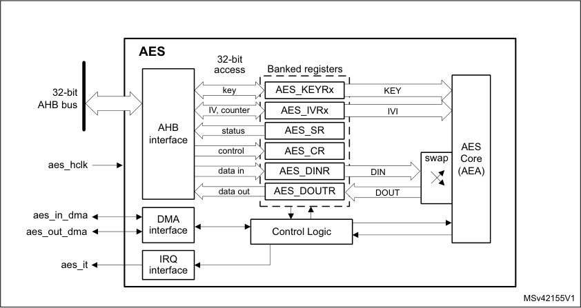

|Col1|Banked registers|Col3|Col4|Col5|Col6|
|---|---|---|---|---|---|
||AES_KEYRx AES_IVRx|AES_KEYRx AES_IVRx|AES_KEYRx AES_IVRx|AES_KEYRx AES_IVRx|AES_KEYRx AES_IVRx|
||AES_KEYRx AES_IVRx|AES_KEYRx||||
||AES_KEYRx AES_IVRx|AES_IVRx||||
|||AES_SR||||
|control||AES_CR|AES_CR|AES_CR|AES_CR|
|data in|data in|AES_DINR||||
|data in||AES_DOUTR||DOUT|DOUT|

**15.4.2** **AES internal signals**

_Table 68_ describes the user relevant internal signals interfacing the AES peripheral.

**Table 68. AES internal input/output signals**

|Signal name|Signal type|Description|
|---|---|---|
|aes_hclk|digital input|AHB bus clock|
|aes_it|digital output|AES interrupt request|
|aes_in_dma|digital input/output|Input DMA single request/acknowledge|
|aes_out_dma|digital input/output|Output DMA single request/acknowledge|

338/905 RM0377 Rev 10

--- end of page=337 ---

**RM0377** **AES hardware accelerator (AES)**

**15.4.3** **AES cryptographic core**

**Overview**

The AES cryptographic core consists of the following components:

      - AES algorithm (AEA)

      - key input

      - initialization vector (IV) input

The AES core works on 128-bit data blocks (four words) with 128-bit key length. Depending
on the chaining mode, the AES requires zero or one 96-bit initialization vector IV (and a 32bit counter field).

The AES features the following modes of operation:

      - **Mode 1:**

Plaintext encryption using a key stored in the AES_KEYRx registers

      - **Mode 2:**

ECB or CBC decryption key preparation. It must be used prior to selecting Mode 3 with
ECB or CBC chaining modes. The key prepared for decryption is stored automatically
in the AES_KEYRx registers. Now the AES peripheral is ready to switch to Mode 3 for
executing data decryption.

      - **Mode 3:**

Ciphertext decryption using a key stored in the AES_KEYRx registers. When ECB and
CBC chaining modes are selected, the key must be prepared beforehand, through
Mode 2.

      - Mode 4:

ECB or CBC ciphertext single decryption using the key stored in the AES_KEYRx
registers (the initial key is derived automatically).

_Note:_ _Mode 2 and mode 4 are only used when performing ECB and CBC decryption._

_When Mode 4 is selected only one decryption can be done, therefore usage of Mode 2 and_
_Mode 3 is recommended instead._

The operating mode is selected by programming the MODE[1:0] bitfield of the AES_CR
register. It may be done only when the AES peripheral is disabled.

**Typical data processing**

Typical usage of the AES is described in _Section 15.4.4: AES procedure to perform a cipher_
_operation on page 342_ .

_Note:_ _The outputs of the intermediate AEA stages are never revealed outside the cryptographic_
_boundary, with the exclusion of the IVI bitfield._

**Chaining modes**

The following chaining modes are supported by AES, selected through the CHMOD[1:0]
bitfield of the AES_CR register:

      - Electronic code book (ECB)

      - Cipher block chaining (CBC)

      - Counter (CTR)

RM0377 Rev 10 339/905

370

--- end of page=338 ---

**AES hardware accelerator (AES)** **RM0377**

_Note:_ _The chaining mode may be changed only when AES is disabled (bit EN of the AES_CR_
_register set)._

Principle of each AES chaining mode is provided in the following subsections.

Detailed information is in dedicated sections, starting from _Section 15.4.8: AES basic_
_chaining modes (ECB, CBC)_ .

**Electronic codebook (ECB) mode**

**Figure 58. ECB encryption and decryption principle**

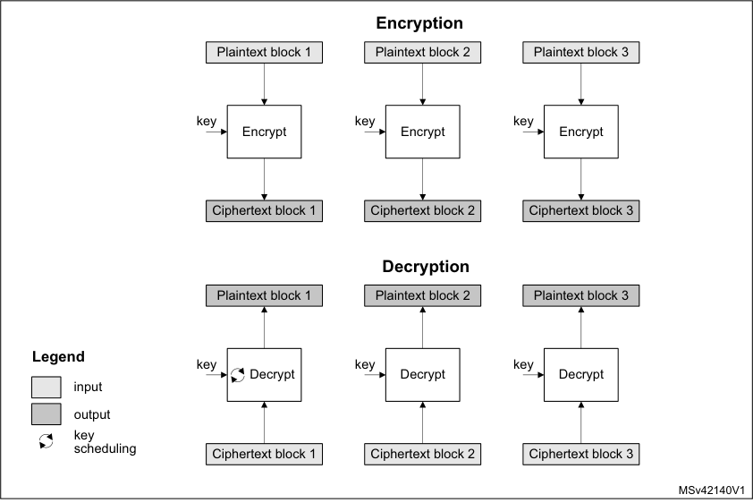

ECB is the simplest mode of operation. There are no chaining operations, and no special
initialization stage. The message is divided into blocks and each block is encrypted or
decrypted separately.

_Note:_ _For decryption, a special key scheduling is required before processing the first block._

340/905 RM0377 Rev 10

--- end of page=339 ---

**RM0377** **AES hardware accelerator (AES)**

**Cipher block chaining (CBC) mode**

**Figure 59. CBC encryption and decryption principle**

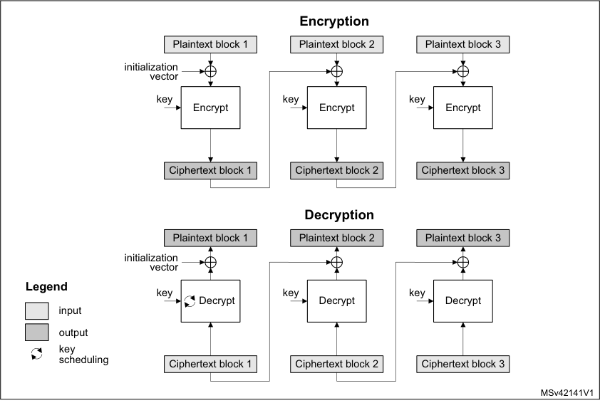

In CBC mode the output of each block chains with the input of the following block. To make
each message unique, an initialization vector is used during the first block processing.

_Note:_ _For decryption, a special key scheduling is required before processing the first block._

RM0377 Rev 10 341/905

370

--- end of page=340 ---

**AES hardware accelerator (AES)** **RM0377**

**Counter (CTR) mode**

**Figure 60. CTR encryption and decryption principle**

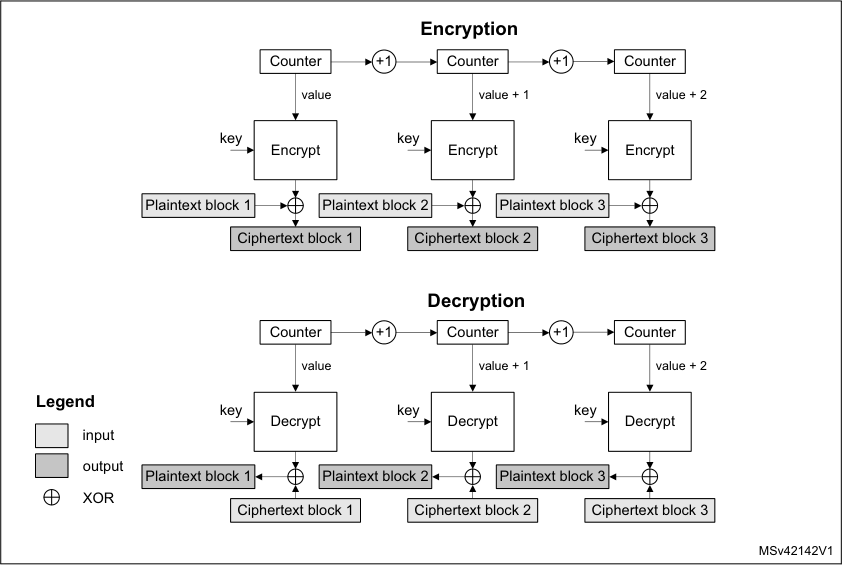

The CTR mode uses the AES core to generate a key stream. The keys are then XORed
with the plaintext to obtain the ciphertext as specified in NIST _Special Publication 800-38A,_
_Recommendation for Block Cipher Modes of Operation_ .

_Note:_ _Unlike with ECB and CBC modes, no key scheduling is required for the CTR decryption,_
_since in this chaining scheme the AES core is always used in encryption mode for producing_
_the key stream, or counter blocks._

**15.4.4** **AES procedure to perform a cipher operation**

**Introduction**

A typical cipher operation is explained below. Detailed information is provided in sections
starting from _Section 15.4.8: AES basic chaining modes (ECB, CBC)_ .

The flowcharts shown in _Figure 61_ describe the way STM32 cryptographic library
implements the AES algorithm. AES accelerates the execution of the AES-128
cryptographic algorithm in ECB, CBC, and CTR operating modes.

_Note:_ _For more details on the cryptographic library, refer to the UM1924 user manual “STM32_
_crypto library” available from www.st.com._

342/905 RM0377 Rev 10

--- end of page=341 ---

**RM0377** **AES hardware accelerator (AES)**

**Figure 61. STM32 cryptolib AES flowchart example**

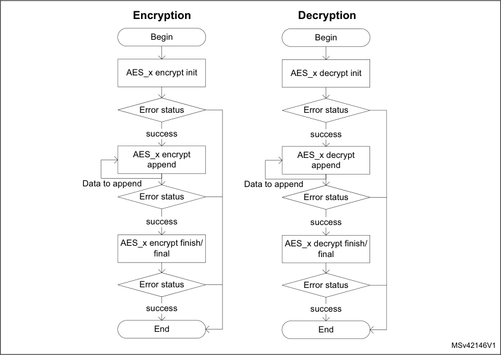

**Initialization of AES**

To initialize AES, first disable it by clearing the EN bit of the AES_CR register. Then perform
the following steps in any order:

- Configure the AES mode, by programming the MODE[1:0] bitfield of the AES_CR
register.

–
For encryption, Mode 1 must be selected (MODE[1:0] = 00).

–
For decryption, Mode 3 must be selected (MODE[1:0] = 10), unless ECB or CBC
chaining modes are used. In this latter case, an initial key derivation of the
encryption key must be performed, as described in _Section 15.4.5: AES_
_decryption key preparation_ .

- Select the chaining mode, by programming the CHMOD[1:0] bitfield of the AES_CR
register

- Write a symmetric key into the AES_KEYRx registers .

- Configure the data type (1-, 8-, 16- or 32-bit), with the DATATYPE[1:0] bitfield in the
AES_CR register.

- When it is required (for example in CBC or CTR chaining modes), write the initialization
vectors into the AES_IVRx register.

**Data append**

This section describes different ways of appending data for processing, where the size of
data to process is not a multiple of 128 bits.

RM0377 Rev 10 343/905

370

--- end of page=342 ---

**AES hardware accelerator (AES)** **RM0377**

For ECB or CBC mode, refer to _Section 15.4.6: AES ciphertext stealing and data padding_ .
The second-last and the last block management in these cases is more complex than in the
sequence described in this section.

**Data append through polling**

This method uses flag polling to control the data append.

For all other cases, the data is appended through the following sequence:

1. Enable the AES peripheral by setting the EN bit of the AES_CR register.

2. Repeat the following sub-sequence until the payload is entirely processed:

a) Write four input data words into the AES_DINR register.

b) Wait until the status flag CCF is set in the AES_SR, then read the four data words
from the AES_DOUTR register.

c) Clear the CCF flag, by setting the CCFC bit of the AES_CR register.

d) If the data block just processed is the second-last block of the message and the
significant data in the last block to process is inferior to 128 bits, pad the
remainder of the last block with zeros

3. Discard the data that is not part of the payload, then disable the AES peripheral by
clearing the EN bit of the AES_CR register.

_Note:_ _Up to three wait cycles are automatically inserted between two consecutive writes to the_
_AES_DINR register, to allow sending the key to the AES processor._

**Data append using interrupt**

The method uses interrupt from the AES peripheral to control the data append, through the
following sequence:

1. Enable interrupts from AES by setting the CCFIE bit of the AES_CR register.

2. Enable the AES peripheral by setting the EN bit of the AES_CR register.

3. Write first four input data words into the AES_DINR register.

4. Handle the data in the AES interrupt service routine, upon interrupt:

a) Read four output data words from the AES_DOUTR register.

b) Clear the CCF flag and thus the pending interrupt, by setting the CCFC bit of the
AES_CR register

c) If the data block just processed is the second-last block of an message and the
significant data in the last block to process is inferior to 128 bits, pad the
remainder of the last block with zeros. Then proceed with point 4e).

d) If the data block just processed is the last block of the message, discard the data
that is not part of the payload, then disable the AES peripheral by clearing the EN
bit of the AES_CR register and quit the interrupt service routine.

e) Write next four input data words into the AES_DINR register and quit the interrupt
service routine.

_Note:_ _AES is tolerant of delays between consecutive read or write operations, which allows, for_
_example, an interrupt from another peripheral to be served between two AES computations._

**Data append using DMA**

With this method, all the transfers and processing are managed by DMA and AES. To use
the method, proceed as follows:

344/905 RM0377 Rev 10

--- end of page=343 ---

**RM0377** **AES hardware accelerator (AES)**

1. Prepare the last four-word data block (if the data to process does not fill it completely),
by padding the remainder of the block with zeros.

2. Configure the DMA controller so as to transfer the data to process from the memory to
the AES peripheral input and the processed data from the AES peripheral output to the
memory, as described in _Section 15.4.13: AES DMA interface_ . Configure the DMA
controller so as to generate an interrupt on transfer completion.

3. Enable the AES peripheral by setting the EN bit of the AES_CR register

4. Enable DMA requests by setting the DMAINEN and DMAOUTEN bits of the AES_CR
register.

5. Upon DMA interrupt indicating the transfer completion, get the AES-processed data
from the memory.

_Note:_ _The CCF flag has no use with this method, because the reading of the AES_DOUTR_
_register is managed by DMA automatically, without any software action, at the end of the_
_computation phase._

**15.4.5** **AES decryption key preparation**

For an ECB or CBC decryption, a key for the first round of decryption must be derived from
the key of the last round of encryption. This is why a complete key schedule of encryption is
required before performing the decryption. This key preparation is **not required** for AES
decryption in modes other than ECB or CBC.

Recommended method is to select the Mode 2 by setting to 01 the MODE[1:0] bitfield of the
AES_CR (key process only), then proceed with the decryption by setting MODE[1:0] to 10
(Mode 3, decryption only). Mode 2 usage is described below:

1. Disable the AES peripheral by clearing the EN bit of the AES_CR register.

2. Select Mode 2 by setting to 01 the MODE[1:0] bitfield of the AES_CR. The
CHMOD[1:0] bitfield is not significant in this case because this key derivation mode is
independent of the chaining algorithm selected.

3. Write the AES_KEYRx registers (128bits) with encryption key, as shown in _Figure 62_ .
Writes to the AES_IVRx registers have no effect.

4. Enable the AES peripheral, by setting the EN bit of the AES_CR register.

5. Wait until the CCF flag is set in the AES_SR register.

6. Derived key is available in AES core, ready to use for decryption. Application can also
read the AES_KEYRx register to obtain the derived key if needed, as shown in
_Figure 62_ (the processed key is loaded automatically into the AES_KEYRx registers).

_Note:_ _The AES is disabled by hardware when the derivation key is available._

_To restart a derivation key computation, repeat steps 3, 4, 5 and 6 ._

RM0377 Rev 10 345/905

370

--- end of page=344 ---

**AES hardware accelerator (AES)** **RM0377**

**Figure 62. Encryption key derivation for ECB/CBC decryption (Mode 2)**

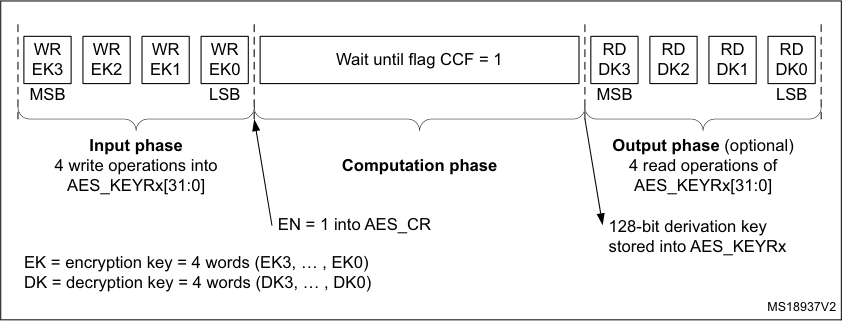

If the software stores the initial key prepared for decryption, it is enough to do the key
schedule operation only once for all the data to be decrypted with a given cipher key.

_Note:_ _Alternative key preparation is to select Mode 4 by setting to 11 the MODE[1:0] bitfield of the_
_AES_CR register. In this case Mode 3 cannot be used._

**15.4.6** **AES ciphertext stealing and data padding**

When using AES in ECB or CBC modes to manage messages the size of which is not a
multiple of the block size (128 bits), ciphertext stealing techniques are used, such as those
described in NIST _Special Publication 800-38A, Recommendation for Block Cipher Modes_
_of Operation: Three Variants of Ciphertext Stealing for CBC Mode_ . Since the AES peripheral
on the device does not support such techniques, **the last two blocks** of input data must be
handled in a special way by the application.

_Note:_ _Ciphertext stealing techniques are not documented in this reference manual._

Similarly, when AES is used in other modes than ECB or CBC, an incomplete input data
block (that is, block with input data shorter than 128 bits) must be padded with zeros prior to
encryption (that is, extra bits must be appended to the trailing end of the data string). After
decryption, the extra bits must be discarded. As AES does not implement automatic data
padding operation to **the last block**, the application must follow the recommendation given
in _Section 15.4.4: AES procedure to perform a cipher operation on page 342_ to manage
messages the size of which is not a multiple of 128 bits.

_Note:_ _Padding data are swapped in a similar way as normal data, according to the_
_DATATYPE[1:0] field of the AES_CR register (see Section 15.4.10: AES data registers and_
_data swapping on page 355 for details)._

**15.4.7** **AES task suspend and resume**

A message can be suspended if another message with a higher priority must be processed.
When this highest priority message is sent, the suspended message can resume in both
encryption or decryption mode.

Suspend/resume operations do not break the chaining operation and the message
processing can resume as soon as AES is enabled again to receive the next data block.

_Figure 63_ gives an example of suspend/resume operation: Message 1 is suspended in
order to send a shorter and higher-priority Message 2.

346/905 RM0377 Rev 10

--- end of page=345 ---

**RM0377** **AES hardware accelerator (AES)**

**Figure 63. Example of suspend mode management**

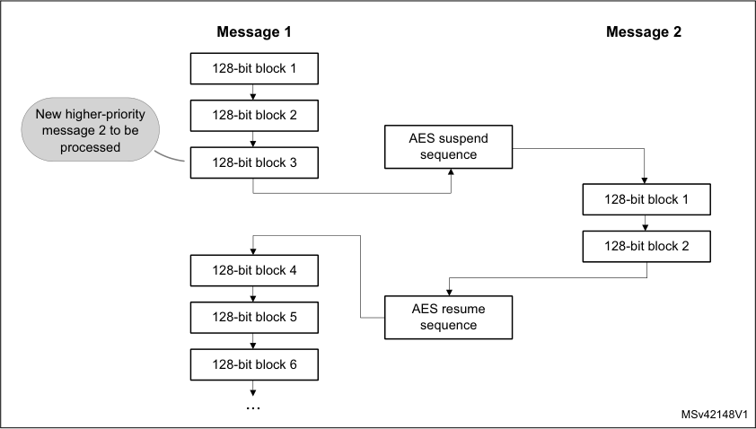

A detailed description of suspend/resume operations is in the sections dedicated to each
AES mode.

**15.4.8** **AES basic chaining modes (ECB, CBC)**

**Overview**

This section gives a brief explanation of the four basic operation modes provided by the
AES computing core: ECB encryption, ECB decryption, CBC encryption and CBC
decryption. For detailed information, refer to the FIPS publication 197 from November 26,
2001.

_Figure 64_ illustrates the electronic codebook (ECB) encryption.

**Figure 64. ECB encryption**

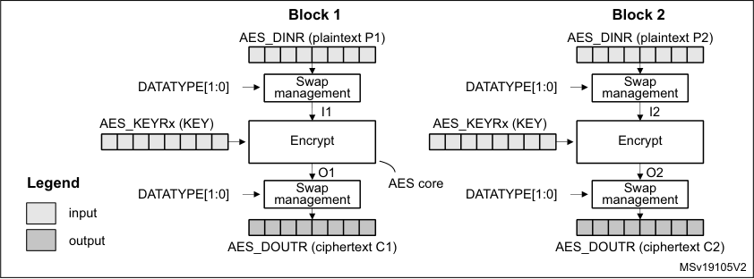

In ECB encrypt mode, the 128-bit plaintext input data block Px in the AES_DINR register
first goes through bit/byte/half-word swapping. The swap result Ix is processed with the AES
core set in encrypt mode, using a 128--bit key. The encryption result Ox goes through
bit/byte/half-word swapping, then is stored in the AES_DOUTR register as 128-bit ciphertext

RM0377 Rev 10 347/905

370

--- end of page=346 ---

**AES hardware accelerator (AES)** **RM0377**

output data block Cx. The ECB encryption continues in this way until the last complete
plaintext block is encrypted.

_Figure 65_ illustrates the electronic codebook (ECB) decryption.

**Figure 65. ECB decryption**

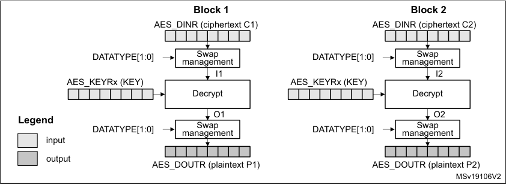

To perform an AES decryption in the ECB mode, the secret key has to be prepared by
collecting the last-round encryption key (which requires to first execute the complete key
schedule for encryption), and using it as the first-round key for the decryption of the
ciphertext. This preparation is supported by the AES core.

In ECB decrypt mode, the 128-bit ciphertext input data block C1 in the AES_DINR register
first goes through bit/byte/half-word swapping. The keying sequence is reversed compared
to that of the ECB encryption. The swap result I1 is processed with the AES core set in
decrypt mode, using the formerly prepared decryption key. The decryption result goes
through bit/byte/half-word swapping, then is stored in the AES_DOUTR register as 128-bit
plaintext output data block P1. The ECB decryption continues in this way until the last
complete ciphertext block is decrypted.

_Figure 66_ illustrates the cipher block chaining (CBC) encryption mode.

**Figure 66. CBC encryption**

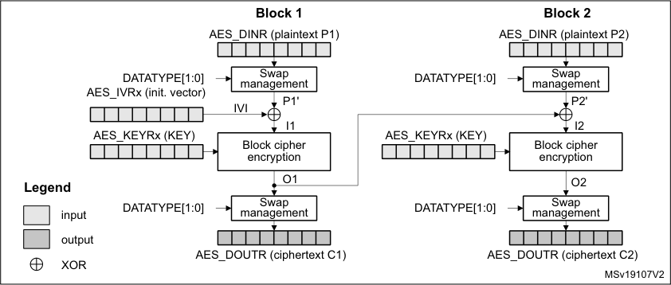

In CBC encrypt mode, the first plaintext input block, after bit/byte/half-word swapping (P1’),
is XOR-ed with a 128-bit IVI bitfield (initialization vector and counter), producing the I1 input
data for encrypt with the AES core, using a 128- key. The resulting 128-bit output block O1,
after swapping operation, is used as ciphertext C1. The O1 data is then XOR-ed with the

348/905 RM0377 Rev 10

--- end of page=347 ---

**RM0377** **AES hardware accelerator (AES)**

second-block plaintext data P2’ to produce the I2 input data for the AES core to produce the
second block of ciphertext data. The chaining of data blocks continues in this way until the
last plaintext block in the message is encrypted.

If the message size is not a multiple of 128 bits, the final partial data block is encrypted in
the way explained in _Section 15.4.6: AES ciphertext stealing and data padding_ .

_Figure 67_ illustrates the cipher block chaining (CBC) decryption mode.

**Figure 67. CBC decryption**

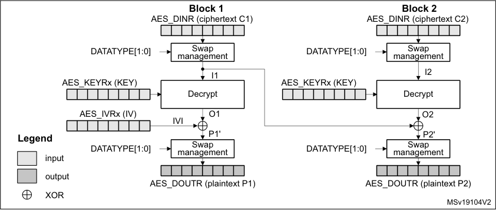

In CBC decrypt mode, like in ECB decrypt mode, the secret key must be prepared to
perform an AES decryption.

After the key preparation process, the decryption goes as follows: the first 128-bit ciphertext
block (after the swap operation) is used directly as the AES core input block I1 for decrypt
operation, using the 128-bit key. Its output O1 is XOR-ed with the 128-bit IVI field (that must
be identical to that used during encryption) to produce the first plaintext block P1.

The second ciphertext block is processed in the same way as the first block, except that the
I1 data from the first block is used in place of the initialization vector.

The decryption continues in this way until the last complete ciphertext block is decrypted.

If the message size is not a multiple of 128 bits, the final partial data block is decrypted in
the way explained in _Section 15.4.6: AES ciphertext stealing and data padding_ .

For more information on data swapping, refer to _Section 15.4.10: AES data registers and_
_data swapping_ .

RM0377 Rev 10 349/905

370

--- end of page=348 ---

**AES hardware accelerator (AES)** **RM0377**

**ECB/CBC encryption sequence**

The sequence of events to perform an ECB/CBC encryption (more detail in _Section 15.4.4_ ):

1. Disable the AES peripheral by clearing the EN bit of the AES_CR register.

2. Select the Mode 1 by to 00 the MODE[1:0] bitfield of the AES_CR register and select
ECB or CBC chaining mode by setting the CHMOD[1:0] bitfield of the AES_CR register
to 00 or 01, respectively. Data type can also be defined, using DATATYPE[1:0] bitfield.

3. Write the AES_KEYRx registers (128 bits) with encryption key. Fill the AES_IVRx
registers with the initialization vector data if CBC mode has been selected.

4. Enable the AES peripheral by setting the EN bit of the AES_CR register.

5. Write the AES_DINR register four times to input the plaintext (MSB first), as shown in
_Figure 68_ .

6. Wait until the CCF flag is set in the AES_SR register.

7. Read the AES_DOUTR register four times to get the ciphertext (MSB first) as shown in
_Figure 68_ . Then clear the CCF flag by setting the CCFC bit of the AES_CR register.

8. Repeat steps 5,6,7to process all the blocks with the same encryption key.

**Figure 68. ECB/CBC encryption (Mode 1)**

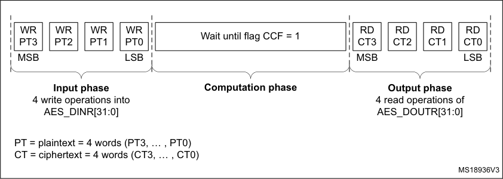

**ECB/CBC decryption sequence**

The sequence of events to perform an AES ECB/CBC decryption is as follows (more detail
in _Section 15.4.4_ ):

1. Follow the steps described in _Section 15.4.5: AES decryption key preparation on_
_page 345_, in order to prepare the decryption key in AES core.

2. Disable the AES peripheral by clearing the EN bit of the AES_CR register.

3. Select the Mode 3 by setting to 10 the MODE[1:0] bitfield of the AES_CR register and
select ECB or CBC chaining mode by setting the CHMOD[1:0] bitfield of the AES_CR
register to 00 or 01, respectively. Data type can also be defined, using DATATYPE[1:0]
bitfield.

4. Write the AES_IVRx registers with the initialization vector (required in CBC mode only).

5. Enable AES by setting the EN bit of the AES_CR register.

6. Write the AES_DINR register four times to input the cipher text (MSB first), as shown in
_Figure 69_ .

7. Wait until the CCF flag is set in the AES_SR register.

8. Read the AES_DOUTR register four times to get the plain text (MSB first), as shown in
_Figure 69_ . Then clear the CCF flag by setting the CCFC bit of the AES_CR register.

350/905 RM0377 Rev 10

--- end of page=349 ---

