# RM0377 STM32L0x1 — Pages 351–400

**RM0377** **AES hardware accelerator (AES)**

9. Repeat steps 6,7,8 to process all the blocks encrypted with the same key.

**Figure 69. ECB/CBC decryption (Mode 3)**

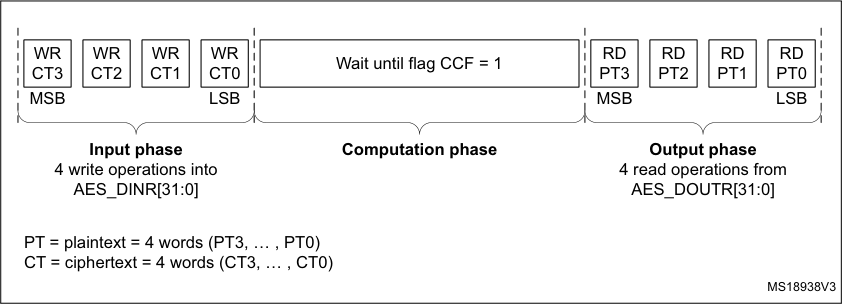

**Suspend/resume operations in ECB/CBC modes**

**To suspend the processing of a message**, proceed as follows:

1. If DMA is used, stop the AES DMA transfers to the IN FIFO by clearing the DMAINEN
bit of the AES_CR register.

2. If DMA is not used, read four times the AES_DOUTR register to save the last
processed block. If DMA is used, wait until the CCF flag is set in the AES_SR register
then stop the DMA transfers from the OUT FIFO by clearing the DMAOUTEN bit of the
AES_CR register.

3. If DMA is not used, poll the CCF flag of the AES_SR register until it becomes 1
(computation completed).

4. Clear the CCF flag by setting the CCFC bit of the AES_CR register.

5. Save initialization vector registers (only required in CBC mode as AES_IVRx registers
are altered during the data processing).

6. Disable the AES peripheral by clearing the bit EN of the AES_CR register.

7. Save the current AES configuration in the memory (except AES initialization vector
values).

8. If DMA is used, save the DMA controller status (pointers for IN and OUT data transfers,
number of remaining bytes, and so on).

_Note:_ _In point 7, the derived key information stored in AES_KEYRx registers can optionally be_
_saved in memory if the interrupted process is a decryption. Otherwise those registers do not_
_need to be saved as the original key value is known by the application_

RM0377 Rev 10 351/905

370

--- end of page=350 ---

**AES hardware accelerator (AES)** **RM0377**

**To resume the processing of a message**, proceed as follows:

1. If DMA is used, configure the DMA controller so as to complete the rest of the FIFO IN
and FIFO OUT transfers.

2. Ensure that AES is disabled (the EN bit of the AES_CR must be 0).

3. Restore the AES_CR and AES_KEYRx register setting, using the values of the saved
configuration. In case of decryption, derived key information can be written in
AES_KEYRx register instead of the original key value.

4. Prepare the decryption key as described in _Section 15.4.5: AES decryption key_
_preparation_ (only required for ECB or CBC decryption). This step is not necessary if
derived key information has been loaded in AES_KEYRx registers.

5. Restore AES_IVRx registers using the saved configuration (only required in CBC
mode).

6. Enable the AES peripheral by setting the EN bit of the AES_CR register.

7. If DMA is used, enable AES DMA transfers by setting the DMAINEN and DMAOUTEN
bits of the AES_CR register.

**Alternative single ECB/CBC decryption using Mode 4**

The sequence of events to perform a single round of ECB/CBC decryption using Mode 4 is:

1. Disable the AES peripheral by clearing the EN bit of the AES_CR register.

2. Select the Mode 4 by setting to 11 the MODE[1:0] bitfield of the AES_CR register and
select ECB or CBC chaining mode by setting the CHMOD[21:0] bitfield of the AES_CR
register to 000 or 001, respectively.

3. Select key length of 128 or 256 bits via KEYSIZE bitfield of the AES_CR register.

4. Write the AES_KEYRx registers with the encryption key. Write the AES_IVRx registers
if the CBC mode is selected.

5. Enable the AES peripheral by setting the EN bit of the AES_CR register.

6. Write the AES_DINR register four times to input the cipher text (MSB first).

7. Wait until the CCF flag is set in the AES_SR register.

8. Read the AES_DOUTR register four times to get the plain text (MSB first). Then clear
the CCF flag by setting the CCFC bit of the AES_CR register.

_Note:_ _When mode 4 is selected mode 3 cannot be used._

_In mode 4, the AES_KEYRx registers contain the encryption key during all phases of the_
_processing. No derivation key is stored in these registers. It is stored internally in AES._

**15.4.9** **AES counter (CTR) mode**

**Overview**

The counter mode (CTR) uses AES as a key-stream generator. The generated keys are
then XOR-ed with the plaintext to obtain the ciphertext.

CTR chaining is defined in NIST _Special Publication 800-38A, Recommendation for Block_
_Cipher Modes of Operation._ A typical message construction in CTR mode is given in
_Figure 70_ .

352/905 RM0377 Rev 10

--- end of page=351 ---

**RM0377** **AES hardware accelerator (AES)**

**Figure 70. Message construction in CTR mode**

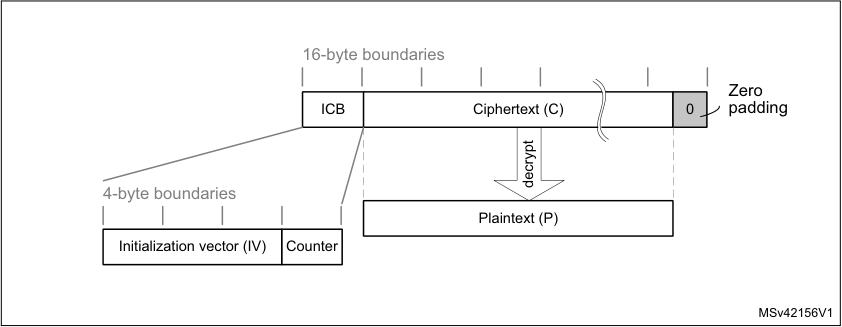

|ICB|Ciphertext (C)|0|
|---|---|---|
|ICB|decrypt|decrypt|
|ICB|Plaintext (P)|Plaintext (P)|

The structure of this message is:

- A 16-byte initial counter block (ICB), composed of two distinct fields:

– **Initialization vector** (IV): a 96-bit value that must be unique for each encryption
cycle with a given key.

– **Counter** : a 32-bit big-endian integer that is incremented each time a block
processing is completed. The initial value of the counter should be set to 1.

- The plaintext P is encrypted as ciphertext C, with a known length. This length can be
non-multiple of 16 bytes, in which case a plaintext padding is required.

**CTR encryption and decryption**

_Figure 71_ and _Figure 72_ describe the CTR encryption and decryption process, respectively,
as implemented in the AES peripheral. The CTR mode is selected by writing 10 to the
CHMOD[1:0] bitfield of AES_CR register.

**Figure 71. CTR encryption**

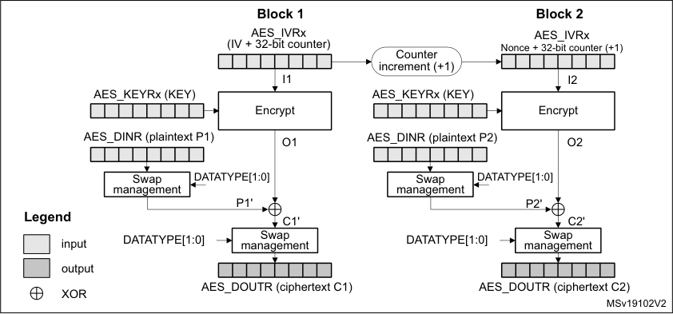

RM0377 Rev 10 353/905

370

--- end of page=352 ---

**AES hardware accelerator (AES)** **RM0377**

**Figure 72. CTR decryption**

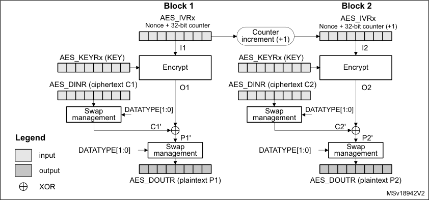

In CTR mode, the cryptographic core output (also called keystream) Ox is XOR-ed with
relevant input block (Px' for encryption, Cx' for decryption), to produce the correct output
block (Cx' for encryption, Px' for decryption). Initialization vectors in AES must be initialized
as shown in _Table 69_ .

**Table 69. CTR mode initialization vector definition**

|AES_IVR3[31:0]|AES_IVR2[31:0]|AES_IVR1[31:0]|AES_IVR0[31:0]|
|---|---|---|---|
|Nonce[31:0]|Nonce[63:32]|Nonce[95:64]|32-bit counter = 0x0001|

Unlike in CBC mode that uses the AES_IVRx registers only once when processing the first
data block, in CTR mode AES_IVRx registers are used for processing each data block, and
the AES peripheral increments the counter bits of the initialization vector (leaving the nonce
bits unchanged).

CTR decryption does not differ from CTR encryption, since the core always encrypts the
current counter block to produce the key stream that is then XOR-ed with the plaintext (CTR
encryption) or ciphertext (CTR decryption) input. In CTR mode, the MODE[1:0] bitfield
settings 11, 10 or 00 default all to encryption mode, and the setting 01 (key derivation) is
forbidden.

354/905 RM0377 Rev 10

--- end of page=353 ---

**RM0377** **AES hardware accelerator (AES)**

The sequence of events to perform an encryption or a decryption in CTR chaining mode:

1. Ensure that AES is disabled (the EN bit of the AES_CR must be 0).

2. Select CTR chaining mode by setting to 10 the CHMOD[1:0] bitfield of the AES_CR
register. Set MODE[1:0] bitfield to any value other than 01.

3. Initialize the AES_KEYRx registers, and load the AES_IVRx registers as described in
_Table 69_ .

4. Set the EN bit of the AES_CR register, to start encrypting the current counter (EN is
automatically reset when the calculation finishes).

5. If it is the last block, pad the data with zeros to have a complete block, if needed.

6. Append data in AES, and read the result. The three possible scenarios are described in
_Section 15.4.4: AES procedure to perform a cipher operation_ .

7. Repeat the previous step till the second-last block is processed. For the last block,
apply the two previous steps and discard the bits that are not part of the payload (if the
size of the significant data in the last input block is less than 16 bytes).

**Suspend/resume operations in CTR mode**

Like for the CBC mode, it is possible to interrupt a message to send a higher priority
message, and resume the message that was interrupted. Detailed CBC suspend/resume
sequence is described in _Section 15.4.8: AES basic chaining modes (ECB, CBC)_ .

_Note:_ _Like for CBC mode, the AES_IVRx registers must be reloaded during the resume operation._

**15.4.10** **AES data registers and data swapping**

**Data input and output**

A 128-bit data block is entered into the AES peripheral with four successive 32-bit word
writes into the AES_DINR register (bitfield DIN[127:0]), the most significant word (bits

[127:96]) first, the least significant word (bits [31:0]) last.

A 128-bit data block is retrieved from the AES peripheral with four successive 32-bit word
reads from the AES_DOUTR register (bitfield DOUT[127:0]), the most significant word (bits

[127:96]) first, the least significant word (bits [31:0]) last.

The 32-bit data word for AES_DINR register or from AES_DOUTR register is organized in
big endian order, that is:

      - the most significant byte of a word to write into AES_DINR must be put on the lowest
address out of the four adjacent memory locations keeping the word to write, or

      - the most significant byte of a word read from AES_DOUTR goes to the lowest address
out of the four adjacent memory locations receiving the word

For using DMA for input data block write into AES, the four words of the input block must be
stored in the memory consecutively and in big-endian order, that is, the most significant
word on the lowest address. See _Section 15.4.13: AES DMA interface_ .

**Data swapping**

The AES peripheral can be configured to perform a bit-, a byte-, a half-word-, or no
swapping on the input data word in the AES_DINR register, before loading it to the AES
processing core, and on the data output from the AES processing core, before sending it to
the AES_DOUTR register. The choice depends on the type of data. For example, a byte
swapping is used for an ASCII text stream.

RM0377 Rev 10 355/905

370

--- end of page=354 ---

**AES hardware accelerator (AES)** **RM0377**

The data swap type is selected through the DATATYPE[1:0] bitfield of the AES_CR register.
The selection applies both to the input and the output of the AES core.

For different data swap types, _Figure 73_ shows the construction of AES processing core
input buffer data P127..0, from the input data entered through the AES_DINR register, or the
construction of the output data available through the AES_DOUTR register, from the AES
processing core output buffer data P127..0.

**Figure 73. 128-bit block construction with respect to data swap**

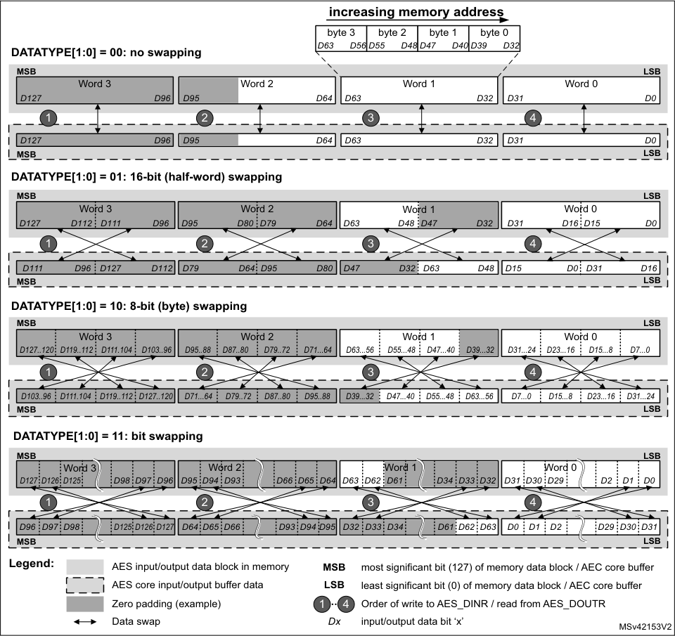

_Note:_ _The data in AES key registers (AES_KEYRx) and initialization registers (AES_IVRx) are not_
_sensitive to the swap mode selection._

356/905 RM0377 Rev 10

--- end of page=355 ---

**RM0377** **AES hardware accelerator (AES)**

**Data padding**

_Figure 73_ also gives an example of memory data block padding with zeros such that the
zeroed bits after the data swap form a contiguous zone at the MSB end of the AES core
input buffer. The example shows the padding of an input data block containing:

      - 48 message bits, with DATATYPE[1:0] = 01

      - 56 message bits, with DATATYPE[1:0] = 10

      - 34 message bits, with DATATYPE[1:0] = 11

**15.4.11** **AES key registers**

The AES_KEYRx registers store the encryption or decryption key bitfield KEY[127:0]. The
data to write to or to read from each register is organized in the memory in little-endian
order, that is, with most significant byte on the highest address.

The key is spread over the four registers in little-endian configuration, as shown on
_Table 70_ .

**Table 70. Key endianness in AES_KEYRx registers**

|AES_KEYR3[31:0]|AES_KEYR2[31:0]|AES_KEYR1[31:0]|AES_KEYR0[31:0]|
|---|---|---|---|
|KEY[127:96]|KEY[95:64]|KEY[63:32]|KEY[31:0]|

The key for encryption or decryption may be written into these registers when the AES
peripheral is disabled.

The key registers are not affected by the data swapping controlled by DATATYPE[1:0]
bitfield of the AES_CR register.

**15.4.12** **AES initialization vector registers**

The four AES_IVRx registers keep the initialization vector input bitfield IVI[127:0]. The data
to write to or to read from each register is organized in the memory in little-endian order, that
is, with most significant byte on the highest address. The registers are also ordered from
lowest address (AES_IVR0) to highest address (AES_IVR3).

The signification of data in the bitfield depends on the chaining mode selected. When used,
the bitfield is updated upon each computation cycle of the AES core.

Write operations to the AES_IVRx registers when the AES peripheral is enabled have no
effect to the register contents. For modifying the contents of the AES_IVRx registers, the EN
bit of the AES_CR register must first be cleared.

Reading the AES_IVRx registers returns the latest counter value (useful for managing
suspend mode) when the AES peripheral is disabled and returns zeros when it is enabled.

The AES_IVRx registers are not affected by the data swapping feature controlled by the
DATATYPE[1:0] bitfield of the CRYP_CR register.

**15.4.13** **AES DMA interface**

The AES peripheral provides an interface to connect to the DMA (direct memory access)
controller. The DMA operation is controlled through the AES_CR register.

RM0377 Rev 10 357/905

370

--- end of page=356 ---

**AES hardware accelerator (AES)** **RM0377**

**Data input using DMA**

Setting the DMAINEN bit of the AES_CR register enables DMA writing into AES. The AES
peripheral then initiates a DMA request during the input phase each time it requires a word
to be written to the AES_DINR register. It asserts four DMA requests to transfer one 128-bit
(four-word) input data block from memory, as shown in _Figure 74_ .

See _Table 71_ for recommended DMA configuration.

**Table 71. DMA channel configuration for memory-to-AES data transfer**

|DMA channel control register field|Recommended configuration|
|---|---|
|Transfer size|Message length: a multiple of 128 bits. According to the algorithm and the mode selected, special padding/ ciphertext stealing might be required.|
|Source burst size (memory)|Single|
|Destination burst size (peripheral)|Single|
|DMA FIFO size|AES FIFO_size = 4 bytes.|
|Source transfer width (memory)|32-bit words|
|Destination transfer width (peripheral)|32-bit words|
|Source address increment (memory)|Yes, after each 32-bit transfer|
|Destination address increment (peripheral)|Fixed address of AES_DINR (no increment)|

**Figure 74. DMA transfer of a 128-bit data block during input phase**

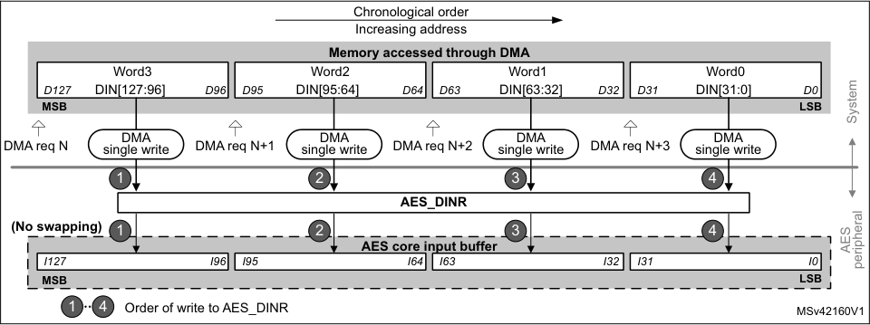

**Data output using DMA**

Setting the DMAOUTEN bit of the AES_CR register enables DMA reading from AES. The
AES peripheral then initiates a DMA request during the Output phase each time it requires a

358/905 RM0377 Rev 10

--- end of page=357 ---

**RM0377** **AES hardware accelerator (AES)**

word to be read from the AES_DOUTR register. It asserts four DMA requests to transfer one
128-bit (four-word) output data block to memory, as shown in _Figure 75_ .

See _Table 72_ for recommended DMA configuration.

**Table 72. DMA channel configuration for AES-to-memory data transfer**

|DMA channel control register field|Recommended configuration|
|---|---|
|Transfer size|It is the message length multiple of AES block size (4 words). According to the case extra bytes will have to be discarded.|
|Source burst size (peripheral)|Single|
|Destination burst size (memory)|Single|
|DMA FIFIO size|AES FIFO_size = 4 bytes|
|Source transfer width (peripheral)|32-bit words|
|Destination transfer width (memory)|32-bit words|
|Source address increment (peripheral)|Fixed address of AES_DINR (no increment)|
|Destination address increment (memory)|Yes, after each 32-bit transfer|

**Figure 75. DMA transfer of a 128-bit data block during output phase**

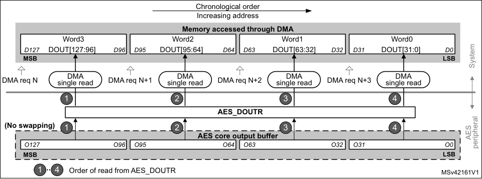

**DMA operation in different operating modes**

DMA operations are usable when Mode 1 (encryption) or Mode 3 (decryption) are selected
via the MODE[1:0] bitfield of the register AES_CR. As in Mode 2 (key derivation) the
AES_KEYRx registers must be written by software, enabling the DMA transfer through the
DMAINEN and DMAOUTEN bits of the AES_CR register have no effect in that mode.

RM0377 Rev 10 359/905

370

--- end of page=358 ---

**AES hardware accelerator (AES)** **RM0377**

DMA single requests are generated by AES until it is disabled. So, after the data output
phase at the end of processing of a 128-bit data block, AES switches automatically to a new
data input phase for the next data block, if any.

When the data transferring between AES and memory is managed by DMA, the CCF flag is
not relevant and can be ignored (left set) by software. It must only be cleared when
transiting back to data transferring managed by software. See _Suspend/resume operations_
_in ECB/CBC modes_ in _Section 15.4.8: AES basic chaining modes (ECB, CBC)_ as example.

**15.4.14** **AES error management**

The read error flag (RDERR) and write error flag (WRERR) of the AES_SR register are set
when an unexpected read or write operation, respectively, is detected. An interrupt can be
generated if the error interrupt enable (ERRIE) bit of the AES_CR register is set. For more
details, refer to _Section 15.5: AES interrupts_ .

_Note:_ _AES is not disabled after an error detection and continues processing._

AES can be re-initialized at any moment by clearing then setting the EN bit of the AES_CR
register.

**Read error flag (RDERR)**

When an unexpected read operation is detected during the computation phase or during the
input phase, the AES read error flag (RDERR) is set in the AES_SR register. An interrupt is
generated if the ERRIE bit of the AES_CR register is set.

The RDERR flag is cleared by setting the corresponding ERRC bit of the AES_CR register.

**Write error flag (WDERR)**

When an unexpected write operation is detected during the computation phase or during the
output phase, the AES write error flag (WRERR) is set in the AES_SR register. An interrupt
is generated if the ERRIE bit of the AES_CR register is set.

The WDERR flag is cleared by setting the corresponding ERRC bit of the AES_CR register.

###### **15.5 AES interrupts**

There are three individual maskable interrupt sources generated by the AES peripheral, to
signal the following events:

      - computation completed

      - read error, see _Section 15.4.14_

      - write error, see _Section 15.4.14_

These three sources are combined into a common interrupt signal aes_it that connects to
NVIC (nested vectored interrupt controller).

360/905 RM0377 Rev 10

--- end of page=359 ---

**RM0377** **AES hardware accelerator (AES)**

**Figure 76. AES interrupt signal generation**

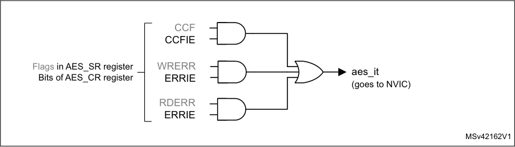

Each AES interrupt source can individually be enabled/disabled, by setting/clearing the
corresponding enable bit of the AES_CR register. See _Figure 76._

The status of the individual maskable interrupt sources can be read from the AES_SR
register.

_Table 73_ gives a summary of the interrupt sources, their event flags and enable bits.

**Table 73. AES interrupt requests**

|AES interrupt event|Event flag|Enable bit|
|---|---|---|
|computation completed flag|CCF|CCFIE|
|read error flag|RDERR|ERRIE|
|write error flag|WRERR|ERRIE|

###### **15.6 AES processing latency**

The tables below summarize the latency to process a 128-bit block for each mode of
operation.

**Table 74. Processing latency** **(in clock cycle)**

|Mode of operation|Algorithm|Input phase|Computation phase|Output phase|Total|
|---|---|---|---|---|---|
|Mode 1: Encryption|ECB, CBC, CTR|8|202|4|**214**|
|Mode 2: Key derivation for decryption|ECB, CBC|-|80|-|**80**|
|Mode 3: Decryption|ECB, CBC, CTR|8|202|4|**214**|
|Mode 4: Key derivation then decryption|ECB, CBC|8|276|4|**288**|

RM0377 Rev 10 361/905

370

--- end of page=360 ---

**AES hardware accelerator (AES)** **RM0377**

###### **15.7 AES registers**

**15.7.1** **AES control register (AES_CR)**

Address offset: 0x00

Reset value: 0x0000 0000

|31|30|29|28|27|26|25|24|23|22|21|20|19|18|17|16|
|---|---|---|---|---|---|---|---|---|---|---|---|---|---|---|---|
|Res.|Res.|Res.|Res.|Res.|Res.|Res.|Res.|Res.|Res.|Res.|Res.|Res.|Res.|Res.|Res.|
|||||||||||||||||

|15|14|13|12|11|10|9|8|7|6 5|Col11|4 3|Col13|2 1|Col15|0|
|---|---|---|---|---|---|---|---|---|---|---|---|---|---|---|---|
|Res.|Res.|Res.|DMAO UTEN|DMAIN EN|ERRIE|CCFIE|ERRC|CCFC|CHMOD[1:0]|CHMOD[1:0]|MODE[1:0]|MODE[1:0]|DATATYPE[1:0]|DATATYPE[1:0]|EN|
||||rw|rw|rw|rw|rw|rw|rw|rw|rw|rw|rw|rw|rw|

Bit 31:13 Reserved, must be kept at zero

Bit 12 **DMAOUTEN** : DMA output enable

This bit enables/disables data transferring with DMA, in the output phase:

0: Disable

1: Enable

When the bit is set, DMA requests are automatically generated by AES during the output data
phase. This feature is only effective when Mode 1 or Mode 3 is selected through the MODE[1:0]
bitfield. It is not effective for Mode 2 (key derivation).
Usage of DMA with Mode 4 (single decryption) is not recommended.

Bit 11 **DMAINEN** : DMA input enable

This bit enables/disables data transferring with DMA, in the input phase:

0: Disable

1: Enable

When the bit is set, DMA requests are automatically generated by AES during the input data phase.
This feature is only effective when Mode 1 or Mode 3 is selected through the MODE[1:0] bitfield. It is
not effective for Mode 2 (key derivation).
Usage of DMA with Mode 4 (single decryption) is not recommended.

Bit 10 **ERRIE** : Error interrupt enable

This bit enables or disables (masks) the AES interrupt generation when RDERR and/or WRERR is
set:

0: Disable (mask)

1: Enable

Bit 9 **CCFIE** : CCF interrupt enable

This bit enables or disables (masks) the AES interrupt generation when CCF (computation complete
flag) is set:
0: Disable (mask)

1: Enable

362/905 RM0377 Rev 10

--- end of page=361 ---

**RM0377** **AES hardware accelerator (AES)**

Bit 8 **ERRC** : Error flag clear

Upon written to 1, this bit clears the RDERR and WRERR error flags in the AES_SR register:

0: No effect

1: Clear RDERR and WRERR flags

Reading the flag always returns zero.

Bit 7 **CCFC** : Computation complete flag clear

Upon written to 1, this bit clears the computation complete flag (CCF) in the AES_SR register:

0: No effect

1: Clear CCF

Reading the flag always returns zero.

Bits 6:5 **CHMOD[1:0]** : Chaining mode selection

This bitfield selects the AES chaining mode:
00: Electronic codebook (ECB)
01: Cipher-Block Chaining (CBC)
10: Counter Mode (CTR)

11: Reserved

The bitfield value change is allowed only when AES is disabled, so as to avoid an unpredictable
behavior.

Bits 4:3 **MODE[1:0]** : AES operating mode

This bitfield selects the AES operating mode:
00: Mode 1: encryption
01: Mode 2: key derivation (or key preparation for ECB/CBC decryption)
10: Mode 3: decryption
11: Mode 4: key derivation then single decryption

The bitfield value change is allowed only when AES is disabled, so as to avoid an unpredictable
behavior. Any attempt to selecting Mode 4 while either ECB or CBC chaining mode is not selected,
defaults to effective selection of Mode 3. It is not possible to select a Mode 3 following a Mode 4.

Bits 2:1 **DATATYPE[1:0]** : Data type selection

This bitfield defines the format of data written in the AES_DINR register or read from the
AES_DOUTR register, through selecting the mode of data swapping:

00: None

01: Half-word (16-bit)
10: Byte (8-bit)

11: Bit

For more details, refer to _Section 15.4.10: AES data registers and data swapping_ .
The bitfield value change is allowed only when AES is disabled, so as to avoid an unpredictable
behavior.

Bit 0 **EN** : AES enable

This bit enables/disables the AES peripheral:

0: Disable

1: Enable

At any moment, clearing then setting the bit re-initializes the AES peripheral.
This bit is automatically cleared by hardware when the key preparation process ends (Mode 2).

RM0377 Rev 10 363/905

370

--- end of page=362 ---

**AES hardware accelerator (AES)** **RM0377**

**15.7.2** **AES status register (AES_SR)**

Address offset: 0x04

Reset value: 0x0000 0000

|31|30|29|28|27|26|25|24|23|22|21|20|19|18|17|16|
|---|---|---|---|---|---|---|---|---|---|---|---|---|---|---|---|
|Res.|Res.|Res.|Res.|Res.|Res.|Res.|Res.|Res.|Res.|Res.|Res.|Res.|Res.|Res.|Res.|
|r|r|r|r|r|r|r|r|r|r|r|r|r|r|r|r|

|15|14|13|12|11|10|9|8|7|6|5|4|3|2|1|0|
|---|---|---|---|---|---|---|---|---|---|---|---|---|---|---|---|
|Res.|Res.|Res.|Res.|Res.|Res.|Res.|Res.|Res.|Res.|Res.|Res.|Res.|WRERR|RDERR|CCF|
|r|r|r|r|r|r|r|r|r|r|r|r|r|r|r|r|

Bits 31:3 Reserved, must be kept at zero

Bit 2 **WRERR** : Write error

This flag indicates the detection of an unexpected write operation to the AES_DINR register (during
computation or data output phase):

0: Not detected

1: Detected

The flag is set by hardware. It is cleared by software upon setting the ERRC bit of the AES_CR
register.
Upon the flag setting, an interrupt is generated if enabled through the ERRIE bit of the AES_CR
register.
The flag setting has no impact on the AES operation.
The flag is not effective when key derivation mode is selected.

Bit 1 **RDERR** : Read error flag

This flag indicates the detection of an unexpected read operation from the AES_DOUTR register
(during computation or data input phase):

0: Not detected

1: Detected

The flag is set by hardware. It is cleared by software upon setting the ERRC bit of the AES_CR
register.
Upon the flag setting, an interrupt is generated if enabled through the ERRIE bit of the AES_CR
register.
The flag setting has no impact on the AES operation.
The flag is not effective when key derivation mode is selected.

Bit 0 **CCF** : Computation completed flag

This flag indicates whether the computation is completed:
0: Not completed
1: Completed

The flag is set by hardware upon the completion of the computation. It is cleared by software, upon
setting the CCFC bit of the AES_CR register.
Upon the flag setting, an interrupt is generated if enabled through the CCFIE bit of the AES_CR
register.
The flag is significant only when the DMAOUTEN bit is 0. It may stay high when DMA_EN is 1.

364/905 RM0377 Rev 10

--- end of page=363 ---

**RM0377** **AES hardware accelerator (AES)**

**15.7.3** **AES data input register (AES_DINR)**

Address offset: 0x08

Reset value: 0x0000 0000

Only 32-bit access type is supported.

|31 30 29 28 27 26 25 24 23 22 21 20 19 18 17 16|Col2|Col3|Col4|Col5|Col6|Col7|Col8|Col9|Col10|Col11|Col12|Col13|Col14|Col15|Col16|
|---|---|---|---|---|---|---|---|---|---|---|---|---|---|---|---|
|DIN[x+31:x+16]|DIN[x+31:x+16]|DIN[x+31:x+16]|DIN[x+31:x+16]|DIN[x+31:x+16]|DIN[x+31:x+16]|DIN[x+31:x+16]|DIN[x+31:x+16]|DIN[x+31:x+16]|DIN[x+31:x+16]|DIN[x+31:x+16]|DIN[x+31:x+16]|DIN[x+31:x+16]|DIN[x+31:x+16]|DIN[x+31:x+16]|DIN[x+31:x+16]|
|rw|rw|rw|rw|rw|rw|rw|rw|rw|rw|rw|rw|rw|rw|rw|rw|

|15 14 13 12 11 10 9 8 7 6 5 4 3 2 1 0|Col2|Col3|Col4|Col5|Col6|Col7|Col8|Col9|Col10|Col11|Col12|Col13|Col14|Col15|Col16|
|---|---|---|---|---|---|---|---|---|---|---|---|---|---|---|---|
|DIN[x+15:x]|DIN[x+15:x]|DIN[x+15:x]|DIN[x+15:x]|DIN[x+15:x]|DIN[x+15:x]|DIN[x+15:x]|DIN[x+15:x]|DIN[x+15:x]|DIN[x+15:x]|DIN[x+15:x]|DIN[x+15:x]|DIN[x+15:x]|DIN[x+15:x]|DIN[x+15:x]|DIN[x+15:x]|
|rw|rw|rw|rw|rw|rw|rw|rw|rw|rw|rw|rw|rw|rw|rw|rw|

Bits 31:0

**DIN[x+31:x]** This bitfield feeds a 32-bit input buffer. A 4-fold sequential write to this bitfield during the input phase : One of four 32-bit words of a 128-bit input data block being written into the peripheral
virtually writes a complete 128-bit block of input data to the AES peripheral. Upon each write, the
data from the input buffer are handled by the data swap block according to the DATATYPE[1:0]
bitfield, then written into the AES core 128-bit input buffer.
The substitution for “x”, from the first to the fourth write operation, is: 96, 64, 32, and 0. In other
words, data from the first to the fourth write operation are: DIN[127:96], DIN[95:64], DIN[63:32], and
DIN[31:0].
The data signification of the input data block depends on the AES operating mode:

  - **Mode 1** (encryption): plaintext

  - **Mode 2** (key derivation): the bitfield is not used (AES_KEYRx registers used for input)

  - **Mode 3** (decryption) and **Mode 4** (key derivation then single decryption): ciphertext
The data swap operation is described in _Section 15.4.10: AES data registers and data swapping on_
_page 355_ .

**15.7.4** **AES data output register (AES_DOUTR)**

Address offset: 0x0C

Reset value: 0x0000 0000

Only 32-bit access type is supported.

|31 30 29 28 27 26 25 24 23 22 21 20 19 18 17 16|Col2|Col3|Col4|Col5|Col6|Col7|Col8|Col9|Col10|Col11|Col12|Col13|Col14|Col15|Col16|
|---|---|---|---|---|---|---|---|---|---|---|---|---|---|---|---|
|DOUT[x+31:x+16]|DOUT[x+31:x+16]|DOUT[x+31:x+16]|DOUT[x+31:x+16]|DOUT[x+31:x+16]|DOUT[x+31:x+16]|DOUT[x+31:x+16]|DOUT[x+31:x+16]|DOUT[x+31:x+16]|DOUT[x+31:x+16]|DOUT[x+31:x+16]|DOUT[x+31:x+16]|DOUT[x+31:x+16]|DOUT[x+31:x+16]|DOUT[x+31:x+16]|DOUT[x+31:x+16]|
|r|r|r|r|r|r|r|r|r|r|r|r|r|r|r|r|

|15 14 13 12 11 10 9 8 7 6 5 4 3 2 1 0|Col2|Col3|Col4|Col5|Col6|Col7|Col8|Col9|Col10|Col11|Col12|Col13|Col14|Col15|Col16|
|---|---|---|---|---|---|---|---|---|---|---|---|---|---|---|---|
|DOUT[x+15:0]|DOUT[x+15:0]|DOUT[x+15:0]|DOUT[x+15:0]|DOUT[x+15:0]|DOUT[x+15:0]|DOUT[x+15:0]|DOUT[x+15:0]|DOUT[x+15:0]|DOUT[x+15:0]|DOUT[x+15:0]|DOUT[x+15:0]|DOUT[x+15:0]|DOUT[x+15:0]|DOUT[x+15:0]|DOUT[x+15:0]|
|r|r|r|r|r|r|r|r|r|r|r|r|r|r|r|r|

RM0377 Rev 10 365/905

370

--- end of page=364 ---

**AES hardware accelerator (AES)** **RM0377**

Bits 31:0 **DOUT[x+31:x]** : One of four 32-bit words of a 128-bit output data block being read from the peripheral

This bitfield fetches a 32-bit output buffer. A 4-fold sequential read of this bitfield, upon the
computation completion (CCF set), virtually reads a complete 128-bit block of output data from the
AES peripheral. Before reaching the output buffer, the data produced by the AES core are handled
by the data swap block according to the DATATYPE[1:0] bitfield.
The substitution for DOUT[x+31:x], from the first to the fourth read operation, is: 96, 64, 32, and 0. In
other words, data from the first to the fourth read operation are: DOUT[127:96], DOUT[95:64],
DOUT[63:32], and DOUT[31:0].
The data signification of the output data block depends on the AES operating mode:

            - **Mode 1** (encryption): ciphertext

            - **Mode 2** (key derivation): the bitfield is not used (AES_KEYRx registers used for output).

            - **Mode 3** (decryption) and **Mode 4** (key derivation then single decryption): plaintext
The data swap operation is described in _Section 15.4.10: AES data registers and data swapping on_
_page 355_ .

**15.7.5** **AES key register 0 (AES_KEYR0)**

Address offset: 0x10

Reset value: 0x0000 0000

|31 30 29 28 27 26 25 24 23 22 21 20 19 18 17 16|Col2|Col3|Col4|Col5|Col6|Col7|Col8|Col9|Col10|Col11|Col12|Col13|Col14|Col15|Col16|
|---|---|---|---|---|---|---|---|---|---|---|---|---|---|---|---|
|KEY[31:16]|KEY[31:16]|KEY[31:16]|KEY[31:16]|KEY[31:16]|KEY[31:16]|KEY[31:16]|KEY[31:16]|KEY[31:16]|KEY[31:16]|KEY[31:16]|KEY[31:16]|KEY[31:16]|KEY[31:16]|KEY[31:16]|KEY[31:16]|
|rw|rw|rw|rw|rw|rw|rw|rw|rw|rw|rw|rw|rw|rw|rw|rw|

|15 14 13 12 11 10 9 8 7 6 5 4 3 2 1 0|Col2|Col3|Col4|Col5|Col6|Col7|Col8|Col9|Col10|Col11|Col12|Col13|Col14|Col15|Col16|
|---|---|---|---|---|---|---|---|---|---|---|---|---|---|---|---|
|KEY[15:0]|KEY[15:0]|KEY[15:0]|KEY[15:0]|KEY[15:0]|KEY[15:0]|KEY[15:0]|KEY[15:0]|KEY[15:0]|KEY[15:0]|KEY[15:0]|KEY[15:0]|KEY[15:0]|KEY[15:0]|KEY[15:0]|KEY[15:0]|
|rw|rw|rw|rw|rw|rw|rw|rw|rw|rw|rw|rw|rw|rw|rw|rw|

Bits 31:0 **KEY[31:0]** : Cryptographic key, bits [31:0]

This bitfield contains the bits [31:0] of the AES encryption or decryption key, depending on the
operating mode:

           - In **Mode 1** (encryption), **Mode 2** (key derivation) and **Mode 4** (key derivation then single
decryption): the value to write into the bitfield is the encryption key.

           - In **Mode 3** (decryption): the value to write into the bitfield is the encryption key to be derived before
being used for decryption. After writing the encryption key into the bitfield, its reading before
enabling AES returns the same value. Its reading after enabling AES and after the CCF flag is set
returns the decryption key derived from the encryption key.

_Note: In mode 4 (key derivation then single decryption) the bitfield always contains the encryption_
_key._

The AES_KEYRx registers may be written only when the AES peripheral is disabled.

Refer to _Section 15.4.11: AES key registers on page 357_ for more details.

366/905 RM0377 Rev 10

--- end of page=365 ---

**RM0377** **AES hardware accelerator (AES)**

**15.7.6** **AES key register 1 (AES_KEYR1)**

Address offset: 0x14

Reset value: 0x0000 0000

|31 30 29 28 27 26 25 24 23 22 21 20 19 18 17 16|Col2|Col3|Col4|Col5|Col6|Col7|Col8|Col9|Col10|Col11|Col12|Col13|Col14|Col15|Col16|
|---|---|---|---|---|---|---|---|---|---|---|---|---|---|---|---|
|KEY[63:48]|KEY[63:48]|KEY[63:48]|KEY[63:48]|KEY[63:48]|KEY[63:48]|KEY[63:48]|KEY[63:48]|KEY[63:48]|KEY[63:48]|KEY[63:48]|KEY[63:48]|KEY[63:48]|KEY[63:48]|KEY[63:48]|KEY[63:48]|
|rw|rw|rw|rw|rw|rw|rw|rw|rw|rw|rw|rw|rw|rw|rw|rw|

|15 14 13 12 11 10 9 8 7 6 5 4 3 2 1 0|Col2|Col3|Col4|Col5|Col6|Col7|Col8|Col9|Col10|Col11|Col12|Col13|Col14|Col15|Col16|
|---|---|---|---|---|---|---|---|---|---|---|---|---|---|---|---|
|KEY[47:32]|KEY[47:32]|KEY[47:32]|KEY[47:32]|KEY[47:32]|KEY[47:32]|KEY[47:32]|KEY[47:32]|KEY[47:32]|KEY[47:32]|KEY[47:32]|KEY[47:32]|KEY[47:32]|KEY[47:32]|KEY[47:32]|KEY[47:32]|
|rw|rw|rw|rw|rw|rw|rw|rw|rw|rw|rw|rw|rw|rw|rw|rw|

Bits 31:0 **KEY[63:32]** : Cryptographic key, bits [63:32]

Refer to the AES_KEYR0 register for description of the KEY[127:0] bitfield.

**15.7.7** **AES key register 2 (AES_KEYR2)**

Address offset: 0x18

Reset value: 0x0000 0000

|31 30 29 28 27 26 25 24 23 22 21 20 19 18 17 16|Col2|Col3|Col4|Col5|Col6|Col7|Col8|Col9|Col10|Col11|Col12|Col13|Col14|Col15|Col16|
|---|---|---|---|---|---|---|---|---|---|---|---|---|---|---|---|
|KEY[95:80]|KEY[95:80]|KEY[95:80]|KEY[95:80]|KEY[95:80]|KEY[95:80]|KEY[95:80]|KEY[95:80]|KEY[95:80]|KEY[95:80]|KEY[95:80]|KEY[95:80]|KEY[95:80]|KEY[95:80]|KEY[95:80]|KEY[95:80]|
|rw|rw|rw|rw|rw|rw|rw|rw|rw|rw|rw|rw|rw|rw|rw|rw|

|15 14 13 12 11 10 9 8 7 6 5 4 3 2 1 0|Col2|Col3|Col4|Col5|Col6|Col7|Col8|Col9|Col10|Col11|Col12|Col13|Col14|Col15|Col16|
|---|---|---|---|---|---|---|---|---|---|---|---|---|---|---|---|
|KEY[79:64]|KEY[79:64]|KEY[79:64]|KEY[79:64]|KEY[79:64]|KEY[79:64]|KEY[79:64]|KEY[79:64]|KEY[79:64]|KEY[79:64]|KEY[79:64]|KEY[79:64]|KEY[79:64]|KEY[79:64]|KEY[79:64]|KEY[79:64]|
|rw|rw|rw|rw|rw|rw|rw|rw|rw|rw|rw|rw|rw|rw|rw|rw|

Bits 31:0 **KEY[95:64]** : Cryptographic key, bits [95:64]

Refer to the AES_KEYR0 register for description of the KEY[127:0] bitfield.

**15.7.8** **AES key register 3 (AES_KEYR3)**

Address offset: 0x1C

Reset value: 0x0000 0000

|31 30 29 28 27 26 25 24 23 22 21 20 19 18 17 16|Col2|Col3|Col4|Col5|Col6|Col7|Col8|Col9|Col10|Col11|Col12|Col13|Col14|Col15|Col16|
|---|---|---|---|---|---|---|---|---|---|---|---|---|---|---|---|
|KEY[127:112]|KEY[127:112]|KEY[127:112]|KEY[127:112]|KEY[127:112]|KEY[127:112]|KEY[127:112]|KEY[127:112]|KEY[127:112]|KEY[127:112]|KEY[127:112]|KEY[127:112]|KEY[127:112]|KEY[127:112]|KEY[127:112]|KEY[127:112]|
|rw|rw|rw|rw|rw|rw|rw|rw|rw|rw|rw|rw|rw|rw|rw|rw|

|15 14 13 12 11 10 9 8 7 6 5 4 3 2 1 0|Col2|Col3|Col4|Col5|Col6|Col7|Col8|Col9|Col10|Col11|Col12|Col13|Col14|Col15|Col16|
|---|---|---|---|---|---|---|---|---|---|---|---|---|---|---|---|
|KEY[111:96]|KEY[111:96]|KEY[111:96]|KEY[111:96]|KEY[111:96]|KEY[111:96]|KEY[111:96]|KEY[111:96]|KEY[111:96]|KEY[111:96]|KEY[111:96]|KEY[111:96]|KEY[111:96]|KEY[111:96]|KEY[111:96]|KEY[111:96]|
|rw|rw|rw|rw|rw|rw|rw|rw|rw|rw|rw|rw|rw|rw|rw|rw|

Bits 31:0 **KEY[127:96]** : Cryptographic key, bits [127:96]

Refer to the AES_KEYR0 register for description of the KEY[127:0] bitfield.

RM0377 Rev 10 367/905

370

--- end of page=366 ---

**AES hardware accelerator (AES)** **RM0377**

**15.7.9** **AES initialization vector register 0 (AES_IVR0)**

Address offset: 0x20

Reset value: 0x0000 0000

|31 30 29 28 27 26 25 24 23 22 21 20 19 18 17 16|Col2|Col3|Col4|Col5|Col6|Col7|Col8|Col9|Col10|Col11|Col12|Col13|Col14|Col15|Col16|
|---|---|---|---|---|---|---|---|---|---|---|---|---|---|---|---|
|IVI[31:16]|IVI[31:16]|IVI[31:16]|IVI[31:16]|IVI[31:16]|IVI[31:16]|IVI[31:16]|IVI[31:16]|IVI[31:16]|IVI[31:16]|IVI[31:16]|IVI[31:16]|IVI[31:16]|IVI[31:16]|IVI[31:16]|IVI[31:16]|
|rw|rw|rw|rw|rw|rw|rw|rw|rw|rw|rw|rw|rw|rw|rw|rw|

|15 14 13 12 11 10 9 8 7 6 5 4 3 2 1 0|Col2|Col3|Col4|Col5|Col6|Col7|Col8|Col9|Col10|Col11|Col12|Col13|Col14|Col15|Col16|
|---|---|---|---|---|---|---|---|---|---|---|---|---|---|---|---|
|IVI[15:0]|IVI[15:0]|IVI[15:0]|IVI[15:0]|IVI[15:0]|IVI[15:0]|IVI[15:0]|IVI[15:0]|IVI[15:0]|IVI[15:0]|IVI[15:0]|IVI[15:0]|IVI[15:0]|IVI[15:0]|IVI[15:0]|IVI[15:0]|
|rw|rw|rw|rw|rw|rw|rw|rw|rw|rw|rw|rw|rw|rw|rw|rw|

Bits 31:0 **IVI[31:0]** : Initialization vector input, bits [31:0]

Refer to _Section 15.4.12: AES initialization vector registers on page 357_ for description of the
IVI[127:0] bitfield.
The initialization vector is only used in chaining modes other than ECB.
The initialization vector may be written only when the AES peripheral is disabled.
Reading this bitfield while AES is enabled returns 0x0000 0000.

**15.7.10** **AES initialization vector register 1 (AES_IVR1)**

Address offset: 0x24

Reset value: 0x0000 0000

|31 30 29 28 27 26 25 24 23 22 21 20 19 18 17 16|Col2|Col3|Col4|Col5|Col6|Col7|Col8|Col9|Col10|Col11|Col12|Col13|Col14|Col15|Col16|
|---|---|---|---|---|---|---|---|---|---|---|---|---|---|---|---|
|IVI[63:48]|IVI[63:48]|IVI[63:48]|IVI[63:48]|IVI[63:48]|IVI[63:48]|IVI[63:48]|IVI[63:48]|IVI[63:48]|IVI[63:48]|IVI[63:48]|IVI[63:48]|IVI[63:48]|IVI[63:48]|IVI[63:48]|IVI[63:48]|
|rw|rw|rw|rw|rw|rw|rw|rw|rw|rw|rw|rw|rw|rw|rw|rw|

|15 14 13 12 11 10 9 8 7 6 5 4 3 2 1 0|Col2|Col3|Col4|Col5|Col6|Col7|Col8|Col9|Col10|Col11|Col12|Col13|Col14|Col15|Col16|
|---|---|---|---|---|---|---|---|---|---|---|---|---|---|---|---|
|IVI[47:32]|IVI[47:32]|IVI[47:32]|IVI[47:32]|IVI[47:32]|IVI[47:32]|IVI[47:32]|IVI[47:32]|IVI[47:32]|IVI[47:32]|IVI[47:32]|IVI[47:32]|IVI[47:32]|IVI[47:32]|IVI[47:32]|IVI[47:32]|
|rw|rw|rw|rw|rw|rw|rw|rw|rw|rw|rw|rw|rw|rw|rw|rw|

Bits 31:0 **IVI[63:32]** : Initialization vector input, bits [63:32]

Refer to _Section 15.4.12: AES initialization vector registers on page 357_ for description of the
IVI[127:0] bitfield.
The initialization vector is only used in chaining modes other than ECB.
The initialization vector may be written only when the AES peripheral is disabled.
Reading this bitfield while AES is enabled returns 0x0000 0000.

368/905 RM0377 Rev 10

--- end of page=367 ---

**RM0377** **AES hardware accelerator (AES)**

**15.7.11** **AES initialization vector register 2 (AES_IVR2)**

Address offset: 0x28

Reset value: 0x0000 0000

|31 30 29 28 27 26 25 24 23 22 21 20 19 18 17 16|Col2|Col3|Col4|Col5|Col6|Col7|Col8|Col9|Col10|Col11|Col12|Col13|Col14|Col15|Col16|
|---|---|---|---|---|---|---|---|---|---|---|---|---|---|---|---|
|IVI[95:80]|IVI[95:80]|IVI[95:80]|IVI[95:80]|IVI[95:80]|IVI[95:80]|IVI[95:80]|IVI[95:80]|IVI[95:80]|IVI[95:80]|IVI[95:80]|IVI[95:80]|IVI[95:80]|IVI[95:80]|IVI[95:80]|IVI[95:80]|
|rw|rw|rw|rw|rw|rw|rw|rw|rw|rw|rw|rw|rw|rw|rw|rw|

|15 14 13 12 11 10 9 8 7 6 5 4 3 2 1 0|Col2|Col3|Col4|Col5|Col6|Col7|Col8|Col9|Col10|Col11|Col12|Col13|Col14|Col15|Col16|
|---|---|---|---|---|---|---|---|---|---|---|---|---|---|---|---|
|IVI[79:64]|IVI[79:64]|IVI[79:64]|IVI[79:64]|IVI[79:64]|IVI[79:64]|IVI[79:64]|IVI[79:64]|IVI[79:64]|IVI[79:64]|IVI[79:64]|IVI[79:64]|IVI[79:64]|IVI[79:64]|IVI[79:64]|IVI[79:64]|
|rw|rw|rw|rw|rw|rw|rw|rw|rw|rw|rw|rw|rw|rw|rw|rw|

Bits 31:0 **IVI[95:64]** : Initialization vector input, bits [95:64]

Refer to _Section 15.4.12: AES initialization vector registers on page 357_ for description of the
IVI[127:0] bitfield.
The initialization vector is only used in chaining modes other than ECB.
The initialization vector may be written only when the AES peripheral is disabled.
Reading this bitfield while AES is enabled returns 0x0000 0000.

**15.7.12** **AES initialization vector register 3 (AES_IVR3)**

Address offset: 0x2C

Reset value: 0x0000 0000

|31 30 29 28 27 26 25 24 23 22 21 20 19 18 17 16|Col2|Col3|Col4|Col5|Col6|Col7|Col8|Col9|Col10|Col11|Col12|Col13|Col14|Col15|Col16|
|---|---|---|---|---|---|---|---|---|---|---|---|---|---|---|---|
|IVI[127:112]|IVI[127:112]|IVI[127:112]|IVI[127:112]|IVI[127:112]|IVI[127:112]|IVI[127:112]|IVI[127:112]|IVI[127:112]|IVI[127:112]|IVI[127:112]|IVI[127:112]|IVI[127:112]|IVI[127:112]|IVI[127:112]|IVI[127:112]|
|rw|rw|rw|rw|rw|rw|rw|rw|rw|rw|rw|rw|rw|rw|rw|rw|

|15 14 13 12 11 10 9 8 7 6 5 4 3 2 1 0|Col2|Col3|Col4|Col5|Col6|Col7|Col8|Col9|Col10|Col11|Col12|Col13|Col14|Col15|Col16|
|---|---|---|---|---|---|---|---|---|---|---|---|---|---|---|---|
|IVI[111:96]|IVI[111:96]|IVI[111:96]|IVI[111:96]|IVI[111:96]|IVI[111:96]|IVI[111:96]|IVI[111:96]|IVI[111:96]|IVI[111:96]|IVI[111:96]|IVI[111:96]|IVI[111:96]|IVI[111:96]|IVI[111:96]|IVI[111:96]|
|rw|rw|rw|rw|rw|rw|rw|rw|rw|rw|rw|rw|rw|rw|rw|rw|

Bits 31:0 **IVI[127:96]** : Initialization vector input, bits [127:96]

Refer to _Section 15.4.12: AES initialization vector registers on page 357_ for description of the
IVI[127:0] bitfield.
The initialization vector is only used in chaining modes other than ECB.
The initialization vector may be written only when the AES peripheral is disabled.
Reading this bitfield while AES is enabled returns 0x0000 0000.

**15.7.13** **AES register map**

**Table 75. AES register map and reset values**

|Offset|Register|31|30|29|28|27|26|25|24|23|22|21|20|19|18|17|16|15|14|13|12|11|10|9|8|7|6|5|4|3|2|1|0|
|---|---|---|---|---|---|---|---|---|---|---|---|---|---|---|---|---|---|---|---|---|---|---|---|---|---|---|---|---|---|---|---|---|---|
|0x0000|AES_CR|Res.|Res.|Res.|Res.|Res.|Res.|Res. |Res.|Res.|Res.|Res.|Res. |Res.|Res.|Res.|Res.|Res. |Res.|Res.|DMAOUTEN|DMAINEN|ERRIE|CCFIE|ERRC|CCFC|CHMOD[1:0]|CHMOD[1:0]|MODE[1:0]|MODE[1:0]|DATATYPE[1:0]|DATATYPE[1:0]|EN|
|0x0000|Reset value||||||||||||||||||||0|0|0|0|0|0|0|0|0|0|0|0|0|

RM0377 Rev 10 369/905

370

--- end of page=368 ---

**AES hardware accelerator (AES)** **RM0377**

**Table 75. AES register map and reset values (continued)**

|Offset|Register|31|30|29|28|27|26|25|24|23|22|21|20|19|18|17|16|15|14|13|12|11|10|9|8|7|6|5|4|3|2|1|0|
|---|---|---|---|---|---|---|---|---|---|---|---|---|---|---|---|---|---|---|---|---|---|---|---|---|---|---|---|---|---|---|---|---|---|
|0x0004|AES_SR|Res.|Res.|Res.|Res.|Res.|Res.|Res.|Res.|Res.|Res.|Res.|Res.|Res.|Res.|Res.|Res.|Res.|Res.|Res.|Res.|Res.|Res.|Res.|Res.|Res.|Res.|Res.|Res.||WRERR|RDERR|CCF|
|0x0004|Reset value||||||||||||||||||||||||||||||0|0|0|
|0x0008|AES_DINR x=96,64,32,0|DIN[x+31:x]|DIN[x+31:x]|DIN[x+31:x]|DIN[x+31:x]|DIN[x+31:x]|DIN[x+31:x]|DIN[x+31:x]|DIN[x+31:x]|DIN[x+31:x]|DIN[x+31:x]|DIN[x+31:x]|DIN[x+31:x]|DIN[x+31:x]|DIN[x+31:x]|DIN[x+31:x]|DIN[x+31:x]|DIN[x+31:x]|DIN[x+31:x]|DIN[x+31:x]|DIN[x+31:x]|DIN[x+31:x]|DIN[x+31:x]|DIN[x+31:x]|DIN[x+31:x]|DIN[x+31:x]|DIN[x+31:x]|DIN[x+31:x]|DIN[x+31:x]|DIN[x+31:x]|DIN[x+31:x]|DIN[x+31:x]|DIN[x+31:x]|
|0x0008|Reset value|0|0|0|0|0|0|0|0|0|0|0|0|0|0|0|0|0|0|0|0|0|0|0|0|0|0|0|0|0|0|0|0|
|0x000 C|AES_DOUTR x=96,64,32,0|DOUT[x+31:x]|DOUT[x+31:x]|DOUT[x+31:x]|DOUT[x+31:x]|DOUT[x+31:x]|DOUT[x+31:x]|DOUT[x+31:x]|DOUT[x+31:x]|DOUT[x+31:x]|DOUT[x+31:x]|DOUT[x+31:x]|DOUT[x+31:x]|DOUT[x+31:x]|DOUT[x+31:x]|DOUT[x+31:x]|DOUT[x+31:x]|DOUT[x+31:x]|DOUT[x+31:x]|DOUT[x+31:x]|DOUT[x+31:x]|DOUT[x+31:x]|DOUT[x+31:x]|DOUT[x+31:x]|DOUT[x+31:x]|DOUT[x+31:x]|DOUT[x+31:x]|DOUT[x+31:x]|DOUT[x+31:x]|DOUT[x+31:x]|DOUT[x+31:x]|DOUT[x+31:x]|DOUT[x+31:x]|
|0x000 C|Reset value|0|0|0|0|0|0|0|0|0|0|0|0|0|0|0|0|0|0|0|0|0|0|0|0|0|0|0|0|0|0|0|0|
|0x0010|AES_KEYR0|KEY[31:0]|KEY[31:0]|KEY[31:0]|KEY[31:0]|KEY[31:0]|KEY[31:0]|KEY[31:0]|KEY[31:0]|KEY[31:0]|KEY[31:0]|KEY[31:0]|KEY[31:0]|KEY[31:0]|KEY[31:0]|KEY[31:0]|KEY[31:0]|KEY[31:0]|KEY[31:0]|KEY[31:0]|KEY[31:0]|KEY[31:0]|KEY[31:0]|KEY[31:0]|KEY[31:0]|KEY[31:0]|KEY[31:0]|KEY[31:0]|KEY[31:0]|KEY[31:0]|KEY[31:0]|KEY[31:0]|KEY[31:0]|
|0x0010|Reset value|0|0|0|0|0|0|0|0|0|0|0|0|0|0|0|0|0|0|0|0|0|0|0|0|0|0|0|0|0|0|0|0|
|0x0014|AES_KEYR1|KEY[63:32]|KEY[63:32]|KEY[63:32]|KEY[63:32]|KEY[63:32]|KEY[63:32]|KEY[63:32]|KEY[63:32]|KEY[63:32]|KEY[63:32]|KEY[63:32]|KEY[63:32]|KEY[63:32]|KEY[63:32]|KEY[63:32]|KEY[63:32]|KEY[63:32]|KEY[63:32]|KEY[63:32]|KEY[63:32]|KEY[63:32]|KEY[63:32]|KEY[63:32]|KEY[63:32]|KEY[63:32]|KEY[63:32]|KEY[63:32]|KEY[63:32]|KEY[63:32]|KEY[63:32]|KEY[63:32]|KEY[63:32]|
|0x0014|Reset value|0|0|0|0|0|0|0|0|0|0|0|0|0|0|0|0|0|0|0|0|0|0|0|0|0|0|0|0|0|0|0|0|
|0x0018|AES_KEYR2|KEY[95:64]|KEY[95:64]|KEY[95:64]|KEY[95:64]|KEY[95:64]|KEY[95:64]|KEY[95:64]|KEY[95:64]|KEY[95:64]|KEY[95:64]|KEY[95:64]|KEY[95:64]|KEY[95:64]|KEY[95:64]|KEY[95:64]|KEY[95:64]|KEY[95:64]|KEY[95:64]|KEY[95:64]|KEY[95:64]|KEY[95:64]|KEY[95:64]|KEY[95:64]|KEY[95:64]|KEY[95:64]|KEY[95:64]|KEY[95:64]|KEY[95:64]|KEY[95:64]|KEY[95:64]|KEY[95:64]|KEY[95:64]|
|0x0018|Reset value|0|0|0|0|0|0|0|0|0|0|0|0|0|0|0|0|0|0|0|0|0|0|0|0|0|0|0|0|0|0|0|0|
|0x001 C|AES_KEYR3|KEY[127:96]|KEY[127:96]|KEY[127:96]|KEY[127:96]|KEY[127:96]|KEY[127:96]|KEY[127:96]|KEY[127:96]|KEY[127:96]|KEY[127:96]|KEY[127:96]|KEY[127:96]|KEY[127:96]|KEY[127:96]|KEY[127:96]|KEY[127:96]|KEY[127:96]|KEY[127:96]|KEY[127:96]|KEY[127:96]|KEY[127:96]|KEY[127:96]|KEY[127:96]|KEY[127:96]|KEY[127:96]|KEY[127:96]|KEY[127:96]|KEY[127:96]|KEY[127:96]|KEY[127:96]|KEY[127:96]|KEY[127:96]|
|0x001 C|Reset value|0|0|0|0|0|0|0|0|0|0|0|0|0|0|0|0|0|0|0|0|0|0|0|0|0|0|0|0|0|0|0|0|
|0x0020|AES_IVR0|IVI[31:0]|IVI[31:0]|IVI[31:0]|IVI[31:0]|IVI[31:0]|IVI[31:0]|IVI[31:0]|IVI[31:0]|IVI[31:0]|IVI[31:0]|IVI[31:0]|IVI[31:0]|IVI[31:0]|IVI[31:0]|IVI[31:0]|IVI[31:0]|IVI[31:0]|IVI[31:0]|IVI[31:0]|IVI[31:0]|IVI[31:0]|IVI[31:0]|IVI[31:0]|IVI[31:0]|IVI[31:0]|IVI[31:0]|IVI[31:0]|IVI[31:0]|IVI[31:0]|IVI[31:0]|IVI[31:0]|IVI[31:0]|
|0x0020|Reset value|0|0|0|0|0|0|0|0|0|0|0|0|0|0|0|0|0|0|0|0|0|0|0|0|0|0|0|0|0|0|0|0|
|0x0024|AES_IVR1|IVI[63:32]|IVI[63:32]|IVI[63:32]|IVI[63:32]|IVI[63:32]|IVI[63:32]|IVI[63:32]|IVI[63:32]|IVI[63:32]|IVI[63:32]|IVI[63:32]|IVI[63:32]|IVI[63:32]|IVI[63:32]|IVI[63:32]|IVI[63:32]|IVI[63:32]|IVI[63:32]|IVI[63:32]|IVI[63:32]|IVI[63:32]|IVI[63:32]|IVI[63:32]|IVI[63:32]|IVI[63:32]|IVI[63:32]|IVI[63:32]|IVI[63:32]|IVI[63:32]|IVI[63:32]|IVI[63:32]|IVI[63:32]|
|0x0024|Reset value|0|0|0|0|0|0|0|0|0|0|0|0|0|0|0|0|0|0|0|0|0|0|0|0|0|0|0|0|0|0|0|0|
|0x0028|AES_IVR2|IVI[95:64]|IVI[95:64]|IVI[95:64]|IVI[95:64]|IVI[95:64]|IVI[95:64]|IVI[95:64]|IVI[95:64]|IVI[95:64]|IVI[95:64]|IVI[95:64]|IVI[95:64]|IVI[95:64]|IVI[95:64]|IVI[95:64]|IVI[95:64]|IVI[95:64]|IVI[95:64]|IVI[95:64]|IVI[95:64]|IVI[95:64]|IVI[95:64]|IVI[95:64]|IVI[95:64]|IVI[95:64]|IVI[95:64]|IVI[95:64]|IVI[95:64]|IVI[95:64]|IVI[95:64]|IVI[95:64]|IVI[95:64]|
|0x0028|Reset value|0|0|0|0|0|0|0|0|0|0|0|0|0|0|0|0|0|0|0|0|0|0|0|0|0|0|0|0|0|0|0|0|
|0x002 C|AES_IVR3|IVI[127:96]|IVI[127:96]|IVI[127:96]|IVI[127:96]|IVI[127:96]|IVI[127:96]|IVI[127:96]|IVI[127:96]|IVI[127:96]|IVI[127:96]|IVI[127:96]|IVI[127:96]|IVI[127:96]|IVI[127:96]|IVI[127:96]|IVI[127:96]|IVI[127:96]|IVI[127:96]|IVI[127:96]|IVI[127:96]|IVI[127:96]|IVI[127:96]|IVI[127:96]|IVI[127:96]|IVI[127:96]|IVI[127:96]|IVI[127:96]|IVI[127:96]|IVI[127:96]|IVI[127:96]|IVI[127:96]|IVI[127:96]|
|0x002 C|Reset value|0|0|0|0|0|0|0|0|0|0|0|0|0|0|0|0|0|0|0|0|0|0|0|0|0|0|0|0|0|0|0|0|

Refer to _Section 2.2 on page 51_ for the register boundary addresses.

370/905 RM0377 Rev 10

--- end of page=369 ---

**RM0377** **General-purpose timers (TIM2/TIM3)**

#### **16 General-purpose timers (TIM2/TIM3)**

###### **16.1 TIM2/TIM3 introduction**

The general-purpose timers consist of a 16-bit auto-reload counter driven by a
programmable prescaler.

They may be used for a variety of purposes, including measuring the pulse lengths of input
signals ( _input capture_ ) or generating output waveforms ( _output compare and PWM_ ).

Pulse lengths and waveform periods can be modulated from a few microseconds to several
milliseconds using the timer prescaler and the RCC clock controller prescalers.

The timers are completely independent, and do not share any resources. They can be
synchronized together as described in _Section 16.3.15_ .

###### **16.2 TIM2/TIM3 main features**

General-purpose TIMx timer features include:

      - 16-bit (TIM2/3) up, down, up/down auto-reload counter.

      - 16-bit programmable prescaler used to divide (also “on the fly”) the counter clock
frequency by any factor between 1 and 65535.

      - Up to 4 independent channels for:

–
Input capture

–
Output compare

–
PWM generation (Edge- and Center-aligned modes)

–
One-pulse mode output

      - Synchronization circuit to control the timer with external signals and to interconnect
several timers.

      - Interrupt/DMA generation on the following events:

–
Update: counter overflow/underflow, counter initialization (by software or
internal/external trigger)

–
Trigger event (counter start, stop, initialization or count by internal/external trigger)

–
Input capture

–
Output compare

      - Supports incremental (quadrature) encoder and hall-sensor circuitry for positioning

purposes

      - Trigger input for external clock or cycle-by-cycle current management

RM0377 Rev 10 371/905

438

--- end of page=370 ---

**General-purpose timers (TIM2/TIM3)** **RM0377**

**Figure 77. General-purpose timer block diagram**

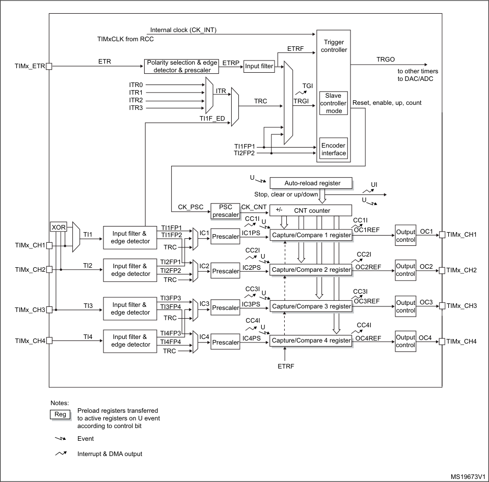

|XO|R|
|---|---|
|||

|Capture/C|ompar|e 1 re|g|ister|
|---|---|---|---|---|
|||||CC2I  OC2REF OC2  Output|
|Capture/Compare 2 r|Capture/Compare 2 r|Capture/Compare 2 r|g|ister  control CC3I Output control OC3REF OC3 ister|
| Capture/Compare 3 re| Capture/Compare 3 re| Capture/Compare 3 re|g|ister|
|CC4I  OC4REF OC4  Output|CC4I  OC4REF OC4  Output|CC4I  OC4REF OC4  Output|CC4I  OC4REF OC4  Output|CC4I  OC4REF OC4  Output|

372/905 RM0377 Rev 10

--- end of page=371 ---

**RM0377** **General-purpose timers (TIM2/TIM3)**

###### **16.3 TIM2/TIM3 functional description**

**16.3.1** **Time-base unit**

The main block of the programmable timer is a 16-bit with its related auto-reload register.
The counter can count up, down or both up and down but also down or both up and down.
The counter clock can be divided by a prescaler.

The counter, the auto-reload register and the prescaler register can be written or read by
software. This is true even when the counter is running.

The time-base unit includes:

      - Counter Register (TIMx_CNT)

      - Prescaler Register (TIMx_PSC):

      - Auto-Reload Register (TIMx_ARR)

The auto-reload register is preloaded. Writing to or reading from the auto-reload register
accesses the preload register. The content of the preload register are transferred into the
shadow register permanently or at each update event (UEV), depending on the auto-reload
preload enable bit (ARPE) in TIMx_CR1 register. The update event is sent when the counter
reaches the overflow (or underflow when downcounting) and if the UDIS bit equals 0 in the
TIMx_CR1 register. It can also be generated by software. The generation of the update
event is described in detail for each configuration.

The counter is clocked by the prescaler output CK_CNT, which is enabled only when the
counter enable bit (CEN) in TIMx_CR1 register is set (refer also to the slave mode controller
description to get more details on counter enabling).

Note that the actual counter enable signal CNT_EN is set 1 clock cycle after CEN.

**Prescaler description**

The prescaler can divide the counter clock frequency by any factor between 1 and 65536. It
is based on a 16-bit counter controlled through a 16-bit/32-bit register (in the TIMx_PSC
register). It can be changed on the fly as this control register is buffered. The new prescaler
ratio is taken into account at the next update event.

_Figure 78_ and _Figure 16.3.2_ give some examples of the counter behavior when the
prescaler ratio is changed on the fly:

RM0377 Rev 10 373/905

438

--- end of page=372 ---

**General-purpose timers (TIM2/TIM3)** **RM0377**

**Figure 78. Counter timing diagram with prescaler division change from 1 to 2**

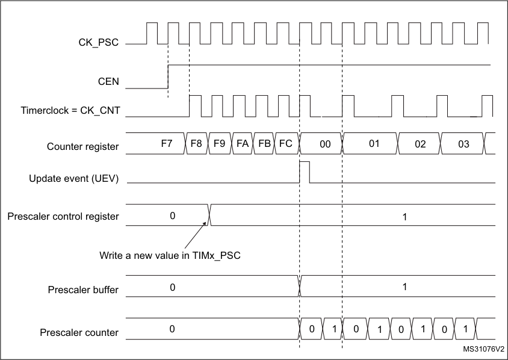

|Col1|Col2|Col3|Col4|Col5|Col6|Col7|Col8|Col9|Col10|Col11|Col12|Col13|Col14|Col15|
|---|---|---|---|---|---|---|---|---|---|---|---|---|---|---|
|F8|F9|FA|FB|FC|00|00|01|01|01|02|02|02|03|03|
|F8|F9|FA|FB|FC|||||||||||
|F8|||||||||||||||
|F8|||||||||||||||
|F8|||||||||||||||
|F8|||||||||||||||
|F8|||||0|1|0|1|0|0|1|0|0|1|

**Figure 79. Counter timing diagram with prescaler division change from 1 to 4**

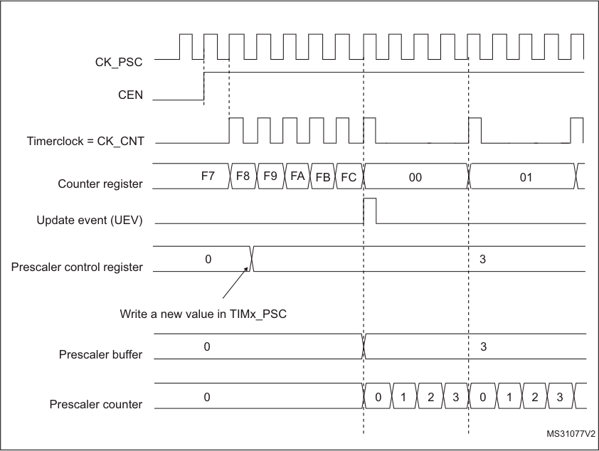

|Col1|Col2|Col3|Col4|Col5|Col6|Col7|Col8|Col9|Col10|Col11|Col12|Col13|Col14|
|---|---|---|---|---|---|---|---|---|---|---|---|---|---|
|F8|F8|F9|FA|FB|FC|00|00|00|00|01|01|01|01|
|F8|F8|F9|FA|FB|FC|||||||||
|F8||||||||||||||
|F8||||||||||||||
|F8||||||||||||||
|F8||||||||||||||
|F8||||||0|1|2|3|0|1|2|3|

374/905 RM0377 Rev 10

--- end of page=373 ---

**RM0377** **General-purpose timers (TIM2/TIM3)**

**16.3.2** **Counter modes**

**Upcounting mode**

In upcounting mode, the counter counts from 0 to the auto-reload value (content of the
TIMx_ARR register), then restarts from 0 and generates a counter overflow event.

An Update event can be generated at each counter overflow or by setting the UG bit in the
TIMx_EGR register (by software or by using the slave mode controller).

The UEV event can be disabled by software by setting the UDIS bit in TIMx_CR1 register.
This is to avoid updating the shadow registers while writing new values in the preload
registers. Then no update event occurs until the UDIS bit has been written to 0. However,
the counter restarts from 0, as well as the counter of the prescaler (but the prescale rate
does not change). In addition, if the URS bit (update request selection) in TIMx_CR1
register is set, setting the UG bit generates an update event UEV but without setting the UIF
flag (thus no interrupt or DMA request is sent). This is to avoid generating both update and
capture interrupts when clearing the counter on the capture event.

When an update event occurs, all the registers are updated and the update flag (UIF bit in
TIMx_SR register) is set (depending on the URS bit):

      - The buffer of the prescaler is reloaded with the preload value (content of the TIMx_PSC
register)

      - The auto-reload shadow register is updated with the preload value (TIMx_ARR)

The following figures show some examples of the counter behavior for different clock
frequencies when TIMx_ARR=0x36.

**Figure 80. Counter timing diagram, internal clock divided by 1**

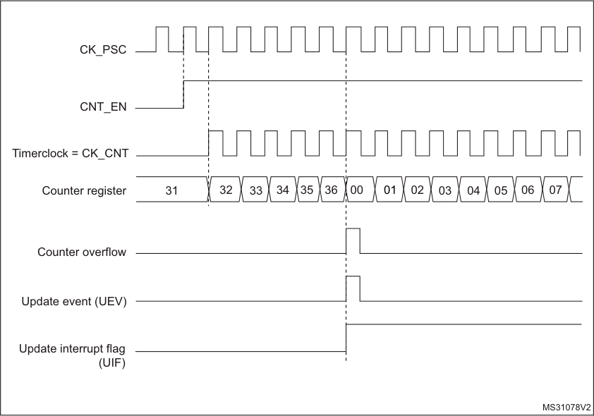

|Col1|Col2|Col3|Col4|Col5|Col6|Col7|Col8|Col9|Col10|Col11|Col12|Col13|
|---|---|---|---|---|---|---|---|---|---|---|---|---|
|32|33|34|35|36|00|01|02|03|04|05|06|07|

RM0377 Rev 10 375/905

438

--- end of page=374 ---

**General-purpose timers (TIM2/TIM3)** **RM0377**

**Figure 81. Counter timing diagram, internal clock divided by 2**

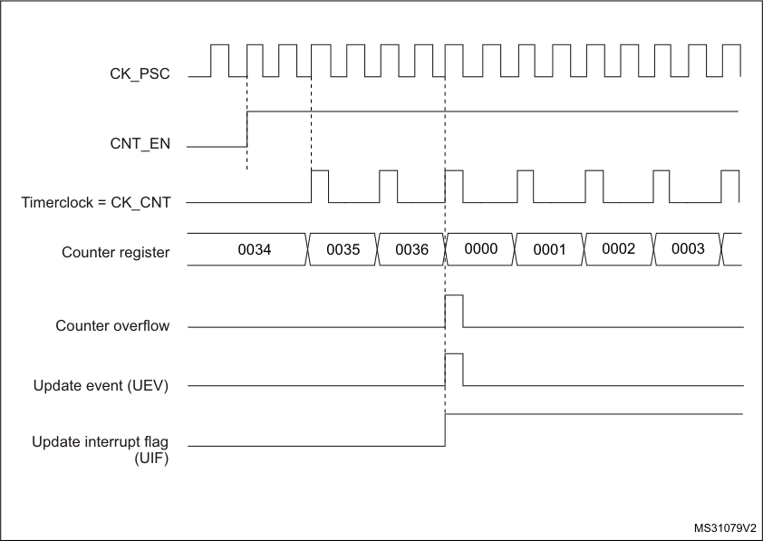

**Figure 82. Counter timing diagram, internal clock divided by 4**

376/905 RM0377 Rev 10

--- end of page=375 ---

**RM0377** **General-purpose timers (TIM2/TIM3)**

**Figure 83. Counter timing diagram, internal clock divided by N**

**Figure 84. Counter timing diagram, Update event when ARPE=0 (TIMx_ARR not**
**preloaded)**

RM0377 Rev 10 377/905

438

--- end of page=376 ---

**General-purpose timers (TIM2/TIM3)** **RM0377**

**Figure 85. Counter timing diagram, Update event when ARPE=1 (TIMx_ARR**
**preloaded)**

|Col1|Col2|Col3|Col4|Col5|Col6|Col7|Col8|
|---|---|---|---|---|---|---|---|
|F1|F2|F3|F4|F5|00|01|02|

**Downcounting mode**

In downcounting mode, the counter counts from the auto-reload value (content of the
TIMx_ARR register) down to 0, then restarts from the auto-reload value and generates a
counter underflow event.

An Update event can be generate at each counter underflow or by setting the UG bit in the
TIMx_EGR register (by software or by using the slave mode controller)

The UEV update event can be disabled by software by setting the UDIS bit in TIMx_CR1
register. This is to avoid updating the shadow registers while writing new values in the
preload registers. Then no update event occurs until UDIS bit has been written to 0.
However, the counter restarts from the current auto-reload value, whereas the counter of the
prescaler restarts from 0 (but the prescale rate doesn’t change).

In addition, if the URS bit (update request selection) in TIMx_CR1 register is set, setting the
UG bit generates an update event UEV but without setting the UIF flag (thus no interrupt or
DMA request is sent). This is to avoid generating both update and capture interrupts when
clearing the counter on the capture event.

When an update event occurs, all the registers are updated and the update flag (UIF bit in
TIMx_SR register) is set (depending on the URS bit):

      - The buffer of the prescaler is reloaded with the preload value (content of the TIMx_PSC
register).

      - The auto-reload active register is updated with the preload value (content of the
TIMx_ARR register). Note that the auto-reload is updated before the counter is
reloaded, so that the next period is the expected one.

378/905 RM0377 Rev 10

--- end of page=377 ---

**RM0377** **General-purpose timers (TIM2/TIM3)**

The following figures show some examples of the counter behavior for different clock
frequencies when TIMx_ARR=0x36.

**Figure 86. Counter timing diagram, internal clock divided by 1**

|Col1|Col2|Col3|Col4|Col5|Col6|Col7|Col8|Col9|Col10|Col11|Col12|Col13|
|---|---|---|---|---|---|---|---|---|---|---|---|---|
|04|03|02|01|00|36|35|34|33|32|31|30|2F|

**Figure 87. Counter timing diagram, internal clock divided by 2**

RM0377 Rev 10 379/905

438

--- end of page=378 ---

**General-purpose timers (TIM2/TIM3)** **RM0377**

**Figure 88. Counter timing diagram, internal clock divided by 4**

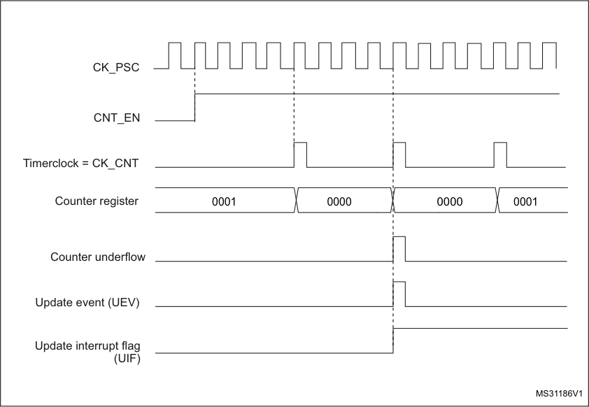

**Figure 89. Counter timing diagram, internal clock divided by N**

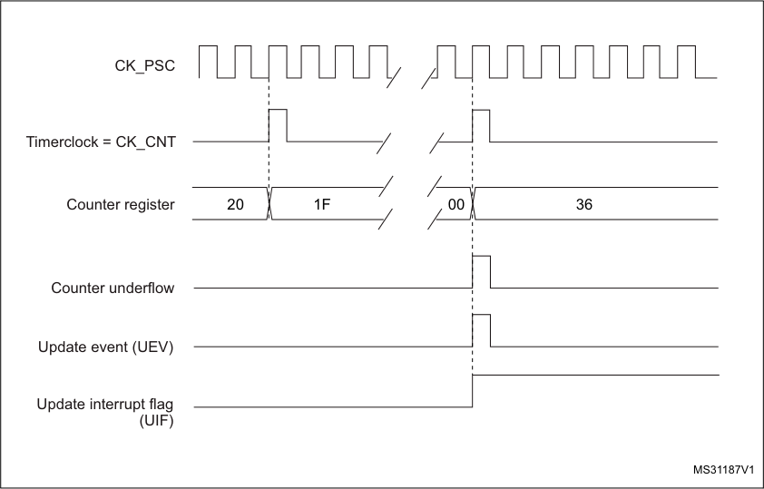

380/905 RM0377 Rev 10

--- end of page=379 ---

**RM0377** **General-purpose timers (TIM2/TIM3)**

**Figure 90. Counter timing diagram, Update event when repetition counter**
**is not used**

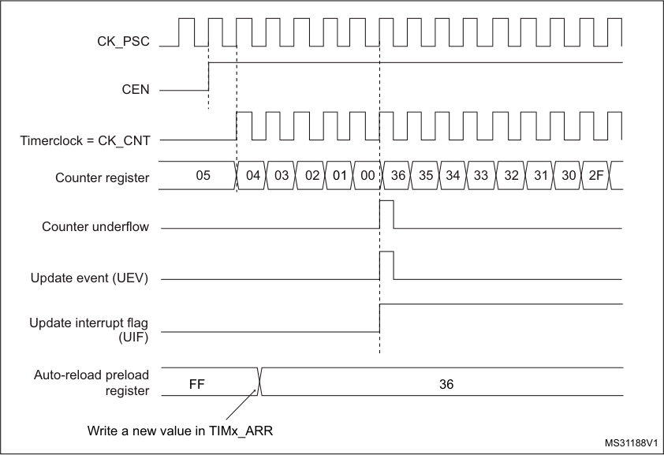

|Col1|Col2|Col3|Col4|Col5|Col6|Col7|Col8|Col9|Col10|Col11|Col12|Col13|
|---|---|---|---|---|---|---|---|---|---|---|---|---|
|04|03|02|01|00|36|35|34|33|32|31|30|2F|

**Center-aligned mode (up/down counting)**

In center-aligned mode, the counter counts from 0 to the auto-reload value (content of the
TIMx_ARR register) – 1, generates a counter overflow event, then counts from the autoreload value down to 1 and generates a counter underflow event. Then it restarts counting
from 0.

Center-aligned mode is active when the CMS bits in TIMx_CR1 register are not equal to
'00'. The Output compare interrupt flag of channels configured in output is set when: the
counter counts down (Center aligned mode 1, CMS = "01"), the counter counts up (Center
aligned mode 2, CMS = "10") the counter counts up and down (Center aligned mode 3,
CMS = "11").

In this mode, the direction bit (DIR from TIMx_CR1 register) cannot be written. It is updated
by hardware and gives the current direction of the counter.

The update event can be generated at each counter overflow and at each counter underflow
or by setting the UG bit in the TIMx_EGR register (by software or by using the slave mode
controller) also generates an update event. In this case, the counter restarts counting from
0, as well as the counter of the prescaler.

The UEV update event can be disabled by software by setting the UDIS bit in TIMx_CR1
register. This is to avoid updating the shadow registers while writing new values in the
preload registers. Then no update event occurs until the UDIS bit has been written to 0.
However, the counter continues counting up and down, based on the current auto-reload
value.

In addition, if the URS bit (update request selection) in TIMx_CR1 register is set, setting the
UG bit generates an update event UEV but without setting the UIF flag (thus no interrupt or

RM0377 Rev 10 381/905

438

--- end of page=380 ---

**General-purpose timers (TIM2/TIM3)** **RM0377**

DMA request is sent). This is to avoid generating both update and capture interrupt when
clearing the counter on the capture event.

When an update event occurs, all the registers are updated and the update flag (UIF bit in
TIMx_SR register) is set (depending on the URS bit):

      - The buffer of the prescaler is reloaded with the preload value (content of the TIMx_PSC
register).

      - The auto-reload active register is updated with the preload value (content of the
TIMx_ARR register). Note that if the update source is a counter overflow, the autoreload is updated before the counter is reloaded, so that the next period is the expected
one (the counter is loaded with the new value).

The following figures show some examples of the counter behavior for different clock
frequencies.

**Figure 91. Counter timing diagram, internal clock divided by 1, TIMx_ARR=0x6**

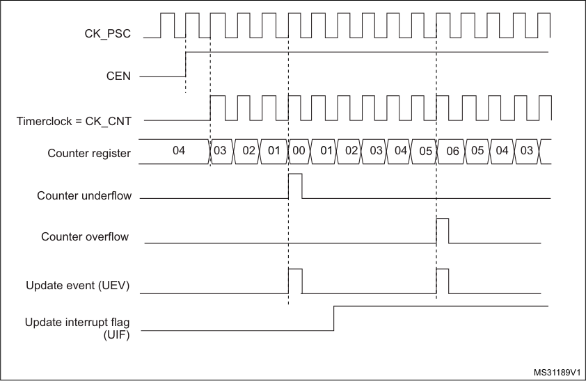

|Col1|Col2|Col3|Col4|Col5|Col6|Col7|Col8|Col9|Col10|Col11|Col12|Col13|
|---|---|---|---|---|---|---|---|---|---|---|---|---|
|03|02|01|00|01|02|03|04|05|06|05|04|03|
|03|02|01|||||||||||

1. Here, center-aligned mode 1 is used (for more details refer to _Section 16.4.1: TIMx control register 1_
_(TIMx_CR1) on page 415_ ).

382/905 RM0377 Rev 10

--- end of page=381 ---

**RM0377** **General-purpose timers (TIM2/TIM3)**

**Figure 92. Counter timing diagram, internal clock divided by 2**

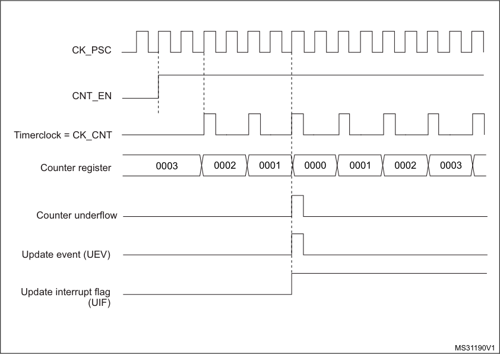

**Figure 93. Counter timing diagram, internal clock divided by 4, TIMx_ARR=0x36**

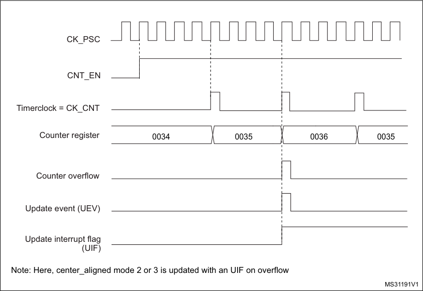

1. Center-aligned mode 2 or 3 is used with an UIF on overflow.

RM0377 Rev 10 383/905

438

--- end of page=382 ---

**General-purpose timers (TIM2/TIM3)** **RM0377**

**Figure 94. Counter timing diagram, internal clock divided by N**

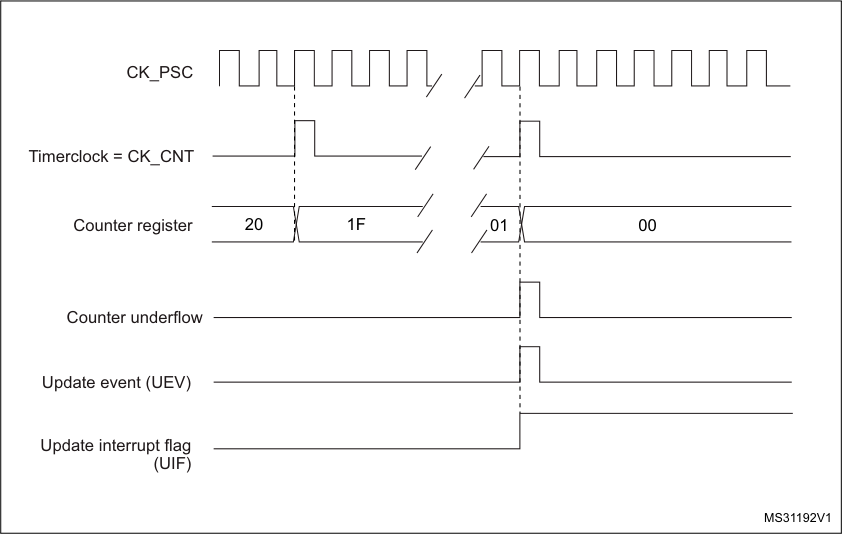

**Figure 95. Counter timing diagram, Update event with ARPE=1 (counter underflow)**

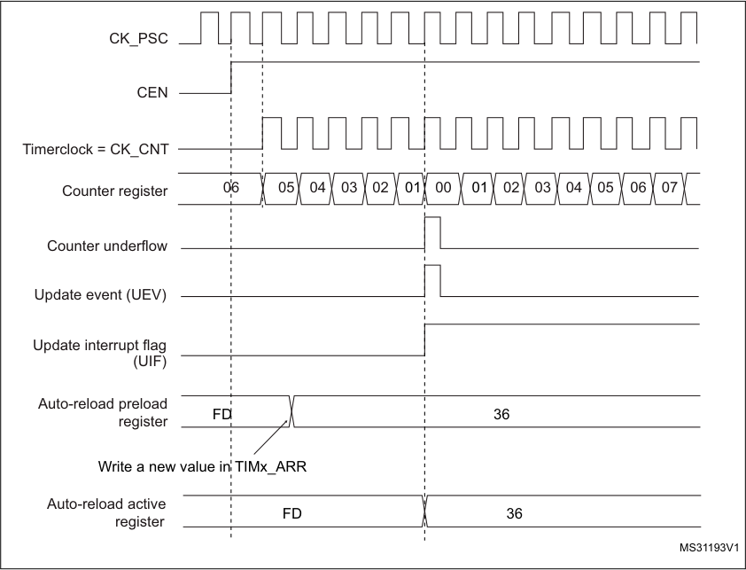

|Col1|Col2|Col3|Col4|Col5|Col6|Col7|Col8|Col9|Col10|Col11|Col12|Col13|Col14|
|---|---|---|---|---|---|---|---|---|---|---|---|---|---|
|||||||||||||||
|6|0|5 04|03|02|01|00|01|02|03|04|05|06|07|
|||||||||||||||
|||||||||||||||
|||||||||||||||
|||||||||||||||
|||||||||||||||
|TIMx_ARR|TIMx_ARR|TIMx_ARR|TIMx_ARR|TIMx_ARR|TIMx_ARR|TIMx_ARR|TIMx_ARR|TIMx_ARR|TIMx_ARR|TIMx_ARR|TIMx_ARR|TIMx_ARR|TIMx_ARR|
|FD|FD|FD|FD|FD|FD|FD|FD|FD|FD|FD|FD|FD|FD|

384/905 RM0377 Rev 10

--- end of page=383 ---

**RM0377** **General-purpose timers (TIM2/TIM3)**

**Figure 96. Counter timing diagram, Update event with ARPE=1 (counter overflow)**

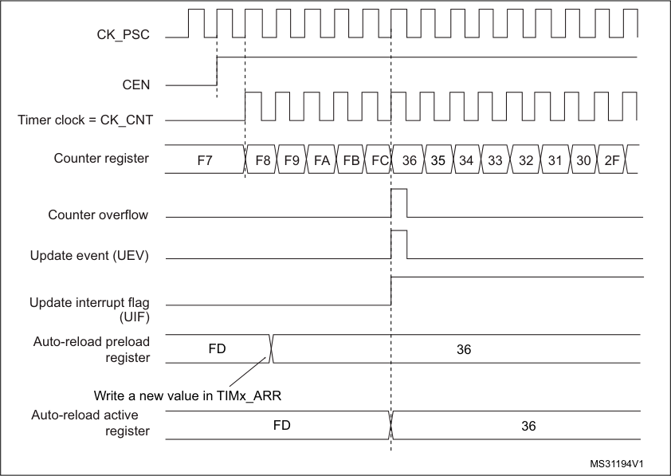

|Col1|Col2|Col3|Col4|Col5|Col6|Col7|Col8|
|---|---|---|---|---|---|---|---|
|F8|F9|FA|FB|FC|36|35|34|

**16.3.3** **Clock selection**

The counter clock can be provided by the following clock sources:

      - Internal clock (CK_INT)

      - External clock mode1: external input pin (TIx)

      - External clock mode2: external trigger input (ETR)

- Internal trigger inputs (ITRx): using one timer as prescaler for another timer. Refer to _:_
_Using one timer as prescaler for another timer on page 408_ for more details.

**Internal clock source (CK_INT)**

If the slave mode controller is disabled (SMS=000 in the TIMx_SMCR register), then the
CEN, DIR (in the TIMx_CR1 register) and UG bits (in the TIMx_EGR register) are actual
control bits and can be changed only by software (except UG which remains cleared
automatically). As soon as the CEN bit is written to 1, the prescaler is clocked by the internal
clock CK_INT.

_Figure 97_ shows the behavior of the control circuit and the upcounter in normal mode,
without prescaler.

RM0377 Rev 10 385/905

438

--- end of page=384 ---

**General-purpose timers (TIM2/TIM3)** **RM0377**

**Figure 97. Control circuit in normal mode, internal clock divided by 1**

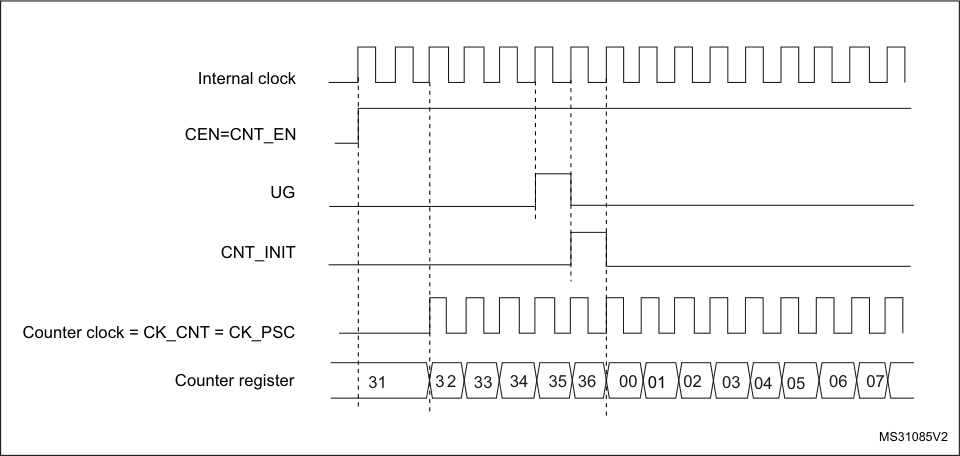

|Col1|Col2|Col3|Col4|Col5|Col6|Col7|Col8|Col9|Col10|Col11|Col12|Col13|Col14|
|---|---|---|---|---|---|---|---|---|---|---|---|---|---|
|||||||||||||||
|||||||||||||||
|||||||||||||||
|31|3 2|33|34|35|36|00|01|02|03|04|05|06|07|

**External clock source mode 1**

This mode is selected when SMS=111 in the TIMx_SMCR register. The counter can count at
each rising or falling edge on a selected input.

**Figure 98. TI2 external clock connection example**

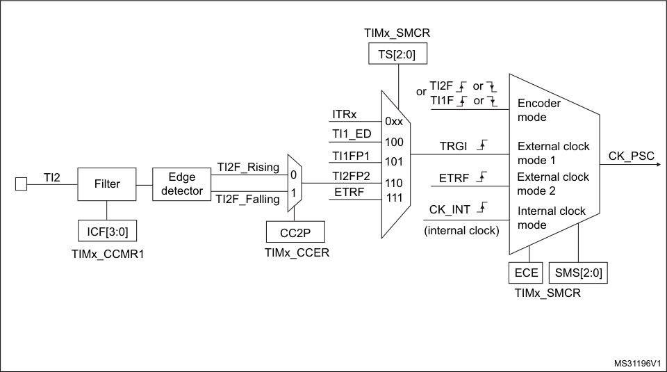

386/905 RM0377 Rev 10

--- end of page=385 ---

**RM0377** **General-purpose timers (TIM2/TIM3)**

For example, to configure the upcounter to count in response to a rising edge on the TI2
input, use the following procedure:

1. Configure channel 2 to detect rising edges on the TI2 input by writing CC2S= ‘01 in the
TIMx_CCMR1 register.

2. Configure the input filter duration by writing the IC2F[3:0] bits in the TIMx_CCMR1
register (if no filter is needed, keep IC2F=0000).

_Note:_ _The capture prescaler is not used for triggering, so it does not need to be configured._

3. Select rising edge polarity by writing CC2P=0 and CC2NP=0 in the TIMx_CCER
register.

4. Configure the timer in external clock mode 1 by writing SMS=111 in the TIMx_SMCR
register.

5. Select TI2 as the input source by writing TS=110 in the TIMx_SMCR register.

6. Enable the counter by writing CEN=1 in the TIMx_CR1 register.

For code example, refer to _A.9.1: Upcounter on TI2 rising edge code example_ .

When a rising edge occurs on TI2, the counter counts once and the TIF flag is set.

The delay between the rising edge on TI2 and the actual clock of the counter is due to the
resynchronization circuit on TI2 input.

**Figure 99. Control circuit in external clock mode 1**

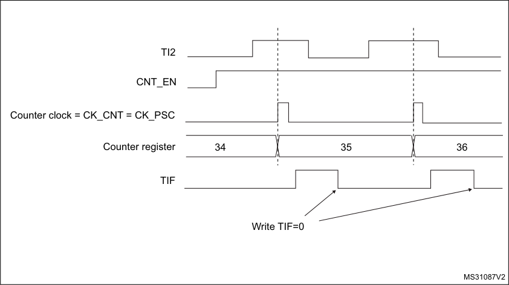

RM0377 Rev 10 387/905

438

--- end of page=386 ---

**General-purpose timers (TIM2/TIM3)** **RM0377**

**External clock source mode 2**

This mode is selected by writing ECE=1 in the TIMx_SMCR register.

The counter can count at each rising or falling edge on the external trigger input ETR.

_Figure 100_ gives an overview of the external trigger input block.

**Figure 100. External trigger input block**

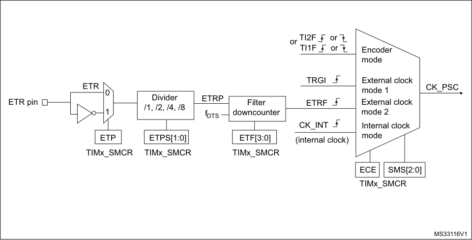

For example, to configure the upcounter to count each 2 rising edges on ETR, use the
following procedure:

1. As no filter is needed in this example, write ETF[3:0]=0000 in the TIMx_SMCR register.

2. Set the prescaler by writing ETPS[1:0]=01 in the TIMx_SMCR register

3. Select rising edge detection on the ETR pin by writing ETP=0 in the TIMx_SMCR
register

4. Enable external clock mode 2 by writing ECE=1 in the TIMx_SMCR register.

5. Enable the counter by writing CEN=1 in the TIMx_CR1 register.

For code example, refer to _A.9.2: Up counter on each 2 ETR rising edges code example_ .

The counter counts once each 2 ETR rising edges.

The delay between the rising edge on ETR and the actual clock of the counter is due to the
resynchronization circuit on the ETRP signal.

388/905 RM0377 Rev 10

--- end of page=387 ---

**RM0377** **General-purpose timers (TIM2/TIM3)**

**Figure 101. Control circuit in external clock mode 2**

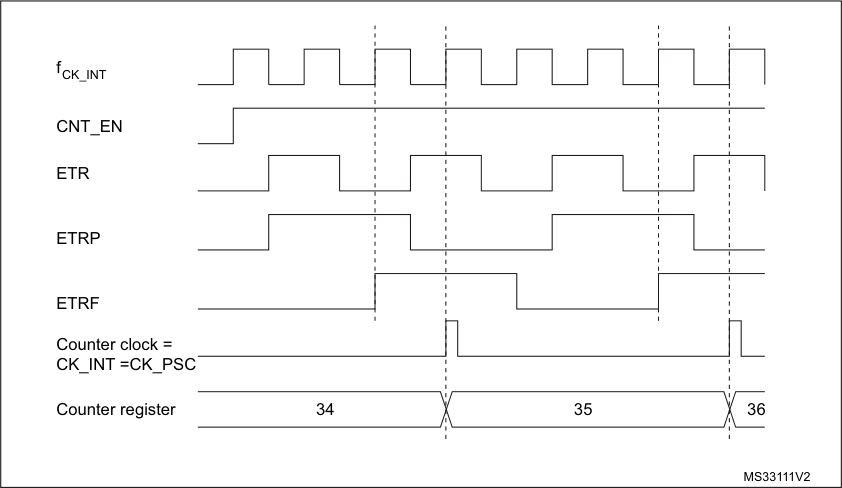

**16.3.4** **Capture/compare channels**

Each Capture/Compare channel is built around a capture/compare register (including a
shadow register), a input stage for capture (with digital filter, multiplexing and prescaler) and
an output stage (with comparator and output control).

The following figure gives an overview of one Capture/Compare channel.

The input stage samples the corresponding TIx input to generate a filtered signal TIxF.
Then, an edge detector with polarity selection generates a signal (TIxFPx) which can be
used as trigger input by the slave mode controller or as the capture command. It is
prescaled before the capture register (ICxPS).

RM0377 Rev 10 389/905

438

--- end of page=388 ---

**General-purpose timers (TIM2/TIM3)** **RM0377**

**Figure 102. Capture/compare channel (example: channel 1 input stage)**

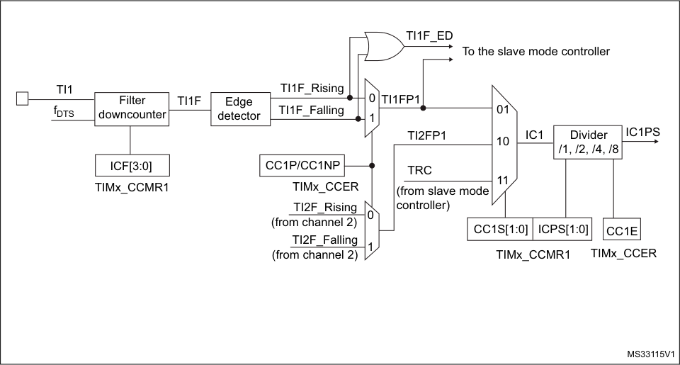

The output stage generates an intermediate waveform which is then used for reference:
OCxRef (active high). The polarity acts at the end of the chain.

**Figure 103. Capture/compare channel 1 main circuit**

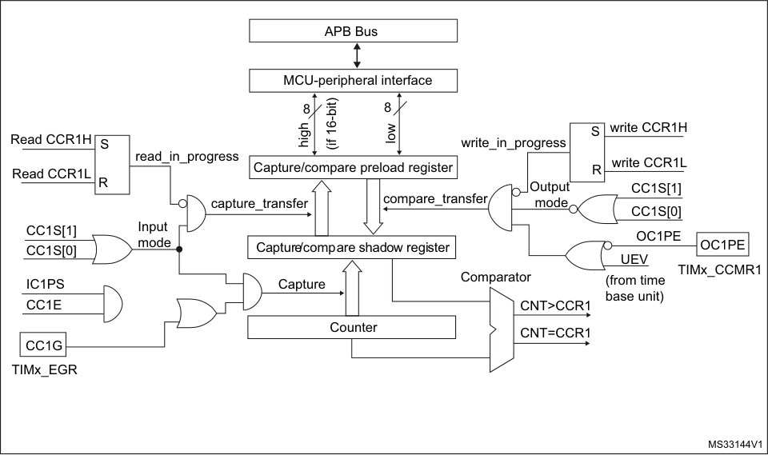

390/905 RM0377 Rev 10

--- end of page=389 ---

**RM0377** **General-purpose timers (TIM2/TIM3)**

**Figure 104. Output stage of capture/compare channel (channel 1)**

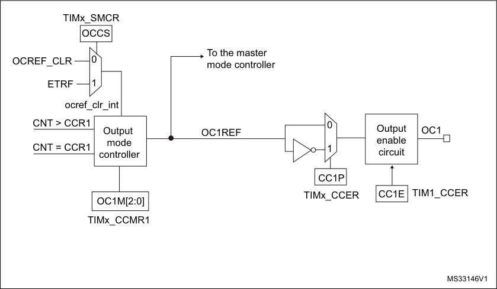

The capture/compare block is made of one preload register and one shadow register. Write
and read always access the preload register.

In capture mode, captures are actually done in the shadow register, which is copied into the
preload register.

In compare mode, the content of the preload register is copied into the shadow register
which is compared to the counter.

**16.3.5** **Input capture mode**

In Input capture mode, the Capture/Compare Registers (TIMx_CCRx) are used to latch the
value of the counter after a transition detected by the corresponding ICx signal. When a
capture occurs, the corresponding CCXIF flag (TIMx_SR register) is set and an interrupt or
a DMA request can be sent if they are enabled. If a capture occurs while the CCxIF flag was
already high, then the over-capture flag CCxOF (TIMx_SR register) is set. CCxIF can be
cleared by software by writing it to 0 or by reading the captured data stored in the
TIMx_CCRx register. CCxOF is cleared when it is written with 0.

The following example shows how to capture the counter value in TIMx_CCR1 when TI1
input rises. To do this, use the following procedure:

1. Select the active input: TIMx_CCR1 must be linked to the TI1 input, so write the CC1S
bits to 01 in the TIMx_CCMR1 register. As soon as CC1S becomes different from 00,
the channel is configured in input and the TIMx_CCR1 register becomes read-only.

2. Program the appropriate input filter duration in relation with the signal connected to the
timer (when the input is one of the TIx (ICxF bits in the TIMx_CCMRx register). Let’s
imagine that, when toggling, the input signal is not stable during at must 5 internal clock
cycles. We must program a filter duration longer than these 5 clock cycles. We can
validate a transition on TI1 when 8 consecutive samples with the new level have been

RM0377 Rev 10 391/905

438

--- end of page=390 ---

**General-purpose timers (TIM2/TIM3)** **RM0377**

detected (sampled at f DTS frequency). Then write IC1F bits to 0011 in the
TIMx_CCMR1 register.

3. Select the edge of the active transition on the TI1 channel by writing the CC1P and
CC1NP bits to 00 in the TIMx_CCER register (rising edge in this case).

4. Program the input prescaler. In our example, we wish the capture to be performed at
each valid transition, so the prescaler is disabled (write IC1PS bits to 00 in the
TIMx_CCMR1 register).

5. Enable capture from the counter into the capture register by setting the CC1E bit in the
TIMx_CCER register.

6. If needed, enable the related interrupt request by setting the CC1IE bit in the
TIMx_DIER register, and/or the DMA request by setting the CC1DE bit in the
TIMx_DIER register.

For code example, refer to _A.9.3: Input capture configuration code example_ .

When an input capture occurs:

      - The TIMx_CCR1 register gets the value of the counter on the active transition.

      - CC1IF flag is set (interrupt flag). CC1OF is also set if at least two consecutive captures
occurred whereas the flag was not cleared.

      - An interrupt is generated depending on the CC1IE bit.

      - A DMA request is generated depending on the CC1DE bit.

For code example, refer to _A.9.4: Input capture data management code example_ .

In order to handle the overcapture, it is recommended to read the data before the
overcapture flag. This is to avoid missing an overcapture which could happen after reading
the flag and before reading the data.

_Note:_ _IC interrupt and/or DMA requests can be generated by software by setting the_
_corresponding CCxG bit in the TIMx_EGR register._

392/905 RM0377 Rev 10

--- end of page=391 ---

**RM0377** **General-purpose timers (TIM2/TIM3)**

**16.3.6** **PWM input mode**

This mode is a particular case of input capture mode. The procedure is the same except:

      - Two ICx signals are mapped on the same TIx input.

      - These 2 ICx signals are active on edges with opposite polarity.

      - One of the two TIxFP signals is selected as trigger input and the slave mode controller
is configured in reset mode.

For example, one can measure the period (in TIMx_CCR1 register) and the duty cycle (in
TIMx_CCR2 register) of the PWM applied on TI1 using the following procedure (depending
on CK_INT frequency and prescaler value):

1. Select the active input for TIMx_CCR1: write the CC1S bits to 01 in the TIMx_CCMR1
register (TI1 selected).

2. Select the active polarity for TI1FP1 (used both for capture in TIMx_CCR1 and counter
clear): write the CC1P to ‘0’ and the CC1NP bit to ‘0’ (active on rising edge).

3. Select the active input for TIMx_CCR2: write the CC2S bits to 10 in the TIMx_CCMR1
register (TI1 selected).

4. Select the active polarity for TI1FP2 (used for capture in TIMx_CCR2): write the CC2P
bit to ‘1’ and the CC2NP bit to ’0’(active on falling edge).

5. Select the valid trigger input: write the TS bits to 101 in the TIMx_SMCR register
(TI1FP1 selected).

6. Configure the slave mode controller in reset mode: write the SMS bits to 100 in the
TIMx_SMCR register.

7. Enable the captures: write the CC1E and CC2E bits to ‘1 in the TIMx_CCER register.

For code example, refer to _A.9.5: PWM input configuration code example_ .

**Figure 105. PWM input mode timing**

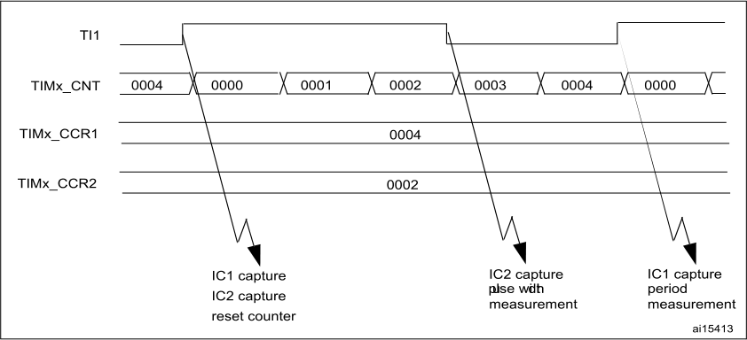

RM0377 Rev 10 393/905

438

--- end of page=392 ---

**General-purpose timers (TIM2/TIM3)** **RM0377**

**16.3.7** **Forced output mode**

In output mode (CCxS bits = 00 in the TIMx_CCMRx register), each output compare signal
(OCxREF and then OCx) can be forced to active or inactive level directly by software,
independently of any comparison between the output compare register and the counter.

To force an output compare signal (OCxREF/OCx) to its active level, one just needs to write
101 in the OCxM bits in the corresponding TIMx_CCMRx register. Thus OCxREF is forced
high (OCxREF is always active high) and OCx get opposite value to CCxP polarity bit.

e.g.: CCxP=0 (OCx active high) => OCx is forced to high level.

OCxREF signal can be forced low by writing the OCxM bits to 100 in the TIMx_CCMRx
register.

Anyway, the comparison between the TIMx_CCRx shadow register and the counter is still
performed and allows the flag to be set. Interrupt and DMA requests can be sent
accordingly. This is described in the Output Compare Mode section.

**16.3.8** **Output compare mode**

This function is used to control an output waveform or indicating when a period of time has
elapsed.

When a match is found between the capture/compare register and the counter, the output
compare function:

      - Assigns the corresponding output pin to a programmable value defined by the output
compare mode (OCxM bits in the TIMx_CCMRx register) and the output polarity (CCxP
bit in the TIMx_CCER register). The output pin can keep its level (OCXM=000), be set
active (OCxM=001), be set inactive (OCxM=010) or can toggle (OCxM=011) on match.

      - Sets a flag in the interrupt status register (CCxIF bit in the TIMx_SR register).

      - Generates an interrupt if the corresponding interrupt mask is set (CCXIE bit in the
TIMx_DIER register).

      - Sends a DMA request if the corresponding enable bit is set (CCxDE bit in the
TIMx_DIER register, CCDS bit in the TIMx_CR2 register for the DMA request
selection).

The TIMx_CCRx registers can be programmed with or without preload registers using the
OCxPE bit in the TIMx_CCMRx register.

In output compare mode, the update event UEV has no effect on OCxREF and OCx output.
The timing resolution is one count of the counter. Output compare mode can also be used to
output a single pulse (in One-pulse mode).

Procedure:

1. Select the counter clock (internal, external, prescaler).

2. Write the desired data in the TIMx_ARR and TIMx_CCRx registers.

3. Set the CCxIE and/or CCxDE bits if an interrupt and/or a DMA request is to be
generated.

4. Select the output mode. For example, one must write OCxM=011, OCxPE=0, CCxP=0
and CCxE=1 to toggle OCx output pin when CNT matches CCRx, CCRx preload is not
used, OCx is enabled and active high.

5. Enable the counter by setting the CEN bit in the TIMx_CR1 register.

For code example, refer to _A.9.7: Output compare configuration code example_ .

394/905 RM0377 Rev 10

--- end of page=393 ---

**RM0377** **General-purpose timers (TIM2/TIM3)**

The TIMx_CCRx register can be updated at any time by software to control the output
waveform, provided that the preload register is not enabled (OCxPE=0, else TIMx_CCRx
shadow register is updated only at the next update event UEV). An example is given in
_Figure 106_ .

**Figure 106. Output compare mode, toggle on OC1.**

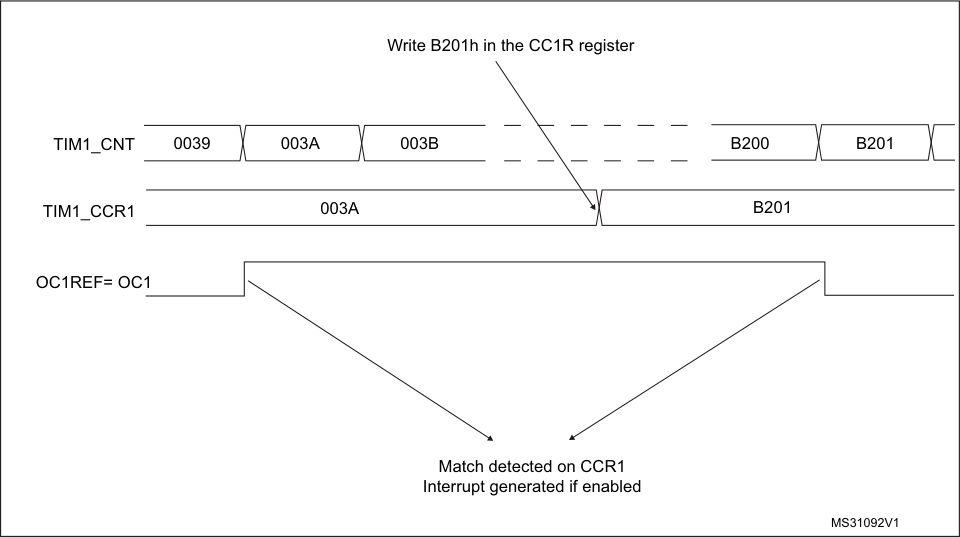

**16.3.9** **PWM mode**

Pulse width modulation mode allows to generate a signal with a frequency determined by
the value of the TIMx_ARR register and a duty cycle determined by the value of the
TIMx_CCRx register.

The PWM mode can be selected independently on each channel (one PWM per OCx
output) by writing 110 (PWM mode 1) or ‘111 (PWM mode 2) in the OCxM bits in the
TIMx_CCMRx register. The corresponding preload register must be enabled by setting the
OCxPE bit in the TIMx_CCMRx register, and eventually the auto-reload preload register (in
upcounting or center-aligned modes) by setting the ARPE bit in the TIMx_CR1 register.

As the preload registers are transferred to the shadow registers only when an update event
occurs, before starting the counter, all registers must be initialized by setting the UG bit in
the TIMx_EGR register.

OCx polarity is software programmable using the CCxP bit in the TIMx_CCER register. It
can be programmed as active high or active low. OCx output is enabled by the CCxE bit in
the TIMx_CCER register. Refer to the TIMx_CCERx register description for more details.

RM0377 Rev 10 395/905

438

--- end of page=394 ---

**General-purpose timers (TIM2/TIM3)** **RM0377**

In PWM mode (1 or 2), TIMx_CNT and TIMx_CCRx are always compared to determine
whether TIMx_CCRx ≤ TIMx_CNT or TIMx_CNT ≤ TIMx_CCRx (depending on the direction
of the counter). However, to comply with the OCREF_CLR functionality (OCREF can be
cleared by an external event through the ETR signal until the next PWM period), the
OCREF signal is asserted only:

      - When the result of the comparison changes, or

      - When the output compare mode (OCxM bits in TIMx_CCMRx register) switches from
the “frozen” configuration (no comparison, OCxM=‘000) to one of the PWM modes
(OCxM=‘110 or ‘111).

This forces the PWM by software while the timer is running.

The timer is able to generate PWM in edge-aligned mode or center-aligned mode
depending on the CMS bits in the TIMx_CR1 register.

**PWM edge-aligned mode**

Upcounting configuration

Upcounting is active when the DIR bit in the TIMx_CR1 register is low. Refer to _Section :_
_Upcounting mode on page 375_ .

In the following example, we consider PWM mode 1. The reference PWM signal OCxREF is
high as long as TIMx_CNT <TIMx_CCRx else it becomes low. If the compare value in
TIMx_CCRx is greater than the auto-reload value (in TIMx_ARR) then OCxREF is held at ‘1.
If the compare value is 0 then OCxREF is held at ‘0. _Figure 107_ shows some edge-aligned
PWM waveforms in an example where TIMx_ARR=8.

For code example, refer to _A.9.8: Edge-aligned PWM configuration example_ .

**Figure 107. Edge-aligned PWM waveforms (ARR=8)**

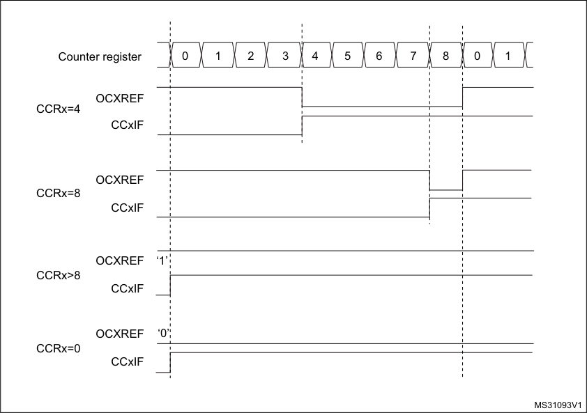

|0|1|2|3|4|5|
|---|---|---|---|---|---|
|||||||
|||||||

|Col1|7|8|0|1|
|---|---|---|---|---|
||7||||
||||||
||||||
||||||

396/905 RM0377 Rev 10

--- end of page=395 ---

**RM0377** **General-purpose timers (TIM2/TIM3)**

**Downcounting configuration**

Downcounting is active when DIR bit in TIMx_CR1 register is high. Refer to _Section :_
_Downcounting mode on page 378_ .

In PWM mode 1, the reference signal OCxREF is low as long as TIMx_CNT>TIMx_CCRx
else it becomes high. If the compare value in TIMx_CCRx is greater than the auto-reload
value in TIMx_ARR, then OCxREF is held at ‘1. 0% PWM is not possible in this mode.

**PWM center-aligned mode**

Center-aligned mode is active when the CMS bits in TIMx_CR1 register are different from
‘00 (all the remaining configurations having the same effect on the OCxREF/OCx signals).
The compare flag is set when the counter counts up, when it counts down or both when it
counts up and down depending on the CMS bits configuration. The direction bit (DIR) in the
TIMx_CR1 register is updated by hardware and must not be changed by software. Refer to
_Section : Center-aligned mode (up/down counting) on page 381_ .

_Figure 108_ shows some center-aligned PWM waveforms in an example where:

      - TIMx_ARR=8,

      - PWM mode is the PWM mode 1,

      - The flag is set when the counter counts down corresponding to the center-aligned
mode 1 selected for CMS=01 in TIMx_CR1 register.

For code example, refer to _A.9.9: Center-aligned PWM configuration example_ .

RM0377 Rev 10 397/905

438

--- end of page=396 ---

**General-purpose timers (TIM2/TIM3)** **RM0377**

**Figure 108. Center-aligned PWM waveforms (ARR=8)**

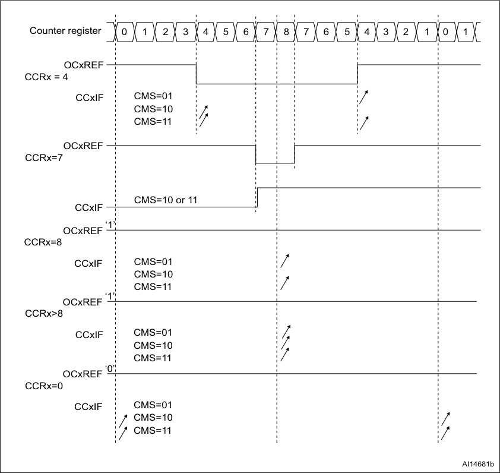

|Col1|7|8|
|---|---|---|
||||
||||
||||
||||
|CMS=01 CMS=10 CMS=11|CMS=01 CMS=10 CMS=11||
|CMS=01 CMS=10 CMS=11|CMS=01 CMS=10 CMS=11||

Hints on using center-aligned mode:

      - When starting in center-aligned mode, the current up-down configuration is used. It
means that the counter counts up or down depending on the value written in the DIR bit
in the TIMx_CR1 register. Moreover, the DIR and CMS bits must not be changed at the
same time by the software.

      - Writing to the counter while running in center-aligned mode is not recommended as it
can lead to unexpected results. In particular:

–
The direction is not updated if a value greater than the auto-reload value is written
in the counter (TIMx_CNT>TIMx_ARR). For example, if the counter was counting
up, it continues to count up.

–
The direction is updated if 0 or the TIMx_ARR value is written in the counter but no
Update Event UEV is generated.

      - The safest way to use center-aligned mode is to generate an update by software
(setting the UG bit in the TIMx_EGR register) just before starting the counter and not to
write the counter while it is running.

398/905 RM0377 Rev 10

--- end of page=397 ---

**RM0377** **General-purpose timers (TIM2/TIM3)**

**16.3.10** **One-pulse mode**

One-pulse mode (OPM) is a particular case of the previous modes. It allows the counter to
be started in response to a stimulus and to generate a pulse with a programmable length
after a programmable delay.

Starting the counter can be controlled through the slave mode controller. Generating the
waveform can be done in output compare mode or PWM mode. One-pulse mode is selected
by setting the OPM bit in the TIMx_CR1 register. This makes the counter stop automatically
at the next update event UEV.

A pulse can be correctly generated only if the compare value is different from the counter
initial value. Before starting (when the timer is waiting for the trigger), the configuration must
be:

      - In upcounting: CNT<CCRx ≤ ARR (in particular, 0<CCRx),

      - In downcounting: CNT>CCRx.

**Figure 109. Example of one-pulse mode.**

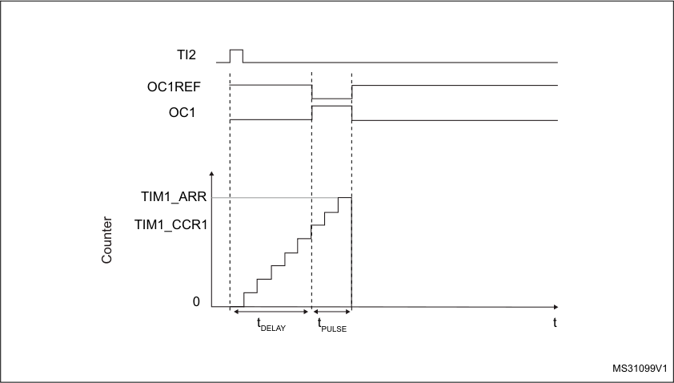

For example one may want to generate a positive pulse on OC1 with a length of t PULSE and
after a delay of t DELAY as soon as a positive edge is detected on the TI2 input pin.

Let’s use TI2FP2 as trigger 1:

1. Map TI2FP2 on TI2 by writing CC2S=01 in the TIMx_CCMR1 register.

2. TI2FP2 must detect a rising edge, write CC2P=0 and CC2NP=’0’ in the TIMx_CCER
register.

3. Configure TI2FP2 as trigger for the slave mode controller (TRGI) by writing TS=110 in
the TIMx_SMCR register.

4. TI2FP2 is used to start the counter by writing SMS to ‘110 in the TIMx_SMCR register
(trigger mode).

For code example, refer to _A.9.16: One-Pulse mode code example_ .

RM0377 Rev 10 399/905

438

--- end of page=398 ---

**General-purpose timers (TIM2/TIM3)** **RM0377**

The OPM waveform is defined by writing the compare registers (taking into account the
clock frequency and the counter prescaler).

      - The t DELAY is defined by the value written in the TIMx_CCR1 register.

      - The t PULSE is defined by the difference between the auto-reload value and the compare
value (TIMx_ARR - TIMx_CCR1+1).

      - Let’s say one want to build a waveform with a transition from ‘0 to ‘1 when a compare
match occurs and a transition from ‘1 to ‘0 when the counter reaches the auto-reload
value. To do this PWM mode 2 must be enabled by writing OC1M=111 in the
TIMx_CCMR1 register. Optionally the preload registers can be enabled by writing
OC1PE=1 in the TIMx_CCMR1 register and ARPE in the TIMx_CR1 register. In this
case one has to write the compare value in the TIMx_CCR1 register, the auto-reload
value in the TIMx_ARR register, generate an update by setting the UG bit and wait for
external trigger event on TI2. CC1P is written to ‘0 in this example.

In our example, the DIR and CMS bits in the TIMx_CR1 register should be low.

Since only 1 pulse (Single mode) is needed, a 1 must be written in the OPM bit in the
TIMx_CR1 register to stop the counter at the next update event (when the counter rolls over
from the auto-reload value back to 0). When OPM bit in the TIMx_CR1 register is set to '0',
so the Repetitive Mode is selected.

**Particular case: OCx fast enable:**

In One-pulse mode, the edge detection on TIx input set the CEN bit which enables the
counter. Then the comparison between the counter and the compare value makes the
output toggle. But several clock cycles are needed for these operations and it limits the
minimum delay t DELAY min we can get.

If one wants to output a waveform with the minimum delay, the OCxFE bit can be set in the
TIMx_CCMRx register. Then OCxRef (and OCx) is forced in response to the stimulus,
without taking in account the comparison. Its new level is the same as if a compare match
had occurred. OCxFE acts only if the channel is configured in PWM1 or PWM2 mode.

For code example, refer to _A.9.16: One-Pulse mode code example_ .

**16.3.11** **Clearing the OCxREF signal on an external event**

1. The external trigger prescaler should be kept off: bits ETPS[1:0] in the TIMx_SMCR
register are cleared to 00.

2. The external clock mode 2 must be disabled: bit ECE in the TIMx_SMCR register is
cleared to 0.

3. The external trigger polarity (ETP) and the external trigger filter (ETF) can be
configured according to the application’s needs.

For code example, refer to _A.9.10: ETR configuration to clear OCxREF code example_ .

_Figure 110_ shows the behavior of the OCxREF signal when the ETRF input becomes high,
for both values of the OCxCE enable bit. In this example, the timer TIMx is programmed in
PWM mode.

400/905 RM0377 Rev 10

--- end of page=399 ---

