# RM0377 STM32L0x1 — Pages 401–450

**RM0377** **General-purpose timers (TIM2/TIM3)**

**Figure 110. Clearing TIMx OCxREF**

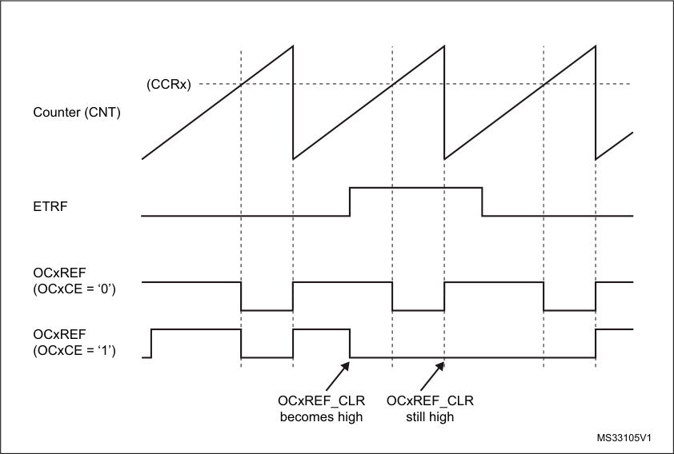

1. In case of a PWM with a 100% duty cycle (if CCRx>ARR), OCxREF is enabled again at the next counter
overflow.

**16.3.12** **Encoder interface mode**

To select Encoder Interface mode write SMS=‘001 in the TIMx_SMCR register if the counter
is counting on TI2 edges only, SMS=010 if it is counting on TI1 edges only and SMS=011 if
it is counting on both TI1 and TI2 edges.

Select the TI1 and TI2 polarity by programming the CC1P and CC2P bits in the TIMx_CCER
register. CC1NP and CC2NP must be kept cleared. When needed, the input filter can be
programmed as well.

The two inputs TI1 and TI2 are used to interface to an incremental encoder. Refer to
_Table 76_ . The counter is clocked by each valid transition on TI1FP1 or TI2FP2 (TI1 and TI2
after input filter and polarity selection, TI1FP1=TI1 if not filtered and not inverted,
TI2FP2=TI2 if not filtered and not inverted) assuming that it is enabled (CEN bit in
TIMx_CR1 register written to ‘1). The sequence of transitions of the two inputs is evaluated
and generates count pulses as well as the direction signal. Depending on the sequence the
counter counts up or down, the DIR bit in the TIMx_CR1 register is modified by hardware
accordingly. The DIR bit is calculated at each transition on any input (TI1 or TI2), whatever
the counter is counting on TI1 only, TI2 only or both TI1 and TI2.

Encoder interface mode acts simply as an external clock with direction selection. This
means that the counter just counts continuously between 0 and the auto-reload value in the
TIMx_ARR register (0 to ARR or ARR down to 0 depending on the direction). So the
TIMx_ARR must be configured before starting. In the same way, the capture, compare,
prescaler, trigger output features continue to work as normal.

In this mode, the counter is modified automatically following the speed and the direction of
the incremental encoder and its content, therefore, always represents the encoder’s

RM0377 Rev 10 401/905

438

--- end of page=400 ---

**General-purpose timers (TIM2/TIM3)** **RM0377**

position. The count direction correspond to the rotation direction of the connected sensor.
The table summarizes the possible combinations, assuming TI1 and TI2 do not switch at the
same time.

**Table 76. Counting direction versus encoder signals**

|Active edge|Level on opposite signal (TI1FP1 for TI2, TI2FP2 for TI1)|TI1FP1 signal|Col4|TI2FP2 signal|Col6|
|---|---|---|---|---|---|
|**Active edge**|**Level on opposite** **signal (TI1FP1 for** **TI2, TI2FP2 for TI1)**|**Rising**|**Falling**|**Rising**|**Falling**|
|Counting on TI1 only|High|Down|Up|No Count|No Count|
|Counting on TI1 only|Low|Up|Down|No Count|No Count|
|Counting on TI2 only|High|No Count|No Count|Up|Down|
|Counting on TI2 only|Low|No Count|No Count|Down|Up|
|Counting on TI1 and TI2|High|Down|Up|Up|Down|
|Counting on TI1 and TI2|Low|Up|Down|Down|Up|

An external incremental encoder can be connected directly to the MCU without external
interface logic. However, comparators are normally be used to convert the encoder’s
differential outputs to digital signals. This greatly increases noise immunity. The third
encoder output which indicate the mechanical zero position, may be connected to an
external interrupt input and trigger a counter reset.

_Figure 111_ gives an example of counter operation, showing count signal generation and
direction control. It also shows how input jitter is compensated where both edges are
selected. This might occur if the sensor is positioned near to one of the switching points. For
this example we assume that the configuration is the following:

      - CC1S= 01 (TIMx_CCMR1 register, TI1FP1 mapped on TI1)

      - CC2S= 01 (TIMx_CCMR2 register, TI2FP2 mapped on TI2)

      - CC1P=0, CC1NP = ‘0’ (TIMx_CCER register, TI1FP1 noninverted, TI1FP1=TI1)

      - CC2P=0, CC2NP = ‘0’ (TIMx_CCER register, TI2FP2 noninverted, TI2FP2=TI2)

      - SMS= 011 (TIMx_SMCR register, both inputs are active on both rising and falling
edges)

      - CEN= 1 (TIMx_CR1 register, Counter is enabled)

For code example, refer to _A.9.11: Encoder interface code example_ .

402/905 RM0377 Rev 10

--- end of page=401 ---

**RM0377** **General-purpose timers (TIM2/TIM3)**

**Figure 111. Example of counter operation in encoder interface mode**

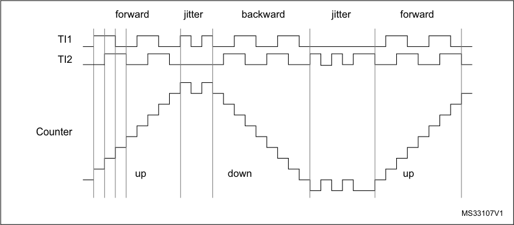

_Figure 112_ gives an example of counter behavior when TI1FP1 polarity is inverted (same
configuration as above except CC1P=1).

**Figure 112. Example of encoder interface mode with TI1FP1 polarity inverted**

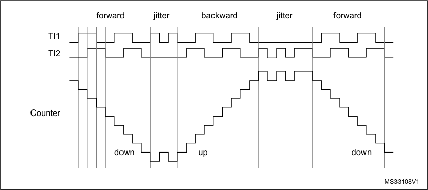

The timer, when configured in Encoder Interface mode provides information on the sensor’s
current position. Dynamic information can be obtained (speed, acceleration, deceleration)
by measuring the period between two encoder events using a second timer configured in
capture mode. The output of the encoder which indicates the mechanical zero can be used
for this purpose. Depending on the time between two events, the counter can also be read
at regular times. This can be done by latching the counter value into a third input capture
register if available (then the capture signal must be periodic and can be generated by
another timer). when available, it is also possible to read its value through a DMA request
generated by a Real-Time clock.

**16.3.13** **Timer input XOR function**

The TI1S bit in the TIMx_CR2 register, allows the input filter of channel 1 to be connected to
the output of a XOR gate, combining the three input pins TIMx_CH1 to TIMx_CH3.

The XOR output can be used with all the timer input functions such as trigger or input
capture.

RM0377 Rev 10 403/905

438

--- end of page=402 ---

**General-purpose timers (TIM2/TIM3)** **RM0377**

**16.3.14** **Timers and external trigger synchronization**

The TIMx Timers can be synchronized with an external trigger in several modes: Reset
mode, Gated mode and Trigger mode.

**Slave mode: Reset mode**

The counter and its prescaler can be reinitialized in response to an event on a trigger input.
Moreover, if the URS bit from the TIMx_CR1 register is low, an update event UEV is
generated. Then all the preloaded registers (TIMx_ARR, TIMx_CCRx) are updated.

In the following example, the upcounter is cleared in response to a rising edge on TI1 input:

      - Configure the channel 1 to detect rising edges on TI1. Configure the input filter duration
(in this example, we do not need any filter, so we keep IC1F=0000). The capture
prescaler is not used for triggering, so it does not need to be configured. The CC1S bits
select the input capture source only, CC1S = 01 in the TIMx_CCMR1 register. Write
CC1P=0 and CC1NP=0 in TIMx_CCER register to validate the polarity (and detect
rising edges only).

      - Configure the timer in reset mode by writing SMS=100 in TIMx_SMCR register. Select
TI1 as the input source by writing TS=101 in TIMx_SMCR register.

      - Start the counter by writing CEN=1 in the TIMx_CR1 register.

For code example, refer to _A.9.12: Reset mode code example_ .

The counter starts counting on the internal clock, then behaves normally until TI1 rising
edge. When TI1 rises, the counter is cleared and restarts from 0. In the meantime, the
trigger flag is set (TIF bit in the TIMx_SR register) and an interrupt request, or a DMA
request can be sent if enabled (depending on the TIE and TDE bits in TIMx_DIER register).

The following figure shows this behavior when the auto-reload register TIMx_ARR=0x36.
The delay between the rising edge on TI1 and the actual reset of the counter is due to the
resynchronization circuit on TI1 input.

**Figure 113. Control circuit in reset mode**

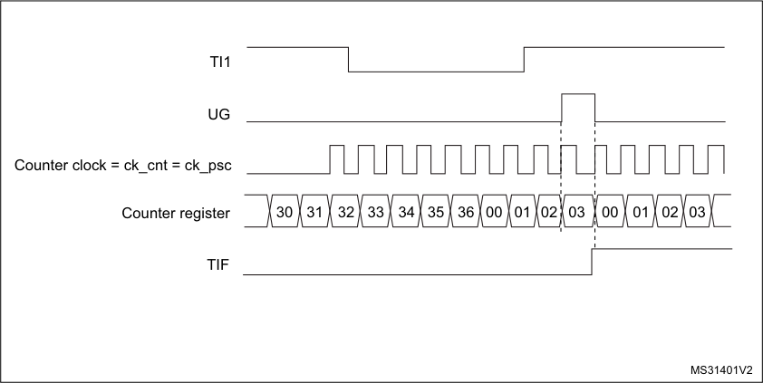

|Col1|Col2|Col3|Col4|Col5|Col6|Col7|Col8|Col9|Col10|Col11|Col12|Col13|Col14|Col15|
|---|---|---|---|---|---|---|---|---|---|---|---|---|---|---|
|30|31|32|33|34|35|36|00|01|02|03|00|01|02|03|

404/905 RM0377 Rev 10

--- end of page=403 ---

**RM0377** **General-purpose timers (TIM2/TIM3)**

**Slave mode: Gated mode**

The counter can be enabled depending on the level of a selected input.

In the following example, the upcounter counts only when TI1 input is low:

1. Configure the channel 1 to detect low levels on TI1. Configure the input filter duration
(in this example, we do not need any filter, so we keep IC1F=0000). The capture
prescaler is not used for triggering, so it does not need to be configured. The CC1S bits
select the input capture source only, CC1S=01 in TIMx_CCMR1 register. Write
CC1P=1 and CC1NP=0 in TIMx_CCER register to validate the polarity (and detect low
level only).

2. Configure the timer in gated mode by writing SMS=101 in TIMx_SMCR register. Select
TI1 as the input source by writing TS=101 in TIMx_SMCR register.

3. Enable the counter by writing CEN=1 in the TIMx_CR1 register (in gated mode, the
counter doesn’t start if CEN=0, whatever is the trigger input level).

For code example, refer to _A.9.13: Gated mode code example_ .

The counter starts counting on the internal clock as long as TI1 is low and stops as soon as
TI1 becomes high. The TIF flag in the TIMx_SR register is set both when the counter starts
or stops.

The delay between the rising edge on TI1 and the actual stop of the counter is due to the
resynchronization circuit on TI1 input.

**Figure 114. Control circuit in gated mode**

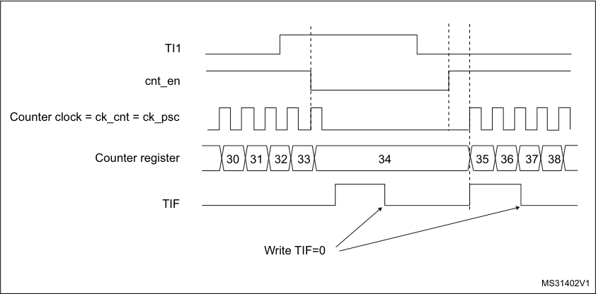

1. The configuration “CCxP=CCxNP=1” (detection of both rising and falling edges) does not have any effect
in gated mode because gated mode acts on a level and not on an edge.

RM0377 Rev 10 405/905

438

--- end of page=404 ---

**General-purpose timers (TIM2/TIM3)** **RM0377**

**Slave mode: Trigger mode**

The counter can start in response to an event on a selected input.

In the following example, the upcounter starts in response to a rising edge on TI2 input:

1. Configure the channel 2 to detect rising edges on TI2. Configure the input filter duration
(in this example, we do not need any filter, so we keep IC2F=0000). The capture
prescaler is not used for triggering, so it does not need to be configured. CC2S bits are
selecting the input capture source only, CC2S=01 in TIMx_CCMR1 register. Write
CC2P=1 and CC2NP=0 in TIMx_CCER register to validate the polarity (and detect low
level only).

2. Configure the timer in trigger mode by writing SMS=110 in TIMx_SMCR register. Select
TI2 as the input source by writing TS=110 in TIMx_SMCR register.

For code example, refer to _A.9.14: Trigger mode code example_ .

When a rising edge occurs on TI2, the counter starts counting on the internal clock and the
TIF flag is set.

The delay between the rising edge on TI2 and the actual start of the counter is due to the
resynchronization circuit on TI2 input.

**Figure 115. Control circuit in trigger mode**

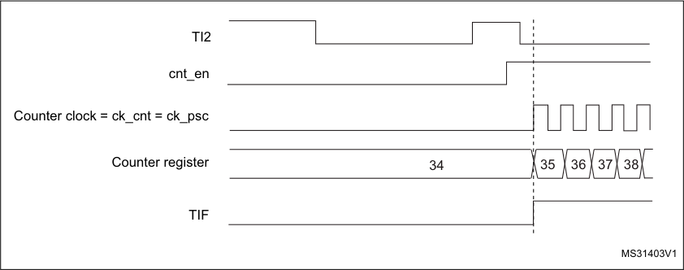

406/905 RM0377 Rev 10

--- end of page=405 ---

**RM0377** **General-purpose timers (TIM2/TIM3)**

**Slave mode: External Clock mode 2 + trigger mode**

The external clock mode 2 can be used in addition to another slave mode (except external
clock mode 1 and encoder mode). In this case, the ETR signal is used as external clock
input, and another input can be selected as trigger input when operating in reset mode,
gated mode or trigger mode. It is recommended not to select ETR as TRGI through the TS
bits of TIMx_SMCR register.

In the following example, the upcounter is incremented at each rising edge of the ETR
signal as soon as a rising edge of TI1 occurs:

1. Configure the external trigger input circuit by programming the TIMx_SMCR register as
follows:

– ETF = 0000: no filter

–
ETPS=00: prescaler disabled

–
ETP=0: detection of rising edges on ETR and ECE=1 to enable the external clock
mode 2.

2. Configure the channel 1 as follows, to detect rising edges on TI:

– IC1F=0000: no filter.

–
The capture prescaler is not used for triggering and does not need to be
configured.

–
CC1S=01in TIMx_CCMR1 register to select only the input capture source

–
CC1P=0 and CC1NP=0 in TIMx_CCER register to validate the polarity (and detect
rising edge only).

3. Configure the timer in trigger mode by writing SMS=110 in TIMx_SMCR register. Select
TI1 as the input source by writing TS=101 in TIMx_SMCR register.

For code example, refer to _A.9.15: External clock mode 2 + trigger mode code example_ .

A rising edge on TI1 enables the counter and sets the TIF flag. The counter then counts on
ETR rising edges.

The delay between the rising edge of the ETR signal and the actual reset of the counter is
due to the resynchronization circuit on ETRP input.

RM0377 Rev 10 407/905

438

--- end of page=406 ---

**General-purpose timers (TIM2/TIM3)** **RM0377**

**Figure 116. Control circuit in external clock mode 2 + trigger mode**

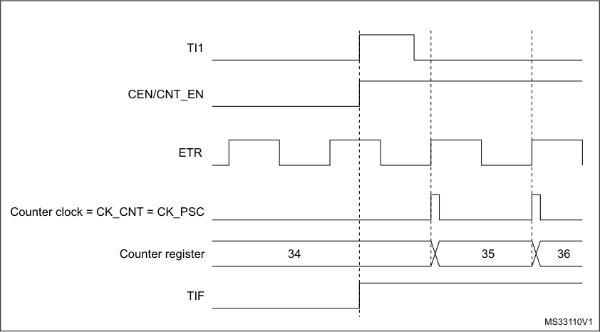

**16.3.15** **Timer synchronization**

|Col1|Col2|
|---|---|
|||
|||
|||

The TIMx timers are linked together internally for timer synchronization or chaining. When
one Timer is configured in Master Mode, it can reset, start, stop or clock the counter of
another Timer configured in Slave Mode.

_Figure 117: Master/Slave timer example_ presents an overview of the trigger selection and
the master mode selection blocks.

_Note:_ _The clock of the slave timer must be enabled prior to receive events from the master timer,_
_and must not be changed on-the-fly while triggers are received from the master timer._

**Using one timer as prescaler for another timer**

**Figure 117. Master/Slave timer example**

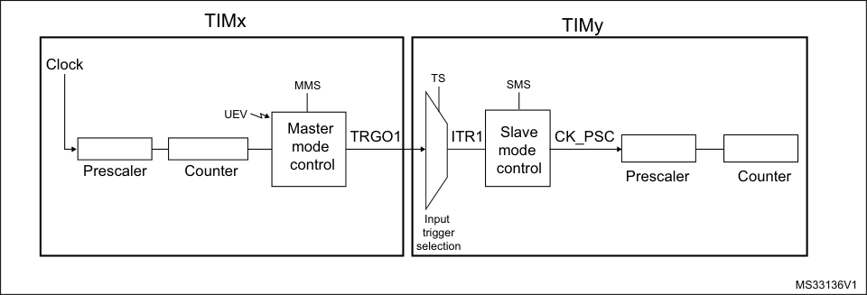

408/905 RM0377 Rev 10

--- end of page=407 ---

**RM0377** **General-purpose timers (TIM2/TIM3)**

For example, Timer x can be configured to act as a prescaler for Timer y. Refer to
_Figure 117_ . To do this, follow the sequence below:

1. Configure Timer x in master mode so that it outputs a periodic trigger signal on each
update event UEV. If MMS=010 is written in the TIMx_CR2 register, a rising edge is
output on TRGO1 each time an update event is generated.

2. To connect the TRGO1 output of Timer x to Timer y, Timer y must be configured in
slave mode using ITR1 as internal trigger. This is selected through the TS bits in the
TIMy_SMCR register (writing TS=000).

3. Then the slave mode controller must be put in external clock mode 1 (write SMS=111 in
the TIMy_SMCR register). This causes Timer y to be clocked by the rising edge of the
periodic Timer x trigger signal (which correspond to the timer x counter overflow).

4. Finally both timers must be enabled by setting their respective CEN bits (TIMx_CR1
register).

For code example, refer to _A.9.17: Timer prescaling another timer code example_ .

_Note:_ _If OCx is selected on Timer x as trigger output (MMS=1xx), its rising edge is used to clock_
_the counter of timer y._

**Using one timer to enable another timer**

In this example, we control the enable of Timer y with the output compare 1 of Timer x.
Refer to _Figure 117_ for connections. Timer y counts on the divided internal clock only when
OC1REF of Timer x is high. Both counter clock frequencies are divided by 3 by the
prescaler compared to CK_INT (f CK_CNT = f CK_INT /3).

1. Configure Timer x master mode to send its Output Compare 1 Reference (OC1REF)
signal as trigger output (MMS=100 in the TIMx_CR2 register).

2. Configure the Timer x OC1REF waveform (TIMx_CCMR1 register).

3. Configure Timer y to get the input trigger from Timer x (TS=000 in the TIMy_SMCR
register).

4. Configure Timer y in gated mode (SMS=101 in TIMy_SMCR register).

5. Enable Timer y by writing ‘1 in the CEN bit (TIMy_CR1 register).

6. Start Timer x by writing ‘1 in the CEN bit (TIMx_CR1 register).

For code example, refer to _A.9.18: Timer enabling another timer code example_ .

_Note:_ _The counter 2 clock is not synchronized with counter 1, this mode only affects the Timer y_
_counter enable signal._

RM0377 Rev 10 409/905

438

--- end of page=408 ---

**General-purpose timers (TIM2/TIM3)** **RM0377**

**Figure 118. Gating timer y with OC1REF of timer x**

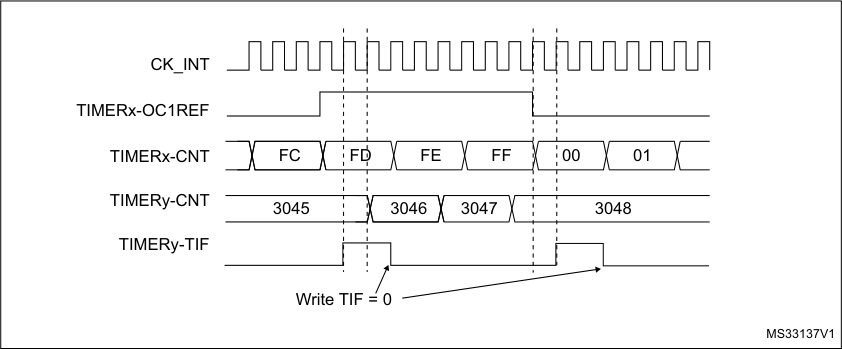

|Col1|Col2|Col3|Col4|Col5|Col6|Col7|Col8|Col9|Col10|Col11|
|---|---|---|---|---|---|---|---|---|---|---|
||||||||||||
|FC||FD||FE|FE|FF|FF||00|01|
|FC|||||||||||
|FC|||3046|3046|3047|3047|||||
|FC|||||||||||

In the example in _Figure 118_, the Timer y counter and prescaler are not initialized before
being started. So they start counting from their current value. It is possible to start from a
given value by resetting both timers before starting Timer x. Then any value can be written
in the timer counters. The timers can easily be reset by software using the UG bit in the
TIMx_EGR registers.

In the next example, we synchronize Timer x and Timer y. Timer x is the master and starts
from 0. Timer y is the slave and starts from 0xE7. The prescaler ratio is the same for both
timers. Timer y stops when Timer x is disabled by writing ‘0 to the CEN bit in the TIMy_CR1
register:

1. Configure Timer x master mode to send its Output Compare 1 Reference (OC1REF)
signal as trigger output (MMS=100 in the TIMx_CR2 register).

2. Configure the Timer x OC1REF waveform (TIMx_CCMR1 register).

3. Configure Timer y to get the input trigger from Timer x (TS=000 in the TIMy_SMCR
register).

4. Configure Timer y in gated mode (SMS=101 in TIMy_SMCR register).

5. Reset Timer x by writing ‘1 in UG bit (TIMx_EGR register).

6. Reset Timer y by writing ‘1 in UG bit (TIMy_EGR register).

7. Initialize Timer y to 0xE7 by writing ‘0xE7’ in the timer y counter (TIMy_CNTL).

8. Enable Timer y by writing ‘1 in the CEN bit (TIMy_CR1 register).

9. Start Timer x by writing ‘1 in the CEN bit (TIMx_CR1 register).

10. Stop Timer x by writing ‘0 in the CEN bit (TIMx_CR1 register).

For code example, refer to _A.9.19: Master and slave synchronization code example_ .

410/905 RM0377 Rev 10

--- end of page=409 ---

**RM0377** **General-purpose timers (TIM2/TIM3)**

**Figure 119. Gating timer y with Enable of timer x**

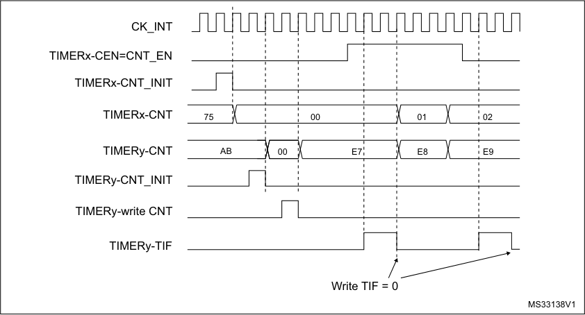

|Col1|Col2|Col3|Col4|Col5|Col6|
|---|---|---|---|---|---|
|||||||
|||||||
|||00||01||
|||||||
||00|E7||E8||
|||||||
|||||||
|||||||

**Using one timer to start another timer**

In this example, we set the enable of Timer y with the update event of Timer x. Refer to
_Figure 117_ for connections. Timer y starts counting from its current value (which can be
nonzero) on the divided internal clock as soon as the update event is generated by Timer x.
When Timer y receives the trigger signal its CEN bit is automatically set and the counter
counts until we write ‘0 to the CEN bit in the TIM2_CR1 register. Both counter clock
frequencies are divided by 3 by the prescaler compared to CK_INT (f CK_CNT = f CK_INT /3).

1. Configure Timer x master mode to send its Update Event (UEV) as trigger output
(MMS=010 in the TIMx_CR2 register).

2. Configure the Timer x period (TIMx_ARR registers).

3. Configure Timer y to get the input trigger from Timer x (TS=000 in the TIMy_SMCR
register).

4. Configure Timer y in trigger mode (SMS=110 in TIMy_SMCR register).

5. Start Timer x by writing ‘1 in the CEN bit (TIMx_CR1 register).

RM0377 Rev 10 411/905

438

--- end of page=410 ---

**General-purpose timers (TIM2/TIM3)** **RM0377**

**Figure 120. Triggering timer y with update of timer x**

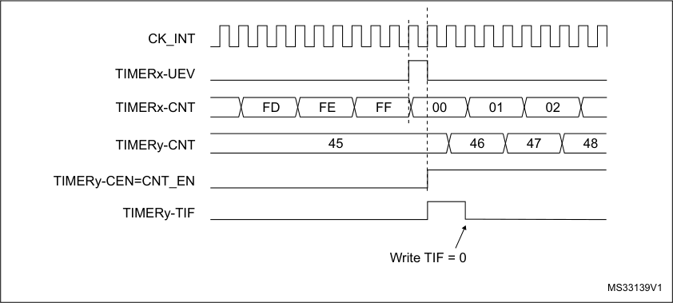

|Col1|Col2|Col3|Col4|Col5|Col6|Col7|
|---|---|---|---|---|---|---|
|FD|FE|FF||00|01|02|

As in the previous example, both counters can be initialized before starting counting.
_Figure 121_ shows the behavior with the same configuration as in _Figure 120_ but in trigger
mode instead of gated mode (SMS=110 in the TIMy_SMCR register).

**Figure 121. Triggering timer y with Enable of timer x**

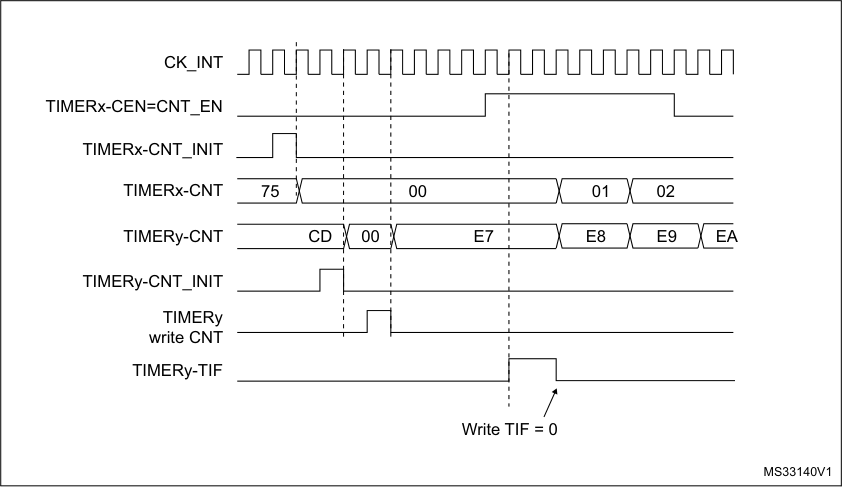

|Col1|Col2|Col3|Col4|Col5|Col6|
|---|---|---|---|---|---|
|||||||
|||00||01|01|
|||||||
||00|E7||E8|E9|
|||||||
|||||||

412/905 RM0377 Rev 10

--- end of page=411 ---

**RM0377** **General-purpose timers (TIM2/TIM3)**

**Starting 2 timers synchronously in response to an external trigger**

In this example, we set the enable of timer x when its TI1 input rises, and the enable of
Timer y with the enable of Timer x. Refer to _Figure 117_ for connections. To ensure the
counters are aligned, Timer x must be configured in Master/Slave mode (slave with respect
to TI1, master with respect to Timer y):

1. Configure Timer x master mode to send its Enable as trigger output (MMS=001 in the
TIMx_CR2 register).

2. Configure Timer x slave mode to get the input trigger from TI1 (TS=100 in the
TIMx_SMCR register).

3. Configure Timer x in trigger mode (SMS=110 in the TIMx_SMCR register).

4. Configure the Timer x in Master/Slave mode by writing MSM=1 (TIMx_SMCR register).

5. Configure Timer y to get the input trigger from Timer x (TS=000 in the TIMy_SMCR
register).

6. Configure Timer y in trigger mode (SMS=110 in the TIMy_SMCR register).

For code example, refer to _A.9.20: Two timers synchronized by an external trigger code_
_example_ .

When a rising edge occurs on TI1 (Timer x), both counters starts counting synchronously on
the internal clock and both TIF flags are set.

_Note:_ _In this example both timers are initialized before starting (by setting their respective UG_
_bits). Both counters starts from 0, but an offset can easily be inserted between them by_
_writing any of the counter registers (TIMx_CNT). One can see that the master/slave mode_
_insert a delay between CNT_EN and CK_PSC on timer x._

**Figure 122. Triggering timer x and y with timer x TI1 input**

|Col1|Col2|Col3|Col4|Col5|Col6|Col7|Col8|Col9|Col10|
|---|---|---|---|---|---|---|---|---|---|
|||||||||||
||01|02|03|04|05|06|07|08|09|
|||||||||||

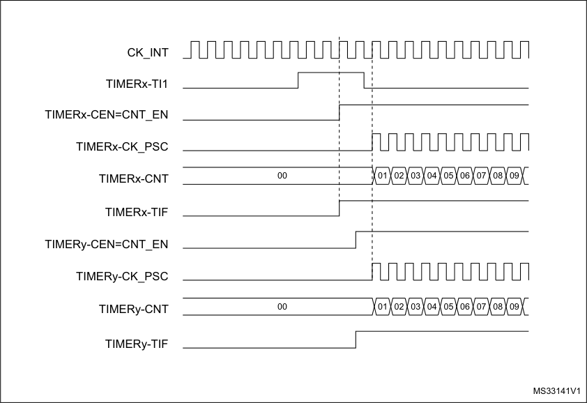

RM0377 Rev 10 413/905

438

--- end of page=412 ---

**General-purpose timers (TIM2/TIM3)** **RM0377**

**16.3.16** **Debug mode**

When the microcontroller enters debug mode (Cortex [®] -M0+ core - halted), the TIMx counter
either continues to work normally or stops, depending on DBG_TIMx_STOP configuration
bit in DBG module. For more details, refer to _Section 27.9.2: Debug support for timers,_
_watchdog and I_ _[2]_ _C_ .

414/905 RM0377 Rev 10

--- end of page=413 ---

**RM0377** **General-purpose timers (TIM2/TIM3)**

###### **16.4 TIM2/TIM3 registers**

Refer to _Section 1.2 on page 45_ for a list of abbreviations used in register descriptions.

The 32-bit peripheral registers have to be written by words (32 bits). All other peripheral
registers have to be written by half-words (16 bits) or words (32 bits). Read accesses can be
done by bytes (8 bits), half-words (16 bits) or words (32 bits).

**16.4.1** **TIMx control register 1 (TIMx_CR1)**

Address offset: 0x00

Reset value: 0x0000

|15|14|13|12|11|10|9 8|Col8|7|6 5|Col11|4|3|2|1|0|
|---|---|---|---|---|---|---|---|---|---|---|---|---|---|---|---|
|Res.|Res.|Res.|Res.|Res.|Res.|CKD[1:0]|CKD[1:0]|ARPE|CMS|CMS|DIR|OPM|URS|UDIS|CEN|
|||||||rw|rw|rw|rw|rw|rw|rw|rw|rw|rw|

Bits 15:10 Reserved, must be kept at reset value.

Bits 9:8 **CKD** : Clock division

This bit-field indicates the division ratio between the timer clock (CK_INT) frequency and
sampling clock used by the digital filters (ETR, TIx),
00: t DTS = t CK_INT
01: t DTS = 2 × t CK_INT
10: t DTS = 4 × t CK_INT
11: Reserved

Bit 7 **ARPE** : Auto-reload preload enable

0: TIMx_ARR register is not buffered
1: TIMx_ARR register is buffered

Bits 6:5 **CMS** : Center-aligned mode selection

00: Edge-aligned mode. The counter counts up or down depending on the direction bit
(DIR).
01: Center-aligned mode 1. The counter counts up and down alternatively. Output compare
interrupt flags of channels configured in output (CCxS=00 in TIMx_CCMRx register) are set
only when the counter is counting down.
10: Center-aligned mode 2. The counter counts up and down alternatively. Output compare
interrupt flags of channels configured in output (CCxS=00 in TIMx_CCMRx register) are set
only when the counter is counting up.
11: Center-aligned mode 3. The counter counts up and down alternatively. Output compare
interrupt flags of channels configured in output (CCxS=00 in TIMx_CCMRx register) are set
both when the counter is counting up or down.

_Note: It is not allowed to switch from edge-aligned mode to center-aligned mode as long as_
_the counter is enabled (CEN=1)_

Bit 4 **DIR** : Direction

0: Counter used as upcounter
1: Counter used as downcounter

_Note: This bit is read only when the timer is configured in Center-aligned mode or Encoder_
_mode._

Bit 3 **OPM** : One-pulse mode

0: Counter is not stopped at update event
1: Counter stops counting at the next update event (clearing the bit CEN)

RM0377 Rev 10 415/905

438

--- end of page=414 ---

**General-purpose timers (TIM2/TIM3)** **RM0377**

Bit 2 **URS** : Update request source

This bit is set and cleared by software to select the UEV event sources.
0: Any of the following events generate an update interrupt or DMA request if enabled.
These events can be:

– Counter overflow/underflow

–
Setting the UG bit

–
Update generation through the slave mode controller
1: Only counter overflow/underflow generates an update interrupt or DMA request if
enabled.

Bit 1 **UDIS** : Update disable

This bit is set and cleared by software to enable/disable UEV event generation.
0: UEV enabled. The Update (UEV) event is generated by one of the following events:

– Counter overflow/underflow

–
Setting the UG bit

–
Update generation through the slave mode controller
Buffered registers are then loaded with their preload values.
1: UEV disabled. The Update event is not generated, shadow registers keep their value
(ARR, PSC, CCRx). However the counter and the prescaler are reinitialized if the UG bit is
set or if a hardware reset is received from the slave mode controller.

Bit 0 **CEN** : Counter enable

0: Counter disabled

1: Counter enabled

_Note: External clock, gated mode and encoder mode can work only if the CEN bit has been_
_previously set by software. However trigger mode can set the CEN bit automatically by_
_hardware._

CEN is cleared automatically in one-pulse mode, when an update event occurs.

416/905 RM0377 Rev 10

--- end of page=415 ---

**RM0377** **General-purpose timers (TIM2/TIM3)**

**16.4.2** **TIMx control register 2 (TIMx_CR2)**

Address offset: 0x04

Reset value: 0x0000

|15|14|13|12|11|10|9|8|7|6 5 4|Col11|Col12|3|2|1|0|
|---|---|---|---|---|---|---|---|---|---|---|---|---|---|---|---|
|Res.|Res.|Res.|Res.|Res.|Res.|Res.|Res.|TI1S|MMS[2:0]|MMS[2:0]|MMS[2:0]|CCDS|Res.|Res.|Res.|
|||||||||rw|rw|rw|rw|rw||||

Bits 15:8 Reserved, must be kept at reset value.

Bit 7 **TI1S** : TI1 selection

0: The TIMx_CH1 pin is connected to TI1 input
1: The TIMx_CH1, CH2 and CH3 pins are connected to the TI1 input (XOR combination)

Bits 6:4 **MMS** : Master mode selection

These bits allow to select the information to be sent in master mode to slave timers for

synchronization (TRGO). The combination is as follows:
000: **Reset**             - the UG bit from the TIMx_EGR register is used as trigger output (TRGO). If the
reset is generated by the trigger input (slave mode controller configured in reset mode) then
the signal on TRGO is delayed compared to the actual reset.
001: **Enable**             - the Counter enable signal, CNT_EN, is used as trigger output (TRGO). It is
useful to start several timers at the same time or to control a window in which a slave timer is

enabled. The Counter Enable signal is generated by a logic OR between CEN control bit
and the trigger input when configured in gated mode.
When the Counter Enable signal is controlled by the trigger input, there is a delay on TRGO,
except if the master/slave mode is selected (see the MSM bit description in TIMx_SMCR
register).
010: **Update**             - The update event is selected as trigger output (TRGO). For instance a master
timer can then be used as a prescaler for a slave timer.
011: **Compare Pulse**             - The trigger output send a positive pulse when the CC1IF flag is to be
set (even if it was already high), as soon as a capture or a compare match occurred.
(TRGO)
100: **Compare**             - OC1REF signal is used as trigger output (TRGO)
101: **Compare**             - OC2REF signal is used as trigger output (TRGO)
110: **Compare**             - OC3REF signal is used as trigger output (TRGO)
111: **Compare**             - OC4REF signal is used as trigger output (TRGO)

_Note: The clock of the slave timer or ADC must be enabled prior to receiving events from the_
_master timer, and must not be changed on-the-fly while triggers are received from the_
_master timer._

Bit 3 **CCDS** : Capture/compare DMA selection

0: CCx DMA request sent when CCx event occurs
1: CCx DMA requests sent when update event occurs

Bits 2:0 Reserved, must be kept at reset value.

RM0377 Rev 10 417/905

438

--- end of page=416 ---

**General-purpose timers (TIM2/TIM3)** **RM0377**

**16.4.3** **TIMx slave mode control register (TIMx_SMCR)**

Address offset: 0x08

Reset value: 0x0000

|15|14|13 12|Col4|11 10 9 8|Col6|Col7|Col8|7|6 5 4|Col11|Col12|3|2 1 0|Col15|Col16|
|---|---|---|---|---|---|---|---|---|---|---|---|---|---|---|---|
|ETP|ECE|ETPS[1:0]|ETPS[1:0]|ETF[3:0]|ETF[3:0]|ETF[3:0]|ETF[3:0]|MSM|TS[2:0]|TS[2:0]|TS[2:0]|Res.|SMS[2:0]|SMS[2:0]|SMS[2:0]|
|rw|rw|rw|rw|rw|rw|rw|rw|rw|rw|rw|rw||rw|rw|rw|

Bit 15 **ETP** : External trigger polarity

This bit selects whether ETR or ETR is used for trigger operations
0: ETR is noninverted, active at high level or rising edge
1: ETR is inverted, active at low level or falling edge

Bit 14 **ECE** : External clock enable

This bit enables External clock mode 2.

0: External clock mode 2 disabled

1: External clock mode 2 enabled. The counter is clocked by any active edge on the ETRF
signal.
**1:** Setting the ECE bit has the same effect as selecting external clock mode 1 with TRGI
connected to ETRF (SMS=111 and TS=111).
**2:** It is possible to simultaneously use external clock mode 2 with the following slave modes:
reset mode, gated mode and trigger mode. Nevertheless, TRGI must not be connected to
ETRF in this case (TS bits must not be 111).
**3:** If external clock mode 1 and external clock mode 2 are enabled at the same time, the
external clock input is ETRF.

Bits 13:12 **ETPS** : External trigger prescaler

External trigger signal ETRP frequency must be at most 1/4 of CK_INT frequency. A
prescaler can be enabled to reduce ETRP frequency. It is useful when inputting fast external
clocks.

00: Prescaler OFF

01: ETRP frequency divided by 2
10: ETRP frequency divided by 4
11: ETRP frequency divided by 8

Bits 11:8 **ETF[3:0]** : External trigger filter

This bit-field then defines the frequency used to sample ETRP signal and the length of the
digital filter applied to ETRP. The digital filter is made of an event counter in which N
consecutive events are needed to validate a transition on the output:
0000: No filter, sampling is done at f DTS
0001:  f SAMPLING =f CK_INT, N=2
0010:  f SAMPLING =f CK_INT, N=4
0011:  f SAMPLING =f CK_INT, N=8
0100:  f SAMPLING =f DTS /2, N=6
0101:  f SAMPLING =f DTS /2, N=8
0110:  f SAMPLING =f DTS /4, N=6
0111:  f SAMPLING =f DTS /4, N=8
1000:  f SAMPLING =f DTS /8, N=6
1001:  f SAMPLING =f DTS /8, N=8
1010:  f SAMPLING =f DTS /16, N=5
1011:  f SAMPLING =f DTS /16, N=6
1100:  f SAMPLING =f DTS /16, N=8
1101:  f SAMPLING =f DTS /32, N=5
1110:  f SAMPLING =f DTS /32, N=6
1111:  f SAMPLING =f DTS /32, N=8

418/905 RM0377 Rev 10

--- end of page=417 ---

**RM0377** **General-purpose timers (TIM2/TIM3)**

Bit 7 **MSM:** Master/Slave mode

0: No action

1: The effect of an event on the trigger input (TRGI) is delayed to allow a perfect
synchronization between the current timer and its slaves (through TRGO). It is useful if we
want to synchronize several timers on a single external event.

Bits 6:4 **TS:** Trigger selection

This bit-field selects the trigger input to be used to synchronize the counter.
000: Internal Trigger 0 (ITR0).
001: Internal Trigger 1 (ITR1).
010: Internal Trigger 2 (ITR2).
011: Reserved.

100: TI1 Edge Detector (TI1F_ED)
101: Filtered Timer Input 1 (TI1FP1)
110: Filtered Timer Input 2 (TI2FP2)
111: External Trigger input (ETRF)
See _Table 77: TIM2/TIM3 internal trigger connection on page 419_ for more details on ITRx
meaning for each Timer.

_Note: These bits must be changed only when they are not used (e.g. when SMS=000) to_
_avoid wrong edge detections at the transition._

Bit 3 Reserved, must be kept at ‘1’.

Bits 2:0 **SMS:** Slave mode selection

When external signals are selected the active edge of the trigger signal (TRGI) is linked to
the polarity selected on the external input (see Input Control register and Control Register
description.
000: Slave mode disabled - if CEN = ‘1 then the prescaler is clocked directly by the internal
clock.

001: Encoder mode 1 - Counter counts up/down on TI2FP1 edge depending on TI1FP2
level.

010: Encoder mode 2 - Counter counts up/down on TI1FP2 edge depending on TI2FP1
level.

011: Encoder mode 3 - Counter counts up/down on both TI1FP1 and TI2FP2 edges
depending on the level of the other input.
100: Reset Mode - Rising edge of the selected trigger input (TRGI) reinitializes the counter
and generates an update of the registers.
101: Gated Mode - The counter clock is enabled when the trigger input (TRGI) is high. The
counter stops (but is not reset) as soon as the trigger becomes low. Both start and stop of
the counter are controlled.

110: Trigger Mode - The counter starts at a rising edge of the trigger TRGI (but it is not
reset). Only the start of the counter is controlled.
111: External Clock Mode 1 - Rising edges of the selected trigger (TRGI) clock the counter.

_Note: The gated mode must not be used if TI1F_ED is selected as the trigger input (TS=100)._
_Indeed, TI1F_ED outputs 1 pulse for each transition on TI1F, whereas the gated mode_
_checks the level of the trigger signal._

_The clock of the slave timer must be enabled prior to receiving events from the master_
_timer, and must not be changed on-the-fly while triggers are received from the master_
_timer."_

**Table 77. TIM2/TIM3 internal trigger connection**

|Slave TIM|ITR0 (TS = 000)|ITR1 (TS = 001)|ITR2 (TS = 010)|
|---|---|---|---|
|TIM2|TIM21|TIM22|TIM3|
|TIM3|TIM2|TIM22|TIM21|

RM0377 Rev 10 419/905

438

--- end of page=418 ---

**General-purpose timers (TIM2/TIM3)** **RM0377**

**16.4.4** **TIMx DMA/Interrupt enable register (TIMx_DIER)**

Address offset: 0x0C

Reset value: 0x0000

|15|14|13|12|11|10|9|8|7|6|5|4|3|2|1|0|
|---|---|---|---|---|---|---|---|---|---|---|---|---|---|---|---|
|Res.|TDE|Res.|CC4DE|CC3DE|CC2DE|CC1DE|UDE|Res.|TIE|Res.|CC4IE|CC3IE|CC2IE|CC1IE|UIE|
||rw||rw|rw|rw|rw|rw||rw||rw|rw|rw|rw|rw|

Bit 15 Reserved, must be kept at reset value.

Bit 14 **TDE** : Trigger DMA request enable

0: Trigger DMA request disabled.
1: Trigger DMA request enabled.

Bit 13 Reserved, always read as 0

Bit 12 **CC4DE** : Capture/Compare 4 DMA request enable

0: CC4 DMA request disabled.
1: CC4 DMA request enabled.

Bit 11 **CC3DE** : Capture/Compare 3 DMA request enable

0: CC3 DMA request disabled.
1: CC3 DMA request enabled.

Bit 10 **CC2DE** : Capture/Compare 2 DMA request enable

0: CC2 DMA request disabled.
1: CC2 DMA request enabled.

Bit 9 **CC1DE** : Capture/Compare 1 DMA request enable

0: CC1 DMA request disabled.
1: CC1 DMA request enabled.

Bit 8 **UDE** : Update DMA request enable

0: Update DMA request disabled.
1: Update DMA request enabled.

Bit 7 Reserved, must be kept at reset value.

Bit 6 **TIE** : Trigger interrupt enable

0: Trigger interrupt disabled.
1: Trigger interrupt enabled.

Bit 5 Reserved, must be kept at reset value.

Bit 4 **CC4IE** : Capture/Compare 4 interrupt enable

0: CC4 interrupt disabled.
1: CC4 interrupt enabled.

Bit 3 **CC3IE** : Capture/Compare 3 interrupt enable

0: CC3 interrupt disabled
1: CC3 interrupt enabled

420/905 RM0377 Rev 10

--- end of page=419 ---

**RM0377** **General-purpose timers (TIM2/TIM3)**

Bit 2 **CC2IE** : Capture/Compare 2 interrupt enable

0: CC2 interrupt disabled
1: CC2 interrupt enabled

Bit 1 **CC1IE** : Capture/Compare 1 interrupt enable

0: CC1 interrupt disabled
1: CC1 interrupt enabled

Bit 0 **UIE** : Update interrupt enable

0: Update interrupt disabled
1: Update interrupt enabled

**16.4.5** **TIMx status register (TIMx_SR)**

Address offset: 0x10

Reset value: 0x0000

|15|14|13|12|11|10|9|8|7|6|5|4|3|2|1|0|
|---|---|---|---|---|---|---|---|---|---|---|---|---|---|---|---|
|Res.|Res.|Res.|CC4OF|CC3OF|CC2OF|CC1OF|Res.|Res.|TIF|Res.|CC4IF|CC3IF|CC2IF|CC1IF|UIF|
||||rc_w0|rc_w0|rc_w0|rc_w0|||rc_w0||rc_w0|rc_w0|rc_w0|rc_w0|rc_w0|

Bits 15:13 Reserved, must be kept at reset value.

Bit 12 **CC4OF** : Capture/Compare 4 overcapture flag

refer to CC1OF description

Bit 11 **CC3OF** : Capture/Compare 3 overcapture flag

refer to CC1OF description

Bit 10 **CC2OF** : Capture/compare 2 overcapture flag

refer to CC1OF description

Bit 9 **CC1OF** : Capture/Compare 1 overcapture flag

This flag is set by hardware only when the corresponding channel is configured in input
capture mode. It is cleared by software by writing it to ‘0.
0: No overcapture has been detected
1: The counter value has been captured in TIMx_CCR1 register while CC1IF flag was
already set

Bits 8:7 Reserved, must be kept at reset value.

Bit 6 **TIF** : Trigger interrupt flag

This flag is set by hardware on trigger event (active edge detected on TRGI input when the
slave mode controller is enabled in all modes but gated mode. It is set when the counter
starts or stops when gated mode is selected. It is cleared by software.
0: No trigger event occurred
1: Trigger interrupt pending

Bit 5 Reserved, must be kept at reset value.

Bit 4 **CC4IF** : Capture/Compare 4 interrupt flag

refer to CC1IF description

Bit 3 **CC3IF** : Capture/Compare 3 interrupt flag

refer to CC1IF description

RM0377 Rev 10 421/905

438

--- end of page=420 ---

**General-purpose timers (TIM2/TIM3)** **RM0377**

Bit 2 **CC2IF** : Capture/Compare 2 interrupt flag

refer to CC1IF description

Bit 1 **CC1IF** : Capture/compare 1 interrupt flag

**If channel CC1 is configured as output:**
This flag is set by hardware when the counter matches the compare value, with some
exception in center-aligned mode (refer to the CMS bits in the TIMx_CR1 register
description). It is cleared by software.
0: No match

1: The content of the counter TIMx_CNT matches the content of the TIMx_CCR1 register.
When the contents of TIMx_CCR1 are greater than the contents of TIMx_ARR, the CC1IF bit
goes high on the counter overflow (in upcounting and up/down-counting modes) or underflow
(in downcounting mode)
**If channel CC1 is configured as input:**
This bit is set by hardware on a capture. It is cleared by software or by reading the
TIMx_CCR1 register.
0: No input capture occurred
1: The counter value has been captured in TIMx_CCR1 register (An edge has been detected
on IC1 which matches the selected polarity)

Bit 0 **UIF** : Update interrupt flag

″ This bit is set by hardware on an update event. It is cleared by software.
0: No update occurred.
1: Update interrupt pending. This bit is set by hardware when the registers are updated:

″ At overflow or underflow and if UDIS=0 in the TIMx_CR1 register.

″ When CNT is reinitialized by software using the UG bit in TIMx_EGR register, if URS=0
and UDIS=0 in the TIMx_CR1 register.
When CNT is reinitialized by a trigger event (refer to the synchro control register description),
if URS=0 and UDIS=0 in the TIMx_CR1 register.

422/905 RM0377 Rev 10

--- end of page=421 ---

**RM0377** **General-purpose timers (TIM2/TIM3)**

**16.4.6** **TIMx event generation register (TIMx_EGR)**

Address offset: 0x14

Reset value: 0x0000

|15|14|13|12|11|10|9|8|7|6|5|4|3|2|1|0|
|---|---|---|---|---|---|---|---|---|---|---|---|---|---|---|---|
|Res.|Res.|Res.|Res.|Res.|Res.|Res.|Res.|Res.|TG|Res.|CC4G|CC3G|CC2G|CC1G|UG|
||||||||||w||w|w|w|w|w|

Bits 15:7 Reserved, must be kept at reset value.

Bit 6 **TG** : Trigger generation

This bit is set by software in order to generate an event, it is automatically cleared by
hardware.

0: No action

1: The TIF flag is set in TIMx_SR register. Related interrupt or DMA transfer can occur if
enabled.

Bit 5 Reserved, must be kept at reset value.

Bit 4 **CC4G** : Capture/compare 4 generation

refer to CC1G description

Bit 3 **CC3G** : Capture/compare 3 generation

refer to CC1G description

Bit 2 **CC2G** : Capture/compare 2 generation

refer to CC1G description

Bit 1 **CC1G** : Capture/compare 1 generation

This bit is set by software in order to generate an event, it is automatically cleared by
hardware.

0: No action

1: A capture/compare event is generated on channel 1:
**If channel CC1 is configured as output:**
CC1IF flag is set, Corresponding interrupt or DMA request is sent if enabled.
**If channel CC1 is configured as input:**
The current value of the counter is captured in TIMx_CCR1 register. The CC1IF flag is set,
the corresponding interrupt or DMA request is sent if enabled. The CC1OF flag is set if the
CC1IF flag was already high.

Bit 0 **UG** : Update generation

This bit can be set by software, it is automatically cleared by hardware.
0: No action

1: Re-initialize the counter and generates an update of the registers. Note that the prescaler
counter is cleared too (anyway the prescaler ratio is not affected). The counter is cleared if
the center-aligned mode is selected or if DIR=0 (upcounting), else it takes the auto-reload
value (TIMx_ARR) if DIR=1 (downcounting).

RM0377 Rev 10 423/905

438

--- end of page=422 ---

**General-purpose timers (TIM2/TIM3)** **RM0377**

**16.4.7** **TIMx capture/compare mode register 1 (TIMx_CCMR1)**

Address offset: 0x18

Reset value: 0x0000

The channels can be used in input (capture mode) or in output (compare mode). The
direction of a channel is defined by configuring the corresponding CCxS bits. All the other
bits of this register have a different function in input and in output mode. For a given bit,
OCxx describes its function when the channel is configured in output, ICxx describes its
function when the channel is configured in input. So one must take care that the same bit
can have a different meaning for the input stage and for the output stage.

|15|14 13 12|Col3|Col4|11|10|9 8|Col8|7|6 5 4|Col11|Col12|3|2|1 0|Col16|
|---|---|---|---|---|---|---|---|---|---|---|---|---|---|---|---|
|OC2CE|OC2M[2:0]|OC2M[2:0]|OC2M[2:0]|OC2PE|OC2FE|CC2S[1:0]|CC2S[1:0]|OC1CE|OC1M[2:0]|OC1M[2:0]|OC1M[2:0]|OC1PE|OC1FE|CC1S[1:0]|CC1S[1:0]|
|IC2F[3:0]|IC2F[3:0]|IC2F[3:0]|IC2F[3:0]|IC2PSC[1:0]|IC2PSC[1:0]|IC2PSC[1:0]|IC2PSC[1:0]|IC1F[3:0]|IC1F[3:0]|IC1F[3:0]|IC1F[3:0]|IC1PSC[1:0]|IC1PSC[1:0]|IC1PSC[1:0]|IC1PSC[1:0]|
|rw|rw|rw|rw|rw|rw|rw|rw|rw|rw|rw|rw|rw|rw|rw|rw|

**Output compare mode**

Bit 15 **OC2CE:** Output compare 2 clear enable

Bits 14:12 **OC2M[2:0]** : Output compare 2 mode

Bit 11 **OC2PE** : Output compare 2 preload enable

Bit 10 **OC2FE** : Output compare 2 fast enable

Bits 9:8 **CC2S[1:0]** : Capture/Compare 2 selection

This bit-field defines the direction of the channel (input/output) as well as the used input.
00: CC2 channel is configured as output
01: CC2 channel is configured as input, IC2 is mapped on TI2
10: CC2 channel is configured as input, IC2 is mapped on TI1
11: CC2 channel is configured as input, IC2 is mapped on TRC. This mode is working only if
an internal trigger input is selected through the TS bit (TIMx_SMCR register)

_Note: CC2S bits are writable only when the channel is OFF (CC2E = 0 in TIMx_CCER)._

Bit 7 **OC1CE:** Output compare 1 clear enable

OC1CE: Output Compare 1 Clear Enable
0: OC1Ref is not affected by the ETRF input
1: OC1Ref is cleared as soon as a High level is detected on ETRF input

424/905 RM0377 Rev 10

--- end of page=423 ---

**RM0377** **General-purpose timers (TIM2/TIM3)**

Bits 6:4 **OC1M** : Output compare 1 mode

These bits define the behavior of the output reference signal OC1REF from which OC1 and
OC1N are derived. OC1REF is active high whereas OC1 and OC1N active level depends
on CC1P and CC1NP bits.

000: Frozen - The comparison between the output compare register TIMx_CCR1 and the
counter TIMx_CNT has no effect on the outputs.(this mode is used to generate a timing
base).
001: Set channel 1 to active level on match. OC1REF signal is forced high when the counter
TIMx_CNT matches the capture/compare register 1 (TIMx_CCR1).
010: Set channel 1 to inactive level on match. OC1REF signal is forced low when the
counter TIMx_CNT matches the capture/compare register 1 (TIMx_CCR1).
011: Toggle - OC1REF toggles when TIMx_CNT=TIMx_CCR1.
100: Force inactive level - OC1REF is forced low.

101: Force active level - OC1REF is forced high.
110: PWM mode 1 - In upcounting, channel 1 is active as long as TIMx_CNT<TIMx_CCR1
else inactive. In downcounting, channel 1 is inactive (OC1REF=‘0) as long as
TIMx_CNT>TIMx_CCR1 else active (OC1REF=1).
111: PWM mode 2 - In upcounting, channel 1 is inactive as long as TIMx_CNT<TIMx_CCR1
else active. In downcounting, channel 1 is active as long as TIMx_CNT>TIMx_CCR1 else
inactive.

_Note: In PWM mode 1 or 2, the OCREF level changes only when the result of the_
_comparison changes or when the output compare mode switches from “frozen” mode_
_to “PWM” mode._

Bit 3 **OC1PE** : Output compare 1 preload enable

0: Preload register on TIMx_CCR1 disabled. TIMx_CCR1 can be written at anytime, the
new value is taken in account immediately.
1: Preload register on TIMx_CCR1 enabled. Read/Write operations access the preload
register. TIMx_CCR1 preload value is loaded in the active register at each update event.

_Note: The PWM mode can be used without validating the preload register only in one-pulse_
_mode (OPM bit set in TIMx_CR1 register). Else the behavior is not guaranteed._

Bit 2 **OC1FE** : Output compare 1 fast enable

This bit is used to accelerate the effect of an event on the trigger in input on the CC output.
0: CC1 behaves normally depending on counter and CCR1 values even when the trigger is
ON. The minimum delay to activate CC1 output when an edge occurs on the trigger input is
5 clock cycles.
1: An active edge on the trigger input acts like a compare match on CC1 output. Then, OC
is set to the compare level independently from the result of the comparison. Delay to sample
the trigger input and to activate CC1 output is reduced to 3 clock cycles. OCFE acts only if
the channel is configured in PWM1 or PWM2 mode.

Bits 1:0 **CC1S** : Capture/Compare 1 selection

This bit-field defines the direction of the channel (input/output) as well as the used input.
00: CC1 channel is configured as output.
01: CC1 channel is configured as input, IC1 is mapped on TI1.
10: CC1 channel is configured as input, IC1 is mapped on TI2.
11: CC1 channel is configured as input, IC1 is mapped on TRC. This mode is working only if
an internal trigger input is selected through TS bit (TIMx_SMCR register)

_Note: CC1S bits are writable only when the channel is OFF (CC1E = 0 in TIMx_CCER)._

**Input capture mode**

RM0377 Rev 10 425/905

438

--- end of page=424 ---

**General-purpose timers (TIM2/TIM3)** **RM0377**

Bits 15:12 **IC2F** : Input capture 2 filter

Bits 11:10 **IC2PSC[1:0]** : Input capture 2 prescaler

Bits 9:8 **CC2S** : Capture/compare 2 selection

This bit-field defines the direction of the channel (input/output) as well as the used input.
00: CC2 channel is configured as output.
01: CC2 channel is configured as input, IC2 is mapped on TI2.
10: CC2 channel is configured as input, IC2 is mapped on TI1.
11: CC2 channel is configured as input, IC2 is mapped on TRC. This mode is working only if
an internal trigger input is selected through TS bit (TIMx_SMCR register)

_Note: CC2S bits are writable only when the channel is OFF (CC2E = 0 in TIMx_CCER)._

Bits 7:4 **IC1F** : Input capture 1 filter

This bit-field defines the frequency used to sample TI1 input and the length of the digital filter
applied to TI1. The digital filter is made of an event counter in which N consecutive events
are needed to validate a transition on the output:
0000: No filter, sampling is done at f DTS 1000: f SAMPLING =f DTS /8, N=6
0001: f SAMPLING =f CK_INT, N=2 1001: f SAMPLING =f DTS /8, N=8
0010: f SAMPLING =f CK_INT, N=4 1010: f SAMPLING =f DTS /16, N=5
0011: f SAMPLING =f CK_INT, N=8 1011: f SAMPLING =f DTS /16, N=6
0100: f SAMPLING =f DTS /2, N=6 1100: f SAMPLING =f DTS /16, N=8
0101: f SAMPLING =f DTS /2, N=8 1101: f SAMPLING =f DTS /32, N=5
0110: f SAMPLING =f DTS /4, N=6 1110: f SAMPLING =f DTS /32, N=6
0111: f SAMPLING =f DTS /4, N=8 1111: f SAMPLING =f DTS /32, N=8

Bits 3:2 **IC1PSC** : Input capture 1 prescaler

This bit-field defines the ratio of the prescaler acting on CC1 input (IC1).
The prescaler is reset as soon as CC1E=0 (TIMx_CCER register).
00: no prescaler, capture is done each time an edge is detected on the capture input
01: capture is done once every 2 events
10: capture is done once every 4 events
11: capture is done once every 8 events

Bits 1:0 **CC1S** : Capture/Compare 1 selection

This bit-field defines the direction of the channel (input/output) as well as the used input.
00: CC1 channel is configured as output
01: CC1 channel is configured as input, IC1 is mapped on TI1
10: CC1 channel is configured as input, IC1 is mapped on TI2
11: CC1 channel is configured as input, IC1 is mapped on TRC. This mode is working only if
an internal trigger input is selected through TS bit (TIMx_SMCR register)

_Note: CC1S bits are writable only when the channel is OFF (CC1E = 0 in TIMx_CCER)._

426/905 RM0377 Rev 10

--- end of page=425 ---

**RM0377** **General-purpose timers (TIM2/TIM3)**

**16.4.8** **TIMx capture/compare mode register 2 (TIMx_CCMR2)**

Address offset: 0x1C

Reset value: 0x0000

Refer to the above CCMR1 register description.

|15|14 13 12|Col3|Col4|11|10|9 8|Col8|7|6 5 4|Col11|Col12|3|2|1 0|Col16|
|---|---|---|---|---|---|---|---|---|---|---|---|---|---|---|---|
|OC4CE|OC4M[2:0]|OC4M[2:0]|OC4M[2:0]|OC4PE|OC4FE|CC4S[1:0]|CC4S[1:0]|OC3CE|OC3M[2:0]|OC3M[2:0]|OC3M[2:0]|OC3PE|OC3FE|CC3S[1:0]|CC3S[1:0]|
|IC4F[3:0]|IC4F[3:0]|IC4F[3:0]|IC4F[3:0]|IC4PSC[1:0]|IC4PSC[1:0]|IC4PSC[1:0]|IC4PSC[1:0]|IC3F[3:0]|IC3F[3:0]|IC3F[3:0]|IC3F[3:0]|IC3PSC[1:0]|IC3PSC[1:0]|IC3PSC[1:0]|IC3PSC[1:0]|
|rw|rw|rw|rw|rw|rw|rw|rw|rw|rw|rw|rw|rw|rw|rw|rw|

**Output compare mode**

Bit 15 OC4CE: Output compare 4 clear enable

Bits 14:12 **OC4M** : Output compare 4 mode

Bit 11 **OC4PE** : Output compare 4 preload enable

Bit 10 **OC4FE** : Output compare 4 fast enable

Bits 9:8 **CC4S** : Capture/Compare 4 selection

This bit-field defines the direction of the channel (input/output) as well as the used input.
00: CC4 channel is configured as output
01: CC4 channel is configured as input, IC4 is mapped on TI4
10: CC4 channel is configured as input, IC4 is mapped on TI3
11: CC4 channel is configured as input, IC4 is mapped on TRC. This mode is working only if
an internal trigger input is selected through TS bit (TIMx_SMCR register)

_Note: CC4S bits are writable only when the channel is OFF (CC4E = 0 in TIMx_CCER)._

Bit 7 **OC3CE:** Output compare 3 clear enable

Bits 6:4 **OC3M** : Output compare 3 mode

Bit 3 **OC3PE** : Output compare 3 preload enable

Bit 2 **OC3FE** : Output compare 3 fast enable

Bits 1:0 **CC3S** : Capture/Compare 3 selection

This bit-field defines the direction of the channel (input/output) as well as the used input.
00: CC3 channel is configured as output
01: CC3 channel is configured as input, IC3 is mapped on TI3
10: CC3 channel is configured as input, IC3 is mapped on TI4
11: CC3 channel is configured as input, IC3 is mapped on TRC. This mode is working only if
an internal trigger input is selected through TS bit (TIMx_SMCR register)

_Note: CC3S bits are writable only when the channel is OFF (CC3E = 0 in TIMx_CCER)._

RM0377 Rev 10 427/905

438

--- end of page=426 ---

**General-purpose timers (TIM2/TIM3)** **RM0377**

**Input capture mode**

Bits 15:12 **IC4F** : Input capture 4 filter

Bits 11:10 **IC4PSC** : Input capture 4 prescaler

Bits 9:8 **CC4S** : Capture/Compare 4 selection

This bit-field defines the direction of the channel (input/output) as well as the used input.
00: CC4 channel is configured as output
01: CC4 channel is configured as input, IC4 is mapped on TI4
10: CC4 channel is configured as input, IC4 is mapped on TI3
11: CC4 channel is configured as input, IC4 is mapped on TRC. This mode is working only if
an internal trigger input is selected through TS bit (TIMx_SMCR register)

_Note: CC4S bits are writable only when the channel is OFF (CC4E = 0 in TIMx_CCER)._

Bits 7:4 **IC3F** : Input capture 3 filter

Bits 3:2 **IC3PSC** : Input capture 3 prescaler

Bits 1:0 **CC3S** : Capture/Compare 3 selection

This bit-field defines the direction of the channel (input/output) as well as the used input.
00: CC3 channel is configured as output
01: CC3 channel is configured as input, IC3 is mapped on TI3
10: CC3 channel is configured as input, IC3 is mapped on TI4
11: CC3 channel is configured as input, IC3 is mapped on TRC. This mode is working only if
an internal trigger input is selected through TS bit (TIMx_SMCR register)

_Note: CC3S bits are writable only when the channel is OFF (CC3E = 0 in TIMx_CCER)._

**16.4.9** **TIMx capture/compare enable register (TIMx_CCER)**

Address offset: 0x20

Reset value: 0x0000

|15|14|13|12|11|10|9|8|7|6|5|4|3|2|1|0|
|---|---|---|---|---|---|---|---|---|---|---|---|---|---|---|---|
|CC4NP|Res.|CC4P|CC4E|CC3NP|Res.|CC3P|CC3E|CC2NP|Res.|CC2P|CC2E|CC1NP|Res.|CC1P|CC1E|
|rw||rw|rw|rw||rw|rw|rw||rw|rw|rw||rw|rw|

Bit 15 **CC4NP** : _Capture/Compare 4 output Polarity._

Refer to CC1NP description

Bit 14 Reserved, must be kept at reset value.

Bit 13 **CC4P** : _Capture/Compare 4 output Polarity._

refer to CC1P description

Bit 12 **CC4E** : _Capture/Compare 4 output enable._

refer to CC1E description

Bit 11 **CC3NP** : _Capture/Compare 3 output Polarity._

refer to CC1NP description

Bit 10 Reserved, must be kept at reset value.

Bit 9 **CC3P** : _Capture/Compare 3 output Polarity._

refer to CC1P description

Bit 8 **CC3E** : _Capture/Compare 3 output enable._

refer to CC1E description

428/905 RM0377 Rev 10

--- end of page=427 ---

**RM0377** **General-purpose timers (TIM2/TIM3)**

Bit 7 **CC2NP** : _Capture/Compare 2 output Polarity._

refer to CC1NP description

Bit 6 Reserved, must be kept at reset value.

Bit 5 **CC2P** : _Capture/Compare 2 output Polarity._

refer to CC1P description

Bit 4 **CC2E** : _Capture/Compare 2 output enable._

refer to CC1E description

Bit 3 **CC1NP** : _Capture/Compare 1 output Polarity._

**CC1 channel configured as output:**
CC1NP must be kept cleared in this case.
**CC1 channel configured as input:**
This bit is used in conjunction with CC1P to define TI1FP1/TI2FP1 polarity. refer to CC1P
description.

Bit 2 Reserved, must be kept at reset value.

Bit 1 **CC1P** : _Capture/Compare 1 output Polarity._

CC1 channel configured as output:
0: OC1 active high

1: OC1 active low

CC1 channel configured as input:
CC1NP/CC1P bits select TI1FP1 and TI2FP1 polarity for trigger or capture operations.
00: noninverted/rising edge
Circuit is sensitive to TIxFP1 rising edge (capture, trigger in reset, external clock or trigger
mode), TIxFP1 is not inverted (trigger in gated mode, encoder mode).
01: inverted/falling edge
Circuit is sensitive to TIxFP1 falling edge (capture, trigger in reset, external clock or trigger
mode), TIxFP1 is inverted (trigger in gated mode, encoder mode).
10: reserved, do not use this configuration.
11: noninverted/both edges
Circuit is sensitive to both TIxFP1 rising and falling edges (capture, trigger in reset, external
clock or trigger mode), TIxFP1 is not inverted (trigger in gated mode). This configuration
must not be used for encoder mode.

Bit 0 **CC1E** : _Capture/Compare 1 output enable._

CC1 channel configured as output:

0: Off - OC1 is not active

1: On - OC1 signal is output on the corresponding output pin
CC1 channel configured as input:
This bit determines if a capture of the counter value can actually be done into the input
capture/compare register 1 (TIMx_CCR1) or not.
0: Capture disabled
1: Capture enabled

**Table 78. Output control bit for standard OCx channels**

|CCxE bit|OCx output state|
|---|---|
|0|Output Disabled (OCx=0, OCx_EN=0)|
|1|OCx=OCxREF + Polarity, OCx_EN=1|

RM0377 Rev 10 429/905

438

--- end of page=428 ---

**General-purpose timers (TIM2/TIM3)** **RM0377**

_Note:_ _The state of the external I/O pins connected to the standard OCx channels depends on the_
_OCx channel state and the GPIO registers._

**16.4.10** **TIMx counter (TIMx_CNT)**

Address offset: 0x24

Reset value: 0x0000

|15 14 13 12 11 10 9 8 7 6 5 4 3 2 1 0|Col2|Col3|Col4|Col5|Col6|Col7|Col8|Col9|Col10|Col11|Col12|Col13|Col14|Col15|Col16|
|---|---|---|---|---|---|---|---|---|---|---|---|---|---|---|---|
|CNT[15:0]|CNT[15:0]|CNT[15:0]|CNT[15:0]|CNT[15:0]|CNT[15:0]|CNT[15:0]|CNT[15:0]|CNT[15:0]|CNT[15:0]|CNT[15:0]|CNT[15:0]|CNT[15:0]|CNT[15:0]|CNT[15:0]|CNT[15:0]|
|rw|rw|rw|rw|rw|rw|rw|rw|rw|rw|rw|rw|rw|rw|rw|rw|

Bits 15:0 **CNT[15:0]** : Low counter value

**16.4.11** **TIMx prescaler (TIMx_PSC)**

Address offset: 0x28

Reset value: 0x0000

|15 14 13 12 11 10 9 8 7 6 5 4 3 2 1 0|Col2|Col3|Col4|Col5|Col6|Col7|Col8|Col9|Col10|Col11|Col12|Col13|Col14|Col15|Col16|
|---|---|---|---|---|---|---|---|---|---|---|---|---|---|---|---|
|PSC[15:0]|PSC[15:0]|PSC[15:0]|PSC[15:0]|PSC[15:0]|PSC[15:0]|PSC[15:0]|PSC[15:0]|PSC[15:0]|PSC[15:0]|PSC[15:0]|PSC[15:0]|PSC[15:0]|PSC[15:0]|PSC[15:0]|PSC[15:0]|
|rw|rw|rw|rw|rw|rw|rw|rw|rw|rw|rw|rw|rw|rw|rw|rw|

Bits 15:0 **PSC[15:0]** : Prescaler value
The counter clock frequency (CK_CNT) is equal to f CK_PSC / (PSC[15:0] + 1).
PSC contains the value to be loaded in the active prescaler register at each update event
(including when the counter is cleared through UG bit of TIMx_EGR register or through
trigger controller when configured in “reset mode”).

**16.4.12** **TIMx auto-reload register (TIMx_ARR)**

Address offset: 0x2C

Reset value: 0xFFFF FFFF

|15 14 13 12 11 10 9 8 7 6 5 4 3 2 1 0|Col2|Col3|Col4|Col5|Col6|Col7|Col8|Col9|Col10|Col11|Col12|Col13|Col14|Col15|Col16|
|---|---|---|---|---|---|---|---|---|---|---|---|---|---|---|---|
|ARR[15:0]|ARR[15:0]|ARR[15:0]|ARR[15:0]|ARR[15:0]|ARR[15:0]|ARR[15:0]|ARR[15:0]|ARR[15:0]|ARR[15:0]|ARR[15:0]|ARR[15:0]|ARR[15:0]|ARR[15:0]|ARR[15:0]|ARR[15:0]|
|rw|rw|rw|rw|rw|rw|rw|rw|rw|rw|rw|rw|rw|rw|rw|rw|

Bits 15:0 **ARR[15:0]** : Low Auto-reload value

ARR is the value to be loaded in the actual auto-reload register.
Refer to the _Section 16.3.1: Time-base unit on page 373_ for more details about ARR update
and behavior.

The counter is blocked while the auto-reload value is null.

430/905 RM0377 Rev 10

--- end of page=429 ---

**RM0377** **General-purpose timers (TIM2/TIM3)**

**16.4.13** **TIMx capture/compare register 1 (TIMx_CCR1)**

Address offset: 0x34

Reset value: 0x0000

|15 14 13 12 11 10 9 8 7 6 5 4 3 2 1 0|Col2|Col3|Col4|Col5|Col6|Col7|Col8|Col9|Col10|Col11|Col12|Col13|Col14|Col15|Col16|
|---|---|---|---|---|---|---|---|---|---|---|---|---|---|---|---|
|CCR1[15:0]|CCR1[15:0]|CCR1[15:0]|CCR1[15:0]|CCR1[15:0]|CCR1[15:0]|CCR1[15:0]|CCR1[15:0]|CCR1[15:0]|CCR1[15:0]|CCR1[15:0]|CCR1[15:0]|CCR1[15:0]|CCR1[15:0]|CCR1[15:0]|CCR1[15:0]|
|rw/r|rw/r|rw/r|rw/r|rw/r|rw/r|rw/r|rw/r|rw/r|rw/r|rw/r|rw/r|rw/r|rw/r|rw/r|rw/r|

Bits 15:0 **CCR1[15:0]** : Low Capture/Compare 1 value

**If channel CC1 is configured as output** :
CCR1 is the value to be loaded in the actual capture/compare 1 register (preload value).
It is loaded permanently if the preload feature is not selected in the TIMx_CCMR1 register
(bit OC1PE). Else the preload value is copied in the active capture/compare 1 register when
an update event occurs.
The active capture/compare register contains the value to be compared to the counter
TIMx_CNT and signaled on OC1 output.

**If channel CC1is configured as input** :
CCR1 is the counter value transferred by the last input capture 1 event (IC1). The
TIMx_CCR1 register is read-only and cannot be programmed.

**16.4.14** **TIMx capture/compare register 2 (TIMx_CCR2)**

Address offset: 0x38

Reset value: 0x0000

|15 14 13 12 11 10 9 8 7 6 5 4 3 2 1 0|Col2|Col3|Col4|Col5|Col6|Col7|Col8|Col9|Col10|Col11|Col12|Col13|Col14|Col15|Col16|
|---|---|---|---|---|---|---|---|---|---|---|---|---|---|---|---|
|CCR2[15:0]|CCR2[15:0]|CCR2[15:0]|CCR2[15:0]|CCR2[15:0]|CCR2[15:0]|CCR2[15:0]|CCR2[15:0]|CCR2[15:0]|CCR2[15:0]|CCR2[15:0]|CCR2[15:0]|CCR2[15:0]|CCR2[15:0]|CCR2[15:0]|CCR2[15:0]|
|rw/r|rw/r|rw/r|rw/r|rw/r|rw/r|rw/r|rw/r|rw/r|rw/r|rw/r|rw/r|rw/r|rw/r|rw/r|rw/r|

Bits 15:0 **CCR2[15:0]** : Low Capture/Compare 2 value

**If channel CC2 is configured as output:**
CCR2 is the value to be loaded in the actual capture/compare 2 register (preload value).
It is loaded permanently if the preload feature is not selected in the TIMx_CCMR2 register
(bit OC2PE). Else the preload value is copied in the active capture/compare 2 register when
an update event occurs.
The active capture/compare register contains the value to be compared to the counter
TIMx_CNT and signalled on OC2 output.
**If channel CC2 is configured as input:**
CCR2 is the counter value transferred by the last input capture 2 event (IC2). The
TIMx_CCR2 register is read-only and cannot be programmed.

RM0377 Rev 10 431/905

438

--- end of page=430 ---

**General-purpose timers (TIM2/TIM3)** **RM0377**

**16.4.15** **TIMx capture/compare register 3 (TIMx_CCR3)**

Address offset: 0x3C

Reset value: 0x0000

|15 14 13 12 11 10 9 8 7 6 5 4 3 2 1 0|Col2|Col3|Col4|Col5|Col6|Col7|Col8|Col9|Col10|Col11|Col12|Col13|Col14|Col15|Col16|
|---|---|---|---|---|---|---|---|---|---|---|---|---|---|---|---|
|CCR3[15:0]|CCR3[15:0]|CCR3[15:0]|CCR3[15:0]|CCR3[15:0]|CCR3[15:0]|CCR3[15:0]|CCR3[15:0]|CCR3[15:0]|CCR3[15:0]|CCR3[15:0]|CCR3[15:0]|CCR3[15:0]|CCR3[15:0]|CCR3[15:0]|CCR3[15:0]|
|rw/r|rw/r|rw/r|rw/r|rw/r|rw/r|rw/r|rw/r|rw/r|rw/r|rw/r|rw/r|rw/r|rw/r|rw/r|rw/r|

Bits 15:0 **CCR3[15:0]** : Low Capture/Compare value

**If channel CC3 is configured as output:**
CCR3 is the value to be loaded in the actual capture/compare 3 register (preload value).
It is loaded permanently if the preload feature is not selected in the TIMx_CCMR3 register
(bit OC3PE). Else the preload value is copied in the active capture/compare 3 register when
an update event occurs.
The active capture/compare register contains the value to be compared to the counter
TIMx_CNT and signalled on OC3 output.
**If channel CC3is configured as input:**
CCR3 is the counter value transferred by the last input capture 3 event (IC3). The
TIMx_CCR3 register is read-only and cannot be programmed.

**16.4.16** **TIMx capture/compare register 4 (TIMx_CCR4)**

Address offset: 0x40

Reset value: 0x0000

|15 14 13 12 11 10 9 8 7 6 5 4 3 2 1 0|Col2|Col3|Col4|Col5|Col6|Col7|Col8|Col9|Col10|Col11|Col12|Col13|Col14|Col15|Col16|
|---|---|---|---|---|---|---|---|---|---|---|---|---|---|---|---|
|CCR4[15:0]|CCR4[15:0]|CCR4[15:0]|CCR4[15:0]|CCR4[15:0]|CCR4[15:0]|CCR4[15:0]|CCR4[15:0]|CCR4[15:0]|CCR4[15:0]|CCR4[15:0]|CCR4[15:0]|CCR4[15:0]|CCR4[15:0]|CCR4[15:0]|CCR4[15:0]|
|rw/r|rw/r|rw/r|rw/r|rw/r|rw/r|rw/r|rw/r|rw/r|rw/r|rw/r|rw/r|rw/r|rw/r|rw/r|rw/r|

Bits 15:0 **CCR4[15:0]** : Low Capture/Compare value

**If CC4 channel is configured as output (CC4S bits):**
CCR4 is the value to be loaded in the actual capture/compare 4 register (preload value).
It is loaded permanently if the preload feature is not selected in the TIMx_CCMR4 register
(bit OC4PE). Else the preload value is copied in the active capture/compare 4 register when
an update event occurs.
The active capture/compare register contains the value to be compared to the counter
TIMx_CNT and signalled on OC4 output.
**If CC4 channel is configured as input (CC4S bits in TIMx_CCMR4 register):**
CCR4 is the counter value transferred by the last input capture 4 event (IC4). The
TIMx_CCR4 register is read-only and cannot be programmed.

432/905 RM0377 Rev 10

--- end of page=431 ---

**RM0377** **General-purpose timers (TIM2/TIM3)**

**16.4.17** **TIMx DMA control register (TIMx_DCR)**

Address offset: 0x48

Reset value: 0x0000

|15|14|13|12 11 10 9 8|Col5|Col6|Col7|Col8|7|6|5|4 3 2 1 0|Col13|Col14|Col15|Col16|
|---|---|---|---|---|---|---|---|---|---|---|---|---|---|---|---|
|Res.|Res.|Res.|DBL[4:0]|DBL[4:0]|DBL[4:0]|DBL[4:0]|DBL[4:0]|Res.|Res.|Res.|DBA[4:0]|DBA[4:0]|DBA[4:0]|DBA[4:0]|DBA[4:0]|
||||rw|rw|rw|rw|rw||||rw|rw|rw|rw|rw|

Bits 15:13 Reserved, must be kept at reset value.

Bits 12:8 **DBL[4:0]** : DMA burst length

This 5-bit vector defines the number of DMA transfers (the timer recognizes a burst transfer
when a read or a write access is done to the TIMx_DMAR address).
00000: 1 transfer,
00001: 2 transfers,
00010: 3 transfers,

...

10001: 18 transfers.

Bits 7:5 Reserved, must be kept at reset value.

Bits 4:0 **DBA[4:0]** : DMA base address

This 5-bit vector defines the base-address for DMA transfers (when read/write access are
done through the TIMx_DMAR address). DBA is defined as an offset starting from the
address of the TIMx_CR1 register.
Example:
00000: TIMx_CR1,
00001: TIMx_CR2,
00010: TIMx_SMCR,

...

**Example:** Let us consider the following transfer: DBL = 7 transfers & DBA = TIMx_CR1. In this
case the transfer is done to/from 7 registers starting from the TIMx_CR1 address.

**16.4.18** **TIMx DMA address for full transfer (TIMx_DMAR)**

Address offset: 0x4C

Reset value: 0x0000

|15 14 13 12 11 10 9 8 7 6 5 4 3 2 1 0|Col2|Col3|Col4|Col5|Col6|Col7|Col8|Col9|Col10|Col11|Col12|Col13|Col14|Col15|Col16|
|---|---|---|---|---|---|---|---|---|---|---|---|---|---|---|---|
|DMAB[15:0]|DMAB[15:0]|DMAB[15:0]|DMAB[15:0]|DMAB[15:0]|DMAB[15:0]|DMAB[15:0]|DMAB[15:0]|DMAB[15:0]|DMAB[15:0]|DMAB[15:0]|DMAB[15:0]|DMAB[15:0]|DMAB[15:0]|DMAB[15:0]|DMAB[15:0]|
|rw|rw|rw|rw|rw|rw|rw|rw|rw|rw|rw|rw|rw|rw|rw|rw|

Bits 15:0 **DMAB[15:0]** : DMA register for burst accesses

A read or write operation to the DMAR register accesses the register located at the address

(TIMx_CR1 address) + (DBA + DMA index) x 4

where TIMx_CR1 address is the address of the control register 1, DBA is the DMA base
address configured in TIMx_DCR register, DMA index is automatically controlled by the
DMA transfer, and ranges from 0 to DBL (DBL configured in TIMx_DCR).

RM0377 Rev 10 433/905

438

--- end of page=432 ---

**General-purpose timers (TIM2/TIM3)** **RM0377**

**Example of how to use the DMA burst feature**

In this example the timer DMA burst feature is used to update the contents of the CCRx
registers (x = 2, 3, 4) with the DMA transferring half words into the CCRx registers.

This is done in the following steps:

1. Configure the corresponding DMA channel as follows:

–
DMA channel peripheral address is the DMAR register address

–
DMA channel memory address is the address of the buffer in the RAM containing
the data to be transferred by DMA into CCRx registers.

–
Number of data to transfer = 3 (See note below).

– Circular mode disabled.

2. Configure the DCR register by configuring the DBA and DBL bit fields as follows:
DBL = 3 transfers, DBA = 0xE.

3. Enable the TIMx update DMA request (set the UDE bit in the DIER register).

4. Enable TIMx

5. Enable the DMA channel

For code example, refer to _A.9.21: DMA burst feature code example_ .

_Note:_ _This example is for the case where every CCRx register to be updated once. If every CCRx_
_register is to be updated twice for example, the number of data to transfer should be 6. Let's_
_take the example of a buffer in the RAM containing data1, data2, data3, data4, data5 and_
_data6. The data is transferred to the CCRx registers as follows: on the first update DMA_
_request, data1 is transferred to CCR2, data2 is transferred to CCR3, data3 is transferred to_
_CCR4 and on the second update DMA request, data4 is transferred to CCR2, data5 is_
_transferred to CCR3 and data6 is transferred to CCR4._

434/905 RM0377 Rev 10

--- end of page=433 ---

**RM0377** **General-purpose timers (TIM2/TIM3)**

**16.4.19** **TIM2 option register (TIM2_OR)**

Address offset: 0x50

Reset value: 0x0000

|15|14|13|12|11|10|9|8|7|6|5|4 3|Col13|2 1 0|Col15|Col16|
|---|---|---|---|---|---|---|---|---|---|---|---|---|---|---|---|
|Res.|Res.|Res.|Res.|Res.|Res.|Res.|Res.|Res.|Res.|Res.|TI4_RMP|TI4_RMP|ETR_RMP|ETR_RMP|ETR_RMP|
||||||||||||rw|rw|rw|rw|rw|

Bits 15:5 Reserved, must be kept at reset value.

Bits 4:3 **TI4_RMP:** Internal trigger (TI4 connected to TIM2_CH4) remap

This bit is set and cleared by software.
01: TIM2 TI4 input connected to COMP2_OUT
10: TIM2 TI4 input connected to COMP1_OUT
others: TIM2 TI4 input connected to ORed GPIOs. Refer to the Alternate function mapping
table in the device datasheets.

Bits 2:0 **ETR_RMP** : Timer2 ETR remap

This bit is set and cleared by software.
111: TIM2 ETR input is connected to COMP1_OUT
110: TIM2 ETR input is connected to COMP2_OUT
101: TIM2 ETR input is connected to LSE
011: TIM2 ETR input is connected to HSI16 when HSI16OUTEN bit is set in _Clock control_
_register (RCC_CR)_ (except for category 3 devices)
others: TIM2 ETR input is connected to ORed GPIOs. Refer to the Alternate function
mapping table in the device datasheets

RM0377 Rev 10 435/905

438

--- end of page=434 ---

**General-purpose timers (TIM2/TIM3)** **RM0377**

**16.4.20** **TIM3 option register (TIM3_OR)**

Address offset: 0x50

Reset value: 0x0000

|15|14|13|12|11|10|9|8|7|6|5|4 3 2|Col13|Col14|1 0|Col16|
|---|---|---|---|---|---|---|---|---|---|---|---|---|---|---|---|
|Res.|Res.|Res.|Res.|Res.|Res.|Res.|Res.|Res.|Res.|Res.|TI_RMP|TI_RMP|TI_RMP|ETR_RMP|ETR_RMP|
||||||||||||rw|rw|rw|rw|rw|

Bits 15:5 Reserved, must be kept at reset value.

Bit 4 **TI_RMP:** Timer3 remapping on PC9

This bit is set and cleared by software.
1: TIM3_CH4 selected

0: Reserved

Bit 3 **TI_RMP:** Timer3 remap on PB5

This bit is set and cleared by software.
1: TIM3_CH2 selected
0: TIM22_CH2 selected

Bit 2 **TI_RMP:** Timer3 TI remap

This bit is set and cleared by software.
1: TIM3_TI1 input is connected to PE3, PA6, PC6 or PB4

0: Reserved

Bits 1:0 **ETR_RMP** : Timer3 ETR remap

These bits are set and cleared by software.
others configurations: TIM3_ETR input is connected to PE2 or PD2

436/905 RM0377 Rev 10

--- end of page=435 ---

**RM0377** **General-purpose timers (TIM2/TIM3)**

###### **16.5 TIMx register map**

TIMx registers are mapped as described in the table below:

**Table 79. TIM2/3 register map and reset values**

|Offset|Register|15|14|13|12|11|10|9|8|7|6|5|4|3|2|1|0|
|---|---|---|---|---|---|---|---|---|---|---|---|---|---|---|---|---|---|
|0x00|**TIMx_CR1**|Res.|Res.|Res.|Res.|Res.|Res.|CKD [1:0]|CKD [1:0]|ARPE|CMS[1:0]|CMS[1:0]|DIR|OPM|URS|UDIS|CEN|
|0x00|Reset value|||||||0|0|0|0|0|0|0|0|0|0|
|0x04|**TIMx_CR2**|Res.|Res.|Res.|Res.|Res.|Res.|Res.|Res.|TI1S|MMS[2:0]|MMS[2:0]|MMS[2:0]|CCDS|Res.|Res.|Res.|
|0x04|Reset value|||||||||0|0|0|0|0||||
|0x08|**TIMx_SMCR**|ETP|ECE|ETPS [1:0]|ETPS [1:0]|ETF[3:0]|ETF[3:0]|ETF[3:0]|ETF[3:0]|MSM|TS[2:0]|TS[2:0]|TS[2:0]|Res.|SMS[2:0]|SMS[2:0]|SMS[2:0]|
|0x08|Reset value|0|0|0|0|0|0|0|0|0|0|0|0||0|0|0|
|0x0C|**TIMx_DIER**|Res.|TDE|Res.|CC4DE|CC3DE|CC2DE|CC1DE|UDE|Res.|TIE|Res.|CC4IE|CC3IE|CC2IE|CC1IE|UIE|
|0x0C|Reset value||0||0|0|0|0|0||0||0|0|0|0|0|
|0x10|**TIMx_SR**|Res.|Res.|Res.|CC4OF|CC3OF|CC2OF|CC1OF|Res.|Res.|TIF|Res.|CC4IF|CC3IF|CC2IF|CC1IF|UIF|
|0x10|Reset value||||0|0|0|0|||0||0|0|0|0|0|
|0x14|**TIMx_EGR**|Res.|Res.|Res.|Res.|Res.|Res.|Res.|Res.|Res.|TG|Res.|CC4G|CC3G|CC2G|CC1G|UG|
|0x14|Reset value||||||||||0||0|0|0|0|0|
|0x18|**TIMx_CCMR1** **Output** **Compare mode**|OC2CE|OC2M [2:0]|OC2M [2:0]|OC2M [2:0]|OC2PE|OC2FE|CC2S [1:0]|CC2S [1:0]|OC1CE|OC1M [2:0]|OC1M [2:0]|OC1M [2:0]|OC1PE|OC1FE|CC1S [1:0]|CC1S [1:0]|
|0x18|Reset value|0|0|0|0|0|0|0|0|0|0|0|0|0|0|0|0|
|0x18|**TIMx_CCMR1** **Input Capture** **mode**|IC2F[3:0]|IC2F[3:0]|IC2F[3:0]|IC2F[3:0]|IC2 PSC [1:0]|IC2 PSC [1:0]|CC2S [1:0]|CC2S [1:0]|IC1F[3:0]|IC1F[3:0]|IC1F[3:0]|IC1F[3:0]|IC1 PSC [1:0]|IC1 PSC [1:0]|CC1S [1:0]|CC1S [1:0]|
|0x18|Reset value|0|0|0|0|0|0|0|0|0|0|0|0|0|0|0|0|
|0x1C|**TIMx_CCMR2** **Output** **Compare mode**|OC4CE|OC4M [2:0]|OC4M [2:0]|OC4M [2:0]|OC4PE|OC4FE|CC4S [1:0]|CC4S [1:0]|OC3CE|OC3M [2:0]|OC3M [2:0]|OC3M [2:0]|OC3PE|OC3FE|CC3S [1:0]|CC3S [1:0]|
|0x1C|Reset value|0|0|0|0|0|0|0|0|0|0|0|0|0|0|0|0|
|0x1C|**TIMx_CCMR2** **Input Capture** **mode**|IC4F[3:0]|IC4F[3:0]|IC4F[3:0]|IC4F[3:0]|IC4 PSC [1:0]|IC4 PSC [1:0]|CC4S [1:0]|CC4S [1:0]|IC3F[3:0]|IC3F[3:0]|IC3F[3:0]|IC3F[3:0]|IC3 PSC [1:0]|IC3 PSC [1:0]|CC3S [1:0]|CC3S [1:0]|
|0x1C|Reset value|0|0|0|0|0|0|0|0|0|0|0|0|0|0|0|0|
|0x20|**TIMx_CCER**|CC4NP|Res.|CC4P|CC4E|CC3NP|Res.|CC3P|CC3E|CC2NP|Res.|CC2P|CC2E|CC1NP|Res.|CC1P|CC1E|
|0x20|Reset value|0||0|0|0||0|0|0||0|0|0||0|0|
|0x24|**TIMx_CNT**|CNT[15:0]|CNT[15:0]|CNT[15:0]|CNT[15:0]|CNT[15:0]|CNT[15:0]|CNT[15:0]|CNT[15:0]|CNT[15:0]|CNT[15:0]|CNT[15:0]|CNT[15:0]|CNT[15:0]|CNT[15:0]|CNT[15:0]|CNT[15:0]|
|0x24|Reset value|0|0|0|0|0|0|0|0|0|0|0|0|0|0|0|0|
|0x28|**TIMx_PSC**|PSC[15:0]|PSC[15:0]|PSC[15:0]|PSC[15:0]|PSC[15:0]|PSC[15:0]|PSC[15:0]|PSC[15:0]|PSC[15:0]|PSC[15:0]|PSC[15:0]|PSC[15:0]|PSC[15:0]|PSC[15:0]|PSC[15:0]|PSC[15:0]|
|0x28|Reset value|0|0|0|0|0|0|0|0|0|0|0|0|0|0|0|0|

RM0377 Rev 10 437/905

438

--- end of page=436 ---

**General-purpose timers (TIM2/TIM3)** **RM0377**

**Table 79. TIM2/3 register map and reset values (continued)**

|Offset|Register|15|14|13|12|11|10|9|8|7|6|5|4|3|2|1|0|
|---|---|---|---|---|---|---|---|---|---|---|---|---|---|---|---|---|---|
|0x2C|**TIMx_ARR**|ARR[15:0]|ARR[15:0]|ARR[15:0]|ARR[15:0]|ARR[15:0]|ARR[15:0]|ARR[15:0]|ARR[15:0]|ARR[15:0]|ARR[15:0]|ARR[15:0]|ARR[15:0]|ARR[15:0]|ARR[15:0]|ARR[15:0]|ARR[15:0]|
|0x2C|Reset value|0|0|0|0|0|0|0|0|0|0|0|0|0|0|0|0|
|0x30|Res.|Res.|Res.|Res.|Res.|Res.|Res.|Res.|Res.|Res.|Res.|Res.|Res.|Res.|Res.|Res.|Res.|
|0x34|**TIMx_CCR1**|CCR1[15:0]|CCR1[15:0]|CCR1[15:0]|CCR1[15:0]|CCR1[15:0]|CCR1[15:0]|CCR1[15:0]|CCR1[15:0]|CCR1[15:0]|CCR1[15:0]|CCR1[15:0]|CCR1[15:0]|CCR1[15:0]|CCR1[15:0]|CCR1[15:0]|CCR1[15:0]|
|0x34|Reset value|0|0|0|0|0|0|0|0|0|0|0|0|0|0|0|0|
|0x38|**TIMx_CCR2**|CCR2[15:0]|CCR2[15:0]|CCR2[15:0]|CCR2[15:0]|CCR2[15:0]|CCR2[15:0]|CCR2[15:0]|CCR2[15:0]|CCR2[15:0]|CCR2[15:0]|CCR2[15:0]|CCR2[15:0]|CCR2[15:0]|CCR2[15:0]|CCR2[15:0]|CCR2[15:0]|
|0x38|Reset value|0|0|0|0|0|0|0|0|0|0|0|0|0|0|0|0|
|0x3C|**TIMx_CCR3**|CCR3[15:0]|CCR3[15:0]|CCR3[15:0]|CCR3[15:0]|CCR3[15:0]|CCR3[15:0]|CCR3[15:0]|CCR3[15:0]|CCR3[15:0]|CCR3[15:0]|CCR3[15:0]|CCR3[15:0]|CCR3[15:0]|CCR3[15:0]|CCR3[15:0]|CCR3[15:0]|
|0x3C|Reset value|0|0|0|0|0|0|0|0|0|0|0|0|0|0|0|0|
|0x40|**TIMx_CCR4**|CCR4[15:0]|CCR4[15:0]|CCR4[15:0]|CCR4[15:0]|CCR4[15:0]|CCR4[15:0]|CCR4[15:0]|CCR4[15:0]|CCR4[15:0]|CCR4[15:0]|CCR4[15:0]|CCR4[15:0]|CCR4[15:0]|CCR4[15:0]|CCR4[15:0]|CCR4[15:0]|
|0x40|Reset value|0|0|0|0|0|0|0|0|0|0|0|0|0|0|0|0|
|0x44|Res.|Res.|Res.|Res.|Res.|Res.|Res.|Res.|Res.|Res.|Res.|Res.|Res.|Res.|Res.|Res.|Res.|
|0x48|**TIMx_DCR**|Res.|Res.|Res.|DBL[4:0]|DBL[4:0]|DBL[4:0]|DBL[4:0]|DBL[4:0]|Res.|Res.|Res.|DBA[4:0]|DBA[4:0]|DBA[4:0]|DBA[4:0]|DBA[4:0]|
|0x48|Reset value||||0|0|0|0|0||||0|0|0|0|0|
|0x4C|**TIMx_DMAR**|DMAB[15:0]|DMAB[15:0]|DMAB[15:0]|DMAB[15:0]|DMAB[15:0]|DMAB[15:0]|DMAB[15:0]|DMAB[15:0]|DMAB[15:0]|DMAB[15:0]|DMAB[15:0]|DMAB[15:0]|DMAB[15:0]|DMAB[15:0]|DMAB[15:0]|DMAB[15:0]|
|0x4C|Reset value|0|0|0|0|0|0|0|0|0|0|0|0|0|0|0|0|
|0x50|**TIM2_OR**|Res.|Res.|Res.|Res.|Res.|Res.|Res.|Res.|Res.|Res.|Res.|Res.|TI4_RMP|TI4_RMP|ETR_RMP|ETR_RMP|
|0x50|Reset value|||||||||||||0|0|0|0|
|0x50|**TIM3_OR**|Res.|Res.|Res.|Res.|Res.|Res.|Res.|Res.|Res.|Res.|Res.|TI_RMP|TI_RMP|TI_RMP|ETR_RMP|ETR_RMP|
|0x50|Reset value||||||||||||0|0|0|0|0|

Refer to _Section 2.2 on page 51_ for the register boundary addresses.

438/905 RM0377 Rev 10

--- end of page=437 ---

**RM0377** **General-purpose timers (TIM21/22)**

#### **17 General-purpose timers (TIM21/22)**

###### **17.1 Introduction**

The TIM21/22 general-purpose timers consist of a 16-bit auto-reload counter driven by a
programmable prescaler.

They may be used for a variety of purposes, including measuring the pulse lengths of input
signals (input capture) or generating output waveforms (output compare, PWM).

Pulse lengths and waveform periods can be modulated from a few microseconds to several
milliseconds using the timer prescaler and the RCC clock controller prescalers.

The TIM21/22 timers are completely independent, and do not share any resources. They
can be synchronized together as described in _Section 17.3.14_ .

###### **17.2 TIM21/22 main features**

**17.2.1** **TIM21/22 main features**

The features of the TIM21/22 general-purpose timers include:

      - 16-bit up, down, up/down, auto-reload counter

      - 16-bit programmable prescaler used to divide the counter clock frequency by any factor
between 1 and 65535 (can be changed “on the fly”)

      - Up to 2 independent channels for:

–
Input capture

–
Output compare

–
PWM generation (edge- and center-aligned mode)

–
One-pulse mode output

      - Synchronization circuit to control the timer with external signals and to interconnect
several timers together

      - Interrupt generation on the following events:

–
Update: counter overflow/underflow, counter initialization (by software or internal
trigger)

–
Trigger event (counter start, stop, initialization or count by internal trigger)

–
Input capture

–
Output compare

RM0377 Rev 10 439/905

493

--- end of page=438 ---

**General-purpose timers (TIM21/22)** **RM0377**

**Figure 123. General-purpose timer block diagram (TIM21/22)**

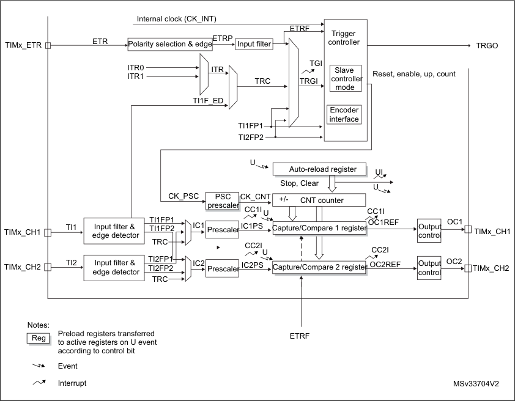

440/905 RM0377 Rev 10

--- end of page=439 ---

**RM0377** **General-purpose timers (TIM21/22)**

###### **17.3 TIM21/22 functional description**

**17.3.1** **Timebase unit**

The main block of the timer is a 16-bit counter with its related auto-reload register. The
counters counts up, down or both up and down but also down or both up and down. The
counter clock can be divided by a prescaler.

The counter, the auto-reload register and the prescaler register can be written or read by
software. This is true even when the counter is running.

The timebase unit includes:

      - Counter register (TIMx_CNT)

      - Prescaler register (TIMx_PSC)

      - Auto-reload register (TIMx_ARR)

The auto-reload register is preloaded. Writing to or reading from the auto-reload register
accesses the preload register. The content of the preload register are transferred into the
shadow register permanently or at each update event (UEV), depending on the auto-reload
preload enable bit (ARPE) in TIMx_CR1 register. The update event is sent when the counter
reaches the overflow and if the UDIS bit equals 0 in the TIMx_CR1 register. It can also be
generated by software. The generation of the update event is described in detailed for each
configuration.

The counter is clocked by the prescaler output CK_CNT, which is enabled only when the
counter enable bit (CEN) in TIMx_CR1 register is set (refer also to the slave mode controller
description to get more details on counter enabling).

Note that the counter starts counting 1 clock cycle after setting the CEN bit in the TIMx_CR1
register.

**Prescaler description**

The prescaler can divide the counter clock frequency by any factor between 1 and 65536. It
is based on a 16-bit counter controlled through a 16-bit register (in the TIMx_PSC register).
It can be changed on the fly as this control register is buffered. The new prescaler ratio is
taken into account at the next update event.

_Figure 125_ and _Figure 126_ give some examples of the counter behavior when the prescaler
ratio is changed on the fly.

RM0377 Rev 10 441/905

493

--- end of page=440 ---

**General-purpose timers (TIM21/22)** **RM0377**

**Figure 124. Counter timing diagram with prescaler division change from 1 to 2**

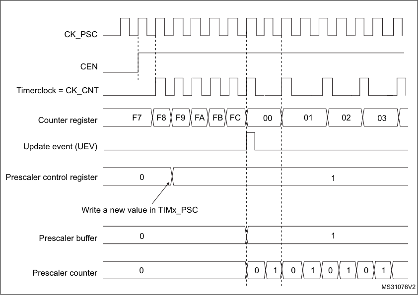

|Col1|Col2|Col3|Col4|Col5|Col6|Col7|Col8|Col9|Col10|Col11|Col12|Col13|Col14|Col15|
|---|---|---|---|---|---|---|---|---|---|---|---|---|---|---|
|F8|F9|FA|FB|FC|00|00|01|01|01|02|02|02|03|03|
|F8|F9|FA|FB|FC|||||||||||
|F8|||||||||||||||
|F8|||||||||||||||
|F8|||||||||||||||
|F8|||||||||||||||
|F8|||||0|1|0|1|0|0|1|0|0|1|

442/905 RM0377 Rev 10

--- end of page=441 ---

**RM0377** **General-purpose timers (TIM21/22)**

**Figure 125. Counter timing diagram with prescaler division change from 1 to 4**

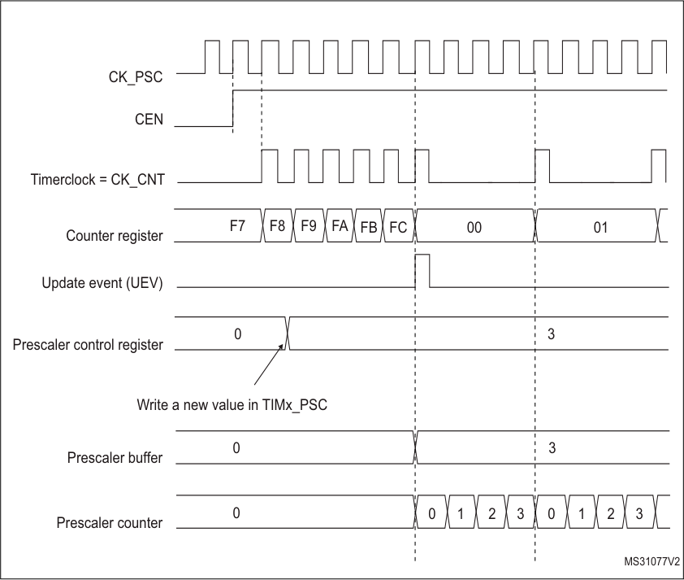

**17.3.2** **Counter modes**

**Upcounting mode**

|Col1|Col2|Col3|Col4|Col5|Col6|Col7|Col8|Col9|Col10|Col11|Col12|Col13|Col14|
|---|---|---|---|---|---|---|---|---|---|---|---|---|---|
|F8|F8|F9|FA|FB|FC|00|00|00|00|01|01|01|01|
|F8|F8|F9|FA|FB|FC|||||||||
|F8||||||||||||||
|F8||||||||||||||
|F8||||||||||||||
|F8||||||||||||||
|F8||||||0|1|2|3|0|1|2|3|

In upcounting mode, the counter counts from 0 to the auto-reload value (content of the
TIMx_ARR register), then restarts from 0 and generates a counter overflow event.

Setting the UG bit in the TIMx_EGR register (by software or by using the slave mode
controller on TIM21/22) also generates an update event.

The UEV event can be disabled by software by setting the UDIS bit in the TIMx_CR1
register. This is to avoid updating the shadow registers while writing new values in the
preload registers. Then no update event occurs until the UDIS bit has been written to 0.
However, the counter restarts from 0, as well as the counter of the prescaler (but the
prescale rate does not change). In addition, if the URS bit (update request selection) in
TIMx_CR1 register is set, setting the UG bit generates an update event UEV but without
setting the UIF flag (thus no interrupt is sent). This is to avoid generating both update and
capture interrupts when clearing the counter on the capture event.

RM0377 Rev 10 443/905

493

--- end of page=442 ---

**General-purpose timers (TIM21/22)** **RM0377**

When an update event occurs, all the registers are updated and the update flag (UIF bit in
TIMx_SR register) is set (depending on the URS bit):

      - The auto-reload shadow register is updated with the preload value (TIMx_ARR),

      - The buffer of the prescaler is reloaded with the preload value (content of the TIMx_PSC
register).

The following figures show some examples of the counter behavior for different clock
frequencies when TIMx_ARR=0x36.

**Figure 126. Counter timing diagram, internal clock divided by 1**

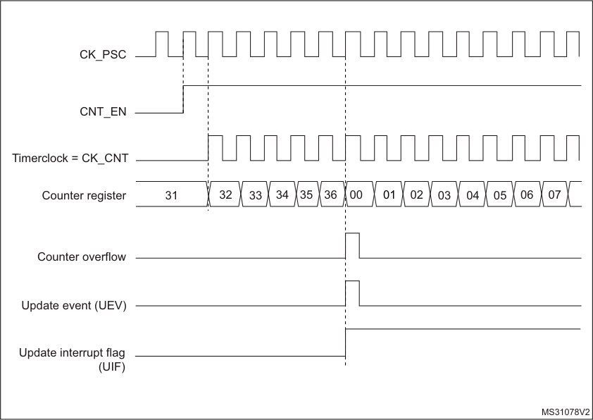

|Col1|Col2|Col3|Col4|Col5|Col6|Col7|Col8|Col9|Col10|Col11|Col12|Col13|
|---|---|---|---|---|---|---|---|---|---|---|---|---|
|32|33|34|35|36|00|01|02|03|04|05|06|07|

444/905 RM0377 Rev 10

--- end of page=443 ---

**RM0377** **General-purpose timers (TIM21/22)**

**Figure 127. Counter timing diagram, internal clock divided by 2**

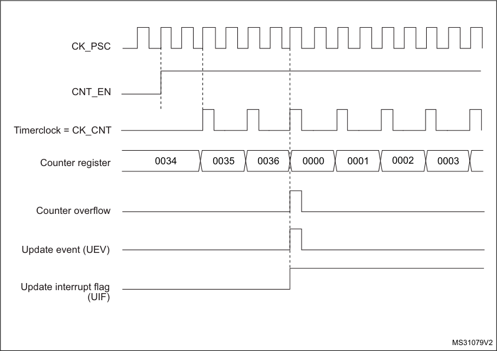

**Figure 128. Counter timing diagram, internal clock divided by 4**

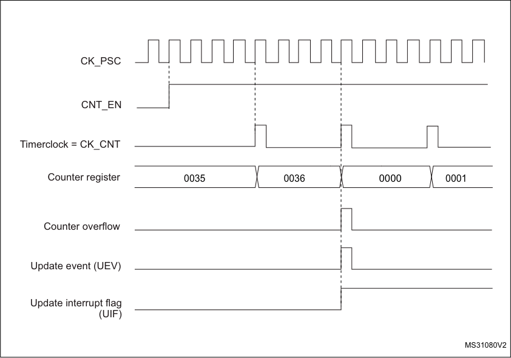

RM0377 Rev 10 445/905

493

--- end of page=444 ---

**General-purpose timers (TIM21/22)** **RM0377**

**Figure 129. Counter timing diagram, internal clock divided by N**

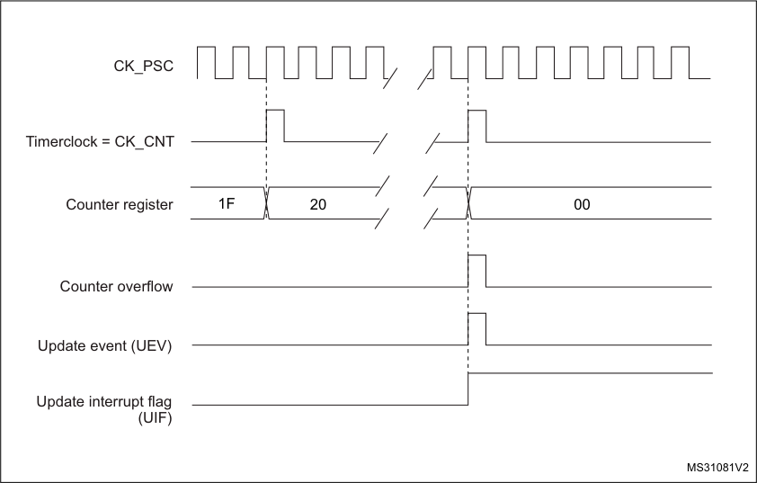

**Figure 130. Counter timing diagram, update event when ARPE=0 (TIMx_ARR not**
**preloaded)**

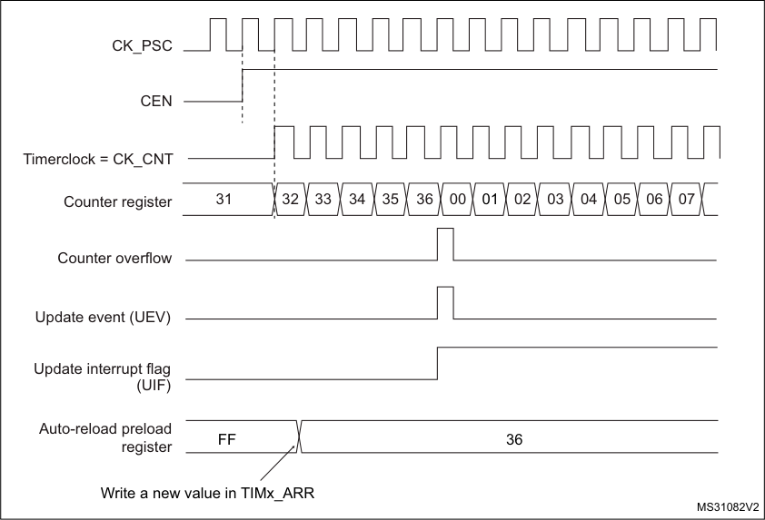

446/905 RM0377 Rev 10

--- end of page=445 ---

**RM0377** **General-purpose timers (TIM21/22)**

**Figure 131. Counter timing diagram, update event when ARPE=1 (TIMx_ARR**
**preloaded)**

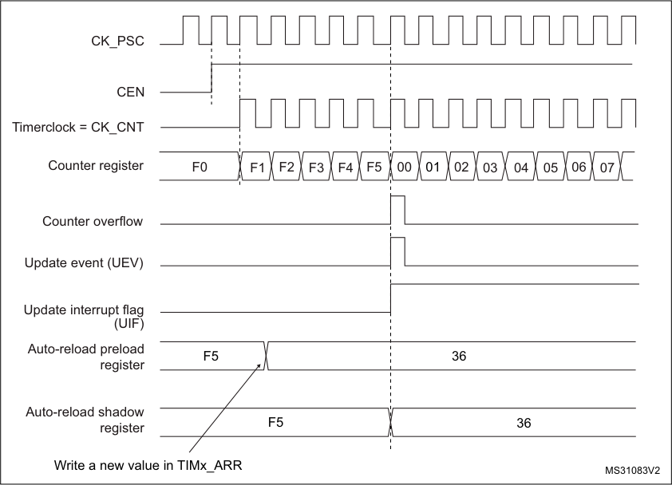

|Col1|Col2|Col3|Col4|Col5|Col6|Col7|Col8|
|---|---|---|---|---|---|---|---|
|F1|F2|F3|F4|F5|00|01|02|

**Downcounting mode**

In downcounting mode, the counter counts from the auto-reload value (content of the
TIMx_ARR register) down to 0, then restarts from the auto-reload value and generates a
counter underflow event.

An Update event can be generate at each counter underflow or by setting the UG bit in the
TIMx_EGR register (by software or by using the slave mode controller)

The UEV update event can be disabled by software by setting the UDIS bit in TIMx_CR1
register. This is to avoid updating the shadow registers while writing new values in the
preload registers. Then no update event occurs until UDIS bit has been written to 0.
However, the counter restarts from the current auto-reload value, whereas the counter of the
prescaler restarts from 0 (but the prescale rate doesn’t change).

In addition, if the URS bit (update request selection) in TIMx_CR1 register is set, setting the
UG bit generates an update event UEV but without setting the UIF flag (thus no interrupt or
DMA request is sent). This is to avoid generating both update and capture interrupts when
clearing the counter on the capture event.

When an update event occurs, all the registers are updated and the update flag (UIF bit in
TIMx_SR register) is set (depending on the URS bit):

- The buffer of the prescaler is reloaded with the preload value (content of the TIMx_PSC
register).

- The auto-reload active register is updated with the preload value (content of the
TIMx_ARR register). Note that the auto-reload is updated before the counter is
reloaded, so that the next period is the expected one.

RM0377 Rev 10 447/905

493

--- end of page=446 ---

**General-purpose timers (TIM21/22)** **RM0377**

The following figures show some examples of the counter behavior for different clock
frequencies when TIMx_ARR=0x36.

**Figure 132. Counter timing diagram, internal clock divided by 1**

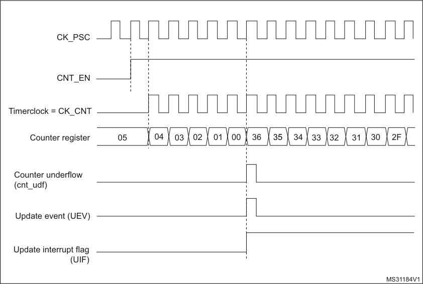

|Col1|Col2|Col3|Col4|Col5|Col6|Col7|Col8|Col9|Col10|Col11|Col12|Col13|
|---|---|---|---|---|---|---|---|---|---|---|---|---|
|04|03|02|01|00|36|35|34|33|32|31|30|2F|

**Figure 133. Counter timing diagram, internal clock divided by 2**

448/905 RM0377 Rev 10

--- end of page=447 ---

**RM0377** **General-purpose timers (TIM21/22)**

**Figure 134. Counter timing diagram, internal clock divided by 4**

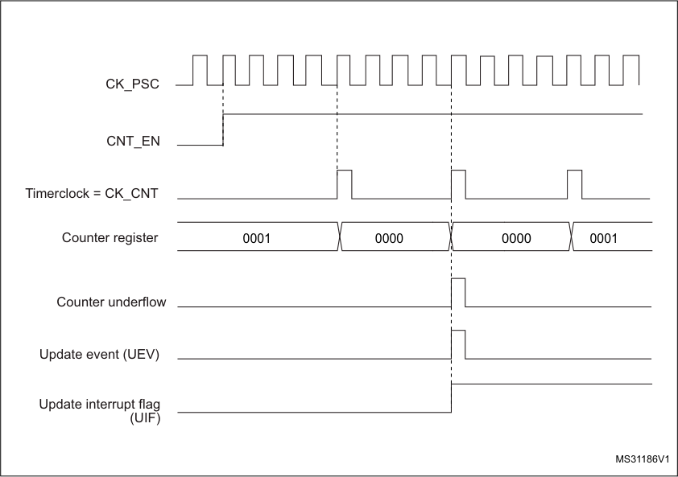

**Figure 135. Counter timing diagram, internal clock divided by N**

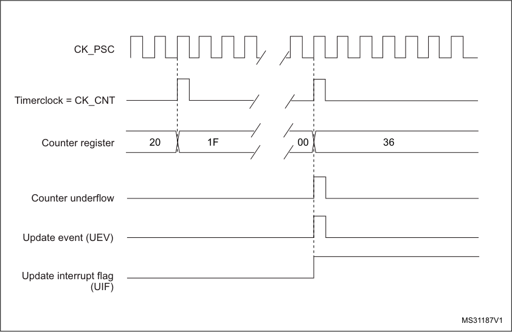

RM0377 Rev 10 449/905

493

--- end of page=448 ---

**General-purpose timers (TIM21/22)** **RM0377**

**Center-aligned mode (up/down counting)**

In center-aligned mode, the counter counts from 0 to the auto-reload value (content of the
TIMx_ARR register) – 1, generates a counter overflow event, then counts from the autoreload value down to 1 and generates a counter underflow event. Then it restarts counting
from 0.

Center-aligned mode is active when the CMS bits in TIMx_CR1 register are not equal to
'00'. The Output compare interrupt flag of channels configured in output is set when: the
counter counts down (Center aligned mode 1, CMS = "01"), the counter counts up (Center
aligned mode 2, CMS = "10") the counter counts up and down (Center aligned mode 3,
CMS = "11").

In this mode, the direction bit (DIR from TIMx_CR1 register) cannot be written. It is updated
by hardware and gives the current direction of the counter.

The update event can be generated at each counter overflow and at each counter underflow
or by setting the UG bit in the TIMx_EGR register (by software or by using the slave mode
controller) also generates an update event. In this case, the counter restarts counting from
0, as well as the counter of the prescaler.

The UEV update event can be disabled by software by setting the UDIS bit in TIMx_CR1
register. This is to avoid updating the shadow registers while writing new values in the
preload registers. Then no update event occurs until the UDIS bit has been written to 0.
However, the counter continues counting up and down, based on the current auto-reload
value.

In addition, if the URS bit (update request selection) in TIMx_CR1 register is set, setting the
UG bit generates an update event UEV but without setting the UIF flag (thus no interrupt or
DMA request is sent). This is to avoid generating both update and capture interrupt when
clearing the counter on the capture event.

When an update event occurs, all the registers are updated and the update flag (UIF bit in
TIMx_SR register) is set (depending on the URS bit):

      - The buffer of the prescaler is reloaded with the preload value (content of the TIMx_PSC
register).

      - The auto-reload active register is updated with the preload value (content of the
TIMx_ARR register). Note that if the update source is a counter overflow, the autoreload is updated before the counter is reloaded, so that the next period is the expected
one (the counter is loaded with the new value).

The following figures show some examples of the counter behavior for different clock
frequencies.

450/905 RM0377 Rev 10

--- end of page=449 ---

