# RM0377 STM32L0x1 — Pages 451–500

**RM0377** **General-purpose timers (TIM21/22)**

**Figure 136. Counter timing diagram, internal clock divided by 1, TIMx_ARR=0x6**

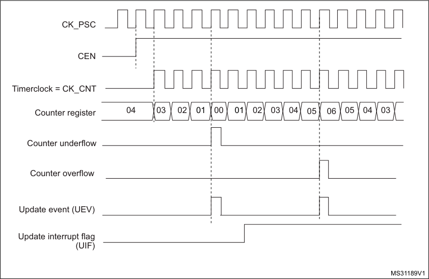

|Col1|Col2|Col3|Col4|Col5|Col6|Col7|Col8|Col9|Col10|Col11|Col12|Col13|
|---|---|---|---|---|---|---|---|---|---|---|---|---|
|03|02|01|00|01|02|03|04|05|06|05|04|03|
|03|02|01|||||||||||

1. Here, center-aligned mode 1 is used (for more details refer to _Section 17.4.1: TIM21/22 control register 1_
_(TIMx_CR1) on page 475_ ).

**Figure 137. Counter timing diagram, internal clock divided by 2**

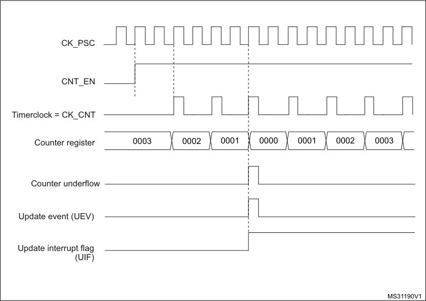

RM0377 Rev 10 451/905

493

--- end of page=450 ---

**General-purpose timers (TIM21/22)** **RM0377**

**Figure 138. Counter timing diagram, internal clock divided by 4, TIMx_ARR=0x36**

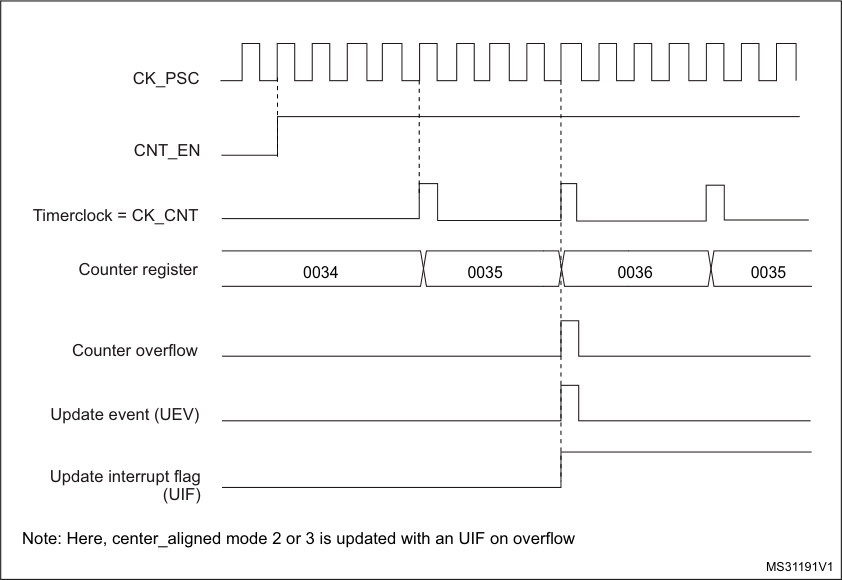

1. Center-aligned mode 2 or 3 is used with an UIF on overflow.

**Figure 139. Counter timing diagram, internal clock divided by N**

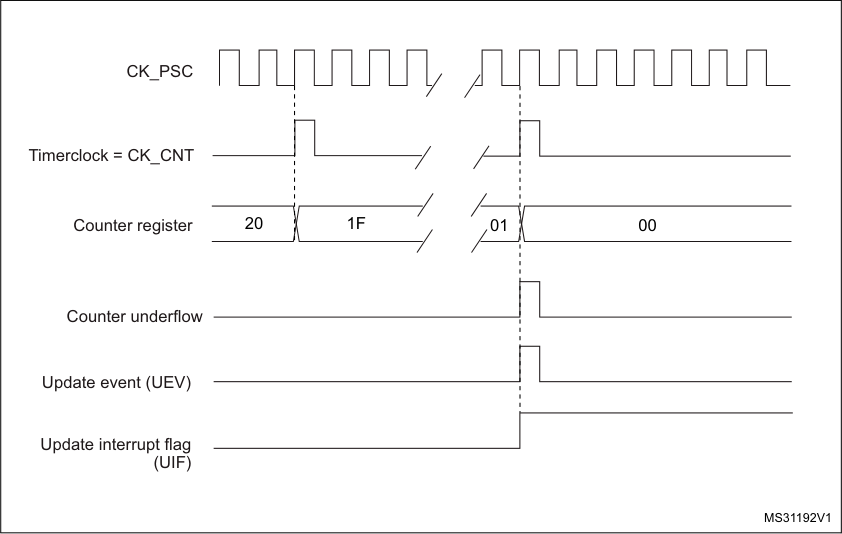

452/905 RM0377 Rev 10

--- end of page=451 ---

**RM0377** **General-purpose timers (TIM21/22)**

**Figure 140. Counter timing diagram, Update event with ARPE=1 (counter underflow)**

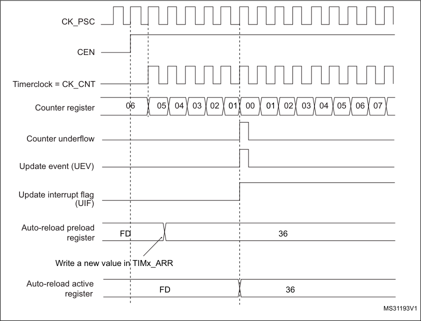

|Col1|Col2|Col3|Col4|Col5|Col6|Col7|Col8|Col9|Col10|Col11|Col12|Col13|Col14|
|---|---|---|---|---|---|---|---|---|---|---|---|---|---|
|||||||||||||||
|6|05|04|03|02|01|00|01|02 |03|04|05|06|07|
|||||||||||||||
|||||||||||||||
|||||||||||||||
|||||||||||||||
|||||||||||||||
|TIMx_ARR|TIMx_ARR|TIMx_ARR|TIMx_ARR|TIMx_ARR|TIMx_ARR|TIMx_ARR|TIMx_ARR|TIMx_ARR|TIMx_ARR|TIMx_ARR|TIMx_ARR|TIMx_ARR|TIMx_ARR|
|FD|FD|FD|FD|FD|FD|FD|FD|FD|FD|FD|FD|FD|FD|

**Figure 141. Counter timing diagram, Update event with ARPE=1 (counter overflow)**

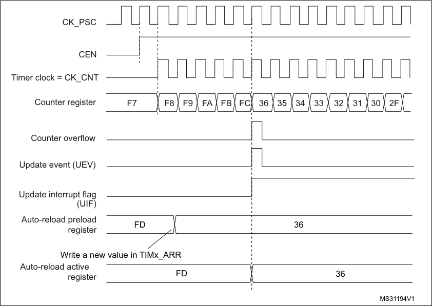

|Col1|Col2|Col3|Col4|Col5|Col6|Col7|Col8|
|---|---|---|---|---|---|---|---|
|F8|F9|FA|FB|FC|36|35|34|

RM0377 Rev 10 453/905

493

--- end of page=452 ---

**General-purpose timers (TIM21/22)** **RM0377**

**17.3.3** **Clock selection**

The counter clock can be provided by the following clock sources:

      - Internal clock (CK_INT)

      - External clock mode1: external input pin (TIx)

      - External clock mode2: external trigger input (ETR connected internally to LSE)

      - Internal trigger inputs (ITRx): connecting the trigger output from another timer. Refer to
_Section : Using one timer as prescaler for another timer_ for more details.

**Internal clock source (CK_INT)**

The internal clock source is selected when the slave mode controller is disabled
(SMS=’000’). The CEN bit in the TIMx_CR1 register and the UG bit in the TIMx_EGR
register are then used as control bits and can be changed only by software (except for UG
which remains cleared). As soon as the CEN bit is programmed to 1, the prescaler is
clocked by the internal clock CK_INT.

_Figure 142_ shows the behavior of the control circuit and the upcounter in normal mode,
without prescaler.

**Figure 142. Control circuit in normal mode, internal clock divided by 1**

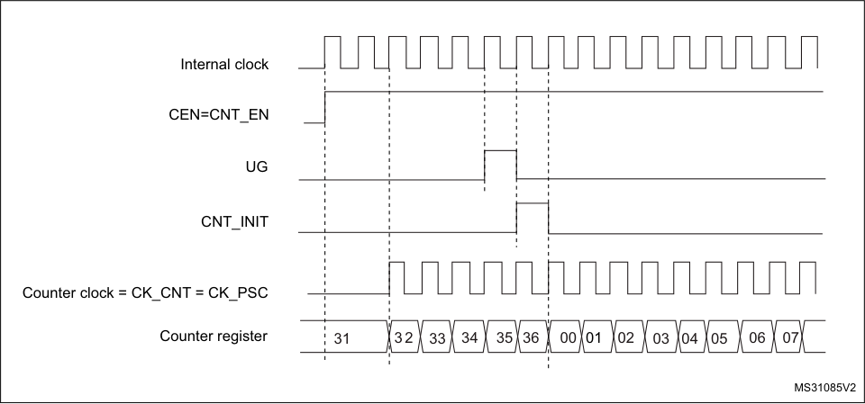

|Col1|Col2|Col3|Col4|Col5|Col6|Col7|Col8|Col9|Col10|Col11|Col12|Col13|Col14|
|---|---|---|---|---|---|---|---|---|---|---|---|---|---|
|||||||||||||||
|||||||||||||||
|||||||||||||||
|31|3 2|33|34|35|36|00|01|02|03|04|05|06|07|

454/905 RM0377 Rev 10

--- end of page=453 ---

**RM0377** **General-purpose timers (TIM21/22)**

**External clock source mode 1**

This mode is selected when SMS=’111’ in the TIMx_SMCR register. The counter can count
at each rising or falling edge on a selected input.

**Figure 143. TI2 external clock connection example**

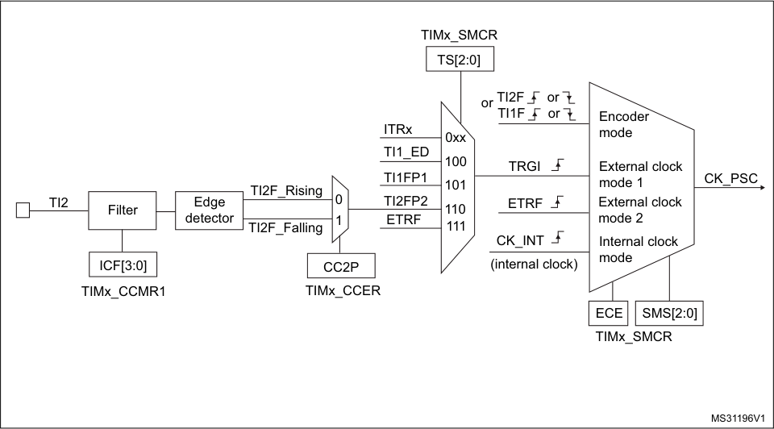

For example, to configure the upcounter to count in response to a rising edge on the TI2
input, use the following procedure:
1. Configure channel 2 to detect rising edges on the TI2 input by writing CC2S = ‘01’ in
the TIMx_CCMR1 register.

2. Configure the input filter duration by writing the IC2F[3:0] bits in the TIMx_CCMR1
register (if no filter is needed, keep IC2F=’0000’).

3. Select the rising edge polarity by writing CC2P=’0’ and CC2NP=’0’ in the TIMx_CCER
register.

4. Configure the timer in external clock mode 1 by writing SMS=’111’ in the TIMx_SMCR
register.

5. Select TI2 as the trigger input source by writing TS=’110’ in the TIMx_SMCR register.

6. Enable the counter by writing CEN=’1’ in the TIMx_CR1 register.

For code example, refer to _A.9.1: Upcounter on TI2 rising edge code example_ .

_Note:_ _The capture prescaler is not used for triggering, so it does not need to be configured._

When a rising edge occurs on TI2, the counter counts once and the TIF flag is set.
The delay between the rising edge on TI2 and the actual clock of the counter is due to the
resynchronization circuit on TI2 input.

RM0377 Rev 10 455/905

493

--- end of page=454 ---

**General-purpose timers (TIM21/22)** **RM0377**

**Figure 144. Control circuit in external clock mode 1**

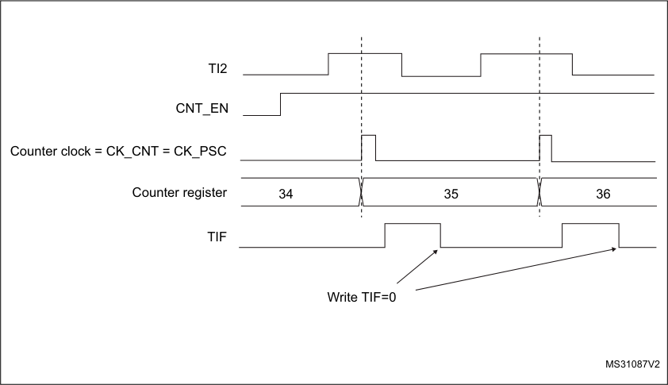

**External clock source mode 2**

This mode is selected by writing ECE=1 in the TIMx_SMCR register.

The counter can count at each rising or falling edge on the external trigger input ETR.

The _Figure 145_ gives an overview of the external trigger input block.

**Figure 145. External trigger input block**

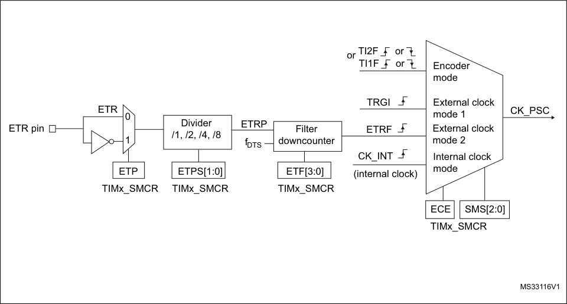

456/905 RM0377 Rev 10

--- end of page=455 ---

**RM0377** **General-purpose timers (TIM21/22)**

For example, to configure the upcounter to count each 2 rising edges on ETR, use the
following procedure:

1. As no filter is needed in this example, write ETF[3:0]=0000 in the TIMx_SMCR register.

2. Set the prescaler by writing ETPS[1:0]=01 in the TIMx_SMCR register

3. Select rising edge detection on the ETR pin by writing ETP=0 in the TIMx_SMCR
register

4. Enable external clock mode 2 by writing ECE=1 in the TIMx_SMCR register.

5. Enable the counter by writing CEN=1 in the TIMx_CR1 register.

For code example, refer to _A.9.2: Up counter on each 2 ETR rising edges code example_ .

The counter counts once each 2 ETR rising edges.

The delay between the rising edge on ETR and the actual clock of the counter is due to the
resynchronization circuit on the ETRP signal.

**Figure 146. Control circuit in external clock mode 2**

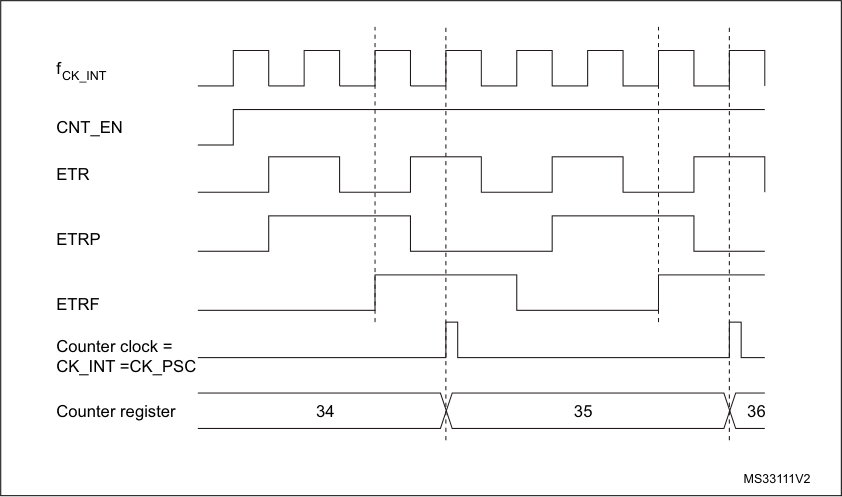

**17.3.4** **Capture/compare channels**

Each Capture/Compare channel is built around a capture/compare register (including a
shadow register), a input stage for capture (with digital filter, multiplexing and prescaler) and
an output stage (with comparator and output control).

_Figure 147_ to _Figure 149_ give an overview of one capture/compare channel.

The input stage samples the corresponding TIx input to generate a filtered signal TIxF.
Then, an edge detector with polarity selection generates a signal (TIxFPx) which can be
used as trigger input by the slave mode controller or as the capture command. It is
prescaled before the capture register (ICxPS).

RM0377 Rev 10 457/905

493

--- end of page=456 ---

**General-purpose timers (TIM21/22)** **RM0377**

**Figure 147. Capture/compare channel (example: channel 1 input stage)**

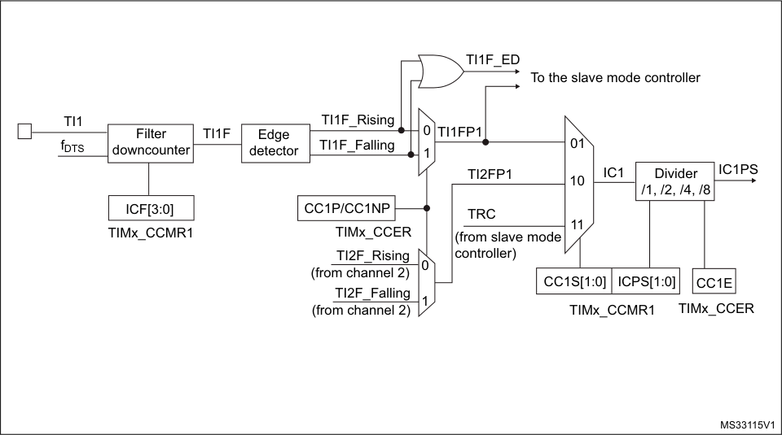

The output stage generates an intermediate waveform which is then used for reference:
OCxRef (active high). The polarity acts at the end of the chain.

**Figure 148. Capture/compare channel 1 main circuit**

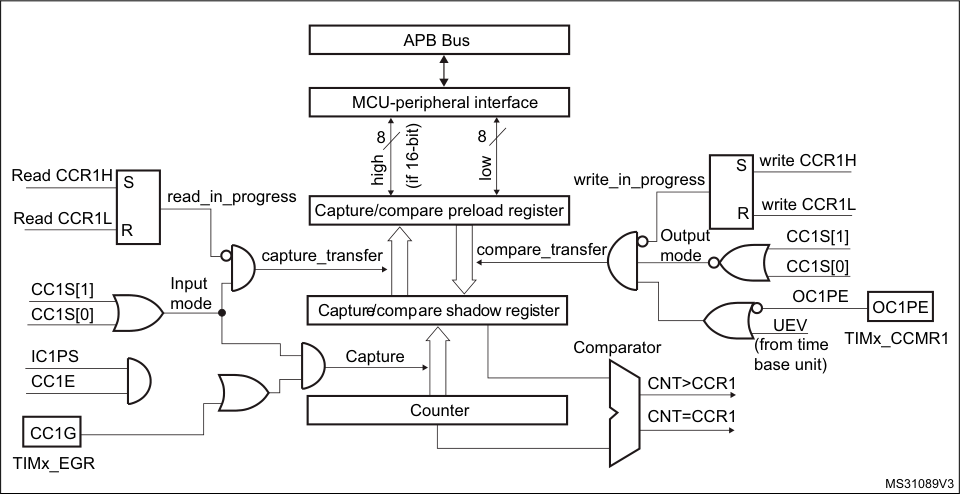

458/905 RM0377 Rev 10

--- end of page=457 ---

**RM0377** **General-purpose timers (TIM21/22)**

**Figure 149. Output stage of capture/compare channel (channel 1 and 2)**

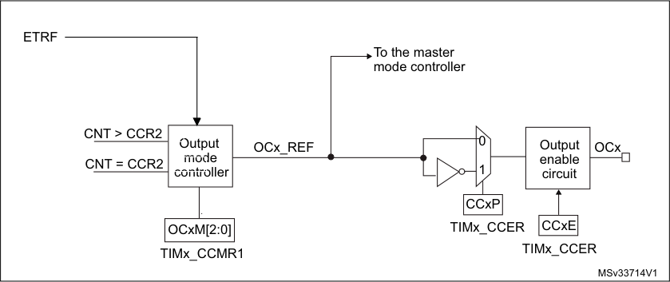

|CNT > CCR2|Col2|Col3|
|---|---|---|
|CNT > CCR2||Output mode|
|CNT > CCR2|controller|controller|

The capture/compare block is made of one preload register and one shadow register. Write
and read always access the preload register.

In capture mode, captures are actually done in the shadow register, which is copied into the
preload register.

In compare mode, the content of the preload register is copied into the shadow register
which is compared to the counter.

**17.3.5** **Input capture mode**

In Input capture mode, the Capture/Compare Registers (TIMx_CCRx) are used to latch the
value of the counter after a transition detected by the corresponding ICx signal. When a
capture occurs, the corresponding CCXIF flag (TIMx_SR register) is set and an interrupt or
a DMA request can be sent if they are enabled. If a capture occurs while the CCxIF flag was
already high, then the over-capture flag CCxOF (TIMx_SR register) is set. CCxIF can be
cleared by software by writing it to ‘0’ or by reading the captured data stored in the
TIMx_CCRx register. CCxOF is cleared when it is written with 0.

The following example shows how to capture the counter value in TIMx_CCR1 when TI1
input rises. To do this, use the following procedure:

1. Select the active input: TIMx_CCR1 must be linked to the TI1 input, so write the CC1S
bits to ‘01’ in the TIMx_CCMR1 register. As soon as CC1S becomes different from ‘00’,
the channel is configured in input mode and the TIMx_CCR1 register becomes readonly.

2. Program the appropriate input filter duration in relation with the signal connected to the
timer (when the input is one of the TIx (ICxF bits in the TIMx_CCMRx register). Let’s
imagine that, when toggling, the input signal is not stable during at must 5 internal clock
cycles. We must program a filter duration longer than these 5 clock cycles. We can
validate a transition on TI1 when 8 consecutive samples with the new level have been

RM0377 Rev 10 459/905

493

--- end of page=458 ---

**General-purpose timers (TIM21/22)** **RM0377**

detected (sampled at f DTS frequency). Then write IC1F bits to ‘0011’ in the
TIMx_CCMR1 register.

3. Select the edge of the active transition on the TI1 channel by programming CC1P and
CC1NP bits to ‘00’ in the TIMx_CCER register (rising edge in this case).

4. Program the input prescaler. In our example, we wish the capture to be performed at
each valid transition, so the prescaler is disabled (write IC1PS bits to ‘00’ in the
TIMx_CCMR1 register).

5. Enable capture from the counter into the capture register by setting the CC1E bit in the
TIMx_CCER register.

6. If needed, enable the related interrupt request by setting the CC1IE bit in the
TIMx_DIER register.

For code example, refer to _A.9.3: Input capture configuration code example_ .

When an input capture occurs:

      - The TIMx_CCR1 register gets the value of the counter on the active transition.

      - CC1IF flag is set (interrupt flag). CC1OF is also set if at least two consecutive captures
occurred whereas the flag was not cleared.

      - An interrupt is generated depending on the CC1IE bit.

For code example, refer to _A.9.4: Input capture data management code example_ .

In order to handle the overcapture, it is recommended to read the data before the
overcapture flag. This is to avoid missing an overcapture which could happen after reading
the flag and before reading the data.

_Note:_ _IC interrupt requests can be generated by software by setting the corresponding CCxG bit in_
_the TIMx_EGR register._

460/905 RM0377 Rev 10

--- end of page=459 ---

**RM0377** **General-purpose timers (TIM21/22)**

**17.3.6** **PWM input mode**

This mode is a particular case of input capture mode. The procedure is the same except:

      - Two ICx signals are mapped on the same TIx input.

      - These 2 ICx signals are active on edges with opposite polarity.

      - One of the two TIxFP signals is selected as trigger input and the slave mode controller
is configured in reset mode.

For example, one can measure the period (in TIMx_CCR1 register) and the duty cycle (in
TIMx_CCR2 register) of the PWM applied on TI1 using the following procedure (depending
on CK_INT frequency and prescaler value):

1. Select the active input for TIMx_CCR1: write the CC1S bits to ‘01’ in the TIMx_CCMR1
register (TI1 selected).

2. Select the active polarity for TI1FP1 (used both for capture in TIMx_CCR1 and counter
clear): program the CC1P and CC1NP bits to ‘00’ (active on rising edge).

3. Select the active input for TIMx_CCR2: write the CC2S bits to ‘10’ in the TIMx_CCMR1
register (TI1 selected).

4. Select the active polarity for TI1FP2 (used for capture in TIMx_CCR2): program the
CC2P and CC2NP bits to ‘11’ (active on falling edge).

5. Select the valid trigger input: write the TS bits to ‘101’ in the TIMx_SMCR register
(TI1FP1 selected).

6. Configure the slave mode controller in reset mode: write the SMS bits to ‘100’ in the
TIMx_SMCR register.

7. Enable the captures: write the CC1E and CC2E bits to ‘1’ in the TIMx_CCER register.

For code example, refer to _A.9.5: PWM input configuration code example_ .

**Figure 150. PWM input mode timing**

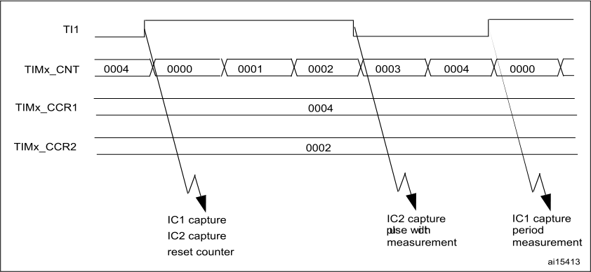

1. The PWM input mode can be used only with the TIMx_CH1/TIMx_CH2 signals due to the fact that only
TI1FP1 and TI2FP2 are connected to the slave mode controller.

RM0377 Rev 10 461/905

493

--- end of page=460 ---

**General-purpose timers (TIM21/22)** **RM0377**

**17.3.7** **Forced output mode**

In output mode (CCxS bits = ‘00’ in the TIMx_CCMRx register), each output compare signal
(OCxREF and then OCx) can be forced to active or inactive level directly by software,
independently of any comparison between the output compare register and the counter.

To force an output compare signal (OCXREF/OCx) to its active level, one just needs to write
‘101’ in the OCxM bits in the corresponding TIMx_CCMRx register. Thus OCXREF is forced
high (OCxREF is always active high) and OCx get opposite value to CCxP polarity bit.

For example: CCxP=’0’ (OCx active high) => OCx is forced to high level.

The OCxREF signal can be forced low by writing the OCxM bits to ‘100’ in the
TIMx_CCMRx register.

Anyway, the comparison between the TIMx_CCRx shadow register and the counter is still
performed and allows the flag to be set. Interrupt requests can be sent accordingly. This is
described in the output compare mode section below.

**17.3.8** **Output compare mode**

This function is used to control an output waveform or indicating when a period of time has
elapsed.

When a match is found between the capture/compare register and the counter, the output
compare function:

1. Assigns the corresponding output pin to a programmable value defined by the output
compare mode (OCxM bits in the TIMx_CCMRx register) and the output polarity (CCxP
bit in the TIMx_CCER register). The output pin can keep its level (OCXM=’000’), be set
active (OCxM=’001’), be set inactive (OCxM=’010’) or can toggle (OCxM=’011’) on
match.

2. Sets a flag in the interrupt status register (CCxIF bit in the TIMx_SR register).

3. Generates an interrupt if the corresponding interrupt mask is set (CCXIE bit in the
TIMx_DIER register).

The TIMx_CCRx registers can be programmed with or without preload registers using the
OCxPE bit in the TIMx_CCMRx register.

In output compare mode, the update event UEV has no effect on OCxREF and OCx output.
The timing resolution is one count of the counter. Output compare mode can also be used to
output a single pulse (in One-pulse mode).

Procedure:

1. Select the counter clock (internal, external, prescaler).

2. Write the desired data in the TIMx_ARR and TIMx_CCRx registers.

3. Set the CCxIE bit if an interrupt request is to be generated.

4. Select the output mode. For example:

–
Write OCxM = ‘011’ to toggle OCx output pin when CNT matches CCRx

–
Write OCxPE = ‘0’ to disable preload register

–
Write CCxP = ‘0’ to select active high polarity

–
Write CCxE = ‘1’ to enable the output

5. Enable the counter by setting the CEN bit in the TIMx_CR1 register.

For code example, refer to _A.9.7: Output compare configuration code example_ .

462/905 RM0377 Rev 10

--- end of page=461 ---

**RM0377** **General-purpose timers (TIM21/22)**

The TIMx_CCRx register can be updated at any time by software to control the output
waveform, provided that the preload register is not enabled (OCxPE=’0’, else TIMx_CCRx
shadow register is updated only at the next update event UEV). An example is given in
_Figure 151_ .

**Figure 151. Output compare mode, toggle on OC1**

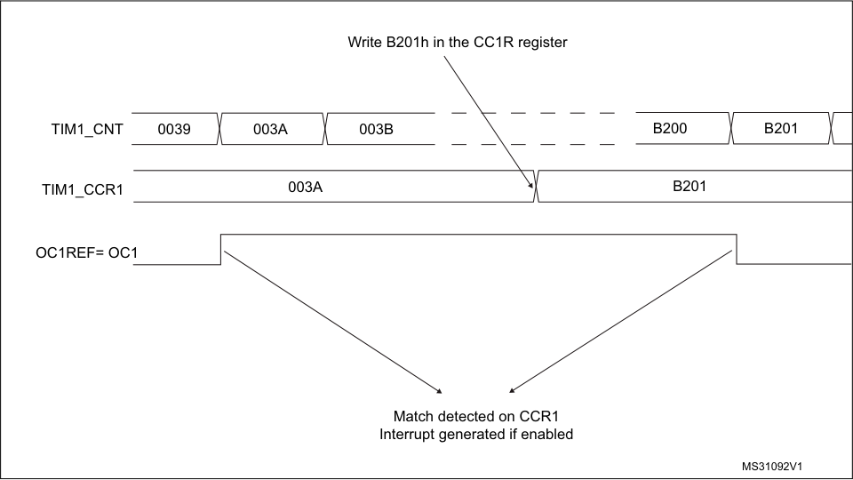

**17.3.9** **PWM mode**

Pulse Width Modulation mode allows to generate a signal with a frequency determined by
the value of the TIMx_ARR register and a duty cycle determined by the value of the
TIMx_CCRx register.

The PWM mode can be selected independently on each channel (one PWM per OCx
output) by writing the OCxM bits in the TIMx_CCMRx register. The corresponding preload
register must be enabled by setting the OCxPE bit in the TIMx_CCMRx register, and
eventually the auto-reload preload register (in upcounting or center-aligned modes) by
setting the ARPE bit in the TIMx_CR1 register.

As the preload registers are transferred to the shadow registers only when an update event
occurs, before starting the counter, all registers must be initialized by setting the UG bit in
the TIMx_EGR register.

The OCx polarity is software programmable using the CCxP bit in the TIMx_CCER register.
It can be programmed as active high or active low. The OCx output is enabled by the CCxE
bit in the TIMx_CCER register. Refer to the TIMx_CCERx register description for more
details.

In PWM mode (1 or 2), TIMx_CNT and TIMx_CCRx are always compared to determine
whether TIMx_CNT ≤ TIMx_CCRx.

RM0377 Rev 10 463/905

493

--- end of page=462 ---

**General-purpose timers (TIM21/22)** **RM0377**

The timer is able to generate PWM in edge-aligned mode only since the counter is
upcounting.

      - Upcounting configuration

Upcounting is active when the DIR bit in the TIMx_CR1 register is low. Refer to the
_Upcounting mode on page 443_ .

In the following example, we consider PWM mode 1. The reference PWM signal
OCxREF is high as long as TIMx_CNT < TIMx_CCRx else it becomes low. If the
compare value in TIMx_CCRx is greater than the auto-reload value (in TIMx_ARR)
then OCxREF is held at ‘1’. If the compare value is 0 then OCxRef is held at ‘0’.
_Figure 152_ shows some edge-aligned PWM waveforms in an example where
TIMx_ARR=8.

For code example, refer to _A.9.8: Edge-aligned PWM configuration example_ .

**Figure 152. Edge-aligned PWM waveforms (ARR=8)**

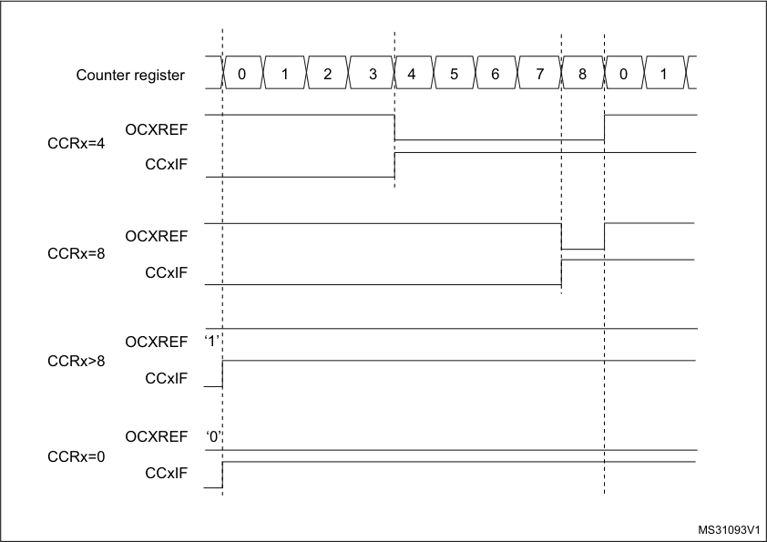

|0|1|2|3|4|5|
|---|---|---|---|---|---|
|||||||
|||||||

|Col1|7|8|0|1|
|---|---|---|---|---|
||7||||
||||||
||||||
||||||

      - Downcounting configuration

Downcounting is active when DIR bit in TIMx_CR1 register is high. Refer to the
_Downcounting mode on page 447_

In PWM mode 1, the reference signal OCxRef is low as long as
TIMx_CNT > TIMx_CCRx else it becomes high. If the compare value in TIMx_CCRx is
greater than the auto-reload value in TIMx_ARR, then OCxREF is held at ‘1’. 0% PWM
is not possible in this mode.

464/905 RM0377 Rev 10

--- end of page=463 ---

**RM0377** **General-purpose timers (TIM21/22)**

**PWM center-aligned mode**

Center-aligned mode is active when the CMS bits in TIMx_CR1 register are different from
‘00’ (all the remaining configurations having the same effect on the OCxRef/OCx signals).
The compare flag is set when the counter counts up, when it counts down or both when it
counts up and down depending on the CMS bits configuration. The direction bit (DIR) in the
TIMx_CR1 register is updated by hardware and must not be changed by software. Refer to
the _Center-aligned mode (up/down counting) on page 450_ .

_Figure 153_ shows some center-aligned PWM waveforms in an example where:

      - TIMx_ARR=8,

      - PWM mode is the PWM mode 1,

      - The flag is set when the counter counts down corresponding to the center-aligned
mode 1 selected for CMS=01 in TIMx_CR1 register.

For code example, refer to _A.9.9: Center-aligned PWM configuration example_ .

**Figure 153. Center-aligned PWM waveforms (ARR=8)**

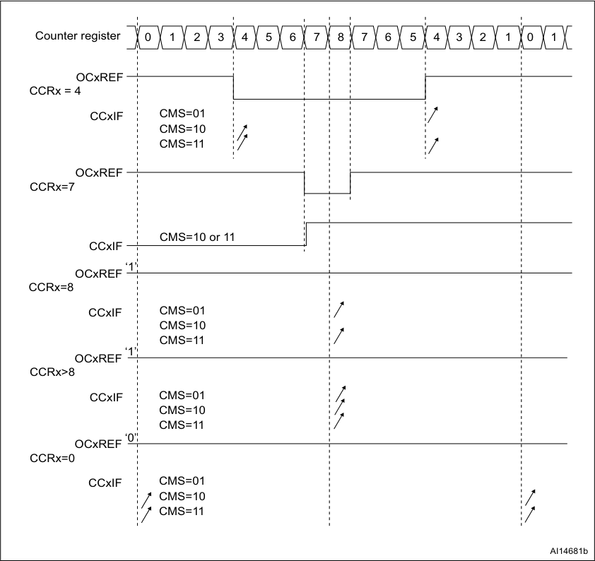

|Col1|7|8|
|---|---|---|
||||
||||
||||
||||
|CMS=01 CMS=10 CMS=11|CMS=01 CMS=10 CMS=11||
|CMS=01 CMS=10 CMS=11|CMS=01 CMS=10 CMS=11||

RM0377 Rev 10 465/905

493

--- end of page=464 ---

**General-purpose timers (TIM21/22)** **RM0377**

**Hints on using center-aligned mode**

      - When starting in center-aligned mode, the current up-down configuration is used. It
means that the counter counts up or down depending on the value written in the DIR bit
in the TIMx_CR1 register. Moreover, the DIR and CMS bits must not be changed at the
same time by the software.

      - Writing to the counter while running in center-aligned mode is not recommended as it
can lead to unexpected results. In particular:

–
The direction is not updated if a value greater than the auto-reload value is written
in the counter (TIMx_CNT>TIMx_ARR). For example, if the counter was counting
up, it continues to count up.

–
The direction is updated if 0 or the TIMx_ARR value is written in the counter but no
Update Event UEV is generated.

      - The safest way to use center-aligned mode is to generate an update by software
(setting the UG bit in the TIMx_EGR register) just before starting the counter and not to
write the counter while it is running.

**17.3.10** **Clearing the OCxREF signal on an external event**

The OCxREF signal for a given channel can be driven Low by applying a High level to the
ETRF input (OCxCE enable bit of the corresponding TIMx_CCMRx register set to ‘1’). The
OCxREF signal remains Low until the next update event, UEV, occurs.

This function can only be used in output compare and PWM modes, and does not work in
forced mode.

For example, the ETR signal can be connected to the output of a comparator to be used for
current handling. In this case, the ETR must be configured as follow:

1. The External Trigger Prescaler should be kept off: bits ETPS[1:0] of the TIMx_SMCR
register set to ‘00’.

2. The external clock mode 2 must be disabled: bit ECE of the TIMx_SMCR register set to
‘0’.

3. The External Trigger Polarity (ETP) and the External Trigger Filter (ETF) can be
configured according to the user needs.

For code example, refer to _A.9.10: ETR configuration to clear OCxREF code example_ .

_Figure 154_ shows the behavior of the OCxREF signal when the ETRF Input becomes High,
for both values of the enable bit OCxCE. In this example, the timer TIMx is programmed in
PWM mode.

466/905 RM0377 Rev 10

--- end of page=465 ---

**RM0377** **General-purpose timers (TIM21/22)**

**Figure 154. Clearing TIMx OCxREF**

_Note:_ _In case of a PWM with a 100% duty cycle (if CCRx>ARR), then OCxREF is enabled again at_
_the next counter overflow._

**17.3.11** **One-pulse mode**

One-pulse mode (OPM) is a particular case of the previous modes. It allows the counter to
be started in response to a stimulus and to generate a pulse with a programmable length
after a programmable delay.

Starting the counter can be controlled through the slave mode controller. Generating the
waveform can be done in output compare mode or PWM mode. One-pulse mode is selected
by setting the OPM bit in the TIMx_CR1 register. This makes the counter stop automatically
at the next update event UEV.

A pulse can be correctly generated only if the compare value is different from the counter
initial value. Before starting (when the timer is waiting for the trigger), the configuration must
be as follows:

CNT < CCRx ≤ ARR (in particular, 0 < CCRx)

RM0377 Rev 10 467/905

493

--- end of page=466 ---

**General-purpose timers (TIM21/22)** **RM0377**

**Figure 155. Example of one pulse mode**

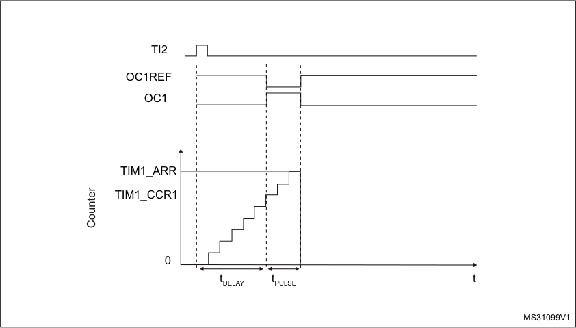

For example one may want to generate a positive pulse on OC1 with a length of t PULSE and
after a delay of t DELAY as soon as a positive edge is detected on the TI2 input pin.

Use TI2FP2 as trigger 1:

1. Map TI2FP2 to TI2 by writing CC2S=’01’ in the TIMx_CCMR1 register.

2. TI2FP2 must detect a rising edge, write CC2P=’0’ and CC2NP = ‘0’ in the TIMx_CCER
register.

3. Configure TI2FP2 as trigger for the slave mode controller (TRGI) by writing TS=’110’ in
the TIMx_SMCR register.

4. TI2FP2 is used to start the counter by writing SMS to ‘110’ in the TIMx_SMCR register
(trigger mode).

The OPM waveform is defined by writing the compare registers (taking into account the
clock frequency and the counter prescaler).

      - The t DELAY is defined by the value written in the TIMx_CCR1 register.

      - The t PULSE is defined by the difference between the auto-reload value and the compare
value (TIMx_ARR - TIMx_CCR1+1).

      - Let’s say one want to build a waveform with a transition from ‘0’ to ‘1’ when a compare
match occurs and a transition from ‘1’ to ‘0’ when the counter reaches the auto-reload
value. To do this PWM mode 2 must be enabled by writing OC1M=’111’ in the
TIMx_CCMR1 register. Optionally the preload registers can be enabled by writing
OC1PE=’1’ in the TIMx_CCMR1 register and ARPE in the TIMx_CR1 register. In this
case one has to write the compare value in the TIMx_CCR1 register, the auto-reload
value in the TIMx_ARR register, generate an update by setting the UG bit and wait for
external trigger event on TI2. CC1P is written to ‘0’ in this example.

In our example, the DIR and CMS bits in the TIMx_CR1 register should be low.

For code example, refer to _A.9.16: One-Pulse mode code example_ .

468/905 RM0377 Rev 10

--- end of page=467 ---

**RM0377** **General-purpose timers (TIM21/22)**

Since only 1 pulse (Single mode) is needed, a 1 must be written in the OPM bit in the
TIMx_CR1 register to stop the counter at the next update event (when the counter rolls over
from the auto-reload value back to 0). When OPM bit in the TIMx_CR1 register is set to '0',
so the Repetitive Mode is selected.

**Particular case: OCx fast enable**

In One-pulse mode, the edge detection on TIx input set the CEN bit which enables the
counter. Then the comparison between the counter and the compare value makes the
output toggle. But several clock cycles are needed for these operations and it limits the
minimum delay t DELAY min we can get.

If one wants to output a waveform with the minimum delay, the OCxFE bit can be set in the
TIMx_CCMRx register. Then OCxRef (and OCx) are forced in response to the stimulus,
without taking in account the comparison. Its new level is the same as if a compare match
had occurred. OCxFE acts only if the channel is configured in PWM1 or PWM2 mode.

For code example, refer to _A.9.16: One-Pulse mode code example_ .

**17.3.12** **Encoder interface mode**

To select Encoder Interface mode write SMS=‘001 in the TIMx_SMCR register if the counter
is counting on TI2 edges only, SMS=010 if it is counting on TI1 edges only and SMS=011 if
it is counting on both TI1 and TI2 edges.

Select the TI1 and TI2 polarity by programming the CC1P and CC2P bits in the TIMx_CCER
register. CC1NP and CC2NP must be kept cleared. When needed, the input filter can be
programmed as well. CC1NP and CC2NP must be kept low.

The two inputs TI1 and TI2 are used to interface to an incremental encoder. Refer to
_Table 80_ . The counter is clocked by each valid transition on TI1FP1 or TI2FP2 (TI1 and TI2
after input filter and polarity selection, TI1FP1=TI1 if not filtered and not inverted,
TI2FP2=TI2 if not filtered and not inverted) assuming that it is enabled (CEN bit in
TIMx_CR1 register written to ‘1). The sequence of transitions of the two inputs is evaluated
and generates count pulses as well as the direction signal. Depending on the sequence the
counter counts up or down, the DIR bit in the TIMx_CR1 register is modified by hardware
accordingly. The DIR bit is calculated at each transition on any input (TI1 or TI2), whatever
the counter is counting on TI1 only, TI2 only or both TI1 and TI2.

Encoder interface mode acts simply as an external clock with direction selection. This
means that the counter just counts continuously between 0 and the auto-reload value in the
TIMx_ARR register (0 to ARR or ARR down to 0 depending on the direction). So the
TIMx_ARR must be configured before starting. In the same way, the capture, compare,
prescaler, trigger output features continue to work as normal.

In this mode, the counter is modified automatically following the speed and the direction of
the ~~q~~ uadrature encoder and its content, therefore, always represents the encoder’s position.
The count direction correspond to the rotation direction of the connected sensor. The table
summarizes the possible combinations, assuming TI1 and TI2 do not switch at the same
time.

RM0377 Rev 10 469/905

493

--- end of page=468 ---

**General-purpose timers (TIM21/22)** **RM0377**

**Table 80. Counting direction versus encoder signals**

|Active edge|Level on opposite signal (TI1FP1 for TI2, TI2FP2 for TI1)|TI1FP1 signal|Col4|TI2FP2 signal|Col6|
|---|---|---|---|---|---|
|**Active edge**|**Level on opposite** **signal (TI1FP1 for** **TI2, TI2FP2 for TI1)**|**Rising**|**Falling**|**Rising**|**Falling**|
|Counting on TI1 only|High|Down|Up|No Count|No Count|
|Counting on TI1 only|Low|Up|Down|No Count|No Count|
|Counting on TI2 only|High|No Count|No Count|Up|Down|
|Counting on TI2 only|Low|No Count|No Count|Down|Up|
|Counting on TI1 and TI2|High|Down|Up|Up|Down|
|Counting on TI1 and TI2|Low|Up|Down|Down|Up|

An external incremental encoder can be connected directly to the MCU without external
interface logic. However, comparators are normally be used to convert the encoder’s
differential outputs to digital signals. This greatly increases noise immunity. The third
encoder output which indicate the mechanical zero position, may be connected to an
external interrupt input and trigger a counter reset.

_Figure 156_ gives an example of counter operation, showing count signal generation and
direction control. It also shows how input jitter is compensated where both edges are
selected. This might occur if the sensor is positioned near to one of the switching points. For
this example we assume that the configuration is the following:

- CC1S= 01 (TIMx_CCMR1 register, TI1FP1 mapped on TI1)

- CC2S= 01 (TIMx_CCMR2 register, TI2FP2 mapped on TI2)

- CC1P and CC1NP = ‘0’ (TIMx_CCER register, TI1FP1 noninverted, TI1FP1=TI1)

- CC2P and CC2NP = ‘0’ (TIMx_CCER register, TI2FP2 noninverted, TI2FP2=TI2)

- SMS= 011 (TIMx_SMCR register, both inputs are active on both rising and falling
edges)

- CEN= 1 (TIMx_CR1 register, Counter is enabled)

For code example, refer to _A.9.11: Encoder interface code example_ .

**Figure 156. Example of counter operation in encoder interface mode**

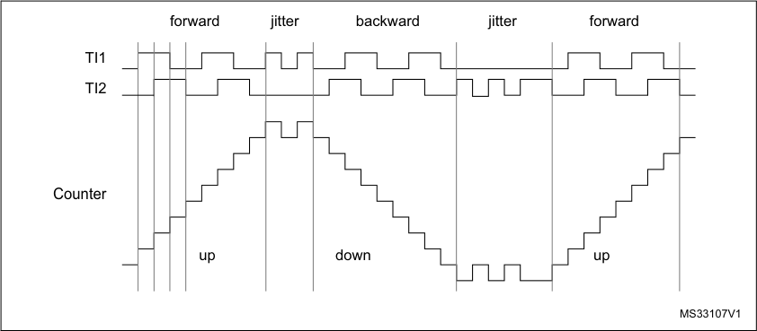

470/905 RM0377 Rev 10

--- end of page=469 ---

**RM0377** **General-purpose timers (TIM21/22)**

_Figure 157_ gives an example of counter behavior when TI1FP1 polarity is inverted (same
configuration as above except CC1P=1).

**Figure 157. Example of encoder interface mode with TI1FP1 polarity inverted**

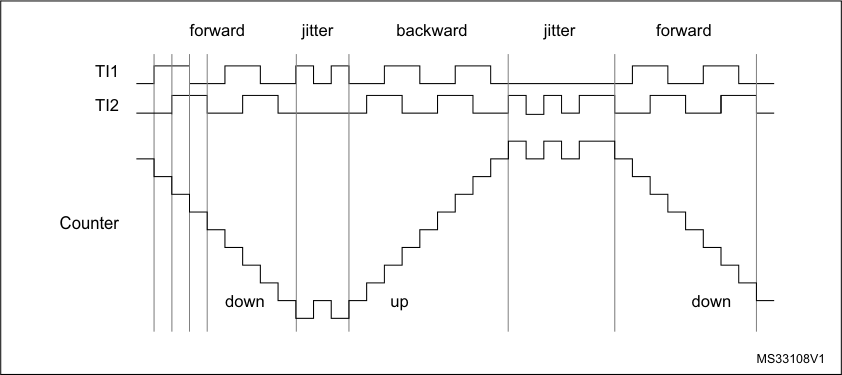

The timer, when configured in Encoder Interface mode provides information on the sensor’s
current position. Dynamic information can be obtained (speed, acceleration, deceleration)
by measuring the period between two encoder events using a second timer configured in
capture mode. The output of the encoder which indicates the mechanical zero can be used
for this purpose. Depending on the time between two events, the counter can also be read
at regular times. This can be done by latching the counter value into a third input capture
register if available (then the capture signal must be periodic and can be generated by
another timer). when available, it is also possible to read its value through a DMA request
generated by a Real-Time clock.

**17.3.13** **TIM21/22 external trigger synchronization**

The TIM21/22 timers can be synchronized with an external trigger in several modes: Reset
mode, Gated mode and Trigger mode.

**Slave mode: Reset mode**

The counter and its prescaler can be reinitialized in response to an event on a trigger input.
Moreover, if the URS bit from the TIMx_CR1 register is low, an update event UEV is
generated. Then all the preloaded registers (TIMx_ARR, TIMx_CCRx) are updated.

In the following example, the upcounter is cleared in response to a rising edge on TI1 input:

1. Configure the channel 1 to detect rising edges on TI1. Configure the input filter duration
(in this example, we do not need any filter, so we keep IC1F=’0000’). The capture
prescaler is not used for triggering, so it does not need to be configured. The CC1S bits
select the input capture source only, CC1S = ‘01’ in the TIMx_CCMR1 register.
Program CC1P and CC1NP to ‘00’ in TIMx_CCER register to validate the polarity (and
detect rising edges only).

2. Configure the timer in reset mode by writing SMS=’100’ in TIMx_SMCR register. Select
TI1 as the input source by writing TS=’101’ in TIMx_SMCR register.

3. Start the counter by writing CEN=’1’ in the TIMx_CR1 register.

For code example, refer to _A.9.12: Reset mode code example_ .

RM0377 Rev 10 471/905

493

--- end of page=470 ---

**General-purpose timers (TIM21/22)** **RM0377**

The counter starts counting on the internal clock, then behaves normally until TI1 rising
edge. When TI1 rises, the counter is cleared and restarts from 0. In the meantime, the
trigger flag is set (TIF bit in the TIMx_SR register) and an interrupt request can be sent if
enabled (depending on the TIE bit in TIMx_DIER register).

The following figure shows this behavior when the auto-reload register TIMx_ARR=0x36.
The delay between the rising edge on TI1 and the actual reset of the counter is due to the
resynchronization circuit on TI1 input.

**Figure 158. Control circuit in reset mode**

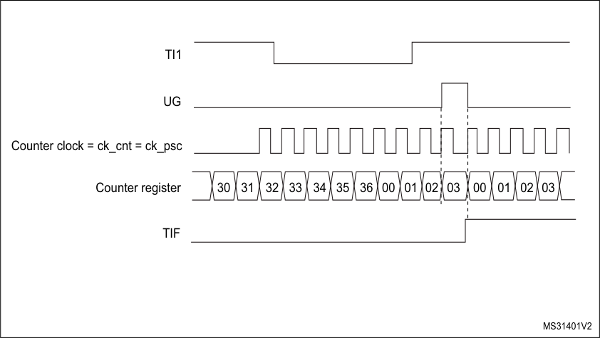

|Col1|Col2|Col3|Col4|Col5|Col6|Col7|Col8|Col9|Col10|Col11|Col12|Col13|Col14|Col15|
|---|---|---|---|---|---|---|---|---|---|---|---|---|---|---|
|30|31|32|33|34|35|36|00|01|02|03|00|01|02|03|

**Slave mode: Gated mode**

The counter can be enabled depending on the level of a selected input.

In the following example, the upcounter counts only when TI1 input is low:

1. Configure the channel 1 to detect low levels on TI1. Configure the input filter duration
(in this example, we do not need any filter, so we keep IC1F=’0000’). The capture
prescaler is not used for triggering, so it does not need to be configured. The CC1S bits
select the input capture source only, CC1S=’01’ in TIMx_CCMR1 register. Program
CC1P=’1’ and CC1NP= ‘0’ in TIMx_CCER register to validate the polarity (and detect
low level only).

2. Configure the timer in gated mode by writing SMS=’101’ in TIMx_SMCR register.
Select TI1 as the input source by writing TS=’101’ in TIMx_SMCR register.

3. Enable the counter by writing CEN=’1’ in the TIMx_CR1 register (in gated mode, the
counter doesn’t start if CEN=’0’, whatever is the trigger input level).

For code example, refer to _A.9.13: Gated mode code example_ .

The counter starts counting on the internal clock as long as TI1 is low and stops as soon as
TI1 becomes high. The TIF flag in the TIMx_SR register is set both when the counter starts
or stops.

The delay between the rising edge on TI1 and the actual stop of the counter is due to the
resynchronization circuit on TI1 input.

472/905 RM0377 Rev 10

--- end of page=471 ---

**RM0377** **General-purpose timers (TIM21/22)**

**Figure 159. Control circuit in gated mode**

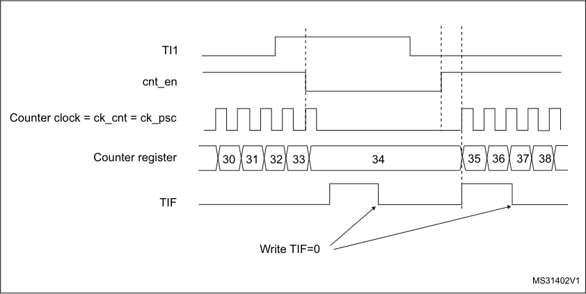

**Slave mode: Trigger mode**

The counter can start in response to an event on a selected input.

In the following example, the upcounter starts in response to a rising edge on TI2 input:

1. Configure the external trigger input circuit by programming the TIMx_SMCR register as
follows:

– ETF = 0000: no filter

–
ETPS = 00: prescaler disabled

–
ETP = 0: detection of rising edges on ETR and ECE=1 to enable the external clock
mode 2.

1. Configure the channel 2 to detect rising edges on TI2. Configure the input filter duration
(in this example, we do not need any filter, so we keep IC2F=’0000’). The capture
prescaler is not used for triggering, so it does not need to be configured. The CC2S bits
are configured to select the input capture source only, CC2S=’01’ in TIMx_CCMR1
register. Program CC2P=’1’ and CC2NP=’0’ in TIMx_CCER register to validate the
polarity (and detect low level only).

2. Configure the timer in trigger mode by writing SMS=’110’ in TIMx_SMCR register.
Select TI2 as the input source by writing TS=’110’ in TIMx_SMCR register.

For code example, refer to _A.9.14: Trigger mode code example_ .

When a rising edge occurs on TI2, the counter starts counting on the internal clock and the
TIF flag is set.

The delay between the rising edge on TI2 and the actual start of the counter is due to the
resynchronization circuit on TI2 input.

RM0377 Rev 10 473/905

493

--- end of page=472 ---

**General-purpose timers (TIM21/22)** **RM0377**

**Figure 160. Control circuit in trigger mode**

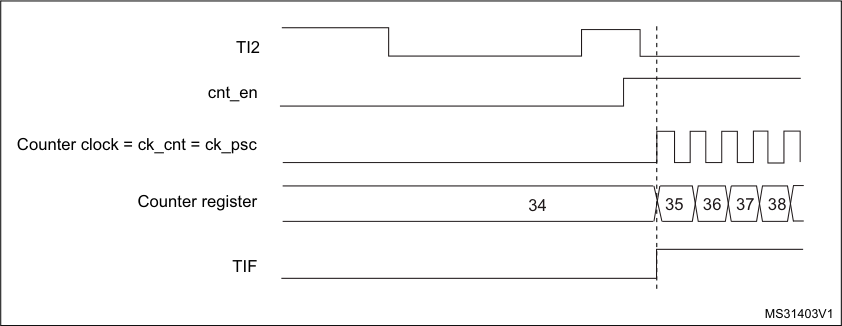

**17.3.14** **Timer synchronization (TIM21/22)**

The timers are linked together internally for timer synchronization or chaining. Refer to
_Section 16.3.15: Timer synchronization on page 408_ for details.

**17.3.15** **Debug mode**

When the microcontroller enters debug mode (Cortex [®] -M0+ core halted), the TIMx counter
either continues to work normally or stops, depending on DBG_TIMx_STOP configuration
bit in DBG module. For more details, refer to _Section 31.16.2: Debug support for timers,_
_watchdog, bxCAN and I_ _[2]_ _C_ .

474/905 RM0377 Rev 10

--- end of page=473 ---

**RM0377** **General-purpose timers (TIM21/22)**

###### **17.4 TIM21/22 registers**

Refer to _Section 1.2 on page 45_ for a list of abbreviations used in register descriptions.

The peripheral registers have to be written by half-words (16 bits) or words (32 bits). Read
accesses can be done by bytes (8 bits), half-words (16 bits) or words (32 bits).

**17.4.1** **TIM21/22 control register 1 (TIMx_CR1)**

Address offset: 0x00

Reset value: 0x0000

|15|14|13|12|11|10|9 8|Col8|7|6 5|Col11|4|3|2|1|0|
|---|---|---|---|---|---|---|---|---|---|---|---|---|---|---|---|
|Res.|Res.|Res.|Res.|Res.|Res.|CKD[1:0]|CKD[1:0]|ARPE|CMS[1:0]|CMS[1:0]|DIR|OPM|URS|UDIS|CEN|
|||||||rw|rw|rw|rw|rw|rw|rw|rw|rw|rw|

Bits 15:10 Reserved, must be kept at reset value.

Bits 9:8 **CKD** : Clock division

This bit-field indicates the division ratio between the timer clock (CK_INT) frequency and
sampling clock used by the digital filters (TIx),
00: t DTS = t CK_INT
01: t DTS = 2 × t CK_INT
10: t DTS = 4 × t CK_INT
11: Reserved

Bit 7 **ARPE** : Auto-reload preload enable

0: TIMx_ARR register is not buffered.
1: TIMx_ARR register is buffered.

Bits 6:5 **CMS[1:0]** : Center-aligned mode selection

00: Edge-aligned mode. The counter counts up or down depending on the direction bit
(DIR).
01: Center-aligned mode 1. The counter counts up and down alternatively. Output compare
interrupt flags of channels configured in output (CCxS=00 in TIMx_CCMRx register) are set
only when the counter is counting down.
10: Center-aligned mode 2. The counter counts up and down alternatively. Output compare
interrupt flags of channels configured in output (CCxS=00 in TIMx_CCMRx register) are set
only when the counter is counting up.
11: Center-aligned mode 3. The counter counts up and down alternatively. Output compare
interrupt flags of channels configured in output (CCxS=00 in TIMx_CCMRx register) are set
both when the counter is counting up or down.

_Note: It is not allowed to switch from edge-aligned mode to center-aligned mode as long as_
_the counter is enabled (CEN=1)._

Bit 4 **DIR** : Direction

0: Counter used as upcounter
1: Counter used as downcounter

Bit 3 **OPM** : One-pulse mode

0: Counter is not stopped on the update event
1: Counter stops counting on the next update event (clearing the CEN bit).

RM0377 Rev 10 475/905

493

--- end of page=474 ---

**General-purpose timers (TIM21/22)** **RM0377**

Bit 2 **URS** : Update request source

This bit is set and cleared by software to select the UEV event sources.
0: Any of the following events generates an update interrupt if enabled:

– Counter overflow

–
Setting the UG bit
1: Only counter overflow generates an update interrupt if enabled.

Bit 1 **UDIS** : Update disable

This bit is set and cleared by software to enable/disable update event (UEV) generation.
0: UEV enabled. An UEV is generated by one of the following events:

– Counter overflow

–
Setting the UG bit
Buffered registers are then loaded with their preload values.
1: UEV disabled. No UEV is generated, shadow registers keep their value (ARR, PSC,
CCRx). The counter and the prescaler are reinitialized if the UG bit is set.

Bit 0 **CEN** : Counter enable

0: Counter disabled

1: Counter enabled

CEN is cleared automatically in one-pulse mode, when an update event occurs.

476/905 RM0377 Rev 10

--- end of page=475 ---

**RM0377** **General-purpose timers (TIM21/22)**

**17.4.2** **TIM21/22 control register 2 (TIMx_CR2)**

Address offset: 0x04

Reset value: 0x0000

|15|14|13|12|11|10|9|8|7|6 5 4|Col11|Col12|3|2|1|0|
|---|---|---|---|---|---|---|---|---|---|---|---|---|---|---|---|
|Res.|Res.|Res.|Res.|Res.|Res.|Res.|Res.|Res.|MMS[2:0]|MMS[2:0]|MMS[2:0]|Res.|Res.|Res.|Res.|
||||||||||rw|rw|rw|||||

Bits 15:7 Reserved, must be kept at reset value.

Bits 6:4 **MMS** : Master mode selection

These bits allow to select the information to be sent in master mode to slave timers for

synchronization (TRGO). The combination is as follows:
000: **Reset**             - the UG bit from the TIMx_EGR register is used as trigger output (TRGO). If the
reset is generated by the trigger input (slave mode controller configured in reset mode) then
the signal on TRGO is delayed compared to the actual reset.
001: **Enable**             - the Counter enable signal, CNT_EN, is used as trigger output (TRGO). It is
useful to start several timers at the same time or to control a window in which a slave timer is

enabled. The Counter Enable signal is generated by a logic OR between CEN control bit
and the trigger input when configured in gated mode.
When the Counter Enable signal is controlled by the trigger input, there is a delay on TRGO,
except if the master/slave mode is selected (see the MSM bit description in TIMx_SMCR
register).
010: **Update**             - The update event is selected as trigger output (TRGO). For instance a master
timer can then be used as a prescaler for a slave timer.
011: **Compare Pulse**             - The trigger output send a positive pulse when the CC1IF flag is to be
set (even if it was already high), as soon as a capture or a compare match occurred.
(TRGO)
100: **Compare**             - OC1REF signal is used as trigger output (TRGO)
101: **Compare**             - OC2REF signal is used as trigger output (TRGO)

110: Reserved

111: Reserved

Bits 3:0 Reserved, must be kept at reset value.

RM0377 Rev 10 477/905

493

--- end of page=476 ---

**General-purpose timers (TIM21/22)** **RM0377**

**17.4.3** **TIM21/22 slave mode control register (TIMx_SMCR)**

Address offset: 0x08

Reset value: 0x0000

|15|14|13 12|Col4|11 10 9 8|Col6|Col7|Col8|7|6 5 4|Col11|Col12|3|2 1 0|Col15|Col16|
|---|---|---|---|---|---|---|---|---|---|---|---|---|---|---|---|
|ETP|ECE|ETPS[1:0]|ETPS[1:0]|ETF[3:0]|ETF[3:0]|ETF[3:0]|ETF[3:0]|MSM|TS[2:0]|TS[2:0]|TS[2:0]|Res.|SMS[2:0]|SMS[2:0]|SMS[2:0]|
|rw|rw|rw|rw|rw|rw|rw|rw|rw|rw|rw|rw||rw|rw|rw|

Bit 15 **ETP** : External trigger polarity

This bit selects whether ETR or ETR is used for trigger operations
0: ETR is non-inverted, active at high level or rising edge.
1: ETR is inverted, active at low level or falling edge.

Bit 14 **ECE** : External clock enable

This bit enables External clock mode 2.

0: External clock mode 2 disabled

1: External clock mode 2 enabled. The counter is clocked by any active edge on the ETRF
signal.

_Note: Setting the ECE bit has the same effect as selecting external clock mode 1 with TRGI_
_connected to ETRF (SMS=111 and TS=111)._

_It is possible to simultaneously use external clock mode 2 with the following slave_
_modes: reset mode, gated mode and trigger mode. Nevertheless, TRGI must not be_
_connected to ETRF in this case (TS bits must not be 111)._
_If external clock mode 1 and external clock mode 2 are enabled at the same time, the_
_external clock input is ETRF._

Bits 13:12 **ETPS[1:0]** : External trigger prescaler

External trigger signal ETRP frequency must be at most 1/4 of TIMxCLK frequency. A
prescaler can be enabled to reduce ETRP frequency. It is useful when inputting fast external
clocks.

00: Prescaler OFF

01: ETRP frequency divided by 2
10: ETRP frequency divided by 4
11: ETRP frequency divided by 8

478/905 RM0377 Rev 10

--- end of page=477 ---

**RM0377** **General-purpose timers (TIM21/22)**

Bits 11:8 **ETF[3:0]** : External trigger filter

This bit-field then defines the frequency used to sample ETRP signal and the length of the
digital filter applied to ETRP. The digital filter is made of an event counter in which N
consecutive events are needed to validate a transition on the output:

0000: No filter, sampling is done at f DTS
0001: f SAMPLING =f CK_INT, N=2
0010: f SAMPLING =f CK_INT, N=4
0011: f SAMPLING =f CK_INT, N=8
0100: f SAMPLING =f DTS /2, N=6
0101: f SAMPLING =f DTS /2, N=8
0110: f SAMPLING =f DTS /4, N=6
0111: f SAMPLING =f DTS /4, N=8
1000: f SAMPLING =f DTS /8, N=6
1001: f SAMPLING =f DTS /8, N=8
1010: f SAMPLING =f DTS /16, N=5
1011: f SAMPLING =f DTS /16, N=6
1100: f SAMPLING =f DTS /16, N=8
1101: f SAMPLING =f DTS /32, N=5
1110: f SAMPLING =f DTS /32, N=6
1111: f SAMPLING =f DTS /32, N=8

Bit 7 **MSM:** Master/Slave mode

0: No action

1: The effect of an event on the trigger input (TRGI) is delayed to allow a perfect
synchronization between the current timer and its slaves (through TRGO). It is useful in
order to synchronize several timers on a single external event.

RM0377 Rev 10 479/905

493

--- end of page=478 ---

**General-purpose timers (TIM21/22)** **RM0377**

Bits 6:4 **TS:** Trigger selection

This bitfield selects the trigger input to be used to synchronize the counter.
000: Internal Trigger 0 (ITR0)
001: Internal Trigger 1 (ITR1)
010: Reserved

011: Reserved

100: TI1 Edge Detector (TI1F_ED)
101: Filtered Timer Input 1 (TI1FP1)
110: Filtered Timer Input 2 (TI2FP2)
111: Reserved.

See _Table 81: TIMx Internal trigger connection on page 480_ for more details on the meaning
of ITRx for each timer.

_Note: These bits must be changed only when they are not used (e.g. when SMS=’000’) to_
_avoid wrong edge detections at the transition._

Bit 3 Reserved, must be kept at reset value.

Bits 2:0 **SMS:** Slave mode selection

When external signals are selected, the active edge of the trigger signal (TRGI) is linked to
the polarity selected on the external input (see Input control register and Control register
descriptions.
000: Slave mode disabled - if CEN = 1 then the prescaler is clocked directly by the internal
clock

001: Encoder mode 1

010: Encoder mode 2

011: Encoder mode 3

100: Reset mode - Rising edge of the selected trigger input (TRGI) reinitializes the counter
and generates an update of the registers
101: Gated mode - The counter clock is enabled when the trigger input (TRGI) is high. The
counter stops (but is not reset) as soon as the trigger becomes low. Counter starts and stops
are both controlled

110: Trigger mode - The counter starts on a rising edge of the trigger TRGI (but it is not
reset). Only the start of the counter is controlled
111: External Clock Mode 1

_Note: The Gated mode must not be used if TI1F_ED is selected as the trigger input_
_(TS=’100’). Indeed, TI1F_ED outputs 1 pulse for each transition on TI1F, whereas the_
_Gated mode checks the level of the trigger signal._

**Table 81. TIMx Internal trigger connection** **[(1)]**

|Slave TIM|ITR0 (TS = 000)|ITR1 (TS = 001)|
|---|---|---|
|TIM21|TIM2|TIM22|
|TIM22|TIM21|TIM2|

1. When a timer is not present in the product, the corresponding trigger ITRx is not available.

480/905 RM0377 Rev 10

--- end of page=479 ---

**RM0377** **General-purpose timers (TIM21/22)**

**17.4.4** **TIM21/22 Interrupt enable register (TIMx_DIER)**

Address offset: 0x0C

Reset value: 0x0000

|15|14|13|12|11|10|9|8|7|6|5|4|3|2|1|0|
|---|---|---|---|---|---|---|---|---|---|---|---|---|---|---|---|
|Res.|Res.|Res.|Res.|Res.|Res.|Res.|Res.|Res.|TIE|Res.|Res.|Res.|CC2IE|CC1IE|UIE|
||||||||||rw||||rw|rw|rw|

Bits 15:7 Reserved, must be kept at reset value.

Bit 6 **TIE** : Trigger interrupt enable

0: Trigger interrupt disabled.
1: Trigger interrupt enabled.

Bits 5:3 Reserved, must be kept at reset value.

Bit 2 **CC2IE** : Capture/Compare 2 interrupt enable

0: CC2 interrupt disabled.
1: CC2 interrupt enabled.

Bit 1 **CC1IE** : Capture/Compare 1 interrupt enable

0: CC1 interrupt disabled.
1: CC1 interrupt enabled.

Bit 0 **UIE** : Update interrupt enable

0: Update interrupt disabled.
1: Update interrupt enabled.

**17.4.5** **TIM21/22 status register (TIMx_SR)**

Address offset: 0x10

Reset value: 0x0000

|15|14|13|12|11|10|9|8|7|6|5|4|3|2|1|0|
|---|---|---|---|---|---|---|---|---|---|---|---|---|---|---|---|
|Res.|Res.|Res.|Res.|Res.|CC2OF|CC1OF|Res.|Res.|TIF|Res.|Res.|Res.|CC2IF|CC1IF|UIF|
||||||rc_w0|rc_w0|||rc_w0||||rc_w0|rc_w0|rc_w0|

Bits 15:11 Reserved, must be kept at reset value.

Bit 10 **CC2OF** : Capture/compare 2 overcapture flag

refer to CC1OF description

Bit 9 **CC1OF** : Capture/Compare 1 overcapture flag

This flag is set by hardware only when the corresponding channel is configured in input
capture mode. It is cleared by software by writing it to ‘0’.
0: No overcapture has been detected.
1: The counter value has been captured in TIMx_CCR1 register while CC1IF flag was
already set

Bits 8:7 Reserved, must be kept at reset value.

RM0377 Rev 10 481/905

493

--- end of page=480 ---

**General-purpose timers (TIM21/22)** **RM0377**

Bit 6 **TIF** : Trigger interrupt flag

This flag is set by hardware on trigger event (active edge detected on TRGI input when the
slave mode controller is enabled in all modes but gated mode. It is set when the counter
starts or stops when gated mode is selected. It is cleared by software.
0: No trigger event occurred.
1: Trigger interrupt pending.

Bits 5:3 Reserved, must be kept at reset value.

Bit 2 **CC2IF** : Capture/Compare 2 interrupt flag

refer to CC1IF description

Bit 1 **CC1IF** : Capture/compare 1 interrupt flag

**If channel CC1 is configured as output:**
This flag is set by hardware when the counter matches the compare value. It is cleared by
software.

0: No match.

1: The content of the counter TIMx_CNT matches the content of the TIMx_CCR1 register.
When the contents of TIMx_CCR1 are greater than the contents of TIMx_ARR, the CC1IF
bit goes high on the counter overflow.
**If channel CC1 is configured as input:**
This bit is set by hardware on a capture. It is cleared by software or by reading the
TIMx_CCR1 register.
0: No input capture occurred.
1: The counter value has been captured in TIMx_CCR1 register (an edge has been detected
on IC1 which matches the selected polarity).

Bit 0 **UIF** : Update interrupt flag

This bit is set by hardware on an update event. It is cleared by software.
0: No update occurred.
1: Update interrupt pending. This bit is set by hardware when the registers are updated:

– At overflow and if UDIS=’0’ in the TIMx_CR1 register.

– When CNT is reinitialized by software using the UG bit in TIMx_EGR register, if URS=’0’ and
UDIS=’0’ in the TIMx_CR1 register.

– When CNT is reinitialized by a trigger event (refer to the synchro control register
description), if URS=’0’ and UDIS=’0’ in the TIMx_CR1 register.

482/905 RM0377 Rev 10

--- end of page=481 ---

**RM0377** **General-purpose timers (TIM21/22)**

**17.4.6** **TIM21/22 event generation register (TIMx_EGR)**

Address offset: 0x14

Reset value: 0x0000

|15|14|13|12|11|10|9|8|7|6|5|4|3|2|1|0|
|---|---|---|---|---|---|---|---|---|---|---|---|---|---|---|---|
|Res.|Res.|Res.|Res.|Res.|Res.|Res.|Res.|Res.|TG|Res.|Res.|Res.|CC2G|CC1G|UG|
||||||||||w||||w|w|w|

Bits 15:7 Reserved, must be kept at reset value.

Bit 6 **TG** : Trigger generation

This bit is set by software in order to generate an event, it is automatically cleared by
hardware.

0: No action

1: The TIF flag is set in the TIMx_SR register. Related interrupt can occur if enabled

Bits 5:3 Reserved, must be kept at reset value.

Bit 2 **CC2G** : Capture/compare 2 generation

refer to CC1G description

Bit 1 **CC1G** : Capture/compare 1 generation

This bit is set by software to generate an event, it is automatically cleared by hardware.
0: No action

1: A capture/compare event is generated on channel 1:
**If channel CC1 is configured as output:**
the CC1IF flag is set, the corresponding interrupt is sent if enabled.
**If channel CC1 is configured as input:**
The current counter value is captured in the TIMx_CCR1 register. The CC1IF flag is set, the
corresponding interrupt is sent if enabled. The CC1OF flag is set if the CC1IF flag was
already high.

Bit 0 **UG** : Update generation

This bit can be set by software, it is automatically cleared by hardware.
0: No action

1: Re-initializes the counter and generates an update of the registers. The prescaler counter
is also cleared and the prescaler ratio is not affected. The counter is cleared.

RM0377 Rev 10 483/905

493

--- end of page=482 ---

**General-purpose timers (TIM21/22)** **RM0377**

**17.4.7** **TIM21/22 capture/compare mode register 1 (TIMx_CCMR1)**

Address offset: 0x18

Reset value: 0x0000

The channels can be used in input (capture mode) or in output (compare mode). The
direction of a channel is defined by configuring the corresponding CCxS bits. All the other
bits in this register have different functions in input and output modes. For a given bit, OCxx
describes its function when the channel is configured in output mode, ICxx describes its
function when the channel is configured in input mode. So one must take care that the same
bit can have different meanings for the input stage and the output stage.

|15|14 13 12|Col3|Col4|11|10|9 8|Col8|7|6 5 4|Col11|Col12|3|2|1 0|Col16|
|---|---|---|---|---|---|---|---|---|---|---|---|---|---|---|---|
|Res.|OC2M[2:0]|OC2M[2:0]|OC2M[2:0]|OC2PE|OC2FE|CC2S[1:0]|CC2S[1:0]|Res.|OC1M[2:0]|OC1M[2:0]|OC1M[2:0]|OC1PE|OC1FE|CC1S[1:0]|CC1S[1:0]|
|Res.|IC2F[3:0]|IC2F[3:0]|IC2F[3:0]|IC2PSC[1:0]|IC2PSC[1:0]|IC2PSC[1:0]|IC2PSC[1:0]|IC2PSC[1:0]|IC1F[3:0]|IC1F[3:0]|IC1F[3:0]|IC1PSC[1:0]|IC1PSC[1:0]|IC1PSC[1:0]|IC1PSC[1:0]|
||rw|rw|rw|rw|rw|rw|rw||rw|rw|rw|rw|rw|rw|rw|

**Output compare mode**

Bit 15 Reserved, must be kept at reset value.

Bits 14:12 **OC2M[2:0]** : Output compare 2 mode

Bit 11 **OC2PE** : Output compare 2 preload enable

Bit 10 **OC2FE** : Output compare 2 fast enable

Bits 9:8 **CC2S[1:0]** : Capture/Compare 2 selection

This bitfield defines the direction of the channel (input/output) as well as the used input.
00: CC2 channel is configured as output
01: CC2 channel is configured as input, IC2 is mapped on TI2
10: CC2 channel is configured as input, IC2 is mapped on TI1
11: CC2 channel is configured as input, IC2 is mapped on TRC. This mode works only if an
internal trigger input is selected through the TS bit (TIMx_SMCR register

_Note: The CC2S bits are writable only when the channel is OFF (CC2E = 0 in TIMx_CCER)._

Bit 7 Reserved, must be kept at reset value.

484/905 RM0377 Rev 10

--- end of page=483 ---

**RM0377** **General-purpose timers (TIM21/22)**

Bits 6:4 **OC1M** : Output compare 1 mode

These bits define the behavior of the output reference signal OC1REF from which OC1 and
OC1N are derived. OC1REF is active high whereas the active levels of OC1 and OC1N
depend on the CC1P and CC1NP bits, respectively.
000: Frozen - The comparison between the output compare register TIMx_CCR1 and the
counter TIMx_CNT has no effect on the outputs.(this mode is used to generate a timing
base).
001: Set channel 1 to active level on match. The OC1REF signal is forced high when the
TIMx_CNT counter matches the capture/compare register 1 (TIMx_CCR1).
010: Set channel 1 to inactive level on match. The OC1REF signal is forced low when the
TIMx_CNT counter matches the capture/compare register 1 (TIMx_CCR1).
011: Toggle - OC1REF toggles when TIMx_CNT=TIMx_CCR1
100: Force inactive level - OC1REF is forced low

101: Force active level - OC1REF is forced high
110: PWM mode 1 - In upcounting, channel 1 is active as long as TIMx_CNT<TIMx_CCR1
else it is inactive. In downcounting, channel 1 is inactive (OC1REF=‘0) as long as
TIMx_CNT>TIMx_CCR1, else it is active (OC1REF=’1’)
111: PWM mode 2 - In upcounting, channel 1 is inactive as long as TIMx_CNT<TIMx_CCR1
else it is active. In downcounting, channel 1 is active as long as TIMx_CNT>TIMx_CCR1
else it is inactive.

_Note: In PWM mode 1 or 2, the OCREF level changes only when the result of the_
_comparison changes or when the output compare mode switches from “frozen” mode_
_to “PWM” mode._

Bit 3 **OC1PE** : Output compare 1 preload enable

0: Preload register on TIMx_CCR1 disabled. TIMx_CCR1 can be written at anytime, the
new value is taken into account immediately
1: Preload register on TIMx_CCR1 enabled. Read/Write operations access the preload
register. TIMx_CCR1 preload value is loaded into the active register at each update event

_Note: The PWM mode can be used without validating the preload register only in one-pulse_
_mode (OPM bit set in the TIMx_CR1 register). Else the behavior is not guaranteed._

Bit 2 **OC1FE** : Output compare 1 fast enable

This bit is used to accelerate the effect of an event on the trigger in input on the CC output.
0: CC1 behaves normally depending on the counter and CCR1 values even when the
trigger is ON. The minimum delay to activate the CC1 output when an edge occurs on the
trigger input is 5 clock cycles
1: An active edge on the trigger input acts like a compare match on the CC1 output. Then,
OC is set to the compare level independently of the result of the comparison. Delay to
sample the trigger input and to activate CC1 output is reduced to 3 clock cycles. OC1FE
acts only if the channel is configured in PWM1 or PWM2 mode.

Bits 1:0 **CC1S** : Capture/Compare 1 selection

This bitfield defines the direction of the channel (input/output) as well as the used input.
00: CC1 channel is configured as output
01: CC1 channel is configured as input, IC1 is mapped on TI1
10: CC1 channel is configured as input, IC1 is mapped on TI2
11: CC1 channel is configured as input, IC1 is mapped on TRC. This mode works only if an
internal trigger input is selected through the TS bit (TIMx_SMCR register)

_Note: The CC1S bits are writable only when the channel is OFF (CC1E = 0 in TIMx_CCER)._

RM0377 Rev 10 485/905

493

--- end of page=484 ---

**General-purpose timers (TIM21/22)** **RM0377**

**Input capture mode**

Bits 15:12 **IC2F** : Input capture 2 filter

Bits 11:10 **IC2PSC[1:0]** : Input capture 2 prescaler

Bits 9:8 **CC2S** : Capture/compare 2 selection

This bitfield defines the direction of the channel (input/output) as well as the used input.
00: CC2 channel is configured as output
01: CC2 channel is configured as input, IC2 is mapped on TI2
10: CC2 channel is configured as input, IC2 is mapped on TI1
11: CC2 channel is configured as input, IC2 is mapped on TRC. This mode works only if an
internal trigger input is selected through the TS bit (TIMx_SMCR register)

_Note: The CC2S bits are writable only when the channel is OFF (CC2E = 0 in TIMx_CCER)._

Bits 7:4 **IC1F** : Input capture 1 filter

This bitfield defines the frequency used to sample the TI1 input and the length of the digital
filter applied to TI1. The digital filter is made of an event counter in which N consecutive
events are needed to validate a transition on the output:
0000: No filter, sampling is done at f DTS 1000: f SAMPLING =f DTS /8, N=6
0001: f SAMPLING =f CK_INT, N=2 1001: f SAMPLING =f DTS /8, N=8
0010: f SAMPLING =f CK_INT, N=4 1010: f SAMPLING =f DTS /16, N=5
0011: f SAMPLING =f CK_INT, N=8 1011: f SAMPLING =f DTS /16, N=6
0100: f SAMPLING =f DTS /2, N=6 1100: f SAMPLING =f DTS /16, N=8
0101: f SAMPLING =f DTS /2, N=8 1101: f SAMPLING =f DTS /32, N=5
0110: f SAMPLING =f DTS /4, N=6 1110: f SAMPLING =f DTS /32, N=6
0111: f SAMPLING =f DTS /4, N=8 1111: f SAMPLING =f DTS /32, N=8

Bits 3:2 **IC1PSC** : Input capture 1 prescaler

This bitfield defines the ratio of the prescaler acting on the CC1 input (IC1).
The prescaler is reset as soon as CC1E=’0’ (TIMx_CCER register).
00: no prescaler, capture is done each time an edge is detected on the capture input
01: capture is done once every 2 events
10: capture is done once every 4 events
11: capture is done once every 8 events

Bits 1:0 **CC1S** : Capture/Compare 1 selection

This bitfield defines the direction of the channel (input/output) as well as the used input.
00: CC1 channel is configured as output
01: CC1 channel is configured as input, IC1 is mapped on TI1
10: CC1 channel is configured as input, IC1 is mapped on TI2
11: CC1 channel is configured as input, IC1 is mapped on TRC. This mode is working only if
an internal trigger input is selected through TS bit (TIMx_SMCR register)

_Note: The CC1S bits are writable only when the channel is OFF (CC1E = 0 in TIMx_CCER)._

486/905 RM0377 Rev 10

--- end of page=485 ---

**RM0377** **General-purpose timers (TIM21/22)**

**17.4.8** **TIM21/22 capture/compare enable register (TIMx_CCER)**

Address offset: 0x20

Reset value: 0x0000

|15|14|13|12|11|10|9|8|7|6|5|4|3|2|1|0|
|---|---|---|---|---|---|---|---|---|---|---|---|---|---|---|---|
|Res.|Res.|Res.|Res.|Res.|Res.|Res.|Res.|CC2NP|Res.|CC2P|CC2E|CC1NP|Res.|CC1P|CC1E|
|||||||||rw||rw|rw|rw||rw|rw|

Bits 15:8 Reserved, must be kept at reset value.

Bit 7 **CC2NP** : Capture/Compare 2 output Polarity

refer to CC1NP description

Bit 6 Reserved, must be kept at reset value.

Bit 5 **CC2P** : Capture/Compare 2 output Polarity

refer to CC1P description

Bit 4 **CC2E** : Capture/Compare 2 output enable

refer to CC1E description

Bit 3 **CC1NP** : Capture/Compare 1 complementary output Polarity

CC1 channel configured as output: CC1NP must be kept cleared
CC1 channel configured as input: CC1NP is used in conjunction with CC1P to define
TI1FP1/TI2FP1 polarity (refer to CC1P description).

Bit 2 Reserved, must be kept at reset value.

Bit 1 **CC1P** : Capture/Compare 1 output Polarity _._

**CC1 channel configured as output:**
0: OC1 active high.
1: OC1 active low.

**CC1 channel configured as input:**
CC1NP/CC1P bits select TI1FP1 and TI2FP1 polarity for trigger or capture operations.
00: noninverted/rising edge
Circuit is sensitive to TIxFP1 rising edge (capture, trigger in reset, external clock or trigger
mode), TIxFP1 is not inverted (trigger in gated mode, encoder mode).
01: inverted/falling edge
Circuit is sensitive to TIxFP1 falling edge (capture, trigger in reset, external clock or trigger
mode), TIxFP1 is inverted (trigger in gated mode, encoder mode).
10: reserved, do not use this configuration.

_Note: 11: noninverted/both edges_
_Circuit is sensitive to both TIxFP1 rising and falling edges (capture, trigger in reset,_
_external clock or trigger mode), TIxFP1 is not inverted (trigger in gated mode). This_
_configuration must not be used for encoder mode._

Bit 0 **CC1E** : Capture/Compare 1 output enable _._

**CC1 channel configured as output:**
0: Off - OC1 is not active.

1: On - OC1 signal is output on the corresponding output pin.
**CC1 channel configured as input:**
This bit determines if a capture of the counter value can actually be done into the input
capture/compare register 1 (TIMx_CCR1) or not.
0: Capture disabled.
1: Capture enabled.

RM0377 Rev 10 487/905

493

--- end of page=486 ---

**General-purpose timers (TIM21/22)** **RM0377**

**Table 82. Output control bit for standard OCx channels**

|CCxE bit|OCx output state|
|---|---|
|0|Output disabled (OCx=’0’, OCx_EN=’0’)|
|1|OCx=OCxREF + Polarity, OCx_EN=’1’|

_Note:_ _The states of the external I/O pins connected to the standard OCx channels depend on the_
_state of the OCx channel and on the GPIO registers._

**17.4.9** **TIM21/22 counter (TIMx_CNT)**

Address offset: 0x24

Reset value: 0x0000

|15 14 13 12 11 10 9 8 7 6 5 4 3 2 1 0|Col2|Col3|Col4|Col5|Col6|Col7|Col8|Col9|Col10|Col11|Col12|Col13|Col14|Col15|Col16|
|---|---|---|---|---|---|---|---|---|---|---|---|---|---|---|---|
|CNT[15:0]|CNT[15:0]|CNT[15:0]|CNT[15:0]|CNT[15:0]|CNT[15:0]|CNT[15:0]|CNT[15:0]|CNT[15:0]|CNT[15:0]|CNT[15:0]|CNT[15:0]|CNT[15:0]|CNT[15:0]|CNT[15:0]|CNT[15:0]|
|rw|rw|rw|rw|rw|rw|rw|rw|rw|rw|rw|rw|rw|rw|rw|rw|

Bits 15:0 **CNT[15:0]** : Counter value

**17.4.10** **TIM21/22 prescaler (TIMx_PSC)**

Address offset: 0x28

Reset value: 0x0000

|15 14 13 12 11 10 9 8 7 6 5 4 3 2 1 0|Col2|Col3|Col4|Col5|Col6|Col7|Col8|Col9|Col10|Col11|Col12|Col13|Col14|Col15|Col16|
|---|---|---|---|---|---|---|---|---|---|---|---|---|---|---|---|
|PSC[15:0]|PSC[15:0]|PSC[15:0]|PSC[15:0]|PSC[15:0]|PSC[15:0]|PSC[15:0]|PSC[15:0]|PSC[15:0]|PSC[15:0]|PSC[15:0]|PSC[15:0]|PSC[15:0]|PSC[15:0]|PSC[15:0]|PSC[15:0]|
|rw|rw|rw|rw|rw|rw|rw|rw|rw|rw|rw|rw|rw|rw|rw|rw|

Bits 15:0 **PSC[15:0]** : Prescaler value
The counter clock frequency (CK_CNT) is equal to f CK_PSC / (PSC[15:0] + 1).
PSC contains the value to be loaded in the active prescaler register at each update event
(including when the counter is cleared through UG bit of TIMx_EGR register or through
trigger controller when configured in “reset mode”).

**17.4.11** **TIM21/22 auto-reload register (TIMx_ARR)**

Address offset: 0x2C

Reset value: 0xFFFF

|15 14 13 12 11 10 9 8 7 6 5 4 3 2 1 0|Col2|Col3|Col4|Col5|Col6|Col7|Col8|Col9|Col10|Col11|Col12|Col13|Col14|Col15|Col16|
|---|---|---|---|---|---|---|---|---|---|---|---|---|---|---|---|
|ARR[15:0]|ARR[15:0]|ARR[15:0]|ARR[15:0]|ARR[15:0]|ARR[15:0]|ARR[15:0]|ARR[15:0]|ARR[15:0]|ARR[15:0]|ARR[15:0]|ARR[15:0]|ARR[15:0]|ARR[15:0]|ARR[15:0]|ARR[15:0]|
|rw|rw|rw|rw|rw|rw|rw|rw|rw|rw|rw|rw|rw|rw|rw|rw|

Bits 15:0 **ARR[15:0]** : Auto-reload value

ARR is the value to be loaded into the actual auto-reload register.
Refer to the _Section 17.3.1: Timebase unit on page 441_ for more details about ARR update
and behavior.

The counter is blocked while the auto-reload value is null.

488/905 RM0377 Rev 10

--- end of page=487 ---

**RM0377** **General-purpose timers (TIM21/22)**

**17.4.12** **TIM21/22 capture/compare register 1 (TIMx_CCR1)**

Address offset: 0x34

Reset value: 0x0000

|15 14 13 12 11 10 9 8 7 6 5 4 3 2 1 0|Col2|Col3|Col4|Col5|Col6|Col7|Col8|Col9|Col10|Col11|Col12|Col13|Col14|Col15|Col16|
|---|---|---|---|---|---|---|---|---|---|---|---|---|---|---|---|
|CCR1[15:0]|CCR1[15:0]|CCR1[15:0]|CCR1[15:0]|CCR1[15:0]|CCR1[15:0]|CCR1[15:0]|CCR1[15:0]|CCR1[15:0]|CCR1[15:0]|CCR1[15:0]|CCR1[15:0]|CCR1[15:0]|CCR1[15:0]|CCR1[15:0]|CCR1[15:0]|
|rw/r|rw/r|rw/r|rw/r|rw/r|rw/r|rw/r|rw/r|rw/r|rw/r|rw/r|rw/r|rw/r|rw/r|rw/r|rw/r|

Bits 15:0 **CCR1[15:0]** : Capture/Compare 1 value

**If channel CC1 is configured as output** :
CCR1 is the value to be loaded into the actual capture/compare 1 register (preload value).
It is loaded permanently if the preload feature is not selected in the TIMx_CCMR1 register
(OC1PE bit). Else the preload value is copied into the active capture/compare 1 register
when an update event occurs.
The active capture/compare register contains the value to be compared to the TIMx_CNT
counter and signaled on the OC1 output.
**If channel CC1is configured as input** :
CCR1 is the counter value transferred by the last input capture 1 event (IC1). The
TIMx_CCR1 register is read-only and cannot be programmed.

**17.4.13** **TIM21/22 capture/compare register 2 (TIMx_CCR2)**

Address offset: 0x38

Reset value: 0x0000

|15 14 13 12 11 10 9 8 7 6 5 4 3 2 1 0|Col2|Col3|Col4|Col5|Col6|Col7|Col8|Col9|Col10|Col11|Col12|Col13|Col14|Col15|Col16|
|---|---|---|---|---|---|---|---|---|---|---|---|---|---|---|---|
|CCR2[15:0]|CCR2[15:0]|CCR2[15:0]|CCR2[15:0]|CCR2[15:0]|CCR2[15:0]|CCR2[15:0]|CCR2[15:0]|CCR2[15:0]|CCR2[15:0]|CCR2[15:0]|CCR2[15:0]|CCR2[15:0]|CCR2[15:0]|CCR2[15:0]|CCR2[15:0]|
|rw/r|rw/r|rw/r|rw/r|rw/r|rw/r|rw/r|rw/r|rw/r|rw/r|rw/r|rw/r|rw/r|rw/r|rw/r|rw/r|

Bits 15:0 **CCR2[15:0]** : Capture/Compare 2 value

**If channel CC2 is configured as output:**
CCR2 is the value to be loaded into the actual capture/compare 2 register (preload value).
It is loaded permanently if the preload feature is not selected in the TIMx_CCMR2 register
(OC2PE bit). Else the preload value is copied into the active capture/compare 2 register
when an update event occurs.
The active capture/compare register contains the value to be compared to the TIMx_CNT
counter and signalled on the OC2 output.
**If channel CC2 is configured as input:**
CCR2 is the counter value transferred by the last input capture 2 event (IC2). The
TIMx_CCR2 register is read-only and cannot be programmed.

RM0377 Rev 10 489/905

493

--- end of page=488 ---

**General-purpose timers (TIM21/22)** **RM0377**

**17.4.14** **TIM21 option register (TIM21_OR)**

Address offset: 0x50

Reset value: 0x0000

|15|14|13|12|11|10|9|8|7|6|5|4 3 2|Col13|Col14|1 0|Col16|
|---|---|---|---|---|---|---|---|---|---|---|---|---|---|---|---|
|Res.|Res.|Res.|Res.|Res.|Res.|Res.|Res.|Res.|Res.|TI2_RMP|TI1_RMP|TI1_RMP|TI1_RMP|ETR_RMP|ETR_RMP|
|||||||||||rw|rw|rw|rw|rw|rw|

Bits 15:6 Reserved, must be kept at reset value.

Bit 5 **TI2_RMP:** Timer21 TI2 (connected to TIM21_CH1) remap

This bit is set and cleared by software.
0: TIM21 TI2 input connected to GPIO. Refer to the Alternate function mapping table in the
device datasheet.

1: TIM21 TI2 input connected to COMP2_OUT

Bits 4:2 **TI1_RMP:** Timer21 TI1 (connected to TIM21_CH1) remap

This bit is set and cleared by software.
000: TIM21 TI1 input connected to GPIO. Refer to the Alternate function mapping table in the
device datasheet.

001:TIM21 TI1 input connected to RTC WAKEUP interrupt
010: TIM21 TI1 input connected to HSE_RTC clock
011: TIM21 TI1 input connected to MSI clock
100: TIM21 TI1 input connected to LSE clock
101: TIM21 TI1 input connected to LSI clock
110: TIM21 TI1 input connected to COMP1_OUT
111: TIM21 TI1 input connected to MCO clock

Bits 1:0 **ETR_RMP:** Timer21 ETR remap

This bit is set and cleared by software.
00: TIM21 ETR input connected to GPIO. Refer to the Alternate function mapping table in the
device datasheet.

01: TIM21 ETR input connected to COMP2_OUT
10: TIM21 ETR input connected to COMP1_OUT
11: TIM21 ETR input connected to LSE clock

490/905 RM0377 Rev 10

--- end of page=489 ---

**RM0377** **General-purpose timers (TIM21/22)**

**17.4.15** **TIM22 option register (TIM22_OR)**

Address offset: 0x50

Reset value: 0x0000

|15|14|13|12|11|10|9|8|7|6|5|4|3 2|Col14|1 0|Col16|
|---|---|---|---|---|---|---|---|---|---|---|---|---|---|---|---|
|Res.|Res.|Res.|Res.|Res.|Res.|Res.|Res.|Res.|Res.|Res.|Res.|TI1_RMP|TI1_RMP|ETR_RMP|ETR_RMP|
|||||||||||||rw|rw|rw|rw|

Bits 15:4 Reserved, must be kept at reset value.

Bits 3:2 **TI1_RMP:** Timer 22 TI1 (connected to TIM22_CH1) remap

This bit is set and cleared by software.
00: TIM22 TI1 input connected to GPIO. Refer to the Alternate function mapping table in the
device datasheet.

01:TIM22 TI1 input connected to COMP2_OUT
10: TIM22 TI1 input connected to COMP1_OUT
11: TIM22 TI1 input connected to GPIO. Refer to the Alternate function mapping table in the
device datasheet.

Bits 1:0 **ETR_RMP:** Timer 22 ETR remap

This bit is set and cleared by software.
00: TIM22 ETR input connected to GPIO. Refer to the Alternate function mapping table in the
device datasheet.

01: TIM22 ETR input connected to COMP2_OUT
10: TIM22 ETR input connected to COMP1_OUT
11: TIM22 ETR input connected to LSE clock

RM0377 Rev 10 491/905

493

--- end of page=490 ---

**General-purpose timers (TIM21/22)** **RM0377**

**17.4.16** **TIM21/22 register map**

The table below shows TIM21/22 register map and reset values.

**Table 83. TIM21/22 register map and reset values**

|Offset|Register|15|14|13|12|11|10|9|8|7|6|5|4|3|2|1|0|
|---|---|---|---|---|---|---|---|---|---|---|---|---|---|---|---|---|---|
|0x00|**TIMx_CR1**|Res.|Res.|Res.|Res.|Res.|Res.|CKD [1:0]|CKD [1:0]|ARPE|CMS [1:0]|CMS [1:0]|DIR|OPM 0|URS 0|UDIS 0|CEN 0|
|0x00|Reset value|||||||0|0|0|||0|0|0|0|0|
|0x04|**TIMx_CR2**|Res.|Res.|Res.|Res.|Res.|Res.|Res.|Res.|Res.|MMS[2:0]|MMS[2:0]|MMS[2:0]|Res.|Res.|Res.|Res.|
|0x04|Reset value||||||||||0|0|0|||||
|0x08|**TIMx_SMCR**|ETP|ECE|ETPS[1:0]|ETPS[1:0]|ETF[3:0]|ETF[3:0]|ETF[3:0]|ETF[3:0]|MSM|TS[2:0]|TS[2:0]|TS[2:0]|Res.|SMS[2:0]|SMS[2:0]|SMS[2:0]|
|0x08|Reset value|0|0|0|0|0|0|0|0|0|0|0|0||0|0|0|
|0x0C|**TIMx_DIER**|Res.|Res.|Res.|Res.|Res.|Res.|Res.|Res.|Res.|TIE|Res.|Res.|Res.|CC2IE|CC1IE|UIE|
|0x0C|Reset value||||||||||0||||0|0|0|
|0x10|**TIMx_SR**|Res.|Res.|Res.|Res.|Res.|CC2OF|CC1OF|Res.|Res.|TIF|Res.|Res.|Res.|CC2IF|CC1IF|UIF|
|0x10|Reset value||||||0|0|||0||||0|0|0|
|0x14|**TIMx_EGR**|Res.|Res.|Res.|Res.|Res.|Res.|Res.|Res.|Res.|TG|Res.|Res.|Res.|CC2G|CC1G|UG|
|0x14|Reset value||||||||||0||||0|0|0|
|0x18|**TIMx_CCMR1** **Output Compare** **mode**|Res.|OC2M [2:0]|OC2M [2:0]|OC2M [2:0]|OC2PE|OC2FE|CC2S [1:0]|CC2S [1:0]|Res.|OC1M [2:0]|OC1M [2:0]|OC1M [2:0]|OC1PE|OC1FE|CC1S [1:0]|CC1S [1:0]|
|0x18|Reset value||0|0|0|0|0|0|0||0|0|0|0|0|0|0|
|0x18|**TIMx_CCMR1** **Input Capture mode**|IC2F[3:0]|IC2F[3:0]|IC2F[3:0]|IC2F[3:0]|IC2PSC [1:0]|IC2PSC [1:0]|CC2S [1:0]|CC2S [1:0]|IC1F[3:0]|IC1F[3:0]|IC1F[3:0]|IC1F[3:0]|IC1PSC [1:0]|IC1PSC [1:0]|CC1S [1:0]|CC1S [1:0]|
|0x18|Reset value|0|0|0|0|0|0|0|0|0|0|0|0|0|0|0|0|
|0x1C|Res.|Res.|Res.|Res.|Res.|Res.|Res.|Res.|Res.|Res.|Res.|Res.|Res.|Res.|Res.|Res.|Res.|
|0x20|**TIMx_CCER**|Res.|Res.|Res.|Res.|Res.|Res.|Res.|Res.|CC2NP|Res.|CC2P|CC2E|CC1NP|Res.|CC1P|CC1E|
|0x20|Reset value|||||||||0||0|0|0||0|0|
|0x24|**TIMx_CNT**|CNT[15:0]|CNT[15:0]|CNT[15:0]|CNT[15:0]|CNT[15:0]|CNT[15:0]|CNT[15:0]|CNT[15:0]|CNT[15:0]|CNT[15:0]|CNT[15:0]|CNT[15:0]|CNT[15:0]|CNT[15:0]|CNT[15:0]|CNT[15:0]|
|0x24|Reset value|0|0|0|0|0|0|0|0|0|0|0|0|0|0|0|0|

492/905 RM0377 Rev 10

--- end of page=491 ---

**RM0377** **General-purpose timers (TIM21/22)**

**Table 83. TIM21/22 register map and reset values (continued)**

|Offset|Register|15|14|13|12|11|10|9|8|7|6|5|4|3|2|1|0|
|---|---|---|---|---|---|---|---|---|---|---|---|---|---|---|---|---|---|
|0x28|**TIMx_PSC**|PSC[15:0]|PSC[15:0]|PSC[15:0]|PSC[15:0]|PSC[15:0]|PSC[15:0]|PSC[15:0]|PSC[15:0]|PSC[15:0]|PSC[15:0]|PSC[15:0]|PSC[15:0]|PSC[15:0]|PSC[15:0]|PSC[15:0]|PSC[15:0]|
|0x28|Reset value|0|0|0|0|0|0|0|0|0|0|0|0|0|0|0|0|
|0x2C|**TIMx_ARR**|ARR[15:0]|ARR[15:0]|ARR[15:0]|ARR[15:0]|ARR[15:0]|ARR[15:0]|ARR[15:0]|ARR[15:0]|ARR[15:0]|ARR[15:0]|ARR[15:0]|ARR[15:0]|ARR[15:0]|ARR[15:0]|ARR[15:0]|ARR[15:0]|
|0x2C|Reset value|1|1|1|1|1|1|1|1|1|1|1|1|1|1|1|1|
|0x30|Res.|Res.|Res.|Res.|Res.|Res.|Res.|Res.|Res.|Res.|Res.|Res.|Res.|Res.|Res.|Res.|Res.|
|0x34|**TIMx_CCR1**|CCR1[15:0]|CCR1[15:0]|CCR1[15:0]|CCR1[15:0]|CCR1[15:0]|CCR1[15:0]|CCR1[15:0]|CCR1[15:0]|CCR1[15:0]|CCR1[15:0]|CCR1[15:0]|CCR1[15:0]|CCR1[15:0]|CCR1[15:0]|CCR1[15:0]|CCR1[15:0]|
|0x34|Reset value|0|0|0|0|0|0|0|0|0|0|0|0|0|0|0|0|
|0x38|**TIMx_CCR2**|CCR2[15:0]|CCR2[15:0]|CCR2[15:0]|CCR2[15:0]|CCR2[15:0]|CCR2[15:0]|CCR2[15:0]|CCR2[15:0]|CCR2[15:0]|CCR2[15:0]|CCR2[15:0]|CCR2[15:0]|CCR2[15:0]|CCR2[15:0]|CCR2[15:0]|CCR2[15:0]|
|0x38|Reset value|0|0|0|0|0|0|0|0|0|0|0|0|0|0|0|0|
|0x3C to 0x4C|Res.|Res.|Res.|Res.|Res.|Res.|Res.|Res.|Res.|Res.|Res.|Res.|Res.|Res.|Res.|Res.|Res.|
|0x38|**TIMx_CCR2**|CCR2[15:0]|CCR2[15:0]|CCR2[15:0]|CCR2[15:0]|CCR2[15:0]|CCR2[15:0]|CCR2[15:0]|CCR2[15:0]|CCR2[15:0]|CCR2[15:0]|CCR2[15:0]|CCR2[15:0]|CCR2[15:0]|CCR2[15:0]|CCR2[15:0]|CCR2[15:0]|
|0x38|Reset value|0|0|0|0|0|0|0|0|0|0|0|0|0|0|0|0|
|0x50|**TIM21_OR**|Res.|Res.|Res.|Res.|Res.|Res.|Res.|Res.|Res.|Res.|TI2_RMP|TI1_RMP|TI1_RMP|TI1_RMP|ETR_RMP|ETR_RMP|
|0x50|Reset value|||||||||||0|0|0|0|0|0|
|0x50|**TIM22_OR**|Res.|Res.|Res.|Res.|Res.|Res.|Res.|Res.|Res.|Res.|Res.|Res.|TI1_RMP|TI1_RMP|ETR_RMP|ETR_RMP|
|0x50|Reset value|||||||||||||0|0|0|0|

Refer to _Section 2.2 on page 51_ for the register boundary addresses.

RM0377 Rev 10 493/905

493

--- end of page=492 ---

**Basic timers (TIM6/7)** **RM0377**

#### **18 Basic timers (TIM6/7)**

###### **18.1 Introduction**

The basic timers TIM6, TIM7 consist of a 16-bit auto-reload counter driven by a
programmable prescaler.

###### **18.2 TIM6/7 main features**

Basic timer (TIM6/TIM7) features include:

      - 16-bit auto-reload upcounter

      - 16-bit programmable prescaler used to divide (also “on the fly”) the counter clock
frequency by any factor between 1 and 65536

      - Interrupt/DMA generation on the update event: counter overflow

**Figure 161. Basic timer block diagram**

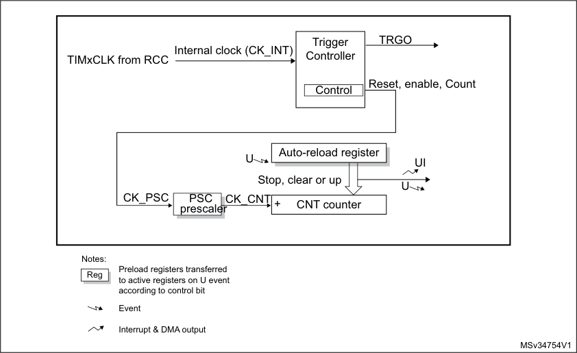

494/905 RM0377 Rev 10

--- end of page=493 ---

**RM0377** **Basic timers (TIM6/7)**

###### **18.3 TIM6/7 functional description**

**18.3.1** **Time-base unit**

The main block of the programmable timer is a 16-bit upcounter with its related auto-reload
register. The counter clock can be divided by a prescaler.

The counter, the auto-reload register and the prescaler register can be written or read by
software. This is true even when the counter is running.

The time-base unit includes:

      - Counter Register (TIMx_CNT)

      - Prescaler Register (TIMx_PSC)

      - Auto-Reload Register (TIMx_ARR)

The auto-reload register is preloaded. The preload register is accessed each time an
attempt is made to write or read the auto-reload register. The contents of the preload
register are transferred into the shadow register permanently or at each update event UEV,
depending on the auto-reload preload enable bit (ARPE) in the TIMx_CR1 register. The
update event is sent when the counter reaches the overflow value and if the UDIS bit equals
0 in the TIMx_CR1 register. It can also be generated by software. The generation of the
update event is described in detail for each configuration.

The counter is clocked by the prescaler output CK_CNT, which is enabled only when the
counter enable bit (CEN) in the TIMx_CR1 register is set.

Note that the actual counter enable signal CNT_EN is set 1 clock cycle after CEN.

**Prescaler description**

The prescaler can divide the counter clock frequency by any factor between 1 and 65536. It
is based on a 16-bit counter controlled through a 16-bit register (in the TIMx_PSC register).
It can be changed on the fly as the TIMx_PSC control register is buffered. The new
prescaler ratio is taken into account at the next update event.

_Figure 162_ and _Figure 163_ give some examples of the counter behavior when the prescaler
ratio is changed on the fly.

RM0377 Rev 10 495/905

506

--- end of page=494 ---

**Basic timers (TIM6/7)** **RM0377**

**Figure 162. Counter timing diagram with prescaler division change from 1 to 2**

|Col1|Col2|Col3|Col4|Col5|Col6|Col7|Col8|Col9|Col10|Col11|Col12|Col13|Col14|Col15|
|---|---|---|---|---|---|---|---|---|---|---|---|---|---|---|
|F8|F9|FA|FB|FC|00|00|01|01|01|02|02|02|03|03|
|F8|F9|FA|FB|FC|||||||||||
|F8|||||||||||||||
|F8|||||||||||||||
|F8|||||||||||||||
|F8|||||||||||||||
|F8|||||0|1|0|1|0|0|1|0|0|1|

**Figure 163. Counter timing diagram with prescaler division change from 1 to 4**

|Col1|Col2|Col3|Col4|Col5|Col6|Col7|Col8|Col9|Col10|Col11|Col12|Col13|Col14|
|---|---|---|---|---|---|---|---|---|---|---|---|---|---|
|F8|F8|F9|FA|FB|FC|00|00|00|00|01|01|01|01|
|F8|F8|F9|FA|FB|FC|||||||||
|F8||||||||||||||
|F8||||||||||||||
|F8||||||||||||||
|F8||||||||||||||
|F8||||||0|1|2|3|0|1|2|3|

496/905 RM0377 Rev 10

--- end of page=495 ---

**RM0377** **Basic timers (TIM6/7)**

**18.3.2** **Counting mode**

The counter counts from 0 to the auto-reload value (contents of the TIMx_ARR register),
then restarts from 0 and generates a counter overflow event.

An update event can be generate at each counter overflow or by setting the UG bit in the
TIMx_EGR register (by software or by using the slave mode controller).

The UEV event can be disabled by software by setting the UDIS bit in the TIMx_CR1
register. This avoids updating the shadow registers while writing new values into the preload
registers. In this way, no update event occurs until the UDIS bit has been written to 0,
however, the counter and the prescaler counter both restart from 0 (but the prescale rate
does not change). In addition, if the URS (update request selection) bit in the TIMx_CR1
register is set, setting the UG bit generates an update event UEV, but the UIF flag is not set
(so no interrupt or DMA request is sent).

When an update event occurs, all the registers are updated and the update flag (UIF bit in
the TIMx_SR register) is set (depending on the URS bit):

      - The buffer of the prescaler is reloaded with the preload value (contents of the
TIMx_PSC register)

      - The auto-reload shadow register is updated with the preload value (TIMx_ARR)

The following figures show some examples of the counter behavior for different clock
frequencies when TIMx_ARR = 0x36.

**Figure 164. Counter timing diagram, internal clock divided by 1**

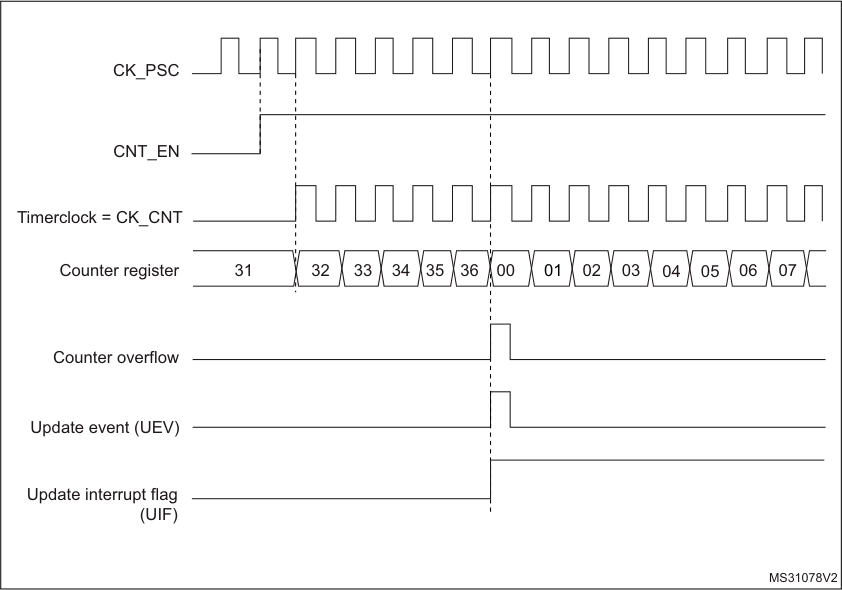

|Col1|Col2|Col3|Col4|Col5|Col6|Col7|Col8|Col9|Col10|Col11|Col12|Col13|
|---|---|---|---|---|---|---|---|---|---|---|---|---|
|32|33|34|35|36|00|01|02|03|04|05|06|07|

RM0377 Rev 10 497/905

506

--- end of page=496 ---

**Basic timers (TIM6/7)** **RM0377**

**Figure 165. Counter timing diagram, internal clock divided by 2**

**Figure 166. Counter timing diagram, internal clock divided by 4**

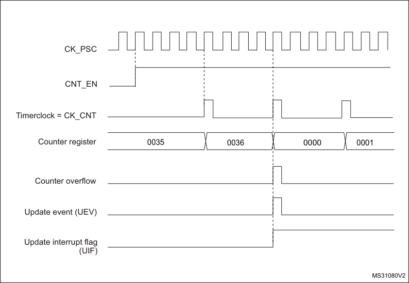

498/905 RM0377 Rev 10

--- end of page=497 ---

**RM0377** **Basic timers (TIM6/7)**

**Figure 167. Counter timing diagram, internal clock divided by N**

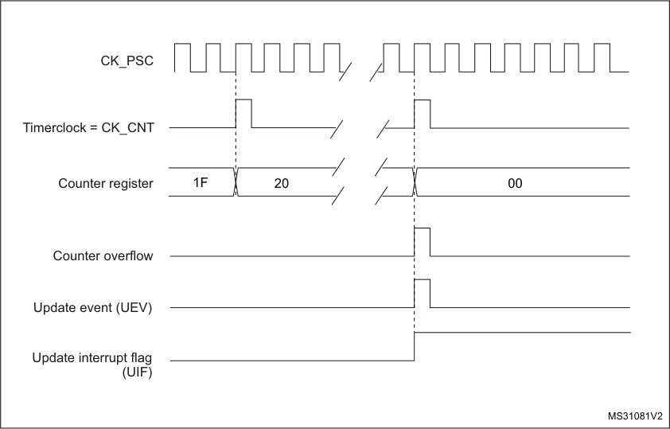

**Figure 168. Counter timing diagram, update event when ARPE = 0 (TIMx_ARR not**
**preloaded)**

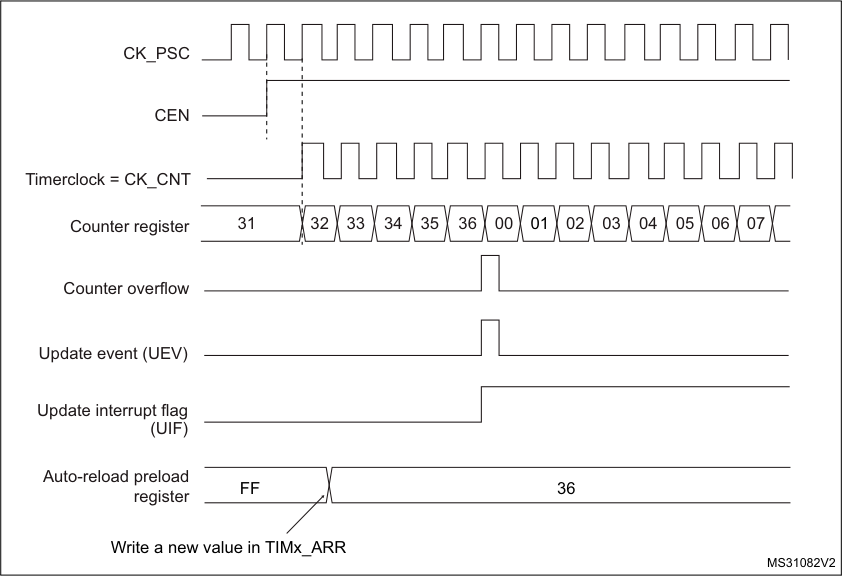

RM0377 Rev 10 499/905

506

--- end of page=498 ---

**Basic timers (TIM6/7)** **RM0377**

**Figure 169. Counter timing diagram, update event when ARPE=1 (TIMx_ARR**
**preloaded)**

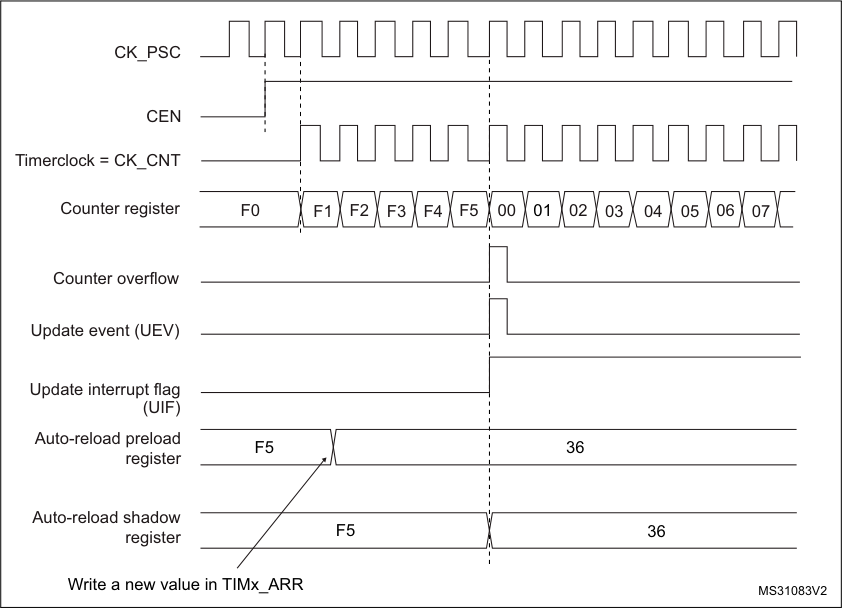

|Col1|Col2|Col3|Col4|Col5|Col6|Col7|Col8|
|---|---|---|---|---|---|---|---|
|F1|F2|F3|F4|F5|00|01|02|

**18.3.3** **Clock source**

The counter clock is provided by the Internal clock (CK_INT) source.

The CEN (in the TIMx_CR1 register) and UG bits (in the TIMx_EGR register) are actual
control bits and can be changed only by software (except for UG that remains cleared
automatically). As soon as the CEN bit is written to 1, the prescaler is clocked by the internal
clock CK_INT.

_Figure 170_ shows the behavior of the control circuit and the upcounter in normal mode,
without prescaler.

500/905 RM0377 Rev 10

--- end of page=499 ---

