# RM0377 STM32L0x1 — Pages 501–550

**RM0377** **Basic timers (TIM6/7)**

**Figure 170. Control circuit in normal mode, internal clock divided by 1**

**18.3.4** **Debug mode**

|Col1|Col2|Col3|Col4|Col5|Col6|Col7|Col8|Col9|Col10|Col11|Col12|Col13|Col14|
|---|---|---|---|---|---|---|---|---|---|---|---|---|---|
|||||||||||||||
|||||||||||||||
|||||||||||||||
|31|3 2|33|34|35|36|00|01|02|03|04|05|06|07|

When the microcontroller enters the debug mode (Cortex [®] -M0+ core - halted), the TIMx
counter either continues to work normally or stops, depending on the DBG_TIMx_STOP
configuration bit in the DBG module. For more details, refer to _Section 27.9.2: Debug_
_support for timers, watchdog and I_ _[2]_ _C_ .

RM0377 Rev 10 501/905

506

--- end of page=500 ---

**Basic timers (TIM6/7)** **RM0377**

###### **18.4 TIM6/7 registers**

Refer to _Section 1.2: List of abbreviations for registers_ for a list of abbreviations used in
register descriptions.

The peripheral registers have to be written by half-words (16 bits) or words (32 bits). Read
accesses can be done by bytes (8 bits), half-words (16 bits) or words (32 bits).

**18.4.1** **TIM6/7 control register 1 (TIMx_CR1)**

Address offset: 0x00

Reset value: 0x0000

|15|14|13|12|11|10|9|8|7|6|5|4|3|2|1|0|
|---|---|---|---|---|---|---|---|---|---|---|---|---|---|---|---|
|Res.|Res.|Res.|Res.|Res.|Res.|Res.|Res.|ARPE|Res.|Res.|Res.|OPM|URS|UDIS|CEN|
|||||||||rw||||rw|rw|rw|rw|

Bits 15:8 Reserved, must be kept at reset value.

Bit 7 **ARPE** : Auto-reload preload enable

0: TIMx_ARR register is not buffered.
1: TIMx_ARR register is buffered.

Bits 6:4 Reserved, must be kept at reset value.

Bit 3 **OPM** : One-pulse mode

0: Counter is not stopped at update event
1: Counter stops counting at the next update event (clearing the CEN bit).

Bit 2 **URS** : Update request source

This bit is set and cleared by software to select the UEV event sources.
0: Any of the following events generates an update interrupt or DMA request if enabled.
These events can be:

– Counter overflow/underflow

–
Setting the UG bit

–
Update generation through the slave mode controller
1: Only counter overflow/underflow generates an update interrupt or DMA request if
enabled.

Bit 1 **UDIS** : Update disable

This bit is set and cleared by software to enable/disable UEV event generation.
0: UEV enabled. The Update (UEV) event is generated by one of the following events:

– Counter overflow/underflow

–
Setting the UG bit

–
Update generation through the slave mode controller
Buffered registers are then loaded with their preload values.
1: UEV disabled. The Update event is not generated, shadow registers keep their value
(ARR, PSC). However the counter and the prescaler are reinitialized if the UG bit is set or if
a hardware reset is received from the slave mode controller.

Bit 0 **CEN** : Counter enable

0: Counter disabled

1: Counter enabled

_Note: Gated mode can work only if the CEN bit has been previously set by software._
_However trigger mode can set the CEN bit automatically by hardware._

CEN is cleared automatically in one-pulse mode, when an update event occurs.

502/905 RM0377 Rev 10

--- end of page=501 ---

**RM0377** **Basic timers (TIM6/7)**

**18.4.2** **TIM6/7 control register 2 (TIMx_CR2)**

Address offset: 0x04

Reset value: 0x0000

|15|14|13|12|11|10|9|8|7|6 5 4|Col11|Col12|3|2|1|0|
|---|---|---|---|---|---|---|---|---|---|---|---|---|---|---|---|
|Res.|Res.|Res.|Res.|Res.|Res.|Res.|Res.|Res.|MMS[2:0]|MMS[2:0]|MMS[2:0]|Res.|Res.|Res.|Res.|
||||||||||rw|rw|rw|||||

Bits 15:7 Reserved, must be kept at reset value.

Bits 6:4 **MMS** : Master mode selection

These bits are used to select the information to be sent in master mode to slave timers for

synchronization (TRGO). The combination is as follows:
000: **Reset**             - the UG bit from the TIMx_EGR register is used as a trigger output (TRGO). If
reset is generated by the trigger input (slave mode controller configured in reset mode) then
the signal on TRGO is delayed compared to the actual reset.
001: **Enable**             - the Counter enable signal, CNT_EN, is used as a trigger output (TRGO). It is
useful to start several timers at the same time or to control a window in which a slave timer

is enabled. The Counter Enable signal is generated by a logic OR between CEN control bit
and the trigger input when configured in gated mode.
When the Counter Enable signal is controlled by the trigger input, there is a delay on TRGO,
except if the master/slave mode is selected (see the MSM bit description in the TIMx_SMCR
register).
010: **Update**             - The update event is selected as a trigger output (TRGO). For instance a
master timer can then be used as a prescaler for a slave timer.

Bits 3:0 Reserved, must be kept at reset value.

**18.4.3** **TIM6/7 DMA/Interrupt enable register (TIMx_DIER)**

Address offset: 0x0C

Reset value: 0x0000

|15|14|13|12|11|10|9|8|7|6|5|4|3|2|1|0|
|---|---|---|---|---|---|---|---|---|---|---|---|---|---|---|---|
|Res.|Res.|Res.|Res.|Res.|Res.|Res.|UDE|Res.|Res.|Res.|Res.|Res.|Res.|Res.|UIE|
||||||||rw||||||||rw|

Bits 15:9 Reserved, must be kept at reset value.

Bit 8 **UDE** : Update DMA request enable

0: Update DMA request disabled.
1: Update DMA request enabled.

Bits 7:1 Reserved, must be kept at reset value.

Bit 0 **UIE** : Update interrupt enable

0: Update interrupt disabled.
1: Update interrupt enabled.

RM0377 Rev 10 503/905

506

--- end of page=502 ---

**Basic timers (TIM6/7)** **RM0377**

**18.4.4** **TIM6/7 status register (TIMx_SR)**

Address offset: 0x10

Reset value: 0x0000

|15|14|13|12|11|10|9|8|7|6|5|4|3|2|1|0|
|---|---|---|---|---|---|---|---|---|---|---|---|---|---|---|---|
|Res.|Res.|Res.|Res.|Res.|Res.|Res.|Res.|Res.|Res.|Res.|Res.|Res.|Res.|Res.|UIF|
||||||||||||||||rc_w0|

Bits 15:1 Reserved, must be kept at reset value.

Bit 0 **UIF** : Update interrupt flag

This bit is set by hardware on an update event. It is cleared by software.
0: No update occurred.
1: Update interrupt pending. This bit is set by hardware when the registers are updated:

– At overflow or underflow regarding the repetition counter value and if UDIS = 0 in the
TIMx_CR1 register.

– When CNT is reinitialized by software using the UG bit in the TIMx_EGR register, if URS = 0
and UDIS = 0 in the TIMx_CR1 register.

**18.4.5** **TIM6/7 event generation register (TIMx_EGR)**

Address offset: 0x14

Reset value: 0x0000

|15|14|13|12|11|10|9|8|7|6|5|4|3|2|1|0|
|---|---|---|---|---|---|---|---|---|---|---|---|---|---|---|---|
|Res.|Res.|Res.|Res.|Res.|Res.|Res.|Res.|Res.|Res.|Res.|Res.|Res.|Res.|Res.|UG|
||||||||||||||||w|

Bits 15:1 Reserved, must be kept at reset value.

Bit 0 **UG** : Update generation

This bit can be set by software, it is automatically cleared by hardware.
0: No action.

1: Re-initializes the timer counter and generates an update of the registers. Note that the
prescaler counter is cleared too (but the prescaler ratio is not affected).

**18.4.6** **TIM6/7 counter (TIMx_CNT)**

Address offset: 0x24

Reset value: 0x0000

|15 14 13 12 11 10 9 8 7 6 5 4 3 2 1 0|Col2|Col3|Col4|Col5|Col6|Col7|Col8|Col9|Col10|Col11|Col12|Col13|Col14|Col15|Col16|
|---|---|---|---|---|---|---|---|---|---|---|---|---|---|---|---|
|CNT[15:0]|CNT[15:0]|CNT[15:0]|CNT[15:0]|CNT[15:0]|CNT[15:0]|CNT[15:0]|CNT[15:0]|CNT[15:0]|CNT[15:0]|CNT[15:0]|CNT[15:0]|CNT[15:0]|CNT[15:0]|CNT[15:0]|CNT[15:0]|
|rw|rw|rw|rw|rw|rw|rw|rw|rw|rw|rw|rw|rw|rw|rw|rw|

Bits 15:0 **CNT[15:0]** : Counter value

504/905 RM0377 Rev 10

--- end of page=503 ---

**RM0377** **Basic timers (TIM6/7)**

**18.4.7** **TIM6/7 prescaler (TIMx_PSC)**

Address offset: 0x28

Reset value: 0x0000

|15 14 13 12 11 10 9 8 7 6 5 4 3 2 1 0|Col2|Col3|Col4|Col5|Col6|Col7|Col8|Col9|Col10|Col11|Col12|Col13|Col14|Col15|Col16|
|---|---|---|---|---|---|---|---|---|---|---|---|---|---|---|---|
|PSC[15:0]|PSC[15:0]|PSC[15:0]|PSC[15:0]|PSC[15:0]|PSC[15:0]|PSC[15:0]|PSC[15:0]|PSC[15:0]|PSC[15:0]|PSC[15:0]|PSC[15:0]|PSC[15:0]|PSC[15:0]|PSC[15:0]|PSC[15:0]|
|rw|rw|rw|rw|rw|rw|rw|rw|rw|rw|rw|rw|rw|rw|rw|rw|

Bits 15:0 **PSC[15:0]** : Prescaler value
The counter clock frequency (CK_CNT) is equal to f CK_PSC / (PSC[15:0] + 1).
PSC contains the value to be loaded in the active prescaler register at each update event
(including when the counter is cleared through UG bit of TIMx_EGR register or through
trigger controller when configured in “reset mode”).

**18.4.8** **TIM6/7 auto-reload register (TIMx_ARR)**

Address offset: 0x2C

Reset value: 0xFFFF

|15 14 13 12 11 10 9 8 7 6 5 4 3 2 1 0|Col2|Col3|Col4|Col5|Col6|Col7|Col8|Col9|Col10|Col11|Col12|Col13|Col14|Col15|Col16|
|---|---|---|---|---|---|---|---|---|---|---|---|---|---|---|---|
|ARR[15:0]|ARR[15:0]|ARR[15:0]|ARR[15:0]|ARR[15:0]|ARR[15:0]|ARR[15:0]|ARR[15:0]|ARR[15:0]|ARR[15:0]|ARR[15:0]|ARR[15:0]|ARR[15:0]|ARR[15:0]|ARR[15:0]|ARR[15:0]|
|rw|rw|rw|rw|rw|rw|rw|rw|rw|rw|rw|rw|rw|rw|rw|rw|

Bits 15:0 **ARR[15:0]** : Auto-reload value

ARR is the value to be loaded into the actual auto-reload register.
Refer to _Section 18.3.1: Time-base unit on page 495_ for more details about ARR update and
behavior.

The counter is blocked while the auto-reload value is null.

RM0377 Rev 10 505/905

506

--- end of page=504 ---

**Basic timers (TIM6/7)** **RM0377**

**18.4.9** **TIM6/7 register map**

TIMx registers are mapped as 16-bit addressable registers as described in the table below:

**Table 84. TIM6/7 register map and reset values**

|Offset|Register|15|14|13|12|11|10|9|8|7|6|5|4|3|2|1|0|
|---|---|---|---|---|---|---|---|---|---|---|---|---|---|---|---|---|---|
|0x00|**TIMx_CR1** Reset value|Res.|Res.|Res.|Res.|Res.|Res.|Res.|Res.|ARPE|Res.|Res.|Res.|OPM|URS|UDIS|CEN|
|0x00|**TIMx_CR1** Reset value|||||||||0||||0|0|0|0|
|0x04|**TIMx_CR2** Reset value|Res.|Res.|Res.|Res.|Res.|Res.|Res.|Res.|Res.|MMS[2:0]|MMS[2:0]|MMS[2:0]|Res.|Res.|Res.|Res.|
|0x04|**TIMx_CR2** Reset value||||||||||0|0|0|||||
|0x08|Res.|Res.|Res.|Res.|Res.|Res.|Res.|Res.|Res.|Res.|Res.|Res.|Res.|Res.|Res.|Res.|Res.|
|0x0C|**TIMx_DIER** Reset value|Res.|Res.|Res.|Res.|Res.|Res.|Res.|UDE|Res.|Res.|Res.|Res.|Res.|Res.|Res.|UIE|
|0x0C|**TIMx_DIER** Reset value||||||||0||||||||0|
|0x10|**TIMx_SR** Reset value|Res.|Res.|Res.|Res.|Res.|Res.|Res.|Res.|Res.|Res.|Res.|Res.|Res.|Res.|Res.|UIF|
|0x10|**TIMx_SR** Reset value||||||||||||||||0|
|0x14|**TIMx_EGR** Reset value|Res.|Res.|Res.|Res.|Res.|Res.|Res.|Res.|Res.|Res.|Res.|Res.|Res.|Res.|Res.|UG|
|0x14|**TIMx_EGR** Reset value||||||||||||||||0|
|0x18|Res.|Res.|Res.|Res.|Res.|Res.|Res.|Res.|Res.|Res.|Res.|Res.|Res.|Res.|Res.|Res.|Res.|
|0x1C|Res.|Res.|Res.|Res.|Res.|Res.|Res.|Res.|Res.|Res.|Res.|Res.|Res.|Res.|Res.|Res.|Res.|
|0x20|Res.|Res.|Res.|Res.|Res.|Res.|Res.|Res.|Res.|Res.|Res.|Res.|Res.|Res.|Res.|Res.|Res.|
|0x24|**TIMx_CNT** Reset value|CNT[15:0]|CNT[15:0]|CNT[15:0]|CNT[15:0]|CNT[15:0]|CNT[15:0]|CNT[15:0]|CNT[15:0]|CNT[15:0]|CNT[15:0]|CNT[15:0]|CNT[15:0]|CNT[15:0]|CNT[15:0]|CNT[15:0]|CNT[15:0]|
|0x24|**TIMx_CNT** Reset value|0|0|0|0|0|0|0|0|0|0|0|0|0|0|0|0|
|0x28|**TIMx_PSC** Reset value|PSC[15:0]|PSC[15:0]|PSC[15:0]|PSC[15:0]|PSC[15:0]|PSC[15:0]|PSC[15:0]|PSC[15:0]|PSC[15:0]|PSC[15:0]|PSC[15:0]|PSC[15:0]|PSC[15:0]|PSC[15:0]|PSC[15:0]|PSC[15:0]|
|0x28|**TIMx_PSC** Reset value|0|0|0|0|0|0|0|0|0|0|0|0|0|0|0|0|
|0x2C|**TIMx_ARR** Reset value|ARR[15:0]|ARR[15:0]|ARR[15:0]|ARR[15:0]|ARR[15:0]|ARR[15:0]|ARR[15:0]|ARR[15:0]|ARR[15:0]|ARR[15:0]|ARR[15:0]|ARR[15:0]|ARR[15:0]|ARR[15:0]|ARR[15:0]|ARR[15:0]|
|0x2C|**TIMx_ARR** Reset value|1|1|1|1|1|1|1|1|1|1|1|1|1|1|1|1|

Refer to _Section 2.2 on page 51_ for the register boundary addresses.

506/905 RM0377 Rev 10

--- end of page=505 ---

**RM0377** **Low-power timer (LPTIM)**

#### **19 Low-power timer (LPTIM)**

###### **19.1 Introduction**

The LPTIM is a 16-bit timer that benefits from the ultimate developments in power
consumption reduction. Thanks to its diversity of clock sources, the LPTIM is able to keep
running in all power modes except for Standby mode. Given its capability to run even with
no internal clock source, the LPTIM can be used as a “Pulse Counter” which can be useful
in some applications. Also, the LPTIM capability to wake up the system from low-power
modes, makes it suitable to realize “Timeout functions” with extremely low power
consumption.

The LPTIM introduces a flexible clock scheme that provides the needed functionalities and
performance, while minimizing the power consumption.

###### **19.2 LPTIM main features**

      - 16 bit upcounter

      - 3-bit prescaler with 8 possible dividing factors (1,2,4,8,16,32,64,128)

      - Selectable clock

–
Internal clock sources: configurable internal clock source (see RCC section)

–
External clock source over LPTIM input (working with no embedded oscillator
running, used by Pulse Counter application)

      - 16 bit ARR autoreload register

      - 16 bit compare register

      - Continuous/One-shot mode

      - Selectable software/hardware input trigger

      - Programmable Digital Glitch filter

      - Configurable output: Pulse, PWM

      - Configurable I/O polarity

      - Encoder mode

RM0377 Rev 10 507/905

527

--- end of page=506 ---

**Low-power timer (LPTIM)** **RM0377**

###### **19.3 LPTIM implementation**

_Table 85_ describes LPTIM implementation on STM32L0x1 devices.

**Table 85. STM32L0x1 LPTIM features**

|LPTIM modes/features(1)|LPTIM1|
|---|---|
|Encoder mode|X|

1. X = supported.

###### **19.4 LPTIM functional description**

**19.4.1** **LPTIM block diagram**

**Figure 171. Low-power timer block diagram**

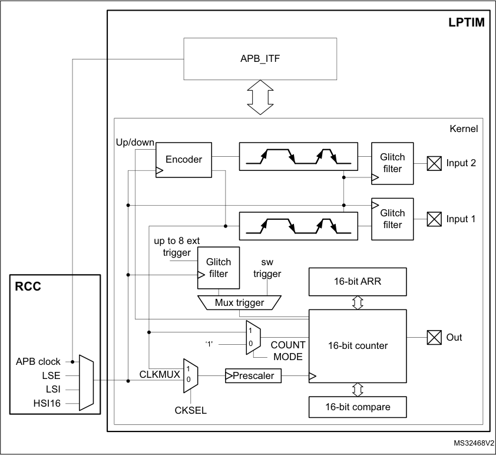

508/905 RM0377 Rev 10

--- end of page=507 ---

**RM0377** **Low-power timer (LPTIM)**

**19.4.2** **LPTIM trigger mapping**

The LPTIM external trigger connections are detailed hereafter:

**Table 86. LPTIM1 external trigger connection**

|TRIGSEL|External trigger|
|---|---|
|lptim_ext_trig0|GPIO (alternate function LPTIM_ETR)|
|lptim_ext_trig1|RTC alarm A|
|lptim_ext_trig2|RTC alarm B|
|lptim_ext_trig3|RTC_TAMP1 input detection|
|lptim_ext_trig4|RTC_TAMP2 input detection|
|lptim_ext_trig5|RTC_TAMP3 input detection|
|lptim_ext_trig6|COMP1_OUT|
|lptim_ext_trig7|COMP2_OUT|

**19.4.3** **LPTIM reset and clocks**

The LPTIM can be clocked using several clock sources. It can be clocked using an internal
clock signal which can be any configurable internal clock source selectable through the
RCC (see RCC section for more details). Also, the LPTIM can be clocked using an external
clock signal injected on its external Input1. When clocked with an external clock source, the
LPTIM may run in one of these two possible configurations:

      - The first configuration is when the LPTIM is clocked by an external signal but in the
same time an internal clock signal is provided to the LPTIM from configurable internal
clock source (see RCC section).

      - The second configuration is when the LPTIM is solely clocked by an external clock
source through its external Input1. This configuration is the one used to realize Timeout
function or Pulse counter function when all the embedded oscillators are turned off
after entering a low-power mode.

Programming the CKSEL and COUNTMODE bits allows controlling whether the LPTIM will
use an external clock source or an internal one.

When configured to use an external clock source, the CKPOL bits are used to select the
external clock signal active edge. If both edges are configured to be active ones, an internal
clock signal should also be provided (first configuration). In this case, the internal clock
signal frequency should be at least four times higher than the external clock signal
frequency.

**19.4.4** **Glitch filter**

The LPTIM inputs, either external (mapped to GPIOs) or internal (mapped on the chip-level
to other embedded peripherals), are protected with digital filters that prevent any glitches
and noise perturbations to propagate inside the LPTIM. This is in order to prevent spurious
counts or triggers.

Before activating the digital filters, an internal clock source should first be provided to the
LPTIM. This is necessary to guarantee the proper operation of the filters.

RM0377 Rev 10 509/905

527

--- end of page=508 ---

**Low-power timer (LPTIM)** **RM0377**

The digital filters are divided into two groups:

      - The first group of digital filters protects the LPTIM external inputs. The digital filters
sensitivity is controlled by the CKFLT bits

      - The second group of digital filters protects the LPTIM internal trigger inputs. The digital
filters sensitivity is controlled by the TRGFLT bits.

_Note:_ _The digital filters sensitivity is controlled by groups. It is not possible to configure each digital_
_filter sensitivity separately inside the same group._

The filter sensitivity acts on the number of consecutive equal samples that should be
detected on one of the LPTIM inputs to consider a signal level change as a valid transition.
_Figure 172_ shows an example of glitch filter behavior in case of a 2 consecutive samples
programmed.

**Figure 172. Glitch filter timing diagram**

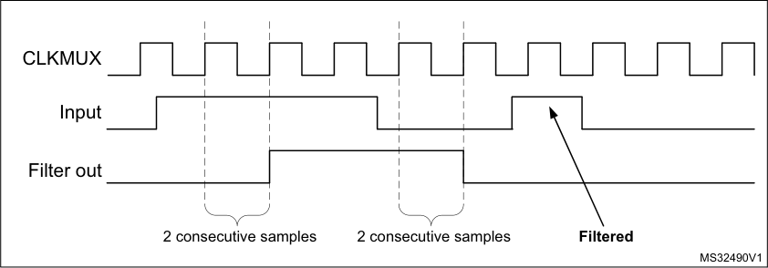

_Note:_ _In case no internal clock signal is provided, the digital filter must be deactivated by setting_
_the CKFLT and TRGFLT bits to ‘0’. In that case, an external analog filter may be used to_
_protect the LPTIM external inputs against glitches._

**19.4.5** **Prescaler**

The LPTIM 16-bit counter is preceded by a configurable power-of-2 prescaler. The prescaler
division ratio is controlled by the PRESC[2:0] 3-bit field. The table below lists all the possible
division ratios:

**Table 87. Prescaler division ratios**

|programming|dividing factor|
|---|---|
|000|/1|
|001|/2|
|010|/4|
|011|/8|
|100|/16|
|101|/32|
|110|/64|
|111|/128|

510/905 RM0377 Rev 10

--- end of page=509 ---

**RM0377** **Low-power timer (LPTIM)**

**19.4.6** **Trigger multiplexer**

The LPTIM counter may be started either by software or after the detection of an active
edge on one of the 8 trigger inputs.

TRIGEN[1:0] is used to determine the LPTIM trigger source:

      - When TRIGEN[1:0] equals ‘00’, The LPTIM counter is started as soon as one of the
CNTSTRT or the SNGSTRT bits is set by software. The three remaining possible
values for the TRIGEN[1:0] are used to configure the active edge used by the trigger
inputs. The LPTIM counter starts as soon as an active edge is detected.

      - When TRIGEN[1:0] is different than ‘00’, TRIGSEL[2:0] is used to select which of the 8
trigger inputs is used to start the counter.

The external triggers are considered asynchronous signals for the LPTIM. So after a trigger
detection, a two-counter-clock period latency is needed before the timer starts running due
to the synchronization.

If a new trigger event occurs when the timer is already started it will be ignored (unless
timeout function is enabled).

_Note:_ _The timer must be enabled before setting the SNGSTRT/CNTSTRT bits. Any write on these_
_bits when the timer is disabled will be discarded by hardware._

_Note:_ _When starting the counter by software (TRIGEN[1:0] = 00), there is a delay of 3 kernel clock_
_cycles between the LPTIM_CR register update (set one of SNGSTRT or CNTSTRT bits)_
_and the effective start of the counter._

**19.4.7** **Operating mode**

The LPTIM features two operating modes:

      - The Continuous mode: the timer is free running, the timer is started from a trigger event
and never stops until the timer is disabled

      - One-shot mode: the timer is started from a trigger event and stops when reaching the
ARR value.

**One-shot mode**

To enable the one-shot counting, the SNGSTRT bit must be set.

A new trigger event will re-start the timer. Any trigger event occurring after the counter starts
and before the counter reaches ARR will be discarded.

In case an external trigger is selected, each external trigger event arriving after the
SNGSTRT bit is set, and after the counter register has stopped (contains zero value), will
start the counter for a new one-shot counting cycle as shown in _Figure 173_ .

RM0377 Rev 10 511/905

527

--- end of page=510 ---

**Low-power timer (LPTIM)** **RM0377**

**Figure 173. LPTIM output waveform, single counting mode configuration**

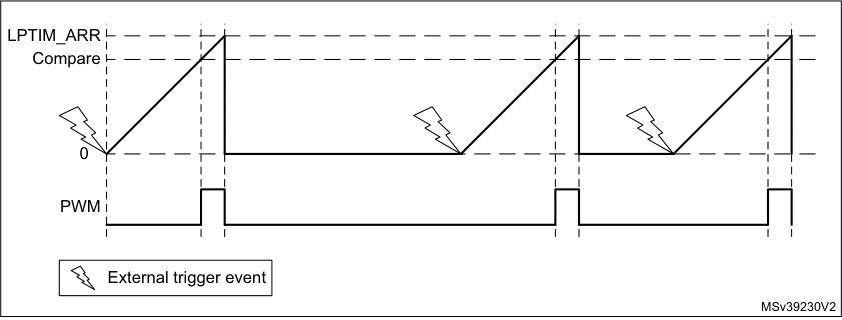

- Set-once mode activated:

It should be noted that when the WAVE bit-field in the LPTIM_CFGR register is set, the Setonce mode is activated. In this case, the counter is only started once following the first
trigger, and any subsequent trigger event is discarded as shown in _Figure 174_ .

**Figure 174. LPTIM output waveform, Single counting mode configuration**
**and Set-once mode activated (WAVE bit is set)**

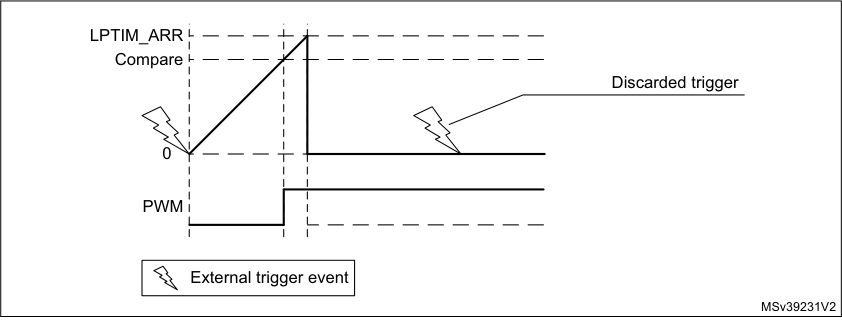

In case of software start (TRIGEN[1:0] = ‘00’), the SNGSTRT setting will start the counter for
one-shot counting.

**Continous mode**

To enable the continuous counting, the CNTSTRT bit must be set.

In case an external trigger is selected, an external trigger event arriving after CNTSTRT is
set will start the counter for continuous counting. Any subsequent external trigger event will
be discarded as shown in _Figure 175_ .

In case of software start (TRIGEN[1:0] = ‘00’), setting CNTSTRT will start the counter for
continuous counting.

512/905 RM0377 Rev 10

--- end of page=511 ---

**RM0377** **Low-power timer (LPTIM)**

**Figure 175. LPTIM output waveform, Continuous counting mode configuration**

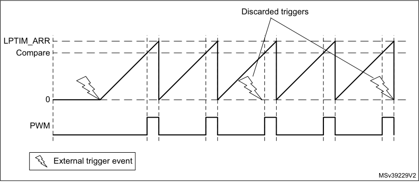

SNGSTRT and CNTSTRT bits can only be set when the timer is enabled (The ENABLE bit
is set to ‘1’). It is possible to change “on the fly” from One-shot mode to Continuous mode.

If the Continuous mode was previously selected, setting SNGSTRT will switch the LPTIM to
the One-shot mode. The counter (if active) will stop as soon as it reaches ARR.

If the One-shot mode was previously selected, setting CNTSTRT will switch the LPTIM to
the Continuous mode. The counter (if active) will restart as soon as it reaches ARR.

**19.4.8** **Timeout function**

The detection of an active edge on one selected trigger input can be used to reset the
LPTIM counter. This feature is controlled through the TIMOUT bit.

The first trigger event will start the timer, any successive trigger event will reset the counter
and the timer will restart.

A low-power timeout function can be realized. The timeout value corresponds to the
compare value; if no trigger occurs within the expected time frame, the MCU is waked-up by
the compare match event.

**19.4.9** **Waveform generation**

Two 16-bit registers, the LPTIM_ARR (autoreload register) and LPTIM_CMP (compare
register), are used to generate several different waveforms on LPTIM output

The timer can generate the following waveforms:

      - The PWM mode: the LPTIM output is set as soon as the counter value in LPTIM_CNT
exceeds the compare value in LPTIM_CMP. The LPTIM output is reset as soon as a
match occurs between the LPTIM_ARR and the LPTIM_CNT registers.

      - The One-pulse mode: the output waveform is similar to the one of the PWM mode for
the first pulse, then the output is permanently reset

      - The Set-once mode: the output waveform is similar to the One-pulse mode except that
the output is kept to the last signal level (depends on the output configured polarity).

The above described modes require that the LPTIM_ARR register value be strictly greater
than the LPTIM_CMP register value.

RM0377 Rev 10 513/905

527

--- end of page=512 ---

**Low-power timer (LPTIM)** **RM0377**

The LPTIM output waveform can be configured through the WAVE bit as follow:

      - Resetting the WAVE bit to ‘0’ forces the LPTIM to generate either a PWM waveform or
a One pulse waveform depending on which bit is set: CNTSTRT or SNGSTRT.

      - Setting the WAVE bit to ‘1’ forces the LPTIM to generate a Set-once mode waveform.

The WAVPOL bit controls the LPTIM output polarity. The change takes effect immediately,
so the output default value will change immediately after the polarity is re-configured, even
before the timer is enabled.

Signals with frequencies up to the LPTIM clock frequency divided by 2 can be generated.
_Figure 176_ below shows the three possible waveforms that can be generated on the LPTIM
output. Also, it shows the effect of the polarity change using the WAVPOL bit.

**Figure 176. Waveform generation**

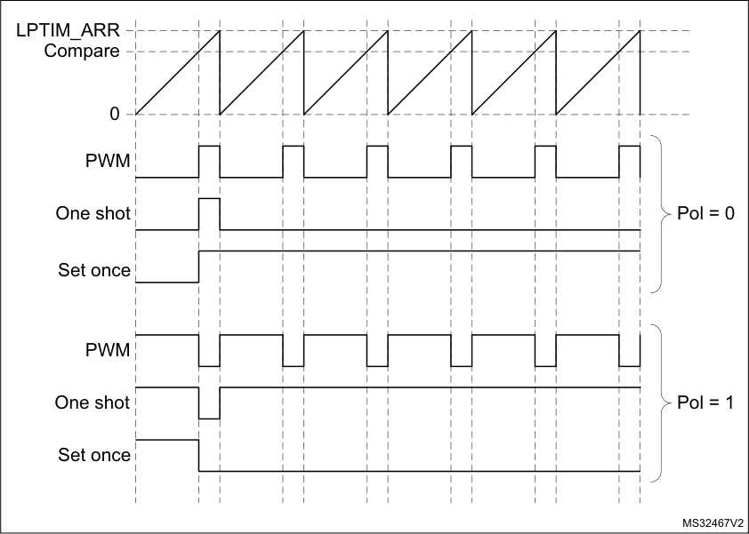

**19.4.10** **Register update**

The LPTIM_ARR register and LPTIM_CMP register are updated immediately after the APB
bus write operation, or at the end of the current period if the timer is already started.

The PRELOAD bit controls how the LPTIM_ARR and the LPTIM_CMP registers are
updated:

      - When the PRELOAD bit is reset to ‘0’, the LPTIM_ARR and the LPTIM_CMP registers
are immediately updated after any write access.

      - When the PRELOAD bit is set to ‘1’, the LPTIM_ARR and the LPTIM_CMP registers
are updated at the end of the current period, if the timer has been already started.

The LPTIM APB interface and the LPTIM kernel logic use different clocks, so there is some
latency between the APB write and the moment when these values are available to the

514/905 RM0377 Rev 10

--- end of page=513 ---

**RM0377** **Low-power timer (LPTIM)**

counter comparator. Within this latency period, any additional write into these registers must
be avoided.

The ARROK flag and the CMPOK flag in the LPTIM_ISR register indicate when the write
operation is completed to respectively the LPTIM_ARR register and the LPTIM_CMP
register.

After a write to the LPTIM_ARR register or the LPTIM_CMP register, a new write operation
to the same register can only be performed when the previous write operation is completed.
Any successive write before respectively the ARROK flag or the CMPOK flag be set, will
lead to unpredictable results.

**19.4.11** **Counter mode**

The LPTIM counter can be used to count external events on the LPTIM Input1 or it can be
used to count internal clock cycles. The CKSEL and COUNTMODE bits control which
source will be used for updating the counter.

In case the LPTIM is configured to count external events on Input1, the counter can be
updated following a rising edge, falling edge or both edges depending on the value written
to the CKPOL[1:0] bits.

The count modes below can be selected, depending on CKSEL and COUNTMODE values:

      - CKSEL = 0: the LPTIM is clocked by an internal clock source

– COUNTMODE = 0

The LPTIM is configured to be clocked by an internal clock source and the LPTIM
counter is configured to be updated following each internal clock pulse.

– COUNTMODE = 1

The LPTIM external Input1 is sampled with the internal clock provided to the
LPTIM.

Consequently, in order not to miss any event, the frequency of the changes on the
external Input1 signal should never exceed the frequency of the internal clock
provided to the LPTIM. Also, the internal clock provided to the LPTIM must not be
prescaled (PRESC[2:0] = 000).

      - CKSEL = 1: the LPTIM is clocked by an external clock source

COUNTMODE value is don’t care.

In this configuration, the LPTIM has no need for an internal clock source (except if the
glitch filters are enabled). The signal injected on the LPTIM external Input1 is used as
system clock for the LPTIM. This configuration is suitable for operation modes where
no embedded oscillator is enabled.

For this configuration, the LPTIM counter can be updated either on rising edges or
falling edges of the input1 clock signal but not on both rising and falling edges.

Since the signal injected on the LPTIM external Input1 is also used to clock the LPTIM
kernel logic, there is some initial latency (after the LPTIM is enabled) before the counter
is incremented. More precisely, the first five active edges on the LPTIM external Input1
(after LPTIM is enable) are lost.

For code example, refer to _A.10.1: Pulse counter configuration code example_ .

RM0377 Rev 10 515/905

527

--- end of page=514 ---

**Low-power timer (LPTIM)** **RM0377**

**19.4.12** **Timer enable**

The ENABLE bit located in the LPTIM_CR register is used to enable/disable the LPTIM
kernel logic. After setting the ENABLE bit, a delay of two counter clock is needed before the
LPTIM is actually enabled.

The LPTIM_CFGR and LPTIM_IER registers must be modified only when the LPTIM is
disabled.

**19.4.13** **Encoder mode**

This mode allows handling signals from quadrature encoders used to detect angular
position of rotary elements. Encoder interface mode acts simply as an external clock with
direction selection. This means that the counter just counts continuously between 0 and the
auto-reload value programmed into the LPTIM_ARR register (0 up to ARR or ARR down to
0 depending on the direction). Therefore LPTIM_ARR must be configured before starting
the counter. From the two external input signals, Input1 and Input2, a clock signal is
generated to clock the LPTIM counter. The phase between those two signals determines
the counting direction.

The Encoder mode is only available when the LPTIM is clocked by an internal clock source.
The signals frequency on both Input1 and Input2 inputs must not exceed the LPTIM internal
clock frequency divided by 4. This is mandatory in order to guarantee a proper operation of
the LPTIM.

Direction change is signalized by the two Down and Up flags in the LPTIM_ISR register.
Also, an interrupt can be generated for both direction change events if enabled through the
DOWNIE bit.

To activate the Encoder mode the ENC bit has to be set to ‘1’. The LPTIM must first be
configured in Continuous mode.

When Encoder mode is active, the LPTIM counter is modified automatically following the
speed and the direction of the incremental encoder. Therefore, its content always
represents the encoder’s position. The count direction, signaled by the Up and Down flags,
correspond to the rotation direction of the encoder rotor.

According to the edge sensitivity configured using the CKPOL[1:0] bits, different counting
scenarios are possible. The following table summarizes the possible combinations,
assuming that Input1 and Input2 do not switch at the same time.

**Table 88. Encoder counting scenarios**

|Active edge|Level on opposite signal (Input1 for Input2, Input2 for Input1)|Input1 signal|Col4|Input2 signal|Col6|
|---|---|---|---|---|---|
|**Active edge**|**Level on opposite** **signal (Input1 for** **Input2, Input2 for** **Input1)**|**Rising**|**Falling**|**Rising**|**Falling**|
|Rising Edge|High|Down|No count|Up|No count|
|Rising Edge|Low|Up|No count|Down|No count|
|Falling Edge|High|No count|Up|No count|Down|
|Falling Edge|Low|No count|Down|No count|Up|
|Both Edges|High|Down|Up|Up|Down|
|Both Edges|Low|Up|Down|Down|Up|

516/905 RM0377 Rev 10

--- end of page=515 ---

**RM0377** **Low-power timer (LPTIM)**

The following figure shows a counting sequence for Encoder mode where both-edge
sensitivity is configured.

**Caution:** In this mode the LPTIM must be clocked by an internal clock source, so the CKSEL bit must
be maintained to its reset value which is equal to ‘0’. Also, the prescaler division ratio must
be equal to its reset value which is 1 (PRESC[2:0] bits must be ‘000’).

**Figure 177. Encoder mode counting sequence**

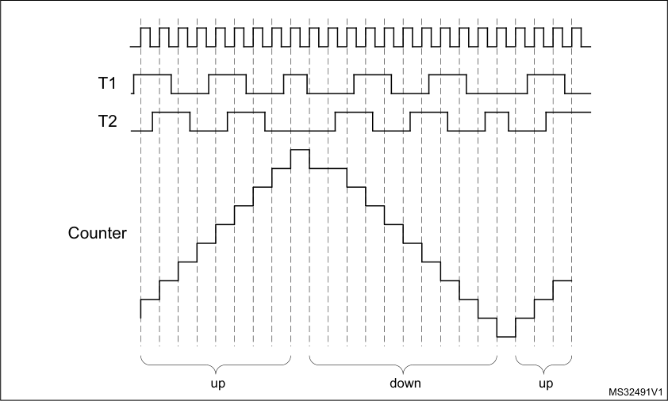

**19.4.14** **Debug mode**

When the microcontroller enters debug mode (core halted), the LPTIM counter either
continues to work normally or stops, depending on the DBG_LPTIM_STOP configuration bit
in the DBG module.

###### **19.5 LPTIM low-power modes**

**Table 89. Effect of low-power modes on the LPTIM**

|Mode|Description|
|---|---|
|Sleep|No effect. LPTIM interrupts cause the device to exit Sleep mode.|
|Stop|The LPTIM peripheral is active when it is clocked by LSE or LSI. LPTIM interrupts cause the device to exit Stop mode|
|Standby|The LPTIM peripheral is powered down and must be reinitialized after exiting Standby mode.|

RM0377 Rev 10 517/905

527

--- end of page=516 ---

**Low-power timer (LPTIM)** **RM0377**

###### **19.6 LPTIM interrupts**

The following events generate an interrupt/wake-up event, if they are enabled through the
LPTIM_IER register:

      - Compare match

      - Auto-reload match (whatever the direction if encoder mode)

      - External trigger event

      - Autoreload register write completed

      - Compare register write completed

      - Direction change (encoder mode), programmable (up / down / both).

_Note:_ _If any bit in the LPTIM_IER register (Interrupt Enable Register) is set after that its_
_corresponding flag in the LPTIM_ISR register (Status Register) is set, the interrupt is not_
_asserted._

**Table 90. Interrupt events**

|Interrupt event|Description|
|---|---|
|Compare match|Interrupt flag is raised when the content of the Counter register (LPTIM_CNT) matches the content of the compare register (LPTIM_CMP).|
|Auto-reload match|Interrupt flag is raised when the content of the Counter register (LPTIM_CNT) matches the content of the Auto-reload register (LPTIM_ARR).|
|External trigger event|Interrupt flag is raised when an external trigger event is detected|
|Auto-reload register update OK|Interrupt flag is raised when the write operation to the LPTIM_ARR register is complete.|
|Compare register update OK|Interrupt flag is raised when the write operation to the LPTIM_CMP register is complete.|
|Direction change|Used in Encoder mode. Two interrupt flags are embedded to signal direction change: – UP flag signals up-counting direction change – DOWN flag signals down-counting direction change.|

###### **19.7 LPTIM registers**

The peripheral registers can only be accessed by words (32-bit).

518/905 RM0377 Rev 10

--- end of page=517 ---

**RM0377** **Low-power timer (LPTIM)**

**19.7.1** **LPTIM interrupt and status register (LPTIM_ISR)**

Address offset: 0x000

Reset value: 0x0000 0000

|31|30|29|28|27|26|25|24|23|22|21|20|19|18|17|16|
|---|---|---|---|---|---|---|---|---|---|---|---|---|---|---|---|
|Res.|Res.|Res.|Res.|Res.|Res.|Res.|Res.|Res.|Res.|Res.|Res.|Res.|Res.|Res.|Res.|
|||||||||||||||||

|15|14|13|12|11|10|9|8|7|6|5|4|3|2|1|0|
|---|---|---|---|---|---|---|---|---|---|---|---|---|---|---|---|
|Res.|Res.|Res.|Res.|Res.|Res.|Res.|Res.|Res.|DOWN|UP|ARR OK|CMP OK|EXT TRIG|ARRM|CMPM|
||||||||||r|r|r|r|r|r|r|

Bits 31:7 Reserved, must be kept at reset value.

Bit 6 **DOWN** : Counter direction change up to down

In Encoder mode, DOWN bit is set by hardware to inform application that the counter direction has
changed from up to down. DOWN flag can be cleared by writing 1 to the DOWNCF bit in the
LPTIM_ICR register.

_Note: If the LPTIM does not support encoder mode feature, this bit is reserved. Please refer to_

_Section 19.3: LPTIM implementation._

Bit 5 **UP** : Counter direction change down to up

In Encoder mode, UP bit is set by hardware to inform application that the counter direction has
changed from down to up. UP flag can be cleared by writing 1 to the UPCF bit in the LPTIM_ICR
register.

_Note: If the LPTIM does not support encoder mode feature, this bit is reserved. Please refer to_

_Section 19.3: LPTIM implementation._

Bit 4 **ARROK** : Autoreload register update OK

ARROK is set by hardware to inform application that the APB bus write operation to the LPTIM_ARR
register has been successfully completed. ARROK flag can be cleared by writing 1 to the ARROKCF
bit in the LPTIM_ICR register.

Bit 3 **CMPOK** : Compare register update OK

CMPOK is set by hardware to inform application that the APB bus write operation to the
LPTIM_CMP register has been successfully completed. CMPOK flag can be cleared by writing 1 to
the CMPOKCF bit in the LPTIM_ICR register.

Bit 2 **EXTTRIG** : External trigger edge event

EXTTRIG is set by hardware to inform application that a valid edge on the selected external trigger
input has occurred. If the trigger is ignored because the timer has already started, then this flag is
not set. EXTTRIG flag can be cleared by writing 1 to the EXTTRIGCF bit in the LPTIM_ICR register.

Bit 1 **ARRM** : Autoreload match

ARRM is set by hardware to inform application that LPTIM_CNT register’s value reached the
LPTIM_ARR register’s value. ARRM flag can be cleared by writing 1 to the ARRMCF bit in the
LPTIM_ICR register.

Bit 0 **CMPM** : Compare match

The CMPM bit is set by hardware to inform application that LPTIM_CNT register value reached the
LPTIM_CMP register’s value. CMPM flag can be cleared by writing 1 to the CMPMCF bit in the
LPTIM_ICR register.

RM0377 Rev 10 519/905

527

--- end of page=518 ---

**Low-power timer (LPTIM)** **RM0377**

**19.7.2** **LPTIM interrupt clear register (LPTIM_ICR)**

Address offset: 0x004

Reset value: 0x0000 0000

|31|30|29|28|27|26|25|24|23|22|21|20|19|18|17|16|
|---|---|---|---|---|---|---|---|---|---|---|---|---|---|---|---|
|Res.|Res.|Res.|Res.|Res.|Res.|Res.|Res.|Res.|Res.|Res.|Res.|Res.|Res.|Res.|Res.|
|||||||||||||||||

|15|14|13|12|11|10|9|8|7|6|5|4|3|2|1|0|
|---|---|---|---|---|---|---|---|---|---|---|---|---|---|---|---|
|Res.|Res.|Res.|Res.|Res.|Res.|Res.|Res.|Res.|DOWN CF|UPCF|ARRO KCF|CMPO KCF|EXTTR IGCF|ARRM CF|CMPM CF|
||||||||||w|w|w|w|w|w|w|

Bits 31:7 Reserved, must be kept at reset value.

Bit 6 **DOWNCF** : Direction change to down clear flag

Writing 1 to this bit clear the DOWN flag in the LPTIM_ISR register.

_Note: If the LPTIM does not support encoder mode feature, this bit is reserved. Please refer to_

_Section 19.3: LPTIM implementation._

Bit 5 **UPCF** : Direction change to UP clear flag

Writing 1 to this bit clear the UP flag in the LPTIM_ISR register.

_Note: If the LPTIM does not support encoder mode feature, this bit is reserved. Please refer to_

_Section 19.3: LPTIM implementation._

Bit 4 **ARROKCF** : Autoreload register update OK clear flag

Writing 1 to this bit clears the ARROK flag in the LPTIM_ISR register

Bit 3 **CMPOKCF** : Compare register update OK clear flag

Writing 1 to this bit clears the CMPOK flag in the LPTIM_ISR register

Bit 2 **EXTTRIGCF** : External trigger valid edge clear flag

Writing 1 to this bit clears the EXTTRIG flag in the LPTIM_ISR register

Bit 1 **ARRMCF** : Autoreload match clear flag

Writing 1 to this bit clears the ARRM flag in the LPTIM_ISR register

Bit 0 **CMPMCF** : Compare match clear flag

Writing 1 to this bit clears the CMPM flag in the LPTIM_ISR register

**19.7.3** **LPTIM interrupt enable register (LPTIM_IER)**

Address offset: 0x008

Reset value: 0x0000 0000

|31|30|29|28|27|26|25|24|23|22|21|20|19|18|17|16|
|---|---|---|---|---|---|---|---|---|---|---|---|---|---|---|---|
|Res.|Res.|Res.|Res.|Res.|Res.|Res.|Res.|Res.|Res.|Res.|Res.|Res.|Res.|Res.|Res.|
|||||||||||||||||

|15|14|13|12|11|10|9|8|7|6|5|4|3|2|1|0|
|---|---|---|---|---|---|---|---|---|---|---|---|---|---|---|---|
|Res.|Res.|Res.|Res.|Res.|Res.|Res.|Res.|Res.|DOWNI E|UPIE|ARRO KIE|CMPO KIE|EXT TRIGIE|ARRM IE|CMPM IE|
||||||||||rw|rw|rw|rw|rw|rw|rw|

520/905 RM0377 Rev 10

--- end of page=519 ---

**RM0377** **Low-power timer (LPTIM)**

Bits 31:7 Reserved, must be kept at reset value.

Bit 6 **DOWNIE** : Direction change to down Interrupt Enable

0: DOWN interrupt disabled
1: DOWN interrupt enabled

_Note: If the LPTIM does not support encoder mode feature, this bit is reserved. Please refer to_

_Section 19.3: LPTIM implementation._

Bit 5 **UPIE** : Direction change to UP Interrupt Enable

0: UP interrupt disabled
1: UP interrupt enabled

_Note: If the LPTIM does not support encoder mode feature, this bit is reserved. Please refer to_

_Section 19.3: LPTIM implementation._

Bit 4 **ARROKIE** : Autoreload register update OK Interrupt Enable

0: ARROK interrupt disabled
1: ARROK interrupt enabled

Bit 3 **CMPOKIE** : Compare register update OK Interrupt Enable

0: CMPOK interrupt disabled
1: CMPOK interrupt enabled

Bit 2 **EXTTRIGIE** : External trigger valid edge Interrupt Enable

0: EXTTRIG interrupt disabled
1: EXTTRIG interrupt enabled

Bit 1 **ARRMIE** : Autoreload match Interrupt Enable

0: ARRM interrupt disabled
1: ARRM interrupt enabled

Bit 0 **CMPMIE** : Compare match Interrupt Enable

0: CMPM interrupt disabled
1: CMPM interrupt enabled

**Caution:** The LPTIM_IER register must only be modified when the LPTIM is disabled (ENABLE bit reset to ‘0’)

**19.7.4** **LPTIM configuration register (LPTIM_CFGR)**

Address offset: 0x00C

Reset value: 0x0000 0000

|31|30|29|28|27|26|25|24|23|22|21|20|19|18 17|Col15|16|
|---|---|---|---|---|---|---|---|---|---|---|---|---|---|---|---|
|Res.|Res.|Res.|Res.|Res.|Res.|Res.|ENC|COUNT MODE|PRELOAD|WAVPOL|WAVE|TIMOUT|TRIGEN[1:0]|TRIGEN[1:0]|Res.|
||||||||rw|rw|rw|rw|rw|rw|rw|rw||

|15 14 13|Col2|Col3|12|11 10 9|Col6|Col7|8|7 6|Col10|5|4 3|Col13|2 1|Col15|0|
|---|---|---|---|---|---|---|---|---|---|---|---|---|---|---|---|
|TRIGSEL[2:0]|TRIGSEL[2:0]|TRIGSEL[2:0]|Res.|PRESC[2:0]|PRESC[2:0]|PRESC[2:0]|Res.|TRGFLT[1:0]|TRGFLT[1:0]|Res.|CKFLT[1:0]|CKFLT[1:0]|CKPOL[1:0]|CKPOL[1:0]|CKSEL|
|rw|rw|rw||rw|rw|rw||rw|rw||rw|rw|rw|rw|rw|

Bits 31:30 Reserved, must be kept at reset value.

Bit 29 Reserved, must be kept at reset value.

Bits 28:25 Reserved, must be kept at reset value.

RM0377 Rev 10 521/905

527

--- end of page=520 ---

**Low-power timer (LPTIM)** **RM0377**

Bit 24 **ENC** : Encoder mode enable

The ENC bit controls the Encoder mode

0: Encoder mode disabled

1: Encoder mode enabled

_Note: If the LPTIM does not support encoder mode feature, this bit is reserved. Please refer to_

_Section 19.3: LPTIM implementation._

Bit 23 **COUNTMODE** : counter mode enabled

The COUNTMODE bit selects which clock source is used by the LPTIM to clock the counter:
0: the counter is incremented following each internal clock pulse
1: the counter is incremented following each valid clock pulse on the LPTIM external Input1

Bit 22 **PRELOAD** : Registers update mode

The PRELOAD bit controls the LPTIM_ARR and the LPTIM_CMP registers update modality
0: Registers are updated after each APB bus write access
1: Registers are updated at the end of the current LPTIM period

Bit 21 **WAVPOL** : Waveform shape polarity

The WAVEPOL bit controls the output polarity
0: The LPTIM output reflects the compare results between LPTIM_CNT and LPTIM_CMP
registers
1: The LPTIM output reflects the inverse of the compare results between LPTIM_CNT and
LPTIM_CMP registers

Bit 20 **WAVE** : Waveform shape

The WAVE bit controls the output shape

0: Deactivate Set-once mode

1: Activate the Set-once mode

Bit 19 **TIMOUT** : Timeout enable

The TIMOUT bit controls the Timeout feature

0: A trigger event arriving when the timer is already started will be ignored
1: A trigger event arriving when the timer is already started will reset and restart the counter

Bits 18:17 **TRIGEN[1:0]** : Trigger enable and polarity

The TRIGEN bits controls whether the LPTIM counter is started by an external trigger or not. If the
external trigger option is selected, three configurations are possible for the trigger active edge:
00: software trigger (counting start is initiated by software)
01: rising edge is the active edge
10: falling edge is the active edge
11: both edges are active edges

Bit 16 Reserved, must be kept at reset value.

522/905 RM0377 Rev 10

--- end of page=521 ---

**RM0377** **Low-power timer (LPTIM)**

Bits 15:13 **TRIGSEL[2:0]** : Trigger selector

The TRIGSEL bits select the trigger source that will serve as a trigger event for the LPTIM among
the below 8 available sources:

000: lptim_ext_trig0
001: lptim_ext_trig1
010: lptim_ext_trig2
011: lptim_ext_trig3
100: lptim_ext_trig4
101: lptim_ext_trig5
110: lptim_ext_trig6
111: lptim_ext_trig7
See _Section 19.4.2: LPTIM trigger mapping_ for details.

Bit 12 Reserved, must be kept at reset value.

Bits 11:9 **PRESC[2:0]:** Clock prescaler

The PRESC bits configure the prescaler division factor. It can be one among the following division
factors:

000: /1

001: /2

010: /4

011: /8

100: /16

101: /32

110: /64

111: /128

Bit 8 Reserved, must be kept at reset value.

Bits 7:6 **TRGFLT[1:0]:** Configurable digital filter for trigger

The TRGFLT value sets the number of consecutive equal samples that should be detected when a
level change occurs on an internal trigger before it is considered as a valid level transition. An
internal clock source must be present to use this feature
00: any trigger active level change is considered as a valid trigger
01: trigger active level change must be stable for at least 2 clock periods before it is considered as
valid trigger.
10: trigger active level change must be stable for at least 4 clock periods before it is considered as
valid trigger.
11: trigger active level change must be stable for at least 8 clock periods before it is considered as
valid trigger.

Bit 5 Reserved, must be kept at reset value.

RM0377 Rev 10 523/905

527

--- end of page=522 ---

**Low-power timer (LPTIM)** **RM0377**

Bits 4:3 **CKFLT[1:0]:** Configurable digital filter for external clock

The CKFLT value sets the number of consecutive equal samples that should be detected when a
level change occurs on an external clock signal before it is considered as a valid level transition. An
internal clock source must be present to use this feature
00: any external clock signal level change is considered as a valid transition
01: external clock signal level change must be stable for at least 2 clock periods before it is
considered as valid transition.

10: external clock signal level change must be stable for at least 4 clock periods before it is
considered as valid transition.

11: external clock signal level change must be stable for at least 8 clock periods before it is
considered as valid transition.

Bits 2:1 **CKPOL[1:0]:** Clock Polarity

If LPTIM is clocked by an external clock source:

When the LPTIM is clocked by an external clock source, CKPOL bits is used to configure the active
edge or edges used by the counter:
00:the rising edge is the active edge used for counting.
If the LPTIM is configured in Encoder mode (ENC bit is set), the encoder sub-mode 1 is active.
01:the falling edge is the active edge used for counting
If the LPTIM is configured in Encoder mode (ENC bit is set), the encoder sub-mode 2 is active.
10:both edges are active edges. When both external clock signal edges are considered active ones,
the LPTIM must also be clocked by an internal clock source with a frequency equal to at least
four times the external clock frequency.
If the LPTIM is configured in Encoder mode (ENC bit is set), the encoder sub-mode 3 is active.

11:not allowed

Refer to _Section 19.4.13: Encoder mode_ for more details about Encoder mode sub-modes.

Bit 0 **CKSEL:** Clock selector

The CKSEL bit selects which clock source the LPTIM will use:

0: LPTIM is clocked by internal clock source (APB clock or any of the embedded oscillators)
1: LPTIM is clocked by an external clock source through the LPTIM external Input1

**Caution:** The LPTIM_CFGR register must only be modified when the LPTIM is disabled (ENABLE bit
reset to ‘0’).

**19.7.5** **LPTIM control register (LPTIM_CR)**

Address offset: 0x010

Reset value: 0x0000 0000

|31|30|29|28|27|26|25|24|23|22|21|20|19|18|17|16|
|---|---|---|---|---|---|---|---|---|---|---|---|---|---|---|---|
|Res.|Res.|Res.|Res.|Res.|Res.|Res.|Res.|Res.|Res.|Res.|Res.|Res.|Res.|Res.|Res.|
|||||||||||||||||

|15|14|13|12|11|10|9|8|7|6|5|4|3|2|1|0|
|---|---|---|---|---|---|---|---|---|---|---|---|---|---|---|---|
|Res.|Res.|Res.|Res.|Res.|Res.|Res.|Res.|Res.|Res.|Res.|Res.|Res.|CNT STRT|SNG STRT|ENA BLE|
||||||||||||||rw|rw|rw|

524/905 RM0377 Rev 10

--- end of page=523 ---

**RM0377** **Low-power timer (LPTIM)**

Bits 31:3 Reserved, must be kept at reset value.

Bit 2 **CNTSTRT:** Timer start in Continuous mode

This bit is set by software and cleared by hardware.
In case of software start (TRIGEN[1:0] = ‘00’), setting this bit starts the LPTIM in Continuous mode.
If the software start is disabled (TRIGEN[1:0] different than ‘00’), setting this bit starts the timer in
Continuous mode as soon as an external trigger is detected.
If this bit is set when a single pulse mode counting is ongoing, then the timer will not stop at the next
match between the LPTIM_ARR and LPTIM_CNT registers and the LPTIM counter keeps counting
in Continuous mode.

This bit can be set only when the LPTIM is enabled. It will be automatically reset by hardware.

Bit 1 **SNGSTRT:** LPTIM start in Single mode

This bit is set by software and cleared by hardware.
In case of software start (TRIGEN[1:0] = ‘00’), setting this bit starts the LPTIM in single pulse mode.
If the software start is disabled (TRIGEN[1:0] different than ‘00’), setting this bit starts the LPTIM in
single pulse mode as soon as an external trigger is detected.
If this bit is set when the LPTIM is in continuous counting mode, then the LPTIM will stop at the
following match between LPTIM_ARR and LPTIM_CNT registers.
This bit can only be set when the LPTIM is enabled. It will be automatically reset by hardware.

Bit 0 **ENABLE:** LPTIM enable

The ENABLE bit is set and cleared by software.

0:LPTIM is disabled

1:LPTIM is enabled

**19.7.6** **LPTIM compare register (LPTIM_CMP)**

Address offset: 0x014

Reset value: 0x0000 0000

|31|30|29|28|27|26|25|24|23|22|21|20|19|18|17|16|
|---|---|---|---|---|---|---|---|---|---|---|---|---|---|---|---|
|Res.|Res.|Res.|Res.|Res.|Res.|Res.|Res.|Res.|Res.|Res.|Res.|Res.|Res.|Res.|Res.|
|||||||||||||||||

|15 14 13 12 11 10 9 8 7 6 5 4 3 2 1 0|Col2|Col3|Col4|Col5|Col6|Col7|Col8|Col9|Col10|Col11|Col12|Col13|Col14|Col15|Col16|
|---|---|---|---|---|---|---|---|---|---|---|---|---|---|---|---|
|CMP[15:0]|CMP[15:0]|CMP[15:0]|CMP[15:0]|CMP[15:0]|CMP[15:0]|CMP[15:0]|CMP[15:0]|CMP[15:0]|CMP[15:0]|CMP[15:0]|CMP[15:0]|CMP[15:0]|CMP[15:0]|CMP[15:0]|CMP[15:0]|
|rw|rw|rw|rw|rw|rw|rw|rw|rw|rw|rw|rw|rw|rw|rw|rw|

Bits 31:16 Reserved, must be kept at reset value.

Bits 15:0 **CMP[15:0]:** Compare value

CMP is the compare value used by the LPTIM.

**Caution:** The LPTIM_CMP register must only be modified when the LPTIM is enabled (ENABLE bit
set to ‘1’).

RM0377 Rev 10 525/905

527

--- end of page=524 ---

**Low-power timer (LPTIM)** **RM0377**

**19.7.7** **LPTIM autoreload register (LPTIM_ARR)**

Address offset: 0x018

Reset value: 0x0000 0001

|31|30|29|28|27|26|25|24|23|22|21|20|19|18|17|16|
|---|---|---|---|---|---|---|---|---|---|---|---|---|---|---|---|
|Res.|Res.|Res.|Res.|Res.|Res.|Res.|Res.|Res.|Res.|Res.|Res.|Res.|Res.|Res.|Res.|
|||||||||||||||||

|15 14 13 12 11 10 9 8 7 6 5 4 3 2 1 0|Col2|Col3|Col4|Col5|Col6|Col7|Col8|Col9|Col10|Col11|Col12|Col13|Col14|Col15|Col16|
|---|---|---|---|---|---|---|---|---|---|---|---|---|---|---|---|
|ARR[15:0]|ARR[15:0]|ARR[15:0]|ARR[15:0]|ARR[15:0]|ARR[15:0]|ARR[15:0]|ARR[15:0]|ARR[15:0]|ARR[15:0]|ARR[15:0]|ARR[15:0]|ARR[15:0]|ARR[15:0]|ARR[15:0]|ARR[15:0]|
|rw|rw|rw|rw|rw|rw|rw|rw|rw|rw|rw|rw|rw|rw|rw|rw|

Bits 31:16 Reserved, must be kept at reset value.

Bits 15:0 **ARR[15:0]:** Auto reload value

ARR is the autoreload value for the LPTIM.

This value must be strictly greater than the CMP[15:0] value.

**Caution:** The LPTIM_ARR register must only be modified when the LPTIM is enabled (ENABLE bit
set to ‘1’).

**19.7.8** **LPTIM counter register (LPTIM_CNT)**

Address offset: 0x01C

Reset value: 0x0000 0000

|31|30|29|28|27|26|25|24|23|22|21|20|19|18|17|16|
|---|---|---|---|---|---|---|---|---|---|---|---|---|---|---|---|
|Res.|Res.|Res.|Res.|Res.|Res.|Res.|Res.|Res.|Res.|Res.|Res.|Res.|Res.|Res.|Res.|
|||||||||||||||||

|15 14 13 12 11 10 9 8 7 6 5 4 3 2 1 0|Col2|Col3|Col4|Col5|Col6|Col7|Col8|Col9|Col10|Col11|Col12|Col13|Col14|Col15|Col16|
|---|---|---|---|---|---|---|---|---|---|---|---|---|---|---|---|
|CNT[15:0]|CNT[15:0]|CNT[15:0]|CNT[15:0]|CNT[15:0]|CNT[15:0]|CNT[15:0]|CNT[15:0]|CNT[15:0]|CNT[15:0]|CNT[15:0]|CNT[15:0]|CNT[15:0]|CNT[15:0]|CNT[15:0]|CNT[15:0]|
|r|r|r|r|r|r|r|r|r|r|r|r|r|r|r|r|

Bits 31:16 Reserved, must be kept at reset value.

Bits 15:0 **CNT[15:0]:** Counter value

When the LPTIM is running with an asynchronous clock, reading the LPTIM_CNT register may
return unreliable values. So in this case it is necessary to perform two consecutive read accesses
and verify that the two returned values are identical.
It should be noted that for a reliable LPTIM_CNT register read access, two consecutive read
accesses must be performed and compared. A read access can be considered reliable when the
values of the two consecutive read accesses are equal.

526/905 RM0377 Rev 10

--- end of page=525 ---

**RM0377** **Low-power timer (LPTIM)**

**19.7.9** **LPTIM register map**

The following table summarizes the LPTIM registers.

**Table 91. LPTIM register map and reset values**

|Offset|Register name|31|30|29|28|27|26|25|24|23|22|21|20|19|18|17|16|15|14|13|12|11|10|9|8|7|6|5|4|3|2|1|0|
|---|---|---|---|---|---|---|---|---|---|---|---|---|---|---|---|---|---|---|---|---|---|---|---|---|---|---|---|---|---|---|---|---|---|
|0x000|LPTIM_ISR |Res. |Res. |Res. |Res. |Res. |Res. |Res. |Res. |Res. |Res. |Res. |Res. |Res. |Res. |Res. |Res. |Res. |Res. |Res. |Res. |Res. |Res. |Res. |Res. |Res. |DOWN(1) |UP(1) |ARROK |CMPOK |EXTTRIG |ARRM |CMPM|
|0x000|Reset value||||||||||||||||||||||||||0|0|0|0|0|0|0|
|0x004|LPTIM_ICR |Res. |Res. |Res. |Res. |Res. |Res. |Res. |Res. |Res. |Res. |Res. |Res. |Res. |Res. |Res. |Res. |Res. |Res. |Res. |Res. |Res. |Res. |Res. |Res. |Res. |DOWNCF(1) |UPCF(1) |ARROKCF |CMPOKCF |EXTTRIGCF |ARRMCF |CMPMCF|
|0x004|Reset value||||||||||||||||||||||||||0|0|0|0|0|0|0|
|0x008|LPTIM_IER |Res. |Res. |Res. |Res. |Res. |Res. |Res. |Res. |Res. |Res. |Res. |Res. |Res. |Res. |Res. |Res. |Res. |Res. |Res. |Res. |Res. |Res. |Res. |Res. |Res. |DOWNIE(1) |UPIE(1) |ARROKIE |CMPOKIE |EXTTRIGIE |ARRMIE |CMPMIE|
|0x008|Reset value||||||||||||||||||||||||||0|0|0|0|0|0|0|
|0x00C|LPTIM_CFGR |Res. |Res. |Res. |Res. |Res. |Res. |Res. |ENC(1) |COUNTMODE |PRELOAD |WAVEPOL |WAVE |TIMOUT|TRIGEN |TRIGEN |Res.|TRIGSEL[2:0] |TRIGSEL[2:0] |TRIGSEL[2:0] |Res.|PRESC |PRESC |PRESC |Res.|TRGFLT |TRGFLT |Res.|CKFLT|CKFLT|CKPOL |CKPOL |CKSEL|
|0x00C|Reset value||||||||0|0|0|0|0|0|0|0||0|0|0||0|0|0||0|0||0|0|0|0|0|
|0x010|LPTIM_CR |Res. |Res. |Res. |Res. |Res. |Res. |Res. |Res. |Res. |Res. |Res. |Res. |Res. |Res. |Res. |Res. |Res. |Res. |Res. |Res. |Res. |Res. |Res. |Res. |Res. |Res. |Res. |Res. |Res. |CNTSTRT |SNGSTRT |ENABLE|
|0x010|Reset value||||||||||||||||||||||||||||||0|0|0|
|0x014|LPTIM_CMP |Res. |Res. |Res. |Res. |Res. |Res. |Res. |Res. |Res. |Res. |Res. |Res. |Res. |Res. |Res. |Res.|CMP[15:0]|CMP[15:0]|CMP[15:0]|CMP[15:0]|CMP[15:0]|CMP[15:0]|CMP[15:0]|CMP[15:0]|CMP[15:0]|CMP[15:0]|CMP[15:0]|CMP[15:0]|CMP[15:0]|CMP[15:0]|CMP[15:0]|CMP[15:0]|
|0x014|Reset value|||||||||||||||||0|0|0|0|0|0|0|0|0|0|0|0|0|0|0|0|
|0x018|LPTIM_ARR |Res. |Res. |Res. |Res. |Res. |Res. |Res. |Res. |Res. |Res. |Res. |Res. |Res. |Res. |Res. |Res.|ARR[15:0]|ARR[15:0]|ARR[15:0]|ARR[15:0]|ARR[15:0]|ARR[15:0]|ARR[15:0]|ARR[15:0]|ARR[15:0]|ARR[15:0]|ARR[15:0]|ARR[15:0]|ARR[15:0]|ARR[15:0]|ARR[15:0]|ARR[15:0]|
|0x018|Reset value|||||||||||||||||0|0|0|0|0|0|0|0|0|0|0|0|0|0|0|1|
|0x01C|LPTIM_CNT |Res. |Res. |Res. |Res. |Res. |Res. |Res. |Res. |Res. |Res. |Res. |Res. |Res. |Res. |Res. |Res.|CNT[15:0]|CNT[15:0]|CNT[15:0]|CNT[15:0]|CNT[15:0]|CNT[15:0]|CNT[15:0]|CNT[15:0]|CNT[15:0]|CNT[15:0]|CNT[15:0]|CNT[15:0]|CNT[15:0]|CNT[15:0]|CNT[15:0]|CNT[15:0]|
|0x01C|Reset value|||||||||||||||||0|0|0|0|0|0|0|0|0|0|0|0|0|0|0|0|

_1._ _If LPTIM does not support encoder mode feature, this bit is reserved. Please refer to Section 19.3: LPTIM implementation._

Refer to _Section 2.2 on page 51_ for the register boundary addresses.

RM0377 Rev 10 527/905

527

--- end of page=526 ---

**Independent watchdog (IWDG)** **RM0377**

#### **20 Independent watchdog (IWDG)**

###### **20.1 Introduction**

The devices feature an embedded watchdog peripheral that offers a combination of high
safety level, timing accuracy and flexibility of use. The Independent watchdog peripheral
detects and solves malfunctions due to software failure, and triggers system reset when the
counter reaches a given timeout value.

The independent watchdog (IWDG) is clocked by its own dedicated low-speed clock (LSI)
and thus stays active even if the main clock fails.

The IWDG is best suited for applications that require the watchdog to run as a totally
independent process outside the main application, but have lower timing accuracy
constraints. For further information on the window watchdog, refer to _Section 21 on page_
_537_ .

###### **20.2 IWDG main features**

      - Free-running downcounter

      - Clocked from an independent RC oscillator (can operate in Standby and Stop modes)

      - Conditional reset

–
Reset (if watchdog activated) when the downcounter value becomes lower than
0x000

–
Reset (if watchdog activated) if the downcounter is reloaded outside the window

###### **20.3 IWDG functional description**

**20.3.1** **IWDG block diagram**

_Figure 178_ shows the functional blocks of the independent watchdog module.

**Figure 178. Independent watchdog block diagram**

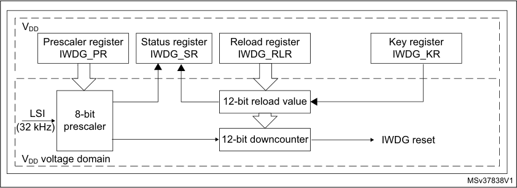

1. The register interface is located in the V DD voltage domain. The watchdog function is located in the V DD
voltage domain, still functional in Standby mode.

528/905 RM0377 Rev 10

--- end of page=527 ---

**RM0377** **Independent watchdog (IWDG)**

When the independent watchdog is started by writing the value 0x0000 CCCC in the _IWDG_
_key register (IWDG_KR)_, the counter starts counting down from the reset value of 0xFFF.
When it reaches the end of count value (0x000) a reset signal is generated (IWDG reset).

Whenever the key value 0x0000 AAAA is written in the _IWDG key register (IWDG_KR)_, the
IWDG_RLR value is reloaded in the counter and the watchdog reset is prevented.

Once running, the IWDG cannot be stopped.

**20.3.2** **Window option**

The IWDG can also work as a window watchdog by setting the appropriate window in the
_IWDG window register (IWDG_WINR)_ .

If the reload operation is performed while the counter is greater than the value stored in the
_IWDG window register (IWDG_WINR)_, then a reset is provided.

The default value of the _IWDG window register (IWDG_WINR)_ is 0x0000 0FFF, so if it is not
updated, the window option is disabled.

As soon as the window value is changed, a reload operation is performed in order to reset
the downcounter to the _IWDG reload register (IWDG_RLR)_ value and ease the cycle
number calculation to generate the next reload.

**Configuring the IWDG when the window option is enabled**

1. Enable the IWDG by writing 0x0000 CCCC in the _IWDG key register (IWDG_KR)_ .

2. Enable register access by writing 0x0000 5555 in the _IWDG key register (IWDG_KR)_ .

3. Write the IWDG prescaler by programming _IWDG prescaler register (IWDG_PR)_ from
0 to 7.

4. Write the _IWDG reload register (IWDG_RLR)_ .

5. Wait for the registers to be updated (IWDG_SR = 0x0000 0000).

6. Write to the _IWDG window register (IWDG_WINR)_ . This automatically refreshes the
counter value in the _IWDG reload register (IWDG_RLR)_ .

_Note:_ _Writing the window value allows the counter value to be refreshed by the RLR when IWDG_
_status register (IWDG_SR) is set to 0x0000 0000._

For code example, refer to _A.11.2: IWDG configuration with window code example_ .

**Configuring the IWDG when the window option is disabled**

When the window option it is not used, the IWDG can be configured as follows:

1. Enable the IWDG by writing 0x0000 CCCC in the _IWDG key register (IWDG_KR)_ .

2. Enable register access by writing 0x0000 5555 in the _IWDG key register (IWDG_KR)_ .

3. Write the prescaler by programming the _IWDG prescaler register (IWDG_PR)_ from 0 to
7.

4. Write the _IWDG reload register (IWDG_RLR)_ .

5. Wait for the registers to be updated (IWDG_SR = 0x0000 0000).

6. Refresh the counter value with IWDG_RLR (IWDG_KR = 0x0000 AAAA).

For code example, refer to _A.11.1: IWDG configuration code example_ .

RM0377 Rev 10 529/905

536

--- end of page=528 ---

**Independent watchdog (IWDG)** **RM0377**

**20.3.3** **Hardware watchdog**

If the “Hardware watchdog” feature is enabled through the device option bits, the watchdog
is automatically enabled at power-on, and generates a reset unless the _IWDG key register_
_(IWDG_KR)_ is written by the software before the counter reaches end of count or if the
downcounter is reloaded inside the window.

**20.3.4** **Register access protection**

Write access to _IWDG prescaler register (IWDG_PR)_, _IWDG reload register (IWDG_RLR)_
and _IWDG window register (IWDG_WINR)_ is protected. To modify them, the user must first
write the code 0x0000 5555 in the _IWDG key register (IWDG_KR)_ . A write access to this
register with a different value breaks the sequence and register access is protected again.
This is the case of the reload operation (writing 0x0000 AAAA).

A status register is available to indicate that an update of the prescaler or of the
downcounter reload value or of the window value is ongoing.

**20.3.5** **Debug mode**

When the device enters Debug mode (core halted), the IWDG counter either continues to
work normally or stops, depending on the configuration of the corresponding bit in
DBGCMU freeze register.

530/905 RM0377 Rev 10

--- end of page=529 ---

**RM0377** **Independent watchdog (IWDG)**

###### **20.4 IWDG registers**

Refer to _Section 1.2 on page 45_ for a list of abbreviations used in register descriptions.

The peripheral registers can be accessed by half-words (16-bit) or words (32-bit).

**20.4.1** **IWDG key register (IWDG_KR)**

Address offset: 0x00

Reset value: 0x0000 0000 (reset by Standby mode)

|31|30|29|28|27|26|25|24|23|22|21|20|19|18|17|16|
|---|---|---|---|---|---|---|---|---|---|---|---|---|---|---|---|
|Res.|Res.|Res.|Res.|Res.|Res.|Res.|Res.|Res.|Res.|Res.|Res.|Res.|Res.|Res.|Res.|
|||||||||||||||||

|15 14 13 12 11 10 9 8 7 6 5 4 3 2 1 0|Col2|Col3|Col4|Col5|Col6|Col7|Col8|Col9|Col10|Col11|Col12|Col13|Col14|Col15|Col16|
|---|---|---|---|---|---|---|---|---|---|---|---|---|---|---|---|
|KEY[15:0]|KEY[15:0]|KEY[15:0]|KEY[15:0]|KEY[15:0]|KEY[15:0]|KEY[15:0]|KEY[15:0]|KEY[15:0]|KEY[15:0]|KEY[15:0]|KEY[15:0]|KEY[15:0]|KEY[15:0]|KEY[15:0]|KEY[15:0]|
|w|w|w|w|w|w|w|w|w|w|w|w|w|w|w|w|

Bits 31:16 Reserved, must be kept at reset value.

Bits 15:0 **KEY[15:0]:** Key value (write only, read 0x0000)

These bits must be written by software at regular intervals with the key value 0xAAAA,
otherwise the watchdog generates a reset when the counter reaches 0.
Writing the key value 0x5555 to enable access to the IWDG_PR, IWDG_RLR and
IWDG_WINR registers (see _Section 20.3.4: Register access protection_ )
Writing the key value 0xCCCC starts the watchdog (except if the hardware watchdog option
is selected)

RM0377 Rev 10 531/905

536

--- end of page=530 ---

**Independent watchdog (IWDG)** **RM0377**

**20.4.2** **IWDG prescaler register (IWDG_PR)**

Address offset: 0x04

Reset value: 0x0000 0000

|31|30|29|28|27|26|25|24|23|22|21|20|19|18|17|16|
|---|---|---|---|---|---|---|---|---|---|---|---|---|---|---|---|
|Res.|Res.|Res.|Res.|Res.|Res.|Res.|Res.|Res.|Res.|Res.|Res.|Res.|Res.|Res.|Res.|
|||||||||||||||||

|15|14|13|12|11|10|9|8|7|6|5|4|3|2 1 0|Col15|Col16|
|---|---|---|---|---|---|---|---|---|---|---|---|---|---|---|---|
|Res.|Res.|Res.|Res.|Res.|Res.|Res.|Res.|Res.|Res.|Res.|Res.|Res.|PR[2:0]|PR[2:0]|PR[2:0]|
||||||||||||||rw|rw|rw|

Bits 31:3 Reserved, must be kept at reset value.

Bits 2:0 **PR[2:0]:** Prescaler divider

These bits are write access protected see _Section 20.3.4: Register access protection_ . They
are written by software to select the prescaler divider feeding the counter clock. PVU bit of
the _IWDG status register (IWDG_SR)_ must be reset in order to be able to change the
prescaler divider.

000: divider /4

001: divider /8

010: divider /16

011: divider /32

100: divider /64

101: divider /128

110: divider /256

111: divider /256

_Note: Reading this register returns the prescaler value from the V_ _DD_ _voltage domain. This_
_value may not be up to date/valid if a write operation to this register is ongoing. For this_
_reason the value read from this register is valid only when the PVU bit in the IWDG_
_status register (IWDG_SR) is reset._

532/905 RM0377 Rev 10

--- end of page=531 ---

**RM0377** **Independent watchdog (IWDG)**

**20.4.3** **IWDG reload register (IWDG_RLR)**

Address offset: 0x08

Reset value: 0x0000 0FFF (reset by Standby mode)

|31|30|29|28|27|26|25|24|23|22|21|20|19|18|17|16|
|---|---|---|---|---|---|---|---|---|---|---|---|---|---|---|---|
|Res.|Res.|Res.|Res.|Res.|Res.|Res.|Res.|Res.|Res.|Res.|Res.|Res.|Res.|Res.|Res.|
|||||||||||||||||

|15|14|13|12|11 10 9 8 7 6 5 4 3 2 1 0|Col6|Col7|Col8|Col9|Col10|Col11|Col12|Col13|Col14|Col15|Col16|
|---|---|---|---|---|---|---|---|---|---|---|---|---|---|---|---|
|Res.|Res.|Res.|Res.|RL[11:0]|RL[11:0]|RL[11:0]|RL[11:0]|RL[11:0]|RL[11:0]|RL[11:0]|RL[11:0]|RL[11:0]|RL[11:0]|RL[11:0]|RL[11:0]|
|||||rw|rw|rw|rw|rw|rw|rw|rw|rw|rw|rw|rw|

Bits 31:12 Reserved, must be kept at reset value.

Bits 11:0 **RL[11:0]:** Watchdog counter reload value

These bits are write access protected see _Register access protection_ . They are written by
software to define the value to be loaded in the watchdog counter each time the value
0xAAAA is written in the _IWDG key register (IWDG_KR)_ . The watchdog counter counts
down from this value. The timeout period is a function of this value and the clock prescaler.
Refer to the datasheet for the timeout information.

The RVU bit in the _IWDG status register (IWDG_SR)_ must be reset to be able to change the
reload value.

_Note: Reading this register returns the reload value from the V_ _DD_ _voltage domain. This value_
_may not be up to date/valid if a write operation to this register is ongoing on it. For this_
_reason the value read from this register is valid only when the RVU bit in the IWDG_
_status register (IWDG_SR) is reset._

RM0377 Rev 10 533/905

536

--- end of page=532 ---

**Independent watchdog (IWDG)** **RM0377**

**20.4.4** **IWDG status register (IWDG_SR)**

Address offset: 0x0C

Reset value: 0x0000 0000 (not reset by Standby mode)

|31|30|29|28|27|26|25|24|23|22|21|20|19|18|17|16|
|---|---|---|---|---|---|---|---|---|---|---|---|---|---|---|---|
|Res.|Res.|Res.|Res.|Res.|Res.|Res.|Res.|Res.|Res.|Res.|Res.|Res.|Res.|Res.|Res.|
|||||||||||||||||

|15|14|13|12|11|10|9|8|7|6|5|4|3|2|1|0|
|---|---|---|---|---|---|---|---|---|---|---|---|---|---|---|---|
|Res.|Res.|Res.|Res.|Res.|Res.|Res.|Res.|Res.|Res.|Res.|Res.|Res.|WVU|RVU|PVU|
||||||||||||||r|r|r|

Bits 31:3 Reserved, must be kept at reset value.

Bit 2 **WVU:** Watchdog counter window value update

This bit is set by hardware to indicate that an update of the window value is ongoing. It is
reset by hardware when the reload value update operation is completed in the V DD voltage
domain (takes up to five RC 40 kHz cycles).
Window value can be updated only when WVU bit is reset.

Bit 1 **RVU:** Watchdog counter reload value update

This bit is set by hardware to indicate that an update of the reload value is ongoing. It is reset
by hardware when the reload value update operation is completed in the V DD voltage domain
(takes up to five RC 40 kHz cycles).
Reload value can be updated only when RVU bit is reset.

Bit 0 **PVU:** Watchdog prescaler value update

This bit is set by hardware to indicate that an update of the prescaler value is ongoing. It is
reset by hardware when the prescaler update operation is completed in the V DD voltage
domain (takes up to five RC 40 kHz cycles).
Prescaler value can be updated only when PVU bit is reset.

_Note:_ _If several reload, prescaler, or window values are used by the application, it is mandatory to_
_wait until RVU bit is reset before changing the reload value, to wait until PVU bit is reset_
_before changing the prescaler value, and to wait until WVU bit is reset before changing the_
_window value. However, after updating the prescaler and/or the reload/window value it is not_
_necessary to wait until RVU or PVU or WVU is reset before continuing code execution_
_except in case of low-power mode entry._

534/905 RM0377 Rev 10

--- end of page=533 ---

**RM0377** **Independent watchdog (IWDG)**

**20.4.5** **IWDG window register (IWDG_WINR)**

Address offset: 0x10

Reset value: 0x0000 0FFF (reset by Standby mode)

|31|30|29|28|27|26|25|24|23|22|21|20|19|18|17|16|
|---|---|---|---|---|---|---|---|---|---|---|---|---|---|---|---|
|Res.|Res.|Res.|Res.|Res.|Res.|Res.|Res.|Res.|Res.|Res.|Res.|Res.|Res.|Res.|Res.|
|||||||||||||||||

|15|14|13|12|11 10 9 8 7 6 5 4 3 2 1 0|Col6|Col7|Col8|Col9|Col10|Col11|Col12|Col13|Col14|Col15|Col16|
|---|---|---|---|---|---|---|---|---|---|---|---|---|---|---|---|
|Res.|Res.|Res.|Res.|WIN[11:0]|WIN[11:0]|WIN[11:0]|WIN[11:0]|WIN[11:0]|WIN[11:0]|WIN[11:0]|WIN[11:0]|WIN[11:0]|WIN[11:0]|WIN[11:0]|WIN[11:0]|
|||||rw|rw|rw|rw|rw|rw|rw|rw|rw|rw|rw|rw|

Bits 31:12 Reserved, must be kept at reset value.

Bits 11:0 **WIN[11:0]:** Watchdog counter window value

These bits are write access protected, see _Section 20.3.4_, they contain the high limit of the
window value to be compared with the downcounter.
To prevent a reset, the downcounter must be reloaded when its value is lower than the
window register value and greater than 0x0
The WVU bit in the _IWDG status register (IWDG_SR)_ must be reset in order to be able to
change the reload value.

_Note: Reading this register returns the reload value from the V_ _DD_ _voltage domain. This value_
_may not be valid if a write operation to this register is ongoing. For this reason the value_
_read from this register is valid only when the WVU bit in the IWDG status register_
_(IWDG_SR) is reset._

RM0377 Rev 10 535/905

536

--- end of page=534 ---

**Independent watchdog (IWDG)** **RM0377**

**20.4.6** **IWDG register map**

The following table gives the IWDG register map and reset values.

**Table 92. IWDG register map and reset values**

|Offset|Register name|31|30|29|28|27|26|25|24|23|22|21|20|19|18|17|16|15|14|13|12|11|10|9|8|7|6|5|4|3|2|1|0|
|---|---|---|---|---|---|---|---|---|---|---|---|---|---|---|---|---|---|---|---|---|---|---|---|---|---|---|---|---|---|---|---|---|---|
|0x00|**IWDG_KR**|Res.|Res.|Res.|Res.|Res.|Res.|Res.|Res.|Res.|Res.|Res.|Res.|Res.|Res.|Res.|Res.|KEY[15:0]|KEY[15:0]|KEY[15:0]|KEY[15:0]|KEY[15:0]|KEY[15:0]|KEY[15:0]|KEY[15:0]|KEY[15:0]|KEY[15:0]|KEY[15:0]|KEY[15:0]|KEY[15:0]|KEY[15:0]|KEY[15:0]|KEY[15:0]|
|0x00|Reset value|||||||||||||||||0|0|0|0|0|0|0|0|0|0|0|0|0|0|0|0|
|0x04|**IWDG_PR**|Res.|Res.|Res.|Res.|Res.|Res.|Res.|Res.|Res.|Res.|Res.|Res.|Res.|Res.|Res.|Res.|Res.|Res.|Res.|Res.|Res.|Res.|Res.|Res.|Res.|Res.|Res.|Res.|Res.|PR[2:0]|PR[2:0]|PR[2:0]|
|0x04|Reset value||||||||||||||||||||||||||||||0|0|0|
|0x08|**IWDG_RLR**|Res.|Res.|Res.|Res.|Res.|Res.|Res.|Res.|Res.|Res.|Res.|Res.|Res.|Res.|Res.|Res.|Res.|Res.|Res.|Res.|RL[11:0]|RL[11:0]|RL[11:0]|RL[11:0]|RL[11:0]|RL[11:0]|RL[11:0]|RL[11:0]|RL[11:0]|RL[11:0]|RL[11:0]|RL[11:0]|
|0x08|Reset value|||||||||||||||||||||1|1|1|1|1|1|1|1|1|1|1|1|
|0x0C|**IWDG_SR**|Res.|Res.|Res.|Res.|Res.|Res.|Res.|Res.|Res.|Res.|Res.|Res.|Res.|Res.|Res.|Res.|Res.|Res.|Res.|Res.|Res.|Res.|Res.|Res.|Res.|Res.|Res.|Res.|Res.|WVU|RVU|PVU|
|0x0C|Reset value||||||||||||||||||||||||||||||0|0|0|
|0x10|**IWDG_WINR**|Res.|Res.|Res.|Res.|Res.|Res.|Res.|Res.|Res.|Res.|Res.|Res.|Res.|Res.|Res.|Res.|Res.|Res.|Res.|Res.|WIN[11:0]|WIN[11:0]|WIN[11:0]|WIN[11:0]|WIN[11:0]|WIN[11:0]|WIN[11:0]|WIN[11:0]|WIN[11:0]|WIN[11:0]|WIN[11:0]|WIN[11:0]|
|0x10|Reset value|||||||||||||||||||||1|1|1|1|1|1|1|1|1|1|1|1|

Refer to _Section 2.2 on page 51_ for the register boundary addresses.

536/905 RM0377 Rev 10

--- end of page=535 ---

**RM0377** **System window watchdog (WWDG)**

#### **21 System window watchdog (WWDG)**

###### **21.1 Introduction**

The system window watchdog (WWDG) is used to detect the occurrence of a software fault,
usually generated by external interference or by unforeseen logical conditions, which
causes the application program to abandon its normal sequence. The watchdog circuit
generates an MCU reset on expiry of a programmed time period, unless the program
refreshes the contents of the down-counter before the T6 bit becomes cleared. An MCU
reset is also generated if the 7-bit down-counter value (in the control register) is refreshed
before the down-counter has reached the window register value. This implies that the
counter must be refreshed in a limited window.

The WWDG clock is prescaled from the APB1 clock and has a configurable time-window
that can be programmed to detect abnormally late or early application behavior.

The WWDG is best suited for applications which require the watchdog to react within an
accurate timing window.

###### **21.2 WWDG main features**

      - Programmable free-running down-counter

      - Conditional reset

–
Reset (if watchdog activated) when the down-counter value becomes lower than
0x40

–
Reset (if watchdog activated) if the down-counter is reloaded outside the window
(see _Figure 180_ )

      - Early wakeup interrupt (EWI): triggered (if enabled and the watchdog activated) when
the down-counter is equal to 0x40.

###### **21.3 WWDG functional description**

If the watchdog is activated (the WDGA bit is set in the WWDG_CR register) and when the
7-bit down-counter (T[6:0] bits) is decremented from 0x40 to 0x3F (T6 becomes cleared), it
initiates a reset. If the software reloads the counter while the counter is greater than the
value stored in the window register, then a reset is generated.

The application program must write in the WWDG_CR register at regular intervals during
normal operation to prevent an MCU reset. This operation must occur only when the counter
value is lower than the window register value and higher than 0x3F. The value to be stored
in the WWDG_CR register must be between 0xFF and 0xC0.

Refer to _Figure 179_ for the WWDG block diagram.

RM0377 Rev 10 537/905

542

--- end of page=536 ---

**System window watchdog (WWDG)** **RM0377**

**21.3.1** **WWDG block diagram**

**Figure 179. Watchdog block diagram**

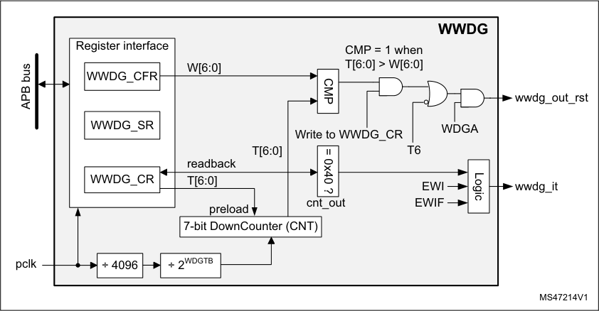

**21.3.2** **Enabling the watchdog**

The watchdog is always disabled after a reset. It is enabled by setting the WDGA bit in the
WWDG_CR register, then it cannot be disabled again except by a reset.

**21.3.3** **Controlling the down-counter**

This down-counter is free-running, counting down even if the watchdog is disabled. When
the watchdog is enabled, the T6 bit must be set to prevent generating an immediate reset.

The T[5:0] bits contain the number of increments that represent the time delay before the
watchdog produces a reset. The timing varies between a minimum and a maximum value
due to the unknown status of the prescaler when writing to the WWDG_CR register (see
_Figure 180_ ). The _WWDG configuration register (WWDG_CFR)_ contains the high limit of the
window: to prevent a reset, the down-counter must be reloaded when its value is lower than
the window register value and greater than 0x3F. _Figure 180_ describes the window
watchdog process.

_Note:_ _The T6 bit can be used to generate a software reset (the WDGA bit is set and the T6 bit is_
_cleared)._

**21.3.4** **How to program the watchdog timeout**

Use the formula in _Figure 180_ to calculate the WWDG timeout.

**Warning:** **When writing to the WWDG_CR register, always write 1 in the**
**T6 bit to avoid generating an immediate reset.**

538/905 RM0377 Rev 10

--- end of page=537 ---

**RM0377** **System window watchdog (WWDG)**

**Figure 180. Window watchdog timing diagram**

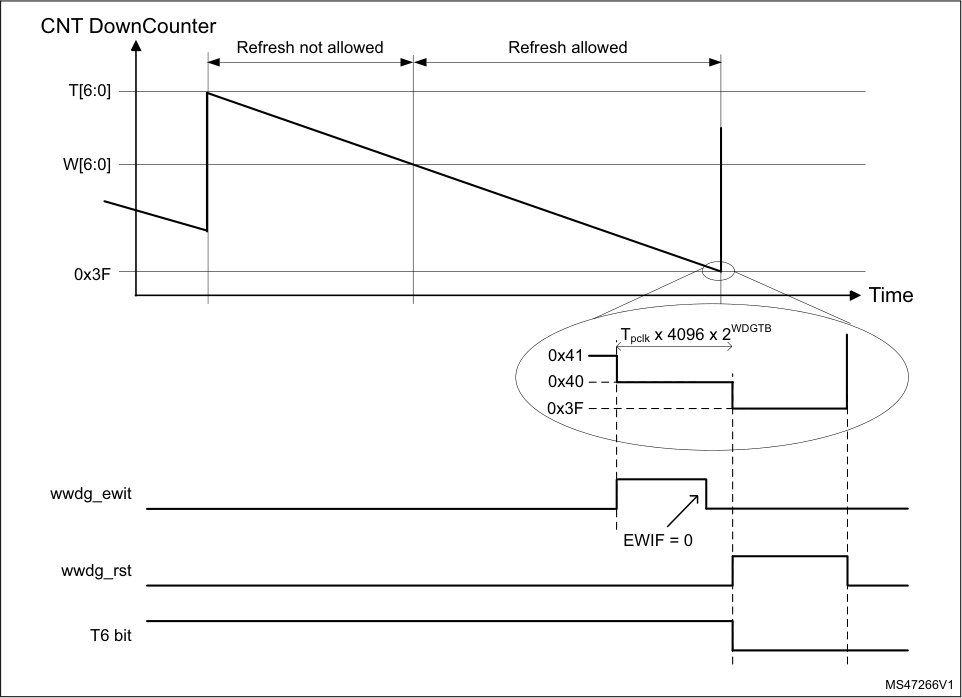

|Col1|Col2|
|---|---|
|||
|||
|||

The formula to calculate the timeout value is given by:

tWWDG = tPCLK1 × 4096 × 2 [WDGTB[1:0]] × ( T 5:0 [ ] + 1 ) ( ms )

where:

t WWDG : WWDG timeout

t PCLK : APB1 clock period measured in ms

4096: value corresponding to internal divider

As an example, if APB1 frequency is 32 MHz, WDGTB[1:0] is set to 3 and T[5:0] is set to 63:

tWWDG = ( 1 32000 ⁄ ) × 4096 × 2 [3] × ( 63 + 1 ) = 65.54ms

Refer to the datasheet for the minimum and maximum values of t WWDG .

For code example, refer to _A.12.1: WWDG configuration code example_ .

RM0377 Rev 10 539/905

542

--- end of page=538 ---

**System window watchdog (WWDG)** **RM0377**

**21.3.5** **Debug mode**

When the device enters debug mode (processor halted), the WWDG counter either
continues to work normally or stops, depending on the configuration bit in DBG module. For
more details refer to _Section 27.9.2: Debug support for timers, watchdog and I_ _[2]_ _C_ .

###### **21.4 WWDG interrupts**

The early wakeup interrupt (EWI) can be used if specific safety operations or data logging
must be performed before the actual reset is generated. The EWI interrupt is enabled by
setting the EWI bit in the WWDG_CFR register. When the down-counter reaches the value
0x40, an EWI interrupt is generated and the corresponding interrupt service routine (ISR)
can be used to trigger specific actions (such as communications or data logging) before
resetting the device.

In some applications the EWI interrupt can be used to manage a software system check
and/or system recovery/graceful degradation, without generating a WWDG reset. In this
case the corresponding ISR has to reload the WWDG counter to avoid the WWDG reset,
then trigger the required actions.

The EWI interrupt is cleared by writing '0' to the EWIF bit in the WWDG_SR register.

_Note:_ _When the EWI interrupt cannot be served (e.g. due to a system lock in a higher priority task)_
_the WWDG reset is eventually generated._

###### **21.5 WWDG registers**

Refer to _Section 1.2 on page 45_ for a list of abbreviations used in register descriptions.

The peripheral registers can be accessed by halfwords (16-bit) or words (32-bit).

**21.5.1** **WWDG control register (WWDG_CR)**

Address offset: 0x000

Reset value: 0x0000 007F

|31|30|29|28|27|26|25|24|23|22|21|20|19|18|17|16|
|---|---|---|---|---|---|---|---|---|---|---|---|---|---|---|---|
|Res.|Res.|Res.|Res.|Res.|Res.|Res.|Res.|Res.|Res.|Res.|Res.|Res.|Res.|Res.|Res.|
|||||||||||||||||

|15|14|13|12|11|10|9|8|7|6 5 4 3 2 1 0|Col11|Col12|Col13|Col14|Col15|Col16|
|---|---|---|---|---|---|---|---|---|---|---|---|---|---|---|---|
|Res.|Res.|Res.|Res.|Res.|Res.|Res.|Res.|WDGA|T[6:0]|T[6:0]|T[6:0]|T[6:0]|T[6:0]|T[6:0]|T[6:0]|
|||||||||rs|rw|rw|rw|rw|rw|rw|rw|

540/905 RM0377 Rev 10

--- end of page=539 ---

**RM0377** **System window watchdog (WWDG)**

Bits 31:8 Reserved, must be kept at reset value.

Bit 7 **WDGA:** Activation bit

This bit is set by software and only cleared by hardware after a reset. When WDGA = 1, the
watchdog can generate a reset.
0: Watchdog disabled
1: Watchdog enabled

Bits 6:0 **T[6:0]:** 7-bit counter (MSB to LSB)

These bits contain the value of the watchdog counter, decremented every
(4096 x 2 [WDGTB] [[1:0]] ) PCLK cycles. A reset is produced when it is decremented from 0x40 to
0x3F (T6 becomes cleared).

**21.5.2** **WWDG configuration register (WWDG_CFR)**

Address offset: 0x004

Reset value: 0x0000 007F

|31|30|29|28|27|26|25|24|23|22|21|20|19|18|17|16|
|---|---|---|---|---|---|---|---|---|---|---|---|---|---|---|---|
|Res.|Res.|Res.|Res.|Res.|Res.|Res.|Res.|Res.|Res.|Res.|Res.|Res.|Res.|Res.|Res.|
|||||||||||||||||

|15|14|13|12|11|10|9|8 7|Col9|6 5 4 3 2 1 0|Col11|Col12|Col13|Col14|Col15|Col16|
|---|---|---|---|---|---|---|---|---|---|---|---|---|---|---|---|
|Res.|Res.|Res.|Res.|Res.|Res.|EWI|WDGTB[1:0]|WDGTB[1:0]|W[6:0]|W[6:0]|W[6:0]|W[6:0]|W[6:0]|W[6:0]|W[6:0]|
|||||||rs|rw|rw|rw|rw|rw|rw|rw|rw|rw|

Bits 31:10 Reserved, must be kept at reset value.

Bit 9 **EWI:** Early wakeup interrupt

When set, an interrupt occurs whenever the counter reaches the value 0x40. This interrupt is
only cleared by hardware after a reset.

Bits 8:7 **WDGTB[1:0]:** Timer base

The time base of the prescaler can be modified as follows:
00: CK counter clock (PCLK div 4096) div 1
01: CK counter clock (PCLK div 4096) div 2
10: CK counter clock (PCLK div 4096) div 4
11: CK counter clock (PCLK div 4096) div 8

Bits 6:0 **W[6:0]:** 7-bit window value

These bits contain the window value to be compared with the down-counter.

**21.5.3** **WWDG status register (WWDG_SR)**

Address offset: 0x008

Reset value: 0x0000 0000

|31|30|29|28|27|26|25|24|23|22|21|20|19|18|17|16|
|---|---|---|---|---|---|---|---|---|---|---|---|---|---|---|---|
|Res.|Res.|Res.|Res.|Res.|Res.|Res.|Res.|Res.|Res.|Res.|Res.|Res.|Res.|Res.|Res.|
|||||||||||||||||

|15|14|13|12|11|10|9|8|7|6|5|4|3|2|1|0|
|---|---|---|---|---|---|---|---|---|---|---|---|---|---|---|---|
|Res.|Res.|Res.|Res.|Res.|Res.|Res.|Res.|Res.|Res.|Res.|Res.|Res.|Res.|Res.|EWIF|
||||||||||||||||rc_w0|

RM0377 Rev 10 541/905

542

--- end of page=540 ---

**System window watchdog (WWDG)** **RM0377**

Bits 31:1 Reserved, must be kept at reset value.

Bit 0 **EWIF:** Early wakeup interrupt flag

This bit is set by hardware when the counter has reached the value 0x40. It must be cleared
by software by writing 0. Writing 1 has no effect. This bit is also set if the interrupt is not
enabled.

**21.5.4** **WWDG register map**

The following table gives the WWDG register map and reset values.

**Table 93. WWDG register map and reset values**

|Offset|Register|31|30|29|28|27|26|25|24|23|22|21|20|19|18|17|16|15|14|13|12|11|10|9|8|7|6|5|4|3|2|1|0|
|---|---|---|---|---|---|---|---|---|---|---|---|---|---|---|---|---|---|---|---|---|---|---|---|---|---|---|---|---|---|---|---|---|---|
|0x000|**WWDG_CR**|Res.|Res.|Res.|Res.|Res.|Res.|Res.|Res.|Res.|Res.|Res.|Res.|Res.|Res.|Res.|Res.|Res.|Res.|Res.|Res.|Res.|Res.|Res.|Res.|WDGA|T[6:0]|T[6:0]|T[6:0]|T[6:0]|T[6:0]|T[6:0]|T[6:0]|
|0x000|Reset value|||||||||||||||||||||||||0|1|1|1|1|1|1|1|
|0x004|**WWDG_CFR**|Res.|Res.|Res.|Res.|Res.|Res.|Res.|Res.|Res.|Res.|Res.|Res.|Res.|Res.|Res.|Res.|Res.|Res.|Res.|Res.|Res.|Res.|EWI|WDGTB1|WDGTB0|W[6:0]|W[6:0]|W[6:0]|W[6:0]|W[6:0]|W[6:0]|W[6:0]|
|0x004|Reset value|||||||||||||||||||||||0|0|0|1|1|1|1|1|1|1|
|0x008|**WWDG_SR**|Res.|Res.|Res.|Res.|Res.|Res.|Res.|Res.|Res.|Res.|Res.|Res.|Res.|Res.|Res.|Res.|Res.|Res.|Res.|Res.|Res.|Res.|Res.|Res.|Res.|Res.|Res.|Res.|Res.|Res.|Res.|EWIF|
|0x008|Reset value||||||||||||||||||||||||||||||||0|

Refer to _Section 2.2 on page 51_ for the register boundary addresses.

542/905 RM0377 Rev 10

--- end of page=541 ---

**RM0377** **Real-time clock (RTC)**

#### **22 Real-time clock (RTC)**

###### **22.1 Introduction**

The RTC provides an automatic wakeup to manage all low-power modes.

The real-time clock (RTC) is an independent BCD timer/counter. The RTC provides a timeof-day clock/calendar with programmable alarm interrupts.

The RTC includes also a periodic programmable wakeup flag with interrupt capability.

Two 32-bit registers contain the seconds, minutes, hours (12- or 24-hour format), day (day
of week), date (day of month), month, and year, expressed in binary coded decimal format
(BCD). The sub-seconds value is also available in binary format.

Compensations for 28-, 29- (leap year), 30-, and 31-day months are performed
automatically. Daylight saving time compensation can also be performed.

Additional 32-bit registers contain the programmable alarm subseconds, seconds, minutes,
hours, day, and date.

A digital calibration feature is available to compensate for any deviation in crystal oscillator

accuracy.

After RTC domain reset, all RTC registers are protected against possible parasitic write

accesses.

As long as the supply voltage remains in the operating range, the RTC never stops,
regardless of the device status (Run mode, low-power mode or under reset).

RM0377 Rev 10 543/905

587

--- end of page=542 ---

**Real-time clock (RTC)** **RM0377**

###### **22.2 RTC main features**

The RTC unit main features are the following (see _Figure 181: RTC block diagram_ ):

      - Calendar with subseconds, seconds, minutes, hours (12 or 24 format), day (day of
week), date (day of month), month, and year.

      - Daylight saving compensation programmable by software.

      - Programmable alarm with interrupt function. The alarm can be triggered by any
combination of the calendar fields.

      - Automatic wakeup unit generating a periodic flag that triggers an automatic wakeup
interrupt.

      - Reference clock detection: a more precise second source clock (50 or 60 Hz) can be
used to enhance the calendar precision.

      - Accurate synchronization with an external clock using the subsecond shift feature.

      - Digital calibration circuit (periodic counter correction): 0.95 ppm accuracy, obtained in a
calibration window of several seconds

      - Time-stamp function for event saving

      - Tamper detection event with configurable filter and internal pull-up

      - Maskable interrupts/events:

– Alarm A

– Alarm B

–
Wakeup interrupt

–
Time-stamp

–
Tamper detection

      - 5 backup registers.

###### **22.3 RTC implementation**

**Table 94. RTC implementation** **[(1)]**

|RTC Features|Category 1|Category 2|Category 3|Category 5|
|---|---|---|---|---|
|Periodic wakeup timer|X|X|X|X|
|RTC_TAMP1|-|X|X|X|
|RTC_TAMP2|X|X|X|X|
|RTC_TAMP3|X|X|-|X|
|Alarm A|X|X|X|X|
|Alarm B|X|X|X|X|

1. X = supported, ‘-’= not supported.

544/905 RM0377 Rev 10

--- end of page=543 ---

**RM0377** **Real-time clock (RTC)**

###### **22.4 RTC functional description**

**22.4.1** **RTC block diagram**

**Figure 181. RTC block diagram**

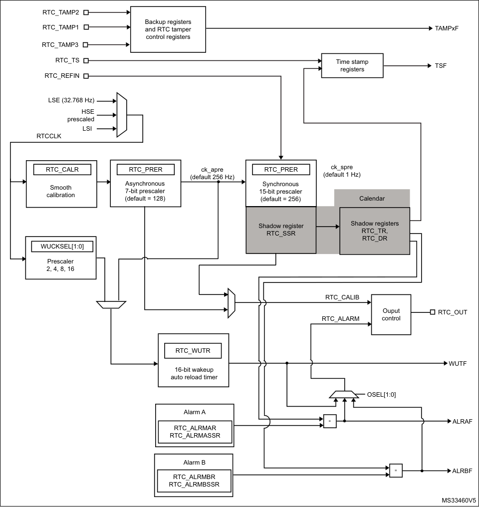

1. RTC_TAMP3 is available only on category 1, category 2 and category 5 devices.

RM0377 Rev 10 545/905

587

--- end of page=544 ---

**Real-time clock (RTC)** **RM0377**

The RTC includes:

      - Two alarms

      - Up to three tamper events from I/Os

–
Tamper detection erases the backup registers.

      - One timestamp event from I/O

      - Tamper event detection can generate a timestamp event

      - 5 x 32-bit backup registers

      - Output functions: RTC_OUT which selects one of the following two outputs:

–
RTC_CALIB: 512 Hz or 1Hz clock output (with an LSE frequency of 32.768 kHz).
This output is enabled by setting the COE bit in the RTC_CR register.

–
RTC_ALARM: This output is enabled by configuring the OSEL[1:0] bits in the
RTC_CR register which select the Alarm A, Alarm B or Wakeup outputs.

      - Input functions:

–
RTC_TS: timestamp event

–
RTC_TAMP1: tamper1 event detection

–
RTC_TAMP2: tamper2 event detection

–
RTC_TAMP3: tamper3 event detection (only on category 1, category 2 and
category 5 devices).

–
RTC_REFIN: 50 or 60 Hz reference clock input

**22.4.2** **GPIOs controlled by the RTC**

RTC_OUT, RTC_TS and RTC_TAMP1 are mapped on the same pin (PC13). PC13 pin
configuration is controlled by the RTC, whatever the PC13 GPIO configuration, except for
the RTC_ALARM output open-drain mode.

The output mechanism follows the priority order shown in _Table 95_ .

**Table 95. RTC pin PC13 configuration** **[(1)]**

|PC13 Pin configuration and function|OSEL[1:0] bits (RTC_ALARM output enable)|COE bit (RTC_CALIB output enable)|RTC_OUT _RMP bit|RTC_ALARM _TYPE bit|TAMP1E bit (RTC_TAMP1 input enable)|TSE bit (RTC_TS input enable)|
|---|---|---|---|---|---|---|
|RTC_ALARM output OD|01 or 10 or 11|Don’t care|0|0|Don’t care|Don’t care|
|RTC_ALARM output OD|01 or 10 or 11|Don’t care|1|1|1|1|
|RTC_ALARM output PP|01 or 10 or 11|Don’t care|0|1|Don’t care|Don’t care|
|RTC_ALARM output PP|01 or 10 or 11|Don’t care|1|1|1|1|
|RTC_CALIB output PP|00|1|0|Don’t care|Don’t care|Don’t care|
|RTC_TAMP1 input floating|00|0|Don’t care|Don’t care|1|0|
|RTC_TAMP1 input floating|00|1|1|1|1|1|
|RTC_TAMP1 input floating|01 or 10 or 11|0|0|0|0|0|

546/905 RM0377 Rev 10

--- end of page=545 ---

**RM0377** **Real-time clock (RTC)**

**Table 95. RTC pin PC13 configuration** **[(1)]** **(continued)**

|PC13 Pin configuration and function|OSEL[1:0] bits (RTC_ALARM output enable)|COE bit (RTC_CALIB output enable)|RTC_OUT _RMP bit|RTC_ALARM _TYPE bit|TAMP1E bit (RTC_TAMP1 input enable)|TSE bit (RTC_TS input enable)|
|---|---|---|---|---|---|---|
|RTC_TS and RTC_TAMP1 input floating|00|0|Don’t care|Don’t care|1|1|
|RTC_TS and RTC_TAMP1 input floating|00|1|1|1|1|1|
|RTC_TS and RTC_TAMP1 input floating|01 or 10 or 11|0|0|0|0|0|
|RTC_TS input floating|00|0|Don’t care|Don’t care|0|1|
|RTC_TS input floating|00|1|1|1|1|1|
|RTC_TS input floating|01 or 10 or 11|0|0|0|0|0|
|Wakeup pin or Standard GPIO|00|0|Don’t care|Don’t care|0|0|
|Wakeup pin or Standard GPIO|00|1|1|1|1|1|
|Wakeup pin or Standard GPIO|01 or 10 or 11|0|0|0|0|0|

1. OD: open drain; PP: push-pull.

In addition, it is possible to remap RTC_OUT on PB14 pin thanks to RTC_OUT_RMP bit. In
this case it is mandatory to configure PB14 GPIO registers as alternate function with the
correct type. The remap functions are shown in _Table 96_ .

**Table 96. RTC_OUT mapping**

|OSEL[1:0] bits (RTC_ALARM output enable)|COE bit (RTC_CALIB output enable)|RTC_OUT_RMP bit|RTC_OUT on PC13|RTC_OUT on PB14|
|---|---|---|---|---|
|00|0|0|-|-|
|00|1|1|RTC_CALIB|-|
|01 or 10 or 11|Don’t care|Don’t care|RTC_ALARM|-|
|00|0|1|-|-|
|00|1|1|-|RTC_CALIB|
|01 or 10 or 11|0|0|-|RTC_ALARM|
|01 or 10 or 11|1|1|RTC_ALARM|RTC_CALIB|

**22.4.3** **Clock and prescalers**

The RTC clock source (RTCCLK) is selected through the clock controller among the LSE
clock, the LSI oscillator clock, and the HSE clock. For more information on the RTC clock
source configuration, refer to _Section 7: Reset and clock control (RCC)_ .

RM0377 Rev 10 547/905

587

--- end of page=546 ---

**Real-time clock (RTC)** **RM0377**

A programmable prescaler stage generates a 1 Hz clock which is used to update the
calendar. To minimize power consumption, the prescaler is split into 2 programmable
prescalers (see _Figure 181: RTC block diagram_ ):

      - A 7-bit asynchronous prescaler configured through the PREDIV_A bits of the
RTC_PRER register.

      - A 15-bit synchronous prescaler configured through the PREDIV_S bits of the
RTC_PRER register.

_Note:_ _When both prescalers are used, it is recommended to configure the asynchronous prescaler_
_to a high value to minimize consumption._

The asynchronous prescaler division factor is set to 128, and the synchronous division
factor to 256, to obtain an internal clock frequency of 1 Hz (ck_spre) with an LSE frequency
of 32.768 kHz.

The minimum division factor is 1 and the maximum division factor is 2 [22] .

This corresponds to a maximum input frequency of around 4 MHz.

f ck_apre is given by the following formula:

f = ------------------------------------- f RTCCLK **-**
CK_APRE PREDIV_A + 1

The ck_apre clock is used to clock the binary RTC_SSR subseconds downcounter. When it
reaches 0, RTC_SSR is reloaded with the content of PREDIV_S.

f ck_spre is given by the following formula:

f = ---------------------------------------------------------------------------------------------- f RTCCLK
CK_SPRE ( PREDIV_S + 1 ) × ( PREDIV_A + 1 )

The ck_spre clock can be used either to update the calendar or as timebase for the 16-bit
wakeup auto-reload timer. To obtain short timeout periods, the 16-bit wakeup auto-reload
timer can also run with the RTCCLK divided by the programmable 4-bit asynchronous
prescaler (see _Section 22.4.6: Periodic auto-wakeup_ for details).

**22.4.4** **Real-time clock and calendar**

The RTC calendar time and date registers are accessed through shadow registers which
are synchronized with PCLK (APB clock). They can also be accessed directly in order to
avoid waiting for the synchronization duration.

      - RTC_SSR for the subseconds

      - RTC_TR for the time

      - RTC_DR for the date

Every RTCCLK period, the current calendar value is copied into the shadow registers, and
the RSF bit of RTC_ISR register is set (see _Section 22.7.4: RTC initialization and status_
_register (RTC_ISR)_ ). The copy is not performed in Stop and Standby mode. When exiting
these modes, the shadow registers are updated after up to 1 RTCCLK period.

When the application reads the calendar registers, it accesses the content of the shadow
registers. It is possible to make a direct access to the calendar registers by setting the

548/905 RM0377 Rev 10

--- end of page=547 ---

**RM0377** **Real-time clock (RTC)**

BYPSHAD control bit in the RTC_CR register. By default, this bit is cleared, and the user
accesses the shadow registers.

When reading the RTC_SSR, RTC_TR or RTC_DR registers in BYPSHAD=0 mode, the
frequency of the APB clock (f APB ) must be at least 7 times the frequency of the RTC clock
(f RTCCLK ).

The shadow registers are reset by system reset.

**22.4.5** **Programmable alarms**

The RTC unit provides programmable alarm: Alarm A and Alarm B. The description below is
given for Alarm A, but can be translated in the same way for Alarm B.

The programmable alarm function is enabled through the ALRAE bit in the RTC_CR
register. The ALRAF is set to 1 if the calendar subseconds, seconds, minutes, hours, date
or day match the values programmed in the alarm registers RTC_ALRMASSR and
RTC_ALRMAR. Each calendar field can be independently selected through the MSKx bits
of the RTC_ALRMAR register, and through the MASKSSx bits of the RTC_ALRMASSR
register. The alarm interrupt is enabled through the ALRAIE bit in the RTC_CR register.

**Caution:** If the seconds field is selected (MSK1 bit reset in RTC_ALRMAR), the synchronous
prescaler division factor set in the RTC_PRER register must be at least 3 to ensure correct
behavior.

Alarm A and Alarm B (if enabled by bits OSEL[1:0] in RTC_CR register) can be routed to the
RTC_ALARM output. RTC_ALARM output polarity can be configured through bit POL the
RTC_CR register.

**22.4.6** **Periodic auto-wakeup**

The periodic wakeup flag is generated by a 16-bit programmable auto-reload down-counter.
The wakeup timer range can be extended to 17 bits.

The wakeup function is enabled through the WUTE bit in the RTC_CR register.

The wakeup timer clock input can be:

      - RTC clock (RTCCLK) divided by 2, 4, 8, or 16.

When RTCCLK is LSE(32.768kHz), this allows to configure the wakeup interrupt period
from 122 µs to 32 s, with a resolution down to 61 µs.

      - ck_spre (usually 1 Hz internal clock)

When ck_spre frequency is 1Hz, this allows to achieve a wakeup time from 1 s to
around 36 hours with one-second resolution. This large programmable time range is
divided in 2 parts:

–
from 1s to 18 hours when WUCKSEL [2:1] = 10

– and from around 18h to 36h when WUCKSEL[2:1] = 11. In this last case 2 16 is
added to the 16-bit counter current value.When the initialization sequence is
complete (see _Programming the wakeup timer on page 551_ ), the timer starts
counting down.When the wakeup function is enabled, the down-counting remains
active in low-power modes. In addition, when it reaches 0, the WUTF flag is set in
the RTC_ISR register, and the wakeup counter is automatically reloaded with its
reload value (RTC_WUTR register value).

The WUTF flag must then be cleared by software.

RM0377 Rev 10 549/905

587

--- end of page=548 ---

**Real-time clock (RTC)** **RM0377**

When the periodic wakeup interrupt is enabled by setting the WUTIE bit in the RTC_CR
register, it can exit the device from low-power modes.

The periodic wakeup flag can be routed to the RTC_ALARM output provided it has been
enabled through bits OSEL[1:0] of RTC_CR register. RTC_ALARM output polarity can be
configured through the POL bit in the RTC_CR register.

System reset, as well as low-power modes (Sleep, Stop and Standby) have no influence on
the wakeup timer.

**22.4.7** **RTC initialization and configuration**

**RTC register access**

The RTC registers are 32-bit registers. The APB interface introduces 2 wait-states in RTC
register accesses except on read accesses to calendar shadow registers when
BYPSHAD=0.

**RTC register write protection**

After system reset, the RTC registers are protected against parasitic write access by
clearing the DBP bit in the PWR_CR register (refer to the power control section). DBP bit
must be set in order to enable RTC registers write access.

After RTC domain reset, all the RTC registers are write-protected. Writing to the RTC
registers is enabled by writing a key into the Write Protection register, RTC_WPR.

The following steps are required to unlock the write protection on all the RTC registers
except for RTC_TAMPCR, RTC_BKPxR, RTC_OR and RTC_ISR[13:8].

1. Write ‘0xCA’ into the RTC_WPR register.

2. Write ‘0x53’ into the RTC_WPR register.

Writing a wrong key reactivates the write protection.

The protection mechanism is not affected by system reset.

**Calendar initialization and configuration**

To program the initial time and date calendar values, including the time format and the
prescaler configuration, the following sequence is required:

1. Set INIT bit to 1 in the RTC_ISR register to enter initialization mode. In this mode, the
calendar counter is stopped and its value can be updated.

2. Poll INITF bit of in the RTC_ISR register. The initialization phase mode is entered when
INITF is set to 1. It takes around 2 RTCCLK clock cycles (due to clock synchronization).

3. To generate a 1 Hz clock for the calendar counter, program both the prescaler factors in
RTC_PRER register.

4. Load the initial time and date values in the shadow registers (RTC_TR and RTC_DR),
and configure the time format (12 or 24 hours) through the FMT bit in the RTC_CR
register.

5. Exit the initialization mode by clearing the INIT bit. The actual calendar counter value is
then automatically loaded and the counting restarts after 4 RTCCLK clock cycles.

When the initialization sequence is complete, the calendar starts counting.

550/905 RM0377 Rev 10

--- end of page=549 ---

