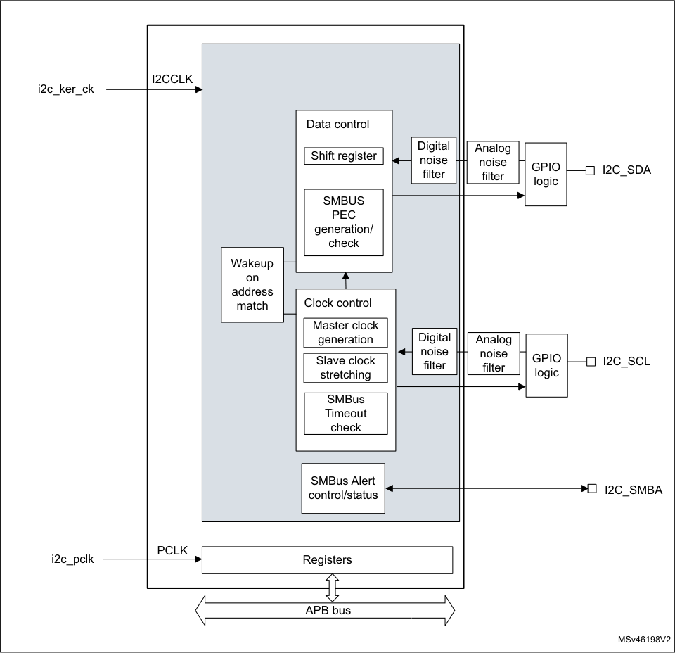
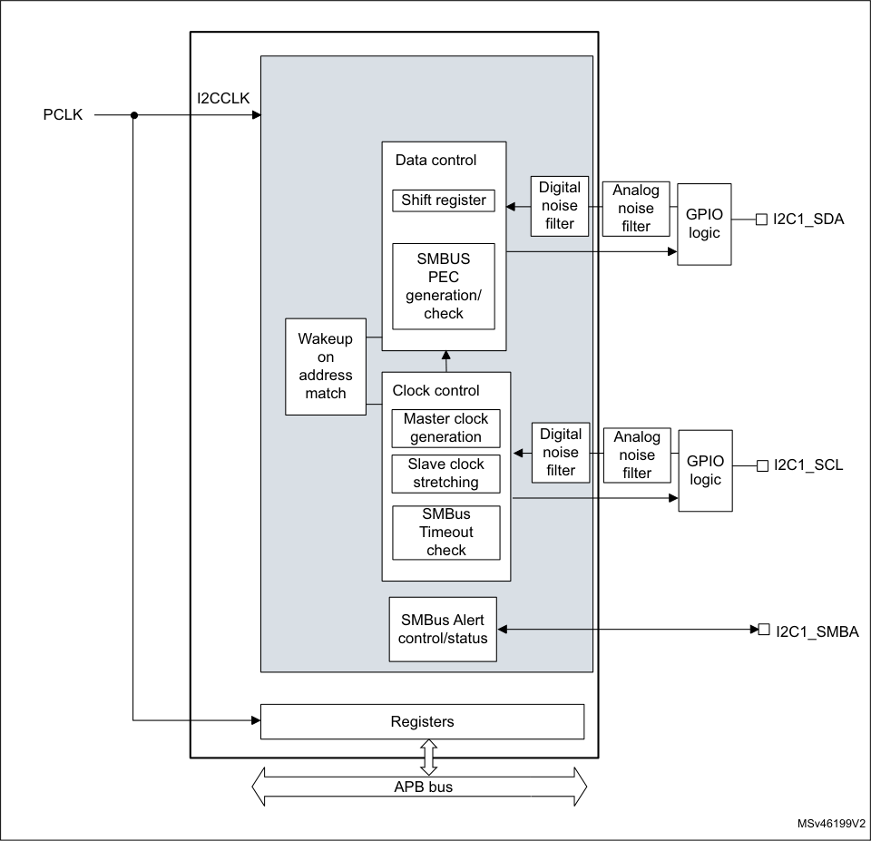
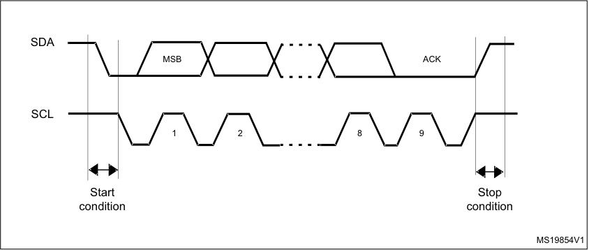
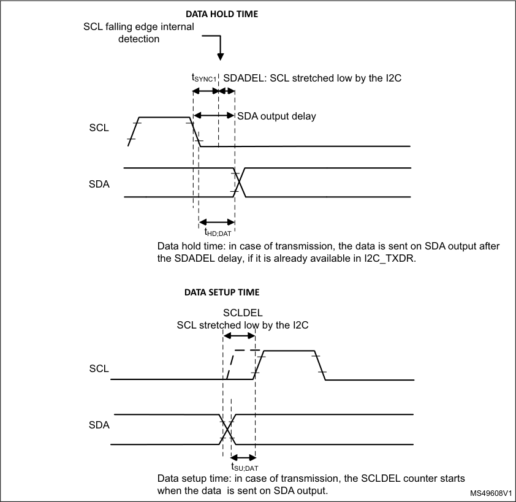
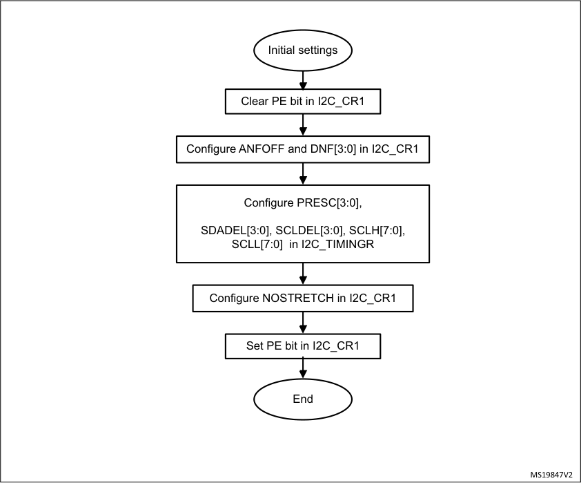
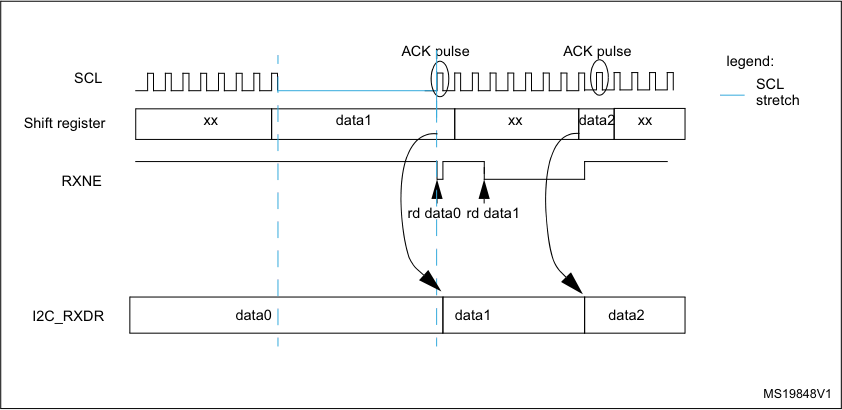
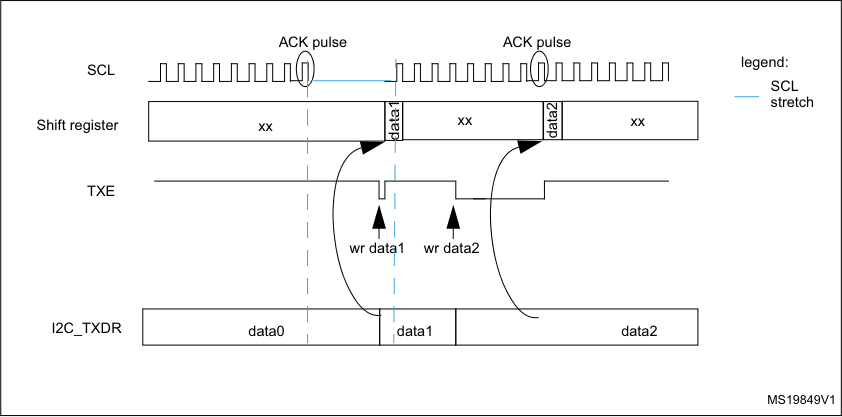

# RM0377 STM32L0x1 — Pages 551–600

**RM0377** **Real-time clock (RTC)**

_Note:_ _After a system reset, the application can read the INITS flag in the RTC_ISR register to_
_check if the calendar has been initialized or not. If this flag equals 0, the calendar has not_
_been initialized since the year field is set at its RTC domain reset default value (0x00)._

_To read the calendar after initialization, the software must first check that the RSF flag is set_
_in the RTC_ISR register._

For code example, refer to _A.13.1: RTC calendar configuration code example_ .

**Daylight saving time**

The daylight saving time management is performed through bits SUB1H, ADD1H, and BKP
of the RTC_CR register.

Using SUB1H or ADD1H, the software can subtract or add one hour to the calendar in one
single operation without going through the initialization procedure.

In addition, the software can use the BKP bit to memorize this operation.

**Programming the alarm**

A similar procedure must be followed to program or update the programmable alarms. The
procedure below is given for Alarm A but can be translated in the same way for Alarm B.

1. Clear ALRAE in RTC_CR to disable Alarm A.

2. Program the Alarm A registers (RTC_ALRMASSR/RTC_ALRMAR).

3. Set ALRAE in the RTC_CR register to enable Alarm A again.

_Note:_ _Each change of the RTC_CR register is taken into account after around 2 RTCCLK clock_
_cycles due to clock synchronization._

For code example, refer to _A.13.2: RTC alarm configuration code example_ .

**Programming the wakeup timer**

The following sequence is required to configure or change the wakeup timer auto-reload
value (WUT[15:0] in RTC_WUTR):

1. Clear WUTE in RTC_CR to disable the wakeup timer.

2. Poll WUTWF until it is set in RTC_ISR to make sure the access to wakeup auto-reload
counter and to WUCKSEL[2:0] bits is allowed. It takes around 2 RTCCLK clock cycles
(due to clock synchronization).

3. Program the wakeup auto-reload value WUT[15:0], and the wakeup clock selection
(WUCKSEL[2:0] bits in RTC_CR). Set WUTE in RTC_CR to enable the timer again.
The wakeup timer restarts down-counting. The WUTWF bit is cleared up to 2 RTCCLK
clock cycles after WUTE is cleared, due to clock synchronization.

For code example, refer to _A.13.3: RTC WUT configuration code example_ .

**22.4.8** **Reading the calendar**

**When BYPSHAD control bit is cleared in the RTC_CR register**

To read the RTC calendar registers (RTC_SSR, RTC_TR and RTC_DR) properly, the APB1
clock frequency (f PCLK ) must be equal to or greater than seven times the RTC clock
frequency (f RTCCLK ). This ensures a secure behavior of the synchronization mechanism.

RM0377 Rev 10 551/905

587

--- end of page=550 ---

**Real-time clock (RTC)** **RM0377**

If the APB1 clock frequency is less than seven times the RTC clock frequency, the software
must read the calendar time and date registers twice. If the second read of the RTC_TR
gives the same result as the first read, this ensures that the data is correct. Otherwise a third
read access must be done. In any case the APB1 clock frequency must never be lower than
the RTC clock frequency.

The RSF bit is set in RTC_ISR register each time the calendar registers are copied into the
RTC_SSR, RTC_TR and RTC_DR shadow registers. The copy is performed every
RTCCLK cycle. To ensure consistency between the 3 values, reading either RTC_SSR or
RTC_TR locks the values in the higher-order calendar shadow registers until RTC_DR is
read. In case the software makes read accesses to the calendar in a time interval smaller
than 1 RTCCLK period: RSF must be cleared by software after the first calendar read, and
then the software must wait until RSF is set before reading again the RTC_SSR, RTC_TR
and RTC_DR registers.

After waking up from low-power mode (Stop or Standby), RSF must be cleared by software.
The software must then wait until it is set again before reading the RTC_SSR, RTC_TR and
RTC_DR registers.

The RSF bit must be cleared after wakeup and not before entering low-power mode.

After a system reset, the software must wait until RSF is set before reading the RTC_SSR,
RTC_TR and RTC_DR registers. Indeed, a system reset resets the shadow registers to
their default values.

After an initialization (refer to _Calendar initialization and configuration on page 550_ ): the
software must wait until RSF is set before reading the RTC_SSR, RTC_TR and RTC_DR
registers.

After synchronization (refer to _Section 22.4.10: RTC synchronization_ ): the software must
wait until RSF is set before reading the RTC_SSR, RTC_TR and RTC_DR registers.

For code example, refer to _A.13.4: RTC read calendar code example_ .

**When the BYPSHAD control bit is set in the RTC_CR register (bypass shadow**
**registers)**

Reading the calendar registers gives the values from the calendar counters directly, thus
eliminating the need to wait for the RSF bit to be set. This is especially useful after exiting
from low-power modes (STOP or Standby), since the shadow registers are not updated
during these modes.

When the BYPSHAD bit is set to 1, the results of the different registers might not be
coherent with each other if an RTCCLK edge occurs between two read accesses to the
registers. Additionally, the value of one of the registers may be incorrect if an RTCCLK edge
occurs during the read operation. The software must read all the registers twice, and then
compare the results to confirm that the data is coherent and correct. Alternatively, the
software can just compare the two results of the least-significant calendar register.

_Note:_ _While BYPSHAD=1, instructions which read the calendar registers require one extra APB_
_cycle to complete._

**22.4.9** **Resetting the RTC**

The calendar shadow registers (RTC_SSR, RTC_TR and RTC_DR) and some bits of the
RTC status register (RTC_ISR) are reset to their default values by all available system reset

sources.

552/905 RM0377 Rev 10

--- end of page=551 ---

**RM0377** **Real-time clock (RTC)**

On the contrary, the following registers are reset to their default values by a RTC domain
reset and are not affected by a system reset: the RTC current calendar registers, the RTC
control register (RTC_CR), the prescaler register (RTC_PRER), the RTC calibration register
(RTC_CALR), the RTC shift register (RTC_SHIFTR), the RTC timestamp registers
(RTC_TSSSR, RTC_TSTR and RTC_TSDR), the RTC tamper configuration register
(RTC_TAMPCR), the RTC backup registers (RTC_BKPxR), the wakeup timer register
(RTC_WUTR), the Alarm A and Alarm B registers (RTC_ALRMASSR/RTC_ALRMAR and
RTC_ALRMBSSR/RTC_ALRMBR), and the Option register (RTC_OR).

In addition, when it is clocked by the LSE, the RTC keeps on running under system reset if
the reset source is different from the RTC domain reset one (refer to the RTC clock section
of the Reset and clock controller for details on the list of RTC clock sources not affected by
system reset). When a RTC domain reset occurs, the RTC is stopped and all the RTC
registers are set to their reset values.

**22.4.10** **RTC synchronization**

The RTC can be synchronized to a remote clock with a high degree of precision. After
reading the sub-second field (RTC_SSR or RTC_TSSSR), a calculation can be made of the
precise offset between the times being maintained by the remote clock and the RTC. The
RTC can then be adjusted to eliminate this offset by “shifting” its clock by a fraction of a
second using RTC_SHIFTR.

RTC_SSR contains the value of the synchronous prescaler counter. This allows one to
calculate the exact time being maintained by the RTC down to a resolution of
1 / (PREDIV_S + 1) seconds. As a consequence, the resolution can be improved by
increasing the synchronous prescaler value (PREDIV_S[14:0]. The maximum resolution
allowed (30.52 μs with a 32768 Hz clock) is obtained with PREDIV_S set to 0x7FFF.

However, increasing PREDIV_S means that PREDIV_A must be decreased in order to
maintain the synchronous prescaler output at 1 Hz. In this way, the frequency of the
asynchronous prescaler output increases, which may increase the RTC dynamic
consumption.

The RTC can be finely adjusted using the RTC shift control register (RTC_SHIFTR). Writing
to RTC_SHIFTR can shift (either delay or advance) the clock by up to a second with a
resolution of 1 / (PREDIV_S + 1) seconds. The shift operation consists of adding the
SUBFS[14:0] value to the synchronous prescaler counter SS[15:0]: this will delay the clock.
If at the same time the ADD1S bit is set, this results in adding one second and at the same
time subtracting a fraction of second, so this will advance the clock.

**Caution:** Before initiating a shift operation, the user must check that SS[15] = 0 in order to ensure that
no overflow will occur.

As soon as a shift operation is initiated by a write to the RTC_SHIFTR register, the SHPF
flag is set by hardware to indicate that a shift operation is pending. This bit is cleared by
hardware as soon as the shift operation has completed.

**Caution:** This synchronization feature is not compatible with the reference clock detection feature:
firmware must not write to RTC_SHIFTR when REFCKON=1.

**22.4.11** **RTC reference clock detection**

The update of the RTC calendar can be synchronized to a reference clock, RTC_REFIN,
which is usually the mains frequency (50 or 60 Hz). The precision of the RTC_REFIN
reference clock should be higher than the 32.768 kHz LSE clock. When the RTC_REFIN

RM0377 Rev 10 553/905

587

--- end of page=552 ---

**Real-time clock (RTC)** **RM0377**

detection is enabled (REFCKON bit of RTC_CR set to 1), the calendar is still clocked by the
LSE, and RTC_REFIN is used to compensate for the imprecision of the calendar update
frequency (1 Hz).

Each 1 Hz clock edge is compared to the nearest RTC_REFIN clock edge (if one is found
within a given time window). In most cases, the two clock edges are properly aligned. When
the 1 Hz clock becomes misaligned due to the imprecision of the LSE clock, the RTC shifts
the 1 Hz clock a bit so that future 1 Hz clock edges are aligned. Thanks to this mechanism,
the calendar becomes as precise as the reference clock.

The RTC detects if the reference clock source is present by using the 256 Hz clock
(ck_apre) generated from the 32.768 kHz quartz. The detection is performed during a time
window around each of the calendar updates (every 1 s). The window equals 7 ck_apre
periods when detecting the first reference clock edge. A smaller window of 3 ck_apre
periods is used for subsequent calendar updates.

Each time the reference clock is detected in the window, the synchronous prescaler which
outputs the ck_spre clock is forced to reload. This has no effect when the reference clock
and the 1 Hz clock are aligned because the prescaler is being reloaded at the same
moment. When the clocks are not aligned, the reload shifts future 1 Hz clock edges a little
for them to be aligned with the reference clock.

If the reference clock halts (no reference clock edge occurred during the 3 ck_apre window),
the calendar is updated continuously based solely on the LSE clock. The RTC then waits for
the reference clock using a large 7 ck_apre period detection window centered on the
ck_spre edge.

When the RTC_REFIN detection is enabled, PREDIV_A and PREDIV_S must be set to their
default values:

      - PREDIV_A = 0x007F

      - PREVID_S = 0x00FF

_Note:_ _RTC_REFIN clock detection is not available in Standby mode._

**22.4.12** **RTC smooth digital calibration**

The RTC frequency can be digitally calibrated with a resolution of about 0.954 ppm with a
range from -487.1 ppm to +488.5 ppm. The correction of the frequency is performed using
series of small adjustments (adding and/or subtracting individual RTCCLK pulses). These
adjustments are fairly well distributed so that the RTC is well calibrated even when observed
over short durations of time.

The smooth digital calibration is performed during a cycle of about 2 [20] RTCCLK pulses, or
32 seconds when the input frequency is 32768 Hz. This cycle is maintained by a 20-bit
counter, cal_cnt[19:0], clocked by RTCCLK.

The smooth calibration register (RTC_CALR) specifies the number of RTCCLK clock cycles
to be masked during the 32-second cycle:

      - Setting the bit CALM[0] to 1 causes exactly one pulse to be masked during the 32

second cycle.

      - Setting CALM[1] to 1 causes two additional cycles to be masked

      - Setting CALM[2] to 1 causes four additional cycles to be masked

      - and so on up to CALM[8] set to 1 which causes 256 clocks to be masked.

554/905 RM0377 Rev 10

--- end of page=553 ---

**RM0377** **Real-time clock (RTC)**

_Note:_ _CALM[8:0] (RTC_CALR) specifies the number of RTCCLK pulses to be masked during the_
_32-second cycle. Setting the bit CALM[0] to ‘1’ causes exactly one pulse to be masked_
_during the 32-second cycle at the moment when cal_cnt[19:0] is 0x80000; CALM[1]=1_
_causes two other cycles to be masked (when cal_cnt is 0x40000 and 0xC0000); CALM[2]=1_
_causes four other cycles to be masked (cal_cnt = 0x20000/0x60000/0xA0000/ 0xE0000);_
_and so on up to CALM[8]=1 which causes 256 clocks to be masked (cal_cnt = 0xXX800)._

While CALM allows the RTC frequency to be reduced by up to 487.1 ppm with fine
resolution, the bit CALP can be used to increase the frequency by 488.5 ppm. Setting CALP
to ‘1’ effectively inserts an extra RTCCLK pulse every 2 [11] RTCCLK cycles, which means
that 512 clocks are added during every 32-second cycle.

Using CALM together with CALP, an offset ranging from -511 to +512 RTCCLK cycles can
be added during the 32-second cycle, which translates to a calibration range of -487.1 ppm
to +488.5 ppm with a resolution of about 0.954 ppm.

The formula to calculate the effective calibrated frequency (F CAL ) given the input frequency
(F RTCCLK ) is as follows:

F CAL = F RTCCLK x [1 + (CALP x 512 - CALM) / (2 [20] + CALM - CALP x 512)]

**Calibration when PREDIV_A<3**

The CALP bit can not be set to 1 when the asynchronous prescaler value (PREDIV_A bits in
RTC_PRER register) is less than 3. If CALP was already set to 1 and PREDIV_A bits are
set to a value less than 3, CALP is ignored and the calibration operates as if CALP was
equal to 0.

To perform a calibration with PREDIV_A less than 3, the synchronous prescaler value
(PREDIV_S) should be reduced so that each second is accelerated by 8 RTCCLK clock
cycles, which is equivalent to adding 256 clock cycles every 32 seconds. As a result,
between 255 and 256 clock pulses (corresponding to a calibration range from 243.3 to
244.1 ppm) can effectively be added during each 32-second cycle using only the CALM bits.

With a nominal RTCCLK frequency of 32768 Hz, when PREDIV_A equals 1 (division factor
of 2), PREDIV_S should be set to 16379 rather than 16383 (4 less). The only other
interesting case is when PREDIV_A equals 0, PREDIV_S should be set to 32759 rather
than 32767 (8 less).

If PREDIV_S is reduced in this way, the formula given the effective frequency of the

calibrated input clock is as follows:

F CAL = F RTCCLK x [1 + (256 - CALM) / (2 [20] + CALM - 256)]

In this case, CALM[7:0] equals 0x100 (the midpoint of the CALM range) is the correct
setting if RTCCLK is exactly 32768.00 Hz.

**Verifying the RTC calibration**

RTC precision is ensured by measuring the precise frequency of RTCCLK and calculating
the correct CALM value and CALP values. An optional 1 Hz output is provided to allow
applications to measure and verify the RTC precision.

Measuring the precise frequency of the RTC over a limited interval can result in a
measurement error of up to 2 RTCCLK clock cycles over the measurement period,
depending on how the digital calibration cycle is aligned with the measurement period.

RM0377 Rev 10 555/905

587

--- end of page=554 ---

**Real-time clock (RTC)** **RM0377**

However, this measurement error can be eliminated if the measurement period is the same
length as the calibration cycle period. In this case, the only error observed is the error due to
the resolution of the digital calibration.

      - By default, the calibration cycle period is 32 seconds.

Using this mode and measuring the accuracy of the 1 Hz output over exactly 32 seconds
guarantees that the measure is within 0.477 ppm (0.5 RTCCLK cycles over 32 seconds, due
to the limitation of the calibration resolution).

      - CALW16 bit of the RTC_CALR register can be set to 1 to force a 16- second calibration
cycle period.

In this case, the RTC precision can be measured during 16 seconds with a maximum error
of 0.954 ppm (0.5 RTCCLK cycles over 16 seconds). However, since the calibration
resolution is reduced, the long term RTC precision is also reduced to 0.954 ppm: CALM[0]
bit is stuck at 0 when CALW16 is set to 1.

      - CALW8 bit of the RTC_CALR register can be set to 1 to force a 8- second calibration
cycle period.

In this case, the RTC precision can be measured during 8 seconds with a maximum error of
1.907 ppm (0.5 RTCCLK cycles over 8s). The long term RTC precision is also reduced to
1.907 ppm: CALM[1:0] bits are stuck at 00 when CALW8 is set to 1.

**Re-calibration on-the-fly**

The calibration register (RTC_CALR) can be updated on-the-fly while RTC_ISR/INITF=0, by
using the follow process:

1. Poll the RTC_ISR/RECALPF (re-calibration pending flag).

2. If it is set to 0, write a new value to RTC_CALR, if necessary. RECALPF is then
automatically set to 1

3. Within three ck_apre cycles after the write operation to RTC_CALR, the new calibration
settings take effect.

For code example, refer to _A.13.5: RTC calibration code example_ .

**22.4.13** **Time-stamp function**

Time-stamp is enabled by setting the TSE bit of RTC_CR register to 1.

The calendar is saved in the time-stamp registers (RTC_TSSSR, RTC_TSTR, RTC_TSDR)
when a time-stamp event is detected on the RTC_TS pin.

When a time-stamp event occurs, the time-stamp flag bit (TSF) in RTC_ISR register is set.

By setting the TSIE bit in the RTC_CR register, an interrupt is generated when a time-stamp
event occurs.

If a new time-stamp event is detected while the time-stamp flag (TSF) is already set, the
time-stamp overflow flag (TSOVF) flag is set and the time-stamp registers (RTC_TSTR and
RTC_TSDR) maintain the results of the previous event.

556/905 RM0377 Rev 10

--- end of page=555 ---

**RM0377** **Real-time clock (RTC)**

_Note:_ _TSF is set 2 ck_apre cycles after the time-stamp event occurs due to synchronization_

_process._

_There is no delay in the setting of TSOVF. This means that if two time-stamp events are_
_close together, TSOVF can be seen as '1' while TSF is still '0'. As a consequence, it is_
_recommended to poll TSOVF only after TSF has been set._

**Caution:** If a time-stamp event occurs immediately after the TSF bit is supposed to be cleared, then
both TSF and TSOVF bits are set.To avoid masking a time-stamp event occurring at the
same moment, the application must not write ‘0’ into TSF bit unless it has already read it to
‘1’.

Optionally, a tamper event can cause a time-stamp to be recorded. See the description of
the TAMPTS control bit in _Section 22.7.16: RTC tamper configuration register_
_(RTC_TAMPCR)_ .

**22.4.14** **Tamper detection**

The RTC_TAMPx input events can be configured either for edge detection, or for level
detection with filtering.

The tamper detection can be configured for the following purposes:

      - erase the RTC backup registers (default configuration)

      - generate an interrupt, capable to wakeup from Stop and Standby modes

      - generate a hardware trigger for the low-power timers

**RTC backup registers**

The backup registers (RTC_BKPxR) are not reset by system reset or when the device
wakes up from Standby mode.

The backup registers are reset when a tamper detection event occurs (see _Section 22.7.20:_
_RTC backup registers (RTC_BKPxR)_ and _Tamper detection initialization on page 557_ )
except if the TAMPxNOERASE bit is set, or if TAMPxMF is set in the RTC_TAMPCR
register.

**Tamper detection initialization**

Each input can be enabled by setting the corresponding TAMPxE bits to 1 in the
RTC_TAMPCR register.

Each RTC_TAMPx tamper detection input is associated with a flag TAMPxF in the RTC_ISR
register.

When TAMPxMF is cleared:

The TAMPxF flag is asserted after the tamper event on the pin, with the latency provided
below:

      - 3 ck_apre cycles when TAMPFLT differs from 0x0 (Level detection with filtering)

      - 3 ck_apre cycles when TAMPTS=1 (Timestamp on tamper event)

      - No latency when TAMPFLT=0x0 (Edge detection) and TAMPTS=0

A new tamper occurring on the same pin during this period and as long as TAMPxF is set
cannot be detected.

When TAMPxMF is set:

RM0377 Rev 10 557/905

587

--- end of page=556 ---

**Real-time clock (RTC)** **RM0377**

A new tamper occurring on the same pin cannot be detected during the latency described
above and 2.5 ck_rtc additional cycles.

By setting the TAMPIE bit in the RTC_TAMPCR register, an interrupt is generated when a
tamper detection event occurs (when TAMPxF is set). Setting TAMPIE is not allowed when
one or more TAMPxMF is set.

When TAMPIE is cleared, each tamper pin event interrupt can be individually enabled by
setting the corresponding TAMPxIE bit in the RTC_TAMPCR register. Setting TAMPxIE is
not allowed when the corresponding TAMPxMF is set.

**Trigger output generation on tamper event**

The tamper event detection can be used as trigger input by the low-power timers.

When TAMPxMF bit in cleared in RTC_TAMPCR register, the TAMPxF flag must be cleared
by software in order to allow a new tamper detection on the same pin.

When TAMPxMF bit is set, the TAMPxF flag is masked, and kept cleared in RTC_ISR
register. This configuration allows to trig automatically the low-power timers in Stop mode,
without requiring the system wakeup to perform the TAMPxF clearing. In this case, the
backup registers are not cleared.

**Timestamp on tamper event**

With TAMPTS set to ‘1’, any tamper event causes a timestamp to occur. In this case, either
the TSF bit or the TSOVF bit are set in RTC_ISR, in the same manner as if a normal
timestamp event occurs. The affected tamper flag register TAMPxF is set at the same time
that TSF or TSOVF is set.

**Edge detection on tamper inputs**

If the TAMPFLT bits are “00”, the RTC_TAMPx pins generate tamper detection events when
either a rising edge or a falling edge is observed depending on the corresponding
TAMPxTRG bit. The internal pull-up resistors on the RTC_TAMPx inputs are deactivated
when edge detection is selected.

**Caution:** When using the edge detection, it is recommended to check by software the tamper pin
level just after enabling the tamper detection (by reading the GPIO registers), and before
writing sensitive values in the backup registers, to ensure that an active edge did not occur
before enabling the tamper event detection.
When TAMPFLT="00" and TAMPxTRG = 0 (rising edge detection), a tamper event may be
detected by hardware if the tamper input is already at high level before enabling the tamper
detection.

After a tamper event has been detected and cleared, the RTC_TAMPx should be disabled
and then re-enabled (TAMPxE set to 1) before re-programming the backup registers
(RTC_BKPxR). This prevents the application from writing to the backup registers while the
RTC_TAMPx input value still indicates a tamper detection. This is equivalent to a level
detection on the RTC_TAMPx input.

**Level detection with filtering on RTC_TAMPx inputs**

Level detection with filtering is performed by setting TAMPFLT to a non-zero value. A tamper
detection event is generated when either 2, 4, or 8 (depending on TAMPFLT) consecutive
samples are observed at the level designated by the TAMPxTRG bits.

558/905 RM0377 Rev 10

--- end of page=557 ---

**RM0377** **Real-time clock (RTC)**

The RTC_TAMPx inputs are precharged through the I/O internal pull-up resistance before
its state is sampled, unless disabled by setting TAMPPUDIS to 1,The duration of the
precharge is determined by the TAMPPRCH bits, allowing for larger capacitances on the
RTC_TAMPx inputs.

The trade-off between tamper detection latency and power consumption through the pull-up
can be optimized by using TAMPFREQ to determine the frequency of the sampling for level
detection.

_Note:_ _Refer to the datasheets for the electrical characteristics of the pull-up resistors._

For code example, refer to _A.13.6: RTC tamper and time stamp configuration code example_ .

**22.4.15** **Calibration clock output**

When the COE bit is set to 1 in the RTC_CR register, a reference clock is provided on the
RTC_CALIB device output.

If the COSEL bit in the RTC_CR register is reset and PREDIV_A = 0x7F, the RTC_CALIB
frequency is f RTCCLK /64 . This corresponds to a calibration output at 512 Hz for an RTCCLK
frequency at 32.768 kHz. The RTC_CALIB duty cycle is irregular: there is a light jitter on
falling edges. It is therefore recommended to use rising edges.

When COSEL is set and “PREDIV_S+1” is a non-zero multiple of 256 (i.e: PREDIV_S[7:0] =
0xFF), the RTC_CALIB frequency is f RTCCLK /(256 * (PREDIV_A+1)). This corresponds to a
calibration output at 1 Hz for prescaler default values (PREDIV_A = Ox7F, PREDIV_S =
0xFF), with an RTCCLK frequency at 32.768 kHz. The 1 Hz output is affected when a shift
operation is on going and may toggle during the shift operation (SHPF=1).

_Note:_ _When COSEL bit is cleared, the RTC_CALIB output is the output of the 6th stage of the_
_asynchronous prescaler._

_When COSEL bit is set, the RTC_CALIB output is the output of the 8th stage of the_
_synchronous prescaler._

For code example, refer to _A.13.7: RTC tamper and time stamp code example_ .

**22.4.16** **Alarm output**

The OSEL[1:0] control bits in the RTC_CR register are used to activate the alarm output
RTC_ALARM, and to select the function which is output. These functions reflect the
contents of the corresponding flags in the RTC_ISR register.

The polarity of the output is determined by the POL control bit in RTC_CR so that the
opposite of the selected flag bit is output when POL is set to 1.

**Alarm output**

The RTC_ALARM pin can be configured in output open drain or output push-pull using the
control bit RTC_ALARM_TYPE in the RTC_OR register.

_Note:_ _Once the RTC_ALARM output is enabled, it has priority over RTC_CALIB (COE bit is don't_
_care and must be kept cleared)._

RM0377 Rev 10 559/905

587

--- end of page=558 ---

**Real-time clock (RTC)** **RM0377**

###### **22.5 RTC low-power modes**

**Table 97. Effect of low-power modes on RTC**

|Mode|Description|
|---|---|
|Sleep|No effect RTC interrupts cause the device to exit the Sleep mode.|
|Stop|The RTC remains active when the RTC clock source is LSE or LSI. RTC alarm, RTC tamper event, RTC timestamp event, and RTC Wakeup cause the device to exit the Stop mode.|
|Standby|The RTC remains active when the RTC clock source is LSE or LSI. RTC alarm, RTC tamper event, RTC timestamp event, and RTC Wakeup cause the device to exit the Standby mode.|

###### **22.6 RTC interrupts**

All RTC interrupts are connected to the EXTI controller. Refer to _Section 12.5: EXTI_
_registers._

To enable RTC interrupt(s), the following sequence is required:

1. Configure and enable the NVIC line(s) corresponding to the RTC event(s) in interrupt
mode and select the rising edge sensitivity.

2. Configure and enable the RTC IRQ channel in the NVIC.

3. Configure the RTC to generate RTC interrupt(s).

**Table 98. Interrupt control bits**

|Interrupt event|Event flag|Enable control bit|Exit from Sleep mode|Exit from Stop mode|Exit from Standby mode|
|---|---|---|---|---|---|
|Alarm A|ALRAF|ALRAIE|Yes|Yes(1)|Yes(1)|
|Alarm B|ALRBF|ALRBIE|Yes|Yes(1)|Yes(1)|
|RTC_TS input (timestamp)|TSF|TSIE|Yes|Yes(1)|Yes(1)|
|RTC_TAMP1 input detection|TAMP1F|TAMPIE|Yes|Yes(1)|Yes(1)|
|RTC_TAMP2 input detection|TAMP2F|TAMPIE|Yes|Yes(1)|Yes(1)|
|Wakeup timer interrupt|WUTF|WUTIE|Yes|Yes(1)|Yes(1)|

1. Wakeup from STOP and Standby modes is possible only when the RTC clock source is LSE or LSI.

560/905 RM0377 Rev 10

--- end of page=559 ---

**RM0377** **Real-time clock (RTC)**

###### **22.7 RTC registers**

Refer to _Section 1.2 on page 45_ of the reference manual for a list of abbreviations used in
register descriptions.

The peripheral registers can be accessed by words (32-bit).

**22.7.1** **RTC time register (RTC_TR)**

The RTC_TR is the calendar time shadow register. This register must be written in
initialization mode only. Refer to _Calendar initialization and configuration on page 550_ and
_Reading the calendar on page 551_ .

This register is write protected. The write access procedure is described in _RTC register_
_write protection on page 550_ .

Address offset: 0x00

RTC domain reset value: 0x0000 0000

System reset: 0x0000 0000 when BYPSHAD = 0. Not affected when BYPSHAD = 1.

|31|30|29|28|27|26|25|24|23|22|21 20|Col12|19 18 17 16|Col14|Col15|Col16|
|---|---|---|---|---|---|---|---|---|---|---|---|---|---|---|---|
|Res.|Res.|Res.|Res.|Res.|Res.|Res.|Res.|Res.|PM|HT[1:0]|HT[1:0]|HU[3:0]|HU[3:0]|HU[3:0]|HU[3:0]|
||||||||||rw|rw|rw|rw|rw|rw|rw|

|15|14 13 12|Col3|Col4|11 10 9 8|Col6|Col7|Col8|7|6 5 4|Col11|Col12|3 2 1 0|Col14|Col15|Col16|
|---|---|---|---|---|---|---|---|---|---|---|---|---|---|---|---|
|Res.|MNT[2:0]|MNT[2:0]|MNT[2:0]|MNU[3:0]|MNU[3:0]|MNU[3:0]|MNU[3:0]|Res.|ST[2:0]|ST[2:0]|ST[2:0]|SU[3:0]|SU[3:0]|SU[3:0]|SU[3:0]|
||rw|rw|rw|rw|rw|rw|rw||rw|rw|rw|rw|rw|rw|rw|

Bits 31:23 Reserved, must be kept at reset value.

Bit 22 **PM** : AM/PM notation

0: AM or 24-hour format

1: PM

Bits 21:20 **HT[1:0]** : Hour tens in BCD format

Bits 19:16 **HU[3:0]** : Hour units in BCD format

Bit 15 Reserved, must be kept at reset value.

Bits 14:12 **MNT[2:0]** : Minute tens in BCD format

Bits 11:8 **MNU[3:0]** : Minute units in BCD format

Bit 7 Reserved, must be kept at reset value.

Bits 6:4 **ST[2:0]** : Second tens in BCD format

Bits 3:0 **SU[3:0]** : Second units in BCD format

RM0377 Rev 10 561/905

587

--- end of page=560 ---

**Real-time clock (RTC)** **RM0377**

**22.7.2** **RTC date register (RTC_DR)**

The RTC_DR is the calendar date shadow register. This register must be written in
initialization mode only. Refer to _Calendar initialization and configuration on page 550_ and
_Reading the calendar on page 551_ .

This register is write protected. The write access procedure is described in _RTC register_
_write protection on page 550_ .

Address offset: 0x04

RTC domain reset value: 0x0000 2101

System reset: 0x0000 2101 when BYPSHAD = 0. Not affected when BYPSHAD = 1.

|31|30|29|28|27|26|25|24|23 22 21 20|Col10|Col11|Col12|19 18 17 16|Col14|Col15|Col16|
|---|---|---|---|---|---|---|---|---|---|---|---|---|---|---|---|
|Res.|Res.|Res.|Res.|Res.|Res.|Res.|Res.|YT[3:0]|YT[3:0]|YT[3:0]|YT[3:0]|YU[3:0]|YU[3:0]|YU[3:0]|YU[3:0]|
|||||||||rw|rw|rw|rw|rw|rw|rw|rw|

|15 14 13|Col2|Col3|12|11 10 9 8|Col6|Col7|Col8|7|6|5 4|Col12|3 2 1 0|Col14|Col15|Col16|
|---|---|---|---|---|---|---|---|---|---|---|---|---|---|---|---|
|WDU[2:0]|WDU[2:0]|WDU[2:0]|MT|MU[3:0]|MU[3:0]|MU[3:0]|MU[3:0]|Res.|Res.|DT[1:0]|DT[1:0]|DU[3:0]|DU[3:0]|DU[3:0]|DU[3:0]|
|rw|rw|rw|rw|rw|rw|rw|rw|||rw|rw|rw|rw|rw|rw|

Bits 31:24 Reserved, must be kept at reset value.

Bits 23:20 **YT[3:0]** : Year tens in BCD format

Bits 19:16 **YU[3:0]** : Year units in BCD format

Bits 15:13 **WDU[2:0]** : Week day units

000: forbidden

001: Monday

...

111: Sunday

Bit 12 **MT** : Month tens in BCD format

Bits 11:8 **MU[3:0]** : Month units in BCD format

Bits 7:6 Reserved, must be kept at reset value.

Bits 5:4 **DT[1:0]** : Date tens in BCD format

Bits 3:0 **DU[3:0]** : Date units in BCD format

562/905 RM0377 Rev 10

--- end of page=561 ---

**RM0377** **Real-time clock (RTC)**

**22.7.3** **RTC control register (RTC_CR)**

Address offset: 0x08

RTC domain reset value: 0x0000 0000

System reset: not affected

|31|30|29|28|27|26|25|24|23|22 21|Col11|20|19|18|17|16|
|---|---|---|---|---|---|---|---|---|---|---|---|---|---|---|---|
|Res.|Res.|Res.|Res.|Res.|Res.|Res.|Res.|COE|OSEL[1:0]|OSEL[1:0]|POL|COSEL|BKP|SUB1H|ADD1H|
|||||||||rw|rw|rw|rw|rw|rw|w|w|

|15|14|13|12|11|10|9|8|7|6|5|4|3|2 1 0|Col15|Col16|
|---|---|---|---|---|---|---|---|---|---|---|---|---|---|---|---|
|TSIE|WUTIE|ALRBIE|ALRAIE|TSE|WUTE|ALRBE|ALRAE|Res.|FMT|BYPS HAD|REFCKON|TSEDGE|WUCKSEL[2:0]|WUCKSEL[2:0]|WUCKSEL[2:0]|
|rw|rw|rw|rw|rw|rw|rw|rw||rw|rw|rw|rw|rw|rw|rw|

Bits 31:24 Reserved, must be kept at reset value.

Bit 23 **COE** : Calibration output enable

This bit enables the RTC_CALIB output

0: Calibration output disabled
1: Calibration output enabled

Bits 22:21 **OSEL[1:0]** : Output selection

These bits are used to select the flag to be routed to RTC_ALARM output

00: Output disabled
01: Alarm A output enabled
10: Alarm B output enabled
11: Wakeup output enabled

Bit 20 **POL** : Output polarity

This bit is used to configure the polarity of RTC_ALARM output

0: The pin is high when ALRAF/ALRBF/WUTF is asserted (depending on OSEL[1:0])
1: The pin is low when ALRAF/ALRBF/WUTF is asserted (depending on OSEL[1:0]).

Bit 19 **COSEL** : Calibration output selection

When COE=1, this bit selects which signal is output on RTC_CALIB.

0: Calibration output is 512 Hz (with default prescaler setting)
1: Calibration output is 1 Hz (with default prescaler setting)

These frequencies are valid for RTCCLK at 32.768 kHz and prescalers at their default values
(PREDIV_A=127 and PREDIV_S=255). Refer to _Section 22.4.15: Calibration clock output_

Bit 18 **BKP** : Backup

This bit can be written by the user to memorize whether the daylight saving time change has
been performed or not.

Bit 17 **SUB1H** : _S_ ubtract 1 hour (winter time change)

When this bit is set, 1 hour is subtracted to the calendar time if the current hour is not 0. This
bit is always read as 0.

Setting this bit has no effect when current hour is 0.

0: No effect

1: Subtracts 1 hour to the current time. This can be used for winter time change outside
initialization mode.

RM0377 Rev 10 563/905

587

--- end of page=562 ---

**Real-time clock (RTC)** **RM0377**

Bit 16 **ADD1H** : Add 1 hour (summer time change)

When this bit is set, 1 hour is added to the calendar time. This bit is always read as 0.

0: No effect

1: Adds 1 hour to the current time. This can be used for summer time change outside
initialization mode.

Bit 15 **TSIE** : Time-stamp interrupt enable

0: Time-stamp Interrupt disable
1: Time-stamp Interrupt enable

Bit 14 **WUTIE** : Wakeup timer interrupt enable

0: Wakeup timer interrupt disabled
1: Wakeup timer interrupt enabled

Bit 13 **ALRBIE** : _Alarm B interrupt enable_

0: Alarm B Interrupt disable
1: Alarm B Interrupt enable

Bit 12 **ALRAIE** : Alarm A interrupt enable

0: Alarm A interrupt disabled
1: Alarm A interrupt enabled

Bit 11 **TSE** : timestamp enable

0: timestamp disable
1: timestamp enable

Bit 10 **WUTE** : Wakeup timer enable

0: Wakeup timer disabled
1: Wakeup timer enabled

_Note: When the wakeup timer is disabled, wait for WUTWF=1 before enabling it again._

Bit 9 **ALRBE** : _Alarm B enable_

0: Alarm B disabled

1: Alarm B enabled

Bit 8 **ALRAE:** Alarm A enable

0: Alarm A disabled

1: Alarm A enabled

Bit 7 Reserved, must be kept at reset value.

Bit 6 **FMT** : Hour format

0: 24 hour/day format
1: AM/PM hour format

Bit 5 **BYPSHAD** : Bypass the shadow registers

0: Calendar values (when reading from RTC_SSR, RTC_TR, and RTC_DR) are taken from
the shadow registers, which are updated once every two RTCCLK cycles.
1: Calendar values (when reading from RTC_SSR, RTC_TR, and RTC_DR) are taken
directly from the calendar counters.

_Note: If the frequency of the APB1 clock is less than seven times the frequency of RTCCLK,_
_BYPSHAD must be set to ‘1’._

564/905 RM0377 Rev 10

--- end of page=563 ---

**RM0377** **Real-time clock (RTC)**

Bit 4 **REFCKON** : RTC_REFIN reference clock detection enable (50 or 60 Hz)

0: RTC_REFIN detection disabled
1: RTC_REFIN detection enabled

_Note: PREDIV_S must be 0x00FF._

Bit 3 **TSEDGE** : Time-stamp event active edge

0: RTC_TS input rising edge generates a time-stamp event
1: RTC_TS input falling edge generates a time-stamp event
TSE must be reset when TSEDGE is changed to avoid unwanted TSF setting.

Bits 2:0 **WUCKSEL[2:0]** : Wakeup clock selection

000: RTC/16 clock is selected

001: RTC/8 clock is selected

010: RTC/4 clock is selected

011: RTC/2 clock is selected

10x: ck_spre (usually 1 Hz) clock is selected
11x: ck_spre (usually 1 Hz) clock is selected and 2 [16] is added to the WUT counter value
(see note below)

_Note:_ _Bits 7, 6 and 4 of this register can be written in initialization mode only (RTC_ISR/INITF = 1)._

_WUT = Wakeup unit counter value. WUT = (0x0000 to 0xFFFF) + 0x10000 added when_
_WUCKSEL[2:1 = 11]._

_Bits 2 to 0 of this register can be written only when RTC_CR WUTE bit = 0 and RTC_ISR_
_WUTWF bit = 1._

_It is recommended not to change the hour during the calendar hour increment as it could_
_mask the incrementation of the calendar hour._

_ADD1H and SUB1H changes are effective in the next second._

_This register is write protected. The write access procedure is described in RTC register_
_write protection on page 550._

**Caution:** TSE must be reset when TSEDGE is changed to avoid spuriously setting of TSF.

RM0377 Rev 10 565/905

587

--- end of page=564 ---

**Real-time clock (RTC)** **RM0377**

**22.7.4** **RTC initialization and status register (RTC_ISR)**

This register is write protected (except for RTC_ISR[13:8] bits). The write access procedure
is described in _RTC register write protection on page 550_ .

Address offset: 0x0C

RTC domain reset value: 0x0000 0007

System reset: not affected except INIT, INITF, and RSF bits which are cleared to ‘0’

|31|30|29|28|27|26|25|24|23|22|21|20|19|18|17|16|
|---|---|---|---|---|---|---|---|---|---|---|---|---|---|---|---|
|Res.|Res.|Res.|Res.|Res.|Res.|Res.|Res.|Res.|Res.|Res.|Res.|Res.|Res.|Res.|RECALPF|
||||||||||||||||r|

|15|14|13|12|11|10|9|8|7|6|5|4|3|2|1|0|
|---|---|---|---|---|---|---|---|---|---|---|---|---|---|---|---|
|TAMP3F|TAMP2F|TAMP1F|TSOVF|TSF|WUTF|ALRBF|ALRAF|INIT|INITF|RSF|INITS|SHPF|WUTWF|ALRB WF|ALRAWF|
|rc_w0|rc_w0|rc_w0|rc_w0|rc_w0|rc_w0|rc_w0|rc_w0|rw|r|rc_w0|r|r|r|r|r|

Bits 31:17 Reserved, must be kept at reset value.

Bit 16 **RECALPF** : Recalibration pending Flag

The RECALPF status flag is automatically set to ‘1’ when software writes to the RTC_CALR
register, indicating that the RTC_CALR register is blocked. When the new calibration settings
are taken into account, this bit returns to ‘0’. Refer to _Re-calibration on-the-fly_ .

Bit 15 **TAMP3F** : RTC_TAMP3 detection flag

This flag is set by hardware when a tamper detection event is detected on the RTC_TAMP3
input.
It is cleared by software writing 0

Bit 14 **TAMP2F** : RTC_TAMP2 detection flag

This flag is set by hardware when a tamper detection event is detected on the RTC_TAMP2
input.

It is cleared by software writing 0

Bit 13 **TAMP1F** : RTC_TAMP1 detection flag

This flag is set by hardware when a tamper detection event is detected on the RTC_TAMP1
input.

It is cleared by software writing 0

Bit 12 **TSOVF** : Time-stamp overflow flag

This flag is set by hardware when a time-stamp event occurs while TSF is already set.

This flag is cleared by software by writing 0. It is recommended to check and then clear
TSOVF only after clearing the TSF bit. Otherwise, an overflow might not be noticed if a timestamp event occurs immediately before the TSF bit is cleared.

Bit 11 **TSF** : Time-stamp flag

This flag is set by hardware when a time-stamp event occurs.

This flag is cleared by software by writing 0.

Bit 10 **WUTF** : Wakeup timer flag

This flag is set by hardware when the wakeup auto-reload counter reaches 0.
This flag is cleared by software by writing 0.
This flag must be cleared by software at least 1.5 RTCCLK periods before WUTF is set to 1
again.

566/905 RM0377 Rev 10

--- end of page=565 ---

**RM0377** **Real-time clock (RTC)**

Bit 9 **ALRBF** : Alarm B flag

This flag is set by hardware when the time/date registers (RTC_TR and RTC_DR) match the
Alarm B register (RTC_ALRMBR).
This flag is cleared by software by writing 0.

Bit 8 **ALRAF** : Alarm A flag

This flag is set by hardware when the time/date registers (RTC_TR and RTC_DR) match the
Alarm A register (RTC_ALRMAR).

This flag is cleared by software by writing 0.

Bit 7 **INIT** : Initialization mode

0: Free running mode
1: Initialization mode used to program time and date register (RTC_TR and RTC_DR), and
prescaler register (RTC_PRER). Counters are stopped and start counting from the new
value when INIT is reset.

Bit 6 **INITF** : Initialization flag

When this bit is set to 1, the RTC is in initialization state, and the time, date and prescaler
registers can be updated.

0: Calendar registers update is not allowed
1: Calendar registers update is allowed

Bit 5 **RSF** : Registers synchronization flag

This bit is set by hardware each time the calendar registers are copied into the shadow
registers (RTC_SSR, RTC_TR and RTC_DR). This bit is cleared by hardware in initialization
mode, while a shift operation is pending (SHPF=1), or when in bypass shadow register mode
(BYPSHAD=1). This bit can also be cleared by software.

It is cleared either by software or by hardware in initialization mode.

0: Calendar shadow registers not yet synchronized
1: Calendar shadow registers synchronized

Bit 4 **INITS** : Initialization status flag

This bit is set by hardware when the calendar year field is different from 0 (RTC domain reset
state).

0: Calendar has not been initialized

1: Calendar has been initialized

Bit 3 **SHPF** : Shift operation pending

0: No shift operation is pending
1: A shift operation is pending

This flag is set by hardware as soon as a shift operation is initiated by a write to the
RTC_SHIFTR register. It is cleared by hardware when the corresponding shift operation has
been executed. Writing to the SHPF bit has no effect.

RM0377 Rev 10 567/905

587

--- end of page=566 ---

**Real-time clock (RTC)** **RM0377**

Bit 2 **WUTWF** : Wakeup timer write flag

This bit is set by hardware up to 2 RTCCLK cycles after the WUTE bit has been set to 0 in
RTC_CR, and is cleared up to 2 RTCCLK cycles after the WUTE bit has been set to 1. The
wakeup timer values can be changed when WUTE bit is cleared and WUTWF is set.
0: Wakeup timer configuration update not allowed
1: Wakeup timer configuration update allowed

Bit 1 **ALRBWF** : Alarm B write flag

This bit is set by hardware when Alarm B values can be changed, after the ALRBE bit has
been set to 0 in RTC_CR.
It is cleared by hardware in initialization mode.
0: Alarm B update not allowed
1: Alarm B update allowed

Bit 0 **ALRAWF** : Alarm A write flag

This bit is set by hardware when Alarm A values can be changed, after the ALRAE bit has
been set to 0 in RTC_CR.

It is cleared by hardware in initialization mode.

0: Alarm A update not allowed
1: Alarm A update allowed

_Note:_ _The bits ALRAF, ALRBF, WUTF and TSF are cleared 2 APB clock cycles after programming_
_them to 0._

568/905 RM0377 Rev 10

--- end of page=567 ---

**RM0377** **Real-time clock (RTC)**

**22.7.5** **RTC prescaler register (RTC_PRER)**

This register must be written in initialization mode only. The initialization must be performed
in two separate write accesses. Refer to _Calendar initialization and configuration on_
_page 550_ .

This register is write protected. The write access procedure is described in _RTC register_
_write protection on page 550_ .

Address offset: 0x10

RTC domain reset value: 0x007F 00FF

System reset: not affected

|31|30|29|28|27|26|25|24|23|22 21 20 19 18 17 16|Col11|Col12|Col13|Col14|Col15|Col16|
|---|---|---|---|---|---|---|---|---|---|---|---|---|---|---|---|
|Res.|Res.|Res.|Res.|Res.|Res.|Res.|Res.|Res.|PREDIV_A[6:0]|PREDIV_A[6:0]|PREDIV_A[6:0]|PREDIV_A[6:0]|PREDIV_A[6:0]|PREDIV_A[6:0]|PREDIV_A[6:0]|
||||||||||rw|rw|rw|rw|rw|rw|rw|

|15|14 13 12 11 10 9 8 7 6 5 4 3 2 1 0|Col3|Col4|Col5|Col6|Col7|Col8|Col9|Col10|Col11|Col12|Col13|Col14|Col15|Col16|
|---|---|---|---|---|---|---|---|---|---|---|---|---|---|---|---|
|Res.|PREDIV_S[14:0]|PREDIV_S[14:0]|PREDIV_S[14:0]|PREDIV_S[14:0]|PREDIV_S[14:0]|PREDIV_S[14:0]|PREDIV_S[14:0]|PREDIV_S[14:0]|PREDIV_S[14:0]|PREDIV_S[14:0]|PREDIV_S[14:0]|PREDIV_S[14:0]|PREDIV_S[14:0]|PREDIV_S[14:0]|PREDIV_S[14:0]|
||rw|rw|rw|rw|rw|rw|rw|rw|rw|rw|rw|rw|rw|rw|rw|

Bits 31:23 Reserved, must be kept at reset value.

Bits 22:16 **PREDIV_A[6:0]** : Asynchronous prescaler factor

This is the asynchronous division factor:
ck_apre frequency = RTCCLK frequency/(PREDIV_A+1)

Bit 15 Reserved, must be kept at reset value.

Bits 14:0 **PREDIV_S[14:0]** : Synchronous prescaler factor

This is the synchronous division factor:

ck_spre frequency = ck_apre frequency/(PREDIV_S+1)

RM0377 Rev 10 569/905

587

--- end of page=568 ---

**Real-time clock (RTC)** **RM0377**

**22.7.6** **RTC wakeup timer register (RTC_WUTR)**

This register can be written only when WUTWF is set to 1 in RTC_ISR.

This register is write protected. The write access procedure is described in _RTC register_
_write protection on page 550_ .

Address offset: 0x14

RTC domain reset value: 0x0000 FFFF

System reset: not affected

|31|30|29|28|27|26|25|24|23|22|21|20|19|18|17|16|
|---|---|---|---|---|---|---|---|---|---|---|---|---|---|---|---|
|Res.|Res.|Res.|Res.|Res.|Res.|Res.|Res.|Res.|Res.|Res.|Res.|Res.|Res.|Res.|Res.|
|||||||||||||||||

|15 14 13 12 11 10 9 8 7 6 5 4 3 2 1 0|Col2|Col3|Col4|Col5|Col6|Col7|Col8|Col9|Col10|Col11|Col12|Col13|Col14|Col15|Col16|
|---|---|---|---|---|---|---|---|---|---|---|---|---|---|---|---|
|WUT[15:0]|WUT[15:0]|WUT[15:0]|WUT[15:0]|WUT[15:0]|WUT[15:0]|WUT[15:0]|WUT[15:0]|WUT[15:0]|WUT[15:0]|WUT[15:0]|WUT[15:0]|WUT[15:0]|WUT[15:0]|WUT[15:0]|WUT[15:0]|
|rw|rw|rw|rw|rw|rw|rw|rw|rw|rw|rw|rw|rw|rw|rw|rw|

Bits 31:16 Reserved, must be kept at reset value.

Bits 15:0 **WUT[15:0]** : Wakeup auto-reload value bits

When the wakeup timer is enabled (WUTE set to 1), the WUTF flag is set every (WUT[15:0]
+ 1) ck_wut cycles. The ck_wut period is selected through WUCKSEL[2:0] bits of the
RTC_CR register
When WUCKSEL[2] = 1, the wakeup timer becomes 17-bits and WUCKSEL[1] effectively
becomes WUT[16] the most-significant bit to be reloaded into the timer.
The first assertion of WUTF occurs (WUT+1) ck_wut cycles after WUTE is set. Setting
WUT[15:0] to 0x0000 with WUCKSEL[2:0] =011 (RTCCLK/2) is forbidden.

570/905 RM0377 Rev 10

--- end of page=569 ---

**RM0377** **Real-time clock (RTC)**

**22.7.7** **RTC alarm A register (RTC_ALRMAR)**

This register can be written only when ALRAWF is set to 1 in RTC_ISR, or in initialization
mode.

This register is write protected. The write access procedure is described in _RTC register_
_write protection on page 550_ .

Address offset: 0x1C

RTC domain reset value: 0x0000 0000

System reset: not affected

|31|30|29 28|Col4|27 26 25 24|Col6|Col7|Col8|23|22|21 20|Col12|19 18 17 16|Col14|Col15|Col16|
|---|---|---|---|---|---|---|---|---|---|---|---|---|---|---|---|
|MSK4|WDSEL|DT[1:0]|DT[1:0]|DU[3:0]|DU[3:0]|DU[3:0]|DU[3:0]|MSK3|PM|HT[1:0]|HT[1:0]|HU[3:0]|HU[3:0]|HU[3:0]|HU[3:0]|
|rw|rw|rw|rw|rw|rw|rw|rw|rw|rw|rw|rw|rw|rw|rw|rw|

|15|14 13 12|Col3|Col4|11 10 9 8|Col6|Col7|Col8|7|6 5 4|Col11|Col12|3 2 1 0|Col14|Col15|Col16|
|---|---|---|---|---|---|---|---|---|---|---|---|---|---|---|---|
|MSK2|MNT[2:0]|MNT[2:0]|MNT[2:0]|MNU[3:0]|MNU[3:0]|MNU[3:0]|MNU[3:0]|MSK1|ST[2:0]|ST[2:0]|ST[2:0]|SU[3:0]|SU[3:0]|SU[3:0]|SU[3:0]|
|rw|rw|rw|rw|rw|rw|rw|rw|rw|rw|rw|rw|rw|rw|rw|rw|

Bit 31 **MSK4** : Alarm A date mask

0: Alarm A set if the date/day match
1: Date/day don’t care in Alarm A comparison

Bit 30 **WDSEL** : Week day selection

0: DU[3:0] represents the date units
1: DU[3:0] represents the week day. DT[1:0] is don’t care.

Bits 29:28 **DT[1:0]** : Date tens in BCD format.

Bits 27:24 **DU[3:0]** : Date units or day in BCD format.

Bit 23 **MSK3** : Alarm A hours mask

0: Alarm A set if the hours match

1: Hours don’t care in Alarm A comparison

Bit 22 **PM:** AM/PM notation

0: AM or 24-hour format

1: PM

Bits 21:20 **HT[1:0]** : Hour tens in BCD format.

Bits 19:16 **HU[3:0]** : Hour units in BCD format.

Bit 15 **MSK2** : Alarm A minutes mask

0: Alarm A set if the minutes match

1: Minutes don’t care in Alarm A comparison

Bits 14:12 **MNT[2:0]** : Minute tens in BCD format.

Bits 11:8 **MNU[3:0]** : Minute units in BCD format.

Bit 7 **MSK1** : Alarm A seconds mask

0: Alarm A set if the seconds match

1: Seconds don’t care in Alarm A comparison

Bits 6:4 **ST[2:0]** : Second tens in BCD format.

Bits 3:0 **SU[3:0]** : Second units in BCD format.

RM0377 Rev 10 571/905

587

--- end of page=570 ---

**Real-time clock (RTC)** **RM0377**

**22.7.8** **RTC alarm B register (RTC_ALRMBR)**

This register can be written only when ALRBWF is set to 1 in RTC_ISR, or in initialization
mode.

This register is write protected. The write access procedure is described in _RTC register_
_write protection on page 550_ .

Address offset: 0x20

RTC domain reset value: 0x0000 0000

System reset: not affected

|31|30|29 28|Col4|27 26 25 24|Col6|Col7|Col8|23|22|21 20|Col12|19 18 17 16|Col14|Col15|Col16|
|---|---|---|---|---|---|---|---|---|---|---|---|---|---|---|---|
|MSK4|WDSEL|DT[1:0]|DT[1:0]|DU[3:0]|DU[3:0]|DU[3:0]|DU[3:0]|MSK3|PM|HT[1:0]|HT[1:0]|HU[3:0]|HU[3:0]|HU[3:0]|HU[3:0]|
|rw|rw|rw|rw|rw|rw|rw|rw|rw|rw|rw|rw|rw|rw|rw|rw|

|15|14 13 12|Col3|Col4|11 10 9 8|Col6|Col7|Col8|7|6 5 4|Col11|Col12|3 2 1 0|Col14|Col15|Col16|
|---|---|---|---|---|---|---|---|---|---|---|---|---|---|---|---|
|MSK2|MNT[2:0]|MNT[2:0]|MNT[2:0]|MNU[3:0]|MNU[3:0]|MNU[3:0]|MNU[3:0]|MSK1|ST[2:0]|ST[2:0]|ST[2:0]|SU[3:0]|SU[3:0]|SU[3:0]|SU[3:0]|
|rw|rw|rw|rw|rw|rw|rw|rw|rw|rw|rw|rw|rw|rw|rw|rw|

Bit 31 **MSK4** : Alarm B date mask

0: Alarm B set if the date and day match
1: Date and day don’t care in Alarm B comparison

Bit 30 **WDSEL** : Week day selection

0: DU[3:0] represents the date units
1: DU[3:0] represents the week day. DT[1:0] is don’t care.

Bits 29:28 **DT[1:0]** : Date tens in BCD format

Bits 27:24 **DU[3:0]** : Date units or day in BCD format

Bit 23 **MSK3** : Alarm B hours mask

0: Alarm B set if the hours match

1: Hours don’t care in Alarm B comparison

Bit 22 **PM:** AM/PM notation

0: AM or 24-hour format

1: PM

Bits 21:20 **HT[1:0]** : Hour tens in BCD format

Bits 19:16 **HU[3:0]** : Hour units in BCD format

Bit 15 **MSK2** : Alarm B minutes mask

0: Alarm B set if the minutes match

1: Minutes don’t care in Alarm B comparison

Bits 14:12 **MNT[2:0]** : Minute tens in BCD format

Bits 11:8 **MNU[3:0]** : Minute units in BCD format

Bit 7 **MSK1** : Alarm B seconds mask

0: Alarm B set if the seconds match

1: Seconds don’t care in Alarm B comparison

Bits 6:4 **ST[2:0]** : Second tens in BCD format

Bits 3:0 **SU[3:0]** : Second units in BCD format

572/905 RM0377 Rev 10

--- end of page=571 ---

**RM0377** **Real-time clock (RTC)**

**22.7.9** **RTC write protection register (RTC_WPR)**

Address offset: 0x24

Reset value: 0x0000 0000

|31|30|29|28|27|26|25|24|23|22|21|20|19|18|17|16|
|---|---|---|---|---|---|---|---|---|---|---|---|---|---|---|---|
|Res.|Res.|Res.|Res.|Res.|Res.|Res.|Res.|Res.|Res.|Res.|Res.|Res.|Res.|Res.|Res.|
|||||||||||||||||

|15|14|13|12|11|10|9|8|7 6 5 4 3 2 1 0|Col10|Col11|Col12|Col13|Col14|Col15|Col16|
|---|---|---|---|---|---|---|---|---|---|---|---|---|---|---|---|
|Res.|Res.|Res.|Res.|Res.|Res.|Res.|Res.|KEY[7:0]|KEY[7:0]|KEY[7:0]|KEY[7:0]|KEY[7:0]|KEY[7:0]|KEY[7:0]|KEY[7:0]|
|||||||||w|w|w|w|w|w|w|w|

Bits 31:8 Reserved, must be kept at reset value.

Bits 7:0 **KEY[7:0]** : Write protection key

This byte is written by software.

Reading this byte always returns 0x00.

Refer to _RTC register write protection_ for a description of how to unlock RTC register write
protection.

**22.7.10** **RTC sub second register (RTC_SSR)**

Address offset: 0x28

RTC domain reset value: 0x0000 0000

System reset: 0x0000 0000 when BYPSHAD = 0. Not affected when BYPSHAD = 1.

|31|30|29|28|27|26|25|24|23|22|21|20|19|18|17|16|
|---|---|---|---|---|---|---|---|---|---|---|---|---|---|---|---|
|Res.|Res.|Res.|Res.|Res.|Res.|Res.|Res.|Res.|Res.|Res.|Res.|Res.|Res.|Res.|Res.|
|||||||||||||||||

|15 14 13 12 11 10 9 8 7 6 5 4 3 2 1 0|Col2|Col3|Col4|Col5|Col6|Col7|Col8|Col9|Col10|Col11|Col12|Col13|Col14|Col15|Col16|
|---|---|---|---|---|---|---|---|---|---|---|---|---|---|---|---|
|SS[15:0]|SS[15:0]|SS[15:0]|SS[15:0]|SS[15:0]|SS[15:0]|SS[15:0]|SS[15:0]|SS[15:0]|SS[15:0]|SS[15:0]|SS[15:0]|SS[15:0]|SS[15:0]|SS[15:0]|SS[15:0]|
|r|r|r|r|r|r|r|r|r|r|r|r|r|r|r|r|

Bits 31:16 Reserved, must be kept at reset value.

Bits 15:0 **SS[15:0]** : Sub second value

SS[15:0] is the value in the synchronous prescaler counter. The fraction of a second is given by
the formula below:

Second fraction = (PREDIV_S - SS) / (PREDIV_S + 1)

_Note: SS can be larger than PREDIV_S only after a shift operation. In that case, the correct_
_time/date is one second less than as indicated by RTC_TR/RTC_DR._

RM0377 Rev 10 573/905

587

--- end of page=572 ---

**Real-time clock (RTC)** **RM0377**

**22.7.11** **RTC shift control register (RTC_SHIFTR)**

This register is write protected. The write access procedure is described in _RTC register_
_write protection on page 550_ .

Address offset: 0x2C

RTC domain reset value: 0x0000 0000

System reset: not affected

|31|30|29|28|27|26|25|24|23|22|21|20|19|18|17|16|
|---|---|---|---|---|---|---|---|---|---|---|---|---|---|---|---|
|ADD1S|Res.|Res.|Res.|Res.|Res.|Res.|Res.|Res.|Res.|Res.|Res.|Res.|Res.|Res.|Res.|
|w||||||||||||||||

|15|14 13 12 11 10 9 8 7 6 5 4 3 2 1 0|Col3|Col4|Col5|Col6|Col7|Col8|Col9|Col10|Col11|Col12|Col13|Col14|Col15|Col16|
|---|---|---|---|---|---|---|---|---|---|---|---|---|---|---|---|
|Res.|SUBFS[14:0]|SUBFS[14:0]|SUBFS[14:0]|SUBFS[14:0]|SUBFS[14:0]|SUBFS[14:0]|SUBFS[14:0]|SUBFS[14:0]|SUBFS[14:0]|SUBFS[14:0]|SUBFS[14:0]|SUBFS[14:0]|SUBFS[14:0]|SUBFS[14:0]|SUBFS[14:0]|
||w|w|w|w|w|w|w|w|w|w|w|w|w|w|w|

Bit 31 **ADD1S** : Add one second

0: No effect

1: Add one second to the clock/calendar

This bit is write only and is always read as zero. Writing to this bit has no effect when a shift
operation is pending (when SHPF=1, in RTC_ISR).

This function is intended to be used with SUBFS (see description below) in order to effectively
add a fraction of a second to the clock in an atomic operation.

Bits 30:15 Reserved, must be kept at reset value.

Bits 14:0 **SUBFS[14:0]** : Subtract a fraction of a second

These bits are write only and is always read as zero. Writing to this bit has no effect when a
shift operation is pending (when SHPF=1, in RTC_ISR).

The value which is written to SUBFS is added to the synchronous prescaler counter. Since this
counter counts down, this operation effectively subtracts from (delays) the clock by:

Delay (seconds) = SUBFS / (PREDIV_S + 1)

A fraction of a second can effectively be added to the clock (advancing the clock) when the
ADD1S function is used in conjunction with SUBFS, effectively advancing the clock by:

Advance (seconds) = (1 - (SUBFS / (PREDIV_S + 1))).

_Note: Writing to SUBFS causes RSF to be cleared. Software can then wait until RSF=1 to be_
_sure that the shadow registers have been updated with the shifted time._

574/905 RM0377 Rev 10

--- end of page=573 ---

**RM0377** **Real-time clock (RTC)**

**22.7.12** **RTC timestamp time register (RTC_TSTR)**

The content of this register is valid only when TSF is set to 1 in RTC_ISR. It is cleared when
TSF bit is reset.

Address offset: 0x30

RTC domain reset value: 0x0000 0000

System reset: not affected

|31|30|29|28|27|26|25|24|23|22|21 20|Col12|19 18 17 16|Col14|Col15|Col16|
|---|---|---|---|---|---|---|---|---|---|---|---|---|---|---|---|
|Res.|Res.|Res.|Res.|Res.|Res.|Res.|Res.|Res.|PM|HT[1:0]|HT[1:0]|HU[3:0]|HU[3:0]|HU[3:0]|HU[3:0]|
||||||||||r|r|r|r|r|r|r|

|15|14 13 12|Col3|Col4|11 10 9 8|Col6|Col7|Col8|7|6 5 4|Col11|Col12|3 2 1 0|Col14|Col15|Col16|
|---|---|---|---|---|---|---|---|---|---|---|---|---|---|---|---|
|Res.|MNT[2:0]|MNT[2:0]|MNT[2:0]|MNU[3:0]|MNU[3:0]|MNU[3:0]|MNU[3:0]|Res.|ST[2:0]|ST[2:0]|ST[2:0]|SU[3:0]|SU[3:0]|SU[3:0]|SU[3:0]|
||r|r|r|r|r|r|r||r|r|r|r|r|r|r|

Bits 31:23 Reserved, must be kept at reset value.

Bit 22 **PM:** AM/PM notation

0: AM or 24-hour format

1: PM

Bits 21:20 **HT[1:0]** : Hour tens in BCD format.

Bits 19:16 **HU[3:0]** : Hour units in BCD format.

Bit 15 Reserved, must be kept at reset value.

Bits 14:12 **MNT[2:0]** : Minute tens in BCD format.

Bits 11:8 **MNU[3:0]** : Minute units in BCD format.

Bit 7 Reserved, must be kept at reset value.

Bits 6:4 **ST[2:0]** : Second tens in BCD format.

Bits 3:0 **SU[3:0]** : Second units in BCD format.

RM0377 Rev 10 575/905

587

--- end of page=574 ---

**Real-time clock (RTC)** **RM0377**

**22.7.13** **RTC timestamp date register (RTC_TSDR)**

The content of this register is valid only when TSF is set to 1 in RTC_ISR. It is cleared when
TSF bit is reset.

Address offset: 0x34

RTC domain reset value: 0x0000 0000

System reset: not affected

|31|30|29|28|27|26|25|24|23|22|21|20|19|18|17|16|
|---|---|---|---|---|---|---|---|---|---|---|---|---|---|---|---|
|Res.|Res.|Res.|Res.|Res.|Res.|Res.|Res.|Res.|Res.|Res.|Res.|Res.|Res.|Res.|Res.|
|||||||||||||||||

|15 14 13|Col2|Col3|12|11 10 9 8|Col6|Col7|Col8|7|6|5 4|Col12|3 2 1 0|Col14|Col15|Col16|
|---|---|---|---|---|---|---|---|---|---|---|---|---|---|---|---|
|WDU[2:0]|WDU[2:0]|WDU[2:0]|MT|MU[3:0]|MU[3:0]|MU[3:0]|MU[3:0]|Res.|Res.|DT[1:0]|DT[1:0]|DU[3:0]|DU[3:0]|DU[3:0]|DU[3:0]|
|r|r|r|r|r|r|r|r|||r|r|r|r|r|r|

Bits 31:16 Reserved, must be kept at reset value.

Bits 15:13 **WDU[2:0]** : Week day units

Bit 12 **MT** : Month tens in BCD format

Bits 11:8 **MU[3:0]** : Month units in BCD format

Bits 7:6 Reserved, must be kept at reset value.

Bits 5:4 **DT[1:0]** : Date tens in BCD format

Bits 3:0 **DU[3:0]** : Date units in BCD format

576/905 RM0377 Rev 10

--- end of page=575 ---

**RM0377** **Real-time clock (RTC)**

**22.7.14** **RTC time-stamp sub second register (RTC_TSSSR)**

The content of this register is valid only when RTC_ISR/TSF is set. It is cleared when the
RTC_ISR/TSF bit is reset.

Address offset: 0x38

RTC domain reset value: 0x0000 0000

System reset: not affected

|31|30|29|28|27|26|25|24|23|22|21|20|19|18|17|16|
|---|---|---|---|---|---|---|---|---|---|---|---|---|---|---|---|
|Res.|Res.|Res.|Res.|Res.|Res.|Res.|Res.|Res.|Res.|Res.|Res.|Res.|Res.|Res.|Res.|
|||||||||||||||||

|15 14 13 12 11 10 9 8 7 6 5 4 3 2 1 0|Col2|Col3|Col4|Col5|Col6|Col7|Col8|Col9|Col10|Col11|Col12|Col13|Col14|Col15|Col16|
|---|---|---|---|---|---|---|---|---|---|---|---|---|---|---|---|
|SS[15:0]|SS[15:0]|SS[15:0]|SS[15:0]|SS[15:0]|SS[15:0]|SS[15:0]|SS[15:0]|SS[15:0]|SS[15:0]|SS[15:0]|SS[15:0]|SS[15:0]|SS[15:0]|SS[15:0]|SS[15:0]|
|r|r|r|r|r|r|r|r|r|r|r|r|r|r|r|r|

Bits 31:16 Reserved, must be kept at reset value.

Bits 15:0 **SS[15:0]** : Sub second value

SS[15:0] is the value of the synchronous prescaler counter when the timestamp event
occurred.

RM0377 Rev 10 577/905

587

--- end of page=576 ---

**Real-time clock (RTC)** **RM0377**

**22.7.15** **RTC calibration register (RTC_CALR)**

This register is write protected. The write access procedure is described in _RTC register_
_write protection on page 550_ .

Address offset: 0x3C

RTC domain reset value: 0x0000 0000

System reset: not affected

|31|30|29|28|27|26|25|24|23|22|21|20|19|18|17|16|
|---|---|---|---|---|---|---|---|---|---|---|---|---|---|---|---|
|Res.|Res.|Res.|Res.|Res.|Res.|Res.|Res.|Res.|Res.|Res.|Res.|Res.|Res.|Res.|Res.|
|||||||||||||||||

|15|14|13|12|11|10|9|8 7 6 5 4 3 2 1 0|Col9|Col10|Col11|Col12|Col13|Col14|Col15|Col16|
|---|---|---|---|---|---|---|---|---|---|---|---|---|---|---|---|
|CALP|CALW8|CALW 16|Res.|Res.|Res.|Res.|CALM[8:0]|CALM[8:0]|CALM[8:0]|CALM[8:0]|CALM[8:0]|CALM[8:0]|CALM[8:0]|CALM[8:0]|CALM[8:0]|
|rw|rw|rw|||||rw|rw|rw|rw|rw|rw|rw|rw|rw|

Bits 31:16 Reserved, must be kept at reset value.

Bit 15 **CALP** : Increase frequency of RTC by 488.5 ppm

0: No RTCCLK pulses are added.
1: One RTCCLK pulse is effectively inserted every 2 [11] pulses (frequency increased by
488.5 ppm).

This feature is intended to be used in conjunction with CALM, which lowers the frequency of
the calendar with a fine resolution. if the input frequency is 32768 Hz, the number of RTCCLK
pulses added during a 32-second window is calculated as follows: (512 * CALP) - CALM.

Refer to _Section 22.4.12: RTC smooth digital calibration_ .

Bit 14 **CALW8:** Use an 8-second calibration cycle period

When CALW8 is set to ‘1’, the 8-second calibration cycle period is selected.

_Note: CALM[1:0] are stuck at “00” when CALW8=’1’. Refer to Section 22.4.12: RTC smooth_
_digital calibration._

Bit 13 **CALW16:** Use a 16-second calibration cycle period

When CALW16 is set to ‘1’, the 16-second calibration cycle period is selected.This bit must
not be set to ‘1’ if CALW8=1.

_Note: CALM[0] is stuck at ‘0’ when CALW16=’1’. Refer to Section 22.4.12: RTC smooth_
_digital calibration._

Bits 12:9 Reserved, must be kept at reset value.

Bits 8:0 **CALM[8:0]** : Calibration minus
The frequency of the calendar is reduced by masking CALM out of 2 [20] RTCCLK pulses (32
seconds if the input frequency is 32768 Hz). This decreases the frequency of the calendar
with a resolution of 0.9537 ppm.

To increase the frequency of the calendar, this feature should be used in conjunction with
CALP. See _Section 22.4.12: RTC smooth digital calibration on page 554_ .

578/905 RM0377 Rev 10

--- end of page=577 ---

**RM0377** **Real-time clock (RTC)**

**22.7.16** **RTC tamper configuration register (RTC_TAMPCR)**

Address offset: 0x40

RTC domain reset value: 0x0000 0000

System reset: not affected

|31|30|29|28|27|26|25|24|23|22|21|20|19|18|17|16|
|---|---|---|---|---|---|---|---|---|---|---|---|---|---|---|---|
|Res.|Res.|Res.|Res.|Res.|Res.|Res.|TAMP3 MF|TAMP3 NO ERASE|TAMP3 IE|TAMP2 MF|TAMP2 NO ERASE|TAMP2 IE|TAMP1 MF|TAMP1 NO ERASE|TAMP1 IE|
||||||||rw|rw|rw|rw|rw|rw|rw|rw|rw|

|15|14 13|Col3|12 11|Col5|10 9 8|Col7|Col8|7|6|5|4|3|2|1|0|
|---|---|---|---|---|---|---|---|---|---|---|---|---|---|---|---|
|TAMP PUDIS|TAMPPRCH [1:0]|TAMPPRCH [1:0]|TAMPFLT[1:0]|TAMPFLT[1:0]|TAMPFREQ[2:0]|TAMPFREQ[2:0]|TAMPFREQ[2:0]|TAMP TS|TAMP3 TRG|TAMP3 E|TAMP2 TRG|TAMP2 E|TAMPI E|TAMP1 TRG|TAMP1 E|
|rw|rw|rw|rw|rw|rw|rw|rw|rw|rw|rw|rw|rw|rw|rw|rw|

Bits 31:25 Reserved, must be kept at reset value.

Bit 24 **TAMP3MF** : Tamper 3 mask flag

0: Tamper 3 event generates a trigger event and TAMP3F must be cleared by software to
allow next tamper event detection.
1: Tamper 3 event generates a trigger event. TAMP3F is masked and internally cleared by
hardware. The backup registers are not erased.

_Note: The Tamper 3 interrupt must not be enabled when TAMP3MF is set._

Bit 23 **TAMP3NOERASE** : Tamper 3 no erase

0: Tamper 3 event erases the backup registers.
1: Tamper 3 event does not erase the backup registers.

Bit 22 **TAMP3IE** : Tamper 3 interrupt enable

0: Tamper 3 interrupt is disabled if TAMPIE = 0.
1: Tamper 3 interrupt enabled.

Bit 21 **TAMP2MF** : Tamper 2 mask flag

0: Tamper 2 event generates a trigger event and TAMP2F must be cleared by software to
allow next tamper event detection.
1: Tamper 2 event generates a trigger event. TAMP2F is masked and internally cleared by
hardware. The backup registers are not erased.

_Note: The Tamper 2 interrupt must not be enabled when TAMP2MF is set._

Bit 20 **TAMP2NOERASE** : Tamper 2 no erase

0: Tamper 2 event erases the backup registers.
1: Tamper 2 event does not erase the backup registers.

Bit 19 **TAMP2IE** : Tamper 2 interrupt enable

0: Tamper 2 interrupt is disabled if TAMPIE = 0.
1: Tamper 2 interrupt enabled.

Bit 18 **TAMP1MF** : Tamper 1 mask flag

0: Tamper 1 event generates a trigger event and TAMP1F must be cleared by software to
allow next tamper event detection.
1: Tamper 1 event generates a trigger event. TAMP1F is masked and internally cleared by
hardware.The backup registers are not erased.

_Note: The Tamper 1 interrupt must not be enabled when TAMP1MF is set._

RM0377 Rev 10 579/905

587

--- end of page=578 ---

**Real-time clock (RTC)** **RM0377**

Bit 17 **TAMP1NOERASE** : Tamper 1 no erase

0: Tamper 1 event erases the backup registers.
1: Tamper 1 event does not erase the backup registers.

Bit 16 **TAMP1IE** : Tamper 1 interrupt enable

0: Tamper 1 interrupt is disabled if TAMPIE = 0.

1: Tamper 1 interrupt enabled.

Bit 15 **TAMPPUDIS** : RTC_TAMPx pull-up disable

This bit determines if each of the RTC_TAMPx pins are precharged before each sample.

0: Precharge RTC_TAMPx pins before sampling (enable internal pull-up)
1: Disable precharge of RTC_TAMPx pins.

Bits 14:13 **TAMPPRCH[1:0]** : RTC_TAMPx precharge duration

These bit determines the duration of time during which the pull-up/is activated before each
sample. TAMPPRCH is valid for each of the RTC_TAMPx inputs.

0x0: 1 RTCCLK cycle
0x1: 2 RTCCLK cycles
0x2: 4 RTCCLK cycles
0x3: 8 RTCCLK cycles

Bits 12:11 **TAMPFLT[1:0]** : RTC_TAMPx filter count

These bits determines the number of consecutive samples at the specified level (TAMP*TRG)
needed to activate a Tamper event. TAMPFLT is valid for each of the RTC_TAMPx inputs.

0x0: Tamper event is activated on edge of RTC_TAMPx input transitions to the active level
(no internal pull-up on RTC_TAMPx input).
0x1: Tamper event is activated after 2 consecutive samples at the active level.
0x2: Tamper event is activated after 4 consecutive samples at the active level.
0x3: Tamper event is activated after 8 consecutive samples at the active level.

Bits 10:8 **TAMPFREQ[2:0]** : Tamper sampling frequency

Determines the frequency at which each of the RTC_TAMPx inputs are sampled.

0x0: RTCCLK / 32768 (1 Hz when RTCCLK = 32768 Hz)
0x1: RTCCLK / 16384 (2 Hz when RTCCLK = 32768 Hz)
0x2: RTCCLK / 8192 (4 Hz when RTCCLK = 32768 Hz)
0x3: RTCCLK / 4096 (8 Hz when RTCCLK = 32768 Hz)
0x4: RTCCLK / 2048 (16 Hz when RTCCLK = 32768 Hz)
0x5: RTCCLK / 1024 (32 Hz when RTCCLK = 32768 Hz)
0x6: RTCCLK / 512 (64 Hz when RTCCLK = 32768 Hz)
0x7: RTCCLK / 256 (128 Hz when RTCCLK = 32768 Hz)

Bit 7 **TAMPTS** : Activate timestamp on tamper detection event

0: Tamper detection event does not cause a timestamp to be saved
1: Save timestamp on tamper detection event

TAMPTS is valid even if TSE=0 in the RTC_CR register.

Bit 6 **TAMP3TRG:** Active level for RTC_TAMP3 input

if TAMPFLT ≠ 00:

0: RTC_TAMP3 input staying low triggers a tamper detection event.
1: RTC_TAMP3 input staying high triggers a tamper detection event.

if TAMPFLT = 00:

0: RTC_TAMP3 input rising edge triggers a tamper detection event.
1: RTC_TAMP3 input falling edge triggers a tamper detection event.

580/905 RM0377 Rev 10

--- end of page=579 ---

**RM0377** **Real-time clock (RTC)**

Bit 5 **TAMP3E** : RTC_TAMP3 detection enable

0: RTC_TAMP3 input detection disabled
1: RTC_TAMP3 input detection enabled

Bit 4 **TAMP2TRG** : Active level for RTC_TAMP2 input

if TAMPFLT != 00:

0: RTC_TAMP2 input staying low triggers a tamper detection event.
1: RTC_TAMP2 input staying high triggers a tamper detection event.

if TAMPFLT = 00:

0: RTC_TAMP2 input rising edge triggers a tamper detection event.
1: RTC_TAMP2 input falling edge triggers a tamper detection event.

Bit 3 **TAMP2E** : RTC_TAMP2 input detection enable

0: RTC_TAMP2 detection disabled
1: RTC_TAMP2 detection enabled

Bit 2 **TAMPIE** : Tamper interrupt enable

0: Tamper interrupt disabled
1: Tamper interrupt enabled.

_Note: This bit enables the interrupt for all tamper pins events, whatever TAMPxIE level. If this_
_bit is cleared, each tamper event interrupt can be individually enabled by setting_
_TAMPxIE._

Bit 1 **TAMP1TRG** : Active level for RTC_TAMP1 input

If TAMPFLT != 00

0: RTC_TAMP1 input staying low triggers a tamper detection event.
1: RTC_TAMP1 input staying high triggers a tamper detection event.

if TAMPFLT = 00:

0: RTC_TAMP1 input rising edge triggers a tamper detection event.
1: RTC_TAMP1 input falling edge triggers a tamper detection event.

Bit 0 **TAMP1E** : RTC_TAMP1 input detection enable

0: RTC_TAMP1 detection disabled
1: RTC_TAMP1 detection enabled

**Caution:** When TAMPFLT = 0, TAMPxE must be reset when TAMPxTRG is changed to avoid
spuriously setting TAMPxF.

RM0377 Rev 10 581/905

587

--- end of page=580 ---

**Real-time clock (RTC)** **RM0377**

**22.7.17** **RTC alarm A sub second register (RTC_ALRMASSR)**

This register can be written only when ALRAE is reset in RTC_CR register, or in initialization
mode.

This register is write protected. The write access procedure is described in _RTC register_
_write protection on page 550_

Address offset: 0x44

RTC domain reset value: 0x0000 0000

System reset: not affected

|31|30|29|28|27 26 25 24|Col6|Col7|Col8|23|22|21|20|19|18|17|16|
|---|---|---|---|---|---|---|---|---|---|---|---|---|---|---|---|
|Res.|Res.|Res.|Res.|MASKSS[3:0]|MASKSS[3:0]|MASKSS[3:0]|MASKSS[3:0]|Res.|Res.|Res.|Res.|Res.|Res.|Res.|Res.|
|||||rw|rw|rw|rw|||||||||

|15|14 13 12 11 10 9 8 7 6 5 4 3 2 1 0|Col3|Col4|Col5|Col6|Col7|Col8|Col9|Col10|Col11|Col12|Col13|Col14|Col15|Col16|
|---|---|---|---|---|---|---|---|---|---|---|---|---|---|---|---|
|Res.|SS[14:0]|SS[14:0]|SS[14:0]|SS[14:0]|SS[14:0]|SS[14:0]|SS[14:0]|SS[14:0]|SS[14:0]|SS[14:0]|SS[14:0]|SS[14:0]|SS[14:0]|SS[14:0]|SS[14:0]|
||rw|rw|rw|rw|rw|rw|rw|rw|rw|rw|rw|rw|w|rw|rw|

Bits 31:28 Reserved, must be kept at reset value.

Bits 27:24 MASKSS[3:0]: Mask the most-significant bits starting at this bit

0: No comparison on sub seconds for Alarm A. The alarm is set when the seconds unit is
incremented (assuming that the rest of the fields match).
1: SS[14:1] are don’t care in Alarm A comparison. Only SS[0] is compared.
2: SS[14:2] are don’t care in Alarm A comparison. Only SS[1:0] are compared.
3: SS[14:3] are don’t care in Alarm A comparison. Only SS[2:0] are compared.

...

12: SS[14:12] are don’t care in Alarm A comparison. SS[11:0] are compared.
13: SS[14:13] are don’t care in Alarm A comparison. SS[12:0] are compared.
14: SS[14] is don’t care in Alarm A comparison. SS[13:0] are compared.
15: All 15 SS bits are compared and must match to activate alarm.
The overflow bits of the synchronous counter (bits 15) is never compared. This bit can be
different from 0 only after a shift operation.

Bits 23:15 Reserved, must be kept at reset value.

Bits 14:0 SS[14:0]: Sub seconds value

This value is compared with the contents of the synchronous prescaler counter to determine if
Alarm A is to be activated. Only bits 0 up MASKSS-1 are compared.

582/905 RM0377 Rev 10

--- end of page=581 ---

**RM0377** **Real-time clock (RTC)**

**22.7.18** **RTC alarm B sub second register (RTC_ALRMBSSR)**

This register can be written only when ALRBE is reset in RTC_CR register, or in initialization
mode.

This register is write protected.The write access procedure is described in _Section : RTC_
_register write protection_ .

Address offset: 0x48

RTC domain reset value: 0x0000 0000

System reset: not affected

|31|30|29|28|27 26 25 24|Col6|Col7|Col8|23|22|21|20|19|18|17|16|
|---|---|---|---|---|---|---|---|---|---|---|---|---|---|---|---|
|Res.|Res.|Res.|Res.|MASKSS[3:0]|MASKSS[3:0]|MASKSS[3:0]|MASKSS[3:0]|Res.|Res.|Res.|Res.|Res.|Res.|Res.|Res.|
|||||rw|rw|rw|rw|||||||||

|15|14 13 12 11 10 9 8 7 6 5 4 3 2 1 0|Col3|Col4|Col5|Col6|Col7|Col8|Col9|Col10|Col11|Col12|Col13|Col14|Col15|Col16|
|---|---|---|---|---|---|---|---|---|---|---|---|---|---|---|---|
|Res.|SS[14:0]|SS[14:0]|SS[14:0]|SS[14:0]|SS[14:0]|SS[14:0]|SS[14:0]|SS[14:0]|SS[14:0]|SS[14:0]|SS[14:0]|SS[14:0]|SS[14:0]|SS[14:0]|SS[14:0]|
||rw|rw|rw|rw|rw|rw|rw|rw|rw|rw|rw|rw|w|rw|rw|

Bits 31:28 Reserved, must be kept at reset value.

Bits 27:24 **MASKSS[3:0]** : Mask the most-significant bits starting at this bit

0x0: No comparison on sub seconds for Alarm B. The alarm is set when the seconds unit is
incremented (assuming that the rest of the fields match).
0x1: SS[14:1] are don’t care in Alarm B comparison. Only SS[0] is compared.
0x2: SS[14:2] are don’t care in Alarm B comparison. Only SS[1:0] are compared.
0x3: SS[14:3] are don’t care in Alarm B comparison. Only SS[2:0] are compared.

...

0xC: SS[14:12] are don’t care in Alarm B comparison. SS[11:0] are compared.
0xD: SS[14:13] are don’t care in Alarm B comparison. SS[12:0] are compared.
0xE: SS[14] is don’t care in Alarm B comparison. SS[13:0] are compared.
0xF: All 15 SS bits are compared and must match to activate alarm.
The overflow bits of the synchronous counter (bits 15) is never compared. This bit can be
different from 0 only after a shift operation.

Bits 23:15 Reserved, must be kept at reset value.

Bits 14:0 **SS[14:0]** : Sub seconds value

This value is compared with the contents of the synchronous prescaler counter to determine
if Alarm B is to be activated. Only bits 0 up to MASKSS-1 are compared.

RM0377 Rev 10 583/905

587

--- end of page=582 ---

**Real-time clock (RTC)** **RM0377**

**22.7.19** **RTC option register (RTC_OR)**

Address offset: 0x4C

RTC domain reset value: 0x0000 0000

System reset: not affected

|31|30|29|28|27|26|25|24|23|22|21|20|19|18|17|16|
|---|---|---|---|---|---|---|---|---|---|---|---|---|---|---|---|
|Res.|Res.|Res.|Res.|Res.|Res.|Res.|Res.|Res.|Res.|Res.|Res.|Res.|Res.|Res.|Res.|
|||||||||||||||||

|15|14|13|12|11|10|9|8|7|6|5|4|3|2|1|0|
|---|---|---|---|---|---|---|---|---|---|---|---|---|---|---|---|
|Res.|Res.|Res.|Res.|Res.|Res.|Res.|Res.|Res.|Res.|Res.|Res.|Res.|Res.|RTC_ OUT_ RMP|RTC_ ALARM _TYPE|
|||||||||||||||rw|rw|

Bits 31:2 Reserved, must be kept at reset value.

Bit 1 **RTC_OUT_RMP** : RTC_OUT remap

Setting this bit allows to remap the RTC outputs on PB14 as follows:
On category 3 and 5 devices:
**RTC_OUT_RMP = ‘0’:**
If OSEL/= ‘00’: RTC_ALARM is output on PC13
If OSEL= ‘00’ and COE = ‘1’: RTC_CALIB is output on PC13
**RTC_OUT_RMP = ‘1’:**
If OSEL /= ‘00’ and COE = ‘0’: RTC_ALARM is output on PB14
If OSEL = ‘00’ and COE = ‘1’: RTC_CALIB is output on PB14
If OSEL /= ‘00’ and COE = ‘1’: RTC_CALIB is output on PB14 and RTC_ALARM is output
on PC13.

On category 1 and 2 devices:
**RTC_OUT_RMP = ‘0’:**
If OSEL/= ‘00’: RTC_ALARM is output on PA2
If OSEL= ‘00’ and COE = '1' : RTC_CALIB is output on PA2
**RTC_OUT_RMP = ‘1’:**
If OSEL /= ‘00’ and COE = '0' : RTC_ALARM is output on PB14
If OSEL = ‘00’ and COE = '1': RTC_CALIB is output on PB14
If OSEL /= ‘00’ and COE = '1': RTC_CALIB is output on PB14 and RTC_ALARM is output
on PA2.

_Note: The RTC outputs are functional in Standby mode only on PA2._

Bit 0 **RTC_ALARM_TYPE** : RTC_ALARM output type on PC13 (category 3 and 5)/ on PA2
(category 1 and 2)

This bit is set and cleared by software
On category 3 and 5 devices:
0: RTC_ALARM, when mapped on PC13, is open-drain output
1: RTC_ALARM, when mapped on PC13, is push-pull output

On category 1 and 2 devices:
0: RTC_ALARM, when mapped on PA2, is open-drain output
1: RTC_ALARM, when mapped on PA2, is push-pull output

584/905 RM0377 Rev 10

--- end of page=583 ---

**RM0377** **Real-time clock (RTC)**

**22.7.20** **RTC backup registers (RTC_BKPxR)**

Address offset: 0x50 to 0x60

RTC domain reset value: 0x0000 0000

System reset: not affected

|31 30 29 28 27 26 25 24 23 22 21 20 19 18 17 16|Col2|Col3|Col4|Col5|Col6|Col7|Col8|Col9|Col10|Col11|Col12|Col13|Col14|Col15|Col16|
|---|---|---|---|---|---|---|---|---|---|---|---|---|---|---|---|
|BKP[31:16]|BKP[31:16]|BKP[31:16]|BKP[31:16]|BKP[31:16]|BKP[31:16]|BKP[31:16]|BKP[31:16]|BKP[31:16]|BKP[31:16]|BKP[31:16]|BKP[31:16]|BKP[31:16]|BKP[31:16]|BKP[31:16]|BKP[31:16]|
|rw|rw|rw|rw|rw|rw|rw|rw|rw|rw|rw|rw|rw|rw|rw|rw|

|15 14 13 12 11 10 9 8 7 6 5 4 3 2 1 0|Col2|Col3|Col4|Col5|Col6|Col7|Col8|Col9|Col10|Col11|Col12|Col13|Col14|Col15|Col16|
|---|---|---|---|---|---|---|---|---|---|---|---|---|---|---|---|
|BKP[15:0]|BKP[15:0]|BKP[15:0]|BKP[15:0]|BKP[15:0]|BKP[15:0]|BKP[15:0]|BKP[15:0]|BKP[15:0]|BKP[15:0]|BKP[15:0]|BKP[15:0]|BKP[15:0]|BKP[15:0]|BKP[15:0]|BKP[15:0]|
|rw|rw|rw|rw|rw|rw|rw|rw|rw|rw|rw|rw|rw|w|rw|rw|

Bits 31:0 BKP[31:0]

The application can write or read data to and from these registers.

**22.7.21** **RTC register map**

**Table 99. RTC register map and reset values**

|Offset|Register name|31|30|29|28|27|26|25|24|23|22|21|20|19|18|17|16|15|14|13|12|11|10|9|8|7|6|5|4|3|2|1|0|
|---|---|---|---|---|---|---|---|---|---|---|---|---|---|---|---|---|---|---|---|---|---|---|---|---|---|---|---|---|---|---|---|---|---|
|0x00|**RTC_TR**|Res.|Res.|Res.|Res.|Res.|Res.|Res.|Res.|Res.|PM|HT[1:0]|HT[1:0]|HU[3:0]|HU[3:0]|HU[3:0]|HU[3:0]|Res.|MNT[2:0]|MNT[2:0]|MNT[2:0]|MNU[3:0]|MNU[3:0]|MNU[3:0]|MNU[3:0]|Res.|ST[2:0]|ST[2:0]|ST[2:0]|SU[3:0]|SU[3:0]|SU[3:0]|SU[3:0]|
|0x00|Reset value||||||||||0|0|0|0|0|0|0||0|0|0|0|0|0|0||0|0|0|0|0|0|0|
|0x04|**RTC_DR**|Res.|Res.|Res.|Res.|Res.|Res.|Res.|Res.|YT[3:0]|YT[3:0]|YT[3:0]|YT[3:0]|YU[3:0]|YU[3:0]|YU[3:0]|YU[3:0]|WDU[2:0]|WDU[2:0]|WDU[2:0]|MT|MU[3:0]|MU[3:0]|MU[3:0]|MU[3:0]|Res.|Res.|DT[1:0]|DT[1:0]|DU[3:0]|DU[3:0]|DU[3:0]|DU[3:0]|
|0x04|Reset value|||||||||0|0|0|0|0|0|0|0|0|0|1|0|0|0|0|1|||0|0|0|0|0|1|
|0x08|**RTC_CR**|Res.|Res.|Res.|Res.|Res.|Res.|Res.|Res.|COE|OSEL[1:0]|OSEL[1:0]|POL|COSEL|BKP|SUB1H|ADD1H|TSIE|WUTIE|ALRBIE|ALRAIE|TSE|WUTE|ALRBE|ALRAE|Res.|FMT|BYPSHAD|REFCKON|TSEDGE|WUCKSEL[2:0]|WUCKSEL[2:0]|WUCKSEL[2:0]|
|0x08|Reset value|||||||||0|0|0|0||0|0|0|0|0|0|0|0|0|0|0||0|0|0|0|0|0|0|
|0x0C|**RTC_ISR**|Res.|Res.|Res.|Res.|Res.|Res.|Res.|Res.|Res.|Res.|Res.|Res.|Res.|Res.|Res.|RECALPF|TAMP3F|.TAMP2F|TAMP1F|TSOVF|TSF|WUTF|ALRBF|ALRAF|INIT|INITF|RSF|INITS|SHPF|WUT WF|ALRBWF|ALRAWF|
|0x0C|Reset value||||||||||||||||0|0|0|0|0|0|0|0|0|0|0|0|0|0|1|1|1|
|0x10|**RTC_PRER**|Res.|Res.|Res.|Res.|Res.|Res.|Res.|Res.|Res.|PREDIV_A[6:0]|PREDIV_A[6:0]|PREDIV_A[6:0]|PREDIV_A[6:0]|PREDIV_A[6:0]|PREDIV_A[6:0]|PREDIV_A[6:0]|PREDIV_S[14:0]|PREDIV_S[14:0]|PREDIV_S[14:0]|PREDIV_S[14:0]|PREDIV_S[14:0]|PREDIV_S[14:0]|PREDIV_S[14:0]|PREDIV_S[14:0]|PREDIV_S[14:0]|PREDIV_S[14:0]|PREDIV_S[14:0]|PREDIV_S[14:0]|PREDIV_S[14:0]|PREDIV_S[14:0]|PREDIV_S[14:0]|PREDIV_S[14:0]|
|0x10|Reset value||||||||||1|1|1|1|1|1|1|0|0|0|0|0|0|0|0|1|1|1|1|1|1|1|1|
|0x14|**RTC_WUTR**|Res.|Res.|Res.|Res.|Res.|Res.|Res.|Res.|Res.|Res.|Res.|Res.|Res.|Res.|Res.|Res.|WUT[15:0]|WUT[15:0]|WUT[15:0]|WUT[15:0]|WUT[15:0]|WUT[15:0]|WUT[15:0]|WUT[15:0]|WUT[15:0]|WUT[15:0]|WUT[15:0]|WUT[15:0]|WUT[15:0]|WUT[15:0]|WUT[15:0]|WUT[15:0]|
|0x14|Reset value|||||||||||||||||1|1|1|1|1|1|1|1|1|1|1|1|1|1|1|1|
|0x1C|**RTC_ALRMAR**|MSK4|WDSEL|DT[1:0]|DT[1:0]|DU[3:0]|DU[3:0]|DU[3:0]|DU[3:0]|MSK3|PM|HT[1:0]|HT[1:0]|HU[3:0]|HU[3:0]|HU[3:0]|HU[3:0]|MSK2|MNT[2:0]|MNT[2:0]|MNT[2:0]|MNU[3:0]|MNU[3:0]|MNU[3:0]|MNU[3:0]|MSK1|ST[2:0]|ST[2:0]|ST[2:0]|SU[3:0]|SU[3:0]|SU[3:0]|SU[3:0]|
|0x1C|Reset value|0|0|0|0|0|0|0|0|0|0|0|0|0|0|0|0|0|0|0|0|0|0|0|0|0|0|0|0|0|0|0|0|

RM0377 Rev 10 585/905

587

--- end of page=584 ---

**Real-time clock (RTC)** **RM0377**

**Table 99. RTC register map and reset values (continued)**

|Offset|Register name|31|30|29|28|27|26|25|24|23|22|21|20|19|18|17|16|15|14|13|12|11|10|9|8|7|6|5|4|3|2|1|0|
|---|---|---|---|---|---|---|---|---|---|---|---|---|---|---|---|---|---|---|---|---|---|---|---|---|---|---|---|---|---|---|---|---|---|
|0x20|**RTC_ALRMBR**|MSK4|WDSEL|DT[1:0]|DT[1:0]|DU[3:0]|DU[3:0]|DU[3:0]|DU[3:0]|MSK3|PM|HT[1:0]|HT[1:0]|HU[3:0]|HU[3:0]|HU[3:0]|HU[3:0]|MSK2|MNT[2:0]|MNT[2:0]|MNT[2:0]|MNU[3:0]|MNU[3:0]|MNU[3:0]|MNU[3:0]|MSK2|ST[2:0]|ST[2:0]|ST[2:0]|SU[3:0]|SU[3:0]|SU[3:0]|SU[3:0]|
|0x20|Reset value|0|0|0|0|0|0|0|0|0|0|0|0|0|0|0|0|0|0|0|0|0|0|0|0|0|0|0|0|0|0|0|0|
|0x24|**RTC_WPR**|Res.|Res.|Res.|Res.|Res.|Res.|Res.|Res.|Res.|Res.|Res.|Res.|Res.|Res.|Res.|Res.|Res.|Res.|Res.|Res.|Res.|Res.|Res.|Res.|KEY|KEY|KEY|KEY|KEY|KEY|KEY|KEY|
|0x24|Reset value|||||||||||||||||||||||||0|0|0|0|0|0|0|0|
|0x28|**RTC_SSR**|Res.|Res.|Res.|Res.|Res.|Res.|Res.|Res.|Res.|Res.|Res.|Res.|Res.|Res.|Res.|Res.|SS[15:0]|SS[15:0]|SS[15:0]|SS[15:0]|SS[15:0]|SS[15:0]|SS[15:0]|SS[15:0]|SS[15:0]|SS[15:0]|SS[15:0]|SS[15:0]|SS[15:0]|SS[15:0]|SS[15:0]|SS[15:0]|
|0x28|Reset value|||||||||||||||||0|0|0|0|0|0|0|0|0|0|0|0|0|0|0|0|
|0x2C|**RTC_SHIFTR**|ADD1S|Res.|Res.|Res.|Res.|Res.|Res.|Res.|Res.|Res.|Res.|Res.|Res.|Res.|Res.|Res.|Res.|SUBFS[14:0]|SUBFS[14:0]|SUBFS[14:0]|SUBFS[14:0]|SUBFS[14:0]|SUBFS[14:0]|SUBFS[14:0]|SUBFS[14:0]|SUBFS[14:0]|SUBFS[14:0]|SUBFS[14:0]|SUBFS[14:0]|SUBFS[14:0]|SUBFS[14:0]|SUBFS[14:0]|
|0x2C|Reset value|0|||||||||||||||||0|0|0|0|0|0|0|0|0|0|0|0|0|0|0|
|0x30|**RTC_TSTR**|Res.|Res.|Res.|Res.|Res.|Res.|Res.|Res.|Res.|PM|HT[1:0]|HT[1:0]|HU[3:0]|HU[3:0]|HU[3:0]|HU[3:0]|Res.|MNT[2:0]|MNT[2:0]|MNT[2:0]|MNU[3:0]|MNU[3:0]|MNU[3:0]|MNU[3:0]|Res.|ST[2:0]|ST[2:0]|ST[2:0]|SU[3:0]|SU[3:0]|SU[3:0]|SU[3:0]|
|0x30|Reset value||||||||||0|0|0|0|0|0|0||0|0|0|0|0|0|0||0|0|0|0|0|0|0|
|0x34|**RTC_TSDR**|Res.|Res.|Res.|Res.|Res.|Res.|Res.|Res.|Res.|Res.|Res.|Res.|Res.|Res.|Res.|Res.|WDU[1:0]|WDU[1:0]|WDU[1:0]|MT|MU[3:0]|MU[3:0]|MU[3:0]|MU[3:0]|Res.|Res.|DT[1:0]|DT[1:0]|DU[3:0]|DU[3:0]|DU[3:0]|DU[3:0]|
|0x34|Reset value|||||||||||||||||0|0|0|0|0|0|0|0|||0|0|0|0|0|0|
|0x38|**RTC_TSSSR**|Res.|Res.|Res.|Res.|Res.|Res.|Res.|Res.|Res.|Res.|Res.|Res.|Res.|Res.|Res.|Res.|SS[15:0]|SS[15:0]|SS[15:0]|SS[15:0]|SS[15:0]|SS[15:0]|SS[15:0]|SS[15:0]|SS[15:0]|SS[15:0]|SS[15:0]|SS[15:0]|SS[15:0]|SS[15:0]|SS[15:0]|SS[15:0]|
|0x38|Reset value|||||||||||||||||0|0|0|0|0|0|0|0|0|0|0|0|0|0|0|0|
|0x3C|**RTC_ CALR**|Res.|Res.|Res.|Res.|Res.|Res.|Res.|Res.|Res.|Res.|Res.|Res.|Res.|Res.|Res.|Res.|CALP|CALW8|CALW16|Res.|Res.|Res.|Res.|CALM[8:0]|CALM[8:0]|CALM[8:0]|CALM[8:0]|CALM[8:0]|CALM[8:0]|CALM[8:0]|CALM[8:0]|CALM[8:0]|
|0x3C|Reset value|||||||||||||||||0|0|0|||||0|0|0|0|0|0|0|0|0|
|0x40|**RTC_TAMPCR**|Res.|Res.|Res.|Res.|Res.|Res.|Res.|TAMP3MF|TAMP3NOERASE|TAMP3IE|TAMP2MF|TAMP2NOERASE|TAMP2IE|TAMP1MF|TAMP1NOERASE|TAMP1IE|TAMPPUDIS|TAMPPRCH[1:0]|TAMPPRCH[1:0]|TAMPFLT[1:0]|TAMPFLT[1:0]|TAMPFREQ[2:0]|TAMPFREQ[2:0]|TAMPFREQ[2:0]|TAMPTS|TAMP3TRG|TAMP3E|TAMP2TRG|.TAMP2E|.TAMPIE|TAMP1TRG|TAMP1E|
|0x40|Reset value||||||||0|0|0|0|0|0|0|0|0|0|0|0|0|0|0|0|0|0|0|0|0|0|0|0|0|
|0x44|**RTC_** **ALRMASSR**|Res.|Res.|Res.|Res.|MASKSS [3:0]|MASKSS [3:0]|MASKSS [3:0]|MASKSS [3:0]|Res.|Res.|Res.|Res.|Res.|Res.|Res.|Res.|Res.|SS[14:0]|SS[14:0]|SS[14:0]|SS[14:0]|SS[14:0]|SS[14:0]|SS[14:0]|SS[14:0]|SS[14:0]|SS[14:0]|SS[14:0]|SS[14:0]|SS[14:0]|SS[14:0]|SS[14:0]|
|0x44|Reset value|||||0|0|0|0||||||||||0|0|0|0|0|0|0|0|0|0|0|0|0|0|0|
|0x48|**RTC_** **ALRMBSSR**|Res.|Res.|Res.|Res.|MASKSS [3:0]|MASKSS [3:0]|MASKSS [3:0]|MASKSS [3:0]|Res.|Res.|Res.|Res.|Res.|Res.|Res.|Res.|Res.|SS[14:0]|SS[14:0]|SS[14:0]|SS[14:0]|SS[14:0]|SS[14:0]|SS[14:0]|SS[14:0]|SS[14:0]|SS[14:0]|SS[14:0]|SS[14:0]|SS[14:0]|SS[14:0]|SS[14:0]|
|0x48|Reset value|||||0|0|0|0||||||||||0|0|0|0|0|0|0|0|0|0|0|0|0|0|0|

586/905 RM0377 Rev 10

--- end of page=585 ---

**RM0377** **Real-time clock (RTC)**

**Table 99. RTC register map and reset values (continued)**

|Offset|Register name|31|30|29|28|27|26|25|24|23|22|21|20|19|18|17|16|15|14|13|12|11|10|9|8|7|6|5|4|3|2|1|0|
|---|---|---|---|---|---|---|---|---|---|---|---|---|---|---|---|---|---|---|---|---|---|---|---|---|---|---|---|---|---|---|---|---|---|
|0x4C|**RTC_ OR**|Res.|Res.|Res.|Res.|Res.|Res.|Res.|Res.|Res.|Res.|Res.|Res.|Res.|Res.|Res.|Res.|Res.|Res.|Res.|Res.|Res.|Res.|Res.|Res.|Res.|Res.|Res.|Res.|Res.|Res.|RTC_OUT_RMP|RTC_ALARM_TYPE|
|0x4C|Reset value|||||||||||||||||||||||||||||||0|0|
|0x50 to 0x60|**RTC_BKP0R**|BKP[31:0]|BKP[31:0]|BKP[31:0]|BKP[31:0]|BKP[31:0]|BKP[31:0]|BKP[31:0]|BKP[31:0]|BKP[31:0]|BKP[31:0]|BKP[31:0]|BKP[31:0]|BKP[31:0]|BKP[31:0]|BKP[31:0]|BKP[31:0]|BKP[31:0]|BKP[31:0]|BKP[31:0]|BKP[31:0]|BKP[31:0]|BKP[31:0]|BKP[31:0]|BKP[31:0]|BKP[31:0]|BKP[31:0]|BKP[31:0]|BKP[31:0]|BKP[31:0]|BKP[31:0]|BKP[31:0]|BKP[31:0]|
|0x50 to 0x60|Reset value|0|0|0|0|0|0|0|0|0|0|0|0|0|0|0|0|0|0|0|0|0|0|0|0|0|0|0|0|0|0|0|0|
|0x50 to 0x60|to **RTC_BKP4R**|BKP[31:0]|BKP[31:0]|BKP[31:0]|BKP[31:0]|BKP[31:0]|BKP[31:0]|BKP[31:0]|BKP[31:0]|BKP[31:0]|BKP[31:0]|BKP[31:0]|BKP[31:0]|BKP[31:0]|BKP[31:0]|BKP[31:0]|BKP[31:0]|BKP[31:0]|BKP[31:0]|BKP[31:0]|BKP[31:0]|BKP[31:0]|BKP[31:0]|BKP[31:0]|BKP[31:0]|BKP[31:0]|BKP[31:0]|BKP[31:0]|BKP[31:0]|BKP[31:0]|BKP[31:0]|BKP[31:0]|BKP[31:0]|
|0x50 to 0x60|Reset value|0|0|0|0|0|0|0|0|0|0|0|0|0|0|0|0|0|0|0|0|0|0|0|0|0|0|0|0|0|0|0|0|

Refer to _Section 2.2 on page 51_ for the register boundary addresses.

RM0377 Rev 10 587/905

587

--- end of page=586 ---

**Inter-integrated circuit (I2C) interface** **RM0377**

#### **23 Inter-integrated circuit (I2C) interface**

###### **23.1 Introduction**

The I [2] C (inter-integrated circuit) bus interface handles communications between the
microcontroller and the serial I [2] C bus. It provides multimaster capability, and controls all I [2] C
bus-specific sequencing, protocol, arbitration and timing. It supports Standard-mode (Sm),
Fast-mode (Fm) and Fast-mode Plus (Fm+).

It is also SMBus (system management bus) and PMBus (power management bus)
compatible.

DMA can be used to reduce CPU overload.

###### **23.2 I2C main features**

      - I [2] C bus specification rev03 compatibility:

– Slave and master modes

–
Multimaster capability

–
Standard-mode (up to 100 kHz)

–
Fast-mode (up to 400 kHz)

–
Fast-mode Plus (up to 1 MHz)

–
7-bit and 10-bit addressing mode

–
Multiple 7-bit slave addresses (2 addresses, 1 with configurable mask)

–
All 7-bit addresses acknowledge mode

– General call

–
Programmable setup and hold times

–
Easy to use event management

–
Optional clock stretching

– Software reset

      - 1-byte buffer with DMA capability

      - Programmable analog and digital noise filters

588/905 RM0377 Rev 10

--- end of page=587 ---

**RM0377** **Inter-integrated circuit (I2C) interface**

The following additional features are also available depending on the product
implementation (see _Section 23.3: I2C implementation_ ):

      - SMBus specification rev 3.0 compatibility:

–
Hardware PEC (packet error checking) generation and verification with ACK
control

–
Command and data acknowledge control

–
Address resolution protocol (ARP) support

–
Host and Device support

– SMBus alert

– Timeouts and idle condition detection

      - PMBus rev 1.3 standard compatibility

      - Independent clock: a choice of independent clock sources allowing the I2C
communication speed to be independent from the PCLK reprogramming

      - Wakeup from Stop mode on address match.

###### **23.3 I2C implementation**

This manual describes the full set of features implemented in I2C1, I2C3. I2C2 supports a
smaller set of features, but is otherwise identical to I2C1/I2C3. The differences are listed
below.

**Table 100. STM32L0x1 I2C features**

|I2C features(1)|I2C1|I2C2|I2C3|
|---|---|---|---|
|7-bit addressing mode|X|X|X|
|10-bit addressing mode|X|X|X|
|Standard-mode (up to 100 kbit/s)|X|X|X|
|Fast-mode (up to 400 kbit/s)|X|X|X|
|Fast-mode Plus with 20mA output drive I/Os (up to 1 Mbit/s)(2)|X|X|X|
|Independent clock|X|-|X|
|Wakeup from Stop mode|X|-|X|
|SMBus/PMBus|X|-|X|

1. X = supported.

2. Refer to the datasheet for the list of I/Os that support this feature.

###### **23.4 I2C functional description**

In addition to receiving and transmitting data, this interface converts it from serial to parallel
format and vice versa. The interrupts are enabled or disabled by software. The interface is
connected to the I [2] C bus by a data pin (SDA) and by a clock pin (SCL). It can be connected
with a standard (up to 100 kHz), Fast-mode (up to 400 kHz) or Fast-mode Plus (up to
1 MHz) I [2] C bus.

This interface can also be connected to a SMBus with the data pin (SDA) and clock pin
(SCL).

RM0377 Rev 10 589/905

656

--- end of page=588 ---

**Inter-integrated circuit (I2C) interface** **RM0377**

If SMBus feature is supported: the additional optional SMBus Alert pin (SMBA) is also
available.

**23.4.1** **I2C1/3 block diagram**

The block diagram of the I2C1 interface is shown in _Figure 182_ .

**Figure 182. I2C1/3 block diagram**

The I2C1/3 is clocked by an independent clock source which allows the I2C to operate
independently from the PCLK frequency.

For I2C I/Os supporting 20mA output current drive for Fast-mode Plus operation, the driving
capability is enabled through control bits in the system configuration controller (SYSCFG) _._
_Refer to Section 23.3: I2C implementation._

590/905 RM0377 Rev 10

--- end of page=589 ---

**RM0377** **Inter-integrated circuit (I2C) interface**

**23.4.2** **I2C2 block diagram**

The block diagram of the I2C2 interface is shown in _Figure 183_ .

**Figure 183. I2C2 block diagram**

For I2C I/Os supporting 20 mA output current drive for Fast-mode Plus operation, the driving
capability is enabled through control bits in the system configuration controller (SYSCFG) _._
_Refer to Section 23.3: I2C implementation._

RM0377 Rev 10 591/905

656

--- end of page=590 ---

**Inter-integrated circuit (I2C) interface** **RM0377**

**23.4.3** **I2C pins and internal signals**

**Table 101. I2C input/output pins**

|Pin name|Signal type|Description|
|---|---|---|
|I2C_SDA|Bidirectional|I2C data|
|I2C_SCL|Bidirectional|I2C clock|
|I2C_SMBA|Bidirectional|SMBus alert|

**Table 102. I2C internal input/output signals**

|Internal signal name|Signal type|Description|
|---|---|---|
|i2c_ker_ck|Input|I2C kernel clock, also named I2CCLK in this document|
|i2c_pclk|Input|I2C APB clock|
|i2c_it|Output|I2C interrupts, refer to_Table 115: I2C Interrupt_ _requests_ for the full list of interrupt sources|
|i2c_rx_dma|Output|I2C receive data DMA request (I2C_RX)|
|i2c_tx_dma|Output|I2C transmit data DMA request (I2C_TX)|

**23.4.4** **I2C clock requirements**

The I2C kernel is clocked by I2CCLK.

The I2CCLK period t I2CCLK must respect the following conditions:

t I2CCLK < (t LOW           - t filters ) / 4 and t I2CCLK < t HIGH

with:

t LOW : SCL low time and t HIGH : SCL high time

t filters: when enabled, sum of the delays brought by the analog filter and by the digital filter.

Analog filter delay is maximum 260 ns. Digital filter delay is DNF x t I2CCLK .

The PCLK clock period t PCLK must respect the following condition:

t PCLK < 4/3 t SCL

with t SCL : SCL period

**Caution:** When the I2C kernel is clocked by PCLK, this clock must respect the conditions for t I2CCLK .

**23.4.5** **Mode selection**

The interface can operate in one of the four following modes:

      - Slave transmitter

      - Slave receiver

      - Master transmitter

      - Master receiver

592/905 RM0377 Rev 10

--- end of page=591 ---

**RM0377** **Inter-integrated circuit (I2C) interface**

By default, it operates in slave mode. The interface automatically switches from slave to
master when it generates a START condition, and from master to slave if an arbitration loss
or a STOP generation occurs, allowing multimaster capability.

**Communication flow**

In Master mode, the I2C interface initiates a data transfer and generates the clock signal. A
serial data transfer always begins with a START condition and ends with a STOP condition.
Both START and STOP conditions are generated in master mode by software.

In Slave mode, the interface is capable of recognizing its own addresses (7 or 10-bit), and
the general call address. The general call address detection can be enabled or disabled by
software. The reserved SMBus addresses can also be enabled by software.

Data and addresses are transferred as 8-bit bytes, MSB first. The first byte(s) following the
START condition contain the address (one in 7-bit mode, two in 10-bit mode). The address
is always transmitted in Master mode.

A ninth clock pulse follows the 8 clock cycles of a byte transfer, during which the receiver
must send an acknowledge bit to the transmitter. Refer to the following figure.

**Figure 184. I** **[2]** **C bus protocol**

Acknowledge can be enabled or disabled by software. The I2C interface addresses can be
selected by software.

**23.4.6** **I2C initialization**

**Enabling and disabling the peripheral**

The I2C peripheral clock must be configured and enabled in the clock controller.

Then the I2C can be enabled by setting the PE bit in the I2C_CR1 register.

When the I2C is disabled (PE = 0), the I [2] C performs a software reset. Refer to
_Section 23.4.7: Software reset_ for more details.

**Noise filters**

Before enabling the I2C peripheral by setting the PE bit in I2C_CR1 register, the user must
configure the noise filters, if needed. By default, an analog noise filter is present on the SDA
and SCL inputs. This analog filter is compliant with the I [2] C specification which requires the

RM0377 Rev 10 593/905

656

--- end of page=592 ---

**Inter-integrated circuit (I2C) interface** **RM0377**

suppression of spikes with a pulse width up to 50 ns in Fast-mode and Fast-mode Plus. The
user can disable this analog filter by setting the ANFOFF bit, and/or select a digital filter by
configuring the DNF[3:0] bit in the I2C_CR1 register.

When the digital filter is enabled, the level of the SCL or the SDA line is internally changed
only if it remains stable for more than DNF x I2CCLK periods. This allows spikes with a
programmable length of 1 to 15 I2CCLK periods to be suppressed.

**Table 103. Comparison of analog vs. digital filters**

|-|Analog filter|Digital filter|
|---|---|---|
|Pulse width of suppressed spikes|≥ 50 ns|Programmable length from 1 to 15 I2C peripheral clocks|
|Benefits|Available in Stop mode|– Programmable length: extra filtering capability versus standard requirements – Stable length|
|Drawbacks|Variation vs. temperature, voltage, process|Wakeup from Stop mode on address match is not available when digital filter is enabled|

**Caution:** Changing the filter configuration is not allowed when the I2C is enabled.

594/905 RM0377 Rev 10

--- end of page=593 ---

**RM0377** **Inter-integrated circuit (I2C) interface**

**I2C timings**

The timings must be configured in order to guarantee a correct data hold and setup time,
used in master and slave modes. This is done by programming the PRESC[3:0],
SCLDEL[3:0] and SDADEL[3:0] bits in the I2C_TIMINGR register.

The STM32CubeMX tool calculates and provides the I2C_TIMINGR content in the I2C
configuration window

**Figure 185. Setup and hold timings**

RM0377 Rev 10 595/905

656

--- end of page=594 ---

**Inter-integrated circuit (I2C) interface** **RM0377**

      - When the SCL falling edge is internally detected, a delay is inserted before sending
SDA output. This delay is t SDADEL = SDADEL x t PRESC + t I2CCLK where t PRESC = (PRESC+1)
x t I2CCLK .

T SDADEL impacts the hold time t HD;DAT.

The total SDA output delay is:

t SYNC1 + {[SDADEL x (PRESC+1) + 1] x t I2CCLK }

t SYNC1 duration depends on these parameters:

–
SCL falling slope

– When enabled, input delay brought by the analog filter: t AF(min) < t AF < t AF(max)
– When enabled, input delay brought by the digital filter: t DNF = DNF x t I2CCLK

–
Delay due to SCL synchronization to I2CCLK clock (2 to 3 I2CCLK periods)

In order to bridge the undefined region of the SCL falling edge, the user must program
SDADEL in such a way that:

{t f (max) +t HD;DAT (min) -t AF(min)          - [( _DNF_ +3) x t I2CCLK ]} / {(PRESC +1) x t I2CCLK } ≤ SDADEL

SDADEL ≤ {t HD;DAT (max) -t AF(max)      - [( _DNF+4) x t_ _I2CCLK_ ]} / {(PRESC +1) x t I2CCLK }

_Note:_ t AF(min) _/_ t AF(max) _are part of the equation only when the analog filter is enabled. Refer to_
_device datasheet for t_ _AF_ _values._

The maximum t HD;DAT can be 3.45 µs, 0.9 µs and 0.45 µs for Standard-mode, Fast-mode
and Fast-mode Plus, but must be less than the maximum of t VD;DAT by a transition time.
This maximum must only be met if the device does not stretch the LOW period (t LOW ) of the
SCL signal. If the clock stretches the SCL, the data must be valid by the set-up time before
it releases the clock.

The SDA rising edge is usually the worst case, so in this case the previous equation
becomes:

SDADEL ≤ {t VD;DAT (max) -t r (max)      - _260 ns_      - [( _DNF+4) x t_ _I2CCLK_ ]} / {(PRESC +1) x t I2CCLK }.

_Note:_ _This condition can be violated when NOSTRETCH = 0, because the device stretches SCL_
_low to guarantee the set-up time, according to the SCLDEL value._

Refer to _Table 104: I2C-SMBus specification data setup and hold times_ for t f, t r, t HD;DAT and
t standard values.
VD;DAT

      - After t SDADEL delay, or after sending SDA output in case the slave had to stretch the
clock because the data was not yet written in I2C_TXDR register, SCL line is kept at
low level during the setup time. This setup time is t SCLDEL = (SCLDEL+1) x t PRESC where
t PRESC = (PRESC+1) x t I2CCLK.

t SCLDEL impacts the setup time t SU;DAT .

In order to bridge the undefined region of the SDA transition (rising edge usually worst
case), the user must program SCLDEL in such a way that:

{[t r (max) + t SU;DAT (min) ] / [ (PRESC+1)] x t I2CCLK ]} - 1 <= SCLDEL

Refer to _Table 104: I2C-SMBus specification data setup and hold times_ for t r and t SU;DAT
standard values.

The SDA and SCL transition time values to be used are the ones in the application. Using
the maximum values from the standard increases the constraints for the SDADEL and

SCLDEL calculation, but ensures the feature whatever the application.

596/905 RM0377 Rev 10

--- end of page=595 ---

**RM0377** **Inter-integrated circuit (I2C) interface**

_Note:_ _At every clock pulse, after SCL falling edge detection, the I2C master or slave stretches SCL_
_low during at least [(SDADEL+SCLDEL+1) x (PRESC+1) + 1] x t_ _I2CCLK_ _, in both transmission_
_and reception modes. In transmission mode, in case the data is not yet written in I2C_TXDR_
_when SDADEL counter is finished, the I2C keeps on stretching SCL low until the next data_
_is written. Then new data MSB is sent on SDA output, and SCLDEL counter starts,_
_continuing stretching SCL low to guarantee the data setup time._

If NOSTRETCH = 1 in slave mode, the SCL is not stretched. Consequently the SDADEL
must be programmed in such a way to guarantee also a sufficient setup time.

**Table 104. I** **[2]** **C-SMBus specification data setup and hold times**

|Symbol|Parameter|Standard-mode (Sm)|Col4|Fast-mode (Fm)|Col6|Fast-mode Plus (Fm+)|Col8|SMBus|Col10|Unit|
|---|---|---|---|---|---|---|---|---|---|---|
|**Symbol**|**Parameter**|**Min.**|**Max**|**Min.**|**Max**|**Min.**|**Max**|**Min.**|**Max**|**Max**|
|**tHD;DAT**|**Data hold time**|0|-|0|-|0|-|0.3|-|µs|
|**tVD;DAT**|**Data valid time**|-|3.45|-|0.9|-|0.45|-|-|-|
|**tSU;DAT**|**Data setup time**|250|-|100|-|50|-|250|-|ns|
|**tr**|**Rise time of both SDA** **and SCL signals**|-|1000|-|300|-|120|-|1000|1000|
|**tf **|**Fall time of both SDA** **and SCL signals**|-|300|-|300|-|120|-|300|300|

Additionally, in master mode, the SCL clock high and low levels must be configured by
programming the PRESC[3:0], SCLH[7:0] and SCLL[7:0] bits in the I2C_TIMINGR register.

      - When the SCL falling edge is internally detected, a delay is inserted before releasing
the SCL output. This delay is t SCLL = (SCLL+1) x t PRESC where t PRESC = (PRESC+1) x
t I2CCLK.

t SCLL impacts the SCL low time t LOW .

      - When the SCL rising edge is internally detected, a delay is inserted before forcing the
SCL output to low level. This delay is t SCLH = (SCLH+1) x t PRESC where t PRESC =
(PRESC+1) x t I2CCLK. t SCLH impacts the SCL high time t HIGH .

Refer to _I2C master initialization_ for more details.

**Caution:** Changing the timing configuration is not allowed when the I2C is enabled.

The I2C slave NOSTRETCH mode must also be configured before enabling the peripheral.
Refer to _I2C slave initialization_ for more details.

**Caution:** Changing the NOSTRETCH configuration is not allowed when the I2C is enabled.

RM0377 Rev 10 597/905

656

--- end of page=596 ---

**Inter-integrated circuit (I2C) interface** **RM0377**

**Figure 186. I2C initialization flow**

**23.4.7** **Software reset**

A software reset can be performed by clearing the PE bit in the I2C_CR1 register. In that
case I2C lines SCL and SDA are released. Internal states machines are reset and

communication control bits, as well as status bits come back to their reset value. The
configuration registers are not impacted.

Here is the list of impacted register bits:

1. I2C_CR2 register: START, STOP, NACK

2. I2C_ISR register: BUSY, TXE, TXIS, RXNE, ADDR, NACKF, TCR, TC, STOPF, BERR,
ARLO, OVR

and in addition when the SMBus feature is supported:

1. I2C_CR2 register: PECBYTE

2. I2C_ISR register: PECERR, TIMEOUT, ALERT

PE must be kept low during at least three APB clock cycles in order to perform the software
reset. This is ensured by writing the following software sequence:

1. Write PE = 0

2. Check PE = 0

3. Write PE = 1.

598/905 RM0377 Rev 10

--- end of page=597 ---

**RM0377** **Inter-integrated circuit (I2C) interface**

**23.4.8** **Data transfer**

The data transfer is managed through transmit and receive data registers and a shift
register.

**Reception**

The SDA input fills the shift register. After the eighth SCL pulse (when the complete data
byte is received), the shift register is copied into I2C_RXDR register if it is empty (RXNE =
0). If RXNE = 1, meaning that the previous received data byte has not yet been read, the
SCL line is stretched low until I2C_RXDR is read. The stretch is inserted between the eighth
and ninth SCL pulse (before the acknowledge pulse).

**Figure 187. Data reception**

RM0377 Rev 10 599/905

656

--- end of page=598 ---

**Inter-integrated circuit (I2C) interface** **RM0377**

**Transmission**

If the I2C_TXDR register is not empty (TXE=0), its content is copied into the shift register
after the ninth SCL pulse (the Acknowledge pulse). Then the shift register content is shifted
out on SDA line. If TXE = 1, meaning that no data is written yet in I2C_TXDR, SCL line is
stretched low until I2C_TXDR is written. The stretch is done after the ninth SCL pulse.

**Figure 188. Data transmission**

|Col1|Col2|Col3|Col4|Col5|Col6|
|---|---|---|---|---|---|
|xx|xx|data|xx|data2|xx|

**Hardware transfer management**

The I2C has a byte counter embedded in hardware in order to manage byte transfer and to
close the communication in various modes such as:

–
NACK, STOP and ReSTART generation in master mode

– ACK control in slave receiver mode

–
PEC generation/checking when SMBus feature is supported

The byte counter is always used in master mode. By default it is disabled in slave mode, but
it can be enabled by software by setting the SBC (Slave Byte Control) bit in the I2C_CR2
register.

The number of bytes to be transferred is programmed in the NBYTES[7:0] bit field in the
I2C_CR2 register. If the number of bytes to be transferred (NBYTES) is greater than 255, or
if a receiver wants to control the acknowledge value of a received data byte, the reload
mode must be selected by setting the RELOAD bit in the I2C_CR2 register. In this mode,
the TCR flag is set when the number of bytes programmed in NBYTES is transferred, and
an interrupt is generated if TCIE is set. SCL is stretched as long as TCR flag is set. TCR is
cleared by software when NBYTES is written to a non-zero value.

When the NBYTES counter is reloaded with the last number of bytes, RELOAD bit must be
cleared.

600/905 RM0377 Rev 10

--- end of page=599 ---

