# RM0377 STM32L0x1 — Pages 601–650

**RM0377** **Inter-integrated circuit (I2C) interface**

When RELOAD=0 in master mode, the counter can be used in 2 modes:

      - **Automatic end mode** (AUTOEND = ‘1’ in the I2C_CR2 register). In this mode, the
master automatically sends a STOP condition once the number of bytes programmed
in the NBYTES[7:0] bit field is transferred.

      - **Software end mode** (AUTOEND = ‘0’ in the I2C_CR2 register). In this mode, software
action is expected once the number of bytes programmed in the NBYTES[7:0] bit field
is transferred; the TC flag is set and an interrupt is generated if the TCIE bit is set. The
SCL signal is stretched as long as the TC flag is set. The TC flag is cleared by software
when the START or STOP bit is set in the I2C_CR2 register. This mode must be used
when the master wants to send a RESTART condition.

**Caution:** The AUTOEND bit has no effect when the RELOAD bit is set.

**Table 105. I2C configuration**

|Function|SBC bit|RELOAD bit|AUTOEND bit|
|---|---|---|---|
|Master Tx/Rx NBYTES + STOP|x|0|1|
|Master Tx/Rx + NBYTES + RESTART|x|0|0|
|Slave Tx/Rx all received bytes ACKed|0|x|x|
|Slave Rx with ACK control|1|1|x|

**23.4.9** **I2C slave mode**

**I2C slave initialization**

In order to work in slave mode, the user must enable at least one slave address. Two
registers I2C_OAR1 and I2C_OAR2 are available in order to program the slave own
addresses OA1 and OA2.

      - OA1 can be configured either in 7-bit mode (by default) or in 10-bit addressing mode by
setting the OA1MODE bit in the I2C_OAR1 register.

OA1 is enabled by setting the OA1EN bit in the I2C_OAR1 register.

      - If additional slave addresses are required, the second slave address OA2 can be
configured. Up to 7 OA2 LSB can be masked by configuring the OA2MSK[2:0] bits in
the I2C_OAR2 register. Therefore for OA2MSK configured from 1 to 6, only OA2[7:2],
OA2[7:3], OA2[7:4], OA2[7:5], OA2[7:6] or OA2[7] are compared with the received
address. As soon as OA2MSK is not equal to 0, the address comparator for OA2
excludes the I2C reserved addresses (0000 XXX and 1111 XXX), which are not
acknowledged. If OA2MSK=7, all received 7-bit addresses are acknowledged (except
reserved addresses). OA2 is always a 7-bit address.

These reserved addresses can be acknowledged if they are enabled by the specific
enable bit, if they are programmed in the I2C_OAR1 or I2C_OAR2 register with
OA2MSK=0.

OA2 is enabled by setting the OA2EN bit in the I2C_OAR2 register.

      - The general call address is enabled by setting the GCEN bit in the I2C_CR1 register.

When the I2C is selected by one of its enabled addresses, the ADDR interrupt status flag is
set, and an interrupt is generated if the ADDRIE bit is set.

RM0377 Rev 10 601/905

656

--- end of page=600 ---

**Inter-integrated circuit (I2C) interface** **RM0377**

By default, the slave uses its clock stretching capability, which means that it stretches the
SCL signal at low level when needed, in order to perform software actions. If the master
does not support clock stretching, the I2C must be configured with NOSTRETCH = 1 in the
I2C_CR1 register.

After receiving an ADDR interrupt, if several addresses are enabled the user must read the
ADDCODE[6:0] bits in the I2C_ISR register in order to check which address matched. DIR
flag must also be checked in order to know the transfer direction.

**Slave clock stretching (NOSTRETCH = 0)**

In default mode, the I2C slave stretches the SCL clock in the following situations:

      - When the ADDR flag is set: the received address matches with one of the enabled
slave addresses. This stretch is released when the ADDR flag is cleared by software
setting the ADDRCF bit.

      - In transmission, if the previous data transmission is completed and no new data is
written in I2C_TXDR register, or if the first data byte is not written when the ADDR flag
is cleared (TXE = 1). This stretch is released when the data is written to the I2C_TXDR
register.

      - In reception when the I2C_RXDR register is not read yet and a new data reception is
completed. This stretch is released when I2C_RXDR is read.

      - When TCR = 1 in Slave Byte Control mode, reload mode (SBC=1 and RELOAD=1),
meaning that the last data byte has been transferred. This stretch is released when
then TCR is cleared by writing a non-zero value in the NBYTES[7:0] field.

      - After SCL falling edge detection, the I2C stretches SCL low during

[(SDADEL+SCLDEL+1) x (PRESC+1) + 1] x t I2CCLK .

**Slave without clock stretching (NOSTRETCH = 1)**

When NOSTRETCH = 1 in the I2C_CR1 register, the I2C slave does not stretch the SCL
signal.

      - The SCL clock is not stretched while the ADDR flag is set.

      - In transmission, the data must be written in the I2C_TXDR register before the first SCL
pulse corresponding to its transfer occurs. If not, an underrun occurs, the OVR flag is
set in the I2C_ISR register and an interrupt is generated if the ERRIE bit is set in the
I2C_CR1 register. The OVR flag is also set when the first data transmission starts and
the STOPF bit is still set (has not been cleared). Therefore, if the user clears the
STOPF flag of the previous transfer only after writing the first data to be transmitted in
the next transfer, he ensures that the OVR status is provided, even for the first data to
be transmitted.

      - In reception, the data must be read from the I2C_RXDR register before the ninth SCL
pulse (ACK pulse) of the next data byte occurs. If not an overrun occurs, the OVR flag
is set in the I2C_ISR register and an interrupt is generated if the ERRIE bit is set in the
I2C_CR1 register.

602/905 RM0377 Rev 10

--- end of page=601 ---

**RM0377** **Inter-integrated circuit (I2C) interface**

**Slave byte control mode**

In order to allow byte ACK control in slave reception mode, The Slave byte control mode
must be enabled by setting the SBC bit in the I2C_CR1 register. This is required to be
compliant with SMBus standards.

The Reload mode must be selected in order to allow byte ACK control in slave reception
mode (RELOAD = 1). To get control of each byte, NBYTES must be initialized to 0x1 in the
ADDR interrupt subroutine, and reloaded to 0x1 after each received byte. When the byte is
received, the TCR bit is set, stretching the SCL signal low between the eighth and ninth SCL
pulses. The user can read the data from the I2C_RXDR register, and then decide to
acknowledge it or not by configuring the ACK bit in the I2C_CR2 register. The SCL stretch is
released by programming NBYTES to a non-zero value: the acknowledge or notacknowledge is sent and next byte can be received.

NBYTES can be loaded with a value greater than 0x1, and in this case, the reception flow is
continuous during NBYTES data reception.

_Note:_ _The SBC bit must be configured when the I2C is disabled, or when the slave is not_
_addressed, or when ADDR = 1._

_The RELOAD bit value can be changed when ADDR = 1, or when TCR = 1._

**Caution:** The Slave byte control mode is not compatible with NOSTRETCH mode. Setting SBC when
NOSTRETCH = 1 is not allowed.

**Figure 189. Slave initialization flow**

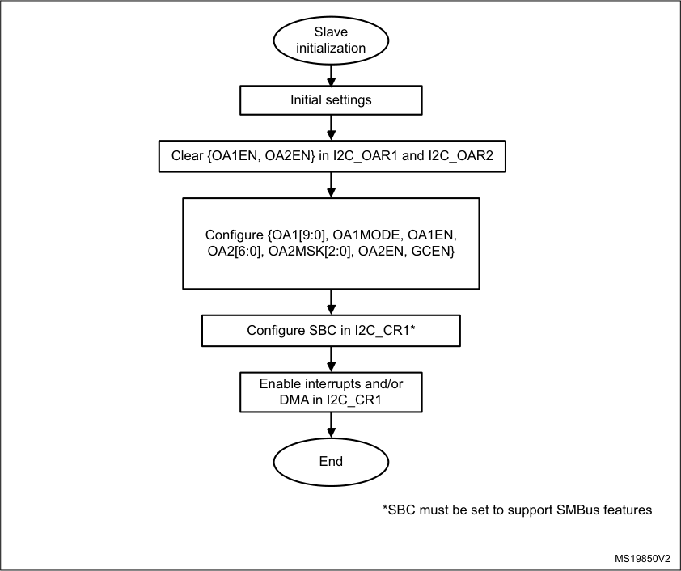

RM0377 Rev 10 603/905

656

--- end of page=602 ---

**Inter-integrated circuit (I2C) interface** **RM0377**

For code example, refer to _A.14.1: I2C configured in slave mode code example_ .

**Slave transmitter**

A transmit interrupt status (TXIS) is generated when the I2C_TXDR register becomes
empty. An interrupt is generated if the TXIE bit is set in the I2C_CR1 register.

The TXIS bit is cleared when the I2C_TXDR register is written with the next data byte to be
transmitted.

When a NACK is received, the NACKF bit is set in the I2C_ISR register and an interrupt is
generated if the NACKIE bit is set in the I2C_CR1 register. The slave automatically releases
the SCL and SDA lines in order to let the master perform a STOP or a RESTART condition.
The TXIS bit is not set when a NACK is received.

When a STOP is received and the STOPIE bit is set in the I2C_CR1 register, the STOPF
flag is set in the I2C_ISR register and an interrupt is generated. In most applications, the
SBC bit is usually programmed to ‘0’. In this case, If TXE = 0 when the slave address is
received (ADDR = 1), the user can choose either to send the content of the I2C_TXDR
register as the first data byte, or to flush the I2C_TXDR register by setting the TXE bit in
order to program a new data byte.

In Slave byte control mode (SBC = 1), the number of bytes to be transmitted must be
programmed in NBYTES in the address match interrupt subroutine (ADDR = 1). In this
case, the number of TXIS events during the transfer corresponds to the value programmed
in NBYTES.

**Caution:** When NOSTRETCH = 1, the SCL clock is not stretched while the ADDR flag is set, so the
user cannot flush the I2C_TXDR register content in the ADDR subroutine, in order to
program the first data byte. The first data byte to be sent must be previously programmed in
the I2C_TXDR register:

      - This data can be the data written in the last TXIS event of the previous transmission

message.

      - If this data byte is not the one to be sent, the I2C_TXDR register can be flushed by
setting the TXE bit in order to program a new data byte. The STOPF bit must be
cleared only after these actions, in order to guarantee that they are executed before the
first data transmission starts, following the address acknowledge.

If STOPF is still set when the first data transmission starts, an underrun error is
generated (the OVR flag is set).

If a TXIS event is needed, (transmit interrupt or transmit DMA request), the user must
set the TXIS bit in addition to the TXE bit, in order to generate a TXIS event.

604/905 RM0377 Rev 10

--- end of page=603 ---

**RM0377** **Inter-integrated circuit (I2C) interface**

**Figure 190. Transfer sequence flow for I2C slave transmitter, NOSTRETCH = 0**

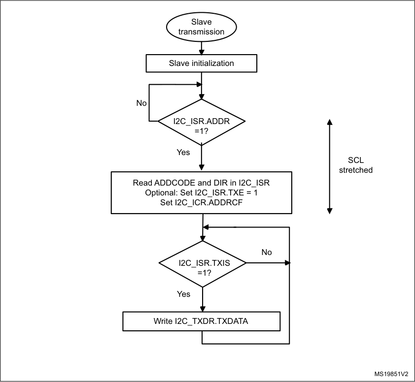

RM0377 Rev 10 605/905

656

--- end of page=604 ---

**Inter-integrated circuit (I2C) interface** **RM0377**

**Figure 191. Transfer sequence flow for I2C slave transmitter, NOSTRETCH = 1**

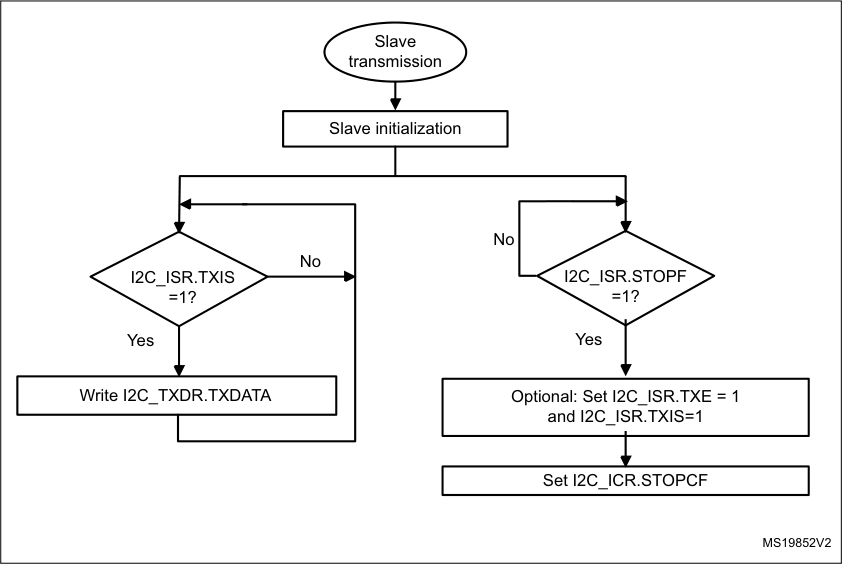

606/905 RM0377 Rev 10

--- end of page=605 ---

**RM0377** **Inter-integrated circuit (I2C) interface**

**Figure 192. Transfer bus diagrams for I2C slave transmitter**

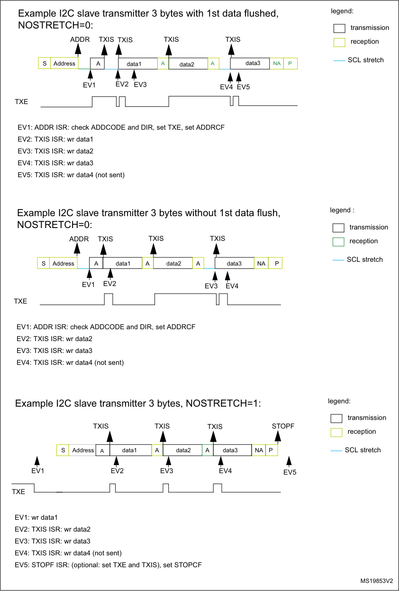

For code example, refer to _A.14.2: I2C slave transmitter code example_ .

RM0377 Rev 10 607/905

656

--- end of page=606 ---

**Inter-integrated circuit (I2C) interface** **RM0377**

**Slave receiver**

RXNE is set in I2C_ISR when the I2C_RXDR is full, and generates an interrupt if RXIE is
set in I2C_CR1. RXNE is cleared when I2C_RXDR is read.

When a STOP is received and STOPIE is set in I2C_CR1, STOPF is set in I2C_ISR and an
interrupt is generated.

**Figure 193. Transfer sequence flow for slave receiver with NOSTRETCH = 0**

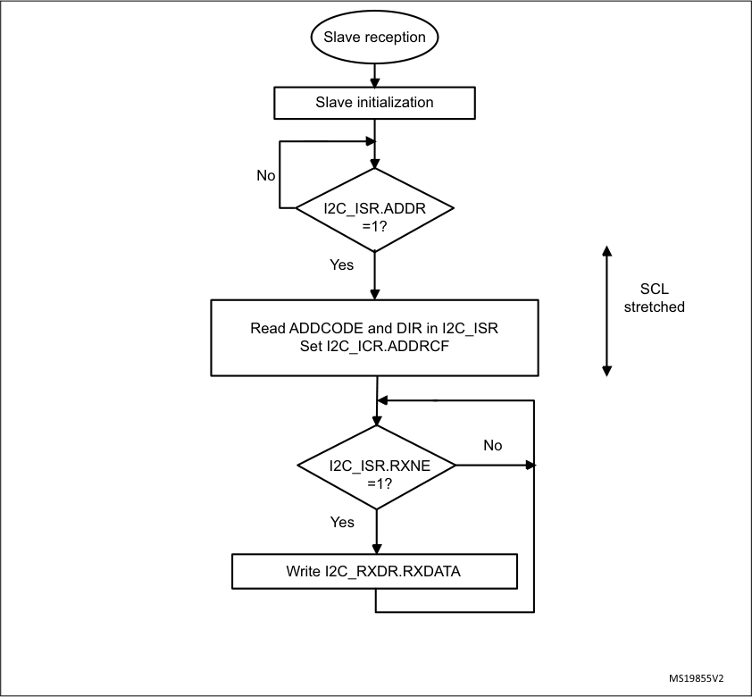

608/905 RM0377 Rev 10

--- end of page=607 ---

**RM0377** **Inter-integrated circuit (I2C) interface**

**Figure 194. Transfer sequence flow for slave receiver with NOSTRETCH = 1**

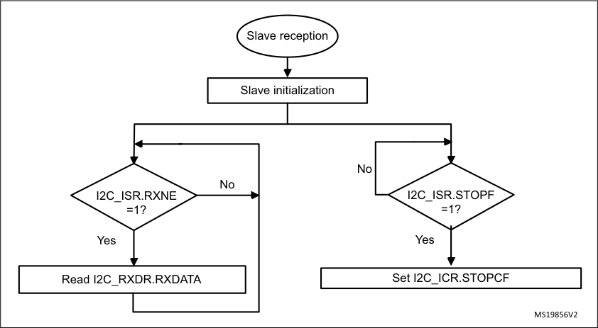

**Figure 195. Transfer bus diagrams for I2C slave receiver**

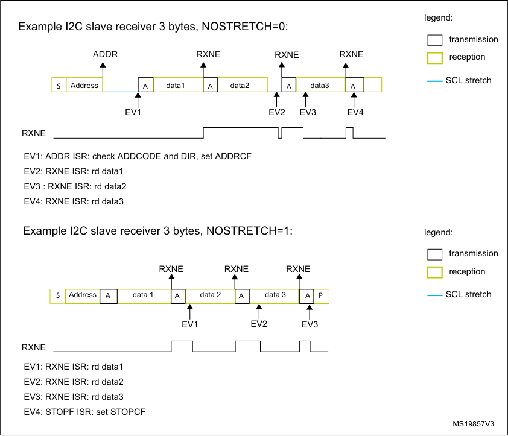

For code example, refer to _A.14.3: I2C slave receiver code example_ .

RM0377 Rev 10 609/905

656

--- end of page=608 ---

**Inter-integrated circuit (I2C) interface** **RM0377**

**23.4.10** **I2C master mode**

**I2C master initialization**

Before enabling the peripheral, the I2C master clock must be configured by setting the
SCLH and SCLL bits in the I2C_TIMINGR register.

The STM32CubeMX tool calculates and provides the I2C_TIMINGR content in the I2C
Configuration window.

A clock synchronization mechanism is implemented in order to support multi-master
environment and slave clock stretching.

In order to allow clock synchronization:

      - The low level of the clock is counted using the SCLL counter, starting from the SCL low
level internal detection.

      - The high level of the clock is counted using the SCLH counter, starting from the SCL
high level internal detection.

The I2C detects its own SCL low level after a t SYNC1 delay depending on the SCL falling
edge, SCL input noise filters (analog + digital) and SCL synchronization to the I2CxCLK
clock. The I2C releases SCL to high level once the SCLL counter reaches the value
programmed in the SCLL[7:0] bits in the I2C_TIMINGR register.

The I2C detects its own SCL high level after a t SYNC2 delay depending on the SCL rising
edge, SCL input noise filters (analog + digital) and SCL synchronization to I2CxCLK clock.
The I2C ties SCL to low level once the SCLH counter is reached reaches the value
programmed in the SCLH[7:0] bits in the I2C_TIMINGR register.

Consequently the master clock period is:

t SCL = t SYNC1 + t SYNC2 + {[(SCLH+1) + (SCLL+1)] x (PRESC+1) x t I2CCLK }

The duration of t SYNC1 depends on these parameters:

–
SCL falling slope

–
When enabled, input delay induced by the analog filter.

– When enabled, input delay induced by the digital filter: DNF x t I2CCLK

–
Delay due to SCL synchronization with I2CCLK clock (2 to 3 I2CCLK periods)

The duration of t SYNC2 depends on these parameters:

–
SCL rising slope

–
When enabled, input delay induced by the analog filter.

– When enabled, input delay induced by the digital filter: DNF x t I2CCLK

–
Delay due to SCL synchronization with I2CCLK clock (2 to 3 I2CCLK periods)

610/905 RM0377 Rev 10

--- end of page=609 ---

**RM0377** **Inter-integrated circuit (I2C) interface**

**Figure 196. Master clock generation**

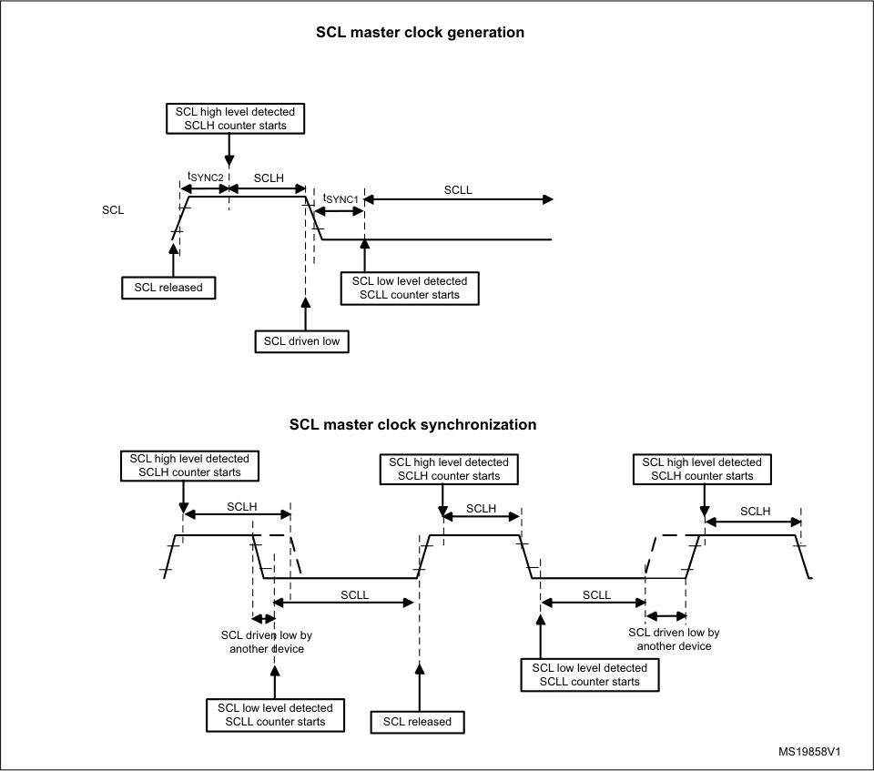

**Caution:** In order to be I [2] C or SMBus compliant, the master clock must respect the timings given the
table below.

RM0377 Rev 10 611/905

656

--- end of page=610 ---

**Inter-integrated circuit (I2C) interface** **RM0377**

**Table 106. I** [2] **C-SMBus specification clock timings**

|Symbol|Parameter|Standard- mode (Sm)|Col4|Fast-mode (Fm)|Col6|Fast-mode Plus (Fm+)|Col8|SMBus|Col10|Unit|
|---|---|---|---|---|---|---|---|---|---|---|
|**Symbol**|**Parameter**|**Min**|**Max**|**Min**|**Max**|**Min**|**Max**|**Min**|**Max**|**Max**|
|fSCL|SCL clock frequency|-|100|-|400|-|1000|-|100|kHz|
|tHD:STA|Hold time (repeated) START condition|4.0|-|0.6|-|0.26|-|4.0|-|µs|
|tSU:STA|Set-up time for a repeated START condition|4.7|-|0.6|-|0.26|-|4.7|-|µs|
|tSU:STO|Set-up time for STOP condition|4.0|-|0.6|-|0.26|-|4.0|-|µs|
|tBUF|Bus free time between a STOP and START condition|4.7|-|1.3|-|0.5|-|4.7|-|µs|
|tLOW|Low period of the SCL clock|4.7|-|1.3|-|0.5|-|4.7|-|µs|
|tHIGH|Period of the SCL clock|4.0|-|0.6|-|0.26|-|4.0|50|µs|
|tr|Rise time of both SDA and SCL signals|-|1000|-|300|-|120|-|1000|ns|
|tf|Fall time of both SDA and SCL signals|-|300|-|300|-|120|-|300|ns|

_Note:_ _SCLL is also used to generate the_ _t_ _BUF_ _and_ _t_ _SU:STA_ _timings._

_SCLH is also used to generate the_ _t_ _HD:STA_ _and_ _t_ _SU:STO_ _timings._

Refer to _Section 23.4.11: I2C_TIMINGR register configuration examples_ for examples of
I2C_TIMINGR settings vs. I2CCLK frequency.

**Master communication initialization (address phase)**

In order to initiate the communication, the user must program the following parameters for
the addressed slave in the I2C_CR2 register:

      - Addressing mode (7-bit or 10-bit): ADD10

      - Slave address to be sent: SADD[9:0]

      - Transfer direction: RD_WRN

      - In case of 10-bit address read: HEAD10R bit. HEAD10R must be configure to indicate
if the complete address sequence must be sent, or only the header in case of a
direction change.

      - The number of bytes to be transferred: NBYTES[7:0]. If the number of bytes is equal to
or greater than 255 bytes, NBYTES[7:0] must initially be filled with 0xFF.

The user must then set the START bit in I2C_CR2 register. Changing all the above bits is
not allowed when START bit is set.

Then the master automatically sends the START condition followed by the slave address as
soon as it detects that the bus is free (BUSY = 0) and after a delay of t BUF .

In case of an arbitration loss, the master automatically switches back to slave mode and can
acknowledge its own address if it is addressed as a slave.

_Note:_ _The START bit is reset by hardware when the slave address has been sent on the bus,_
_whatever the received acknowledge value. The START bit is also reset by hardware if an_
_arbitration loss occurs._
_In 10-bit addressing mode, when the Slave Address first 7 bits is NACKed by the slave, the_

612/905 RM0377 Rev 10

--- end of page=611 ---

**RM0377** **Inter-integrated circuit (I2C) interface**

_master re-launches automatically the slave address transmission until ACK is received. In_
_this case ADDRCF must be set if a NACK is received from the slave, in order to stop_
_sending the slave address._
_If the I2C is addressed as a slave (ADDR = 1) while the START bit is set, the I2C switches to_
_slave mode and the START bit is cleared, when the ADDRCF bit is set._

_Note:_ _The same procedure is applied for a Repeated Start condition. In this case BUSY = 1._

**Figure 197. Master initialization flow**

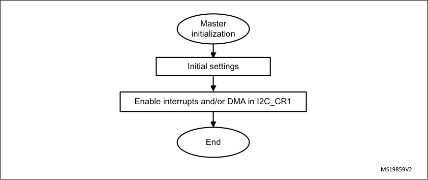

For code example, refer to _A.14.4: I2C configured in master mode to receive code example_
and _A.14.5: I2C configured in master mode to transmit code example_ .

**Initialization of a master receiver addressing a 10-bit address slave**

- If the slave address is in 10-bit format, the user can choose to send the complete read
sequence by clearing the HEAD10R bit in the I2C_CR2 register. In this case the master
automatically sends the following complete sequence after the START bit is set:
(Re)Start + Slave address 10-bit header Write + Slave address second byte + REStart
+ Slave address 10-bit header Read

**Figure 198. 10-bit address read access with HEAD10R = 0**

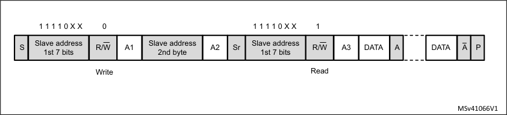

RM0377 Rev 10 613/905

656

--- end of page=612 ---

**Inter-integrated circuit (I2C) interface** **RM0377**

      - If the master addresses a 10-bit address slave, transmits data to this slave and then
reads data from the same slave, a master transmission flow must be done first. Then a
repeated start is set with the 10 bit slave address configured with HEAD10R = 1. In this
case the master sends this sequence: ReStart + Slave address 10-bit header Read.

**Figure 199. 10-bit address read access with HEAD10R = 1**

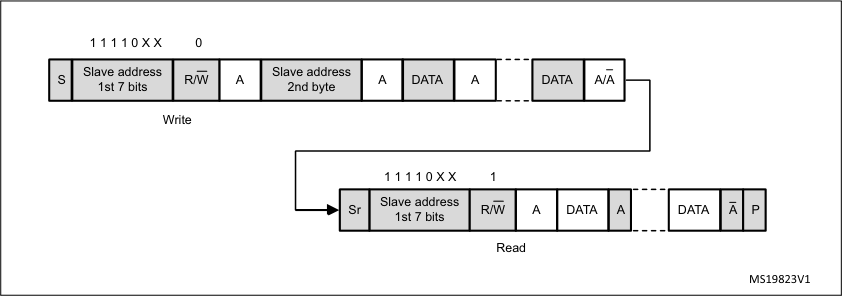

**Master transmitter**

In the case of a write transfer, the TXIS flag is set after each byte transmission, after the
ninth SCL pulse when an ACK is received.

A TXIS event generates an interrupt if the TXIE bit is set in the I2C_CR1 register. The flag is
cleared when the I2C_TXDR register is written with the next data byte to be transmitted.

The number of TXIS events during the transfer corresponds to the value programmed in
NBYTES[7:0]. If the total number of data bytes to be sent is greater than 255, reload mode
must be selected by setting the RELOAD bit in the I2C_CR2 register. In this case, when
NBYTES data have been transferred, the TCR flag is set and the SCL line is stretched low
until NBYTES[7:0] is written to a non-zero value.

The TXIS flag is not set when a NACK is received.

      - When RELOAD=0 and NBYTES data have been transferred:

–
In automatic end mode (AUTOEND=1), a STOP is automatically sent.

–
In software end mode (AUTOEND=0), the TC flag is set and the SCL line is
stretched low in order to perform software actions:

A RESTART condition can be requested by setting the START bit in the I2C_CR2
register with the proper slave address configuration, and number of bytes to be
transferred. Setting the START bit clears the TC flag and the START condition is
sent on the bus.

A STOP condition can be requested by setting the STOP bit in the I2C_CR2
register. Setting the STOP bit clears the TC flag and the STOP condition is sent on
the bus.

      - If a NACK is received: the TXIS flag is not set, and a STOP condition is automatically
sent after the NACK reception. the NACKF flag is set in the I2C_ISR register, and an
interrupt is generated if the NACKIE bit is set.

614/905 RM0377 Rev 10

--- end of page=613 ---

**RM0377** **Inter-integrated circuit (I2C) interface**

**Figure 200. Transfer sequence flow for I2C master transmitter for N≤255 bytes**

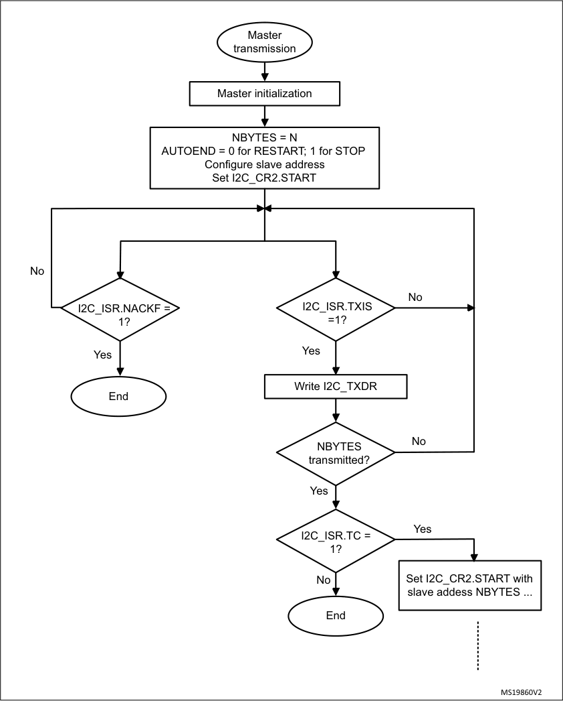

RM0377 Rev 10 615/905

656

--- end of page=614 ---

**Inter-integrated circuit (I2C) interface** **RM0377**

**Figure 201. Transfer sequence flow for I2C master transmitter for N>255 bytes**

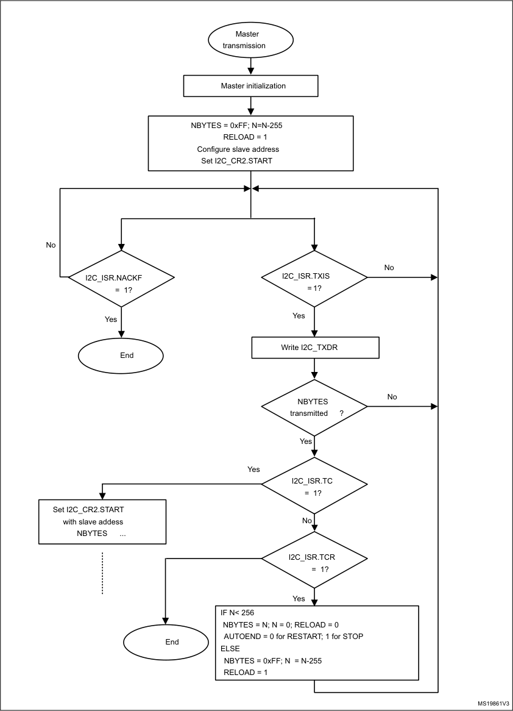

616/905 RM0377 Rev 10

--- end of page=615 ---

**RM0377** **Inter-integrated circuit (I2C) interface**

**Figure 202. Transfer bus diagrams for I2C master transmitter**

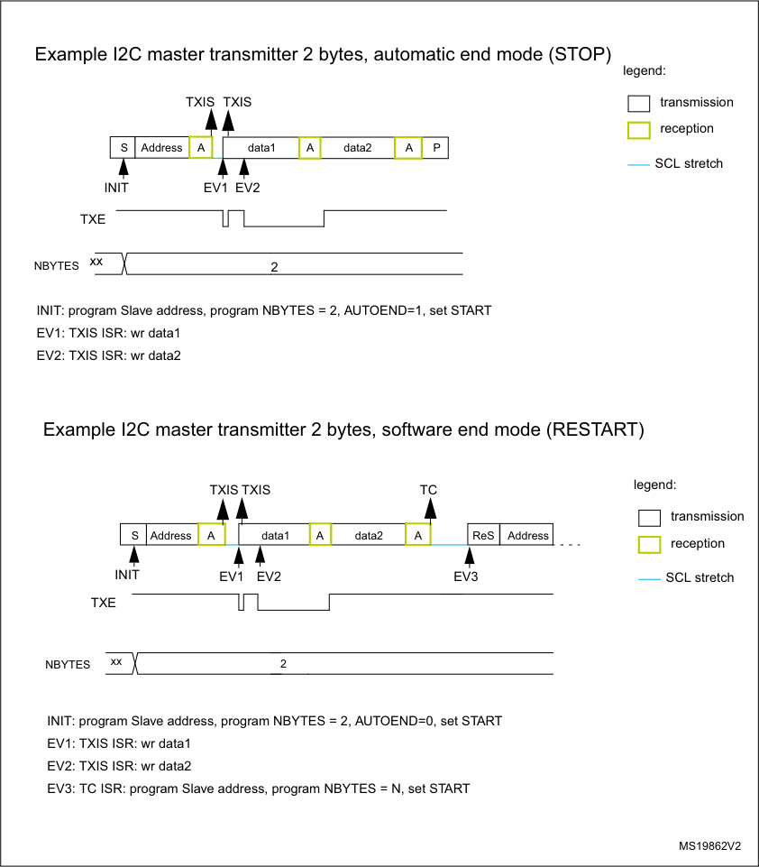

For code example, refer to _A.14.6: I2C master transmitter code example_ .

RM0377 Rev 10 617/905

656

--- end of page=616 ---

**Inter-integrated circuit (I2C) interface** **RM0377**

**Master receiver**

In the case of a read transfer, the RXNE flag is set after each byte reception, after the eighth
SCL pulse. An RXNE event generates an interrupt if the RXIE bit is set in the I2C_CR1
register. The flag is cleared when I2C_RXDR is read.

If the total number of data bytes to be received is greater than 255, reload mode must be
selected by setting the RELOAD bit in the I2C_CR2 register. In this case, when
NBYTES[7:0] data have been transferred, the TCR flag is set and the SCL line is stretched
low until NBYTES[7:0] is written to a non-zero value.

      - When RELOAD=0 and NBYTES[7:0] data have been transferred:

–
In automatic end mode (AUTOEND=1), a NACK and a STOP are automatically
sent after the last received byte.

–
In software end mode (AUTOEND=0), a NACK is automatically sent after the last
received byte, the TC flag is set and the SCL line is stretched low in order to allow
software actions:

A RESTART condition can be requested by setting the START bit in the I2C_CR2
register with the proper slave address configuration, and number of bytes to be
transferred. Setting the START bit clears the TC flag and the START condition,
followed by slave address, are sent on the bus.

A STOP condition can be requested by setting the STOP bit in the I2C_CR2
register. Setting the STOP bit clears the TC flag and the STOP condition is sent on
the bus.

618/905 RM0377 Rev 10

--- end of page=617 ---

**RM0377** **Inter-integrated circuit (I2C) interface**

**Figure 203. Transfer sequence flow for I2C master receiver for N≤255 bytes**

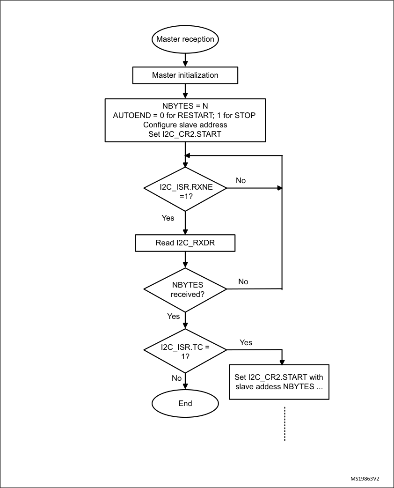

RM0377 Rev 10 619/905

656

--- end of page=618 ---

**Inter-integrated circuit (I2C) interface** **RM0377**

**Figure 204. Transfer sequence flow for I2C master receiver for N >255 bytes**

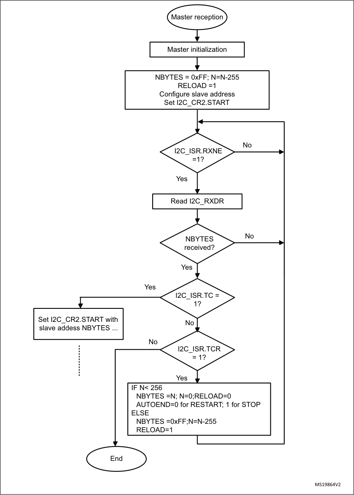

620/905 RM0377 Rev 10

--- end of page=619 ---

**RM0377** **Inter-integrated circuit (I2C) interface**

**Figure 205. Transfer bus diagrams for I2C master receiver**

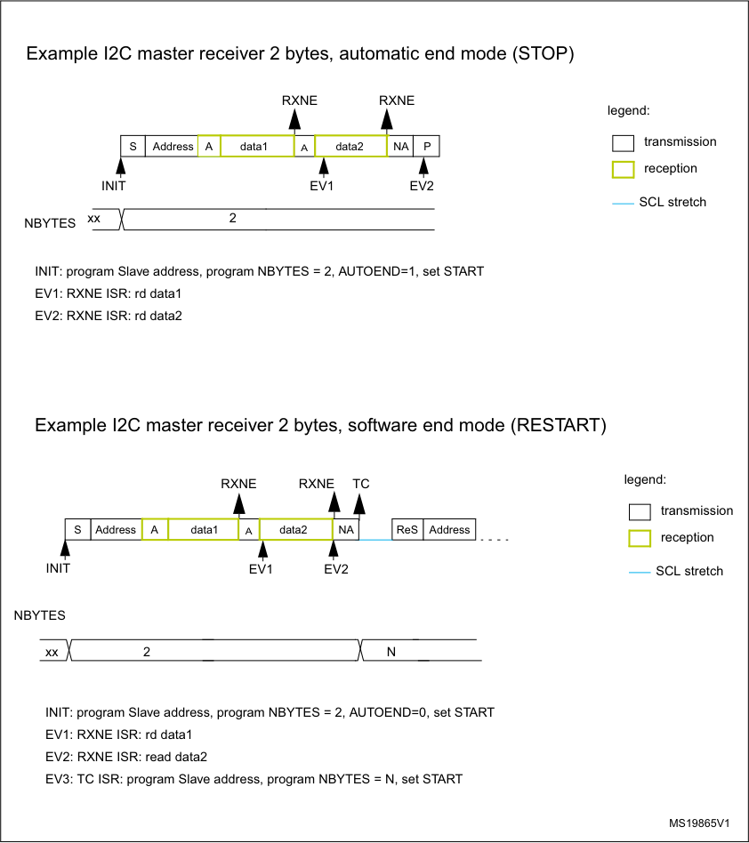

For code example refer to _A.14.7: I2C master receiver code example_ .

RM0377 Rev 10 621/905

656

--- end of page=620 ---

**Inter-integrated circuit (I2C) interface** **RM0377**

**23.4.11** **I2C_TIMINGR register configuration examples**

The tables below provide examples of how to program the I2C_TIMINGR to obtain timings
compliant with the I [2] C specification. In order to get more accurate configuration values, the
STM32CubeMX tool (I2C Configuration window) must be used.

**Table 107. Examples of timing settings for f** **I2CCLK** **= 8 MHz**

|Parameter|Standard-mode (Sm)|Col3|Fast-mode (Fm)|Fast-mode Plus (Fm+)|
|---|---|---|---|---|
|**Parameter**|**10 kHz**|**100 kHz**|**400 kHz**|**500 kHz**|
|PRESC|1|1|0|0|
|SCLL|0xC7|0x13|0x9|0x6|
|tSCLL|200 x 250 ns = 50 µs|20 x 250 ns = 5.0 µs|10 x 125 ns = 1250 ns|7 x 125 ns = 875 ns|
|SCLH|0xC3|0xF|0x3|0x3|
|tSCLH|196 x 250 ns = 49 µs|16 x 250 ns = 4.0µs|4 x 125 ns = 500 ns|4 x 125 ns = 500 ns|
|tSCL(1)|~100 µs(2)|~10 µs(2)|~2500 ns(3)|~2000 ns(4)|
|SDADEL|0x2|0x2|0x1|0x0|
|tSDADEL|2 x 250 ns = 500 ns|2 x 250 ns = 500 ns|1 x 125 ns = 125 ns|0 ns|
|SCLDEL|0x4|0x4|0x3|0x1|
|tSCLDEL|5 x 250 ns = 1250 ns|5 x 250 ns = 1250 ns|4 x 125 ns = 500 ns|2 x 125 ns = 250 ns|

1. SCL period t SCL is greater than t SCLL + t SCLH due to SCL internal detection delay. Values provided for t SCL are examples
only.

2. t SYNC1 + t SYNC2 minimum value is 4 x t I2CCLK = 500 ns. Example with t SYNC1 + t SYNC2 = 1000 ns.

3. t SYNC1 + t SYNC2 minimum value is 4 x t I2CCLK = 500 ns. Example with t SYNC1 + t SYNC2 = 750 ns.

4. t SYNC1 + t SYNC2 minimum value is 4 x t I2CCLK = 500 ns. Example with t SYNC1 + t SYNC2 = 655 ns.

**Table 108. Examples of timings settings for f** **I2CCLK** **= 16 MHz**

|Parameter|Standard-mode (Sm)|Col3|Fast-mode (Fm)|Fast-mode Plus (Fm+)|
|---|---|---|---|---|
|**Parameter**|**10 kHz**|**100 kHz**|**400 kHz**|**1000 kHz**|
|PRESC|3|3|1|0|
|SCLL|0xC7|0x13|0x9|0x4|
|tSCLL|200 x 250 ns = 50 µs|20 x 250 ns = 5.0 µs|10 x 125 ns = 1250 ns|5 x 62.5 ns = 312.5 ns|
|SCLH|0xC3|0xF|0x3|0x2|
|tSCLH|196 x 250 ns = 49 µs|16 x 250 ns = 4.0 µs|4 x 125 ns = 500 ns|3 x 62.5 ns = 187.5 ns|
|tSCL(1)|~100 µs(2)|~10 µs(2)|~2500 ns(3)|~1000 ns(4)|
|SDADEL|0x2|0x2|0x2|0x0|
|tSDADEL|2 x 250 ns = 500 ns|2 x 250 ns = 500 ns|2 x 125 ns = 250 ns|0 ns|
|SCLDEL|0x4|0x4|0x3|0x2|
|tSCLDEL|5 x 250 ns = 1250 ns|5 x 250 ns = 1250 ns|4 x 125 ns = 500 ns|3 x 62.5 ns = 187.5 ns|

1. SCL period t SCL is greater than t SCLL + t SCLH due to SCL internal detection delay. Values provided for t SCL are examples
only.

622/905 RM0377 Rev 10

--- end of page=621 ---

**RM0377** **Inter-integrated circuit (I2C) interface**

2. t SYNC1 + t SYNC2 minimum value is 4 x t I2CCLK = 250 ns. Example with t SYNC1 + t SYNC2 = 1000 ns.

3. t SYNC1 + t SYNC2 minimum value is 4 x t I2CCLK = 250 ns. Example with t SYNC1 + t SYNC2 = 750 ns.

4. t SYNC1 + t SYNC2 minimum value is 4 x t I2CCLK = 250 ns. Example with t SYNC1 + t SYNC2 = 500 ns.

**23.4.12** **SMBus specific features**

This section is relevant only when SMBus feature is supported. Refer to _Section 23.3: I2C_
_implementation_ .

**Introduction**

The system management bus (SMBus) is a two-wire interface through which various
devices can communicate with each other and with the rest of the system. It is based on I [2] C
principles of operation. The SMBus provides a control bus for system and power
management related tasks.

This peripheral is compatible with the SMBus specification (http://smbus.org).

The System Management Bus Specification refers to three types of devices.

      - A slave is a device that receives or responds to a command.

      - A master is a device that issues commands, generates the clocks and terminates the
transfer.

      - A host is a specialized master that provides the main interface to the system’s CPU. A
host must be a master-slave and must support the SMBus host notify protocol. Only
one host is allowed in a system.

This peripheral can be configured as master or slave device, and also as a host.

**Bus protocols**

There are eleven possible command protocols for any given device. A device may use any
or all of the eleven protocols to communicate. The protocols are Quick Command, Send
Byte, Receive Byte, Write Byte, Write Word, Read Byte, Read Word, Process Call, Block
Read, Block Write and Block Write-Block Read Process Call. These protocols should be
implemented by the user software.

For more details of these protocols, refer to SMBus specification (http://smbus.org).

**Address resolution protocol (ARP)**

SMBus slave address conflicts can be resolved by dynamically assigning a new unique
address to each slave device. In order to provide a mechanism to isolate each device for the
purpose of address assignment each device must implement a unique device identifier
(UDID). This 128-bit number is implemented by software.

This peripheral supports the Address Resolution Protocol (ARP). The SMBus Device
Default Address (0b1100 001) is enabled by setting SMBDEN bit in I2C_CR1 register. The
ARP commands should be implemented by the user software.

Arbitration is also performed in slave mode for ARP support.

For more details of the SMBus address resolution protocol, refer to SMBus specification
(http://smbus.org).

RM0377 Rev 10 623/905

656

--- end of page=622 ---

**Inter-integrated circuit (I2C) interface** **RM0377**

**Received command and data acknowledge control**

A SMBus receiver must be able to NACK each received command or data. In order to allow
the ACK control in slave mode, the Slave Byte Control mode must be enabled by setting
SBC bit in I2C_CR1 register. Refer to _Slave byte control mode on page 603_ for more details.

**Host notify protocol**

This peripheral supports the host notify protocol by setting the SMBHEN bit in the I2C_CR1
register. In this case the host acknowledges the SMBus host address (0b0001 000).

When this protocol is used, the device acts as a master and the host as a slave.

**SMBus alert**

The SMBus ALERT optional signal is supported. A slave-only device can signal the host
through the SMBALERT# pin that it wants to talk. The host processes the interrupt and
simultaneously accesses all SMBALERT# devices through the alert response address
(0b0001 100). Only the device(s) which pulled SMBALERT# low acknowledges the alert
response address.

When configured as a slave device(SMBHEN=0), the SMBA pin is pulled low by setting the
ALERTEN bit in the I2C_CR1 register. The Alert Response Address is enabled at the same
time.

When configured as a host (SMBHEN=1), the ALERT flag is set in the I2C_ISR register
when a falling edge is detected on the SMBA pin and ALERTEN=1. An interrupt is
generated if the ERRIE bit is set in the I2C_CR1 register. When ALERTEN=0, the ALERT
line is considered high even if the external SMBA pin is low.

_If the SMBus ALERT pin is not needed, the SMBA pin can be used as a standard GPIO if_
ALERTEN=0 _._

**Packet error checking**

A packet error checking mechanism has been introduced in the SMBus specification to
improve reliability and communication robustness. The packet error checking is
implemented by appending a packet error code (PEC) at the end of each message transfer.
The PEC is calculated by using the C(x) = x 8 + x [2] + x + 1 CRC-8 polynomial on all the
message bytes (including addresses and read/write bits).

The peripheral embeds a hardware PEC calculator and allows a not acknowledge to be sent
automatically when the received byte does not match with the hardware calculated PEC.

**Timeouts**

This peripheral embeds hardware timers in order to be compliant with the 3 timeouts defined
in SMBus specification.

**Table 109. SMBus timeout specifications**

|Symbol|Parameter|Limits|Col4|Unit|
|---|---|---|---|---|
|**Symbol**|**Parameter**|**Min**|**Max**|**Max**|
|tTIMEOUT|Detect clock low timeout|25|35|ms|

624/905 RM0377 Rev 10

--- end of page=623 ---

**RM0377** **Inter-integrated circuit (I2C) interface**

**Table 109. SMBus timeout specifications (continued)**

|Symbol|Parameter|Limits|Col4|Unit|
|---|---|---|---|---|
|**Symbol**|**Parameter**|**Min**|**Max**|**Max**|
|tLOW:SEXT (1)|Cumulative clock low extend time (slave device)|-|25|ms|
|tLOW:MEXT (2)|Cumulative clock low extend time (master device)|-|10|ms|

1. t LOW:SEXT is the cumulative time a given slave device is allowed to extend the clock cycles in one message
from the initial START to the STOP. It is possible that, another slave device or the master also extends the
clock causing the combined clock low extend time to be greater than t LOW:SEXT . Therefore, this parameter is
measured with the slave device as the sole target of a full-speed master.

2. t LOW:MEXT is the cumulative time a master device is allowed to extend its clock cycles within each byte of a
message as defined from START-to-ACK, ACK-to-ACK, or ACK-to-STOP. It is possible that a slave device
or another master also extends the clock causing the combined clock low time to be greater than t LOW:MEXT
on a given byte. Therefore, this parameter is measured with a full speed slave device as the sole target of
the master.

**Figure 206. Timeout intervals for t** **LOW:SEXT** **, t** **LOW:MEXT** **.**

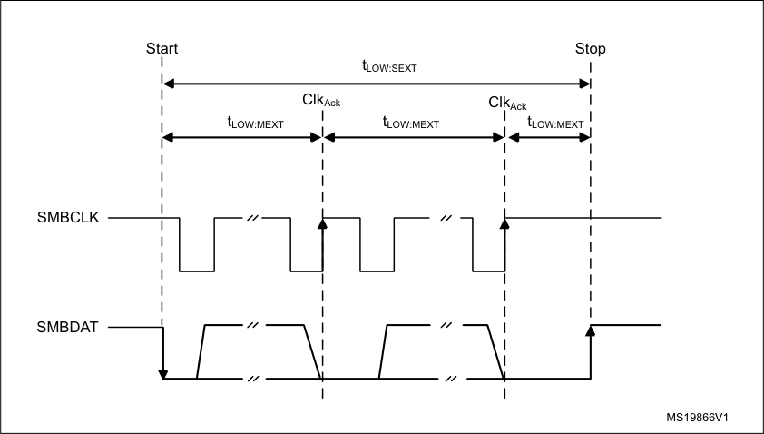

RM0377 Rev 10 625/905

656

--- end of page=624 ---

**Inter-integrated circuit (I2C) interface** **RM0377**

**Bus idle detection**

A master can assume that the bus is free if it detects that the clock and data signals have
been high for t IDLE greater than t HIGH, MAX . (refer to _Table 104: I2C-SMBus specification data_
_setup and hold times_ )

This timing parameter covers the condition where a master has been dynamically added to
the bus and may not have detected a state transition on the SMBCLK or SMBDAT lines. In
this case, the master must wait long enough to ensure that a transfer is not currently in
progress. The peripheral supports a hardware bus idle detection.

###### **23.4.13 SMBus initialization**

This section is relevant only when SMBus feature is supported. Refer to _Section 23.3: I2C_
_implementation_ .

In addition to I2C initialization, some other specific initialization must be done in order to
perform SMBus communication:

**Received command and data acknowledge control (Slave mode)**

A SMBus receiver must be able to NACK each received command or data. In order to allow
ACK control in slave mode, the Slave byte control mode must be enabled by setting the
SBC bit in the I2C_CR1 register. Refer to _Slave byte control mode on page 603_ for more
details.

**Specific address (Slave mode)**

The specific SMBus addresses must be enabled if needed. Refer to _Bus idle detection on_
_page 626_ for more details.

      - The SMBus device default address (0b1100 001) is enabled by setting the SMBDEN
bit in the I2C_CR1 register.

      - The SMBus host address (0b0001 000) is enabled by setting the SMBHEN bit in the
I2C_CR1 register.

      - The alert response address (0b0001100) is enabled by setting the ALERTEN bit in the
I2C_CR1 register.

**Packet error checking**

PEC calculation is enabled by setting the PECEN bit in the I2C_CR1 register. Then the PEC
transfer is managed with the help of a hardware byte counter: NBYTES[7:0] in the I2C_CR2
register. The PECEN bit must be configured before enabling the I2C.

The PEC transfer is managed with the hardware byte counter, so the SBC bit must be set
when interfacing the SMBus in slave mode. The PEC is transferred after NBYTES - 1 data
have been transferred when the PECBYTE bit is set and the RELOAD bit is cleared. If

RELOAD is set, PECBYTE has no effect.

**Caution:** Changing the PECEN configuration is not allowed when the I2C is enabled.

626/905 RM0377 Rev 10

--- end of page=625 ---

**RM0377** **Inter-integrated circuit (I2C) interface**

**Table 110. SMBus with PEC configuration**

|Mode|SBC bit|RELOAD bit|AUTOEND bit|PECBYTE bit|
|---|---|---|---|---|
|Master Tx/Rx NBYTES + PEC+ STOP|x|0|1|1|
|Master Tx/Rx NBYTES + PEC + ReSTART|x|0|0|1|
|Slave Tx/Rx with PEC|1|0|x|1|

**Timeout detection**

The timeout detection is enabled by setting the TIMOUTEN and TEXTEN bits in the
I2C_TIMEOUTR register. The timers must be programmed in such a way that they detect a
timeout before the maximum time given in the SMBus specification.

      - t TIMEOUT check

In order to enable the t TIMEOUT check, the 12-bit TIMEOUTA[11:0] bits must be
programmed with the timer reload value in order to check the t TIMEOUT parameter. The
TIDLE bit must be configured to ‘0’ in order to detect the SCL low level timeout.

Then the timer is enabled by setting the TIMOUTEN in the I2C_TIMEOUTR register.

If SCL is tied low for a time greater than (TIMEOUTA+1) x 2048 x t I2CCLK, the TIMEOUT
flag is set in the I2C_ISR register.

Refer to _Table 111: Examples of TIMEOUTA settings for various I2CCLK frequencies_
_(max t_ _TIMEOUT_ _= 25 ms)_ .

**Caution:** Changing the TIMEOUTA[11:0] bits and TIDLE bit configuration is not allowed when the
TIMEOUTEN bit is set.

      - t LOW:SEXT and t LOW:MEXT check

Depending on if the peripheral is configured as a master or as a slave, The 12-bit
TIMEOUTB timer must be configured in order to check t LOW:SEXT for a slave and
t LOW:MEXT for a master. As the standard specifies only a maximum, the user can choose
the same value for the both.

Then the timer is enabled by setting the TEXTEN bit in the I2C_TIMEOUTR register.

If the SMBus peripheral performs a cumulative SCL stretch for a time greater than
(TIMEOUTB+1) x 2048 x t I2CCLK, and in the timeout interval described in _Bus idle_
_detection on page 626_ section, the TIMEOUT flag is set in the I2C_ISR register.

Refer to _Table 112: Examples of TIMEOUTB settings for various I2CCLK frequencies_

**Caution:** Changing the TIMEOUTB configuration is not allowed when the TEXTEN bit is set.

**Bus idle detection**

In order to enable the t IDLE check, the 12-bit TIMEOUTA[11:0] field must be programmed
with the timer reload value in order to obtain the t IDLE parameter. The TIDLE bit must be
configured to ‘1 in order to detect both SCL and SDA high level timeout.

Then the timer is enabled by setting the TIMOUTEN bit in the I2C_TIMEOUTR register.

If both the SCL and SDA lines remain high for a time greater than (TIMEOUTA+1) x 4 x
t I2CCLK, the TIMEOUT flag is set in the I2C_ISR register.

Refer to _Table 113: Examples of TIMEOUTA settings for various I2CCLK frequencies (max_
_t_ _IDLE_ _= 50 µs)_

RM0377 Rev 10 627/905

656

--- end of page=626 ---

**Inter-integrated circuit (I2C) interface** **RM0377**

**Caution:** Changing the TIMEOUTA and TIDLE configuration is not allowed when the TIMEOUTEN is
set.

###### **23.4.14 SMBus: I2C_TIMEOUTR register configuration examples**

This section is relevant only when SMBus feature is supported. Refer to _Section 23.3: I2C_
_implementation_ .

      - Configuring the maximum duration of t TIMEOUT to 25 ms:

**Table 111. Examples of TIMEOUTA settings for various I2CCLK** **frequencies**
**(max t** **TIMEOUT** **= 25 ms)**

|f I2CCLK|TIMEOUTA[11:0] bits|TIDLE bit|TIMEOUTEN bit|t TIMEOUT|
|---|---|---|---|---|
|8 MHz|0x61|0|1|98 x 2048 x 125 ns = 25 ms|
|16 MHz|0xC3|0|1|196 x 2048 x 62.5 ns = 25 ms|
|32 MHz|0x186|0|1|391 x 2048 x 31.25 ns = 25 ms|

      - Configuring the maximum duration of t LOW:SEXT and t LOW:MEXT to 8 ms:

**Table 112. Examples of TIMEOUTB settings for various I2CCLK frequencies**

|f I2CCLK|TIMEOUTB[11:0] bits|TEXTEN bit|t LOW:EXT|
|---|---|---|---|
|8 MHz|0x1F|1|32 x 2048 x 125 ns = 8 ms|
|16 MHz|0x3F|1|64 x 2048 x 62.5 ns = 8 ms|
|32 MHz|0x7C|1|125 x 2048 x 31.25 ns = 8 ms|

      - Configuring the maximum duration of t IDLE to 50 µs

**Table 113. Examples of TIMEOUTA settings for various I2CCLK** **frequencies**
**(max t** **IDLE** **= 50 µs)**

|f I2CCLK|TIMEOUTA[11:0] bits|TIDLE bit|TIMEOUTEN bit|t TIDLE|
|---|---|---|---|---|
|8 MHz|0x63|1|1|100 x 4 x 125 ns = 50 µs|
|16 MHz|0xC7|1|1|200 x 4 x 62.5 ns = 50 µs|
|32 MHz|0x18F|1|1|400 x 4 x 31.25 ns = 50 µs|

**23.4.15** **SMBus slave mode**

This section is relevant only when the SMBus feature is supported. Refer to _Section 23.3:_
_I2C implementation_ .

In addition to I2C slave transfer management (refer to _Section 23.4.9: I2C slave mode_ )
some additional software flows are provided to support the SMBus.

**SMBus slave transmitter**

When the IP is used in SMBus, SBC must be programmed to ‘1’ in order to allow the PEC
transmission at the end of the programmed number of data bytes. When the PECBYTE bit
is set, the number of bytes programmed in NBYTES[7:0] includes the PEC transmission. In

628/905 RM0377 Rev 10

--- end of page=627 ---

**RM0377** **Inter-integrated circuit (I2C) interface**

that case the total number of TXIS interrupts is NBYTES - 1 and the content of the
I2C_PECR register is automatically transmitted if the master requests an extra byte after the
NBYTES - 1 data transfer.

**Caution:** The PECBYTE bit has no effect when the RELOAD bit is set.

**Figure 207. Transfer sequence flow for SMBus slave transmitter N bytes + PEC**

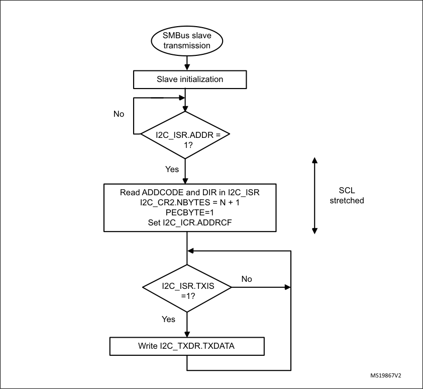

RM0377 Rev 10 629/905

656

--- end of page=628 ---

**Inter-integrated circuit (I2C) interface** **RM0377**

**Figure 208. Transfer bus diagrams for SMBus slave transmitter (SBC=1)**

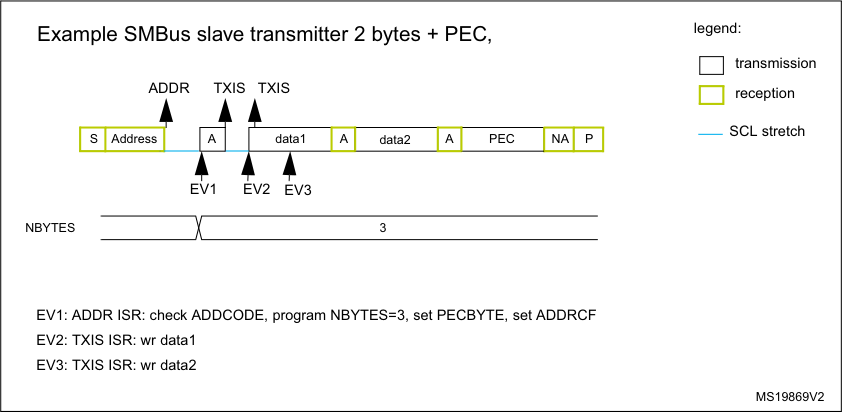

**SMBus Slave receiver**

When the I2C is used in SMBus mode, SBC must be programmed to ‘1’ in order to allow the
PEC checking at the end of the programmed number of data bytes. In order to allow the
ACK control of each byte, the reload mode must be selected (RELOAD=1). Refer to _Slave_
_byte control mode on page 603_ for more details.

In order to check the PEC byte, the RELOAD bit must be cleared and the PECBYTE bit
must be set. In this case, after NBYTES - 1 data have been received, the next received byte
is compared with the internal I2C_PECR register content. A NACK is automatically
generated if the comparison does not match, and an ACK is automatically generated if the
comparison matches, whatever the ACK bit value. Once the PEC byte is received, it is
copied into the I2C_RXDR register like any other data, and the RXNE flag is set.

In the case of a PEC mismatch, the PECERR flag is set and an interrupt is generated if the
ERRIE bit is set in the I2C_CR1 register.

If no ACK software control is needed, the user can program PECBYTE=1 and, in the same
write operation, program NBYTES with the number of bytes to be received in a continuous
flow. After NBYTES - 1 are received, the next received byte is checked as being the PEC.

**Caution:** The PECBYTE bit has no effect when the RELOAD bit is set.

630/905 RM0377 Rev 10

--- end of page=629 ---

**RM0377** **Inter-integrated circuit (I2C) interface**

**Figure 209. Transfer sequence flow for SMBus slave receiver N Bytes + PEC**

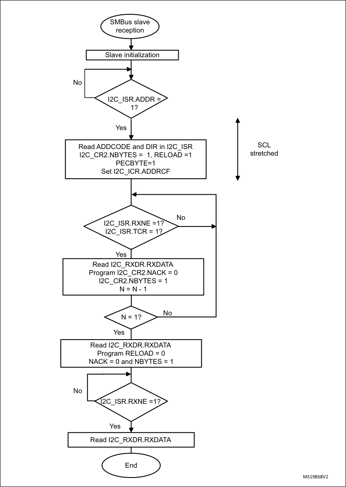

RM0377 Rev 10 631/905

656

--- end of page=630 ---

**Inter-integrated circuit (I2C) interface** **RM0377**

**Figure 210. Bus transfer diagrams for SMBus slave receiver (SBC=1)**

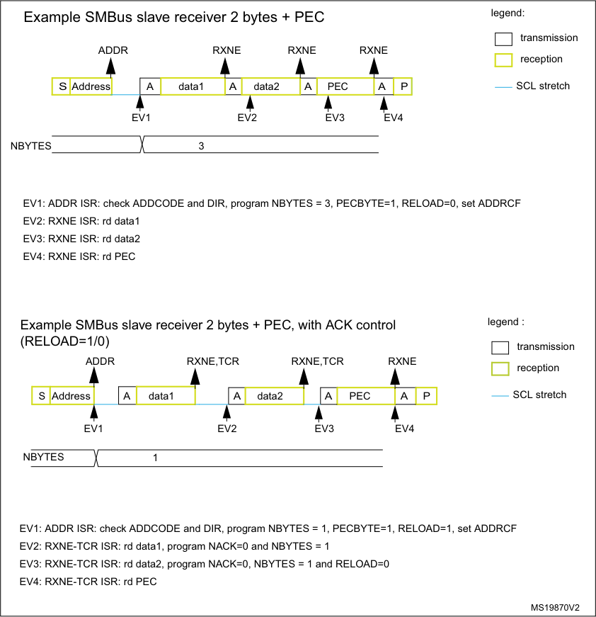

This section is relevant only when the SMBus feature is supported. Refer to _Section 23.3:_
_I2C implementation_ .

In addition to I2C master transfer management (refer to _Section 23.4.10: I2C master mode_ ),
some additional software flows are provided to support the SMBus.

**SMBus master transmitter**

When the SMBus master wants to transmit the PEC, the PECBYTE bit must be set and the
number of bytes must be programmed in the NBYTES[7:0] field, before setting the START
bit. In this case the total number of TXIS interrupts is NBYTES - 1. So if the PECBYTE bit is
set when NBYTES = 0x1, the content of the I2C_PECR register is automatically transmitted.

If the SMBus master wants to send a STOP condition after the PEC, automatic end mode
must be selected (AUTOEND = 1). In this case, the STOP condition automatically follows
the PEC transmission.

632/905 RM0377 Rev 10

--- end of page=631 ---

**RM0377** **Inter-integrated circuit (I2C) interface**

When the SMBus master wants to send a RESTART condition after the PEC, software
mode must be selected (AUTOEND=0). In this case, once NBYTES - 1 have been
transmitted, the I2C_PECR register content is transmitted and the TC flag is set after the
PEC transmission, stretching the SCL line low. The RESTART condition must be
programmed in the TC interrupt subroutine.

**Caution:** The PECBYTE bit has no effect when the RELOAD bit is set.

**Figure 211. Bus transfer diagrams for SMBus master transmitter**

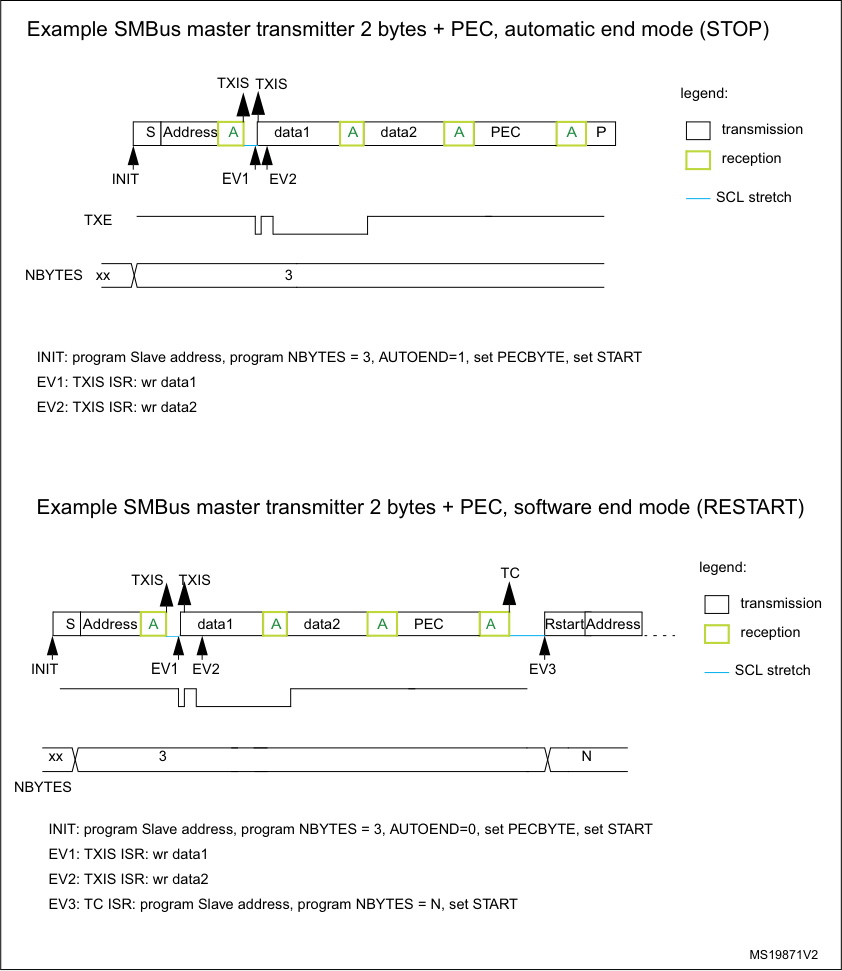

RM0377 Rev 10 633/905

656

--- end of page=632 ---

**Inter-integrated circuit (I2C) interface** **RM0377**

**SMBus master receiver**

When the SMBus master wants to receive the PEC followed by a STOP at the end of the
transfer, automatic end mode can be selected (AUTOEND = 1). The PECBYTE bit must be
set and the slave address must be programmed, before setting the START bit. In this case,
after NBYTES - 1 data have been received, the next received byte is automatically checked
versus the I2C_PECR register content. A NACK response is given to the PEC byte, followed
by a STOP condition.

When the SMBus master receiver wants to receive the PEC byte followed by a RESTART
condition at the end of the transfer, software mode must be selected (AUTOEND=0). The
PECBYTE bit must be set and the slave address must be programmed, before setting the
START bit. In this case, after NBYTES - 1 data have been received, the next received byte
is automatically checked versus the I2C_PECR register content. The TC flag is set after the
PEC byte reception, stretching the SCL line low. The RESTART condition can be
programmed in the TC interrupt subroutine.

**Caution:** The PECBYTE bit has no effect when the RELOAD bit is set.

634/905 RM0377 Rev 10

--- end of page=633 ---

**RM0377** **Inter-integrated circuit (I2C) interface**

**Figure 212. Bus transfer diagrams for SMBus master receiver**

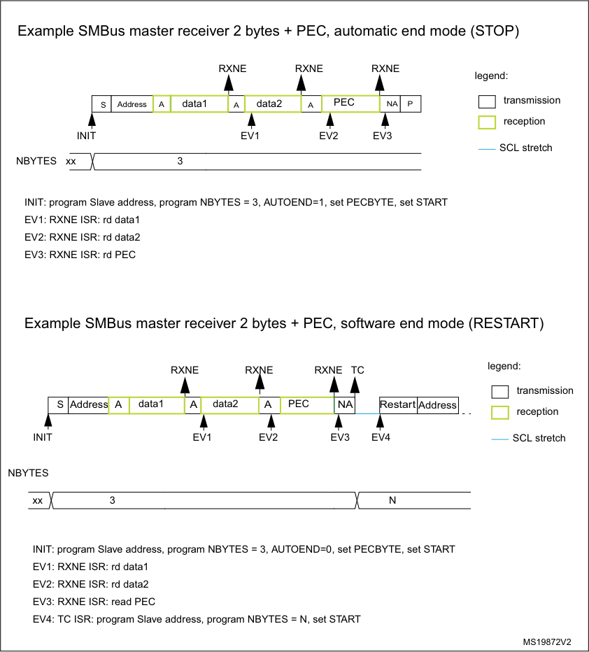

RM0377 Rev 10 635/905

656

--- end of page=634 ---

**Inter-integrated circuit (I2C) interface** **RM0377**

**23.4.16** **Wakeup from Stop mode on address match**

This section is relevant only when wakeup from Stop mode feature is supported. Refer to
_Section 23.3: I2C implementation_ .

The I2C is able to wakeup the MCU from Stop mode (APB clock is off), when it is
addressed. All addressing modes are supported.

Wakeup from Stop mode is enabled by setting the WUPEN bit in the I2C_CR1 register. The
HSI16 oscillator must be selected as the clock source for I2CCLK in order to allow wakeup
from Stop mode.

During Stop mode, the HSI16 is switched off. When a START is detected, the I2C interface
switches the HSI16 on, and stretches SCL low until HSI16 is woken up.

HSI16 is then used for the address reception.

In case of an address match, the I2C stretches SCL low during MCU wakeup time. The
stretch is released when ADDR flag is cleared by software, and the transfer goes on
normally.

If the address does not match, the HSI16 is switched off again and the MCU is not woken

up.

_Note:_ _If the I2C clock is the system clock, or if WUPEN = 0,_ _the_ HSI16 _is not switched on after a_
_START is received._

_Only an ADDR interrupt can wakeup the MCU. Therefore do not enter Stop mode when the_
_I2C is performing a transfer as a master, or as an addressed slave after the ADDR flag is_
_set. This can be managed by clearing SLEEPDEEP bit in the ADDR interrupt routine and_
_setting it again only after the STOPF flag is set._

**Caution:** The digital filter is not compatible with the wakeup from Stop mode feature. If the DNF bit is
not equal to 0, setting the WUPEN bit has no effect.

**Caution:** This feature is available only when the I2C clock source is the HSI16 oscillator.

**Caution:** Clock stretching must be enabled (NOSTRETCH = 0) to ensure proper operation of the
wakeup from Stop mode feature.

**Caution:** If wakeup from Stop mode is disabled (WUPEN = 0), the I2C peripheral must be disabled
before entering Stop mode (PE = 0).

**23.4.17** **Error conditions**

The following errors are the error conditions which may cause communication to fail.

**Bus error (BERR)**

A bus error is detected when a START or a STOP condition is detected and is not located

after a multiple of 9 SCL clock pulses. A START or a STOP condition is detected when a
SDA edge occurs while SCL is high.

The bus error flag is set only if the I2C is involved in the transfer as master or addressed
slave (i.e not during the address phase in slave mode).

In case of a misplaced START or RESTART detection in slave mode, the I2C enters
address recognition state like for a correct START condition.

When a bus error is detected, the BERR flag is set in the I2C_ISR register, and an interrupt
is generated if the ERRIE bit is set in the I2C_CR1 register.

636/905 RM0377 Rev 10

--- end of page=635 ---

**RM0377** **Inter-integrated circuit (I2C) interface**

**Arbitration lost (ARLO)**

An arbitration loss is detected when a high level is sent on the SDA line, but a low level is
sampled on the SCL rising edge.

      - In master mode, arbitration loss is detected during the address phase, data phase and
data acknowledge phase. In this case, the SDA and SCL lines are released, the
START control bit is cleared by hardware and the master switches automatically to
slave mode.

      - In slave mode, arbitration loss is detected during data phase and data acknowledge
phase. In this case, the transfer is stopped, and the SCL and SDA lines are released.

When an arbitration loss is detected, the ARLO flag is set in the I2C_ISR register, and an
interrupt is generated if the ERRIE bit is set in the I2C_CR1 register.

**Overrun/underrun error (OVR)**

An overrun or underrun error is detected in slave mode when NOSTRETCH = 1 and:

      - In reception when a new byte is received and the RXDR register has not been read yet.
The new received byte is lost, and a NACK is automatically sent as a response to the
new byte.

      - In transmission:

–
When STOPF=1 and the first data byte should be sent. The content of the
I2C_TXDR register is sent if TXE=0, 0xFF if not.

–
When a new byte must be sent and the I2C_TXDR register has not been written
yet, 0xFF is sent.

When an overrun or underrun error is detected, the OVR flag is set in the I2C_ISR register,
and an interrupt is generated if the ERRIE bit is set in the I2C_CR1 register.

**Packet error checking error (PECERR)**

This section is relevant only when the SMBus feature is supported. Refer to _Section 23.3:_
_I2C implementation_ .

A PEC error is detected when the received PEC byte does not match with the I2C_PECR
register content. A NACK is automatically sent after the wrong PEC reception.

When a PEC error is detected, the PECERR flag is set in the I2C_ISR register, and an
interrupt is generated if the ERRIE bit is set in the I2C_CR1 register.

**Timeout Error (TIMEOUT)**

This section is relevant only when the SMBus feature is supported. Refer to _Section 23.3:_
_I2C implementation_ .

A timeout error occurs for any of these conditions:

      - TIDLE=0 and SCL remained low for the time defined in the TIMEOUTA[11:0] bits: this is
used to detect a SMBus timeout.

      - TIDLE=1 and both SDA and SCL remained high for the time defined in the TIMEOUTA

[11:0] bits: this is used to detect a bus idle condition.

      - Master cumulative clock low extend time reached the time defined in the
TIMEOUTB[11:0] bits (SMBus t LOW:MEXT parameter)

      - Slave cumulative clock low extend time reached the time defined in TIMEOUTB[11:0]
bits (SMBus t LOW:SEXT parameter)

RM0377 Rev 10 637/905

656

--- end of page=636 ---

**Inter-integrated circuit (I2C) interface** **RM0377**

When a timeout violation is detected in master mode, a STOP condition is automatically
sent.

When a timeout violation is detected in slave mode, SDA and SCL lines are automatically
released.

When a timeout error is detected, the TIMEOUT flag is set in the I2C_ISR register, and an
interrupt is generated if the ERRIE bit is set in the I2C_CR1 register.

**Alert (ALERT)**

This section is relevant only when the SMBus feature is supported. Refer to _Section 23.3:_
_I2C implementation_ .

The ALERT flag is set when the I2C interface is configured as a Host (SMBHEN=1), the
alert pin detection is enabled (ALERTEN=1) and a falling edge is detected on the SMBA pin.
An interrupt is generated if the ERRIE bit is set in the I2C_CR1 register.

**23.4.18** **DMA requests**

**Transmission using DMA**

DMA (direct memory access) can be enabled for transmission by setting the TXDMAEN bit
in the I2C_CR1 register. Data is loaded from an SRAM area configured using the DMA
peripheral (see _Section 11: Direct memory access controller (DMA) on page 361_ ) to the
I2C_TXDR register whenever the TXIS bit is set.

Only the data are transferred with DMA.

      - In master mode: the initialization, the slave address, direction, number of bytes and
START bit are programmed by software (the transmitted slave address cannot be
transferred with DMA). When all data are transferred using DMA, the DMA must be
initialized before setting the START bit. The end of transfer is managed with the
NBYTES counter. Refer to _Master transmitter on page 614_ .

For code example refer to _A.14.8: I2C configured in master mode to transmit with DMA code_
_example_ .

      - In slave mode:

–
With NOSTRETCH = 0, when all data are transferred using DMA, the DMA must
be initialized before the address match event, or in ADDR interrupt subroutine,
before clearing ADDR.

–
With NOSTRETCH = 1, the DMA must be initialized before the address match

event.

      - For instances supporting SMBus: the PEC transfer is managed with NBYTES counter.
Refer to _SMBus slave transmitter on page 628_ and _SMBus master transmitter on_
_page 632_ .

_Note:_ _If DMA is used for transmission, the TXIE bit does not need to be enabled._

638/905 RM0377 Rev 10

--- end of page=637 ---

**RM0377** **Inter-integrated circuit (I2C) interface**

**Reception using DMA**

DMA (direct memory access) can be enabled for reception by setting the RXDMAEN bit in
the I2C_CR1 register. Data is loaded from the I2C_RXDR register to an SRAM area
configured using the DMA peripheral (refer to _Section 10: Direct memory access controller_
_(DMA) on page 241_ ) whenever the RXNE bit is set. Only the data (including PEC) are
transferred with DMA.

      - In Master mode, the initialization, the slave address, direction, number of bytes and
START bit are programmed by software. When all data are transferred using DMA, the
DMA must be initialized before setting the START bit. The end of transfer is managed
with the NBYTES counter. For code example refer to _A.14.9: I2C configured in slave_
_mode to receive with DMA code example_ .

      - In Slave mode with NOSTRETCH = 0, when all data are transferred using DMA, the
DMA must be initialized before the address match event, or in the ADDR interrupt
subroutine, before clearing the ADDR flag.

      - If SMBus is supported (see _Section 23.3: I2C implementation_ ): the PEC transfer is
managed with the NBYTES counter. Refer to _SMBus Slave receiver on page 630_ and
_SMBus master receiver on page 634_ .

_Note:_ _If DMA is used for reception, the RXIE bit does not need to be enabled._

**23.4.19** **Debug mode**

When the microcontroller enters debug mode (core halted), the SMBus timeout either
continues to work normally or stops, depending on the DBG_I2Cx_SMBUS_TIMEOUT
configuration bits in the DBG module.

###### **23.5 I2C low-power modes**

**Table 114. Effect of low-power modes on the I2C**

|Mode|Description|
|---|---|
|Sleep|No effect. I2C interrupts cause the device to exit the Sleep mode.|
|Stop(1)|The I2C registers content is kept. If WUPEN = 1 and I2C is clocked by an internal oscillator (HSI16): the address recognition is functional. The I2C address match condition causes the device to exit the Stop mode. If WUPEN=0: the I2C must be disabled before entering Stop mode|
|Standby|The I2C peripheral is powered down and must be reinitialized after exiting Standby mode.|

1. Refer to _Section 23.3: I2C implementation_ for information about the Stop modes supported by each
instance. If wakeup from a specific Stop mode is not supported, the instance must be disabled before
entering this Stop mode.

RM0377 Rev 10 639/905

656

--- end of page=638 ---

**Inter-integrated circuit (I2C) interface** **RM0377**

###### **23.6 I2C interrupts**

The table below gives the list of I2C interrupt requests.

**Table 115. I2C Interrupt requests**

|Interrupt acronym|Col2|Interrupt event|Event flag|Enable control bit|Interrupt clear method|Exit the Sleep mode|Exit the Stop mode|Exit the Standby mode|
|---|---|---|---|---|---|---|---|---|
|I2C|I2C_EV|Receive buffer not empty|RXNE|RXIE|Read I2C_RXDR register|Yes|No|No|
|I2C|I2C_EV|Transmit buffer interrupt status|TXIS|TXIE|Write I2C_TXDR register|Write I2C_TXDR register|Write I2C_TXDR register|Write I2C_TXDR register|
|I2C|I2C_EV|Stop detection interrupt flag|STOPF|STOPIE|Write STOPCF=1|Write STOPCF=1|Write STOPCF=1|Write STOPCF=1|
|I2C|I2C_EV|Transfer complete reload|TCR|TCIE|Write I2C_CR2 with NBYTES[7:0] ≠ 0|Write I2C_CR2 with NBYTES[7:0] ≠ 0|Write I2C_CR2 with NBYTES[7:0] ≠ 0|Write I2C_CR2 with NBYTES[7:0] ≠ 0|
|I2C|I2C_EV|Transfer complete|TC|TC|Write START=1 or STOP=1|Write START=1 or STOP=1|Write START=1 or STOP=1|Write START=1 or STOP=1|
|I2C|I2C_EV|Address matched|ADDR|ADDRIE|Write ADDRCF=1|Write ADDRCF=1|Yes(1)|Yes(1)|
|I2C|I2C_EV|NACK reception|NACKF|NACKIE|Write NACKCF=1|Write NACKCF=1|No|No|
|I2C|I2C_ER|Bus error|BERR|ERRIE|Write BERRCF=1|Yes|No|No|
|I2C|I2C_ER|Arbitration loss|ARLO|ARLO|Write ARLOCF=1|Write ARLOCF=1|Write ARLOCF=1|Write ARLOCF=1|
|I2C|I2C_ER|Overrun/ Underrun|OVR|OVR|Write OVRCF=1|Write OVRCF=1|Write OVRCF=1|Write OVRCF=1|
|I2C|I2C_ER|PEC error|PECERR|PECERR|Write PECERRCF=1|Write PECERRCF=1|Write PECERRCF=1|Write PECERRCF=1|
|I2C|I2C_ER|Timeout/ tLOW error|TIMEOUT|TIMEOUT|Write TIMEOUTCF=1|Write TIMEOUTCF=1|Write TIMEOUTCF=1|Write TIMEOUTCF=1|
|I2C|I2C_ER|SMBus alert|ALERT|ALERT|Write ALERTCF=1|Write ALERTCF=1|Write ALERTCF=1|Write ALERTCF=1|

1. The ADDR match event can wake up the device from Stop mode only if the I2C instance supports the Wakeup from Stop
mode feature. Refer to _Section 23.3: I2C implementation_ .

640/905 RM0377 Rev 10

--- end of page=639 ---

**RM0377** **Inter-integrated circuit (I2C) interface**

###### **23.7 I2C registers**

Refer to _Section 1.2 on page 45_ for a list of abbreviations used in register descriptions.

The peripheral registers are accessed by words (32-bit).

**23.7.1** **I2C control register 1 (I2C_CR1)**

Address offset: 0x00

Reset value: 0x0000 0000

Access: No wait states, except if a write access occurs while a write access to this register is
ongoing. In this case, wait states are inserted in the second write access until the previous
one is completed. The latency of the second write access can be up to
2 x PCLK1 + 6 x I2CCLK.

|31|30|29|28|27|26|25|24|23|22|21|20|19|18|17|16|
|---|---|---|---|---|---|---|---|---|---|---|---|---|---|---|---|
|Res.|Res.|Res.|Res.|Res.|Res.|Res.|Res.|PECEN|ALERT EN|SMBD EN|SMBH EN|GCEN|WUPE N|NOSTR ETCH|SBC|
|||||||||rw|rw|rw|rw|rw|rw|rw|rw|

|15|14|13|12|11 10 9 8|Col6|Col7|Col8|7|6|5|4|3|2|1|0|
|---|---|---|---|---|---|---|---|---|---|---|---|---|---|---|---|
|RXDMA EN|TXDMA EN|Res.|ANF OFF|DNF[3:0]|DNF[3:0]|DNF[3:0]|DNF[3:0]|ERRIE|TCIE|STOP IE|NACK IE|ADDR IE|RXIE|TXIE|PE|
|rw|rw||rw|rw|rw|rw|rw|rw|rw|rw|rw|rw|rw|rw|rw|

Bits 31:24 Reserved, must be kept at reset value.

Bit 23 **PECEN:** PEC enable

0: PEC calculation disabled

1: PEC calculation enabled

_Note: If the SMBus feature is not supported, this bit is reserved and forced by hardware to ‘0’._
_Refer to Section 23.3: I2C implementation_ .

Bit 22 **ALERTEN** : SMBus alert enable

0: The SMBus alert pin (SMBA) is not supported in host mode (SMBHEN=1). In device mode
(SMBHEN=0), the SMBA pin is released and the Alert Response Address header is disabled
(0001100x followed by NACK).
1: The SMBus alert pin is supported in host mode (SMBHEN=1). In device mode
(SMBHEN=0), the SMBA pin is driven low and the Alert Response Address header is
enabled (0001100x followed by ACK).

_Note: When ALERTEN=0, the SMBA pin can be used as a standard GPIO._

_If the SMBus feature is not supported, this bit is reserved and forced by hardware to ‘0’._
_Refer to Section 23.3: I2C implementation_ .

Bit 21 **SMBDEN** : SMBus device default address enable

0: Device default address disabled. Address 0b1100001x is NACKed.

1: Device default address enabled. Address 0b1100001x is ACKed.

_Note: If the SMBus feature is not supported, this bit is reserved and forced by hardware to ‘0’._
_Refer to Section 23.3: I2C implementation_ .

Bit 20 **SMBHEN** : SMBus host address enable

0: Host address disabled. Address 0b0001000x is NACKed.

1: Host address enabled. Address 0b0001000x is ACKed.

_Note: If the SMBus feature is not supported, this bit is reserved and forced by hardware to ‘0’._
_Refer to Section 23.3: I2C implementation_ .

RM0377 Rev 10 641/905

656

--- end of page=640 ---

**Inter-integrated circuit (I2C) interface** **RM0377**

Bit 19 **GCEN** : General call enable

0: General call disabled. Address 0b00000000 is NACKed.

1: General call enabled. Address 0b00000000 is ACKed.

Bit 18 **WUPEN** : Wakeup from Stop mode enable

0: Wakeup from Stop mode disable.
1: Wakeup from Stop mode enable.

_Note: If the Wakeup from Stop mode feature is not supported, this bit is reserved and forced_
_by hardware to ‘0’. Refer to Section 23.3: I2C implementation_ .

_Note: WUPEN can be set only when DNF = ‘0000’_

Bit 17 **NOSTRETCH** : Clock stretching disable

This bit is used to disable clock stretching in slave mode. It must be kept cleared in master
mode.

0: Clock stretching enabled
1: Clock stretching disabled

_Note: This bit can only be programmed when the I2C is disabled (PE = 0)._

Bit 16 **SBC** : Slave byte control

This bit is used to enable hardware byte control in slave mode.
0: Slave byte control disabled
1: Slave byte control enabled

Bit 15 **RXDMAEN** : DMA reception requests enable

0: DMA mode disabled for reception
1: DMA mode enabled for reception

Bit 14 **TXDMAEN** : DMA transmission requests enable

0: DMA mode disabled for transmission

1: DMA mode enabled for transmission

Bit 13 Reserved, must be kept at reset value.

Bit 12 **ANFOFF:** Analog noise filter OFF

0: Analog noise filter enabled
1: Analog noise filter disabled

_Note: This bit can only be programmed when the I2C is disabled (PE = 0)._

Bits 11:8 **DNF[3:0]** : Digital noise filter

These bits are used to configure the digital noise filter on SDA and SCL input. The digital
filter, filters spikes with a length of up to DNF[3:0] ***** t I2CCLK
0000: Digital filter disabled
0001: Digital filter enabled and filtering capability up to 1 t I2CCLK

1111: digital filter enabled and filtering capability up to15 t ... I2CCLK
_Note: If the analog filter is also enabled, the digital filter is added to the analog filter._

_This filter can only be programmed when the I2C is disabled (PE = 0)._

642/905 RM0377 Rev 10

--- end of page=641 ---

**RM0377** **Inter-integrated circuit (I2C) interface**

Bit 7 **ERRIE** : Error interrupts enable

0: Error detection interrupts disabled
1: Error detection interrupts enabled

_Note: Any of these errors generate an interrupt:_

_Arbitration Loss (ARLO)_

_Bus Error detection (BERR)_

_Overrun/Underrun (OVR)_

_Timeout detection (TIMEOUT)_

_PEC error detection (PECERR)_

_Alert pin event detection (ALERT)_

Bit 6 **TCIE** : Transfer Complete interrupt enable

0: Transfer Complete interrupt disabled
1: Transfer Complete interrupt enabled

_Note: Any of these events generate an interrupt:_

_Transfer Complete (TC)_

_Transfer Complete Reload (TCR)_

Bit 5 **STOPIE** : Stop detection Interrupt enable

0: Stop detection (STOPF) interrupt disabled
1: Stop detection (STOPF) interrupt enabled

Bit 4 **NACKIE** : Not acknowledge received Interrupt enable

0: Not acknowledge (NACKF) received interrupts disabled
1: Not acknowledge (NACKF) received interrupts enabled

Bit 3 **ADDRIE** : Address match Interrupt enable (slave only)

0: Address match (ADDR) interrupts disabled
1: Address match (ADDR) interrupts enabled

Bit 2 **RXIE** : RX Interrupt enable

0: Receive (RXNE) interrupt disabled
1: Receive (RXNE) interrupt enabled

Bit 1 **TXIE** : TX Interrupt enable

0: Transmit (TXIS) interrupt disabled
1: Transmit (TXIS) interrupt enabled

Bit 0 **PE** : Peripheral enable

0: Peripheral disable
1: Peripheral enable

_Note: When PE = 0, the I2C SCL and SDA lines are released. Internal state machines and_
_status bits are put back to their reset value. When cleared, PE must be kept low for at_
_least 3 APB clock cycles._

RM0377 Rev 10 643/905

656

--- end of page=642 ---

**Inter-integrated circuit (I2C) interface** **RM0377**

**23.7.2** **I2C control register 2 (I2C_CR2)**

Address offset: 0x04

Reset value: 0x0000 0000

Access: No wait states, except if a write access occurs while a write access to this register is
ongoing. In this case, wait states are inserted in the second write access until the previous
one is completed. The latency of the second write access can be up to 2 x PCLK1 + 6 x
I2CCLK.

|31|30|29|28|27|26|25|24|23 22 21 20 19 18 17 16|Col10|Col11|Col12|Col13|Col14|Col15|Col16|
|---|---|---|---|---|---|---|---|---|---|---|---|---|---|---|---|
|Res.|Res.|Res.|Res.|Res.|PEC BYTE|AUTOE ND|RE LOAD|NBYTES[7:0]|NBYTES[7:0]|NBYTES[7:0]|NBYTES[7:0]|NBYTES[7:0]|NBYTES[7:0]|NBYTES[7:0]|NBYTES[7:0]|
||||||rs|rw|rw|rw|rw|rw|rw|rw|rw|rw|rw|

|15|14|13|12|11|10|9 8 7 6 5 4 3 2 1 0|Col8|Col9|Col10|Col11|Col12|Col13|Col14|Col15|Col16|
|---|---|---|---|---|---|---|---|---|---|---|---|---|---|---|---|
|NACK|STOP|START|HEAD1 0R|ADD10|RD_ WRN|SADD[9:0]|SADD[9:0]|SADD[9:0]|SADD[9:0]|SADD[9:0]|SADD[9:0]|SADD[9:0]|SADD[9:0]|SADD[9:0]|SADD[9:0]|
|rs|rs|rs|rw|rw|rw|rw|rw|rw|rw|rw|rw|rw|rw|rw|rw|

Bits 31:27 Reserved, must be kept at reset value.

Bit 26 **PECBYTE** : Packet error checking byte

This bit is set by software, and cleared by hardware when the PEC is transferred, or when a
STOP condition or an Address matched is received, also when PE = 0.

0: No PEC transfer.

1: PEC transmission/reception is requested

_Note: Writing ‘0’ to this bit has no effect._

_This bit has no effect when RELOAD is set._

_This bit has no effect is slave mode when SBC=0._

_If the SMBus feature is not supported, this bit is reserved and forced by hardware to ‘0’._
_Refer to Section 23.3: I2C implementation_ .

Bit 25 **AUTOEND** : Automatic end mode (master mode)

This bit is set and cleared by software.
0: software end mode: TC flag is set when NBYTES data are transferred, stretching SCL low.
1: Automatic end mode: a STOP condition is automatically sent when NBYTES data are
transferred.

_Note: This bit has no effect in slave mode or when the RELOAD bit is set._

Bit 24 **RELOAD** : NBYTES reload mode

This bit is set and cleared by software.
0: The transfer is completed after the NBYTES data transfer (STOP or RESTART follows).
1: The transfer is not completed after the NBYTES data transfer (NBYTES is reloaded). TCR
flag is set when NBYTES data are transferred, stretching SCL low.

Bits 23:16 **NBYTES[7:0]** : Number of bytes

The number of bytes to be transmitted/received is programmed there. This field is don’t care
in slave mode with SBC=0.

_Note: Changing these bits when the START bit is set is not allowed._

644/905 RM0377 Rev 10

--- end of page=643 ---

**RM0377** **Inter-integrated circuit (I2C) interface**

Bit 15 **NACK** : NACK generation (slave mode)

The bit is set by software, cleared by hardware when the NACK is sent, or when a STOP
condition or an Address matched is received, or when PE = 0.
0: an ACK is sent after current received byte.
1: a NACK is sent after current received byte.

_Note: Writing ‘0’ to this bit has no effect._

_This bit is used in slave mode only: in master receiver mode, NACK is automatically_
_generated after last byte preceding STOP or RESTART condition, whatever the NACK_
_bit value._

_When an overrun occurs in slave receiver NOSTRETCH mode, a NACK is_
_automatically generated whatever the NACK bit value._

_When hardware PEC checking is enabled (PECBYTE=1), the PEC acknowledge value_
_does not depend on the NACK value._

Bit 14 **STOP** : Stop generation (master mode)

The bit is set by software, cleared by hardware when a STOP condition is detected, or when
PE = 0.

**In Master Mode:**

0: No Stop generation.
1: Stop generation after current byte transfer.

_Note: Writing ‘0’ to this bit has no effect._

Bit 13 **START** : Start generation

This bit is set by software, and cleared by hardware after the Start followed by the address
sequence is sent, by an arbitration loss, by a timeout error detection, or when PE = 0. It can
also be cleared by software by writing ‘1’ to the ADDRCF bit in the I2C_ICR register.
0: No Start generation.
1: Restart/Start generation:
If the I2C is already in master mode with AUTOEND = 0, setting this bit generates a
Repeated Start condition when RELOAD=0, after the end of the NBYTES transfer.
Otherwise setting this bit generates a START condition once the bus is free.

_Note: Writing ‘0’ to this bit has no effect._

_The START bit can be set even if the bus is BUSY or I2C is in slave mode._

_This bit has no effect when RELOAD is set._

Bit 12 **HEAD10R** : 10-bit address header only read direction (master receiver mode)

0: The master sends the complete 10 bit slave address read sequence: Start + 2 bytes 10bit
address in write direction + Restart + 1st 7 bits of the 10 bit address in read direction.

1: The master only sends the 1st 7 bits of the 10 bit address, followed by Read direction.

_Note: Changing this bit when the START bit is set is not allowed._

Bit 11 **ADD10** : 10-bit addressing mode (master mode)

0: The master operates in 7-bit addressing mode,
1: The master operates in 10-bit addressing mode

_Note: Changing this bit when the START bit is set is not allowed._

Bit 10 **RD_WRN** : Transfer direction (master mode)

0: Master requests a write transfer.
1: Master requests a read transfer.

_Note: Changing this bit when the START bit is set is not allowed._

RM0377 Rev 10 645/905

656

--- end of page=644 ---

**Inter-integrated circuit (I2C) interface** **RM0377**

Bits 9:0 **SADD[9:0]** : Slave address (master mode)

**In 7-bit addressing mode (ADD10 = 0)** :
SADD[7:1] should be written with the 7-bit slave address to be sent. The bits SADD[9],
SADD[8] and SADD[0] are don't care.
**In 10-bit addressing mode (ADD10 = 1)** :
SADD[9:0] should be written with the 10-bit slave address to be sent.

_Note: Changing these bits when the START bit is set is not allowed._

**23.7.3** **I2C own address 1 register (I2C_OAR1)**

Address offset: 0x08

Reset value: 0x0000 0000

Access: No wait states, except if a write access occurs while a write access to this register is
ongoing. In this case, wait states are inserted in the second write access until the previous
one is completed. The latency of the second write access can be up to 2 x PCLK1 + 6 x
I2CCLK.

|31|30|29|28|27|26|25|24|23|22|21|20|19|18|17|16|
|---|---|---|---|---|---|---|---|---|---|---|---|---|---|---|---|
|Res.|Res.|Res.|Res.|Res.|Res.|Res.|Res.|Res.|Res.|Res.|Res.|Res.|Res.|Res.|Res.|
|||||||||||||||||

|15|14|13|12|11|10|9 8 7 6 5 4 3 2 1 0|Col8|Col9|Col10|Col11|Col12|Col13|Col14|Col15|Col16|
|---|---|---|---|---|---|---|---|---|---|---|---|---|---|---|---|
|OA1EN|Res.|Res.|Res.|Res.|OA1 MODE|OA1[9:0]|OA1[9:0]|OA1[9:0]|OA1[9:0]|OA1[9:0]|OA1[9:0]|OA1[9:0]|OA1[9:0]|OA1[9:0]|OA1[9:0]|
|rw|||||rw|rw|rw|rw|rw|rw|rw|rw|rw|rw|rw|

Bits 31:16 Reserved, must be kept at reset value.

Bit 15 **OA1EN** : Own Address 1 enable

0: Own address 1 disabled. The received slave address OA1 is NACKed.

1: Own address 1 enabled. The received slave address OA1 is ACKed.

Bits 14:11 Reserved, must be kept at reset value.

Bit 10 **OA1MODE** : Own Address 1 10-bit mode

0: Own address 1 is a 7-bit address.

1: Own address 1 is a 10-bit address.

_Note: This bit can be written only when OA1EN=0._

Bits 9:0 **OA1[9:0]** : Interface own slave address

7-bit addressing mode: OA1[7:1] contains the 7-bit own slave address. The bits OA1[9],
OA1[8] and OA1[0] are don't care.
10-bit addressing mode: OA1[9:0] contains the 10-bit own slave address.

_Note: These bits can be written only when OA1EN=0._

646/905 RM0377 Rev 10

--- end of page=645 ---

**RM0377** **Inter-integrated circuit (I2C) interface**

**23.7.4** **I2C own address 2 register (I2C_OAR2)**

Address offset: 0x0C

Reset value: 0x0000 0000

Access: No wait states, except if a write access occurs while a write access to this register is
ongoing. In this case, wait states are inserted in the second write access until the previous
one is completed. The latency of the second write access can be up to 2 x PCLK1 + 6 x
I2CCLK.

|31|30|29|28|27|26|25|24|23|22|21|20|19|18|17|16|
|---|---|---|---|---|---|---|---|---|---|---|---|---|---|---|---|
|Res.|Res.|Res.|Res.|Res.|Res.|Res.|Res.|Res.|Res.|Res.|Res.|Res.|Res.|Res.|Res.|
|||||||||||||||||

|15|14|13|12|11|10 9 8|Col7|Col8|7 6 5 4 3 2 1|Col10|Col11|Col12|Col13|Col14|Col15|0|
|---|---|---|---|---|---|---|---|---|---|---|---|---|---|---|---|
|OA2EN|Res.|Res.|Res.|Res.|OA2MSK[2:0]|OA2MSK[2:0]|OA2MSK[2:0]|OA2[7:1]|OA2[7:1]|OA2[7:1]|OA2[7:1]|OA2[7:1]|OA2[7:1]|OA2[7:1]|Res.|
|rw|||||rw|rw|rw|rw|rw|rw|rw|rw|rw|rw||

Bits 31:16 Reserved, must be kept at reset value.

Bit 15 **OA2EN** : Own Address 2 enable

0: Own address 2 disabled. The received slave address OA2 is NACKed.

1: Own address 2 enabled. The received slave address OA2 is ACKed.

Bits 14:11 Reserved, must be kept at reset value.

Bits 10:8 **OA2MSK[2:0]** : Own Address 2 masks

000: No mask

001: OA2[1] is masked and don’t care. Only OA2[7:2] are compared.
010: OA2[2:1] are masked and don’t care. Only OA2[7:3] are compared.
011: OA2[3:1] are masked and don’t care. Only OA2[7:4] are compared.
100: OA2[4:1] are masked and don’t care. Only OA2[7:5] are compared.
101: OA2[5:1] are masked and don’t care. Only OA2[7:6] are compared.
110: OA2[6:1] are masked and don’t care. Only OA2[7] is compared.
111: OA2[7:1] are masked and don’t care. No comparison is done, and all (except reserved)
7-bit received addresses are acknowledged.

_Note: These bits can be written only when OA2EN=0._

_As soon as OA2MSK is not equal to 0, the reserved I2C addresses (0b0000xxx and_
_0b1111xxx) are not acknowledged even if the comparison matches._

Bits 7:1 **OA2[7:1]** : Interface address

7-bit addressing mode: 7-bit address

_Note: These bits can be written only when OA2EN=0._

Bit 0 Reserved, must be kept at reset value.

RM0377 Rev 10 647/905

656

--- end of page=646 ---

**Inter-integrated circuit (I2C) interface** **RM0377**

**23.7.5** **I2C timing register (I2C_TIMINGR)**

Address offset: 0x10

Reset value: 0x0000 0000

Access: No wait states

|31 30 29 28|Col2|Col3|Col4|27|26|25|24|23 22 21 20|Col10|Col11|Col12|19 18 17 16|Col14|Col15|Col16|
|---|---|---|---|---|---|---|---|---|---|---|---|---|---|---|---|
|PRESC[3:0]|PRESC[3:0]|PRESC[3:0]|PRESC[3:0]|Res.|Res.|Res.|Res.|SCLDEL[3:0]|SCLDEL[3:0]|SCLDEL[3:0]|SCLDEL[3:0]|SDADEL[3:0]|SDADEL[3:0]|SDADEL[3:0]|SDADEL[3:0]|
|rw|rw|rw|rw|||||rw|rw|rw|rw|rw|rw|rw|rw|

|15 14 13 12 11 10 9 8|Col2|Col3|Col4|Col5|Col6|Col7|Col8|7 6 5 4 3 2 1 0|Col10|Col11|Col12|Col13|Col14|Col15|Col16|
|---|---|---|---|---|---|---|---|---|---|---|---|---|---|---|---|
|SCLH[7:0]|SCLH[7:0]|SCLH[7:0]|SCLH[7:0]|SCLH[7:0]|SCLH[7:0]|SCLH[7:0]|SCLH[7:0]|SCLL[7:0]|SCLL[7:0]|SCLL[7:0]|SCLL[7:0]|SCLL[7:0]|SCLL[7:0]|SCLL[7:0]|SCLL[7:0]|
|rw|rw|rw|rw|rw|rw|rw|rw|rw|rw|rw|rw|rw|rw|rw|rw|

Bits 31:28 **PRESC[3:0]** : Timing prescaler

This field is used to prescale I2CCLK in order to generate the clock period t PRESC used for
data setup and hold counters (refer to _I2C timings on page 595_ ) and for SCL high and low
level counters (refer to _I2C master initialization on page 610_ ).
t PRESC = (PRESC+1) x t I2CCLK

Bits 27:24 Reserved, must be kept at reset value.

Bits 23:20 **SCLDEL[3:0]** : Data setup time

This field is used to generate a delay t SCLDEL between SDA edge and SCL rising edge. In
master mode and in slave mode with NOSTRETCH = 0, the SCL line is stretched low during
t SCLDEL .
t SCLDEL = (SCLDEL+1) x t PRESC
_Note: t_ _SCLDEL_ _is used to generate t_ _SU:DAT_ _timing._

Bits 19:16 **SDADEL[3:0]** : Data hold time

This field is used to generate the delay t SDADEL between SCL falling edge and SDA edge. In
master mode and in slave mode with NOSTRETCH = 0, the SCL line is stretched low during
t SDADEL .
t SDADEL = SDADEL x t PRESC
_Note: SDADEL is used to generate t_ _HD:DAT_ _timing._

Bits 15:8 **SCLH[7:0]** : SCL high period (master mode)

This field is used to generate the SCL high period in master mode.
t SCLH = (SCLH+1) x t PRESC
_Note: SCLH is also used to generate t_ _SU:STO_ _and t_ _HD:STA_ _timing._

Bits 7:0 **SCLL[7:0]** : SCL low period (master mode)

This field is used to generate the SCL low period in master mode.
t SCLL = (SCLL+1) x t PRESC
_Note: SCLL is also used to generate t_ _BUF_ _and t_ _SU:STA_ _timings._

_Note:_ _This register must be configured when the I2C is disabled (PE = 0)._

_Note:_ _The STM32CubeMX tool calculates and provides the I2C_TIMINGR content in the I2C_
_Configuration window._

648/905 RM0377 Rev 10

--- end of page=647 ---

**RM0377** **Inter-integrated circuit (I2C) interface**

**23.7.6** **I2C timeout register (I2C_TIMEOUTR)**

Address offset: 0x14

Reset value: 0x0000 0000

Access: No wait states, except if a write access occurs while a write access to this register is
ongoing. In this case, wait states are inserted in the second write access until the previous
one is completed. The latency of the second write access can be up to 2 x PCLK1 + 6 x
I2CCLK.

|31|30|29|28|27 26 25 24 23 22 21 20 19 18 17 16|Col6|Col7|Col8|Col9|Col10|Col11|Col12|Col13|Col14|Col15|Col16|
|---|---|---|---|---|---|---|---|---|---|---|---|---|---|---|---|
|TEXTEN|Res.|Res.|Res.|TIMEOUTB[11:0]|TIMEOUTB[11:0]|TIMEOUTB[11:0]|TIMEOUTB[11:0]|TIMEOUTB[11:0]|TIMEOUTB[11:0]|TIMEOUTB[11:0]|TIMEOUTB[11:0]|TIMEOUTB[11:0]|TIMEOUTB[11:0]|TIMEOUTB[11:0]|TIMEOUTB[11:0]|
|rw||||rw|rw|rw|rw|rw|rw|rw|rw|rw|rw|rw|rw|

|15|14|13|12|11 10 9 8 7 6 5 4 3 2 1 0|Col6|Col7|Col8|Col9|Col10|Col11|Col12|Col13|Col14|Col15|Col16|
|---|---|---|---|---|---|---|---|---|---|---|---|---|---|---|---|
|TIMOUTEN|Res.|Res.|TIDLE|TIMEOUTA[11:0]|TIMEOUTA[11:0]|TIMEOUTA[11:0]|TIMEOUTA[11:0]|TIMEOUTA[11:0]|TIMEOUTA[11:0]|TIMEOUTA[11:0]|TIMEOUTA[11:0]|TIMEOUTA[11:0]|TIMEOUTA[11:0]|TIMEOUTA[11:0]|TIMEOUTA[11:0]|
|rw|||rw|rw|rw|rw|rw|rw|rw|rw|rw|rw|rw|rw|rw|

Bit 31 **TEXTEN** : Extended clock timeout enable

0: Extended clock timeout detection is disabled

1: Extended clock timeout detection is enabled. When a cumulative SCL stretch for more
than t LOW:EXT is done by the I2C interface, a timeout error is detected (TIMEOUT=1).

Bits 30:28 Reserved, must be kept at reset value.

Bits 27:16 **TIMEOUTB[11:0]** : Bus timeout B

This field is used to configure the cumulative clock extension timeout:
In master mode, the master cumulative clock low extend time (t LOW:MEXT ) is detected
In slave mode, the slave cumulative clock low extend time (t LOW:SEXT ) is detected
t LOW:EXT = (TIMEOUTB+1) x 2048 x t I2CCLK

_Note: These bits can be written only when TEXTEN=0._

Bit 15 **TIMOUTEN** : Clock timeout enable

0: SCL timeout detection is disabled

1: SCL timeout detection is enabled: when SCL is low for more than t TIMEOUT (TIDLE=0) or
high for more than t IDLE (TIDLE=1), a timeout error is detected (TIMEOUT=1).

Bits 14:13 Reserved, must be kept at reset value.

Bit 12 **TIDLE** : Idle clock timeout detection

0: TIMEOUTA is used to detect SCL low timeout

1: TIMEOUTA is used to detect both SCL and SDA high timeout (bus idle condition)

_Note: This bit can be written only when TIMOUTEN=0._

Bits 11:0 **TIMEOUTA[11:0]** : Bus Timeout A

This field is used to configure:
The SCL low timeout condition t TIMEOUT when TIDLE=0
t TIMEOUT = (TIMEOUTA+1) x 2048 x t I2CCLK
The bus idle condition (both SCL and SDA high) when TIDLE=1
t IDLE = (TIMEOUTA+1) x 4 x t I2CCLK
_Note: These bits can be written only when TIMOUTEN=0._

_Note:_ _If the SMBus feature is not supported,_ _this register is reserved and forced by hardware to_
_“0x00000000”._ _Refer to Section 23.3: I2C implementation_ .

RM0377 Rev 10 649/905

656

--- end of page=648 ---

**Inter-integrated circuit (I2C) interface** **RM0377**

**23.7.7** **I2C interrupt and status register (I2C_ISR)**

Address offset: 0x18

Reset value: 0x0000 0001

Access: No wait states

|31|30|29|28|27|26|25|24|23 22 21 20 19 18 17|Col10|Col11|Col12|Col13|Col14|Col15|16|
|---|---|---|---|---|---|---|---|---|---|---|---|---|---|---|---|
|Res.|Res.|Res.|Res.|Res.|Res.|Res.|Res.|ADDCODE[6:0]|ADDCODE[6:0]|ADDCODE[6:0]|ADDCODE[6:0]|ADDCODE[6:0]|ADDCODE[6:0]|ADDCODE[6:0]|DIR|
|||||||||r|r|r|r|r|r|r|r|

|15|14|13|12|11|10|9|8|7|6|5|4|3|2|1|0|
|---|---|---|---|---|---|---|---|---|---|---|---|---|---|---|---|
|BUSY|Res.|ALERT|TIME OUT|PEC ERR|OVR|ARLO|BERR|TCR|TC|STOPF|NACKF|ADDR|RXNE|TXIS|TXE|
|r||r|r|r|r|r|r|r|r|r|r|r|r|rs|rs|

Bits 31:24 Reserved, must be kept at reset value.

Bits 23:17 **ADDCODE[6:0]** : Address match code (Slave mode)

These bits are updated with the received address when an address match event occurs
(ADDR = 1).
In the case of a 10-bit address, ADDCODE provides the 10-bit header followed by the 2
MSBs of the address.

Bit 16 **DIR** : Transfer direction (Slave mode)

This flag is updated when an address match event occurs (ADDR = 1).
0: Write transfer, slave enters receiver mode.

1: Read transfer, slave enters transmitter mode.

Bit 15 **BUSY** : Bus busy

This flag indicates that a communication is in progress on the bus. It is set by hardware
when a START condition is detected. It is cleared by hardware when a STOP condition is
detected, or when PE = 0.

Bit 14 Reserved, must be kept at reset value.

Bit 13 **ALERT** : SMBus alert

This flag is set by hardware when SMBHEN=1 (SMBus host configuration), ALERTEN=1
and a SMBALERT event (falling edge) is detected on SMBA pin. It is cleared by software by
setting the ALERTCF bit.

_Note: This bit is cleared by hardware when PE = 0._

_If the SMBus feature is not supported, this bit is reserved and forced by hardware to ‘0’._
_Refer to Section 23.3: I2C implementation_ .

Bit 12 **TIMEOUT** : Timeout or t LOW detection flag
This flag is set by hardware when a timeout or extended clock timeout occurred. It is cleared
by software by setting the TIMEOUTCF bit.

_Note: This bit is cleared by hardware when PE = 0._

_If the SMBus feature is not supported, this bit is reserved and forced by hardware to ‘0’._
_Refer to Section 23.3: I2C implementation_ .

650/905 RM0377 Rev 10

--- end of page=649 ---

