# RM0377 STM32L0x1 — Pages 651–700

**RM0377** **Inter-integrated circuit (I2C) interface**

Bit 11 **PECERR** : PEC Error in reception

This flag is set by hardware when the received PEC does not match with the PEC register
content. A NACK is automatically sent after the wrong PEC reception. It is cleared by
software by setting the PECCF bit.

_Note: This bit is cleared by hardware when PE = 0._

_If the SMBus feature is not supported, this bit is reserved and forced by hardware to ‘0’._
_Refer to Section 23.3: I2C implementation_ .

Bit 10 **OVR** : Overrun/Underrun (slave mode)

This flag is set by hardware in slave mode with NOSTRETCH = 1, when an
overrun/underrun error occurs. It is cleared by software by setting the OVRCF bit _._

_Note: This bit is cleared by hardware when PE = 0._

Bit 9 **ARLO** : Arbitration lost

This flag is set by hardware in case of arbitration loss. It is cleared by software by setting the
ARLOCF bit.

_Note: This bit is cleared by hardware when PE = 0._

Bit 8 **BERR** : Bus error

This flag is set by hardware when a misplaced Start or STOP condition is detected whereas
the peripheral is involved in the transfer. The flag is not set during the address phase in slave
mode. It is cleared by software by setting _BERRCF bit._

_Note: This bit is cleared by hardware when PE = 0._

Bit 7 **TCR** : Transfer Complete Reload

This flag is set by hardware when RELOAD=1 and NBYTES data have been transferred. It is
cleared by software when NBYTES is written to a non-zero value _._

_Note: This bit is cleared by hardware when PE = 0._

_This flag is only for master mode, or for slave mode when the SBC bit is set._

Bit 6 **TC** : Transfer Complete (master mode)

This flag is set by hardware when RELOAD=0, AUTOEND=0 and NBYTES data have been
transferred. It is cleared by software when START bit or STOP bit is set _._

_Note: This bit is cleared by hardware when PE = 0._

Bit 5 **STOPF** : Stop detection flag

This flag is set by hardware when a STOP condition is detected on the bus and the
peripheral is involved in this transfer:

–
either as a master, provided that the STOP condition is generated by the peripheral.

–
or as a slave, provided that the peripheral has been addressed previously during
this transfer.

It is cleared by software by setting the STOPCF bit.

_Note: This bit is cleared by hardware when PE = 0._

Bit 4 **NACKF** : Not Acknowledge received flag

This flag is set by hardware when a NACK is received after a byte transmission. It is cleared
by software by setting the NACKCF bit.

_Note: This bit is cleared by hardware when PE = 0._

Bit 3 **ADDR** : Address matched (slave mode)

This bit is set by hardware as soon as the received slave address matched with one of the
enabled slave addresses. It is cleared by software by setting _ADDRCF bit._

_Note: This bit is cleared by hardware when PE = 0._

RM0377 Rev 10 651/905

656

--- end of page=650 ---

**Inter-integrated circuit (I2C) interface** **RM0377**

Bit 2 **RXNE** : Receive data register not empty (receivers)

This bit is set by hardware when the received data is copied into the I2C_RXDR register, and
is ready to be read. It is cleared when I2C_RXDR is read.

_Note: This bit is cleared by hardware when PE = 0._

Bit 1 **TXIS** : Transmit interrupt status (transmitters)

This bit is set by hardware when the I2C_TXDR register is empty and the data to be
transmitted must be written in the I2C_TXDR register. It is cleared when the next data to be
sent is written in the I2C_TXDR register.
This bit can be written to ‘1’ by software when NOSTRETCH = 1 only, in order to generate a
TXIS event (interrupt if TXIE=1 or DMA request if TXDMAEN = 1).

_Note: This bit is cleared by hardware when PE = 0._

Bit 0 **TXE** : Transmit data register empty (transmitters)

This bit is set by hardware when the I2C_TXDR register is empty. It is cleared when the next
data to be sent is written in the I2C_TXDR register.
This bit can be written to ‘1’ by software in order to flush the transmit data register
I2C_TXDR.

_Note: This bit is set by hardware when PE = 0._

**23.7.8** **I2C interrupt clear register (I2C_ICR)**

Address offset: 0x1C

Reset value: 0x0000 0000

Access: No wait states

|31|30|29|28|27|26|25|24|23|22|21|20|19|18|17|16|
|---|---|---|---|---|---|---|---|---|---|---|---|---|---|---|---|
|Res.|Res.|Res.|Res.|Res.|Res.|Res.|Res.|Res.|Res.|Res.|Res.|Res.|Res.|Res.|Res.|
|||||||||||||||||

|15|14|13|12|11|10|9|8|7|6|5|4|3|2|1|0|
|---|---|---|---|---|---|---|---|---|---|---|---|---|---|---|---|
|Res.|Res.|ALERT CF|TIMOU TCF|PECCF|OVRCF|ARLOC F|BERRC F|Res.|Res.|STOPC F|NACKC F|ADDR CF|Res.|Res.|Res.|
|||w|w|w|w|w|w|||w|w|w||||

Bits 31:14 Reserved, must be kept at reset value.

Bit 13 **ALERTCF** : Alert flag clear

Writing 1 to this bit clears the ALERT flag in the I2C_ISR register.

_Note: If the SMBus feature is not supported, this bit is reserved and forced by hardware to ‘0’._
_Refer to Section 23.3: I2C implementation_ .

Bit 12 **TIMOUTCF** : Timeout detection flag clear

Writing 1 to this bit clears the TIMEOUT flag in the I2C_ISR register.

_Note: If the SMBus feature is not supported, this bit is reserved and forced by hardware to ‘0’._
_Refer to Section 23.3: I2C implementation_ .

Bit 11 **PECCF** : PEC Error flag clear

Writing 1 to this bit clears the PECERR flag in the I2C_ISR register.

_Note: If the SMBus feature is not supported, this bit is reserved and forced by hardware to ‘0’._
_Refer to Section 23.3: I2C implementation_ .

652/905 RM0377 Rev 10

--- end of page=651 ---

**RM0377** **Inter-integrated circuit (I2C) interface**

Bit 10 **OVRCF** : Overrun/Underrun flag clear

Writing 1 to this bit clears the OVR flag in the I2C_ISR register.

Bit 9 **ARLOCF** : Arbitration lost flag clear

Writing 1 to this bit clears the ARLO flag in the I2C_ISR register.

Bit 8 **BERRCF** : Bus error flag clear

Writing 1 to this bit clears the BERRF flag in the I2C_ISR register.

Bits 7:6 Reserved, must be kept at reset value.

Bit 5 **STOPCF** : STOP detection flag clear

Writing 1 to this bit clears the STOPF flag in the I2C_ISR register.

Bit 4 **NACKCF** : Not Acknowledge flag clear

Writing 1 to this bit clears the NACKF flag in I2C_ISR register.

Bit 3 **ADDRCF** : Address matched flag clear

Writing 1 to this bit clears the ADDR flag in the I2C_ISR register. Writing 1 to this bit also
clears the START bit in the I2C_CR2 register.

Bits 2:0 Reserved, must be kept at reset value.

**23.7.9** **I2C PEC register (I2C_PECR)**

Address offset: 0x20

Reset value: 0x0000 0000

Access: No wait states

|31|30|29|28|27|26|25|24|23|22|21|20|19|18|17|16|
|---|---|---|---|---|---|---|---|---|---|---|---|---|---|---|---|
|Res.|Res.|Res.|Res.|Res.|Res.|Res.|Res.|Res.|Res.|Res.|Res.|Res.|Res.|Res.|Res.|
|||||||||||||||||

|15|14|13|12|11|10|9|8|7 6 5 4 3 2 1 0|Col10|Col11|Col12|Col13|Col14|Col15|Col16|
|---|---|---|---|---|---|---|---|---|---|---|---|---|---|---|---|
|Res.|Res.|Res.|Res.|Res.|Res.|Res.|Res.|PEC[7:0]|PEC[7:0]|PEC[7:0]|PEC[7:0]|PEC[7:0]|PEC[7:0]|PEC[7:0]|PEC[7:0]|
|||||||||r|r|r|r|r|r|r|r|

Bits 31:8 Reserved, must be kept at reset value.

Bits 7:0 **PEC[7:0]:** Packet error checking register

This field contains the internal PEC when PECEN=1.

The PEC is cleared by hardware when PE = 0.

_Note:_ _If the SMBus feature is not supported, this register is reserved and forced by hardware to_
_“0x00000000”. Refer to Section 23.3: I2C implementation_ .

RM0377 Rev 10 653/905

656

--- end of page=652 ---

**Inter-integrated circuit (I2C) interface** **RM0377**

**23.7.10** **I2C receive data register (I2C_RXDR)**

Address offset: 0x24

Reset value: 0x0000 0000

Access: No wait states

|31|30|29|28|27|26|25|24|23|22|21|20|19|18|17|16|
|---|---|---|---|---|---|---|---|---|---|---|---|---|---|---|---|
|Res.|Res.|Res.|Res.|Res.|Res.|Res.|Res.|Res.|Res.|Res.|Res.|Res.|Res.|Res.|Res.|
|||||||||||||||||

|15|14|13|12|11|10|9|8|7 6 5 4 3 2 1 0|Col10|Col11|Col12|Col13|Col14|Col15|Col16|
|---|---|---|---|---|---|---|---|---|---|---|---|---|---|---|---|
|Res.|Res.|Res.|Res.|Res.|Res.|Res.|Res.|RXDATA[7:0]|RXDATA[7:0]|RXDATA[7:0]|RXDATA[7:0]|RXDATA[7:0]|RXDATA[7:0]|RXDATA[7:0]|RXDATA[7:0]|
|||||||||r|r|r|r|r|r|r|r|

Bits 31:8 Reserved, must be kept at reset value.

Bits 7:0 **RXDATA[7:0]:** 8-bit receive data
Data byte received from the I [2] C bus

**23.7.11** **I2C transmit data register (I2C_TXDR)**

Address offset: 0x28

Reset value: 0x0000 0000

Access: No wait states

|31|30|29|28|27|26|25|24|23|22|21|20|19|18|17|16|
|---|---|---|---|---|---|---|---|---|---|---|---|---|---|---|---|
|Res.|Res.|Res.|Res.|Res.|Res.|Res.|Res.|Res.|Res.|Res.|Res.|Res.|Res.|Res.|Res.|
|||||||||||||||||

|15|14|13|12|11|10|9|8|7 6 5 4 3 2 1 0|Col10|Col11|Col12|Col13|Col14|Col15|Col16|
|---|---|---|---|---|---|---|---|---|---|---|---|---|---|---|---|
|Res.|Res.|Res.|Res.|Res.|Res.|Res.|Res.|TXDATA[7:0]|TXDATA[7:0]|TXDATA[7:0]|TXDATA[7:0]|TXDATA[7:0]|TXDATA[7:0]|TXDATA[7:0]|TXDATA[7:0]|
|||||||||rw|rw|rw|rw|rw|rw|rw|rw|

Bits 31:8 Reserved, must be kept at reset value.

Bits 7:0 **TXDATA[7:0]:** 8-bit transmit data
Data byte to be transmitted to the I [2] C bus

_Note: These bits can be written only when TXE = 1._

654/905 RM0377 Rev 10

--- end of page=653 ---

**RM0377** **Inter-integrated circuit (I2C) interface**

**23.7.12** **I2C register map**

The table below provides the I2C register map and reset values.

**Table 116. I2C register map and reset values**

|Offset|Register name|31|30|29|28|27|26|25|24|23|22|21|20|19|18|17|16|15|14|13|12|11|10|9|8|7|6|5|4|3|2|1|0|
|---|---|---|---|---|---|---|---|---|---|---|---|---|---|---|---|---|---|---|---|---|---|---|---|---|---|---|---|---|---|---|---|---|---|
|0x0|**I2C_CR1**|Res.|Res.|Res.|Res.|Res.|Res.|Res.|Res.|PECEN|ALERTEN|SMBDEN|SMBHEN|GCEN|WUPEN|NOSTRETCH|SBC|RXDMAEN|TXDMAEN|Res.|ANFOFF|DNF[3:0]|DNF[3:0]|DNF[3:0]|DNF[3:0]|ERRIE|TCIE|STOPIE|NACKIE|ADDRIE|RXIE|TXIE|PE|
|0x0|Reset value|||||||||0|0|0|0|0|0|0|0|0|0||0|0|0|0|0|0|0|0|0|0|0|0|0|
|0x4|**I2C_CR2**|Res.|Res.|Res.|Res.|Res.|PECBYTE|AUTOEND|RELOAD|NBYTES[7:0]|NBYTES[7:0]|NBYTES[7:0]|NBYTES[7:0]|NBYTES[7:0]|NBYTES[7:0]|NBYTES[7:0]|NBYTES[7:0]|NACK|STOP|START|HEAD10R|ADD10|RD_WRN|SADD[9:0]|SADD[9:0]|SADD[9:0]|SADD[9:0]|SADD[9:0]|SADD[9:0]|SADD[9:0]|SADD[9:0]|SADD[9:0]|SADD[9:0]|
|0x4|Reset value||||||0|0|0|0|0|0|0|0|0|0|0|0|0|0|0|0|0|0|0|0|0|0|0|0|0|0|0|
|0x8|**I2C_OAR1**|Res.|Res.|Res.|Res.|Res.|Res.|Res.|Res.|Res.|Res.|Res.|Res.|Res.|Res.|Res.|Res.|OA1EN|Res.|Res.|Res.|Res.|OA1MODE|OA1[9:0]|OA1[9:0]|OA1[9:0]|OA1[9:0]|OA1[9:0]|OA1[9:0]|OA1[9:0]|OA1[9:0]|OA1[9:0]|OA1[9:0]|
|0x8|Reset value|||||||||||||||||0|||||0|0|0|0|0|0|0|0|0|0|0|
|0xC|**I2C_OAR2**|Res.|Res.|Res.|Res.|Res.|Res.|Res.|Res.|Res.|Res.|Res.|Res.|Res.|Res.|Res.|Res.|OA2EN|Res.|Res.|Res.|Res.|OA2MS K [2:0]|OA2MS K [2:0]|OA2MS K [2:0]|OA2[7:1]|OA2[7:1]|OA2[7:1]|OA2[7:1]|OA2[7:1]|OA2[7:1]|OA2[7:1]|Res.|
|0xC|Reset value|||||||||||||||||0|||||0|0|0|0|0|0|0|0|0|0||
|0x10|**I2C_** **TIMINGR**|PRESC[3:0]|PRESC[3:0]|PRESC[3:0]|PRESC[3:0]|Res.|Res.|Res.|Res.|SCLDEL [3:0]|SCLDEL [3:0]|SCLDEL [3:0]|SCLDEL [3:0]|SDADEL [3:0]|SDADEL [3:0]|SDADEL [3:0]|SDADEL [3:0]|SCLH[7:0]|SCLH[7:0]|SCLH[7:0]|SCLH[7:0]|SCLH[7:0]|SCLH[7:0]|SCLH[7:0]|SCLH[7:0]|SCLL[7:0]|SCLL[7:0]|SCLL[7:0]|SCLL[7:0]|SCLL[7:0]|SCLL[7:0]|SCLL[7:0]|SCLL[7:0]|
|0x10|Reset value|0|0|0|0|||||0|0|0|0|0|0|0|0|0|0|0|0|0|0|0|0|0|0|0|0|0|0|0|0|
|0x14|**I2C_** **TIMEOUTR**|TEXTEN|Res.|Res.|Res.|TIMEOUTB[11:0]|TIMEOUTB[11:0]|TIMEOUTB[11:0]|TIMEOUTB[11:0]|TIMEOUTB[11:0]|TIMEOUTB[11:0]|TIMEOUTB[11:0]|TIMEOUTB[11:0]|TIMEOUTB[11:0]|TIMEOUTB[11:0]|TIMEOUTB[11:0]|TIMEOUTB[11:0]|TIMOUTEN|Res.|Res.|TIDLE|TIMEOUTA[11:0]|TIMEOUTA[11:0]|TIMEOUTA[11:0]|TIMEOUTA[11:0]|TIMEOUTA[11:0]|TIMEOUTA[11:0]|TIMEOUTA[11:0]|TIMEOUTA[11:0]|TIMEOUTA[11:0]|TIMEOUTA[11:0]|TIMEOUTA[11:0]|TIMEOUTA[11:0]|
|0x14|Reset value|0||||0|0|0|0|0|0|0|0|0|0|0|0|0|||0|0|0|0|0|0|0|0|0|0|0|0|0|
|0x18|**I2C_ISR**|Res.|Res.|Res.|Res.|Res.|Res.|Res.|Res.|ADDCODE[6:0]|ADDCODE[6:0]|ADDCODE[6:0]|ADDCODE[6:0]|ADDCODE[6:0]|ADDCODE[6:0]|ADDCODE[6:0]|DIR|BUSY|Res.|ALERT|TIMEOUT|PECERR|OVR|ARLO|BERR|TCR|TC|STOPF|NACKF|ADDR|RXNE|TXIS|TXE|
|0x18|Reset value|||||||||0|0|0|0|0|0|0|0|0||0|0|0|0|0|0|0|0|0|0|0|0|0|1|
|0x1C|**I2C_ICR**|Res.|Res.|Res.|Res.|Res.|Res.|Res.|Res.|Res.|Res.|Res.|Res.|Res.|Res.|Res.|Res.|Res.|Res.|ALERTCF|TIMOUTCF|PECCF|OVRCF|ARLOCF|BERRCF|Res.|Res.|STOPCF|NACKCF|ADDRCF|Res.|Res.|Res.|
|0x1C|Reset value|||||||||||||||||||0|0|0|0|0|0|||0|0|0||||
|0x20|**I2C_PECR**|Res.|Res.|Res.|Res.|Res.|Res.|Res.|Res.|Res.|Res.|Res.|Res.|Res.|Res.|Res.|Res.|Res.|Res.|Res.|Res.|Res.|Res.|Res.|Res.|PEC[7:0]|PEC[7:0]|PEC[7:0]|PEC[7:0]|PEC[7:0]|PEC[7:0]|PEC[7:0]|PEC[7:0]|
|0x20|Reset value|||||||||||||||||||||||||0|0|0|0|0|0|0|0|
|0x24|**I2C_RXDR**|Res.|Res.|Res.|Res.|Res.|Res.|Res.|Res.|Res.|Res.|Res.|Res.|Res.|Res.|Res.|Res.|Res.|Res.|Res.|Res.|Res.|Res.|Res.|Res.|RXDATA[7:0]|RXDATA[7:0]|RXDATA[7:0]|RXDATA[7:0]|RXDATA[7:0]|RXDATA[7:0]|RXDATA[7:0]|RXDATA[7:0]|
|0x24|Reset value|||||||||||||||||||||||||0|0|0|0|0|0|0|0|

RM0377 Rev 10 655/905

656

--- end of page=654 ---

**Inter-integrated circuit (I2C) interface** **RM0377**

**Table 116. I2C register map and reset values (continued)**

|Offset|Register name|31|30|29|28|27|26|25|24|23|22|21|20|19|18|17|16|15|14|13|12|11|10|9|8|7|6|5|4|3|2|1|0|
|---|---|---|---|---|---|---|---|---|---|---|---|---|---|---|---|---|---|---|---|---|---|---|---|---|---|---|---|---|---|---|---|---|---|
|0x28|**I2C_TXDR**|Res.|Res.|Res.|Res.|Res.|Res.|Res.|Res.|Res.|Res.|Res.|Res.|Res.|Res.|Res.|Res.|Res.|Res.|Res.|Res.|Res.|Res.|Res.|Res.|TXDATA[7:0]|TXDATA[7:0]|TXDATA[7:0]|TXDATA[7:0]|TXDATA[7:0]|TXDATA[7:0]|TXDATA[7:0]|TXDATA[7:0]|
|0x28|Reset value|||||||||||||||||||||||||0|0|0|0|0|0|0|0|

Refer to _Section 2.2 on page 51_ for the register boundary addresses.

656/905 RM0377 Rev 10

--- end of page=655 ---

**RM0377** **Universal synchronous/asynchronous receiver transmitter (USART/UART)**

#### **24 Universal synchronous/asynchronous receiver** **transmitter (USART/UART)**

###### **24.1 Introduction**

The universal synchronous asynchronous receiver transmitter (USART) offers a flexible
means of Full-duplex data exchange with external equipment requiring an industry standard
NRZ asynchronous serial data format. The USART offers a very wide range of baud rates
using a programmable baud rate generator.

It supports synchronous one-way communication and Half-duplex Single-wire
communication, as well as multiprocessor communications. It also supports the LIN (Local
Interconnect Network), Smartcard protocol and IrDA (Infrared Data Association) SIR
ENDEC specifications and Modem operations (CTS/RTS).

High speed data communication is possible by using the DMA (direct memory access) for
multibuffer configuration.

###### **24.2 USART main features**

      - Full-duplex asynchronous communications

      - NRZ standard format (mark/space)

      - Configurable oversampling method by 16 or 8 to give flexibility between speed and
clock tolerance

      - A common programmable transmit and receive baud rate of up to 4 Mbit/s when the
clock frequency is 32 MHz and oversampling is by 8

      - Dual clock domain allowing:

–
USART functionality and wakeup from Stop mode

–
Convenient baud rate programming independent from the PCLK reprogramming

      - Auto baud rate detection

      - Programmable data word length (7, 8 or 9 bits)

      - Programmable data order with MSB-first or LSB-first shifting

      - Configurable stop bits (1 or 2 stop bits)

      - Synchronous mode and clock output for synchronous communications

      - Single-wire Half-duplex communications

      - Continuous communications using DMA

      - Received/transmitted bytes are buffered in reserved SRAM using centralized DMA

      - Separate enable bits for transmitter and receiver

      - Separate signal polarity control for transmission and reception

      - Swappable Tx/Rx pin configuration

      - Hardware flow control for modem and RS-485 transceiver

RM0377 Rev 10 657/905

767

--- end of page=656 ---

**Universal synchronous/asynchronous receiver transmitter (USART/UART)** **RM0377**

      - Communication control/error detection flags

      - Parity control:

–
Transmits parity bit

–
Checks parity of received data byte

      - Fourteen interrupt sources with flags

      - Multiprocessor communications

The USART enters Mute mode if the address does not match.

      - Wakeup from Mute mode (by idle line detection or address mark detection)

###### **24.3 USART extended features**

      - LIN master synchronous break send capability and LIN slave break detection capability

–
13-bit break generation and 10/11-bit break detection when USART is hardware
configured for LIN

      - IrDA SIR encoder decoder supporting 3/16 bit duration for normal mode

      - Smartcard mode

–
Supports the T=0 and T=1 asynchronous protocols for smartcards as defined in
the ISO/IEC 7816-3 standard

–
0.5 and 1.5 stop bits for smartcard operation

      - Support for ModBus communication

– Timeout feature

–
CR/LF character recognition

658/905 RM0377 Rev 10

--- end of page=657 ---

**RM0377** **Universal synchronous/asynchronous receiver transmitter (USART/UART)**

###### **24.4 USART implementation**

**Table 117. STM32L0x1 USART/LPUART features**

|USART modes/features(1)|USART1|USART2 (category 1 devices)|USART2 (category 2, 3 and 5)|USART4|USART5|LPUART1|
|---|---|---|---|---|---|---|
|Hardware flow control for modem|X|X|X|X|-|X|
|Continuous communication using DMA|X|X|X|X|X|X|
|Multiprocessor communication|X|X|X|X|X|X|
|Synchronous mode|X|-|X|X|X|-|
|Smartcard mode|X|X|X|-|-|-|
|Single-wire Half-duplex communication|X|X|X|X|X|X|
|Ir SIR ENDEC block|X|X|X|-|-|-|
|LIN mode|X|-|X|-|-|-|
|Dual clock domain and wakeup from Stop mode|X|-|X|-|-|X|
|Receiver timeout interrupt|X|-|X|-|-|-|
|Modbus communication|X|-|X|-|-|-|
|Auto baud rate detection|X|-|X|-|-|-|
|Driver Enable|X|X|X|X|X|X|
|USART/LPUART data length|7(2), 8 and 9 bits|7(2), 8 and 9 bits|7(2), 8 and 9 bits|7(2), 8 and 9 bits|7(2), 8 and 9 bits|7(2), 8 and 9 bits|

1. X = supported.

2. In 7-bit data length mode, Smartcard mode, LIN master mode and Auto baud rate (0x7F and 0x55 frame detection) are not
supported.

###### **24.5 USART functional description**

Any USART bidirectional communication requires a minimum of two pins: Receive data In
(RX) and Transmit data Out (TX):

      - **RX** : Receive data Input.

This is the serial data input. Oversampling techniques are used for data recovery by
discriminating between valid incoming data and noise.

      - **TX:** Transmit data Output.

When the transmitter is disabled, the output pin returns to its I/O port configuration.
When the transmitter is enabled and nothing is to be transmitted, the TX pin is at high
level. In Single-wire and Smartcard modes, this I/O is used to transmit and receive the
data.

RM0377 Rev 10 659/905

767

--- end of page=658 ---

**Universal synchronous/asynchronous receiver transmitter (USART/UART)** **RM0377**

Serial data are transmitted and received through these pins in normal USART mode. The
frames are comprised of:

      - An Idle Line prior to transmission or reception

      - A start bit

      - A data word (7, 8 or 9 bits) least significant bit first

      - 0.5, 1, 1.5, 2 stop bits indicating that the frame is complete

      - The USART interface uses a baud rate generator

      - A status register (USART_ISR)

      - Receive and transmit data registers (USART_RDR, USART_TDR)

      - A baud rate register (USART_BRR)

      - A guard-time register (USART_GTPR) in case of Smartcard mode.

Refer to _Section 24.8: USART registers on page 701_ for the definitions of each bit.

The following pin is required to interface in synchronous mode and Smartcard mode:

      - **CK:** Clock output. This pin outputs the transmitter data clock for synchronous
transmission corresponding to SPI master mode (no clock pulses on start bit and stop
bit, and a software option to send a clock pulse on the last data bit). In parallel, data
can be received synchronously on RX. This can be used to control peripherals that
have shift registers. The clock phase and polarity are software programmable. In
Smartcard mode, CK output can provide the clock to the smartcard.

The following pins are required in RS232 Hardware flow control mode:

      - **CTS:** Clear To Send blocks the data transmission at the end of the current transfer
(when high)

      - **RTS:** Request to send indicates that the USART is ready to receive data (when low).

The following pin is required in RS485 Hardware control mode:

      - **DE** : Driver Enable activates the transmission mode of the external transceiver.

_Note:_ _DE and RTS share the same pin._

660/905 RM0377 Rev 10

--- end of page=659 ---

**RM0377** **Universal synchronous/asynchronous receiver transmitter (USART/UART)**

**Figure 213. USART block diagram**

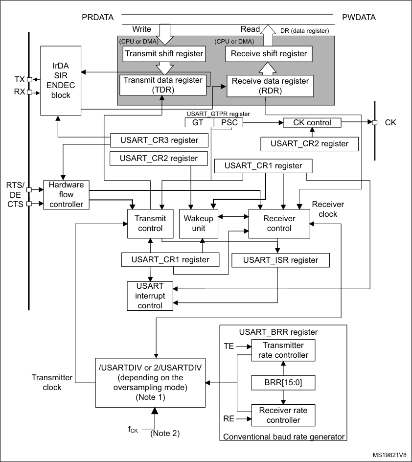

|CPU or DMA) (CPU or DMA) Transmit shift register Receive shift register Transmit data register Receive data register (TDR) (RDR)|Col2|
|---|---|
|Transmit data register (TDR)|Transmit data register (TDR)|
|||
|||

|USART_CR3 register|Col2|Col3|Col4|
|---|---|---|---|
|USART_CR2 register|USART_CR2 register|USART_CR2 register|USART_CR2 register|
|USART_CR2 register|USART_CR2 register|USART_CR2 register||
|USART_CR2 register|USART_CR2 register|||
|USART_CR2 register||||

1. For details on coding USARTDIV in the USART_BRR register, refer to _Section 24.5.4: USART baud rate_
_generation_ .

2. f CK can be f LSE, f HSI, f PCLK, f SYS .

RM0377 Rev 10 661/905

767

--- end of page=660 ---

**Universal synchronous/asynchronous receiver transmitter (USART/UART)** **RM0377**

**24.5.1** **USART character description**

The word length can be selected as being either 7 or 8 or 9 bits by programming the M[1:0]
bits in the USART_CR1 register (see _Figure 214_ ).

      - 7-bit character length: M[1:0] = 10

      - 8-bit character length: M[1:0] = 00

      - 9-bit character length: M[1:0] = 01

_Note:_ _The 7-bit mode is supported only on some USARTs. In addition, not all modes are_
_supported in 7-bit data length mode. Refer to Section 24.4: USART implementation for_
_additional information._

By default, the signal (TX or RX) is in low state during the start bit. It is in high state during
the stop bit.

These values can be inverted, separately for each signal, through polarity configuration
control.

An _**Idle character**_ is interpreted as an entire frame of “1”s (the number of “1”s includes the
number of stop bits).

A _**Break character**_ is interpreted on receiving “0”s for a frame period. At the end of the
break frame, the transmitter inserts 2 stop bits.

Transmission and reception are driven by a common baud rate generator, the clock for each
is generated when the enable bit is set respectively for the transmitter and receiver.

The details of each block is given below.

662/905 RM0377 Rev 10

--- end of page=661 ---

**RM0377** **Universal synchronous/asynchronous receiver transmitter (USART/UART)**

**Figure 214. Word length programming**

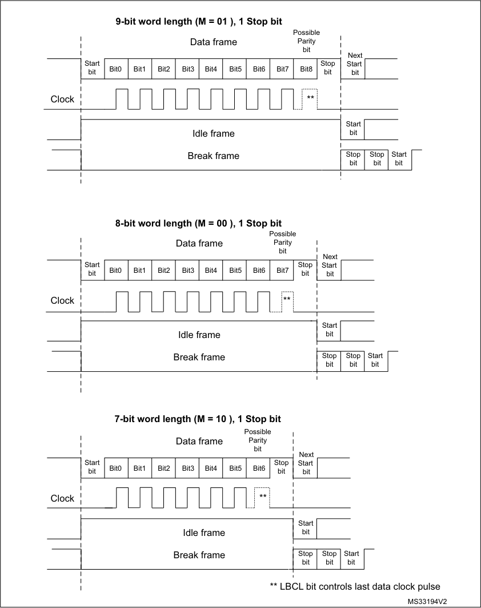

|Idle frame Break frame|Col2|Col3|
|---|---|---|
|Idle frame Break frame|Stop bit|Stop bit|

|Idle frame Break frame|Col2|Col3|
|---|---|---|
|Idle frame Break frame|Stop bit|Stop bit|

RM0377 Rev 10 663/905

767

--- end of page=662 ---

**Universal synchronous/asynchronous receiver transmitter (USART/UART)** **RM0377**

**24.5.2** **USART transmitter**

The transmitter can send data words of either 7, 8 or 9 bits depending on the M bits status.
The Transmit Enable bit (TE) must be set in order to activate the transmitter function. The
data in the transmit shift register is output on the TX pin and the corresponding clock pulses
are output on the CK pin.

**Character transmission**

During an USART transmission, data shifts out least significant bit first (default
configuration) on the TX pin. In this mode, the USART_TDR register consists of a buffer
(TDR) between the internal bus and the transmit shift register (see _Figure 213_ ).

Every character is preceded by a start bit which is a logic level low for one bit period. The
character is terminated by a configurable number of stop bits.

The following stop bits are supported by USART: 0.5, 1, 1.5 and 2 stop bits.

_Note:_ _The TE bit must be set before writing the data to be transmitted to the USART_TDR._

_The TE bit should not be reset during transmission of data. Resetting the TE bit during the_
_transmission will corrupt the data on the TX pin as the baud rate counters will get frozen._
_The current data being transmitted will be lost._

_An idle frame will be sent after the TE bit is enabled._

**Configurable stop bits**

The number of stop bits to be transmitted with every character can be programmed in
Control register 2, bits 13,12.

      - _**1 stop bit**_ **:** This is the default value of number of stop bits.

      - _**2 stop bits**_ **:** This will be supported by normal USART, Single-wire and Modem modes.

      - _**1.5 stop bits**_ **:** To be used in Smartcard mode.

      - _**0.5 stop bit**_ : To be used when receiving data in Smartcard mode.

An idle frame transmission will include the stop bits.

A break transmission will be 10 low bits (when M[1:0] = 00) or 11 low bits (when M[1:0] = 01)
or 9 low bits (when M[1:0] = 10) followed by 2 stop bits (see _Figure 215_ ). It is not possible to
transmit long breaks (break of length greater than 9/10/11 low bits).

664/905 RM0377 Rev 10

--- end of page=663 ---

**RM0377** **Universal synchronous/asynchronous receiver transmitter (USART/UART)**

**Figure 215. Configurable stop bits**

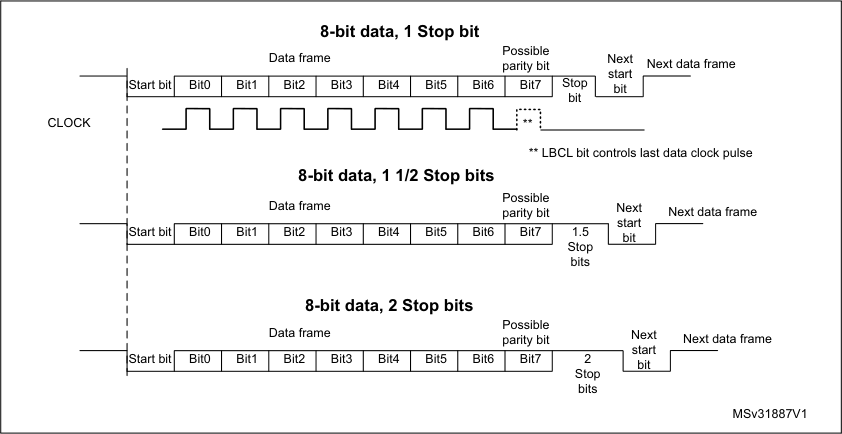

|Col1|Col2|Col3|Col4|Col5|Col6|Col7|Col8|Col9|Col10|Col11|Col12|Col13|Col14|Col15|parity b|s bit|
|---|---|---|---|---|---|---|---|---|---|---|---|---|---|---|---|---|
|Start bit||Bit0||Bit1||Bit2||Bit3||Bit4||Bit5||Bit6|Bit7|1.5  |
|Start bit||Bit0||Bit1||Bit2||Bit3||Bit4||Bit5||Bit6|Bit7|Stop|

**Character transmission procedure**

1. Program the M bits in USART_CR1 to define the word length.

2. Select the desired baud rate using the USART_BRR register.

3. Program the number of stop bits in USART_CR2.

4. Enable the USART by writing the UE bit in USART_CR1 register to 1.

5. Select DMA enable (DMAT) in USART_CR3 if multibuffer communication is to take
place. Configure the DMA register as explained in multibuffer communication.

6. Set the TE bit in USART_CR1 to send an idle frame as first transmission.

7. Write the data to send in the USART_TDR register (this clears the TXE bit). Repeat this
for each data to be transmitted in case of single buffer.

8. After writing the last data into the USART_TDR register, wait until TC=1. This indicates
that the transmission of the last frame is complete. This is required for instance when
the USART is disabled or enters the Halt mode to avoid corrupting the last
transmission.

For code example, refer to _A.15.1: USART transmitter configuration code example_ .

**Single byte communication**

Clearing the TXE bit is always performed by a write to the transmit data register.

The TXE bit is set by hardware and it indicates:

- The data has been moved from the USART_TDR register to the shift register and the
data transmission has started.

- The USART_TDR register is empty.

- The next data can be written in the USART_TDR register without overwriting the
previous data.

For code example, refer to _A.15.2: USART transmit byte code example_ .

This flag generates an interrupt if the TXEIE bit is set.

RM0377 Rev 10 665/905

767

--- end of page=664 ---

**Universal synchronous/asynchronous receiver transmitter (USART/UART)** **RM0377**

When a transmission is taking place, a write instruction to the USART_TDR register stores
the data in the TDR register; next, the data is copied in the shift register at the end of the
currently ongoing transmission.

When no transmission is taking place, a write instruction to the USART_TDR register places
the data in the shift register, the data transmission starts, and the TXE bit is set.

If a frame is transmitted (after the stop bit) and the TXE bit is set, the TC bit goes high. An
interrupt is generated if the TCIE bit is set in the USART_CR1 register.

After writing the last data in the USART_TDR register, it is mandatory to wait for TC=1
before disabling the USART or causing the microcontroller to enter the low-power mode
(see _Figure 216: TC/TXE behavior when transmitting_ ).

**Figure 216. TC/TXE behavior when transmitting**

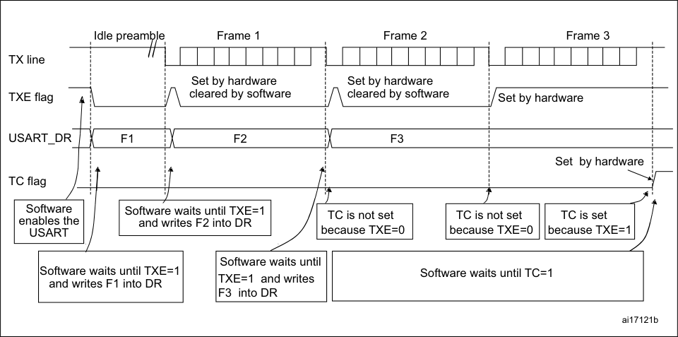

|Col1|Idle preamble|Col3|Col4|Col5|
|---|---|---|---|---|
||||||
||||||
||F1|F2|F3||
|||||Set  by hardware|

For code example, refer to _A.15.3: USART transfer complete code example_ .

**Break characters**

Setting the SBKRQ bit transmits a break character. The break frame length depends on the
M bits (see _Figure 214_ ).

If a ‘1’ is written to the SBKRQ bit, a break character is sent on the TX line after completing
the current character transmission. The SBKF bit is set by the write operation and it is reset
by hardware when the break character is completed (during the stop bits after the break
character). The USART inserts a logic 1 signal (STOP) for the duration of 2 bits at the end of
the break frame to guarantee the recognition of the start bit of the next frame.

In the case the application needs to send the break character following all previously
inserted data, including the ones not yet transmitted, the software should wait for the TXE
flag assertion before setting the SBKRQ bit.

**Idle characters**

Setting the TE bit drives the USART to send an idle frame before the first data frame.

666/905 RM0377 Rev 10

--- end of page=665 ---

**RM0377** **Universal synchronous/asynchronous receiver transmitter (USART/UART)**

**24.5.3** **USART receiver**

The USART can receive data words of either 7, 8 or 9 bits depending on the M bits in the
USART_CR1 register.

**Start bit detection**

The start bit detection sequence is the same when oversampling by 16 or by 8.

In the USART, the start bit is detected when a specific sequence of samples is recognized.
This sequence is: 1 1 1 0 X 0 X 0X 0X 0 X 0X 0.

**Figure 217. Start bit detection when oversampling by 16 or 8**

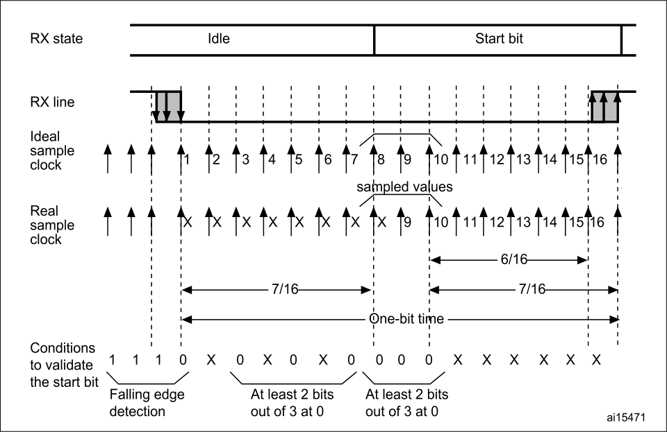

_Note:_ _If the sequence is not complete, the start bit detection aborts and the receiver returns to the_
_idle state (no flag is set), where it waits for a falling edge._

The start bit is confirmed (RXNE flag set, interrupt generated if RXNEIE=1) if the 3 sampled
bits are at 0 (first sampling on the 3rd, 5th and 7th bits finds the 3 bits at 0 and second
sampling on the 8th, 9th and 10th bits also finds the 3 bits at 0).

The start bit is validated (RXNE flag set, interrupt generated if RXNEIE=1) but the NF noise
flag is set if,

a) for both samplings, 2 out of the 3 sampled bits are at 0 (sampling on the 3rd, 5th
and 7th bits and sampling on the 8th, 9th and 10th bits)

or

b) for one of the samplings (sampling on the 3rd, 5th and 7th bits or sampling on the
8th, 9th and 10th bits), 2 out of the 3 bits are found at 0.

RM0377 Rev 10 667/905

767

--- end of page=666 ---

**Universal synchronous/asynchronous receiver transmitter (USART/UART)** **RM0377**

If neither conditions a. or b. are met, the start detection aborts and the receiver returns to the
idle state (no flag is set).

**Character reception**

During an USART reception, data shifts in least significant bit first (default configuration)
through the RX pin. In this mode, the USART_RDR register consists of a buffer (RDR)
between the internal bus and the receive shift register.

**Character reception procedure**

1. Program the M bits in USART_CR1 to define the word length.

2. Select the desired baud rate using the baud rate register USART_BRR

3. Program the number of stop bits in USART_CR2.

4. Enable the USART by writing the UE bit in USART_CR1 register to 1.

5. Select DMA enable (DMAR) in USART_CR3 if multibuffer communication is to take
place. Configure the DMA register as explained in multibuffer communication.

6. Set the RE bit USART_CR1. This enables the receiver which begins searching for a
start bit.

For code example, refer to _A.15.4: USART receiver configuration code example_ .

When a character is received:

      - The RXNE bit is set to indicate that the content of the shift register is transferred to the
RDR. In other words, data has been received and can be read (as well as its
associated error flags).

      - An interrupt is generated if the RXNEIE bit is set.

      - The error flags can be set if a frame error, noise or an overrun error has been detected
during reception. PE flag can also be set with RXNE.

      - In multibuffer, RXNE is set after every byte received and is cleared by the DMA read of
the Receive data Register.

      - In single buffer mode, clearing the RXNE bit is performed by a software read to the
USART_RDR register. The RXNE flag can also be cleared by writing 1 to the RXFRQ
in the USART_RQR register. The RXNE bit must be cleared before the end of the
reception of the next character to avoid an overrun error.

For code example, refer to _A.15.5: USART receive byte code example_ .

**Break character**

When a break character is received, the USART handles it as a framing error.

**Idle character**

When an idle frame is detected, there is the same procedure as for a received data
character plus an interrupt if the IDLEIE bit is set.

668/905 RM0377 Rev 10

--- end of page=667 ---

**RM0377** **Universal synchronous/asynchronous receiver transmitter (USART/UART)**

**Overrun error**

An overrun error occurs when a character is received when RXNE has not been reset. Data
can not be transferred from the shift register to the RDR register until the RXNE bit is
cleared.

The RXNE flag is set after every byte received. An overrun error occurs if RXNE flag is set
when the next data is received or the previous DMA request has not been serviced. When

an overrun error occurs:

      - The ORE bit is set.

      - The RDR content will not be lost. The previous data is available when a read to
USART_RDR is performed.

      - The shift register will be overwritten. After that point, any data received during overrun
is lost.

      - An interrupt is generated if either the RXNEIE bit is set or EIE bit is set.

      - The ORE bit is reset by setting the ORECF bit in the ICR register.

_Note:_ _The ORE bit, when set, indicates that at least 1 data has been lost. There are two_
_possibilities:_

_- if RXNE=1, then the last valid data is stored in the receive register RDR and can be read,_

_- if RXNE=0, then it means that the last valid data has already been read and thus there is_
_nothing to be read in the RDR. This case can occur when the last valid data is read in the_
_RDR at the same time as the new (and lost) data is received._

**Selecting the proper oversampling method**

When the dual clock domain with the wakeup from Stop mode is supported, the clock
source can be one of the following sources: PCLK (default), LSE, HSI16 or SYSCLK.
Otherwise, the USART clock source is PCLK.

Choosing LSE or HSI16 as clock source may allow the USART to receive data while the
MCU is in low-power mode. Depending on the received data and wakeup mode selection,
the USART wakes up the MCU, when needed, in order to transfer the received data by
software reading the USART_RDR register or by DMA.

For the other clock sources, the system must be active in order to allow USART
communication.

The receiver implements different user-configurable oversampling techniques for data
recovery by discriminating between valid incoming data and noise. This allows a trade-off
between the maximum communication speed and noise/clock inaccuracy immunity.

The oversampling method can be selected by programming the OVER8 bit in the
USART_CR1 register and can be either 16 or 8 times the baud rate clock ( _Figure 218_ and
_Figure 219_ ).

Depending on the application:

      - Select oversampling by 8 (OVER8=1) to achieve higher speed (up to f CK /8). In this
case the maximum receiver tolerance to clock deviation is reduced (refer to
_Section 24.5.5: Tolerance of the USART receiver to clock deviation on page 674_ )

      - Select oversampling by 16 (OVER8=0) to increase the tolerance of the receiver to
clock deviations. In this case, the maximum speed is limited to maximum f CK /16 where
f CK is the clock source frequency.

RM0377 Rev 10 669/905

767

--- end of page=668 ---

**Universal synchronous/asynchronous receiver transmitter (USART/UART)** **RM0377**

Programming the ONEBIT bit in the USART_CR3 register selects the method used to
evaluate the logic level. There are two options:

      - The majority vote of the three samples in the center of the received bit. In this case,
when the 3 samples used for the majority vote are not equal, the NF bit is set

      - A single sample in the center of the received bit

Depending on the application:

–
select the three samples’ majority vote method (ONEBIT=0) when operating in a
noisy environment and reject the data when a noise is detected (refer to
_Figure 118_ ) because this indicates that a glitch occurred during the sampling.

–
select the single sample method (ONEBIT=1) when the line is noise-free to
increase the receiver’s tolerance to clock deviations (see _Section 24.5.5:_
_Tolerance of the USART receiver to clock deviation on page 674_ ). In this case the
NF bit will never be set.

When noise is detected in a frame:

      - The NF bit is set at the rising edge of the RXNE bit.

      - The invalid data is transferred from the Shift register to the USART_RDR register.

      - No interrupt is generated in case of single byte communication. However this bit rises
at the same time as the RXNE bit which itself generates an interrupt. In case of
multibuffer communication an interrupt will be issued if the EIE bit is set in the
USART_CR3 register.

The NF bit is reset by setting NFCF bit in ICR register.

_Note:_ _Oversampling by 8 is not available in LIN, Smartcard and IrDA modes. In those modes, the_
_OVER8 bit is forced to ‘0’ by hardware._

**Figure 218. Data sampling when oversampling by 16**

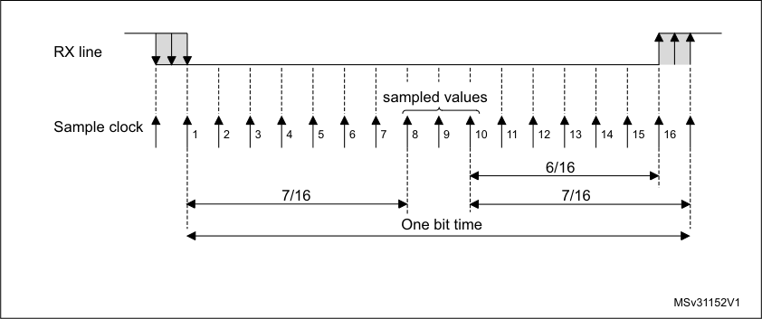

670/905 RM0377 Rev 10

--- end of page=669 ---

**RM0377** **Universal synchronous/asynchronous receiver transmitter (USART/UART)**

**Figure 219. Data sampling when oversampling by 8**

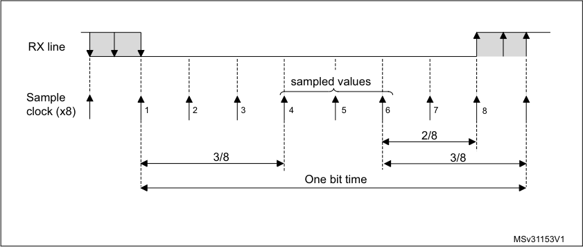

**Table 118. Noise detection from sampled data**

|Sampled value|NE status|Received bit value|
|---|---|---|
|000|0|0|
|001|1|0|
|010|1|0|
|011|1|1|
|100|1|0|
|101|1|1|
|110|1|1|
|111|0|1|

**Framing error**

A framing error is detected when the stop bit is not recognized on reception at the expected
time, following either a de-synchronization or excessive noise.

When the framing error is detected:

- The FE bit is set by hardware

- The invalid data is transferred from the Shift register to the USART_RDR register.

- No interrupt is generated in case of single byte communication. However this bit rises
at the same time as the RXNE bit which itself generates an interrupt. In case of
multibuffer communication an interrupt will be issued if the EIE bit is set in the
USART_CR3 register.

The FE bit is reset by writing 1 to the FECF in the USART_ICR register.

RM0377 Rev 10 671/905

767

--- end of page=670 ---

**Universal synchronous/asynchronous receiver transmitter (USART/UART)** **RM0377**

**Configurable stop bits during reception**

The number of stop bits to be received can be configured through the control bits of Control
Register 2 - it can be either 1 or 2 in normal mode and 0.5 or 1.5 in Smartcard mode.

     - _**0.5 stop bit (reception in Smartcard mode)**_ _: No sampling is done for 0.5 stop bit. As_
_a consequence, no framing error and no break frame can be detected when 0.5 stop bit_
_is selected._

      - _**1 stop bit**_ : Sampling for 1 stop Bit is done on the 8th, 9th and 10th samples.

      - _**1.5 stop bits (Smartcard mode)**_ : When transmitting in Smartcard mode, the device
must check that the data is correctly sent. Thus the receiver block must be enabled (RE
=1 in the USART_CR1 register) and the stop bit is checked to test if the smartcard has
detected a parity error. In the event of a parity error, the smartcard forces the data
signal low during the sampling - NACK signal-, which is flagged as a framing error.
Then, the FE flag is set with the RXNE at the end of the 1.5 stop bits. Sampling for 1.5
stop bits is done on the 16th, 17th and 18th samples (1 baud clock period after the
beginning of the stop bit). The 1.5 stop bits can be decomposed into 2 parts: one 0.5
baud clock period during which nothing happens, followed by 1 normal stop bit period
during which sampling occurs halfway through. Refer to _Section 24.5.13: USART_
_Smartcard mode on page 686_ for more details.

      - _**2 stop bits**_ : Sampling for 2 stop bits is done on the 8th, 9th and 10th samples of the
first stop bit. If a framing error is detected during the first stop bit the framing error flag
will be set. The second stop bit is not checked for framing error. The RXNE flag will be
set at the end of the first stop bit.

**24.5.4** **USART baud rate generation**

The baud rate for the receiver and transmitter (Rx and Tx) are both set to the same value as
programmed in the USART_BRR register.

**Equation 1: Baud rate for standard USART (SPI mode included) (OVER8 = 0 or 1)**

In case of oversampling by 16, the equation is:

f
Tx/Rx baud = -------------------------------- CK
USARTDIV

In case of oversampling by 8, the equation is:

2 × f
Tx/Rx baud = -------------------------------- CK
USARTDIV

**Equation 2: Baud rate in Smartcard, LIN and IrDA modes (OVER8 = 0)**

In Smartcard, LIN and IrDA modes, only Oversampling by 16 is supported:

Tx/Rx baud = -------------------------------- f CK
USARTDIV

672/905 RM0377 Rev 10

--- end of page=671 ---

**RM0377** **Universal synchronous/asynchronous receiver transmitter (USART/UART)**

USARTDIV is an unsigned fixed point number that is coded on the USART_BRR register.

      - When OVER8 = 0, BRR = USARTDIV.

      - When OVER8 = 1

–
BRR[2:0] = USARTDIV[3:0] shifted 1 bit to the right.

–
BRR[3] must be kept cleared.

–
BRR[15:4] = USARTDIV[15:4]

_Note:_ _The baud counters are updated to the new value in the baud registers after a write operation_
_to USART_BRR. Hence the baud rate register value should not be changed during_
_communication._

_In case of oversampling by 16 or 8, USARTDIV must be greater than or equal to 16d._

**How to derive USARTDIV from USART_BRR register values**

**Example 1**

To obtain 9600 baud with f CK = 8 MHz.

      - In case of oversampling by 16:

USARTDIV = 8 000 000/9600

BRR = USARTDIV = 833d = 0341h

      - In case of oversampling by 8:

USARTDIV = 2 * 8 000 000/9600

USARTDIV = 1666,66 (1667d = 683h)

BRR[3:0] = 3h >> 1 = 1h

BRR = 0x681

**Example 2**

To obtain 921.6 kbaud with f CK = 32 MHz.

      - In case of oversampling by 16:

USARTDIV = 32 000 000/921 600

BRR = USARTDIV = 35d = 23h

      - In case of oversampling by 8:

USARTDIV = 2 * 32 000 000/921 600

USARTDIV = 70d = 46h

BRR[3:0] = USARTDIV[3:0] >> 1 = 6h >> 1 = 3h

BRR = 0x43

RM0377 Rev 10 673/905

767

--- end of page=672 ---

**Universal synchronous/asynchronous receiver transmitter (USART/UART)** **RM0377**

**Table 119. Error calculation for programmed baud rates at f** **CK** **= 32 MHz in both cases of**

|Col1|Col2|oversampling by 16 or by 8(|Col4|Col5|CK (1)|Col7|Col8|
|---|---|---|---|---|---|---|---|
|**Baud rate**|**Baud rate**|**Oversampling by 16 (OVER8 = 0)**|**Oversampling by 16 (OVER8 = 0)**|**Oversampling by 16 (OVER8 = 0)**|**Oversampling by 8 (OVER8 = 1)**|**Oversampling by 8 (OVER8 = 1)**|**Oversampling by 8 (OVER8 = 1)**|
|**S.No**|**Desired**|**Actual**|**BRR**|**% Error =** **(Calculated -** **Desired)B.Rate /** **Desired B.Rate**|**Actual**|**BRR**|**% Error**|
|1|2.4 kbaud|2.4 kbaud|0x3415|0|2.4 kbaud|0x6825|0|
|2|9.6 kbaud|9.6 kbaud|0xD05|0|9.6 kbaud|0x1A05|0|
|3|19.2 kbaud|19.19 kbaud|0x683|0.02|19.2 kbaud|0xD02|0|
|4|38.4 kbaud|38.41 kbaud|0x341|0.04|38.39 kbaud|0x681|0.02|
|5|57.6 kbaud|57.55 kbaud|0x22C|0.08|57.6 kbaud|0x453|0|
|6|115.2 kbaud|115.1 kbaud|0x116|0.08|115.11 kbaud|0x226|0.08|
|7|230.4 kbaud|230.21 kbaud|0x8B|0.08|230.21 kbaud|0x113|0.08|
|8|460.8 kbaud|463.76 kbaud|0x045|0.64|460.06 kbaud|0x85|0.08|
|9|921.6 kbaud|914.28 kbaud|0x23|0.79|927.5 kbaud|0x42|0.79|
|10|2 Mbaud|2 Mbaud|0x10|0|2 Mbaud|0x20|0|
|12|4Mbaud|4Mbaud|NA|NA|4Mbaud|0x10|0|

1. The lower the CPU clock the lower the accuracy for a particular baud rate. The upper limit of the achievable baud rate can
be fixed with these data.

**24.5.5** **Tolerance of the USART receiver to clock deviation**

The asynchronous receiver of the USART works correctly only if the total clock system
deviation is less than the tolerance of the USART receiver. The causes which contribute to

the total deviation are:

      - DTRA: Deviation due to the transmitter error (which also includes the deviation of the
transmitter’s local oscillator)

      - DQUANT: Error due to the baud rate quantization of the receiver

      - DREC: Deviation of the receiver’s local oscillator

      - DTCL: Deviation due to the transmission line (generally due to the transceivers which
can introduce an asymmetry between the low-to-high transition timing and the high-tolow transition timing)

DTRA + DQUANT + DREC + DTCL + DWU < USART receiver ′ s tolerance

674/905 RM0377 Rev 10

--- end of page=673 ---

**RM0377** **Universal synchronous/asynchronous receiver transmitter (USART/UART)**

where

DWU is the error due to sampling point deviation when the wakeup from Stop mode is
used.

when M[1:0] = 01:

DWU = --------------------------- t WUUSART
11 × Tbit

when M[1:0] = 00:

DWU = --------------------------- t WUUSART
10 × Tbit

when M[1:0] = 10:

DWU = --------------------------- t WUUSART
9 × Tbit

t WUUSART is the time between:

–
The detection of start bit falling edge

–
The instant when clock (requested by the peripheral) is ready and reaching the
peripheral and regulator is ready.

t WUUSART corresponds to t WUSTOP value provided in the datasheet.

The USART receiver can receive data correctly at up to the maximum tolerated
deviation specified in _Table 120_ and _Table 121_ depending on the following choices:

      - 9-, 10- or 11-bit character length defined by the M bits in the USART_CR1 register

      - Oversampling by 8 or 16 defined by the OVER8 bit in the USART_CR1 register

      - Bits BRR[3:0] of USART_BRR register are equal to or different from 0000.

      - Use of 1 bit or 3 bits to sample the data, depending on the value of the ONEBIT bit in
the USART_CR3 register.

**Table 120. Tolerance of the USART receiver when BRR [3:0] = 0000**

|M bits|OVER8 bit = 0|Col3|OVER8 bit = 1|Col5|
|---|---|---|---|---|
|**M bits**|**ONEBIT=0**|**ONEBIT=1**|**ONEBIT=0**|**ONEBIT=1**|
|00|3.75%|4.375%|2.50%|3.75%|
|01|3.41%|3.97%|2.27%|3.41%|
|10|4.16%|4.86%|2.77%|4.16%|

**Table 121. Tolerance of the USART receiver when BRR [3:0] is different from 0000**

|M bits|OVER8 bit = 0|Col3|OVER8 bit = 1|Col5|
|---|---|---|---|---|
|**M bits**|**ONEBIT=0**|**ONEBIT=1**|**ONEBIT=0**|**ONEBIT=1**|
|00|3.33%|3.88%|2%|3%|
|01|3.03%|3.53%|1.82%|2.73%|
|10|3.7%|4.31%|2.22%|3.33%|

RM0377 Rev 10 675/905

767

--- end of page=674 ---

**Universal synchronous/asynchronous receiver transmitter (USART/UART)** **RM0377**

_Note:_ _The data specified in Table 120_ _and Table 121 may slightly differ in the special case when_
_the received frames contain some Idle frames of exactly 10-bit durations when M bits = 00_
_(11-bit durations when M bits =01 or 9- bit durations when M bits = 10)._

**24.5.6** **USART auto baud rate detection**

The USART is able to detect and automatically set the USART_BRR register value based
on the reception of one character. Automatic baud rate detection is useful under two
circumstances:

      - The communication speed of the system is not known in advance

      - The system is using a relatively low accuracy clock source and this mechanism allows
the correct baud rate to be obtained without measuring the clock deviation.

The clock source frequency must be compatible with the expected communication speed
(when oversampling by 16, the baud rate is between f CK /65535 and f CK /16. when
oversampling by 8, the baud rate is between f CK /65535 and f CK /8).

Before activating the auto baud rate detection, the auto baud rate detection mode must be
chosen. There are various modes based on different character patterns.

They can be chosen through the ABRMOD[1:0] field in the USART_CR2 register. In these
auto baud rate modes, the baud rate is measured several times during the synchronization
data reception and each measurement is compared to the previous one.

These modes are:

      - **Mode 0** : Any character starting with a bit at 1. In this case the USART measures the
duration of the Start bit (falling edge to rising edge).

      - **Mode 1:** Any character starting with a 10xx bit pattern. In this case, the USART
measures the duration of the Start and of the 1st data bit. The measurement is done
falling edge to falling edge, ensuring better accuracy in the case of slow signal slopes.

      - **Mode 2** : A 0x7F character frame (it may be a 0x7F character in LSB first mode or a
0xFE in MSB first mode). In this case, the baud rate is updated first at the end of the
start bit (BRs), then at the end of bit 6 (based on the measurement done from falling
edge to falling edge: BR6). Bit 0 to bit 6 are sampled at BRs while further bits of the
character are sampled at BR6.

      - **Mode 3** : A 0x55 character frame. In this case, the baud rate is updated first at the end
of the start bit (BRs), then at the end of bit 0 (based on the measurement done from
falling edge to falling edge: BR0), and finally at the end of bit 6 (BR6). Bit 0 is sampled
at BRs, bit 1 to bit 6 are sampled at BR0, and further bits of the character are sampled
at BR6.

In parallel, another check is performed for each intermediate transition of RX line. An
error is generated if the transitions on RX are not sufficiently synchronized with the
receiver (the receiver being based on the baud rate calculated on bit 0).

Prior to activating auto baud rate detection, the USART_BRR register must be initialized by
writing a non-zero baud rate value.

The automatic baud rate detection is activated by setting the ABREN bit in the USART_CR2
register. The USART will then wait for the first character on the RX line. The auto baud rate
operation completion is indicated by the setting of the ABRF flag in the USART_ISR
register. If the line is noisy, the correct baud rate detection cannot be guaranteed. In this
case the BRR value may be corrupted and the ABRE error flag will be set. This also
happens if the communication speed is not compatible with the automatic baud rate

676/905 RM0377 Rev 10

--- end of page=675 ---

**RM0377** **Universal synchronous/asynchronous receiver transmitter (USART/UART)**

detection range (bit duration not between 16 and 65536 clock periods (oversampling by 16)
and not between 8 and 65536 clock periods (oversampling by 8)).

The RXNE interrupt will signal the end of the operation.

At any later time, the auto baud rate detection may be relaunched by resetting the ABRF
flag (by writing a 0).

_Note:_ _If the USART is disabled (UE=0) during an auto baud rate operation, the BRR value may be_
_corrupted._

**24.5.7** **Multiprocessor communication using USART**

In multiprocessor communication, the following bits are to be kept cleared:

      - LINEN bit in the USART_CR2 register,

      - HDSEL, IREN and SCEN bits in the USART_CR3 register.

It is possible to perform multiprocessor communication with the USART (with several
USARTs connected in a network). For instance one of the USARTs can be the master, its TX
output connected to the RX inputs of the other USARTs. The others are slaves, their
respective TX outputs are logically ANDed together and connected to the RX input of the
master.

In multiprocessor configurations it is often desirable that only the intended message
recipient should actively receive the full message contents, thus reducing redundant USART
service overhead for all non addressed receivers.

The non addressed devices may be placed in mute mode by means of the muting function.
In order to use the mute mode feature, the MME bit must be set in the USART_CR1
register.

In mute mode:

      - None of the reception status bits can be set.

      - All the receive interrupts are inhibited.

      - The RWU bit in USART_ISR register is set to 1. RWU can be controlled automatically
by hardware or by software, through the MMRQ bit in the USART_RQR register, under
certain conditions.

The USART can enter or exit from mute mode using one of two methods, depending on the
WAKE bit in the USART_CR1 register:

      - Idle Line detection if the WAKE bit is reset,

      - Address Mark detection if the WAKE bit is set.

RM0377 Rev 10 677/905

767

--- end of page=676 ---

**Universal synchronous/asynchronous receiver transmitter (USART/UART)** **RM0377**

**Idle line detection (WAKE=0)**

The USART enters mute mode when the MMRQ bit is written to 1 and the RWU is
automatically set.

It wakes up when an Idle frame is detected. Then the RWU bit is cleared by hardware but
the IDLE bit is not set in the USART_ISR register. An example of mute mode behavior using
Idle line detection is given in _Figure 220_ .

**Figure 220. Mute mode using Idle line detection**

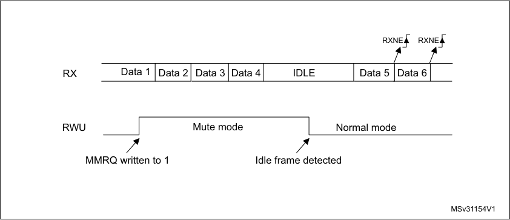

_Note:_ _If the MMRQ is set while the IDLE character has already elapsed, mute mode will not be_
_entered (RWU is not set)._

_If the USART is activated while the line is IDLE, the idle state is detected after the duration_
_of one IDLE frame (not only after the reception of one character frame)._

**4-bit/7-bit address mark detection (WAKE=1)**

In this mode, bytes are recognized as addresses if their MSB is a ‘1’ otherwise they are
considered as data. In an address byte, the address of the targeted receiver is put in the 4
or 7 LSBs. The choice of 7 or 4-bit address detection is done using the ADDM7 bit. This 4bit/7-bit word is compared by the receiver with its own address which is programmed in the
ADD bits in the USART_CR2 register.

_Note:_ _In 7-bit and 9-bit data modes, address detection is done on 6-bit and 8-bit addresses_
_(ADD[5:0] and ADD[7:0]) respectively._

The USART enters mute mode when an address character is received which does not

match its programmed address. In this case, the RWU bit is set by hardware. The RXNE
flag is not set for this address byte and no interrupt or DMA request is issued when the
USART enters mute mode.

The USART also enters mute mode when the MMRQ bit is written to 1. The RWU bit is also
automatically set in this case.

The USART exits from mute mode when an address character is received which matches

the programmed address. Then the RWU bit is cleared and subsequent bytes are received
normally. The RXNE bit is set for the address character since the RWU bit has been
cleared.

An example of mute mode behavior using address mark detection is given in _Figure 221_ .

678/905 RM0377 Rev 10

--- end of page=677 ---

**RM0377** **Universal synchronous/asynchronous receiver transmitter (USART/UART)**

**Figure 221. Mute mode using address mark detection**

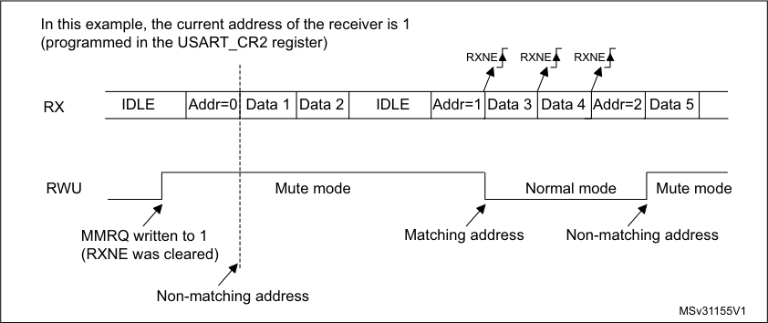

**24.5.8** **Modbus communication using USART**

The USART offers basic support for the implementation of Modbus/RTU and Modbus/ASCII
protocols. Modbus/RTU is a half duplex, block transfer protocol. The control part of the
protocol (address recognition, block integrity control and command interpretation) must be
implemented in software.

The USART offers basic support for the end of the block detection, without software
overhead or other resources.

**Modbus/RTU**

In this mode, the end of one block is recognized by a “silence” (idle line) for more than 2
character times. This function is implemented through the programmable timeout function.

The timeout function and interrupt must be activated, through the RTOEN bit in the
USART_CR2 register and the RTOIE in the USART_CR1 register. The value corresponding
to a timeout of 2 character times (for example 22 x bit duration) must be programmed in the
RTO register. when the receive line is idle for this duration, after the last stop bit is received,
an interrupt is generated, informing the software that the current block reception is
completed.

**Modbus/ASCII**

In this mode, the end of a block is recognized by a specific (CR/LF) character sequence.
The USART manages this mechanism using the character match function.

By programming the LF ASCII code in the ADD[7:0] field and by activating the character
match interrupt (CMIE=1), the software is informed when a LF has been received and can
check the CR/LF in the DMA buffer.

RM0377 Rev 10 679/905

767

--- end of page=678 ---

**Universal synchronous/asynchronous receiver transmitter (USART/UART)** **RM0377**

**24.5.9** **USART parity control**

Parity control (generation of parity bit in transmission and parity checking in reception) can
be enabled by setting the PCE bit in the USART_CR1 register. Depending on the frame
length defined by the M bits, the possible USART frame formats are as listed in _Table 122_ .

**Table 122. Frame formats**

|M bits|PCE bit|USART frame(1)|
|---|---|---|
|00|0|| SB | 8-bit data | STB ||
|00|1|| SB | 7-bit data | PB | STB ||
|01|0|| SB | 9-bit data | STB ||
|01|1|| SB | 8-bit data | PB | STB ||
|10|0|| SB | 7-bit data | STB ||
|10|1|| SB | 6-bit data | PB | STB ||

1. Legends: SB: start bit, STB: stop bit, PB: parity bit. In the data register, the PB is always taking the MSB
position (9th, 8th or 7th, depending on the M bits value).

**Even parity**

The parity bit is calculated to obtain an even number of “1s” inside the frame of the 6, 7 or 8
LSB bits (depending on M bits values) and the parity bit.

As an example, if data=00110101, and 4 bits are set, then the parity bit will be 0 if even
parity is selected (PS bit in USART_CR1 = 0).

**Odd parity**

The parity bit is calculated to obtain an odd number of “1s” inside the frame made of the 6, 7
or 8 LSB bits (depending on M bits values) and the parity bit.

As an example, if data=00110101 and 4 bits set, then the parity bit will be 1 if odd parity is
selected (PS bit in USART_CR1 = 1).

**Parity checking in reception**

If the parity check fails, the PE flag is set in the USART_ISR register and an interrupt is
generated if PEIE is set in the USART_CR1 register. The PE flag is cleared by software
writing 1 to the PECF in the USART_ICR register.

**Parity generation in transmission**

If the PCE bit is set in USART_CR1, then the MSB bit of the data written in the data register
is transmitted but is changed by the parity bit (even number of “1s” if even parity is selected
(PS=0) or an odd number of “1s” if odd parity is selected (PS=1)).

680/905 RM0377 Rev 10

--- end of page=679 ---

**RM0377** **Universal synchronous/asynchronous receiver transmitter (USART/UART)**

**24.5.10** **USART LIN (local interconnection network) mode**

This section is relevant only when LIN mode is supported. Please refer to _Section 24.4:_
_USART implementation on page 659_ .

The LIN mode is selected by setting the LINEN bit in the USART_CR2 register. In LIN
mode, the following bits must be kept cleared:

      - STOP[1:0] and CLKEN in the USART_CR2 register,

      - SCEN, HDSEL and IREN in the USART_CR3 register.

For code example, refer to _A.15.6: USART LIN mode code example_ .

**LIN transmission**

The procedure explained in _Section 24.5.2: USART transmitter_ has to be applied for LIN
Master transmission. It must be the same as for normal USART transmission with the
following differences:

      - Clear the M bits to configure 8-bit word length.

      - Set the LINEN bit to enter LIN mode. In this case, setting the SBKRQ bit sends 13 ‘0’
bits as a break character. Then 2 bits of value ‘1’ are sent to allow the next start

detection.

**LIN reception**

When LIN mode is enabled, the break detection circuit is activated. The detection is totally
independent from the normal USART receiver. A break can be detected whenever it occurs,
during Idle state or during a frame.

When the receiver is enabled (RE=1 in USART_CR1), the circuit looks at the RX input for a
start signal. The method for detecting start bits is the same when searching break
characters or data. After a start bit has been detected, the circuit samples the next bits
exactly like for the data (on the 8th, 9th and 10th samples). If 10 (when the LBDL = 0 in
USART_CR2) or 11 (when LBDL=1 in USART_CR2) consecutive bits are detected as ‘0,
and are followed by a delimiter character, the LBDF flag is set in USART_ISR. If the LBDIE
bit=1, an interrupt is generated. Before validating the break, the delimiter is checked for as it
signifies that the RX line has returned to a high level.

If a ‘1’ is sampled before the 10 or 11 have occurred, the break detection circuit cancels the
current detection and searches for a start bit again.

If the LIN mode is disabled (LINEN=0), the receiver continues working as normal USART,
without taking into account the break detection.

If the LIN mode is enabled (LINEN=1), as soon as a framing error occurs (i.e. stop bit
detected at ‘0’, which will be the case for any break frame), the receiver stops until the break
detection circuit receives either a ‘1’, if the break word was not complete, or a delimiter
character if a break has been detected.

The behavior of the break detector state machine and the break flag is shown on the
_Figure 222: Break detection in LIN mode (11-bit break length - LBDL bit is set) on page 682_ .

Examples of break frames are given on _Figure 223: Break detection in LIN mode vs._
_Framing error detection on page 683_ .

RM0377 Rev 10 681/905

767

--- end of page=680 ---

**Universal synchronous/asynchronous receiver transmitter (USART/UART)** **RM0377**

**Figure 222. Break detection in LIN mode (11-bit break length - LBDL bit is set)**

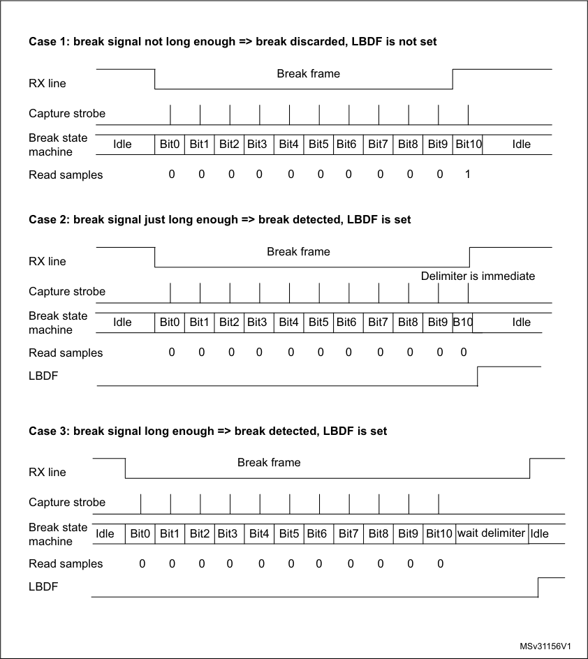

682/905 RM0377 Rev 10

--- end of page=681 ---

**RM0377** **Universal synchronous/asynchronous receiver transmitter (USART/UART)**

**Figure 223. Break detection in LIN mode vs. Framing error detection**

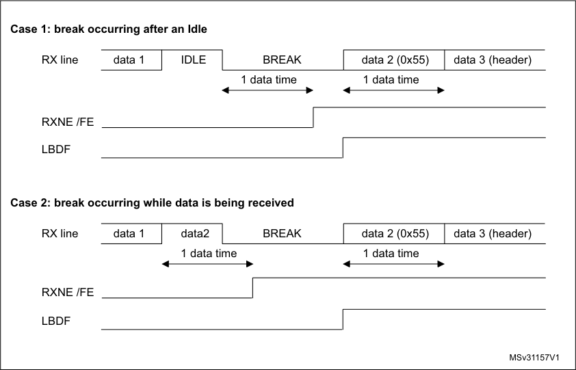

**24.5.11** **USART synchronous mode**

The synchronous mode is selected by writing the CLKEN bit in the USART_CR2 register to
1. In synchronous mode, the following bits must be kept cleared:

      - LINEN bit in the USART_CR2 register,

      - SCEN, HDSEL and IREN bits in the USART_CR3 register.

In this mode, the USART can be used to control bidirectional synchronous serial
communications in master mode. The CK pin is the output of the USART transmitter clock.
No clock pulses are sent to the CK pin during start bit and stop bit. Depending on the state
of the LBCL bit in the USART_CR2 register, clock pulses are, or are not, generated during
the last valid data bit (address mark). The CPOL bit in the USART_CR2 register is used to
select the clock polarity, and the CPHA bit in the USART_CR2 register is used to select the
phase of the external clock (see _Figure 224_, _Figure 225_ and _Figure 226_ ).

During the Idle state, preamble and send break, the external CK clock is not activated.

In synchronous mode the USART transmitter works exactly like in asynchronous mode. But
as CK is synchronized with TX (according to CPOL and CPHA), the data on TX is
synchronous.

In this mode the USART receiver works in a different manner compared to the
asynchronous mode. If RE=1, the data is sampled on CK (rising or falling edge, depending
on CPOL and CPHA), without any oversampling. A setup and a hold time must be
respected (which depends on the baud rate: 1/16 bit duration).

RM0377 Rev 10 683/905

767

--- end of page=682 ---

**Universal synchronous/asynchronous receiver transmitter (USART/UART)** **RM0377**

_Note:_ _The CK pin works in conjunction with the TX pin. Thus, the clock is provided only if the_
_transmitter is enabled (TE=1) and data is being transmitted (the data register USART_TDR_
_written). This means that it is not possible to receive synchronous data without transmitting_
_data._

_The LBCL, CPOL and CPHA bits have to be selected when the USART is disabled (UE=0)_
_to ensure that the clock pulses function correctly._

For code example, refer to _A.15.6: USART LIN mode code example_ .

**Figure 224. USART example of synchronous transmission**

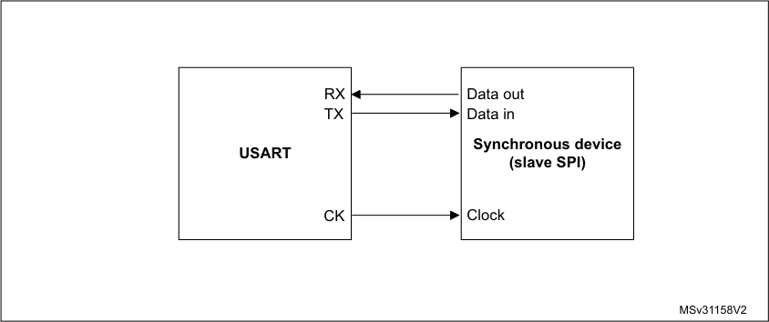

**Figure 225. USART data clock timing diagram (** M bits = 00 **)**

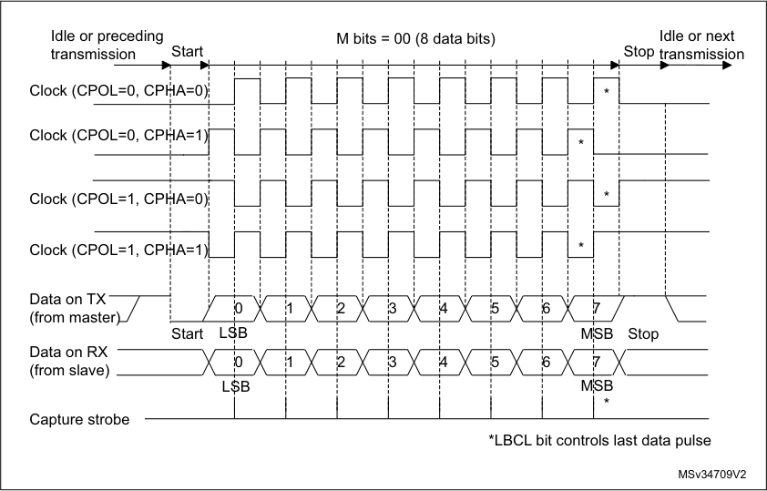

|Start|Col2|Col3|Col4|Col5|M|M bi|its =|= 00|(8 d|data|bits)|)|Col14|Col15|Col16|Col17|Col18|
|---|---|---|---|---|---|---|---|---|---|---|---|---|---|---|---|---|---|
|A=0)||||||||||||||||||
|A=0)||||||||||||||||*|*|
|A=1)||||||||||||||||||
|A=1)|||||||||||||||*|*|*|
|||||||||||||||||*||
|A=0)|||||||||||||||*|*||
|A=0)||||||||||||||||||
|A=0)||||||||||||||||||

684/905 RM0377 Rev 10

--- end of page=683 ---

**RM0377** **Universal synchronous/asynchronous receiver transmitter (USART/UART)**

**Figure 226. USART data clock timing diagram (** M bits = 01 **)**

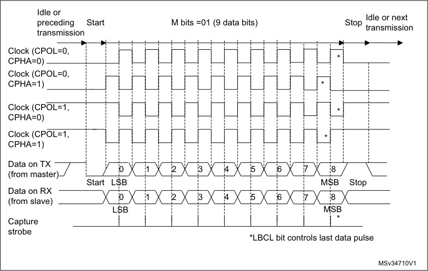

|Col1|Col2|Col3|Col4|Col5|Col6|Col7|Col8|Col9|Col10|Col11|Col12|Col13|Col14|Col15|Col16|Col17|Col18|
|---|---|---|---|---|---|---|---|---|---|---|---|---|---|---|---|---|---|
|||||||||||||||||||
|||||||||||||||||||
||||||||||||||||||*|
|||||||||||||||||||
||||||||||||||||||*|
|||||||||||||||||||
|||||||||||||||||||

|*|Col2|
|---|---|
|*||
|*||
|*||
|||
|||

**Figure 227. RX data setup/hold time**

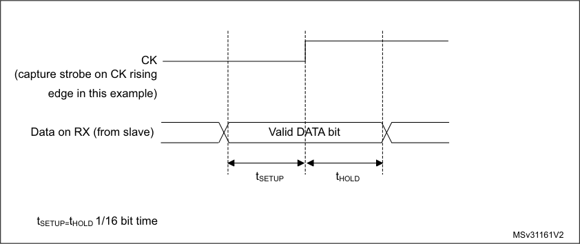

|Col1|Col2|
|---|---|
|||
|Valid D|ATA bit|

_Note:_ _The function of CK is different in Smartcard mode. Refer to Section 24.5.13: USART_

_Smartcard mode for more details._

RM0377 Rev 10 685/905

767

--- end of page=684 ---

**Universal synchronous/asynchronous receiver transmitter (USART/UART)** **RM0377**

**24.5.12** **USART Single-wire Half-duplex communication**

Single-wire Half-duplex mode is selected by setting the HDSEL bit in the USART_CR3
register. In this mode, the following bits must be kept cleared:

      - LINEN and CLKEN bits in the USART_CR2 register,

      - SCEN and IREN bits in the USART_CR3 register.

The USART can be configured to follow a Single-wire Half-duplex protocol where the TX
and RX lines are internally connected. The selection between half- and Full-duplex
communication is made with a control bit HDSEL in USART_CR3.

As soon as HDSEL is written to 1:

      - The TX and RX lines are internally connected

      - The RX pin is no longer used

      - The TX pin is always released when no data is transmitted. Thus, it acts as a standard
I/O in idle or in reception. It means that the I/O must be configured so that TX is
configured as alternate function open-drain with an external pull-up.

Apart from this, the communication protocol is similar to normal USART mode. Any conflicts
on the line must be managed by software (by the use of a centralized arbiter, for instance).
In particular, the transmission is never blocked by hardware and continues as soon as data
is written in the data register while the TE bit is set.

For code example, refer to _A.15.8: USART single-wire half-duplex code example_ .

**24.5.13** **USART Smartcard mode**

This section is relevant only when Smartcard mode is supported. Please refer to
_Section 24.4: USART implementation on page 659_ .

Smartcard mode is selected by setting the SCEN bit in the USART_CR3 register. In
Smartcard mode, the following bits must be kept cleared:

      - LINEN bit in the USART_CR2 register,

      - HDSEL and IREN bits in the USART_CR3 register.

Moreover, the CLKEN bit may be set in order to provide a clock to the smartcard.

The smartcard interface is designed to support asynchronous protocol for smartcards as
defined in the ISO 7816-3 standard. Both T=0 (character mode) and T=1 (block mode) are
supported.

The USART should be configured as:

      - 8 bits plus parity: where word length is set to 8 bits and PCE=1 in the USART_CR1
register

      - 1.5 stop bits when transmitting and receiving data: where STOP=11 in the
USART_CR2 register. It is also possible to choose 0.5 stop bit for receiving.

For code example, refer to _A.15.9: USART smartcard mode code example_ .

In T=0 (character) mode, the parity error is indicated at the end of each character during the
guard time period.

_Figure 228_ shows examples of what can be seen on the data line with and without parity

error.

686/905 RM0377 Rev 10

--- end of page=685 ---

**RM0377** **Universal synchronous/asynchronous receiver transmitter (USART/UART)**

**Figure 228. ISO 7816-3 asynchronous protocol**

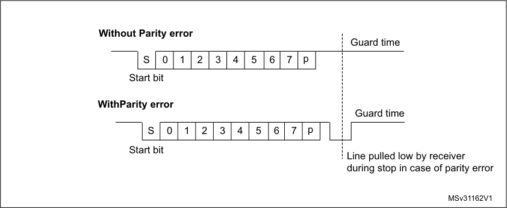

When connected to a smartcard, the TX output of the USART drives a bidirectional line that
is also driven by the smartcard. The TX pin must be configured as open drain.

Smartcard mode implements a single wire half duplex communication protocol.

- Transmission of data from the transmit shift register is guaranteed to be delayed by a
minimum of 1/2 baud clock. In normal operation a full transmit shift register starts
shifting on the next baud clock edge. In Smartcard mode this transmission is further
delayed by a guaranteed 1/2 baud clock.

- In transmission, if the smartcard detects a parity error, it signals this condition to the
USART by driving the line low (NACK). This NACK signal (pulling transmit line low for 1
baud clock) causes a framing error on the transmitter side (configured with 1.5 stop
bits). The USART can handle automatic re-sending of data according to the protocol.
The number of retries is programmed in the SCARCNT bit field. If the USART
continues receiving the NACK after the programmed number of retries, it stops
transmitting and signals the error as a framing error. The TXE bit can be set using the
TXFRQ bit in the USART_RQR register.

- Smartcard auto-retry in transmission: a delay of 2.5 baud periods is inserted between
the NACK detection by the USART and the start bit of the repeated character. The TC
bit is set immediately at the end of reception of the last repeated character (no guardtime). If the software wants to repeat it again, it must insure the minimum 2 baud
periods required by the standard.

- If a parity error is detected during reception of a frame programmed with a 1.5 stop bits
period, the transmit line is pulled low for a baud clock period after the completion of the
receive frame. This is to indicate to the smartcard that the data transmitted to the
USART has not been correctly received. A parity error is NACKed by the receiver if the
NACK control bit is set, otherwise a NACK is not transmitted (to be used in T=1 mode).
If the received character is erroneous, the RXNE/receive DMA request is not activated.
According to the protocol specification, the smartcard must resend the same character.
If the received character is still erroneous after the maximum number of retries
specified in the SCARCNT bit field, the USART stops transmitting the NACK and
signals the error as a parity error.

- Smartcard auto-retry in reception: the BUSY flag remains set if the USART NACKs the
card but the card doesn’t repeat the character.

RM0377 Rev 10 687/905

767

--- end of page=686 ---

**Universal synchronous/asynchronous receiver transmitter (USART/UART)** **RM0377**

      - In transmission, the USART inserts the Guard Time (as programmed in the Guard Time
register) between two successive characters. As the Guard Time is measured after the
stop bit of the previous character, the GT[7:0] register must be programmed to the
desired CGT (Character Guard Time, as defined by the 7816-3 specification) minus 12
(the duration of one character).

      - The assertion of the TC flag can be delayed by programming the Guard Time register.
In normal operation, TC is asserted when the transmit shift register is empty and no
further transmit requests are outstanding. In Smartcard mode an empty transmit shift
register triggers the Guard Time counter to count up to the programmed value in the
Guard Time register. TC is forced low during this time. When the Guard Time counter
reaches the programmed value TC is asserted high.

      - The TCBGT flag can be used to detect the end of data transfer without waiting for
guard time completion. This flag is set just after the end of frame transmission and if no
NACK has been received from the card. The TCGBT flag is available in category 1
devices only.

      - The de-assertion of TC flag is unaffected by Smartcard mode.

      - If a framing error is detected on the transmitter end (due to a NACK from the receiver),
the NACK is not detected as a start bit by the receive block of the transmitter.
According to the ISO protocol, the duration of the received NACK can be 1 or 2 baud
clock periods.

      - On the receiver side, if a parity error is detected and a NACK is transmitted the receiver
does not detect the NACK as a start bit.

_Note:_ _A break character is not significant in Smartcard mode. A 0x00 data with a framing error is_
_treated as data and not as a break._

_No Idle frame is transmitted when toggling the TE bit. The Idle frame (as defined for the_
_other configurations) is not defined by the ISO protocol._

_Figure 229_ details how the NACK signal is sampled by the USART. In this example the
USART is transmitting data and is configured with 1.5 stop bits. The receiver part of the
USART is enabled in order to check the integrity of the data and the NACK signal.

**Figure 229. Parity error detection using the 1.5 stop bits**

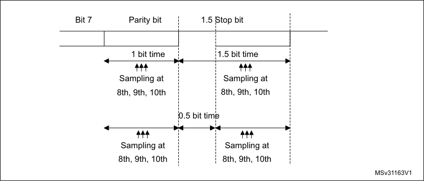

The USART can provide a clock to the smartcard through the CK output. In Smartcard
mode, CK is not associated to the communication but is simply derived from the internal
peripheral input clock through a 5-bit prescaler. The division ratio is configured in the

688/905 RM0377 Rev 10

--- end of page=687 ---

**RM0377** **Universal synchronous/asynchronous receiver transmitter (USART/UART)**

prescaler register USART_GTPR. CK frequency can be programmed from f CK /2 to f CK /62,
where f CK is the peripheral input clock.

**Block mode (T=1)**

In T=1 (block) mode, the parity error transmission is deactivated, by clearing the NACK bit in
the UART_CR3 register.

When requesting a read from the smartcard, in block mode, the software must enable the
receiver Timeout feature by setting the RTOEN bit in the USART_CR2 register and program
the RTO bits field in the RTOR register to the BWT (block wait time) - 11 value. If no answer
is received from the card before the expiration of this period, the RTOF flag will be set and a
timeout interrupt will be generated (if RTOIE bit in the USART_CR1 register is set). If the
first character is received before the expiration of the period, it is signaled by the RXNE
interrupt.

_Note:_ _The RXNE interrupt must be enabled even when using the USART in DMA mode to read_
_from the smartcard in block mode. In parallel, the DMA must be enabled only after the first_
_received byte._

After the reception of the first character (RXNE interrupt), the RTO bit fields in the RTOR
register must be programmed to the CWT (character wait time) - 11 value, in order to allow
the automatic check of the maximum wait time between two consecutive characters. This

time is expressed in baudtime units. If the smartcard does not send a new character in less
than the CWT period after the end of the previous character, the USART signals this to the
software through the RTOF flag and interrupt (when RTOIE bit is set).

_Note:_ _The RTO counter starts counting:_

_- From the end of the stop bit in case STOP = 00._

_- From the end of the second stop bit in case of STOP = 10._

_- 1 bit duration after the beginning of the STOP bit in case STOP = 11._

_- From the beginning of the STOP bit in case STOP = 01._

_As in the Smartcard protocol definition, the BWT/CWT values are defined from the_
_beginning (start bit) of the last character. The RTO register must be programmed to BWT -_
_11 or CWT -11, respectively, taking into account the length of the last character itself._

A block length counter is used to count all the characters received by the USART. This
counter is reset when the USART is transmitting (TXE=0). The length of the block is
communicated by the smartcard in the third byte of the block (prologue field). This value
must be programmed to the BLEN field in the USART_RTOR register. when using DMA
mode, before the start of the block, this register field must be programmed to the minimum
value (0x0). with this value, an interrupt is generated after the 4th received character. The
software must read the LEN field (third byte), its value must be read from the receive buffer.

In interrupt driven receive mode, the length of the block may be checked by software or by
programming the BLEN value. However, before the start of the block, the maximum value of
BLEN (0xFF) may be programmed. The real value will be programmed after the reception of
the third character.

If the block is using the LRC longitudinal redundancy check (1 epilogue byte), the
BLEN=LEN. If the block is using the CRC mechanism (2 epilogue bytes), BLEN=LEN+1
must be programmed. The total block length (including prologue, epilogue and information
fields) equals BLEN+4. The end of the block is signaled to the software through the EOBF
flag and interrupt (when EOBIE bit is set).

RM0377 Rev 10 689/905

767

--- end of page=688 ---

**Universal synchronous/asynchronous receiver transmitter (USART/UART)** **RM0377**

In case of an error in the block length, the end of the block is signaled by the RTO interrupt
(Character wait Time overflow).

_Note:_ _The error checking code (LRC/CRC) must be computed/verified by software._

**Direct and inverse convention**

The Smartcard protocol defines two conventions: direct and inverse.

The direct convention is defined as: LSB first, logical bit value of 1 corresponds to a H state
of the line and parity is even. In order to use this convention, the following control bits must
be programmed: MSBFIRST=0, DATAINV=0 (default values).

The inverse convention is defined as: MSB first, logical bit value 1 corresponds to an L state
on the signal line and parity is even. In order to use this convention, the following control bits
must be programmed: MSBFIRST=1, DATAINV=1.

_Note:_ _When logical data values are inverted (0=H, 1=L), the parity bit is also inverted in the same_

_way._

In order to recognize the card convention, the card sends the initial character, TS, as the
first character of the ATR (Answer To Reset) frame. The two possible patterns for the TS
are: LHHL LLL LLH and LHHL HHH LLH.

      - (H) LHHL LLL LLH sets up the inverse convention: state L encodes value 1 and
moment 2 conveys the most significant bit (MSB first). when decoded by inverse
convention, the conveyed byte is equal to '3F'.

      - (H) LHHL HHH LLH sets up the direct convention: state H encodes value 1 and
moment 2 conveys the least significant bit (LSB first). when decoded by direct
convention, the conveyed byte is equal to '3B'.

Character parity is correct when there is an even number of bits set to 1 in the nine
moments 2 to 10.

As the USART does not know which convention is used by the card, it needs to be able to
recognize either pattern and act accordingly. The pattern recognition is not done in
hardware, but through a software sequence. Moreover, supposing that the USART is
configured in direct convention (default) and the card answers with the inverse convention,
TS = LHHL LLL LLH => the USART received character will be ‘03’ and the parity will be odd.

Therefore, two methods are available for TS pattern recognition:

**Method 1**

The USART is programmed in standard Smartcard mode/direct convention. In this case, the
TS pattern reception generates a parity error interrupt and error signal to the card.

      - The parity error interrupt informs the software that the card didn’t answer correctly in
direct convention. Software then reprograms the USART for inverse convention

      - In response to the error signal, the card retries the same TS character, and it will be
correctly received this time, by the reprogrammed USART

Alternatively, in answer to the parity error interrupt, the software may decide to reprogram
the USART and to also generate a new reset command to the card, then wait again for the
TS.

690/905 RM0377 Rev 10

--- end of page=689 ---

**RM0377** **Universal synchronous/asynchronous receiver transmitter (USART/UART)**

**Method 2**

The USART is programmed in 9-bit/no-parity mode, no bit inversion. In this mode it receives
any of the two TS patterns as:

(H) LHHL LLL LLH = 0x103 -> inverse convention to be chosen

(H) LHHL HHH LLH = 0x13B -> direct convention to be chosen

The software checks the received character against these two patterns and, if any of them
match, then programs the USART accordingly for the next character reception.

If none of the two is recognized, a card reset may be generated in order to restart the
negotiation.

**24.5.14** **USART IrDA SIR ENDEC block**

This section is relevant only when IrDA mode is supported. Please refer to _Section 24.4:_
_USART implementation on page 659_ .

IrDA mode is selected by setting the IREN bit in the USART_CR3 register. In IrDA mode,
the following bits must be kept cleared:

      - LINEN, STOP and CLKEN bits in the USART_CR2 register,

      - SCEN and HDSEL bits in the USART_CR3 register.

The IrDA SIR physical layer specifies use of a Return to Zero, Inverted (RZI) modulation
scheme that represents logic 0 as an infrared light pulse (see _Figure 230_ ).

The SIR Transmit encoder modulates the Non Return to Zero (NRZ) transmit bit stream
output from USART. The output pulse stream is transmitted to an external output driver and
infrared LED. USART supports only bit rates up to 115.2 Kbps for the SIR ENDEC. In
normal mode the transmitted pulse width is specified as 3/16 of a bit period.

The SIR receive decoder demodulates the return-to-zero bit stream from the infrared

detector and outputs the received NRZ serial bit stream to the USART. The decoder input is
normally high (marking state) in the Idle state. The transmit encoder output has the opposite
polarity to the decoder input. A start bit is detected when the decoder input is low.

      - IrDA is a half duplex communication protocol. If the Transmitter is busy (when the
USART is sending data to the IrDA encoder), any data on the IrDA receive line is
ignored by the IrDA decoder and if the Receiver is busy (when the USART is receiving
decoded data from the IrDA decoder), data on the TX from the USART to IrDA is not
encoded. while receiving data, transmission should be avoided as the data to be
transmitted could be corrupted.

      - A 0 is transmitted as a high pulse and a 1 is transmitted as a 0. The width of the pulse
is specified as 3/16th of the selected bit period in normal mode (see _Figure 231_ ).

      - The SIR decoder converts the IrDA compliant receive signal into a bit stream for
USART.

      - The SIR receive logic interprets a high state as a logic one and low pulses as logic

zeros.

      - The transmit encoder output has the opposite polarity to the decoder input. The SIR
output is in low state when Idle.

RM0377 Rev 10 691/905

767

--- end of page=690 ---

**Universal synchronous/asynchronous receiver transmitter (USART/UART)** **RM0377**

      - The IrDA specification requires the acceptance of pulses greater than 1.41 µs. The
acceptable pulse width is programmable. Glitch detection logic on the receiver end
filters out pulses of width less than 2 PSC periods (PSC is the prescaler value
programmed in the USART_GTPR). Pulses of width less than 1 PSC period are always
rejected, but those of width greater than one and less than two periods may be
accepted or rejected, those greater than 2 periods will be accepted as a pulse. The
IrDA encoder/decoder doesn’t work when PSC=0.

      - The receiver can communicate with a low-power transmitter.

      - In IrDA mode, the STOP bits in the USART_CR2 register must be configured to “1 stop
bit”.

For code example, refer to _A.15.10: USART IrDA mode code example_ .

**IrDA low-power mode**

**Transmitter**

In low-power mode the pulse width is not maintained at 3/16 of the bit period. Instead, the
width of the pulse is 3 times the low-power baud rate which can be a minimum of 1.42 MHz.

Generally, this value is 1.8432 MHz (1.42 MHz < PSC< 2.12 MHz). A low-power mode
programmable divisor divides the system clock to achieve this value.

**Receiver**

Receiving in low-power mode is similar to receiving in normal mode. For glitch detection the
USART should discard pulses of duration shorter than 1 PSC period. A valid low is accepted
only if its duration is greater than 2 periods of the IrDA low-power Baud clock (PSC value in
the USART_GTPR).

_Note:_ _A pulse of width less than two and greater than one PSC period(s) may or may not be_
_rejected._

_The receiver set up time should be managed by software. The IrDA physical layer_
_specification specifies a minimum of 10 ms delay between transmission and reception (IrDA_
_is a half duplex protocol)._

**Figure 230. IrDA SIR ENDEC- block diagram**

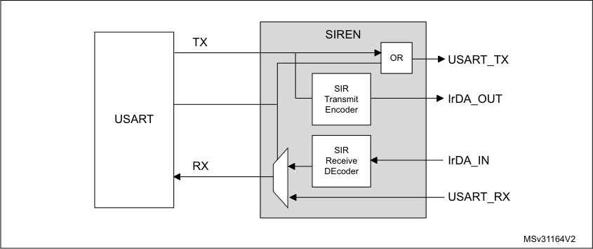

|TX|Col2|
|---|---|
|||
|||

692/905 RM0377 Rev 10

--- end of page=691 ---

**RM0377** **Universal synchronous/asynchronous receiver transmitter (USART/UART)**

**Figure 231. IrDA data modulation (3/16) -Normal Mode**

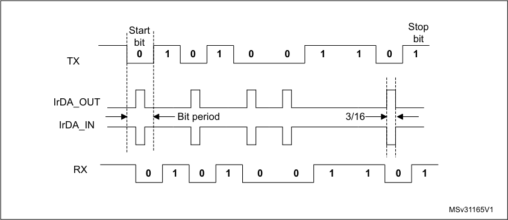

**24.5.15** **USART continuous communication in DMA mode**

The USART is capable of performing continuous communication using the DMA. The DMA
requests for Rx buffer and Tx buffer are generated independently.

_Note:_ _Please refer to Section 24.4: USART implementation on page 659 to determine if the DMA_
_mode is supported. If DMA is not supported, use the USART as explained in Section 24.5.2:_
_USART transmitter or Section 24.5.3: USART receiver. To perform continuous_
_communication, the user can clear the TXE/ RXNE flags In the USART_ISR register._

For code example, refer to _A.15.11: USART DMA code example_ .

**Transmission using DMA**

DMA mode can be enabled for transmission by setting DMAT bit in the USART_CR3
register. Data is loaded from a SRAM area configured using the DMA peripheral (refer to
_Section 10: Direct memory access controller (DMA) on page 241_ ) to the USART_TDR
register whenever the TXE bit is set. To map a DMA channel for USART transmission, use
the following procedure (x denotes the channel number):

1. Write the USART_TDR register address in the DMA control register to configure it as
the destination of the transfer. The data is moved to this address from memory after
each TXE event.

2. Write the memory address in the DMA control register to configure it as the source of
the transfer. The data is loaded into the USART_TDR register from this memory area
after each TXE event.

3. Configure the total number of bytes to be transferred to the DMA control register.

4. Configure the channel priority in the DMA register

5. Configure DMA interrupt generation after half/ full transfer as required by the
application.

6. Clear the TC flag in the USART_ISR register by setting the TCCF bit in the
USART_ICR register.

7. Activate the channel in the DMA register.

When the number of data transfers programmed in the DMA Controller is reached, the DMA
controller generates an interrupt on the DMA channel interrupt vector.

RM0377 Rev 10 693/905

767

--- end of page=692 ---

**Universal synchronous/asynchronous receiver transmitter (USART/UART)** **RM0377**

In transmission mode, once the DMA has written all the data to be transmitted (the TCIF flag
is set in the DMA_ISR register), the TC flag can be monitored to make sure that the USART
communication is complete. This is required to avoid corrupting the last transmission before
disabling the USART or entering Stop mode. Software must wait until TC=1. The TC flag
remains cleared during all data transfers and it is set by hardware at the end of transmission
of the last frame.

**Figure 232. Transmission using DMA**

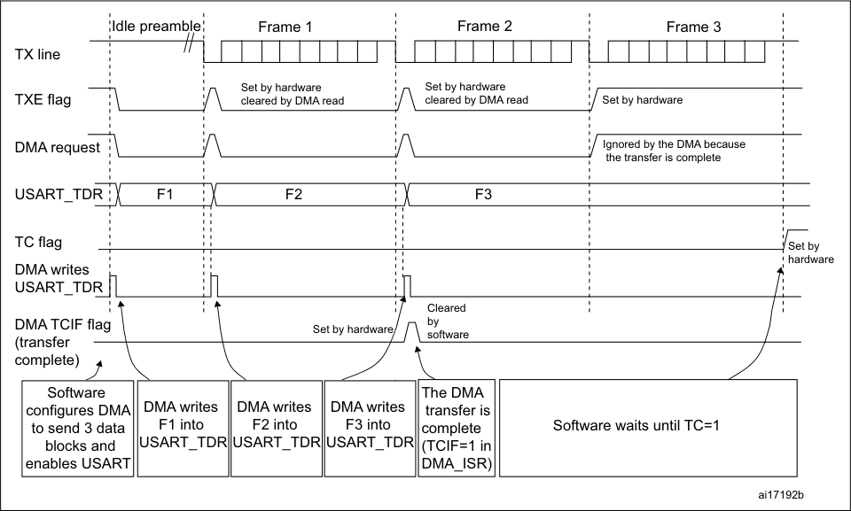

|dle preamble|Col2|Col3|Col4|Col5|Col6|
|---|---|---|---|---|---|
|||||||
|||||||
|||||||
|F1||F2||F3||
|||||||
|||||||

**Reception using DMA**

DMA mode can be enabled for reception by setting the DMAR bit in USART_CR3 register.
Data is loaded from the USART_RDR register to a SRAM area configured using the DMA
peripheral (refer to _Section 10: Direct memory access controller (DMA) on page 241_ )
whenever a data byte is received. To map a DMA channel for USART reception, use the
following procedure:

1. Write the USART_RDR register address in the DMA control register to configure it as
the source of the transfer. The data is moved from this address to the memory after
each RXNE event.

2. Write the memory address in the DMA control register to configure it as the destination
of the transfer. The data is loaded from USART_RDR to this memory area after each
RXNE event.

3. Configure the total number of bytes to be transferred to the DMA control register.

4. Configure the channel priority in the DMA control register

5. Configure interrupt generation after half/ full transfer as required by the application.

6. Activate the channel in the DMA control register.

When the number of data transfers programmed in the DMA Controller is reached, the DMA
controller generates an interrupt on the DMA channel interrupt vector.

694/905 RM0377 Rev 10

--- end of page=693 ---

**RM0377** **Universal synchronous/asynchronous receiver transmitter (USART/UART)**

**Figure 233. Reception using DMA**

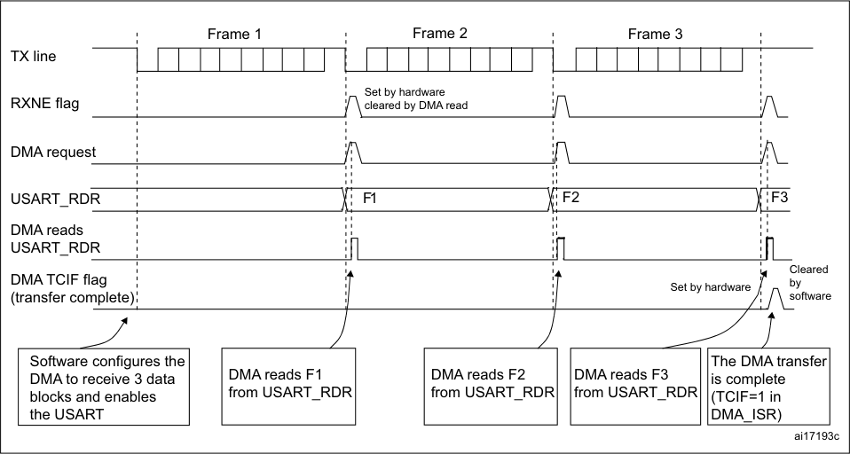

|Col1|Col2|Col3|
|---|---|---|
||||
||F1|F2|
|||Set by hardware|
||||

**Error flagging and interrupt generation in multibuffer communication**

In multibuffer communication if any error occurs during the transaction the error flag is
asserted after the current byte. An interrupt is generated if the interrupt enable flag is set.
For framing error, overrun error and noise flag which are asserted with RXNE in single byte
reception, there is a separate error flag interrupt enable bit (EIE bit in the USART_CR3
register), which, if set, enables an interrupt after the current byte if any of these errors occur.

**24.5.16** **RS232 hardware flow control and RS485 driver enable**
**using USART**

It is possible to control the serial data flow between 2 devices by using the CTS input and
the RTS output. The _Figure 234_ shows how to connect 2 devices in this mode:

**Figure 234. Hardware flow control between 2 USARTs**

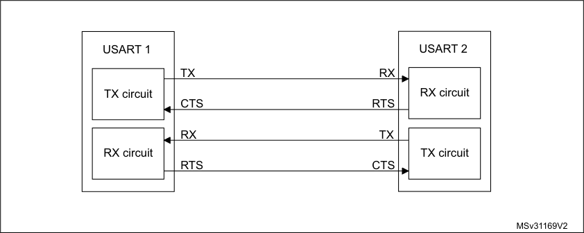

RM0377 Rev 10 695/905

767

--- end of page=694 ---

**Universal synchronous/asynchronous receiver transmitter (USART/UART)** **RM0377**

RS232 RTS and CTS flow control can be enabled independently by writing the RTSE and
CTSE bits respectively to 1 (in the USART_CR3 register).

**RS232 RTS flow control**

If the RTS flow control is enabled (RTSE=1), then RTS is deasserted (tied low) as long as
the USART receiver is ready to receive a new data. When the receive register is full, RTS is
asserted, indicating that the transmission is expected to stop at the end of the current frame.
_Figure 235_ shows an example of communication with RTS flow control enabled.

**Figure 235. RS232 RTS flow control**

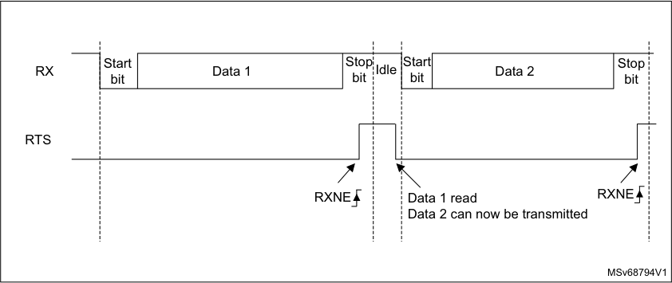

**RS232 CTS flow control**

If the CTS flow control is enabled (CTSE=1), then the transmitter checks the CTS input
before transmitting the next frame. If CTS is deasserted (tied low), then the next data is
transmitted (assuming that data is to be transmitted, in other words, if TXE=0), else the
transmission does not occur. when CTS is asserted during a transmission, the current
transmission is completed before the transmitter stops.

When CTSE=1, the CTSIF status bit is automatically set by hardware as soon as the CTS
input toggles. It indicates when the receiver becomes ready or not ready for communication.
An interrupt is generated if the CTSIE bit in the USART_CR3 register is set. _Figure 236_
shows an example of communication with CTS flow control enabled.

696/905 RM0377 Rev 10

--- end of page=695 ---

**RM0377** **Universal synchronous/asynchronous receiver transmitter (USART/UART)**

**Figure 236. RS232 CTS flow control**

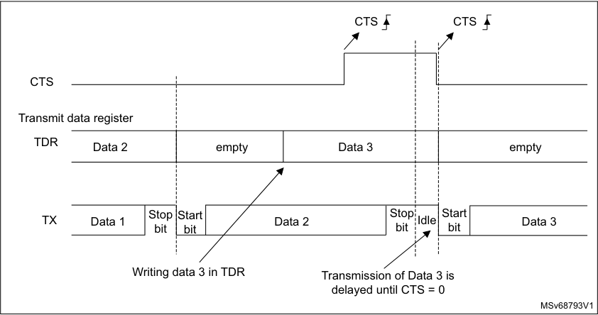

|Col1|Col2|Col3|
|---|---|---|
|empty|Data 3||
|empty|Data 3||

_Note:_ _For correct behavior, CTS must be deasserted at least 3 USART clock source periods_
_before the end of the current character. In addition it should be noted that the CTSCF flag_
_may not be set for pulses shorter than 2 x PCLK periods._

For code example, refer to _A.15.12: USART hardware flow control code example_ .

**RS485 Driver Enable**

The driver enable feature is enabled by setting bit DEM in the USART_CR3 control register.
This allows the user to activate the external transceiver control, through the DE (Driver
Enable) signal. The assertion time is the time between the activation of the DE signal and
the beginning of the START bit. It is programmed using the DEAT [4:0] bit fields in the
USART_CR1 control register. The de-assertion time is the time between the end of the last
stop bit, in a transmitted message, and the de-activation of the DE signal. It is programmed
using the DEDT [4:0] bit fields in the USART_CR1 control register. The polarity of the DE
signal can be configured using the DEP bit in the USART_CR3 control register.

In USART, the DEAT and DEDT are expressed in sample time units (1/8 or 1/16 bit duration,
depending on the oversampling rate).

**24.5.17** **Wakeup from Stop mode using USART**

The USART is able to wake up the MCU from Stopmode when the UESM bit is set and the
USART clock is set to HSI or LSE (refer to Section Reset and clock control (RCC)).

      - USART source clock is HSI

If during Stop mode the HSI clock is switched OFF, when a falling edge on the USART
receive line is detected, the USART interface requests the HSI clock to be switched
ON. The HSI clock is then used for the frame reception.

–
If the wakeup event is verified, the MCU wakes up from low-power mode and data
reception goes on normally.

–
If the wakeup event is not verified, the HSI clock is switched OFF again, the MCU
is not waken up and stays in low-power mode and the clock request is released.

RM0377 Rev 10 697/905

767

--- end of page=696 ---

**Universal synchronous/asynchronous receiver transmitter (USART/UART)** **RM0377**

_Note:_ _If the USART kernel clock is kept ON during Stop mode, there is no constraint on the_
_maximum baud rate that allows waking up from Stop mode. It is the same as in Run mode._

      - USART source clock is LSE

Same principle as described in case of USART source clock is HSI with the difference
that the LSE is ON in Stop mode, but the LSE clock is not propagated to USART if the
USART is not requesting it. The LSE clock is not OFF but there is a clock gating to
avoid useless consumption.

When the USART clock source is configured to be f LSE or f HSI, it is possible to keep enabled
this clock during STOP mode by setting the UCESM bit in USART_CR3 control register.

The MCU wakeup from Stop mode can be done using the standard RXNE interrupt. In this
case, the RXNEIE bit must be set before entering Stop mode.

Alternatively, a specific interrupt may be selected through the WUS bit fields.

In order to be able to wake up the MCU from Stop mode, the UESM bit in the USART_CR1
control register must be set prior to entering Stop mode.

When the wakeup event is detected, the WUF flag is set by hardware and a wakeup
interrupt is generated if the WUFIE bit is set.

_Note:_ _Before entering Stop mode, the user must ensure that the USART is not performing a_
_transfer. BUSY flag cannot ensure that Stop mode is never entered during a running_
_reception._

_The WUF flag is set when a wakeup event is detected, independently of whether the MCU is_
_in Stop or in an active mode._

_When entering Stop mode just after having initialized and enabled the receiver, the REACK_
_bit must be checked to ensure the USART is actually enabled._

_When DMA is used for reception, it must be disabled before entering Stop mode and re-_
_enabled upon exit from Stop mode._

_The wakeup from Stop mode feature is not available for all modes. For example it doesn’t_
_work in SPI mode because the SPI operates in master mode only._

**Using Mute mode with Stop mode**

If the USART is put into Mute mode before entering Stop mode:

      - Wakeup from Mute mode on idle detection must not be used, because idle detection
cannot work in Stop mode.

      - If the wakeup from Mute mode on address match is used, then the source of wake-up
from Stop mode must also be the address match. If the RXNE flag is set when entering
the Stop mode, the interface will remain in mute mode upon address match and wake
up from Stop.

      - If the USART is configured to wake up the MCU from Stop mode on START bit
detection, the WUF flag is set, but the RXNE flag is not set.

**Determining the maximum USART baud rate allowing to wakeup correctly**
**from Stop mode when the USART clock source is the HSI clock**

The maximum baud rate allowing to wakeup correctly from Stop mode depends on:

      - the parameter t WUUSART provided in the device datasheet

      - the USART receiver tolerance provided in the _Section 24.5.5: Tolerance of the USART_
_receiver to clock deviation_ .

698/905 RM0377 Rev 10

--- end of page=697 ---

**RM0377** **Universal synchronous/asynchronous receiver transmitter (USART/UART)**

Let us take this example: OVER8 = 0, M bits = 10, ONEBIT = 1, BRR [3:0] = 0000.

In these conditions, according to _Table 120: Tolerance of the USART receiver when BRR_

_[3:0] = 0000_, the USART receiver tolerance is 4.86 %.

DTRA + DQUANT + DREC + DTCL + DWU < USART receiver's tolerance

DWU max = t WUUSART / (9 x Tbit Min)

Tbit Min = t WUUSART / (9 x DWU max)

If we consider an ideal case where the parameters DTRA, DQUANT, DREC and DTCL are
at 0%, the DWU max is 4.86 %. In reality, we need to consider at least the HSI inaccuracy.

Let us consider HSI inaccuracy = 1 %, t WUUSART = 8.1 μs (in case of Stop mode with main
regulator in Run mode, Range 1 ):

DWU max = 4.86 % - 1 % = 3.86 %

Tbit min = 8.1 µs / (9 ₓ 3.86 %) = 23.31 μs.

In these conditions, the maximum baud rate allowing to wakeup correctly from Stop mode is
1/23.31 μs = 42 kbaud.

###### **24.6 USART in low-power modes**

**Table 123. Effect of low-power modes on the USART**

|Mode|Description|
|---|---|
|Sleep|No effect. USART interrupt causes the device to exit Sleep mode.|
|Low-power run|No effect.|
|Low-power sleep|No effect. USART interrupt causes the device to exit Low-power sleep mode.|
|Stop|The USART is able to wake up the MCU from Stop mode when the UESM bit is set and the USART clock is set to HSI16 or LSE. The MCU wakeup from Stop mode can be done using the standard RXNE interrupt.|
|Standby|The USART is powered down and must be reinitialized when the device has exited from Standby mode.|

###### **24.7 USART interrupts**

**Table 124. USART interrupt requests**

|Interrupt event|Event flag|Enable Control bit|
|---|---|---|
|Transmit data register empty|TXE|TXEIE|
|CTS interrupt|CTSIF|CTSIE|
|Transmission Complete|TC|TCIE|
|Receive data register not empty (data ready to be read)|RXNE|RXNEIE|
|Overrun error detected|ORE|ORE|

RM0377 Rev 10 699/905

767

--- end of page=698 ---

**Universal synchronous/asynchronous receiver transmitter (USART/UART)** **RM0377**

**Table 124. USART interrupt requests (continued)**

|Interrupt event|Event flag|Enable Control bit|
|---|---|---|
|Idle line detected|IDLE|IDLEIE|
|Parity error|PE|PEIE|
|LIN break|LBDF|LBDIE|
|Noise Flag, Overrun error and Framing Error in multibuffer communication.|NF or ORE or FE|EIE|
|Character match|CMF|CMIE|
|Receiver timeout|RTOF|RTOIE|
|End of Block|EOBF|EOBIE|
|Wakeup from Stop mode|WUF(1)|WUFIE|
|Transmission complete before guard time|TCBGT|TCBGTIE|

1. The WUF interrupt is active only in Stop mode.

The USART interrupt events are connected to the same interrupt vector (see _Figure 237_ ).

      - During transmission: Transmission Complete, Transmission complete before guard
time, Clear to Send, Transmit data Register empty or Framing error (in Smartcard
mode) interrupt.

      - During reception: Idle Line detection, Overrun error, Receive data register not empty,
Parity error, LIN break detection, Noise Flag, Framing Error, Character match, etc.

These events generate an interrupt if the corresponding Enable Control Bit is set.

**Figure 237. USART interrupt mapping diagram**

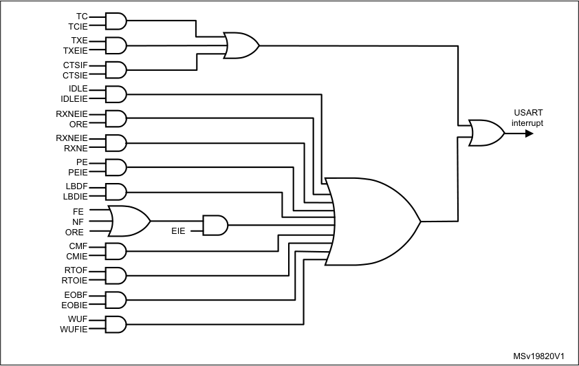

700/905 RM0377 Rev 10

--- end of page=699 ---

