# RM0377 STM32L0x1 — Pages 701–750

**RM0377** **Universal synchronous/asynchronous receiver transmitter (USART/UART)**

###### **24.8 USART registers**

Refer to _Section 1.2 on page 45_ for a list of abbreviations used in register descriptions.

The peripheral registers have to be accessed by words (32 bits).

**24.8.1** **USART control register 1 (USART_CR1)**

Address offset: 0x00

Reset value: 0x0000 0000

|31|30|29|28|27|26|25 24 23 22 21|Col8|Col9|Col10|Col11|20 19 18 17 16|Col13|Col14|Col15|Col16|
|---|---|---|---|---|---|---|---|---|---|---|---|---|---|---|---|
|Res.|Res.|Res.|M1|EOBIE|RTOIE|DEAT[4:0]|DEAT[4:0]|DEAT[4:0]|DEAT[4:0]|DEAT[4:0]|DEDT[4:0]|DEDT[4:0]|DEDT[4:0]|DEDT[4:0]|DEDT[4:0]|
||||rw|rw|rw|rw|rw|rw|rw|rw|rw|rw|rw|rw|rw|

|15|14|13|12|11|10|9|8|7|6|5|4|3|2|1|0|
|---|---|---|---|---|---|---|---|---|---|---|---|---|---|---|---|
|OVER8|CMIE|MME|M0|WAKE|PCE|PS|PEIE|TXEIE|TCIE|RXNEIE|IDLEIE|TE|RE|UESM|UE|
|rw|rw|rw|rw|rw|rw|rw|rw|rw|rw|rw|rw|rw|rw|rw|rw|

Bits 31:29 Reserved, must be kept at reset value.

Bit 28 **M1** : Word length

This bit, with bit 12 (M0), determines the word length. It is set or cleared by software.
M[1:0] = 00: 1 Start bit, 8 data bits, n stop bits
M[1:0] = 01: 1 Start bit, 9 data bits, n stop bits
M[1:0] = 10: 1 Start bit, 7 data bits, n stop bits
This bit can only be written when the USART is disabled (UE=0).

_Note: Not all modes are supported In 7-bit data length mode. Refer to Section 24.4: USART_
_implementation for details._

Bit 27 **EOBIE** : End of Block interrupt enable

This bit is set and cleared by software.
0: Interrupt is inhibited
1: A USART interrupt is generated when the EOBF flag is set in the USART_ISR register.

_Note: If the USART does not support Smartcard mode, this bit is reserved and must be kept_
_at reset value. Please refer to Section 24.4: USART implementation on page 659._

Bit 26 **RTOIE** : Receiver timeout interrupt enable

This bit is set and cleared by software.
0: Interrupt is inhibited
1: An USART interrupt is generated when the RTOF bit is set in the USART_ISR register.

_Note: If the USART does not support the Receiver timeout feature, this bit is reserved and_
_must be kept at reset value. Section 24.4: USART implementation on page 659._

Bits 25:21 **DEAT[4:0]** : Driver Enable assertion time

This 5-bit value defines the time between the activation of the DE (Driver Enable) signal and
the beginning of the start bit. It is expressed in sample time units (1/8 or 1/16 bit duration,
depending on the oversampling rate).
This bit field can only be written when the USART is disabled (UE=0).

_Note: If the Driver Enable feature is not supported, this bit is reserved and must be kept at_
_reset value. Please refer to Section 24.4: USART implementation on page 659._

RM0377 Rev 10 701/905

767

--- end of page=700 ---

**Universal synchronous/asynchronous receiver transmitter (USART/UART)** **RM0377**

Bits 20:16 **DEDT[4:0]** : Driver Enable de-assertion time

This 5-bit value defines the time between the end of the last stop bit, in a transmitted
message, and the de-activation of the DE (Driver Enable) signal. It is expressed in sample
time units (1/8 or 1/16 bit duration, depending on the oversampling rate).
If the USART_TDR register is written during the DEDT time, the new data is transmitted only
when the DEDT and DEAT times have both elapsed.
This bit field can only be written when the USART is disabled (UE=0).

_Note: If the Driver Enable feature is not supported, this bit is reserved and must be kept at_
_reset value. Please refer to Section 24.4: USART implementation on page 659._

Bit 15 **OVER8** : Oversampling mode

0: Oversampling by 16
1: Oversampling by 8
This bit can only be written when the USART is disabled (UE=0).

_Note: In LIN, IrDA and modes, this bit must be kept at reset value._

Bit 14 **CMIE** : Character match interrupt enable

This bit is set and cleared by software.
0: Interrupt is inhibited
1: A USART interrupt is generated when the CMF bit is set in the USART_ISR register.

Bit 13 **MME** : Mute mode enable

This bit activates the mute mode function of the USART. when set, the USART can switch
between the active and mute modes, as defined by the WAKE bit. It is set and cleared by
software.

0: Receiver in active mode permanently

1: Receiver can switch between mute mode and active mode.

Bit 12 **M0** : Word length

This bit, with bit 28 (M1), determines the word length. It is set or cleared by software. See Bit
28 (M1) description.
This bit can only be written when the USART is disabled (UE=0).

Bit 11 **WAKE** : Receiver wakeup method

This bit determines the USART wakeup method from Mute mode. It is set or cleared by
software.

0: Idle line

1: Address mark

This bit field can only be written when the USART is disabled (UE=0).

Bit 10 **PCE** : Parity control enable

This bit selects the hardware parity control (generation and detection). When the parity
control is enabled, the computed parity is inserted at the MSB position (9th bit if M=1; 8th bit
if M=0) and parity is checked on the received data. This bit is set and cleared by software.
Once it is set, PCE is active after the current byte (in reception and in transmission).
0: Parity control disabled
1: Parity control enabled
This bit field can only be written when the USART is disabled (UE=0).

Bit 9 **PS** : Parity selection

This bit selects the odd or even parity when the parity generation/detection is enabled (PCE
bit set). It is set and cleared by software. The parity will be selected after the current byte.
0: Even parity
1: Odd parity
This bit field can only be written when the USART is disabled (UE=0).

702/905 RM0377 Rev 10

--- end of page=701 ---

**RM0377** **Universal synchronous/asynchronous receiver transmitter (USART/UART)**

Bit 8 **PEIE** : PE interrupt enable

This bit is set and cleared by software.
0: Interrupt is inhibited
1: A USART interrupt is generated whenever PE=1 in the USART_ISR register

Bit 7 **TXEIE** : interrupt enable

This bit is set and cleared by software.
0: Interrupt is inhibited
1: A USART interrupt is generated whenever TXE=1 in the USART_ISR register

Bit 6 **TCIE** : Transmission complete interrupt enable

This bit is set and cleared by software.
0: Interrupt is inhibited
1: A USART interrupt is generated whenever TC=1 in the USART_ISR register

Bit 5 **RXNEIE** : RXNE interrupt enable

This bit is set and cleared by software.
0: Interrupt is inhibited
1: A USART interrupt is generated whenever ORE=1 or RXNE=1 in the USART_ISR
register

Bit 4 **IDLEIE** : IDLE interrupt enable

This bit is set and cleared by software.
0: Interrupt is inhibited
1: A USART interrupt is generated whenever IDLE=1 in the USART_ISR register

Bit 3 **TE** : Transmitter enable

This bit enables the transmitter. It is set and cleared by software.

0: Transmitter is disabled

1: Transmitter is enabled

_Note: During transmission, a “0” pulse on the TE bit (“0” followed by “1”) sends a preamble_
_(idle line) after the current word, except in Smartcard mode. In order to generate an idle_
_character, the TE must not be immediately written to 1. In order to ensure the required_
_duration, the software can poll the TEACK bit in the USART_ISR register._

_In Smartcard mode, when TE is set there is a 1 bit-time delay before the transmission_
_starts._

RM0377 Rev 10 703/905

767

--- end of page=702 ---

**Universal synchronous/asynchronous receiver transmitter (USART/UART)** **RM0377**

Bit 2 **RE** : Receiver enable

This bit enables the receiver. It is set and cleared by software.

0: Receiver is disabled

1: Receiver is enabled and begins searching for a start bit

Bit 1 **UESM** : USART enable in Stop mode

When this bit is cleared, the USART is not able to wake up the MCU from Stop mode.
When this bit is set, the USART is able to wake up the MCU from Stop mode, provided that
the USART clock selection is HSI16 or LSE in the RCC.

This bit is set and cleared by software.
0: USART not able to wake up the MCU from Stop mode.
1: USART able to wake up the MCU from Stop mode. When this function is active, the clock
source for the USART must be HSI16 or LSE (see Section Reset and clock control
(RCC) .

_Note: It is recommended to set the UESM bit just before entering Stop mode and clear it on_
_exit from Stop mode._

_If the USART does not support the wakeup from Stop feature, this bit is reserved and_
_must be kept at reset value. Please refer to Section 24.4: USART implementation on_
_page 659._

Bit 0 **UE** : USART enable

When this bit is cleared, the USART prescalers and outputs are stopped immediately, and
current operations are discarded. The configuration of the USART is kept, but all the status
flags, in the USART_ISR are set to their default values. This bit is set and cleared by
software.

0: USART prescaler and outputs disabled, low-power mode

1: USART enabled

_Note: In order to go into low-power mode without generating errors on the line, the TE bit_
_must be reset before and the software must wait for the TC bit in the USART_ISR to be_
_set before resetting the UE bit._

_The DMA requests are also reset when UE = 0 so the DMA channel must be disabled_
_before resetting the UE bit._

**24.8.2** **USART control register 2 (USART_CR2)**

Address offset: 0x04

Reset value: 0x0000 0000

|31 30 29 28|Col2|Col3|Col4|27 26 25 24|Col6|Col7|Col8|23|22 21|Col11|20|19|18|17|16|
|---|---|---|---|---|---|---|---|---|---|---|---|---|---|---|---|
|ADD[7:4]|ADD[7:4]|ADD[7:4]|ADD[7:4]|ADD[3:0]|ADD[3:0]|ADD[3:0]|ADD[3:0]|RTOEN|ABRMOD[1:0]|ABRMOD[1:0]|ABREN|MSBFI RST|DATAINV|TXINV|RXINV|
|rw|rw|rw|rw|rw|rw|rw|rw|rw|rw|rw|rw|rw|rw|rw|rw|

|15|14|13 12|Col4|11|10|9|8|7|6|5|4|3|2|1|0|
|---|---|---|---|---|---|---|---|---|---|---|---|---|---|---|---|
|SWAP|LINEN|STOP[1:0]|STOP[1:0]|CLKEN|CPOL|CPHA|LBCL|Res.|LBDIE|LBDL|ADDM7|Res.|Res.|Res.|Res.|
|rw|rw|rw|rw|rw|rw|rw|rw||rw|rw|rw|||||

704/905 RM0377 Rev 10

--- end of page=703 ---

**RM0377** **Universal synchronous/asynchronous receiver transmitter (USART/UART)**

Bits 31:28 **ADD[7:4]** : Address of the USART node

This bit-field gives the address of the USART node or a character code to be recognized.
This is used in multiprocessor communication during Mute mode or Stop mode, for wakeup with 7bit address mark detection. The MSB of the character sent by the transmitter should be equal to 1.
It may also be used for character detection during normal reception, Mute mode inactive (for
example, end of block detection in ModBus protocol). In this case, the whole received character (8bit) is compared to the ADD[7:0] value and CMF flag is set on match.
This bit field can only be written when reception is disabled (RE = 0) or the USART is disabled
(UE=0)

Bits 27:24 **ADD[3:0]** : Address of the USART node

This bit-field gives the address of the USART node or a character code to be recognized.
This is used in multiprocessor communication during Mute mode or Stop mode, for wakeup with
address mark detection.

This bit field can only be written when reception is disabled (RE = 0) or the USART is disabled
(UE=0)

Bit 23 **RTOEN** : Receiver timeout enable

This bit is set and cleared by software.

0: Receiver timeout feature disabled.

1: Receiver timeout feature enabled.

When this feature is enabled, the RTOF flag in the USART_ISR register is set if the RX line is idle
(no reception) for the duration programmed in the RTOR (receiver timeout register).

_Note: If the USART does not support the Receiver timeout feature, this bit is reserved and must be_
_kept at reset value. Please refer to Section 24.4: USART implementation on page 659._

Bits 22:21 **ABRMOD[1:0]** : Auto baud rate mode

These bits are set and cleared by software.

00: Measurement of the start bit is used to detect the baud rate.

01: Falling edge to falling edge measurement. (the received frame must start with a single bit = 1 ->
Frame = Start10xxxxxx)

10: 0x7F frame detection.

11: 0x55 frame detection

This bit field can only be written when ABREN = 0 or the USART is disabled (UE=0).

_Note: If DATAINV=1 and/or MSBFIRST=1 the patterns must be the same on the line, for example_
_0xAA for MSBFIRST)_

_If the USART does not support the auto baud rate feature, this bit is reserved and must be kept_
_at reset value. Please refer to Section 24.4: USART implementation on page 659._

Bit 20 **ABREN** : Auto baud rate enable

This bit is set and cleared by software.

0: Auto baud rate detection is disabled.

1: Auto baud rate detection is enabled.

_Note: If the USART does not support the auto baud rate feature, this bit is reserved and must be kept_
_at reset value. Please refer to Section 24.4: USART implementation on page 659._

Bit 19 **MSBFIRST** : Most significant bit first

This bit is set and cleared by software.
0: data is transmitted/received with data bit 0 first, following the start bit.
1: data is transmitted/received with the MSB (bit 7/8/9) first, following the start bit.
This bit field can only be written when the USART is disabled (UE=0).

RM0377 Rev 10 705/905

767

--- end of page=704 ---

**Universal synchronous/asynchronous receiver transmitter (USART/UART)** **RM0377**

Bit 18 **DATAINV:** Binary data inversion

This bit is set and cleared by software.
0: Logical data from the data register are send/received in positive/direct logic. (1=H, 0=L)
1: Logical data from the data register are send/received in negative/inverse logic. (1=L, 0=H). The
parity bit is also inverted.
This bit field can only be written when the USART is disabled (UE=0).

Bit 17 **TXINV:** TX pin active level inversion

This bit is set and cleared by software.
0: TX pin signal works using the standard logic levels (V DD =1/idle, Gnd=0/mark)
1: TX pin signal values are inverted. (V DD =0/mark, Gnd=1/idle).
This allows the use of an external inverter on the TX line.

This bit field can only be written when the USART is disabled (UE=0).

Bit 16 **RXINV:** RX pin active level inversion

This bit is set and cleared by software.
0: RX pin signal works using the standard logic levels (V DD =1/idle, Gnd=0/mark)
1: RX pin signal values are inverted. (V DD =0/mark, Gnd=1/idle).
This allows the use of an external inverter on the RX line.

This bit field can only be written when the USART is disabled (UE=0).

Bit 15 **SWAP:** Swap TX/RX pins

This bit is set and cleared by software.
0: TX/RX pins are used as defined in standard pinout
1: The TX and RX pins functions are swapped. This allows to work in the case of a cross-wired
connection to another USART.

This bit field can only be written when the USART is disabled (UE=0).

Bit 14 **LINEN** : LIN mode enable

This bit is set and cleared by software.

0: LIN mode disabled

1: LIN mode enabled

The LIN mode enables the capability to send LIN synchronous breaks (13 low bits) using the
SBKRQ bit in the USART_RQR register, and to detect LIN Sync breaks.
This bit field can only be written when the USART is disabled (UE=0).

_Note: If the USART does not support LIN mode, this bit is reserved and must be kept at reset value._
_Please refer to Section 24.4: USART implementation on page 659._

Bits 13:12 **STOP[1:0]** : STOP bits

These bits are used for programming the stop bits.
00: 1 stop bit
01: 0.5 stop bit
10: 2 stop bits
11: 1.5 stop bits
This bit field can only be written when the USART is disabled (UE=0).

706/905 RM0377 Rev 10

--- end of page=705 ---

**RM0377** **Universal synchronous/asynchronous receiver transmitter (USART/UART)**

Bit 11 **CLKEN** : Clock enable

This bit allows the user to enable the CK pin.
0: CK pin disabled
1: CK pin enabled
This bit can only be written when the USART is disabled (UE=0).

_Note: If neither synchronous mode nor Smartcard mode is supported, this bit is reserved and must_
_be kept at reset value. Please refer to Section 24.4: USART implementation on page 659._

_In order to provide correctly the CK clock to the Smartcard when CK is always available When_
_CLKEN = 1, regardless of the UE bit value, the steps below must be respected:_

_- UE = 0_

_- SCEN = 1_

_- GTPR configuration (If PSC needs to be configured, it is recommended to configure PSC and_
_GT in a single access to USART_ GTPR register)._

_- CLKEN= 1_

_- UE = 1_

Bit 10 **CPOL** : Clock polarity

This bit allows the user to select the polarity of the clock output on the CK pin in synchronous mode.
It works in conjunction with the CPHA bit to produce the desired clock/data relationship
0: Steady low value on CK pin outside transmission window
1: Steady high value on CK pin outside transmission window
This bit can only be written when the USART is disabled (UE=0).

_Note: If synchronous mode is not supported, this bit is reserved and must be kept at reset value._
_Please refer to Section 24.4: USART implementation on page 659._

Bit 9 **CPHA** : Clock phase

This bit is used to select the phase of the clock output on the CK pin in synchronous mode. It works
in conjunction with the CPOL bit to produce the desired clock/data relationship (see _Figure 225_ and
_Figure 226_ )
0: The first clock transition is the first data capture edge
1: The second clock transition is the first data capture edge
This bit can only be written when the USART is disabled (UE=0).

_Note: If synchronous mode is not supported, this bit is reserved and must be kept at reset value._
_Please refer to Section 24.4: USART implementation on page 659._

Bit 8 **LBCL** : Last bit clock pulse

This bit is used to select whether the clock pulse associated with the last data bit transmitted (MSB)
has to be output on the CK pin in synchronous mode.
0: The clock pulse of the last data bit is not output to the CK pin
1: The clock pulse of the last data bit is output to the CK pin

**Caution:** The last bit is the 7th or 8th or 9th data bit transmitted depending on the 7 or 8 or 9 bit
format selected by the M bits in the USART_CR1 register.
This bit can only be written when the USART is disabled (UE=0).

_Note: If synchronous mode is not supported, this bit is reserved and must be kept at reset value._
_Please refer to Section 24.4: USART implementation on page 659._

Bit 7 Reserved, must be kept at reset value.

Bit 6 **LBDIE** : LIN break detection interrupt enable

Break interrupt mask (break detection using break delimiter).
0: Interrupt is inhibited
1: An interrupt is generated whenever LBDF=1 in the USART_ISR register

_Note: If LIN mode is not supported, this bit is reserved and must be kept at reset value. Please refer_
_to Section 24.4: USART implementation on page 659._

RM0377 Rev 10 707/905

767

--- end of page=706 ---

**Universal synchronous/asynchronous receiver transmitter (USART/UART)** **RM0377**

Bit 5 **LBDL** : LIN break detection length

This bit is for selection between 11 bit or 10 bit break detection.

0: 10-bit break detection

1: 11-bit break detection

This bit can only be written when the USART is disabled (UE=0).

_Note: If LIN mode is not supported, this bit is reserved and must be kept at reset value. Please refer_
_to Section 24.4: USART implementation on page 659._

Bit 4 **ADDM7** :7-bit Address Detection/4-bit Address Detection

This bit is for selection between 4-bit address detection or 7-bit address detection.

0: 4-bit address detection

1: 7-bit address detection (in 8-bit data mode)
This bit can only be written when the USART is disabled (UE=0)

_Note: In 7-bit and 9-bit data modes, the address detection is done on 6-bit and 8-bit address_
_(ADD[5:0] and ADD[7:0]) respectively._

Bits 3:0 Reserved, must be kept at reset value.

_Note:_ _The 3 bits (CPOL, CPHA, LBCL) should not be written while the transmitter is enabled._

**24.8.3** **USART control register 3 (USART_CR3)**

Address offset: 0x08

Reset value: 0x0000 0000

|31|30|29|28|27|26|25|24|23|22|21|20|19|18|17|16|
|---|---|---|---|---|---|---|---|---|---|---|---|---|---|---|---|
|Res.|Res.|Res.|Res.|Res.|Res.|Res.|TCBGT IE|UCESM|WUFIE|WUS1|WUS0|SCARC NT2|SCARC NT1|SCARC NT0|Res.|
||||||||rw|rw|rw|rw|rw|rw|rw|rw||

|15|14|13|12|11|10|9|8|7|6|5|4|3|2|1|0|
|---|---|---|---|---|---|---|---|---|---|---|---|---|---|---|---|
|DEP|DEM|DDRE|OVRDI S|ONEBI T|CTSIE|CTSE|RTSE|DMAT|DMAR|SCEN|NACK|HDSEL|IRLP|IREN|EIE|
|rw|rw|rw|rw|rw|rw|rw|rw|rw|rw|rw|rw|rw|rw|rw|rw|

Bits 31:25 Reserved, must be kept at reset value.

Bit 24 **TCBGTIE** : Transmission complete before guard time interrupt enable

This bit is set and cleared by software.
0: Interrupt is inhibited
1: An USART interrupt is generated whenever TCBGT=1 in the USART_ISR register.

Note: _If Smartcard mode is not supported, this bit is reserved and must be kept at reset value_
_(see Section 24.4: USART implementation)._

Note: This bit is available on category 1 devices only.

Bit 23 **UCESM** : USART Clock Enable in Stop mode.

This bit is set and cleared by software.

0: USART Clock is disabled in STOP mode.

1: USART Clock is enabled in STOP mode.

708/905 RM0377 Rev 10

--- end of page=707 ---

**RM0377** **Universal synchronous/asynchronous receiver transmitter (USART/UART)**

Bit 22 **WUFIE** : Wakeup from Stop mode interrupt enable

This bit is set and cleared by software.
0: Interrupt is inhibited
1: An USART interrupt is generated whenever WUF=1 in the USART_ISR register

_Note: WUFIE must be set before entering in Stop mode._

_The WUF interrupt is active only in Stop mode._

_If the USART does not support the wakeup from Stop feature, this bit is reserved and_
_must be kept at reset value._

Bits 21:20 **WUS[1:0]** : Wakeup from Stop mode interrupt flag selection

This bit-field specify the event which activates the WUF (wakeup from Stop mode flag).
00: WUF active on address match (as defined by ADD[7:0] and ADDM7)

01:Reserved.

10: WuF active on Start bit detection

11: WUF active on RXNE.

This bit field can only be written when the USART is disabled (UE=0).

_Note: If the USART does not support the wakeup from Stop feature, this bit is reserved and_
_must be kept at reset value._

Bits 19:17 **SCARCNT[2:0]** : Smartcard auto-retry count

This bit-field specifies the number of retries in transmit and receive, in Smartcard mode.
In transmission mode, it specifies the number of automatic retransmission retries, before
generating a transmission error (FE bit set).
In reception mode, it specifies the number or erroneous reception trials, before generating a
reception error (RXNE and PE bits set).
This bit field must be programmed only when the USART is disabled (UE=0).
When the USART is enabled (UE=1), this bit field may only be written to 0x0, in order to stop
retransmission.

0x0: retransmission disabled - No automatic retransmission in transmit mode.

0x1 to 0x7: number of automatic retransmission attempts (before signaling error)

_Note: If Smartcard mode is not supported, this bit is reserved and must be kept at reset_
_value. Please refer to Section 24.4: USART implementation on page 659._

Bit 16 Reserved, must be kept at reset value.

Bit 15 **DEP** : Driver enable polarity selection

0: DE signal is active high.
1: DE signal is active low.
This bit can only be written when the USART is disabled (UE=0).

_Note: If the Driver Enable feature is not supported, this bit is reserved and must be kept at_
_reset value. Please refer to Section 24.4: USART implementation on page 659._

Bit 14 **DEM** : Driver enable mode

This bit allows the user to activate the external transceiver control, through the DE signal.

0: DE function is disabled.

1: DE function is enabled. The DE signal is output on the RTS pin.
This bit can only be written when the USART is disabled (UE=0).

_Note: If the Driver Enable feature is not supported, this bit is reserved and must be kept at_
_reset value. Section 24.4: USART implementation on page 659._

RM0377 Rev 10 709/905

767

--- end of page=708 ---

**Universal synchronous/asynchronous receiver transmitter (USART/UART)** **RM0377**

Bit 13 **DDRE** : DMA Disable on Reception Error

0: DMA is not disabled in case of reception error. The corresponding error flag is set but
RXNE is kept 0 preventing from overrun. As a consequence, the DMA request is not
asserted, so the erroneous data is not transferred (no DMA request), but next correct
received data will be transferred (used for Smartcard mode).
1: DMA is disabled following a reception error. The corresponding error flag is set, as well as
RXNE. The DMA request is masked until the error flag is cleared. This means that the
software must first disable the DMA request (DMAR = 0) or clear RXNE before clearing the
error flag.
This bit can only be written when the USART is disabled (UE=0).

_Note: The reception errors are: parity error, framing error or noise error._

Bit 12 **OVRDIS** : Overrun Disable

This bit is used to disable the receive overrun detection.

0: Overrun Error Flag, ORE, is set when received data is not read before receiving new data.
1: Overrun functionality is disabled. If new data is received while the RXNE flag is still set
the ORE flag is not set and the new received data overwrites the previous content of the
USART_RDR register.
This bit can only be written when the USART is disabled (UE=0).

_Note: This control bit allows checking the communication flow without reading the data._

Bit 11 **ONEBIT** : One sample bit method enable

This bit allows the user to select the sample method. When the one sample bit method is
selected the noise detection flag (NF) is disabled.
0: Three sample bit method
1: One sample bit method
This bit can only be written when the USART is disabled (UE=0).

_Note: ONEBIT feature applies only to data bits, It does not apply to Start bit._

Bit 10 **CTSIE** : CTS interrupt enable

0: Interrupt is inhibited
1: An interrupt is generated whenever CTSIF=1 in the USART_ISR register

_Note: If the hardware flow control feature is not supported, this bit is reserved and must be_
_kept at reset value. Please refer to Section 24.4: USART implementation on page 659._

Bit 9 **CTSE** : CTS enable

0: CTS hardware flow control disabled

1: CTS mode enabled, data is only transmitted when the CTS input is deasserted (tied to 0).
If the CTS input is asserted while data is being transmitted, then the transmission is
completed before stopping. If data is written into the data register while CTS is asserted, the
transmission is postponed until CTS is deasserted.
This bit can only be written when the USART is disabled (UE=0)

_Note: If the hardware flow control feature is not supported, this bit is reserved and must be_
_kept at reset value. Please refer to Section 24.4: USART implementation on page 659._

Bit 8 **RTSE** : RTS enable

0: RTS hardware flow control disabled

1: RTS output enabled, data is only requested when there is space in the receive buffer. The
transmission of data is expected to cease after the current character has been transmitted.
The RTS output is deasserted (pulled to 0) when data can be received.
This bit can only be written when the USART is disabled (UE=0).

_Note: If the hardware flow control feature is not supported, this bit is reserved and must be_
_kept at reset value. Please refer to Section 24.4: USART implementation on page 659._

710/905 RM0377 Rev 10

--- end of page=709 ---

**RM0377** **Universal synchronous/asynchronous receiver transmitter (USART/UART)**

Bit 7 **DMAT** : DMA enable transmitter

This bit is set/reset by software

1: DMA mode is enabled for transmission

0: DMA mode is disabled for transmission

Bit 6 **DMAR** : DMA enable receiver

This bit is set/reset by software
1: DMA mode is enabled for reception
0: DMA mode is disabled for reception

Bit 5 **SCEN** : Smartcard mode enable

This bit is used for enabling Smartcard mode.

0: Smartcard Mode disabled

1: Smartcard Mode enabled

This bit field can only be written when the USART is disabled (UE=0).

_Note: If the USART does not support Smartcard mode, this bit is reserved and must be kept_
_at reset value. Please refer to Section 24.4: USART implementation on page 659._

Bit 4 **NACK** : Smartcard NACK enable

0: NACK transmission in case of parity error is disabled
1: NACK transmission during parity error is enabled
This bit field can only be written when the USART is disabled (UE=0).

_Note: If the USART does not support Smartcard mode, this bit is reserved and must be kept_
_at reset value. Please refer to Section 24.4: USART implementation on page 659._

Bit 3 **HDSEL** : Half-duplex selection

Selection of Single-wire Half-duplex mode
0: Half duplex mode is not selected
1: Half duplex mode is selected
This bit can only be written when the USART is disabled (UE=0).

Bit 2 **IRLP** : IrDA low-power

This bit is used for selecting between normal and low-power IrDA modes

0: Normal mode

1: Low-power mode
This bit can only be written when the USART is disabled (UE=0).

_Note: If IrDA mode is not supported, this bit is reserved and must be kept at reset value._
_Please refer to Section 24.4: USART implementation on page 659._

Bit 1 **IREN** : IrDA mode enable

This bit is set and cleared by software.

0: IrDA disabled

1: IrDA enabled

This bit can only be written when the USART is disabled (UE=0).

_Note: If IrDA mode is not supported, this bit is reserved and must be kept at reset value._
_Please refer to Section 24.4: USART implementation on page 659._

Bit 0 **EIE** : Error interrupt enable

Error Interrupt Enable Bit is required to enable interrupt generation in case of a framing
error, overrun error or noise flag (FE=1 or ORE=1 or NF=1 in the USART_ISR register).
0: Interrupt is inhibited
1: An interrupt is generated when FE=1 or ORE=1 or NF=1 in the USART_ISR register.

RM0377 Rev 10 711/905

767

--- end of page=710 ---

**Universal synchronous/asynchronous receiver transmitter (USART/UART)** **RM0377**

**24.8.4** **USART baud rate register (USART_BRR)**

This register can only be written when the USART is disabled (UE=0). It may be
automatically updated by hardware in auto baud rate detection mode.

Address offset: 0x0C

Reset value: 0x0000 0000

|31|30|29|28|27|26|25|24|23|22|21|20|19|18|17|16|
|---|---|---|---|---|---|---|---|---|---|---|---|---|---|---|---|
|Res.|Res.|Res.|Res.|Res.|Res.|Res.|Res.|Res.|Res.|Res.|Res.|Res.|Res.|Res.|Res.|
|||||||||||||||||

|15 14 13 12 11 10 9 8 7 6 5 4 3 2 1 0|Col2|Col3|Col4|Col5|Col6|Col7|Col8|Col9|Col10|Col11|Col12|Col13|Col14|Col15|Col16|
|---|---|---|---|---|---|---|---|---|---|---|---|---|---|---|---|
|BRR[15:0]|BRR[15:0]|BRR[15:0]|BRR[15:0]|BRR[15:0]|BRR[15:0]|BRR[15:0]|BRR[15:0]|BRR[15:0]|BRR[15:0]|BRR[15:0]|BRR[15:0]|BRR[15:0]|BRR[15:0]|BRR[15:0]|BRR[15:0]|
|rw|rw|rw|rw|rw|rw|rw|rw|rw|rw|rw|rw|rw|rw|rw|rw|

Bits 31:16 Reserved, must be kept at reset value.

Bits 15:4 **BRR[15:4]**

BRR[15:4] = USARTDIV[15:4]

Bits 3:0 **BRR[3:0]**

When OVER8 = 0, BRR[3:0] = USARTDIV[3:0].

When OVER8 = 1:

BRR[2:0] = USARTDIV[3:0] shifted 1 bit to the right.
BRR[3] must be kept cleared.

**24.8.5** **USART guard time and prescaler register (USART_GTPR)**

Address offset: 0x10

Reset value: 0x0000 0000

|31|30|29|28|27|26|25|24|23|22|21|20|19|18|17|16|
|---|---|---|---|---|---|---|---|---|---|---|---|---|---|---|---|
|Res.|Res.|Res.|Res.|Res.|Res.|Res.|Res.|Res.|Res.|Res.|Res.|Res.|Res.|Res.|Res.|
|||||||||||||||||

|15 14 13 12 11 10 9 8|Col2|Col3|Col4|Col5|Col6|Col7|Col8|7 6 5 4 3 2 1 0|Col10|Col11|Col12|Col13|Col14|Col15|Col16|
|---|---|---|---|---|---|---|---|---|---|---|---|---|---|---|---|
|GT[7:0]|GT[7:0]|GT[7:0]|GT[7:0]|GT[7:0]|GT[7:0]|GT[7:0]|GT[7:0]|PSC[7:0]|PSC[7:0]|PSC[7:0]|PSC[7:0]|PSC[7:0]|PSC[7:0]|PSC[7:0]|PSC[7:0]|
|rw|rw|rw|rw|rw|rw|rw|rw|rw|rw|rw|rw|rw|rw|rw|rw|

712/905 RM0377 Rev 10

--- end of page=711 ---

**RM0377** **Universal synchronous/asynchronous receiver transmitter (USART/UART)**

Bits 31:16 Reserved, must be kept at reset value.

Bits 15:8 **GT[7:0]** : Guard time value

This bit-field is used to program the Guard time value in terms of number of baud clock
periods.
This is used in Smartcard mode. The Transmission Complete flag is set after this guard time
value.

This bit field can only be written when the USART is disabled (UE=0).

_Note: If Smartcard mode is not supported, this bit is reserved and must be kept at reset value._
_Please refer to Section 24.4: USART implementation on page 659._

Bits 7:0 **PSC[7:0]** : Prescaler value

**In IrDA Low-power and normal IrDA mode:**
PSC[7:0] = IrDA Normal and Low-Power Baud Rate
Used for programming the prescaler for dividing the USART source clock to achieve the lowpower frequency:
The source clock is divided by the value given in the register (8 significant bits):
00000000: Reserved - do not program this value
00000001: divides the source clock by 1
00000010: divides the source clock by 2

...

**In Smartcard mode:**

PSC[4:0]: Prescaler value
Used for programming the prescaler for dividing the USART source clock to provide the
Smartcard clock.

The value given in the register (5 significant bits) is multiplied by 2 to give the division factor
of the source clock frequency:
00000: Reserved - do not program this value
00001: divides the source clock by 2
00010: divides the source clock by 4
00011: divides the source clock by 6

...

This bit field can only be written when the USART is disabled (UE=0).

_Note: Bits [7:5] must be kept at reset value if Smartcard mode is used._

_This bit field is reserved and must be kept at reset value when the Smartcard and IrDA_
_modes are not supported. Please refer to Section 24.4: USART implementation on_
_page 659._

**24.8.6** **USART receiver timeout register (USART_RTOR)**

Address offset: 0x14

Reset value: 0x0000 0000

|31 30 29 28 27 26 25 24|Col2|Col3|Col4|Col5|Col6|Col7|Col8|23 22 21 20 19 18 17 16|Col10|Col11|Col12|Col13|Col14|Col15|Col16|
|---|---|---|---|---|---|---|---|---|---|---|---|---|---|---|---|
|BLEN[7:0]|BLEN[7:0]|BLEN[7:0]|BLEN[7:0]|BLEN[7:0]|BLEN[7:0]|BLEN[7:0]|BLEN[7:0]|RTO[23:16]|RTO[23:16]|RTO[23:16]|RTO[23:16]|RTO[23:16]|RTO[23:16]|RTO[23:16]|RTO[23:16]|
|rw|rw|rw|rw|rw|rw|rw|rw|rw|rw|rw|rw|rw|rw|rw|rw|

|15 14 13 12 11 10 9 8 7 6 5 4 3 2 1 0|Col2|Col3|Col4|Col5|Col6|Col7|Col8|Col9|Col10|Col11|Col12|Col13|Col14|Col15|Col16|
|---|---|---|---|---|---|---|---|---|---|---|---|---|---|---|---|
|RTO[15:0]|RTO[15:0]|RTO[15:0]|RTO[15:0]|RTO[15:0]|RTO[15:0]|RTO[15:0]|RTO[15:0]|RTO[15:0]|RTO[15:0]|RTO[15:0]|RTO[15:0]|RTO[15:0]|RTO[15:0]|RTO[15:0]|RTO[15:0]|
|rw|rw|rw|rw|rw|rw|rw|rw|rw|rw|rw|rw|rw|rw|rw|rw|

RM0377 Rev 10 713/905

767

--- end of page=712 ---

**Universal synchronous/asynchronous receiver transmitter (USART/UART)** **RM0377**

Bits 31:24 **BLEN[7:0]** : Block Length

This bit-field gives the Block length in Smartcard T=1 Reception. Its value equals the number
of information characters + the length of the Epilogue Field (1-LEC/2-CRC) - 1.
Examples:

BLEN = 0 -> 0 information characters + LEC

BLEN = 1 -> 0 information characters + CRC

BLEN = 255 -> 254 information characters + CRC (total 256 characters))
In Smartcard mode, the Block length counter is reset when TXE=0.
This bit-field can be used also in other modes. In this case, the Block length counter is reset
when RE=0 (receiver disabled) and/or when the EOBCF bit is written to 1.

_Note: This value can be programmed after the start of the block reception (using the data_
_from the LEN character in the Prologue Field). It must be programmed only once per_
_received block._

Bits 23:0 **RTO[23:0]** : Receiver timeout value

This bit-field gives the Receiver timeout value in terms of number of bit duration.
In standard mode, the RTOF flag is set if, after the last received character, no new start bit is
detected for more than the RTO value.

In Smartcard mode, this value is used to implement the CWT and BWT. See Smartcard
section for more details.

In this case, the timeout measurement is done starting from the Start Bit of the last received
character.

_Note: This value must only be programmed once per received character._

_Note:_ _RTOR can be written on the fly. If the new value is lower than or equal to the counter, the_
_RTOF flag is set._

_This register is reserved and forced by hardware to “0x00000000” when the Receiver_
_timeout feature is not supported. Please refer to_ _Section 24.4: USART implementation on_
_page 659_ _._

**24.8.7** **USART request register (USART_RQR)**

Address offset: 0x18

Reset value: 0x0000 0000

|31|30|29|28|27|26|25|24|23|22|21|20|19|18|17|16|
|---|---|---|---|---|---|---|---|---|---|---|---|---|---|---|---|
|Res.|Res.|Res.|Res.|Res.|Res.|Res.|Res.|Res.|Res.|Res.|Res.|Res.|Res.|Res.|Res.|
|||||||||||||||||

|15|14|13|12|11|10|9|8|7|6|5|4|3|2|1|0|
|---|---|---|---|---|---|---|---|---|---|---|---|---|---|---|---|
|Res.|Res.|Res.|Res.|Res.|Res.|Res.|Res.|Res.|Res.|Res.|TXFRQ|RXFRQ|MMRQ|SBKRQ|ABRRQ|
||||||||||||w|w|w|w|w|

714/905 RM0377 Rev 10

--- end of page=713 ---

**RM0377** **Universal synchronous/asynchronous receiver transmitter (USART/UART)**

Bits 31:5 Reserved, must be kept at reset value.

Bit 4 **TXFRQ** : Transmit data flush request

Writing 1 to this bit sets the TXE flag.
This allows to discard the transmit data. This bit must be used only in Smartcard mode,
when data has not been sent due to errors (NACK) and the FE flag is active in the
USART_ISR register.
If the USART does not support Smartcard mode, this bit is reserved and must be kept at
reset value. Please refer to _Section 24.4: USART implementation on page 659_ .

Bit 3 **RXFRQ** : Receive data flush request

Writing 1 to this bit clears the RXNE flag.
This allows to discard the received data without reading it, and avoid an overrun condition.

Bit 2 **MMRQ** : Mute mode request

Writing 1 to this bit puts the USART in mute mode and sets the RWU flag.

Bit 1 **SBKRQ** : Send break request

Writing 1 to this bit sets the SBKF flag and request to send a BREAK on the line, as soon as
the transmit machine is available.

_Note: In the case the application needs to send the break character following all previously_
_inserted data, including the ones not yet transmitted, the software should wait for the_
_TXE flag assertion before setting the SBKRQ bit._

Bit 0 **ABRRQ** : Auto baud rate request

Writing 1 to this bit resets the ABRF and ABRE flags in the USART_ISR and request an
automatic baud rate measurement on the next received data frame.

_Note: If the USART does not support the auto baud rate feature, this bit is reserved and must_
_be kept at reset value. Please refer to Section 24.4: USART implementation on_
_page 659._

**24.8.8** **USART interrupt and status register (USART_ISR)**

Address offset: 0x1C

Reset value: 0x0200 00C0

|31|30|29|28|27|26|25|24|23|22|21|20|19|18|17|16|
|---|---|---|---|---|---|---|---|---|---|---|---|---|---|---|---|
|Res.|Res.|Res.|Res.|Res.|Res.|TCBGT|Res.|Res.|REACK|TEACK|WUF|RWU|SBKF|CMF|BUSY|
|||||||r|||r|r|r|r|r|r|r|

|15|14|13|12|11|10|9|8|7|6|5|4|3|2|1|0|
|---|---|---|---|---|---|---|---|---|---|---|---|---|---|---|---|
|ABRF|ABRE|Res.|EOBF|RTOF|CTS|CTSIF|LBDF|TXE|TC|RXNE|IDLE|ORE|NF|FE|PE|
|r|r||r|r|r|r|r|r|r|r|r|r|r|r|r|

RM0377 Rev 10 715/905

767

--- end of page=714 ---

**Universal synchronous/asynchronous receiver transmitter (USART/UART)** **RM0377**

Bits 31:26 Reserved, must be kept at reset value.

Bit 25 **TCBGT** : Transmission complete before guard time completion.

This bit is used in Smartcard mode. It is set by hardware if the transmission of a frame
containing data has completed successfully (no NACK received from the card) and before
the guard time has elapsed (contrary to the TC flag which is set when the guard time has
elapsed).
An interrupt is generated if TCBGTIE=1 in USART_CR3 register. It is cleared by software,
by writing 1 to TCBGTCF in USART_ICR or by writing to the USART_TDR register.
0: Transmission not complete or transmission completed with error (i.e. NACK received from
the card)
1: Transmission complete (before Guard time has elapsed and no NACK received from the
smartcard).

_Note: If the USART does not support the Smartcard mode, this bit is reserved and must be_
_kept at reset value. If the USART supports the Smartcard mode and the Smartcard_
_mode is enabled, the TCBGT reset value is 1._

Note: This bit is available on category 1 devices only.

Bits 24:23 Reserved, must be kept at reset value.

Bit 22 **REACK** : Receive enable acknowledge flag

This bit is set/reset by hardware, when the Receive Enable value is taken into account by
the USART.

When the wakeup from Stop mode is supported, the REACK flag can be used to verify that
the USART is ready for reception before entering Stop mode.

Bit 21 **TEACK** : Transmit enable acknowledge flag

This bit is set/reset by hardware, when the Transmit Enable value is taken into account by
the USART.

It can be used when an idle frame request is generated by writing TE=0, followed by TE=1
in the USART_CR1 register, in order to respect the TE=0 minimum period.

Bit 20 **WUF** : Wakeup from Stop mode flag

This bit is set by hardware, when a wakeup event is detected. The event is defined by the
WUS bit field. It is cleared by software, writing a 1 to the WUCF in the USART_ICR register.

An interrupt is generated if WUFIE=1 in the USART_CR3 register.

_Note: When UESM is cleared, WUF flag is also cleared._

_The WUF interrupt is active only in Stop mode._

_If the USART does not support the wakeup from Stop feature, this bit is reserved and_
_kept at reset value._

Bit 19 **RWU** : _Receiver wakeup from Mute mode_

This bit indicates if the USART is in mute mode. It is cleared/set by hardware when a
wakeup/mute sequence is recognized. The mute mode control sequence (address or IDLE)
is selected by the WAKE bit in the USART_CR1 register.
When wakeup on IDLE mode is selected, this bit can only be set by software, writing 1 to the
MMRQ bit in the USART_RQR register.

0: Receiver in active mode

1: Receiver in mute mode

Bit 18 **SBKF** : Send break flag

This bit indicates that a send break character was requested. It is set by software, by writing
1 to the SBKRQ bit in the USART_RQR register. It is automatically reset by hardware during
the stop bit of break transmission.

0: No break character is transmitted

1: Break character will be transmitted

716/905 RM0377 Rev 10

--- end of page=715 ---

**RM0377** **Universal synchronous/asynchronous receiver transmitter (USART/UART)**

Bit 17 **CMF** : Character match flag

This bit is set by hardware, when the character defined by ADD[7:0] is received. It is cleared
by software, writing 1 to the CMCF in the USART_ICR register.
An interrupt is generated if CMIE=1in the USART_CR1 register.

0: No Character match detected

1: Character Match detected

Bit 16 **BUSY** : Busy flag

This bit is set and reset by hardware. It is active when a communication is ongoing on the
RX line (successful start bit detected). It is reset at the end of the reception (successful or
not).
0: USART is idle (no reception)
1: Reception on going

Bit 15 **ABRF:** Auto baud rate flag

This bit is set by hardware when the automatic baud rate has been set (RXNE will also be
set, generating an interrupt if RXNEIE = 1) or when the auto baud rate operation was
completed without success (ABRE=1) (ABRE, RXNE and FE are also set in this case)
It is cleared by software, in order to request a new auto baud rate detection, by writing 1 to
the ABRRQ in the USART_RQR register.

_Note: If the USART does not support the auto baud rate feature, this bit is reserved and kept_
_at reset value._

Bit 14 **ABRE** : Auto baud rate error

This bit is set by hardware if the baud rate measurement failed (baud rate out of range or
character comparison failed)
It is cleared by software, by writing 1 to the ABRRQ bit in the USART_RQR register.

_Note: If the USART does not support the auto baud rate feature, this bit is reserved and kept_
_at reset value._

Bit 13 Reserved, must be kept at reset value.

Bit 12 **EOBF** : End of block flag

This bit is set by hardware when a complete block has been received (for example T=1
Smartcard mode). The detection is done when the number of received bytes (from the start
of the block, including the prologue) is equal or greater than BLEN + 4.
An interrupt is generated if EOBIE = 1 in the USART_CR1 register.
It is cleared by software, writing 1 to EOBCF in the USART_ICR register.

0: End of Block not reached

1: End of Block (number of characters) reached

_Note: If Smartcard mode is not supported, this bit is reserved and kept at reset value. Please_
_refer to Section 24.4: USART implementation on page 659._

RM0377 Rev 10 717/905

767

--- end of page=716 ---

**Universal synchronous/asynchronous receiver transmitter (USART/UART)** **RM0377**

Bit 11 **RTOF** : Receiver timeout

This bit is set by hardware when the timeout value, programmed in the RTOR register has
lapsed, without any communication. It is cleared by software, writing 1 to the RTOCF bit in
the USART_ICR register.
An interrupt is generated if RTOIE=1 in the USART_CR1 register.
In Smartcard mode, the timeout corresponds to the CWT or BWT timings.

0: Timeout value not reached

1: Timeout value reached without any data reception

_Note: If a time equal to the value programmed in RTOR register separates 2 characters,_
_RTOF is not set. If this time exceeds this value + 2 sample times (2/16 or 2/8,_
_depending on the oversampling method), RTOF flag is set._

_The counter counts even if RE = 0 but RTOF is set only when RE = 1. If the timeout has_
_already elapsed when RE is set, then RTOF will be set._

_If the USART does not support the Receiver timeout feature, this bit is reserved and_
_kept at reset value._

Bit 10 **CTS** : CTS flag

This bit is set/reset by hardware. It is an inverted copy of the status of the CTS input pin.

0: CTS line set

1: CTS line reset

_Note: If the hardware flow control feature is not supported, this bit is reserved and kept at_
_reset value._

Bit 9 **CTSIF** : CTS interrupt flag

This bit is set by hardware when the CTS input toggles, if the CTSE bit is set. It is cleared by
software, by writing 1 to the CTSCF bit in the USART_ICR register.
An interrupt is generated if CTSIE=1 in the USART_CR3 register.
0: No change occurred on the CTS status line
1: A change occurred on the CTS status line

_Note: If the hardware flow control feature is not supported, this bit is reserved and kept at_
_reset value._

Bit 8 **LBDF** : LIN break detection flag

This bit is set by hardware when the LIN break is detected. It is cleared by software, by
writing 1 to the LBDCF in the USART_ICR.
An interrupt is generated if LBDIE = 1 in the USART_CR2 register.

0: LIN Break not detected

1: LIN break detected

_Note: If the USART does not support LIN mode, this bit is reserved and kept at reset value._
_Please refer to Section 24.4: USART implementation on page 659._

Bit 7 **TXE** : Transmit data register empty

This bit is set by hardware when the content of the USART_TDR register has been
transferred into the shift register. It is cleared by a write to the USART_TDR register.
The TXE flag can also be cleared by writing 1 to the TXFRQ in the USART_RQR register, in
order to discard the data (only in Smartcard T=0 mode, in case of transmission failure).
An interrupt is generated if the TXEIE bit =1 in the USART_CR1 register.
0: data is not transferred to the shift register
1: data is transferred to the shift register)

_Note: This bit is used during single buffer transmission._

718/905 RM0377 Rev 10

--- end of page=717 ---

**RM0377** **Universal synchronous/asynchronous receiver transmitter (USART/UART)**

Bit 6 **TC** : Transmission complete

This bit is set by hardware if the transmission of a frame containing data is complete and if
TXE is set. An interrupt is generated if TCIE=1 in the USART_CR1 register. It is cleared by
software, writing 1 to the TCCF in the USART_ICR register or by a write to the USART_TDR
register.
An interrupt is generated if TCIE=1 in the USART_CR1 register.
0: Transmission is not complete
1: Transmission is complete

_Note: If TE bit is reset and no transmission is on going, the TC bit will be set immediately._

Bit 5 **RXNE** : Read data register not empty

This bit is set by hardware when the content of the RDR shift register has been transferred
to the USART_RDR register. It is cleared by a read to the USART_RDR register. The RXNE
flag can also be cleared by writing 1 to the RXFRQ in the USART_RQR register.
An interrupt is generated if RXNEIE=1 in the USART_CR1 register.

0: data is not received

1: Received data is ready to be read.

Bit 4 **IDLE** : Idle line detected

This bit is set by hardware when an Idle Line is detected. An interrupt is generated if
IDLEIE=1 in the USART_CR1 register. It is cleared by software, writing 1 to the IDLECF in
the USART_ICR register.

0: No Idle line is detected

1: Idle line is detected

_Note: The IDLE bit will not be set again until the RXNE bit has been set (i.e. a new idle line_
_occurs)._

_If mute mode is enabled (MME=1), IDLE is set if the USART is not mute (RWU=0),_
_whatever the mute mode selected by the WAKE bit. If RWU=1, IDLE is not set._

Bit 3 **ORE** : Overrun error

This bit is set by hardware when the data currently being received in the shift register is
ready to be transferred into the RDR register while RXNE=1. It is cleared by a software,
writing 1 to the ORECF, in the USART_ICR register.
An interrupt is generated if RXNEIE=1 or EIE = 1 in the USART_CR1 register.

0: No overrun error

1: Overrun error is detected

_Note: When this bit is set, the RDR register content is not lost but the shift register is_
_overwritten. An interrupt is generated if the ORE flag is set during multibuffer_
_communication if the EIE bit is set._

_This bit is permanently forced to 0 (no overrun detection) when the OVRDIS bit is set in_
_the USART_CR3 register._

RM0377 Rev 10 719/905

767

--- end of page=718 ---

**Universal synchronous/asynchronous receiver transmitter (USART/UART)** **RM0377**

Bit 2 **NF** : START bit Noise detection flag

This bit is set by hardware when noise is detected on a received frame. It is cleared by
software, writing 1 to the NFCF bit in the USART_ICR register.

0: No noise is detected

1: Noise is detected

_Note: This bit does not generate an interrupt as it appears at the same time as the RXNE bit_
_which itself generates an interrupt. An interrupt is generated when the NF flag is set_
_during multibuffer communication if the EIE bit is set._

_Note: When the line is noise-free, the NF flag can be disabled by programming the ONEBIT_
_bit to 1 to increase the USART tolerance to deviations (Refer to Section 24.5.5:_
_Tolerance of the USART receiver to clock deviation on page 674)._

Bit 1 **FE** : Framing error

This bit is set by hardware when a de-synchronization, excessive noise or a break character
is detected. It is cleared by software, writing 1 to the FECF bit in the USART_ICR register.
In Smartcard mode, in transmission, this bit is set when the maximum number of transmit
attempts is reached without success (the card NACKs the data frame).
An interrupt is generated if EIE = 1 in the USART_CR1 register.
0: No Framing error is detected
1: Framing error or break character is detected

Bit 0 **PE** : Parity error

This bit is set by hardware when a parity error occurs in receiver mode. It is cleared by
software, writing 1 to the PECF in the USART_ICR register.
An interrupt is generated if PEIE = 1 in the USART_CR1 register.
0: No parity error
1: Parity error

**24.8.9** **USART interrupt flag clear register (USART_ICR)**

Address offset: 0x20

Reset value: 0x0000 0000

|31|30|29|28|27|26|25|24|23|22|21|20|19|18|17|16|
|---|---|---|---|---|---|---|---|---|---|---|---|---|---|---|---|
|Res.|Res.|Res.|Res.|Res.|Res.|Res.|Res.|Res.|Res.|Res.|WUCF|Res.|Res.|CMCF|Res.|
||||||||||||rc_w1|||rc_w1||

|15|14|13|12|11|10|9|8|7|6|5|4|3|2|1|0|
|---|---|---|---|---|---|---|---|---|---|---|---|---|---|---|---|
|Res.|Res.|Res.|EOBCF|RTOCF|Res.|CTSCF|LBDCF|TCBGT CF|TCCF|Res.|IDLECF|ORECF|NCF|FECF|PECF|
||||rc_w1|rc_w1||rc_w1|rc_w1|rc_w1|rc_w1||rc_w1|rc_w1|rc_w1|rc_w1|rc_w1|

Bits 31:21 Reserved, must be kept at reset value.

Bit 20 **WUCF** : Wakeup from Stop mode clear flag

Writing 1 to this bit clears the WUF flag in the USART_ISR register.

_Note: If the USART does not support the wakeup from Stop feature, this bit is reserved and_
_must be kept at reset value._

Bits 19:18 Reserved, must be kept at reset value.

Bit 17 **CMCF** : Character match clear flag

Writing 1 to this bit clears the CMF flag in the USART_ISR register.

Bits 16:13 Reserved, must be kept at reset value.

720/905 RM0377 Rev 10

--- end of page=719 ---

**RM0377** **Universal synchronous/asynchronous receiver transmitter (USART/UART)**

Bit 12 **EOBCF** : End of block clear flag

Writing 1 to this bit clears the EOBF flag in the USART_ISR register.

_Note: If the USART does not support Smartcard mode, this bit is reserved and must be kept_
_at reset value. Please refer to Section 24.4: USART implementation on page 659._

Bit 11 **RTOCF** : Receiver timeout clear flag

Writing 1 to this bit clears the RTOF flag in the USART_ISR register.

_Note: If the USART does not support the Receiver timeout feature, this bit is reserved and_
_must be kept at reset value. Please refer to Section 24.4: USART implementation on_
_page 659._

Bit 10 Reserved, must be kept at reset value.

Bit 9 **CTSCF** : CTS clear flag

Writing 1 to this bit clears the CTSIF flag in the USART_ISR register.

_Note: If the hardware flow control feature is not supported, this bit is reserved and must be_
_kept at reset value. Please refer to Section 24.4: USART implementation on page 659._

Bit 8 **LBDCF** : LIN break detection clear flag

Writing 1 to this bit clears the LBDF flag in the USART_ISR register.

_Note: If LIN mode is not supported, this bit is reserved and must be kept at reset value._
_Please refer to Section 24.4: USART implementation on page 659._

Bit 7 **TCBGTCF** : Transmission completed before guard time clear flag

Writing 1 to this bit clears the TCBGT flag in the USART_ISR register.

Note: _If the USART does not support SmartCard mode, this bit is reserved and forced by_
_hardware to 0. Please refer to Section 24.4: USART implementation on page 659)._

Note: This bit is available on category 1 devices only.

Bit 6 **TCCF** : Transmission complete clear flag

Writing 1 to this bit clears the TC flag in the USART_ISR register.

Bit 5 Reserved, must be kept at reset value.

Bit 4 **IDLECF** : Idle line detected clear flag

Writing 1 to this bit clears the IDLE flag in the USART_ISR register.

Bit 3 **ORECF** : Overrun error clear flag

Writing 1 to this bit clears the ORE flag in the USART_ISR register.

Bit 2 **NCF** : Noise detected clear flag

Writing 1 to this bit clears the NF flag in the USART_ISR register.

Bit 1 **FECF** : Framing error clear flag

Writing 1 to this bit clears the FE flag in the USART_ISR register.

Bit 0 **PECF** : Parity error clear flag

Writing 1 to this bit clears the PE flag in the USART_ISR register.

RM0377 Rev 10 721/905

767

--- end of page=720 ---

**Universal synchronous/asynchronous receiver transmitter (USART/UART)** **RM0377**

**24.8.10** **USART receive data register (USART_RDR)**

Address offset: 0x24

Reset value: 0x0000 0000

|31|30|29|28|27|26|25|24|23|22|21|20|19|18|17|16|
|---|---|---|---|---|---|---|---|---|---|---|---|---|---|---|---|
|Res.|Res.|Res.|Res.|Res.|Res.|Res.|Res.|Res.|Res.|Res.|Res.|Res.|Res.|Res.|Res.|
|||||||||||||||||

|15|14|13|12|11|10|9|8 7 6 5 4 3 2 1 0|Col9|Col10|Col11|Col12|Col13|Col14|Col15|Col16|
|---|---|---|---|---|---|---|---|---|---|---|---|---|---|---|---|
|Res.|Res.|Res.|Res.|Res.|Res.|Res.|RDR[8:0]|RDR[8:0]|RDR[8:0]|RDR[8:0]|RDR[8:0]|RDR[8:0]|RDR[8:0]|RDR[8:0]|RDR[8:0]|
||||||||r|r|r|r|r|r|r|r|r|

Bits 31:9 Reserved, must be kept at reset value.

Bits 8:0 **RDR[8:0]** : Receive data value

Contains the received data character.

The RDR register provides the parallel interface between the input shift register and the
internal bus (see _Figure 213_ ).
When receiving with the parity enabled, the value read in the MSB bit is the received parity
bit.

**24.8.11** **USART transmit data register (USART_TDR)**

Address offset: 0x28

Reset value: 0x0000 0000

|31|30|29|28|27|26|25|24|23|22|21|20|19|18|17|16|
|---|---|---|---|---|---|---|---|---|---|---|---|---|---|---|---|
|Res.|Res.|Res.|Res.|Res.|Res.|Res.|Res.|Res.|Res.|Res.|Res.|Res.|Res.|Res.|Res.|
|||||||||||||||||

|15|14|13|12|11|10|9|8 7 6 5 4 3 2 1 0|Col9|Col10|Col11|Col12|Col13|Col14|Col15|Col16|
|---|---|---|---|---|---|---|---|---|---|---|---|---|---|---|---|
|Res.|Res.|Res.|Res.|Res.|Res.|Res.|TDR[8:0]|TDR[8:0]|TDR[8:0]|TDR[8:0]|TDR[8:0]|TDR[8:0]|TDR[8:0]|TDR[8:0]|TDR[8:0]|
||||||||rw|rw|rw|rw|rw|rw|rw|rw|rw|

Bits 31:9 Reserved, must be kept at reset value.

Bits 8:0 **TDR[8:0]** : Transmit data value

Contains the data character to be transmitted.

The TDR register provides the parallel interface between the internal bus and the output
shift register (see _Figure 213_ ).
When transmitting with the parity enabled (PCE bit set to 1 in the USART_CR1 register),
the value written in the MSB (bit 7 or bit 8 depending on the data length) has no effect
because it is replaced by the parity.

_Note: This register must be written only when TXE=1._

722/905 RM0377 Rev 10

--- end of page=721 ---

**RM0377** **Universal synchronous/asynchronous receiver transmitter (USART/UART)**

**24.8.12** **USART register map**

The table below gives the USART register map and reset values.

**Table 125. USART register map and reset values**

|Offset|Register|31|30|29|28|27|26|25|24|23|22|21|20|19|18|17|16|15|14|13|12|11|10|9|8|7|6|5|4|3|2|1|0|
|---|---|---|---|---|---|---|---|---|---|---|---|---|---|---|---|---|---|---|---|---|---|---|---|---|---|---|---|---|---|---|---|---|---|
|0x00|**USART_CR1**|Res.|Res.|Res.|M1|EOBIE|RTOIE|DEAT4|DEAT3|DEAT2|DEAT1|DEAT0|DEDT4|DEDT3|DEDT2|DEDT1|DEDT0|OVER8|CMIE|MME|M0|WAKE|PCE|PS|PEIE|TXEIE|TCIE|RXNEIE|IDLEIE|TE|RE|UESM|UE|
|0x00|Reset value||||0|0|0|0|0|0|0|0|0|0|0|0|0|0|0|0|0|0|0|0|0|0|0|0|0|0|0|0|0|
|0x04|**USART_CR2**|ADD[7:4]|ADD[7:4]|ADD[7:4]|ADD[7:4]|ADD[3:0]|ADD[3:0]|ADD[3:0]|ADD[3:0]|RTOEN|ABRMOD1|ABRMOD0|ABREN|MSBFIRST|DATAINV|TXINV|RXINV|SWAP|LINEN|STOP [1:0]|STOP [1:0]|CLKEN|CPOL|CPHA|LBCL|Res.|LBDIE|LBDL|ADDM7|Res.|Res.|Res.|Res.|
|0x04|Reset value|0|0|0|0|0|0|0|0|0|0|0|0|0|0|0|0|0|0|0|0|0|0|0|0||0|0|0|||||
|0x08|**USART_CR3**|Res.|Res.|Res.|Res.|Res.|Res.|Res.|TCBGTIE|UCESM|WUFIE|WUS|WUS|SCARCNT2:0]|SCARCNT2:0]|SCARCNT2:0]|Res.|DEP|DEM|DDRE|OVRDIS|ONEBIT|CTSIE|CTSE|RTSE|DMAT|DMAR|SCEN|NACK|HDSEL|IRLP|IREN|EIE|
|0x08|Reset value||||||||0|0|0|0|0|0|0|0||0|0|0|0|0|0|0|0|0|0|0|0|0|0|0|0|
|0x0C|**USART_BRR**|Res.|Res.|Res.|Res.|Res.|Res.|Res.|Res.|Res.|Res.|Res.|Res.|Res.|Res.|Res.|Res.|BRR[15:0]|BRR[15:0]|BRR[15:0]|BRR[15:0]|BRR[15:0]|BRR[15:0]|BRR[15:0]|BRR[15:0]|BRR[15:0]|BRR[15:0]|BRR[15:0]|BRR[15:0]|BRR[15:0]|BRR[15:0]|BRR[15:0]|BRR[15:0]|
|0x0C|Reset value|||||||||||||||||0|0|0|0|0|0|0|0|0|0|0|0|0|0|0|0|
|0x10|**USART_GTPR**|Res.|Res.|Res.|Res.|Res.|Res.|Res.|Res.|Res.|Res.|Res.|Res.|Res.|Res.|Res.|Res.|GT[7:0]|GT[7:0]|GT[7:0]|GT[7:0]|GT[7:0]|GT[7:0]|GT[7:0]|GT[7:0]|PSC[7:0]|PSC[7:0]|PSC[7:0]|PSC[7:0]|PSC[7:0]|PSC[7:0]|PSC[7:0]|PSC[7:0]|
|0x10|Reset value|||||||||||||||||0|0|0|0|0|0|0|0|0|0|0|0|0|0|0|0|
|0x14|**USART_RTOR**|BLEN[7:0]|BLEN[7:0]|BLEN[7:0]|BLEN[7:0]|BLEN[7:0]|BLEN[7:0]|BLEN[7:0]|BLEN[7:0]|RTO[23:0]|RTO[23:0]|RTO[23:0]|RTO[23:0]|RTO[23:0]|RTO[23:0]|RTO[23:0]|RTO[23:0]|RTO[23:0]|RTO[23:0]|RTO[23:0]|RTO[23:0]|RTO[23:0]|RTO[23:0]|RTO[23:0]|RTO[23:0]|RTO[23:0]|RTO[23:0]|RTO[23:0]|RTO[23:0]|RTO[23:0]|RTO[23:0]|RTO[23:0]|RTO[23:0]|
|0x14|Reset value|0|0|0|0|0|0|0|0|0|0|0|0|0|0|0|0|0|0|0|0|0|0|0|0|0|0|0|0|0|0|0|0|
|0x18|**USART_RQR**|Res.|Res.|Res.|Res.|Res.|Res.|Res.|Res.|Res.|Res.|Res.|Res.|Res.|Res.|Res.|Res.|Res.|Res.|Res.|Res.|Res.|Res.|Res.|Res.|Res.|Res.|Res.|TXFRQ|RXFRQ|MMRQ|SBKRQ|ABRRQ|
|0x18|Reset value||||||||||||||||||||||||||||0|0|0|0|0|
|0x1C|**USART_ISR**|Res.|Res.|Res.|Res.|Res.|Res.|TCBGT|Res.|Res.|REACK|TEACK|WUF|RWU|SBKF|CMF|BUSY|ABRF|ABRE|Res.|EOBF|RTOF|CTS|CTSIF|LBDF|TXE|TC|RXNE|IDLE|ORE|NF|FE|PE|
|0x1C|Reset value|||||||1|||0|0|0|0|0|0|0|0|0||0|0|0|0|0|1|1|0|0|0|0|0|0|
|0x20|**USART_ICR**|Res.|Res.|Res.|Res.|Res.|Res.|Res.|Res.|Res.|Res.|Res.|WUCF|Res.|Res.|CMCF|Res.|Res.|Res.|Res.|EOBCF|RTOCF|Res.|CTSCF|LBDCF|TCBGTCF|TCCF|Res.|IDLECF|ORECF|NCF|FECF|PECF|
|0x20|Reset value||||||||||||0|||0|||||0|0||0|0|0|0||0|0|0|0|0|
|0x24|**USART_RDR**|Res.|Res.|Res.|Res.|Res.|Res.|Res.|Res.|Res.|Res.|Res.|Res.|Res.|Res.|Res.|Res.|Res.|Res.|Res.|Res.|Res.|Res.|Res.|RDR[8:0]|RDR[8:0]|RDR[8:0]|RDR[8:0]|RDR[8:0]|RDR[8:0]|RDR[8:0]|RDR[8:0]|RDR[8:0]|
|0x24|Reset value||||||||||||||||||||||||X|X|X|X|X|X|X|X|X|

RM0377 Rev 10 723/905

767

--- end of page=722 ---

**Universal synchronous/asynchronous receiver transmitter (USART/UART)** **RM0377**

**Table 125. USART register map and reset values (continued)**

|Offset|Register|31|30|29|28|27|26|25|24|23|22|21|20|19|18|17|16|15|14|13|12|11|10|9|8|7|6|5|4|3|2|1|0|
|---|---|---|---|---|---|---|---|---|---|---|---|---|---|---|---|---|---|---|---|---|---|---|---|---|---|---|---|---|---|---|---|---|---|
|0x28|**USART_TDR**|Res.|Res.|Res.|Res.|Res.|Res.|Res.|Res.|Res.|Res.|Res.|Res.|Res.|Res.|Res.|Res.|Res.|Res.|Res.|Res.|Res.|Res.|Res.|TDR[8:0]|TDR[8:0]|TDR[8:0]|TDR[8:0]|TDR[8:0]|TDR[8:0]|TDR[8:0]|TDR[8:0]|TDR[8:0]|
|0x28|Reset value||||||||||||||||||||||||X|X|X|X|X|X|X|X|X|

Refer to _Section 2.2 on page 51_ for the register boundary addresses.

724/905 RM0377 Rev 10

--- end of page=723 ---

**RM0377** **Low-power universal asynchronous receiver transmitter (LPUART)**

#### **25 Low-power universal asynchronous receiver** **transmitter (LPUART)**

###### **25.1 Introduction**

The low-power universal asynchronous receiver transmitted (LPUART) is an UART which
allows Full-duplex UART communications with a limited power consumption. Only
32.768 kHz LSE clock is required to allow UART communications up to 9600 baud. Higher
baud rates can be reached when the LPUART is clocked by clock sources different from the
LSE clock.

Even when the microcontroller is in Stop mode, the LPUART can wait for an incoming UART
frame while having an extremely low energy consumption. The LPUART includes all
necessary hardware support to make asynchronous serial communications possible with
minimum power consumption.

It supports Half-duplex Single-wire communications and Modem operations (CTS/RTS).

It also supports multiprocessor communications.

DMA (direct memory access) can be used for data transmission/reception.

RM0377 Rev 10 725/905

767

--- end of page=724 ---

**Low-power universal asynchronous receiver transmitter (LPUART)** **RM0377**

###### **25.2 LPUART main features**

      - Full-duplex asynchronous communications

      - NRZ standard format (mark/space)

      - Programmable baud rate from 300 baud to 9600 baud using a 32.768 kHz clock
source. Higher baud rates can be achieved by using a higher frequency clock source

      - Dual clock domain allowing

–
UART functionality and wakeup from Stop mode

–
Convenient baud rate programming independent from the PCLK reprogramming

      - Programmable data word length (7 or 8 or 9 bits)

      - Programmable data order with MSB-first or LSB-first shifting

      - Configurable stop bits (1 or 2 stop bits)

      - Single-wire Half-duplex communications

      - Continuous communications using DMA

      - Received/transmitted bytes are buffered in reserved SRAM using centralized DMA.

      - Separate enable bits for transmitter and receiver

      - Separate signal polarity control for transmission and reception

      - Swappable Tx/Rx pin configuration

      - Hardware flow control for modem and RS-485 transceiver

      - Transfer detection flags:

– Receive buffer full

–
Transmit buffer empty

–
Busy and end of transmission flags

      - Parity control:

–
Transmits parity bit

–
Checks parity of received data byte

      - Four error detection flags:

– Overrun error

– Noise detection

– Frame error

–
Parity error

      - Fourteen interrupt sources with flags

      - Multiprocessor communications

The LPUART enters mute mode if the address does not match.

      - Wakeup from mute mode (by idle line detection or address mark detection)

###### **25.3 LPUART implementation**

The STM32L0x1 devices embed one LPUART. Refer to _Section 24.4: USART_

_implementation_ for LPUART supported features.

726/905 RM0377 Rev 10

--- end of page=725 ---

**RM0377** **Low-power universal asynchronous receiver transmitter (LPUART)**

**Table 126. STM32L0x1 USART/LPUART features**

|USART modes/features(1)|USART1|USART2 (category 1 devices)|USART2 (category 2, 3 and 5)|USART4|USART5|LPUART1|
|---|---|---|---|---|---|---|
|Hardware flow control for modem|X|X|X|X|-|X|
|Continuous communication using DMA|X|X|X|X|X|X|
|Multiprocessor communication|X|X|X|X|X|X|
|Synchronous mode|X|-|X|X|X|-|
|Smartcard mode|X|X|X|-|-|-|
|Single-wire Half-duplex communication|X|X|X|X|X|X|
|Ir SIR ENDEC block|X|X|X|-|-|-|
|LIN mode|X|-|X|-|-|-|
|Dual clock domain and wakeup from Stop mode|X|-|X|-|-|X|
|Receiver timeout interrupt|X|-|X|-|-|-|
|Modbus communication|X|-|X|-|-|-|
|Auto baud rate detection|X|-|X|-|-|-|
|Driver Enable|X|X|X|X|X|X|
|USART/LPUART data length|7(2), 8 and 9 bits|7(2), 8 and 9 bits|7(2), 8 and 9 bits|7(2), 8 and 9 bits|7(2), 8 and 9 bits|7(2), 8 and 9 bits|

1. X = supported.

2. In 7-bit data length mode, Smartcard mode, LIN master mode and Auto baud rate (0x7F and 0x55 frame detection) are not
supported.

###### **25.4 LPUART functional description**

Any LPUART bidirectional communication requires a minimum of two pins: Receive data In
(RX) and Transmit data Out (TX):

      - **RX** : Receive data Input.

This is the serial data input.

      - **TX:** Transmit data Output.

When the transmitter is disabled, the output pin returns to its I/O port configuration.
When the transmitter is enabled and nothing is to be transmitted, the TX pin is at high
level. In Single-wire mode, this I/O is used to transmit and receive the data.

RM0377 Rev 10 727/905

767

--- end of page=726 ---

**Low-power universal asynchronous receiver transmitter (LPUART)** **RM0377**

Through these pins, serial data is transmitted and received in normal LPUART mode as
frames comprising:

      - An Idle Line prior to transmission or reception

      - A start bit

      - A data word (7 or 8 or 9 bits) least significant bit first

      - 1, 2 stop bits indicating that the frame is complete

      - The LPUART interface uses a baud rate generator

      - A status register (LPUART_ISR)

      - Receive and transmit data registers (LPUART_RDR, LPUART_TDR)

      - A baud rate register (LPUART_BRR)

Refer to _Section 25.7: LPUART registers_ for the definitions of each bit.

The following pins are required in RS232 Hardware flow control mode:

      - **CTS:** Clear To Send blocks the data transmission at the end of the current transfer

when high

      - **RTS:** Request to send indicates that the LPUART is ready to receive data (when low).

The following pin is required in RS485 Hardware control mode:

      - **DE** : Driver Enable activates the transmission mode of the external transceiver.

_Note:_ _DE and RTS share the same pin._

728/905 RM0377 Rev 10

--- end of page=727 ---

**RM0377** **Low-power universal asynchronous receiver transmitter (LPUART)**

**Figure 238. LPUART block diagram**

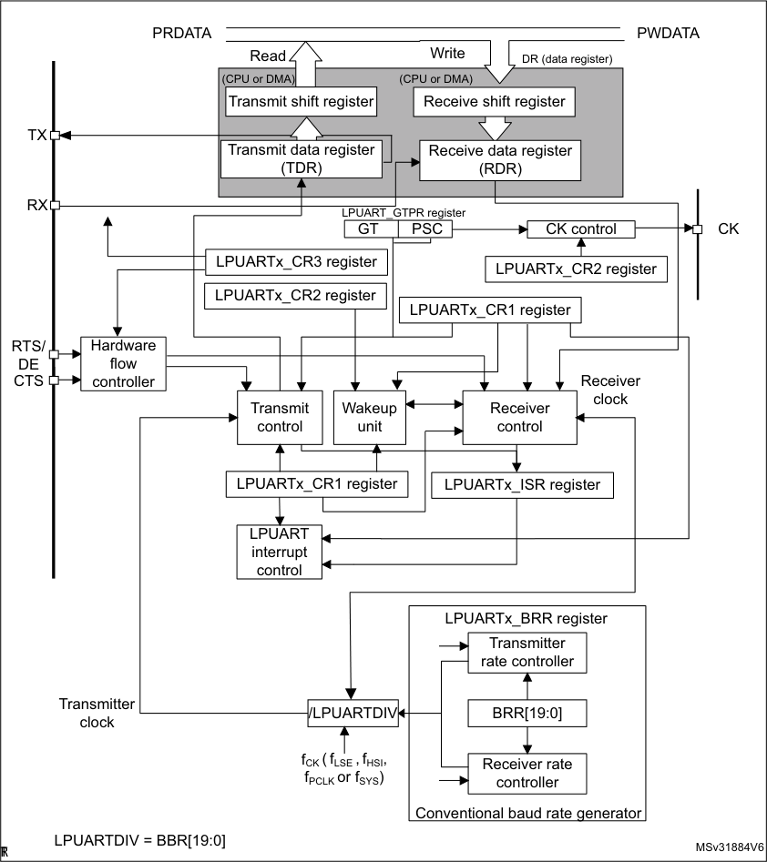

RM0377 Rev 10 729/905

767

--- end of page=728 ---

**Low-power universal asynchronous receiver transmitter (LPUART)** **RM0377**

**25.4.1** **LPUART character description**

Word length may be selected as being either 7 or 8 or 9 bits by programming the M[1:0] bits
in the LPUART_CR1 register (see _Figure 239_ ).

      - 7-bit character length: M[1:0] = 10

      - 8-bit character length: M[1:0] = 00

      - 9-bit character length: M[1:0] = 01

By default, the signal (TX or RX) is in low state during the start bit. It is in high state during
the stop bit.

These values can be inverted, separately for each signal, through polarity configuration
control.

An _**Idle character**_ is interpreted as an entire frame of “1”s. (The number of “1”s includes the
number of stop bits).

A _**Break character**_ is interpreted on receiving “0”s for a frame period. At the end of the
break frame, the transmitter inserts 2 stop bits.

Transmission and reception are driven by a common baud rate generator, the clock for each
is generated when the enable bit is set respectively for the transmitter and receiver.

The details of each block is given below.

730/905 RM0377 Rev 10

--- end of page=729 ---

**RM0377** **Low-power universal asynchronous receiver transmitter (LPUART)**

**Figure 239. Word length programming**

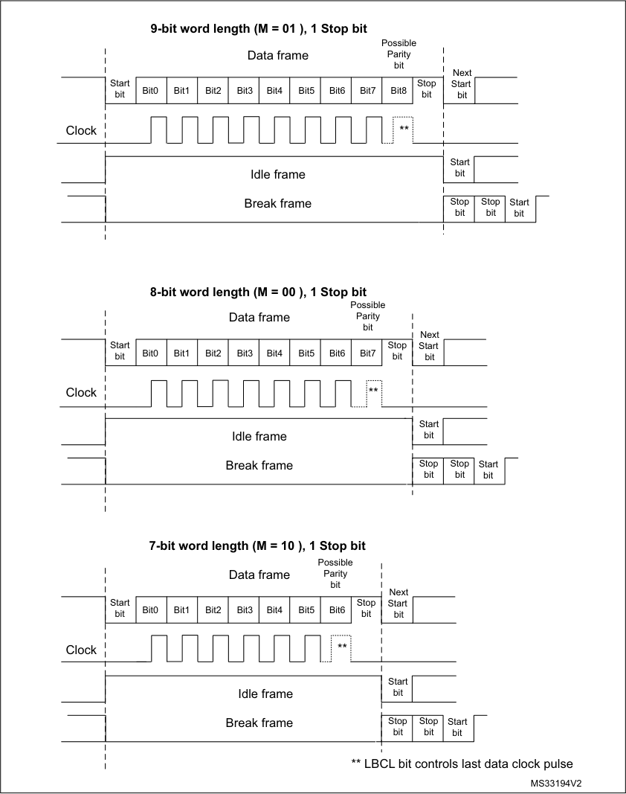

|Idle frame Break frame|Col2|Col3|
|---|---|---|
|Idle frame Break frame|Stop bit|Stop bit|

|Idle frame Break frame|Col2|Col3|
|---|---|---|
|Idle frame Break frame|Stop bit|Stop bit|

RM0377 Rev 10 731/905

767

--- end of page=730 ---

**Low-power universal asynchronous receiver transmitter (LPUART)** **RM0377**

**25.4.2** **LPUART transmitter**

The transmitter can send data words of either 7 or 8 or 9 bits depending on the M bits status.
The Transmit Enable bit (TE) must be set in order to activate the transmitter function. The
data in the transmit shift register is output on the TX pin.

**Character transmission**

During an LPUART transmission, data shifts out least significant bit first (default
configuration) on the TX pin. In this mode, the LPUART_TDR register consists of a buffer
(TDR) between the internal bus and the transmit shift register (see _Figure 213_ ).

Every character is preceded by a start bit which is a logic level low for one bit period. The
character is terminated by a configurable number of stop bits.

The following stop bits are supported by LPUART: 1 and 2 stop bits.

_Note:_ _The TE bit must be set before writing the data to be transmitted to the LPUART_TDR._

_The TE bit should not be reset during transmission of data. Resetting the TE bit during the_
_transmission will corrupt the data on the TX pin as the baud rate counters will get frozen._
_The current data being transmitted will be lost._

_An idle frame will be sent after the TE bit is enabled._

**Configurable stop bits**

The number of stop bits to be transmitted with every character can be programmed in
Control register 2, bits 13,12.

      - _**1 stop bit**_ **:** This is the default value of number of stop bits.

      - _**2 stop bits**_ **:** This will be supported by normal LPUART, Single-wire and Modem
modes.

An idle frame transmission will include the stop bits.

A break transmission will be 10 low bits (when M[1:0] = 00) or 11 low bits (when M[1:0] = 01)
or 9 low bits (when M[1:0] = 10) followed by 2 stop bits. It is not possible to transmit long
breaks (break of length greater than 9/10/11 low bits).

**Figure 240. Configurable stop bits**

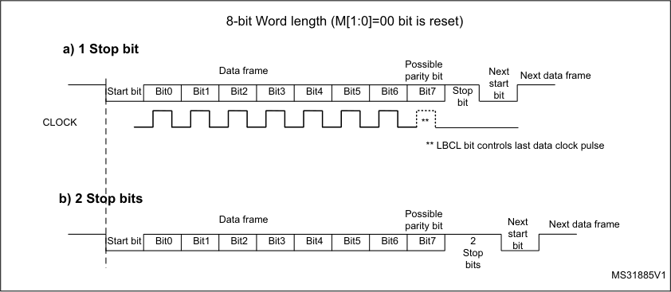

|Start bit|Col2|Bit0|Col4|Bit1|Col6|Bit2|Col8|Bit3|Col10|Bit4|Col12|Bit5|Col14|Bit6|Col16|Bit7|2|
|---|---|---|---|---|---|---|---|---|---|---|---|---|---|---|---|---|---|
|Start bit||Bit0||Bit1||Bit2||Bit3||Bit4||Bit5||Bit6||Bit7|Stop|

732/905 RM0377 Rev 10

--- end of page=731 ---

**RM0377** **Low-power universal asynchronous receiver transmitter (LPUART)**

**Character transmission procedure**

1. Program the M bits in LPUART_CR1 to define the word length.

2. Select the desired baud rate using the LPUART_BRR register.

3. Program the number of stop bits in LPUART_CR2.

4. Enable the LPUART by writing the UE bit in LPUART_CR1 register to 1.

5. Select DMA enable (DMAT) in LPUART_CR3 if multibuffer Communication is to take
place. Configure the DMA register as explained in multibuffer communication.

6. Set the TE bit in LPUART_CR1 to send an idle frame as first transmission.

7. Write the data to send in the LPUART_TDR register (this clears the TXE bit). Repeat
this for each data to be transmitted in case of single buffer.

8. After writing the last data into the LPUART_TDR register, wait until TC=1. This
indicates that the transmission of the last frame is complete. This is required for
instance when the LPUART is disabled or enters the Halt mode to avoid corrupting the
last transmission.

**Single byte communication**

Clearing the TXE bit is always performed by a write to the transmit data register.

The TXE bit is set by hardware and it indicates:

      - The data has been moved from the LPUART_TDR register to the shift register and the
data transmission has started.

      - The LPUART_TDR register is empty.

      - The next data can be written in the LPUART_TDR register without overwriting the
previous data.

This flag generates an interrupt if the TXEIE bit is set.

When a transmission is taking place, a write instruction to the LPUART_TDR register stores
the data in the TDR register; next, the data is copied in the shift register at the end of the
currently ongoing transmission.

When no transmission is taking place, a write instruction to the LPUART_TDR register
places the data in the shift register, the data transmission starts, and the TXE bit is set.

If a frame is transmitted (after the stop bit) and the TXE bit is set, the TC bit goes high. An
interrupt is generated if the TCIE bit is set in the LPUART_CR1 register.

After writing the last data in the LPUART_TDR register, it is mandatory to wait for TC=1
before disabling the LPUART or causing the microcontroller to enter the low-power mode
(see _Figure 216: TC/TXE behavior when transmitting_ ).

RM0377 Rev 10 733/905

767

--- end of page=732 ---

**Low-power universal asynchronous receiver transmitter (LPUART)** **RM0377**

**Figure 241. TC/TXE behavior when transmitting**

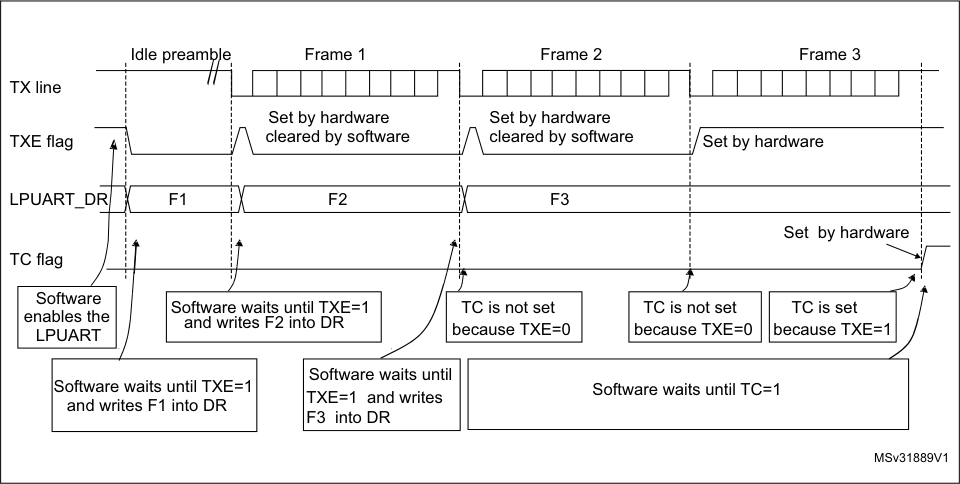

|Col1|Idle preamble|Col3|Col4|Col5|
|---|---|---|---|---|
||||||
||||||
||F1|F2|F3||
|||||Set  by hardware|

**Break characters**

Setting the SBKRQ bit transmits a break character. The break frame length depends on the
M bits (see _Figure 239_ ).

If a ‘1’ is written to the SBKRQ bit, a break character is sent on the TX line after completing
the current character transmission. The SBKF bit is set by the write operation and it is reset
by hardware when the break character is completed (during the stop bits after the break
character). The LPUART inserts a logic 1 signal (STOP) for the duration of 2 bits at the end
of the break frame to guarantee the recognition of the start bit of the next frame.

In the case the application needs to send the break character following all previously
inserted data, including the ones not yet transmitted, the software should wait for the TXE
flag assertion before setting the SBKRQ bit.

**Idle characters**

Setting the TE bit drives the LPUART to send an idle frame before the first data frame.

**25.4.3** **LPUART receiver**

The LPUART can receive data words of either 7 or 8 or 9 bits depending on the M bits in the
LPUART_CR1 register.

**Start bit detection**

In LPUART, for START bit detection, a falling edge should be detected first on the Rx line,
then a sample is taken in the middle of the start bit to confirm that it is still ‘0’. If the start
sample is at ‘1’, then the noise error flag (NF) is set, then the START bit is discarded and the
receiver waits for a new START bit. Else, the receiver continues to sample all incoming bits
normally.

734/905 RM0377 Rev 10

--- end of page=733 ---

**RM0377** **Low-power universal asynchronous receiver transmitter (LPUART)**

**Character reception**

During an LPUART reception, data shifts in least significant bit first (default configuration)
through the RX pin. In this mode, the LPUART_RDR register consists of a buffer (RDR)
between the internal bus and the received shift register.

**Character reception procedure**

1. Program the M bits in LPUART_CR1 to define the word length.

2. Select the desired baud rate using the baud rate register LPUART_BRR

3. Program the number of stop bits in LPUART_CR2.

4. Enable the LPUART by writing the UE bit in LPUART_CR1 register to 1.

5. Select DMA enable (DMAR) in LPUART_CR3 if multibuffer communication is to take
place. Configure the DMA register as explained in multibuffer communication.

6. Set the RE bit LPUART_CR1. This enables the receiver which begins searching for a
start bit.

When a character is received

      - The RXNE bit is set. It indicates that the content of the shift register is transferred to the
RDR. In other words, data has been received and can be read (as well as its
associated error flags).

      - An interrupt is generated if the RXNEIE bit is set.

      - The error flags can be set if a frame error, noise or an overrun error has been detected
during reception. PE flag can also be set with RXNE.

      - In multibuffer, RXNE is set after every byte received and is cleared by the DMA read of
the Receive data Register.

      - In single buffer mode, clearing the RXNE bit is performed by a software read to the
LPUART_RDR register. The RXNE flag can also be cleared by writing 1 to the RXFRQ
in the LPUART_RQR register. The RXNE bit must be cleared before the end of the
reception of the next character to avoid an overrun error.

**Break character**

When a break character is received, the LPUART handles it as a framing error.

**Idle character**

When an idle frame is detected, there is the same procedure as for a received data
character plus an interrupt if the IDLEIE bit is set.

RM0377 Rev 10 735/905

767

--- end of page=734 ---

**Low-power universal asynchronous receiver transmitter (LPUART)** **RM0377**

**Overrun error**

An overrun error occurs when a character is received when RXNE has not been reset. Data
can not be transferred from the shift register to the RDR register until the RXNE bit is
cleared.

The RXNE flag is set after every byte received. An overrun error occurs if RXNE flag is set
when the next data is received or the previous DMA request has not been serviced. When

an overrun error occurs:

      - The ORE bit is set.

      - The RDR content will not be lost. The previous data is available when a read to
LPUART_RDR is performed.

      - The shift register will be overwritten. After that point, any data received during overrun
is lost.

      - An interrupt is generated if either the RXNEIE bit is set or EIE bit is set.

      - The ORE bit is reset by setting the ORECF bit in the ICR register.

_Note:_ _The ORE bit, when set, indicates that at least 1 data has been lost. There are two_
_possibilities:_

_- if RXNE=1, then the last valid data is stored in the receive register RDR and can be read,_

_- if RXNE=0, then it means that the last valid data has already been read and thus there is_
_nothing to be read in the RDR. This case can occur when the last valid data is read in the_
_RDR at the same time as the new (and lost) data is received._

**Selecting the clock source**

The choice of the clock source is done through the Reset and Clock Control system (RCC).
The clock source must be chosen before enabling the LPUART (by setting the UE bit).

The choice of the clock source must be done according to two criteria:

      - Possible use of the LPUART in low-power mode

      - Communication speed.

The clock source frequency is f CK .

When the dual clock domain and the wakeup from Stop mode features are supported, the
clock source can be one of the following sources: f PCLK (default), f LSE, f HSI or f SYS .
Otherwise, the LPUART clock source is f PCLK .

Choosing f LSE, f HSI as clock source may allow the LPUART to receive data while the MCU is
in low-power mode. Depending on the received data and wakeup mode selection, the
LPUART wakes up the MCU, when needed, in order to transfer the received data by
software reading the LPUART_RDR register or by DMA.

For the other clock sources, the system must be active in order to allow LPUART
communication.

The communication speed range (specially the maximum communication speed) is also
determined by the clock source.

The receiver samples each incoming bit as close as possible to the middle of the bit -period.
Only a single sample is taken of each of the incoming bit.

_Note:_ _There is no noise detection for data._

736/905 RM0377 Rev 10

--- end of page=735 ---

**RM0377** **Low-power universal asynchronous receiver transmitter (LPUART)**

**Framing error**

A framing error is detected when the stop bit is not recognized on reception at the expected
time, following either a de-synchronization or excessive noise.

When the framing error is detected:

      - The FE bit is set by hardware.

      - The invalid data is transferred from the Shift register to the LPUART_RDR register.

      - No interrupt is generated in case of single byte communication. However this bit rises
at the same time as the RXNE bit which itself generates an interrupt. In case of
multibuffer communication an interrupt will be issued if the EIE bit is set in the
LPUART_CR3 register.

The FE bit is reset by writing 1 to the FECF in the LPUART_ICR register.

**Configurable stop bits during reception**

The number of stop bits to be received can be configured through the control bits of Control
Register 2 - it can be either 1 or 2 in normal mode.

      - _**1 stop bit**_ : Sampling for 1 stop Bit is done on the 8th, 9th and 10th samples.

      - _**2 stop bits**_ : Sampling for the 2 stop bits is done in the middle of the second stop bit.
The RXNE and FE flags are set just after this sample i.e. during the second stop bit.
The first stop bit is not checked for framing error.

**25.4.4** **LPUART baud rate generation**

The baud rate for the receiver and transmitter (Rx and Tx) are both set to the same value as
programmed in the LPUART_BRR register.

Tx/Rx baud = ---------------------------------- 256 × CK f **-**
LPUARTDIV

LPUARTDIV is coded on the LPUART_BRR register.

_Note:_ _The baud counters are updated to the new value in the baud registers after a write operation_
_to LPUART_BRR. Hence the baud rate register value should not be changed during_
_communication._

_It is forbidden to write values less than 0x300 in the LPUART_BRR register._

_fck must be in the range [3 x baud rate, 4096 x baud rate]._

The maximum baud rate that can be reached when the LPUART clock source is the LSE, is
9600 baud. Higher baud rates can be reached when the LPUART is clocked by clock
sources different than the LSE clock. For example, if the USART clock source is the system
clock (maximum is 32 MHz), the maximum baud rate that can be reached is 10 Mbaud.

RM0377 Rev 10 737/905

767

--- end of page=736 ---

**Low-power universal asynchronous receiver transmitter (LPUART)** **RM0377**

**Table 127. Error calculation for programmed baud rates at f** **ck** **= 32.768 kHz**

|Baud rate|Col2|f = 32.768 kHz CK|Col4|Col5|
|---|---|---|---|---|
|**S.No**|**Desired**|**Actual**|**Value programmed in the baud** **rate register**|**% Error = (Calculated - Desired)** **B.rate / Desired B.rate**|
|1|300 baud|300 baud|0x6D3A|0|
|2|600 baud|600 baud|0x369D|0|
|3|1200 baud|1200.087 baud|0x1B4E|0.007|
|4|2400 baud|2400.17 baud|0xDA7|0.007|
|5|4800 baud|4801.72 baud|0x6D3|0.035|
|6|9600 baud|9608.94 baud|0x369|0.093|

**Table 128. Error calculation for programmed baud rates at f** **ck** **= 32 MHz**

|Baud rate|f = 32.768 kHz CK|Col3|Col4|
|---|---|---|---|
|**Desired**|**Actual**|**Value programmed in the baud** **rate register**|**% Error = (Calculated - Desired)** **B.rate / Desired B.rate**|
|9600 baud|9608.94 baud|D0555|0.00004|
|19200|19200,030|682AA|0,0001|
|38400|38400,06|34155|0,0001|
|57600|57600,09|22B8E|0,0001|
|115200|115200,18|115C7|0,0001|
|230400|230403,60|8AE3|0,0015|
|460800|460820,16|4571|0,004|
|921600|921692,17|22B8|0,01|
|4000000|4000000,00|800|0|
|10000000|10002442,00|333|0,024|

738/905 RM0377 Rev 10

--- end of page=737 ---

**RM0377** **Low-power universal asynchronous receiver transmitter (LPUART)**

**25.4.5** **Tolerance of the LPUART receiver to clock deviation**

The asynchronous receiver of the LPUART works correctly only if the total clock system
deviation is less than the tolerance of the LPUART receiver. The causes which contribute to

the total deviation are:

      - DTRA: Deviation due to the transmitter error (which also includes the deviation of the
transmitter’s local oscillator)

      - DQUANT: Error due to the baud rate quantization of the receiver

      - DREC: Deviation of the receiver’s local oscillator

      - DTCL: Deviation due to the transmission line (generally due to the transceivers which
can introduce an asymmetry between the low-to-high transition timing and the high-tolow transition timing)

DTRA + DQUANT + DREC + DTCL + DWU < LPUART receiver tolerance

where

DWU is the error due to sampling point deviation when the wakeup from Stop mode is
used.

when M[1:0] = 01:

DWU = ---------------------------- t WULPUART **-**
11 × Tbit

when M[1:0] = 00:

DWU = ---------------------------- t WULPUART **-**
10 × Tbit

when M[1:0] = 10:

DWU = t ---------------------------- WULPUART **-**
9 × Tbit

t WULPUART is the time between:

–
The detection of start bit falling edge

–
The instant when clock (requested by the peripheral) is ready and reaching the
peripheral and regulator is ready.

t WULPUART corresponds to t WUSTOP value provided in the datasheet.

The LPUART receiver can receive data correctly at up to the maximum tolerated deviation
specified in _Table 129_ :

      - 7, 8 or 9-bit character length defined by the M bits in the LPUARTx_CR1 register

      - 1 or 2 stop bits

**Table 129. Tolerance of the LPUART receiver**

|M bits|768 ≤ BRR <1024|1024 ≤ BRR < 2048|2048 ≤ BRR < 4096|4096 ≤ BRR|
|---|---|---|---|---|
|8 bits (M=00), 1 stop bit|1.82%|2.56%|3.90%|4.42%|
|9 bits (M=01), 1 stop bit|1.69%|2.33%|2.53%|4.14%|
|7 bits (M=10), 1 stop bit|2.08%|2.86%|4.35%|4.42%|

RM0377 Rev 10 739/905

767

--- end of page=738 ---

**Low-power universal asynchronous receiver transmitter (LPUART)** **RM0377**

**Table 129. Tolerance of the LPUART receiver (continued)**

|M bits|768 ≤ BRR <1024|1024 ≤ BRR < 2048|2048 ≤ BRR < 4096|4096 ≤ BRR|
|---|---|---|---|---|
|8 bits (M=00), 2 stop bit|2.08%|2.86%|4.35%|4.42%|
|9 bits (M=01), 2 stop bit|1.82%|2.56%|3.90%|4.42%|
|7 bits (M=10), 2stop bit|2.34%|3.23%|4.92%|4.42%|

_Note:_ _The data specified in Table 129_ _may slightly differ in the special case when the received_
_frames contain some Idle frames of exactly 10-bit durations when M bits = 00 (11-bit_
_durations when M bits =01 or 9- bit durations when M bits = 10)._

**25.4.6** **Multiprocessor communication using LPUART**

It is possible to perform multiprocessor communication with the LPUART (with several
LPUARTs connected in a network). For instance one of the LPUARTs can be the master, its
TX output connected to the RX inputs of the other LPUARTs. The others are slaves, their
respective TX outputs are logically ANDed together and connected to the RX input of the
master.

In multiprocessor configurations it is often desirable that only the intended message
recipient should actively receive the full message contents, thus reducing redundant
LPUART service overhead for all non addressed receivers.

The non addressed devices may be placed in mute mode by means of the muting function.
In order to use the mute mode feature, the MME bit must be set in the LPUART_CR1
register.

In mute mode:

      - None of the reception status bits can be set.

      - All the receive interrupts are inhibited.

      - The RWU bit in LPUART_ISR register is set to 1. RWU can be controlled automatically
by hardware or by software, through the MMRQ bit in the LPUART_RQR register,
under certain conditions.

The LPUART can enter or exit from mute mode using one of two methods, depending on
the WAKE bit in the LPUART_CR1 register:

      - Idle Line detection if the WAKE bit is reset,

      - Address Mark detection if the WAKE bit is set.

**Idle line detection (WAKE=0)**

The LPUART enters mute mode when the MMRQ bit is written to 1 and the RWU is
automatically set.

It wakes up when an Idle frame is detected. Then the RWU bit is cleared by hardware but
the IDLE bit is not set in the LPUART_ISR register. An example of mute mode behavior
using Idle line detection is given in _Figure 220_ .

740/905 RM0377 Rev 10

--- end of page=739 ---

**RM0377** **Low-power universal asynchronous receiver transmitter (LPUART)**

**Figure 242. Mute mode using Idle line detection**

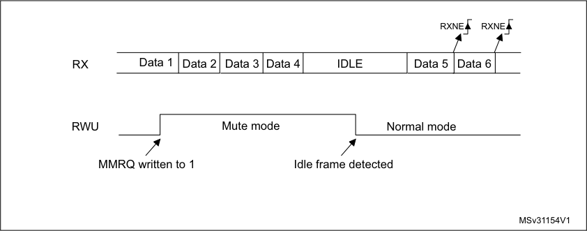

_Note:_ _If the MMRQ is set while the IDLE character has already elapsed, mute mode will not be_
_entered (RWU is not set)._

_If the LPUART is activated while the line is IDLE, the idle state is detected after the duration_
_of one IDLE frame (not only after the reception of one character frame)._

**4-bit/7-bit address mark detection (WAKE=1)**

In this mode, bytes are recognized as addresses if their MSB is a ‘1’ otherwise they are
considered as data. In an address byte, the address of the targeted receiver is put in the 4
or 7 LSBs. The choice of 7 or 4 bit address detection is done using the ADDM7 bit. This 4bit/7-bit word is compared by the receiver with its own address which is programmed in the
ADD bits in the LPUART_CR2 register.

_Note:_ _In 7-bit and 9-bit data modes, address detection is done on 6-bit and 8-bit addresses_
_(ADD[5:0] and ADD[7:0]) respectively._

The LPUART enters mute mode when an address character is received which does not

match its programmed address. In this case, the RWU bit is set by hardware. The RXNE
flag is not set for this address byte and no interrupt or DMA request is issued when the
LPUART enters mute mode.

The LPUART also enters mute mode when the MMRQ bit is written to 1. The RWU bit is
also automatically set in this case.

The LPUART exits from mute mode when an address character is received which matches

the programmed address. Then the RWU bit is cleared and subsequent bytes are received
normally. The RXNE bit is set for the address character since the RWU bit has been
cleared.

An example of mute mode behavior using address mark detection is given in _Figure 221_ .

RM0377 Rev 10 741/905

767

--- end of page=740 ---

**Low-power universal asynchronous receiver transmitter (LPUART)** **RM0377**

**Figure 243. Mute mode using address mark detection**

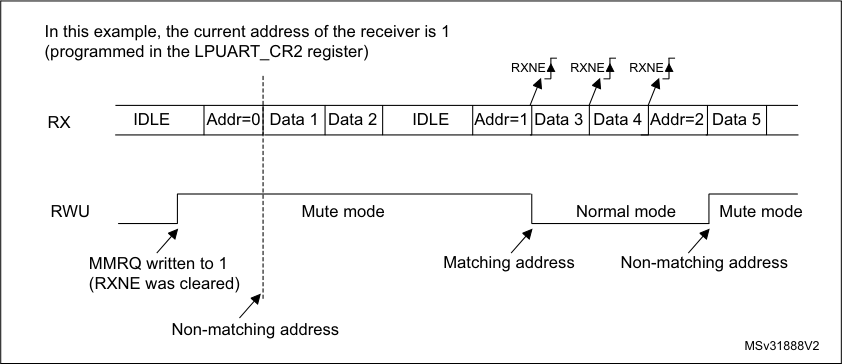

**25.4.7** **LPUART parity control**

Parity control (generation of parity bit in transmission and parity checking in reception) can
be enabled by setting the PCE bit in the LPUART_CR1 register. Depending on the frame
length defined by the M bits, the possible LPUART frame formats are as listed in _Table 122_ .

**Table 130. Frame formats**

|M bits|PCE bit|LPUART frame(1)|
|---|---|---|
|00|0|| SB | 8-bit data | STB ||
|00|1|| SB | 7-bit data | PB | STB ||
|01|0|| SB | 9-bit data | STB ||
|01|1|| SB | 8-bit data | PB | STB ||
|10|0|| SB | 7-bit data | STB ||
|10|1|| SB | 6-bit data | PB | STB ||

1. Legends: SB: start bit, STB: stop bit, PB: parity bit.

2. In the data register, the PB is always taking the MSB position (9th, 8th or 7th, depending on the M bits
value).

**Even parity**

The parity bit is calculated to obtain an even number of “1s” inside the frame which is made
of the 6, 7 or 8 LSB bits (depending on M bits values) and the parity bit.

As an example, if data=00110101, and 4 bits are set, then the parity bit will be 0 if even
parity is selected (PS bit in LPUART_CR1 = 0).

**Odd parity**

The parity bit is calculated to obtain an odd number of “1s” inside the frame made of the 6, 7
or 8 LSB bits (depending on M bits values) and the parity bit.

As an example, if data=00110101 and 4 bits set, then the parity bit will be 1 if odd parity is
selected (PS bit in LPUART_CR1 = 1).

742/905 RM0377 Rev 10

--- end of page=741 ---

**RM0377** **Low-power universal asynchronous receiver transmitter (LPUART)**

**Parity checking in reception**

If the parity check fails, the PE flag is set in the LPUART_ISR register and an interrupt is
generated if PEIE is set in the LPUART_CR1 register. The PE flag is cleared by software
writing 1 to the PECF in the LPUART_ICR register.

**Parity generation in transmission**

If the PCE bit is set in LPUARTx_CR1, then the MSB bit of the data written in the data
register is transmitted but is changed by the parity bit (even number of “1s” if even parity is
selected (PS=0) or an odd number of “1s” if odd parity is selected (PS=1)).

**25.4.8** **Single-wire Half-duplex communication using LPUART**

Single-wire Half-duplex mode is selected by setting the HDSEL bit in the LPUART_CR3
register. In this mode, the following bits must be kept cleared:

      - LINEN and CLKEN bits in the LPUART_CR2 register,

      - SCEN and IREN bits in the LPUART_CR3 register.

The LPUART can be configured to follow a Single-wire Half-duplex protocol where the TX
and RX lines are internally connected. The selection between half- and Full-duplex
communication is made with a control bit HDSEL in LPUART_CR3.

As soon as HDSEL is written to 1:

      - The TX and RX lines are internally connected

      - The RX pin is no longer used

      - The TX pin is always released when no data is transmitted. Thus, it acts as a standard
I/O in idle or in reception. It means that the I/O must be configured so that TX is
configured as alternate function open-drain with an external pull-up.

Apart from this, the communication protocol is similar to normal LPUART mode. Any
conflicts on the line must be managed by software (by the use of a centralized arbiter, for
instance). In particular, the transmission is never blocked by hardware and continues as
soon as data is written in the data register while the TE bit is set.

_Note:_ _In LPUART, in the case of 1-stop bit configuration, the RXNE flag is set in the middle of the_
_stop bit._

**25.4.9** **Continuous communication in DMA mode using LPUART**

The LPUART is capable of performing continuous communication using the DMA. The DMA
requests for Rx buffer and Tx buffer are generated independently.

_Note:_ _Use the LPUART as explained in Section 25.4.3. To perform continuous communication,_
_you can clear the TXE/ RXNE flags In the LPUART_ISR register._

RM0377 Rev 10 743/905

767

--- end of page=742 ---

**Low-power universal asynchronous receiver transmitter (LPUART)** **RM0377**

**Transmission using DMA**

DMA mode can be enabled for transmission by setting DMAT bit in the LPUART_CR3
register. Data is loaded from a SRAM area configured using the DMA peripheral (refer to
Section _Direct memory access controller (DMA)_ ) to the LPUART_TDR register whenever
the TXE bit is set. To map a DMA channel for LPUART transmission, use the following
procedure (x denotes the channel number):

1. Write the LPUART_TDR register address in the DMA control register to configure it as
the destination of the transfer. The data is moved to this address from memory after
each TXE event.

2. Write the memory address in the DMA control register to configure it as the source of
the transfer. The data is loaded into the LPUART_TDR register from this memory area
after each TXE event.

3. Configure the total number of bytes to be transferred to the DMA control register.

4. Configure the channel priority in the DMA register

5. Configure DMA interrupt generation after half/ full transfer as required by the
application.

6. Clear the TC flag in the LPUART_ISR register by setting the TCCF bit in the
LPUART_ICR register.

7. Activate the channel in the DMA register.

When the number of data transfers programmed in the DMA Controller is reached, the DMA
controller generates an interrupt on the DMA channel interrupt vector.

In transmission mode, once the DMA has written all the data to be transmitted (the TCIF flag
is set in the DMA_ISR register), the TC flag can be monitored to make sure that the
LPUART communication is complete. This is required to avoid corrupting the last
transmission before disabling the LPUART or entering Stop mode. Software must wait until
TC=1. The TC flag remains cleared during all data transfers and it is set by hardware at the
end of transmission of the last frame.

744/905 RM0377 Rev 10

--- end of page=743 ---

**RM0377** **Low-power universal asynchronous receiver transmitter (LPUART)**

**Figure 244. Transmission using DMA**

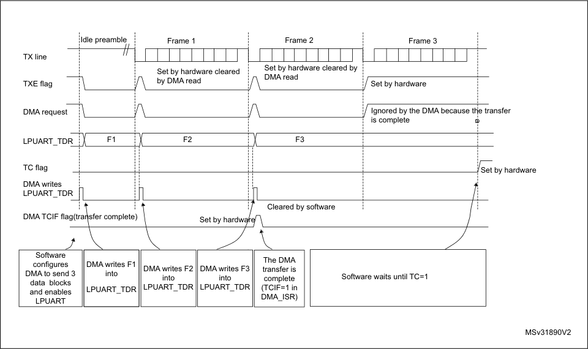

|dle preamble|Col2|Col3|Col4|Col5|
|---|---|---|---|---|
||||||
||||||
||||||
|F1||F2|F3||
||||||
||||||
|nsfer complete)|nsfer complete)|nsfer complete)|nsfer complete)|nsfer complete)|

**Reception using DMA**

DMA mode can be enabled for reception by setting the DMAR bit in LPUART_CR3 register.
Data is loaded from the LPUART_RDR register to a SRAM area configured using the DMA
peripheral (refer Section _Direct memory access controller (DMA)_ ) whenever a data byte is
received. To map a DMA channel for LPUART reception, use the following procedure:

1. Write the LPUART_RDR register address in the DMA control register to configure it as
the source of the transfer. The data is moved from this address to the memory after
each RXNE event.

2. Write the memory address in the DMA control register to configure it as the destination
of the transfer. The data is loaded from LPUART_RDR to this memory area after each
RXNE event.

3. Configure the total number of bytes to be transferred to the DMA control register.

4. Configure the channel priority in the DMA control register

5. Configure interrupt generation after half/ full transfer as required by the application.

6. Activate the channel in the DMA control register.

When the number of data transfers programmed in the DMA Controller is reached, the DMA
controller generates an interrupt on the DMA channel interrupt vector.

RM0377 Rev 10 745/905

767

--- end of page=744 ---

**Low-power universal asynchronous receiver transmitter (LPUART)** **RM0377**

**Figure 245. Reception using DMA**

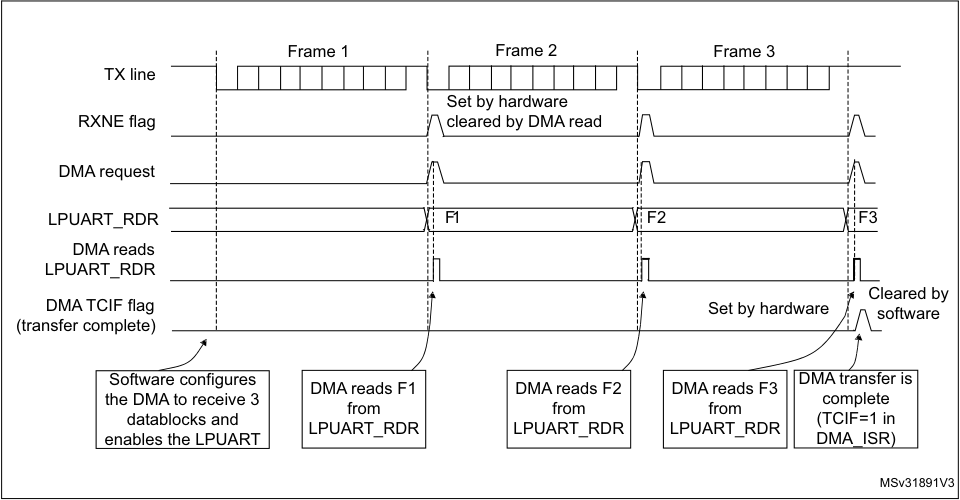

|Col1|Col2|Col3|
|---|---|---|
||||
||F1|F2|
|||Set by hardware|
||||

**Error flagging and interrupt generation in multibuffer communication**

In multibuffer communication if any error occurs during the transaction the error flag is
asserted after the current byte. An interrupt is generated if the interrupt enable flag is set.
For framing error, overrun error and noise flag which are asserted with RXNE in single byte
reception, there is a separate error flag interrupt enable bit (EIE bit in the LPUART_CR3
register), which, if set, enables an interrupt after the current byte if any of these errors occur.

**25.4.10** **RS232 Hardware flow control and RS485 Driver Enable**
**using LPUART**

It is possible to control the serial data flow between 2 devices by using the CTS input and
the RTS output. The _Figure 234_ shows how to connect 2 devices in this mode:

**Figure 246. Hardware flow control between 2 LPUARTs**

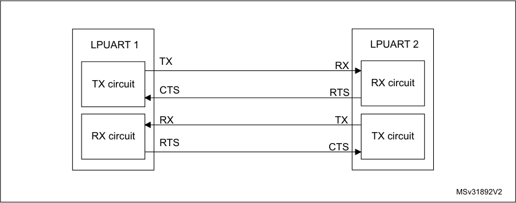

RS232 RTS and CTS flow control can be enabled independently by writing the RTSE and
CTSE bits respectively to 1 (in the LPUART_CR3 register).

746/905 RM0377 Rev 10

--- end of page=745 ---

**RM0377** **Low-power universal asynchronous receiver transmitter (LPUART)**

**RS232 RTS flow control**

If the RTS flow control is enabled (RTSE=1), then RTS is deasserted (tied low) as long as
the LPUART receiver is ready to receive a new data. when the receive register is full, RTS is
asserted, indicating that the transmission is expected to stop at the end of the current frame.
_Figure 235_ shows an example of communication with RTS flow control enabled.

**Figure 247. RS232 RTS flow control**

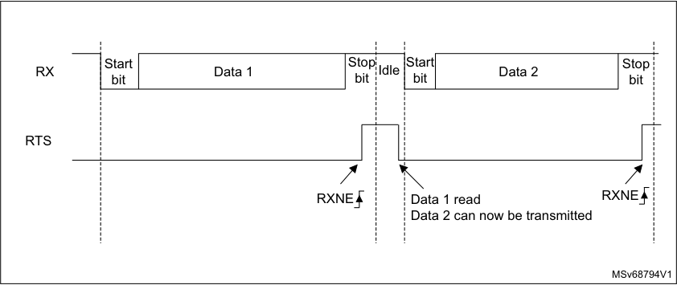

**RS232 CTS flow control**

If the CTS flow control is enabled (CTSE=1), then the transmitter checks the CTS input
before transmitting the next frame. If CTS is deasserted (tied low), then the next data is
transmitted (assuming that data is to be transmitted, in other words, if TXE=0), else the
transmission does not occur. When CTS is asserted during a transmission, the current
transmission is completed before the transmitter stops.

When CTSE=1, the CTSIF status bit is automatically set by hardware as soon as the CTS
input toggles. It indicates when the receiver becomes ready or not ready for communication.
An interrupt is generated if the CTSIE bit in the LPUART_CR3 register is set. _Figure 236_
shows an example of communication with CTS flow control enabled.

RM0377 Rev 10 747/905

767

--- end of page=746 ---

**Low-power universal asynchronous receiver transmitter (LPUART)** **RM0377**

**Figure 248. RS232 CTS flow control**

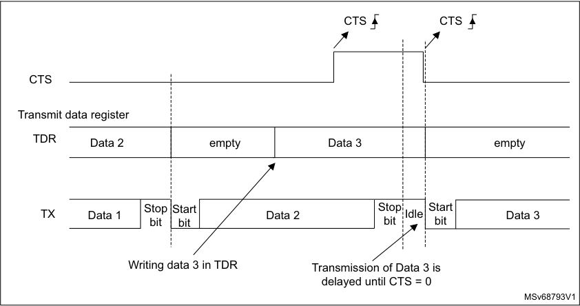

|Col1|Col2|Col3|
|---|---|---|
|empty|Data 3||
|empty|Data 3||

_Note:_ _For correct behavior, CTS must be deasserted at least 3 LPUART clock source periods_
_before the end of the current character. In addition it should be noted that the CTSCF flag_
_may not be set for pulses shorter than 2 x PCLK periods._

**RS485 Driver Enable**

The driver enable feature is enabled by setting bit DEM in the LPUART_CR3 control
register. This allows the user to activate the external transceiver control, through the DE
(Driver Enable) signal. The assertion time is the time between the activation of the DE signal
and the beginning of the START bit. It is programmed using the DEAT [4:0] bit fields in the
LPUART_CR1 control register. The de-assertion time is the time between the end of the last
stop bit, in a transmitted message, and the de-activation of the DE signal. It is programmed
using the DEDT [4:0] bit fields in the LPUART_CR1 control register. The polarity of the DE
signal can be configured using the DEP bit in the LPUART_CR3 control register.

In LPUART, the DEAT and DEDT are expressed in USART clock source (f CK ) cycles:

      - The Driver enable assertion time =

–
(1 + (DEAT x P)) x f CK, if P <> 0

–
(1 + DEAT) x f CK, if P = 0

      - The Driver enable de-assertion time =

–
(1 + (DEDT x P)) x f CK, if P <> 0

–
(1 + DEDT) x f CK, if P = 0

With P = BRR[14:11]

748/905 RM0377 Rev 10

--- end of page=747 ---

**RM0377** **Low-power universal asynchronous receiver transmitter (LPUART)**

**25.4.11** **Wakeup from Stop mode using LPUART**

The LPUART is able to wake up the MCU from Stop modewhen the UESM bit is set and the
LPUART clock is set to HSI or LSE (refer to the _Reset and clock control (RCC) section_ .

      - LPUART source clock is HSI

If during Stop mode the HSI clock is switched OFF, when a falling edge on the LPUART
receive line is detected, the LPUART interface requests the HSI clock to be switched
ON. The HSI clock is then used for the frame reception.

–
If the wakeup event is verified, the MCU wakes up from low-power mode and data
reception goes on normally.

–
If the wakeup event is not verified, the HSI clock is switched OFF again, the MCU
is not waken up and stays in low-power mode and the clock request is released.

_Note:_ _If the LPUART kernel clock is kept ON during Stop mode, there is no constraint on the_
_maximum baud rate that allows waking up from Stop mode. It is the same as in Run mode._

      - LPUART source clock is LSE

Same principle as described in case LPUART source clock is HSI with the difference
that the LSE is ON in Stop mode, but the LSE clock is not propagated to LPUART if the
LPUART is not requesting it. The LSE clock is not OFF but there is a clock gating to
avoid useless consumption.

When the LPUART clock source is configured to be f LSE or f HSI, it is possible to keep
enabled this clock during STOP mode by setting the UCESM bit in LPUART_CR3 control
register.

_Note:_ _When LPUART is used to wakeup from stop with LSE is selected as LPUART clock source,_
_and desired baud rate is 9600 baud, the bit UCESM bit in LPUART_CR3 control register_
_must be set._

The MCU wakeup from Stop mode can be done using the standard RXNE interrupt. In this
case, the RXNEIE bit must be set before entering Stop mode.

Alternatively, a specific interrupt may be selected through the WUS bit fields.

In order to be able to wake up the MCU from Stop mode, the UESM bit in the LPUART_CR1
control register must be set prior to entering Stop mode.

When the wakeup event is detected, the WUF flag is set by hardware and a wakeup
interrupt is generated if the WUFIE bit is set.

For code example, refer to _A.16.1: LPUART receiver configuration code example_ and
_A.16.2: LPUART receive byte code example_ .

_Note:_ _Before entering Stop mode, the user must ensure that the LPUART is not performing a_
_transfer. BUSY flag cannot ensure that Stop mode is never entered during a running_
_reception._

_The WUF flag is set when a wakeup event is detected, independently of whether the MCU is_
_in Stop or in an active mode._

_When entering Stop mode just after having initialized and enabled the receiver, the REACK_
_bit must be checked to ensure the LPUART is actually enabled._

_When DMA is used for reception, it must be disabled before entering Stop mode and re-_
_enabled upon exit from Stop mode._

_The wakeup from Stop mode feature is not available for all modes. For example it doesn’t_
_work in SPI mode because the SPI operates in master mode only._

RM0377 Rev 10 749/905

767

--- end of page=748 ---

**Low-power universal asynchronous receiver transmitter (LPUART)** **RM0377**

**Using Mute mode with Stop mode**

If the LPUART is put into Mute mode before entering Stop mode:

      - Wakeup from Mute mode on idle detection must not be used, because idle detection
cannot work in Stop mode.

      - If the wakeup from Mute mode on address match is used, then the source of wake-up
from Stop mode must also be the address match. If the RXNE flag is set when entering
the Stop mode, the interface will remain in mute mode upon address match and wake
up from Stop.

      - If the LPUART is configured to wake up the MCU from Stop mode on START bit
detection, the WUF flag is set, but the RXNE flag is not set.

**Determining the maximum LPUART baud rate allowing to wakeup correctly**
**from Stop mode when the LPUART clock source is the HSI clock**

The maximum baud rate allowing to wakeup correctly from Stop mode depends on:

      - the parameter t WULPUART (wakeup time from Stop mode) provided in the device
datasheet

      - the LPUART receiver tolerance provided in the _Section 25.4.5: Tolerance of the_
_LPUART receiver to clock deviation_ .

Let us take this example: M bits = 01, 2 stop bits, BRR ≥ 4096.

In these conditions, according to _Table 129: Tolerance of the LPUART receiver_, the
LPUART receiver tolerance is 4.42 %.

DTRA + DQUANT + DREC + DTCL + DWU < LPUART receiver tolerance

DWU max = t WULPUART / (11 x Tbit Min)

Tbit Min = t WULPUART / (11 x DWU max)

If we consider an ideal case where the parameters DTRA, DQUANT, DREC and DTCL are
at 0%, the DWU max is 4.42 %. In reality, we need to consider at least the HSI inaccuracy.

Let us consider the HSI inaccuracy = 1 %, t WULPUART = 8.1 μs (in case of Stop mode with
main regulator in Run mode, Range 1 ):

DWU max = 4.42 % - 1 % = 3.42 %

Tbit min = 8.1 µs / (11 ₓ 3.42 %) = 2.5 μs.

In these conditions, the maximum baud rate allowing to wakeup correctly from Stop mode is
1/ 21.5 μs = 46 kbaud.

750/905 RM0377 Rev 10

--- end of page=749 ---

