# RM0377 STM32L0x1 — Pages 751–800

**RM0377** **Low-power universal asynchronous receiver transmitter (LPUART)**

###### **25.5 LPUART in low-power mode**

**Table 131. Effect of low-power modes on the LPUART**

|Mode|Description|
|---|---|
|Sleep|No effect. USART interrupt causes the device to exit Sleep mode.|
|Low-power run|No effect.|
|Low-power sleep|No effect. USART interrupt causes the device to exit Low-power sleep mode.|
|Stop|The LPUART is able to wake up the MCU from Stop mode when the UESM bit is set and the LPUART clock is set to HSI16 or LSE. The MCU wakeup from Stop mode can be done using either the standard RXNE or the WUF interrupt.|
|Standby|The LPUART is powered down and must be reinitialized when the device has exited from Standby mode.|

###### **25.6 LPUART interrupts**

**Table 132. LPUART interrupt requests**

|Interrupt event|Event flag|Enable Control bit|
|---|---|---|
|Transmit data register empty|TXE|TXEIE|
|CTS interrupt|CTSIF|CTSIE|
|Transmission Complete|TC|TCIE|
|Receive data register not empty (data ready to be read)|RXNE|RXNEIE|
|Overrun error detected|ORE|ORE|
|Idle line detected|IDLE|IDLEIE|
|Parity error|PE|PEIE|
|Noise Flag, Overrun error and Framing Error in multibuffer communication.|NF or ORE or FE|EIE|
|Character match|CMF|CMIE|
|Wakeup from Stop mode|WUF(1)|WUFIE|

1. The wUF interrupt is active only in Stop mode.

The LPUART interrupt events are connected to the same interrupt vector (see _Figure 237_ ).

- During transmission: Transmission Complete, Clear to Send, Transmit data Register
empty or Framing error interrupt.

- During reception: Idle Line detection, Overrun error, Receive data register not empty,
Parity error, Noise Flag, Framing Error, Character match, etc.

These events generate an interrupt if the corresponding Enable Control Bit is set.

RM0377 Rev 10 751/905

767

--- end of page=750 ---

**Low-power universal asynchronous receiver transmitter (LPUART)** **RM0377**

**Figure 249. LPUART interrupt mapping diagram**

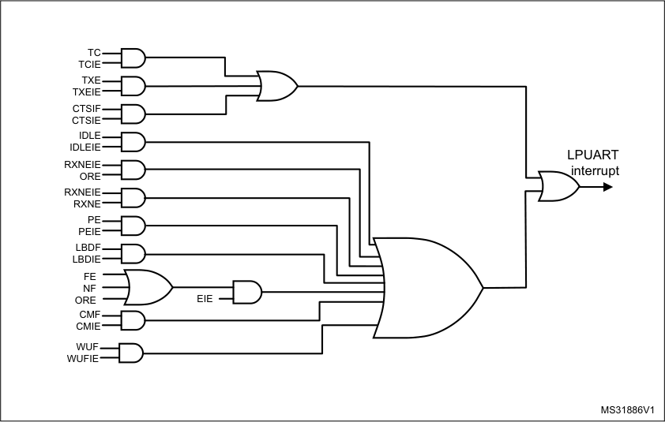

752/905 RM0377 Rev 10

--- end of page=751 ---

**RM0377** **Low-power universal asynchronous receiver transmitter (LPUART)**

###### **25.7 LPUART registers**

Refer to _Section 1.2 on page 45_ for a list of abbreviations used in register descriptions.

The peripheral registers have to be accessed by words (32 bits).

**25.7.1** **Control register 1 (LPUART_CR1)**

Address offset: 0x00

Reset value: 0x0000

|31|30|29|28|27|26|25 24 23 22 21|Col8|Col9|Col10|Col11|20 19 18 17 16|Col13|Col14|Col15|Col16|
|---|---|---|---|---|---|---|---|---|---|---|---|---|---|---|---|
|Res.|Res.|Res.|M1|Res.|Res.|DEAT[4:0]|DEAT[4:0]|DEAT[4:0]|DEAT[4:0]|DEAT[4:0]|DEDT[4:0]|DEDT[4:0]|DEDT[4:0]|DEDT[4:0]|DEDT[4:0]|
||||rw|||rw|rw|rw|rw|rw|rw|rw|rw|rw|rw|

|15|14|13|12|11|10|9|8|7|6|5|4|3|2|1|0|
|---|---|---|---|---|---|---|---|---|---|---|---|---|---|---|---|
|Res.|CMIE|MME|M0|WAKE|PCE|PS|PEIE|TXEIE|TCIE|RXNEIE|IDLEIE|TE|RE|UESM|UE|
||rw|rw|rw|rw|rw|rw|rw|rw|rw|rw|rw|rw|rw|rw|rw|

Bits 31:29 Reserved, must be kept at reset value

Bit 28 **M1** : Word length

This bit, with bit 12 (M0) determines the word length. It is set or cleared by software.
M[1:0] = 00: 1 Start bit, 8 data bits, n stop bits
M[1:0] = 01: 1 Start bit, 9 data bits, n stop bits
M[1:0] = 10: 1 Start bit, 7 data bits, n stop bits
This bit can only be written when the LPUART is disabled (UE=0).

Bit 27 Reserved, must be kept at reset value

Bit 26 Reserved, must be kept at reset value

Bits 25:21 **DEAT[4:0]** : Driver Enable assertion time

This 5-bit value defines the time between the activation of the DE (Driver Enable) signal and
the beginning of the start bit. It is expressed in UCLK (USART clock) clock cycles. For more
details, refer to RS485 Driver Enable paragraph.
This bit field can only be written when the LPUART is disabled (UE=0).

Bits 20:16 **DEDT[4:0]** : Driver Enable de-assertion time

This 5-bit value defines the time between the end of the last stop bit, in a transmitted
message, and the de-activation of the DE (Driver Enable) signal. It is expressed in UCLK
(USART clock) clock cycles. For more details, refer to RS485 Driver Enable paragraph.
If the LPUART_TDR register is written during the DEDT time, the new data is transmitted
only when the DEDT and DEAT times have both elapsed.
This bit field can only be written when the LPUART is disabled (UE=0).

Bit 15 Reserved, must be kept at reset value

Bit 14 **CMIE** : Character match interrupt enable

This bit is set and cleared by software.
0: Interrupt is inhibited
1: A LPUART interrupt is generated when the CMF bit is set in the LPUART_ISR register.

RM0377 Rev 10 753/905

767

--- end of page=752 ---

**Low-power universal asynchronous receiver transmitter (LPUART)** **RM0377**

Bit 13 **MME** : Mute mode enable

This bit activates the mute mode function of the LPUART. When set, the LPUART can switch
between the active and mute modes, as defined by the WAKE bit. It is set and cleared by
software.

0: Receiver in active mode permanently

1: Receiver can switch between mute mode and active mode.

Bit 12 **M0** : Word length

This bit, with bit 28 (M1) determines the word length. It is set or cleared by software. See Bit
28 (M1) description.
This bit can only be written when the LPUART is disabled (UE=0).

Bit 11 **WAKE** : Receiver wakeup method

This bit determines the LPUART wakeup method from Mute mode. It is set or cleared by
software.

0: Idle line

1: Address mark

This bit field can only be written when the LPUART is disabled (UE=0).

Bit 10 **PCE** : Parity control enable

This bit selects the hardware parity control (generation and detection). When the parity
control is enabled, the computed parity is inserted at the MSB position (9th bit if M=1; 8th bit
if M=0) and parity is checked on the received data. This bit is set and cleared by software.
Once it is set, PCE is active after the current byte (in reception and in transmission).
0: Parity control disabled
1: Parity control enabled
This bit field can only be written when the LPUART is disabled (UE=0).

Bit 9 **PS** : Parity selection

This bit selects the odd or even parity when the parity generation/detection is enabled (PCE
bit set). It is set and cleared by software. The parity will be selected after the current byte.
0: Even parity
1: Odd parity
This bit field can only be written when the LPUART is disabled (UE=0).

Bit 8 **PEIE** : PE interrupt enable

This bit is set and cleared by software.
0: Interrupt is inhibited
1: An LPUART interrupt is generated whenever PE=1 in the LPUART_ISR register

Bit 7 **TXEIE** : interrupt enable

This bit is set and cleared by software.
0: Interrupt is inhibited
1: An LPUART interrupt is generated whenever TXE=1 in the LPUART_ISR register

Bit 6 **TCIE** : Transmission complete interrupt enable

This bit is set and cleared by software.
0: Interrupt is inhibited
1: An LPUART interrupt is generated whenever TC=1 in the LPUART_ISR register

Bit 5 **RXNEIE** : RXNE interrupt enable

This bit is set and cleared by software.
0: Interrupt is inhibited
1: An LPUART interrupt is generated whenever ORE=1 or RXNE=1 in the LPUART_ISR
register

754/905 RM0377 Rev 10

--- end of page=753 ---

**RM0377** **Low-power universal asynchronous receiver transmitter (LPUART)**

Bit 4 **IDLEIE** : IDLE interrupt enable

This bit is set and cleared by software.
0: Interrupt is inhibited
1: An LPUART interrupt is generated whenever IDLE=1 in the LPUART_ISR register

Bit 3 **TE** : Transmitter enable

This bit enables the transmitter. It is set and cleared by software.

0: Transmitter is disabled

1: Transmitter is enabled

_Note: During transmission, a “0” pulse on the TE bit (“0” followed by “1”) sends a preamble_
_(idle line) after the current word. In order to generate an idle character, the TE must not_
_be immediately written to 1. In order to ensure the required duration, the software can_
_poll the TEACK bit in the LPUART_ISR register._

_When TE is set there is a 1 bit-time delay before the transmission starts._

Bit 2 **RE** : Receiver enable

This bit enables the receiver. It is set and cleared by software.

0: Receiver is disabled

1: Receiver is enabled and begins searching for a start bit

Bit 1 **UESM** : LPUART enable in Stop mode

When this bit is cleared, the LPUART is not able to wake up the MCU from Stop mode.
When this bit is set, the LPUART is able to wake up the MCU from Stop mode, provided that
the LPUART clock selection is HSI or LSE in the RCC.

This bit is set and cleared by software.
0: LPUART not able to wake up the MCU from Stop mode.
1: LPUART able to wake up the MCU from Stop mode. When this function is active, the
clock source for the LPUART must be HSI or LSE (see Section Reset and clock control
(RCC)).

_Note: It is recommended to set the UESM bit just before entering Stop mode and clear it on_
_exit from Stop mode._

Bit 0 **UE** : LPUART enable

When this bit is cleared, the LPUART prescalers and outputs are stopped immediately, and
current operations are discarded. The configuration of the LPUART is kept, but all the status
flags, in the LPUART_ISR are reset. This bit is set and cleared by software.

0: LPUART prescaler and outputs disabled, low-power mode

1: LPUART enabled

_Note: In order to go into low-power mode without generating errors on the line, the TE bit_
_must be reset before and the software must wait for the TC bit in the LPUART_ISR to_
_be set before resetting the UE bit._

_The DMA requests are also reset when UE = 0 so the DMA channel must be disabled_
_before resetting the UE bit._

RM0377 Rev 10 755/905

767

--- end of page=754 ---

**Low-power universal asynchronous receiver transmitter (LPUART)** **RM0377**

**25.7.2** **Control register 2 (LPUART_CR2)**

Address offset: 0x04

Reset value: 0x0000

|31 30 29 28|Col2|Col3|Col4|27 26 25 24|Col6|Col7|Col8|23|22|21|20|19|18|17|16|
|---|---|---|---|---|---|---|---|---|---|---|---|---|---|---|---|
|ADD[7:4]|ADD[7:4]|ADD[7:4]|ADD[7:4]|ADD[3:0]|ADD[3:0]|ADD[3:0]|ADD[3:0]|Res.|Res.|Res.|Res.|MSBFI RST|DATAINV|TXINV|RXINV|
|rw|rw|rw|rw|rw|rw|rw|rw|||||rw|rw|rw|rw|

|15|14|13 12|Col4|11|10|9|8|7|6|5|4|3|2|1|0|
|---|---|---|---|---|---|---|---|---|---|---|---|---|---|---|---|
|SWAP|Res.|STOP[1:0]|STOP[1:0]|Res.|Res.|Res.|Res.|Res.|Res.|Res.|ADDM7|Res.|Res.|Res.|Res.|
|rw||rw|rw||||||||rw|||||

Bits 31:28 **ADD[7:4]** : Address of the LPUART node

This bit-field gives the address of the LPUART node or a character code to be recognized.
This is used in multiprocessor communication during Mute mode or Stop mode, for wakeup with 7bit address mark detection. The MSB of the character sent by the transmitter should be equal to 1.
It may also be used for character detection during normal reception, Mute mode inactive (for
example, end of block detection in Modbus protocol). In this case, the whole received character (8bit) is compared to the ADD[7:0] value and CMF flag is set on match.
This bit field can only be written when reception is disabled (RE = 0) or the LPUART is disabled
(UE=0)

Bits 27:24 **ADD[3:0]** : Address of the LPUART node

This bit-field gives the address of the LPUART node or a character code to be recognized.
This is used in multiprocessor communication during Mute mode or Stop mode, for wakeup with
address mark detection.

This bit field can only be written when reception is disabled (RE = 0) or the LPUART is disabled
(UE=0)

Bits 23:20 Reserved, must be kept at reset value

Bit 19 **MSBFIRST** : Most significant bit first

This bit is set and cleared by software.
0: data is transmitted/received with data bit 0 first, following the start bit.
1: data is transmitted/received with the MSB (bit 7/8/9) first, following the start bit.
This bit field can only be written when the LPUART is disabled (UE=0).

Bit 18 **DATAINV:** Binary data inversion

This bit is set and cleared by software.
0: Logical data from the data register are send/received in positive/direct logic. (1=H, 0=L)
1: Logical data from the data register are send/received in negative/inverse logic. (1=L, 0=H). The
parity bit is also inverted.
This bit field can only be written when the LPUART is disabled (UE=0).

Bit 17 **TXINV:** TX pin active level inversion

This bit is set and cleared by software.
0: TX pin signal works using the standard logic levels (V DD =1/idle, Gnd=0/mark)
1: TX pin signal values are inverted. (V DD =0/mark, Gnd=1/idle).
This allows the use of an external inverter on the TX line.

This bit field can only be written when the LPUART is disabled (UE=0).

756/905 RM0377 Rev 10

--- end of page=755 ---

**RM0377** **Low-power universal asynchronous receiver transmitter (LPUART)**

Bit 16 **RXINV:** RX pin active level inversion

This bit is set and cleared by software.
0: RX pin signal works using the standard logic levels (V DD =1/idle, Gnd=0/mark)
1: RX pin signal values are inverted. ((V DD =0/mark, Gnd=1/idle).
This allows the use of an external inverter on the RX line.

This bit field can only be written when the LPUART is disabled (UE=0).

Bit 15 **SWAP:** Swap TX/RX pins

This bit is set and cleared by software.
0: TX/RX pins are used as defined in standard pinout
1: The TX and RX pins functions are swapped. This allows to work in the case of a cross-wired
connection to another UART.

This bit field can only be written when the LPUART is disabled (UE=0).

Bit 14 Reserved, must be kept at reset value

Bits 13:12 **STOP[1:0]** : STOP bits

These bits are used for programming the stop bits.
00: 1 stop bit

01: Reserved.

10: 2 stop bits

11: Reserved

This bit field can only be written when the LPUART is disabled (UE=0).

Bits 11:5 Reserved, must be kept at reset value

Bit 4 **ADDM7** :7-bit Address Detection/4-bit Address Detection

This bit is for selection between 4-bit address detection or 7-bit address detection.

0: 4-bit address detection

1: 7-bit address detection (in 8-bit data mode)
This bit can only be written when the LPUART is disabled (UE=0)

_Note: In 7-bit and 9-bit data modes, the address detection is done on 6-bit and 8-bit address_
_(ADD[5:0] and ADD[7:0]) respectively._

Bits 3:0 Reserved, must be kept at reset value.

RM0377 Rev 10 757/905

767

--- end of page=756 ---

**Low-power universal asynchronous receiver transmitter (LPUART)** **RM0377**

**25.7.3** **Control register 3 (LPUART_CR3)**

Address offset: 0x08

Reset value: 0x0000

|31|30|29|28|27|26|25|24|23|22|21 20|Col12|19|18|17|16|
|---|---|---|---|---|---|---|---|---|---|---|---|---|---|---|---|
|Res.|Res.|Res.|Res.|Res.|Res.|Res.|Res.|UCESM|WUFIE|WUS[2:0]|WUS[2:0]|Res.|Res.|Res.|Res.|
|||||||||rw|rw|rw|rw|||||

|15|14|13|12|11|10|9|8|7|6|5|4|3|2|1|0|
|---|---|---|---|---|---|---|---|---|---|---|---|---|---|---|---|
|DEP|DEM|DDRE|OVR DIS|Res.|CTSIE|CTSE|RTSE|DMAT|DMAR|Res.|Res.|HD SEL|Res.|Res.|EIE|
|rw|rw|rw|rw||rw|rw|rw|rw|rw|||rw|||rw|

Bits 31:24 Reserved, must be kept at reset value.

Bit 23 **UCESM** : LPUART Clock Enable in Stop mode.

This bit is set and cleared by software.

0: LPUART Clock is disabled in STOP mode.

1: LPUART Clock is enabled in STOP mode.

_Note: In order to be able to wakeup the MCU from Stop mode with LPUART at 9600 baud,_
_the UCESM bit must be set prior to entering the Stop mode._

Bit 22 **WUFIE** : Wakeup from Stop mode interrupt enable

This bit is set and cleared by software.
0: Interrupt is inhibited
1: An LPUART interrupt is generated whenever WUF=1 in the LPUART_ISR register

_Note: WUFIE must be set before entering in Stop mode._

_The WUF interrupt is active only in Stop mode._

_If the LPUART does not support the wakeup from Stop feature, this bit is reserved and_
_must be kept at reset value._

Bits 21:20 **WUS[1:0]** : Wakeup from Stop mode interrupt flag selection

This bit-field specify the event which activates the WUF (wakeup from Stop mode flag).
00: WUF active on address match (as defined by ADD[7:0] and ADDM7)

01:Reserved.

10: WUF active on Start bit detection

11: WUF active on RXNE.

This bit field can only be written when the LPUART is disabled (UE=0).

_Note: If the LPUART does not support the wakeup from Stop feature, this bit is reserved and_
_must be kept at reset value._

Bits 19:16 Reserved, must be kept at reset value.

Bit 15 **DEP** : Driver enable polarity selection

0: DE signal is active high.
1: DE signal is active low.
This bit can only be written when the LPUART is disabled (UE=0).

Bit 14 **DEM** : Driver enable mode

This bit allows the user to activate the external transceiver control, through the DE signal.

0: DE function is disabled.

1: DE function is enabled. The DE signal is output on the RTS pin.
This bit can only be written when the LPUART is disabled (UE=0).

758/905 RM0377 Rev 10

--- end of page=757 ---

**RM0377** **Low-power universal asynchronous receiver transmitter (LPUART)**

Bit 13 **DDRE** : DMA Disable on Reception Error

0: DMA is not disabled in case of reception error. The corresponding error flag is set but
RXNE is kept 0 preventing from overrun. As a consequence, the DMA request is not
asserted, so the erroneous data is not transferred (no DMA request), but next correct
received data will be transferred.

1: DMA is disabled following a reception error. The corresponding error flag is set, as well
as RXNE. The DMA request is masked until the error flag is cleared. This means that the
software must first disable the DMA request (DMAR = 0) or clear RXNE before clearing the
error flag.
This bit can only be written when the LPUART is disabled (UE=0).

_Note: The reception errors are: parity error, framing error or noise error._

Bit 12 **OVRDIS** : Overrun Disable

This bit is used to disable the receive overrun detection.

0: Overrun Error Flag, ORE, is set when received data is not read before receiving new
data.

1: Overrun functionality is disabled. If new data is received while the RXNE flag is still set
the ORE flag is not set and the new received data overwrites the previous content of the
LPUART_RDR register.
This bit can only be written when the LPUART is disabled (UE=0).

_Note: This control bit allows checking the communication flow without reading the data._

Bit 11 Reserved, must be kept at reset value.

Bit 10 **CTSIE** : CTS interrupt enable

0: Interrupt is inhibited
1: An interrupt is generated whenever CTSIF=1 in the LPUART_ISR register

Bit 9 **CTSE** : CTS enable

0: CTS hardware flow control disabled

1: CTS mode enabled, data is only transmitted when the CTS input is deasserted (tied to 0).
If the CTS input is asserted while data is being transmitted, then the transmission is
completed before stopping. If data is written into the data register while CTS is asserted, the
transmission is postponed until CTS is deasserted.
This bit can only be written when the LPUART is disabled (UE=0)

Bit 8 **RTSE** : RTS enable

0: RTS hardware flow control disabled

1: RTS output enabled, data is only requested when there is space in the receive buffer. The
transmission of data is expected to cease after the current character has been transmitted.
The RTS output is deasserted (pulled to 0) when data can be received.
This bit can only be written when the LPUART is disabled (UE=0).

Bit 7 **DMAT** : DMA enable transmitter

This bit is set/reset by software

1: DMA mode is enabled for transmission

0: DMA mode is disabled for transmission

Bit 6 **DMAR** : DMA enable receiver

This bit is set/reset by software
1: DMA mode is enabled for reception
0: DMA mode is disabled for reception

Bits 5:4 Reserved, must be kept at reset value.

RM0377 Rev 10 759/905

767

--- end of page=758 ---

**Low-power universal asynchronous receiver transmitter (LPUART)** **RM0377**

Bit 3 **HDSEL** : Half-duplex selection

Selection of Single-wire Half-duplex mode
0: Half duplex mode is not selected
1: Half duplex mode is selected
This bit can only be written when the LPUART is disabled (UE=0).

Bits 2:1 Reserved, must be kept at reset value.

Bit 0 **EIE** : Error interrupt enable

Error Interrupt Enable Bit is required to enable interrupt generation in case of a framing
error, overrun error or noise flag (FE=1 or ORE=1 or NF=1 in the LPUART_ISR register).
0: Interrupt is inhibited
1: An interrupt is generated when FE=1 or ORE=1 or NF=1 in the LPUART_ISR register.

**25.7.4** **Baud rate register (LPUART_BRR)**

This register can only be written when the LPUART is disabled (UE=0).

Address offset: 0x0C

Reset value: 0x0000

|31|30|29|28|27|26|25|24|23|22|21|20|19 18 17 16|Col14|Col15|Col16|
|---|---|---|---|---|---|---|---|---|---|---|---|---|---|---|---|
|Res.|Res.|Res.|Res.|Res.|Res.|Res.|Res.|Res.|Res.|Res.|Res.|BRR[19:16]|BRR[19:16]|BRR[19:16]|BRR[19:16]|
|||||||||||||rw|rw|rw|rw|

|15 14 13 12 11 10 9 8 7 6 5 4 3 2 1 0|Col2|Col3|Col4|Col5|Col6|Col7|Col8|Col9|Col10|Col11|Col12|Col13|Col14|Col15|Col16|
|---|---|---|---|---|---|---|---|---|---|---|---|---|---|---|---|
|BRR[15:0]|BRR[15:0]|BRR[15:0]|BRR[15:0]|BRR[15:0]|BRR[15:0]|BRR[15:0]|BRR[15:0]|BRR[15:0]|BRR[15:0]|BRR[15:0]|BRR[15:0]|BRR[15:0]|BRR[15:0]|BRR[15:0]|BRR[15:0]|
|rw|rw|rw|rw|rw|rw|rw|rw|rw|rw|rw|rw|rw|rw|rw|rw|

Bits 31:20 Reserved, must be kept at reset value.

Bits 19:0 **BRR[19:0]**

_Note:_ _It is forbidden to write values less than 0x300 in the LPUART_BRR register._

_Provided that LPUARTx_BRR must be > = 0x300 and LPUART_BRR is 20-bit, a care_
_should be taken when generating high baud rates using high fck values. fck must be in the_
_range [3 x baud rate,.4096 x baud rate]._

**25.7.5** **Request register (LPUART_RQR)**

Address offset: 0x18

Reset value: 0x0000

|31|30|29|28|27|26|25|24|23|22|21|20|19|18|17|16|
|---|---|---|---|---|---|---|---|---|---|---|---|---|---|---|---|
|Res.|Res.|Res.|Res.|Res.|Res.|Res.|Res.|Res.|Res.|Res.|Res.|Res.|Res.|Res.|Res.|
|||||||||||||||||

|15|14|13|12|11|10|9|8|7|6|5|4|3|2|1|0|
|---|---|---|---|---|---|---|---|---|---|---|---|---|---|---|---|
|Res.|Res.|Res.|Res.|Res.|Res.|Res.|Res.|Res.|Res.|Res.|Res.|RXFRQ|MMRQ|SBKRQ|Res.|
|||||||||||||w|w|w||

760/905 RM0377 Rev 10

--- end of page=759 ---

**RM0377** **Low-power universal asynchronous receiver transmitter (LPUART)**

Bits 31:4 Reserved, must be kept at reset value

Bit 3 **RXFRQ** : Receive data flush request

Writing 1 to this bit clears the RXNE flag.
This allows to discard the received data without reading it, and avoid an overrun condition.

Bit 2 **MMRQ** : Mute mode request

Writing 1 to this bit puts the LPUART in mute mode and resets the RWU flag.

Bit 1 **SBKRQ** : Send break request

Writing 1 to this bit sets the SBKF flag and request to send a BREAK on the line, as soon as
the transmit machine is available.

_Note: In the case the application needs to send the break character following all previously_
_inserted data, including the ones not yet transmitted, the software should wait for the_
_TXE flag assertion before setting the SBKRQ bit._

Bit 0 Reserved, must be kept at reset value

**25.7.6** **Interrupt & status register (LPUART_ISR)**

Address offset: 0x1C

Reset value: 0x00C0

|31|30|29|28|27|26|25|24|23|22|21|20|19|18|17|16|
|---|---|---|---|---|---|---|---|---|---|---|---|---|---|---|---|
|Res.|Res.|Res.|Res.|Res.|Res.|Res.|Res.|Res.|RE ACK|TE ACK|WUF|RWU|SBKF|CMF|BUSY|
||||||||||r|r|r|r|r|r|r|

|15|14|13|12|11|10|9|8|7|6|5|4|3|2|1|0|
|---|---|---|---|---|---|---|---|---|---|---|---|---|---|---|---|
|Res.|Res.|Res.|Res.|Res.|CTS|CTSIF|Res.|TXE|TC|RXNE|IDLE|ORE|NF|FE|PE|
||||||r|r||r|r|r|r|r|r|r|r|

Bits 31:23 Reserved, must be kept at reset value.

Bit 22 **REACK** : Receive enable acknowledge flag

This bit is set/reset by hardware, when the Receive Enable value is taken into account by
the LPUART.

It can be used to verify that the LPUART is ready for reception before entering Stop mode.

_Note: If the LPUART does not support the wakeup from Stop feature, this bit is reserved and_
_kept at reset value._

Bit 21 **TEACK** : Transmit enable acknowledge flag

This bit is set/reset by hardware, when the Transmit Enable value is taken into account by
the LPUART.

It can be used when an idle frame request is generated by writing TE=0, followed by TE=1
in the LPUART_CR1 register, in order to respect the TE=0 minimum period.

Bit 20 **WUF** : Wakeup from Stop mode flag

This bit is set by hardware, when a wakeup event is detected. The event is defined by the
WUS bit field. It is cleared by software, writing a 1 to the WUCF in the LPUART_ICR register.

An interrupt is generated if WUFIE=1 in the LPUART_CR3 register.

_Note: When UESM is cleared, WUF flag is also cleared._

_The WUF interrupt is active only in Stop mode._

_If the LPUART does not support the wakeup from Stop feature, this bit is reserved and_
_kept at reset value._

RM0377 Rev 10 761/905

767

--- end of page=760 ---

**Low-power universal asynchronous receiver transmitter (LPUART)** **RM0377**

Bit 19 **RWU** : _Receiver wakeup from Mute mode_

This bit indicates if the LPUART is in mute mode. It is cleared/set by hardware when a
wakeup/mute sequence is recognized. The mute mode control sequence (address or IDLE)
is selected by the WAKE bit in the LPUART_CR1 register.
When wakeup on IDLE mode is selected, this bit can only be set by software, writing 1 to the
MMRQ bit in the LPUART_RQR register.

0: Receiver in active mode

1: Receiver in mute mode

Bit 18 **SBKF** : Send break flag

This bit indicates that a send break character was requested. It is set by software, by writing
1 to the SBKRQ bit in the LPUART_CR3 register. It is automatically reset by hardware
during the stop bit of break transmission.

0: No break character is transmitted

1: Break character will be transmitted

Bit 17 **CMF** : Character match flag

This bit is set by hardware, when the character defined by ADD[7:0] is received. It is cleared
by software, writing 1 to the CMCF in the LPUART_ICR register.
An interrupt is generated if CMIE=1in the LPUART_CR1 register.

0: No Character match detected

1: Character Match detected

Bit 16 **BUSY** : Busy flag

This bit is set and reset by hardware. It is active when a communication is ongoing on the
RX line (successful start bit detected). It is reset at the end of the reception (successful or
not).
0: LPUART is idle (no reception)
1: Reception on going

Bits 15:11 Reserved, must be kept at reset value.

Bit 10 **CTS** : CTS flag

This bit is set/reset by hardware. It is an inverted copy of the status of the CTS input pin.

0: CTS line set

1: CTS line reset

_Note: If the hardware flow control feature is not supported, this bit is reserved and kept at_
_reset value._

Bit 9 **CTSIF** : CTS interrupt flag

This bit is set by hardware when the CTS input toggles, if the CTSE bit is set. It is cleared by
software, by writing 1 to the CTSCF bit in the LPUART_ICR register.
An interrupt is generated if CTSIE=1 in the LPUART_CR3 register.
0: No change occurred on the CTS status line
1: A change occurred on the CTS status line

_Note: If the hardware flow control feature is not supported, this bit is reserved and kept at_
_reset value._

Bit 8 Reserved, must be kept at reset value.

762/905 RM0377 Rev 10

--- end of page=761 ---

**RM0377** **Low-power universal asynchronous receiver transmitter (LPUART)**

Bit 7 **TXE** : Transmit data register empty

This bit is set by hardware when the content of the LPUART_TDR register has been
transferred into the shift register. It is cleared by a write to the LPUART_TDR register.
An interrupt is generated if the TXEIE bit =1 in the LPUART_CR1 register.
0: data is not transferred to the shift register
1: data is transferred to the shift register)

_Note: This bit is used during single buffer transmission._

Bit 6 **TC** : Transmission complete

This bit is set by hardware if the transmission of a frame containing data is complete and if
TXE is set. An interrupt is generated if TCIE=1 in the LPUART_CR1 register. It is cleared by
software, writing 1 to the TCCF in the LPUART_ICR register or by a write to the
LPUART_TDR register.
An interrupt is generated if TCIE=1 in the LPUART_CR1 register.
0: Transmission is not complete
1: Transmission is complete

_Note: If TE bit is reset and no transmission is on going, the TC bit will be set immediately._

Bit 5 **RXNE** : Read data register not empty

This bit is set by hardware when the content of the RDR shift register has been transferred
to the LPUART_RDR register. It is cleared by a read to the LPUART_RDR register. The
RXNE flag can also be cleared by writing 1 to the RXFRQ in the LPUART_RQR register.
An interrupt is generated if RXNEIE=1 in the LPUART_CR1 register.

0: data is not received

1: Received data is ready to be read.

Bit 4 **IDLE** : Idle line detected

This bit is set by hardware when an Idle Line is detected. An interrupt is generated if
IDLEIE=1 in the LPUART_CR1 register. It is cleared by software, writing 1 to the IDLECF in
the LPUART_ICR register.

0: No Idle line is detected

1: Idle line is detected

_Note: The IDLE bit will not be set again until the RXNE bit has been set (i.e. a new idle line_
_occurs)._

_If mute mode is enabled (MME=1), IDLE is set if the LPUART is not mute (RWU=0),_
_whatever the mute mode selected by the WAKE bit. If RWU=1, IDLE is not set._

Bit 3 **ORE** : Overrun error

This bit is set by hardware when the data currently being received in the shift register is
ready to be transferred into the RDR register while RXNE=1. It is cleared by a software,
writing 1 to the ORECF, in the LPUART_ICR register.
An interrupt is generated if RXNEIE=1 or EIE = 1 in the LPUART_CR1 register.

0: No overrun error

1: Overrun error is detected

_Note: When this bit is set, the RDR register content is not lost but the shift register is_
_overwritten. An interrupt is generated if the ORE flag is set during multibuffer_
_communication if the EIE bit is set._

_This bit is permanently forced to 0 (no overrun detection) when the OVRDIS bit is set in_
_the LPUART_CR3 register._

RM0377 Rev 10 763/905

767

--- end of page=762 ---

**Low-power universal asynchronous receiver transmitter (LPUART)** **RM0377**

Bit 2 **NF** : START bit Noise detection flag

This bit is set by hardware when noise is detected on the START bit of a received frame. It is
cleared by software, writing 1 to the NFCF bit in the LPUART_ICR register.

0: No noise is detected

1: Noise is detected

_Note: This bit does not generate an interrupt as it appears at the same time as the RXNE bit_
_which itself generates an interrupt. An interrupt is generated when the NF flag is set_
_during multibuffer communication if the EIE bit is set._

Bit 1 **FE** : Framing error

This bit is set by hardware when a de-synchronization, excessive noise or a break character
is detected. It is cleared by software, writing 1 to the FECF bit in the LPUART_ICR register.
An interrupt is generated if EIE = 1 in the LPUART_CR1 register.
0: No Framing error is detected
1: Framing error or break character is detected

Bit 0 **PE** : Parity error

This bit is set by hardware when a parity error occurs in receiver mode. It is cleared by
software, writing 1 to the PECF in the LPUART_ICR register.
An interrupt is generated if PEIE = 1 in the LPUART_CR1 register.
0: No parity error
1: Parity error

**25.7.7** **Interrupt flag clear register (LPUART_ICR)**

Address offset: 0x20

Reset value: 0x0000

|31|30|29|28|27|26|25|24|23|22|21|20|19|18|17|16|
|---|---|---|---|---|---|---|---|---|---|---|---|---|---|---|---|
|Res.|Res.|Res.|Res.|Res.|Res.|Res.|Res.|Res.|Res.|Res.|WUCF|Res.|Res.|CMCF|Res.|
||||||||||||w|||w||

|15|14|13|12|11|10|9|8|7|6|5|4|3|2|1|0|
|---|---|---|---|---|---|---|---|---|---|---|---|---|---|---|---|
|Res.|Res.|Res.|Res.|Res.|Res.|CTSCF|Res.|Res.|TCCF|Res.|IDLECF|ORECF|NCF|FECF|PECF|
|||||||w|||w||w|w|w|w|w|

Bits 31:21 Reserved, must be kept at reset value.

Bit 20 **WUCF** : Wakeup from Stop mode clear flag

Writing 1 to this bit clears the WUF flag in the LPUART_ISR register.

_Note: If the LPUART does not support the wakeup from Stop feature, this bit is reserved and_
_kept at reset value._

Bits 19:18 Reserved, must be kept at reset value.

Bit 17 **CMCF** : Character match clear flag

Writing 1 to this bit clears the CMF flag in the LPUART_ISR register.

Bits 16:10 Reserved, must be kept at reset value.

Bit 9 **CTSCF** : CTS clear flag

Writing 1 to this bit clears the CTSIF flag in the LPUART_ISR register.

Bits 8:7 Reserved, must be kept at reset value.

764/905 RM0377 Rev 10

--- end of page=763 ---

**RM0377** **Low-power universal asynchronous receiver transmitter (LPUART)**

Bit 6 **TCCF** : Transmission complete clear flag

Writing 1 to this bit clears the TC flag in the LPUART_ISR register.

Bit 5 Reserved, must be kept at reset value.

Bit 4 **IDLECF** : Idle line detected clear flag

Writing 1 to this bit clears the IDLE flag in the LPUART_ISR register.

Bit 3 **ORECF** : Overrun error clear flag

Writing 1 to this bit clears the ORE flag in the LPUART_ISR register.

Bit 2 **NCF** : Noise detected clear flag

Writing 1 to this bit clears the NF flag in the LPUART_ISR register.

Bit 1 **FECF** : Framing error clear flag

Writing 1 to this bit clears the FE flag in the LPUART_ISR register.

Bit 0 **PECF** : Parity error clear flag

Writing 1 to this bit clears the PE flag in the LPUART_ISR register.

**25.7.8** **Receive data register (LPUART_RDR)**

Address offset: 0x24

Reset value: Undefined

|31|30|29|28|27|26|25|24|23|22|21|20|19|18|17|16|
|---|---|---|---|---|---|---|---|---|---|---|---|---|---|---|---|
|Res.|Res.|Res.|Res.|Res.|Res.|Res.|Res.|Res.|Res.|Res.|Res.|Res.|Res.|Res.|Res.|
|||||||||||||||||

|15|14|13|12|11|10|9|8 7 6 5 4 3 2 1 0|Col9|Col10|Col11|Col12|Col13|Col14|Col15|Col16|
|---|---|---|---|---|---|---|---|---|---|---|---|---|---|---|---|
|Res.|Res.|Res.|Res.|Res.|Res.|Res.|RDR[8:0]|RDR[8:0]|RDR[8:0]|RDR[8:0]|RDR[8:0]|RDR[8:0]|RDR[8:0]|RDR[8:0]|RDR[8:0]|
||||||||r|r|r|r|r|r|r|r|r|

Bits 31:9 Reserved, must be kept at reset value.

Bits 8:0 **RDR[8:0]** : Receive data value

Contains the received data character.

The RDR register provides the parallel interface between the input shift register and the
internal bus (see _Figure 213_ ).
When receiving with the parity enabled, the value read in the MSB bit is the received parity
bit.

**25.7.9** **Transmit data register (LPUART_TDR)**

Address offset: 0x28

Reset value: Undefined

|31|30|29|28|27|26|25|24|23|22|21|20|19|18|17|16|
|---|---|---|---|---|---|---|---|---|---|---|---|---|---|---|---|
|Res.|Res.|Res.|Res.|Res.|Res.|Res.|Res.|Res.|Res.|Res.|Res.|Res.|Res.|Res.|Res.|
|||||||||||||||||

|15|14|13|12|11|10|9|8 7 6 5 4 3 2 1 0|Col9|Col10|Col11|Col12|Col13|Col14|Col15|Col16|
|---|---|---|---|---|---|---|---|---|---|---|---|---|---|---|---|
|Res.|Res.|Res.|Res.|Res.|Res.|Res.|TDR[8:0]|TDR[8:0]|TDR[8:0]|TDR[8:0]|TDR[8:0]|TDR[8:0]|TDR[8:0]|TDR[8:0]|TDR[8:0]|
||||||||rw|rw|rw|rw|rw|rw|rw|rw|rw|

RM0377 Rev 10 765/905

767

--- end of page=764 ---

**Low-power universal asynchronous receiver transmitter (LPUART)** **RM0377**

Bits 31:9 Reserved, must be kept at reset value.

Bits 8:0 **TDR[8:0]** : Transmit data value

Contains the data character to be transmitted.

The TDR register provides the parallel interface between the internal bus and the output
shift register (see _Figure 213_ ).
When transmitting with the parity enabled (PCE bit set to 1 in the LPUART_CR1 register),
the value written in the MSB (bit 7 or bit 8 depending on the data length) has no effect
because it is replaced by the parity.

_Note: This register must be written only when TXE=1._

766/905 RM0377 Rev 10

--- end of page=765 ---

**RM0377** **Low-power universal asynchronous receiver transmitter (LPUART)**

**25.7.10** **LPUART register map**

The table below gives the LPUART register map and reset values.

**Table 133. LPUART register map and reset values**

|Offset|Register|31|30|29|28|27|26|25|24|23|22|21|20|19|18|17|16|15|14|13|12|11|10|9|8|7|6|5|4|3|2|1|0|
|---|---|---|---|---|---|---|---|---|---|---|---|---|---|---|---|---|---|---|---|---|---|---|---|---|---|---|---|---|---|---|---|---|---|
|0x00|LPUART_ CR1|Res.|Res.|Res.|M1|Res.|Res.|DEAT4|DEAT3|DEAT2|DEAT1|DEAT0|DEDT4|DEDT3|DEDT2|DEDT1|DEDT0|Res.|CMIE|MME|M|WAKE|PCE|PS|PEIE|TXEIE|TCIE|RXNEIE|IDLEIE|TE|RE|UESM|UE|
|0x00|Reset value||||0|||0|0|0|0|0|0|0|0|0|0||0|0|0|0|0|0|0|0|0|0|0|0|0|0|0|
|0x04|LPUART_ CR2|ADD[7:4]|ADD[7:4]|ADD[7:4]|ADD[7:4]|ADD[3:0]|ADD[3:0]|ADD[3:0]|ADD[3:0]|Res.|Res.|Res.|Res.|MSBFIRST|DATAINV|TXINV|RXINV|SWAP|Res.|STOP [1:0]|STOP [1:0]|Res.|Res.|Res.|Res.|Res.|Res.|Res.|ADDM7|Res.|Res.|Res.|Res.|
|0x04|Reset value|0|0|0|0|0|0|0|0|||||0|0|0|0|0||0|0||||||||0|||||
|0x08|LPUART_ CR3|Res.|Res.|Res.|Res.|Res.|Res.|Res.|Res.|UCESM|WUFIE|WUS [1:0]|WUS [1:0]|Res.|Res.|Res.|Res.|DEP|DEM|DDRE|OVRDIS|Res.|CTSIE|CTSE|RTSE|DMAT|DMAR|Res.|Res.|HDSEL|Res.|Res.|EIE|
|0x08|Reset value|||||||||0|0|0|0|||||0|0|0|0||0|0|0|0|0|||0|||0|
|0x0C|LPUART_ BRR|Res.|Res.|Res.|Res.|Res.|Res.|Res.|Res.|Res.|Res.|Res.|Res.|BRR[19:0]|BRR[19:0]|BRR[19:0]|BRR[19:0]|BRR[19:0]|BRR[19:0]|BRR[19:0]|BRR[19:0]|BRR[19:0]|BRR[19:0]|BRR[19:0]|BRR[19:0]|BRR[19:0]|BRR[19:0]|BRR[19:0]|BRR[19:0]|BRR[19:0]|BRR[19:0]|BRR[19:0]|BRR[19:0]|
|0x0C|Reset value||||||||||||||||||0|0|0|0|0|0|0|0|0|0|0|0|0|0|0|
|0x10- 0x14|Reserved|Reserved|Reserved|Reserved|Reserved|Reserved|Reserved|Reserved|Reserved|Reserved|Reserved|Reserved|Reserved|Reserved|Reserved|Reserved|Reserved|Reserved|Reserved|Reserved|Reserved|Reserved|Reserved|Reserved|Reserved|Reserved|Reserved|Reserved|Reserved|Reserved|Reserved|Reserved|Reserved|
|0x18|LPUART_ RQR|Res.|Res.|Res.|Res.|Res.|Res.|Res.|Res.|Res.|Res.|Res.|Res.|Res.|Res.|Res.|Res.|Res.|Res.|Res.|Res.|Res.|Res.|Res.|Res.|Res.|Res.|Res.|Res.|RXFRQ|MMRQ|SBKRQ|Res.|
|0x18|Reset value|||||||||||||||||||||||||||||0|0|0||
|0x1C|LPUART_ISR|Res.|Res.|Res.|Res.|Res.|Res.|Res.|Res.|Res.|REACK|TEACK|WUF|RWU|SBKF|CMF|BUSY|Res.|Res.|Res.|Res.|Res.|CTS|CTSIF|Res.|TXE|TC|RXNE|IDLE|ORE|NF|FE|PE|
|0x1C|Reset value||||||||||0|0|0|0|0|0|0||||||0|0||1|1|0|0|0|0|0|0|
|0x20|LPUART_ICR|Res.|Res.|Res.|Res.|Res.|Res.|Res.|Res.|Res.|Res.|Res.|WUCF|Res.|Res.|CMCF|Res.|Res.|Res.|Res.|Res.|Res.|Res.|CTSCF|Res.|Res.|TCCF|Res.|Res.|ORECF|NCF|FECF|PECF|
|0x20|Reset value||||||||||||0|||0||||||||0|||0|||0|0|0|0|
|0x24|LPUART_ RDR|Res.|Res.|Res.|Res.|Res.|Res.|Res.|Res.|Res.|Res.|Res.|Res.|Res.|Res.|Res.|Res.|Res.|Res.|Res.|Res.|Res.|Res.|Res.|RDR[8:0]|RDR[8:0]|RDR[8:0]|RDR[8:0]|RDR[8:0]|RDR[8:0]|RDR[8:0]|RDR[8:0]|RDR[8:0]|
|0x24|Reset value||||||||||||||||||||||||X|X|X|X|X|X|X|X|X|
|0x28|LPUART_ TDR|Res.|Res.|Res.|Res.|Res.|Res.|Res.|Res.|Res.|Res.|Res.|Res.|Res.|Res.|Res.|Res.|Res.|Res.|Res.|Res.|Res.|Res.|Res.|TDR[8:0]|TDR[8:0]|TDR[8:0]|TDR[8:0]|TDR[8:0]|TDR[8:0]|TDR[8:0]|TDR[8:0]|TDR[8:0]|
|0x28|Reset value||||||||||||||||||||||||X|X|X|X|X|X|X|X|X|

Refer to _Section 2.2 on page 51_ for the register boundary addresses.

RM0377 Rev 10 767/905

767

--- end of page=766 ---

**Serial peripheral interface/ inter-IC sound (SPI/I2S)** **RM0377**

#### **26 Serial peripheral interface/ inter-IC sound (SPI/I2S)**

###### **26.1 Introduction**

The SPI/I²S interface can be used to communicate with external devices using the SPI
protocol or the I [2] S audio protocol. SPI or I [2] S mode is selectable by software. SPI mode is
selected by default after a device reset.

The serial peripheral interface (SPI) protocol supports half-duplex, full-duplex and simplex
synchronous, serial communication with external devices. The interface can be configured
as master and in this case it provides the communication clock (SCK) to the external slave
device. The interface is also capable of operating in multimaster configuration.

The Inter-IC sound (I [2] S) protocol is also a synchronous serial communication interface. It
can operate in slave or master mode with half-duplex communication. Full duplex
operations are possible by combining two I2S blocks.

It can address four different audio standards including the Philips I [2] S standard, the MSBand LSB-justified standards and the PCM standard.

**26.1.1** **SPI main features**

      - Master or slave operation

      - Full-duplex synchronous transfers on three lines

      - Half-duplex synchronous transfer on two lines (with bidirectional data line)

      - Simplex synchronous transfers on two lines (with unidirectional data line)

      - 8-bit to 16-bit transfer frame format selection

      - Multimaster mode capability

      - 8 master mode baud rate prescalers up to f PCLK /2.

      - Slave mode frequency up to f PCLK /2.

      - NSS management by hardware or software for both master and slave: dynamic change
of master/slave operations

      - Programmable clock polarity and phase

      - Programmable data order with MSB-first or LSB-first shifting

      - Dedicated transmission and reception flags with interrupt capability

      - SPI bus busy status flag

      - SPI Motorola support

      - Hardware CRC feature for reliable communication:

–
CRC value can be transmitted as last byte in Tx mode

–
Automatic CRC error checking for last received byte

      - Master mode fault, overrun flags with interrupt capability

      - CRC Error flag

      - 1-byte/word transmission and reception buffer with DMA capability: Tx and Rx requests

768/905 RM0377 Rev 10

--- end of page=767 ---

**RM0377** **Serial peripheral interface/ inter-IC sound (SPI/I2S)**

**26.1.2** **SPI extended features**

      - SPI TI mode support

**26.1.3** **I2S features**

      - Half-duplex communication (only transmitter or receiver)

      - Master or slave operations

      - 8-bit programmable linear prescaler to reach accurate audio sample frequencies (from
8 kHz to 192 kHz)

      - Data format may be 16-bit, 24-bit or 32-bit

      - Packet frame is fixed to 16-bit (16-bit data frame) or 32-bit (16-bit, 24-bit, 32-bit data
frame) by audio channel

      - Programmable clock polarity (steady state)

      - Underrun flag in slave transmission mode, overrun flag in reception mode (master and
slave) and Frame Error Flag in reception and transmitter mode (slave only)

      - 16-bit register for transmission and reception with one data register for both channel
sides

      - Supported I [2] S protocols:

– I [2] S Philips standard

–
MSB-Justified standard (Left-Justified)

–
LSB-Justified standard (Right-Justified)

–
PCM standard (with short and long frame synchronization on 16-bit channel frame
or 16-bit data frame extended to 32-bit channel frame)

      - Data direction is always MSB first

      - DMA capability for transmission and reception (16-bit wide)

      - Master clock can be output to drive an external audio component. Ratio is fixed at
256 × F S (where F S is the audio sampling frequency)

###### **26.2 SPI/I2S implementation**

This manual describes the full set of features implemented in SPI1 and SPI2.

**Table 134. STM32L0x1 SPI implementation**

|SPI Features(1)|SPI1|SPI2|
|---|---|---|
|Hardware CRC calculation|X|X|
|I2S mode|-|X|
|TI mode|X|X|

1. X = supported.

RM0377 Rev 10 769/905

817

--- end of page=768 ---

**Serial peripheral interface/ inter-IC sound (SPI/I2S)** **RM0377**

###### **26.3 SPI functional description**

**26.3.1** **General description**

The SPI allows synchronous, serial communication between the MCU and external devices.
Application software can manage the communication by polling the status flag or using
dedicated SPI interrupt. The main elements of SPI and their interactions are shown in the
following block diagram _Figure 250_ .

**Figure 250. SPI block diagram**

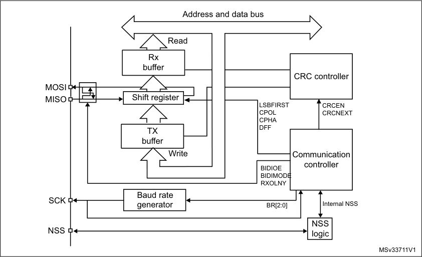

|Col1|Col2|CRC controller|
|---|---|---|
||||

Four I/O pins are dedicated to SPI communication with external devices.

      - **MISO:** Master In / Slave Out data. In the general case, this pin is used to transmit data
in slave mode and receive data in master mode.

      - **MOSI:** Master Out / Slave In data. In the general case, this pin is used to transmit data
in master mode and receive data in slave mode.

      - **SCK:** Serial Clock output pin for SPI masters and input pin for SPI slaves.

      - **NSS:** Slave select pin. Depending on the SPI and NSS settings, this pin can be used to
either:

– select an individual slave device for communication

–
synchronize the data frame or

–
detect a conflict between multiple masters

See _Section 26.3.5: Slave select (NSS) pin management_ for details.

The SPI bus allows the communication between one master device and one or more slave
devices. The bus consists of at least two wires - one for the clock signal and the other for
synchronous data transfer. Other signals can be added depending on the data exchange
between SPI nodes and their slave select signal management.

770/905 RM0377 Rev 10

--- end of page=769 ---

**RM0377** **Serial peripheral interface/ inter-IC sound (SPI/I2S)**

**26.3.2** **Communications between one master and one slave**

The SPI allows the MCU to communicate using different configurations, depending on the
device targeted and the application requirements. These configurations use 2 or 3 wires
(with software NSS management) or 3 or 4 wires (with hardware NSS management).
Communication is always initiated by the master.

**Full-duplex communication**

By default, the SPI is configured for full-duplex communication. In this configuration, the
shift registers of the master and slave are linked using two unidirectional lines between the
MOSI and the MISO pins. During SPI communication, data is shifted synchronously on the
SCK clock edges provided by the master. The master transmits the data to be sent to the
slave via the MOSI line and receives data from the slave via the MISO line. When the data
frame transfer is complete (all the bits are shifted) the information between the master and
slave is exchanged.

**Figure 251. Full-duplex single master/ single slave application**

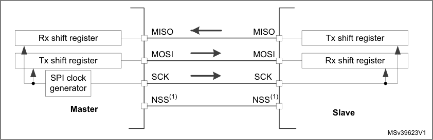

|Col1|Tx shift register|Col3|
|---|---|---|
|||SPI clock generator|

1. The NSS pins can be used to provide a hardware control flow between master and slave. Optionally, the
pins can be left unused by the peripheral. Then the flow has to be handled internally for both master and
slave. For more details see _Section 26.3.5: Slave select (NSS) pin management_ .

**Half-duplex communication**

The SPI can communicate in half-duplex mode by setting the BIDIMODE bit in the
SPIx_CR1 register. In this configuration, one single cross connection line is used to link the
shift registers of the master and slave together. During this communication, the data is
synchronously shifted between the shift registers on the SCK clock edge in the transfer
direction selected reciprocally by both master and slave with the BDIOE bit in their
SPIx_CR1 registers. In this configuration, the master’s MISO pin and the slave’s MOSI pin
are free for other application uses and act as GPIOs.

RM0377 Rev 10 771/905

817

--- end of page=770 ---

**Serial peripheral interface/ inter-IC sound (SPI/I2S)** **RM0377**

**Figure 252. Half-duplex single master/ single slave application**

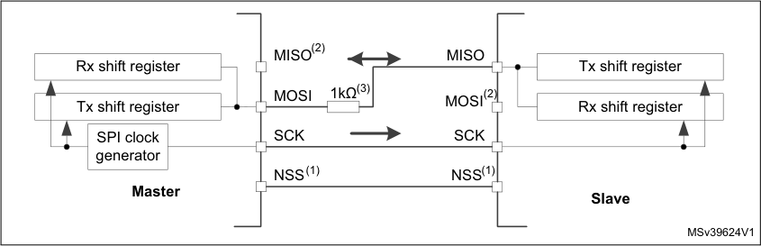

|Col1|Tx shift register|Col3|
|---|---|---|
|||SPI clock generator|

1. The NSS pins can be used to provide a hardware control flow between master and slave. Optionally, the
pins can be left unused by the peripheral. Then the flow has to be handled internally for both master and
slave. For more details see _Section 26.3.5: Slave select (NSS) pin management_ .

2. In this configuration, the master’s MISO pin and the slave’s MOSI pin can be used as GPIOs.

3. A critical situation can happen when communication direction is changed not synchronously between two
nodes working at bidirectionnal mode and new transmitter accesses the common data line while former
transmitter still keeps an opposite value on the line (the value depends on SPI configuration and
communication data). Both nodes then fight while providing opposite output levels on the common line
temporary till next node changes its direction settings correspondingly, too. It is suggested to insert a serial
resistance between MISO and MOSI pins at this mode to protect the outputs and limit the current blowing
between them at this situation.

**Simplex communications**

The SPI can communicate in simplex mode by setting the SPI in transmit-only or in receiveonly using the RXONLY bit in the SPIx_CR2 register. In this configuration, only one line is
used for the transfer between the shift registers of the master and slave. The remaining
MISO and MOSI pins pair is not used for communication and can be used as standard
GPIOs.

      - **Transmit-only mode (RXONLY=0):** The configuration settings are the same as for fullduplex. The application has to ignore the information captured on the unused input pin.
This pin can be used as a standard GPIO.

      - **Receive-only mode (RXONLY=1)** : The application can disable the SPI output function
by setting the RXONLY bit. In slave configuration, the MISO output is disabled and the
pin can be used as a GPIO. The slave continues to receive data from the MOSI pin
while its slave select signal is active (see _26.3.5: Slave select (NSS) pin management_ ).
Received data events appear depending on the data buffer configuration. In the master
configuration, the MOSI output is disabled and the pin can be used as a GPIO. The
clock signal is generated continuously as long as the SPI is enabled. The only way to
stop the clock is to clear the RXONLY bit or the SPE bit and wait until the incoming
pattern from the MISO pin is finished and fills the data buffer structure, depending on its
configuration.

772/905 RM0377 Rev 10

--- end of page=771 ---

**RM0377** **Serial peripheral interface/ inter-IC sound (SPI/I2S)**

**Figure 253. Simplex single master/single slave application (master in transmit-only/**
**slave in receive-only mode)**

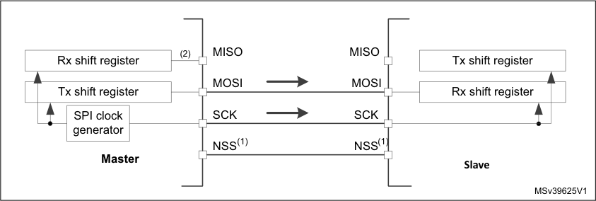

|Col1|Tx shift register|Col3|
|---|---|---|
|||SPI clock generator|

1. The NSS pins can be used to provide a hardware control flow between master and slave. Optionally, the
pins can be left unused by the peripheral. Then the flow has to be handled internally for both master and
slave. For more details see _Section 26.3.5: Slave select (NSS) pin management_ .

2. An accidental input information is captured at the input of transmitter Rx shift register. All the events
associated with the transmitter receive flow must be ignored in standard transmit only mode (e.g. OVF
flag).

3. In this configuration, both the MISO pins can be used as GPIOs.

_Note:_ _Any simplex communication can be alternatively replaced by a variant of the half-duplex_
_communication with a constant setting of the transaction direction (bidirectional mode is_
_enabled while BDIO bit is not changed)._

RM0377 Rev 10 773/905

817

--- end of page=772 ---

**Serial peripheral interface/ inter-IC sound (SPI/I2S)** **RM0377**

**26.3.3** **Standard multi-slave communication**

In a configuration with two or more independent slaves, the master uses GPIO pins to
manage the chip select lines for each slave (see _Figure 254._ ). The master must select one
of the slaves individually by pulling low the GPIO connected to the slave NSS input. When
this is done, a standard master and dedicated slave communication is established.

**Figure 254. Master and three independent slaves**

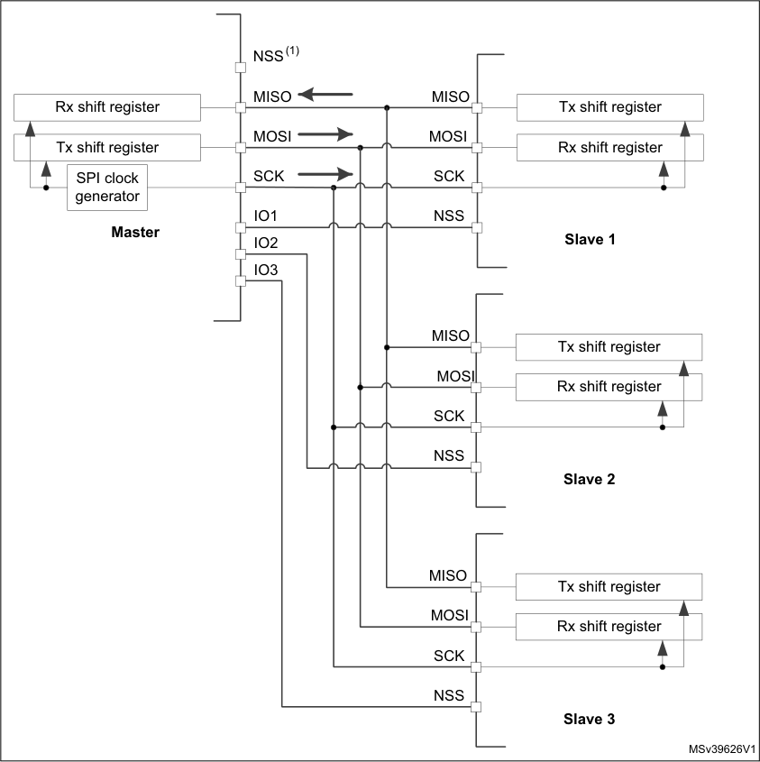

|Rx shift register|Col2|Col3|
|---|---|---|
|Rx shift register|||

|Col1|Tx shift register|Col3|Col4|
|---|---|---|---|
||||SPI clock generator|

|Rx shift register|Col2|Col3|
|---|---|---|
|Rx shift register|||

|MISO|Col2|Col3|MISO|
|---|---|---|---|
|MOSI|MOSI|MOSI|MOSI|
|MOSI|MOSI||SCK|
|MOSI|||NSS|
|MOSI||||
|MOSI|||MOSI|
|MOSI|||SCK|
|MOSI|||NSS|

|Rx shift register|Col2|Col3|
|---|---|---|
|Rx shift register|||

1. NSS pin is not used on master side at this configuration. It has to be managed internally (SSM=1, SSI=1) to
prevent any MODF error.

2. As MISO pins of the slaves are connected together, all slaves must have the GPIO configuration of their
MISO pin set as alternate function open-drain (see _Section 8.3.7: I/O alternate function input/output on_
_page 221_ ).

774/905 RM0377 Rev 10

--- end of page=773 ---

**RM0377** **Serial peripheral interface/ inter-IC sound (SPI/I2S)**

**26.3.4** **Multi-master communication**

Unless SPI bus is not designed for a multi-master capability primarily, the user can use build
in feature which detects a potential conflict between two nodes trying to master the bus at
the same time. For this detection, NSS pin is used configured at hardware input mode.

The connection of more than two SPI nodes working at this mode is impossible as only one
node can apply its output on a common data line at time.

When nodes are non active, both stay at slave mode by default. Once one node wants to
overtake control on the bus, it switches itself into master mode and applies active level on
the slave select input of the other node via dedicated GPIO pin. After the session is
completed, the active slave select signal is released and the node mastering the bus
temporary returns back to passive slave mode waiting for next session start.

If potentially both nodes raised their mastering request at the same time a bus conflict event
appears (see mode fault MODF event). Then the user can apply some simple arbitration
process (e.g. to postpone next attempt by predefined different time-outs applied at both
nodes).

**Figure 255. Multi-master application**

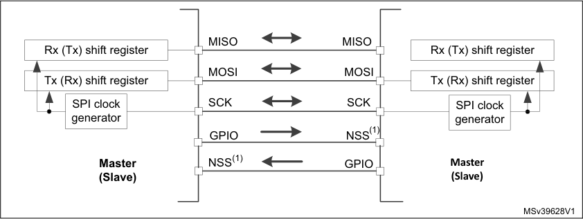

|Col1|Tx (Rx) shift register|Col3|
|---|---|---|
|||SPI clock generator|

|Tx (Rx) shift register|Col2|Col3|Col4|
|---|---|---|---|
|Tx (Rx) shift register|SPI clock generator|||

1. The NSS pin is configured at hardware input mode at both nodes. Its active level enables the MISO line
output control as the passive node is configured as a slave.

**26.3.5** **Slave select (NSS) pin management**

In slave mode, the NSS works as a standard “chip select” input and lets the slave
communicate with the master. In master mode, NSS can be used either as output or input.
As an input it can prevent multimaster bus collision, and as an output it can drive a slave
select signal of a single slave.

Hardware or software slave select management can be set using the SSM bit in the
SPIx_CR1 register:

      - **Software NSS management (SSM = 1)** : in this configuration, slave select information
is driven internally by the SSI bit value in register SPIx_CR1. The external NSS pin is
free for other application uses.

      - **Hardware NSS management (SSM = 0)** : in this case, there are two possible
configurations. The configuration used depends on the NSS output configuration
(SSOE bit in register SPIx_CR1).

RM0377 Rev 10 775/905

817

--- end of page=774 ---

**Serial peripheral interface/ inter-IC sound (SPI/I2S)** **RM0377**

–
**NSS output enable (SSM=0,SSOE = 1)** : this configuration is only used when the
MCU is set as master. The NSS pin is managed by the hardware. The NSS signal
is driven low as soon as the SPI is enabled in master mode (SPE=1), and is kept
low until the SPI is disabled (SPE =0).

–
**NSS output disable (SSM=0, SSOE = 0)** : if the microcontroller is acting as the
master on the bus, this configuration allows multimaster capability. If the NSS pin
is pulled low in this mode, the SPI enters master mode fault state and the device is
automatically reconfigured in slave mode. In slave mode, the NSS pin works as a
standard “chip select” input and the slave is selected while NSS line is at low level.

**Figure 256. Hardware/software slave select management**

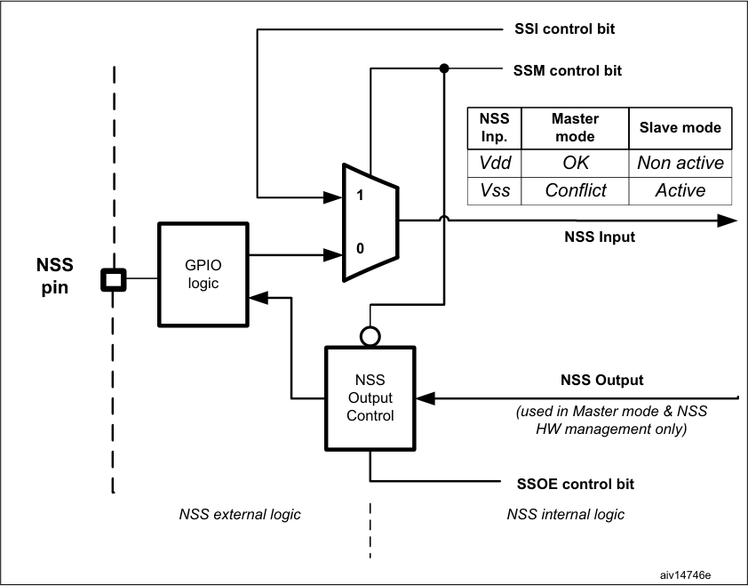

|NSS Inp.|Master mode|Slave mode|
|---|---|---|
|_Vdd_|_OK_|_Non active_|
|_Vss_|_Conflict_|_Active_|

776/905 RM0377 Rev 10

--- end of page=775 ---

**RM0377** **Serial peripheral interface/ inter-IC sound (SPI/I2S)**

**26.3.6** **Communication formats**

During SPI communication, receive and transmit operations are performed simultaneously.
The serial clock (SCK) synchronizes the shifting and sampling of the information on the data
lines. The communication format depends on the clock phase, the clock polarity and the
data frame format. To be able to communicate together, the master and slaves devices must
follow the same communication format.

**Clock phase and polarity controls**

Four possible timing relationships may be chosen by software, using the CPOL and CPHA
bits in the SPIx_CR1 register. The CPOL (clock polarity) bit controls the idle state value of
the clock when no data is being transferred. This bit affects both master and slave modes. If
CPOL is reset, the SCK pin has a low-level idle state. If CPOL is set, the SCK pin has a
high-level idle state.

If the CPHA bit is set, the second edge on the SCK pin captures the first data bit transacted
(falling edge if the CPOL bit is reset, rising edge if the CPOL bit is set). Data are latched on
each occurrence of this clock transition type. If the CPHA bit is reset, the first edge on the
SCK pin captures the first data bit transacted (falling edge if the CPOL bit is set, rising edge
if the CPOL bit is reset). Data are latched on each occurrence of this clock transition type.

The combination of CPOL (clock polarity) and CPHA (clock phase) bits selects the data
capture clock edge.

_Figure 257_, shows an SPI full-duplex transfer with the four combinations of the CPHA and
CPOL bits.

_Note:_ _Prior to changing the CPOL/CPHA bits the SPI must be disabled by resetting the SPE bit._

_The idle state of SCK must correspond to the polarity selected in the SPIx_CR1 register (by_
_pulling up SCK if CPOL=1 or pulling down SCK if CPOL=0)._

RM0377 Rev 10 777/905

817

--- end of page=776 ---

**Serial peripheral interface/ inter-IC sound (SPI/I2S)** **RM0377**

**Figure 257. Data clock timing diagram**

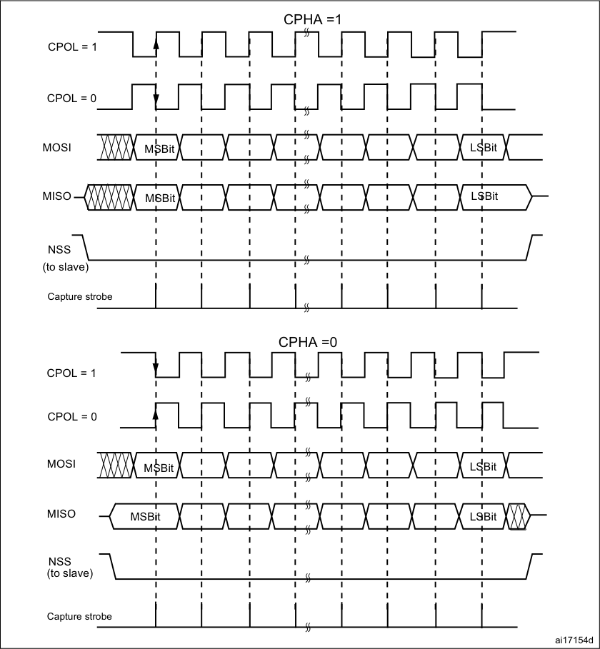

_Note:_ _The order of data bits depends on LSBFIRST bit setting._

**Data frame format**

The SPI shift register can be set up to shift out MSB-first or LSB-first, depending on the
value of the LSBFIRST bit. Each data frame is 8 or 16 bit long depending on the size of the
data programmed using the DFF bit in the SPI_CR1 register. The selected data frame
format is applicable both for transmission and reception.

778/905 RM0377 Rev 10

--- end of page=777 ---

**RM0377** **Serial peripheral interface/ inter-IC sound (SPI/I2S)**

**26.3.7** **SPI configuration**

The configuration procedure is almost the same for master and slave. For specific mode
setups, follow the dedicated chapters. When a standard communication is to be initialized,
perform these steps:

1. Write proper GPIO registers: Configure GPIO for MOSI, MISO and SCK pins.

2. Write to the SPI_CR1 register:

a) Configure the serial clock baud rate using the BR[2:0] bits ( _Note:_ 3).

b) Configure the CPOL and CPHA bits combination to define one of the four
relationships between the data transfer and the serial clock. ( _Note:_ 2 - except the
case when CRC is enabled at TI mode).

c) Select simplex or half-duplex mode by configuring RXONLY or BIDIMODE and
BIDIOE (RXONLY and BIDIMODE can't be set at the same time).

d) Configure the LSBFIRST bit to define the frame format ( _Note:_ 2).

e) Configure the CRCEN and CRCEN bits if CRC is needed (while SCK clock signal
is at idle state).

f) Configure SSM and SSI ( _Note:_ 2).

g) Configure the MSTR bit (in multimaster NSS configuration, avoid conflict state on
NSS if master is configured to prevent MODF error).

h) Set the DFF bit to configure the data frame format (8 or 16 bits).

3. Write to SPI_CR2 register:

a) Configure SSOE ( _Note:_ 1 & 2).

b) Set the FRF bit if the TI protocol is required.

4. Write to SPI_CRCPR register: Configure the CRC polynomial if needed.

5. Write proper DMA registers: Configure DMA streams dedicated for SPI Tx and Rx in
DMA registers if the DMA streams are used.

_Note:_ _(1) Step is not required in slave mode._

_(2) Step is not required in TI mode._

_(3) The step is not required in slave mode except slave working at TI mode._

For code example, refer to _A.17.1: SPI master configuration code example_ and _A.17.2: SPI_
_slave configuration code example_ .

**26.3.8** **Procedure for enabling SPI**

It is recommended to enable the SPI slave before the master sends the clock. Otherwise,
undesired data transmission might occur. The slave data register must already contain data
to be sent before starting communication with the master (either on the first edge of the
communication clock, or before the end of the ongoing communication if the clock signal is
continuous). The SCK signal must be settled at an idle state level corresponding to the
selected polarity before the SPI slave is enabled.

At full-duplex (or in any transmit-only mode), the master starts communicating when the SPI
is enabled and data to be sent is written in the Tx Buffer.

In any master receive-only mode (RXONLY=1 or BIDIMODE=1 & BIDIOE=0), the master
starts communicating and the clock starts running immediately after the SPI is enabled.

The slave starts communicating when it receives a correct clock signal from the master. The
slave software must write the data to be sent before the SPI master initiates the transfer.

RM0377 Rev 10 779/905

817

--- end of page=778 ---

**Serial peripheral interface/ inter-IC sound (SPI/I2S)** **RM0377**

Refer to _Section 26.3.11: Communication using DMA (direct memory addressing)_ for details
on how to handle DMA.

**26.3.9** **Data transmission and reception procedures**

**Rx and Tx buffers**

In reception, data are received and then stored into an internal Rx buffer while in
transmission, data are first stored into an internal Tx buffer before being transmitted. A read
access to the SPI_DR register returns the Rx buffered value whereas a write access to the
SPI_DR stores the written data into the Tx buffer.

**Tx buffer handling**

The data frame is loaded from the Tx buffer into the shift register during the first bit
transmission. Bits are then shifted out serially from the shift register to a dedicated output
pin depending on LSBFIRST bit setting.The TXE flag (Tx buffer empty) is set when the data
are transferred from the Tx buffer to the shift register. It indicates that the internal Tx buffer is
ready to be loaded with the next data. An interrupt can be generated if the TXEIE bit of the
SPI_CR2 register is set. Clearing the TXE bit is performed by writing to the SPI_DR register.

A continuous transmit stream can be achieved if the next data to be transmitted are stored
in the Tx buffer while previous frame transmission is still ongoing. When the software writes
to Tx buffer while the TXE flag is not set, the data waiting for transaction is overwritten.

**Rx buffer handling**

The RXNE flag (Rx buffer not empty) is set on the last sampling clock edge, when the data
are transferred from the shift register to the Rx buffer. It indicates that data are ready to be
read from the SPI_DR register. An interrupt can be generated if the RXNEIE bit in the
SPI_CR2 register is set. Clearing the RXNE bit is performed by reading the SPI_DR
register.

If a device has not cleared the RXNE bit resulting from the previous data byte transmitted,
an overrun condition occurs when the next value is buffered. The OVR bit is set and an
interrupt is generated if the ERRIE bit is set.

Another way to manage the data exchange is to use DMA (see _Section 10.2: DMA main_
_features_ ).

**Sequence handling**

The BSY bit is set when a current data frame transaction is ongoing. When the clock signal
runs continuously, the BSY flag remains set between data frames on the master side.
However, on the slave side, it becomes low for a minimum duration of one SPI clock cycle
between each data frame transfer.

For some configurations, the BSY flag can be used during the last data transfer to wait until
the completion of the transfer.

When a receive-only mode is configured on the master side, either in half-duplex
(BIDIMODE=1, BIDIOE=0) or simplex configuration (BIDIMODE=0, RXONLY=1), the
master starts the receive sequence as soon as the SPI is enabled. Then the clock signal is
provided by the master and it does not stop until either the SPI or the receive-only mode is
disabled by the master. The master receives data frames continuously up to this moment.

780/905 RM0377 Rev 10

--- end of page=779 ---

**RM0377** **Serial peripheral interface/ inter-IC sound (SPI/I2S)**

While the master can provide all the transactions in continuous mode (SCK signal is
continuous), it has to respect slave capability to handle data flow and its content at anytime.
When necessary, the master must slow down the communication and provide either a
slower clock or separate frames or data sessions with sufficient delays. Be aware there is no
underflow error signal for slave operating in SPI mode, and that data from the slave are
always transacted and processed by the master even if the slave cannot not prepare them
correctly in time. It is preferable for the slave to use DMA, especially when data frames are
shorter and bus rate is high.

Each sequence must be encased by the NSS pulse in parallel with the multislave system to
select just one of the slaves for communication. In single slave systems, using NSS to
control the slave is not necessary. However, the NSS pulse can be used to synchronize the
slave with the beginning of each data transfer sequence. NSS can be managed either by
software or by hardware (see _Section 26.3.4: Multi-master communication_ ).

Refer to _Figure 258_ and _Figure 259_ for a description of continuous transfers in master / fullduplex and slave full-duplex mode.

**Figure 258. TXE/RXNE/BSY behavior in master / full-duplex mode (BIDIMODE=0,**
**RXONLY=0) in the case of continuous transfers**

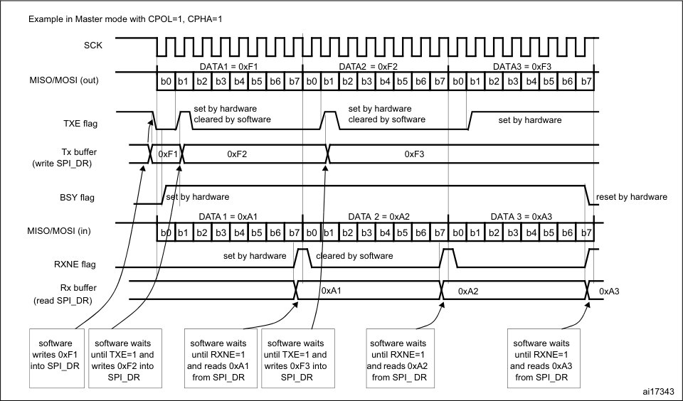

|b0|Col2|b1|b2|b3|b4|b5|b6|b7|Col10|b0|b1|b2|b3|b4|b5|b6|b7|Col19|b0|b1|b2|b3|b4|b5|b6|b7|Col28|
|---|---|---|---|---|---|---|---|---|---|---|---|---|---|---|---|---|---|---|---|---|---|---|---|---|---|---|---|
|b0|b0|set by hardware cleared by software|set by hardware cleared by software|set by hardware cleared by software|set by hardware cleared by software|set by hardware cleared by software|set by hardware cleared by software|set by hardware cleared by software|set by hardware cleared by software||set by hardware cleared by software|set by hardware cleared by software|set by hardware cleared by software|set by hardware cleared by software|set by hardware cleared by software|set by hardware cleared by software|set by hardware cleared by software|set by hardware cleared by software||||||||||
|b0||||||||||||||||||||||||||||
|0|xF1|0xF2 |0xF2 |0xF2 |0xF2 |0xF2 |0xF2 |0xF2 |0xF2 |0xF3|0xF3|0xF3|0xF3|0xF3|0xF3|0xF3|0xF3|0xF3||||||||||
||||||||||||||||||||DATA 3 = 0xA3|DATA 3 = 0xA3|DATA 3 = 0xA3|DATA 3 = 0xA3|DATA 3 = 0xA3|DATA 3 = 0xA3|DATA 3 = 0xA3|DATA 3 = 0xA3|DATA 3 = 0xA3|
||||||||||||DATA 2 = 0xA2|DATA 2 = 0xA2|DATA 2 = 0xA2|DATA 2 = 0xA2|DATA 2 = 0xA2|DATA 2 = 0xA2|DATA 2 = 0xA2|DATA 2 = 0xA2|DATA 3 = 0xA3|DATA 3 = 0xA3|DATA 3 = 0xA3|DATA 3 = 0xA3|DATA 3 = 0xA3|DATA 3 = 0xA3|DATA 3 = 0xA3|DATA 3 = 0xA3|DATA 3 = 0xA3|
||||||||||||DATA 2 = 0xA2|DATA 2 = 0xA2|DATA 2 = 0xA2|DATA 2 = 0xA2|DATA 2 = 0xA2|DATA 2 = 0xA2|DATA 2 = 0xA2|DATA 2 = 0xA2|DATA 3 = 0xA3|DATA 3 = 0xA3|DATA 3 = 0xA3|DATA 3 = 0xA3|DATA 3 = 0xA3|DATA 3 = 0xA3|DATA 3 = 0xA3|DATA 3 = 0xA3||
|set by hardware b0 b1 b2 b3 b4 b5 b6 b7|set by hardware b0 b1 b2 b3 b4 b5 b6 b7|b1|b2|b3|b4|b5|b6|b7|b7|b0|b1|b2|b3|b4|b5|b6|b7|b7|b0|b1|b2|b3|b4|b5|b6|b|7|
|set by hardware b0 b1 b2 b3 b4 b5 b6 b7|set by hardware b0 b1 b2 b3 b4 b5 b6 b7|b1|b2|b3|b4|b5|b6|b7||cleared by software|cleared by software|cleared by software|cleared by software|cleared by software|cleared by software|cleared by software|cleared by software|||||||||||
|set by hardware b0 b1 b2 b3 b4 b5 b6 b7|set by hardware b0 b1 b2 b3 b4 b5 b6 b7|b1|b2|b3|b4|b5|b6|b7||cleared by software|cleared by software|cleared by software|cleared by software|cleared by software|cleared by software|cleared by software|cleared by software|||||||||||
|||||||||||||||||||||||||||||

For code example, refer to _A.17.3: SPI full duplex communication code example_ .

RM0377 Rev 10 781/905

817

--- end of page=780 ---

**Serial peripheral interface/ inter-IC sound (SPI/I2S)** **RM0377**

**Figure 259. TXE/RXNE/BSY behavior in slave / full-duplex mode (BIDIMODE=0,**
**RXONLY=0) in the case of continuous transfers**

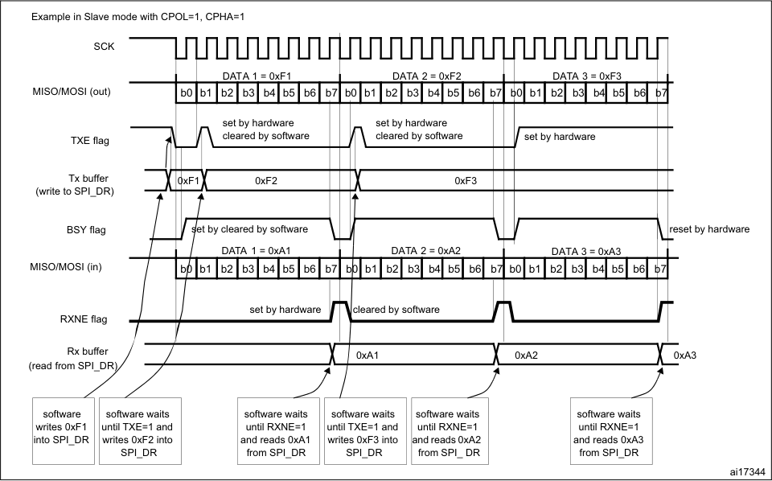

|Col1|Col2|Col3|Col4|Col5|Col6|Col7|Col8|Col9|Col10|Col11|Col12|Col13|Col14|Col15|Col16|Col17|Col18|Col19|Col20|Col21|Col22|Col23|Col24|Col25|Col26|Col27|Col28|Col29|
|---|---|---|---|---|---|---|---|---|---|---|---|---|---|---|---|---|---|---|---|---|---|---|---|---|---|---|---|---|
||||||||||||||||||||||||||||||
|b0|b0|b1|b2|b3|b4|b5|b6|b7|b0|b0|b1|b2|b3|b4|b5|b6|b7|b7||b0|b1|b2|b3|b4|b5|b6||b7|
|b0|b0|set by hardware cleared by software|set by hardware cleared by software|set by hardware cleared by software|set by hardware cleared by software|set by hardware cleared by software|set by hardware cleared by software|||set by hardware cleared by software|set by hardware cleared by software|set by hardware cleared by software|set by hardware cleared by software|set by hardware cleared by software|set by hardware cleared by software|set by hardware cleared by software|set by hardware cleared by software|||set by hardware|set by hardware|set by hardware|set by hardware|set by hardware|set by hardware|set by hardware|set by hardware||
|b0|b0|set by hardware cleared by software|set by hardware cleared by software|set by hardware cleared by software|set by hardware cleared by software|set by hardware cleared by software|set by hardware cleared by software|||set by hardware cleared by software|set by hardware cleared by software|set by hardware cleared by software|set by hardware cleared by software|set by hardware cleared by software|set by hardware cleared by software|set by hardware cleared by software|set by hardware cleared by software|||set by hardware|set by hardware|set by hardware|set by hardware|set by hardware|set by hardware|set by hardware|set by hardware||
|b0|||||||||||||||||||||||||||||
|0|xF1 0xF2|xF1 0xF2|xF1 0xF2|xF1 0xF2|xF1 0xF2|xF1 0xF2|xF1 0xF2|||0xF3|0xF3|0xF3|0xF3|0xF3|0xF3|0xF3|0xF3||||||||||||
||||||||||||||||||||||||||||||
||||||||||||||||||||||||||||||
|set by hardware b0 b1 b2 b3 b4 b5 b6|set by hardware b0 b1 b2 b3 b4 b5 b6|b1|b2|b3|b4|b5|b6|b7|b|0|b1|b2|b3|b4|b5|b6|b7|b7|b0|b0|b1|b2|b3|b4|b5|b6||b7|
|set by hardware b0 b1 b2 b3 b4 b5 b6|set by hardware b0 b1 b2 b3 b4 b5 b6|b1|b2|b3|b4|b5|b6|b7|cleared by software|cleared by software|cleared by software|cleared by software|cleared by software|cleared by software|cleared by software|cleared by software|cleared by software||||||||||||

**26.3.10** **Procedure for disabling the SPI**

When SPI is disabled, it is mandatory to follow the disable procedures described in this
paragraph. It is important to do this before the system enters a low-power mode when the
peripheral clock is stopped. Ongoing transactions can be corrupted in this case. In some
modes the disable procedure is the only way to stop continuous communication running.

Master in full-duplex or transmit only mode can finish any transaction when it stops
providing data for transmission. In this case, the clock stops after the last data transaction.

Standard disable procedure is based on pulling BSY status together with TXE flag to check
if a transmission session is fully completed. This check can be done in specific cases, too,
when it is necessary to identify the end of ongoing transactions, for example:

      - When NSS signal is managed by an arbitrary GPIO toggle and the master has to
provide proper end of NSS pulse for slave, or

      - When transactions’ streams from DMA are completed while the last data frame or CRC
frame transaction is still ongoing in the peripheral bus.

The correct disable procedure is (except when receive-only mode is used):

1. Wait until RXNE=1 to receive the last data.

2. Wait until TXE=1 and then wait until BSY=0 before disabling the SPI.

3. Read received data.

782/905 RM0377 Rev 10

--- end of page=781 ---

**RM0377** **Serial peripheral interface/ inter-IC sound (SPI/I2S)**

_Note:_ _During discontinuous communications, there is a 2 APB clock period delay between the_
_write operation to the SPI_DR register and BSY bit setting. As a consequence it is_
_mandatory to wait first until TXE is set and then until BSY is cleared after writing the last_
_data._

The correct disable procedure for certain receive-only modes is:

1. Interrupt the receive flow by disabling SPI (SPE=0) in the specific time window while
the last data frame is ongoing.

2. Wait until BSY=0 (the last data frame is processed).

3. Read received data.

_Note:_ _To stop a continuous receive sequence, a specific time window must be respected during_
_the reception of the last data frame. It starts when the first bit is sampled and ends before_
_the last bit transfer starts._

**26.3.11** **Communication using DMA (direct memory addressing)**

To operate at its maximum speed and to facilitate the data register read/write process
required to avoid overrun, the SPI features a DMA capability, which implements a simple
request/acknowledge protocol.

A DMA access is requested when the TXE or RXNE enable bit in the SPIx_CR2 register is
set. Separate requests must be issued to the Tx and Rx buffers.

      - In transmission, a DMA request is issued each time TXE is set to 1. The DMA then
writes to the SPIx_DR register.

      - In reception, a DMA request is issued each time RXNE is set to 1. The DMA then reads
the SPIx_DR register.

Refer to _Figure 260_ and _Figure 261_ for a description of the DMA transmission and reception
waveforms.

When the SPI is used only to transmit data, it is possible to enable only the SPI Tx DMA
channel. In this case, the OVR flag is set because the data received is not read. When the
SPI is used only to receive data, it is possible to enable only the SPI Rx DMA channel.

In transmission mode, when the DMA has written all the data to be transmitted (the TCIF
flag is set in the DMA_ISR register), the BSY flag can be monitored to ensure that the SPI
communication is complete. This is required to avoid corrupting the last transmission before
disabling the SPI or entering the Stop mode. The software must first wait until TXE = 1 and
then until BSY = 0.

When starting communication using DMA, to prevent DMA channel management raising
error events, these steps must be followed in order:

1. Enable DMA Rx buffer in the RXDMAEN bit in the SPI_CR2 register, if DMA Rx is
used.

2. Enable DMA streams for Tx and Rx in DMA registers, if the streams are used.

3. Enable DMA Tx buffer in the TXDMAEN bit in the SPI_CR2 register, if DMA Tx is used.

4. Enable the SPI by setting the SPE bit.

For code example, refer to _A.17.4: SPI master configuration with DMA code example_ and
_A.17.5: SPI slave configuration with DMA code example_ .

RM0377 Rev 10 783/905

817

--- end of page=782 ---

**Serial peripheral interface/ inter-IC sound (SPI/I2S)** **RM0377**

To close communication it is mandatory to follow these steps in order:

1. Disable DMA streams for Tx and Rx in the DMA registers, if the streams are used.

2. Disable the SPI by following the SPI disable procedure.

3. Disable DMA Tx and Rx buffers by clearing the TXDMAEN and RXDMAEN bits in the
SPI_CR2 register, if DMA Tx and/or DMA Rx are used.

**Figure 260. Transmission using DMA**

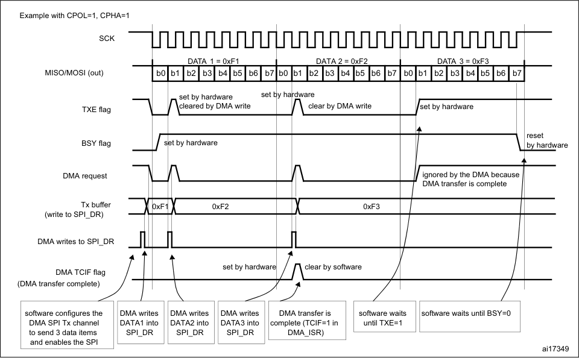

|Col1|Col2|b0|b1|b2|b3|b4|b5|b6|b7|b0|b1|b2|b3|b4|b5|b6|b7|b0|b1|b2|b3|b4|b5|b6|b7|
|---|---|---|---|---|---|---|---|---|---|---|---|---|---|---|---|---|---|---|---|---|---|---|---|---|---|
||||set b set by hardware cleared by DMA write|set b set by hardware cleared by DMA write|set b set by hardware cleared by DMA write|set b set by hardware cleared by DMA write|set b set by hardware cleared by DMA write|set b set by hardware cleared by DMA write|set b set by hardware cleared by DMA write|y har|dware clear by DMA write|dware clear by DMA write|dware clear by DMA write|dware clear by DMA write|dware clear by DMA write|dware clear by DMA write|dware clear by DMA write|||||||||
||||set b set by hardware cleared by DMA write|set b set by hardware cleared by DMA write|set b set by hardware cleared by DMA write|set b set by hardware cleared by DMA write|set b set by hardware cleared by DMA write|set b set by hardware cleared by DMA write|set b set by hardware cleared by DMA write|y har|dware clear by DMA write|dware clear by DMA write|dware clear by DMA write|dware clear by DMA write|dware clear by DMA write|dware clear by DMA write|dware clear by DMA write||set by hardware|set by hardware|set by hardware|set by hardware|set by hardware|set by hardware|set by hardware|
|||se|se|se|se|se|se|se|se|||||||||||||||||
|||se|t by hardware|t by hardware|t by hardware|t by hardware|t by hardware|t by hardware|t by hardware|||||||||||||||||
||||||||||||||||||||ignored by the DMA because DMA transfer is complete|ignored by the DMA because DMA transfer is complete|ignored by the DMA because DMA transfer is complete|ignored by the DMA because DMA transfer is complete|ignored by the DMA because DMA transfer is complete|ignored by the DMA because DMA transfer is complete|ignored by the DMA because DMA transfer is complete|
|||||||||||||||||||||||||||
|||0xF1|0xF2|0xF2|0xF2|0xF2|0xF2|0xF2|0xF2||0xF3|0xF3|0xF3|0xF3|0xF3|0xF3|0xF3|||||||||
|||||||||||||||||||||||||||
|||||||||||||||||||||||||||
|||set by hardware|set by hardware|set by hardware|set by hardware|set by hardware|set by hardware|set by hardware|set by hardware|set by hardware|set by hardware|set by hardware|set by hardware|set by hardware|set by hardware|set by hardware|set by hardware|||||||||

784/905 RM0377 Rev 10

--- end of page=783 ---

**RM0377** **Serial peripheral interface/ inter-IC sound (SPI/I2S)**

**Figure 261. Reception using DMA**

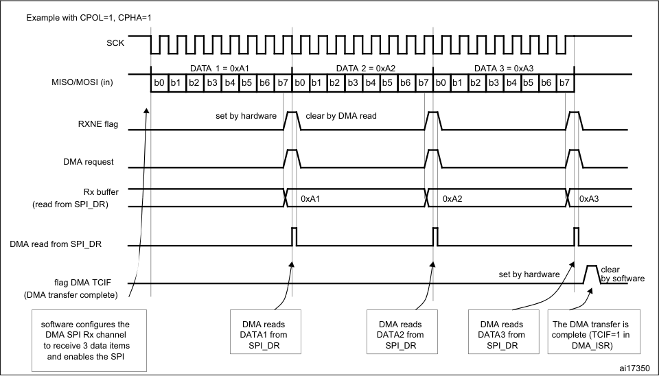

|Col1|b0|b1|b2|b3|b4|b5|b6|b7|Col10|b0|Col12|b1|b2|b3|b4|b5|b6|b7|Col20|b0|Col22|b1|b2|b3|b4|b5|b6|b7|Col30|Col31|
|---|---|---|---|---|---|---|---|---|---|---|---|---|---|---|---|---|---|---|---|---|---|---|---|---|---|---|---|---|---|---|
||set by hardware|set by hardware|set by hardware|set by hardware|set by hardware|set by hardware|set by hardware|set by hardware||clear by DMA read|clear by DMA read|clear by DMA read|clear by DMA read|clear by DMA read|clear by DMA read|clear by DMA read|clear by DMA read|clear by DMA read|||||||||||||
||set by hardware|set by hardware|set by hardware|set by hardware|set by hardware|set by hardware|set by hardware|set by hardware|||||||||||||||||||||||
||||||||||||||||||||||||||||||||
||||||||||||||||||||||||||||||||
||||||||||||||||||||||||||||||||
||||||||||||0xA1|0xA1|0xA1|0xA1|0xA1|0xA1|0xA1|0xA1|0xA1||0xA2|0xA2|0xA2|0xA2|0xA2|0xA2|0xA2|0xA2|0xA2||
||||||||||||||||||||||||||||||||
||||||||||||||||||||||||||||||||
|||||||||||||||||||||set by hardware|set by hardware|set by hardware|set by hardware|set by hardware|set by hardware|set by hardware|set by hardware|set by hardware|set by hardware|set by hardware|

**26.3.12** **SPI status flags**

Three status flags are provided for the application to completely monitor the state of the SPI
bus.

**Tx buffer empty flag (TXE)**

When it is set, the TXE flag indicates that the Tx buffer is empty and that the next data to be
transmitted can be loaded into the buffer. The TXE flag is cleared by writing to the SPI_DR
register.

**Rx buffer not empty (RXNE)**

When set, the RXNE flag indicates that there are valid received data in the Rx buffer. It is
cleared by reading from the SPI_DR register.

**Busy flag (BSY)**

The BSY flag is set and cleared by hardware (writing to this flag has no effect).

When BSY is set, it indicates that a data transfer is in progress on the SPI (the SPI bus is
busy). There is one exception in master bidirectional receive mode (MSTR=1 and BDM=1
and BDOE=0) where the BSY flag is kept low during reception.

The BSY flag can be used in certain modes to detect the end of a transfer, thus preventing
corruption of the last transfer when the SPI peripheral clock is disabled before entering a
low-power mode or an NSS pulse end is handled by software.

The BSY flag is also useful for preventing write collisions in a multimaster system.

RM0377 Rev 10 785/905

817

--- end of page=784 ---

**Serial peripheral interface/ inter-IC sound (SPI/I2S)** **RM0377**

The BSY flag is cleared under any one of the following conditions:

      - When the SPI is correctly disabled

      - When a fault is detected in Master mode (MODF bit set to 1)

      - In Master mode, when it finishes a data transmission and no new data is ready to be
sent

      - In Slave mode, when the BSY flag is set to '0' for at least one SPI clock cycle between
each data transfer.

_Note:_ _It is recommended to use always the TXE and RXNE flags (instead of the BSY flags) to_
_handle data transmission or reception operations._

**26.3.13** **SPI error flags**

An SPI interrupt is generated if one of the following error flags is set and interrupt is enabled
by setting the ERRIE bit.

**Overrun flag (OVR)**

An overrun condition occurs when the master or the slave completes the reception of the
next data frame while the read operation of the previous frame from the Rx buffer has not
completed (case RXNE flag is set).

In this case, the content of the Rx buffer is not updated with the new data received. A read
operation from the SPI_DR register returns the frame previously received. All other
subsequently transmitted data are lost.

Clearing the OVR bit is done by a read access to the SPI_DR register followed by a read
access to the SPI_SR register.

**Mode fault (MODF)**

Mode fault occurs when the master device has its internal NSS signal (NSS pin in NSS
hardware mode, or SSI bit in NSS software mode) pulled low. This automatically sets the
MODF bit. Master mode fault affects the SPI interface in the following ways:

      - The MODF bit is set and an SPI interrupt is generated if the ERRIE bit is set.

      - The SPE bit is cleared. This blocks all output from the device and disables the SPI
interface.

      - The MSTR bit is cleared, thus forcing the device into slave mode.

Use the following software sequence to clear the MODF bit:

1. Make a read or write access to the SPIx_SR register while the MODF bit is set.

2. Then write to the SPIx_CR1 register.

To avoid any multiple slave conflicts in a system comprising several MCUs, the NSS pin
must be pulled high during the MODF bit clearing sequence. The SPE and MSTR bits can
be restored to their original state after this clearing sequence. As a security, hardware does
not allow the SPE and MSTR bits to be set while the MODF bit is set. In a slave device the

MODF bit cannot be set except as the result of a previous multimaster conflict.

786/905 RM0377 Rev 10

--- end of page=785 ---

**RM0377** **Serial peripheral interface/ inter-IC sound (SPI/I2S)**

**CRC error (CRCERR)**

This flag is used to verify the validity of the value received when the CRCEN bit in the
SPIx_CR1 register is set. The CRCERR flag in the SPIx_SR register is set if the value
received in the shift register does not match the receiver SPIx_RXCRC value. The flag is
cleared by the software.

**TI mode frame format error (FRE)**

A TI mode frame format error is detected when an NSS pulse occurs during an ongoing
communication when the SPI is operating in slave mode and configured to conform to the TI
mode protocol. When this error occurs, the FRE flag is set in the SPIx_SR register. The SPI
is not disabled when an error occurs, the NSS pulse is ignored, and the SPI waits for the
next NSS pulse before starting a new transfer. The data may be corrupted since the error
detection may result in the loss of two data bytes.

The FRE flag is cleared when SPIx_SR register is read. If the ERRIE bit is set, an interrupt
is generated on the NSS error detection. In this case, the SPI should be disabled because
data consistency is no longer guaranteed and communications should be re-initiated by the
master when the slave SPI is enabled again.

###### **26.4 SPI special features**

**26.4.1** **TI mode**

**TI protocol in master mode**

The SPI interface is compatible with the TI protocol. The FRF bit of the SPIx_CR2 register
can be used to configure the SPI to be compliant with this protocol.

The clock polarity and phase are forced to conform to the TI protocol requirements whatever
the values set in the SPIx_CR1 register. NSS management is also specific to the TI protocol
which makes the configuration of NSS management through the SPIx_CR1 and SPIx_CR2
registers (SSM, SSI, SSOE) impossible in this case.

In slave mode, the SPI baud rate prescaler is used to control the moment when the MISO
pin state changes to HiZ when the current transaction finishes (see _Figure 262_ ). Any baud
rate can be used, making it possible to determine this moment with optimal flexibility.
However, the baud rate is generally set to the external master clock baud rate. The delay for
the MISO signal to become HiZ (t release ) depends on internal resynchronization and on the
baud rate value set in through the BR[2:0] bits in the SPIx_CR1 register. It is given by the
formula:

t t
-------------------- baud_rate **-** + 4 × t < t < -------------------- baud_rate **-** + 6 × t
2 pclk release 2 pclk

If the slave detects a misplaced NSS pulse during a data frame transaction the TIFRE flag is
set.

This feature is not available for Motorola SPI communications (FRF bit set to 0).

RM0377 Rev 10 787/905

817

--- end of page=786 ---

**Serial peripheral interface/ inter-IC sound (SPI/I2S)** **RM0377**

_Note:_ _To detect TI frame errors in slave transmitter only mode by using the Error interrupt_
_(ERRIE=1), the SPI must be configured in 2-line unidirectional mode by setting BIDIMODE_
_and BIDIOE to 1 in the SPI_CR1 register. When BIDIMODE is set to 0, OVR is set to 1_
_because the data register is never read and error interrupts are always generated, while_
_when BIDIMODE is set to 1, data are not received and OVR is never set._

_Figure 262 shows the SPI communication waveforms when TI mode is selected._

**Figure 262. TI mode transfer**

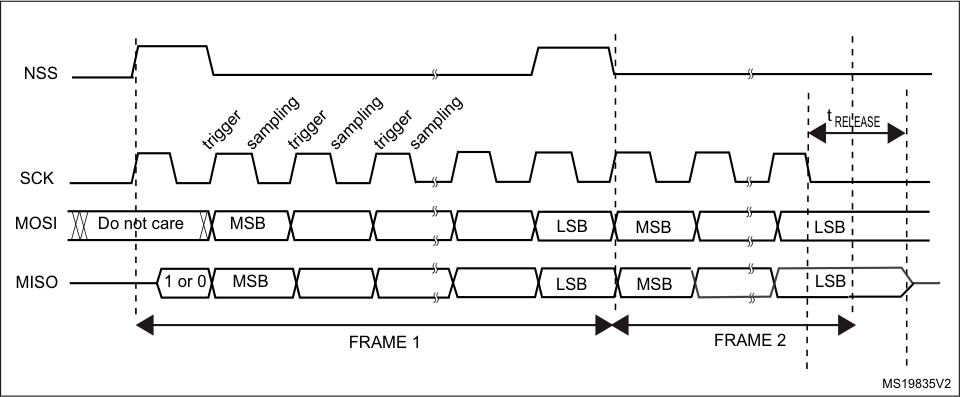

**26.4.2** **CRC calculation**

Two separate CRC calculators (on transmission and reception data flows) are implemented
in order to check the reliability of transmitted and received data. The SPI offers CRC8 or
CRC16 calculation depending on the data format selected through the DFF bit. The CRC is
calculated serially using the polynomial programmed in the SPI_CRCPR register.

**CRC principle**

CRC calculation is enabled by setting the CRCEN bit in the SPIx_CR1 register before the
SPI is enabled (SPE = 1). The CRC value is calculated using an odd programmable
polynomial on each bit. The calculation is processed on the sampling clock edge defined by
the CPHA and CPOL bits in the SPIx_CR1 register. The calculated CRC value is checked
automatically at the end of the data block as well as for transfer managed by CPU or by the
DMA. When a mismatch is detected between the CRC calculated internally on the received
data and the CRC sent by the transmitter, a CRCERR flag is set to indicate a data corruption
error. The right procedure for handling the CRC calculation depends on the SPI
configuration and the chosen transfer management.

_Note:_ _The polynomial value should only be odd. No even values are supported._

**CRC transfer managed by CPU**

Communication starts and continues normally until the last data frame has to be sent or
received in the SPIx_DR register. Then CRCNEXT bit has to be set in the SPIx_CR1
register to indicate that the CRC frame transaction will follow after the transaction of the
currently processed data frame. The CRCNEXT bit must be set before the end of the last
data frame transaction. CRC calculation is frozen during CRC transaction.

788/905 RM0377 Rev 10

--- end of page=787 ---

**RM0377** **Serial peripheral interface/ inter-IC sound (SPI/I2S)**

The received CRC is stored in the Rx buffer like any other data frame.

A CRC-format transaction takes one more data frame to communicate at the end of data

sequence.

When the last CRC data is received, an automatic check is performed comparing the
received value and the value in the SPIx_RXCRC register. Software has to check the
CRCERR flag in the SPIx_SR register to determine if the data transfers were corrupted or
not. Software clears the CRCERR flag by writing '0' to it.

After the CRC reception, the CRC value is stored in the Rx buffer and must be read in the
SPIx_DR register in order to clear the RXNE flag.

**CRC transfer managed by DMA**

When SPI communication is enabled with CRC communication and DMA mode, the
transmission and reception of the CRC at the end of communication is automatic (with the
exception of reading CRC data in receive-only mode). The CRCNEXT bit does not have to
be handled by the software. The counter for the SPI transmission DMA channel has to be
set to the number of data frames to transmit excluding the CRC frame. On the receiver side,
the received CRC value is handled automatically by DMA at the end of the transaction but
user must take care to flush out the CRC frame received from SPI_DR as it is always loaded
into it.

At the end of the data and CRC transfers, the CRCERR flag in the SPIx_SR register is set if
corruption occurred during the transfer.

**Resetting the SPIx_TXCRC and SPIx_RXCRC values**

The SPIx_TXCRC and SPIx_RXCRC values are cleared automatically when CRC
calculation is enabled.

When the SPI is configured in slave mode with the CRC feature enabled, a CRC calculation
is performed even if a high level is applied on the NSS pin. This may happen for example in
case of a multislave environment where the communication master addresses slaves

alternately.

Between a slave disabling (high level on NSS) and a new slave enabling (low level on NSS),
the CRC value should be cleared on both master and slave sides to resynchronize the
master and slave respective CRC calculation.

To clear the CRC, follow the below sequence:

1. Disable the SPI

2. Clear the CRCEN bit

3. Enable the CRCEN bit

4. Enable the SPI

_Note:_ _When the SPI interface is configured as a slave, the NSS internal signal needs to be kept_
_low during transaction of the CRC phase once the CRCNEXT signal is released_, _(see more_
_details at the product errata sheet)._

_At TI mode, despite the fact that the clock phase and clock polarity setting is fixed and_
_independent on the SPIx_CR1 register, the corresponding setting CPOL=0 CPHA=1 has to_
_be kept at the SPIx_CR1 register anyway if CRC is applied. In addition, the CRC calculation_
_has to be reset between sessions by the SPI disable sequence by re-enabling the CRCEN_
_bit described above at both master and slave sides, else the CRC calculation can be_
_corrupted at this specific mode._

RM0377 Rev 10 789/905

817

--- end of page=788 ---

**Serial peripheral interface/ inter-IC sound (SPI/I2S)** **RM0377**

###### **26.5 SPI interrupts**

During SPI communication an interrupts can be generated by the following events:

      - Transmit Tx buffer ready to be loaded

      - Data received in Rx buffer

      - Master mode fault

      - Overrun error

      - TI frame format error

Interrupts can be enabled and disabled separately.

**Table 135. SPI interrupt requests**

|Interrupt event|Event flag|Enable Control bit|
|---|---|---|
|Transmit Tx buffer ready to be loaded|TXE|TXEIE|
|Data received in Rx buffer|RXNE|RXNEIE|
|Master Mode fault event|MODF|ERRIE|
|Overrun error|OVR|OVR|
|CRC error|CRCERR|CRCERR|
|TI frame format error|FRE|FRE|

For code example, refer to _A.17.6: SPI interrupt code example_ .

790/905 RM0377 Rev 10

--- end of page=789 ---

**RM0377** **Serial peripheral interface/ inter-IC sound (SPI/I2S)**

###### **26.6 I [2] S functional description**

**26.6.1** **I** **[2]** **S general description**

The block diagram of the I [2] S is shown in _Figure 263_ .

**Figure 263. I** **[2]** **S block diagram**

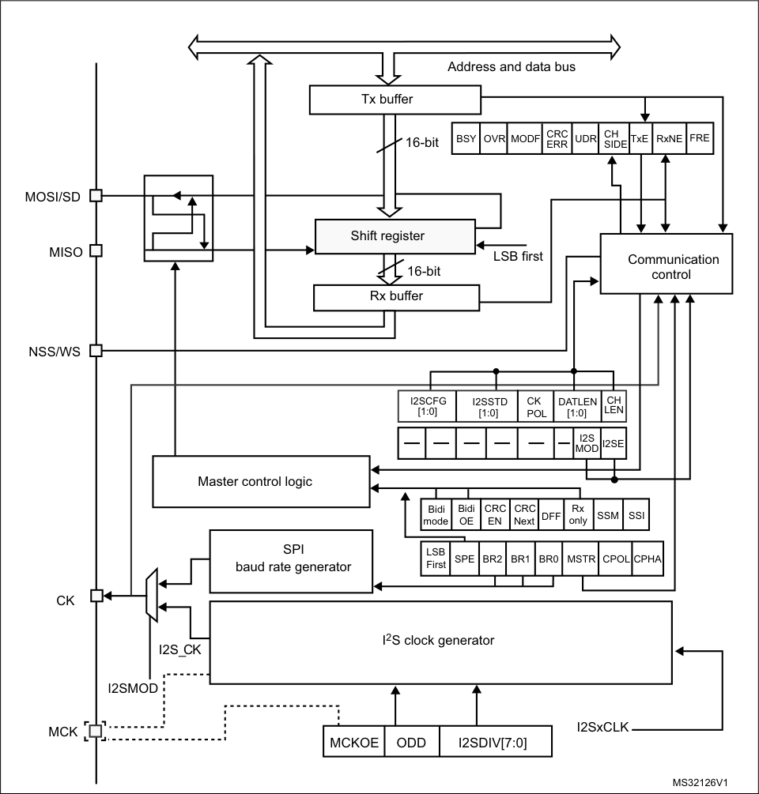

|[1:0|0]|[1|1:0]|POL|[1|1:0]|LEN|
|---|---|---|---|---|---|---|---|
|||||||I2S MOD|I2SE|
|||||||||

|Col1|Col2|Col3|Col4|Col5|Col6|Col7|Col8|Col9|
|---|---|---|---|---|---|---|---|---|
|Bidi ode|Bidi OE|Bidi OE|CRC EN|CRC Next|DFF|Rx only |SSM|SSI|

1. MCK is mapped on the MISO pin.

The SPI can function as an audio I [2] S interface when the I [2] S capability is enabled (by setting
the I2SMOD bit in the SPIx_I2SCFGR register). This interface mainly uses the same pins,
flags and interrupts as the SPI.

RM0377 Rev 10 791/905

817

--- end of page=790 ---

**Serial peripheral interface/ inter-IC sound (SPI/I2S)** **RM0377**

The I [2] S shares three common pins with the SPI:

      - SD: Serial Data (mapped on the MOSI pin) to transmit or receive the two timemultiplexed data channels (in half-duplex mode only).

      - WS: Word Select (mapped on the NSS pin) is the data control signal output in master
mode and input in slave mode.

      - CK: Serial Clock (mapped on the SCK pin) is the serial clock output in master mode
and serial clock input in slave mode.

An additional pin can be used when a master clock output is needed for some external
audio devices:

      - MCK: Master Clock (mapped separately) is used, when the I [2] S is configured in master
mode (and when the MCKOE bit in the SPIx_I2SPR register is set), to output this
additional clock generated at a preconfigured frequency rate equal to 256 × f S, where
f S is the audio sampling frequency.

The I [2] S uses its own clock generator to produce the communication clock when it is set in
master mode. This clock generator is also the source of the master clock output. Two
additional registers are available in I [2] S mode. One is linked to the clock generator
configuration SPIx_I2SPR and the other one is a generic I [2] S configuration register
SPIx_I2SCFGR (audio standard, slave/master mode, data format, packet frame, clock
polarity, etc.).

The SPIx_CR1 register and all CRC registers are not used in the I [2] S mode. Likewise, the
SSOE bit in the SPIx_CR2 register and the MODF and CRCERR bits in the SPIx_SR are
not used.

The I [2] S uses the same SPI register for data transfer (SPIx_DR) in 16-bit wide mode.

**26.6.2** **I2S full-duplex**

_Figure 264_ shows how to perform full-duplex communications using two SPI/I2S instances.
In this case, the WS and CK IOs of both SPI2S must be connected together.

For the master full-duplex mode, one of the SPI2S block must be programmed in master
(I2SCFG = ‘10’ or ‘11’), and the other SPI2S block must be programmed in slave (I2SCFG =
‘00’ or ‘01’). The MCK can be generated or not, depending on the application needs.

For the slave full-duplex mode, both SPI2S blocks must be programmed in slave. One of
them in the slave receiver (I2SCFG = ‘01’), and the other in the slave transmitter (I2SCFG =
‘00’). The master external device then provides the bit clock (CK) and the frame
synchronization (WS).

Note that the full-duplex mode can be used for all the supported standards: I2S Philips, MSB
justified, LSB justified and PCM.

For the full-duplex mode, both SPI2S instances must use the same standard, with the same
parameters: I2SMOD, I2SSTD, CKPOL, PCMSYNC, DATLEN and CHLEN must contain the
same value on both instances.

792/905 RM0377 Rev 10

--- end of page=791 ---

**RM0377** **Serial peripheral interface/ inter-IC sound (SPI/I2S)**

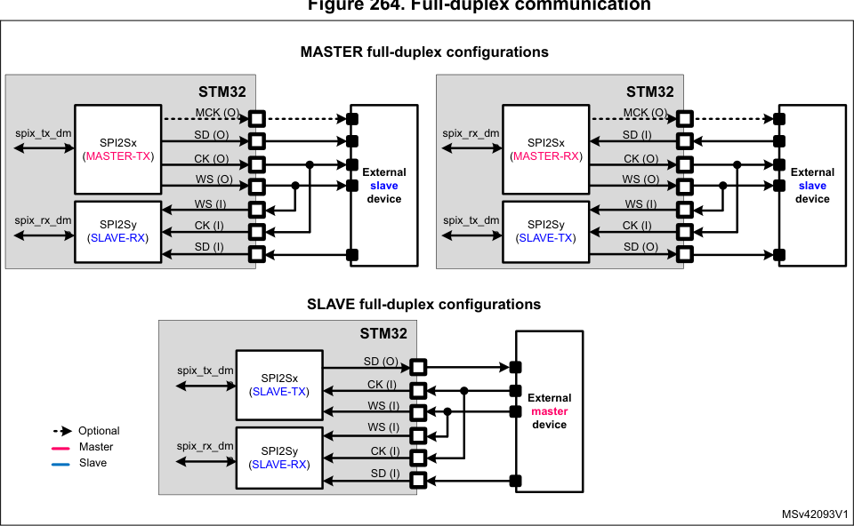

**26.6.3** **Supported audio protocols**

The three-line bus has to handle only audio data generally time-multiplexed on two
channels: the right channel and the left channel. However there is only one 16-bit register
for transmission or reception. So, it is up to the software to write into the data register the
appropriate value corresponding to each channel side, or to read the data from the data
register and to identify the corresponding channel by checking the CHSIDE bit in the
SPIx_SR register. Channel left is always sent first followed by the channel right (CHSIDE
has no meaning for the PCM protocol).

Four data and packet frames are available. Data may be sent with a format of:

      - 16-bit data packed in a 16-bit frame

      - 16-bit data packed in a 32-bit frame

      - 24-bit data packed in a 32-bit frame

      - 32-bit data packed in a 32-bit frame

When using 16-bit data extended on 32-bit packet, the first 16 bits (MSB) are the significant
bits, the 16-bit LSB is forced to 0 without any need for software action or DMA request (only
one read/write operation).

The 24-bit and 32-bit data frames need two CPU read or write operations to/from the
SPIx_DR register or two DMA operations if the DMA is preferred for the application. For 24bit data frame specifically, the 8 non significant bits are extended to 32 bits with 0-bits (by
hardware).

For all data formats and communication standards, the most significant bit is always sent
first (MSB first).

RM0377 Rev 10 793/905

817

--- end of page=792 ---

**Serial peripheral interface/ inter-IC sound (SPI/I2S)** **RM0377**

The I [2] S interface supports four audio standards, configurable using the I2SSTD[1:0] and
PCMSYNC bits in the SPIx_I2SCFGR register.

**I** **[2]** **S Philips standard**

For this standard, the WS signal is used to indicate which channel is being transmitted. It is
activated one CK clock cycle before the first bit (MSB) is available.

**Figure 265. I** **[2]** **S Philips protocol waveforms (16/32-bit full accuracy, CPOL = 0)**

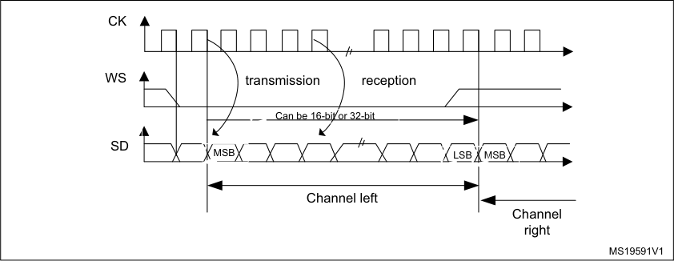

|Col1|Col2|Col3|Col4|Col5|Col6|
|---|---|---|---|---|---|
|||transmission reception|transmission reception|transmission reception|transmission reception|
|||Can be 16-bit or 32-bit MSB LSB|Can be 16-bit or 32-bit MSB LSB|Can be 16-bit or 32-bit MSB LSB|Can be 16-bit or 32-bit MSB LSB|
|||MSB|MSB||MSB|

Data are latched on the falling edge of CK (for the transmitter) and are read on the rising
edge (for the receiver). The WS signal is also latched on the falling edge of CK.

**Figure 266. I** **[2]** **S Philips standard waveforms (24-bit frame with CPOL = 0)**

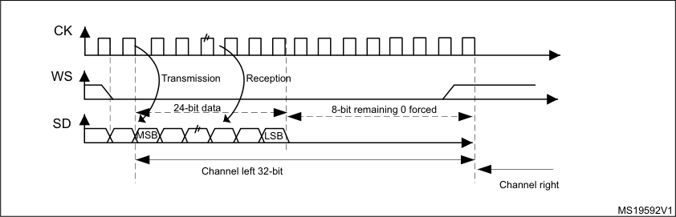

|Col1|Col2|Col3|Col4|Col5|Col6|Col7|
|---|---|---|---|---|---|---|
||||Transmission Receptio|Transmission Receptio|n|n|
|||M|24-bit data|24-bit data|8-bit remaining 0 forced|8-bit remaining 0 forced|
|||M|SB LSB|SB LSB|||
||||||||
||||||||

This mode needs two write or read operations to/from the SPIx_DR register.

794/905 RM0377 Rev 10

--- end of page=793 ---

**RM0377** **Serial peripheral interface/ inter-IC sound (SPI/I2S)**

      - In transmission mode:

If 0x8EAA33 has to be sent (24-bit):

**Figure 267. Transmitting 0x8EAA33**

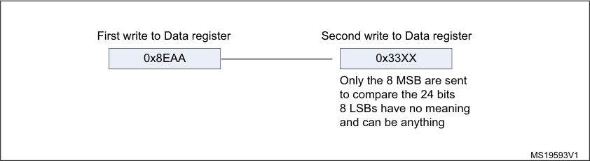

      - In reception mode:

If data 0x8EAA33 is received:

**Figure 268. Receiving 0x8EAA33**

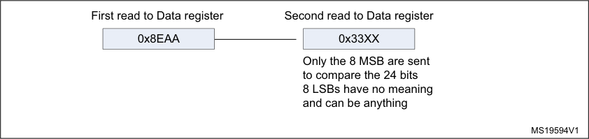

**Figure 269. I** **[2]** **S Philips standard (16-bit extended to 32-bit packet frame with**
**CPOL = 0)**

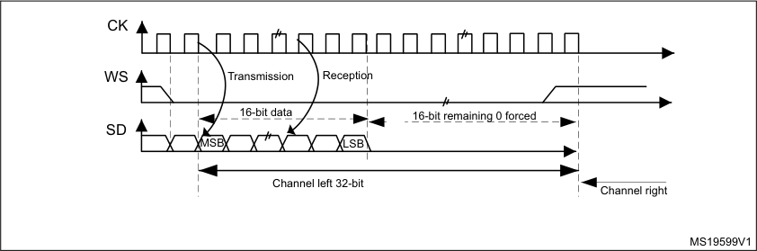

|Col1|Col2|Col3|Col4|Col5|Col6|Col7|Col8|
|---|---|---|---|---|---|---|---|
|||||Transmission Receptio|Transmission Receptio|n|n|
|||||16-bit data|16-bit data|16-bit remaining 0 forced|16-bit remaining 0 forced|
|||||MSB LSB|MSB LSB|||
|||||||||
|||||||||

When 16-bit data frame extended to 32-bit channel frame is selected during the I [2] S
configuration phase, only one access to the SPIx_DR register is required. The 16 remaining
bits are forced by hardware to 0x0000 to extend the data to 32-bit format.

If the data to transmit or the received data are 0x76A3 (0x76A30000 extended to 32-bit), the
operation shown in _Figure 270_ is required.

RM0377 Rev 10 795/905

817

--- end of page=794 ---

**Serial peripheral interface/ inter-IC sound (SPI/I2S)** **RM0377**

**Figure 270. Example of 16-bit data frame extended to 32-bit channel frame**

For transmission, each time an MSB is written to SPIx_DR, the TXE flag is set and its
interrupt, if allowed, is generated to load the SPIx_DR register with the new value to send.
This takes place even if 0x0000 have not yet been sent because it is done by hardware.

For reception, the RXNE flag is set and its interrupt, if allowed, is generated when the first
16 MSB half-word is received.

In this way, more time is provided between two write or read operations, which prevents
underrun or overrun conditions (depending on the direction of the data transfer).

**MSB justified standard**

For this standard, the WS signal is generated at the same time as the first data bit, which is
the MSBit.

**Figure 271. MSB Justified 16-bit or 32-bit full-accuracy length with CPOL = 0**

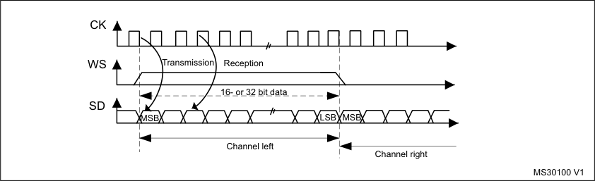

|Col1|Col2|Col3|
|---|---|---|
||Transmission Reception|Transmission Reception|
||||
||16- or 32 bit data|16- or 32 bit data|
||MSB LSB|MSB LSB|
||||

Data are latched on the falling edge of CK (for transmitter) and are read on the rising edge
(for the receiver).

**Figure 272. MSB justified 24-bit frame length with CPOL = 0**

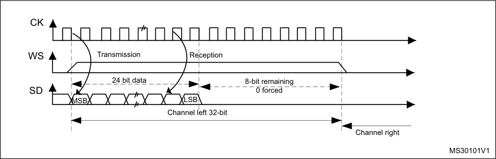

|Col1|Col2|Col3|Col4|Col5|Col6|
|---|---|---|---|---|---|
|||Transmission Re|Transmission Re|ception|ception|
|||Transmission Re|Transmission Re|||
|||24 bit data|24 bit data|8-bit remaining|8-bit remaining|
|||MSB LSB|MSB LSB|0 forced|0 forced|
|||||||
|||Channel left 32-bit|Channel left 32-bit|Channel left 32-bit|Channel left 32-bit|

796/905 RM0377 Rev 10

--- end of page=795 ---

**RM0377** **Serial peripheral interface/ inter-IC sound (SPI/I2S)**

**Figure 273. MSB justified 16-bit extended to 32-bit packet frame with CPOL = 0**

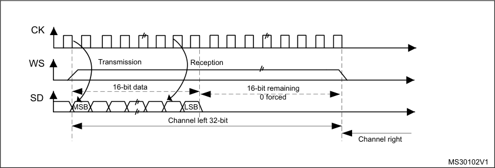

|Col1|Col2|Col3|Col4|
|---|---|---|---|
||Transmission Rece|ption|ption|
||Transmission Rece|||
||16-bit data|16-bit remaining|16-bit remaining|
||MSB LSB|0 forced|0 forced|
||MSB LSB|0 forced||
||Channel left 32-bit|Channel left 32-bit|Channel left 32-bit|

**LSB justified standard**

This standard is similar to the MSB justified standard (no difference for the 16-bit and 32-bit
full-accuracy frame formats).

**Figure 274. LSB justified 16-bit or 32-bit full-accuracy with CPOL = 0**

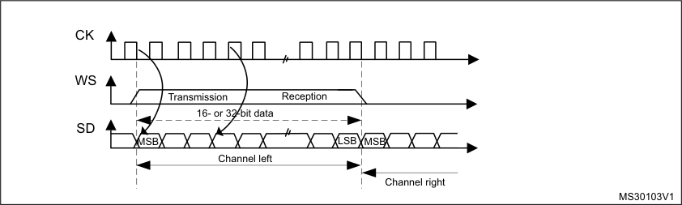

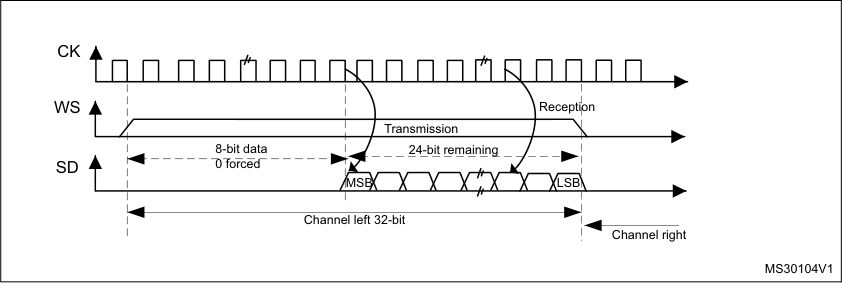

**Figure 275. LSB justified 24-bit frame length with CPOL = 0**

|Col1|Col2|Col3|Col4|Col5|
|---|---|---|---|---|
||||Transmission Recepti|Transmission Recepti|
||8-bit data|8-bit data|24-bit remaining|24-bit remaining|
||0 forced |0 forced |MSB LSB|MSB LSB|
||||||

RM0377 Rev 10 797/905

817

--- end of page=796 ---

**Serial peripheral interface/ inter-IC sound (SPI/I2S)** **RM0377**

      - In transmission mode:

If data 0x3478AE have to be transmitted, two write operations to the SPIx_DR register
are required by software or by DMA. The operations are shown below.

**Figure 276. Operations required to transmit 0x3478AE**

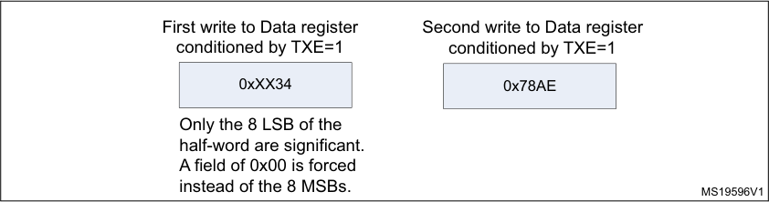

      - In reception mode:

If data 0x3478AE are received, two successive read operations from the SPIx_DR
register are required on each RXNE event.

**Figure 277. Operations required to receive 0x3478AE**

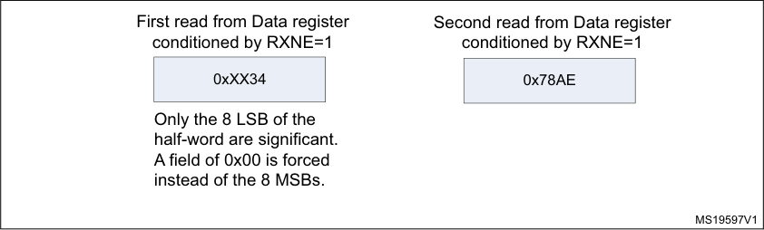

**Figure 278. LSB justified 16-bit extended to 32-bit packet frame with CPOL = 0**

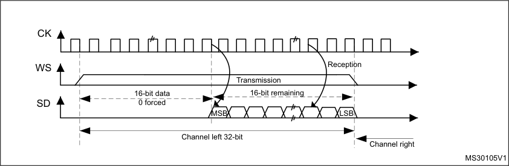

|Col1|Col2|Col3|Col4|Col5|
|---|---|---|---|---|
||||Transmission Recepti|Transmission Recepti|
||16-bit data|16-bit data|16-bit remaining|16-bit remaining|
||0 forced M|0 forced M|SB LSB|SB LSB|
||||||

When 16-bit data frame extended to 32-bit channel frame is selected during the I [2] S
configuration phase, Only one access to the SPIx_DR register is required. The 16 remaining
bits are forced by hardware to 0x0000 to extend the data to 32-bit format. In this case it
corresponds to the half-word MSB.

If the data to transmit or the received data are 0x76A3 (0x0000 76A3 extended to 32-bit),
the operation shown in _Figure 279_ is required.

798/905 RM0377 Rev 10

--- end of page=797 ---

**RM0377** **Serial peripheral interface/ inter-IC sound (SPI/I2S)**

**Figure 279. Example of 16-bit data frame extended to 32-bit channel frame**

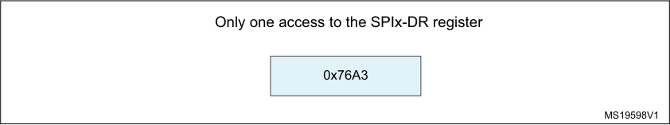

In transmission mode, when a TXE event occurs, the application has to write the data to be
transmitted (in this case 0x76A3). The 0x000 field is transmitted first (extension on 32-bit).
The TXE flag is set again as soon as the effective data (0x76A3) is sent on SD.

In reception mode, RXNE is asserted as soon as the significant half-word is received (and
not the 0x0000 field).

In this way, more time is provided between two write or read operations to prevent underrun
or overrun conditions.

**PCM standard**

For the PCM standard, there is no need to use channel-side information. The two PCM
modes (short and long frame) are available and configurable using the PCMSYNC bit in
SPIx_I2SCFGR register.

**Figure 280. PCM standard waveforms (16-bit)**

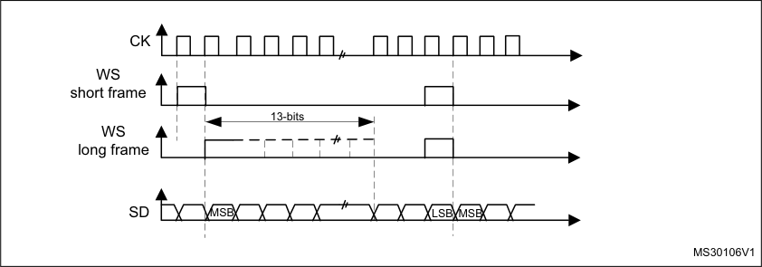

|Col1|Col2|Col3|Col4|Col5|
|---|---|---|---|---|
||||||
||||||
||13-bits|13-bits|13-bits|13-bits|
||13-bits|13-bits|||
||MSB|LSB|LSB|LSB|

For long frame synchronization, the WS signal assertion time is fixed to 13 bits in master
mode.

For short frame synchronization, the WS synchronization signal is only one cycle long.

**Figure 281. PCM standard waveforms (16-bit extended to 32-bit packet frame)**

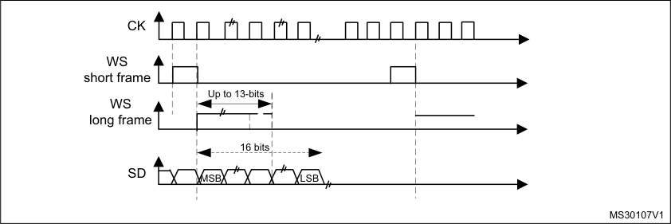

|Col1|Col2|Col3|Col4|Col5|
|---|---|---|---|---|
||||||
||||||
||Up to 13-bits|Up to 13-bits|Up to 13-bits|Up to 13-bits|
||||||
||||||
||16 bits|LSB|LSB|LSB|
||MSB |MSB |MSB |MSB |

RM0377 Rev 10 799/905

817

--- end of page=798 ---

**Serial peripheral interface/ inter-IC sound (SPI/I2S)** **RM0377**

_Note:_ _For both modes (master and slave) and for both synchronizations (short and long), the_
_number of bits between two consecutive pieces of data (and so two synchronization signals)_
_needs to be specified (DATLEN and CHLEN bits in the SPIx_I2SCFGR register) even in_
_slave mode._

**26.6.4** **Clock generator**

The I [2] S bitrate determines the data flow on the I [2] S data line and the I [2] S clock signal
frequency.

I [2] S bitrate = number of bits per channel × number of channels × sampling audio frequency

For a 16-bit audio, left and right channel, the I [2] S bitrate is calculated as follows:

I [2] S bitrate = 16 × 2 × f S

It will be: I [2] S bitrate = 32 x 2 x f S if the packet length is 32-bit wide.

**Figure 282. Audio sampling frequency definition**

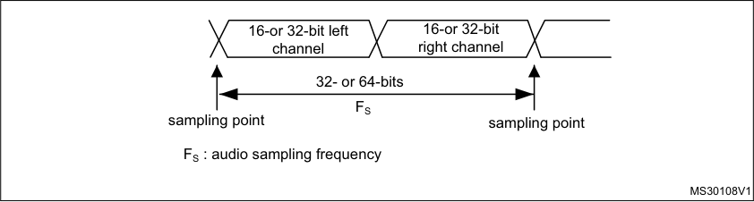

When the master mode is configured, a specific action needs to be taken to properly
program the linear divider in order to communicate with the desired audio frequency.

_Figure 283_ presents the communication clock architecture. The I2SxCLK clock is provided
by the RCC block, refer to the RCC section for details.

**Figure 283. I** **[2]** **S clock generator architecture**

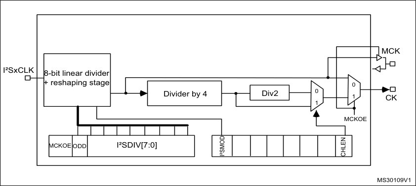

1. Where x = 2.

800/905 RM0377 Rev 10

--- end of page=799 ---

