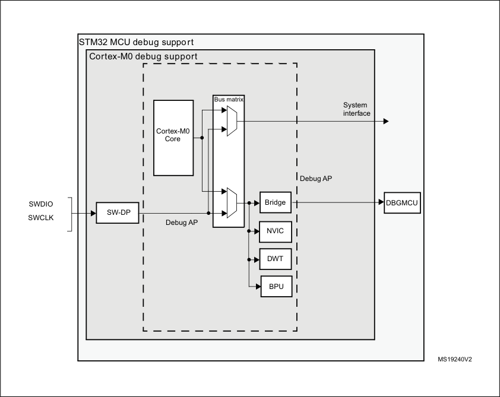

# RM0377 STM32L0x1 — Pages 801–850

**RM0377** **Serial peripheral interface/ inter-IC sound (SPI/I2S)**

The audio sampling frequency may be 192 KHz, 96 kHz, 48 kHz, 44.1 kHz, 32 kHz,
22.05 kHz, 16 kHz, 11.025 kHz or 8 kHz (or any other value within this range). In order to
reach the desired frequency, the linear divider needs to be programmed according to the
formulas below:

When the master clock is generated (MCKOE in the SPIx_I2SPR register is set):

f S = I2SxCLK / [(16*2)*((2*I2SDIV)+ODD)*8)] when the channel frame is 16-bit wide

f S = I2SxCLK / [(32*2)*((2*I2SDIV)+ODD)*4)] when the channel frame is 32-bit wide

When the master clock is disabled (MCKOE bit cleared):

f S = I2SxCLK / [(16*2)*((2*I2SDIV)+ODD))] when the channel frame is 16-bit wide

f S = I2SxCLK / [(32*2)*((2*I2SDIV)+ODD))] when the channel frame is 32-bit wide

_Table 136_ provides example precision values for different clock configurations.

_Note:_ _Other configurations are possible that allow optimum clock precision._

**Table 136. Audio-frequency** **precision using standard 8 MHz HSE**

|I2SxCLK (MHz)|Data length|I2SDIV|I2SODD|MCLK|Target fs(Hz)|Real f (kHz) s|Error|
|---|---|---|---|---|---|---|---|
|32|16|5|0|No|96000|100|4.1667%|
|32|32|2|0|No|96000|100|4.1667%|
|32|16|10|1|No|48000|47.619|0.7937%|
|32|32|5|0|No|48000|50|4.1667%|
|32|16|11|1|No|44100|43.478|1.4098%|
|32|32|5|1|No|44100|45.454|3.0715%|
|32|16|15|1|No|32000|32.258|0.8065%|
|32|32|8|0|No|32000|31.25|2.3430%|
|32|16|22|1|No|22050|22.222|0.7811%|
|32|32|11|1|No|22050|21.739|1.4098%|
|32|16|31|1|No|16000|15.873|0.7937%|
|32|32|15|1|No|16000|16.129|0.8065%|
|32|16|45|1|No|11025|10.989|0.3264%|
|32|32|22|1|No|11025|11.111|0.7811%|
|32|16|62|1|No|8000|8|0.0000%|
|32|32|31|1|No|8000|7.936|0.7937%|
|32|16|2|0|Yes|32000|31.25|2.3430%|
|32|32|2|0|Yes|32000|31.25|2.3430%|
|32|16|3|0|Yes|22050|20.833|5.5170%|
|32|32|3|0|Yes|22050|20.833|5.5170%|
|32|16|4|0|Yes|16000|15.625|2.3428%|
|32|32|4|0|Yes|16000|15.625|2.3428%|
|32|16|5|1|Yes|11025|11.363|3.0715%|

RM0377 Rev 10 801/905

817

--- end of page=800 ---

**Serial peripheral interface/ inter-IC sound (SPI/I2S)** **RM0377**

**Table 136. Audio-frequency** **precision using standard 8 MHz HSE (continued)**

|I2SxCLK (MHz)|Data length|I2SDIV|I2SODD|MCLK|Target fs(Hz)|Real f (kHz) s|Error|
|---|---|---|---|---|---|---|---|
|32|32|5|1|Yes|11025|11.363|3.0715%|
|32|16|8|0|Yes|8000|7.812|2.3428%|
|32|32|8|0|Yes|8000|7.812|2.3428%|

**26.6.5** **I** **[2]** **S master mode**

The I [2] S can be configured in master mode. This means that the serial clock is generated on
the CK pin as well as the Word Select signal WS. Master clock (MCK) may be output or not,
controlled by the MCKOE bit in the SPIx_I2SPR register.

**Procedure**

1. Select the I2SDIV[7:0] bits in the SPIx_I2SPR register to define the serial clock baud
rate to reach the proper audio sample frequency. The ODD bit in the SPIx_I2SPR
register also has to be defined.

2. Select the CKPOL bit to define the steady level for the communication clock. Set the
MCKOE bit in the SPIx_I2SPR register if the master clock MCK needs to be provided
to the external ADC audio component (the I2SDIV and ODD values should be
computed depending on the state of the MCK output, for more details refer to
_Section 26.6.4: Clock generator_ ).

3. Set the I2SMOD bit in the SPIx_I2SCFGR register to activate the I [2] S functions and
choose the I [2] S standard through the I2SSTD[1:0] and PCMSYNC bits, the data length
through the DATLEN[1:0] bits and the number of bits per channel by configuring the
CHLEN bit. Select also the I [2] S master mode and direction (Transmitter or Receiver)
through the I2SCFG[1:0] bits in the SPIx_I2SCFGR register.

4. If needed, select all the potential interrupt sources and the DMA capabilities by writing
the SPIx_CR2 register.

5. The I2SE bit in SPIx_I2SCFGR register must be set.

WS and CK are configured in output mode. MCK is also an output, if the MCKOE bit in
SPIx_I2SPR is set.

**Transmission sequence**

The transmission sequence begins when a half-word is written into the Tx buffer.

Lets assume the first data written into the Tx buffer corresponds to the left channel data.
When data are transferred from the Tx buffer to the shift register, TXE is set and data
corresponding to the right channel have to be written into the Tx buffer. The CHSIDE flag
indicates which channel is to be transmitted. It has a meaning when the TXE flag is set
because the CHSIDE flag is updated when TXE goes high.

A full frame has to be considered as a left channel data transmission followed by a right
channel data transmission. It is not possible to have a partial frame where only the left
channel is sent.

The data half-word is parallel loaded into the 16-bit shift register during the first bit
transmission, and then shifted out, serially, to the MOSI/SD pin, MSB first. The TXE flag is

802/905 RM0377 Rev 10

--- end of page=801 ---

**RM0377** **Serial peripheral interface/ inter-IC sound (SPI/I2S)**

set after each transfer from the Tx buffer to the shift register and an interrupt is generated if
the TXEIE bit in the SPIx_CR2 register is set.

For more details about the write operations depending on the I [2] S Standard-mode selected,
refer to _Section 26.6.3: Supported audio protocols_ ).

To ensure a continuous audio data transmission, it is mandatory to write the SPIx_DR
register with the next data to transmit before the end of the current transmission.

To switch off the I [2] S, by clearing I2SE, it is mandatory to wait for TXE = 1 and BSY = 0.

**Reception sequence**

The operating mode is the same as for transmission mode except for the point 3 (refer to the
procedure described in _Section 26.6.5: I_ _[2]_ _S master mode_ ), where the configuration should
set the master reception mode through the I2SCFG[1:0] bits.

Whatever the data or channel length, the audio data are received by 16-bit packets. This
means that each time the Rx buffer is full, the RXNE flag is set and an interrupt is generated
if the RXNEIE bit is set in SPIx_CR2 register. Depending on the data and channel length
configuration, the audio value received for a right or left channel may result from one or two
receptions into the Rx buffer.

Clearing the RXNE bit is performed by reading the SPIx_DR register.

CHSIDE is updated after each reception. It is sensitive to the WS signal generated by the
I [2] S cell.

For more details about the read operations depending on the I [2] S Standard-mode selected,
refer to _Section 26.6.3: Supported audio protocols_ .

If data are received while the previously received data have not been read yet, an overrun is
generated and the OVR flag is set. If the ERRIE bit is set in the SPIx_CR2 register, an
interrupt is generated to indicate the error.

To switch off the I [2] S, specific actions are required to ensure that the I [2] S completes the
transfer cycle properly without initiating a new data transfer. The sequence depends on the
configuration of the data and channel lengths, and on the audio protocol mode selected. In
the case of:

      - 16-bit data length extended on 32-bit channel length (DATLEN = 00 and CHLEN = 1)
using the LSB justified mode (I2SSTD = 10)

a) Wait for the second to last RXNE = 1 (n – 1)

b) Then wait 17 I [2] S clock cycles (using a software loop)

c) Disable the I [2] S (I2SE = 0)

      - 16-bit data length extended on 32-bit channel length (DATLEN = 00 and CHLEN = 1) in
MSB justified, I [2] S or PCM modes (I2SSTD = 00, I2SSTD = 01 or I2SSTD = 11,
respectively)

a) Wait for the last RXNE

b) Then wait 1 I [2] S clock cycle (using a software loop)

c) Disable the I [2] S (I2SE = 0)

RM0377 Rev 10 803/905

817

--- end of page=802 ---

**Serial peripheral interface/ inter-IC sound (SPI/I2S)** **RM0377**

      - For all other combinations of DATLEN and CHLEN, whatever the audio mode selected
through the I2SSTD bits, carry out the following sequence to switch off the I [2] S:

a) Wait for the second to last RXNE = 1 (n – 1)

b) Then wait one I [2] S clock cycle (using a software loop)

c) Disable the I [2] S (I2SE = 0)

_Note:_ _The BSY flag is kept low during transfers._

**26.6.6** **I** **[2]** **S slave mode**

For the slave configuration, the I [2] S can be configured in transmission or reception mode.

The operating mode is following mainly the same rules as described for the I [2] S master
configuration. In slave mode, there is no clock to be generated by the I [2] S interface. The
clock and WS signals are input from the external master connected to the I [2] S interface.
There is then no need, for the user, to configure the clock.

The configuration steps to follow are listed below:

1. Set the I2SMOD bit in the SPIx_I2SCFGR register to select I [2] S mode and choose the
I [2] S standard through the I2SSTD[1:0] bits, the data length through the DATLEN[1:0]
bits and the number of bits per channel for the frame configuring the CHLEN bit. Select
also the mode (transmission or reception) for the slave through the I2SCFG[1:0] bits in
SPIx_I2SCFGR register.

2. If needed, select all the potential interrupt sources and the DMA capabilities by writing
the SPIx_CR2 register.

3. The I2SE bit in SPIx_I2SCFGR register must be set.

**Transmission sequence**

The transmission sequence begins when the external master device sends the clock and
when the NSS_WS signal requests the transfer of data. The slave has to be enabled before
the external master starts the communication. The I [2] S data register has to be loaded before
the master initiates the communication.

For the I [2] S, MSB justified and LSB justified modes, the first data item to be written into the
data register corresponds to the data for the left channel. When the communication starts,
the data are transferred from the Tx buffer to the shift register. The TXE flag is then set in
order to request the right channel data to be written into the I [2] S data register.

The CHSIDE flag indicates which channel is to be transmitted. Compared to the master
transmission mode, in slave mode, CHSIDE is sensitive to the WS signal coming from the
external master. This means that the slave needs to be ready to transmit the first data
before the clock is generated by the master. WS assertion corresponds to left channel
transmitted first.

_Note:_ _The I2SE has to be written at least two PCLK cycles before the first clock of the master_
_comes on the CK line._

The data half-word is parallel-loaded into the 16-bit shift register (from the internal bus)
during the first bit transmission, and then shifted out serially to the MOSI/SD pin MSB first.
The TXE flag is set after each transfer from the Tx buffer to the shift register and an interrupt
is generated if the TXEIE bit in the SPIx_CR2 register is set.

Note that the TXE flag should be checked to be at 1 before attempting to write the Tx buffer.

804/905 RM0377 Rev 10

--- end of page=803 ---

**RM0377** **Serial peripheral interface/ inter-IC sound (SPI/I2S)**

For more details about the write operations depending on the I [2] S Standard-mode selected,
refer to _Section 26.6.3: Supported audio protocols_ .

To secure a continuous audio data transmission, it is mandatory to write the SPIx_DR
register with the next data to transmit before the end of the current transmission. An
underrun flag is set and an interrupt may be generated if the data are not written into the
SPIx_DR register before the first clock edge of the next data communication. This indicates
to the software that the transferred data are wrong. If the ERRIE bit is set into the SPIx_CR2
register, an interrupt is generated when the UDR flag in the SPIx_SR register goes high. In
this case, it is mandatory to switch off the I [2] S and to restart a data transfer starting from the
left channel.

To switch off the I [2] S, by clearing the I2SE bit, it is mandatory to wait for TXE = 1 and
BSY = 0.

**Reception sequence**

The operating mode is the same as for the transmission mode except for the point 1 (refer to
the procedure described in _Section 26.6.6: I_ _[2]_ _S slave mode_ ), where the configuration should
set the master reception mode using the I2SCFG[1:0] bits in the SPIx_I2SCFGR register.

Whatever the data length or the channel length, the audio data are received by 16-bit
packets. This means that each time the RX buffer is full, the RXNE flag in the SPIx_SR
register is set and an interrupt is generated if the RXNEIE bit is set in the SPIx_CR2
register. Depending on the data length and channel length configuration, the audio value
received for a right or left channel may result from one or two receptions into the RX buffer.

The CHSIDE flag is updated each time data are received to be read from the SPIx_DR
register. It is sensitive to the external WS line managed by the external master component.

Clearing the RXNE bit is performed by reading the SPIx_DR register.

For more details about the read operations depending the I [2] S Standard-mode selected,
refer to _Section 26.6.3: Supported audio protocols_ .

If data are received while the preceding received data have not yet been read, an overrun is
generated and the OVR flag is set. If the bit ERRIE is set in the SPIx_CR2 register, an
interrupt is generated to indicate the error.

To switch off the I [2] S in reception mode, I2SE has to be cleared immediately after receiving
the last RXNE = 1.

_Note:_ _The external master components should have the capability of sending/receiving data in 16-_
_bit or 32-bit packets via an audio channel._

**26.6.7** **I** **[2]** **S status flags**

Three status flags are provided for the application to fully monitor the state of the I [2] S bus.

**Busy flag (BSY)**

The BSY flag is set and cleared by hardware (writing to this flag has no effect). It indicates
the state of the communication layer of the I [2] S.

When BSY is set, it indicates that the I [2] S is busy communicating. There is one exception in
master receive mode (I2SCFG = 11) where the BSY flag is kept low during reception.

RM0377 Rev 10 805/905

817

--- end of page=804 ---

**Serial peripheral interface/ inter-IC sound (SPI/I2S)** **RM0377**

The BSY flag is useful to detect the end of a transfer if the software needs to disable the I [2] S.
This avoids corrupting the last transfer. For this, the procedure described below must be
strictly respected.

The BSY flag is set when a transfer starts, except when the I [2] S is in master receiver mode.

The BSY flag is cleared:

      - When a transfer completes (except in master transmit mode, in which the
communication is supposed to be continuous)

      - When the I [2] S is disabled

When communication is continuous:

      - In master transmit mode, the BSY flag is kept high during all the transfers

      - In slave mode, the BSY flag goes low for one I [2] S clock cycle between each transfer

_Note:_ _Do not use the BSY flag to handle each data transmission or reception. It is better to use the_
_TXE and RXNE flags instead._

**Tx buffer empty flag (TXE)**

When set, this flag indicates that the Tx buffer is empty and the next data to be transmitted
can then be loaded into it. The TXE flag is reset when the Tx buffer already contains data to
be transmitted. It is also reset when the I [2] S is disabled (I2SE bit is reset).

**RX buffer not empty (RXNE)**

When set, this flag indicates that there are valid received data in the RX Buffer. It is reset
when SPIx_DR register is read.

**Channel Side flag (CHSIDE)**

In transmission mode, this flag is refreshed when TXE goes high. It indicates the channel
side to which the data to transfer on SD has to belong. In case of an underrun error event in
slave transmission mode, this flag is not reliable and I [2] S needs to be switched off and
switched on before resuming the communication.

In reception mode, this flag is refreshed when data are received into SPIx_DR. It indicates
from which channel side data have been received. Note that in case of error (like OVR) this
flag becomes meaningless and the I [2] S should be reset by disabling and then enabling it
(with configuration if it needs changing).

This flag has no meaning in the PCM standard (for both Short and Long frame modes).

When the OVR or UDR flag in the SPIx_SR is set and the ERRIE bit in SPIx_CR2 is also
set, an interrupt is generated. This interrupt can be cleared by reading the SPIx_SR status
register (once the interrupt source has been cleared).

**26.6.8** **I** **[2]** **S error flags**

There are three error flags for the I [2] S cell.

**Underrun flag (UDR)**

In slave transmission mode this flag is set when the first clock for data transmission appears
while the software has not yet loaded any value into SPIx_DR. It is available when the
I2SMOD bit in the SPIx_I2SCFGR register is set. An interrupt may be generated if the

806/905 RM0377 Rev 10

--- end of page=805 ---

**RM0377** **Serial peripheral interface/ inter-IC sound (SPI/I2S)**

ERRIE bit in the SPIx_CR2 register is set.
The UDR bit is cleared by a read operation on the SPIx_SR register.

**Overrun flag (OVR)**

This flag is set when data are received and the previous data have not yet been read from
the SPIx_DR register. As a result, the incoming data are lost. An interrupt may be generated
if the ERRIE bit is set in the SPIx_CR2 register.

In this case, the receive buffer contents are not updated with the newly received data from
the transmitter device. A read operation to the SPIx_DR register returns the previous
correctly received data. All other subsequently transmitted half-words are lost.

Clearing the OVR bit is done by a read operation on the SPIx_DR register followed by a
read access to the SPIx_SR register.

**Frame error flag (FRE)**

This flag can be set by hardware only if the I [2] S is configured in Slave mode. It is set if the
external master is changing the WS line while the slave is not expecting this change. If the
synchronization is lost, the following steps are required to recover from this state and
resynchronize the external master device with the I [2] S slave device:

1. Disable the I [2] S.

2. Enable it again when the correct level is detected on the WS line (WS line is high in I [2] S
mode or low for MSB- or LSB-justified or PCM modes.

Desynchronization between master and slave devices may be due to noisy environment on
the SCK communication clock or on the WS frame synchronization line. An error interrupt
can be generated if the ERRIE bit is set. The desynchronization flag (FRE) is cleared by
software when the status register is read.

**26.6.9** **I** **[2]** **S interrupts**

_Table 137_ provides the list of I [2] S interrupts.

**Table 137. I** **[2]** **S interrupt requests**

|Interrupt event|Event flag|Enable control bit|
|---|---|---|
|Transmit buffer empty flag|TXE|TXEIE|
|Receive buffer not empty flag|RXNE|RXNEIE|
|Overrun error|OVR|ERRIE|
|Underrun error|UDR|UDR|
|Frame error flag|FRE|FRE|

**26.6.10** **DMA features**

In I [2] S mode, the DMA works in exactly the same way as it does in SPI mode. There is no
difference except that the CRC feature is not available in I [2] S mode since there is no data
transfer protection system.

RM0377 Rev 10 807/905

817

--- end of page=806 ---

**Serial peripheral interface/ inter-IC sound (SPI/I2S)** **RM0377**

###### **26.7 SPI and I [2] S registers**

The peripheral registers can be accessed by half-words (16-bit) or words (32-bit). In
addition, SPI_DR can be accessed by 8-bit.

Refer to _Section 1.2_ for a list of abbreviations used in register descriptions.

**26.7.1** **SPI control register 1 (SPI_CR1) (not used in I** **[2]** **S mode)**

Address offset: 0x00

Reset value: 0x0000

|15|14|13|12|11|10|9|8|7|6|5 4 3|Col12|Col13|2|1|0|
|---|---|---|---|---|---|---|---|---|---|---|---|---|---|---|---|
|BIDI MODE|BIDI OE|CRC EN|CRC NEXT|DFF|RX ONLY|SSM|SSI|_LSB_ _FIRST_|SPE|BR [2:0]|BR [2:0]|BR [2:0]|MSTR|CPOL|CPHA|
|rw|rw|rw|rw|rw|rw|rw|rw|rw|rw|rw|rw|rw|rw|rw|rw|

Bit 15 _**BIDIMODE:**_ Bidirectional data mode enable

This bit enables half-duplex communication using common single bidirectional data line.
Keep RXONLY bit clear when bidirectional mode is active.

_0: 2-line unidirectional data mode selected_

1: 1-line bidirectional data mode selected
_Note:_ _**This bit is not used in I**_ _[2]_ _**S mode**_

Bit 14 **BIDIOE:** Output enable in bidirectional mode

This bit combined with the BIDIMODE bit selects the direction of transfer in bidirectional

mode

0: Output disabled (receive-only mode)
1: Output enabled (transmit-only mode)

_Note: In master mode, the MOSI pin is used while the MISO pin is used in slave mode._
_**This bit is not used in I**_ _[2]_ _**S mode.**_

Bit 13 **CRCEN:** Hardware CRC calculation enable

0: CRC calculation disabled

1: CRC calculation enabled

_Note: This bit should be written only when SPI is disabled (SPE = ‘0’) for correct operation._
_It is not_ _**used in I**_ _[2]_ _**S mode.**_

Bit 12 **CRCNEXT:** CRC transfer next

0: Data phase (no CRC phase)
1: Next transfer is CRC (CRC phase)

_Note: When the SPI is configured in full-duplex or transmitter only modes, CRCNEXT must be_
_written as soon as the last data is written to the SPI_DR register._
_When the SPI is configured in receiver only mode, CRCNEXT must be set after the_
_second last data reception._
_This bit should be kept cleared when the transfers are managed by DMA._
_**It is not used in I**_ _[2]_ _**S mode.**_

Bit 11 **DFF:** Data frame format

0: 8-bit data frame format is selected for transmission/reception
1: 16-bit data frame format is selected for transmission/reception

_Note: This bit should be written only when SPI is disabled (SPE = ‘0’) for correct operation._
_**It is not used in I**_ _[2]_ _**S mode.**_

808/905 RM0377 Rev 10

--- end of page=807 ---

**RM0377** **Serial peripheral interface/ inter-IC sound (SPI/I2S)**

Bit 10 **RXONLY:** Receive only mode enable

This bit enables simplex communication using a single unidirectional line to receive data
exclusively. Keep BIDIMODE bit clear when receive only mode is active.
This bit is also useful in a multislave system in which this particular slave is not accessed, the
output from the accessed slave is not corrupted.
0: full-duplex (Transmit and receive)
1: Output disabled (Receive-only mode)
_Note:_ _**This bit is not used in I**_ _[2]_ _**S mode**_

Bit 9 **SSM:** Software slave management

When the SSM bit is set, the NSS pin input is replaced with the value from the SSI bit.
0: Software slave management disabled
1: Software slave management enabled
_Note:_ _**This bit is not used in I**_ _[2]_ _**S mode and SPI TI mode**_

Bit 8 **SSI:** Internal slave select

This bit has an effect only when the SSM bit is set. The value of this bit is forced onto the
NSS pin and the IO value of the NSS pin is ignored.
_Note:_ _**This bit is not used in I**_ _[2]_ _**S mode and SPI TI mode**_

Bit 7 _**LSBFIRST:**_ Frame format

_0: MSB transmitted first_

1: LSB transmitted first

_Note: This bit should not be changed when communication is ongoing._
_**It is not used in I**_ _[2]_ _**S mode and SPI TI mode**_

Bit 6 **SPE:** SPI enable

0: Peripheral disabled
1: Peripheral enabled

_Note: When disabling the SPI, follow the procedure described in Section 26.3.10: Procedure_
_for disabling the SPI_ .
_**This bit is not used in I**_ _[2]_ _**S mode.**_

Bits 5:3 **BR[2:0]:** Baud rate control

000: f PCLK /2
001: f PCLK /4
010: f PCLK /8
011: f PCLK /16
100: f PCLK /32
101: f PCLK /64
110: f PCLK /128
111: f PCLK /256

_Note: These bits should not be changed when communication is ongoing._
_**They are not used in I**_ _[2]_ _**S mode.**_

RM0377 Rev 10 809/905

817

--- end of page=808 ---

**Serial peripheral interface/ inter-IC sound (SPI/I2S)** **RM0377**

Bit 2 **MSTR:** Master selection

0: Slave configuration
1: Master configuration

_Note: This bit should not be changed when communication is ongoing._
_**It is not used in I**_ _[2]_ _**S mode.**_

Bit1 **CPOL:** Clock polarity

0: CK to 0 when idle

1: CK to 1 when idle

_Note: This bit should not be changed when communication is ongoing._
_**It is not used in I**_ _[2]_ _**S mode and SPI TI mode except the case when CRC is applied**_
_**at TI mode.**_

Bit 0 **CPHA:** Clock phase

0: The first clock transition is the first data capture edge
1: The second clock transition is the first data capture edge

_Note: This bit should not be changed when communication is ongoing._
_**It is not used in I**_ _[2]_ _**S mode and SPI TI mode except the case when CRC is applied**_
_**at TI mode.**_

**26.7.2** **SPI control register 2 (SPI_CR2)**

Address offset: 0x04

Reset value: 0x0000

|15|14|13|12|11|10|9|8|7|6|5|4|3|2|1|0|
|---|---|---|---|---|---|---|---|---|---|---|---|---|---|---|---|
|Res.|Res.|Res.|Res.|Res.|Res.|Res.|Res.|TXEIE|RXNEIE|ERRIE|FRF|Res.|_SSOE_|TXDMAEN|RXDMAEN|
|||||||||rw|rw|rw|rw||rw|rw|rw|

Bits 15:8 Reserved, must be kept at reset value.

Bit 7 **TXEIE:** Tx buffer empty interrupt enable

0: TXE interrupt masked
1: TXE interrupt not masked. Used to generate an interrupt request when the TXE flag is set.

Bit 6 **RXNEIE:** RX buffer not empty interrupt enable

0: RXNE interrupt masked
1: RXNE interrupt not masked. Used to generate an interrupt request when the RXNE flag is
set.

Bit 5 **ERRIE:** Error interrupt enable

This bit controls the generation of an interrupt when an error condition occurs (OVR,
CRCERR, MODF, FRE in SPI mode, and UDR, OVR, FRE in I [2] S mode).
0: Error interrupt is masked
1: Error interrupt is enabled

Bit 4 **FRF** : Frame format

0: SPI Motorola mode

1 SPI TI mode
_Note: This bit is not used_ _**in I**_ _[2]_ _**S mode.**_

Bit 3 Reserved. Forced to 0 by hardware.

810/905 RM0377 Rev 10

--- end of page=809 ---

**RM0377** **Serial peripheral interface/ inter-IC sound (SPI/I2S)**

Bit 2 **SSOE:** SS output enable

0: SS output is disabled in master mode and the cell can work in multimaster configuration
1: SS output is enabled in master mode and when the cell is enabled. The cell cannot work
in a multimaster environment.
_Note: This bit is not used_ _**in I**_ _[2]_ _**S mode and SPI TI mode.**_

Bit 1 **TXDMAEN:** Tx buffer DMA enable

When this bit is set, the DMA request is made whenever the TXE flag is set.

0: Tx buffer DMA disabled

1: Tx buffer DMA enabled

Bit 0 **RXDMAEN:** Rx buffer DMA enable

When this bit is set, the DMA request is made whenever the RXNE flag is set.

0: Rx buffer DMA disabled

1: Rx buffer DMA enabled

**26.7.3** **SPI status register (SPI_SR)**

Address offset: 0x08

Reset value: 0x0002

|15|14|13|12|11|10|9|8|7|6|5|4|3|2|1|0|
|---|---|---|---|---|---|---|---|---|---|---|---|---|---|---|---|
|Res.|Res.|Res.|Res.|Res.|Res.|Res.|FRE|BSY|OVR|MODF|CRC ERR|UDR|CHSIDE|TXE|RXNE|
||||||||r|r|r|r|rc_w0|r|r|r|r|

Bits 15:9 Reserved. Forced to 0 by hardware.

Bit 8 **FRE** : Frame Error

0: No frame error

1: Frame error occurred.

This bit is set by hardware and cleared by software when the SPI_SR register is read.
This bit is used in SPI TI mode or in I2S mode whatever the audio protocol selected. It
detects a change on NSS or WS line which takes place in slave mode at a non expected
time, informing about a desynchronization between the external master device and the
slave.

_Bit 7_ _**BSY:**_ Busy flag

_0: SPI (or I2S) not busy_
1: SPI (or I2S) is busy in communication or Tx buffer is not empty
This flag is set and cleared by hardware.

_Note: BSY flag must be used with caution: refer to Section 26.3.12: SPI status flags and_

_Section 26.3.10: Procedure for disabling the SPI._

Bit 6 **OVR:** Overrun flag

0: No overrun occurred

1: Overrun occurred

This flag is set by hardware and reset by a software sequence. Refer to _Section 26.3.13: SPI_
_error flags_ for the software sequence.

RM0377 Rev 10 811/905

817

--- end of page=810 ---

**Serial peripheral interface/ inter-IC sound (SPI/I2S)** **RM0377**

Bit 5 **MODF:** Mode fault

0: No mode fault occurred

1: Mode fault occurred

This flag is set by hardware and reset by a software sequence. Refer to _Section 26.4 on_
_page 787_ for the software sequence.
_Note: This bit is not used in I_ _[2]_ _S mode_

Bit 4 **CRCERR:** CRC error flag

0: CRC value received matches the SPI_RXCRCR value
1: CRC value received does not match the SPI_RXCRCR value
This flag is set by hardware and cleared by software writing 0.
_Note: This bit is not used in I_ _[2]_ _S mode._

Bit 3 **UDR:** Underrun flag

0: No underrun occurred

1: Underrun occurred
This flag is set by hardware and reset by a software sequence. Refer to _Section 26.6.8: I_ _[2]_ _S_
_error flags_ for the software sequence.

_Note: This bit is not used in SPI mode._

Bit 2 **CHSIDE** : Channel side

0: Channel Left has to be transmitted or has been received

1: Channel Right has to be transmitted or has been received

_Note: This bit is not used for SPI mode and is meaningless in PCM mode._

Bit 1 **TXE:** Transmit buffer empty

0: Tx buffer not empty
1: Tx buffer empty

Bit 0 **RXNE:** Receive buffer not empty

0: Rx buffer empty
1: Rx buffer not empty

812/905 RM0377 Rev 10

--- end of page=811 ---

**RM0377** **Serial peripheral interface/ inter-IC sound (SPI/I2S)**

**26.7.4** **SPI data register (SPI_DR)**

Address offset: 0x0C

Reset value: 0x0000

|15 14 13 12 11 10 9 8 7 6 5 4 3 2 1 0|Col2|Col3|Col4|Col5|Col6|Col7|Col8|Col9|Col10|Col11|Col12|Col13|Col14|Col15|Col16|
|---|---|---|---|---|---|---|---|---|---|---|---|---|---|---|---|
|DR[15:0]|DR[15:0]|DR[15:0]|DR[15:0]|DR[15:0]|DR[15:0]|DR[15:0]|DR[15:0]|DR[15:0]|DR[15:0]|DR[15:0]|DR[15:0]|DR[15:0]|DR[15:0]|DR[15:0]|DR[15:0]|
|rw|rw|rw|rw|rw|rw|rw|rw|rw|rw|rw|rw|rw|rw|rw|rw|

Bits 15:0 **DR[15:0]:** Data register

Data received or to be transmitted.

The data register is split into 2 buffers - one for writing (Transmit Buffer) and another one for
reading (Receive buffer). A write to the data register will write into the Tx buffer and a read
from the data register will return the value held in the Rx buffer.

_Note: These notes apply to SPI mode:_

_Depending on the data frame format selection bit (DFF in SPI_CR1 register), the data_
_sent or received is either 8-bit or 16-bit. This selection has to be made before enabling_
_the SPI to ensure correct operation._

_For an 8-bit data frame, the buffers are 8-bit and only the LSB of the register_
_(SPI_DR[7:0]) is used for transmission/reception. When in reception mode, the MSB of_
_the register (SPI_DR[15:8]) is forced to 0._

_For a 16-bit data frame, the buffers are 16-bit and the entire register, SPI_DR[15:0] is_
_used for transmission/reception._

**26.7.5** **SPI CRC polynomial register (SPI_CRCPR) (not used in I** **[2]** **S**
**mode)**

Address offset: 0x10

Reset value: 0x0007

|15 14 13 12 11 10 9 8 7 6 5 4 3 2 1 0|Col2|Col3|Col4|Col5|Col6|Col7|Col8|Col9|Col10|Col11|Col12|Col13|Col14|Col15|Col16|
|---|---|---|---|---|---|---|---|---|---|---|---|---|---|---|---|
|CRCPOLY[15:0]|CRCPOLY[15:0]|CRCPOLY[15:0]|CRCPOLY[15:0]|CRCPOLY[15:0]|CRCPOLY[15:0]|CRCPOLY[15:0]|CRCPOLY[15:0]|CRCPOLY[15:0]|CRCPOLY[15:0]|CRCPOLY[15:0]|CRCPOLY[15:0]|CRCPOLY[15:0]|CRCPOLY[15:0]|CRCPOLY[15:0]|CRCPOLY[15:0]|
|rw|rw|rw|rw|rw|rw|rw|rw|rw|rw|rw|rw|rw|rw|rw|rw|

Bits 15:0 **CRCPOLY[15:0]:** CRC polynomial register

This register contains the polynomial for the CRC calculation.
The CRC polynomial (0007h) is the reset value of this register. Another polynomial can be
configured as required.
_Note: These bits are not used for the I_ _[2]_ _S mode._

RM0377 Rev 10 813/905

817

--- end of page=812 ---

**Serial peripheral interface/ inter-IC sound (SPI/I2S)** **RM0377**

**26.7.6** **SPI RX CRC register (SPI_RXCRCR) (not used in I** **[2]** **S mode)**

Address offset: 0x14

Reset value: 0x0000

|15 14 13 12 11 10 9 8 7 6 5 4 3 2 1 0|Col2|Col3|Col4|Col5|Col6|Col7|Col8|Col9|Col10|Col11|Col12|Col13|Col14|Col15|Col16|
|---|---|---|---|---|---|---|---|---|---|---|---|---|---|---|---|
|RXCRC[15:0]|RXCRC[15:0]|RXCRC[15:0]|RXCRC[15:0]|RXCRC[15:0]|RXCRC[15:0]|RXCRC[15:0]|RXCRC[15:0]|RXCRC[15:0]|RXCRC[15:0]|RXCRC[15:0]|RXCRC[15:0]|RXCRC[15:0]|RXCRC[15:0]|RXCRC[15:0]|RXCRC[15:0]|
|r|r|r|r|r|r|r|r|r|r|r|r|r|r|r|r|

Bits 15:0 **RXCRC[15:0]:** Rx CRC register

When CRC calculation is enabled, the RxCRC[15:0] bits contain the computed CRC value of
the subsequently received bytes. This register is reset when the CRCEN bit in SPI_CR1
register is written to 1. The CRC is calculated serially using the polynomial programmed in
the SPI_CRCPR register.
Only the 8 LSB bits are considered when the data frame format is set to be 8-bit data (DFF
bit of SPI_CR1 is cleared). CRC calculation is done based on any CRC8 standard.
The entire 16-bits of this register are considered when a 16-bit data frame format is selected
(DFF bit of the SPI_CR1 register is set). CRC calculation is done based on any CRC16
standard.

_Note: A read to this register when the BSY Flag is set could return an incorrect value.These_
_bits are not used for I_ _[2]_ _S mode._

**26.7.7** **SPI TX CRC register (SPI_TXCRCR) (not used in I** **[2]** **S mode)**

Address offset: 0x18

Reset value: 0x0000

|15 14 13 12 11 10 9 8 7 6 5 4 3 2 1 0|Col2|Col3|Col4|Col5|Col6|Col7|Col8|Col9|Col10|Col11|Col12|Col13|Col14|Col15|Col16|
|---|---|---|---|---|---|---|---|---|---|---|---|---|---|---|---|
|TXCRC[15:0]|TXCRC[15:0]|TXCRC[15:0]|TXCRC[15:0]|TXCRC[15:0]|TXCRC[15:0]|TXCRC[15:0]|TXCRC[15:0]|TXCRC[15:0]|TXCRC[15:0]|TXCRC[15:0]|TXCRC[15:0]|TXCRC[15:0]|TXCRC[15:0]|TXCRC[15:0]|TXCRC[15:0]|
|r|r|r|r|r|r|r|r|r|r|r|r|r|r|r|r|

Bits 15:0 **TXCRC[15:0]:** Tx CRC register

When CRC calculation is enabled, the TxCRC[7:0] bits contain the computed CRC value of
the subsequently transmitted bytes. This register is reset when the CRCEN bit of SPI_CR1
is written to 1. The CRC is calculated serially using the polynomial programmed in the
SPI_CRCPR register.
Only the 8 LSB bits are considered when the data frame format is set to be 8-bit data (DFF
bit of SPI_CR1 is cleared). CRC calculation is done based on any CRC8 standard.
The entire 16-bits of this register are considered when a 16-bit data frame format is selected
(DFF bit of the SPI_CR1 register is set). CRC calculation is done based on any CRC16
standard.

_Note: A read to this register when the BSY flag is set could return an incorrect value. These_
_bits are not used for I_ _[2]_ _S mode._

814/905 RM0377 Rev 10

--- end of page=813 ---

**RM0377** **Serial peripheral interface/ inter-IC sound (SPI/I2S)**

**26.7.8** **SPI_I** **[2]** **S configuration register (SPI_I2SCFGR)**

Address offset: 0x1C

Reset value: 0x0000

|15|14|13|12|11|10|9 8|Col8|7|6|5 4|Col12|3|2 1|Col15|0|
|---|---|---|---|---|---|---|---|---|---|---|---|---|---|---|---|
|Res.|Res.|Res.|Res.|I2SMOD|I2SE|I2SCFG|I2SCFG|PCMSY NC|Res.|I2SSTD|I2SSTD|CKPOL|DATLEN|DATLEN|CHLEN|
|||||rw|rw|rw|rw|rw||rw|rw|rw|rw|rw|rw|

Bits 15:12 Reserved, must be kept at reset value.

Bit 11 **I2SMOD** : I2S mode selection

0: SPI mode is selected

1: I2S mode is selected
_Note: This bit should be configured when the SPI or I_ _[2]_ _S is disabled_

Bit 10 **I2SE** : I2S Enable
0: I [2] S peripheral is disabled
1: I [2] S peripheral is enabled

_Note: This bit is not used in SPI mode._

Bits 9:8 **I2SCFG** : I2S configuration mode

00: Slave - transmit

01: Slave - receive

10: Master - transmit

11: Master - receive
_Note: This bit should be configured when the I_ _[2]_ _S is disabled._

_It is not used in SPI mode._

Bit 7 **PCMSYNC** : PCM frame synchronization

0: Short frame synchronization
1: Long frame synchronization

_Note: This bit has a meaning only if I2SSTD = 11 (PCM standard is used)_

_It is not used in SPI mode._

Bit 6 Reserved: forced at 0 by hardware

Bits 5:4 **I2SSTD** : I2S standard selection
00: I [2] S Philips standard.
01: MSB justified standard (left justified)
10: LSB justified standard (right justified)

11: PCM standard
For more details on I [2] S standards, refer to _Section 26.6.3 on page 793_ . _Not used in SPI mode._
_Note: For correct operation, these bits should be configured when the I_ _[2]_ _S is disabled._

RM0377 Rev 10 815/905

817

--- end of page=814 ---

**Serial peripheral interface/ inter-IC sound (SPI/I2S)** **RM0377**

Bit 3 **CKPOL** : Steady state clock polarity
0: I [2] S clock steady state is low level
1: I [2] S clock steady state is high level
_Note: For correct operation, this bit should be configured when the I_ _[2]_ _S is disabled._

_This bit is not used in SPI mode_

Bits 2:1 **DATLEN** : Data length to be transferred

00: 16-bit data length
01: 24-bit data length
10: 32-bit data length

11: Not allowed
_Note: For correct operation, these bits should be configured when the I_ _[2]_ _S is disabled._

_This bit is not used in SPI mode._

Bit 0 **CHLEN** : Channel length (number of bits per audio channel)

0: 16-bit wide

1: 32-bit wide

The bit write operation has a meaning only if DATLEN = 00 otherwise the channel length is fixed to
32-bit by hardware whatever the value filled in. _Not used in SPI mode._
_Note: For correct operation, this bit should be configured when the I_ _[2]_ _S is disabled._

**26.7.9** **SPI_I** **[2]** **S prescaler register (SPI_I2SPR)**

Address offset: 0x20

Reset value: 0000 0010 (0x0002)

|15|14|13|12|11|10|9|8|7 6 5 4 3 2 1 0|
|---|---|---|---|---|---|---|---|---|
|Res.|Res.|Res.|Res.|Res.|Res.|MCKOE|ODD|I2SDIV|
|||||||rw|rw|rw|

Bits 15:10 Reserved, must be kept at reset value.

Bit 9 **MCKOE** : Master clock output enable

0: Master clock output is disabled
1: Master clock output is enabled
_Note: This bit should be configured when the I_ _[2]_ _S is disabled. It is used only when the I_ _[2]_ _S is in master_
_mode._

_This bit is not used in SPI mode._

Bit 8 **ODD** : Odd factor for the prescaler

0: real divider value is = I2SDIV *2

1: real divider value is = (I2SDIV * 2)+1

Refer to _Section 26.6.4 on page 800_ . _Not used in SPI mode._
_Note: This bit should be configured when the I_ _[2]_ _S is disabled. It is used only when the I_ _[2]_ _S is in master_
_mode._

Bits 7:0 **I2SDIV** : I2S Linear prescaler

I2SDIV [7:0] = 0 or I2SDIV [7:0] = 1 are forbidden values.
Refer to _Section 26.6.4 on page 800_ . _Not used in SPI mode._
_Note: These bits should be configured when the I_ _[2]_ _S is disabled. It is used only when the I_ _[2]_ _S is in_
_master mode._

816/905 RM0377 Rev 10

--- end of page=815 ---

**RM0377** **Serial peripheral interface/ inter-IC sound (SPI/I2S)**

**26.7.10** **SPI register map**

The table provides shows the SPI register map and reset values.

**Table 138. SPI register map and reset values**

|Offset|Register|31|30|29|28|27|26|25|24|23|22|21|20|19|18|17|16|15|14|13|12|11|10|9|8|7|6|5|4|3|2|1|0|
|---|---|---|---|---|---|---|---|---|---|---|---|---|---|---|---|---|---|---|---|---|---|---|---|---|---|---|---|---|---|---|---|---|---|
|0x00|**SPI_CR1**  |Res. |Res. |Res. |Res. |Res. |Res. |Res. |Res. |Res. |Res. |Res. |Res. |Res. |Res. |Res. |Res. |BIDIMODE  |BIDIOE  |CRCEN  |CRCNEXT  |DFF  |RXONLY  |SSM  |SSI  |_LSBFIRST_  |SPE |BR [2:0]  |BR [2:0]  |BR [2:0]  |MSTR  |CPOL  |CPHA |
|0x00|~~Reset value~~|||||||||||||||||~~0~~|~~0~~|~~0~~|~~0~~|~~0~~|~~0~~|~~0~~|~~0~~|~~0~~|~~0~~|~~0~~|~~0~~|~~0~~|~~0~~|~~0~~|~~0~~|
|0x04|**SPI_CR2**  |Res. |Res. |Res. |Res. |Res. |Res. |Res. |Res. |Res. |Res. |Res. |Res. |Res. |Res. |Res. |Res. |Res. |Res. |Res. |Res. |Res. |Res. |Res. |Res. |TXEIE  |RXNEIE  |ERRIE  |FRF  |Res. |_SSOE_  |TXDMAEN  |RXDMAEN |
|0x04|~~Reset value~~|||||||||||||||||||||||||~~0~~|~~ 0~~|~~0~~|~~0~~||~~0~~|~~0~~|~~0~~|
|0x08|**SPI_SR**  Reset value|Res. |Res. |Res. |Res. |Res. |Res. |Res. |Res. |Res. |Res. |Res. |Res. |Res. |Res. |Res. |Res. |Res. |Res. |Res. |Res. |Res. |Res. |Res. |FRE  |BSY  |OVR  |MODF  |CRCERR  |UDR  |CHSIDE  |TXE  |RXNE |
|0x08|**SPI_SR**  Reset value||||||||||||||||||||||||~~0~~|~~0~~|~~0~~|~~0~~|~~0~~|~~0~~|~~0~~|~~1~~|~~0~~|
|0x0C|**SPI_DR**  |Res. |Res. |Res. |Res. |Res. |Res. |Res. |Res. |Res. |Res. |Res. |Res. |Res. |Res. |Res. |Res.|DR[15:0] |DR[15:0] |DR[15:0] |DR[15:0] |DR[15:0] |DR[15:0] |DR[15:0] |DR[15:0] |DR[15:0] |DR[15:0] |DR[15:0] |DR[15:0] |DR[15:0] |DR[15:0] |DR[15:0] |DR[15:0] |
|0x0C|~~Reset value~~|||||||||||||||||~~0~~|~~0~~|~~0~~|~~0~~|~~0~~|~~0~~|~~0~~|~~0~~|~~0~~|~~0~~|~~0~~|~~0~~|~~0~~|~~0~~|~~0~~|~~0~~|
|0x10|**SPI_CRCPR**  |Res. |Res. |Res. |Res. |Res. |Res. |Res. |Res. |Res. |Res. |Res. |Res. |Res. |Res. |Res. |Res.|CRCPOLY[15:0] |CRCPOLY[15:0] |CRCPOLY[15:0] |CRCPOLY[15:0] |CRCPOLY[15:0] |CRCPOLY[15:0] |CRCPOLY[15:0] |CRCPOLY[15:0] |CRCPOLY[15:0] |CRCPOLY[15:0] |CRCPOLY[15:0] |CRCPOLY[15:0] |CRCPOLY[15:0] |CRCPOLY[15:0] |CRCPOLY[15:0] |CRCPOLY[15:0] |
|0x10|~~Reset value~~|||||||||||||||||~~0~~|~~0~~|~~0~~|~~0~~|~~0~~|~~0~~|~~0~~|~~0~~|~~0~~|~~0~~|~~0~~|~~0~~|~~0~~|~~1~~|~~1~~|~~1~~|
|0x14|**SPI_RXCRCR**  |Res. |Res. |Res. |Res. |Res. |Res. |Res. |Res. |Res. |Res. |Res. |Res. |Res. |Res. |Res. |Res.|RxCRC[15:0] |RxCRC[15:0] |RxCRC[15:0] |RxCRC[15:0] |RxCRC[15:0] |RxCRC[15:0] |RxCRC[15:0] |RxCRC[15:0] |RxCRC[15:0] |RxCRC[15:0] |RxCRC[15:0] |RxCRC[15:0] |RxCRC[15:0] |RxCRC[15:0] |RxCRC[15:0] |RxCRC[15:0] |
|0x14|~~Reset value~~|||||||||||||||||~~0~~|~~0~~|~~0~~|~~0~~|~~0~~|~~0~~|~~0~~|~~0~~|~~0~~|~~0~~|~~0~~|~~0~~|~~0~~|~~0~~|~~0~~|~~0~~|
|0x18|**SPI_TXCRCR**  |Res. |Res. |Res. |Res. |Res. |Res. |Res. |Res. |Res. |Res. |Res. |Res. |Res. |Res. |Res. |Res.|TxCRC[15:0] |TxCRC[15:0] |TxCRC[15:0] |TxCRC[15:0] |TxCRC[15:0] |TxCRC[15:0] |TxCRC[15:0] |TxCRC[15:0] |TxCRC[15:0] |TxCRC[15:0] |TxCRC[15:0] |TxCRC[15:0] |TxCRC[15:0] |TxCRC[15:0] |TxCRC[15:0] |TxCRC[15:0] |
|0x18|~~Reset value~~|||||||||||||||||~~0~~|~~0~~|~~0~~|~~0~~|~~0~~|~~0~~|~~0~~|~~0~~|~~0~~|~~0~~|~~0~~|~~0~~|~~0~~|~~0~~|~~0~~|~~0~~|
|0x1C|**SPI_I2SCFGR**  |Res. |Res. |Res. |Res. |Res. |Res. |Res. |Res. |Res. |Res. |Res. |Res. |Res. |Res. |Res. |Res. |Res. |Res. |Res. |Res. |I2SMOD  |I2SE |I2SCFG  |I2SCFG  |PCMSYNC  |Res.|I2SSTD  |I2SSTD  |CKPOL |DATLEN  |DATLEN  |CHLEN |
|0x1C|~~Reset value~~|||||||||||||||||||||~~0~~|~~0~~|~~0~~|~~0~~|~~0~~||~~0~~|~~0~~|~~0~~|~~0~~|~~0~~|~~0~~|
|0x20|**SPI_I2SPR**  Reset value|Res. |Res. |Res. |Res. |Res. |Res. |Res. |Res. |Res. |Res. |Res. |Res. |Res. |Res. |Res. |Res. |Res. |Res. |Res. |Res. |Res. |Res. |MCKOE  |ODD |I2SDIV |I2SDIV |I2SDIV |I2SDIV |I2SDIV |I2SDIV |I2SDIV |I2SDIV |
|0x20|**SPI_I2SPR**  Reset value|||||||||||||||||||||||~~0~~|~~0~~|~~0~~|~~0~~|~~0~~|~~0~~|~~0~~|~~0~~|~~1~~|~~0~~|

Refer to _Section 2.2 on page 51_ for the register boundary addresses.

RM0377 Rev 10 817/905

817

--- end of page=816 ---

**Debug support (DBG)** **RM0377**

#### **27 Debug support (DBG)**

###### **27.1 Overview**

The STM32L0x1 devices are built around a Cortex [®] -M0+ core which contains hardware
extensions for advanced debugging features. The debug extensions allow the core to be
stopped either on a given instruction fetch (breakpoint) or data access (watchpoint). When
stopped, the core’s internal state and the system’s external state may be examined. Once
examination is complete, the core and the system may be restored and program execution
resumed.

The debug features are used by the debugger host when connecting to and debugging the
STM32L0x1 MCUs.

One interface for debug is available:

      - Serial wire

**Figure 284. Block diagram of STM32L0x1 MCU and Cortex** **[®]** **-M0+-level debug support**

1. The debug features embedded in the Cortex [®] -M0+ core are a subset of the Arm [®] CoreSight Design Kit.

The Arm [®] Cortex [®] -M0+ core provides integrated on-chip debug support. It is comprised of:

      - SW-DP: Serial wire

      - BPU: Break point unit

      - DWT: Data watchpoint trigger

818/905 RM0377 Rev 10

--- end of page=817 ---

**RM0377** **Debug support (DBG)**

It also includes debug features dedicated to the STM32L0x1 microcontrollers:

      - Flexible debug pinout assignment

      - MCU debug box (support for low-power modes, control over peripheral clocks, etc.)

_Note:_ _For further information on debug functionality supported by the Arm_ [®] _Cortex_ _[®]_ _-M0+ core,_
_refer to the Cortex_ _[®]_ _-M0+ Technical Reference Manual (see Section 27.2: Reference Arm_ ®
_documentation)._

###### 27.2 Reference Arm [®] documentation

      - Cortex [®] -M0+ Technical Reference Manual (TRM)
It is available from www.infocenter.arm.com

      - Arm [®] Debug Interface V5

      - Arm [®] CoreSight Design Kit revision r1p1 Technical Reference Manual

###### **27.3 Pinout and debug port pins**

The STM32L0x1 MCUs are available in various packages with different numbers of
available pins.

**27.3.1** **SWD port pins**

Two pins are used as outputs for the SW-DP as alternate functions of general purpose I/Os.
These pins are available on all packages.

|Col1|Table 139. SW debug port pins|Col3|Col4|
|---|---|---|---|
|**SW-DP pin name**|**SW debug port**|**SW debug port**|**Pin** **assignment**|
|**SW-DP pin name**|**Type**|**Debug assignment**|**Debug assignment**|
|SWDIO|IO|Serial Wire Data Input/Output|PA13|
|SWCLK|I|Serial Wire Clock|PA14|

**27.3.2** **SW-DP pin assignment**

After reset (SYSRESETn or PORESETn), the pins used for the SW-DP are assigned as
dedicated pins which are immediately usable by the debugger host.

However, the MCU offers the possibility to disable the SWD port and can then release the
associated pins for general-purpose I/O (GPIO) usage. For more details on how to disable
SW-DP port pins, please refer to _Section 8.3.2: I/O pin alternate function multiplexer and_
_mapping on page 219_ .

RM0377 Rev 10 819/905

832

--- end of page=818 ---

**Debug support (DBG)** **RM0377**

**27.3.3** **Internal pull-up & pull-down on SWD pins**

Once the SW I/O is released by the user software, the GPIO controller takes control of these
pins. The reset states of the GPIO control registers put the I/Os in the equivalent states:

      - SWDIO: input pull-up

      - SWCLK: input pull-down

Embedded pull-up and pull-down resistors remove the need to add external resistors.

###### **27.4 ID codes and locking mechanism**

There are several ID codes inside the MCU. ST strongly recommends the tool
manufacturers to lock their debugger using the MCU device ID located at address
0x40015800.

**27.4.1** **MCU device ID code**

The STM32L0x1 products integrate an MCU ID code. This ID identifies the ST MCU part

number and the die revision.

This code is accessible by the software debug port (two pins) or by the user software.

Only the DEV_ID[15:0] should be used for identification by the debugger/programmer tools
(the revision ID must not be taken into account).

For code example, refer to _A.18.1: DBG read device Id code example_ .

**DBG_IDCODE**

Address: 0x4001 5800

Only 32-bit access supported. Read-only

|31 30 29 28 27 26 25 24 23 22 21 20 19 18 17 16|Col2|Col3|Col4|Col5|Col6|Col7|Col8|Col9|Col10|Col11|Col12|Col13|Col14|Col15|Col16|
|---|---|---|---|---|---|---|---|---|---|---|---|---|---|---|---|
|REV_ID|REV_ID|REV_ID|REV_ID|REV_ID|REV_ID|REV_ID|REV_ID|REV_ID|REV_ID|REV_ID|REV_ID|REV_ID|REV_ID|REV_ID|REV_ID|
|r|r|r|r|r|r|r|r|r|r|r|r|r|r|r|r|

|15|14|13|12|11 10 9 8 7 6 5 4 3 2 1 0|Col6|Col7|Col8|Col9|Col10|Col11|Col12|Col13|Col14|Col15|Col16|
|---|---|---|---|---|---|---|---|---|---|---|---|---|---|---|---|
|Res.|Res.|Res.|Res.|DEV_ID|DEV_ID|DEV_ID|DEV_ID|DEV_ID|DEV_ID|DEV_ID|DEV_ID|DEV_ID|DEV_ID|DEV_ID|DEV_ID|
||||||r|r|r|r|r|r|r|r|r|r|r|

Bits 31:16 **REV_ID[15:0]** Revision identifier

This field indicates the revision of the device (see _Table 140: REV_ID values_ ).

Bits 15:12 Reserved: read 0b0110.

Bits 11:0 **DEV_ID[11:0]** : Device identifier

This field indicates the device ID:

Category 1 devices: 0x457
Category 2 devices: 0x425
Category 3 devices: 0x417
Category 5 devices: 0x447

820/905 RM0377 Rev 10

--- end of page=819 ---

**RM0377** **Debug support (DBG)**

**Table 140. REV_ID values**

|REV_ID|Cat. 1 devices|Cat. 2 devices|Cat. 3 devices|Cat. 5 devices|
|---|---|---|---|---|
|0x1000|Rev A|Rev A|Rev A|Rev A|
|0x1008|Rev 1, Z|-|Rev Z|-|
|0x1018|-|-|Rev Y|-|
|0x1038|-|-|Rev 1, P, Q, X|-|
|0x2000|-|Rev B|-|Rev B|
|0x2008|-|Rev Y|-|Rev 1, P, Q, Z|
|0x2018|-|Rev 1, X|-|-|

###### **27.5 SWD port**

**27.5.1** **SWD protocol introduction**

This synchronous serial protocol uses two pins:

      - SWCLK: clock from host to target

      - SWDIO: bidirectional

The protocol allows two banks of registers (DPACC registers and APACC registers) to be
read and written to.

Bits are transferred LSB-first on the wire.

For SWDIO bidirectional management, the line must be pulled-up on the board (100 kΩ
recommended by Arm [®] ). These pull-up resistors can be configured internally. No external
pull-up resistors are required. .

Each time the direction of SWDIO changes in the protocol, a turnaround time is inserted
where the line is not driven by the host nor the target. By default, this turnaround time is one
bit time, however this can be adjusted by configuring the SWCLK frequency.

**27.5.2** **SWD protocol sequence**

Each sequence consist of three phases:

1. Packet request (8 bits) transmitted by the host

2. Acknowledge response (3 bits) transmitted by the target

3. Data transfer phase (33 bits) transmitted by the host or the target

**Table 141. Packet request (8-bits)**

|Bit|Name|Description|
|---|---|---|
|0|Start|Must be “1”|
|1|APnDP|0: DP Access 1: AP Access|
|2|RnW|0: Write Request 1: Read Request|

RM0377 Rev 10 821/905

832

--- end of page=820 ---

**Debug support (DBG)** **RM0377**

**Table 141. Packet request (8-bits)** **(continued)**

|Bit|Name|Description|
|---|---|---|
|4:3|A[3:2]|Address field of the DP or AP registers (refer to_Table 145 on_ _page 824_)|
|5|Parity|Single bit parity of preceding bits|
|6|Stop|0|
|7|Park|Not driven by the host. Must be read as “1” by the target because of the pull-up|

Refer to the Cortex [®] -M0+ _TRM_ for a detailed description of DPACC and APACC registers.

The packet request is always followed by the turnaround time (default 1 bit) where neither
the host nor target drive the line.

**Table 142. ACK response (3 bits)**

|Bit|Name|Description|
|---|---|---|
|0..2|ACK|001: FAULT 010: WAIT 100: OK|

The ACK Response must be followed by a turnaround time only if it is a READ transaction
or if a WAIT or FAULT acknowledge has been received.

**Table 143. DATA transfer (33 bits)**

|Bit|Name|Description|
|---|---|---|
|0..31|WDATA or RDATA|Write or Read data|
|32|Parity|Single parity of the 32 data bits|

The DATA transfer must be followed by a turnaround time only if it is a READ transaction.

**27.5.3** **SW-DP state machine (reset, idle states, ID code)**

The State Machine of the SW-DP has an internal ID code which identifies the SW-DP. It
follows the JEP-106 standard. This ID code is the default Arm [®] one and is set to
**0x0BC1 1477** (corresponding to Cortex [®] -M0+).

_Note:_ _Note that the SW-DP state machine is inactive until the target reads this ID code._

      - The SW-DP state machine is in RESET STATE either after power-on reset, or after the
line is high for more than 50 cycles

      - The SW-DP state machine is in IDLE STATE if the line is low for at least two cycles
after RESET state.

      - After RESET state, it is **mandatory** to first enter into an IDLE state AND to perform a
READ access of the DP-SW ID CODE register. Otherwise, the target will issue a
FAULT acknowledge response on another transactions.

822/905 RM0377 Rev 10

--- end of page=821 ---

**RM0377** **Debug support (DBG)**

Further details of the SW-DP state machine can be found in the _Cortex_ _[®]_ -M0+ _TRM_ and the
_CoreSight Design Kit r1p0 TRM_ .

**27.5.4** **DP and AP read/write accesses**

      - Read accesses to the DP are not posted: the target response can be immediate (if
ACK=OK) or can be delayed (if ACK=WAIT).

      - Read accesses to the AP are posted. This means that the result of the access is
returned on the next transfer. If the next access to be done is NOT an AP access, then
the DP-RDBUFF register must be read to obtain the result.
The READOK flag of the DP-CTRL/STAT register is updated on every AP read access
or RDBUFF read request to know if the AP read access was successful.

      - The SW-DP implements a write buffer (for both DP or AP writes), that enables it to
accept a write operation even when other transactions are still outstanding. If the write
buffer is full, the target acknowledge response is “WAIT”. With the exception of
IDCODE read or CTRL/STAT read or ABORT write which are accepted even if the write
buffer is full.

      - Because of the asynchronous clock domains SWCLK and HCLK, two extra SWCLK
cycles are needed after a write transaction (after the parity bit) to make the write
effective internally. These cycles should be applied while driving the line low (IDLE
state)
This is particularly important when writing the CTRL/STAT for a power-up request. If the
next transaction (requiring a power-up) occurs immediately, it will fail.

**27.5.5** **SW-DP registers**

Access to these registers are initiated when APnDP=0

**Table 144. SW-DP registers**

|A[3:2]|R/W|CTRLSEL bit of SELECT register|Register|Notes|
|---|---|---|---|---|
|00|Read||IDCODE|The manufacturer code is set to the default Arm® code for Cortex®-M0+: **0x0BC1 1477**(identifies the SW-DP)|
|00|Write||ABORT||
|01|Read/Write|0|DP-CTRL/STAT|Purpose is to: – request a system or debug power-up – configure the transfer operation for AP accesses – control the pushed compare and pushed verify operations. – read some status flags (overrun, power-up acknowledges)|
|01|Read/Write|1|WIRE CONTROL|Purpose is to configure the physical serial port protocol (like the duration of the turnaround time)|

RM0377 Rev 10 823/905

832

--- end of page=822 ---

**Debug support (DBG)** **RM0377**

**Table 144. SW-DP registers (continued)**

|A[3:2]|R/W|CTRLSEL bit of SELECT register|Register|Notes|
|---|---|---|---|---|
|10|Read||READ RESEND|Enables recovery of the read data from a corrupted debugger transfer, without repeating the original AP transfer.|
|10|Write||SELECT|The purpose is to select the current access port and the active 4-words register window|
|11|Read/Write||READ BUFFER|This read buffer is useful because AP accesses are posted (the result of a read AP request is available on the next AP transaction). This read buffer captures data from the AP, presented as the result of a previous read, without initiating a new transaction|

**27.5.6** **SW-AP registers**

Access to these registers are initiated when APnDP=1

There are many AP Registers addressed as the combination of:

- The shifted value A[3:2]

- The current value of the DP SELECT register.

**Table 145. 32-bit debug** **port registers addressed through the shifted value A[3:2]**

|Address|A[3:2] value|Description|
|---|---|---|
|0x0|00|Reserved, must be kept at reset value.|
|0x4|01|DP CTRL/STAT register. Used to: – Request a system or debug power-up – Configure the transfer operation for AP accesses – Control the pushed compare and pushed verify operations. – Read some status flags (overrun, power-up acknowledges)|
|0x8|10|DP SELECT register: Used to select the current access port and the active 4-words register window. – Bits 31:24: APSEL: select the current AP – Bits 23:8: reserved – Bits 7:4: APBANKSEL: select the active 4-words register window on the current AP – Bits 3:0: reserved|
|0xC|11|DP RDBUFF register: Used to allow the debugger to get the final result after a sequence of operations (without requesting new JTAG-DP operation)|

824/905 RM0377 Rev 10

--- end of page=823 ---

**RM0377** **Debug support (DBG)**

###### **27.6 Core debug**

Core debug is accessed through the core debug registers. Debug access to these registers
is by means of the debug access port. It consists of four registers:

**Table 146. Core debug registers**

|Register|Description|
|---|---|
|DHCSR|_The 32-bit Debug Halting Control and Status Register_ This provides status information about the state of the processor enable core debug halt and step the processor|
|DCRSR|_The 17-bit Debug Core Register Selector Register:_ This selects the processor register to transfer data to or from.|
|DCRDR|_The 32-bit Debug Core Register Data Register:_ This holds data for reading and writing registers to and from the processor selected by the DCRSR (Selector) register.|
|DEMCR|_The 32-bit Debug Exception and Monitor Control Register:_ This provides Vector Catching and Debug Monitor Control.|

These registers are not reset by a system reset. They are only reset by a power-on reset.
Refer to the Cortex [®] -M0+ TRM for further details.

To Halt on reset, it is necessary to:

      - enable the bit0 (VC_CORRESET) of the Debug and Exception Monitor Control
Register

      - enable the bit0 (C_DEBUGEN) of the Debug Halting Control and Status Register

###### **27.7 BPU (Break Point Unit)**

The Cortex [®] -M0+ BPU implementation provides four breakpoint registers. The BPU is a
subset of the Flash Patch and Breakpoint (FPB) block available in Armv7-M (Cortex [®] -M3
and Cortex [®] -M4).

**27.7.1** **BPU functionality**

The processor breakpoints implement PC based breakpoint functionality.

Refer the Armv6-M Arm [®] and the Arm [®] CoreSight Components Technical Reference
Manual for more information about the BPU CoreSight identification registers, and their
addresses and access types.

RM0377 Rev 10 825/905

832

--- end of page=824 ---

**Debug support (DBG)** **RM0377**

###### **27.8 DWT (Data Watchpoint)**

The Cortex [®] -M0+ DWT implementation provides two watchpoint register sets.

**27.8.1** **DWT functionality**

The processor watchpoints implement both data address and PC based watchpoint
functionality, a PC sampling register, and support comparator address masking, as
described in the _Armv6-M Arm_ [®] .

**27.8.2** **DWT Program Counter Sample Register**

A processor that implements the data watchpoint unit also implements the Armv6-M
optional _DWT Program Counter Sample Register_ (DWT_PCSR). This register permits a
debugger to periodically sample the PC without halting the processor. This provides coarse
grained profiling. See the _Armv6-M Arm_ [®] for more information.

The Cortex [®] -M0+ DWT_PCSR records both instructions that pass their condition codes and
those that fail.

###### **27.9 MCU debug component (DBG)**

The MCU debug component helps the debugger provide support for:

      - Low-power modes

      - Clock control for timers, watchdog and I2C during a breakpoint

**27.9.1** **Debug support for low-power modes**

To enter low-power mode, the instruction WFI or WFE must be executed.

The MCU implements several low-power modes which can either deactivate the CPU clock
or reduce the power of the CPU.

The core does not allow FCLK or HCLK to be turned off during a debug session. As these
are required for the debugger connection, during a debug, they must remain active. The
MCU integrates special means to allow the user to debug software in low-power modes.

For this, the debugger host must first set some debug configuration registers to change the
low-power mode behavior:

      - In Sleep mode: FCLK and HCLK are still active. Consequently, this mode does not
impose any restrictions on the standard debug features.

      - In Stop/Standby mode, the DBG_STOP bit must be previously set by the debugger.

This enables the internal RC oscillator clock to feed FCLK and HCLK in Stop mode.

When one of the DBG_STANDBY, DBG_STOP and DBG_SLEEP bit is set and the internal
reference voltage is stopped in low-power mode (ULP bit set in PWR_CR register), then the
Fast wakeup must be enabled (FWU bit set in PWR_CR).

For code example, refer to _A.18.2: DBG debug in LPM code example_ .

826/905 RM0377 Rev 10

--- end of page=825 ---

**RM0377** **Debug support (DBG)**

**27.9.2** **Debug support for timers, watchdog and I** **[2]** **C**

During a breakpoint, it is necessary to choose how the counter of timers and watchdog
should behave:

      - They can continue to count inside a breakpoint. This is usually required when a PWM is
controlling a motor, for example.

      - They can stop to count inside a breakpoint. This is required for watchdog purposes.

For the I [2] C, the user can choose to block the SMBUS timeout during a breakpoint.

**27.9.3** **Debug MCU configuration register (DBG_CR** **)**

The DBG_CR register allows to configure the low-power modes when the MCU is under
debug. When one of DBG_CR bits is set, if ULP bit is set in PWR_CR, then FWU bit of
PWR_CR must be set.

It is mapped at address 0x4001 5804.

This register is asynchronously reset by the PORESET (and not the system reset). It can be
written by the debugger under system reset.

If the debugger host does not support these features, it is still possible for the user software
to write to these registers.

Address: 0x04

Only 32-bit access supported

POR Reset: 0x0000 0000 (not reset by system reset)

|31|30|29|28|27|26|25|24|23|22|21|20|19|18|17|16|
|---|---|---|---|---|---|---|---|---|---|---|---|---|---|---|---|
|Res.|Res.|Res.|Res.|Res.|Res.|Res.|Res.|Res.|Res.|Res.|Res.|Res.|Res.|Res.|Res.|
|||||||||||||||||

|15|14|13|12|11|10|9|8|7|6|5|4|3|2|1|0|
|---|---|---|---|---|---|---|---|---|---|---|---|---|---|---|---|
|Res.|Res.|Res.|Res.|Res.|Res.|Res.|Res.|Res.|Res.|Res.|Res.|Res.|DBG_ STAND BY|DBG_ STOP|DBG_ SLEEP|
||||||||||||||rw|rw|rw|

RM0377 Rev 10 827/905

832

--- end of page=826 ---

**Debug support (DBG)** **RM0377**

Bits 31:3 Reserved, must be kept at reset value.

Bit 2 **DBG_STANDBY:** Debug Standby mode

0: (FCLK=Off, HCLK=Off) The whole digital part is unpowered.
From software point of view, exiting from Standby is identical than fetching reset vector
(except a few status bit indicated that the MCU is resuming from Standby)
1: (FCLK=On, HCLK=On) In this case, the digital part is not unpowered and FCLK and
HCLK are provided by the internal RC oscillator which remains active. In addition, the MCU
generate a system reset during Standby mode so that exiting from Standby is identical than
fetching from reset

Bit 1 **DBG_STOP:** Debug Stop mode

0: (FCLK=Off, HCLK=Off) In Stop mode, the clock controller disables all clocks (including
HCLK and FCLK). When exiting from Stop mode, the clock configuration is identical to the
one after RESET. Consequently, the software must reprogram the clock controller to enable
the PLL, the Xtal, etc.
1: (FCLK=On, HCLK=On) In this case, when entering Stop mode, FCLK and HCLK are
provided by the internal RC oscillator which remains active in Stop mode. When exiting Stop
mode, the software must reprogram the clock controller to enable the PLL, the Xtal, etc. (in
the same way it would do in case of DBG_STOP=0)

Bit 0 **DBG_SLEEP:** Debug Sleep mode

0: In Sleep mode, FCLK is clocked by the system clock previously configured by the
software while HCLK is disabled. The clock controller configuration is not reset and remains
in its previously programmed state. As a consequence, when exiting from Sleep mode, the
software does not need to reconfigure the clock controller.
1: In this case, when entering in Sleep mode, HCLK is fed by the same clock that is provided
to FCLK (system clock previously configured by the software).

828/905 RM0377 Rev 10

--- end of page=827 ---

**RM0377** **Debug support (DBG)**

**27.9.4** **Debug MCU APB1 freeze register (DBG_APB1_FZ)**

The DBG_APB1_FZ register is used to configure the following APB peripherals, when the
MCU under debug:

      - Timer clock counter freeze

      - I2C SMBUS timeout freeze

      - System window watchdog and independent watchdog counter freeze support.

This register is mapped at address 0x4001 5808.

The register is asynchronously reset by the POR (and not the system reset). It can be
written by the debugger under system reset.

Address offset: 0X08

Only 32-bit access are supported.

Power on reset (POR): 0x0000 0000 (not reset by system reset)

|31|30|29|28|27|26|25|24|23|22|21|20|19|18|17|16|
|---|---|---|---|---|---|---|---|---|---|---|---|---|---|---|---|
|DBG_LPTIMER_STO P|DBG_I2C3_STOP|Res.|Res.|Res.|Res.|Res.|Res.|Res.|Res.|DBG_I2C1_STOP|Res.|Res.|Res.|Res.|Res.|
|rw|rw|||||||||rw||||||

|15|14|13|12|11|10|9|8|7|6|5|4|3|2|1|0|
|---|---|---|---|---|---|---|---|---|---|---|---|---|---|---|---|
|Res.|Res.|Res.|DBG_IWDG_STOP|DBG_WWDG_STOP|DBG_RTC_STOP|Res.|Res.|Res.|Res.|DBG_TIM7_STOP|DBG_TIM6_STOP|Res.|Res.|.DBG_TIM3_STOP|.DBG_TIM2_STOP|
||||rw|rw|rw|||||rw|rw|||rw|rw|

Bit 31 **DBG_LPTIMER_STOP** : LPTIM1 counter stopped when core is halted

0: LPTIM1 counter clock is fed even if the core is halted

1: LPTIM1 counter clock is stopped when the core is halted

Bit 30 **DBG_I2C3_STOP:** I2C3 SMBUS timeout mode stopped when core is halted

0: Same behavior as in normal mode

1: I2C3 SMBUS timeout is frozen

Bits 29:22 Reserved, must be kept at reset value.

Bit 21 **DBG_I2C1_STOP:** I2C1 SMBUS timeout mode stopped when core is halted

0: Same behavior as in normal mode

1: I2C1 SMBUS timeout is frozen

Bits 20:13 Reserved, must be kept at reset value.

Bit 12 **DBG_IWDG_STOP:** Debug independent watchdog stopped when core is halted

0: The independent watchdog counter clock continues even if the core is halted
1: The independent watchdog counter clock is stopped when the core is halted

RM0377 Rev 10 829/905

832

--- end of page=828 ---

**Debug support (DBG)** **RM0377**

Bit 11 **DBG_WWDG_STOP:** Debug window watchdog stopped when core is halted

0: The window watchdog counter clock continues even if the core is halted
1: The window watchdog counter clock is stopped when the core is halted

Bit 10 **DBG_RTC_STOP** : Debug RTC stopped when core is halted

0: The clock of the RTC counter is fed even if the core is halted

1: The clock of the RTC counter is stopped when the core is halted

Bits 9:6 Reserved, must be kept at reset value.

Bit 5 **DBG_TIM7_STOP** : TIM7 counter stopped when core is halted

0: The counter clock of TIM7 is fed even if the core is halted

1: The counter clock of TIM7 is stopped when the core is halted

Bit 4 **DBG_TIM6_STOP** : TIM6 counter stopped when core is halted

0: The counter clock of TIM6 is fed even if the core is halted

1: The counter clock of TIM6 is stopped when the core is halted

Bits 3:2 Reserved, must be kept at reset value.

Bit 1 **DBG_TIM3_STOP:** TIM3 counter stopped when core is halted

0: The counter clock of TIM3 is fed even if the core is halted

1: The counter clock of TIM3 is stopped when the core is halted

Bit 0 **DBG_TIM2_STOP:** TIM2 counter stopped when core is halted

0: The counter clock of TIM2 is fed even if the core is halted

1: The counter clock of TIM2 is stopped when the core is halted

830/905 RM0377 Rev 10

--- end of page=829 ---

**RM0377** **Debug support (DBG)**

**27.9.5** **Debug MCU APB2 freeze register (DBG_APB2_FZ)**

The DBG_APB2_FZ register is used to configure some APB peripheral features when the
MCU is under DEBUG:

      - Timer clock counter freeze.

This register is mapped at address 0x4001580C.

It is asynchronously reset by the POR (and not the system reset). It can be written by the
debugger under system reset.

Address: 0x0C

Only 32-bit access is supported.

POR: 0x0000 0000 (not reset by system reset)

|31|30|29|28|27|26|25|24|23|22|21|20|19|18|17|16|
|---|---|---|---|---|---|---|---|---|---|---|---|---|---|---|---|
|Res.|Res.|Res.|Res.|Res.|Res.|Res.|Res.|Res.|Res.|Res.|Res.|Res.|Res.|Res.|Res.|
|||||||||||||||||

|15|14|13|12|11|10|9|8|7|6|5|4|3|2|1|0|
|---|---|---|---|---|---|---|---|---|---|---|---|---|---|---|---|
|Res.|Res.|Res.|Res.|Res.|Res.|Res.|Res.|Res.|Res.|DBG_TIM22_STOP|Res.|Res.|DBG_TIM21_STOP|Res.|Res.|
|||||||||||rw|||rw|||

Bits 31:6 Reserved, must be kept at reset value.

Bit 5 **DBG_TIM22_STOP** : TIM22 counter stopped when core is halted

0: The counter clock of TIM22 is fed even if the core is halted

1: The counter clock of TIM22 is stopped when the core is halted

Bits 4:3 Reserved, must be kept at reset value.

Bit 2 **DBG_TIM21_STOP:** TIM21 counter stopped when core is halted

0: The counter clock of TIM21 is fed even if the core is halted

1: The counter clock of TIM21 is stopped when the core is halted

Bits 1:0 Reserved, must be kept at reset value.

RM0377 Rev 10 831/905

832

--- end of page=830 ---

**Debug support (DBG)** **RM0377**

###### **27.10 DBG register map**

The following table summarizes the Debug registers.

. **Table 147. DBG register map and reset values**

|Addr.|Register|31|30|29|28|27|26|25|24|23|22|21|20|19|18|17|16|15|14|13|12|11|10|9|8|7|6|5|4|3|2|1|0|
|---|---|---|---|---|---|---|---|---|---|---|---|---|---|---|---|---|---|---|---|---|---|---|---|---|---|---|---|---|---|---|---|---|---|
|0x40015800|**DBG_** **IDCODE** |REV_ID|REV_ID|REV_ID|REV_ID|REV_ID|REV_ID|REV_ID|REV_ID|REV_ID|REV_ID|REV_ID|REV_ID|REV_ID|REV_ID|REV_ID|REV_ID|Res.|Res.|Res.|Res.|DEV_ID|DEV_ID|DEV_ID|DEV_ID|DEV_ID|DEV_ID|DEV_ID|DEV_ID|DEV_ID|DEV_ID|DEV_ID|DEV_ID|
|0x40015800|Reset value~~(1)~~|X|X|X|X|X|X|X|X|X|X|X|X|X|X|X|X|||||X|X|X|X|X|X|X|X|X|X|X|X|
|0x40015804|**DBG_CR**|Res.|Res.|Res.|Res.|Res.|Res.|Res.|Res.|Res.|Res.|Res.|Res.|Res.|Res.|Res.|Res.|Res.|Res.|Res.|Res.|Res.|Res.|Res.|Res.|Res.|Res.|Res.|Res.|Res.|DBG_STANDBY|DBG_STOP|DBG_SLEEP|
|0x40015804|Reset value||||||||||||||||||||||||||||||0|0|0|
|0x40015808|**DBG_** **APB1_FZ**|DBG_LPTIMER_STO|DBG_I2C3_STOP.|Res.|Res.|Res.|Res.|Res.|Res.|Res.|Res.|DBG_I2C1_STOP|Res.|Res.|Res.|Res.|Res.|Res.|Res.|Res.|DBG_IWDG_STOP|DBG_WWDG_STOP|DBG_RTC_STOP|Res.|Res.|Res.|Res.|DBG_TIM7_STOP|DBG_TIM6_STOP|Res.|Res.|DBG_TIM3_STOP|DBG_TIM2_STOP|
|0x40015808|Reset value|0|0|||||||||0|||||||||0|0|0|||||0|0|||0|0|
|0x4001580C|**DBG_** **APB2_FZ**|Res.|Res.|Res.|Res.|Res.|Res.|Res.|Res.|Res.|Res.|Res.|Res.|Res.|Res.|Res.|Res.|Res.|Res.|Res.|Res.|Res.|Res.|Res.|Res.|Res.|Res.|DBG_TIM22_STOP|Res.|Res.|DBG_TIM21_STOP|Res.|Res.|
|0x4001580C|Reset value|||||||||||||||||||||||||||0|||0|||

1. The reset value is product dependent. For more information, refer to _Section 27.4.1: MCU device ID code_ .

832/905 RM0377 Rev 10

--- end of page=831 ---

**RM0377** **Device electronic signature**

#### **28 Device electronic signature**

This section applies to all STM32L0x1 devices, unless otherwise specified.

The electronic signature is stored in the System memory area in the Flash memory module,
and can be read using the JTAG/SWD or the CPU. It contains factory-programmed
identification data that allow the user firmware or other external devices to automatically
match its interface to the characteristics of the STM32L0x1 microcontroller.

###### **28.1 Memory size register**

**28.1.1** **Flash size register**

Base address: 0x1FF8 007C

Read only = 0xXXXX where X is factory-programmed

|15 14 13 12 11 10 9 8 7 6 5 4 3 2 1 0|Col2|Col3|Col4|Col5|Col6|Col7|Col8|Col9|Col10|Col11|Col12|Col13|Col14|Col15|Col16|
|---|---|---|---|---|---|---|---|---|---|---|---|---|---|---|---|
|F_SIZE|F_SIZE|F_SIZE|F_SIZE|F_SIZE|F_SIZE|F_SIZE|F_SIZE|F_SIZE|F_SIZE|F_SIZE|F_SIZE|F_SIZE|F_SIZE|F_SIZE|F_SIZE|
|r|r|r|r|r|r|r|r|r|r|r|r|r|r|r|r|

Bits 15:0 **F_SIZE:** Flash memory size

The value stored in this field indicates the Flash memory size of the device expressed in
Kbytes.
Example: 0x0040 = 64 Kbytes.

###### **28.2 Unique device ID registers (96 bits)**

The unique device identifier is ideally suited:

      - for use as serial numbers

      - for use as security keys in order to increase the security of code in Flash memory while
using and combining this unique ID with software cryptographic primitives and
protocols before programming the internal Flash memory

      - to activate secure boot processes, etc.

The 96-bit unique device identifier provides a reference number which is unique for any
device and in any context. These bits can never be altered by the user.

The 96-bit unique device identifier can also be read in single bytes/half-words/words in
different ways and then be concatenated using a custom algorithm.

RM0377 Rev 10 833/905

834

--- end of page=832 ---

**Device electronic signature** **RM0377**

Base address: 0x1FF8 0050

Address offset: 0x00

Read only = 0xXXXX XXXX where X is factory-programmed

|31 30 29 28 27 26 25 24 23 22 21 20 19 18 17 16|Col2|Col3|Col4|Col5|Col6|Col7|Col8|Col9|Col10|Col11|Col12|Col13|Col14|Col15|Col16|
|---|---|---|---|---|---|---|---|---|---|---|---|---|---|---|---|
|U_ID(31:16)|U_ID(31:16)|U_ID(31:16)|U_ID(31:16)|U_ID(31:16)|U_ID(31:16)|U_ID(31:16)|U_ID(31:16)|U_ID(31:16)|U_ID(31:16)|U_ID(31:16)|U_ID(31:16)|U_ID(31:16)|U_ID(31:16)|U_ID(31:16)|U_ID(31:16)|
|r|r|r|r|r|r|r|r|r|r|r|r|r|r|r|r|

|15 14 13 12 11 10 9 8 7 6 5 4 3 2 1 0|Col2|Col3|Col4|Col5|Col6|Col7|Col8|Col9|Col10|Col11|Col12|Col13|Col14|Col15|Col16|
|---|---|---|---|---|---|---|---|---|---|---|---|---|---|---|---|
|U_ID(15:0)|U_ID(15:0)|U_ID(15:0)|U_ID(15:0)|U_ID(15:0)|U_ID(15:0)|U_ID(15:0)|U_ID(15:0)|U_ID(15:0)|U_ID(15:0)|U_ID(15:0)|U_ID(15:0)|U_ID(15:0)|U_ID(15:0)|U_ID(15:0)|U_ID(15:0)|
|r|r|r|r|r|r|r|r|r|r|r|r|r|r|r|r|

Bits 31:0 **U_ID** **(31:24):** WAF_NUM[7:0]

Wafer number (8-bit unsigned number)
**U_ID** **(23:0):** LOT_NUM[55:32]

Lot number (ASCII code)

Address offset: 0x04

Read only = 0xXXXX XXXX where X is factory-programmed

|63 62 61 60 59 58 57 56 55 54 53 52 51 50 49 48|Col2|Col3|Col4|Col5|Col6|Col7|Col8|Col9|Col10|Col11|Col12|Col13|Col14|Col15|Col16|
|---|---|---|---|---|---|---|---|---|---|---|---|---|---|---|---|
|U_ID(63:48)|U_ID(63:48)|U_ID(63:48)|U_ID(63:48)|U_ID(63:48)|U_ID(63:48)|U_ID(63:48)|U_ID(63:48)|U_ID(63:48)|U_ID(63:48)|U_ID(63:48)|U_ID(63:48)|U_ID(63:48)|U_ID(63:48)|U_ID(63:48)|U_ID(63:48)|
|r|r|r|r|r|r|r|r|r|r|r|r|r|r|r|r|

|47 46 45 44 43 42 41 40 39 38 37 36 35 34 33 32|Col2|Col3|Col4|Col5|Col6|Col7|Col8|Col9|Col10|Col11|Col12|Col13|Col14|Col15|Col16|
|---|---|---|---|---|---|---|---|---|---|---|---|---|---|---|---|
|U_ID(47:32)|U_ID(47:32)|U_ID(47:32)|U_ID(47:32)|U_ID(47:32)|U_ID(47:32)|U_ID(47:32)|U_ID(47:32)|U_ID(47:32)|U_ID(47:32)|U_ID(47:32)|U_ID(47:32)|U_ID(47:32)|U_ID(47:32)|U_ID(47:32)|U_ID(47:32)|
|r|r|r|r|r|r|r|r|r|r|r|r|r|r|r|r|

Bits 63:32 **U_ID** **(63:32):** LOT_NUM[31:0]

Lot number (ASCII code)

Address offset: 0x14

Read only = 0xXXXX XXXX where X is factory-programmed

|95 94 93 92 91 90 89 88 87 86 85 84 83 82 81 80|Col2|Col3|Col4|Col5|Col6|Col7|Col8|Col9|Col10|Col11|Col12|Col13|Col14|Col15|Col16|
|---|---|---|---|---|---|---|---|---|---|---|---|---|---|---|---|
|U_ID(95:80)|U_ID(95:80)|U_ID(95:80)|U_ID(95:80)|U_ID(95:80)|U_ID(95:80)|U_ID(95:80)|U_ID(95:80)|U_ID(95:80)|U_ID(95:80)|U_ID(95:80)|U_ID(95:80)|U_ID(95:80)|U_ID(95:80)|U_ID(95:80)|U_ID(95:80)|
|r|r|r|r|r|r|r|r|r|r|r|r|r|r|r|r|

|79 78 77 76 75 74 73 72 71 70 69 68 67 66 65 64|Col2|Col3|Col4|Col5|Col6|Col7|Col8|Col9|Col10|Col11|Col12|Col13|Col14|Col15|Col16|
|---|---|---|---|---|---|---|---|---|---|---|---|---|---|---|---|
|U_ID(79:64)|U_ID(79:64)|U_ID(79:64)|U_ID(79:64)|U_ID(79:64)|U_ID(79:64)|U_ID(79:64)|U_ID(79:64)|U_ID(79:64)|U_ID(79:64)|U_ID(79:64)|U_ID(79:64)|U_ID(79:64)|U_ID(79:64)|U_ID(79:64)|U_ID(79:64)|
|r|r|r|r|r|r|r|r|r|r|r|r|r|r|r|r|

Bits 95:64 **U_ID(95:64):** 95:64 unique ID bits

834/905 RM0377 Rev 10

--- end of page=833 ---

**RM0377** **Code examples**

#### **Appendix A Code examples**

###### **A.1 Introduction**

This appendix shows the code examples of the sequence described in this Reference
Manual.

These code examples are extracted from the STM32L0xx Snippet firmware package
**STM32SnippetsL0** available on _www.st.com_ .

These code examples used the peripheral bit and register description from the CMSIS
header file (stm32l0xx.h).

Code lines starting with // should be uncommented if the given register has been modified
before.

###### **A.2 NVM/RCC Operation code example**

**A.2.1** **Increasing the CPU frequency preparation sequence code**

/* (1) Set one wait state in Latency bit of FLASH_ACR */

/* (2) Check the latency is set */

/* (3) Switch the clock on HSI16/4 and disable PLL */

/* (4) Set PLLMUL to 16 to get 32MHz on CPU clock */

/* (5) Enable and switch on PLL */

FLASH **->** ACR **|=** FLASH_ACR_LATENCY **;** /* (1) */

**while** **((** FLASH **->** ACR **&** FLASH_ACR_LATENCY **)** **==** 0 **);** /* (2) */

SwitchFromPLLtoHSI **();** /* (3) */

RCC **->** CFGR **=** **(** RCC **->** CFGR **&** **(~(** uint32_t **)** RCC_CFGR_PLLMUL **))**

**|** RCC_CFGR_PLLMUL16 **;** /* (4) */

SwitchOnPLL **();** /* (5) */

**A.2.2** **Decreasing the CPU frequency preparation sequence code**

/* (1) Switch the clock on HSI16/4 and disable PLL */

/* (2) Set PLLMUL to 4 to get 8MHz on CPU clock */

/* (3) Enable and switch on PLL */

/* (4) Set one wait state in Latency bit of FLASH_ACR */

/* (5) Check the latency is set */

SwitchFromPLLtoHSI **();** /* (1) */

RCC **->** CFGR **=** **(** RCC **->** CFGR **&** **(~(** uint32_t **)** RCC_CFGR_PLLMUL **))**

**|** RCC_CFGR_PLLMUL4 **;** /* (2) */

SwitchOnPLL **();** /* (3) */

FLASH **->** ACR **&=** **~** FLASH_ACR_LATENCY **;** /* (4) */

**while** **((** FLASH **->** ACR **&** FLASH_ACR_LATENCY **)** **!=** 0 **);** /* (5) */

RM0377 Rev 10 835/905

880

--- end of page=834 ---

**Code examples** **RM0377**

**A.2.3** **Switch from PLL to HSI16 sequence code**

uint32_t tickstart **;**

/* (1) Switch the clock on HSI16/4 */

/* (2) Wait for clock switched on HSI16/4 */

/* (3) Disable the PLL by resetting PLLON */

/* (4) Wait until PLLRDY is cleared */

RCC **->** CFGR **=** **(** RCC **->** CFGR **&** **(~** RCC_CFGR_SW **))** **|** RCC_CFGR_SW_HSI **;** /* (1) */

tickstart **=** Tick **;**

**while** **((** RCC **->** CFGR **&** RCC_CFGR_SWS **)** **!=** RCC_CFGR_SWS_HSI **)** /* (2) */

**{**

**if** **((** Tick **-** tickstart **)** **>** CLOCKSWITCH_TIMEOUT_VALUE **)**

**{**

/* Manage error */

**return;**

**}**

**}**

RCC **->** CR **&=** **~** RCC_CR_PLLON **;** /* (3) */

tickstart **=** Tick **;**

**while** **((** RCC **->** CR **&** RCC_CR_PLLRDY **)** **!=** 0 **)** /* (4) */

**{**

**if** **((** Tick **-** tickstart **)** **>** PLL_TIMEOUT_VALUE **)**

**{**

/* Manage error */

**}**

**}**

_Note:_ _Tick is a global variable incremented in the SysTick ISR each millisecond_ _**.**_

**A.2.4** **Switch to PLL sequence code**

uint32_t tickstart **;**

/* (1) Switch on the PLL */

/* (2) Wait for PLL ready */

/* (3) Switch the clock to the PLL */

/* (4) Wait until the clock is switched to the PLL */

RCC **->** CR **|=** RCC_CR_PLLON **;** /* (1) */

tickstart **=** Tick **;**

**while** **((** RCC **->** CR **&** RCC_CR_PLLRDY **)** **==** 0 **)** /* (2) */

**{**

**if** **((** Tick **-** tickstart **)** **>** PLL_TIMEOUT_VALUE **)**

**{**

error **=** ERROR_PLL_TIMEOUT **;** /* Report an error */

**return;**

**}**

**}**

RCC **->** CFGR **=** **(** RCC **->** CFGR **&** **(~** RCC_CFGR_SW **))** **|** RCC_CFGR_SW_PLL **;** /* (3) */

836/905 RM0377 Rev 10

--- end of page=835 ---

**RM0377** **Code examples**

tickstart **=** Tick **;**

**while** **((** RCC **->** CFGR **&** RCC_CFGR_SWS **)** **!=** RCC_CFGR_SWS_PLL **)** /* (4) */

**{**

**if** **((** Tick **-** tickstart **)** **>** CLOCKSWITCH_TIMEOUT_VALUE **)**

**{**

error **=** ERROR_CLKSWITCH_TIMEOUT **;** /* Report an error */

**return;**

**}**

**}**

_Note:_ _Tick is a global variable incremented in the SysTick ISR each millisecond._

###### **A.3 NVM Operation code example**

**A.3.1** **Unlocking the data EEPROM and FLASH_PECR register**
**code example**

/* (1) Wait till no operation is on going */

/* (2) Check if the PELOCK is unlocked */

/* (3) Perform unlock sequence */

**while** **((** FLASH **->** SR **&** FLASH_SR_BSY **)** **!=** 0 **)** /* (1) */

**{**

/* For robust implementation, add here time-out management */

**}**

**if** **((** FLASH **->** PECR **&** FLASH_PECR_PELOCK **)** **!=** 0 **)** /* (2) */

**{**

FLASH **->** PEKEYR **=** FLASH_PEKEY1 **;** /* (3) */

FLASH **->** PEKEYR **=** FLASH_PEKEY2 **;**

**}**

**A.3.2** **Locking data EEPROM and FLASH_PECR register code example**

/* (1) Wait till no operation is on going */

/* (2) Locks the NVM by setting PELOCK in PECR */

**while** **((** FLASH **->** SR **&** FLASH_SR_BSY **)** **!=** 0 **)** /* (1) */

**{**

/* For robust implementation, add here time-out management */

**}**

FLASH **->** PECR **|=** FLASH_PECR_PELOCK **;** /* (2) */

**A.3.3** **Unlocking the NVM program memory code example**

/* (1) Wait till no operation is on going */

/* (2) Check that the PELOCK is unlocked */

/* (3) Check if the PRGLOCK is unlocked */

/* (4) Perform unlock sequence */

**while** **((** FLASH **->** SR **&** FLASH_SR_BSY **)** **!=** 0 **)** /* (1) */

RM0377 Rev 10 837/905

880

--- end of page=836 ---

**Code examples** **RM0377**

**{**

/* For robust implementation, add here time-out management */

**}**

**if** **((** FLASH **->** PECR **&** FLASH_PECR_PELOCK **)** **==** 0 **)** /* (2) */

**{**

**if** **((** FLASH **->** PECR **&** FLASH_PECR_PRGLOCK **)** **!=** 0 **)** /* (3) */

**{**

FLASH **->** PRGKEYR **=** FLASH_PRGKEY1 **;** /* (4) */

FLASH **->** PRGKEYR **=** FLASH_PRGKEY2 **;**

**}**

**}**

**A.3.4** **Unlocking the option bytes area code example**

/* (1) Wait till no operation is on going */

/* (2) Check that the PELOCK is unlocked */

/* (3) Check if the OPTLOCK is unlocked */

/* (4) Perform unlock sequence */

**while** **((** FLASH **->** SR **&** FLASH_SR_BSY **)** **!=** 0 **)** /* (1) */

**{**

/* For robust implementation, add here time-out management */

**}**

**if** **((** FLASH **->** PECR **&** FLASH_PECR_PELOCK **)** **==** 0 **)** /* (2) */

**{**

**if** **((** FLASH **->** PECR **&** FLASH_PECR_OPTLOCK **)** **!=** 0 **)** /* (2) */

**{**

FLASH **->** OPTKEYR **=** FLASH_OPTKEY1 **;** /* (3) */

FLASH **->** OPTKEYR **=** FLASH_OPTKEY2 **;**

**}**

**}**

**A.3.5** **Write to data EEPROM code example**

***(** uint8_t ***)(** DATA_E2_ADDR **+** i **)** **=** DATA_BYTE **;**

***(** uint16_t ***)(** DATA_E2_ADDR **+** j **)** **=** DATA_16B_WORD **;**

***(** uint32_t ***)(** DATA_E2_ADDR **)** **=** DATA_32B_WORD **;**

DATA_E2_ADDR is an aligned address in the data EEPROM area.

i can be any integer.

j must be an even integer.

**A.3.6** **Erase to data EEPROM code example**

/* (1) Set the ERASE and DATA bits in the FLASH_PECR register

to enable page erasing */

/* (2) Write a 32-bit word value at the desired address

to start the erase sequence */

838/905 RM0377 Rev 10

--- end of page=837 ---

**RM0377** **Code examples**

/* (3) Enter in wait for interrupt. The EOP check is done in the Flash ISR

*/

/* (6) Reset the ERASE and DATA bits in the FLASH_PECR register

to disable the page erase */

FLASH **->** PECR **|=** FLASH_PECR_ERASE **|** FLASH_PECR_DATA **;** /* (1) */

***(** __IO uint32_t ***)** addr **=** **(** uint32_t **)** 0 **;** /* (2) */

__WFI **();** /* (3) */

FLASH **->** PECR **&=** **~(** FLASH_PECR_ERASE **|** FLASH_PECR_DATA **);** /* (4) */

**A.3.7** **Program Option byte code example**

/**

      - This function programs a 16-bit option byte and its complement word.

      - Param None

      - Retval None

*/

__INLINE __RAM_FUNC **void** OptionByteProg **(** uint8_t index **,** uint16_t data **)**

**{**

/* (1) Write a 32-bit word value at the option byte address,
the 16-bit data is extended with its compemented value */

/* (3) Wait until the BSY bit is reset in the FLASH_SR register */

/* (4) Check the EOP flag in the FLASH_SR register */

/* (5) Clear EOP flag by software by writing EOP at 1 */

***(** __IO uint32_t ***)(** OB_BASE **+** index **)** **=** **(** uint32_t **)((~** data **<<** 16 **)** **|** data **);**

/* (1) */

**while** **((** FLASH **->** SR **&** FLASH_SR_BSY **)** **!=** 0 **)** /* (2) */

**{**

/* For robust implementation, add here time-out management */

**}**

**if** **((** FLASH **->** SR **&** FLASH_SR_EOP **)** **!=** 0 **)** /* (3) */

**{**

FLASH **->** SR **=** FLASH_SR_EOP **;** /* (4) */

**}**

**else**

**{**

/* Manage the error cases */

**}**

**}**

_Note:_ _This function must be loaded in RAM_ _**.**_

**A.3.8** **Erase Option byte code example**

/**

      - This function erases a 16-bit option byte and its complement

word.

      - Param None

RM0377 Rev 10 839/905

880

--- end of page=838 ---

**Code examples** **RM0377**

      - Retval None

*/

__INLINE __RAM_FUNC **void** OptionByteErase **(** uint8_t index **)**

**{**

/* (1) Set the ERASE bit in the FLASH_PECR register

to enable option byte erasing */

/* (2) Write a 32-bit word value at the option byte address to be erased

to start the erase sequence */

/* (3) Wait until the BSY bit is reset in the FLASH_SR register */

/* (4) Check the EOP flag in the FLASH_SR register */

/* (5) Clear EOP flag by software by writing EOP at 1 */

/* (6) Reset the ERASE and PROG bits in the FLASH_PECR register

to disable the page erase */

FLASH **->** PECR **|=** FLASH_PECR_ERASE **;** /* (1) */

***(** __IO uint32_t ***)(** OB_BASE **+** index **)** **=** 0 **;** /* (2) */

**while** **((** FLASH **->** SR **&** FLASH_SR_BSY **)** **!=** 0 **)** /* (3) */

**{**

/* For robust implementation, add here time-out management */

**}**

**if** **((** FLASH **->** SR **&** FLASH_SR_EOP **)** **!=** 0 **)** /* (4) */

**{**

FLASH **->** SR **|=** FLASH_SR_EOP **;** /* (5) */

**}**

**else**

**{**

/* Manage the error cases */

**}**

FLASH **->** PECR **&=** **~(** FLASH_PECR_ERASE **);** /* (6) */

**}**

_Note:_ _This function must be loaded in RAM_ _**.**_

**A.3.9** **Program a single word to Flash program memory code example**

/* (1) Perform the data write (32-bit word) at the desired address */

/* (2) Wait until the BSY bit is reset in the FLASH_SR register */

/* (3) Check the EOP flag in the FLASH_SR register */

/* (4) clear it by software by writing it at 1 */

***(** __IO uint32_t ***)(** flash_addr **)** **=** data **;** /* (1) */

**while** **((** FLASH **->** SR **&** FLASH_SR_BSY **)** **!=** 0 **)** /* (2) */

**{**

/* For robust implementation, add here time-out management */

**}**

**if** **((** FLASH **->** SR **&** FLASH_SR_EOP **)** **!=** 0 **)** /* (3) */

**{**

FLASH **->** SR **=** FLASH_SR_EOP **;** /* (4) */

840/905 RM0377 Rev 10

--- end of page=839 ---

**RM0377** **Code examples**

**}**

**else**

**{**

/* Manage the error cases */

**}**

**A.3.10** **Program half-page to Flash program memory code example**

/**

      - This function programs a half page. It is executed from the RAM.

      - The Programming bit (PROG) and half-page programming bit (FPRG)

      - is set at the beginning and reset at the end of the function,

      - in case of successive programming, these two operations

      - could be performed outside the function.

      - This function waits the end of programming, clears the appropriate

      - bit in the Status register and eventually reports an error.

      - Param flash_addr is the first address of the half-page to be programmed

      - data is the 32-bit word array to program

      - Retval None

*/

__RAM_FUNC **void** FlashHalfPageProg **(** uint32_t flash_addr **,** uint32_t ***** data **)**

**{**

uint8_t i **;**

/* (1) Set the PROG and FPRG bits in the FLASH_PECR register
to enable a half page programming */

/* (2) Perform the data write (half-word) at the desired address */

/* (3) Wait until the BSY bit is reset in the FLASH_SR register */

/* (4) Check the EOP flag in the FLASH_SR register */

/* (5) clear it by software by writing it at 1 */

/* (6) Reset the PROG and FPRG bits to disable programming */

FLASH **->** PECR **|=** FLASH_PECR_PROG **|** FLASH_PECR_FPRG **;** /* (1) */

**for** **(** i **=** 0 **;** i **<** **((** FLASH_PAGE_SIZE **/** 2 **)** **/** 4 **);** i **++)**

**{**

***(** __IO uint32_t ***)(** flash_addr **)** **=** ***** data **++;** /* (2) */

**}**

**while** **((** FLASH **->** SR **&** FLASH_SR_BSY **)** **!=** 0 **)** /* (3) */

**{**

/* For robust implementation, add here time-out management */

**}**

**if** **((** FLASH **->** SR **&** FLASH_SR_EOP **)** **!=** 0 **)** /* (4) */

**{**

FLASH **->** SR **=** FLASH_SR_EOP **;** /* (5) */

**}**

**else**

**{**

RM0377 Rev 10 841/905

880

--- end of page=840 ---

**Code examples** **RM0377**

/* Manage the error cases */

**}**

FLASH **->** PECR **&=** **~(** FLASH_PECR_PROG **|** FLASH_PECR_FPRG **);** /* (6) */

**}**

_Note:_ _This function must be loaded in RAM_ _**.**_

**A.3.11** **Erase a page in Flash program memory code example**

/**

      - This function erases a page of flash.

      - The Page Erase bit (PER) is set at the beginning and reset

      - at the end of the function, in case of successive erase,

      - these two operations could be performed outside the function.

      - Param page_addr is an address inside the page to erase

      - Retval None

*/

__INLINE **void** FlashErase **(** uint32_t page_addr **)**

**{**

/* (1) Set the ERASE and PROG bits in the FLASH_PECR register

to enable page erasing */

/* (2) Write a 32-bit word value in an address of the selected page

to start the erase sequence */

/* (3) Wait until the BSY bit is reset in the FLASH_SR register */

/* (4) Check the EOP flag in the FLASH_SR register */

/* (5) Clear EOP flag by software by writing EOP at 1 */

/* (6) Reset the ERASE and PROG bits in the FLASH_PECR register

to disable the page erase */

FLASH **->** PECR **|=** FLASH_PECR_ERASE **|** FLASH_PECR_PROG **;** /* (1) */

***(** __IO uint32_t ***)** page_addr **=** **(** uint32_t **)** 0 **;** /* (2) */

**while** **((** FLASH **->** SR **&** FLASH_SR_BSY **)** **!=** 0 **)** /* (3) */

**{**

/* For robust implementation, add here time-out management */

**}**

**if** **((** FLASH **->** SR **&** FLASH_SR_EOP **)** **!=** 0 **)** /* (4) */

**{**

FLASH **->** SR **=** FLASH_SR_EOP **;** /* (5) */

**}**

**else**

**{**

/* Manage the error cases */

**}**

FLASH **->** PECR **&=** **~(** FLASH_PECR_ERASE **|** FLASH_PECR_PROG **);** /* (6) */

**}**

842/905 RM0377 Rev 10

--- end of page=841 ---

**RM0377** **Code examples**

**A.3.12** **Mass erase code example**

/**

      - This function performs a mass erase of the flash.

      - This function is loaded in RAM.

      - Param None

      - Retval while successful, the function never returns except if executed

from RAM

*/

__RAM_FUNC **void** FlashMassErase **(void)**

**{**

/* (1) Check if the read protection is not level 2 */

/* (2) Check if the read protection is not level 1 */

/* (3) Erase the Option byte containing the read protection */

/* (4) Reload the Option bytes */

/* (5) Program read protection to level 1 by writing 0xAA

to start the mass erase */

/* (6) Lock the NVM by setting the PELOCK bit */

**if** **((** FLASH **->** OPTR **&** 0x000000FF **)** **==** 0xCC **)** /* (1) */

**{**

/* Report the error and abort*/

**return;**

**}**

**else** **if** **((** FLASH **->** OPTR **&** 0x000000FF **)** **==** 0xAA **)** /* (2) */

**{**

OptionByteErase **(** FLASH_OPTR0 **);** /* (3) */

FLASH **->** PECR **|=** FLASH_PECR_OBL_LAUNCH **;** /* (4) */

/* The MCU will reset while executing the option bytes reloading */

**}**

OptionByteProg **(** FLASH_OPTR0 **,** 0x00AA **);** /* (5) */

**if** **(*(** uint32_t ***)(** FLASH_MAIN_ADDR **)** **!=** **(** uint32_t **)** 0 **)** /* Check the erasing

of the page by reading all the page value */

**{**

/* Report the error */

**}**

LockNVM **();** /* (6) */

**while** **(** 1 **)** /* Infinite loop */

**{**

**}**

**}**

_Note:_ _This function uses two other ones in A.3.7: Program Option byte code example and A.3.8:_
_Erase Option byte code example._

RM0377 Rev 10 843/905

880

--- end of page=842 ---

**Code examples** **RM0377**

###### **A.4 Clock Controller**

**A.4.1** **HSE start sequence code example**

/**

      - This function enables the interrupton HSE ready,

      - and start the HSE as external clock.

      - Param None

      - Retval None

*/

__INLINE **void** StartHSE **(void)**

**{**

/* Configure NVIC for RCC */

/* (1) Enable Interrupt on RCC */

/* (2) Set priority for RCC */

NVIC_EnableIRQ **(** RCC_CRS_IRQn **);** /* (1) */

NVIC_SetPriority **(** RCC_CRS_IRQn **,** 0 **);** /* (2) */

/* (1) Enable interrupt on HSE ready */

/* (2) Enable the CSS

Enable the HSE and set HSEBYP to use the external clock

instead of an oscillator

Enable HSE */

/* Note : the clock is switched to HSE in the RCC_CRS_IRQHandler ISR */

RCC **->** CIER **|=** RCC_CIER_HSERDYIE **;** /* (1) */

RCC **->** CR **|=** RCC_CR_CSSHSEON **|** RCC_CR_HSEBYP **|** RCC_CR_HSEON **;** /* (2) */

**}**

/**

      - This function handles RCC interrupt request

      - and switch the system clock to HSE.

      - Param None

      - Retval None

*/

**void** RCC_CRS_IRQHandler **(void)**

**{**

/* (1) Check the flag HSE ready */

/* (2) Clear the flag HSE ready */

/* (3) Switch the system clock to HSE */

**if** **((** RCC **->** CifR **&** RCC_CifR_HSERDYF **)** **!=** 0 **)** /* (1) */

**{**

RCC **->** CICR **|=** RCC_CICR_HSERDYC **;** /* (2) */

RCC **->** CFGR **=** **((** RCC **->** CFGR **&** **(~** RCC_CFGR_SW **))** **|** RCC_CFGR_SW_HSE **);** /* (3) */

**}**

**else**

844/905 RM0377 Rev 10

--- end of page=843 ---

**RM0377** **Code examples**

**{**

/* Manage error */

**}**

**}**

**A.4.2** **PLL configuration modification code example**

/* (1) Test if PLL is used as System clock */

/* (2) Select HSI as system clock */

/* (3) Wait for HSI switched */

/* (4) Disable the PLL */

/* (5) Wait until PLLRDY is cleared */

/* (6) Set latency to 1 wait state */

/* (7) Set the PLL multiplier to 24 and divider by 3 */

/* (8) Enable the PLL */

/* (9) Wait until PLLRDY is set */

/* (10) Select PLL as system clock */

/* (11) Wait until the PLL is switched on */

**if** **((** RCC **->** CFGR **&** RCC_CFGR_SWS **)** **==** RCC_CFGR_SWS_PLL **)** /* (1) */

**{**

RCC **->** CFGR **=** **(** RCC **->** CFGR **&** **(** uint32_t **)** **(~** RCC_CFGR_SW **))**

**|** RCC_CFGR_SW_HSI **;** /* (2) */

**while** **((** RCC **->** CFGR **&** RCC_CFGR_SWS **)** **!=** RCC_CFGR_SWS_HSI **)** /* (3) */

**{**

/* For robust implementation, add here time-out management */

**}**

**}**

RCC **->** CR **&=** **(** uint32_t **)(~** RCC_CR_PLLON **);** /* (4) */

**while((** RCC **->** CR **&** RCC_CR_PLLRDY **)** **!=** 0 **)** /* (5) */

**{**

/* For robust implementation, add here time-out management */

**}**

FLASH **->** ACR **|=** FLASH_ACR_LATENCY **;** /* (6) */

RCC **->** CFGR **=** RCC **->** CFGR **&** **(~(** RCC_CFGR_PLLMUL **|** RCC_CFGR_PLLDIV **))**

**|** **(** RCC_CFGR_PLLMUL24 **|** RCC_CFGR_PLLDIV2 **);** /* (7) */

RCC **->** CR **|=** RCC_CR_PLLON **;** /* (8) */

**while** **((** RCC **->** CR **&** RCC_CR_PLLRDY **)** **==** 0 **)** /* (9) */

**{**

/* For robust implementation, add here time-out management */

**}**

RCC **->** CFGR **|=** **(** uint32_t **)** **(** RCC_CFGR_SW_PLL **);** /* (10) */

**while** **((** RCC **->** CFGR **&** RCC_CFGR_SWS **)** **!=** RCC_CFGR_SWS_PLL **)** /* (11) */

**{**

/* For robust implementation, add here time-out management */

**}**

RM0377 Rev 10 845/905

880

--- end of page=844 ---

**Code examples** **RM0377**

**A.4.3** **MCO selection code example**

/* (1) Clear the MCO selection bits */

/* (2)Select system clock/4 to be output on the MCO without prescaler */

RCC **->** CFGR **&=** **(** uint32_t **)** RCC_CFGR_MCOSEL **;** /* (1) */

RCC **->** CFGR **|=** RCC_CFGR_MCO_SYSCLK **|** RCC_CFGR_MCO_PRE_4 **;** /* (2) */

###### **A.5 GPIOs**

**A.5.1** **Locking mechanism code example**

/* (1) Write LCKK bit to 1 and set the pin bits to lock */

/* (2) Write LCKK bit to 0 and set the pin bits to lock */

/* (3) Write LCKK bit to 1 and set the pin bits to lock */

/* (4) Read the Lock register */

/* (5) Check the Lock register (optionnal) */

GPIOA **->** LCKR **=** GPIO_LCKR_LCKK **+** lock **;** /* (1) */

GPIOA **->** LCKR **=** lock **;** /* (2) */

GPIOA **->** LCKR **=** GPIO_LCKR_LCKK **+** lock **;** /* (3) */

GPIOA **->** LCKR **;** /* (4) */

**if** **((** GPIOA **->** LCKR **&** GPIO_LCKR_LCKK **)** **==** 0 **)** /* (5) */

**{**

/* Manage error */

**}**

**A.5.2** **Alternate function selection sequence code example**

/* (1) Enable the peripheral clock of Timer 2 */

/* (2) Enable the peripheral clock of GPIOA */

/* (3) Select Alternate function mode (10) on GPIOA pin 0 */

/* (4) Select TIM2_CH1 on PA0 by enabling AF2 for pin 0 in GPIOA AFRL

register */

RCC **->** APB1ENR **|=** RCC_APB1ENR_TIM2EN **;** /* (1) */

RCC **->** IOPENR **|=** RCC_IOPENR_GPIOAEN **;** /* (2) */

GPIOA **->** MODER **=** **(** GPIOA **->** MODER **&** **~(** GPIO_MODER_MODE0 **))** \

**|** **(** GPIO_MODER_MODE0_1 **);** /* (3) */

GPIOA **->** AFR **[** 0 **]** **|=** 0x2 **;** /* (4) */

**A.5.3** **Analog GPIO configuration code example**

/* (1) Enable the peripheral clock of GPIOA */

/* (2) Select Input Float (00- default) on GPIOA pin 0 */

RCC **->** IOPENR **|=** RCC_IOPENR_GPIOAEN **;** /* (1) */

GPIOA **->** MODER **&=** **~(** GPIO_MODER_MODE0 **);** /* (2) */

846/905 RM0377 Rev 10

--- end of page=845 ---

**RM0377** **Code examples**

###### **A.6 DMA**

**A.6.1** **DMA Channel Configuration sequence code example**

/* (1) Enable the peripheral clock on DMA */

/* (2) Remap DMA channel1 on ADC (reset value) */

/* (3) Enable DMA transfer on ADC */

/* (4) Configure the peripheral data register address */

/* (5) Configure the memory address */

/* (6) Configure the number of DMA tranfer to be performs on channel 1 */

/* (7) Configure increment, size and interrupts */

/* (8) Enable DMA Channel 1 */

RCC **->** AHBENR **|=** RCC_AHBENR_DMA1EN **;** /* (1) */

//DMA1_CSELR->CSELR &= (uint32_t)(~DMA_CSELR_C1S); /* (2) */

ADC1 **->** CFGR1 **|=** ADC_CFGR1_DMAEN **;** /* (3) */

DMA1_Channel1 **->** CPAR **=** **(** uint32_t **)** **(&(** ADC1 **->** DR **));** /* (4) */

DMA1_Channel1 **->** CMAR **=** **(** uint32_t **)(** ADC_array **);** /* (5) */

DMA1_Channel1 **->** CNDTR **=** 3 **;** /* (6) */

DMA1_Channel1 **->** CCR **|=** DMA_CCR_MINC **|** DMA_CCR_MSIZE_0 **|** DMA_CCR_PSIZE_0 \

**|** DMA_CCR_TEIE **|** DMA_CCR_TCIE **;** /* (7) */

DMA1_Channel1 **->** CCR **|=** DMA_CCR_EN **;** /* (8) */

/* Configure NVIC for DMA */

/* (1) Enable Interrupt on DMA Channel 1 */

/* (2) Set priority for DMA Channel 1 */

NVIC_EnableIRQ **(** DMA1_Channel1_IRQn **);** /* (1) */

NVIC_SetPriority **(** DMA1_Channel1_IRQn **,** 0 **);** /* (2) */

###### **A.7 Interrupts and event**

**A.7.1** **NVIC initialization example**

/* Configure NVIC for ADC */

/* (1) Enable Interrupt on ADC */

/* (2) Set priority for ADC */

NVIC_EnableIRQ **(** ADC1_COMP_IRQn **);** /* (1) */

NVIC_SetPriority **(** ADC1_COMP_IRQn **,** 0 **);** /* (2) */

**A.7.2** **Extended interrupt selection code example**

/* (1) Enable the peripheral clock of GPIOA */

/* (2) Select input mode (00) on GPIOA pin 0 */

/* (3) Select Port A for pin 0 extended interrupt by writing 0000

in EXTI0 (reset value) */

/* (4) Configure the corresponding mask bit in the EXTI_IMR register */

RM0377 Rev 10 847/905

880

--- end of page=846 ---

**Code examples** **RM0377**

/* (5) Configure the Trigger Selection bits of the Interrupt line

on rising edge */

/* (6) Configure the Trigger Selection bits of the Interrupt line

on falling edge */

RCC **->** IOPENR **|=** RCC_IOPENR_GPIOAEN **;** /* (1) */

GPIOA **->** MODER **=** **(** GPIOA **->** MODER **&** **~(** GPIO_MODER_MODE0 **));** /* (2) */

//SYSCFG->EXTICR[0] &= (uint16_t)~SYSCFG_EXTICR1_EXTI0_PA; /* (3) */

EXTI **->** IMR **|=** 0x0001 **;** /* (4) */

EXTI **->** RTSR **|=** 0x0001 **;** /* (5) */

//EXTI->FTSR |= 0x0001; /* (6) */

/* Configure NVIC for Extended Interrupt */

/* (7) Enable Interrupt on EXTI0_1 */

/* (8) Set priority for EXTI0_1 */

NVIC_EnableIRQ **(** EXTI0_1_IRQn **);** /* (7) */

NVIC_SetPriority **(** EXTI0_1_IRQn **,** 0 **);** /* (8) */

###### **A.8 ADC**

**A.8.1** **Calibration code example**

/* (1) Ensure that ADEN = 0 */

/* (2) Clear ADEN */

/* (3) Set ADCAL=1 */

/* (4) Wait until EOCAL=1 */

/* (5) Clear EOCAL */

**if** **((** ADC1 **->** CR **&** ADC_CR_ADEN **)** **!=** 0 **)** /* (1) */

**{**

ADC1->CR **|=** ADC_CR_ADDIS **;** /* (2) */

**}**

ADC1 **->** CR **|=** ADC_CR_ADCAL **;** /* (3) */

**while** **((** ADC1 **->** ISR **&** ADC_ISR_EOCAL **)** **==** 0 **)** /* (4) */

**{**

/* For robust implementation, add here time-out management */

**}**

ADC1 **->** ISR **|=** ADC_ISR_EOCAL **;** /* (5) */

**A.8.2** **ADC enable sequence code example**

/* (1) Clear the ADRDY bit */

/* (2) Enable the ADC */

/* (3) Wait until ADC ready */

ADC1 **->** ISR **|=** ADC_ISR_ADRDY **;** /* (1) */

ADC1 **->** CR **|=** ADC_CR_ADEN **;** /* (2) */

**if** **((** ADC1 **->** CFGR1 **&** ADC_CFGR1_AUTOFF **)** **==** 0 **)**

848/905 RM0377 Rev 10

--- end of page=847 ---

**RM0377** **Code examples**

**{**

**while** **((** ADC1 **->** ISR **&** ADC_ISR_ADRDY **)** **==** 0 **)** /* (3) */

**{**

/* For robust implementation, add here time-out management */

**}**

**}**

**A.8.3** **ADC disable sequence code example**

/* (1) Ensure that no conversion on going */

/* (2) Stop any ongoing conversion */

/* (3) Wait until ADSTP is reset by hardware i.e. conversion is stopped */

/* (4) Disable the ADC */

/* (5) Wait until the ADC is fully disabled */

**if** **((** ADC1 **->** CR **&** ADC_CR_ADSTART **)** **!=** 0 **)** /* (1) */

**{**

ADC1 **->** CR **|=** ADC_CR_ADSTP **;** /* (2) */

**}**

**while** **((** ADC1 **->** CR **&** ADC_CR_ADSTP **)** **!=** 0 **)** /* (3) */

**{**

/* For robust implementation, add here time-out management */

**}**

ADC1 **->** CR **|=** ADC_CR_ADDIS **;** /* (4) */

**while** **((** ADC1 **->** CR **&** ADC_CR_ADEN **)** **!=** 0 **)** /* (5) */

**{**

/* For robust implementation, add here time-out management */

**}**

**A.8.4** **ADC clock selection code example**

/* (1) Select PCLK by writing 11 in CKMODE */

ADC1 **->** CFGR2 **|=** ADC_CFGR2_CKMODE **;** /* (1) */

**A.8.5** **Single conversion sequence code example - Software trigger**

/* (1) Select HSI16 by writing 00 in CKMODE (reset value) */

/* (2) Select the auto off mode */

/* (3) Select CHSEL17 for VRefInt */

/* (4) Select a sampling mode of 111 i.e. 239.5 ADC clk to be greater than

17.1us */

/* (5) Wake-up the VREFINT (only for Temp sensor and VRefInt) */

//ADC1->CFGR2 &= ~ADC_CFGR2_CKMODE; /* (1) */

ADC1 **->** CFGR1 **|=** ADC_CFGR1_AUTOFF **;** /* (2) */

ADC1 **->** CHSELR **=** ADC_CHSELR_CHSEL17 **;** /* (3) */

ADC1 **->** SMPR **|=** ADC_SMPR_SMP_0 **|** ADC_SMPR_SMP_1 **|** ADC_SMPR_SMP_2 **;** /* (4) */

ADC **->** CCR **|=** ADC_CCR_VREFEN **;** /* (5) */

…

RM0377 Rev 10 849/905

880

--- end of page=848 ---

**Code examples** **RM0377**

/* Performs the AD conversion */

ADC1 **->** CR **|=** ADC_CR_ADSTART **;** /* start the ADC conversion */

**while** **((** ADC1 **->** ISR **&** ADC_ISR_EOC **)** **==** 0 **)** /* wait end of conversion */

**{**

/* For robust implementation, add here time-out management */

**}**

**A.8.6** **Continuous conversion sequence code example - Software trigger**

/* (1) Select HSI16 by writing 00 in CKMODE (reset value) */

/* (2) Select the continuous mode and scanning direction */

/* (3) Select CHSEL4, CHSEL9 and CHSEL17 */

/* (4) Select a sampling mode of 111 i.e. 239.5 ADC clk to be greater

than 5 us */

/* (5) Enable interrupts on EOC, EOSEQ and overrrun */

/* (6) Wake-up the VREFINT (only for Temp sensor and VRefInt) */

//ADC1->CFGR2 &= ~ADC_CFGR2_CKMODE; /* (1) */

ADC1 **->** CFGR1 **|=** ADC_CFGR1_WAIT **|** ADC_CFGR1_CONT **|** ADC_CFGR1_SCANDIR **;** /* (2) */

ADC1 **->** CHSELR **=** ADC_CHSELR_CHSEL4 **|** ADC_CHSELR_CHSEL9 \

**|** ADC_CHSELR_CHSEL17 **;** /* (3) */

ADC1 **->** SMPR **|=** ADC_SMPR_SMP_0 **|** ADC_SMPR_SMP_1 **|** ADC_SMPR_SMP_2 **;** /* (4) */

ADC1 **->** IER **=** ADC_IER_EOCIE **|** ADC_IER_EOSEQIE **|** ADC_IER_OVRIE **;** /* (5) */

ADC **->** CCR **|=** ADC_CCR_VREFEN **;** /* (6) */

/* Configure NVIC for ADC */

/* (1) Enable Interrupt on ADC */

/* (2) Set priority for ADC */

NVIC_EnableIRQ **(** ADC1_COMP_IRQn **);** /* (1) */

NVIC_SetPriority **(** ADC1_COMP_IRQn **,** 0 **);** /* (2) */

**A.8.7** **Single conversion sequence code example - Hardware trigger**

/* (1) Select HSI16 by writing 00 in CKMODE (reset value) */

/* (2) Select the external trigger on falling edge and external trigger on

TIM22_TRGO by selecting TRG4 (EXTSEL = 100) */

/* (3) Select CHSEL17 for VRefInt */

/* (4) Select a sampling mode of 111 i.e. 239.5 ADC clk to be greater

than 5us */

/* (5) Wake-up the VREFINT (only for Temp sensor and VRefInt) */

//ADC1->CFGR2 &= ~ADC_CFGR2_CKMODE; /* (1) */

ADC1 **->** CFGR1 **|=** ADC_CFGR1_EXTEN_0 **|** ADC_CFGR1_EXTSEL_2 **;** /* (2) */

ADC1 **->** CHSELR **=** ADC_CHSELR_CHSEL17 **;** /* (3) */

ADC1 **->** SMPR **|=** ADC_SMPR_SMP_0 **|** ADC_SMPR_SMP_1 **|** ADC_SMPR_SMP_2 **;** /* (4) */

ADC **->** CCR **|=** ADC_CCR_VREFEN **;** /* (5) */

_Note:_ _Then TIM22 must be configured to generate an external trigger on TRG0 periodically_ _**.**_

850/905 RM0377 Rev 10

--- end of page=849 ---

