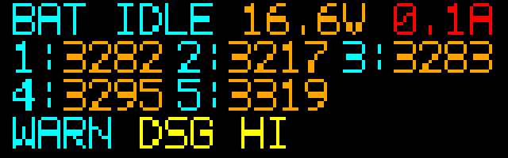
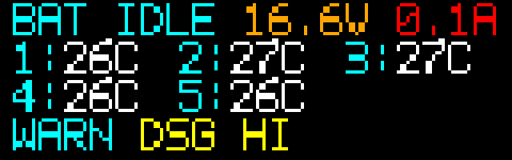

# 智能电池详情页功能设计（方向键向下）

本设计描述从仪表盘按一次“方向键 ↓”进入的智能电池详情页（BattDetail）的目标、数据来源、像素级布局与接口建议。本版方案取代旧的“温度占用第 4 行 + 电芯闪烁”设计，解决最后一行内容溢出问题，并增加分节温度与告警显示。

## 目标与范围

- 目标：
  - 在 160×50 像素屏幕内清晰展示电池充/放状态、分节电压、分节温度及关键告警；
  - 在不增加信息密度的前提下，避免任何一行文字溢出屏幕；
  - 去除电芯电压闪烁，仅通过颜色高亮均衡电芯。
- 范围：仅 UI 与输入流转设计；不改动硬件驱动与充放电控制策略。

## 数据与来源

- 模式 / 包电压 / 包电流：
  - 来源：现有主控字段（`BQ76920 → STM32 → ESP32`），`IBAT` 为 BQ76920 分流电流；
  - UI 侧按 `Option` 处理：读数缺失时显示 `--`。
- 分节电压：
  - 来源：BQ76920 逐节 mV，逻辑上支持 5 节；
  - UI 接口：`cells_mv: [Option<u16>; 5]`。
- 分节温度：
  - 物理：4 个 NTC，分布在相邻两节之间，可推测 5 节电芯表面温度；
  - 推荐在 STM32/ESP32 上游侧完成 NTC → 电芯温度的插值/映射；UI 只消费结果；
  - UI 接口：`cells_temp_c: [Option<i16>; 5]`（单位 ℃，-99～199，缺失为 `None`）；
  - 实际实现可复用 `smart-battery-ntc-temp-notes.md` 中的温度通路与哨兵值约定。
- 均衡节号：
  - 来源：智能电池 `STATE_FLAGS` 中的 “Balancing active” 标志 + 最高电压单节索引；
  - UI 接口：`balancing_index: Option<u8>`（1 基索引，无均衡时为 `None`）。
- 温度告警：
  - 来源：STM32 暴露的 `TEMP_STATUS`（参见 `TempFaultFlags` 结构）；
  - UI 侧从 `TempFaultFlags` 归一化为 1 个短告警代码，用于第 4 行。

刷新节奏与仪表盘一致：UI 任务约 2 Hz 更新一次 BattDetail 数据与重绘一帧。

## UI 布局（160×50，7×10 点阵，基线 y = 1 + n×12）

整体沿用 `ui-spec.md` 的 8×12 字符网格与安全边距（左右 4px、上下 1px），视为约 19 列 × 4 行的等宽布局。

### 行 1：包状态与总电参

文本形态：

```text
BAT <CHG|DSG|IDLE> <VV.VV>V <II.I>A
```

- `BAT` 与状态文本使用 `CYAN`；
- 包电压使用 `fmt_voltage`（专色 `ORANGE`）；
- 包电流使用 `fmt_current`（专色 `RED`）；
- 任一数值缺失时显示 `--` 并降为 `GRAY`；
- 该行与旧版一致，无需改动。

### 行 2–3：电芯区（电压 / 温度轮播）

电芯区采用固定的 3 列布局，每列宽度为 `6` 个字符格，并在列与列之间插入「半格」（4px）空隙：

- 第一列起点在字符格 0；
- 第二列起点 = 第一列起点 + 6 格宽度 + 0.5 格空隙；
- 第三列起点 = 第二列起点 + 6 格宽度 + 0.5 格空隙；

这样在 160px 宽度内仍能满足左右 4px 安全边距，不会触碰边框。

- 标签：`<n>:` 占 2 格，颜色 `CYAN`；
- 数值：占最多 4 格，右对齐；
- 每两列之间额外留出的半格空白用于视觉分隔，对应你实机截图里的“红色小三角”标的间距。

行号与电芯映射：

- 行 2：电芯 1–3；
- 行 3：电芯 4–5（第 3 槽留空）。

电芯区有两种“帧”，按 2 秒节奏轮播。

#### 1. 电压帧（CellsFrame::Voltage）

示例：

```text
1:3240 2:3217 3:3283
4:3295 5:3319
```

规则：

- 数值格式：`<mV>`，例 `3283` 表示 `3283 mV`；
- 颜色：
  - 有效读数 → `ORANGE`；
  - 缺失 → 显示 `--`，颜色 `GRAY`；
  - `balancing_index` 命中的电芯 → 数值改为 `YELLOW`（仅颜色变化，不闪烁）。

#### 2. 温度帧（CellsFrame::Temp）

示例：

```text
1:26C 2:27C 3:27C
4:26C 5:26C
```

规则：

- 几何布局与电压帧完全相同（起始列与列宽不变），保证轮播时无水平抖动；
- 数值格式：`<n>:<TT>C`，`TT` 为整度，范围 `-99`～`199`：
  - 显示上复用通用温度格式：数字 + 2×2 度点 + `C` 字形；
  - 有效温度 → 数字与 `C` 使用 `WHITE`；
  - 缺失 → 显示 `--`，颜色 `GRAY`，不绘制度点；
- 温度数据由 `cells_temp_c` 提供（上游负责 4 NTC → 5 电芯的映射），UI 不参与插值算法；
- 若某一电芯温度缺失，但相邻 NTC 仍有数据，上游可选择回退为邻近电芯温度，UI 不区分来源。

#### 3. 轮播节奏

- UI 任务每约 500 ms 更新一次 BattDetail 数据；
- `CellsFrame` 状态每累计 2 秒翻转一次（4 个 UI 周期）：
  - `Voltage → Temp → Voltage → …`；
  - 即在 2 秒内至少渲染 2 帧相同内容，避免抖动。
- 轮播状态应属于 UI 内部状态机，不通过 `BattDetailData` 结构对外暴露。

### 行 4：告警行（WARN）

文本形态：

```text
WARN <code>
```

规则：

- 标签 `WARN` 占 4 个字符格，颜色 `CYAN`；
- 第 5 格起显示 1 个短告警代码，最大长度约 10 字符，保证不越界；
- 建议告警代码与优先级：
  - `DSG HI`（放电高温）；
  - `CHG HI`（充电高温）；
  - `TEMP LO`（温度过低）；
  - `OVP`（过压）；
  - `UVP`（欠压）；
- 当多种告警同时存在时，只显示优先级最高的一项，例如：
  - `DSG HI > CHG HI > TEMP LO > OVP > UVP`；
- 告警着色：
  - 预警（接近阈值）→ `YELLOW`；
  - 严重故障（已触发保护或降额）→ `RED`；
  - 无告警 → 显示 `--`，颜色 `GRAY`。

示例像素稿（放大 4× 展示）：




## 均衡显示策略

- 仅使用颜色高亮表示均衡，无闪烁：
  - 电压帧：`balancing_index` 命中电芯的电压数值颜色为 `YELLOW`，其他正常电芯保持 `ORANGE`；
  - 温度帧：所有有效温度始终使用 `WHITE`，即使处于均衡中也不改变颜色；
  - 缺失数据仍使用 `GRAY` 显示占位符 `--`。
- 这样一来，电芯区完全静态，无 on/off 闪烁；眼睛只需在电压帧中捕捉黄色数字即可判断当前均衡节。

## 交互与状态机

- 屏幕状态：`Dashboard ↔ BattDetail`：
  - `Down`：Dashboard → BattDetail；
  - `Up`：BattDetail → Dashboard；
  - 其他按键行为与仪表盘一致，由上层按键状态机决定。
- BattDetail 内部状态：
  - `cells_frame: Voltage | Temp`，按 2 秒节奏轮播；
  - `balancing_index` 与 `cells_mv`、`cells_temp_c` 一起随 UI 刷新更新。

## 渲染接口（建议目标）

UI 与上层逻辑之间建议以以下数据结构交互（与实际实现的小差异可在代码侧适配）：

- `CellsFrame`（仅在 UI 内部使用，可选是否对外暴露）：

```rust
enum CellsFrame {
    Voltage,
    Temp,
}
```

- `BattDetailData`：

```rust
pub struct BattDetailData {
    pub mode: Mode,
    pub pack_v_mv: Option<u32>,
    /// Pack current magnitude in mA (direction由 `mode` 推断)。
    pub pack_i_ma: Option<u32>,
    /// 1 基电芯 1–5 的电压（mV）。
    pub cells_mv: [Option<u16>; 5],
    /// 1 基电芯 1–5 的表面温度（℃，由 4 NTC 推算）。
    pub cells_temp_c: [Option<i16>; 5],
    /// 当前被均衡电芯编号（1–5），无均衡时为 None。
    pub balancing_index: Option<u8>,
    /// TEMP_STATUS 解码结果，用于行 4 告警文案。
    pub temp_fault: Option<TempFaultFlags>,
}
```

渲染入口保持单帧纯函数风格：

```rust
fn render_batt_detail_once<SPI, CS, DC>(
    spi: &mut SPI,
    cs: &mut CS,
    dc: &mut DC,
    model: &BattDetailData,
) -> Result<(), SPI::Error>
where
    SPI: SpiBus<u8>,
    CS: OutputPin,
    DC: OutputPin,
{ /* ... */ }
```

其中：

- `CellsFrame` 的电压/温度轮播由 UI 任务内部状态机控制；`BattDetailData` 不负责存储该状态；
- 告警代码可由 `temp_fault` 与其他 pack 状态位共同推导，在渲染函数中本地格式化为短字符串。

## 容错、性能与验收要点

- 容错：
  - 任意电压/温度缺失时显示 `--` 且使用 `GRAY`；
  - `balancing_index` 为无效值或超出 1–5 时，UI 视为无均衡（不高亮）；
  - 告警行在数据完全缺失或异常时显示 `WARN --`。
- 性能：
  - 保持全屏重绘 ≤ 10 fps；优先采用按行脏矩形刷新；
  - 不新增字形，复用现有 7×10 点阵与颜色常量。
- 验收：
  - 任意合法输入下，四行文本均在 `≤160×50` 范围内，无截断或重叠；
  - 电压帧与温度帧在同一电芯位置的起始列完全一致，轮播时画面不“抖”；
  - 均衡电芯以稳定的 `YELLOW` 强调，无闪烁；
  - 告警行在存在高温/欠温/过压/欠压之一时能够给出清晰、唯一的短码提示。
