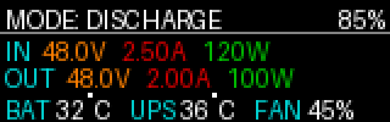
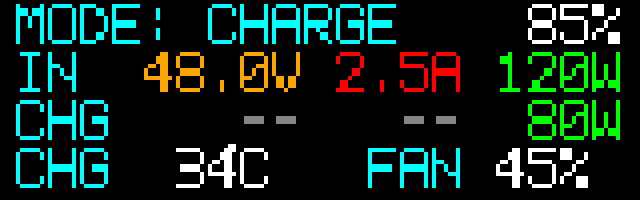
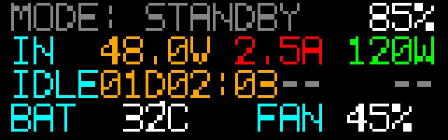

# UPS120 屏幕显示规范（v1）

适用硬件：160×50 像素、16 位 RGB565 屏。

本规范定义：坐标系、色彩与文本规范、公共组件、启动屏行为、仪表盘布局与数据格式、故障显示规则与更新频率。目的是在受限像素与带宽下保证一致、清晰、可靠的显示。喵～

## 1. 屏幕与坐标

- 分辨率：`160(w) × 50(h)` 像素，坐标原点在左上角。
- 颜色：RGB565（`rrrrr gggggg bbbbb`）。推荐调色板见下。
- 安全边距：左右各 `4px`，上下各 `1px`；在 `1 + 4×12 = 49` 的排版中仍保留 1px 余量用于呼吸空间。
- 建议基准网格：`8×12` 像素字符格（宽度 8px、行高 12px，包括 7×10 字形与 2px 行距），全屏可视为约 `20 列 × 4 行` 的等宽布局。

## 2. 调色板与语义颜色（含元素色常量）

为减少抖动与提升可读性，限定小而稳定的色表：

- `BLACK`  0x0000 背景、遮罩
- `WHITE`  0xFFFF 主要文字
- `GRAY`   0x8410 次要文字/分隔线
- `GREEN`  0x07E0 正常/进度条填充、功率（Power）
- `YELLOW` 0xFFE0 警告（高温、接近阈值）
- `ORANGE` 0xFD20 电压（Voltage）
- `RED`    0xF800 故障/禁止、电流（Current）
- `CYAN`   0x07FF 数据标题与单位点缀

色彩使用规则：
- 背景始终为黑色（启动屏、仪表盘一致）。
- 标题/标签使用 `CYAN`；单位默认 `WHITE`。
- 进度条填充 `GREEN`，异常改为 `RED`。
- 警戒区间（如温度接近上限）可将数值着色为 `YELLOW`。
- 元素专色（仪表盘）：
  - 电压（V）→ `ORANGE`
  - 电流（A）→ `RED`
  - 功率（W）→ `GREEN`

## 3. 字体与排版

- 字体：等宽 `7×10` 点阵，字符格宽 `8px`、行高 `12px`（其中 2px 作为行间距/前导）；示意图与固件渲染均使用同一套位图字形，禁用抗锯齿。
- “℃”绘制：在 `C` 前方 3px 位置放置一个 `2×2` 的度数点（顶边位于基线之上 1px），再绘制 `C` 字形，确保像素对齐。
- 数值与单位必须紧邻：如 `48.0V`、`120W`、`32C`、`45%`。
- 对齐：
  - 标签左对齐，数值列右对齐/定宽；
  - 四行均使用 `y = 1 + n×12` 的基线，保证跨模式切换时不抖动。
- 省略或无数据统一显示为 `--`，与标签留一个字符格间距。
- 单元宽度：所有文字均落在 `8px` 宽度的字符单元上，默认列宽如下（括号内为示例）：
  - 标签列：`4` 单元（`IN␠␠`，两格空白确保对齐）。
  - 电压列：`5` 单元（`12.3V` / `9.87V` / `>99V`）。
  - 电流列：`4` 单元（`2.5A` / `12A` / `>99A`）。
  - 功率列：`4` 单元（`120W`，>999W 时显示 `999W`）。
  - `SoC`：`4` 单元右对齐（` 85%` / `100%`）。
  - 温度：`4` 单元（`-9C` / `105C`，附带 2×2 度数点）。
  - 风扇：`4` 单元（` 45%` / `100%`）。

### 3.1 字段字符宽度约束

| 项目           | 字符宽度 | 说明 |
|----------------|----------|------|
| `MODE: ` 标签  | 6        | 固定文案，冒号后带一个空格。 |
| `IN` 标签        | 4        | 文案后补足 2 个空格（`"IN  "`），用于对齐行内数值。 |
| `OUT`/`CHG` 标签 | 4        | 文案后保留 1 个空格即可（`"OUT "`、`"CHG "`）；无需额外对齐。 |
| `SoC` 电量     | 4        | 右对齐显示 ` 85%`；`100%` 时占 4 字符。 |
| 电压           | 5        | 常规 `12.3V` ~ `21.0V`，格式 `xx.xV`；`≥100V` 时退化为 `>99V`。 |
| 电流           | 4        | `<10A` 用 `x.xA`；`10A~99A` 用整数（` 12A`）；`≥100A` 显示 `>99A`。 |
| 功率           | 4        | `xxxW`；`≥1000W` 时夹止为 `999W`。 |
| 温度           | 4        | `32C` / `-5C` / `105C`，取值范围 `-99`～`199`；度点独立 2×2。 |
| 风扇转速       | 4        | ` 45%` / `100%`，右对齐；无数据时显示 `--%`。 |

所有行内间隔默认 1 个字符单元（8px），仅在需要强调分隔时再留出额外空白，但严禁与数值列重叠。

## 4. 公共组件

### 4.1 分隔线（可选）
- 颜色 `GRAY`，`1px` 水平线，用于分区但不喧宾夺主。

### 4.2 进度条（启动屏使用）
- 外框：宽 `152px`、高 `8px`，居中放置，左右/上下各留安全边距。
- 填充：`GREEN` 自左向右增长；错误态保持在当前进度并改为 `RED`。
- 百分比文本（可选）：在进度条上方居中显示，如 `INIT 72%`。

## 5. 启动屏（Boot）

用途：硬件上电后硬件自检与外设初始化阶段的显示。背景黑色。

示意图（像素网格放大显示；已调整避免文本与进度条重叠）：


显示元素：
- 标题（第一行居中）：`UPS120` 或项目名（白色）。
- 子标题（可选，次要信息）：`System Boot` 或版本号（灰色）。
- 进度条：见 4.2。
- 状态行（底部或进度条上方一行）：显示当前步骤名称（如 `Probe INA226`、`Init SC8815` 等）。

行为流程：
1. 上电进入启动屏，进度自 `0%` 增长至 `100%`。
2. 每完成一个外设/模块自检或初始化步骤，进度递增并更新状态行。
3. 若所有步骤成功（100%）：
   - 进度条填满后停留 `300–600ms`，自动切换至仪表盘。
4. 若任一步骤失败（设备故障）：
   - 停留在启动屏，不跳转。
   - 进度条颜色切换为 `RED`；
   - 状态区域列出具体故障硬件（见下“故障显示”）。

故障显示规范：
- 标题：`Hardware Fault`（红色）。
- 列表逐条显示（白色标签 + 红色状态）：
  - `Battery MCU (STM32L051): FAIL`
  - `SC8815: FAIL`
  - `TCA6408A@0x20: FAIL`
  - `INA226: FAIL`
- 多故障时按优先级排序（上至下）：`Battery MCU > SC8815 > INA226 > TCA6408A > 其他`。
- 若存在可恢复性建议（例如松脱/重插），可在底部灰色小字提示；不做交互决策（按键处理由上层定义）。

数据对接（建议）：启动阶段各子系统上报 `step_id`、`step_name`、`ok/err`，UI 侧映射进度百分比；错误时附 `fault_list`。

## 6. 仪表盘（Dashboard）

作为主屏幕常驻界面，显示系统状态与关键电参。采用“四行”布局，提升在 160×50 下的可读性与留白。第一行右上角“电池电量区域”轮播显示：

- 电量百分比（`SoC %`）
- 电池包电压（格式 `xx.xV`，示例 `16.1V`）

轮播节奏默认每 2 秒切换一次；当任一数据不可用时显示 `--` 并继续轮播。

示意图（像素网格放大显示；四行布局，元素着色且控宽不越界）：

- 放电（第三行显示 SC8815 测得的 OUT 三元组）：
  
  

- 充电（第三行显示 CHG 功率）：
  
  

- 待机（第三行显示自上次放电结束的时长）：
  
  

### 6.1 显示内容（必选）
- 工作模式（文本）：`Standby` / `Charge` / `Discharge`。
- 输入电压（V）。
- 输入电流（A）。
- 输入功率（W）。
- 充电功率（W，非充电则 `--`）。
- 输出电压（V）。
- 输出电流（A）。
- 输出功率（W）。
- 电池温度（℃，显示为 `BAT xx℃`）。
- UPS 温度（℃，来自 SC8815 的 ADIN，显示为 `UPS xx℃`）。
- 风扇转速（%，按逻辑占空比换算）。

### 6.2 四行布局（示意）

```
┌──────────────────────────────────────────────────────────────┐
│ MODE: DISCHARGE                                  85%        │  ← 行1（状态+右上角电量区，右对齐；轮播 % 与 V）
├──────────────────────────────────────────────────────────────┤
│ IN  48.0V 2.5A 120W                                        │  ← 行2（输入三元组：标签 4 单元 + 5/4/4 列）
│ OUT 48.0V 2.0A 100W                                        │  ← 行3（放电：输出三元组同列宽）
│ BAT    32C   FAN  45%                                      │  ← 行4（温度槽位轮播 + FAN，列宽 4/4/3/4）
└──────────────────────────────────────────────────────────────┘
```

说明：
- 行1：左侧 `MODE: <Standby|Charge|Discharge>`；右上角电量区轮播显示 `SoC %` 与电池电压 `xx.xV`。`SoC` 按阈值变色（≤30% `YELLOW`，≤15% `RED`）；显示电压时使用电压专色 `ORANGE`。
- 行2：输入三元组（V/A/W，专色显示，见 6.4）。
- 行3：按模式动态显示：
  - 充电时：显示 `CHG <功率W>`（功率数字用 `GREEN`），其余两列以 `--` 灰显。
  - 待机时：显示 `IDLE <时长>`，时长格式 `DDdHH:MM`（例如 `01d02:03`），未使用列显示 `--`。
  - 放电时：显示 `OUT <V/A/W>`，数值来自 SC8815 的测量。
- 行4：温度/风扇信息：`BAT`（电池）、`UPS`（UPS/SC8815 ADIN）、`FAN`（百分比）。
- 各行基线为 `y = 1 + 行号×12`（0-index），字符上边缘对齐，行间保持 2px 呼吸空间。
- 行4温度轮播：每帧在 `BAT` 与 `UPS` 之间切换，仅展示一个温度槽位，右侧固定 `FAN` 列；示例固件以 2 秒刷新一次，可按需求缩短至 1 秒；当任一温度不可用时显示 `--` 并继续轮播。

两列对齐与等宽：
- 标签列（`MODE/IN/OUT/CHG/IDLE/BAT/UPS/FAN`）左对齐，数值列右对齐；单位紧贴数值。
- 固定列宽：标签 `4` 单元 → 电压 `5` 单元 → 电流 `4` 单元 → 功率 `4` 单元，列间默认 `1` 单元间隔；右上角电量区：
  - 展示 `SoC %` 时占 `4` 单元（例如 ` 85%`）。
  - 展示电压时占 `5` 单元（例如 `16.1V`）。
  - 布局需保证右上角 5 单元不与左侧 `MODE` 文本发生重叠；当空间不足时应截断 `MODE` 文本末尾字符以避免覆盖（优先保证电量区完整显示）。
- `IN` 等标签不足 4 字符，通过尾部空白补齐，确保电压列起始对齐；数值在列内右对齐，空白自然留在左侧。
- 行4 使用 `4/4/3/4` 单元布局（温标签/温值/FAN 标签/FAN 数值），与上方三行保持同一字符网格。
- 占位符统一为 `--`，渲染时使用 `GRAY`；`FAN` 无可用数据时显示 `--%`。

### 6.3 数值格式与单位
- 电压（V）：
  - `<10V`：`x.xxV`，保留两位小数（如 `9.87V`）。
  - `10V–99.9V`：`xx.xV`，保留一位小数（如 `48.0V`）。
  - `≥100V`：显示 `>99V`，提示超出量程。
- 电流（A）：
  - `<10A`：`x.xA`，保留一位小数（如 `2.5A`）。
  - `10A–99A`：整数右对齐（` 12A`），不带小数。
  - `≥100A`：显示 `>99A`。
- 功率（W）：四舍五入到整数，右对齐显示 `xxxW`；超过 `999W` 时夹止为 `999W`。
- 温度（℃）：整数（`32C` / `-5C` / `105C`），附带 2×2 度数点；数据范围限制在 `-99`～`199`℃。
- 风扇（%）：整数右对齐（` 45%` / `100%`）。
- 未知/无效：统一输出 `--`（温度 `--C`，风扇 `--%`，其他列 `--`）。

### 6.4 着色规则（含元素专色）
- `MODE`：`Charge` 用 `CYAN`，`Discharge` 用 `WHITE`，`Standby` 用 `GRAY`。
- 元素专色：电压 `ORANGE`、电流 `RED`、功率 `GREEN`（数字部分用专色，单位可留 `WHITE`）。
- `SoC` 电量：默认 `WHITE`；`≤30%` 用 `YELLOW`，`≤15%` 用 `RED`。
- 温度：
  - `≥ 45C` 着 `YELLOW`；
  - `≥ 55C` 着 `RED`。
- 风扇：`≥ 90%` 用 `YELLOW` 提醒高负载。

### 6.5 更新频率与去抖
- 刷新周期：`5–10 Hz` UI 帧（避免 1 像素闪烁）。
- 数值更新：
  - 电压/功率使用 2–4 样本滑动平均；
  - 温度/风扇可直接刷新；
  - 当模式切换发生时，立即生效且清零相关缓存，避免“阴影值”。
- `CHG` 的判定：处于放电或待机则显示 `--`；处于充电才显示数值。

## 7. 故障与降级显示（运行中）

运行中若检测到故障（与启动阶段同类）：
- 在行1右侧以红色短标签提示：例如 `FAULT: INA226`。
- 若影响主数据可信度（如输入计量丢失），对应数值显示 `--` 且置灰（`GRAY`）。
- 严重故障（如控制器失联）可切回启动屏风格的“错误覆盖层”（半屏/全屏），由上层策略决定是否冻结 UI。

## 8. 数据来源与字段（接口建议）

为便于上位逻辑与 UI 解耦，建议以结构化数据喂给 UI：

```json
{
  "mode": "Standby|Charge|Discharge",
  "soc_pct": 85,                          // 电池电量 0–100
  "input_voltage_mv": 48000,
  "input_current_ma": 2500,
  "input_power_mw": 120000,
  "charge_power_mw": 80000,               // 充电时用于第三行，非充电可为 null 或 0
  "output_voltage_mv": 48000,              // 放电时第三行 OUT 三元组（SC8815 测得/估算）
  "output_current_ma": 2000,
  "output_power_mw": 100000,
  "battery_temp_c": 32,
  "charger_temp_c": 34,                    // 智能电池充电器模块温度
  "ups_temp_c": 36,                        // SC8815 ADIN 转换后的摄氏度
  "fan_duty_pct": 45,
  "idle_since_last_discharge_s": 93780,    // 待机：用于格式化为 01d02:03
  "faults": ["SC8815", "INA226"],
  "boot": {                                // 仅启动阶段
    "step_id": 3,
    "step_name": "Init SC8815",
    "progress_pct": 72
  }
}
```

字段到显示的映射：
- `*_mv` → `V`（见 6.3 的小数位规则）。
- `*_mw` → `W`（整瓦）。
- `*_ma` → `A`（见 6.3 的小数位规则）。
- `fan_duty_pct` 直接百分比显示（0–100）。
- `soc_pct` 显示在第一行右上角（阈值着色见 6.4）。
- `idle_since_last_discharge_s` → `DDdHH:MM`（舍去秒）。
- `faults` 非空触发运行中故障提示；启动阶段非空即卡在启动屏。

## 9. 性能与带宽建议

- 全屏重绘上限：建议 ≤ 10 fps；优先“脏矩形”局部重绘（如数值区域）。
- 文本绘制缓存：常用标签（`IN/OUT/CHG/BTEMP/UTEMP/FAN/MODE`）预渲染到位图，减少合成开销。
- 进度条与数值采用整数像素运算；避免亚像素计算成本。

## 10. 质量基线与可测试性

- 文本与数字在极值下不重叠、不截断：
  - 电压最大 `999.9V`，功率最大 `9999W`，温度最大 `999C`，均应在列宽内展示。
- 当值非法（NaN、溢出、CRC 错误），显示 `--` 并在 6.4 的规则下可染色提示。
- 启动屏多故障列表在 160×50 下至少显示 3 条；溢出时滚动或分页（二选一，由实现决定）。

---

附：标签与缩写清单（等宽英字母，避免中日韩字库负担）：
- `MODE`、`IN`、`OUT`、`CHG`、`BTEMP`、`UTEMP`、`FAN`

这份规范已经将显示尺寸、颜色、排版、状态机与数据接口一并约束好啦。若主人有品牌标题或更具体的配色喜好，告诉心羽我就替你微调到位喵。
