# STM32L051C8 — Pages 1–50

# **STM32L051x6 STM32L051x8**

#### Access line ultra-low-power 32-bit MCU Arm [®] -based Cortex [®] -M0+, up to 64 KB Flash, 8 KB SRAM, 2 KB EEPROM, ADC

**Datasheet**                                      - **production data**

##### **Features**

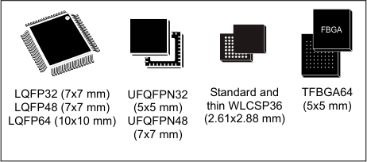

- Ultra-low-power platform

–
1.65 V to 3.6 V power supply

–  40 to 125 °C temperature range

–
0.27 µA Standby mode (2 wakeup pins)

–
0.4 µA Stop mode (16 wakeup lines)

–
0.8 µA Stop mode + RTC + 8-Kbyte RAM
retention

–
88 µA/MHz in Run mode

–
3.5 µs wakeup time (from RAM)

–
5 µs wakeup time (from Flash memory)

- Core: Arm [®] 32-bit Cortex [®] -M0+ with MPU

–
From 32 kHz up to 32 MHz max.
– 0.95 DMIPS/MHz

- Memories

–
Up to 64-Kbyte Flash memory with ECC

–
8-Kbyte RAM

–
2 Kbytes of data EEPROM with ECC

–
20-byte backup register

–
Sector protection against R/W operation

- Up to 51 fast I/Os (45 I/Os 5V tolerant)

- Reset and supply management

–
Ultra-safe, low-power BOR (brownout reset)
with 5 selectable thresholds

–
Ultra-low-power POR/PDR

–
Programmable voltage detector (PVD)

- Clock sources

–
1 to 25 MHz crystal oscillator
– 32 kHz oscillator for RTC with calibration

–
High speed internal 16 MHz factory-trimmed RC
(+/- 1%)

–
Internal low-power 37 kHz RC

–
Internal multispeed low-power 65 kHz to
4.2 MHz RC

– PLL for CPU clock

- Pre-programmed bootloader

–
USART, SPI supported

- Development support

–
Serial wire debug supported

- Rich Analog peripherals

–
12-bit ADC 1.14 Msps up to 16 channels (down
to 1.65 V)

–
2x ultra-low-power comparators (window mode
and wake up capability, down to 1.65 V)

- 7-channel DMA controller, supporting ADC, SPI,
I2C, USART, Timers

- 7x peripheral communication interfaces

–
2x USART (ISO 7816, IrDA), 1x UART (low
power)

–
Up to 4x SPI 16 Mbits/s

–
2x I2C (SMBus/PMBus)

- 9x timers: 1x 16-bit with up to 4 channels, 2x 16-bit
with up to 2 channels, 1x 16-bit ultra-low-power
timer, 1x SysTick, 1x RTC, 1x 16-bit basic, and 2x
watchdogs (independent/window)

- CRC calculation unit, 96-bit unique ID

- All packages are ECOPACK2
**Table 1. Device summary**

|Reference|Part number|
|---|---|
|STM32L051x6|STM32L051C6, STM32L051K6, STM32L051R6, STM32L051T6|
|STM32L051x8|STM32L051C8, STM32L051K8, STM32L051R8, STM32L051T8|

October 2019 DS10184 Rev 10 1/133

This is information on a product in full production.

_[www.st.com](http://www.st.com)_

--- end of page=0 ---

**Contents** **STM32L051x6 STM32L051x8**

## **Contents**

**1** **Introduction . . . . . . . . . . . . . . . . . . . . . . . . . . . . . . . . . . . . . . . . . . . . . . . . 9**

**2** **Description . . . . . . . . . . . . . . . . . . . . . . . . . . . . . . . . . . . . . . . . . . . . . . . . 10**

2.1 Device overview . . . . . . . . . . . . . . . . . . . . . . . . . . . . . . . . . . . . . . . . . . . . .11

2.2 Ultra-low-power device continuum . . . . . . . . . . . . . . . . . . . . . . . . . . . . . . 13

**3** **Functional overview . . . . . . . . . . . . . . . . . . . . . . . . . . . . . . . . . . . . . . . . 14**

3.1 Low-power modes . . . . . . . . . . . . . . . . . . . . . . . . . . . . . . . . . . . . . . . . . . 14

3.2 Interconnect matrix . . . . . . . . . . . . . . . . . . . . . . . . . . . . . . . . . . . . . . . . . . 18

3.3 Arm® Cortex®-M0+ core with MPU . . . . . . . . . . . . . . . . . . . . . . . . . . . . . 19

3.4 Reset and supply management . . . . . . . . . . . . . . . . . . . . . . . . . . . . . . . . 20

3.4.1 Power supply schemes . . . . . . . . . . . . . . . . . . . . . . . . . . . . . . . . . . . . . 20

3.4.2 Power supply supervisor . . . . . . . . . . . . . . . . . . . . . . . . . . . . . . . . . . . . 20

3.4.3 Voltage regulator . . . . . . . . . . . . . . . . . . . . . . . . . . . . . . . . . . . . . . . . . . 21

3.5 Clock management . . . . . . . . . . . . . . . . . . . . . . . . . . . . . . . . . . . . . . . . . 21

3.6 Low-power real-time clock and backup registers . . . . . . . . . . . . . . . . . . . 24

3.7 General-purpose inputs/outputs (GPIOs) . . . . . . . . . . . . . . . . . . . . . . . . . 24

3.8 Memories . . . . . . . . . . . . . . . . . . . . . . . . . . . . . . . . . . . . . . . . . . . . . . . . . 25

3.9 Boot modes . . . . . . . . . . . . . . . . . . . . . . . . . . . . . . . . . . . . . . . . . . . . . . . 25

3.10 Direct memory access (DMA) . . . . . . . . . . . . . . . . . . . . . . . . . . . . . . . . . 26

3.11 Analog-to-digital converter (ADC) . . . . . . . . . . . . . . . . . . . . . . . . . . . . . . 26

3.12 Temperature sensor . . . . . . . . . . . . . . . . . . . . . . . . . . . . . . . . . . . . . . . . . 26

3.12.1 Internal voltage reference (V REFINT ) . . . . . . . . . . . . . . . . . . . . . . . . . . . 27

3.13 Ultra-low-power comparators and reference voltage . . . . . . . . . . . . . . . . 27

3.14 System configuration controller . . . . . . . . . . . . . . . . . . . . . . . . . . . . . . . . 28

3.15 Timers and watchdogs . . . . . . . . . . . . . . . . . . . . . . . . . . . . . . . . . . . . . . . 28

3.15.1 General-purpose timers (TIM2, TIM21 and TIM22) . . . . . . . . . . . . . . . . 28

3.15.2 Low-power Timer (LPTIM) . . . . . . . . . . . . . . . . . . . . . . . . . . . . . . . . . . . 29

3.15.3 Basic timer (TIM6) . . . . . . . . . . . . . . . . . . . . . . . . . . . . . . . . . . . . . . . . . 29

3.15.4 SysTick timer . . . . . . . . . . . . . . . . . . . . . . . . . . . . . . . . . . . . . . . . . . . . . 29

3.15.5 Independent watchdog (IWDG) . . . . . . . . . . . . . . . . . . . . . . . . . . . . . . . 29

3.15.6 Window watchdog (WWDG) . . . . . . . . . . . . . . . . . . . . . . . . . . . . . . . . . 29

2/133 DS10184 Rev 10

--- end of page=1 ---

**STM32L051x6 STM32L051x8** **Contents**

3.16 Communication interfaces . . . . . . . . . . . . . . . . . . . . . . . . . . . . . . . . . . . . 30

3.16.1 I2C bus . . . . . . . . . . . . . . . . . . . . . . . . . . . . . . . . . . . . . . . . . . . . . . . . . 30

3.16.2 Universal synchronous/asynchronous receiver transmitter (USART) . . 31

3.16.3 Low-power universal asynchronous receiver transmitter (LPUART) . . . 31

3.16.4 Serial peripheral interface (SPI)/Inter-integrated sound (I2S) . . . . . . . . 32

3.17 Cyclic redundancy check (CRC) calculation unit . . . . . . . . . . . . . . . . . . . 32

3.18 Serial wire debug port (SW-DP) . . . . . . . . . . . . . . . . . . . . . . . . . . . . . . . . 32

**4** **Pin descriptions . . . . . . . . . . . . . . . . . . . . . . . . . . . . . . . . . . . . . . . . . . . 33**

**5** **Memory mapping . . . . . . . . . . . . . . . . . . . . . . . . . . . . . . . . . . . . . . . . . . . 45**

**6** **Electrical characteristics . . . . . . . . . . . . . . . . . . . . . . . . . . . . . . . . . . . . 46**

6.1 Parameter conditions . . . . . . . . . . . . . . . . . . . . . . . . . . . . . . . . . . . . . . . . 46

6.1.1 Minimum and maximum values . . . . . . . . . . . . . . . . . . . . . . . . . . . . . . . 46

6.1.2 Typical values . . . . . . . . . . . . . . . . . . . . . . . . . . . . . . . . . . . . . . . . . . . . 46

6.1.3 Typical curves . . . . . . . . . . . . . . . . . . . . . . . . . . . . . . . . . . . . . . . . . . . . 46

6.1.4 Loading capacitor . . . . . . . . . . . . . . . . . . . . . . . . . . . . . . . . . . . . . . . . . 46

6.1.5 Pin input voltage . . . . . . . . . . . . . . . . . . . . . . . . . . . . . . . . . . . . . . . . . . 46

6.1.6 Power supply scheme . . . . . . . . . . . . . . . . . . . . . . . . . . . . . . . . . . . . . . 47

6.1.7 Current consumption measurement . . . . . . . . . . . . . . . . . . . . . . . . . . . 47

6.2 Absolute maximum ratings . . . . . . . . . . . . . . . . . . . . . . . . . . . . . . . . . . . . 48

6.3 Operating conditions . . . . . . . . . . . . . . . . . . . . . . . . . . . . . . . . . . . . . . . . 50

6.3.1 General operating conditions . . . . . . . . . . . . . . . . . . . . . . . . . . . . . . . . . 50

6.3.2 Embedded reset and power control block characteristics . . . . . . . . . . . 52

6.3.3 Embedded internal reference voltage . . . . . . . . . . . . . . . . . . . . . . . . . . 53

6.3.4 Supply current characteristics . . . . . . . . . . . . . . . . . . . . . . . . . . . . . . . . 54

6.3.5 Wakeup time from low-power mode . . . . . . . . . . . . . . . . . . . . . . . . . . . 65

6.3.6 External clock source characteristics . . . . . . . . . . . . . . . . . . . . . . . . . . . 66

6.3.7 Internal clock source characteristics . . . . . . . . . . . . . . . . . . . . . . . . . . . 70

6.3.8 PLL characteristics . . . . . . . . . . . . . . . . . . . . . . . . . . . . . . . . . . . . . . . . 73

6.3.9 Memory characteristics . . . . . . . . . . . . . . . . . . . . . . . . . . . . . . . . . . . . . 74

6.3.10 EMC characteristics . . . . . . . . . . . . . . . . . . . . . . . . . . . . . . . . . . . . . . . . 75

6.3.11 Electrical sensitivity characteristics . . . . . . . . . . . . . . . . . . . . . . . . . . . . 77

6.3.12 I/O current injection characteristics . . . . . . . . . . . . . . . . . . . . . . . . . . . . 78

6.3.13 I/O port characteristics . . . . . . . . . . . . . . . . . . . . . . . . . . . . . . . . . . . . . . 79

6.3.14 NRST pin characteristics . . . . . . . . . . . . . . . . . . . . . . . . . . . . . . . . . . . . 83

DS10184 Rev 10 3/133

4

--- end of page=2 ---

**Contents** **STM32L051x6 STM32L051x8**

6.3.15 12-bit ADC characteristics . . . . . . . . . . . . . . . . . . . . . . . . . . . . . . . . . . . 84

6.3.16 Temperature sensor characteristics . . . . . . . . . . . . . . . . . . . . . . . . . . . . 89

6.3.17 Comparators . . . . . . . . . . . . . . . . . . . . . . . . . . . . . . . . . . . . . . . . . . . . . 90

6.3.18 Timer characteristics . . . . . . . . . . . . . . . . . . . . . . . . . . . . . . . . . . . . . . . 91

6.3.19 Communications interfaces . . . . . . . . . . . . . . . . . . . . . . . . . . . . . . . . . . 91

**7** **Package information . . . . . . . . . . . . . . . . . . . . . . . . . . . . . . . . . . . . . . . 100**

7.1 LQFP64 package information . . . . . . . . . . . . . . . . . . . . . . . . . . . . . . . . . 100

7.2 TFBGA64 package information . . . . . . . . . . . . . . . . . . . . . . . . . . . . . . . 104

7.3 LQFP48 package information . . . . . . . . . . . . . . . . . . . . . . . . . . . . . . . . . 107

7.4 UFQFPN48 package information . . . . . . . . . . . . . . . . . . . . . . . . . . . . . . .110

7.5 Standard WLCSP36 package information . . . . . . . . . . . . . . . . . . . . . . . .112

7.6 Thin WLCSP36 package information . . . . . . . . . . . . . . . . . . . . . . . . . . . .115

7.7 LQFP32 package information . . . . . . . . . . . . . . . . . . . . . . . . . . . . . . . . . .117

7.8 UFQFPN32 package information . . . . . . . . . . . . . . . . . . . . . . . . . . . . . . 120

7.9 Thermal characteristics . . . . . . . . . . . . . . . . . . . . . . . . . . . . . . . . . . . . . 123

7.9.1 Reference document . . . . . . . . . . . . . . . . . . . . . . . . . . . . . . . . . . . . . . 124

**8** **Ordering information . . . . . . . . . . . . . . . . . . . . . . . . . . . . . . . . . . . . . . 125**

**9** **Revision history . . . . . . . . . . . . . . . . . . . . . . . . . . . . . . . . . . . . . . . . . . 126**

4/133 DS10184 Rev 10

--- end of page=3 ---

**STM32L051x6 STM32L051x8** **List of tables**

## **List of tables**

Table 1. Device summary . . . . . . . . . . . . . . . . . . . . . . . . . . . . . . . . . . . . . . . . . . . . . . . . . . . . . . . . . . 1
Table 2. Ultra-low-power STM32L051x6/x8 device features and peripheral counts. . . . . . . . . . . . . 11
Table 3. Functionalities depending on the operating power supply range . . . . . . . . . . . . . . . . . . . . 15
Table 5. Functionalities depending on the working mode
(from Run/active down to standby) . . . . . . . . . . . . . . . . . . . . . . . . . . . . . . . . . . . . . . . . . . 16
Table 4. CPU frequency range depending on dynamic voltage scaling . . . . . . . . . . . . . . . . . . . . . . 16
Table 6. STM32L0xx peripherals interconnect matrix . . . . . . . . . . . . . . . . . . . . . . . . . . . . . . . . . . . 18
Table 7. Temperature sensor calibration values. . . . . . . . . . . . . . . . . . . . . . . . . . . . . . . . . . . . . . . . 27
Table 8. Internal voltage reference measured values. . . . . . . . . . . . . . . . . . . . . . . . . . . . . . . . . . . . 27
Table 9. Timer feature comparison. . . . . . . . . . . . . . . . . . . . . . . . . . . . . . . . . . . . . . . . . . . . . . . . . . 28
Table 10. Comparison of I2C analog and digital filters . . . . . . . . . . . . . . . . . . . . . . . . . . . . . . . . . . . . 30
Table 11. STM32L051x6/8 I [2] C implementation . . . . . . . . . . . . . . . . . . . . . . . . . . . . . . . . . . . . . . . . . 30
Table 12. USART implementation . . . . . . . . . . . . . . . . . . . . . . . . . . . . . . . . . . . . . . . . . . . . . . . . . . . 31
Table 13. SPI/I2S implementation . . . . . . . . . . . . . . . . . . . . . . . . . . . . . . . . . . . . . . . . . . . . . . . . . . . 32
Table 14. Legend/abbreviations used in the pinout table . . . . . . . . . . . . . . . . . . . . . . . . . . . . . . . . . . 37
Table 15. STM32L051x6/8 pin definitions . . . . . . . . . . . . . . . . . . . . . . . . . . . . . . . . . . . . . . . . . . . . . 38
Table 16. Alternate function port A . . . . . . . . . . . . . . . . . . . . . . . . . . . . . . . . . . . . . . . . . . . . . . . . . . . 43
Table 17. Alternate function port B . . . . . . . . . . . . . . . . . . . . . . . . . . . . . . . . . . . . . . . . . . . . . . . . . . . 44
Table 18. Voltage characteristics . . . . . . . . . . . . . . . . . . . . . . . . . . . . . . . . . . . . . . . . . . . . . . . . . . . . 48
Table 19. Current characteristics . . . . . . . . . . . . . . . . . . . . . . . . . . . . . . . . . . . . . . . . . . . . . . . . . . . . 49

Table 20. Thermal characteristics. . . . . . . . . . . . . . . . . . . . . . . . . . . . . . . . . . . . . . . . . . . . . . . . . . . . 49
Table 21. General operating conditions . . . . . . . . . . . . . . . . . . . . . . . . . . . . . . . . . . . . . . . . . . . . . . . 50
Table 22. Embedded reset and power control block characteristics. . . . . . . . . . . . . . . . . . . . . . . . . . 52
Table 23. Embedded internal reference voltage calibration values . . . . . . . . . . . . . . . . . . . . . . . . . . 53
Table 24. Embedded internal reference voltage. . . . . . . . . . . . . . . . . . . . . . . . . . . . . . . . . . . . . . . . . 53
Table 25. Current consumption in Run mode, code with data processing running from Flash. . . . . . 55
Table 26. Current consumption in Run mode vs code type,
code with data processing running from Flash . . . . . . . . . . . . . . . . . . . . . . . . . . . . . . . . . . 55
Table 27. Current consumption in Run mode, code with data processing running from RAM . . . . . . 57
Table 28. Current consumption in Run mode vs code type,
code with data processing running from RAM . . . . . . . . . . . . . . . . . . . . . . . . . . . . . . . . . . 57
Table 29. Current consumption in Sleep mode . . . . . . . . . . . . . . . . . . . . . . . . . . . . . . . . . . . . . . . . . 58
Table 30. Current consumption in Low-power run mode . . . . . . . . . . . . . . . . . . . . . . . . . . . . . . . . . . 59
Table 31. Current consumption in Low-power sleep mode . . . . . . . . . . . . . . . . . . . . . . . . . . . . . . . . 60
Table 32. Typical and maximum current consumptions in Stop mode . . . . . . . . . . . . . . . . . . . . . . . . 61
Table 33. Typical and maximum current consumptions in Standby mode . . . . . . . . . . . . . . . . . . . . . 62
Table 34. Average current consumption during Wakeup . . . . . . . . . . . . . . . . . . . . . . . . . . . . . . . . . . 62
Table 35. Peripheral current consumption in Run or Sleep mode . . . . . . . . . . . . . . . . . . . . . . . . . . . 63
Table 36. Peripheral current consumption in Stop and Standby mode . . . . . . . . . . . . . . . . . . . . . . . 64
Table 37. Low-power mode wakeup timings . . . . . . . . . . . . . . . . . . . . . . . . . . . . . . . . . . . . . . . . . . . 65
Table 38. High-speed external user clock characteristics. . . . . . . . . . . . . . . . . . . . . . . . . . . . . . . . . . 66
Table 39. Low-speed external user clock characteristics . . . . . . . . . . . . . . . . . . . . . . . . . . . . . . . . . . 67
Table 40. HSE oscillator characteristics . . . . . . . . . . . . . . . . . . . . . . . . . . . . . . . . . . . . . . . . . . . . . . . 68

Table 41. LSE oscillator characteristics . . . . . . . . . . . . . . . . . . . . . . . . . . . . . . . . . . . . . . . . . . . . . . . 69

Table 42. 16 MHz HSI16 oscillator characteristics . . . . . . . . . . . . . . . . . . . . . . . . . . . . . . . . . . . . . . . 70

Table 43. LSI oscillator characteristics . . . . . . . . . . . . . . . . . . . . . . . . . . . . . . . . . . . . . . . . . . . . . . . . 71

Table 44. MSI oscillator characteristics . . . . . . . . . . . . . . . . . . . . . . . . . . . . . . . . . . . . . . . . . . . . . . . 71

Table 45. PLL characteristics . . . . . . . . . . . . . . . . . . . . . . . . . . . . . . . . . . . . . . . . . . . . . . . . . . . . . . . 73

DS10184 Rev 10 5/133

6

--- end of page=4 ---

**List of tables** **STM32L051x6 STM32L051x8**

Table 46. RAM and hardware registers . . . . . . . . . . . . . . . . . . . . . . . . . . . . . . . . . . . . . . . . . . . . . . . 74
Table 47. Flash memory and data EEPROM characteristics . . . . . . . . . . . . . . . . . . . . . . . . . . . . . . . 74
Table 48. Flash memory and data EEPROM endurance and retention . . . . . . . . . . . . . . . . . . . . . . . 74
Table 49. EMS characteristics . . . . . . . . . . . . . . . . . . . . . . . . . . . . . . . . . . . . . . . . . . . . . . . . . . . . . . 75

Table 50. EMI characteristics . . . . . . . . . . . . . . . . . . . . . . . . . . . . . . . . . . . . . . . . . . . . . . . . . . . . . . . 76
Table 51. ESD absolute maximum ratings . . . . . . . . . . . . . . . . . . . . . . . . . . . . . . . . . . . . . . . . . . . . . 77
Table 52. Electrical sensitivities . . . . . . . . . . . . . . . . . . . . . . . . . . . . . . . . . . . . . . . . . . . . . . . . . . . . . 77
Table 53. I/O current injection susceptibility . . . . . . . . . . . . . . . . . . . . . . . . . . . . . . . . . . . . . . . . . . . . 78
Table 54. I/O static characteristics . . . . . . . . . . . . . . . . . . . . . . . . . . . . . . . . . . . . . . . . . . . . . . . . . . . 79
Table 55. Output voltage characteristics . . . . . . . . . . . . . . . . . . . . . . . . . . . . . . . . . . . . . . . . . . . . . . 81
Table 56. I/O AC characteristics . . . . . . . . . . . . . . . . . . . . . . . . . . . . . . . . . . . . . . . . . . . . . . . . . . . . . 82

Table 57. NRST pin characteristics . . . . . . . . . . . . . . . . . . . . . . . . . . . . . . . . . . . . . . . . . . . . . . . . . . 83
Table 58. ADC characteristics . . . . . . . . . . . . . . . . . . . . . . . . . . . . . . . . . . . . . . . . . . . . . . . . . . . . . . 84
Table 59. R AIN max for f ADC = 16 MHz. . . . . . . . . . . . . . . . . . . . . . . . . . . . . . . . . . . . . . . . . . . . . . . . 86
Table 60. ADC accuracy. . . . . . . . . . . . . . . . . . . . . . . . . . . . . . . . . . . . . . . . . . . . . . . . . . . . . . . . . . . 86
Table 61. Temperature sensor calibration values. . . . . . . . . . . . . . . . . . . . . . . . . . . . . . . . . . . . . . . . 89
Table 62. Temperature sensor characteristics . . . . . . . . . . . . . . . . . . . . . . . . . . . . . . . . . . . . . . . . . . 89
Table 63. Comparator 1 characteristics . . . . . . . . . . . . . . . . . . . . . . . . . . . . . . . . . . . . . . . . . . . . . . . 90
Table 64. Comparator 2 characteristics . . . . . . . . . . . . . . . . . . . . . . . . . . . . . . . . . . . . . . . . . . . . . . . 90
Table 65. TIMx characteristics . . . . . . . . . . . . . . . . . . . . . . . . . . . . . . . . . . . . . . . . . . . . . . . . . . . . . . 91
Table 66. I2C analog filter characteristics. . . . . . . . . . . . . . . . . . . . . . . . . . . . . . . . . . . . . . . . . . . . . . 92
Table 67. SPI characteristics in voltage Range 1 . . . . . . . . . . . . . . . . . . . . . . . . . . . . . . . . . . . . . . . 92
Table 68. SPI characteristics in voltage Range 2 . . . . . . . . . . . . . . . . . . . . . . . . . . . . . . . . . . . . . . . 94
Table 69. SPI characteristics in voltage Range 3 . . . . . . . . . . . . . . . . . . . . . . . . . . . . . . . . . . . . . . . 95
Table 70. I2S characteristics . . . . . . . . . . . . . . . . . . . . . . . . . . . . . . . . . . . . . . . . . . . . . . . . . . . . . . . 98

Table 71. LQFP64 - 64-pin, 10 x 10 mm low-profile quad flat
package mechanical data . . . . . . . . . . . . . . . . . . . . . . . . . . . . . . . . . . . . . . . . . . . . . . . . . 101
Table 72. TFBGA64 – 64-ball, 5 x 5 mm, 0.5 mm pitch thin profile fine pitch ball grid
array package outline . . . . . . . . . . . . . . . . . . . . . . . . . . . . . . . . . . . . . . . . . . . . . . . . . . . . 104
Table 73. TFBGA64 recommended PCB design rules (0.5 mm pitch BGA). . . . . . . . . . . . . . . . . . . 105
Table 74. LQFP48 - 48-pin, 7 x 7 mm low-profile quad flat package mechanical data. . . . . . . . . . . 108
Table 75. UFQFPN48 - 48 leads, 7x7 mm, 0.5 mm pitch, ultra thin fine pitch quad flat
package mechanical data . . . . . . . . . . . . . . . . . . . . . . . . . . . . . . . . . . . . . . . . . . . . . . . . . 111
Table 76. Standard WLCSP36 - 2.61 x 2.88 mm, 0.4 mm pitch wafer level chip scale
mechanical data . . . . . . . . . . . . . . . . . . . . . . . . . . . . . . . . . . . . . . . . . . . . . . . . . . . . . . . . 112
Table 77. Standard WLCSP36 recommended PCB design rules. . . . . . . . . . . . . . . . . . . . . . . . . . . 113
Table 78. Thin WLCSP36 - 2.61 x 2.88 mm, 0.4 mm pitch wafer level chip scale
package mechanical data . . . . . . . . . . . . . . . . . . . . . . . . . . . . . . . . . . . . . . . . . . . . . . . . . 116
Table 79. WLCSP36 recommended PCB design rules . . . . . . . . . . . . . . . . . . . . . . . . . . . . . . . . . . 117
Table 80. LQFP32 - 32-pin, 7 x 7 mm low-profile quad flat package mechanical data. . . . . . . . . . . 118
Table 81. UFQFPN32 - 32-pin, 5x5 mm, 0.5 mm pitch ultra thin fine pitch quad flat
package mechanical data . . . . . . . . . . . . . . . . . . . . . . . . . . . . . . . . . . . . . . . . . . . . . . . . . 121
Table 82. Thermal characteristics. . . . . . . . . . . . . . . . . . . . . . . . . . . . . . . . . . . . . . . . . . . . . . . . . . . 123

Table 83. Document revision history . . . . . . . . . . . . . . . . . . . . . . . . . . . . . . . . . . . . . . . . . . . . . . . . 126

6/133 DS10184 Rev 10

--- end of page=5 ---

**STM32L051x6 STM32L051x8** **List of figures**

## **List of figures**

Figure 1. STM32L051x6/8 block diagram . . . . . . . . . . . . . . . . . . . . . . . . . . . . . . . . . . . . . . . . . . . . . 12
Figure 2. Clock tree  . . . . . . . . . . . . . . . . . . . . . . . . . . . . . . . . . . . . . . . . . . . . . . . . . . . . . . . . . . . . . 23
Figure 3. STM32L051x6/8 LQFP64 pinout . . . . . . . . . . . . . . . . . . . . . . . . . . . . . . . . . . . . . . . . . . . . 33
Figure 4. STM32L051x6/8 TFBGA64 ballout . . . . . . . . . . . . . . . . . . . . . . . . . . . . . . . . . . . . . . . . . . 34
Figure 5. STM32L051x6/8 LQFP48 pinout . . . . . . . . . . . . . . . . . . . . . . . . . . . . . . . . . . . . . . . . . . . . 35
Figure 6. STM32L051x6/8 UFQFPN48 . . . . . . . . . . . . . . . . . . . . . . . . . . . . . . . . . . . . . . . . . . . . . . . 35
Figure 7. STM32L051x6/8 WLCSP36 ballout . . . . . . . . . . . . . . . . . . . . . . . . . . . . . . . . . . . . . . . . . . 36
Figure 8. STM32L051x6/8 LQFP32 pinout . . . . . . . . . . . . . . . . . . . . . . . . . . . . . . . . . . . . . . . . . . . . 36
Figure 9. STM32L051x6/8 UFQFPN32 pinout . . . . . . . . . . . . . . . . . . . . . . . . . . . . . . . . . . . . . . . . . 37
Figure 10. Pin loading conditions. . . . . . . . . . . . . . . . . . . . . . . . . . . . . . . . . . . . . . . . . . . . . . . . . . . . . 46
Figure 11. Pin input voltage . . . . . . . . . . . . . . . . . . . . . . . . . . . . . . . . . . . . . . . . . . . . . . . . . . . . . . . . . 46
Figure 12. Power supply scheme . . . . . . . . . . . . . . . . . . . . . . . . . . . . . . . . . . . . . . . . . . . . . . . . . . . . 47
Figure 13. Current consumption measurement scheme . . . . . . . . . . . . . . . . . . . . . . . . . . . . . . . . . . . 47
Figure 14. IDD vs VDD, at TA= 25/55/85/105 °C, Run mode, code running from
Flash memory, Range 2, HSE, 1WS . . . . . . . . . . . . . . . . . . . . . . . . . . . . . . . . . . . . . . . . . 56
Figure 15. IDD vs VDD, at TA= 25/55/85/105 °C, Run mode, code running from
Flash memory, Range 2, HSI16, 1WS . . . . . . . . . . . . . . . . . . . . . . . . . . . . . . . . . . . . . . . . 56
Figure 16. IDD vs VDD, at TA= 25/55/ 85/105/125 °C, Low-power run mode, code running
from RAM, Range 3, MSI (Range 0) at 64 KHz, 0 WS . . . . . . . . . . . . . . . . . . . . . . . . . . . 60
Figure 17. IDD vs VDD, at TA= 25/55/ 85/105/125 °C, Stop mode with RTC enabled
and running on LSE Low drive . . . . . . . . . . . . . . . . . . . . . . . . . . . . . . . . . . . . . . . . . . . . . . 61
Figure 18. IDD vs VDD, at TA= 25/55/85/105/125 °C, Stop mode with RTC disabled,
all clocks OFF . . . . . . . . . . . . . . . . . . . . . . . . . . . . . . . . . . . . . . . . . . . . . . . . . . . . . . . . . . 61
Figure 19. High-speed external clock source AC timing diagram . . . . . . . . . . . . . . . . . . . . . . . . . . . . 66
Figure 20. Low-speed external clock source AC timing diagram. . . . . . . . . . . . . . . . . . . . . . . . . . . . . 67
Figure 21. HSE oscillator circuit diagram. . . . . . . . . . . . . . . . . . . . . . . . . . . . . . . . . . . . . . . . . . . . . . . 68
Figure 22. Typical application with a 32.768 kHz crystal . . . . . . . . . . . . . . . . . . . . . . . . . . . . . . . . . . . 69
Figure 23. HSI16 minimum and maximum value versus temperature . . . . . . . . . . . . . . . . . . . . . . . . . 71
Figure 24. VIH/VIL versus VDD (CMOS I/Os) . . . . . . . . . . . . . . . . . . . . . . . . . . . . . . . . . . . . . . . . . . . 80
Figure 25. VIH/VIL versus VDD (TTL I/Os) . . . . . . . . . . . . . . . . . . . . . . . . . . . . . . . . . . . . . . . . . . . . . 80
Figure 26. I/O AC characteristics definition . . . . . . . . . . . . . . . . . . . . . . . . . . . . . . . . . . . . . . . . . . . . . 83
Figure 27. Recommended NRST pin protection . . . . . . . . . . . . . . . . . . . . . . . . . . . . . . . . . . . . . . . . . 84
Figure 28. ADC accuracy characteristics. . . . . . . . . . . . . . . . . . . . . . . . . . . . . . . . . . . . . . . . . . . . . . . 87
Figure 29. Typical connection diagram using the ADC . . . . . . . . . . . . . . . . . . . . . . . . . . . . . . . . . . . . 88
Figure 30. Power supply and reference decoupling (V REF+ not connected to V DDA ) . . . . . . . . . . . . . 88
Figure 31. Power supply and reference decoupling (V REF+ connected to V DDA ). . . . . . . . . . . . . . . . . 89
Figure 32. SPI timing diagram - slave mode and CPHA = 0 . . . . . . . . . . . . . . . . . . . . . . . . . . . . . . . . 96
Figure 33. SPI timing diagram - slave mode and CPHA = 1 [(1)] . . . . . . . . . . . . . . . . . . . . . . . . . . . . . . 96
Figure 34. SPI timing diagram - master mode [(1)] . . . . . . . . . . . . . . . . . . . . . . . . . . . . . . . . . . . . . . . . . 97
Figure 35. I [2] S slave timing diagram (Philips protocol) [(1)] . . . . . . . . . . . . . . . . . . . . . . . . . . . . . . . . . . . 99
Figure 36. I [2] S master timing diagram (Philips protocol) [(1)] . . . . . . . . . . . . . . . . . . . . . . . . . . . . . . . . . . 99
Figure 37. LQFP64 - 64-pin, 10 x 10 mm low-profile quad flat package outline . . . . . . . . . . . . . . . . 100
Figure 38. LQFP64 - 64-pin, 10 x 10 mm low-profile quad flat recommended footprint . . . . . . . . . . 102
Figure 39. LQFP64 marking example (package top view) . . . . . . . . . . . . . . . . . . . . . . . . . . . . . . . . 103
Figure 40. TFBGA64 – 64-ball, 5 x 5 mm, 0.5 mm pitch thin profile fine pitch ball
grid array package outline . . . . . . . . . . . . . . . . . . . . . . . . . . . . . . . . . . . . . . . . . . . . . . . . 104
Figure 41. TFBGA64 – 64-ball, 5 x 5 mm, 0.5 mm pitch, thin profile fine pitch ball
,grid array recommended footprint . . . . . . . . . . . . . . . . . . . . . . . . . . . . . . . . . . . . . . . . . . 105

DS10184 Rev 10 7/133

8

--- end of page=6 ---

**List of figures** **STM32L051x6 STM32L051x8**

Figure 42. TFBGA64 marking example (package top view)  . . . . . . . . . . . . . . . . . . . . . . . . . . . . . . 106
Figure 43. LQFP48 - 48-pin, 7 x 7 mm low-profile quad flat package outline . . . . . . . . . . . . . . . . . . 107
Figure 44. LQFP48 - 48-pin, 7 x 7 mm low-profile quad flat recommended footprint . . . . . . . . . . . . 108
Figure 45. LQFP48 marking example (package top view) . . . . . . . . . . . . . . . . . . . . . . . . . . . . . . . . 109
Figure 46. UFQFPN48 - 48 leads, 7x7 mm, 0.5 mm pitch, ultra thin fine pitch quad flat
package outline. . . . . . . . . . . . . . . . . . . . . . . . . . . . . . . . . . . . . . . . . . . . . . . . . . . . . . . . . 110
Figure 47. UFQFPN48 - 48 leads, 7x7 mm, 0.5 mm pitch, ultra thin fine pitch quad flat
package recommended footprint . . . . . . . . . . . . . . . . . . . . . . . . . . . . . . . . . . . . . . . . . . . 111
Figure 48. Standard WLCSP36 - 2.61 x 2.88 mm, 0.4 mm pitch wafer level chip scale
package outline. . . . . . . . . . . . . . . . . . . . . . . . . . . . . . . . . . . . . . . . . . . . . . . . . . . . . . . . . 112
Figure 49. Standard WLCSP36 - 2.61 x 2.88 mm, 0.4 mm pitch wafer level chip scale
recommended footprint. . . . . . . . . . . . . . . . . . . . . . . . . . . . . . . . . . . . . . . . . . . . . . . . . . . 113
Figure 50. Standard WLCSP36 marking example (package top view) . . . . . . . . . . . . . . . . . . . . . . . 114
Figure 51. Thin WLCSP36 - 2.61 x 2.88 mm, 0.4 mm pitch wafer level chip scale
package outline. . . . . . . . . . . . . . . . . . . . . . . . . . . . . . . . . . . . . . . . . . . . . . . . . . . . . . . . . 115
Figure 52. Thin WLCSP36 - 2.61 x 2.88 mm, 0.4 mm pitch wafer level chip scale
package recommended footprint . . . . . . . . . . . . . . . . . . . . . . . . . . . . . . . . . . . . . . . . . . . 116
Figure 53. LQFP32 - 32-pin, 7 x 7 mm low-profile quad flat package outline . . . . . . . . . . . . . . . . . . 117
Figure 54. LQFP32 - 32-pin, 7 x 7 mm low-profile quad flat recommended footprint . . . . . . . . . . . . 118
Figure 55. LQFP32 marking example (package top view) . . . . . . . . . . . . . . . . . . . . . . . . . . . . . . . . 119
Figure 56. UFQFPN32 - 32-pin, 5x5 mm, 0.5 mm pitch ultra thin fine pitch quad flat
package outline. . . . . . . . . . . . . . . . . . . . . . . . . . . . . . . . . . . . . . . . . . . . . . . . . . . . . . . . . 120
Figure 57. UFQFPN32 - 32-pin, 5x5 mm, 0.5 mm pitch ultra thin fine pitch quad flat
recommended footprint. . . . . . . . . . . . . . . . . . . . . . . . . . . . . . . . . . . . . . . . . . . . . . . . . . . 121
Figure 58. UFQFPN32 marking example (package top view) . . . . . . . . . . . . . . . . . . . . . . . . . . . . . . 122
Figure 59. Thermal resistance . . . . . . . . . . . . . . . . . . . . . . . . . . . . . . . . . . . . . . . . . . . . . . . . . . . . . 124

8/133 DS10184 Rev 10

--- end of page=7 ---

**STM32L051x6 STM32L051x8** **Introduction**

### **1 Introduction**

The ultra-low-power STM32L051x6/8 are offered in 8 different package types: from 32 pins
to 64 pins. Depending on the device chosen, different sets of peripherals are included, the
description below gives an overview of the complete range of peripherals proposed in this
family.

These features make the ultra-low-power STM32L051x6/8 microcontrollers suitable for a
wide range of applications:

      - Gas/water meters and industrial sensors

      - Healthcare and fitness equipment

      - Remote control and user interface

      - PC peripherals, gaming, GPS equipment

      - Alarm system, wired and wireless sensors, video intercom

This STM32L051x6/8 datasheet should be read in conjunction with the STM32L0x1xx
reference manual (RM0377) **.**

For information on the Arm [®(a) ] Cortex [®] -M0+ core please refer to the Cortex [®] -M0+ Technical
Reference Manual, available from the www.arm.com website.

_Figure 1_ shows the general block diagram of the device family.

a. Arm is a registered trademark of Arm Limited (or its subsidiaries) in the US and/or elsewhere.

DS10184 Rev 10 9/133

32

--- end of page=8 ---

**Description** **STM32L051x6 STM32L051x8**

### **2 Description**

The access line ultra-low-power STM32L051x6/8 microcontrollers incorporate the highperformance Arm Cortex-M0+ 32-bit RISC core operating at a 32 MHz frequency, a memory
protection unit (MPU), high-speed embedded memories ( 64 Kbytes of Flash program
memory, 2 Kbytes of data EEPROM and 8 Kbytes of RAM) plus an extensive range of
enhanced I/Os and peripherals.

The STM32L051x6/8 devices provide high power efficiency for a wide range of
performance. It is achieved with a large choice of internal and external clock sources, an
internal voltage adaptation and several low-power modes.

The STM32L051x6/8 devices offer several analog features, one 12-bit ADC with hardware
oversampling, two ultra-low-power comparators, several timers, one low-power timer
(LPTIM), three general-purpose 16-bit timers and one basic timer, one RTC and one
SysTick which can be used as timebases. They also feature two watchdogs, one watchdog
with independent clock and window capability and one window watchdog based on bus
clock.

Moreover, the STM32L051x6/8 devices embed standard and advanced communication
interfaces: up to two I2C, two SPIs, one I2S, two USARTs, a low-power UART (LPUART), .

The STM32L051x6/8 also include a real-time clock and a set of backup registers that
remain powered in Standby mode.

The ultra-low-power STM32L051x6/8 devices operate from a 1.8 to 3.6 V power supply
(down to 1.65 V at power down) with BOR and from a 1.65 to 3.6 V power supply without
BOR option. They are available in the -40 to +125 °C temperature range. A comprehensive
set of power-saving modes allows the design of low-power applications.

10/133 DS10184 Rev 10

--- end of page=9 ---

**STM32L051x6 STM32L051x8** **Description**

##### **2.1 Device overview**

**Table 2. Ultra-low-power STM32L051x6/x8 device features and peripheral counts**

|Peripheral|Col2|STM32 L051K6|STM32 L051T6|STM32 L051C6|STM32 L051R6|STM32 L051K8|STM32L 051T8|STM32 L051C8|STM32 L051R8|
|---|---|---|---|---|---|---|---|---|---|
|**Flash (Kbytes)**|**Flash (Kbytes)**|32|32|32|32|64|64|64|64|
|**Data EEPROM (Kbytes)**|**Data EEPROM (Kbytes)**|2|2|2|2|2|2|2|2|
|**RAM (Kbytes)**|**RAM (Kbytes)**|8|8|8|8|8|8|8|8|
|**Timers**|**General-** **purpose**|3|3|3|3|3|3|3|3|
|**Timers**|**Basic**|1|1|1|1|1|1|1|1|
|**Timers**|**LPTIMER**|1|1|1|1|1|1|1|1|
|**RTC/SYSTICK/IWDG/** **WWDG**|**RTC/SYSTICK/IWDG/** **WWDG**|1/1/1/1|1/1/1/1|1/1/1/1|1/1/1/1|1/1/1/1|1/1/1/1|1/1/1/1|1/1/1/1|
|**Communi-** **cation** **interfaces**|**SPI/I2S**|3(2)(1)/0|3(2)(1)/ 0|4(2)(1)/1|4(2)(1)/1|3(2)(1)/0|3(2)(1)/0|4(2)(1)/1|4(2)(1)/1|
|**Communi-** **cation** **interfaces**|**I2C**|1|2|2|2|1|2|2|2|
|**Communi-** **cation** **interfaces**|**USART**|2|2|2|2|2|2|2|2|
|**Communi-** **cation** **interfaces**|**LPUART**|0|1|1|1|0|1|1|1|
|**GPIOs**|**GPIOs**|27(2)|29|37|51(3)|27(2)|29|37|51(3)|
|**Clocks:** **HSE/LSE/HSI/MSI/LSI**|**Clocks:** **HSE/LSE/HSI/MSI/LSI**|0/1/1/1/1|0/1/1/1/ 1|1/1/1/1/1|1/1/1/1/1|0/1/1/1/1|0/1/1/1/ 1|1/1/1/1/1|1/1/1/1/1|
|**12-bit synchronized ADC**  **Number of channels**|**12-bit synchronized ADC**  **Number of channels**|1 10|1 10|1 10|1 16(3)|1 10|1 10|1 10|1 16(3)|
|**Comparators**|**Comparators**|2|2|2|2|2|2|2|2|
|**Max. CPU frequency**|**Max. CPU frequency**|32 MHz|32 MHz|32 MHz|32 MHz|32 MHz|32 MHz|32 MHz|32 MHz|
|**Operating voltage**|**Operating voltage**|1.8 V to 3.6 V (down to 1.65 V at power-down) with BOR option 1.65 V to 3.6 V without BOR option|1.8 V to 3.6 V (down to 1.65 V at power-down) with BOR option 1.65 V to 3.6 V without BOR option|1.8 V to 3.6 V (down to 1.65 V at power-down) with BOR option 1.65 V to 3.6 V without BOR option|1.8 V to 3.6 V (down to 1.65 V at power-down) with BOR option 1.65 V to 3.6 V without BOR option|1.8 V to 3.6 V (down to 1.65 V at power-down) with BOR option 1.65 V to 3.6 V without BOR option|1.8 V to 3.6 V (down to 1.65 V at power-down) with BOR option 1.65 V to 3.6 V without BOR option|1.8 V to 3.6 V (down to 1.65 V at power-down) with BOR option 1.65 V to 3.6 V without BOR option|1.8 V to 3.6 V (down to 1.65 V at power-down) with BOR option 1.65 V to 3.6 V without BOR option|
|**Operating temperatures**|**Operating temperatures**|Ambient temperature: –40 to +125 °C Junction temperature: –40 to +130 °C|Ambient temperature: –40 to +125 °C Junction temperature: –40 to +130 °C|Ambient temperature: –40 to +125 °C Junction temperature: –40 to +130 °C|Ambient temperature: –40 to +125 °C Junction temperature: –40 to +130 °C|Ambient temperature: –40 to +125 °C Junction temperature: –40 to +130 °C|Ambient temperature: –40 to +125 °C Junction temperature: –40 to +130 °C|Ambient temperature: –40 to +125 °C Junction temperature: –40 to +130 °C|Ambient temperature: –40 to +125 °C Junction temperature: –40 to +130 °C|
|**Packages**|**Packages**|LQFP32, UFQFPN 32|WLCSP 36|LQFP48 UFQFPN 48|LQFP64 TFBGA 64|LQFP32, UFQFPN 32|WLCSP 36|LQFP48 UFQFPN 48|LQFP64 TFBGA 64|

1. 2 SPI interfaces are USARTs operating in SPI master mode.

2. LQFP32 has two GPIOs, less than UFQFPN32 (27).

3. TFBGA64 has one GPIO, one ADC input and one capacitive sensing channel less than LQFP64.

DS10184 Rev 10 11/133

32

--- end of page=10 ---

**Description** **STM32L051x6 STM32L051x8**

**Figure 1. STM32L051x6/8 block diagram**

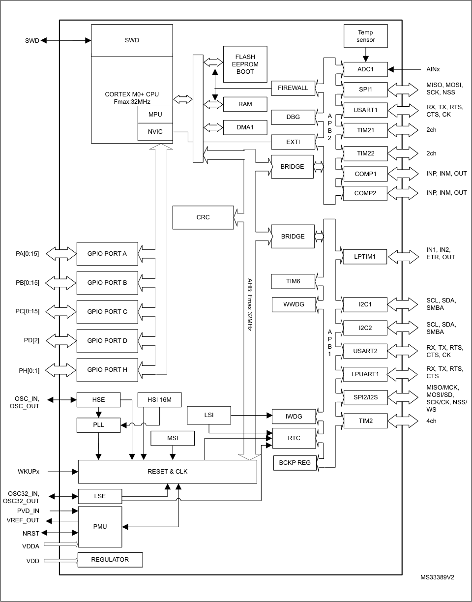

|Col1|$'&|
|---|---|
|||
||63,|
|||
|||
|||
|||
|||
||&203|

|Col1|���|Col3|Col4|
|---|---|---|---|
||06, |06, ||
||06, |||

|Col1|/6(|
|---|---|
||308|
|||

12/133 DS10184 Rev 10

--- end of page=11 ---

**STM32L051x6 STM32L051x8** **Description**

##### **2.2 Ultra-low-power device continuum**

The ultra-low-power family offers a large choice of core and features, from 8-bit proprietary
core up to Arm [®] Cortex [®] -M4, including Arm [®] Cortex [®] -M3 and Arm [®] Cortex [®] -M0+. The
STM32Lx series are the best choice to answer your needs in terms of ultra-low-power
features. The STM32 ultra-low-power series are the best solution for applications such as
gaz/water meter, keyboard/mouse or fitness and healthcare application. Several built-in
features like LCD drivers, dual-bank memory, low-power run mode, operational amplifiers,
128-bit AES, DAC, crystal-less USB and many other definitely help you building a highly
cost optimized application by reducing BOM cost. STMicroelectronics, as a reliable and
long-term manufacturer, ensures as much as possible pin-to-pin compatibility between all
STM8Lx and STM32Lx on one hand, and between all STM32Lx and STM32Fx on the other
hand. Thanks to this unprecedented scalability, your legacy application can be upgraded to
respond to the latest market feature and efficiency requirements.

DS10184 Rev 10 13/133

32

--- end of page=12 ---

**Functional overview** **STM32L051x6 STM32L051x8**

### **3 Functional overview**

##### **3.1 Low-power modes**

The ultra-low-power STM32L051x6/8 support dynamic voltage scaling to optimize its power
consumption in Run mode. The voltage from the internal low-drop regulator that supplies
the logic can be adjusted according to the system’s maximum operating frequency and the
external voltage supply.

There are three power consumption ranges:

      - Range 1 (V DD range limited to 1.71-3.6 V), with the CPU running at up to 32 MHz

      - Range 2 (full V DD range), with a maximum CPU frequency of 16 MHz

      - Range 3 (full V DD range), with a maximum CPU frequency limited to 4.2 MHz

Seven low-power modes are provided to achieve the best compromise between low-power
consumption, short startup time and available wakeup sources:

      - **Sleep** **mode**

In Sleep mode, only the CPU is stopped. All peripherals continue to operate and can
wake up the CPU when an interrupt/event occurs. Sleep mode power consumption at
16 MHz is about 1 mA with all peripherals off.

      - **Low-power run mode**

This mode is achieved with the multispeed internal (MSI) RC oscillator set to the lowspeed clock (max 131 kHz), execution from SRAM or Flash memory, and internal
regulator in low-power mode to minimize the regulator's operating current. In Lowpower run mode, the clock frequency and the number of enabled peripherals are both
limited.

      - **Low-power sleep** **mode**

This mode is achieved by entering Sleep mode with the internal voltage regulator in
low-power mode to minimize the regulator’s operating current. In Low-power sleep
mode, both the clock frequency and the number of enabled peripherals are limited; a
typical example would be to have a timer running at 32 kHz.

When wakeup is triggered by an event or an interrupt, the system reverts to the Run
mode with the regulator on.

**Stop** **mode with RTC**

The Stop mode achieves the lowest power consumption while retaining the RAM and
register contents and real time clock. All clocks in the V CORE domain are stopped, the
PLL, MSI RC, HSE crystal and HSI RC oscillators are disabled. The LSE or LSI is still
running. The voltage regulator is in the low-power mode.

Some peripherals featuring wakeup capability can enable the HSI RC during Stop
mode to detect their wakeup condition.

The device can be woken up from Stop mode by any of the EXTI line, in 3.5 µs, the
processor can serve the interrupt or resume the code. The EXTI line source can be any
GPIO. It can be the PVD output, the comparator 1 event or comparator 2 event
(if internal reference voltage is on), it can be the RTC alarm/tamper/timestamp/wakeup
events, the USART/I2C/LPUART/LPTIMER wakeup events.

14/133 DS10184 Rev 10

--- end of page=13 ---

**STM32L051x6 STM32L051x8** **Functional overview**

      - **Stop mode without RTC**

The Stop mode achieves the lowest power consumption while retaining the RAM and
register contents. All clocks are stopped, the PLL, MSI RC, HSI and LSI RC, HSE and
LSE crystal oscillators are disabled.
Some peripherals featuring wakeup capability can enable the HSI RC during Stop
mode to detect their wakeup condition.

The voltage regulator is in the low-power mode. The device can be woken up from Stop
mode by any of the EXTI line, in 3.5 µs, the processor can serve the interrupt or
resume the code. The EXTI line source can be any GPIO. It can be the PVD output, the
comparator 1 event or comparator 2 event (if internal reference voltage is on). It can
also be wakened by the USART/I2C/LPUART/LPTIMER wakeup events.

      - **Standby mode with RTC**

The Standby mode is used to achieve the lowest power consumption and real time
clock. The internal voltage regulator is switched off so that the entire V CORE domain is
powered off. The PLL, MSI RC, HSE crystal and HSI RC oscillators are also switched
off. The LSE or LSI is still running. After entering Standby mode, the RAM and register
contents are lost except for registers in the Standby circuitry (wakeup logic, IWDG,
RTC, LSI, LSE Crystal 32 KHz oscillator, RCC_CSR register).

The device exits Standby mode in 60 µs when an external reset (NRST pin), an IWDG
reset, a rising edge on one of the three WKUP pins, RTC alarm (Alarm A or Alarm B),
RTC tamper event, RTC timestamp event or RTC Wakeup event occurs.

      - **Standby mode without RTC**

The Standby mode is used to achieve the lowest power consumption. The internal
voltage regulator is switched off so that the entire V CORE domain is powered off. The
PLL, MSI RC, HSI and LSI RC, HSE and LSE crystal oscillators are also switched off.
After entering Standby mode, the RAM and register contents are lost except for
registers in the Standby circuitry (wakeup logic, IWDG, RTC, LSI, LSE Crystal 32 KHz
oscillator, RCC_CSR register).

The device exits Standby mode in 60 µs when an external reset (NRST pin) or a rising
edge on one of the three WKUP pin occurs.

_Note:_ _The RTC, the IWDG, and the corresponding clock sources are not stopped automatically by_
_entering Stop or Standby mode._

**Table 3. Functionalities depending on the operating** **power supply range**

|Operating power supply range(1)|Functionalities depending on the operating power supply range|Col3|
|---|---|---|
|**Operating power supply range(1)**|**ADC operation**|**Dynamic voltage scaling** **range**|
|VDD = 1.65 to 1.71 V|ADC only, conversion time up to 570 ksps|Range 2 or range 3|
|VDD = 1.71 to 1.8 V(2)|ADC only, conversion time up to 1.14 Msps|Range 1, range 2 or range 3|
|VDD = 1.8 to 2.0 V(2)|Conversion time up to 1.14 Msps|Range1, range 2 or range 3|

DS10184 Rev 10 15/133

32

--- end of page=14 ---

**Functional overview** **STM32L051x6 STM32L051x8**

**Table 3. Functionalities depending on the operating** **power supply range (continued)**

|Operating power supply range(1)|Functionalities depending on the operating power supply range|Col3|
|---|---|---|
|**Operating power supply range(1)**|**ADC operation**|**Dynamic voltage scaling** **range**|
|VDD = 2.0 to 2.4 V|Conversion time up to 1.14 Msps|Range 1, range 2 or range 3|
|VDD = 2.4 to 3.6 V|Conversion time up to 1.14 Msps|Range 1, range 2 or range 3|

1. GPIO speed depends on V DD voltage. Refer to _Table 56: I/O AC characteristics_ for more information about
I/O speed.

2. CPU frequency changes from initial to final must respect "fcpu initial <4*fcpu final". It must also respect 5
μs delay between two changes. For example to switch from 4.2 MHz to 32 MHz, you can switch from 4.2
MHz to 16 MHz, wait 5 μs, then switch from 16 MHz to 32 MHz.

**Table 4. CPU frequency range depending on dynamic voltage scaling**

|CPU frequency range|Dynamic voltage scaling range|
|---|---|
|16 MHz to 32 MHz (1ws) 32 kHz to 16 MHz (0ws)|Range 1|
|8 MHz to 16 MHz (1ws) 32 kHz to 8 MHz (0ws)|Range 2|
|32 kHz to 4.2 MHz (0ws)|Range 3|

**Table 5. Functionalities depending on the working mode**
**(from Run/active down to standby)** **[(1)]**

|IPs|Run/Active|Sleep|Low- power run|Low- power sleep|Stop Wakeup capability|Col7|Standby Wakeup capability|Col9|
|---|---|---|---|---|---|---|---|---|
|**IPs**|**Run/Active**|**Sleep**|**Low-** **power** **run**|**Low-** **power** **sleep**|**Stop** **Wakeup** **capability**|**Wakeup** **capability**|**Wakeup** **capability**|**Wakeup** **capability**|
|CPU|Y|--|Y|--|--||--||
|Flash memory|O|O|O|O|--||--||
|RAM|Y|Y|Y|Y|Y||--||
|Backup registers|Y|Y|Y|Y|Y||Y||
|EEPROM|O|O|O|O|--||--||
|Brown-out reset (BOR)|O|O|O|O|O|O|O|O|
|DMA|O|O|O|O|--||--||
|Programmable Voltage Detector (PVD)|O|O|O|O|O|O|-||
|Power-on/down reset (POR/PDR)|Y|Y|Y|Y|Y|Y|Y|Y|

16/133 DS10184 Rev 10

--- end of page=15 ---

**STM32L051x6 STM32L051x8** **Functional overview**

**Table 5. Functionalities depending on the working mode**
**(from Run/active down to standby)** **(continued)** **[(1)]**

|IPs|Run/Active|Sleep|Low- power run|Low- power sleep|Stop Wakeup capability|Col7|Standby Wakeup capability|Col9|
|---|---|---|---|---|---|---|---|---|
|**IPs**|**Run/Active**|**Sleep**|**Low-** **power** **run**|**Low-** **power** **sleep**|**Stop** **Wakeup** **capability**|**Wakeup** **capability**|**Wakeup** **capability**|**Wakeup** **capability**|
|High Speed Internal (HSI)|O|O|--|--|(2)||--||
|High Speed External (HSE)|O|O|O|O|--||--||
|Low Speed Internal (LSI)|O|O|O|O|O||O||
|Low Speed External (LSE)|O|O|O|O|O||O||
|Multi-Speed Internal (MSI)|O|O|Y|Y|--||--||
|Inter-Connect Controller|Y|Y|Y|Y|Y||--||
|RTC|O|O|O|O|O|O|O||
|RTC Tamper|O|O|O|O|O|O|O|O|
|Auto WakeUp (AWU)|O|O|O|O|O|O|O|O|
|USART|O|O|O|O|O(3)|O|--||
|LPUART|O|O|O|O|O(3)|O|--||
|SPI|O|O|O|O|--||--||
|I2C|O|O|--|--|O(4)|O|--||
|ADC|O|O|--|--|--||--||
|Temperature sensor|O|O|O|O|O||--||
|Comparators|O|O|O|O|O|O|--||
|16-bit timers|O|O|O|O|--||--||
|LPTIMER|O|O|O|O|O|O|||
|IWDG|O|O|O|O|O|O|O|O|
|WWDG|O|O|O|O|--||--||
|SysTick Timer|O|O|O|O|||--||
|GPIOs|O|O|O|O|O|O||2 pins|
|Wakeup time to Run mode|0 µs|0.36 µs|3 µs|32 µs|3.5 µs|3.5 µs|50 µs|50 µs|

DS10184 Rev 10 17/133

32

--- end of page=16 ---

**Functional overview** **STM32L051x6 STM32L051x8**

**Table 5. Functionalities depending on the working mode**
**(from Run/active down to standby)** **(continued)** **[(1)]**

|IPs|Run/Active|Sleep|Low- power run|Low- power sleep|Stop Wakeup capability|Col7|Standby Wakeup capability|Col9|
|---|---|---|---|---|---|---|---|---|
|**IPs**|**Run/Active**|**Sleep**|**Low-** **power** **run**|**Low-** **power** **sleep**|**Stop** **Wakeup** **capability**|**Wakeup** **capability**|**Wakeup** **capability**|**Wakeup** **capability**|
|Consumption VDD=1.8 to 3.6 V (Typ)|Down to 140 µA/MHz (from Flash memory)|Down to 37 µA/MHz (from Flash memory)|Down to 8 µA|Down to 4.5 µA|0.4 µA (No RTC) VDD=1.8 V|0.4 µA (No RTC) VDD=1.8 V|0.28 µA (No RTC) VDD=1.8 V|0.28 µA (No RTC) VDD=1.8 V|
|Consumption VDD=1.8 to 3.6 V (Typ)|Down to 140 µA/MHz (from Flash memory)|Down to 37 µA/MHz (from Flash memory)|Down to 8 µA|Down to 4.5 µA|0.8 µA (with RTC) VDD=1.8 V|0.8 µA (with RTC) VDD=1.8 V|0.65 µA (with RTC) VDD=1.8 V|0.65 µA (with RTC) VDD=1.8 V|
|Consumption VDD=1.8 to 3.6 V (Typ)|Down to 140 µA/MHz (from Flash memory)|Down to 37 µA/MHz (from Flash memory)|Down to 8 µA|Down to 4.5 µA|0.4 µA (No RTC) VDD=3.0 V|0.4 µA (No RTC) VDD=3.0 V|0.29 µA (No RTC) VDD=3.0 V|0.29 µA (No RTC) VDD=3.0 V|
|Consumption VDD=1.8 to 3.6 V (Typ)|Down to 140 µA/MHz (from Flash memory)|Down to 37 µA/MHz (from Flash memory)|Down to 8 µA|Down to 4.5 µA|1 µA (with RTC) VDD=3.0 V|1 µA (with RTC) VDD=3.0 V|0.85 µA (with RTC) VDD=3.0 V|0.85 µA (with RTC) VDD=3.0 V|

1. Legend:
“Y” = Yes (enable).
“O” = Optional can be enabled/disabled by software)
“-” = Not available

2. Some peripherals with wakeup from Stop capability can request HSI to be enabled. In this case, HSI is woken up by the
peripheral, and only feeds the peripheral which requested it. HSI is automatically put off when the peripheral does not need
it anymore.

3. UART and LPUART reception is functional in Stop mode. It generates a wakeup interrupt on Start. To generate a wakeup
on address match or received frame event, the LPUART can run on LSE clock while the UART has to wake up or keep
running the HSI clock.

4. I2C address detection is functional in Stop mode. It generates a wakeup interrupt in case of address match. It will wake up
the HSI during reception.

##### **3.2 Interconnect matrix**

Several peripherals are directly interconnected. This allows autonomous communication
between peripherals, thus saving CPU resources and power consumption. In addition,
these hardware connections allow fast and predictable latency.

Depending on peripherals, these interconnections can operate in Run, Sleep, Low-power
run, Low-power sleep and Stop modes.

**Table 6. STM32L0xx peripherals interconnect matrix**

|Interconnect source|Interconnect destination|Interconnect action|Run|Sleep|Low- power run|Low- power sleep|Stop|
|---|---|---|---|---|---|---|---|
|COMPx|TIM2,TIM21, TIM22|Timer input channel, trigger from analog signals comparison|Y|Y|Y|Y|-|
|COMPx|LPTIM|Timer input channel, trigger from analog signals comparison|Y|Y|Y|Y|Y|
|TIMx|TIMx|Timer triggered by other timer|Y|Y|Y|Y|-|

18/133 DS10184 Rev 10

--- end of page=17 ---

**STM32L051x6 STM32L051x8** **Functional overview**

**Table 6. STM32L0xx peripherals interconnect matrix (continued)**

|Interconnect source|Interconnect destination|Interconnect action|Run|Sleep|Low- power run|Low- power sleep|Stop|
|---|---|---|---|---|---|---|---|
|RTC|TIM21|Timer triggered by Auto wake-up|Y|Y|Y|Y|-|
|RTC|LPTIM|Timer triggered by RTC event|Y|Y|Y|Y|Y|
|All clock source|TIMx|Clock source used as input channel for RC measurement and trimming|Y|Y|Y|Y|-|
|GPIO|TIMx|Timer input channel and trigger|Y|Y|Y|Y|-|
|GPIO|LPTIM|Timer input channel and trigger|Y|Y|Y|Y|Y|
|GPIO|ADC|Conversion  trigger|Y|Y|Y|Y|-|

##### **3.3 Arm [®] Cortex [®] -M0+ core with MPU**

The Cortex-M0+ processor is an entry-level 32-bit Arm Cortex processor designed for a
broad range of embedded applications. It offers significant benefits to developers, including:

      - a simple architecture that is easy to learn and program

      - ultra-low power, energy-efficient operation

      - excellent code density

      - deterministic, high-performance interrupt handling

      - upward compatibility with Cortex-M processor family

      - platform security robustness, with integrated Memory Protection Unit (MPU).

The Cortex-M0+ processor is built on a highly area and power optimized 32-bit processor
core, with a 2-stage pipeline Von Neumann architecture. The processor delivers exceptional
energy efficiency through a small but powerful instruction set and extensively optimized
design, providing high-end processing hardware including a single-cycle multiplier.

The Cortex-M0+ processor provides the exceptional performance expected of a modern 32bit architecture, with a higher code density than other 8-bit and 16-bit microcontrollers.

Owing to its embedded Arm core, the STM32L051x6/8 are compatible with all Arm tools and
software.

DS10184 Rev 10 19/133

32

--- end of page=18 ---

**Functional overview** **STM32L051x6 STM32L051x8**

**Nested vectored interrupt controller (NVIC)**

The ultra-low-power STM32L051x6/8 embed a nested vectored interrupt controller able to
handle up to 32 maskable interrupt channels and 4 priority levels.

The Cortex-M0+ processor closely integrates a configurable Nested Vectored Interrupt
Controller (NVIC), to deliver industry-leading interrupt performance. The NVIC:

      - includes a Non-Maskable Interrupt (NMI)

      - provides zero jitter interrupt option

      - provides four interrupt priority levels

The tight integration of the processor core and NVIC provides fast execution of Interrupt
Service Routines (ISRs), dramatically reducing the interrupt latency. This is achieved
through the hardware stacking of registers, and the ability to abandon and restart loadmultiple and store-multiple operations. Interrupt handlers do not require any assembler
wrapper code, removing any code overhead from the ISRs. Tail-chaining optimization also
significantly reduces the overhead when switching from one ISR to another.

To optimize low-power designs, the NVIC integrates with the sleep modes, that include a
deep sleep function that enables the entire device to enter rapidly stop or standby mode.

This hardware block provides flexible interrupt management features with minimal interrupt
latency.

##### **3.4 Reset and supply management**

**3.4.1** **Power supply schemes**

      - V DD = 1.65 to 3.6 V: external power supply for I/Os and the internal regulator. Provided
externally through V DD pins.

      - V SSA, V DDA = 1.65 to 3.6 V: external analog power supplies for ADC reset blocks, RCs
and PLL. V DDA and V SSA must be connected to V DD and V SS, respectively.

**3.4.2** **Power supply supervisor**

The devices have an integrated ZEROPOWER power-on reset (POR)/power-down reset
(PDR) that can be coupled with a brownout reset (BOR) circuitry.

Two versions are available:

      - The version with BOR activated at power-on operates between 1.8 V and 3.6 V.

      - The other version without BOR operates between 1.65 V and 3.6 V.

After the V DD threshold is reached (1.65 V or 1.8 V depending on the BOR which is active or
not at power-on), the option byte loading process starts, either to confirm or modify default
thresholds, or to disable the BOR permanently: in this case, the VDD min value becomes
1.65 V (whatever the version, BOR active or not, at power-on).

When BOR is active at power-on, it ensures proper operation starting from 1.8 V whatever
the power ramp-up phase before it reaches 1.8 V. When BOR is not active at power-up, the
power ramp-up should guarantee that 1.65 V is reached on V DD at least 1 ms after it exits
the POR area.

Five BOR thresholds are available through option bytes, starting from 1.8 V to 3 V. To
reduce the power consumption in Stop mode, it is possible to automatically switch off the

20/133 DS10184 Rev 10

--- end of page=19 ---

**STM32L051x6 STM32L051x8** **Functional overview**

internal reference voltage (V REFINT ) in Stop mode. The device remains in reset mode when
V DD is below a specified threshold, V POR/PDR or V BOR, without the need for any external
reset circuit.

_Note:_ _The start-up time at power-on is typically 3.3 ms when BOR is active at power-up, the start-_
_up time at power-on can be decreased down to 1 ms typically for devices with BOR inactive_
_at power-up._

The devices feature an embedded programmable voltage detector (PVD) that monitors the
V DD/VDDA power supply and compares it to the V PVD threshold. This PVD offers 7 different
levels between 1.85 V and 3.05 V, chosen by software, with a step around 200 mV. An
interrupt can be generated when V DD/VDDA drops below the V PVD threshold and/or when
V DD/VDDA is higher than the V PVD threshold. The interrupt service routine can then generate
a warning message and/or put the MCU into a safe state. The PVD is enabled by software.

**3.4.3** **Voltage regulator**

The regulator has three operation modes: main (MR), low power (LPR) and power down.

      - MR is used in Run mode (nominal regulation)

      - LPR is used in the Low-power run, Low-power sleep and Stop modes

      - Power down is used in Standby mode. The regulator output is high impedance, the
kernel circuitry is powered down, inducing zero consumption but the contents of the
registers and RAM are lost except for the standby circuitry (wakeup logic, IWDG, RTC,
LSI, LSE crystal 32 KHz oscillator, RCC_CSR).

##### **3.5 Clock management**

The clock controller distributes the clocks coming from different oscillators to the core and
the peripherals. It also manages clock gating for low-power modes and ensures clock
robustness. It features:

      - **Clock prescaler**

To get the best trade-off between speed and current consumption, the clock frequency
to the CPU and peripherals can be adjusted by a programmable prescaler.

      - **Safe clock switching**

Clock sources can be changed safely on the fly in Run mode through a configuration
register.

      - **Clock management**

To reduce power consumption, the clock controller can stop the clock to the core,
individual peripherals or memory.

      - **System clock source**

Three different clock sources can be used to drive the master clock SYSCLK:

–
1-25 MHz high-speed external crystal (HSE), that can supply a PLL

–
16 MHz high-speed internal RC oscillator (HSI), trimmable by software, that can
supply a PLLMultispeed internal RC oscillator (MSI), trimmable by software, able
to generate 7 frequencies (65 kHz, 131 kHz, 262 kHz, 524 kHz, 1.05 MHz, 2.1
MHz, 4.2 MHz). When a 32.768 kHz clock source is available in the system (LSE),
the MSI frequency can be trimmed by software down to a ±0.5% accuracy.

      - **Auxiliary clock source**

Two ultra-low-power clock sources that can be used to drive the real-time clock:

DS10184 Rev 10 21/133

32

--- end of page=20 ---

**Functional overview** **STM32L051x6 STM32L051x8**

–
32.768 kHz low-speed external crystal (LSE)

–
37 kHz low-speed internal RC (LSI), also used to drive the independent watchdog.
The LSI clock can be measured using the high-speed internal RC oscillator for
greater precision.

      - **RTC clock source**

The LSI, LSE or HSE sources can be chosen to clock the RTC, whatever the system
clock.

      - **Startup clock**

After reset, the microcontroller restarts by default with an internal 2 MHz clock (MSI).
The prescaler ratio and clock source can be changed by the application program as
soon as the code execution starts.

      - **Clock security system (CSS)**

This feature can be enabled by software. If an HSE clock failure occurs, the master
clock is automatically switched to HSI and a software interrupt is generated if enabled.

Another clock security system can be enabled, in case of failure of the LSE it provides
an interrupt or wakeup event which is generated if enabled.

      - **Clock-out capability (MCO: microcontroller clock output)**

It outputs one of the internal clocks for external use by the application.

Several prescalers allow the configuration of the AHB frequency, each APB (APB1 and
APB2) domains. The maximum frequency of the AHB and the APB domains is 32 MHz. See
_Figure 2_ for details on the clock tree.

22/133 DS10184 Rev 10

--- end of page=21 ---

**STM32L051x6 STM32L051x8** **Functional overview**

**Figure 2. Clock tree**

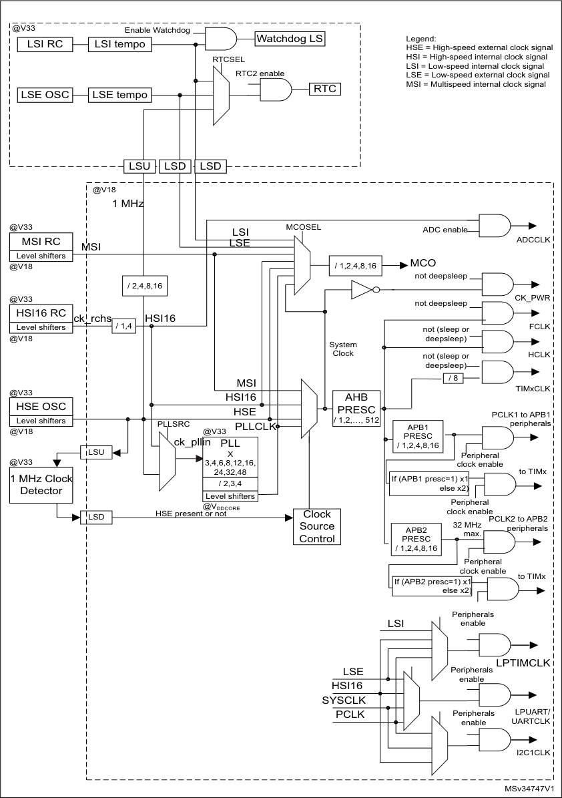

|Col1|Col2|Col3|Col4|Col5|Col6|Col7|Col8|Col9|Col10|
|---|---|---|---|---|---|---|---|---|---|
|||||||||||
|||||||||||
|||||||||||
||/6||/6||/6'|/6'|/6'|/6'|/6'|
||/6|||||||||
|#9 6, 0+]|#9 6, 0+]|#9 6, 0+]|#9 6, 0+]|#9 6, 0+]|#9 6, 0+]|#9 6, 0+]|#9 6, 0+]|#9 6, 0+]|#9 6, 0+]|
|#9 6, 0+]|#9 6, 0+]|#9 6, 0+]|#9 6, 0+]|#9 6, 0+]|#9 6, 0+]|/6(|/6(|/6(|/6(|
| UFKV | UFKV | +6,| +6,| +6,| +6,| +6,| +6,| +6,| +6,|
|||||||||||
|||||||||||
||||+6(|+6(|+6(|+6(|+6(|||
|||||||||||

DS10184 Rev 10 23/133

32

--- end of page=22 ---

**Functional overview** **STM32L051x6 STM32L051x8**

##### **3.6 Low-power real-time clock and backup registers**

The real time clock (RTC) and the 5 backup registers are supplied in all modes including
standby mode. The backup registers are five 32-bit registers used to store 20 bytes of user
application data. They are not reset by a system reset, or when the device wakes up from
Standby mode.

The RTC is an independent BCD timer/counter. Its main features are the following:

      - Calendar with subsecond, seconds, minutes, hours (12 or 24 format), week day, date,
month, year, in BCD (binary-coded decimal) format

      - Automatically correction for 28, 29 (leap year), 30, and 31 day of the month

      - Two programmable alarms with wake up from Stop and Standby mode capability

      - Periodic wakeup from Stop and Standby with programmable resolution and period

      - On-the-fly correction from 1 to 32767 RTC clock pulses. This can be used to
synchronize it with a master clock.

      - Reference clock detection: a more precise second source clock (50 or 60 Hz) can be
used to enhance the calendar precision.

      - Digital calibration circuit with 1 ppm resolution, to compensate for quartz crystal
inaccuracy

      - 2 anti-tamper detection pins with programmable filter. The MCU can be woken up from
Stop and Standby modes on tamper event detection.

      - Timestamp feature which can be used to save the calendar content. This function can
be triggered by an event on the timestamp pin, or by a tamper event. The MCU can be
woken up from Stop and Standby modes on timestamp event detection.

The RTC clock sources can be:

      - A 32.768 kHz external crystal

      - A resonator or oscillator

      - The internal low-power RC oscillator (typical frequency of 37 kHz)

      - The high-speed external clock

##### **3.7 General-purpose inputs/outputs (GPIOs)**

Each of the GPIO pins can be configured by software as output (push-pull or open-drain), as
input (with or without pull-up or pull-down) or as peripheral alternate function. Most of the
GPIO pins are shared with digital or analog alternate functions, and can be individually
remapped using dedicated alternate function registers. All GPIOs are high current capable.
Each GPIO output, speed can be slowed (40 MHz, 10 MHz, 2 MHz, 400 kHz). The alternate
function configuration of I/Os can be locked if needed following a specific sequence in order
to avoid spurious writing to the I/O registers. The I/O controller is connected to a dedicated
IO bus with a toggling speed of up to 32 MHz.

**Extended interrupt/event controller (EXTI)**

The extended interrupt/event controller consists of 28 edge detector lines used to generate
interrupt/event requests. Each line can be individually configured to select the trigger event
(rising edge, falling edge, both) and can be masked independently. A pending register
maintains the status of the interrupt requests. The EXTI can detect an external line with a
pulse width shorter than the Internal APB2 clock period. Up to 51 GPIOs can be connected
to the 16 configurable interrupt/event lines. The 12 other lines are connected to PVD, RTC,
USARTs, LPUART, LPTIMER or comparator events.

24/133 DS10184 Rev 10

--- end of page=23 ---

**STM32L051x6 STM32L051x8** **Functional overview**

##### **3.8 Memories**

The STM32L051x6/8 devices have the following features:

      - 8 Kbytes of embedded SRAM accessed (read/write) at CPU clock speed with 0 wait
states. With the enhanced bus matrix, operating the RAM does not lead to any
performance penalty during accesses to the system bus (AHB and APB buses).

      - The non-volatile memory is divided into three arrays:

–
32 or 64 Kbytes of embedded Flash program memory

–
2 Kbytes of data EEPROM

–
Information block containing 32 user and factory options bytes plus 4 Kbytes of
system memory

The user options bytes are used to write-protect or read-out protect the memory (with
4 Kbyte granularity) and/or readout-protect the whole memory with the following options:

      - **Level 0** : no protection

      - **Level 1** : memory readout protected.

The Flash memory cannot be read from or written to if either debug features are
connected or boot in RAM is selected

      - **Level 2** : chip readout protected, debug features (Cortex-M0+ serial wire) and boot in
RAM selection disabled (debugline fuse)

The firewall protects parts of code/data from access by the rest of the code that is executed
outside of the protected area. The granularity of the protected code segment or the nonvolatile data segment is 256 bytes (Flash memory or EEPROM) against 64 bytes for the
volatile data segment (RAM).

The whole non-volatile memory embeds the error correction code (ECC) feature.

##### **3.9 Boot modes**

At startup, BOOT0 pin and nBOOT1 option bit are used to select one of three boot options:

      - Boot from Flash memory

      - Boot from System memory

      - Boot from embedded RAM

The boot loader is located in System memory. It is used to reprogram the Flash memory by
using SPI1(PA4, PA5, PA6, PA7) or SPI2 (PB12, PB13, PB14, PB15), USART1(PA9,
PA10) or USART2(PA2, PA3). See STM32™ microcontroller system memory boot mode
AN2606 for details.

DS10184 Rev 10 25/133

32

--- end of page=24 ---

**Functional overview** **STM32L051x6 STM32L051x8**

##### **3.10 Direct memory access (DMA)**

The flexible 7-channel, general-purpose DMA is able to manage memory-to-memory,
peripheral-to-memory and memory-to-peripheral transfers. The DMA controller supports
circular buffer management, avoiding the generation of interrupts when the controller
reaches the end of the buffer.

Each channel is connected to dedicated hardware DMA requests, with software trigger
support for each channel. Configuration is done by software and transfer sizes between
source and destination are independent.

The DMA can be used with the main peripherals: SPI, I [2] C, USART, LPUART,
general-purpose timers, and ADC.

##### **3.11 Analog-to-digital converter (ADC)**

A native 12-bit, extended to 16-bit through hardware oversampling, analog-to-digital
converter is embedded into STM32L051x6/8 device. It has up to 16 external channels and 3
internal channels (temperature sensor, voltage reference). Three channels, PA0, PA4 and
PA5, are fast channels, while the others are standard channels.

The ADC performs conversions in single-shot or scan mode. In scan mode, automatic
conversion is performed on a selected group of analog inputs.

The ADC frequency is independent from the CPU frequency, allowing maximum sampling
rate of 1.14 MSPS even with a low CPU speed. The ADC consumption is low at all
frequencies (~25 µA at 10 kSPS, ~200 µA at 1MSPS). An auto-shutdown function
guarantees that the ADC is powered off except during the active conversion phase.

The ADC can be served by the DMA controller. It can operate from a supply voltage down to
1.65 V.

The ADC features a hardware oversampler up to 256 samples, this improves the resolution
to 16 bits (see AN2668).

An analog watchdog feature allows very precise monitoring of the converted voltage of one,
some or all scanned channels. An interrupt is generated when the converted voltage is
outside the programmed thresholds.

The events generated by the general-purpose timers (TIMx) can be internally connected to
the ADC start triggers, to allow the application to synchronize A/D conversions and timers.

##### **3.12 Temperature sensor**

The temperature sensor (T SENSE ) generates a voltage V SENSE that varies linearly with
temperature.

The temperature sensor is internally connected to the ADC_IN18 input channel which is
used to convert the sensor output voltage into a digital value.

The sensor provides good linearity but it has to be calibrated to obtain good overall
accuracy of the temperature measurement. As the offset of the temperature sensor varies
from chip to chip due to process variation, the uncalibrated internal temperature sensor is
suitable for applications that detect temperature changes only.

26/133 DS10184 Rev 10

--- end of page=25 ---

**STM32L051x6 STM32L051x8** **Functional overview**

To improve the accuracy of the temperature sensor measurement, each device is
individually factory-calibrated by ST. The temperature sensor factory calibration data are
stored by ST in the system memory area, accessible in read-only mode.

**Table 7. Temperature sensor calibration values**

|Calibration value name|Description|Memory address|
|---|---|---|
|TSENSE_CAL1|TS ADC raw data acquired at temperature of 30 °C,  VDDA= 3 V|0x1FF8 007A - 0x1FF8 007B|
|TSENSE_CAL2|TS ADC raw data acquired at temperature of 130 °C  VDDA= 3 V|0x1FF8 007E - 0x1FF8 007F|

**3.12.1** **Internal voltage reference (V** **REFINT** **)**

The internal voltage reference (V REFINT ) provides a stable (bandgap) voltage output for the
ADC and Comparators. V REFINT is internally connected to the ADC_IN17 input channel. It
enables accurate monitoring of the V DD value (when no external voltage, V REF+, is available
for ADC). The precise voltage of V REFINT is individually measured for each part by ST during
production test and stored in the system memory area. It is accessible in read-only mode.

**Table 8. Internal voltage reference measured values**

|Calibration value name|Description|Memory address|
|---|---|---|
|VREFINT_CAL|Raw data acquired at temperature of 25 °C VDDA = 3 V|0x1FF8 0078 - 0x1FF8 0079|

##### **3.13 Ultra-low-power comparators and reference voltage**

The STM32L051x6/8 embed two comparators sharing the same current bias and reference
voltage. The reference voltage can be internal or external (coming from an I/O).

      - One comparator with ultra low consumption

      - One comparator with rail-to-rail inputs, fast or slow mode.

      - The threshold can be one of the following:

–
External I/O pins

–
Internal reference voltage (V REFINT )

–
submultiple of Internal reference voltage(1/4, 1/2, 3/4) for the rail to rail
comparator.

Both comparators can wake up the devices from Stop mode, and be combined into a
window comparator.

The internal reference voltage is available externally via a low-power / low-current output
buffer (driving current capability of 1 µA typical).

DS10184 Rev 10 27/133

32

--- end of page=26 ---

**Functional overview** **STM32L051x6 STM32L051x8**

##### **3.14 System configuration controller**

The system configuration controller provides the capability to remap some alternate
functions on different I/O ports.

The highly flexible routing interface allows the application firmware to control the routing of
different I/Os to the TIM2, TIM21, TIM22 and LPTIM timer input captures. It also controls the
routing of internal analog signals to ADC, COMP1 and COMP2 and the internal reference
voltage V REFINT .

##### **3.15 Timers and watchdogs**

The ultra-low-power STM32L051x6/8 devices include three general-purpose timers, one
low- power timer (LPTIM), one basic timer, two watchdog timers and the SysTick timer.

_Table 9_ compares the features of the general-purpose and basic timers.

**Table 9. Timer feature comparison**

|Timer|Counter resolution|Counter type|Prescaler factor|DMA request generation|Capture/compare channels|Complementary outputs|
|---|---|---|---|---|---|---|
|TIM2|16-bit|Up, down, up/down|Any integer between 1 and 65536|Yes|4|No|
|TIM21, TIM22|16-bit|Up, down, up/down|Any integer between 1 and 65536|No|2|No|
|TIM6|16-bit|Up|Any integer between 1 and 65536|Yes|0|No|

**3.15.1** **General-purpose timers (TIM2, TIM21 and TIM22)**

There are three synchronizable general-purpose timers embedded in the STM32L051x6/8
devices (see _Table 9_ for differences).

**TIM2**

TIM2 is based on 16-bit auto-reload up/down counter. It includes a 16-bit prescaler. It
features four independent channels each for input capture/output compare, PWM or onepulse mode output.

The TIM2 general-purpose timers can work together or with the TIM21 and TIM22 generalpurpose timers via the Timer Link feature for synchronization or event chaining. Their
counter can be frozen in debug mode. Any of the general-purpose timers can be used to
generate PWM outputs.

TIM2 has independent DMA request generation.

This timer is capable of handling quadrature (incremental) encoder signals and the digital
outputs from 1 to 3 hall-effect sensors.

**TIM21 and TIM22**

TIM21 and TIM22 are based on a 16-bit auto-reload up/down counter. They include a 16-bit
prescaler. They have two independent channels for input capture/output compare, PWM or

28/133 DS10184 Rev 10

--- end of page=27 ---

**STM32L051x6 STM32L051x8** **Functional overview**

one-pulse mode output. They can work together and be synchronized with the TIM2, fullfeatured general-purpose timers.

They can also be used as simple time bases and be clocked by the LSE clock source
(32.768 kHz) to provide time bases independent from the main CPU clock.

**3.15.2** **Low-power Timer (LPTIM)**

The low-power timer has an independent clock and is running also in Stop mode if it is
clocked by LSE, LSI or an external clock. It is able to wakeup the devices from Stop mode.

This low-power timer supports the following features:

      - 16-bit up counter with 16-bit autoreload register

      - 16-bit compare register

      - Configurable output: pulse, PWM

      - Continuous / one shot mode

      - Selectable software / hardware input trigger

      - Selectable clock source

–
Internal clock source: LSE, LSI, HSI or APB clock

–
External clock source over LPTIM input (working even with no internal clock
source running, used by the Pulse Counter Application)

      - Programmable digital glitch filter

      - Encoder mode

**3.15.3** **Basic timer (TIM6)**

This timer can be used as a generic 16-bit timebase.

**3.15.4** **SysTick timer**

This timer is dedicated to the OS, but could also be used as a standard downcounter. It is
based on a 24-bit downcounter with autoreload capability and a programmable clock
source. It features a maskable system interrupt generation when the counter reaches ‘0’.

**3.15.5** **Independent watchdog (IWDG)**

The independent watchdog is based on a 12-bit downcounter and 8-bit prescaler. It is
clocked from an independent 37 kHz internal RC and, as it operates independently of the
main clock, it can operate in Stop and Standby modes. It can be used either as a watchdog
to reset the device when a problem occurs, or as a free-running timer for application timeout
management. It is hardware- or software-configurable through the option bytes. The counter
can be frozen in debug mode.

**3.15.6** **Window watchdog (WWDG)**

The window watchdog is based on a 7-bit downcounter that can be set as free-running. It
can be used as a watchdog to reset the device when a problem occurs. It is clocked from
the main clock. It has an early warning interrupt capability and the counter can be frozen in
debug mode.

DS10184 Rev 10 29/133

32

--- end of page=28 ---

**Functional overview** **STM32L051x6 STM32L051x8**

##### **3.16 Communication interfaces**

**3.16.1** **I** **[2]** **C bus**

two I [2] C interface (I2C1, I2C2) can operate in multimaster or slave modes.

Each I [2] C interface can support Standard mode (Sm, up to 100 kbit/s), Fast mode (Fm, up to
400 kbit/s) and Fast Mode Plus (Fm+, up to 1 Mbit/s) with 20 mA output drive on some I/Os.

7-bit and 10-bit addressing modes, multiple 7-bit slave addresses (2 addresses, 1 with
configurable mask) are also supported as well as programmable analog and digital noise
filters.

**Table 10. Comparison of I2C analog and digital filters**

|Col1|Analog filter|Digital filter|
|---|---|---|
|Pulse width of suppressed spikes|≥ 50 ns|Programmable length from 1 to 15 I2C peripheral clocks|
|Benefits|Available in Stop mode|1. Extra filtering capability vs. standard requirements.  2. Stable length|
|Drawbacks|Variations depending on temperature, voltage, process|Wakeup from Stop on address match is not available when digital filter is enabled.|

In addition, I2C1 provides hardware support for SMBus 2.0 and PMBus 1.1: ARP capability,
Host notify protocol, hardware CRC (PEC) generation/verification, timeouts verifications and
ALERT protocol management. I2C1 also has a clock domain independent from the CPU
clock, allowing the I2C1 to wake up the MCU from Stop mode on address match.

Each I2C interface can be served by the DMA controller.

Refer to _Table 11_ for an overview of I2C interface features.

**Table 11. STM32L051x6/8 I** **[2]** **C implementation**

|I2C features(1)|I2C1|I2C2|
|---|---|---|
|7-bit addressing mode|X|X|
|10-bit addressing mode|X|X|
|Standard mode (up to 100 kbit/s)|X|X|
|Fast mode (up to 400 kbit/s)|X|X|
|Fast Mode Plus with 20 mA output drive I/Os (up to 1 Mbit/s)|X|X(2)|
|Independent clock|X|-|
|SMBus|X|-|
|Wakeup from STOP|X|-|

1. X = supported.

2. See for the list of I/Os that feature Fast Mode Plus capability

30/133 DS10184 Rev 10

--- end of page=29 ---

**STM32L051x6 STM32L051x8** **Functional overview**

**3.16.2** **Universal synchronous/asynchronous receiver transmitter (USART)**

The two USART interfaces (USART1, USART2) are able to communicate at speeds of up to
4 Mbit/s.

They provide hardware management of the CTS, RTS and RS485 driver enable (DE)
signals, multiprocessor communication mode, master synchronous communication and
single-wire half-duplex communication mode. They also support SmartCard communication
(ISO 7816), IrDA SIR ENDEC, LIN Master/Slave capability, auto baud rate feature and has
a clock domain independent from the CPU clock, allowing to wake up the MCU from Stop
mode using baudrates up to 42 Kbaud.

All USART interfaces can be served by the DMA controller.

_Table 12_ for the supported modes and features of USART interfaces.

**Table 12. USART implementation**

|USART modes/features(1)|USART1 and USART2|
|---|---|
|Hardware flow control for modem|X|
|Continuous communication using DMA|X|
|Multiprocessor communication|X|
|Synchronous mode(2)|X|
|Smartcard mode|X|
|Single-wire half-duplex communication|X|
|IrDA SIR ENDEC block|X|
|LIN mode|X|
|Dual clock domain and wakeup from Stop mode|X|
|Receiver timeout interrupt|X|
|Modbus communication|X|
|Auto baud rate detection (4 modes)|X|
|Driver Enable|X|

1. X = supported.

2. This mode allows using the USART as an SPI master.

**3.16.3** **Low-power universal asynchronous receiver transmitter (LPUART)**

The devices embed one Low-power UART. The LPUART supports asynchronous serial
communication with minimum power consumption. It supports half duplex single wire
communication and modem operations (CTS/RTS). It allows multiprocessor
communication.

The LPUART has a clock domain independent from the CPU clock. It can wake up the
system from Stop mode using baudrates up to 46 Kbaud. The Wakeup events from Stop
mode are programmable and can be:

      - Start bit detection

      - Or any received data frame

      - Or a specific programmed data frame

DS10184 Rev 10 31/133

32

--- end of page=30 ---

**Functional overview** **STM32L051x6 STM32L051x8**

Only a 32.768 kHz clock (LSE) is needed to allow LPUART communication up to 9600
baud. Therefore, even in Stop mode, the LPUART can wait for an incoming frame while
having an extremely low energy consumption. Higher speed clock can be used to reach
higher baudrates.

LPUART interface can be served by the DMA controller.

**3.16.4** **Serial peripheral interface (SPI)/Inter-integrated sound (I2S)**

Up to two SPIs are able to communicate at up to 16 Mbits/s in slave and master modes in
full-duplex and half-duplex communication modes. The 3-bit prescaler gives 8 master mode
frequencies and the frame is configurable to 8 bits or 16 bits. The hardware CRC
generation/verification supports basic SD Card/MMC modes.

The USARTs with synchronous capability can also be used as SPI master.

One standard I2S interfaces (multiplexed with SPI2) is available. It can operate in master or
slave mode, and can be configured to operate with a 16-/32-bit resolution as input or output
channels. Audio sampling frequencies from 8 kHz up to 192 kHz are supported. When the
I2S interfaces is configured in master mode, the master clock can be output to the external
DAC/CODEC at 256 times the sampling frequency.

The SPIs can be served by the DMA controller.

Refer to _Table 13_ for the differences between SPI1 and SPI2.

**Table 13. SPI/I2S implementation**

|SPI features(1)|SPI1|SPI2|
|---|---|---|
|Hardware CRC calculation|X|X|
|I2S mode|-|X|
|TI mode|X|X|

1. X = supported.

##### **3.17 Cyclic redundancy check (CRC) calculation unit**

The CRC (cyclic redundancy check) calculation unit is used to get a CRC code using a
configurable generator polynomial value and size.

Among other applications, CRC-based techniques are used to verify data transmission or
storage integrity. In the scope of the EN/IEC 60335-1 standard, they offer a means of
verifying the Flash memory integrity. The CRC calculation unit helps compute a signature of
the software during runtime, to be compared with a reference signature generated at
linktime and stored at a given memory location.

##### **3.18 Serial wire debug port (SW-DP)**

An Arm SW-DP interface is provided to allow a serial wire debugging tool to be connected to
the MCU.

32/133 DS10184 Rev 10

--- end of page=31 ---

**STM32L051x6 STM32L051x8** **Pin descriptions**

### **4 Pin descriptions**

**Figure 3. STM32L051x6/8 LQFP64 pinout**

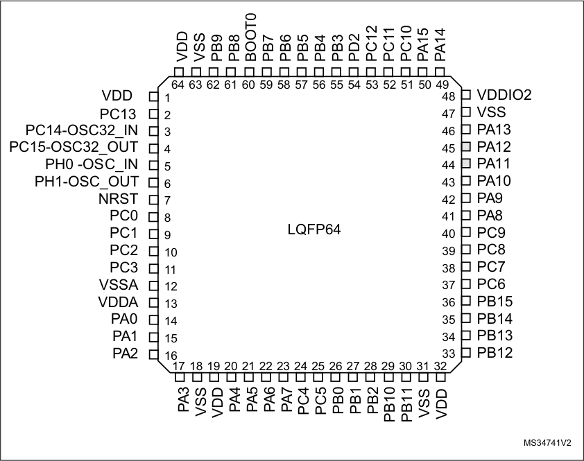

1. The above figure shows the package top view.

2. PA11 and PA12 input/outputs (greyed out pins) are supplied by VDDIO2.

DS10184 Rev 10 33/133

44

--- end of page=32 ---

**Pin descriptions** **STM32L051x6 STM32L051x8**

**Figure 4. STM32L051x6/8 TFBGA64 ballout**

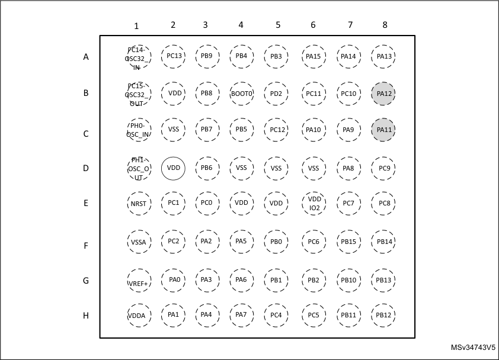

1. The above figure shows the package top view.

2. PA11 and PA12 input/outputs (greyed out pins) are supplied by VDDIO2.

34/133 DS10184 Rev 10

--- end of page=33 ---

**STM32L051x6 STM32L051x8** **Pin descriptions**

**Figure 5. STM32L051x6/8 LQFP48 pinout**

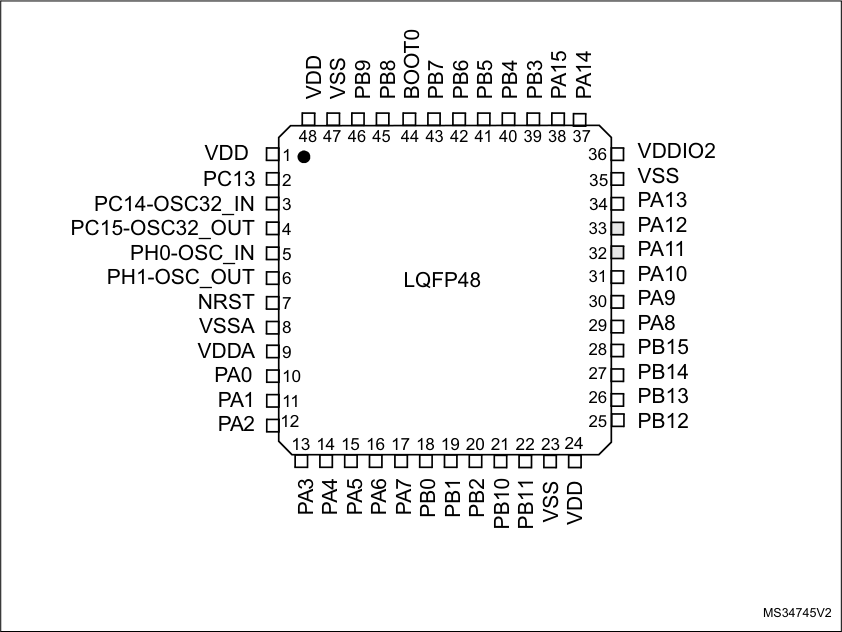

1. The above figure shows the package top view.

2. PA11 and PA12 input/outputs (greyed out pins) are supplied by VDDIO2.

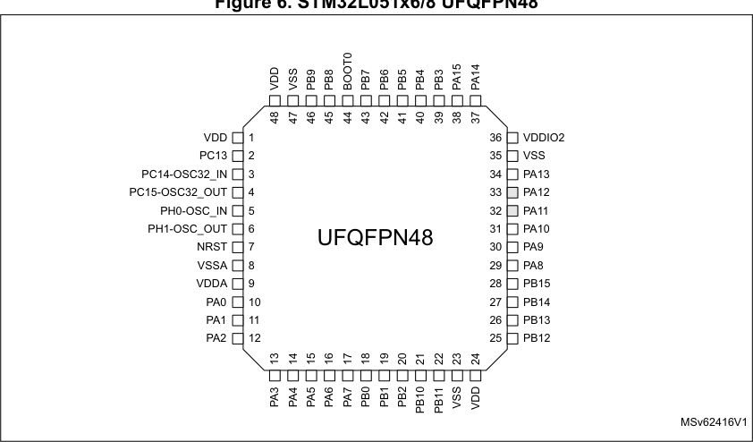

1. The above figure shows the package top view.

2. PA11 and PA12 input/outputs (greyed out pins) are supplied by VDDIO2.

DS10184 Rev 10 35/133

44

--- end of page=34 ---

**Pin descriptions** **STM32L051x6 STM32L051x8**

**Figure 7. STM32L051x6/8 WLCSP36 ballout**

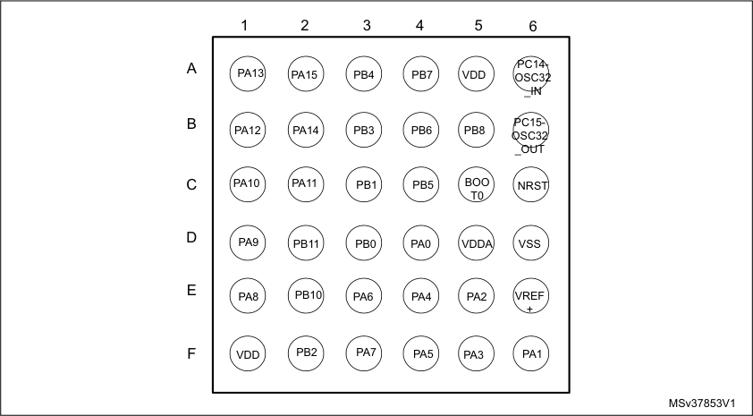

1. The above figure shows the package top view.

**Figure 8. STM32L051x6/8 LQFP32 pinout**

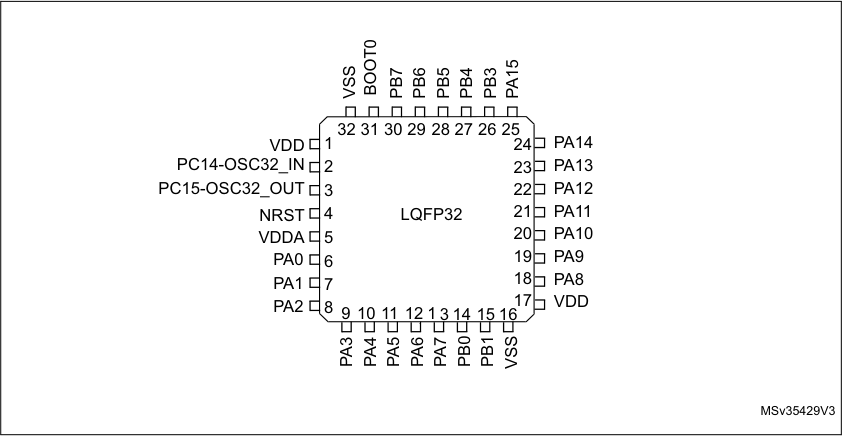

1. The above figure shows the package top view.

36/133 DS10184 Rev 10

--- end of page=35 ---

**STM32L051x6 STM32L051x8** **Pin descriptions**

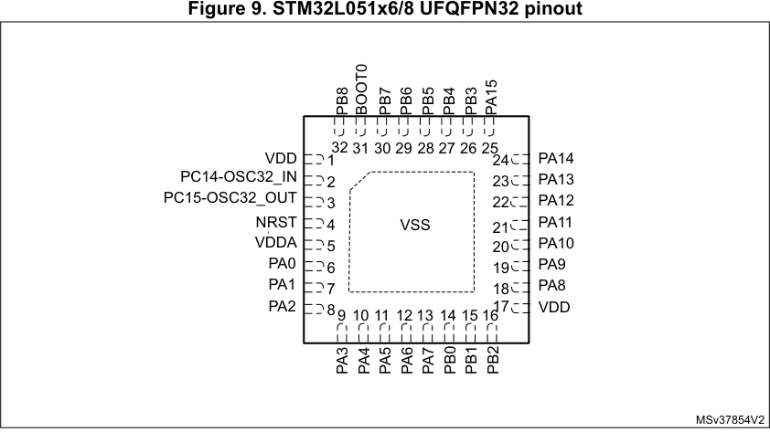

1. The above figure shows the package top view.

**Table 14. Legend/abbreviations used in the pinout table**

|Name|Col2|Abbreviation|Definition|
|---|---|---|---|
|Pin name|Pin name|Unless otherwise specified in brackets below the pin name, the pin function during and after reset is the same as the actual pin name|Unless otherwise specified in brackets below the pin name, the pin function during and after reset is the same as the actual pin name|
|Pin type|Pin type|S|Supply pin|
|Pin type|Pin type|I|Input only pin|
|Pin type|Pin type|I/O|Input / output pin|
|I/O structure|I/O structure|FT|5 V tolerant I/O|
|I/O structure|I/O structure|FTf|5 V tolerant I/O, FM+ capable|
|I/O structure|I/O structure|TC|Standard 3.3V I/O|
|I/O structure|I/O structure|B|Dedicated BOOT0 pin|
|I/O structure|I/O structure|RST|Bidirectional reset pin with embedded weak pull-up resistor|
|Notes|Notes|Unless otherwise specified by a note, all I/Os are set as floating inputs during and after reset.|Unless otherwise specified by a note, all I/Os are set as floating inputs during and after reset.|
|Pin functions|Alternate functions|Functions selected through GPIOx_AFR registers|Functions selected through GPIOx_AFR registers|
|Pin functions|Additional functions|Functions directly selected/enabled through peripheral registers|Functions directly selected/enabled through peripheral registers|

DS10184 Rev 10 37/133

44

--- end of page=36 ---

**Pin descriptions** **STM32L051x6 STM32L051x8**

**Table 15. STM32L051x6/8 pin definitions**

|Pin Number|Col2|Col3|Col4|Col5|Col6|Col7|Pin name (function after reset)|Pin type|I/O structure|Notes|Alternate functions|Additional functions|
|---|---|---|---|---|---|---|---|---|---|---|---|---|
|**LQFP64**|**TFBGA64**|**LQFP48**|**UFQFPN48**|**WLCSP36(1)**|**LQFP32**|**UFQFPN32**|**UFQFPN32**|**UFQFPN32**|**UFQFPN32**|**UFQFPN32**|**UFQFPN32**|**UFQFPN32**|
|1|B2|1|1|-|-|-|VDD|S|-|-|-|-|
|2|A2|2|2|-|-|-|PC13|I/O|FT|-|-|RTC_TAMP1/ RTC_TS/ RTC_OUT/ WKUP2|
|3|A1|3|3|A6|2|2|PC14- OSC32_IN (PC14)|I/O|FT|-|-|OSC32_IN|
|4|B1|4|4|B6|3|3|PC15- OSC32_OUT (PC15)|I/O|TC|-|-|OSC32_OUT|
|5|C1|5|5|-|-|-|PH0-OSC_IN (PH0)|I/O|TC|-|-|OSC_IN|
|6|D1|6|6|-|-|-|PH1- OSC_OUT (PH1)|I/O|TC|-|-|OSC_OUT|
|7|E1|7|7|C6|4|4|NRST|I/O|RST|-|-|-|
|8|E3|-|-|-|-|-|PC0|I/O|FT|-|LPTIM1_IN1, EVENTOUT|ADC_IN10|
|9|E2|-|-|-|-|-|PC1|I/O|FT|-|LPTIM1_OUT, EVENTOUT|ADC_IN11|
|10|F2|-|-|-|-|-|PC2|I/O|FT|-|LPTIM1_IN2, SPI2_MISO/I2S2_M CK|ADC_IN12|
|11|-|-|-|-|-|-|PC3|I/O|FT|-|LPTIM1_ETR, SPI2_MOSI/I2S2_SD|ADC_IN13|
|12|F1|8|8|-|-|-|VSSA|S||-|-|-|
|-|G1|-|-|E6|-|-|VREF+|S||-|-|-|
|13|H1|9|9|D5|5|5|VDDA|S||-|-|-|
|14|G2|10|10|D4|6|6|PA0|I/O|TC|-|TIM2_CH1, USART2_CTS, TIM2_ETR, COMP1_OUT|COMP1_INM6, ADC_IN0, RTC_TAMP2/WKU P1|

38/133 DS10184 Rev 10

--- end of page=37 ---

**STM32L051x6 STM32L051x8** **Pin descriptions**

**Table 15. STM32L051x6/8 pin definitions (continued)**

|Pin Number|Col2|Col3|Col4|Col5|Col6|Col7|Pin name (function after reset)|Pin type|I/O structure|Notes|Alternate functions|Additional functions|
|---|---|---|---|---|---|---|---|---|---|---|---|---|
|**LQFP64**|**TFBGA64**|**LQFP48**|**UFQFPN48**|**WLCSP36(1)**|**LQFP32**|**UFQFPN32**|**UFQFPN32**|**UFQFPN32**|**UFQFPN32**|**UFQFPN32**|**UFQFPN32**|**UFQFPN32**|
|15|H2|11|11|F6|7|7|PA1|I/O|FT|-|EVENTOUT, TIM2_CH2, USART2_RTS/ USART2_DE, TIM21_ETR|COMP1_INP, ADC_IN1|
|16|F3|12|12|E5|8|8|PA2|I/O|FT|-|TIM21_CH1, TIM2_CH3, USART2_TX, COMP2_OUT|COMP2_INM6, ADC_IN2|
|17|G3|13|13|F5|9|9|PA3|I/O|FT|-|TIM21_CH2, TIM2_CH4, USART2_RX|COMP2_INP, ADC_IN3|
|18|C2|-|-|-|-|-|VSS|S||-|-|-|
|19|D2|-|-|-|-|-|VDD|S||-|-|-|
|20|H3|14|14|E4|10|10|PA4|I/O|TC||SPI1_NSS, USART2_CK, TIM22_ETR|COMP1_INM4, COMP2_INM4, ADC_IN4|
|21|F4|15|15|F4|11|11|PA5|I/O|TC|-|SPI1_SCK, TIM2_ETR, TIM2_CH1|COMP1_INM5, COMP2_INM5, ADC_IN5|
|22|G4|16|16|E3|12|12|PA6|I/O|FT|-|SPI1_MISO, LPUART1_CTS, TIM22_CH1, EVENTOUT, COMP1_OUT|ADC_IN6|
|23|H4|17|17|F3|13|13|PA7|I/O|FT|-|SPI1_MOSI, TIM22_CH2, EVENTOUT, COMP2_OUT|ADC_IN7|
|24|H5|-|-|-|-|-|PC4|I/O|FT|-|EVENTOUT, LPUART1_TX|ADC_IN14|
|25|H6|-|-|-|-|-|PC5|I/O|FT|-|LPUART1_RX,|ADC_IN15|
|26|F5|18|18|D3|14|14|PB0|I/O|FT|-|EVENTOUT|ADC_IN8, VREF_OUT|
|27|G5|19|19|C3|15|15|PB1|I/O|FT|-|LPUART1_RTS/ LPUART1_DE|ADC_IN9, VREF_OUT|

DS10184 Rev 10 39/133

44

--- end of page=38 ---

**Pin descriptions** **STM32L051x6 STM32L051x8**

**Table 15. STM32L051x6/8 pin definitions (continued)**

|Pin Number|Col2|Col3|Col4|Col5|Col6|Col7|Pin name (function after reset)|Pin type|I/O structure|Notes|Alternate functions|Additional functions|
|---|---|---|---|---|---|---|---|---|---|---|---|---|
|**LQFP64**|**TFBGA64**|**LQFP48**|**UFQFPN48**|**WLCSP36(1)**|**LQFP32**|**UFQFPN32**|**UFQFPN32**|**UFQFPN32**|**UFQFPN32**|**UFQFPN32**|**UFQFPN32**|**UFQFPN32**|
|28|G6|20|20|F2|-|16|PB2|I/O|FT|-|LPTIM1_OUT|-|
|29|G7|21|21|E2|-|-|PB10|I/O|FT|-|TIM2_CH3, LPUART1_TX, SPI2_SCK, I2C2_SCL|-|
|30|H7|22|22|D2|-|-|PB11|I/O|FT|-|EVENTOUT, TIM2_CH4, LPUART1_RX, I2C2_SDA|-|
|31|D6|23|23|-|16|-|VSS|S|-|-|-|-|
|32|E5|24|24|F1|17|17|VDD|S|-|-|-|-|
|33|H8|25|25|-|-|-|PB12|I/O|FT|-|SPI2_NSS/I2S2_WS, LPUART1_RTS/ LPUART1_DE, EVENTOUT|-|
|34|G8|26|26|-|-|-|PB13|I/O|FTf|-|SPI2_SCK/I2S2_CK, LPUART1_CTS, I2C2_SCL, TIM21_CH1|-|
|35|F8|27|27|-|-|-|PB14|I/O|FTf|-|SPI2_MISO/I 2S2_MCK, RTC_OUT, LPUART1_RTS/ LPUART1_DE, I2C2_SDA, TIM21_CH2|-|
|36|F7|28|28|-|-|-|PB15|I/O|FT|-|SPI2_MOSI/I2S2_SD , RTC_REFIN|-|
|37|F6|-|-|-|-|-|PC6|I/O|FT|-|TIM22_CH1|-|
|38|E7|-|-|-|-|-|PC7|I/O|FT|-|TIM22_CH2|-|
|39|E8|-|-|-|-|-|PC8|I/O|FT|-|TIM22_ETR|-|
|40|D8|-|-|-|-|-|PC9|I/O|FT|-|TIM21_ETR|-|
|41|D7|29|29|E1|18|18|PA8|I/O|FT|-|MCO, EVENTOUT, USART1_CK|-|

40/133 DS10184 Rev 10

--- end of page=39 ---

**STM32L051x6 STM32L051x8** **Pin descriptions**

**Table 15. STM32L051x6/8 pin definitions (continued)**

|Pin Number|Col2|Col3|Col4|Col5|Col6|Col7|Pin name (function after reset)|Pin type|I/O structure|Notes|Alternate functions|Additional functions|
|---|---|---|---|---|---|---|---|---|---|---|---|---|
|**LQFP64**|**TFBGA64**|**LQFP48**|**UFQFPN48**|**WLCSP36(1)**|**LQFP32**|**UFQFPN32**|**UFQFPN32**|**UFQFPN32**|**UFQFPN32**|**UFQFPN32**|**UFQFPN32**|**UFQFPN32**|
|42|C7|30|30|D1|19|19|PA9|I/O|FT|-|MCO, USART1_TX|-|
|43|C6|31|31|C1|20|20|PA10|I/O|FT|-|USART1_RX|-|
|44|C8|32|32|C2|21|21|PA11|I/O|FT|-|SPI1_MISO, EVENTOUT, USART1_CTS, COMP1_OUT|-|
|45|B8|33|33|B1|22|22|PA12|I/O|FT|-|SPI1_MOSI, EVENTOUT, USART1_RTS/ USART1_DE, COMP2_OUT|-|
|46|A8|34|34|A1|23|23|PA13|I/O|FT|-|SWDIO|-|
|47|D5|35|35|-|-|-|VSS|S||-|-|-|
|48|E6|36|36|-|-|-|VDDIO2|S||-|-|-|
|49|A7|37|37|B2|24|24|PA14|I/O|FT|-|SWCLK, USART2_TX||
|50|A6|38|38|A2|25|25|PA15|I/O|FT|-|SPI1_NSS, TIM2_ETR, EVENTOUT, USART2_RX, TIM2_CH1|-|
|51|B7|-|-|-|-|-|PC10|I/O|FT|-|LPUART1_TX|-|
|52|B6|-|-|-|-|-|PC11|I/O|FT|-|LPUART1_RX|-|
|53|C5|-|-|-|-|-|PC12|I/O|FT|-|-|-|
|54|B5|-|-|-|-|-|PD2|I/O|FT|-|LPUART1_RTS/ LPUART1_DE|-|
|55|A5|39|39|B3|26|26|PB3|I/O|FT|-|SPI1_SCK, TIM2_CH2, EVENTOUT|COMP2_INN|
|56|A4|40|40|A3|27|27|PB4|I/O|FT|-|SPI1_MISO, EVENTOUT, TIM22_CH1|COMP2_INP|

DS10184 Rev 10 41/133

44

--- end of page=40 ---

**Pin descriptions** **STM32L051x6 STM32L051x8**

**Table 15. STM32L051x6/8 pin definitions (continued)**

|Pin Number|Col2|Col3|Col4|Col5|Col6|Col7|Pin name (function after reset)|Pin type|I/O structure|Notes|Alternate functions|Additional functions|
|---|---|---|---|---|---|---|---|---|---|---|---|---|
|**LQFP64**|**TFBGA64**|**LQFP48**|**UFQFPN48**|**WLCSP36(1)**|**LQFP32**|**UFQFPN32**|**UFQFPN32**|**UFQFPN32**|**UFQFPN32**|**UFQFPN32**|**UFQFPN32**|**UFQFPN32**|
|57|C4|41|41|C4|28|28|PB5|I/O|FT|-|SPI1_MOSI, LPTIM1_IN1, I2C1_SMBA, TIM22_CH2|COMP2_INP|
|58|D3|42|42|B4|29|29|PB6|I/O|FTf|-|USART1_TX, I2C1_SCL, LPTIM1_ETR|COMP2_INP|
|59|C3|43|43|A4|30|30|PB7|I/O|FTf|-|USART1_RX, I2C1_SDA, LPTIM1_IN2|COMP2_INP, PVD_IN|
|60|B4|44|44|C5|31|31|BOOT0|B||-|-|-|
|61|B3|45|45|B5|-|32|PB8|I/O|FTf|-|I2C1_SCL|-|
|62|A3|46|46|-|-|-|PB9|I/O|FTf|-|EVENTOUT, I2C1_SDA, SPI2_NSS/I2S2_WS|-|
|63|D4|47|47|D6|32|-|VSS|S|-|-|-|-|
|64|E4|48|48|A5|1|1|VDD|S|-|-|-|-|

1. PB9/12/13/14/15, PH0/1 and PC13 GPIOs should be configured as output and driven Low, even if they are not available on
this package.

42/133 DS10184 Rev 10

--- end of page=41 ---

**Table 16. Alternate function port A**

|Port|Col2|AF0|AF1|AF2|AF3|AF4|AF5|AF6|AF7|
|---|---|---|---|---|---|---|---|---|---|
|**Port**|**Port**|**SPI1/TIM21/SYS_A** **F/EVENTOUT/**|**-**|**TIM2/** **EVENTOUT/**|**EVENTOUT**|**USART1/2/3**|**TIM2/21/22**|**EVENTOUT**|**COMP1/2**|
|Port A|PA0|-|-|TIM2_CH1|-|USART2_CTS|TIM2_ETR|-|COMP1_OUT|
|Port A|PA1|EVENTOUT|-|TIM2_CH2|-|USART2_RTS/ USART2_DE|TIM21_ETR|-|-|
|Port A|PA2|TIM21_CH1|-|TIM2_CH3|-|USART2_TX|-|-|COMP2_OUT|
|Port A|PA3|TIM21_CH2|-|TIM2_CH4|-|USART2_RX|-|-|-|
|Port A|PA4|SPI1_NSS|-|-|-|USART2_CK|TIM22_ETR|-|-|
|Port A|PA5|SPI1_SCK|-|TIM2_ETR|-|-|TIM2_CH1|-|-|
|Port A|PA6|SPI1_MISO|-|-|-|LPUART1_CTS|TIM22_CH1|EVENTOUT|COMP1_OUT|
|Port A|PA7|SPI1_MOSI|-|-|-|-|TIM22_CH2|EVENTOUT|COMP2_OUT|
|Port A|PA8|MCO|-|-|EVENTOUT|USART1_CK|-|-|-|
|Port A|PA9|MCO|-|-|-|USART1_TX|-|-|-|
|Port A|PA10|-|-|-|-|USART1_RX|-|-|-|
|Port A|PA11|SPI1_MISO|-|EVENTOUT|-|USART1_CTS|-|-|COMP1_OUT|
|Port A|PA12|SPI1_MOSI|-|EVENTOUT|-|USART1_RTS/ USART1_DE|-|-|COMP2_OUT|
|Port A|PA13|SWDIO|-|-|-|-|-|-|-|
|Port A|PA14|SWCLK|-|-|-|USART2_TX|-|-|-|
|Port A|PA15|SPI1_NSS|-|TIM2_ETR|EVENTOUT|USART2_RX|TIM2_CH1|-|-|

--- end of page=42 ---

**Table 17. Alternate function port B**

|Port|Col2|AF0|AF1|AF2|AF3|AF4|AF5|AF6|
|---|---|---|---|---|---|---|---|---|
|**Port**|**Port**|**SPI1/SPI2/I2S2/** **USART1/** **EVENTOUT/**|**I2C1**|**LPUART1/LPTIM** **/TIM2/SYS_AF/** **EVENTOUT**|**I2C1**|**I2C1/TIM22/** **EVENTOUT/** **LPUART1**|**SPI2/I2S2/I2C2**|**I2C2/TIM21/** **EVENTOUT**|
|Port B|PB0|EVENTOUT|-|-|-|-|-|-|
|Port B|PB1|-|-|-|-|LPUART1_RTS/ LPUART1_DE|-|-|
|Port B|PB2|-|-|LPTIM1_OUT|-|-|-|-|
|Port B|PB3|SPI1_SCK|-|TIM2_CH2|-|EVENTOUT|-|-|
|Port B|PB4|SPI1_MISO|-|EVENTOUT|-|TIM22_CH1|-|-|
|Port B|PB5|SPI1_MOSI|-|LPTIM1_IN1|I2C1_SMBA|TIM22_CH2|-|-|
|Port B|PB6|USART1_TX|I2C1_SCL|LPTIM1_ETR|-|-|-|-|
|Port B|PB7|USART1_RX|I2C1_SDA|LPTIM1_IN2|-|-|-|-|
|Port B|PB8|-|-|-|-|I2C1_SCL|-|-|
|Port B|PB9|-|-|EVENTOUT|-|I2C1_SDA|SPI2_NSS/I2S2_ WS|-|
|Port B|PB10|-|-|TIM2_CH3|-|LPUART1_TX|SPI2_SCK|I2C2_SCL|
|Port B|PB11|EVENTOUT|-|TIM2_CH4|-|LPUART1_RX|-|I2C2_SDA|
|Port B|PB12|SPI2_NSS/I2S2_WS|-|LPUART1_RTS/ LPUART1_DE|-|-|-|EVENTOUT|
|Port B|PB13|SPI2_SCK/I2S2_CK|-|-|-|LPUART1_CTS|I2C2_SCL|TIM21_CH1|
|Port B|PB14|SPI2_MISO/I2S2_MCK|-|RTC_OUT|-|LPUART1_RTS/ LPUART1_DE|I2C2_SDA|TIM21_CH2|
|Port B|PB15|SPI2_MOSI/I2S2_SD|-|RTC_REFIN|-||-|-|

--- end of page=43 ---

**STM32L051x6 STM32L051x8** **Memory mapping**

### **5 Memory mapping**

Refer to the product line reference manual for details on the memory mapping as well as the
boundary addresses for all peripherals.

DS10184 Rev 10 45/133

45

--- end of page=44 ---

**Electrical characteristics** **STM32L051x6 STM32L051x8**

### **6 Electrical characteristics**

##### **6.1 Parameter conditions**

Unless otherwise specified, all voltages are referenced to V SS .

**6.1.1** **Minimum and maximum values**

Unless otherwise specified the minimum and maximum values are guaranteed in the worst
conditions of ambient temperature, supply voltage and frequencies by tests in production on
100% of the devices with an ambient temperature at T A = 25 °C and T A = T A max (given by
the selected temperature range).

Data based on characterization results, design simulation and/or technology characteristics
are indicated in the table footnotes and are not tested in production. Based on
characterization, the minimum and maximum values refer to sample tests and represent the
mean value plus or minus three times the standard deviation (mean±3σ).

**6.1.2** **Typical values**

Unless otherwise specified, typical data are based on T A = 25 °C, V DD = 3.6 V (for the
1.65 V ≤ V DD ≤ 3.6 V voltage range). They are given only as design guidelines and are not
tested.

Typical ADC accuracy values are determined by characterization of a batch of samples from
a standard diffusion lot over the full temperature range, where 95% of the devices have an
error less than or equal to the value indicated (mean±2σ) .

**6.1.3** **Typical curves**

Unless otherwise specified, all typical curves are given only as design guidelines and are
not tested.

**6.1.4** **Loading capacitor**

The loading conditions used for pin parameter measurement are shown in _Figure 10_ .

**6.1.5** **Pin input voltage**

The input voltage measurement on a pin of the device is described in _Figure 11_ .

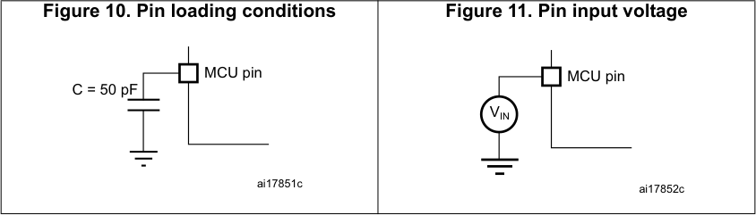

46/133 DS10184 Rev 10

--- end of page=45 ---

**STM32L051x6 STM32L051x8** **Electrical characteristics**

**6.1.6** **Power supply scheme**

**Figure 12. Power supply scheme**

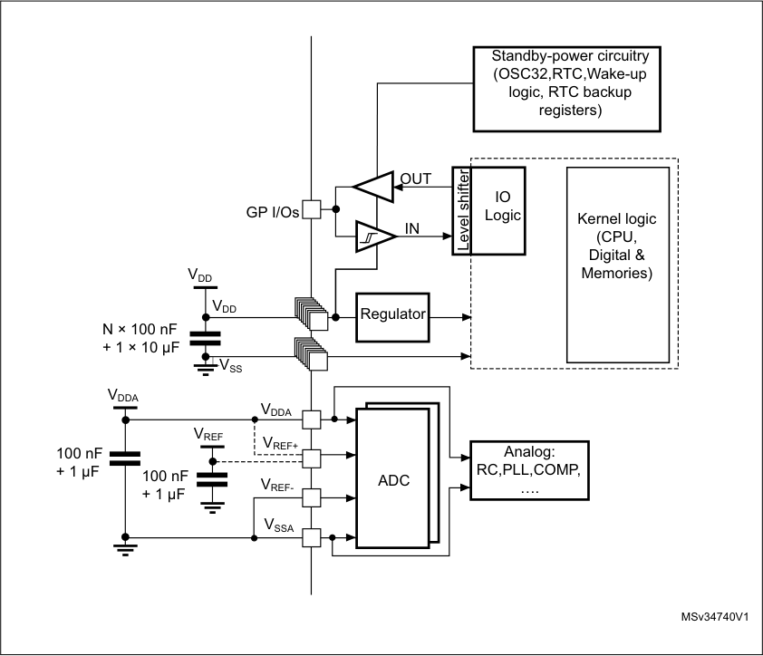

|Col1|���|
|---|---|
||,1|
|||

|Col1|Col2|Col3|$'&|Col5|
|---|---|---|---|---|
|95()|||||
|95()|||||
|95()|||||

**6.1.7** **Current consumption measurement**

**Figure 13. Current consumption measurement scheme**

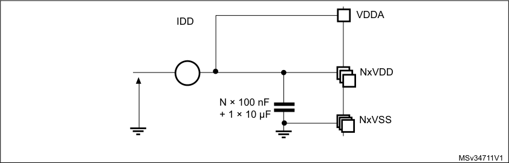

DS10184 Rev 10 47/133

99

--- end of page=46 ---

**Electrical characteristics** **STM32L051x6 STM32L051x8**

##### **6.2 Absolute maximum ratings**

Stresses above the absolute maximum ratings listed in _Table 18: Voltage characteristics_,
_Table 19: Current characteristics_, and _Table 20: Thermal characteristics_ may cause
permanent damage to the device. These are stress ratings only and functional operation of
the device at these conditions is not implied. Exposure to maximum rating conditions for
extended periods may affect device reliability. Device mission profile (application conditions)
is compliant with JEDEC JESD47 Qualification Standard. Extended mission profiles are
available on demand.

**Table 18. Voltage characteristics**

|Symbol|Definition|Min|Max|Unit|
|---|---|---|---|---|
|VDD–VSS|External main supply voltage  (including VDDA, VDDIO2, VDD)(1)|–0.3|4.0|V|
|VIN (2)|Input voltage on FT and FTf pins|VSS− 0.3|VDD+4.0|VDD+4.0|
|VIN (2)|Input voltage on TC pins|VSS− 0.3|4.0|4.0|
|VIN (2)|Input voltage on BOOT0|VSS|VDD + 4.0|VDD + 4.0|
|VIN (2)|Input voltage on any other pin|VSS − 0.3|4.0|4.0|
||ΔVDD||Variations between different VDDxpower pins|-|50|mV|
||VDDA-VDDx||Variations between any VDDxand VDDA power pins(3)|-|300|300|
||ΔVSS||Variations between all different ground pins|-|50|50|
|VREF+–VDDA|Allowed voltage difference for VREF+> VDDA|-|0.4|V|
|VESD(HBM)|Electrostatic discharge voltage  (human body model)|see_Section 6.3.11_|see_Section 6.3.11_||

1. All main power (V DD,V DDIO2, V DDA ) and ground (V SS, V SSA ) pins must always be connected to the external
power supply, in the permitted range.

2. V IN maximum must always be respected. Refer to _Table 19_ for maximum allowed injected current values.

3. It is recommended to power V DD and V DDA from the same source. A maximum difference of 300 mV
between V DD and V DDA can be tolerated during power-up and device operation. V DDIO2 is independent
from V DD and V DDA : its value does not need to respect this rule.

48/133 DS10184 Rev 10

--- end of page=47 ---

**STM32L051x6 STM32L051x8** **Electrical characteristics**

**Table 19. Current characteristics**

|Symbol|Ratings|Max.|Unit|
|---|---|---|---|
|ΣIVDD (2)|Total current into sum of all VDD power lines (source)(1)|105|mA|
|ΣIVSS (2)|Total current out of sum of all VSS ground lines (sink)(1)|105|105|
|ΣIVDDIO2|Total current into VDDIO2 power line (source)|25|25|
|IVDD(PIN)|Maximum current into each VDD power pin (source)(1)|100|100|
|IVSS(PIN)|Maximum current out of each VSS ground pin (sink)(1)|100|100|
|IIO|Output current sunk by any I/O and control pin except FTf pins|16|16|
|IIO|Output current sunk by FTf pins|22|22|
|IIO|Output current sourced by any I/O and control pin|-16|-16|
|ΣIIO(PIN)|Total output current sunk by sum of all IOs and control pins except PA11 and PA12(2)|90|90|
|ΣIIO(PIN)|Total output current sunk by PA11 and PA12|25|25|
|ΣIIO(PIN)|Total output current sourced by sum of all IOs and control pins(2)|-90|-90|
|IINJ(PIN)|Injected current on FT, FTf, RST and B pins|-5/+0(3)|-5/+0(3)|
|IINJ(PIN)|Injected current on TC pin|± 5(4)|± 5(4)|
|ΣIINJ(PIN)|Total injected current (sum of all I/O and control pins)(5)|± 25|± 25|

1. All main power (V DD, V DDA ) and ground (V SS, V SSA ) pins must always be connected to the external power
supply, in the permitted range.

2. This current consumption must be correctly distributed over all I/Os and control pins. The total output
current must not be sunk/sourced between two consecutive power supply pins referring to high pin count
LQFP packages.

3. Positive current injection is not possible on these I/Os. A negative injection is induced by V IN <V SS . I INJ(PIN)
must never be exceeded. Refer to _Table 18_ for maximum allowed input voltage values.

4. A positive injection is induced by V IN - V DD while a negative injection is induced by V IN < V SS . I INJ(PIN)
must never be exceeded. Refer to _Table 18: Voltage characteristics_ for the maximum allowed input voltage
values.

5. When several inputs are submitted to a current injection, the maximum Σ I INJ(PIN) is the absolute sum of the
positive and negative injected currents (instantaneous values).

**Table 20. Thermal characteristics**

|Symbol|Ratings|Value|Unit|
|---|---|---|---|
|TSTG|Storage temperature range|–65 to +150|°C|
|TJ|Maximum junction temperature|150|°C|

DS10184 Rev 10 49/133

99

--- end of page=48 ---

**Electrical characteristics** **STM32L051x6 STM32L051x8**

##### **6.3 Operating conditions**

**6.3.1** **General operating conditions**

**Table 21. General operating conditions**

|Symbol|Parameter|Conditions|Min|Max|Unit|
|---|---|---|---|---|---|
|fHCLK|Internal AHB clock frequency|-|0|32|MHz|
|fPCLK1|Internal APB1 clock frequency|-|0|32|32|
|fPCLK2|Internal APB2 clock frequency|-|0|32|32|
|VDD|Standard operating voltage|BOR detector disabled|1.65|3.6|V|
|VDD|Standard operating voltage|BOR detector enabled, at power-on|1.8|3.6|3.6|
|VDD|Standard operating voltage|BOR detector disabled, after power-on|1.65|3.6|3.6|
|VDDA|Analog operating voltage (all features)|Must be the same voltage as VDD (1)|1.65|3.6|V|
|VDDIO2|Standard operating voltage|-|1.65|3.6|V|
|VIN|Input voltage on FT, FTf and RST pins(2)|2.0 V≤ VDD ≤ 3.6 V|-0.3|5.5|V|
|VIN|Input voltage on FT, FTf and RST pins(2)|1.65 V≤ VDD ≤ 2.0 V|-0.3|5.2|5.2|
|VIN|Input voltage on BOOT0 pin|-|0|5.5|5.5|
|VIN|Input voltage on TC pin|-|-0.3|VDD+0.3|VDD+0.3|
|PD|Power dissipation at TA = 85 °C (range 6) or TA =105 °C (rage 7)(3)|TFBGA64 package|-|327|mW|
|PD|Power dissipation at TA = 85 °C (range 6) or TA =105 °C (rage 7)(3)|LQFP64 package|-|444|444|
|PD|Power dissipation at TA = 85 °C (range 6) or TA =105 °C (rage 7)(3)|LQFP48 package|-|363|363|
|PD|Power dissipation at TA = 85 °C (range 6) or TA =105 °C (rage 7)(3)|Standard WLCSP36 package|-|318|318|
|PD|Power dissipation at TA = 85 °C (range 6) or TA =105 °C (rage 7)(3)|Thin WLCSP36 package|-|338|338|
|PD|Power dissipation at TA = 85 °C (range 6) or TA =105 °C (rage 7)(3)|LQFP32 package|-|351|351|
|PD|Power dissipation at TA = 85 °C (range 6) or TA =105 °C (rage 7)(3)|UFQFPN32|-|526|526|
|PD|Power dissipation at TA = 85 °C (range 6) or TA =105 °C (rage 7)(3)|UFQFPN48|-|654|654|
|PD|Power dissipation at TA = 125 °C (range 3)(3)|TFBGA64 package|-|81|81|
|PD|Power dissipation at TA = 125 °C (range 3)(3)|LQFP64 package|-|111|111|
|PD|Power dissipation at TA = 125 °C (range 3)(3)|LQFP48 package|-|91|91|
|PD|Power dissipation at TA = 125 °C (range 3)(3)|Standard WLCSP36 package|-|79|79|
|PD|Power dissipation at TA = 125 °C (range 3)(3)|Thin WLCSP36 package|-|84|84|
|PD|Power dissipation at TA = 125 °C (range 3)(3)|LQFP32 package|-|88|88|
|PD|Power dissipation at TA = 125 °C (range 3)(3)|UFQFPN32|-|132|132|
|PD|Power dissipation at TA = 125 °C (range 3)(3)|UFQFPN48|-|163|163|

50/133 DS10184 Rev 10

--- end of page=49 ---

