# STM32L051C8 — Pages 51–100

**STM32L051x6 STM32L051x8** **Electrical characteristics**

**Table 21. General operating conditions (continued)**

|Symbol|Parameter|Conditions|Min|Max|Unit|
|---|---|---|---|---|---|
|TA|Temperature range|Maximum power dissipation (range 6)|–40|85|°C|
|TA|Temperature range|Maximum power dissipation (range 7)|–40|105|105|
|TA|Temperature range|Maximum power dissipation (range 3)|–40|125|125|
|TJ|Junction temperature range (range 6)|-40 °C≤ TA ≤ 85 °|–40|105|105|
|TJ|Junction temperature range (range 7)|-40 °C≤ TA ≤ 105 °C|–40|125|125|
|TJ|Junction temperature range (range 3)|-40 °C≤ TA ≤ 125 °C|–40|130|130|

1. It is recommended to power V DD and V DDA from the same source. A maximum difference of 300 mV between V DD and V DDA
can be tolerated during power-up and normal operation.

2. To sustain a voltage higher than V DD +0.3V, the internal pull-up/pull-down resistors must be disabled.

3. If T A is lower, higher P D values are allowed as long as T J does not exceed T J max (see _Table 20: Thermal characteristics on_
_page 49_ ).

DS10184 Rev 10 51/133

99

--- end of page=50 ---

**Electrical characteristics** **STM32L051x6 STM32L051x8**

**6.3.2** **Embedded reset and power control block characteristics**

The parameters given in the following table are derived from the tests performed under the
ambient temperature condition summarized in _Table 21_ .

**Table 22. Embedded reset and power control block characteristics**

|Symbol|Parameter|Conditions|Min|Typ|Max|Unit|
|---|---|---|---|---|---|---|
|tVDD (1)|VDD rise time rate|BOR detector enabled|0|-|∞|µs/V|
|tVDD (1)|VDD rise time rate|BOR detector disabled|0|-|1000|1000|
|tVDD (1)|VDD fall time rate|BOR detector enabled|20|-|∞|∞|
|tVDD (1)|VDD fall time rate|BOR detector disabled|0|-|1000|1000|
|TRSTTEMPO (1)|Reset temporization|VDD rising, BOR enabled|-|2|3.3|ms|
|TRSTTEMPO (1)|Reset temporization|VDD rising, BOR disabled(2)|0.4|0.7|1.6|1.6|
|VPOR/PDR|Power-on/power down reset threshold|Falling edge|1|1.5|1.65|V|
|VPOR/PDR|Power-on/power down reset threshold|Rising edge|1.3|1.5|1.65|1.65|
|VBOR0|Brown-out reset threshold 0|Falling edge|1.67|1.7|1.74|1.74|
|VBOR0|Brown-out reset threshold 0|Rising edge|1.69|1.76|1.8|1.8|
|VBOR1|Brown-out reset threshold 1|Falling edge|1.87|1.93|1.97|1.97|
|VBOR1|Brown-out reset threshold 1|Rising edge|1.96|2.03|2.07|2.07|
|VBOR2|Brown-out reset threshold 2|Falling edge|2.22|2.30|2.35|2.35|
|VBOR2|Brown-out reset threshold 2|Rising edge|2.31|2.41|2.44|2.44|
|VBOR3|Brown-out reset threshold 3|Falling edge|2.45|2.55|2.6|2.6|
|VBOR3|Brown-out reset threshold 3|Rising edge|2.54|2.66|2.7|2.7|
|VBOR4|Brown-out reset threshold 4|Falling edge|2.68|2.8|2.85|2.85|
|VBOR4|Brown-out reset threshold 4|Rising edge|2.78|2.9|2.95|2.95|
|VPVD0|Programmable voltage detector threshold 0|Falling edge|1.8|1.85|1.88|1.88|
|VPVD0|Programmable voltage detector threshold 0|Rising edge|1.88|1.94|1.99|1.99|
|VPVD1|PVD threshold 1|Falling edge|1.98|2.04|2.09|2.09|
|VPVD1|PVD threshold 1|Rising edge|2.08|2.14|2.18|2.18|
|VPVD2|PVD threshold 2|Falling edge|2.20|2.24|2.28|2.28|
|VPVD2|PVD threshold 2|Rising edge|2.28|2.34|2.38|2.38|
|VPVD3|PVD threshold 3|Falling edge|2.39|2.44|2.48|2.48|
|VPVD3|PVD threshold 3|Rising edge|2.47|2.54|2.58|2.58|
|VPVD4|PVD threshold 4|Falling edge|2.57|2.64|2.69|2.69|
|VPVD4|PVD threshold 4|Rising edge|2.68|2.74|2.79|2.79|
|VPVD5|PVD threshold 5|Falling edge|2.77|2.83|2.88|2.88|
|VPVD5|PVD threshold 5|Rising edge|2.87|2.94|2.99|2.99|

52/133 DS10184 Rev 10

--- end of page=51 ---

**STM32L051x6 STM32L051x8** **Electrical characteristics**

**Table 22. Embedded reset and power control block characteristics (continued)**

|Symbol|Parameter|Conditions|Min|Typ|Max|Unit|
|---|---|---|---|---|---|---|
|VPVD6|PVD threshold 6|Falling edge|2.97|3.05|3.09|V|
|VPVD6|PVD threshold 6|Rising edge|3.08|3.15|3.20|3.20|
|Vhyst|Hysteresis voltage|BOR0 threshold|-|40|-|mV|
|Vhyst|Hysteresis voltage|All BOR and PVD thresholds excepting BOR0|-|100|-|-|

1. Guaranteed by characterization results.

2. Valid for device version without BOR at power up. Please see option "D" in Ordering information scheme for more details.

**6.3.3** **Embedded internal reference voltage**

The parameters given in _Table 24_ are based on characterization results, unless otherwise
specified.

**Table 23. Embedded internal reference voltage calibration values**

|Calibration value name|Description|Memory address|
|---|---|---|
|VREFINT_CAL|Raw data acquired at temperature of 25 °C  VDDA= 3 V|0x1FF8 0078 - 0x1FF8 0079|

**Table 24. Embedded internal reference voltage** **[(1)]**

|Symbol|Parameter|Conditions|Min|Typ|Max|Unit|
|---|---|---|---|---|---|---|
|VREFINT out (2)|Internal reference voltage|– 40 °C < TJ < +125 °C|1.202|1.224|1.242|V|
|TVREFINT|Internal reference startup time|-|-|2|3|ms|
|VVREF_MEAS|VDDA and VREF+ voltage during VREFINT factory measure|-|2.99|3|3.01|V|
|AVREF_MEAS|Accuracy of factory-measured VREFINTvalue(3)|Including uncertainties due to ADC and VDDA/VREF+ values|-|-|±5|mV|
|TCoeff (4)|Temperature coefficient|–40 °C < TJ < +125 °C|-|25|100|ppm/°C|
|ACoeff (4)|Long-term stability|1000 hours, T= 25 °C|-|-|1000|ppm|
|VDDCoeff (4)|Voltage coefficient|3.0 V < VDDA < 3.6 V|-|-|2000|ppm/V|
|TS_vrefint (4)(5)|ADC sampling time when reading the internal reference voltage|-|5|10|-|µs|
|TADC_BUF (4)|Startup time of reference voltage buffer for ADC|-|-|-|10|µs|
|IBUF_ADC (4)|Consumption of reference voltage buffer for ADC|-|-|13.5|25|µA|
|IVREF_OUT (4)|VREF_OUT output current(6)|-|-|-|1|µA|
|CVREF_OUT (4)|VREF_OUT output load|-|-|-|50|pF|

DS10184 Rev 10 53/133

99

--- end of page=52 ---

**Electrical characteristics** **STM32L051x6 STM32L051x8**

**Table 24. Embedded internal reference voltage** **[(1)]** **(continued)**

|Symbol|Parameter|Conditions|Min|Typ|Max|Unit|
|---|---|---|---|---|---|---|
|ILPBUF (4)|Consumption of reference voltage buffer for VREF_OUT and COMP|-|-|730|1200|nA|
|VREFINT_DIV1 (4)|1/4 reference voltage|-|24|25|26|%  VREFINT|
|VREFINT_DIV2 (4)|1/2 reference voltage|-|49|50|51|51|
|VREFINT_DIV3 (4)|3/4 reference voltage|-|74|75|76|76|

1. Refer to _Table 36: Peripheral current consumption in Stop and Standby mode_ for the value of the internal reference current
consumption (I REFINT ).

2. Guaranteed by test in production.

3. The internal V REF value is individually measured in production and stored in dedicated EEPROM bytes.

4. Guaranteed by design.

5. Shortest sampling time can be determined in the application by multiple iterations.

6. To guarantee less than 1% VREF_OUT deviation.

**6.3.4** **Supply current characteristics**

The current consumption is a function of several parameters and factors such as the
operating voltage, temperature, I/O pin loading, device software configuration, operating
frequencies, I/O pin switching rate, program location in memory and executed binary code.
The current consumption is measured as described in _Figure 13: Current consumption_
_measurement scheme_ .

All Run-mode current consumption measurements given in this section are performed with a
reduced code that gives a consumption equivalent to Dhrystone 2.1 code if not specified
otherwise.

The current consumption values are derived from the tests performed under ambient
temperature and V DD supply voltage conditions summarized in _Table 21: General operating_
_conditions_ unless otherwise specified.

The MCU is placed under the following conditions:

      - All I/O pins are configured in analog input mode

      - All peripherals are disabled except when explicitly mentioned

      - The Flash memory access time and prefetch is adjusted depending on fHCLK
frequency and voltage range to provide the best CPU performance unless otherwise
specified.

      - When the peripherals are enabled f APB1 = f APB2 = f APB

      - When PLL is ON, the PLL inputs are equal to HSI = 16 MHz (if internal clock is used) or
HSE = 16 MHz (if HSE bypass mode is used)

      - The HSE user clock applied to OSCI_IN input follows the characteristic specified in
_Table 38: High-speed external user clock characteristics_

      - For maximum current consumption V DD = V DDA = 3.6 V is applied to all supply pins

      - For typical current consumption V DD = V DDA = 3.0 V is applied to all supply pins if not
specified otherwise

The parameters given in _Table 45_, _Table 21_ and _Table 22_ are derived from tests performed
under ambient temperature and V DD supply voltage conditions summarized in _Table 21_ .

54/133 DS10184 Rev 10

--- end of page=53 ---

**STM32L051x6 STM32L051x8** **Electrical characteristics**

**Table 25. Current consumption in Run mode, code with data processing running from Flash**

|Symbol|Parameter|Conditions|Col4|f HCLK|Typ|Max(1)|Unit|
|---|---|---|---|---|---|---|---|
|IDD  (Run from Flash)|Supply current in Run mode, code executed from Flash|fHSE = fHCLK up to 16 MHz included, fHSE = fHCLK/2 above 16 MHz (PLL ON)(2)|Range 3, VCORE=1.2 V VOS[1:0]=11|1 MHz|165|230|µA|
|IDD  (Run from Flash)|Supply current in Run mode, code executed from Flash|fHSE = fHCLK up to 16 MHz included, fHSE = fHCLK/2 above 16 MHz (PLL ON)(2)|Range 3, VCORE=1.2 V VOS[1:0]=11|2 MHz|290|360|360|
|IDD  (Run from Flash)|Supply current in Run mode, code executed from Flash|fHSE = fHCLK up to 16 MHz included, fHSE = fHCLK/2 above 16 MHz (PLL ON)(2)|Range 3, VCORE=1.2 V VOS[1:0]=11|4 MHz|555|630|630|
|IDD  (Run from Flash)|Supply current in Run mode, code executed from Flash|fHSE = fHCLK up to 16 MHz included, fHSE = fHCLK/2 above 16 MHz (PLL ON)(2)|Range 2, VCORE=1.5 V, VOS[1:0]=10,|4 MHz|0.665|0.74|mA|
|IDD  (Run from Flash)|Supply current in Run mode, code executed from Flash|fHSE = fHCLK up to 16 MHz included, fHSE = fHCLK/2 above 16 MHz (PLL ON)(2)|Range 2, VCORE=1.5 V, VOS[1:0]=10,|8 MHz|1.3|1.4|1.4|
|IDD  (Run from Flash)|Supply current in Run mode, code executed from Flash|fHSE = fHCLK up to 16 MHz included, fHSE = fHCLK/2 above 16 MHz (PLL ON)(2)|Range 2, VCORE=1.5 V, VOS[1:0]=10,|16 MHz|2.6|2.8|2.8|
|IDD  (Run from Flash)|Supply current in Run mode, code executed from Flash|fHSE = fHCLK up to 16 MHz included, fHSE = fHCLK/2 above 16 MHz (PLL ON)(2)|Range 1, VCORE=1.8 V, VOS[1:0]=01|8 MHz|1.55|1.7|1.7|
|IDD  (Run from Flash)|Supply current in Run mode, code executed from Flash|fHSE = fHCLK up to 16 MHz included, fHSE = fHCLK/2 above 16 MHz (PLL ON)(2)|Range 1, VCORE=1.8 V, VOS[1:0]=01|16 MHz|3.1|3.4|3.4|
|IDD  (Run from Flash)|Supply current in Run mode, code executed from Flash|fHSE = fHCLK up to 16 MHz included, fHSE = fHCLK/2 above 16 MHz (PLL ON)(2)|Range 1, VCORE=1.8 V, VOS[1:0]=01|32 MHz|6.3|6.8|6.8|
|IDD  (Run from Flash)|Supply current in Run mode, code executed from Flash|MSI clock|Range 3, VCORE=1.2 V, VOS[1:0]=11|65 kHz|36.5|110|µA|
|IDD  (Run from Flash)|Supply current in Run mode, code executed from Flash|MSI clock|Range 3, VCORE=1.2 V, VOS[1:0]=11|524 kHz|99.5|190|190|
|IDD  (Run from Flash)|Supply current in Run mode, code executed from Flash|MSI clock|Range 3, VCORE=1.2 V, VOS[1:0]=11|4.2 MHz|620|700|700|
|IDD  (Run from Flash)|Supply current in Run mode, code executed from Flash|HSI clock|Range 2, VCORE=1.5 V, VOS[1:0]=10,|16 MHz|2.6|2.9|mA|
|IDD  (Run from Flash)|Supply current in Run mode, code executed from Flash|HSI clock|Range 1, VCORE=1.8 V, VOS[1:0]=01|32 MHz|6.25|7|7|

1. Guaranteed by characterization results at 125 °C, unless otherwise specified.

2. Oscillator bypassed (HSEBYP = 1 in RCC_CR register).

**Table 26. Current consumption in Run mode vs code type,**
**code with data processing running from Flash**

|Symbol|Parameter|Conditions|Col4|Col5|f HCLK|Typ|Unit|
|---|---|---|---|---|---|---|---|
|IDD  (Run from Flash)|Supply current in Run mode, code executed from Flash|fHSE = fHCLK up to 16 MHz included, fHSE = fHCLK/2 above 16 MHz (PLL ON)(1)|Range 3, VCORE=1.2 V, VOS[1:0]=11|Dhrystone|4 MHz|555|µA|
|IDD  (Run from Flash)|Supply current in Run mode, code executed from Flash|fHSE = fHCLK up to 16 MHz included, fHSE = fHCLK/2 above 16 MHz (PLL ON)(1)|Range 3, VCORE=1.2 V, VOS[1:0]=11|CoreMark|CoreMark|585|585|
|IDD  (Run from Flash)|Supply current in Run mode, code executed from Flash|fHSE = fHCLK up to 16 MHz included, fHSE = fHCLK/2 above 16 MHz (PLL ON)(1)|Range 3, VCORE=1.2 V, VOS[1:0]=11|Fibonacci|Fibonacci|440|440|
|IDD  (Run from Flash)|Supply current in Run mode, code executed from Flash|fHSE = fHCLK up to 16 MHz included, fHSE = fHCLK/2 above 16 MHz (PLL ON)(1)|Range 3, VCORE=1.2 V, VOS[1:0]=11|while(1)|while(1)|355|355|
|IDD  (Run from Flash)|Supply current in Run mode, code executed from Flash|fHSE = fHCLK up to 16 MHz included, fHSE = fHCLK/2 above 16 MHz (PLL ON)(1)|Range 3, VCORE=1.2 V, VOS[1:0]=11|while(1), prefetch OFF|while(1), prefetch OFF|353|353|
|IDD  (Run from Flash)|Supply current in Run mode, code executed from Flash|fHSE = fHCLK up to 16 MHz included, fHSE = fHCLK/2 above 16 MHz (PLL ON)(1)|Range 1, VCORE=1.8 V, VOS[1:0]=01|Dhrystone|32 MHz|6.3|mA|
|IDD  (Run from Flash)|Supply current in Run mode, code executed from Flash|fHSE = fHCLK up to 16 MHz included, fHSE = fHCLK/2 above 16 MHz (PLL ON)(1)|Range 1, VCORE=1.8 V, VOS[1:0]=01|CoreMark|CoreMark|6.3|6.3|
|IDD  (Run from Flash)|Supply current in Run mode, code executed from Flash|fHSE = fHCLK up to 16 MHz included, fHSE = fHCLK/2 above 16 MHz (PLL ON)(1)|Range 1, VCORE=1.8 V, VOS[1:0]=01|Fibonacci|Fibonacci|6.55|6.55|
|IDD  (Run from Flash)|Supply current in Run mode, code executed from Flash|fHSE = fHCLK up to 16 MHz included, fHSE = fHCLK/2 above 16 MHz (PLL ON)(1)|Range 1, VCORE=1.8 V, VOS[1:0]=01|while(1)|while(1)|5.4|5.4|
|IDD  (Run from Flash)|Supply current in Run mode, code executed from Flash|fHSE = fHCLK up to 16 MHz included, fHSE = fHCLK/2 above 16 MHz (PLL ON)(1)|Range 1, VCORE=1.8 V, VOS[1:0]=01|while(1), prefetch OFF|while(1), prefetch OFF|5.2|5.2|

1. Oscillator bypassed (HSEBYP = 1 in RCC_CR register).

DS10184 Rev 10 55/133

99

--- end of page=54 ---

**Electrical characteristics** **STM32L051x6 STM32L051x8**

**Figure 14. I** **DD** **vs V** **DD** **, at T** **A** **= 25/55/85/105 °C, Run mode, code running from**
**Flash memory, Range 2, HSE, 1WS**

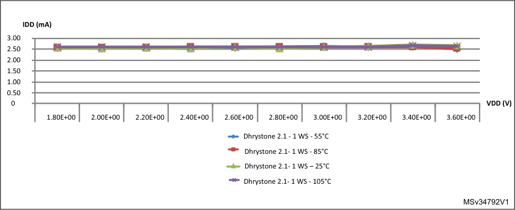

**Figure 15. I** **DD** **vs V** **DD** **, at T** **A** **= 25/55/85/105 °C, Run mode, code running from**
**Flash memory, Range 2, HSI16, 1WS**

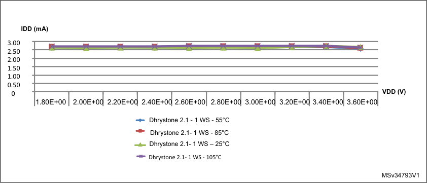

56/133 DS10184 Rev 10

--- end of page=55 ---

**STM32L051x6 STM32L051x8** **Electrical characteristics**

**Table 27. Current consumption in Run mode, code with data processing running from RAM**

|Symbol|Parameter|Conditions|Col4|f HCLK|Typ|Max(1)|Unit|
|---|---|---|---|---|---|---|---|
|IDD (Run from RAM)|Supply current in Run mode, code executed from RAM, Flash switched off|fHSE = fHCLK up to 16 MHz included, fHSE = fHCLK/2 above 16 MHz (PLL ON)(2)|Range 3, VCORE=1.2 V, VOS[1:0]=11|1 MHz|135|170|µA|
|IDD (Run from RAM)|Supply current in Run mode, code executed from RAM, Flash switched off|fHSE = fHCLK up to 16 MHz included, fHSE = fHCLK/2 above 16 MHz (PLL ON)(2)|Range 3, VCORE=1.2 V, VOS[1:0]=11|2 MHz|240|270|270|
|IDD (Run from RAM)|Supply current in Run mode, code executed from RAM, Flash switched off|fHSE = fHCLK up to 16 MHz included, fHSE = fHCLK/2 above 16 MHz (PLL ON)(2)|Range 3, VCORE=1.2 V, VOS[1:0]=11|4 MHz|450|480|480|
|IDD (Run from RAM)|Supply current in Run mode, code executed from RAM, Flash switched off|fHSE = fHCLK up to 16 MHz included, fHSE = fHCLK/2 above 16 MHz (PLL ON)(2)|Range 2, VCORE=1.5,V, VOS[1:0]=10|4 MHz|0.52|0.6|mA|
|IDD (Run from RAM)|Supply current in Run mode, code executed from RAM, Flash switched off|fHSE = fHCLK up to 16 MHz included, fHSE = fHCLK/2 above 16 MHz (PLL ON)(2)|Range 2, VCORE=1.5,V, VOS[1:0]=10|8 MHz|1|1.2|1.2|
|IDD (Run from RAM)|Supply current in Run mode, code executed from RAM, Flash switched off|fHSE = fHCLK up to 16 MHz included, fHSE = fHCLK/2 above 16 MHz (PLL ON)(2)|Range 2, VCORE=1.5,V, VOS[1:0]=10|16 MHz|2|2.3|2.3|
|IDD (Run from RAM)|Supply current in Run mode, code executed from RAM, Flash switched off|fHSE = fHCLK up to 16 MHz included, fHSE = fHCLK/2 above 16 MHz (PLL ON)(2)|Range 1, VCORE=1.8 V, VOS[1:0]=01|8 MHz|1.25|1.4|1.4|
|IDD (Run from RAM)|Supply current in Run mode, code executed from RAM, Flash switched off|fHSE = fHCLK up to 16 MHz included, fHSE = fHCLK/2 above 16 MHz (PLL ON)(2)|Range 1, VCORE=1.8 V, VOS[1:0]=01|16 MHz|2.45|2.8|2.8|
|IDD (Run from RAM)|Supply current in Run mode, code executed from RAM, Flash switched off|fHSE = fHCLK up to 16 MHz included, fHSE = fHCLK/2 above 16 MHz (PLL ON)(2)|Range 1, VCORE=1.8 V, VOS[1:0]=01|32 MHz|5.1|5.4|5.4|
|IDD (Run from RAM)|Supply current in Run mode, code executed from RAM, Flash switched off|MSI clock|Range 3, VCORE=1.2 V, VOS[1:0]=11|65 kHz|34.5|75|µA|
|IDD (Run from RAM)|Supply current in Run mode, code executed from RAM, Flash switched off|MSI clock|Range 3, VCORE=1.2 V, VOS[1:0]=11|524 kHz|83|120|120|
|IDD (Run from RAM)|Supply current in Run mode, code executed from RAM, Flash switched off|MSI clock|Range 3, VCORE=1.2 V, VOS[1:0]=11|4.2 MHz|485|540|540|
|IDD (Run from RAM)|Supply current in Run mode, code executed from RAM, Flash switched off|HSI16 clock source (16 MHz)|Range 2, VCORE=1.5 V, VOS[1:0]=10|16 MHz|2.1|2.3|mA|
|IDD (Run from RAM)|Supply current in Run mode, code executed from RAM, Flash switched off|HSI16 clock source (16 MHz)|Range 1, VCORE=1.8 V, VOS[1:0]=01|32 MHz|5.1|5.6|5.6|

1. Guaranteed by characterization results at 125 °C, unless otherwise specified.

2. Oscillator bypassed (HSEBYP = 1 in RCC_CR register).

**Table 28. Current consumption in Run mode vs code type,**
**code with data processing running from RAM** **[(1)]**

|Symbol|Parameter|Conditions|Col4|Col5|f HCLK|Typ|Unit|
|---|---|---|---|---|---|---|---|
|IDD (Run from RAM)|Supply current in Run mode, code executed from RAM, Flash switched off|fHSE = fHCLK up to 16 MHz included, fHSE = fHCLK/2 above 16 MHz (PLL ON)(2)|Range 3, VCORE=1.2 V, VOS[1:0]=11|Dhrystone|4 MHz|450|µA|
|IDD (Run from RAM)|Supply current in Run mode, code executed from RAM, Flash switched off|fHSE = fHCLK up to 16 MHz included, fHSE = fHCLK/2 above 16 MHz (PLL ON)(2)|Range 3, VCORE=1.2 V, VOS[1:0]=11|CoreMark|CoreMark|575|575|
|IDD (Run from RAM)|Supply current in Run mode, code executed from RAM, Flash switched off|fHSE = fHCLK up to 16 MHz included, fHSE = fHCLK/2 above 16 MHz (PLL ON)(2)|Range 3, VCORE=1.2 V, VOS[1:0]=11|Fibonacci|Fibonacci|370|370|
|IDD (Run from RAM)|Supply current in Run mode, code executed from RAM, Flash switched off|fHSE = fHCLK up to 16 MHz included, fHSE = fHCLK/2 above 16 MHz (PLL ON)(2)|Range 3, VCORE=1.2 V, VOS[1:0]=11|while(1)|while(1)|340|340|
|IDD (Run from RAM)|Supply current in Run mode, code executed from RAM, Flash switched off|fHSE = fHCLK up to 16 MHz included, fHSE = fHCLK/2 above 16 MHz (PLL ON)(2)|Range 1, VCORE=1.8 V, VOS[1:0]=01|Dhrystone|32 MHz|5.1|mA|
|IDD (Run from RAM)|Supply current in Run mode, code executed from RAM, Flash switched off|fHSE = fHCLK up to 16 MHz included, fHSE = fHCLK/2 above 16 MHz (PLL ON)(2)|Range 1, VCORE=1.8 V, VOS[1:0]=01|CoreMark|CoreMark|6.25|6.25|
|IDD (Run from RAM)|Supply current in Run mode, code executed from RAM, Flash switched off|fHSE = fHCLK up to 16 MHz included, fHSE = fHCLK/2 above 16 MHz (PLL ON)(2)|Range 1, VCORE=1.8 V, VOS[1:0]=01|Fibonacci|Fibonacci|4.4|4.4|
|IDD (Run from RAM)|Supply current in Run mode, code executed from RAM, Flash switched off|fHSE = fHCLK up to 16 MHz included, fHSE = fHCLK/2 above 16 MHz (PLL ON)(2)|Range 1, VCORE=1.8 V, VOS[1:0]=01|while(1)|while(1)|4.7|4.7|

1. Guaranteed by characterization results, unless otherwise specified.

2. Oscillator bypassed (HSEBYP = 1 in RCC_CR register).

DS10184 Rev 10 57/133

99

--- end of page=56 ---

**Electrical characteristics** **STM32L051x6 STM32L051x8**

**Table 29. Current consumption in Sleep mode**

|Symbol|Parameter|Conditions|Col4|f HCLK|Typ|Max(1)|Unit|
|---|---|---|---|---|---|---|---|
|IDD (Sleep)|Supply current in Sleep mode, Flash OFF|fHSE = fHCLK up to 16 MHz included, fHSE = fHCLK/2 above 16 MHz (PLL ON)(2)|Range 3, VCORE=1.2 V, VOS[1:0]=11|1 MHz|43.5|90|µA|
|IDD (Sleep)|Supply current in Sleep mode, Flash OFF|fHSE = fHCLK up to 16 MHz included, fHSE = fHCLK/2 above 16 MHz (PLL ON)(2)|Range 3, VCORE=1.2 V, VOS[1:0]=11|2 MHz|72|120|120|
|IDD (Sleep)|Supply current in Sleep mode, Flash OFF|fHSE = fHCLK up to 16 MHz included, fHSE = fHCLK/2 above 16 MHz (PLL ON)(2)|Range 3, VCORE=1.2 V, VOS[1:0]=11|4 MHz|130|180|180|
|IDD (Sleep)|Supply current in Sleep mode, Flash OFF|fHSE = fHCLK up to 16 MHz included, fHSE = fHCLK/2 above 16 MHz (PLL ON)(2)|Range 2, VCORE=1.5 V, VOS[1:0]=10|4 MHz|160|210|210|
|IDD (Sleep)|Supply current in Sleep mode, Flash OFF|fHSE = fHCLK up to 16 MHz included, fHSE = fHCLK/2 above 16 MHz (PLL ON)(2)|Range 2, VCORE=1.5 V, VOS[1:0]=10|8 MHz|305|370|370|
|IDD (Sleep)|Supply current in Sleep mode, Flash OFF|fHSE = fHCLK up to 16 MHz included, fHSE = fHCLK/2 above 16 MHz (PLL ON)(2)|Range 2, VCORE=1.5 V, VOS[1:0]=10|16 MHz|590|710|710|
|IDD (Sleep)|Supply current in Sleep mode, Flash OFF|fHSE = fHCLK up to 16 MHz included, fHSE = fHCLK/2 above 16 MHz (PLL ON)(2)|Range 1, VCORE=1.8 V, VOS[1:0]=01|8 MHz|370|430|430|
|IDD (Sleep)|Supply current in Sleep mode, Flash OFF|fHSE = fHCLK up to 16 MHz included, fHSE = fHCLK/2 above 16 MHz (PLL ON)(2)|Range 1, VCORE=1.8 V, VOS[1:0]=01|16 MHz|715|860|860|
|IDD (Sleep)|Supply current in Sleep mode, Flash OFF|fHSE = fHCLK up to 16 MHz included, fHSE = fHCLK/2 above 16 MHz (PLL ON)(2)|Range 1, VCORE=1.8 V, VOS[1:0]=01|32 MHz|1650|1900|1900|
|IDD (Sleep)|Supply current in Sleep mode, Flash OFF|MSI clock|Range 3, VCORE=1.2 V, VOS[1:0]=11|65 kHz|18|65|65|
|IDD (Sleep)|Supply current in Sleep mode, Flash OFF|MSI clock|Range 3, VCORE=1.2 V, VOS[1:0]=11|524 kHz|31.5|75|75|
|IDD (Sleep)|Supply current in Sleep mode, Flash OFF|MSI clock|Range 3, VCORE=1.2 V, VOS[1:0]=11|4.2 MHz|140|210|210|
|IDD (Sleep)|Supply current in Sleep mode, Flash OFF|HSI16 clock source (16 MHz)|Range 2, VCORE=1.5 V, VOS[1:0]=10|16 MHz|665|830|830|
|IDD (Sleep)|Supply current in Sleep mode, Flash OFF|HSI16 clock source (16 MHz)|Range 1, VCORE=1.8 V, VOS[1:0]=01|32 MHz|1750|2100|2100|
|IDD (Sleep)|Supply current in Sleep mode, Flash ON|fHSE = fHCLK up to 16 MHz included, fHSE = fHCLK/2 above 16 MHz (PLL ON)(2)|Range 3, VCORE=1.2 V, VOS[1:0]=11|1 MHz|57.5|130|130|
|IDD (Sleep)|Supply current in Sleep mode, Flash ON|fHSE = fHCLK up to 16 MHz included, fHSE = fHCLK/2 above 16 MHz (PLL ON)(2)|Range 3, VCORE=1.2 V, VOS[1:0]=11|2 MHz|84|170|170|
|IDD (Sleep)|Supply current in Sleep mode, Flash ON|fHSE = fHCLK up to 16 MHz included, fHSE = fHCLK/2 above 16 MHz (PLL ON)(2)|Range 3, VCORE=1.2 V, VOS[1:0]=11|4 MHz|150|280|280|
|IDD (Sleep)|Supply current in Sleep mode, Flash ON|fHSE = fHCLK up to 16 MHz included, fHSE = fHCLK/2 above 16 MHz (PLL ON)(2)|Range 2, CORE=1.5 V, VOS[1:0]=10|4 MHz|170|310|310|
|IDD (Sleep)|Supply current in Sleep mode, Flash ON|fHSE = fHCLK up to 16 MHz included, fHSE = fHCLK/2 above 16 MHz (PLL ON)(2)|Range 2, CORE=1.5 V, VOS[1:0]=10|8 MHz|315|420|420|
|IDD (Sleep)|Supply current in Sleep mode, Flash ON|fHSE = fHCLK up to 16 MHz included, fHSE = fHCLK/2 above 16 MHz (PLL ON)(2)|Range 2, CORE=1.5 V, VOS[1:0]=10|16 MHz|605|770|770|
|IDD (Sleep)|Supply current in Sleep mode, Flash ON|fHSE = fHCLK up to 16 MHz included, fHSE = fHCLK/2 above 16 MHz (PLL ON)(2)|Range 1, VCORE=1.8 V, VOS[1:0]=01|8 MHz|380|460|460|
|IDD (Sleep)|Supply current in Sleep mode, Flash ON|fHSE = fHCLK up to 16 MHz included, fHSE = fHCLK/2 above 16 MHz (PLL ON)(2)|Range 1, VCORE=1.8 V, VOS[1:0]=01|16 MHz|730|950|950|
|IDD (Sleep)|Supply current in Sleep mode, Flash ON|fHSE = fHCLK up to 16 MHz included, fHSE = fHCLK/2 above 16 MHz (PLL ON)(2)|Range 1, VCORE=1.8 V, VOS[1:0]=01|32 MHz|1650|2400|2400|
|IDD (Sleep)|Supply current in Sleep mode, Flash ON|MSI clock|Range 3, VCORE=1.2 V, VOS[1:0]=11|65 kHz|29.5|110|110|
|IDD (Sleep)|Supply current in Sleep mode, Flash ON|MSI clock|Range 3, VCORE=1.2 V, VOS[1:0]=11|524 kHz|44.5|130|130|
|IDD (Sleep)|Supply current in Sleep mode, Flash ON|MSI clock|Range 3, VCORE=1.2 V, VOS[1:0]=11|4.2 MHz|150|270|270|
|IDD (Sleep)|Supply current in Sleep mode, Flash ON|HSI16 clock source (16 MHz)|Range 2, VCORE=1.5 V, VOS[1:0]=10|16 MHz|680|950|950|
|IDD (Sleep)|Supply current in Sleep mode, Flash ON|HSI16 clock source (16 MHz)|Range 1, VCORE=1.8 V, VOS[1:0]=01|32 MHz|1750|2100|2100|

1. Guaranteed by characterization results at 125 °C, unless otherwise specified.

58/133 DS10184 Rev 10

--- end of page=57 ---

**STM32L051x6 STM32L051x8** **Electrical characteristics**

2. Oscillator bypassed (HSEBYP = 1 in RCC_CR register).

**Table 30. Current consumption in Low-power run mode**

|Symbol|Parameter|Conditions|Col4|Col5|Typ|Max(1)|Unit|
|---|---|---|---|---|---|---|---|
|IDD (LP Run)|Supply current in Low-power run mode|All peripherals OFF, code executed from RAM, Flash switched off, VDD from 1.65 to 3.6 V|MSI clock = 65 kHz, fHCLK = 32 kHz|TA =−40 to 25°C|8.5|10|µA|
|IDD (LP Run)|Supply current in Low-power run mode|All peripherals OFF, code executed from RAM, Flash switched off, VDD from 1.65 to 3.6 V|MSI clock = 65 kHz, fHCLK = 32 kHz|TA = 85 °C|11.5|48|48|
|IDD (LP Run)|Supply current in Low-power run mode|All peripherals OFF, code executed from RAM, Flash switched off, VDD from 1.65 to 3.6 V|MSI clock = 65 kHz, fHCLK = 32 kHz|TA = 105 °C|15.5|53|53|
|IDD (LP Run)|Supply current in Low-power run mode|All peripherals OFF, code executed from RAM, Flash switched off, VDD from 1.65 to 3.6 V|MSI clock = 65 kHz, fHCLK = 32 kHz|TA = 125 °C|27.5|130|130|
|IDD (LP Run)|Supply current in Low-power run mode|All peripherals OFF, code executed from RAM, Flash switched off, VDD from 1.65 to 3.6 V|MSI clock= 65 kHz, fHCLK = 65 kHz|TA =-40 °C to 25 °C|10|15|15|
|IDD (LP Run)|Supply current in Low-power run mode|All peripherals OFF, code executed from RAM, Flash switched off, VDD from 1.65 to 3.6 V|MSI clock= 65 kHz, fHCLK = 65 kHz|TA = 85 °C|15.5|50|50|
|IDD (LP Run)|Supply current in Low-power run mode|All peripherals OFF, code executed from RAM, Flash switched off, VDD from 1.65 to 3.6 V|MSI clock= 65 kHz, fHCLK = 65 kHz|TA = 105 °C|19.5|54|54|
|IDD (LP Run)|Supply current in Low-power run mode|All peripherals OFF, code executed from RAM, Flash switched off, VDD from 1.65 to 3.6 V|MSI clock= 65 kHz, fHCLK = 65 kHz|TA = 125 °C|31.5|130|130|
|IDD (LP Run)|Supply current in Low-power run mode|All peripherals OFF, code executed from RAM, Flash switched off, VDD from 1.65 to 3.6 V|MSI clock= 131 kHz, fHCLK = 131 kHz|TA =−40 to 25°C|20|25|25|
|IDD (LP Run)|Supply current in Low-power run mode|All peripherals OFF, code executed from RAM, Flash switched off, VDD from 1.65 to 3.6 V|MSI clock= 131 kHz, fHCLK = 131 kHz|TA = 55 °C|23|50|50|
|IDD (LP Run)|Supply current in Low-power run mode|All peripherals OFF, code executed from RAM, Flash switched off, VDD from 1.65 to 3.6 V|MSI clock= 131 kHz, fHCLK = 131 kHz|TA = 85 °C|25.5|55|55|
|IDD (LP Run)|Supply current in Low-power run mode|All peripherals OFF, code executed from RAM, Flash switched off, VDD from 1.65 to 3.6 V|MSI clock= 131 kHz, fHCLK = 131 kHz|TA = 105 °C|29.5|64|64|
|IDD (LP Run)|Supply current in Low-power run mode|All peripherals OFF, code executed from RAM, Flash switched off, VDD from 1.65 to 3.6 V|MSI clock= 131 kHz, fHCLK = 131 kHz|TA = 125 °C|40|140|140|
|IDD (LP Run)|Supply current in Low-power run mode|All peripherals OFF, code executed from Flash, VDD  from 1.65 V to 3.6 V|MSI clock= 65 kHz, fHCLK = 32 kHz|TA =−40 to 25°C|22|28|28|
|IDD (LP Run)|Supply current in Low-power run mode|All peripherals OFF, code executed from Flash, VDD  from 1.65 V to 3.6 V|MSI clock= 65 kHz, fHCLK = 32 kHz|TA = 85 °C|26|68|68|
|IDD (LP Run)|Supply current in Low-power run mode|All peripherals OFF, code executed from Flash, VDD  from 1.65 V to 3.6 V|MSI clock= 65 kHz, fHCLK = 32 kHz|TA = 105 °C|31|75|75|
|IDD (LP Run)|Supply current in Low-power run mode|All peripherals OFF, code executed from Flash, VDD  from 1.65 V to 3.6 V|MSI clock= 65 kHz, fHCLK = 32 kHz|TA = 125 °C|44|95|95|
|IDD (LP Run)|Supply current in Low-power run mode|All peripherals OFF, code executed from Flash, VDD  from 1.65 V to 3.6 V|MSI clock = 65 kHz, fHCLK = 65 kHz|TA =−40 to 25°C|27.5|33|33|
|IDD (LP Run)|Supply current in Low-power run mode|All peripherals OFF, code executed from Flash, VDD  from 1.65 V to 3.6 V|MSI clock = 65 kHz, fHCLK = 65 kHz|TA = 85 °C|31.5|73|73|
|IDD (LP Run)|Supply current in Low-power run mode|All peripherals OFF, code executed from Flash, VDD  from 1.65 V to 3.6 V|MSI clock = 65 kHz, fHCLK = 65 kHz|TA = 105 °C|36.5|80|80|
|IDD (LP Run)|Supply current in Low-power run mode|All peripherals OFF, code executed from Flash, VDD  from 1.65 V to 3.6 V|MSI clock = 65 kHz, fHCLK = 65 kHz|TA = 125 °C|49|100|100|
|IDD (LP Run)|Supply current in Low-power run mode|All peripherals OFF, code executed from Flash, VDD  from 1.65 V to 3.6 V|MSI clock = 131 kHz, fHCLK = 131 kHz|TA =−40 to 25°C|39|46|46|
|IDD (LP Run)|Supply current in Low-power run mode|All peripherals OFF, code executed from Flash, VDD  from 1.65 V to 3.6 V|MSI clock = 131 kHz, fHCLK = 131 kHz|TA = 55 °C|41|80|80|
|IDD (LP Run)|Supply current in Low-power run mode|All peripherals OFF, code executed from Flash, VDD  from 1.65 V to 3.6 V|MSI clock = 131 kHz, fHCLK = 131 kHz|TA = 85 °C|44|86|86|
|IDD (LP Run)|Supply current in Low-power run mode|All peripherals OFF, code executed from Flash, VDD  from 1.65 V to 3.6 V|MSI clock = 131 kHz, fHCLK = 131 kHz|TA = 105 °C|49.5|100|100|
|IDD (LP Run)|Supply current in Low-power run mode|All peripherals OFF, code executed from Flash, VDD  from 1.65 V to 3.6 V|MSI clock = 131 kHz, fHCLK = 131 kHz|TA = 125 °C|60|120|120|

1. Guaranteed by characterization results at 125 °C, unless otherwise specified.

DS10184 Rev 10 59/133

99

--- end of page=58 ---

**Electrical characteristics** **STM32L051x6 STM32L051x8**

**Figure 16. I** **DD** **vs V** **DD** **, at T** **A** **= 25/55/ 85/105/125 °C, Low-power run mode, code running**
**from RAM, Range 3, MSI (Range 0) at 64 KHz, 0 WS**

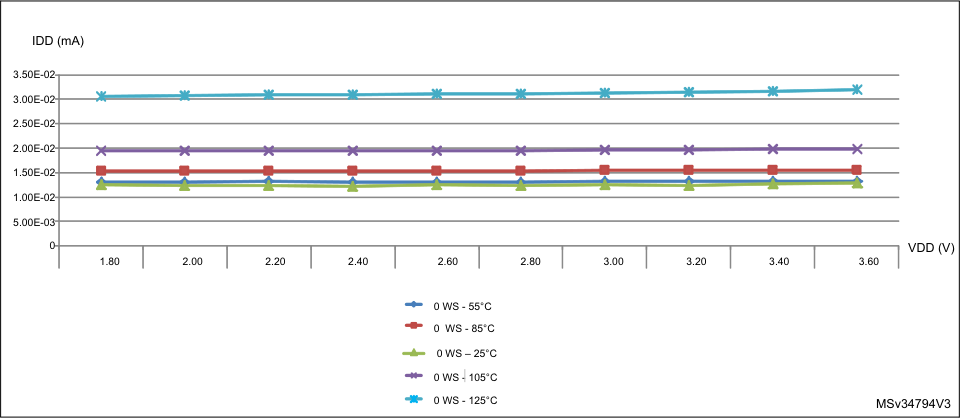

**Table 31. Current consumption in Low-power sleep mode**

|Symbol|Parameter|Conditions|Col4|Col5|Typ|Max(1)|Unit|
|---|---|---|---|---|---|---|---|
|IDD (LP Sleep)|Supply current in Low-power sleep mode|All peripherals OFF, VDD from 1.65 to 3.6 V|MSI clock = 65 kHz, fHCLK = 32 kHz, Flash OFF|TA =−40 to 25°C|4.7(2)|-|µA|
|IDD (LP Sleep)|Supply current in Low-power sleep mode|All peripherals OFF, VDD from 1.65 to 3.6 V|MSI clock = 65 kHz, fHCLK = 32 kHz, Flash ON|TA =−40 to 25°C|17|23|23|
|IDD (LP Sleep)|Supply current in Low-power sleep mode|All peripherals OFF, VDD from 1.65 to 3.6 V|MSI clock = 65 kHz, fHCLK = 32 kHz, Flash ON|TA = 85 °C|19.5|63|63|
|IDD (LP Sleep)|Supply current in Low-power sleep mode|All peripherals OFF, VDD from 1.65 to 3.6 V|MSI clock = 65 kHz, fHCLK = 32 kHz, Flash ON|TA = 105 °C|23|69|69|
|IDD (LP Sleep)|Supply current in Low-power sleep mode|All peripherals OFF, VDD from 1.65 to 3.6 V|MSI clock = 65 kHz, fHCLK = 32 kHz, Flash ON|TA = 125 °C|32.5|90|90|
|IDD (LP Sleep)|Supply current in Low-power sleep mode|All peripherals OFF, VDD from 1.65 to 3.6 V|MSI clock =65 kHz, fHCLK = 65 kHz, Flash ON|TA =−40 to 25°C|17|23|23|
|IDD (LP Sleep)|Supply current in Low-power sleep mode|All peripherals OFF, VDD from 1.65 to 3.6 V|MSI clock =65 kHz, fHCLK = 65 kHz, Flash ON|TA = 85 °C|20|63|63|
|IDD (LP Sleep)|Supply current in Low-power sleep mode|All peripherals OFF, VDD from 1.65 to 3.6 V|MSI clock =65 kHz, fHCLK = 65 kHz, Flash ON|TA = 105 °C|23.5|69|69|
|IDD (LP Sleep)|Supply current in Low-power sleep mode|All peripherals OFF, VDD from 1.65 to 3.6 V|MSI clock =65 kHz, fHCLK = 65 kHz, Flash ON|TA = 125 °C|32.5|90|90|
|IDD (LP Sleep)|Supply current in Low-power sleep mode|All peripherals OFF, VDD from 1.65 to 3.6 V|MSI clock = 131 kHz, fHCLK = 131 kHz, Flash ON|TA =−40 to 25°C|19.5|36|36|
|IDD (LP Sleep)|Supply current in Low-power sleep mode|All peripherals OFF, VDD from 1.65 to 3.6 V|MSI clock = 131 kHz, fHCLK = 131 kHz, Flash ON|TA = 55 °C|20.5|64|64|
|IDD (LP Sleep)|Supply current in Low-power sleep mode|All peripherals OFF, VDD from 1.65 to 3.6 V|MSI clock = 131 kHz, fHCLK = 131 kHz, Flash ON|TA = 85 °C|22.5|66|66|
|IDD (LP Sleep)|Supply current in Low-power sleep mode|All peripherals OFF, VDD from 1.65 to 3.6 V|MSI clock = 131 kHz, fHCLK = 131 kHz, Flash ON|TA = 105 °C|26|72|72|
|IDD (LP Sleep)|Supply current in Low-power sleep mode|All peripherals OFF, VDD from 1.65 to 3.6 V|MSI clock = 131 kHz, fHCLK = 131 kHz, Flash ON|TA = 125 °C|35|95|95|

1. Guaranteed by characterization results at 125 °C, unless otherwise specified.

2. As the CPU is in Sleep mode, the difference between the current consumption with Flash ON and OFF (nearly 12 µA) is
the same whatever the clock frequency.

60/133 DS10184 Rev 10

--- end of page=59 ---

**STM32L051x6 STM32L051x8** **Electrical characteristics**

**Table 32. Typical and maximum current consumptions in Stop mode**

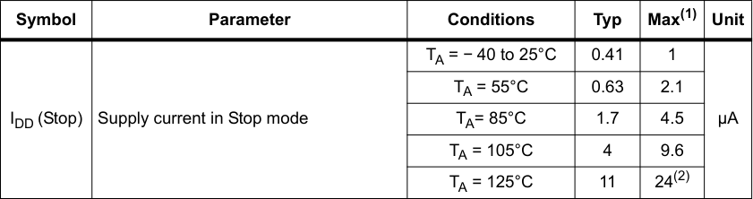

|Parameter|Conditions|Typ|Max(1)|Unit|
|---|---|---|---|---|
|Supply current in Stop mode|TA =−40 to 25°C|0.41|1|µA|
|Supply current in Stop mode|TA = 55°C|0.63|2.1|2.1|
|Supply current in Stop mode|TA= 85°C|1.7|4.5|4.5|
|Supply current in Stop mode|TA = 105°C|4|9.6|9.6|
|Supply current in Stop mode|TA = 125°C|11|24(2)|24(2)|

1. Guaranteed by characterization results at 125 °C, unless otherwise specified.

2. Guaranteed by test in production.

**Figure 17. I** **DD** **vs V** **DD** **, at T** **A** **= 25/55/ 85/105/125 °C, Stop mode with RTC enabled**
**and running on LSE Low drive**

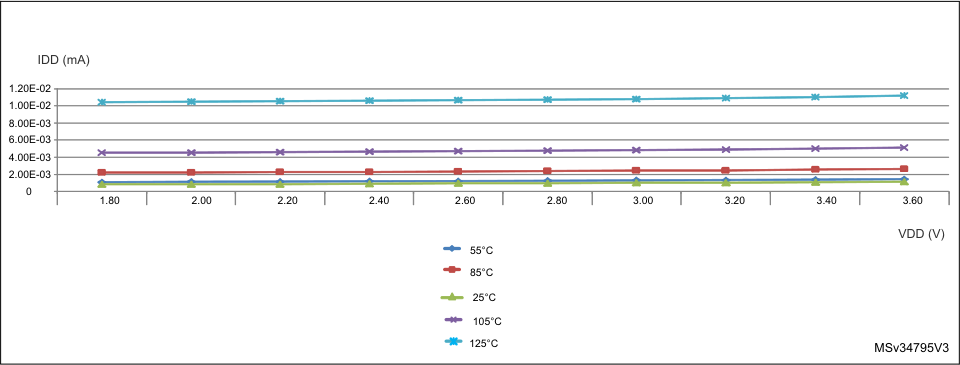

**Figure 18. I** **DD** **vs V** **DD** **, at T** **A** **= 25/55/85/105/125 °C, Stop mode with RTC disabled,**
**all clocks OFF**

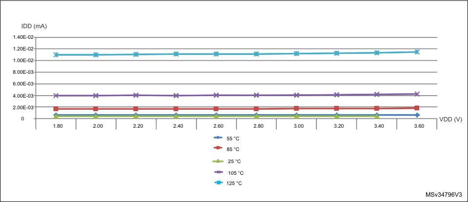

DS10184 Rev 10 61/133

99

--- end of page=60 ---

**Electrical characteristics** **STM32L051x6 STM32L051x8**

**Table 33. Typical and maximum current consumptions in Standby mode**

|Symbol|Parameter|Conditions|Col4|Typ|Max(1)|Unit|
|---|---|---|---|---|---|---|
|IDD (Standby)|Supply current in Standby mode|Independent watchdog and LSI enabled|TA =−40 to 25°C|1.3|1.7|µA|
|IDD (Standby)|Supply current in Standby mode|Independent watchdog and LSI enabled|TA = 55 °C|-|2.9|2.9|
|IDD (Standby)|Supply current in Standby mode|Independent watchdog and LSI enabled|TA= 85 °C|-|3.3|3.3|
|IDD (Standby)|Supply current in Standby mode|Independent watchdog and LSI enabled|TA = 105 °C|-|4.1|4.1|
|IDD (Standby)|Supply current in Standby mode|Independent watchdog and LSI enabled|TA = 125 °C|-|8.5|8.5|
|IDD (Standby)|Supply current in Standby mode|Independent watchdog and LSI OFF|TA =−40 to 25°C|0.29|0.6|0.6|
|IDD (Standby)|Supply current in Standby mode|Independent watchdog and LSI OFF|TA = 55 °C|0.32|0.9|0.9|
|IDD (Standby)|Supply current in Standby mode|Independent watchdog and LSI OFF|TA = 85 °C|0.5|2.3|2.3|
|IDD (Standby)|Supply current in Standby mode|Independent watchdog and LSI OFF|TA = 105 °C|0.94|3|3|
|IDD (Standby)|Supply current in Standby mode|Independent watchdog and LSI OFF|TA = 125 °C|2.6|7|7|

1. Guaranteed by characterization results at 125 °C, unless otherwise specified

**Table 34. Average current consumption during Wakeup**

|Symbol|parameter|System frequency|Current consumption during wakeup|Unit|
|---|---|---|---|---|
|IDD (Wakeup from Stop)|Supply current during Wakeup from Stop mode|HSI|1|mA|
|IDD (Wakeup from Stop)|Supply current during Wakeup from Stop mode|HSI/4|0,7|0,7|
|IDD (Wakeup from Stop)|Supply current during Wakeup from Stop mode|MSI clock = 4,2 MHz|0,7|0,7|
|IDD (Wakeup from Stop)|Supply current during Wakeup from Stop mode|MSI clock = 1,05 MHz|0,4|0,4|
|IDD (Wakeup from Stop)|Supply current during Wakeup from Stop mode|MSI clock = 65 KHz|0,1|0,1|
|IDD (Reset)|Reset pin pulled down|-|0,21|0,21|
|IDD (Power-up)|BOR ON|-|0,23|0,23|
|IDD (Wakeup from StandBy)|With Fast wakeup set|MSI clock = 2,1 MHz|0,5|0,5|
|IDD (Wakeup from StandBy)|With Fast wakeup disabled|MSI clock = 2,1 MHz|0,12|0,12|

62/133 DS10184 Rev 10

--- end of page=61 ---

**STM32L051x6 STM32L051x8** **Electrical characteristics**

**On-chip peripheral current consumption**

The current consumption of the on-chip peripherals is given in the following tables. The
MCU is placed under the following conditions:

      - all I/O pins are in input mode with a static value at V DD or V SS (no load)

      - all peripherals are disabled unless otherwise mentioned

      - the given value is calculated by measuring the current consumption

–
with all peripherals clocked OFF

–
with only one peripheral clocked on

**Table 35. Peripheral current consumption in Run or Sleep mode** **[(1)]**

|Peripheral|Col2|Typical consumption, V = 3.0 V, T = 25 °C DD A|Col4|Col5|Col6|Unit|
|---|---|---|---|---|---|---|
|**Peripheral**|**Peripheral**|**Range 1,** **VCORE=1.8 V** **VOS[1:0] = 01**|**Range 2,** **VCORE=1.5 V** **VOS[1:0] = 10**|**Range 3,** **VCORE=1.2 V** **VOS[1:0] = 11**|**Low-power** **sleep and** **run**|**Low-power** **sleep and** **run**|
|APB1|I2C1|11|9.5|7.5|9|µA/MHz (fHCLK)|
|APB1|I2C2|4|3.5|3|2.5|2.5|
|APB1|LPTIM1|10|8.5|6.5|8|8|
|APB1|LPUART1|8|6.5|5.5|6|6|
|APB1|SPI2|9|4.5|3.5|4|4|
|APB1|USART2|14.5|12|9.5|11|11|
|APB1|TIM2|10.5|8.5|7|9|9|
|APB1|TIM6|3.5|3|2.5|2|2|
|APB1|WWDG|3|2|2|2|2|
|APB2|ADC1(2)|5.5|5|3.5|4|µA/MHz (fHCLK)|
|APB2|SPI1|4|3|3|2.5|2.5|
|APB2|USART1|14.5|11.5|9.5|12|12|
|APB2|TIM21|7.5|6|5|5.5|5.5|
|APB2|TIM22|7|6|5|6|6|
|APB2|FIREWALL|1.5|1|1|0.5|0.5|
|APB2|DBGMCU|1.5|1|1|0.5|0.5|
|APB2|SYSCFG|2.5|2|2|1.5|1.5|
|Cortex- M0+ core I/O port|GPIOA|3.5|3|2.5|2.5|µA/MHz (fHCLK)|
|Cortex- M0+ core I/O port|GPIOB|3.5|2.5|2|2.5|2.5|
|Cortex- M0+ core I/O port|GPIOC|8.5|6.5|5.5|7|7|
|Cortex- M0+ core I/O port|GPIOD|1|0.5|0.5|0.5|0.5|
|AHB|CRC|1.5|1|1|1|µA/MHz (fHCLK)|
|AHB|FLASH|0(3)|0(3)|0(3)|0(3)|0(3)|
|AHB|DMA1|10|8|6.5|8.5|8.5|

DS10184 Rev 10 63/133

99

--- end of page=62 ---

**Electrical characteristics** **STM32L051x6 STM32L051x8**

**Table 35. Peripheral current consumption in Run or Sleep mode** **[(1)]** **(continued)**

|Peripheral|Typical consumption, V = 3.0 V, T = 25 °C DD A|Col3|Col4|Col5|Unit|
|---|---|---|---|---|---|
|**Peripheral**|**Range 1,** **VCORE=1.8 V** **VOS[1:0] = 01**|**Range 2,** **VCORE=1.5 V** **VOS[1:0] = 10**|**Range 3,** **VCORE=1.2 V** **VOS[1:0] = 11**|**Low-power** **sleep and** **run**|**Low-power** **sleep and** **run**|
|All enabled|283|225|222.5|212.5|µA/MHz (fHCLK)|
|PWR|2.5|2|2|1|µA/MHz (fHCLK)|

1. Data based on differential I DD measurement between all peripherals OFF an one peripheral with clock
enabled, in the following conditions: f HCLK = 32 MHz (range 1), f HCLK = 16 MHz (range 2), f HCLK = 4 MHz
(range 3), f HCLK = 64kHz (Low-power run/sleep), f APB1 = f HCLK, f APB2 = f HCLK, default prescaler value for
each peripheral. The CPU is in Sleep mode in both cases. No I/O pins toggling. Not tested in production.

2. HSI oscillator is OFF for this measure.

3. Current consumption is negligible and close to 0 µA.

**Table 36. Peripheral current consumption in Stop and Standby mode** **[(1)]**

|Symbol|Peripheral|Typical consumption, T = 25 °C A|Col4|Unit|
|---|---|---|---|---|
|**Symbol**|**Peripheral**|**VDD=1.8 V**|**VDD=3.0 V**|**VDD=3.0 V**|
|IDD(PVD / BOR)|-|0.7|1.2|µA|
|IREFINT|-|-|1.4|1.4|
|-|LSE Low drive(2)|0,1|0,1|0,1|
|-|LPTIM1, Input 100 Hz|0,01|0,01|0,01|
|-|LPTIM1, Input 1 MHz|6|6|6|
|-|LPUART1|0,2|0,2|0,2|
|-|RTC|0,3|0,48|0,48|

1. LPTIM peripheral cannot operate in Standby mode.

2. LSE Low drive consumption is the difference between an external clock on OSC32_IN and a quartz between OSC32_IN
and OSC32_OUT.

64/133 DS10184 Rev 10

--- end of page=63 ---

**STM32L051x6 STM32L051x8** **Electrical characteristics**

**6.3.5** **Wakeup time from low-power mode**

The wakeup times given in the following table are measured with the MSI or HSI16 RC
oscillator. The clock source used to wake up the device depends on the current operating
mode:

      - Sleep mode: the clock source is the clock that was set before entering Sleep mode

      - Stop mode: the clock source is either the MSI oscillator in the range configured before
entering Stop mode, the HSI16 or HSI16/4.

      - Standby mode: the clock source is the MSI oscillator running at 2.1 MHz

All timings are derived from tests performed under ambient temperature and V DD supply
voltage conditions summarized in _Table 21_ .

**Table 37. Low-power mode wakeup timings**

|Symbol|Parameter|Conditions|Typ|Max|Unit|
|---|---|---|---|---|---|
|tWUSLEEP|Wakeup from Sleep mode|fHCLK = 32 MHz|7|8|Number of clock cycles|
|tWUSLEEP_LP|Wakeup from Low-power sleep mode, fHCLK = 262 kHz|fHCLK = 262 kHz  Flash memory enabled|7|8|8|
|tWUSLEEP_LP|Wakeup from Low-power sleep mode, fHCLK = 262 kHz|fHCLK = 262 kHz  Flash memory switched OFF|9|10|10|
|tWUSTOP|Wakeup from Stop mode, regulator in Run mode|fHCLK = fMSI = 4.2 MHz|5.0|8|µs|
|tWUSTOP|Wakeup from Stop mode, regulator in Run mode|fHCLK = fHSI = 16 MHz|4.9|7|7|
|tWUSTOP|Wakeup from Stop mode, regulator in Run mode|fHCLK = fHSI/4 = 4 MHz|8.0|11|11|
|tWUSTOP|Wakeup from Stop mode, regulator in low- power mode|fHCLK = fMSI = 4.2 MHz  Voltage range 1|5.0|8|8|
|tWUSTOP|Wakeup from Stop mode, regulator in low- power mode|fHCLK = fMSI = 4.2 MHz  Voltage range 2|5.0|8|8|
|tWUSTOP|Wakeup from Stop mode, regulator in low- power mode|fHCLK = fMSI = 4.2 MHz  Voltage range 3|5.0|8|8|
|tWUSTOP|Wakeup from Stop mode, regulator in low- power mode|fHCLK = fMSI = 2.1 MHz|7.3|13|13|
|tWUSTOP|Wakeup from Stop mode, regulator in low- power mode|fHCLK = fMSI = 1.05 MHz|13|23|23|
|tWUSTOP|Wakeup from Stop mode, regulator in low- power mode|fHCLK = fMSI = 524 kHz|28|38|38|
|tWUSTOP|Wakeup from Stop mode, regulator in low- power mode|fHCLK = fMSI = 262 kHz|51|65|65|
|tWUSTOP|Wakeup from Stop mode, regulator in low- power mode|fHCLK = fMSI = 131 kHz|100|120|120|
|tWUSTOP|Wakeup from Stop mode, regulator in low- power mode|fHCLK = MSI = 65 kHz|190|260|260|
|tWUSTOP|Wakeup from Stop mode, regulator in low- power mode|fHCLK = fHSI = 16 MHz|4.9|7|7|
|tWUSTOP|Wakeup from Stop mode, regulator in low- power mode|fHCLK = fHSI/4 = 4 MHz|8.0|11|11|
|tWUSTOP|Wakeup from Stop mode, regulator in low- power mode, code running from RAM|fHCLK = fHSI = 16 MHz|4.9|7|7|
|tWUSTOP|Wakeup from Stop mode, regulator in low- power mode, code running from RAM|fHCLK = fHSI/4 = 4 MHz|7.9|10|10|
|tWUSTOP|Wakeup from Stop mode, regulator in low- power mode, code running from RAM|fHCLK = fMSI = 4.2 MHz|4.7|8|8|
|tWUSTDBY|Wakeup from Standby mode, FWU bit = 1|fHCLK = MSI = 2.1 MHz|65|130|µs|
|tWUSTDBY|Wakeup from Standby mode, FWU bit = 0|fHCLK = MSI = 2.1 MHz|2.2|3|ms|

DS10184 Rev 10 65/133

99

--- end of page=64 ---

**Electrical characteristics** **STM32L051x6 STM32L051x8**

**6.3.6** **External clock source characteristics**

**High-speed external user clock generated from an external source**

In bypass mode the HSE oscillator is switched off and the input pin is a standard GPIO.The
external clock signal has to respect the I/O characteristics in _Section 6.3.12_ . However, the
recommended clock input waveform is shown in _Figure 19_ .

**Table 38. High-speed external user clock characteristics** **[(1)]**

|Symbol|Parameter|Conditions|Min|Typ|Max|Unit|
|---|---|---|---|---|---|---|
|fHSE_ext|User external clock source frequency|CSS is ON or PLL is used|1|8|32|MHz|
|fHSE_ext|User external clock source frequency|CSS is OFF, PLL not used|0|8|32|MHz|
|VHSEH|OSC_IN input pin high level voltage|-|0.7VDD|-|VDD|V|
|VHSEL|OSC_IN input pin low level voltage|OSC_IN input pin low level voltage|VSS|-|0.3VDD|0.3VDD|
|tw(HSE) tw(HSE)|OSC_IN high or low time|OSC_IN high or low time|12|-|-|ns|
|tr(HSE) tf(HSE)|OSC_IN rise or fall time|OSC_IN rise or fall time|-|-|20|20|
|Cin(HSE)|OSC_IN input capacitance|OSC_IN input capacitance|-|2.6|-|pF|
|DuCy(HSE)|Duty cycle|Duty cycle|45|-|55|%|
|IL|OSC_IN Input leakage current|VSS≤ VIN≤ VDD|-|-|±1|µA|

1. Guaranteed by design.

**Figure 19. High-speed external clock source AC timing diagram**

|Col1|Col2|Col3|Col4|Col5|Col6|Col7|Col8|
|---|---|---|---|---|---|---|---|
|||||||||
|||||||||

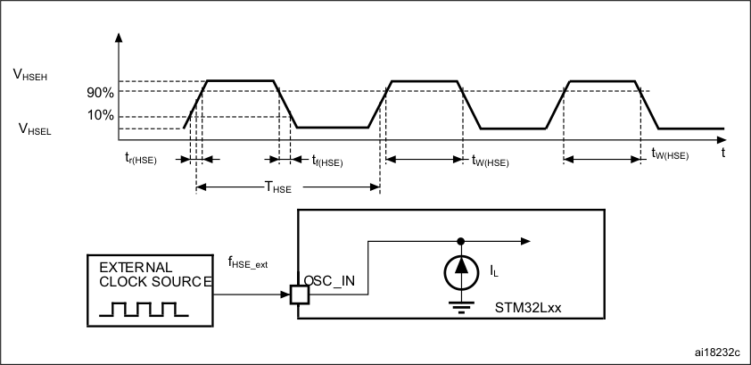

66/133 DS10184 Rev 10

--- end of page=65 ---

**STM32L051x6 STM32L051x8** **Electrical characteristics**

**Low-speed external user clock generated from an external source**

The characteristics given in the following table result from tests performed using a lowspeed external clock source, and under ambient temperature and supply voltage conditions
summarized in _Table 21_ .

**Table 39. Low-speed external user clock characteristics** **[(1)]**

|Symbol|Parameter|Conditions|Min|Typ|Max|Unit|
|---|---|---|---|---|---|---|
|fLSE_ext|User external clock source frequency|-|1|32.768|1000|kHz|
|VLSEH|OSC32_IN input pin high level voltage|OSC32_IN input pin high level voltage|0.7VDD|-|VDD|V|
|VLSEL|OSC32_IN input pin low level voltage|OSC32_IN input pin low level voltage|VSS|-|0.3VDD|0.3VDD|
|tw(LSE) tw(LSE)|OSC32_IN high or low time|OSC32_IN high or low time|465|-|-|ns|
|tr(LSE) tf(LSE)|OSC32_IN rise or fall time|OSC32_IN rise or fall time|-|-|10|10|
|CIN(LSE)|OSC32_IN input capacitance|-|-|0.6|-|pF|
|DuCy(LSE)|Duty cycle|-|45|-|55|%|
|IL|OSC32_IN Input leakage current|VSS≤ VIN≤ VDD|-|-|±1|µA|

1. Guaranteed by design, not tested in production

**Figure 20. Low-speed external clock source AC timing diagram**

|Col1|Col2|Col3|Col4|Col5|Col6|Col7|Col8|
|---|---|---|---|---|---|---|---|
|||||||||
|||||||||

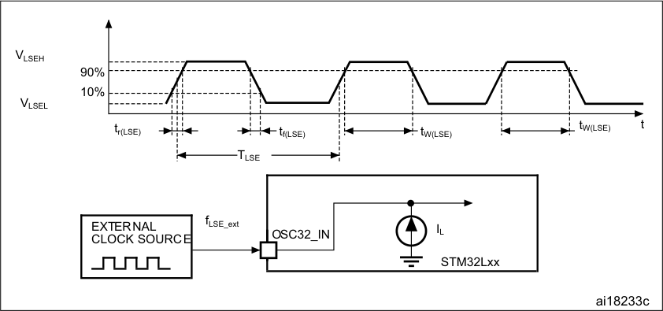

DS10184 Rev 10 67/133

99

--- end of page=66 ---

**Electrical characteristics** **STM32L051x6 STM32L051x8**

**High-speed external clock generated from a crystal/ceramic resonator**

The high-speed external (HSE) clock can be supplied with a 1 to 25 MHz crystal/ceramic
resonator oscillator. All the information given in this paragraph are based on
characterization results obtained with typical external components specified in _Table 40_ . In
the application, the resonator and the load capacitors have to be placed as close as
possible to the oscillator pins in order to minimize output distortion and startup stabilization
time. Refer to the crystal resonator manufacturer for more details on the resonator
characteristics (frequency, package, accuracy).

**Table 40. HSE oscillator characteristics** **[(1)]**

|Symbol|Parameter|Conditions|Min|Typ|Max|Unit|
|---|---|---|---|---|---|---|
|fOSC_IN|Oscillator frequency|-|1||25|MHz|
|RF|Feedback resistor|-|-|200|-|kΩ|
|Gm|Maximum critical crystal transconductance|Startup|-|-|700|µA /V|
|tSU(HSE) (2)|Startup time|VDD is stabilized|-|2|-|ms|

1. Guaranteed by design.

2. Guaranteed by characterization results. t SU(HSE) is the startup time measured from the moment it is
enabled (by software) to a stabilized 8 MHz oscillation is reached. This value is measured for a standard
crystal resonator and it can vary significantly with the crystal manufacturer.

For C L1 and C L2, it is recommended to use high-quality external ceramic capacitors in the
5 pF to 25 pF range (typ.), designed for high-frequency applications, and selected to match
the requirements of the crystal or resonator (see _Figure 21_ ). C L1 and C L2 are usually the
same size. The crystal manufacturer typically specifies a load capacitance which is the
series combination of C L1 and C L2 . PCB and MCU pin capacitance must be included (10 pF
can be used as a rough estimate of the combined pin and board capacitance) when sizing
C L1 and C L2 . Refer to the application note AN2867 “Oscillator design guide for ST
microcontrollers” available from the ST website _www.st.com_ .

**Figure 21. HSE oscillator circuit diagram**

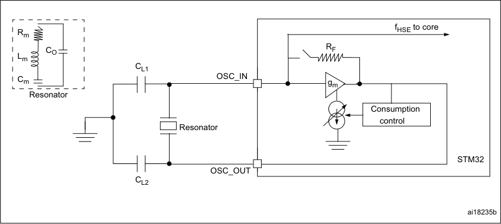

68/133 DS10184 Rev 10

--- end of page=67 ---

**STM32L051x6 STM32L051x8** **Electrical characteristics**

**Low-speed external clock generated from a crystal/ceramic resonator**

The low-speed external (LSE) clock can be supplied with a 32.768 kHz crystal/ceramic
resonator oscillator. All the information given in this paragraph are based on
characterization results obtained with typical external components specified in _Table 41_ . In
the application, the resonator and the load capacitors have to be placed as close as
possible to the oscillator pins in order to minimize output distortion and startup stabilization
time. Refer to the crystal resonator manufacturer for more details on the resonator
characteristics (frequency, package, accuracy).

**Table 41. LSE oscillator characteristics** **[(1)]**

|Symbol|Parameter|Conditions(2)|Min(2)|Typ|Max|Unit|
|---|---|---|---|---|---|---|
|fLSE|LSE oscillator frequency||-|32.768|-|kHz|
|Gm |Maximum critical crystal transconductance |LSEDRV[1:0]=00 lower driving capability|-|-|0.5|µA/V|
|Gm |Maximum critical crystal transconductance |LSEDRV[1:0]= 01 medium low driving capability|-|-|0.75|0.75|
|Gm |Maximum critical crystal transconductance |LSEDRV[1:0] = 10 medium high driving capability|-|-|1.7|1.7|
|Gm |Maximum critical crystal transconductance |LSEDRV[1:0]=11 higher driving capability|-|-|2.7|2.7|
|tSU(LSE) (3)|Startup time|VDD is stabilized|-|2|-|s|

1. Guaranteed by design.

2. Refer to the note and caution paragraphs below the table, and to the application note AN2867 “Oscillator design guide for
ST microcontrollers”.

3. Guaranteed by characterization results. t SU(LSE) is the startup time measured from the moment it is enabled (by software)
to a stabilized 32.768 kHz oscillation is reached. This value is measured for a standard crystal resonator and it can vary
significantly with the crystal manufacturer. To increase speed, address a lower-drive quartz with a high- driver mode.

_Note:_ _For information on selecting the crystal, refer to the application note AN2867 “Oscillator_
_design guide for ST microcontrollers” available from the ST website www.st.com._

**Figure 22. Typical application with a 32.768 kHz crystal**

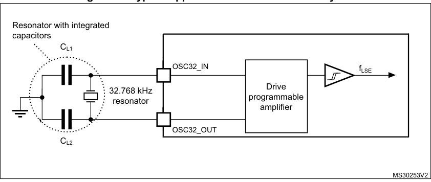

_Note:_ _An external resistor is not required between OSC32_IN and OSC32_OUT and it is forbidden_
_to add one._

DS10184 Rev 10 69/133

99

--- end of page=68 ---

**Electrical characteristics** **STM32L051x6 STM32L051x8**

**6.3.7** **Internal clock source characteristics**

The parameters given in _Table 42_ are derived from tests performed under ambient
temperature and V DD supply voltage conditions summarized in _Table 21_ .

**High-speed internal 16 MHz (HSI16) RC oscillator**

**Table 42. 16 MHz HSI16 oscillator characteristics**

|Symbol|Parameter|Conditions|Min|Typ|Max|Unit|
|---|---|---|---|---|---|---|
|fHSI16 |Frequency|VDD = 3.0 V|-|16|-|MHz|
|TRIM (1)(2)  |HSI16 user- trimmed resolution|Trimming code is not a multiple of 16|-|± 0.4|0.7|%|
|TRIM (1)(2)  |HSI16 user- trimmed resolution|Trimming code is a multiple of 16|-|-|± 1.5|%|
|ACCHSI16 (2)   |Accuracy of the factory-calibrated HSI16 oscillator|VDDA = 3.0 V, TA = 25 °C|-1(3)|-|1(3)|%|
|ACCHSI16 (2)   |Accuracy of the factory-calibrated HSI16 oscillator|VDDA = 3.0 V, TA = 0 to 55 °C|-1.5|-|1.5|%|
|ACCHSI16 (2)   |Accuracy of the factory-calibrated HSI16 oscillator|VDDA = 3.0 V, TA = -10 to 70 °C|-2|-|2|%|
|ACCHSI16 (2)   |Accuracy of the factory-calibrated HSI16 oscillator|VDDA = 3.0 V, TA = -10 to 85 °C|-2.5|-|2|%|
|ACCHSI16 (2)   |Accuracy of the factory-calibrated HSI16 oscillator|VDDA = 3.0 V, TA = -10 to 105 °C|-4|-|2|%|
|ACCHSI16 (2)   |Accuracy of the factory-calibrated HSI16 oscillator|VDDA = 1.65 V to 3.6 V  TA =−40 to 125 °C|-5.45|-|3.25|%|
|tSU(HSI16) (2)  |HSI16 oscillator startup time|-|-|3.7|6|µs|
|IDD(HSI16) (2)  |HSI16 oscillator power consumption|-|-|100|140|µA|

1. The trimming step differs depending on the trimming code. It is usually negative on the codes which are
multiples of 16 (0x00, 0x10, 0x20, 0x30...0xE0).

2. Guaranteed by characterization results.

3. Guaranteed by test in production.

**Figure 23. HSI16 minimum and maximum value versus temperature**

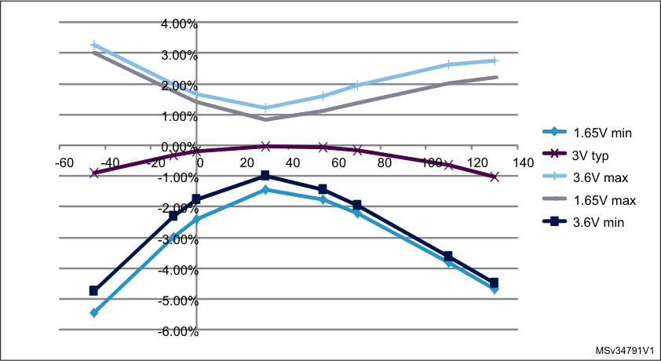

70/133 DS10184 Rev 10

--- end of page=69 ---

**STM32L051x6 STM32L051x8** **Electrical characteristics**

**Low-speed internal (LSI) RC oscillator**

**Table 43. LSI oscillator characteristics**

|Symbol|Parameter|Min|Typ|Max|Unit|
|---|---|---|---|---|---|
|fLSI (1)|LSI frequency|26|38|56|kHz|
|DLSI (2)|LSI oscillator frequency drift  0°C≤ TA ≤ 85°C|-10|-|4|%|
|tsu(LSI) (3)|LSI oscillator startup time|-|-|200|µs|
|IDD(LSI) (3)|LSI oscillator power consumption|-|400|510|nA|

1. Guaranteed by test in production.

2. This is a deviation for an individual part, once the initial frequency has been measured.

3. Guaranteed by design.

**Multi-speed internal (MSI) RC oscillator**

**Table 44. MSI oscillator characteristics**

|Symbol|Parameter|Condition|Typ|Max|Unit|
|---|---|---|---|---|---|
|fMSI|Frequency after factory calibration, done at VDD= 3.3 V and TA = 25 °C|MSI range 0|65.5|-|kHz|
|fMSI|Frequency after factory calibration, done at VDD= 3.3 V and TA = 25 °C|MSI range 1|131|-|-|
|fMSI|Frequency after factory calibration, done at VDD= 3.3 V and TA = 25 °C|MSI range 2|262|-|-|
|fMSI|Frequency after factory calibration, done at VDD= 3.3 V and TA = 25 °C|MSI range 3|524|-|-|
|fMSI|Frequency after factory calibration, done at VDD= 3.3 V and TA = 25 °C|MSI range 4|1.05|-|MHz|
|fMSI|Frequency after factory calibration, done at VDD= 3.3 V and TA = 25 °C|MSI range 5|2.1|-|-|
|fMSI|Frequency after factory calibration, done at VDD= 3.3 V and TA = 25 °C|MSI range 6|4.2|-|-|
|ACCMSI|Frequency error after factory calibration|-|±0.5|-|%|
|DTEMP(MSI) (1)|MSI oscillator frequency drift  0 °C≤ TA ≤ 85 °C|-|±3|-|%|
|DTEMP(MSI) (1)|MSI oscillator frequency drift  VDD = 3.3 V,−40 °C≤ TA ≤ 110 °C|MSI range 0|−8.9|+7.0|+7.0|
|DTEMP(MSI) (1)|MSI oscillator frequency drift  VDD = 3.3 V,−40 °C≤ TA ≤ 110 °C|MSI range 1|−7.1|+5.0|+5.0|
|DTEMP(MSI) (1)|MSI oscillator frequency drift  VDD = 3.3 V,−40 °C≤ TA ≤ 110 °C|MSI range 2|−6.4|+4.0|+4.0|
|DTEMP(MSI) (1)|MSI oscillator frequency drift  VDD = 3.3 V,−40 °C≤ TA ≤ 110 °C|MSI range 3|−6.2|+3.0|+3.0|
|DTEMP(MSI) (1)|MSI oscillator frequency drift  VDD = 3.3 V,−40 °C≤ TA ≤ 110 °C|MSI range 4|−5.2|+3.0|+3.0|
|DTEMP(MSI) (1)|MSI oscillator frequency drift  VDD = 3.3 V,−40 °C≤ TA ≤ 110 °C|MSI range 5|−4.8|+2.0|+2.0|
|DTEMP(MSI) (1)|MSI oscillator frequency drift  VDD = 3.3 V,−40 °C≤ TA ≤ 110 °C|MSI range 6|−4.7|+2.0|+2.0|
|DVOLT(MSI) (1)|MSI oscillator frequency drift  1.65 V≤ VDD ≤ 3.6 V, TA = 25 °C|-|-|2.5|%/V|

DS10184 Rev 10 71/133

99

--- end of page=70 ---

**Electrical characteristics** **STM32L051x6 STM32L051x8**

**Table 44. MSI oscillator characteristics (continued)**

|Symbol|Parameter|Condition|Typ|Max|Unit|
|---|---|---|---|---|---|
|IDD(MSI) (2)|MSI oscillator power consumption|MSI range 0|0.75|-|µA|
|IDD(MSI) (2)|MSI oscillator power consumption|MSI range 1|1|-|-|
|IDD(MSI) (2)|MSI oscillator power consumption|MSI range 2|1.5|-|-|
|IDD(MSI) (2)|MSI oscillator power consumption|MSI range 3|2.5|-|-|
|IDD(MSI) (2)|MSI oscillator power consumption|MSI range 4|4.5|-|-|
|IDD(MSI) (2)|MSI oscillator power consumption|MSI range 5|8|-|-|
|IDD(MSI) (2)|MSI oscillator power consumption|MSI range 6|15|-|-|
|tSU(MSI)|MSI oscillator startup time|MSI range 0|30|-|µs|
|tSU(MSI)|MSI oscillator startup time|MSI range 1|20|-|-|
|tSU(MSI)|MSI oscillator startup time|MSI range 2|15|-|-|
|tSU(MSI)|MSI oscillator startup time|MSI range 3|10|-|-|
|tSU(MSI)|MSI oscillator startup time|MSI range 4|6|-|-|
|tSU(MSI)|MSI oscillator startup time|MSI range 5|5|-|-|
|tSU(MSI)|MSI oscillator startup time|MSI range 6, Voltage range 1 and 2|3.5|-|-|
|tSU(MSI)|MSI oscillator startup time|MSI range 6, Voltage range 3|5|-|-|
|tSTAB(MSI) (2)|MSI oscillator stabilization time|MSI range 0|-|40|µs|
|tSTAB(MSI) (2)|MSI oscillator stabilization time|MSI range 1|-|20|20|
|tSTAB(MSI) (2)|MSI oscillator stabilization time|MSI range 2|-|10|10|
|tSTAB(MSI) (2)|MSI oscillator stabilization time|MSI range 3|-|4|4|
|tSTAB(MSI) (2)|MSI oscillator stabilization time|MSI range 4|-|2.5|2.5|
|tSTAB(MSI) (2)|MSI oscillator stabilization time|MSI range 5|-|2|2|
|tSTAB(MSI) (2)|MSI oscillator stabilization time|MSI range 6, Voltage range 1 and 2|-|2|2|
|tSTAB(MSI) (2)|MSI oscillator stabilization time|MSI range 3, Voltage range 3|-|3|3|
|fOVER(MSI)|MSI oscillator frequency overshoot|Any range to range 5|-|4|MHz|
|fOVER(MSI)|MSI oscillator frequency overshoot|Any range to range 6|-|6|6|

1. This is a deviation for an individual part, once the initial frequency has been measured.

2. Guaranteed by characterization results.

72/133 DS10184 Rev 10

--- end of page=71 ---

**STM32L051x6 STM32L051x8** **Electrical characteristics**

**6.3.8** **PLL characteristics**

The parameters given in _Table 45_ are derived from tests performed under ambient
temperature and V DD supply voltage conditions summarized in _Table 21_ .

**Table 45. PLL characteristics**

|Symbol|Parameter|Value|Col4|Col5|Unit|
|---|---|---|---|---|---|
|**Symbol**|**Parameter**|**Min**|**Typ**|**Max(1)**|**Max(1)**|
|fPLL_IN|PLL input clock(2)|2|-|24|MHz|
|fPLL_IN|PLL input clock duty cycle|45|-|55|%|
|fPLL_OUT|PLL output clock|2|-|32|MHz|
|tLOCK|PLL input = 16 MHz PLL VCO = 96 MHz|-|115|160|µs|
|Jitter|Cycle-to-cycle jitter|-||± 600|ps|
|IDDA(PLL)|Current consumption on VDDA|-|220|450|µA|
|IDD(PLL)|Current consumption on VDD|-|120|150|150|

1. Guaranteed by characterization results.

2. Take care of using the appropriate multiplier factors so as to have PLL input clock values compatible with
the range defined by f PLL_OUT .

**6.3.9** **Memory characteristics**

**RAM memory**

**Table 46. RAM and hardware registers**

|Symbol|Parameter|Conditions|Min|Typ|Max|Unit|
|---|---|---|---|---|---|---|
|VRM|Data retention mode(1)|STOP mode (or RESET)|1.65|-|-|V|

1. Minimum supply voltage without losing data stored in RAM (in Stop mode or under Reset) or in hardware
registers (only in Stop mode).

**Flash memory and data EEPROM**

**Table 47. Flash memory and data EEPROM characteristics**

|Symbol|Parameter|Conditions|Min|Typ|Max(1)|Unit|
|---|---|---|---|---|---|---|
|VDD|Operating voltage Read / Write / Erase|-|1.65|-|3.6|V|
|tprog|Programming time for word or half-page|Erasing|-|3.28|3.94|ms|
|tprog|Programming time for word or half-page|Programming|-|3.28|3.94|3.94|

DS10184 Rev 10 73/133

99

--- end of page=72 ---

**Electrical characteristics** **STM32L051x6 STM32L051x8**

**Table 47. Flash memory and data EEPROM characteristics**

|Symbol|Parameter|Conditions|Min|Typ|Max(1)|Unit|
|---|---|---|---|---|---|---|
|IDD|Average current during the whole programming / erase operation|TA =25 °C, VDD = 3.6 V|-|500|700|µA|
|IDD|Maximum current (peak) during the whole programming / erase operation|Maximum current (peak) during the whole programming / erase operation|-|1.5|2.5|mA|

1. Guaranteed by design.

**Table 48. Flash memory and data EEPROM endurance and retention**

|Symbol|Parameter|Conditions|Value|Unit|
|---|---|---|---|---|
|**Symbol**|**Parameter**|** Conditions**|**Min(1)**|**Min(1)**|
|NCYC (2)|Cycling (erase / write)  Program memory|TA =-40°C to 105 °C|10|kcycles|
|NCYC (2)|Cycling (erase / write)  EEPROM data memory|Cycling (erase / write)  EEPROM data memory|100|100|
|NCYC (2)|Cycling (erase / write)  Program memory|TA =-40°C to 125 °C|0.2|0.2|
|NCYC (2)|Cycling (erase / write)  EEPROM data memory|Cycling (erase / write)  EEPROM data memory|2|2|
|tRET (2)|Data retention (program memory) after 10 kcycles at TA = 85 °C|TRET = +85 °C|30|years|
|tRET (2)|Data retention (EEPROM data memory) after 100 kcycles at TA = 85 °C|Data retention (EEPROM data memory) after 100 kcycles at TA = 85 °C|30|30|
|tRET (2)|Data retention (program memory) after 10 kcycles at TA = 105 °C|TRET = +105 °C|10|10|
|tRET (2)|Data retention (EEPROM data memory) after 100 kcycles at TA = 105 °C|Data retention (EEPROM data memory) after 100 kcycles at TA = 105 °C|Data retention (EEPROM data memory) after 100 kcycles at TA = 105 °C|Data retention (EEPROM data memory) after 100 kcycles at TA = 105 °C|
|tRET (2)|Data retention (program memory) after 200 cycles at TA = 125 °C|TRET = +125 °C|TRET = +125 °C|TRET = +125 °C|
|tRET (2)|Data retention (EEPROM data memory) after 2 kcycles at TA = 125 °C|Data retention (EEPROM data memory) after 2 kcycles at TA = 125 °C|Data retention (EEPROM data memory) after 2 kcycles at TA = 125 °C|Data retention (EEPROM data memory) after 2 kcycles at TA = 125 °C|

1. Guaranteed by characterization results.

2. Characterization is done according to JEDEC JESD22-A117.

74/133 DS10184 Rev 10

--- end of page=73 ---

**STM32L051x6 STM32L051x8** **Electrical characteristics**

**6.3.10** **EMC characteristics**

Susceptibility tests are performed on a sample basis during device characterization.

**Functional EMS (electromagnetic susceptibility)**

While a simple application is executed on the device (toggling 2 LEDs through I/O ports).
the device is stressed by two electromagnetic events until a failure occurs. The failure is
indicated by the LEDs:

      - **Electrostatic discharge (ESD)** (positive and negative) is applied to all device pins until
a functional disturbance occurs. This test is compliant with the IEC 61000-4-2 standard.

      - **FTB** : A Burst of Fast Transient voltage (positive and negative) is applied to V DD and
V SS through a 100 pF capacitor, until a functional disturbance occurs. This test is
compliant with the IEC 61000-4-4 standard.

A device reset allows normal operations to be resumed.

The test results are given in _Table 49_ . They are based on the EMS levels and classes
defined in application note AN1709.

**Table 49. EMS characteristics**

|Symbol|Parameter|Conditions|Level/ Class|
|---|---|---|---|
|VFESD|Voltage limits to be applied on any I/O pin to induce a functional disturbance|VDD= 3.3 V, LQFP64, TA = +25 °C,  fHCLK= 32 MHz  conforms to IEC 61000-4-2|3B|
|VEFTB|Fast transient voltage burst limits to be applied through 100 pF on VDD and VSS pins to induce a functional disturbance|VDD =3.3 V, LQFP64, TA = +25 °C,  fHCLK= 32 MHz  conforms to IEC 61000-4-4|4A|

**Designing hardened software to avoid noise problems**

EMC characterization and optimization are performed at component level with a typical
application environment and simplified MCU software. It should be noted that good EMC
performance is highly dependent on the user application and the software in particular.

Therefore it is recommended that the user applies EMC software optimization and
prequalification tests in relation with the EMC level requested for his application.

Software recommendations

The software flowchart must include the management of runaway conditions such as:

- Corrupted program counter

- Unexpected reset

- Critical data corruption (control registers...)

Prequalification trials

Most of the common failures (unexpected reset and program counter corruption) can be
reproduced by manually forcing a low state on the NRST pin or the oscillator pins for 1
second.

DS10184 Rev 10 75/133

99

--- end of page=74 ---

**Electrical characteristics** **STM32L051x6 STM32L051x8**

To complete these trials, ESD stress can be applied directly on the device, over the range of
specification values. When unexpected behavior is detected, the software can be hardened
to prevent unrecoverable errors occurring (see application note AN1015).

**Electromagnetic Interference (EMI)**

The electromagnetic field emitted by the device are monitored while a simple application is
executed (toggling 2 LEDs through the I/O ports). This emission test is compliant with
IEC 61967-2 standard which specifies the test board and the pin loading.

**Table 50. EMI characteristics**

|Symbol|Parameter|Conditions|Monitored frequency band|Max vs. f /f osc CPU|Col6|Col7|Unit|
|---|---|---|---|---|---|---|---|
|**Symbol**|**Parameter**|**Conditions**|**Monitored** **frequency band**|**8 MHz/** **4 MHz**|**8 MHz/** **16 MHz**|**8 MHz/** **32 MHz**|**8 MHz/** **32 MHz**|
|SEMI|Peak level|VDD= 3.6 V, TA = 25 °C,  compliant with IEC 61967-2|0.1 to 30 MHz|-21|-15|-12|dBµV|
|SEMI|Peak level|VDD= 3.6 V, TA = 25 °C,  compliant with IEC 61967-2|30 to 130 MHz|-14|-12|-1|-1|
|SEMI|Peak level|VDD= 3.6 V, TA = 25 °C,  compliant with IEC 61967-2|130 MHz to 1GHz|-10|-11|-7|-7|
|SEMI|Peak level|VDD= 3.6 V, TA = 25 °C,  compliant with IEC 61967-2|EMI Level|1|1|1|-|

76/133 DS10184 Rev 10

--- end of page=75 ---

**STM32L051x6 STM32L051x8** **Electrical characteristics**

**6.3.11** **Electrical sensitivity characteristics**

Based on three different tests (ESD, LU) using specific measurement methods, the device is
stressed in order to determine its performance in terms of electrical sensitivity.

**Electrostatic discharge (ESD)**

Electrostatic discharges (a positive then a negative pulse separated by 1 second) are
applied to the pins of each sample according to each pin combination. The sample size
depends on the number of supply pins in the device (3 parts × (n+1) supply pins). This test
conforms to the ANSI/JEDEC standard.

**Table 51. ESD absolute maximum ratings**

|Symbol|Ratings|Conditions|Class|Maximum value(1)|Unit|
|---|---|---|---|---|---|
|VESD(HBM)|Electrostatic discharge voltage (human body model)|TA = +25 °C, conforming to ANSI/JEDEC JS-001|2|2000|V|
|VESD(CDM)|Electrostatic discharge voltage (charge device model)|TA = +25 °C, conforming to ANSI/ESD STM5.3.1.|C4|500|500|

1. Guaranteed by characterization results.

**Static latch-up**

Two complementary static tests are required on six parts to assess the latch-up
performance:

- A supply overvoltage is applied to each power supply pin

- A current injection is applied to each input, output and configurable I/O pin

These tests are compliant with EIA/JESD 78A IC latch-up standard.

**Table 52. Electrical sensitivities**

|Symbol|Parameter|Conditions|Class|
|---|---|---|---|
|LU|Static latch-up class|TA = +125 °C conforming to JESD78A|II level A|

DS10184 Rev 10 77/133

99

--- end of page=76 ---

**Electrical characteristics** **STM32L051x6 STM32L051x8**

**6.3.12** **I/O current injection characteristics**

As a general rule, current injection to the I/O pins, due to external voltage below V SS or
above V DD (for standard pins) should be avoided during normal product operation.
However, in order to give an indication of the robustness of the microcontroller in cases
when abnormal injection accidentally happens, susceptibility tests are performed on a
sample basis during device characterization.

**Functional susceptibility to I/O current injection**

While a simple application is executed on the device, the device is stressed by injecting
current into the I/O pins programmed in floating input mode. While current is injected into
the I/O pin, one at a time, the device is checked for functional failures.

The failure is indicated by an out of range parameter: ADC error above a certain limit (higher
than 5 LSB TUE), out of conventional limits of induced leakage current on adjacent pins (out
of –5 µA/+0 µA range), or other functional failure (for example reset occurrence oscillator
frequency deviation).

The test results are given in the _Table 53_ .

**Table 53. I/O current injection susceptibility**

|Symbol|Description|Functional susceptibility|Col4|Unit|
|---|---|---|---|---|
|**Symbol**|**Description**|**Negative** **injection**|**Positive** **injection**|**Positive** **injection**|
|IINJ|Injected current on BOOT0|-0|NA(1)|mA|
|IINJ|Injected current on PA0, PA4, PA5, PA11, PA12, PC15, PH0 and PH1|-5|0|0|
|IINJ|Injected current on any other FT, FTf pins|-5(2)|NA(1)|NA(1)|
|IINJ|Injected current on any other pins|-5(2)|+5|+5|

1. Current injection is not possible.

2. It is recommended to add a Schottky diode (pin to ground) to analog pins which may potentially inject
negative currents.

78/133 DS10184 Rev 10

--- end of page=77 ---

**STM32L051x6 STM32L051x8** **Electrical characteristics**

**6.3.13** **I/O port characteristics**

**General input/output characteristics**

Unless otherwise specified, the parameters given in _Table 54_ are derived from tests
performed under the conditions summarized in _Table 21_ . All I/Os are CMOS and TTL
compliant.

**Table 54. I/O static characteristics**

|Symbol|Parameter|Conditions|Min|Typ|Max|Unit|
|---|---|---|---|---|---|---|
|VIL|Input low level voltage|TC, FT, FTf, RST I/Os|-|-|0.3VDD|V|
|VIL|Input low level voltage|BOOT0 pin|-|-|0.14VDD (1)|0.14VDD (1)|
|VIH|Input high level voltage|All I/Os|0.7 VDD|-|-|-|
|Vhys|I/O Schmitt trigger voltage hysteresis (2)|Standard I/Os|-|10% VDD (3)|-|-|
|Vhys|I/O Schmitt trigger voltage hysteresis (2)|BOOT0 pin|-|0.01|-|-|
|Ilkg|Input leakage current(4)|VSS≤ VIN≤ VDD All I/Os except for PA11, PA12, BOOT0 and FTf I/Os|-|-|±50|nA|
|Ilkg|Input leakage current(4)|VSS≤ VIN≤ VDD,  PA11 and PA12 I/Os|-|-|-50/+250|-50/+250|
|Ilkg|Input leakage current(4)|VSS≤ VIN≤ VDD FTf I/Os|-|-|±100|±100|
|Ilkg|Input leakage current(4)|VDD≤ VIN≤ 5 V All I/Os except for PA11, PA12, BOOT0 and FTf I/Os|-|-|200|nA|
|Ilkg|Input leakage current(4)|VDD≤ VIN≤ 5 V FTf I/Os|-|-|500|500|
|Ilkg|Input leakage current(4)|VDD≤ VIN≤ 5 V PA11, PA12 and BOOT0|-|-|10|µA|
|RPU|Weak pull-up equivalent resistor(5)|VIN= VSS|25|45|65|kΩ|
|RPD|Weak pull-down equivalent resistor(5)|VIN= VDD|25|45|65|kΩ|
|CIO|I/O pin capacitance|-|-|5|-|pF|

1. G uaranteed by characterization.

2. Hysteresis voltage between Schmitt trigger switching levels. Guaranteed by characterization results.

3. With a minimum of 200 mV. Guaranteed by characterization results.

4. The max. value may be exceeded if negative current is injected on adjacent pins.

5. Pull-up and pull-down resistors are designed with a true resistance in series with a switchable PMOS/NMOS. This
MOS/NMOS contribution to the series resistance is minimum (~10% order).

DS10184 Rev 10 79/133

99

--- end of page=78 ---

**Electrical characteristics** **STM32L051x6 STM32L051x8**

**Figure 24. V** **IH** **/V** **IL** **versus VDD (CMOS I/Os)**

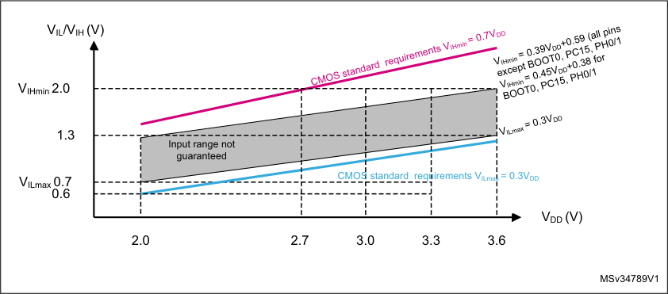

|Col1|Col2|�����������|�������|�|
|---|---|---|---|---|
||||||
||,QSXWUDQJHQRW JXDUDQWHHG|&026|VWDQGDUGUHTX|LUHPHQWV9,/PD|
||||||
||||||

**Figure 25. V** **IH** **/V** **IL** **versus VDD (TTL I/Os)**

|Col1|Col2|Col3|Col4|Col5|
|---|---|---|---|---|
||,QSXWUDQJHQRW JXDUDQWHHG||||
||||||
|||77/VWDQGDUG|UHTXLUHPHQWV|9,/PD[ 9|

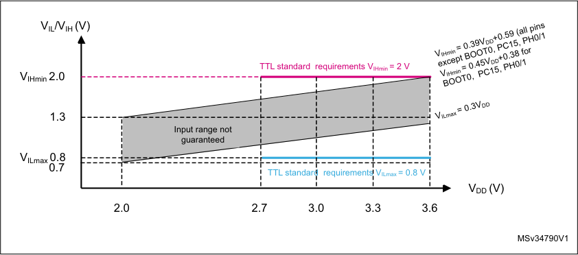

**Output driving current**

The GPIOs (general purpose input/outputs) can sink or source up to ±8 mA, and sink or
source up to ±15 mA with the non-standard V OL /V OH specifications given in _Table 55_ .

In the user application, the number of I/O pins which can drive current must be limited to
respect the absolute maximum rating specified in _Section 6.2_ :

      - The sum of the currents sourced by all the I/Os on V DD, plus the maximum Run
consumption of the MCU sourced on V DD, cannot exceed the absolute maximum rating
I VDD(Σ) (see _Table 19_ ).

      - The sum of the currents sunk by all the I/Os on V SS plus the maximum Run
consumption of the MCU sunk on V SS cannot exceed the absolute maximum rating
I VSS(Σ) (see _Table 19_ ).

80/133 DS10184 Rev 10

--- end of page=79 ---

**STM32L051x6 STM32L051x8** **Electrical characteristics**

**Output voltage levels**

Unless otherwise specified, the parameters given in _Table 55_ are derived from tests
performed under ambient temperature and V DD supply voltage conditions summarized in
_Table 21_ . All I/Os are CMOS and TTL compliant.

**Table 55. Output voltage characteristics**

|Symbol|Parameter|Conditions|Min|Max|Unit|
|---|---|---|---|---|---|
|VOL (1)|Output low level voltage for an I/O pin|CMOS port(2),  IIO= +8 mA 2.7 V≤VDD ≤  3.6 V|-|0.4|V|
|VOH (3)|Output high level voltage for an I/O pin|Output high level voltage for an I/O pin|VDD-0.4|-|-|
|VOL (1)|Output low level voltage for an I/O pin|TTL port(2),  IIO=+ 8 mA 2.7 V≤ VDD ≤  3.6 V|-|0.4|0.4|
|VOH (3)(4)|Output high level voltage for an I/O pin|TTL port(2),  IIO= -6 mA 2.7 V≤ VDD ≤  3.6 V|2.4|-|-|
|VOL (1)(4)|Output low level voltage for an I/O pin|IIO= +15 mA 2.7 V≤ VDD ≤  3.6 V|-|1.3|1.3|
|VOH (3)(4)|Output high level voltage for an I/O pin|IIO= -15 mA 2.7 V≤ VDD ≤  3.6 V|VDD-1.3|-|-|
|VOL (1)(4)|Output low level voltage for an I/O pin|IIO= +4 mA 1.65 V≤ VDD < 3.6 V|-|0.45|0.45|
|VOH (3)(4)|Output high level voltage for an I/O pin|IIO= -4 mA 1.65 V≤ VDD ≤  3.6 V|VDD-0.45|-|-|
|VOLFM+ (1)(4)|Output low level voltage for an FTf I/O pin in Fm+ mode|IIO= 20 mA 2.7 V≤ VDD ≤  3.6 V|-|0.4|0.4|
|VOLFM+ (1)(4)|Output low level voltage for an FTf I/O pin in Fm+ mode|IIO= 10 mA 1.65 V≤ VDD ≤  3.6 V|-|0.4|0.4|

1. The I IO current sunk by the device must always respect the absolute maximum rating specified in _Table 19_ .
The sum of the currents sunk by all the I/Os (I/O ports and control pins) must always be respected and
must not exceed ΣI .
IO(PIN)

2. TTL and CMOS outputs are compatible with JEDEC standards JESD36 and JESD52.

3. The I IO current sourced by the device must always respect the absolute maximum rating specified in
_Table 19_ . The sum of the currents sourced by all the I/Os (I/O ports and control pins) must always be
respected and must not exceed ΣI IO(PIN) .

4. Guaranteed by characterization results.

DS10184 Rev 10 81/133

99

--- end of page=80 ---

**Electrical characteristics** **STM32L051x6 STM32L051x8**

**Input/output AC characteristics**

The definition and values of input/output AC characteristics are given in _Figure 26_ and
_Table 56_, respectively.

Unless otherwise specified, the parameters given in _Table 56_ are derived from tests
performed under ambient temperature and V DD supply voltage conditions summarized in
_Table 21_ .

**Table 56. I/O AC characteristics** **[(1)]**

|OSPEEDRx[1:0] bit value(1)|Symbol|Parameter|Conditions|Min|Max(2)|Unit|
|---|---|---|---|---|---|---|
|00|fmax(IO)out|Maximum frequency(3)|CL = 50 pF, VDD= 2.7 V to 3.6 V|-|400|kHz|
|00|fmax(IO)out|Maximum frequency(3)|CL = 50 pF, VDD= 1.65 V to 2.7 V|-|100|100|
|00|tf(IO)out tr(IO)out|Output rise and fall time|CL = 50 pF, VDD= 2.7 V to 3.6 V|-|125|ns|
|00|tf(IO)out tr(IO)out|Output rise and fall time|CL = 50 pF, VDD= 1.65 V to 2.7 V|-|320|320|
|01|fmax(IO)out|Maximum frequency(3)|CL = 50 pF, VDD= 2.7 V to 3.6 V|-|2|MHz|
|01|fmax(IO)out|Maximum frequency(3)|CL = 50 pF, VDD= 1.65 V to 2.7 V|-|0.6|0.6|
|01|tf(IO)out tr(IO)out|Output rise and fall time|CL = 50 pF, VDD= 2.7 V to 3.6 V|-|30|ns|
|01|tf(IO)out tr(IO)out|Output rise and fall time|CL = 50 pF, VDD= 1.65 V to 2.7 V|-|65|65|
|10|Fmax(IO)out|Maximum frequency(3)|CL = 50 pF, VDD= 2.7 V to 3.6 V|-|10|MHz|
|10|Fmax(IO)out|Maximum frequency(3)|CL = 50 pF, VDD= 1.65 V to 2.7 V|-|2|2|
|10|tf(IO)out tr(IO)out|Output rise and fall time|CL = 50 pF, VDD= 2.7 V to 3.6 V|-|13|ns|
|10|tf(IO)out tr(IO)out|Output rise and fall time|CL = 50 pF, VDD= 1.65 V to 2.7 V|-|28|28|
|11|Fmax(IO)out|Maximum frequency(3)|CL = 30 pF, VDD= 2.7 V to 3.6  V|-|35|MHz|
|11|Fmax(IO)out|Maximum frequency(3)|CL = 50 pF, VDD= 1.65 V to 2.7 V|-|10|10|
|11|tf(IO)out tr(IO)out|Output rise and fall time|CL = 30 pF, VDD= 2.7 V to 3.6 V|-|6|ns|
|11|tf(IO)out tr(IO)out|Output rise and fall time|CL = 50 pF, VDD= 1.65 V to 2.7 V|-|17|17|
|Fm+ configuration(4)|fmax(IO)out|Maximum frequency(3)|CL = 50 pF, VDD= 2.5 V to 3.6 V|-|1|MHz|
|Fm+ configuration(4)|tf(IO)out|Output fall time|Output fall time|-|10|ns|
|Fm+ configuration(4)|tr(IO)out|Output rise time|Output rise time|-|30|30|
|Fm+ configuration(4)|fmax(IO)out|Maximum frequency(3)|CL = 50 pF, VDD= 1.65 V to 3.6 V|-|350|KHz|
|Fm+ configuration(4)|tf(IO)out|Output fall time|Output fall time|-|15|ns|
|Fm+ configuration(4)|tr(IO)out|Output rise time|Output rise time|-|60|60|
|-|tEXTIpw|Pulse width of external signals detected by the EXTI controller|-|8|-|ns|

1. The I/O speed is configured using the OSPEEDRx[1:0] bits. Refer to the line reference manual for a description of GPIO Port
configuration register.

2. Guaranteed by design.

3. The maximum frequency is defined in _Figure 26_ .

4. When Fm+ configuration is set, the I/O speed control is bypassed. Refer to the line reference manual for a detailed
description of Fm+ I/O configuration.

82/133 DS10184 Rev 10

--- end of page=81 ---

**STM32L051x6 STM32L051x8** **Electrical characteristics**

**Figure 26. I/O AC characteristics definition**

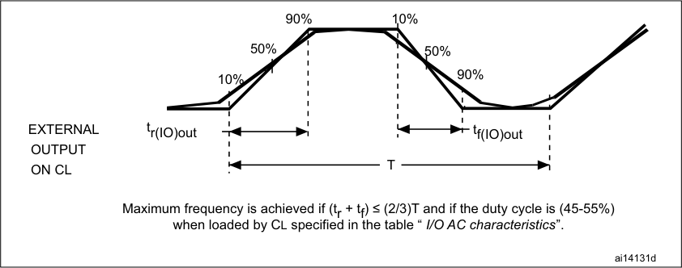

**6.3.14** **NRST pin characteristics**

The NRST pin input driver uses CMOS technology. It is connected to a permanent pull-up
resistor, R PU, except when it is internally driven low (see _Table 57_ ).

Unless otherwise specified, the parameters given in _Table 57_ are derived from tests
performed under ambient temperature and V DD supply voltage conditions summarized in
_Table 21_ .

**Table 57. NRST pin characteristics**

|Symbol|Parameter|Conditions|Min|Typ|Max|Unit|
|---|---|---|---|---|---|---|
|VIL(NRST) (1)|NRST input low level voltage|-|VSS|-|0.8|V|
|VIH(NRST) (1)|NRST input high level voltage|-|1.4|-|VDD|VDD|
|VOL(NRST) (1)|NRST output low level voltage|IOL = 2 mA 2.7 V < VDD < 3.6 V|-|-|0.4|0.4|
|VOL(NRST) (1)|NRST output low level voltage|IOL = 1.5 mA 1.65 V < VDD < 2.7 V|-|-|-|-|
|Vhys(NRST) (1)|NRST Schmitt trigger voltage hysteresis|-|-|10%VDD (2)|-|mV|
|RPU|Weak pull-up equivalent resistor(3)|VIN= VSS|25|45|65|kΩ|
|VF(NRST) (1) |NRST input filtered pulse |-|-|-|50|ns|
|VNF(NRST) (1)|NRST input not filtered pulse|-|350|-|-|ns|

1. Guaranteed by design.

2. 200 mV minimum value

3. The pull-up is designed with a true resistance in series with a switchable PMOS. This PMOS contribution to
the series resistance is around 10%.

DS10184 Rev 10 83/133

99

--- end of page=82 ---

**Electrical characteristics** **STM32L051x6 STM32L051x8**

**Figure 27. Recommended NRST pin protection**

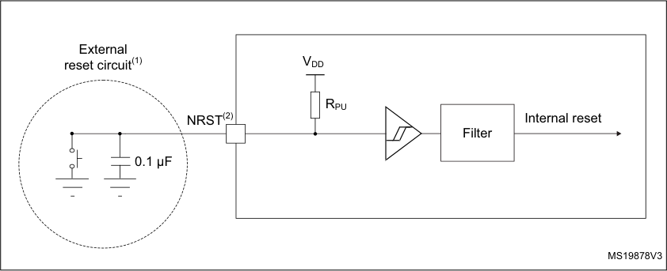

1. The reset network protects the device against parasitic resets.

2. The external capacitor must be placed as close as possible to the device.

3. The user must ensure that the level on the NRST pin can go below the V IL(NRST) max level specified in
_Table 57_ . Otherwise the reset will not be taken into account by the device.

**6.3.15** **12-bit ADC characteristics**

Unless otherwise specified, the parameters given in _Table 58_ are derived from tests
performed under ambient temperature, f PCLK frequency and V DDA supply voltage conditions
summarized in _Table 21: General operating conditions_ .

_Note:_ _It is recommended to perform a calibration after each power-up._

**Table 58. ADC characteristics**

|Symbol|Parameter|Conditions|Min|Typ|Max|Unit|
|---|---|---|---|---|---|---|
|VDDA|Analog supply voltage for ADC ON|Fast channel|1.65|-|3.6|V|
|VDDA|Analog supply voltage for ADC ON|Standard channel|1.75(1)|-|3.6|3.6|
|VREF+|Positive reference voltage|-|1.65||VDDA|V|
|IDDA (ADC)|Current consumption of the ADC on VDDAand VREF+|1.14 Msps|-|200|-|µA|
|IDDA (ADC)|Current consumption of the ADC on VDDAand VREF+|10 ksps|-|40|-|-|
|IDDA (ADC)|Current consumption of the ADC on VDD (2)|1.14 Msps|-|70|-|-|
|IDDA (ADC)|Current consumption of the ADC on VDD (2)|10 ksps|-|1|-|-|
|fADC|ADC clock frequency|Voltage scaling Range 1|0.14|-|16|MHz|
|fADC|ADC clock frequency|Voltage scaling Range 2|0.14|-|8|8|
|fADC|ADC clock frequency|Voltage scaling Range 3|0.14|-|4|4|
|fS (3)|Sampling rate|12-bit resolution|0.01|-|1.14|MHz|
|fTRIG (3)|External trigger frequency|fADC = 16 MHz, 12-bit resolution|-|-|941|kHz|
|fTRIG (3)|External trigger frequency|-|-|-|17|1/fADC|
|VAIN|Conversion voltage range|-|0|-|VREF+|V|

84/133 DS10184 Rev 10

--- end of page=83 ---

**STM32L051x6 STM32L051x8** **Electrical characteristics**

**Table 58. ADC characteristics (continued)**

|Symbol|Parameter|Conditions|Min|Typ|Max|Unit|
|---|---|---|---|---|---|---|
|RAIN (3)|External input impedance|See_Equation 1_ and _Table 59_ for details|-|-|50|kΩ|
|RADC (3)(4)|Sampling switch resistance|-|-|-|1|kΩ|
|CADC (3)|Internal sample and hold capacitor|-|-|-|8|pF|
|tCAL (3)(5)|Calibration time|fADC = 16 MHz|5.2|5.2|5.2|µs|
|tCAL (3)(5)|Calibration time|-|83|83|83|1/fADC|
|WLATENCY (6)|ADC_DR register write latency|ADC clock = HSI16|1.5 ADC cycles + 2 fPCLK cycles|-|1.5 ADC cycles + 3 fPCLK cycles|-|
|WLATENCY (6)|ADC_DR register write latency|ADC clock = PCLK/2|-|4.5|-|fPCLK cycle|
|WLATENCY (6)|ADC_DR register write latency|ADC clock = PCLK/4|-|8.5|-|fPCLK cycle|
|tlatr (3)|Trigger conversion latency|fADC = fPCLK/2 = 16 MHz|0.266|0.266|0.266|µs|
|tlatr (3)|Trigger conversion latency|fADC = fPCLK/2|8.5|8.5|8.5|1/fPCLK|
|tlatr (3)|Trigger conversion latency|fADC = fPCLK/4 = 8 MHz|0.516|0.516|0.516|µs|
|tlatr (3)|Trigger conversion latency|fADC = fPCLK/4|16.5|16.5|16.5|1/fPCLK|
|tlatr (3)|Trigger conversion latency|fADC = fHSI16= 16 MHz|0.252|-|0.260|µs|
|JitterADC|ADC jitter on trigger conversion|fADC = fHSI16|-|1|-|1/fHSI16|
|tS (3)|Sampling time|fADC = 16 MHz|0.093|-|10.03|µs|
|tS (3)|Sampling time|-|1.5|-|160.5|1/fADC|
|tUP_LDO (3)(5)|Internal LDO power-up time|-|-|-|10|µs|
|tSTAB (3)(5)|ADC stabilization time|-|14|14|14|1/fADC|
|tConV (3)|Total conversion time (including sampling time)|fADC = 16 MHz, 12-bit resolution|0.875|-|10.81|µs|
|tConV (3)|Total conversion time (including sampling time)|12-bit resolution|14 to 173 (tS for sampling +12.5 for successive approximation)|14 to 173 (tS for sampling +12.5 for successive approximation)|14 to 173 (tS for sampling +12.5 for successive approximation)|1/fADC|

1. V DDA minimum value can be decreased in specific temperature conditions. Refer to _Table 59: R_ _AIN_ _max for f_ _ADC_ _= 16 MHz_ .

2. A current consumption proportional to the APB clock frequency has to be added (see _Table 35: Peripheral current_
_consumption in Run or Sleep mode_ ).

3. Guaranteed by design.

4. Standard channels have an extra protection resistance which depends on supply voltage. Refer to _Table 59: R_ _AIN_ _max for_
_f_ _ADC_ _= 16 MHz_ .

5. This parameter only includes the ADC timing. It does not take into account register access latency.

6. This parameter specifies the latency to transfer the conversion result into the ADC_DR register. EOC bit is set to indicate the
conversion is complete and has the same latency.

DS10184 Rev 10 85/133

99

--- end of page=84 ---

**Electrical characteristics** **STM32L051x6 STM32L051x8**

**Equation 1: R** **AIN** **max formula**

R AIN < -------------------------------------------------------------- T S N + 2 **-** – R ADC
f ADC × C ADC × ln ( 2 )

The simplified formula above ( _Equation 1_ ) is used to determine the maximum external
impedance allowed for an error below 1/4 of LSB. Here N = 12 (from 12-bit resolution).

**Table 59. R** **AIN** **max for f** **ADC** **= 16 MHz** **[(1)]**

|T s (cycles)|t S (µs)|R max for AIN fast channels (kΩ)|R max for standard channels (kΩ) AIN|Col5|Col6|Col7|Col8|Col9|Col10|
|---|---|---|---|---|---|---|---|---|---|
|**Ts ** **(cycles)**|**tS ** **(µs)**|**RAIN max for** **fast channels** **(k**Ω**)**|**VDD >** **2.7 V**|**VDD >** **2.4 V**|**VDD >** **2.0 V**|**VDD >** **1.8 V**|**VDD >** **1.75 V**|**VDD > 1.65 V** **and** **TA >**−**10 °C**|**VDD > 1.65 V** **and** **TA > 25 °C**|
|1.5|0.09|0.5|< 0.1|NA|NA|NA|NA|NA|NA|
|3.5|0.22|1|0.2|< 0.1|NA|NA|NA|NA|NA|
|7.5|0.47|2.5|1.7|1.5|< 0.1|NA|NA|NA|NA|
|12.5|0.78|4|3.2|3|1|NA|NA|NA|NA|
|19.5|1.22|6.5|5.7|5.5|3.5|NA|NA|NA|< 0.1|
|39.5|2.47|13|12.2|12|10|NA|NA|NA|5|
|79.5|4.97|27|26.2|26|24|< 0.1|NA|NA|19|
|160.5|10.03|50|49.2|49|47|32|< 0.1|< 0.1|42|

1. Guaranteed by design.

**Table 60. ADC accuracy** **[(1)(2)(3)]**

|Symbol|Parameter|Conditions|Min|Typ|Max|Unit|
|---|---|---|---|---|---|---|
|ET|Total unadjusted error|1.65 V < VDDA = VREF+ < 3.6 V, range 1/2/3|-|2|4|LSB|
|EO|Offset error|Offset error|-|1|2.5|2.5|
|EG|Gain error|Gain error|-|1|2|2|
|EL|Integral linearity error|Integral linearity error|-|1.5|2.5|2.5|
|ED|Differential linearity error|Differential linearity error|-|1|1.5|1.5|
|ENOB|Effective number of bits|Effective number of bits|10.2|11||bits|
|ENOB|Effective number of bits (16-bit mode oversampling with ratio =256)(4)|Effective number of bits (16-bit mode oversampling with ratio =256)(4)|11.3|12.1|-|-|
|SINAD|Signal-to-noise distortion|Signal-to-noise distortion|63|69|-|dB|
|SNR|Signal-to-noise ratio|Signal-to-noise ratio|63|69|-|-|
|SNR|Signal-to-noise ratio (16-bit mode oversampling with ratio =256)(4)|Signal-to-noise ratio (16-bit mode oversampling with ratio =256)(4)|70|76|-|-|
|THD|Total harmonic distortion|Total harmonic distortion|-|-85|-73|-73|

86/133 DS10184 Rev 10

--- end of page=85 ---

**STM32L051x6 STM32L051x8** **Electrical characteristics**

**Table 60. ADC accuracy** **[(1)(2)(3)]** (continued)

|Symbol|Parameter|Conditions|Min|Typ|Max|Unit|
|---|---|---|---|---|---|---|
|ET|Total unadjusted error|1.65 V < VREF+ < VDDA < 3.6 V,  range 1/2/3|-|2|5|LSB|
|EO|Offset error|Offset error|-|1|2.5|2.5|
|EG|Gain error|Gain error|-|1|2|2|
|EL|Integral linearity error|Integral linearity error|-|1.5|3|3|
|ED|Differential linearity error|Differential linearity error|-|1|2|2|
|ENOB|Effective number of bits|Effective number of bits|10.0|11.0|-|bits|
|SINAD|Signal-to-noise distortion|Signal-to-noise distortion|62|69|-|dB|
|SNR|Signal-to-noise ratio|Signal-to-noise ratio|61|69|-|-|
|THD|Total harmonic distortion|Total harmonic distortion|-|-85|-65|-65|

1. ADC DC accuracy values are measured after internal calibration.

2. ADC Accuracy vs. Negative Injection Current: Injecting negative current on any of the standard (non-robust) analog input
pins should be avoided as this significantly reduces the accuracy of the conversion being performed on another analog
input. It is recommended to add a Schottky diode (pin to ground) to standard analog pins which may potentially inject
negative current.
Any positive injection current within the limits specified for I INJ(PIN) and Σ I INJ(PIN) in _Section 6.3.12_ does not affect the ADC
accuracy.

3. Better performance may be achieved in restricted V DDA, frequency and temperature ranges.

4. This number is obtained by the test board without additional noise, resulting in non-optimized value for oversampling mode.

**Figure 28. ADC accuracy characteristics**

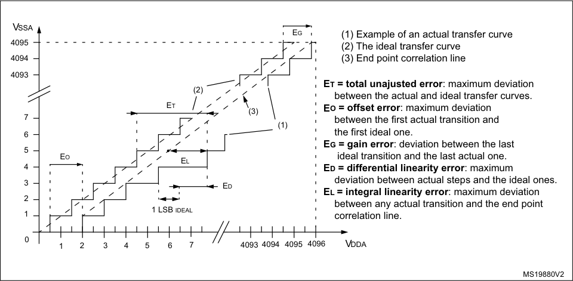

DS10184 Rev 10 87/133

99

--- end of page=86 ---

**Electrical characteristics** **STM32L051x6 STM32L051x8**

**Figure 29. Typical connection diagram using the ADC**

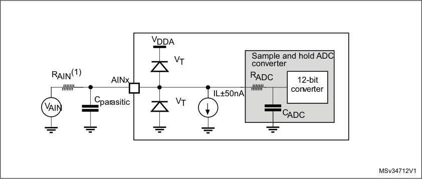

1. Refer to _Table 58: ADC characteristics_ for the values of R AIN, R ADC and C ADC .

2. C parasitic represents the capacitance of the PCB (dependent on soldering and PCB layout quality) plus the
pad capacitance (roughly 7 pF). A high C parasitic value will downgrade conversion accuracy. To remedy
this, f ADC should be reduced.

**General PCB design guidelines**

Power supply decoupling should be performed as shown in _Figure 30_ or _Figure 31_,
depending on whether V REF+ is connected to V DDA or not. The 10 nF capacitors should be
ceramic (good quality). They should be placed as close as possible to the chip.

**Figure 30. Power supply and reference decoupling** **(V** **REF+** **not connected to** **V** **DDA** **)**

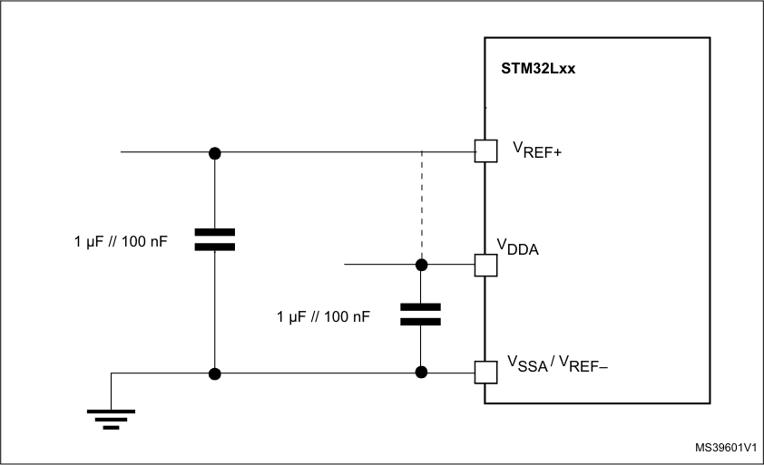

88/133 DS10184 Rev 10

--- end of page=87 ---

**STM32L051x6 STM32L051x8** **Electrical characteristics**

**Figure 31. Power supply and reference decoupling** **(V** **REF+** **connected to** **V** **DDA** **)**

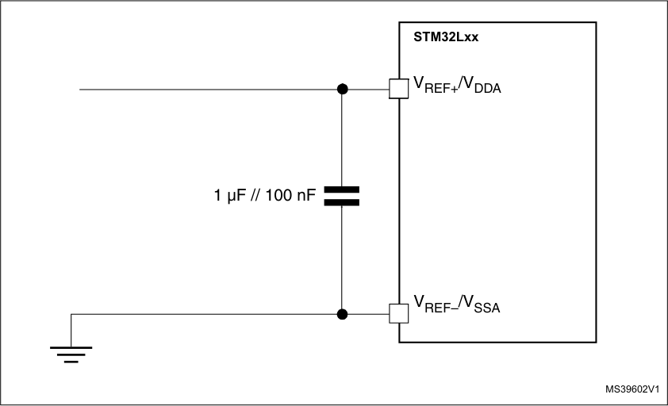

**6.3.16** **Temperature sensor characteristics**

**Table 61. Temperature sensor calibration values**

|Calibration value name|Description|Memory address|
|---|---|---|
|TS_CAL1|TS ADC raw data acquired at temperature of 30 °C, VDDA= 3 V|0x1FF8 007A - 0x1FF8 007B|
|TS_CAL2|TS ADC raw data acquired at temperature of 130 °C, VDDA= 3 V|0x1FF8 007E - 0x1FF8 007F|

**Table 62. Temperature sensor characteristics**

|Symbol|Parameter|Min|Typ|Max|Unit|
|---|---|---|---|---|---|
|TL (1)|VSENSE linearity with temperature|-|±1|±2|°C|
|Avg_Slope(1)|Average slope|1.48|1.61|1.75|mV/°C|
|V130|Voltage at 130°C ±5°C(2)|640|670|700|mV|
|IDDA(TEMP) (3)|Current consumption|-|3.4|6|µA|
|tSTART (3)|Startup time|-|-|10|µs|
|TS_temp (4)(3)|ADC sampling time when reading the temperature|10|-|-|-|

1. Guaranteed by characterization results.

2. Measured at V DD = 3 V ±10 mV. V130 ADC conversion result is stored in the TS_CAL2 byte.

3. Guaranteed by design.

4. Shortest sampling time can be determined in the application by multiple iterations.

DS10184 Rev 10 89/133

99

--- end of page=88 ---

**Electrical characteristics** **STM32L051x6 STM32L051x8**

**6.3.17** **Comparators**

**Table 63. Comparator 1 characteristics**

|Symbol|Parameter|Conditions|Min(1)|Typ|Max(1)|Unit|
|---|---|---|---|---|---|---|
|VDDA|Analog supply voltage|-|1.65||3.6|V|
|VIN|Comparator 1 input voltage range|-|0.6|-|VDDA|V|
|tSTART|Comparator startup time |-|-|7|10|µs|
|td|Propagation delay~~(2)~~|-|-|3|10|10|
|Voffset|Comparator offset|-|-|±3|±10|mV|
|dVoffset/dt|Comparator offset variation in worst voltage stress conditions |VDDA = 3.6 V, VIN+ = 0 V, VIN- = VREFINT, TA = 25°C|0|1.5|10|mV/1000 h|
|ICOMP1|Current consumption~~(3)~~|-|-|160|260|nA|

1. Guaranteed by characterization.

2. The delay is characterized for 100 mV input step with 10 mV overdrive on the inverting input, the non-inverting input set to
the reference.

3. Comparator consumption only. Internal reference voltage not included.

**Table 64. Comparator 2 characteristics**

|Symbol|Parameter|Conditions|Min|Typ|Max(1)|Unit|
|---|---|---|---|---|---|---|
|VDDA|Analog supply voltage|-|1.65|-|3.6|V|
|VIN|Comparator 2 input voltage range|-|0|-|VDDA|V|
|tSTART|Comparator startup time|Fast mode|-|15|20|µs|
|tSTART|Comparator startup time|Slow mode|-|20|25|25|
|td slow|Propagation delay(2) in slow mode|1.65 V≤ VDDA ≤ 2.7 V|-|1.8|3.5|3.5|
|td slow|Propagation delay(2) in slow mode|2.7 V≤ VDDA ≤ 3.6 V|-|2.5|6|6|
|td fast|Propagation delay(2) in fast mode|1.65 V≤ VDDA ≤ 2.7 V|-|0.8|2|2|
|td fast|Propagation delay(2) in fast mode|2.7 V≤ VDDA ≤ 3.6 V|-|1.2|4|4|
|Voffset|Comparator offset error||-|±4|±20|mV|
|dThreshold/ dt|Threshold voltage temperature coefficient|VDDA = 3.3V, TA = 0 to 50°C,  V- = VREFINT,  3/4 VREFINT,  1/2 VREFINT,  1/4 VREFINT.|-|15|30|ppm /°C|
|ICOMP2|Current consumption(3)|Fast mode|-|3.5|5|µA|
|ICOMP2|Current consumption(3)|Slow mode|-|0.5|2|2|

1. Guaranteed by characterization results.

2. The delay is characterized for 100 mV input step with 10 mV overdrive on the inverting input, the non-inverting input set to
the reference.

3. Comparator consumption only. Internal reference voltage (required for comparator operation) is not included.

90/133 DS10184 Rev 10

--- end of page=89 ---

**STM32L051x6 STM32L051x8** **Electrical characteristics**

**6.3.18** **Timer characteristics**

**TIM timer characteristics**

The parameters given in the _Table 65_ are guaranteed by design.

Refer to _Section 6.3.13: I/O port characteristics_ for details on the input/output alternate
function characteristics (output compare, input capture, external clock, PWM output).

**Table 65. TIMx characteristics** **[(1)]**

|Symbol|Parameter|Conditions|Min|Max|Unit|
|---|---|---|---|---|---|
|tres(TIM)|Timer resolution time||1|-|tTIMxCLK|
|tres(TIM)|Timer resolution time|fTIMxCLK = 32 MHz|31.25|-|ns|
|fEXT|Timer external clock frequency on CH1 to CH4||0|fTIMxCLK/2|MHz|
|fEXT|Timer external clock frequency on CH1 to CH4|fTIMxCLK = 32 MHz|0|16|MHz|
|ResTIM|Timer resolution|-||16|bit|
|tCOUNTER|16-bit counter clock period when internal clock is selected (timer’s prescaler disabled)|-|1|65536|tTIMxCLK|
|tCOUNTER|16-bit counter clock period when internal clock is selected (timer’s prescaler disabled)|fTIMxCLK = 32 MHz|0.0312|2048|µs|
|tMAX_COUNT|Maximum possible count|-|-|65536 × 65536|tTIMxCLK|
|tMAX_COUNT|Maximum possible count|fTIMxCLK = 32 MHz|-|134.2|s|

1. TIMx is used as a general term to refer to the TIM2, TIM6, TIM21, and TIM22 timers.

**6.3.19** **Communications interfaces**

**I** **[2]** **C interface characteristics**

The I [2] C interface meets the timings requirements of the I [2] C-bus specification and user
manual rev. 03 for:

      - Standard-mode (Sm) : with a bit rate up to 100 kbit/s

      - Fast-mode (Fm) : with a bit rate up to 400 kbit/s

      - Fast-mode Plus (Fm+) : with a bit rate up to 1 Mbit/s.

The I [2] C timing requirements are guaranteed by design when the I [2] C peripheral is properly
configured (refer to the reference manual for details). The SDA and SCL I/O requirements
are met with the following restrictions: the SDA and SCL I/O pins are not "true" open-drain.
When configured as open-drain, the PMOS connected between the I/O pin and VDDIOx is
disabled, but is still present. Only FTf I/O pins support Fm+ low level output current
maximum requirement (refer to _Section 6.3.13: I/O port characteristics_ for the I2C I/Os
characteristics).

All I [2] C SDA and SCL I/Os embed an analog filter (see _Table 66_ for the analog filter
characteristics).

DS10184 Rev 10 91/133

99

--- end of page=90 ---

**Electrical characteristics** **STM32L051x6 STM32L051x8**

The analog spike filter is compliant with I [2] C timings requirements only for the following
voltage ranges:

      - Fast mode Plus: 2.7 V ≤ V DD ≤ 3.6 V and voltage scaling Range 1

      - Fast mode:

– 2 V ≤ V DD ≤ 3.6 V and voltage scaling Range 1 or Range 2.

– V DD < 2 V, voltage scaling Range 1 or Range 2, C load < 200 pF.

In other ranges, the analog filter should be disabled. The digital filter can be used instead.

_Note:_ _In Standard mode, no spike filter is required._

**Table 66. I2C analog filter characteristics** **[(1)]**

|Symbol|Parameter|Conditions|Min|Max|Unit|
|---|---|---|---|---|---|
|tAF|Maximum pulse width of spikes that are suppressed by the analog filter|Range 1|50(2)|100(3)|ns|
|tAF|Maximum pulse width of spikes that are suppressed by the analog filter|Range 2|Range 2|-|-|
|tAF|Maximum pulse width of spikes that are suppressed by the analog filter|Range 3|Range 3|-|-|

1. Guaranteed by characterization results.

2. Spikes with widths below t AF(min) are filtered.

3. Spikes with widths above t AF(max) are not filtered

**SPI characteristics**

Unless otherwise specified, the parameters given in the following tables are derived from
tests performed under ambient temperature, f PCLKx frequency and V DD supply voltage
conditions summarized in _Table 21_ .

Refer to _Section 6.3.12: I/O current injection characteristics_ for more details on the
input/output alternate function characteristics (NSS, SCK, MOSI, MISO).

**Table 67. SPI characteristics in voltage Range 1** **[(1)]**

|Symbol|Parameter|Conditions|Min|Typ|Max|Unit|
|---|---|---|---|---|---|---|
|fSCK 1/tc(SCK)|SPI clock frequency|Master mode|-|-|16|MHz|
|fSCK 1/tc(SCK)|SPI clock frequency|Slave mode receiver|Slave mode receiver|Slave mode receiver|16|16|
|fSCK 1/tc(SCK)|SPI clock frequency|Slave mode Transmitter 1.71<VDD<3.6V|-|-|12(2)|12(2)|
|fSCK 1/tc(SCK)|SPI clock frequency|Slave mode Transmitter 2.7<VDD<3.6V|-|-|16(2)|16(2)|
|Duty(SCK)|Duty cycle of SPI clock frequency|Slave mode|30|50|70|%|

92/133 DS10184 Rev 10

--- end of page=91 ---

**STM32L051x6 STM32L051x8** **Electrical characteristics**

**Table 67. SPI characteristics in voltage Range 1** **[(1)]** **(continued)**

|Symbol|Parameter|Conditions|Min|Typ|Max|Unit|
|---|---|---|---|---|---|---|
|tsu(NSS)|NSS setup time|Slave mode, SPI presc = 2|4*Tpclk|-|-|ns|
|th(NSS)|NSS hold time|Slave mode, SPI presc = 2|2*Tpclk|-|-|-|
|tw(SCKH) tw(SCKL)|SCK high and low time|Master mode|Tpclk-2|Tpclk|Tpclk+ 2|Tpclk+ 2|
|tsu(MI)|Data input setup time|Master mode|0|-|-|-|
|tsu(SI)|tsu(SI)|Slave mode|3|-|-|-|
|th(MI)|Data input hold time|Master mode|7|-|-|-|
|th(SI)|th(SI)|Slave mode|3.5|-|-|-|
|ta(SO|Data output access time|Slave mode|15|-|36|36|
|tdis(SO)|Data output disable time|Slave mode|10|-|30|30|
|tv(SO)|Data output valid time|Slave mode 1.65 V<VDD<3.6 V|-|18|41|41|
|tv(SO)|Data output valid time|Slave mode 2.7 V<VDD<3.6 V|-|18|25|25|
|tv(MO)|tv(MO)|Master mode|-|4|7|7|
|th(SO)|Data output hold time|Slave mode|10|-|-|-|
|th(MO)|th(MO)|Master mode|0|-|-|-|

1. Guaranteed by characterization results.

2. The maximum SPI clock frequency in slave transmitter mode is determined by the sum of t v(SO) and t su(MI)
which has to fit into SCK low or high phase preceding the SCK sampling edge. This value can be
achieved when the SPI communicates with a master having t su(MI) = 0 while Duty (SCK) = 50%.

DS10184 Rev 10 93/133

99

--- end of page=92 ---

**Electrical characteristics** **STM32L051x6 STM32L051x8**

**Table 68. SPI characteristics in voltage Range 2** **[(1)]**

|Symbol|Parameter|Conditions|Min|Typ|Max|Unit|
|---|---|---|---|---|---|---|
|fSCK 1/tc(SCK)|SPI clock frequency|Master mode|-|-|8|MHz|
|fSCK 1/tc(SCK)|SPI clock frequency|Slave mode Transmitter 1.65<VDD<3.6V|Slave mode Transmitter 1.65<VDD<3.6V|Slave mode Transmitter 1.65<VDD<3.6V|8|8|
|fSCK 1/tc(SCK)|SPI clock frequency|Slave mode Transmitter 2.7<VDD<3.6V|Slave mode Transmitter 2.7<VDD<3.6V|Slave mode Transmitter 2.7<VDD<3.6V|8(2)|8(2)|
|Duty(SCK)|Duty cycle of SPI clock frequency|Slave mode|30|50|70|%|
|tsu(NSS)|NSS setup time|Slave mode, SPI presc = 2|4*Tpclk|-|-|ns|
|th(NSS)|NSS hold time|Slave mode, SPI presc = 2|2*Tpclk|-|-|-|
|tw(SCKH) tw(SCKL)|SCK high and low time|Master mode|Tpclk-2|Tpclk|Tpclk+2|Tpclk+2|
|tsu(MI)|Data input setup time|Master mode|0|-|-|-|
|tsu(SI)|tsu(SI)|Slave mode|3|-|-|-|
|th(MI)|Data input hold time|Master mode|11|-|-|-|
|th(SI)|th(SI)|Slave mode|4.5|-|-|-|
|ta(SO|Data output access time|Slave mode|18|-|52|52|
|tdis(SO)|Data output disable time|Slave mode|12|-|42|42|
|tv(SO)|Data output valid time|Slave mode|-|20|56.5|56.5|
|tv(MO)|tv(MO)|Master mode|-|5|9|9|
|th(SO)|Data output hold time|Slave mode|13|-|-|-|
|th(MO)|th(MO)|Master mode|3|-|-|-|

1. Guaranteed by characterization results.

2. The maximum SPI clock frequency in slave transmitter mode is determined by the sum of t v(SO) and t su(MI) which has to fit
into SCK low or high phase preceding the SCK sampling edge. This value can be achieved when the SPI communicates
with a master having t su(MI) = 0 while Duty (SCK) = 50%.

94/133 DS10184 Rev 10

--- end of page=93 ---

**STM32L051x6 STM32L051x8** **Electrical characteristics**

**Table 69. SPI characteristics in voltage Range 3** **[(1)]**

|Symbol|Parameter|Conditions|Min|Typ|Max|Unit|
|---|---|---|---|---|---|---|
|fSCK 1/tc(SCK)|SPI clock frequency|Master mode|-|-|2|MHz|
|fSCK 1/tc(SCK)|SPI clock frequency|Slave mode|Slave mode|Slave mode|2(2)|2(2)|
|Duty(SCK)|Duty cycle of SPI clock frequency|Slave mode|30|50|70|%|
|tsu(NSS)|NSS setup time|Slave mode, SPI presc = 2|4*Tpclk|-|-|ns|
|th(NSS)|NSS hold time|Slave mode, SPI presc = 2|2*Tpclk|-|-|-|
|tw(SCKH) tw(SCKL)|SCK high and low time|Master mode|Tpclk-2|Tpclk|Tpclk+2|Tpclk+2|
|tsu(MI)|Data input setup time|Master mode|1.5|-|-|-|
|tsu(SI)|tsu(SI)|Slave mode|6|-|-|-|
|th(MI)|Data input hold time|Master mode|13.5|-|-|-|
|th(SI)|th(SI)|Slave mode|16|-|-|-|
|ta(SO|Data output access time|Slave mode|30|-|70|70|
|tdis(SO)|Data output disable time|Slave mode|40|-|80|80|
|tv(SO)|Data output valid time|Slave mode|-|30|70|70|
|tv(MO)|tv(MO)|Master mode|-|7|9|9|
|th(SO)|Data output hold time|Slave mode|25|-|-|-|
|th(MO)|th(MO)|Master mode|8|-|-|-|

1. Guaranteed by characterization results.

2. The maximum SPI clock frequency in slave transmitter mode is determined by the sum of t v(SO) and t su(MI) which has to fit
into SCK low or high phase preceding the SCK sampling edge. This value can be achieved when the SPI communicates
with a master having t su(MI) = 0 while Duty (SCK) = 50%.

DS10184 Rev 10 95/133

99

--- end of page=94 ---

**Electrical characteristics** **STM32L051x6 STM32L051x8**

**Figure 32. SPI timing diagram - slave mode and CPHA = 0**

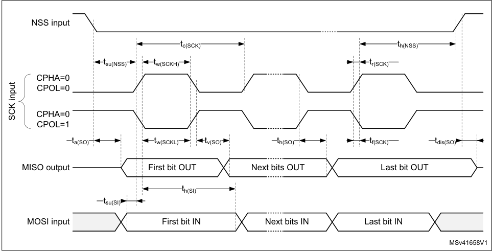

**Figure 33. SPI timing diagram - slave mode and CPHA = 1** **[(1)]**

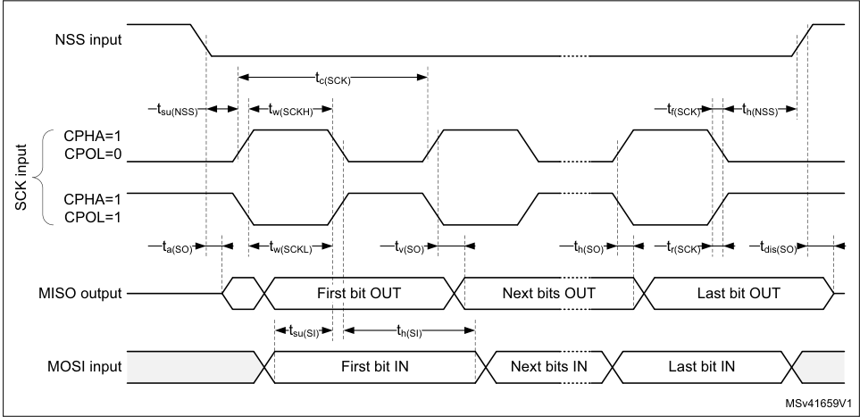

1. Measurement points are done at CMOS levels: 0.3V DD and 0.7V DD.

96/133 DS10184 Rev 10

--- end of page=95 ---

**STM32L051x6 STM32L051x8** **Electrical characteristics**

**Figure 34. SPI timing diagram - master mode** **[(1)]**

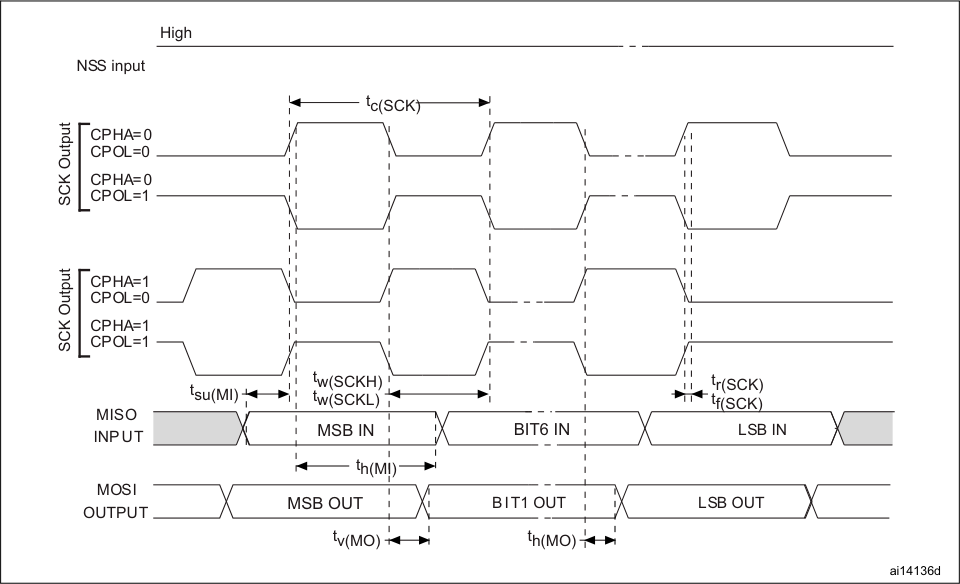

|Col1|Col2|Col3|
|---|---|---|
||WZ6&.+ WZ6&./|WZ6&.+ WZ6&./|
||06%,1||

1. Measurement points are done at CMOS levels: 0.3V DD and 0.7V DD.

DS10184 Rev 10 97/133

99

--- end of page=96 ---

**Electrical characteristics** **STM32L051x6 STM32L051x8**

**I2S characteristics**

**Table 70. I2S characteristics** **[(1)]**

|Symbol|Parameter|Conditions|Min|Max|Unit|
|---|---|---|---|---|---|
|fMCK|I2S Main clock output|-|256 x 8K|256xFs(2)|MHz|
|fCK|I2S clock frequency|Master data: 32 bits|-|64xFs|MHz|
|fCK|I2S clock frequency|Slave data: 32 bits|-|64xFs|64xFs|
|DCK|I2S clock frequency duty cycle|Slave receiver|30|70|%|
|tv(WS)|WS valid time|Master mode|-|15|ns|
|th(WS)|WS hold time|Master mode|11|-|-|
|tsu(WS)|WS setup time|Slave mode|6|-|-|
|th(WS)|WS hold time|Slave mode|2|-|-|
|tsu(SD_MR)|Data input setup time|Master receiver|0|-|-|
|tsu(SD_SR)|tsu(SD_SR)|Slave receiver|6.5|-|-|
|th(SD_MR)|Data input hold time|Master receiver|18|-|-|
|th(SD_SR)|th(SD_SR)|Slave receiver|15.5|-|-|
|tv(SD_ST)|Data output valid time|Slave transmitter (after enable edge)|-|77|77|
|tv(SD_MT)|tv(SD_MT)|Master transmitter (after enable edge)|-|8|8|
|th(SD_ST)|Data output hold time|Slave transmitter (after enable edge)|18|-|-|
|th(SD_MT)|th(SD_MT)|Master transmitter (after enable edge)|1.5|-|-|

1. Guaranteed by characterization results.

2. 256xFs maximum value is equal to the maximum clock frequency.

_Note:_ _Refer to the I2S section of the product reference manual for more details about the sampling_
_frequency (Fs), f_ _MCK_ _, f_ _CK_ _and D_ _CK_ _values. These values reflect only the digital peripheral_
_behavior, source clock precision might slightly change them. DCK depends mainly on the_
_ODD bit value, digital contribution leads to a min of (I2SDIV/(2*I2SDIV+ODD) and a max of_
_(I2SDIV+ODD)/(2*I2SDIV+ODD). Fs max is supported for each mode/condition._

98/133 DS10184 Rev 10

--- end of page=97 ---

**STM32L051x6 STM32L051x8** **Electrical characteristics**

**Figure 35. I** **[2]** **S slave timing diagram (Philips protocol)** **[(1)]**

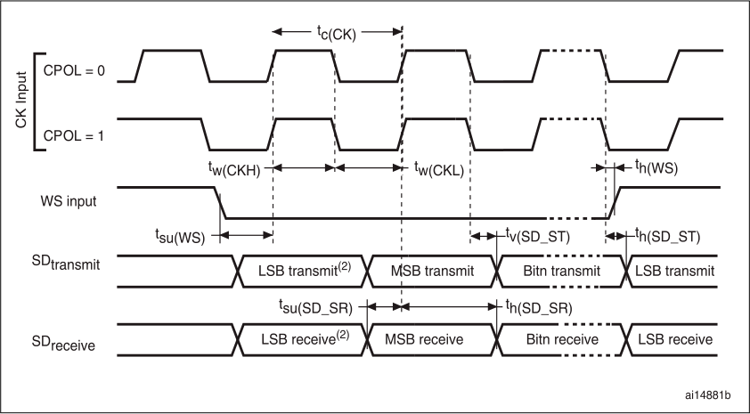

1. Measurement points are done at CMOS levels: 0.3 × V DD and 0.7 × V DD .

2. LSB transmit/receive of the previously transmitted byte. No LSB transmit/receive is sent before the first
byte.

**Figure 36. I** **[2]** **S master timing diagram (Philips protocol)** **[(1)]**

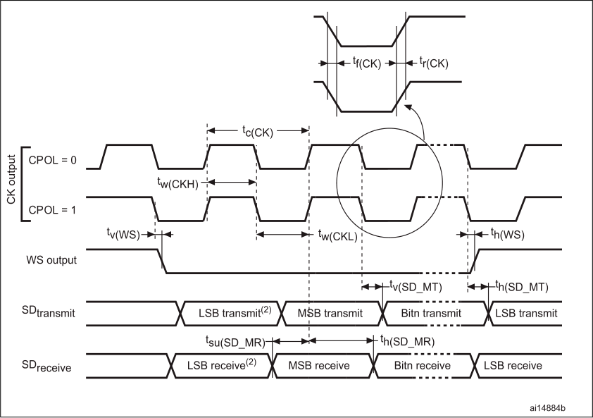

1. Guaranteed by characterization results.

2. LSB transmit/receive of the previously transmitted byte. No LSB transmit/receive is sent before the first
byte.

DS10184 Rev 10 99/133

99

--- end of page=98 ---

**Package information** **STM32L051x6 STM32L051x8**

### **7 Package information**

In order to meet environmental requirements, ST offers these devices in different grades of
ECOPACK packages, depending on their level of environmental compliance. ECOPACK
specifications, grade definitions and product status _are available at www.st.com._ ECOPACK
is an ST trademark.

##### **7.1 LQFP64 package information**

**Figure 37. LQFP64 - 64-pin, 10 x 10 mm low-profile quad flat package outline**

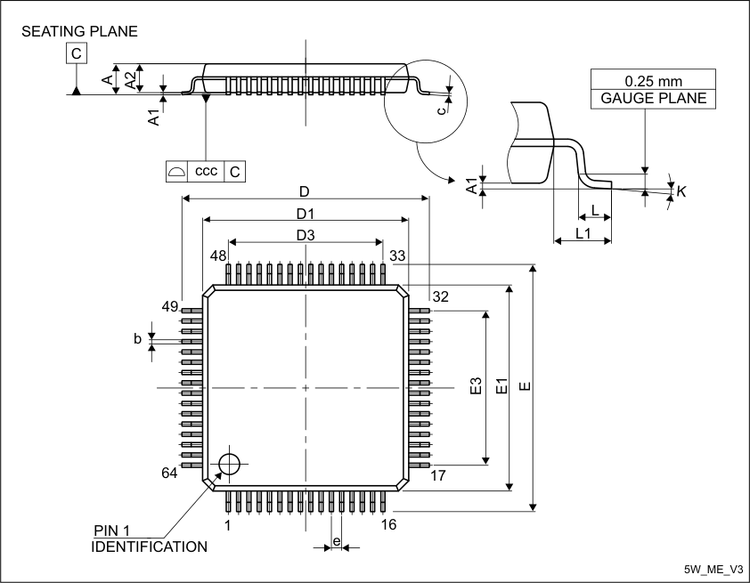

|$|Col2|Col3|Col4|Col5|Col6|Col7|Col8|Col9|Col10|Col11|Col12|Col13|Col14|Col15|Col16|
|---|---|---|---|---|---|---|---|---|---|---|---|---|---|---|---|
|$ ||||||||||||||||

|Col1|FFF|&|
|---|---|---|
||||

1. Drawing is not to scale.

100/133 DS10184 Rev 10

--- end of page=99 ---

