# STM32L051C8 — Pages 101–133

**STM32L051x6 STM32L051x8** **Package information**

**Table 71. LQFP64 - 64-pin, 10 x 10 mm low-profile quad flat**
**package mechanical** **data**

|Symbol|millimeters|Col3|Col4|inches(1)|Col6|Col7|
|---|---|---|---|---|---|---|
|**Symbol**|**Min**|**Typ**|**Max**|**Min**|**Typ**|**Max**|
|A|-|-|1.600|-|-|0.0630|
|A1|0.050|-|0.150|0.0020|-|0.0059|
|A2|1.350|1.400|1.450|0.0531|0.0551|0.0571|
|b|0.170|0.220|0.270|0.0067|0.0087|0.0106|
|c|0.090|-|0.200|0.0035|-|0.0079|
|D|-|12.000|-|-|0.4724|-|
|D1|-|10.000|-|-|0.3937|-|
|D3|-|7.500|-|-|0.2953|-|
|E|-|12.000|-|-|0.4724|-|
|E1|-|10.000|-|-|0.3937|-|
|E3|-|7.500|-|-|0.2953|-|
|e|-|0.500|-|-|0.0197|-|
|K|0°|3.5°|7°|0°|3.5°|7°|
|L|0.450|0.600|0.750|0.0177|0.0236|0.0295|
|L1|-|1.000|-|-|0.0394|-|
|ccc|-|-|0.080|-|-|0.0031|

1. Values in inches are converted from mm and rounded to 4 decimal digits.

DS10184 Rev 10 101/133

125

--- end of page=100 ---

**Package information** **STM32L051x6 STM32L051x8**

**Figure 38. LQFP64 - 64-pin, 10 x 10 mm low-profile quad flat recommended footprint**

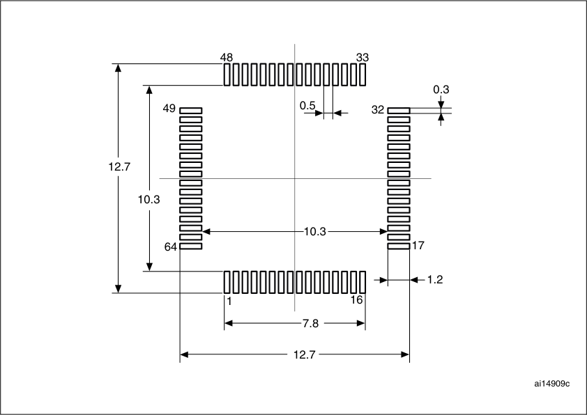

|Col1|Col2|Col3|Col4|Col5|Col6|Col7|Col8|Col9|Col10|Col11|Col12|Col13|Col14|Col15|Col16|
|---|---|---|---|---|---|---|---|---|---|---|---|---|---|---|---|
|||||||||||||||||

1. Dimensions are expressed in millimeters.

102/133 DS10184 Rev 10

|Col1|Col2|
|---|---|
|||
|||
|||
|||
|||
|||
|||
|||
|||
|||
|||
|||
|||
|||
|||
|||

--- end of page=101 ---

**STM32L051x6 STM32L051x8** **Package information**

**Device marking for LQFP64**

The following figure gives an example of topside marking versus pin 1 position identifier
location.

The printed markings may differ depending on the supply chain.

Other optional marking or inset/upset marks, which depend on supply chain operations, are
not indicated below.

**Figure 39. LQFP64 marking example (package top view)**

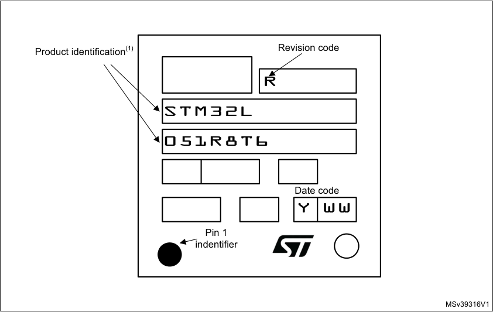

1. Parts marked as “ES”, “E” or accompanied by an Engineering Sample notification letter, are not yet
qualified and therefore not approved for use in production. ST is not responsible for any consequences
resulting from such use. In no event will ST be liable for the customer using any of these engineering
samples in production. ST’s Quality department must be contacted prior to any decision to use these
engineering samples to run a qualification activity.

DS10184 Rev 10 103/133

125

--- end of page=102 ---

**Package information** **STM32L051x6 STM32L051x8**

##### **7.2 TFBGA64 package information**

**Figure 40. TFBGA64 – 64-ball, 5 x 5 mm, 0.5 mm pitch thin profile fine pitch ball**
**grid array** **package outline**

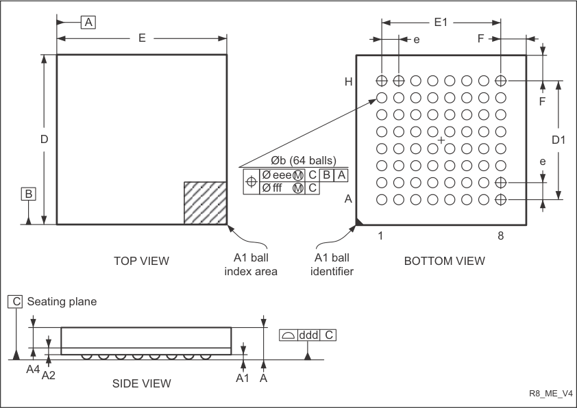

|Col1|‘HHH0|&|%|$|
|---|---|---|---|---|
||III ‘ 0|&|&|&|

|Col1|Col2|Col3|
|---|---|---|
||||

1. Drawing is not to scale.

**Table 72. TFBGA64 – 64-ball, 5 x 5 mm, 0.5 mm pitch thin profile fine pitch ball grid**
**array** **package outline**

|Symbol|millimeters|Col3|Col4|inches(1)|Col6|Col7|
|---|---|---|---|---|---|---|
|**Symbol**|**Min**|**Typ**|**Max**|**Min**|**Typ**|**Max**|
|A|-|-|1.200|-|-|0.0472|
|A1|0.150|-|-|0.0059|-|-|
|A2|-|0.200|-|-|0.0079|-|
|A4|-|-|0.600|-|-|0.0236|
|b|0.250|0.300|0.350|0.0098|0.0118|0.0138|
|D|4.850|5.000|5.150|0.1909|0.1969|0.2028|
|D1|-|3.500|-|-|0.1378|-|
|E|4.850|5.000|5.150|0.1909|0.1969|0.2028|
|E1|-|3.500|-|-|0.1378|-|
|e|-|0.500|-|-|0.0197|-|
|F|-|0.750|-|-|0.0295|-|

104/133 DS10184 Rev 10

--- end of page=103 ---

**STM32L051x6 STM32L051x8** **Package information**

**Table 72. TFBGA64 – 64-ball, 5 x 5 mm, 0.5 mm pitch thin profile fine pitch ball grid**
**array** **package outline (continued)**

|Symbol|millimeters|Col3|Col4|inches(1)|Col6|Col7|
|---|---|---|---|---|---|---|
|**Symbol**|**Min**|**Typ**|**Max**|**Min**|**Typ**|**Max**|
|ddd|-|-|0.080|-|-|0.0031|
|eee|-|-|0.150|-|-|0.0059|
|fff|-|-|0.050|-|-|0.0020|

1. Values in inches are converted from mm and rounded to 4 decimal digits.

**Figure 41. TFBGA64 – 64-ball, 5 x 5 mm, 0.5 mm pitch, thin profile fine pitch ball**
**,grid array recommended footprint**

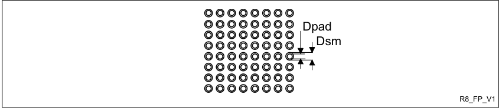

**Table 73. TFBGA64 recommended PCB design rules (0.5 mm pitch BGA)**

|Dimension|Recommended values|
|---|---|
|Pitch|0.5|
|Dpad|0.280 mm|
|Dsm|0.370 mm typ. (depends on the soldermask registration tolerance)|
|Stencil opening|0.280 mm|
|Stencil thickness|Between 0.100 mm and 1.125 mm|
|Pad trace width|0.100 mm|

DS10184 Rev 10 105/133

125

--- end of page=104 ---

**Package information** **STM32L051x6 STM32L051x8**

**Device marking for TFBGA64**

The following figure gives an example of topside marking versus ball A 1 position identifier
location.

The printed markings may differ depending on the supply chain.

Other optional marking or inset/upset marks, which depend on supply chain operations, are
not indicated below.

**Figure 42. TFBGA64 marking example (package top view)**

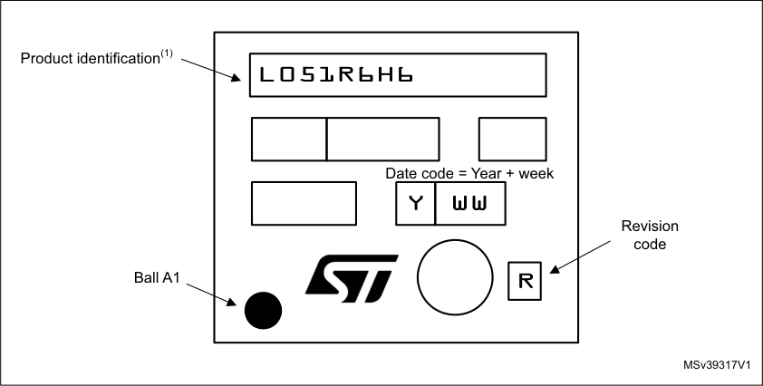

1. Parts marked as “ES”, “E” or accompanied by an Engineering Sample notification letter, are not yet
qualified and therefore not approved for use in production. ST is not responsible for any consequences
resulting from such use. In no event will ST be liable for the customer using any of these engineering
samples in production. ST’s Quality department must be contacted prior to any decision to use these
engineering samples to run a qualification activity.

106/133 DS10184 Rev 10

--- end of page=105 ---

**STM32L051x6 STM32L051x8** **Package information**

##### **7.3 LQFP48 package information**

**Figure 43. LQFP48 - 48-pin, 7 x 7 mm low-profile quad flat package outline**

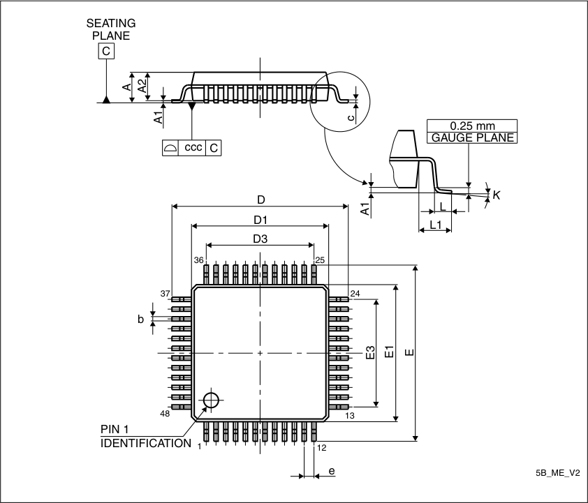

|Col1|Col2|
|---|---|
|,||

1. Drawing is not to scale.

|��|Col2|Col3|
|---|---|---|
||||
||||
||||
|||%|

DS10184 Rev 10 107/133

125

--- end of page=106 ---

**Package information** **STM32L051x6 STM32L051x8**

**Table 74. LQFP48 - 48-pin, 7 x 7 mm low-profile quad flat package mechanical data**

|Symbol|millimeters|Col3|Col4|inches(1)|Col6|Col7|
|---|---|---|---|---|---|---|
|**Symbol**|**Min**|**Typ**|**Max**|**Min**|**Typ**|**Max**|
|A|-|-|1.600|-|-|0.0630|
|A1|0.050|-|0.150|0.0020|-|0.0059|
|A2|1.350|1.400|1.450|0.0531|0.0551|0.0571|
|b|0.170|0.220|0.270|0.0067|0.0087|0.0106|
|c|0.090|-|0.200|0.0035|-|0.0079|
|D|8.800|9.000|9.200|0.3465|0.3543|0.3622|
|D1|6.800|7.000|7.200|0.2677|0.2756|0.2835|
|D3|-|5.500|-|-|0.2165|-|
|E|8.800|9.000|9.200|0.3465|0.3543|0.3622|
|E1|6.800|7.000|7.200|0.2677|0.2756|0.2835|
|E3|-|5.500|-|-|0.2165|-|
|e|-|0.500|-|-|0.0197|-|
|L|0.450|0.600|0.750|0.0177|0.0236|0.0295|
|L1|-|1.000|-|-|0.0394|-|
|k|0°|3.5°|7°|0°|3.5°|7°|
|ccc|-|-|0.080|-|-|0.0031|

1. Values in inches are converted from mm and rounded to 4 decimal digits.

**Figure 44. LQFP48 - 48-pin, 7 x 7 mm low-profile quad flat recommended footprint**

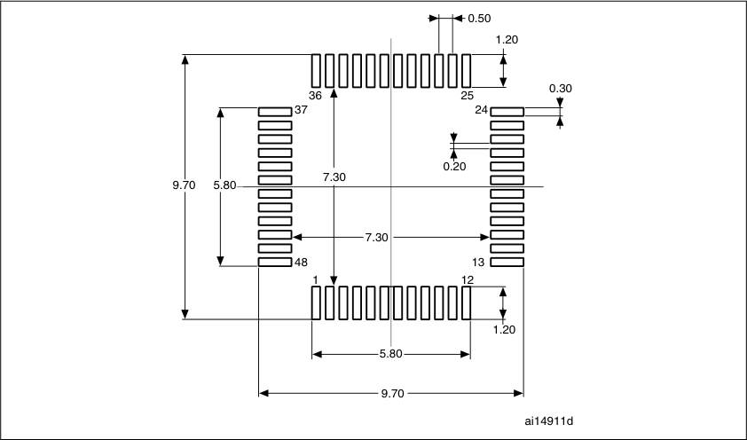

|Col1|Col2|Col3|Col4|Col5|Col6|Col7|Col8|Col9|Col10|Col11|Col12|Col13|Col14|Col15|
|---|---|---|---|---|---|---|---|---|---|---|---|---|---|---|
||||||||||||||||
||||||||||||||||
||||||||||||||||
||||||||||||||||
||||||||||||||||
||||||||||||||||
||||||||||||||||
||||||||||||||||
||||||||||||||||
||||||||||||||||
||||||||||||||||
||||||||||||||||

1. Dimensions are expressed in millimeters.

108/133 DS10184 Rev 10

--- end of page=107 ---

**STM32L051x6 STM32L051x8** **Package information**

**Device marking for LQFP48**

The following figure gives an example of topside marking versus pin 1 position identifier
location.

The printed markings may differ depending on the supply chain.

Other optional marking or inset/upset marks, which depend on supply chain operations, are
not indicated below.

**Figure 45. LQFP48 marking example (package top view)**

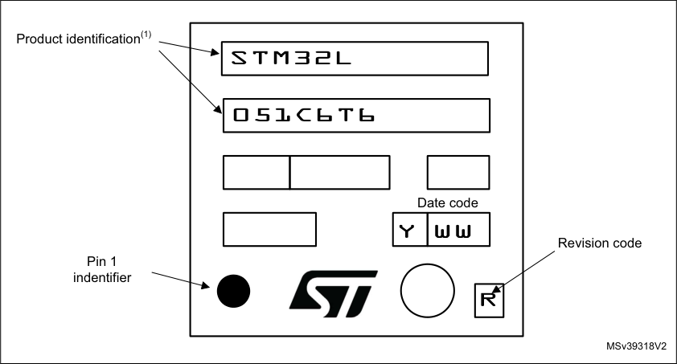

1. Parts marked as “ES”, “E” or accompanied by an Engineering Sample notification letter, are not yet
qualified and therefore not approved for use in production. ST is not responsible for any consequences
resulting from such use. In no event will ST be liable for the customer using any of these engineering
samples in production. ST’s Quality department must be contacted prior to any decision to use these
engineering samples to run a qualification activity.

DS10184 Rev 10 109/133

125

--- end of page=108 ---

**Package information** **STM32L051x6 STM32L051x8**

##### **7.4 UFQFPN48 package information**

**Figure 46. UFQFPN48 - 48 leads, 7x7 mm, 0.5 mm pitch, ultra thin fine pitch quad flat**
**package outline**

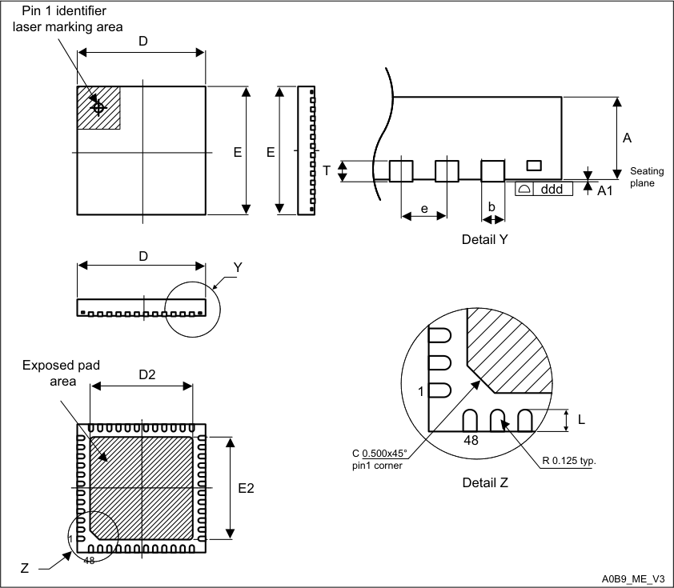

1. Drawing is not to scale.

2. All leads/pads should also be soldered to the PCB to improve the lead/pad solder joint life.

3. There is an exposed die pad on the underside of the UFQFPN package. It is recommended to connect and
solder this back-side pad to PCB ground.

110/133 DS10184 Rev 10

--- end of page=109 ---

**STM32L051x6 STM32L051x8** **Package information**

**Table 75. UFQFPN48 - 48 leads, 7x7 mm, 0.5 mm pitch, ultra thin fine pitch quad flat**
**package mechanical data**

|Symbol|millimeters|Col3|Col4|inches(1)|Col6|Col7|
|---|---|---|---|---|---|---|
|**Symbol**|**Min**|**Typ**|**Max**|**Min**|**Typ**|**Max**|
|A|0.500|0.550|0.600|0.0197|0.0217|0.0236|
|A1|0.000|0.020|0.050|0.0000|0.0008|0.0020|
|D|6.900|7.000|7.100|0.2717|0.2756|0.2795|
|E|6.900|7.000|7.100|0.2717|0.2756|0.2795|
|D2|5.500|5.600|5.700|0.2165|0.2205|0.2244|
|E2|5.500|5.600|5.700|0.2165|0.2205|0.2244|
|L|0.300|0.400|0.500|0.0118|0.0157|0.0197|
|T|-|0.152|-|-|0.0060|-|
|b|0.200|0.250|0.300|0.0079|0.0098|0.0118|
|e|-|0.500|-|-|0.0197|-|
|ddd|-|-|0.080|-|-|0.0031|

1. Values in inches are converted from mm and rounded to 4 decimal digits.

**Figure 47. UFQFPN48 - 48 leads, 7x7 mm, 0.5 mm pitch, ultra thin fine pitch quad flat**
**package recommended footprint**

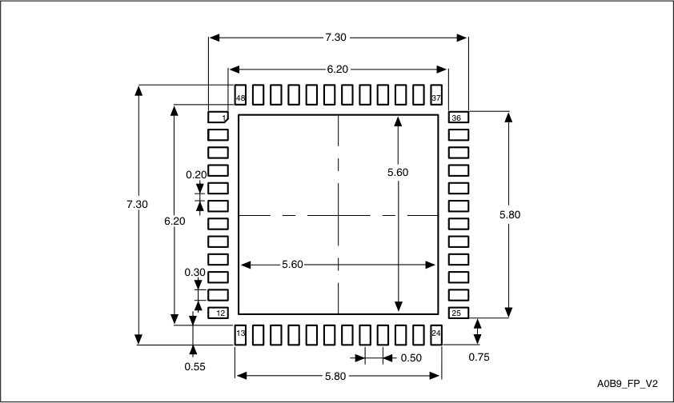

|Col1|Col2||
|---|---|---|
||||
||||

1. Dimensions are expressed in millimeters.

DS10184 Rev 10 111/133

125

--- end of page=110 ---

**Package information** **STM32L051x6 STM32L051x8**

##### **7.5 Standard WLCSP36 package information**

**Figure 48. Standard WLCSP36 - 2.61 x 2.88 mm, 0.4 mm pitch wafer level chip scale**
**package outline**

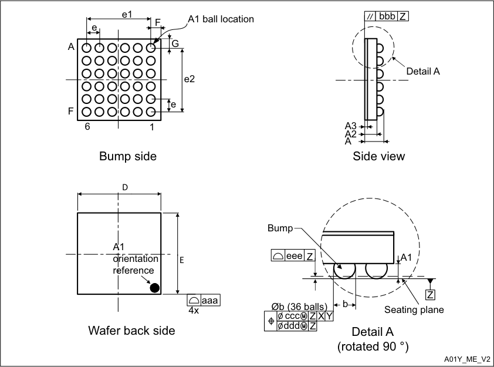

|Col1|��|Col3|Col4|Col5|
|---|---|---|---|---|
||H|H|H|H|
||H|H|||
||||||
|||||H|
||||||

|Col1|Col2|
|---|---|
|$||
|R U|ULHQWDWLRQ HIHUHQFH|

1. Drawing is not to scale.

|Col1|FFF|=|;|
|---|---|---|---|
||GGG|=|=|

2. b dimensions is measured at the maximum bump diameter parallel to primary datum Z

**Table 76. Standard WLCSP36 - 2.61 x 2.88 mm, 0.4 mm pitch wafer level chip scale**
**mechanical data**

|Symbol|millimeters|Col3|Col4|inches(1)|Col6|Col7|
|---|---|---|---|---|---|---|
|** Symbol**|**Min**|**Typ**|**Max**|**Min**|**Typ**|**Max**|
|A|-|-|0.59|-|-|0.023|
|A1|-|0.18|-|-|0.007|-|
|A2|-|0.38|-|-|0.015|-|
|A3|-|0.025(2)|-|-|0.001|-|
|b|0.22|0.25|0.28|0.009|0.010|0.011|
|D|2.59|2.61|2.63|0.102|0.103|0.104|
|E|2.86|2.88|2.90|0.112|0.113|0.114|
|e|-|0.40|-|-|0.016|-|
|e1|-|2.00|-|-|0.079|-|
|e2|-|2.00|-|-|0.079|-|

112/133 DS10184 Rev 10

--- end of page=111 ---

**STM32L051x6 STM32L051x8** **Package information**

**Table 76. Standard WLCSP36 - 2.61 x 2.88 mm, 0.4 mm pitch wafer level chip scale**
**mechanical data (continued)**

|Symbol|millimeters|Col3|Col4|inches(1)|Col6|Col7|
|---|---|---|---|---|---|---|
|** Symbol**|**Min**|**Typ**|**Max**|**Min**|**Typ**|**Max**|
|F|-|0.305(3)|-|-|0.012|-|
|G|-|0.440(3)|-|-|0.017|-|
|aaa|-|-|0.100|-|-|0.004|
|bbb|-|-|0.100|-|-|0.004|
|ccc|-|-|0.100|-|-|0.004|
|ddd|-|-|0.050|-|-|0.002|
|eee|-|-|0.050|-|-|0.002|

1. Values in inches are converted from mm and rounded to the 3rd decimal place.

2. Nominal dimension rounded to the 3rd decimal place results from process capability.

3. Calculated dimensions are rounded to the 3rd decimal place.

**Figure 49. Standard WLCSP36 - 2.61 x 2.88 mm, 0.4 mm pitch wafer level chip scale**
**recommended footprint**

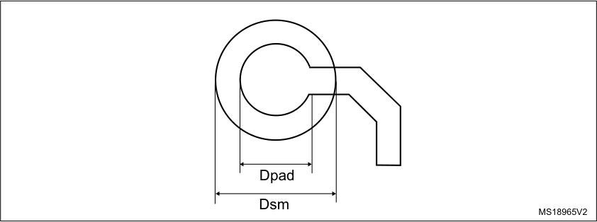

**Table 77. Standard WLCSP36 recommended PCB design rules**

|Dimension|Recommended values|
|---|---|
|Pitch|0.4 mm|
|Dpad|260 µm max. (circular) 220 µm recommended|
|Dsm|300 µm min. (for 260 µm diameter pad)|
|PCB pad design|Non-solder mask defined via underbump allowed|

DS10184 Rev 10 113/133

125

--- end of page=112 ---

**Package information** **STM32L051x6 STM32L051x8**

**Device marking for standard WLCSP36**

The following figure gives an example of topside marking versus ball A 1 position identifier
location.

The printed markings may differ depending on the supply chain.

Other optional marking or inset/upset marks, which depend on supply chain operations, are
not indicated below.

**Figure 50. Standard WLCSP36 marking example (package top view)**

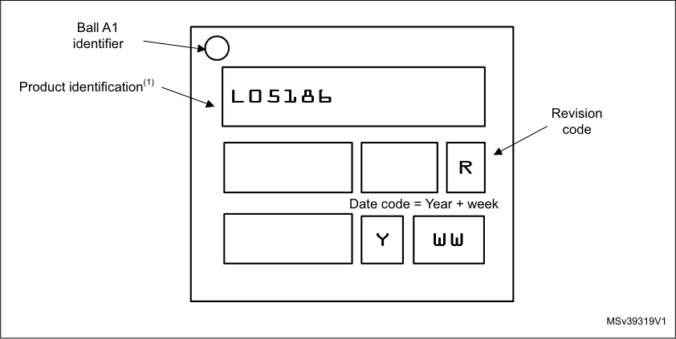

1. Parts marked as “ES”, “E” or accompanied by an Engineering Sample notification letter, are not yet
qualified and therefore not approved for use in production. ST is not responsible for any consequences
resulting from such use. In no event will ST be liable for the customer using any of these engineering
samples in production. ST’s Quality department must be contacted prior to any decision to use these
engineering samples to run a qualification activity.

114/133 DS10184 Rev 10

--- end of page=113 ---

**STM32L051x6 STM32L051x8** **Package information**

##### **7.6 Thin WLCSP36 package information**

**Figure 51. Thin WLCSP36 - 2.61 x 2.88 mm, 0.4 mm pitch wafer level chip scale**
**package outline**

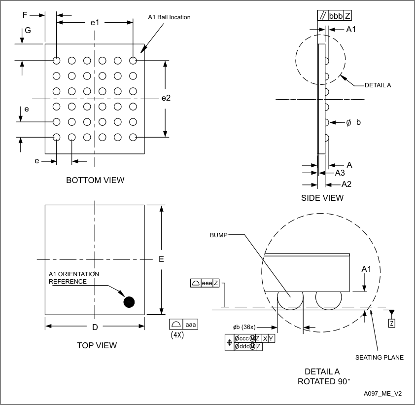

1. Drawing is not to scale.

|Col1|������|
|---|---|
||FFF|
||GGG|

2. b dimensions is measured at the maximum bump diameter parallel to primary datum Z.

3. Primary datum Z and seating plane are defined by the spherical crowns of the bump.

4. Bump position designation per JESD 95-1, SPP-010.

DS10184 Rev 10 115/133

125

--- end of page=114 ---

**Package information** **STM32L051x6 STM32L051x8**

**Table 78. Thin WLCSP36 - 2.61 x 2.88 mm, 0.4 mm pitch wafer level chip scale**
**package mechanical data**

|Symbol|millimeters|Col3|Col4|inches(1)|Col6|Col7|
|---|---|---|---|---|---|---|
|** Symbol**|**Min**|**Typ**|**Max**|**Min**|**Typ**|**Max**|
|A|-|-|0.33|-|-|0.013|
|A1|-|0.10|-|-|0.004|-|
|A2|-|0.20|-|-|0.008|-|
|A3|-|0.025(2)|-|-|0.001|-|
|b|0.16|0.19|0.22|0.006|0.007|0.009|
|D|2.59|2.61|2.63|0.102|0.103|0.104|
|E|2.86|2.88|2.90|0.112|0.113|0.114|
|e|-|0.40|-|-|0.016|-|
|e1|-|2.00|-|-|0.079|-|
|e2|-|2.00|-|-|0.079|-|
|F|-|0.305(3)|-|-|0.012|-|
|G|-|0.440(3)|-|-|0.017|-|
|aaa|-|-|0.10|-|-|0.004|
|bbb|-|-|0.10|-|-|0.004|
|ccc|-|-|0.10|-|-|0.004|
|ddd|-|-|0.05|-|-|0.002|
|eee|-|-|0.05|-|-|0.002|

1. Values in inches are converted from mm and rounded to the 3rd decimal place.

2. Back side coating. Nominal dimension rounded to the 3rd decimal place results from process capability.

3. Calculated dimensions are rounded to 3rd decimal place.

**Figure 52. Thin WLCSP36 - 2.61 x 2.88 mm, 0.4 mm pitch wafer level chip scale**
**package recommended footprint**

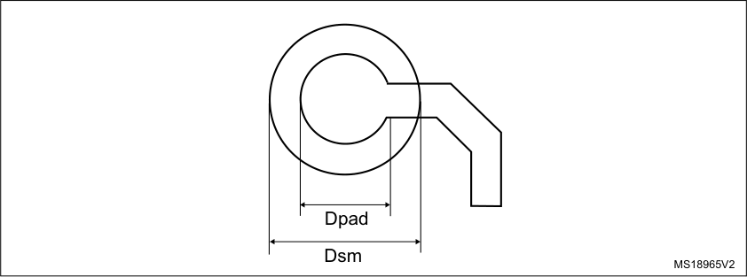

116/133 DS10184 Rev 10

--- end of page=115 ---

**STM32L051x6 STM32L051x8** **Package information**

**Table 79. WLCSP36 recommended PCB design rules**

|Dimension|Recommended values|
|---|---|
|Pitch|0.4 mm|
|Dpad|260 µm max. (circular) 220 µm recommended|
|Dsm|300 µm min. (for 260 µm diameter pad)|
|PCB pad design|Non-solder mask defined via underbump allowed|

##### **7.7 LQFP32 package information**

**Figure 53. LQFP32 - 32-pin, 7 x 7 mm low-profile quad flat package outline**

|!|Col2|Col3|Col4|Col5|Col6|Col7|Col8|Col9|Col10|Col11|Col12|Col13|Col14|Col15|Col16|Col17|Col18|Col19|
|---|---|---|---|---|---|---|---|---|---|---|---|---|---|---|---|---|---|---|
|! |||||||||||||||||||

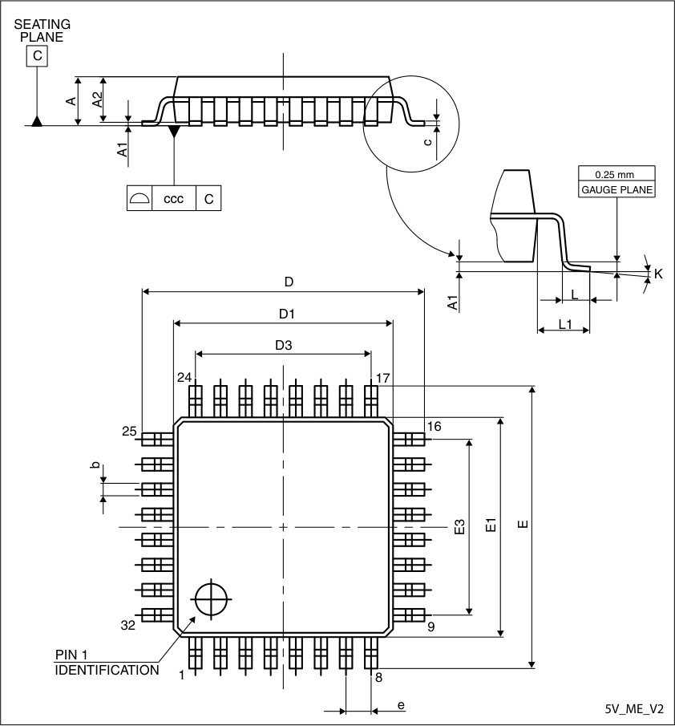

|Col1|Col2|
|---|---|
|,|,|

1. Drawing is not to scale.

|Col1|Col2|Col3|Col4|Col5|
|---|---|---|---|---|
||||||
||||||
||||||
||||||
||||||

DS10184 Rev 10 117/133

125

--- end of page=116 ---

**Package information** **STM32L051x6 STM32L051x8**

**Table 80. LQFP32 - 32-pin, 7 x 7 mm low-profile quad flat package mechanical data**

|Symbol|millimeters|Col3|Col4|inches(1)|Col6|Col7|
|---|---|---|---|---|---|---|
|**Symbol**|**Min**|**Typ**|**Max**|**Min**|**Typ**|**Max**|
|A|-|-|1.600|-|-|0.0630|
|A1|0.050|-|0.150|0.0020|-|0.0059|
|A2|1.350|1.400|1.450|0.0531|0.0551|0.0571|
|b|0.300|0.370|0.450|0.0118|0.0146|0.0177|
|c|0.090|-|0.200|0.0035|-|0.0079|
|D|8.800|9.000|9.200|0.3465|0.3543|0.3622|
|D1|6.800|7.000|7.200|0.2677|0.2756|0.2835|
|D3|-|5.600|-|-|0.2205|-|
|E|8.800|9.000|9.200|0.3465|0.3543|0.3622|
|E1|6.800|7.000|7.200|0.2677|0.2756|0.2835|
|E3|-|5.600|-|-|0.2205|-|
|e|-|0.800|-|-|0.0315|-|
|L|0.450|0.600|0.750|0.0177|0.0236|0.0295|
|L1|-|1.000|-|-|0.0394|-|
|k|0°|3.5°|7°|0°|3.5°|7°|
|ccc|-|-|0.100|-|-|0.0039|

1. Values in inches are converted from mm and rounded to 4 decimal digits.

**Figure 54. LQFP32 - 32-pin, 7 x 7 mm low-profile quad flat recommended footprint**

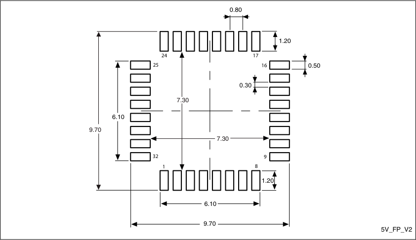

1. Dimensions are expressed in millimeters.

118/133 DS10184 Rev 10

--- end of page=117 ---

**STM32L051x6 STM32L051x8** **Package information**

**Device marking for LQFP32**

The following figure gives an example of topside marking versus pin 1 position identifier
location.

The printed markings may differ depending on the supply chain.

Other optional marking or inset/upset marks, which depend on supply chain operations, are
not indicated below.

**Figure 55. LQFP32 marking example (package top view)**

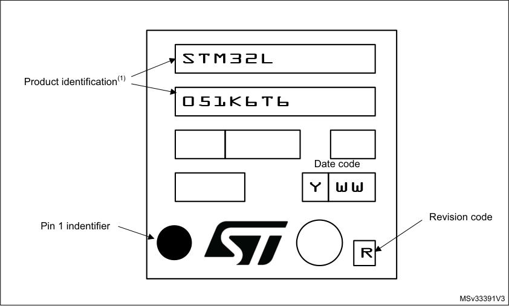

1. Parts marked as “ES”, “E” or accompanied by an Engineering Sample notification letter, are not yet
qualified and therefore not approved for use in production. ST is not responsible for any consequences
resulting from such use. In no event will ST be liable for the customer using any of these engineering
samples in production. ST’s Quality department must be contacted prior to any decision to use these
engineering samples to run a qualification activity.

DS10184 Rev 10 119/133

125

--- end of page=118 ---

**Package information** **STM32L051x6 STM32L051x8**

##### **7.8 UFQFPN32 package information**

**Figure 56. UFQFPN32 - 32-pin, 5x5 mm, 0.5 mm pitch ultra thin fine pitch quad flat**
**package outline**

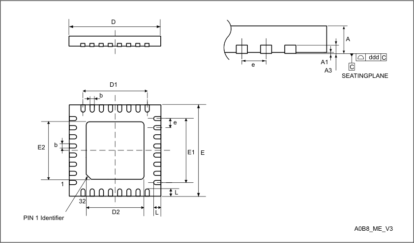

|Col1|Col2|�|Col4|Col5|Col6|Col7|
|---|---|---|---|---|---|---|
|||||||/ H (|
|E|E|||||H|
|E|||||||
|E|||||||
|E|||||||
|E|||||||

1. Drawing is not to scale.

2. There is an exposed die pad on the underside of the UFQFPN package. It is recommended to connect and
solder this backside pad to PCB ground.

120/133 DS10184 Rev 10

--- end of page=119 ---

**STM32L051x6 STM32L051x8** **Package information**

**Table 81. UFQFPN32 - 32-pin, 5x5 mm, 0.5 mm pitch ultra thin fine pitch quad flat**
**package mechanical data**

|Symbol|millimeters|Col3|Col4|inches(1)|Col6|Col7|
|---|---|---|---|---|---|---|
|**Symbol**|**Min**|**Typ**|**Max**|**Min**|**Typ**|**Max**|
|A|0.500|0.550|0.600|0.0197|0.0217|0.0236|
|A1|-|-|0.050|-|-|0.0020|
|A3|-|0.152|-|-|0.0060|-|
|b|0.180|0.230|0.280|0.0071|0.0091|0.0110|
|D|4.900|5.000|5.100|0.1929|0.1969|0.2008|
|D1|3.400|3.500|3.600|0.1339|0.1378|0.1417|
|D2|3.400|3.500|3.600|0.1339|0.1378|0.1417|
|E|4.900|5.000|5.100|0.1929|0.1969|0.2008|
|E1|3.400|3.500|3.600|0.1339|0.1378|0.1417|
|E2|3.400|3.500|3.600|0.1339|0.1378|0.1417|
|e|-|0.500|-|-|0.0197|-|
|L|0.300|0.400|0.500|0.0118|0.0157|0.0197|
|ddd|-|-|0.080|-|-|0.0031|

1. Values in inches are converted from mm and rounded to 4 decimal digits.

**Figure 57. UFQFPN32 - 32-pin, 5x5 mm, 0.5 mm pitch ultra thin fine pitch quad flat**
**recommended footprint**

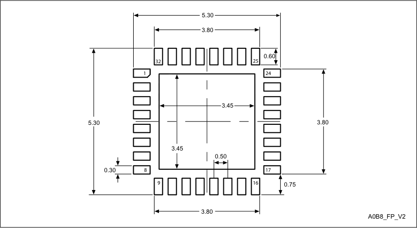

1. Dimensions are expressed in millimeters.

DS10184 Rev 10 121/133

125

--- end of page=120 ---

**Package information** **STM32L051x6 STM32L051x8**

**Device marking for UFQFPN32**

The following figure gives an example of topside marking versus pin 1 position identifier
location.

The printed markings may differ depending on the supply chain.

Other optional marking or inset/upset marks, which depend on supply chain operations, are
not indicated below.

**Figure 58. UFQFPN32 marking example (package top view)**

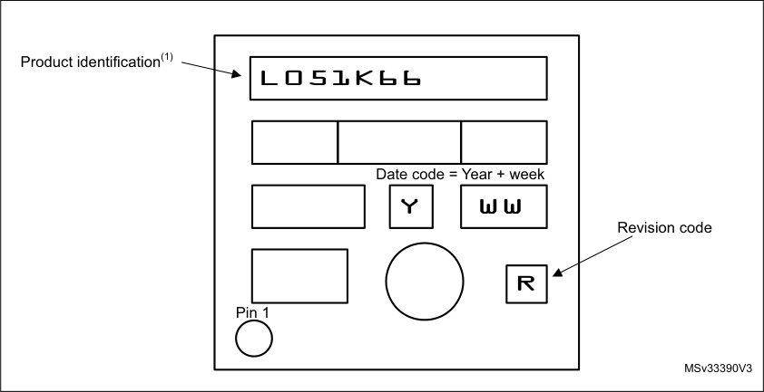

1. Parts marked as “ES”, “E” or accompanied by an Engineering Sample notification letter, are not yet
qualified and therefore not approved for use in production. ST is not responsible for any consequences
resulting from such use. In no event will ST be liable for the customer using any of these engineering
samples in production. ST’s Quality department must be contacted prior to any decision to use these
engineering samples to run a qualification activity.

122/133 DS10184 Rev 10

--- end of page=121 ---

**STM32L051x6 STM32L051x8** **Package information**

##### **7.9 Thermal characteristics**

The maximum chip-junction temperature, T J max, in degrees Celsius, may be calculated
using the following equation:

T J max = T A max + (P D max × Θ JA )

Where:

      - T A max is the maximum ambient temperature in ° C,

      - Θ JA is the package junction-to-ambient thermal resistance, in ° C/W,

      - P D max is the sum of P INT max and P I/O max (P D max = P INT max + P I/O max),

      - P INT max is the product of I DD and V DD, expressed in Watts. This is the maximum chip
internal power.

P I/O max represents the maximum power dissipation on output pins where:

P I/O max = Σ (V OL × I OL ) + Σ ((V DD – V OH ) × I OH ),

taking into account the actual V OL / I OL and V OH / I OH of the I/Os at low and high level in the
application.

|Col1|Table 82. Thermal characteristics|Col3|Col4|
|---|---|---|---|
|**Symbol**|**Parameter**|**Value**|**Unit**|
|ΘJA|**Thermal resistance junction-ambient** TFBGA64 - 5 x 5 mm / 0.5 mm pitch|61|°C/W|
|ΘJA|**Thermal resistance junction-ambient** LQFP64 - 10 x 10 mm / 0.5 mm pitch|45|45|
|ΘJA|**Thermal resistance junction-ambient** Standard WLCSP36 - 0.4 mm pitch|63|63|
|ΘJA|**Thermal resistance junction-ambient** Thin WLCSP36 - 0.4 mm pitch|59|59|
|ΘJA|**Thermal resistance junction-ambient** LQFP48 - 7 x 7 mm / 0.5 mm pitch|55|55|
|ΘJA|**Thermal resistance junction-ambient** LQFP32 - 7 x 7 mm / 0.8 mm pitch|57|57|
|ΘJA|**Thermal resistance junction-ambient** UFQFPN32 - 5 x 5 mm / 0.5 mm pitch|38|38|
|ΘJA|**Thermal resistance junction-ambient** UFQFPN48 - 7 x 7 mm / 0.5 mm pitch|31|31|

DS10184 Rev 10 123/133

125

--- end of page=122 ---

**Package information** **STM32L051x6 STM32L051x8**

**Figure 59. Thermal resistance**

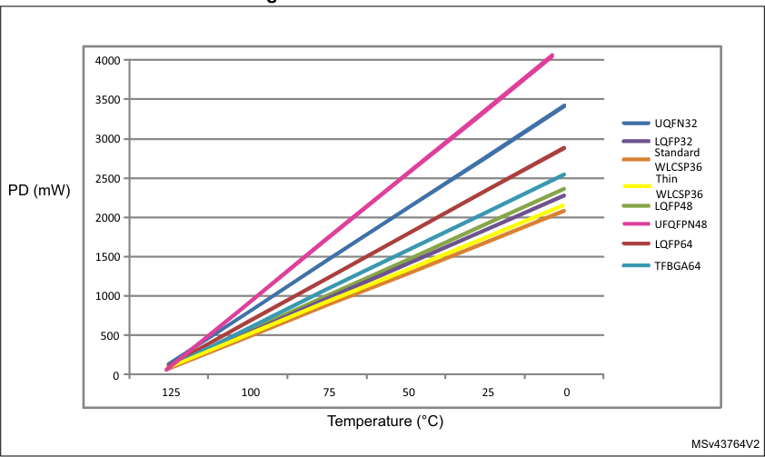

**7.9.1** **Reference document**

JESD51-2 Integrated Circuits Thermal Test Method Environment Conditions - Natural
Convection (Still Air). Available from www.jedec.org.

124/133 DS10184 Rev 10

--- end of page=123 ---

**STM32L051x6 STM32L051x8** **Ordering information**

### **8 Ordering information**

Example: STM32 L 051 R 8 T 6 D  TR

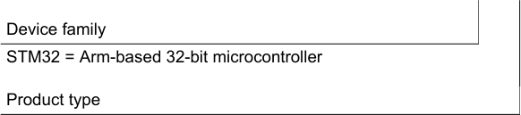

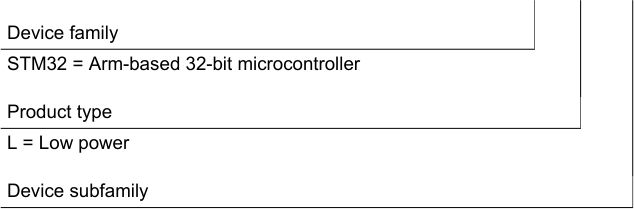

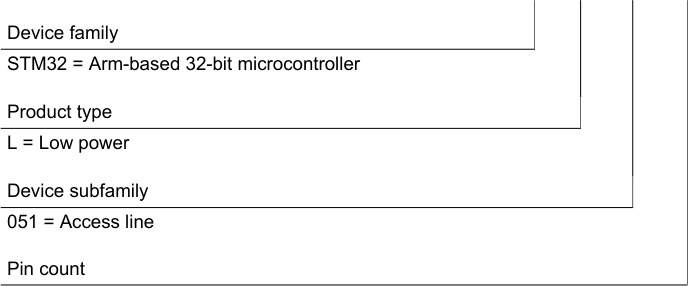

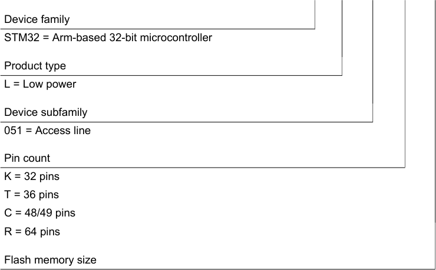

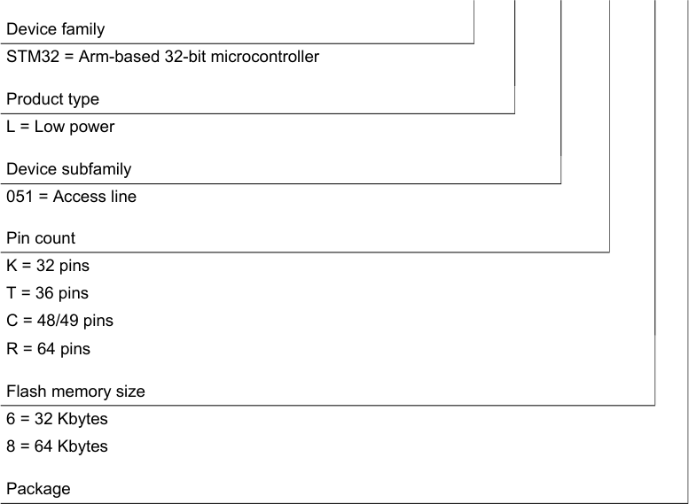

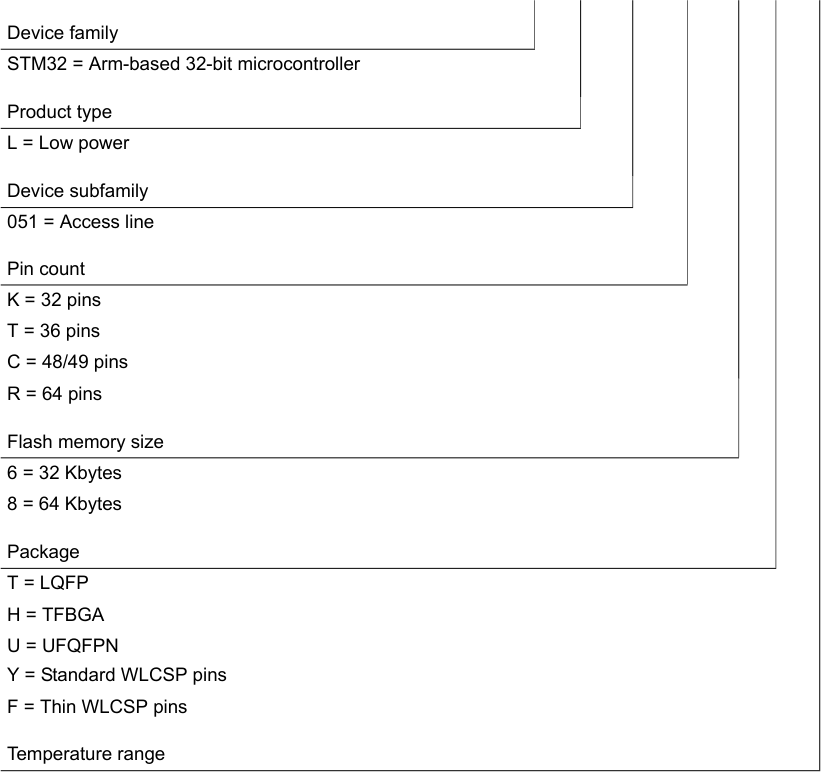

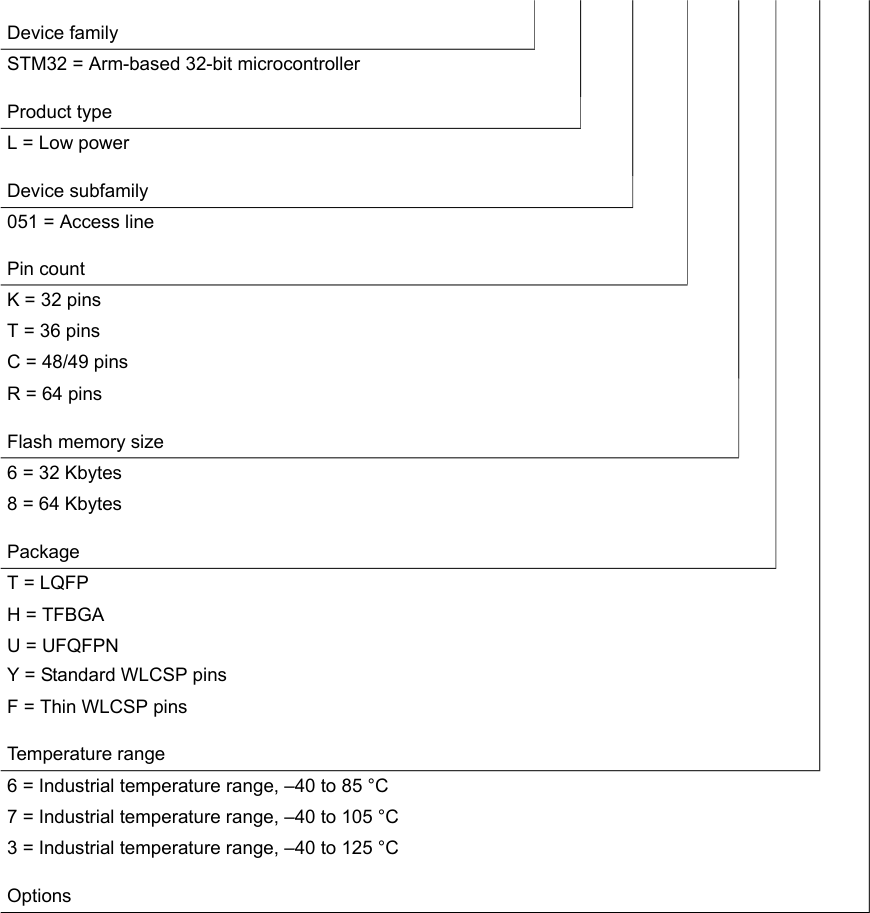

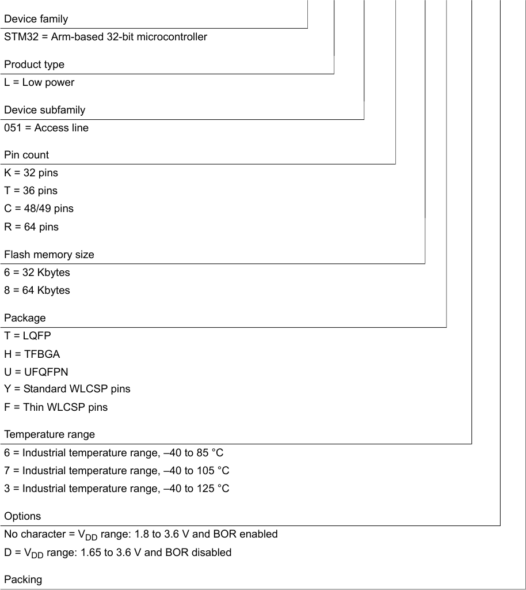

TR = tape and reel

No character = tray or tube

For a list of available options (speed, package, etc.) or for further information on any aspect
of this device, please contact your nearest ST sales office.

DS10184 Rev 10 125/133

125

--- end of page=124 ---

**Revision history** **STM32L051x6 STM32L051x8**

### **9 Revision history**

**Table 83. Document revision history**

|Date|Revision|Changes|
|---|---|---|
|13- Feb- 2014|1|Initial release.|
|29-Apr- 2014|2|Added WLCSP36 package. Updated_Table 2: Ultra-low-power_ _STM32L051x6/x8 device features and peripheral counts_ Updated_Table 5: Functionalities depending on the working mode  (from_ _Run/active down to standby)_. Added_Section 3.2: Interconnect matrix_. Updated_Figure 4: STM32L051x6/8 TFBGA64 ballout_ Replaced TTa I/O structure by TC, updated PA0/4/5, PC5/14, BOOT0 and NRST I/O structure in_Table 15: STM32L051x6/8 pin definitions_. Updated_Table 21: General operating conditions_, _Table 18: Voltage_ _characteristics_ and_Table 19: Current characteristics_. Modified conditions in_Table 24: Embedded internal reference voltage_. Updated_Table 25: Current consumption in Run mode, code with data_ _processing running from Flash_, _Table 27: Current consumption in Run mode,_ _code with data processing running from RAM_, _Table 29: Current consumption_ _in Sleep mode_, _Table 30: Current consumption in Low-power run mode_,  _Table 31: Current consumption in Low-power sleep mode_, _Table 32: Typical_ _and maximum current consumptions in Stop mode_ and_Table 33: Typical and_ _maximum current consumptions in Standby mode_. Added_Figure 14: IDD vs_ _VDD, at TA= 25/55/85/105 °C, Run mode, code running from Flash memory,_ _Range 2, HSE, 1WS_, _Figure 15: IDD vs VDD, at TA= 25/55/85/105 °C, Run_ _mode, code running from Flash memory, Range 2, HSI16, 1WS_, _Figure 16: IDD_ _vs VDD, at TA= 25/55/ 85/105/125 °C, Low-power run mode, code running_ _from RAM, Range 3, MSI (Range 0) at 64 KHz, 0 WS_, _Figure 17: IDD vs VDD,_ _at TA= 25/55/ 85/105/125 °C, Stop mode with RTC enabled and running on_ _LSE Low drive_ and_Figure 18: IDD vs VDD, at TA= 25/55/85/105/125 °C, Stop_ _mode with RTC disabled, all clocks OFF_. Updated_Table 40: HSE oscillator characteristics_ and_Table 41: LSE oscillator_ _characteristics_. Added_Figure 23: HSI16 minimum and maximum value versus_ _temperature_. Updated_Table 51: ESD absolute maximum ratings_, _Table 53: I/O current_ _injection susceptibility_ and_Table 54: I/O static characteristics_, and added _Figure 24: VIH/VIL versus VDD (CMOS I/Os)_ and_Figure 25: VIH/VIL versus_ _VDD (TTL I/Os)_. Updated_Table 55: Output voltage characteristics_, _Table 56:_ _I/O AC characteristics_ and_Figure 26: I/O AC characteristics definition_. Updated_Table 58: ADC characteristics_, _Table 60: ADC accuracy_, and _Figure 29: Typical connection diagram using the ADC_. Updated_Table 62:_ _Temperature sensor characteristics_. Updated_Table 67: SPI characteristics in voltage Range 1_ and_Table 70: I2S_ _characteristics_. Added_Figure 59: Thermal resistance_.|

126/133 DS10184 Rev 10

--- end of page=125 ---

**STM32L051x6 STM32L051x8** **Revision history**

**Table 83. Document revision history** **(continued)**

|Date|Revision|Changes|
|---|---|---|
|25-Jun- 2014|3|Cover page: changed LQFP32 size, updated core speed. updated core speed, added minimum supply voltage for ADC and comparators. ADC now guaranteed down to 1.65 V. Updated list of applications in_Section 1: Introduction_. Changed number of I2S interfaces to one in_Section 2: Description_. Updated_Table 2: Ultra-low-power STM32L051x6/x8 device features and_ _peripheral counts_.  Updated_Table 3: Functionalities depending on the operating power supply_ _range_. Updated RTC/TIM21 in_Table 6: STM32L0xx peripherals interconnect matrix_. Added note related to UFQFPN32 and note related to WLCSP36 in_Table 15:_ _STM32L051x6/8 pin definitions_. Split LQFP32/UFQFPN32 pinout schematics into two distinct figures:_Figure 8_ and_Figure 9_.  Updated VDDA in_Table 21: General operating conditions_. Split Table_Current consumption in Run mode, code with data processing_ _running from Flash_into_Table 25_ and_Table 26_ and content updated. Split Table _Current consumption in Run mode, code with data processing running from_ _RAM_into_Table 27_ and_Table 28_ and content updated. Updated_Table 29:_ _Current consumption in Sleep mode_, _Table 30: Current consumption in Low-_ _power run mode_, _Table 31: Current consumption in Low-power sleep mode_,  _Table 32: Typical and maximum current consumptions in Stop mode_, _Table 33:_ _Typical and maximum current consumptions in Standby mode_, and added _Table 34: Average current consumption during Wakeup_. Updated_Table 35: Peripheral current consumption in Run or Sleep mode_ and added_Table 36: Peripheral current consumption in Stop and Standby mode_.  Updated tLOCK in_Table 45: PLL characteristics_. Removed note 1 below_Figure 21: HSE oscillator circuit diagram_. Updated_Table 47: Flash memory and data EEPROM characteristics_ and _Table 48: Flash memory and data EEPROM endurance and retention_.  Updated_Table 56: I/O AC characteristics_. Updated_Table 58: ADC characteristics_. Updated_Figure 59: Thermal resistance_ and added note 1.|

DS10184 Rev 10 127/133

132

--- end of page=126 ---

**Revision history** **STM32L051x6 STM32L051x8**

**Table 83. Document revision history** **(continued)**

|Date|Revision|Changes|
|---|---|---|
|05- Sep- 2014|4|Extended operating temperature range to 125 °C. Updated minimum ADC operating voltage to 1.65 V. Updated_Section 3.4.1: Power supply schemes_. Replaced USART3 by LPUART1 and updated I/O structure for PC5 and PC15 pins in_Table 15: STM32L051x6/8 pin definitions_. Replaced LPUART by LPUART1 in_Table 16: Alternate function port A_, and _Table 17: Alternate function port B_. Updated temperature range in_Section 2: Description_, _Table 2: Ultra-low-power_ _STM32L051x6/x8 device features and peripheral counts_. Updated PD, TA andTJ to add range 3 in_Table 21: General operating conditions_.  Added range 3 in_Table 48: Flash memory and data EEPROM endurance and_ _retention_, _Table  :_. Update note 1 in_Table 25: Current consumption in Run_ _mode, code with data processing running from Flash_, _Table 27: Current_ _consumption in Run mode, code with data processing running from RAM_,  _Table 29: Current consumption in Sleep mode_, _Table 30: Current consumption_ _in Low-power run mode_, _Table 31: Current consumption in Low-power sleep_ _mode_, _Table 32: Typical and maximum current consumptions in Stop mode_,  _Table 33: Typical and maximum current consumptions in Standby mode_ and _Table 37: Low-power mode wakeup timings_. Updated_Figure 59: Thermal_ _resistance_ and removed note 1. Updated_Table 58: ADC characteristics_ and _Table 60: ADC accuracy_. Updated_Figure 16: IDD vs VDD, at TA= 25/55/ 85/105/125 °C, Low-power run_ _mode, code running from RAM, Range 3, MSI (Range 0) at 64 KHz, 0 WS_,  _Figure 17: IDD vs VDD, at TA= 25/55/ 85/105/125 °C, Stop mode with RTC_ _enabled and running on LSE Low drive_, _Figure 18: IDD vs VDD, at TA=_ _25/55/85/105/125 °C, Stop mode with RTC disabled, all clocks OFF_. Updated_Table 33: Typical and maximum current consumptions in Standby_ _mode_. Updated SYSCFG in_Table 35: Peripheral current consumption in Run or Sleep_ _mode_. Updated_Table 36: Peripheral current consumption in Stop and Standby mode_  and_Table 37: Low-power mode wakeup timings_. Updated ACCHSI16temperature conditions in_Table 42: 16 MHz HSI16_ _oscillator characteristics_. Updated VF(NRST)and VNF(NRST)in_Table 57: NRST pin characteristics_. Updated_Table 58: ADC characteristics_ and_Table 60: ADC accuracy_. Added range 3 in_Table  :_.|

128/133 DS10184 Rev 10

--- end of page=127 ---

**STM32L051x6 STM32L051x8** **Revision history**

**Table 83. Document revision history** **(continued)**

|Date|Revision|Changes|
|---|---|---|
|08- Sep- 2015|5|Updated LQFP64, TFBGA64 and LQFP48 pinout/ballout schematics to highlight pin/ball supplied through VDDIO2. Updated current consumption in Run mode in_Section : Features_. Updated_Figure 7: STM32L051x6/8 WLCSP36 ballout_ and_Figure 4:_ _STM32L051x6/8 TFBGA64 ballout_ to change bump to top view. Renamed BOOT1 into nBOOT1. Changed USARTx_RTS into USARTx_RTS_DE and LPUARTx_RTS into LPUARTx_RTS_DE. Changed I/O structure to FT for PC15 in_Table 15: STM32L051x6/8 pin_ _definitions_ ADC no more available in Low-power run and Low-power Sleep modes in _Table 5: Functionalities depending on the working mode (from Run/active_ _down to standby)_. Updated_Figure 8: STM32L051x6/8 LQFP32 pinout_ (PC14). Suppressed I2C2_SMBA alternate function for PB12 in_Table 15:_ _STM32L051x6/8 pin definitions_ and_Table 17: Alternate function port B_. In whole_Section 6: Electrical characteristics_, modified notes related to characteristics guaranteed by design and by tests during characterization. Added ΣIVDDIO2and updated ΣIIO(PIN)in_Table 19: Current characteristics_.  Updated_Table 18: Voltage characteristics_. Changed temperature condition in_Table 8: Internal voltage reference_ _measured values_ and_Table 23: Embedded internal reference voltage_ _calibration values_.  Updated TCoeff in_Table 24: Embedded internal reference voltage_. Updated_Figure 16: IDD vs VDD, at TA= 25/55/ 85/105/125 °C, Low-power run_ _mode, code running from RAM, Range 3, MSI (Range 0) at 64 KHz, 0 WS_,  _Figure 17: IDD vs VDD, at TA= 25/55/ 85/105/125 °C, Stop mode with RTC_ _enabled and running on LSE Low drive_ and_Figure 18: IDD vs VDD, at TA=_ _25/55/85/105/125 °C, Stop mode with RTC disabled, all clocks OFF_. Added note related to Standby mode in_Table 36: Peripheral current_ _consumption in Stop and Standby mode_.  Updated_Table 37: Low-power mode wakeup timings_ Updated MSI oscillator temperature frequency drift in_Table 44: MSI oscillator_ _characteristics_. Updated_Table 53: I/O current injection susceptibility_, _Table 54: I/O static_ _characteristics_ and_Table 56: I/O AC characteristics_. _Section : I2C interface characteristics_: updated introduction,_Table 66: I2C_ _analog filter characteristics_. updated_Figure 32: SPI timing diagram - slave mode and CPHA = 0_.  Updated_Table 49: EMS characteristics_ and_Table 50: EMI characteristics_. Added tUP_LDO in _Table 58: ADC characteristics_. Added_Section : Device marking for LQFP64_ and_Section : Device marking for_ _standard WLCSP36_. Updated_Section : Device marking for TFBGA64_,  _Section : Device marking for LQFP48_, _Section : Device marking for LQFP32_  and_Section : Device marking for UFQFPN32_. Updated note below marking schematics in_Section 7: Package information_.  Added_Figure 46: WLCSP36 - 2.596 x 2.868 mm, 0.4 mm pitch wafer level chip_ _scale package outline_.|

DS10184 Rev 10 129/133

132

--- end of page=128 ---

**Revision history** **STM32L051x6 STM32L051x8**

**Table 83. Document revision history** **(continued)**

|Date|Revision|Changes|
|---|---|---|
|17- Mar- 2016|6|Updated number of SPIs on cover page and in_Table 2: Ultra-low-power_ _STM32L051x6/x8 device features and peripheral counts_. Changed minimum comparator supply voltage to 1.65 V on cover page. Added number of fast and standard channels in_Section 3.11: Analog-to-digital_ _converter (ADC)_. Updated_Section 3.16.2: Universal synchronous/asynchronous receiver_ _transmitter (USART)_ and_Section 3.16.4: Serial peripheral interface (SPI)/Inter-_ _integrated sound (I2S)_ to mention the fact that USARTs with synchronous mode feature can be used as SPI master interfaces. Added baudrate allowing to wake up the MCU from Stop mode in _Section 3.16.2: Universal synchronous/asynchronous receiver transmitter_ _(USART)_ and_Section 3.16.3: Low-power universal asynchronous receiver_ _transmitter (LPUART)_. In_Section 6: Electrical characteristics_, updated notes related to values guaranteed by characterization. Changed VDDA minimum value to 1.65 V in_Table 21: General operating_ _conditions_. _Section 6.3.15: 12-bit ADC characteristics_: –_ Table 58: ADC characteristics_:  Distinction made between VDDA for fast and standard channels; added note _1._ Added note 4 related to RADC. Updated fTRIG. and VAIN maximum value. Updated tS and tCONV. Added VREF+. – Updated equation 1 description. – Updated_Table 59: RAIN max for fADC = 16 MHz_ for fADC = 16 MHz and distinction made between fast and standard channels. Added_Table 69: USART/LPUART characteristics_. Updated_Figure 45: LQFP48 marking example (package top view)_.|

130/133 DS10184 Rev 10

--- end of page=129 ---

**STM32L051x6 STM32L051x8** **Revision history**

**Table 83. Document revision history** **(continued)**

|Date|Revision|Changes|
|---|---|---|
|07- Mar- 2017|7|Added thin WLCSP36 package Updated number of I2S interfaces in_Table 2: Ultra-low-power_ _STM32L051x6/x8 device features and peripheral counts_. Removed note 2 related to PA4 in_Table 15: STM32L051x6/8 pin definitions_ Added mission profile compliance with JEDEC JESD47 in_Section 6.2:_ _Absolute maximum ratings_. Removed CRS from_Table 35: Peripheral current consumption in Run or Sleep_ _mode_. Added note 2. related to the position of the external capacitor below_Figure 27:_ _Recommended NRST pin protection_. Updated RL in_Table 58: ADC characteristics_. Updated tAF maximum value for range 1 in_Table 66: I2C analog filter_ _characteristics_. Updated tWUUSARTdescription in_Table 69: USART/LPUART characteristics_. NSS timing waveforms updated in_Figure 32: SPI timing diagram - slave mode_ _and CPHA = 0_ and_Figure 33: SPI timing diagram - slave mode and CPHA =_ _1(1)_. Added reference to optional marking or inset/upset marks in all package device marking sections. Previous WLCSP36 package renamed “Standard” WLCSP36; added Note_2._  below_Figure 48: Standard WLCSP36 - 2.61 x 2.88 mm, 0.4 mm pitch wafer_ _level chip scale package outline_ and updated_Table 76: Standard WLCSP36 -_ _2.61 x 2.88 mm, 0.4 mm pitch wafer level chip scale mechanical data_.|
|11- Sep- 2017|8|Memories and I/Os moved after Core in_Features_. Removed column "I/O operation" from_Table 3: Functionalities depending on_ _the operating power supply range_ and added note related to GPIO speed. In_Section 5: Memory mapping_, replaced memory mapping schematic by reference to the reference manual. Update note related to PA11/12 below_Figure 3: STM32L051x6/8 LQFP64_ _pinout_, _Figure 4: STM32L051x6/8 TFBGA64 ballout_ and_Figure 5:_ _STM32L051x6/8 LQFP48 pinout_. Updated minimum and maximum values of I/O weak pull-up equivalent resistor (RPU) and weak pull-down equivalent resistor (RPD) in_Table 54: I/O static_ _characteristics_. Updated minimum and maximum values of NRST weak pull-up equivalent resistor (RPU) in_Table 57: NRST pin characteristics_.  Removed_Table 90: USART/LPUART characteristics_. Updated_Figure 40: TFBGA64 – 64-ball, 5 x 5 mm, 0.5 mm pitch thin profile fine_ _pitch ball grid array package outline_. Updated note below marking schematics.|

DS10184 Rev 10 131/133

132

--- end of page=130 ---

**Revision history** **STM32L051x6 STM32L051x8**

**Table 83. Document revision history** **(continued)**

|Date|Revision|Changes|
|---|---|---|
|09- May- 2018|9|Updated Arm logo and added Arm word mark notice in_Section 1: Introduction_. Removed Cortex logo. Updated_Table 5: Functionalities depending on the working mode  (from_ _Run/active down to standby)_ to change I2C functionality to disabled in Low- power Run and Low-power Sleep modes. Swapped E5 and E6 signals in_Figure 4: STM32L051x6/8 TFBGA64 ballout_  and_Table 15: STM32L051x6/8 pin definitions_. Changed PC14-OSC_IN into PC14-OSC32_IN in_Figure 9: STM32L051x6/8_ _UFQFPN32 pinout_.  Changed USARTx_RTS, USARTx_RTS_DE into USARTx_RTS/USARTx_DE, and LPUART1_RTS, LPUART1_RTS_DE into LPUART1_RTS/LPUART1_DE in_Table 15: STM32L051x6/8 pin definitions_ and in all alternate function tables. Updated tAF maximum value for range 1 in_Table 66: I2C analog filter_ _characteristics_. Updated_Figure 56: UFQFPN32 - 32-pin, 5x5 mm, 0.5 mm pitch ultra thin fine_ _pitch quad flat package outline_ and added note related to exposed pad; updated_Table 81: UFQFPN32 - 32-pin, 5x5 mm, 0.5 mm pitch ultra thin fine_ _pitch quad flat package mechanical data_. Updated_Figure 40: TFBGA64 – 64-ball, 5 x 5 mm, 0.5 mm pitch thin profile fine_ _pitch ball grid array package outline_, _Figure 41: TFBGA64 – 64-ball, 5 x 5 mm,_ _0.5 mm pitch, thin profile fine pitch ball,grid array recommended footprint_ and _Figure 73: TFBGA64 recommended PCB design rules (0.5 mm pitch BGA)_.|
|18-Oct- 2019|10|Added UFQFPN48 package. In_Table 15: STM32L051x6/8 pin definitions_, replaced VDDIO2 by VDD and changed VDD into VDDIO2 for LQFP64 pin48, TFBGA64 ball E5, LQFP48 pin 36, and UFQFPN48 pin 36. Removed R10Kand R400Kfrom_Table 63: Comparator 1 characteristics_. Updated paragraph introducing all package marking schematics to add the new sentence “The printed markings may differ depending on the supply chain.”|

132/133 DS10184 Rev 10

--- end of page=131 ---

**STM32L051x6 STM32L051x8**

**IMPORTANT NOTICE – PLEASE READ CAREFULLY**

STMicroelectronics NV and its subsidiaries (“ST”) reserve the right to make changes, corrections, enhancements, modifications, and
improvements to ST products and/or to this document at any time without notice. Purchasers should obtain the latest relevant information on
ST products before placing orders. ST products are sold pursuant to ST’s terms and conditions of sale in place at the time of order
acknowledgement.

Purchasers are solely responsible for the choice, selection, and use of ST products and ST assumes no liability for application assistance or
the design of Purchasers’ products.

No license, express or implied, to any intellectual property right is granted by ST herein.

Resale of ST products with provisions different from the information set forth herein shall void any warranty granted by ST for such product.

ST and the ST logo are trademarks of ST. For additional information about ST trademarks, please refer to _www.st.com/trademarks_ . All other
product or service names are the property of their respective owners.

Information in this document supersedes and replaces information previously supplied in any prior versions of this document.

© 2019 STMicroelectronics – All rights reserved

DS10184 Rev 10 133/133

133

--- end of page=132 ---

