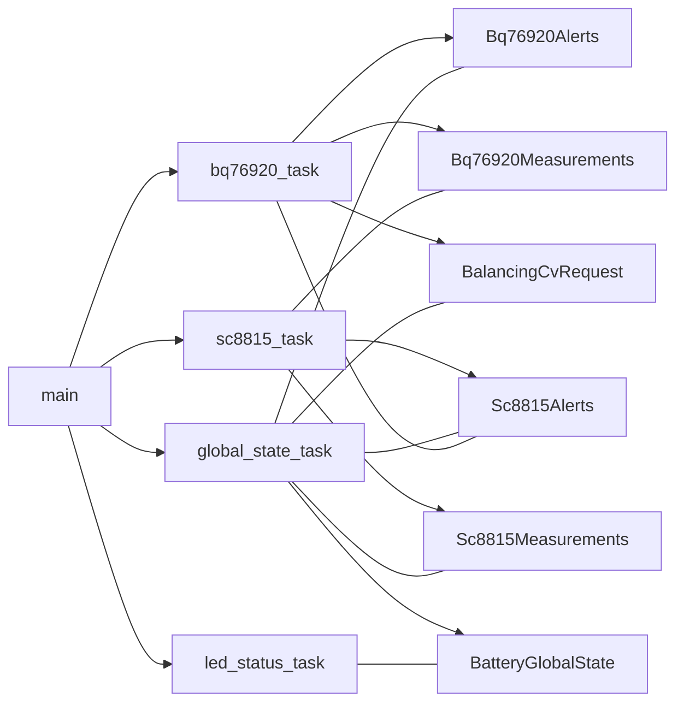
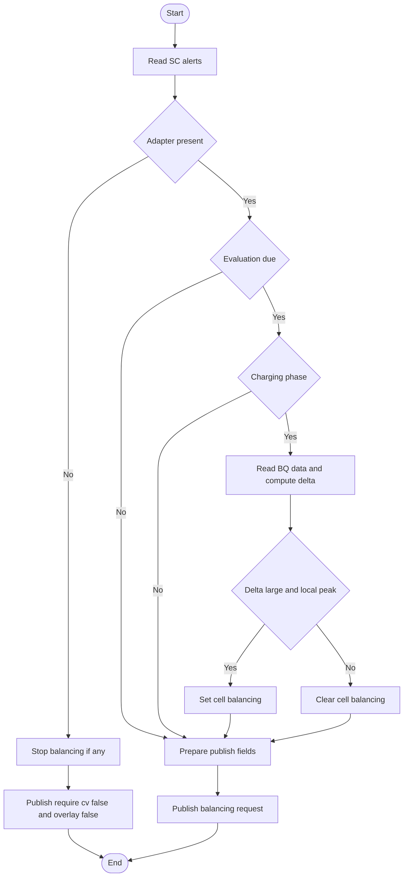
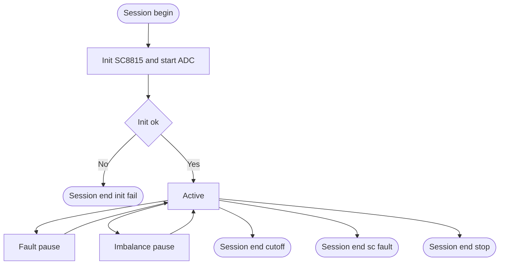
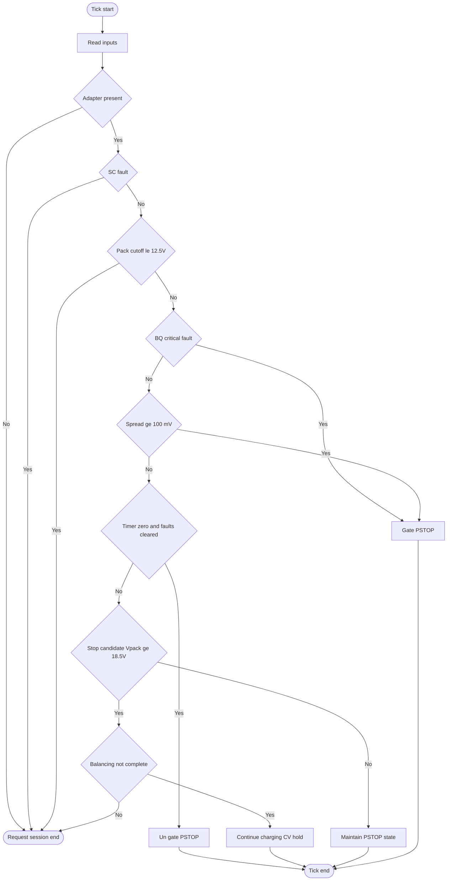
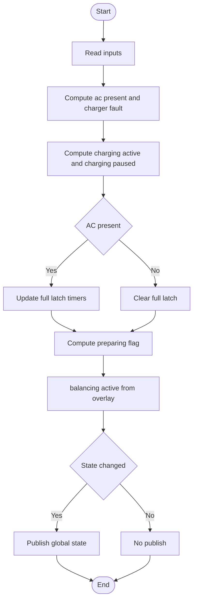
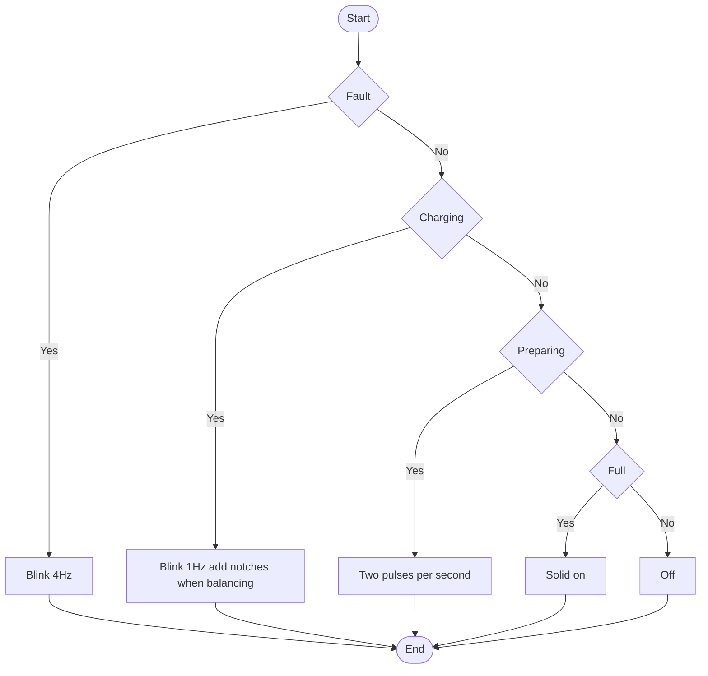

# Smart Battery Software Design (LED/State Machine/Low Power)

This document is the single source of truth for the smart‑battery firmware design, consolidating charger control inversion (CE/PSTOP), 4‑LED signaling, dropout handling, sampling cadence, event‑driven global state machine, and the low‑power Sleep mode. It supersedes earlier LED drafts and scattered notes.

## 1) Pin Map (from `smart-battery.ioc`)

- Charger control
  - `PA10` = `CE_CTL` (GPIO Output)
  - `PA9`  = `PSTOP_CTL` (GPIO Output)
- Alert/INT lines
  - `PB1`  = `ALERT` (EXTI1)
  - `PB2`  = `INNER_INT` (EXTI2)
- I²C
  - I2C2 (INNER): `PB10=SCL`, `PB11=SDA` (BQ76920 @0x08, SC8815 @0x11)
  - I2C1 (OUTER, slave): `PB6=SCL`, `PB7=SDA`, `PB5=SMBA`
- LED (4 pcs, 1→4 = Red, Yellow, Green, Blue) — all as plain GPIO outputs (no timers)
  - LED1 (Red)   → `PA5`  (`LEDK1`, GPIO Out)  ← change `.ioc` from `S_TIM2_CH1` to `GPIO Output`
  - LED2 (Yellow)→ `PA6`  (`LEDK2`, GPIO Out)
  - LED3 (Green) → `PA7`  (`LEDK3`, GPIO Out)
  - LED4 (Blue)  → `PB0`  (`LEDK4`, GPIO Out)

## 2) SC8815 CE/PSTOP Control Inversion

- Hardware: MCU drives SC8815 `CE` and `PSTOP` through N‑MOSFET isolation; the MCU pin level is inverted relative to the IC’s active level.
- Unified net names and semantics (used consistently in code and docs):
  - `CE_CTL`: High → chip `/CE` Low (enable charger); Low → chip `/CE` High (disable charger).
  - `PSTOP_CTL`: High → chip `PSTOP` Low (power stage allowed); Low → chip `PSTOP` High (power stage stopped).
- SC8815 pin-level semantics (non-inverted, for absolute clarity):
  - `PSTOP = High` → power stage stopped.
  - `PSTOP = Low`  → power stage allowed.
- Truth table (MCU → chip):

  | MCU pin       | Semantic            | Chip pin meaning |
  |---------------|---------------------|------------------|
  | CE_CTL = High | Charger enabled     | /CE = Low        |
  | CE_CTL = Low  | Charger disabled    | /CE = High       |
  | PSTOP_CTL = High | Power allowed    | PSTOP = Low      |
  | PSTOP_CTL = Low  | Power stopped    | PSTOP = High     |

- Safety rule: any stop/pause/fault/dropout path must end with `PSTOP_CTL = Low` (chip `PSTOP = High`).

## 3) 4‑LED Signaling Rules (3 s base cycle)

- Cycle: Unless stated otherwise, each LED uses a 3‑second indication cycle.
- Base/Background: When there are no pulses, the LED shows its base on/off. Pulses at the start of each cycle convey details.
- Pulse definition: width 120 ms, gap 120 ms; pulses are “inverted flash” relative to the base.
- Severity: Higher severity → more pulses (except explicitly defined 1‑pulse cases).
- Per‑LED priority (within a single LED, high→low):
  1) 1 Hz dropout blink (500 ms on / 500 ms off) — overrides everything on that LED.
  2) Fault 50% blink + pulse code.
  3) Base on/off + pulse code.
  4) Asynchronous one‑shot pulse (only Green for I2C1 traffic).

Notes: LED tasks do not synchronize phases across colors; each keeps its own 3 s epoch.

### 3.1 Green (Communication + Low Power)

- Base: normal run = ON; Sleep = OFF.
- Async pulse: whenever I2C1 (slave) is accessed, emit 1 immediate pulse (does not wait for the 3 s boundary).
- During Sleep: keep the same 3 s rhythm policy (no slow period change), i.e., still eligible for base/pulse behavior; however base is OFF in Sleep per spec.

### 3.2 Yellow (SC8815 Charging/Fault)

- Dropout: if SC8815达到连续 I²C 失败阈值，则进入 1 Hz 掉线闪烁（覆盖黄灯上其他显示），不受“是否使用过”之类前置条件限制。
- Base: not charging = OFF; charging = ON.
- Fault blink: strictly 50% over the 3‑second cycle: 1.5 s ON + 1.5 s OFF.
- Pulse codes (applied at cycle start):
  - 1 pulse: Charging conditions met but AC absent (still “not charging”, thus 1 pulse every 3 s).
  - 2 pulses: VBUS OVP / adapter abnormal.
  - 3 pulses: BAT OVP / end‑of‑charge abnormal.
  - 4 pulses: OTP / NTC abnormal temperature.
  - 5 pulses: IBUS/charge over‑current/short‑related protection.

### 3.3 Red (BQ76920 FET/Protection/Balancing)

- Dropout: if BQ76920 hits the consecutive I²C failure threshold it enters a 1 Hz dropout blink (overrides others on Red). This includes communication hangs which are converted to failures by the timeout policy below.
- Base: both CHG & DSG FETs ON → OFF; any side disabled → ON.
- Pulse codes (at cycle start):
  - 1 pulse: Balancing active.
  - 2 pulses: UV/OV protection latched (FETs disabled).
  - 3 pulses: SCD (short‑circuit discharge).
  - 4 pulses: OCD (over‑current discharge).
  - 5 pulses: AFE internal temp/reference abnormal or other major unclassified fault.
  - 6 pulses: Battery temperature out of band (temp pause by BQ76920).

### 3.5 Dropout Semantics, Timeouts and Online Flags

- Both BQ and SC paths maintain “online” flags that reflect recent successful communications. LED dropout blinking is driven by these flags.
- To avoid silent hangs (e.g., I²C awaits that never resolve), the firmware wraps critical reads with a timeout and classifies timeouts as failures:
  - BQ measurement read: 2 s timeout. On success, online=true and a heartbeat timestamp is updated; on error/timeout, `fail_streak += 1`.
  - SC device status read: 2 s timeout. On success, online=true and a heartbeat timestamp is updated; on error/timeout, `fail_streak += 1`.
- 当 `fail_streak >= 3` 时，将对应 online 标志设为 false，从而强制进入掉线闪烁（红灯=BQ，黄灯=SC）。SC 掉线闪烁不再受任何“使用过”之类门槛限制。
- Successful subsequent reads immediately reset `fail_streak` and restore the online flag.

### 3.4 Blue (Global State)

- Constraint: Blue must never be pulse‑less; if no pulse applies, Blue shows OFF.
- Sleep: keep the standard 3 s cycle (no slow cycle during development phase).
- Suggested codebook (can be aligned to HW naming later):
  - 1 pulse: Idle / Standby.
  - 2 pulses: Charging Active.
  - 3 pulses: Charging Paused (session kept, power stage stopped).
  - 4 pulses: Balancing.
  - 5 pulses: Charge Done.
  - 6 pulses: Global Fault.
  - 7 pulses: Safe Shutdown / Shipping.

## 4) Arbitration & Timing Composition

- Per‑LED priority: Dropout 1 Hz > Fault 50% (1.5 s/1.5 s) + pulses > Base + pulses.
  - Green’s I2C pulse is asynchronous and can briefly override for ~30–240 ms without changing the 3 s phase.
  - Driver layer composes modes; semantic layer only decides “base + pulses / 50% blink / 1 Hz blink”.

## 5) Sampling Cadence, Balancing, Pause‑Charge

- Outside balancing: do not sample cell metrics every second anymore.
- During charging: sample cell voltages every 30 s to decide entering balancing and whether to pause charging.
- During balancing: allow ~1 s cadence to control balancing switches and termination.
- Pause‑charge semantics: keep the charging session/regs, but set `PSTOP_CTL = High` to stop the power stage. Resume based on state‑machine policy (temp, delta‑V, EOC, timers, etc.).

## 6) Dropouts & Safety

- Accept dropouts: SC8815/BQ76920 I²C failures and absent I2C1 host.
- Threshold: 3 consecutive I²C transaction failures for a device → dropout.
- Mandatory action: if BQ76920 hits the threshold, ensure `PSTOP_CTL = High` (power stage stopped).
- Indication: corresponding LED enters 1 Hz blink; state machine falls back to a conservative branch.

## 7) Event‑Driven Global State Machine

- Event sources
  - BQ76920: OV/UV/OCD/SCD/temperature protection interrupts, balancing status, FET states.
  - SC8815: EOC, VBUS/BAT OVP, OTP, over‑current/short, adapter plug/unplug.
  - I2C1 (slave): host accesses (wake + Green pulse only; not a safety event).
- States (mapped to Blue codes): Idle → Charging Active → Charging Paused → Balancing → Charge Done → Idle. Can enter Global Fault or Safe Shutdown anytime. Sleep overlays as an energy mode.
- Transitions (examples)
  - Adapter present + conditions OK → Charging Active.
  - Large cell delta‑V → Balancing; pause‑charge if needed (stop power stage).
  - SC8815 EOC or BQ OVP → end/pause charging and update state.
  - BQ/SC dropout → stop power stage and enter dropout indication + conservative branch.

## 8) Low‑Power Mode (Sleep)

- Implement Sleep (not STOP) for now. Keep I2C1 Sleep‑clock gate (`APB1SMENR.I2C1SMEN=1`).
- Wake on I2C1 events/errors; process transaction; fall back to Sleep after idle timeout.
- LED policy in Sleep: Green base OFF, async pulse on traffic; Yellow/Red/Blue keep the standard 3‑second cycle.

## 9) Implementation Notes

- Provide a semantic API for charger control (e.g., `enable_power_stage(bool)`, `pause_power_stage()`) to hide inverted GPIO levels.
- Separate semantic vs. driver layers for LED logic; add a common helper to arbitrate dropout/fault/base across all LEDs.
- Align Yellow/Red fault codebooks with SC8815/BQ76920 register names and priorities when integrating the drivers.
- LEDs are plain GPIO outputs; implement all flashes/pulses in software (no TIM/PWM dependency). Ensure `PA5` (`LEDK1`) is configured as GPIO Output in the `.ioc`.

## 10) Document Status

This document replaces prior LED drafts and the earlier bring‑up write‑up as the authoritative design. Legacy files remain only as historical context and should link here for current behavior.

> 中文要点（外设通信/I2C 对外协议）
>
> - 对外通信总线：I2C1 从机，地址 0x35（7‑bit），引脚 PB6=SCL、PB7=SDA（见 smart-battery.ioc），SMBA 暂不实现。
> - 速率：兼容 100 kHz 与 400 kHz；允许短暂 SCL 拉伸（≤150 µs）。
> - CRC/PEC：遵循 TI/SMBus 习惯。
>   - 写操作：主机每写 1 个数据字节，紧跟 1 个 CRC8（poly 0x07，初值 0x00），校验 [ADDR_W, REG, DATA]，CRC 错误在 CRC 字节处 NACK，整帧丢弃。
>   - 读操作：设备按 [DATA, CRC] 交错返回；首字节 CRC 计算 [ADDR_R, DATA0]，后续仅对各自 DATAi 计算。
> - 寄存器：1 字节地址，自增；多字节 LE；提供电压/电流/温度/故障与充电软控制（详见下文 Register Map）。
> - 选择 I2C1 的原因：支持 STOP 唤醒，满足低功耗场景对外主机唤醒的需求。

## Scope

This document captures the software architecture that now boots the STM32L051C8
smart-battery firmware into a safe operating state. The firmware sequence
initializes the TI **BQ76920** protection IC (CRC variant @ 0x08) ahead of the
**SC8815** charger so that the pack’s safety envelope is validated before any
power stage is enabled. It also describes the shared I2C bus topology, gating
controls, and telemetry loops that underpin bring-up.

## Hardware Interfaces

- **I2C2 – INNER bus (PB10/PB11)**: Operated at 100 kHz with DMA1_CH4/CH5 and
  serviced through the shared I2C2 interrupts. A global `StaticCell` stores the
  bus so multiple async drivers can borrow it via `embassy-embedded-hal`
  shared-bus mutexes. Both the BQ76920 (fixed `0x08`) and SC8815 (`0x11`) ride
  this bus.
- **I2C1 – OUTER bus (external host interface)**: Configured as 7‑bit I²C slave
  to allow a system host (MCU/SoC) to query pack telemetry and command limited
  charging control. I²C1 is used because it supports wake‑from‑STOP on address
  match (WUPEN), enabling ultra‑low‑power idle while remaining responsive.
  Pins per `.ioc`: PB6 = I2C1_SCL, PB7 = I2C1_SDA, PB5 = I2C1_SMBA (alert).
  The slave address is `0x35` (7‑bit). Supported bus rates: 100 kHz and 400 kHz.
  Clock stretching is permitted (≤ 150 µs) while copying a fresh telemetry
  snapshot into the I²C TX buffer. General‑call is disabled.
- **SMBus Alert (PB5) & Alert GPIOs**: Reserved for future SMBus/alert handling;
  interrupt lines `PB1` (BQ alert) and `PB2` (inner bus INT) are wired for EXTI
  wakeups.
- **CE (PA10)**: Active-low charger enable. Held high during safety bring-up
  and whenever no SC8815 activity is required. The firmware asserts it low only
  when the charger must be configured, telemetry must be sampled from the
  SC8815, or charging is actively commanded.
- **PSTOP (PA9)**: Active-high gate for the SC8815 power stage. Remains high
  until charger programming succeeds and stays an emergency kill path for any
  detected charger fault.
- **EXIT_SHIPMODE (PA1)**: Push-pull GPIO used to wake the BQ76920 from ship
  mode with a high pulse before configuration retries.

## Initialization Sequence

1. Configure MCU clocks (LSE on) and instantiate CE/PSTOP outputs high to keep
   the charger path disabled. Prepare the `PA1` wake GPIO so the BQ76920 can be
   nudged out of ship mode if it fails to respond on the first attempt.
2. Bring up I2C2 with DMA and register it inside a `StaticCell<Mutex<…>>`. This
   shared handle feeds lightweight `I2cDevice` wrappers for each peripheral at
   the moment they need bus access.
3. Initialize the global pub/sub channels; capture the BQ-specific publishers so
   alerts and measurement frames can be streamed once the protection loop runs.
4. Enter a blocking loop that repeatedly attempts to configure the BQ76920 via
   `Bq769x0` with CRC enabled:
   - First boot attempt performs an immediate configuration using per-cell
     thresholds (OV 3.65 V, UV 2.50 V), 15 A short-circuit, 10 A discharge
     overcurrent, and `rsense = 3 mΩ` to match the hardware shunt.
   - If this initial communication fails, pulse `EXIT_SHIPMODE` high, hold the
     line asserted for a full 500 ms to exit ship mode, then drop it low before
     retrying configuration.
   - Subsequent failures fall back to a 1 s retry cadence without repeating the
     ship-mode pulse. MOSFETs and the charger stay disabled until configuration
     succeeds.
   - On success, spawn the asynchronous `bq76920_task`, which keeps verifying the
     pack, manages FET states, and publishes telemetry.

## 11) Temperature Sensing (SC8815 ADIN) & Protection Policy

Goal: provide a robust temperature‑based power‑stage protection using the SC8815
ADC input `ADIN` and the on‑board NTC network shown in the schematic (R23=43 kΩ
to `VCC_SC`, NTC=10 kΩ 3380 K to GND, C32=100 nF to GND at the divider mid‑node
→ `ADIN`).

Design facts and constraints (updated)

- SC8815 exposes a 10‑bit ADC channel on `ADIN` with 2 mV/LSB and a full‑scale
  of 2.048 V. The result is split as MSB 8‑bit and LSB 2‑bit registers. There is
  no readable internal die‑temperature register; only an OTP (over‑temperature
  protection) fault bit exists in STATUS. We therefore derive temperature solely
  from the external NTC divider.
- Board mapping used by this firmware:
  - Run mode (power stage enabled): use 5.0 V codes for ADIN policy (board-level VCC_SC≈5 V while power stage runs).
  - Stop mode (power stage stopped): evaluate with 3.0 V codes, but only after a
    fixed 10‑second settle window to allow VCC_SC to drop.
- Required behavior (aligned with current test plan)
  - Over‑temperature stop at 50 °C (Yellow 4‑pulse on detection).
  - Cool‑down resume at 40 °C (hot path only).
  - Low‑temperature inhibit below 0 °C; after the 10‑second settle window,
    resume once temperature is ≥ 0 °C (no extra time hysteresis, the 10 s window
    is the only timing hysteresis).
  - While power stage is running, target ≈1 °C effective accuracy. While
    stopped, accuracy is not critical; we only need a reliable resume threshold.

NTC model and conversion

- Parts: R23 = 43 kΩ (±?), NTC = 10 kΩ @ 25 °C, β = 3380 K
  (`FNTC0402X103F3380FB`).
- Divider equation: `V_adin = Vcc * R_ntc / (R23 + R_ntc)`.
- Recover `R_ntc` from a measurement: `R_ntc = R23 * V_adin / (Vcc - V_adin)`.
- Convert to temperature (Kelvin) with the β model: `T = 1 / (1/T25 + (1/β)
  * ln(R_ntc/R25))`; `T25 = 298.15 K`, `R25 = 10 kΩ`. Celsius = `T − 273.15`.
- ADC code to voltage: with the SC8815 formula, `V_adin ≈ (code + 1) * 2 mV`
  where `code ∈ [0..1023]` is formed by `(MSB<<2)|LSB`.

Reference thresholds (β=3380 K, R23=43 kΩ, NTC=10 kΩ)

- Run 5.0 V: 50 °C → code ≈ 220.
- Stop 3.0 V: 40 °C → code ≈ 178；0 °C → code ≈ 593。

Operational policy

- Sampling
  - Enable SC8815 ADC (`AD_START=1`) whenever charger telemetry is needed.
  - While running, compare against 5.0 V codes (no full temperature solve).
  - After stopping, wait a 10‑second settle window, then compare against 3.0 V
    codes for resume/cold policy.
- Decisions (hysteresis and low‑temp behavior)
  - Over‑temp stop (Run/5V): `ADIN_code ≤ 220`（默认去抖 2 次，±2 码裕量）→ 立即停功率级并打 Yellow 4 脉冲。
- Settle window: 停机后先等待 10 s，让 VCC_SC 下沉到 3 V；窗口内不执行 3 V 判定。
  - 窗口触发条件：仅在运行→停机边沿或运行态 HOT 触发后开始计时；上电不触发窗口。窗口不叠加、不续期。
  - Cool‑down resume (Stop/3V)：窗口结束后，`ADIN_code ≥ 178`（去抖 2 次）才恢复。
  - Low‑temp inhibit (Stop/3V)：`ADIN_code ≥ 593` 进入低温保护；窗口结束后，一旦 `ADIN_code < 593` 立即恢复（无额外时间迟滞）。
- Margins & filtering
  - Apply a ±5‑code margin to the fixed thresholds to absorb ADC quantization,
    resistor/β tolerance and noise (C32=100 nF provides analog filtering).
  - Debounce by requiring any threshold condition for ≥100 ms or 3 consecutive
    samples, whichever is longer.

Driver/API hooks (to be implemented in code after approval)

- `sc8815::SC8815::set_adc_conversion(true)` to start conversions.
- `read_adin_raw()` → `(msb, lsb)`; helper `adin_code_10bit(msb, lsb)`.
- `temp_c_from_adin(code, vcc_mv)` implementing the divider inversion and β
  solve for run‑mode (vcc=3000 mV).
- `should_stop_from_hot(code_3v)` and `should_resume_from_cool(code_5v)` to
  evaluate thresholds with margins and debounce.

- LED linkage

- Yellow 4‑pulse on ADIN over‑temperature detection（独立于是否已执行停机）；OTP 仍然 4 脉冲；掉线 1 Hz 优先级最高。

Testing notes

- Bench can validate by heating the NTC with hot air and observing code
  crossings near the listed references. Because β and resistor tolerances vary,
  plan for a single‑point calibration offset in software when hardware data is
  available; the algorithm supports an additive temperature offset applied in
  run‑mode only.
5. Once the protection stage is alive, wait 10 ms, drive CE low, and delay
   another 100 ms to satisfy the SC8815 wake timing.
6. Reassert `PSTOP` high immediately before configuring the SC8815. Create an
   `I2cDevice` for SC8815 over the same mutex-protected bus, call `init()`, push
   the charger configuration (10 mΩ sensing, 800 mA limits, Charging mode,
   450 kHz switching, 60 ns dead time, VINREG 11.5 V, VBAT ratio forced, with
   trickle/termination enabled), disable OTG, and start ADC conversions. Any
   error forces CE/PSTOP high and exits early.
7. Hold PSTOP high for an additional 100 ms, then drive it low to energize the
   power stage. Runtime monitoring continues to guard against faults.

## Runtime Behaviour

- **Protection loop**: The spawned `bq76920_task` reuses the shared bus to fetch
  measurements, confirm register integrity, and assert FET control. Configuration
  verification failures keep both FETs disabled and log detailed diagnostics. The
  task acquires a fresh measurement frame once per second and republishes pack
  voltage, pack current, per-cell voltages, temperatures, MOS status, and alert
  bits via the `BQ76920_MEASUREMENTS` pub/sub queue so downstream tasks (such as
  the charger controller and USB bridge) always have up-to-date data.
- **Pack-voltage supervision**: When the BQ76920 reports healthy status, the
  firmware holds the discharge FET enabled whenever protection flags are clear so
  the SC8815 VBAT sense always tracks the pack. Only undervoltage, short, or
  overcurrent faults—and the 12.5 V cutoff—force the discharge FET open. If
  charging is permitted by the BQ76920, the firmware consults the reported pack
  voltage to decide SC8815 gating: below 17.0 V, drive the CE/PSTOP sequence to
  begin charging; at 18.5 V, halt charging even if other conditions remain true;
  at 12.5 V or lower, immediately disable output FETs and charger gates to
  prevent deep discharge. A
  hardware erratum leaves
  the ALERT pin permanently asserted, so software now forces the charge FET on
  whenever voltage and protection limits are satisfied, even if the
  `OVRD_ALERT` flag latches back in. The alert bit is still logged, but it no
  longer vetoes the charge path.
- **Charger loop**: The SC8815 owner task wakes every second, consumes the most
  recent BQ76920 measurement frame,并按以下规范管理“会话创建/功率级放行/暂停”：
  - 会话创建（仅两条，必须同时满足）：
    1) `Vpack < 17.0 V`；2) BQ76920 无故障（OV/UV/OCD/SCD 均为假）。”spread“不是故障，不参与会话创建判定。
  - 功率级放行（PSTOP 低）与暂停（PSTOP 高）：
    - 正常充电：无暂停条件时，放行功率级（PSTOP 低）。
    - 过压（OV，电池故障）：立即暂停，仅拉高 PSTOP，保持会话不结束；进入 180 s 冷却计时，计时结束且仍满足“会话创建两条”时再放行。

 
    - 严重不均衡（Δcell ≥ 100 mV，非故障）：立即暂停，仅拉高 PSTOP，保持会话不结束；当 `Δcell < 50 mV` 立刻解除暂停并放行（无时间迟滞）。
    - 其它电池或充电故障（如 UV/OCD/SCD、OTP、VBUS/VBAT 短路等）：立即暂停并结束会话（CE/PSTOP 置高），待故障消除后按会话创建规则重来。
  - 进入充电时序：会话创建成功后，先断开功率级（PSTOP 高）、拉低 CE、延时 100 ms、再释放 PSTOP 以放行功率级。

  Charging is considered active when the SC8815 is enabled and battery charge
  current `IBAT` exceeds 100 mA for three consecutive samples; it is considered
  inactive after three consecutive samples ≤ 80 mA. These thresholds are used
  solely for control and indication logic and do not introduce additional UI
  states.
- **Telemetry plumbing**: Measurement publishers returned by `shared::init_pubsubs`
  keep per-device channels decoupled. The BQ76920 producer updates its queue at
  1 Hz, the SC8815 task pushes charger telemetry on the same cadence, and any
  consumer (USB bridge, logging task, etc.) can subscribe to combine them into an
  `AllMeasurements` snapshot without every task polling individual peripherals.
**Balancing and Charging Coupling (Normative)**

- Evaluation cadence: Balancing SHALL be evaluated once per second (1 Hz).
- Charging/Paused gating: Balancing MAY run only while the system is either
  charging (`expected_charging || charging_confirmed`) or in a charging pause
  (OV cooldown or severe-imbalance pause).
- Start condition: Pack cell spread (max − min) ≥ 10 mV.
- Single-cell only: At any time, at most one cell may be actively balanced. When changing the target cell, firmware shall first disable all balancing FETs, wait a deadtime ≥ 40 ms, then enable the new cell.
- Selection rule: Choose one globally highest-voltage cell that exceeds at least one immediate neighbor by > 1 mV (for end cells, compare the single neighbor; for middle cells, either left or right neighbor suffices).
- Stop condition: Stop balancing when all adjacent cell-to-cell differences are ≤ 1 mV across the pack.
- Charger coupling: While balancing is required or active, the charger SHOULD maintain CV (as
  implemented by the charger task’s policy).
- Adapter loss: If the adapter is lost and the system is not in a charging-pause context, balancing
  shall stop but continue to be evaluated at 1 Hz; if the system is in a charging-pause context
  (OV cooldown or severe-imbalance pause), balancing MAY continue.

**LED Status – Single LED (Normative)**

Only one monochrome LED is available. Patterns below are mandatory and mutually prioritized.

- Priority order (high → low): Fault > Charging (with balancing overlay) > Full (with hysteresis) > Idle.
- Fault (only when a real chip fault bit is set):
  - Battery faults: BQ76920 OV/UV/OCD/SCD = true.
  - Charger faults: SC8815 OTP or VBUS/VBAT short = true.
  - Pattern: 4 Hz flashing (125 ms on / 125 ms off).
- Charging baseline: 1 Hz flashing (500/500).
- Overlay (drawn only during the Charging on-window, and only to indicate “hardware balancing is running”):
  - If and only if bal_cell≠0, insert two 40 ms off notches at 100–140 ms and 300–340 ms.
  - Severe imbalance (Δ≥100 mV, non-fault; including paused state) does not add any overlay; it remains at the Charging baseline unless a chip fault makes it Fault.
- Full (with hysteresis): solid on. If the adapter is present during maintenance/float, briefly turn off for 40 ms every 8 s.
- Idle/Standby: off.

Full detection (parameters):

- Enter full when `VBAT ≥ PACK_CHARGE_STOP_THRESHOLD_MV` and `IBAT ≤ I_term` continuously for 45–90 s.
- Exit full when `VBAT` leaves the float band, or `IBAT ≥ 1.2 × I_term` continuously for ≥ 10 s, or any fault occurs.
- Debounce: 800 ms on all state edges.

## Future Enhancements

- Integrate SC8815 telemetry into the pub/sub fabric so higher-level logic can
  arbitrate charging without relying on logs.
- Implement SMBus alert servicing on PB1/PB5 to react more quickly to protection
  trips rather than polling.
- Add explicit recovery routines (e.g., staggered retries or manual clear hooks)
  once the protection IC reports a cleared fault, keeping the safety-first
  posture that now gates charger bring-up.

---

## Temperature Sensing & Protection (BQ76920 Internal Sensor)

Goal: 使用 BQ76920 内部温度作为单一权威温度输入；在 BQ 激活/非激活两种采样节拍下分别进行平滑/抗毛刺；按如下分级保护并保持 5°C 迟滞。

- 传感器来源：BQ76920 内部温度（TEMP_SEL=Internal），驱动返回 `temperatures.ts1`，单位 0.01°C。
- 采样/滤波与节拍：
  - 节拍：当“实际均衡活跃（硬件位/active_cell）”或“处于充电相位（含暂停态）”时使用 1 s；其他情况下按 30 s / 60 s（充电相位=30 s，非充电=60 s）。仅“需要均衡（Δcell≥阈值）”但未处于充电相位时不再使用 1 s，避免 AC 不在时的高频打点。
  - 激活态（采样周期 < 60s）：EMA 平滑，α=0.20（整数域）。
  - 非激活态（≥60s）：快速连续三次求中位数；该中位数也用于重置 EMA。
  - 启动快速首样：初始化完成后强制一次“立即采样”，便于尽快暴露故障与温度异常。
- 日志：每次决策打印一行 `bq:t= <used> (ema|med3) raw=<raw> (0.01C)`。
- 保护与动作（带 5°C 迟滞）：
  - 温度暂停：T > +50 或 T < 0 → BQ 通过 BalancingCvRequest.temp_pause=true 请求 SC8815 暂停充电；温度回到 ≤45 或 ≥+5 时清除请求。注意：此阶段不直接操作 CHG FET。
  - CHG 抑制：T > +60 → 仅在 BQ 侧关闭 CHG FET；温度 ≤55 自动恢复。
  - 输出切断：T > +70 或 T < −10 → 关闭 DSG FET；温度 ≤65 且 ≥−5 自动恢复。
- 灯语：本次改动不直接影响黄灯；黄灯仍由 SC8815 自身告警/会话状态决定。红灯会因 FET 组合状态变化（非两侧同时 ON）表现为更高脉冲码；蓝灯是否显示“暂停”仍取决于现有 CHG_PAUSED 标志（由 SC 侧暂停行为产生）。

Notes:
- Temperature based CHG/DSG FET control is executed by the BQ task for fastest reaction and does not depend on charger session state.
- SC8815 charging logic remains authoritative for session creation/termination; CHG FET gating at BQ level prevents current flow during temperature pauses.

## Control-Flow Diagrams

Policy note: Balancing now strictly requires AC presence. When the adapter is absent, any active balancing is immediately cleared, and CV-hold requests are withdrawn.

### Tasks, PubSub, and Data Flow

---

## External Communications (I2C1 Slave)

This section specifies the on‑board I²C1 slave protocol used by the pack to
communicate with an external host. Summary (Chinese): 智能电池通过 I2C 从机模式与外部通信；
我们使用 I2C1 对外通信，因为其支持从 STOP 状态唤醒；本文定义查询电压/电流/温度/故障及读写充电状态的一组命令与寄存器。

### Link & Electrical

- Address: 7‑bit `0x35` (write: 0x6A, read: 0x6B).
- Modes: Standard‑mode (100 kHz), Fast‑mode (400 kHz).
- Wake: STOP‑mode wake on address match enabled (I2C1.CR1.WUPEN = 1).
- Stretching: The device may stretch SCL up to 150 µs while staging a
  consistent snapshot for multi‑byte reads.
- Filtering: Analog filter enabled, digital filter disabled; no general‑call;
  no 10‑bit addressing.

### Access Model

- Memory‑mapped register bank with auto‑increment.
- Transactions use a 1‑byte register pointer written by the master, followed by
  an optional repeated‑start read of N bytes.
- Byte order: Little‑endian for all multi‑byte quantities.
- Units: Voltage in millivolts (mV), current in milliamps (mA, signed;
  discharge is negative), temperature in centi‑degrees Celsius (c°C, signed).
- Coherency: Telemetry is snapshotted into a TX buffer at 1 Hz; multi‑byte
  reads are internally consistent. 读取侧返回 CRC（与 TI 一致，主机可选择校验，但推荐校验）。

### CRC Policy – TI‑Style (Read & Write)

- CRC: CRC‑8 polynomial 0x07 (x^8+x^2+x+1), initial value 0x00.
- Writes (mandatory, interleaved per byte): For each data byte written, the
  master must append one CRC byte computed over `[SLAVE_ADDR(W), REG_ADDR, DATA]`.
  For block writes with auto‑increment, `REG_ADDR` is the specific address of
  that data byte (i.e., it increments per byte). On CRC mismatch, the device
  NACKs the CRC byte and discards the transaction.
- Reads (device returns CRC interleaved per byte): After the master issues a
  repeated‑start and the read address, the device returns each data byte
  followed by one CRC byte. The first CRC is computed over `[SLAVE_ADDR(R), DATA0]`;
  subsequent CRCs are computed over only the corresponding data byte
  (`[DATAi]`). The master ACKs every data and CRC byte pair, and NACKs the last
  CRC byte to end the transfer.

Examples:

- Write `CHG_ENABLE_REQ` (0x31) = 0x01: `START → 0x6A(W) → 0x31 → 0x01 → CRC(0x6A,0x31,0x01) → STOP`.
- Write `CHG_CURRENT_LIMIT_MA` (0x32..0x33) = 900 (0x0384 LE):
  `START → 0x6A → 0x32 → 0x84 → CRC(0x6A,0x32,0x84) → 0x03 → CRC(0x6A,0x33,0x03) → STOP`.
- Read `VBAT_MV` (0x10..0x11, 2 bytes):
  - Master: `START → 0x6A(W) → 0x10 → REPEATED START → 0x6B(R)`
  - Device returns: `D0_L, CRC0(0x6B,D0_L), D0_H, CRC1(D0_H)`; master NACKs the
    last CRC and STOPs.
- Read a burst (e.g., 8 data bytes starting at 0x10): device returns 16 bytes
  interleaved as `[D0, CRC(D0 with 0x6B), D1, CRC(D1), …, D7, CRC(D7)]`.

### Register Map

Base system info and sequencing (read‑only unless noted):

- 0x00 `SIG0` = 0x53 ('S')
- 0x01 `SIG1` = 0x42 ('B')
- 0x02 `PROTO_VER` = 0x01
- 0x03 `FW_VER_MAJOR`
- 0x04 `FW_VER_MINOR`
- 0x05 `FW_VER_PATCH`
- 0x06 `DEVICE_CAPS` bitfield (RW reserved for future, default 0)
- 0x07 `SYS_STATUS` bitfield (RO): bit0=awake, bit1=stop_capable, bit2=i2c1_ok,
  bit3=bq_ok, bit4=charger_ok, others reserved
- 0x0E RESERVED
- 0x0F RESERVED

Pack measurements (read‑only):

- 0x10 `VBAT_MV_LO`; 0x11 `VBAT_MV_HI` (u16)
- 0x12 `IBAT_MA_LO`; 0x13 `IBAT_MA_HI` (i16; discharge negative)
- 0x14 `T_PACK_Cc_LO`; 0x15 `T_PACK_Cc_HI` (i16)
- 0x16 `T_MOS_Cc_LO`; 0x17 `T_MOS_Cc_HI` (i16)
- 0x18 `V_CELL_MAX_MV_LO`; 0x19 `V_CELL_MAX_MV_HI` (u16)
- 0x1A `V_CELL_MIN_MV_LO`; 0x1B `V_CELL_MIN_MV_HI` (u16)
- 0x1C `DELTA_CELL_MV_LO`; 0x1D `DELTA_CELL_MV_HI` (u16)
- 0x1E `ADAPTER_PRESENT` (RO, 0/1)
- 0x1F `CELLS_PRESENT` (RO, e.g., 4 or 5)

Faults & status (read‑only unless noted):

- 0x20 `BQ_FAULTS` bitfield: bit0=UV, bit1=OV, bit2=OCD, bit3=SCD, bit4=ALERT,
  bit5=OT/UT, bit6=COMM_ERR, bit7=RESERVED
- 0x21 `CHARGER_FAULTS` bitfield: bit0=OTP, bit1=VIN_UV, bit2=VIN_OV,
  bit3=VBAT_OV, bit4=SHORT, bit5=THERM, bit6=COMM_ERR, bit7=RESERVED
- 0x22 `SYSTEM_FAULTS` bitfield: internal safety interlocks; 0 means OK

Charging control and status:

- 0x30 `CHG_STATUS` (RO) bitfield: bit0=charging_active, bit1=precharge,
  bit2=CC, bit3=CV, bit4=full, bit5=balancing, bit6=adapter_present,
  bit7=blocked_by_fault
- 0x31 `CHG_ENABLE_REQ` (RW): 0=disable charging; 1=enable allowed.
- 0x32 `CHG_CURRENT_LIMIT_MA_LO`; 0x33 `_HI` (RW u16; 100…1500 mA typical).

Per‑cell voltages (length depends on `CELLS_PRESENT`, RO):

- 0x50/0x51 `CELL1_MV` (u16)
- 0x52/0x53 `CELL2_MV` (u16)
- 0x54/0x55 `CELL3_MV` (u16)
- 0x56/0x57 `CELL4_MV` (u16)
- 0x58/0x59 `CELL5_MV` (u16; present only on 5S)

Diagnostics & reserved:

- 0x7C `UPTIME_S_LO`; 0x7D `_HI` (RO u16 seconds since boot)
- 0x7E `FRAME_FLAGS` (RO; bit0=snapshot_fresh)
- 0x7F RESERVED

### Semantics & Rules

- Writes to `CHG_ENABLE_REQ` immediately gate charger control logic; the
  firmware may force this back to 0 upon any safety fault. Hosts should treat a
  latched 0 as “charging inhibited until fault is cleared”.
- `CHG_CURRENT_LIMIT_MA` is a soft limit; out‑of‑range values are clamped to the
  nearest supported setting. A value of 0 means “use firmware default”.
- Multi‑byte writes must send the low byte first. Multi‑byte reads are
  contiguous and auto‑increment the pointer; coherency is guaranteed by the
  snapshot mechanism。读侧提供 CRC 供主机可选校验。

### Example Transactions

- Read pack voltage/current/temperature in one burst (8 data bytes → 16 bus bytes with CRC):
  - Master: `START → 0x6A(W) → 0x10 → REPEATED START → 0x6B(R)`
  - Device returns: `VBAT_L, CRC(VBAT_L with 0x6B), VBAT_H, CRC(VBAT_H), IBAT_L, CRC(IBAT_L), IBAT_H, CRC(IBAT_H), TPACK_L, CRC(TPACK_L), TPACK_H, CRC(TPACK_H), TMOS_L, CRC(TMOS_L), TMOS_H, CRC(TMOS_H)`; master NACKs the last CRC then `STOP`.
- Enable charging (with CRC per‑byte):
  - Master: `START → 0x6A(W) → 0x31 → 0x01 → CRC(0x6A,0x31,0x01) → STOP`.
- Set current limit to 900 mA (0x0384 LE; with CRC per‑byte):
  - Master: `START → 0x6A(W) → 0x32 → 0x84 → CRC(0x6A,0x32,0x84) → 0x03 → CRC(0x6A,0x33,0x03) → STOP`.

### Implementation Notes

- The I²C1 ISR wakes the MCU from STOP on address match, stages a copy of the
  most recent telemetry snapshot into a TX buffer, and services RX writes to the
  small control register set. The telemetry producer task updates the snapshot
  at 1 Hz to minimize bus jitter and stretching.
- Fault sources are aggregated from the BQ76920 protection loop and the SC8815
  charger loop, preserving the project’s safety‑first posture: any critical
  fault suppresses charging regardless of host requests.

### BQ76920 Task – Balancing (Strict AC Gating)

### SC8815 Task – Charger Session Lifecycle (Session Begin to Session End)

### SC8815 Task – Tick Loop

## Operating Thresholds & Timers

- Voltage thresholds
  - Charge start candidate: Vpack < 17.0 V
  - Stop candidate: Vpack ≥ 18.5 V
  - Pack cutoff: Vpack ≤ 12.5 V

- Balancing thresholds
  - Balancing start (by spread): Δ ≥ 10 mV
  - Severe imbalance enter: Δ ≥ 100 mV
  - Severe imbalance release: Δ < 50 mV

- Pauses / holds
  - Critical fault pause (OV/UV/OCD/SCD): 180 s
  - Imbalance pause: no timer; released by Δ < 50 mV
  - CV hold at stop candidate: continue charging while “Balancing not complete”

- Full-state hysteresis (for global state/LED)
  - Enter full: VBAT ≥ 18.5 V and IBAT ≤ 100 mA for 60 s
  - Exit full: IBAT ≥ 120 mA or VBAT < 17.0 V or not charging for 10 s

- Retry / cadence
  - SC session init failure backoff: 5 s
  - Control loop cadence: 1 s

### Global State Aggregation

### LED State Machine

