# USB Type-C Source Controller with Power Switch

Hynetek Semiconductor Co., Ltd.

# FEATURES

Integrated 15mΩ Power Switch   
Programmable Current Limit   
Low Load Current Sensing   
Integrated USB Type-C $\mathsf { R } _ { \mathsf { p } }$ Current Source   
Automatic USB Type-C $\mathsf { R } _ { \mathsf { p } }$ 1.5A/3A Switching   
Status Indication   
Over Voltage and Over Current Protection   
Low Operation Current   
±8kV HBM ESD Rating for USB IO pins

# GENERAL DESCRIPTION

HUSB305 is a USB Type-C Source port controller, which integrates multiples essential functions for a USB Type-C source port. There is an ultra-low conduction resistance (15mΩ) N-channel MOSFET integrated. It is designed for a 5V USB Type-C source port application, which requires a high current switch. The programmable current limit provides an easy way to fine-tune the current limit through an external resistor. HUSB305 can detect its load current and change its status output to notify that there is a load applied at the current USB Type-C port. The output voltage and output current are both monitored by HUSB305 so that it can performs an OVP, OCP, OTP.

HUSB305 has USB Type-C $1 . 5 \mathsf { A }$ 3A protocols integrated. It can automatically switch different $\mathsf { R } _ { \mathsf { p } }$ per the ISET setting.

Only $1 5 0 \mu \mathsf { A }$ operation current is required for HUSB305 to save the standby power loss of whole system.

# APPLICATIONS

USB Type-C Adaptor USB A to C Conversion Connector

# TYPICAL APPLICATION CIRCUIT

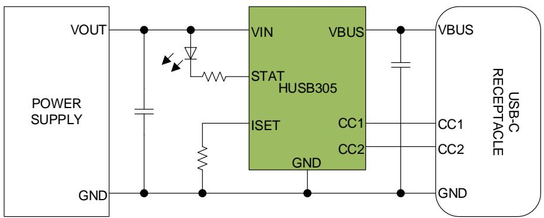  
Figure 1. HUSB305 Typical Application

# TABLE OF CONTENTS

Features ..... 1   
Applications.. . 1   
General Description ... .... 1   
Typical Application Circuit . .... 1   
Table of Contents . ... 2   
Revision History ..... ..... 2   
Pin Configuration and Function Descriptions.. ...... 3   
Specifications . .... 4   
Absolute Maximum Ratings . ..... 5   
Thermal Resistance ... ..... 5   
ESD Caution .... ...... 5   
Functional Block Diagram . ...... 6   
Theory of Operation . ... 7   
VIN and POR ..... ...... 7   
Power Switch .... ..... 7   
ISET and Current Limit Mode . ..... 7   
STAT ..... ..... 8   
Type-C MODE (CC1 and CC2)... ..... 8   
VBUS .. ..... 8   
Fault response .. ...... 8   
Typical Application Circuits.. .... 9   
Package Outline Dimensions........ .......... 10   
Package Top Marking.. .....11   
Ordering Guide... .... 12   
Important Notice.. . 13

# REVISION HISTORY

<table><tr><td>Version</td><td>Date</td><td>Owner</td><td>Descriptions</td></tr><tr><td>Rev. 1.0</td><td>07/2020</td><td>Yingyang Ou</td><td>Initial version</td></tr><tr><td>Rev. 1.1</td><td>07/2021</td><td>Yingyang Ou</td><td>Add Block Diagram and Theory of operation</td></tr><tr><td></td><td></td><td></td><td>Update Top Marking</td></tr><tr><td>Rev. 1.2</td><td>10/2021</td><td>Yingyang Ou</td><td>Update Ordering Guide</td></tr><tr><td>Rev. 1.3</td><td>11/2021</td><td>Yingyang Ou</td><td>Correct STAT polarity and temperature range</td></tr></table>

# PIN CONFIGURATION AND FUNCTION DESCRIPTIONS

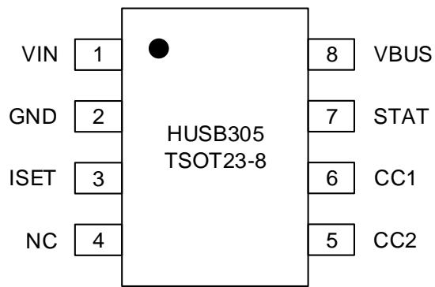  
Figure 2. Pin Assignment

Table 1. Pin Function Descriptions   

<table><tr><td>Pin No.</td><td>Pin Name</td><td>Type1</td><td>Description</td></tr><tr><td>1</td><td>VIN</td><td>P</td><td>Input pin to power switch and internal circuit</td></tr><tr><td>2</td><td>GND</td><td>A</td><td>Ground plane. All signals are referred to this pin</td></tr><tr><td>3</td><td>ISET</td><td>I</td><td>This pin is used to set the constant current (CC) limit threshold. Tie a resistor to ground can vary the CC threshold. For HUSB305, it is trimmed at 3.6A</td></tr><tr><td>4</td><td>NC</td><td></td><td>Not Connected Pin</td></tr><tr><td>5</td><td>CC2</td><td>A</td><td>Configuration line 2 of USB Type-C connector</td></tr><tr><td>6</td><td>CC1</td><td>A</td><td>Configuration line 1 of USB Type-C connector</td></tr><tr><td>7</td><td>STAT</td><td>0</td><td>Open drain output. It outputs HIZ to indicate the port is active in HUSB305-01 or outputs blinking pulse when any fault is triggered in HUSB305-02</td></tr><tr><td>8</td><td>VBUS</td><td>P</td><td>Output of USB Type-C port</td></tr></table>

1 Legend:

$\mathsf { A } =$ Analog Pin ${ \mathsf { P } } =$ Power Pin $\mathsf { D } =$ Digital Pin $\mid =$ Input Pin $0 =$ Output Pin

# SPECIFICATIONS

$\mathsf { V } _ { \mathsf { I N } } = 5 \mathsf { V } _ { \mathrm { : } }$ , ${ \mathsf { T } } _ { \mathsf { A } } = 2 5 ^ { \circ } { \mathsf { C } }$ for typical specifications, unless otherwise noted.

Table 2.   

<table><tr><td>Tavic z. Parameter</td><td>Symbol</td><td>Test Conditions/Comments</td><td>Min</td><td>Typ Max</td><td>Unit</td></tr><tr><td>VIN Input Supply</td><td></td><td></td><td></td><td></td><td></td></tr><tr><td>Input Voltage Range</td><td>VIN.RG</td><td></td><td>3</td><td>6.5</td><td>V</td></tr><tr><td>VIN UVLO Threshold</td><td>Vin_UVLO</td><td>VIN Rising Edge to Clear UVLO</td><td>3.8</td><td></td><td>V</td></tr><tr><td>UVLO Hysteresis</td><td>VUvLO_HYS</td><td></td><td>0.7</td><td></td><td>V</td></tr><tr><td>VIN Quiescent Current</td><td>IQ</td><td>VIN=5V, CC is NOT attached</td><td>150</td><td></td><td>μA</td></tr><tr><td>ISET Current Limit Threshold</td><td></td><td></td><td></td><td></td><td></td></tr><tr><td rowspan="3"></td><td>ILIM</td><td>RIseT=150K</td><td>3.6</td><td></td><td>A</td></tr><tr><td></td><td>Riset=200K</td><td>2.8</td><td></td><td>A</td></tr><tr><td>Riset=348K</td><td></td><td>1.8</td><td></td><td>A</td></tr><tr><td>STAT</td><td></td><td></td><td></td><td></td><td></td></tr><tr><td>Low load threshold</td><td>ILLD</td><td>VIN=5V</td><td>40</td><td></td><td>mA</td></tr><tr><td>STAT Sink current</td><td>ISTaT</td><td>When STAT outputs Low</td><td>4</td><td></td><td>mA</td></tr><tr><td>Protections</td><td></td><td></td><td></td><td></td><td></td></tr><tr><td>OVP Threshold OVP Hysteresis</td><td>Vovp</td><td></td><td>5.6 5.8</td><td>6</td><td>V</td></tr><tr><td>VBUS UVP Threshold</td><td>VovP_HYS</td><td>VBUS UVP and in CL mode</td><td>0.3</td><td></td><td>V</td></tr><tr><td></td><td>VvBUS_UV</td><td></td><td>3.6</td><td></td><td>V</td></tr><tr><td>VBUS UVP Hysteresis OTP Threshold</td><td>VvBUS_UV_HYS</td><td></td><td>0.1</td><td></td><td>V</td></tr><tr><td>OTP Hysteresis</td><td>ToTP</td><td></td><td>135</td><td></td><td>C</td></tr><tr><td>Fault recovery time</td><td>TotP_Hys</td><td></td><td>20</td><td></td><td>C</td></tr><tr><td></td><td>try</td><td></td><td>0.65</td><td></td><td>S</td></tr><tr><td>Type-C Pull up Current Source</td><td></td><td></td><td></td><td></td><td></td></tr><tr><td>3A Current Source 1.5A Current Source</td><td>IRP_3A</td><td></td><td>330</td><td></td><td>μA</td></tr><tr><td></td><td>IRP_1.5A</td><td></td><td>180</td><td></td><td>μA</td></tr><tr><td>3A Rp EN Rising threshold</td><td>ILIM_CC_R</td><td>3A Rp current source is enabled</td><td>2.5</td><td></td><td>A</td></tr><tr><td>3A Rp EN Falling threshold Rd detection threshold 1</td><td>ILIM_CC_F</td><td>3A Rp current source is enabled</td><td>2.4</td><td></td><td>A</td></tr><tr><td>Rd detection threshold 2</td><td>VRd_OPEN_1.5A</td><td>1.5A Rp current source is enabled</td><td>1.6</td><td></td><td>V</td></tr><tr><td></td><td>VRd_OPEN_3A</td><td>3A Rp current source is enabled</td><td>2.6</td><td></td><td>V</td></tr><tr><td>Ra detection threshold 1</td><td>VRa_OPEN_1.5A</td><td>1.5A Rp current source is enabled</td><td>0.4</td><td></td><td>V</td></tr><tr><td>Ra detection threshold 2</td><td>VRa_OPEN_3A</td><td>3A Rp current source is enabled</td><td>0.8</td><td></td><td>V</td></tr><tr><td>Connection Wait Deglitch</td><td>tcCdebounce</td><td>Time to wait before entry of Attached.src</td><td>150</td><td></td><td>ms</td></tr><tr><td>VBUS</td><td></td><td></td><td></td><td></td><td></td></tr><tr><td>VBUS Discharge Resistance</td><td>RDscG</td><td>When Power Switch is off, VIN=5V</td><td>300</td><td></td><td>Q</td></tr><tr><td>Power FET Conduction Resistance RDSoN</td><td></td><td>VIN=5V, HUSB305 is in Attached.src</td><td></td><td></td><td></td></tr></table>

# ABSOLUTE MAXIMUM RATINGS

Table 3.   

<table><tr><td>Parameter</td><td>Rating</td></tr><tr><td>VIN, VBUS, STAT to GND</td><td>-0.3 V to +7 V</td></tr><tr><td>CC1,CC2, ISET to GND Operating Temperature Range (Junction)</td><td>-0.3 V to +7 V -40°C to +150°</td></tr><tr><td>Soldering Conditions</td><td>JEDEC J-STD-020</td></tr><tr><td>Electrostatic Discharge (ESD)</td><td></td></tr><tr><td>Human Body Mode (VIN, ISET and STAT pin)</td><td>±4000 V</td></tr><tr><td>Human Body Mode (CC1, CC2 and VBUS pin)</td><td>±8000 V</td></tr></table>

Stresses at or above those listed under Absolute Maximum Ratings may cause permanent damage to the product. This is a stress rating only; functional operation of the product at these or any other conditions above those indicated in the operational section of this specification is not implied. Operation beyond the maximum operating conditions for extended periods may affect product reliability.

# THERMAL RESISTANCE

Thermal performance is directly linked to printed circuit board (PCB) design and operating environment. Close attention to PCB thermal design is required.

$\mathsf { \theta } _ { \mathsf { J A } }$ is the natural convection junction to ambient thermal resistance measured in a one cubic foot sealed enclosure.

${ \tt \theta } _ { \downarrow \mathsf { C } }$ is the junction to case thermal resistance.

# Table 4. Thermal Resistance

<table><tr><td rowspan=1 colspan=1>Package Type</td><td rowspan=1 colspan=1>θJA</td><td rowspan=1 colspan=1>θJc</td><td rowspan=1 colspan=1>Unit</td></tr><tr><td rowspan=1 colspan=1>TSOT23-8</td><td rowspan=1 colspan=1>88</td><td rowspan=1 colspan=1>45</td><td rowspan=1 colspan=1>°C/W</td></tr></table>

# ESD CAUTION

# Electrostatic Discharge Sensitive Device.

Charged devices and circuit boards can discharge without detection. Although this product features patented or proprietary protection circuitry, damage may occur on devices subjected to high energy ESD. Therefore, proper ESD precautions should be taken to avoid performance degradation or loss of functionality.

# FUNCTIONAL BLOCK DIAGRAM

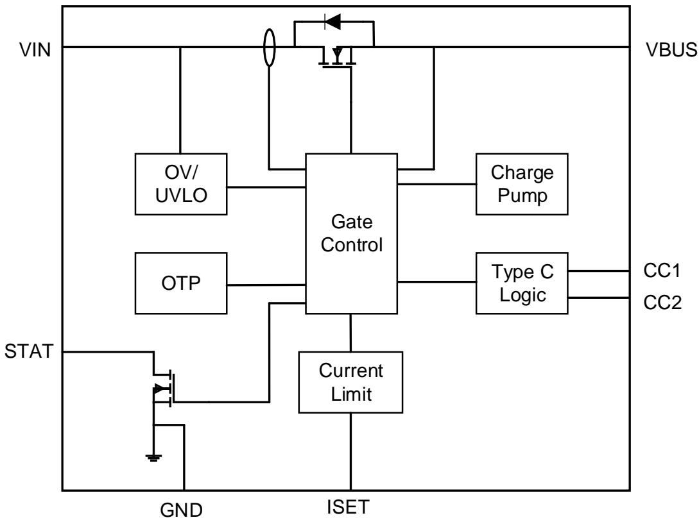  
Figure 3. HUSB305 Functional Block Diagram

# THEORY OF OPERATION

HUSB305 is a USB Type-C source port controller that integrates multiples essential functions for a USB Type-C source port. There is an ultra-low RDSON (15mΩ) N-channel MOSFET integrated as the VBUS load switch. It is designed for a 5V USB Type-C port application that requires a high current switch up to 3A. The programmable current limit provides an easy way to fine-tune the current limit through an external resistor. HUSB305-01 can detect its load current and change its STAT output to notify that there is a load applied at this port. HUSB305-02 employs STAT pin to indicate the fault status.

# VIN AND POR

The VIN pin is the input source of internal circuit of HUSB305. There is a under voltage lockout (UVLO) circuit to control the internal circuit and the power switch. When the VIN reaches the VIN_UVLO, the internal circuit works and is able to detect the connection of external device. Built-in hysteresis of UVLO (VUVLO_HYS) prevents unwanted ON/OFF cycling due to input voltage drop from large current surges. If VIN is lower than VIN_UVLO- VUVLO_HYS , the internal circuit is reset and Gate Control is disabled.

The VIN pin is also the input of integrated power FET. The load current flows from VIN pin to VBUS pin.

# POWER SWITCH

HUSB305 integrates a power FET to block the voltage from VIN to VBUS. This power FET has low conduction resistance as low as to 15mΩ. It is turned off when there is NOT a Sink device attached at CC1 or CC2 pin. Only a valid USB Type-C connection is established between HUSB305 and a Sink, the power FET is turned on.

# ISET AND CURRENT LIMIT MODE

HUSB305 employs VIN and VBUS to sense the load current on the USB Type-C port. It can detect the ISET pin to determine the current limit threshold. The current limit threshold (ILIM) is set by the resistor RISET across ISET pin and GND. The recommend RISET as show in Table 5.

Table 5.   

<table><tr><td>Riset (KΩ)</td><td>Current Limit Threshold (A)</td></tr><tr><td>150</td><td>3.6</td></tr><tr><td>200</td><td>2.8</td></tr><tr><td>348</td><td>1.8</td></tr></table>

Once the load current flowing from VIN to VBUS exceeds the current limit threshold (ILIM), HUSB305 tries to limit load current by reducing the VBUS voltage. If the load current continues to increase which results in the VBUS to be lower than VVBUS_UV, the VBUS UVP fault is triggered. HUSB305 enters hiccup mode until the VBUS UVP fault is cleared.

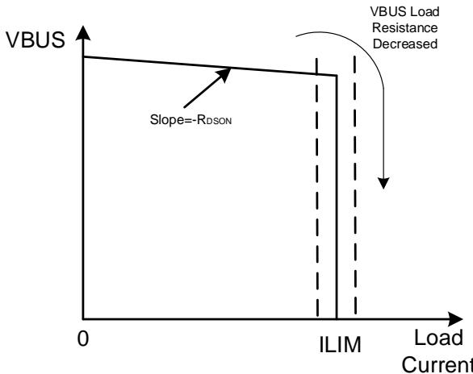  
Figure 4. HUSB305 Output IV Characteristics

The HUSB305 may enter hiccup mode if an overload condition is present long enough to activate OTP fault during the Current Limit Mode. This is due to the relatively large power dissipation $[ ( \mathsf { V } | \mathsf { N } - \mathsf { V } \mathsf { B } \mathsf { U } \mathsf { S } ) \times \mathsf { I } _ { \mathsf { L } | \mathsf { M } } ]$ driving the junction

temperature up. HUSB305 turns off power FET when the junction temperature exceeds OTP threshold (TOTP) and remains power FET off until the junction temperature cools $\boldsymbol { 2 0 ^ { \circ } \mathrm { C } }$ . After that, HUSB305 enters hiccup mode.

# STAT

The STAT pin is an open-drain output. HUSB305 monitors the load current from VIN to VBUS. In HUSB305-01, STAT is employed to indicate load current is higher than ILLD. The STAT pin is pulled down when the load current is lower than ILLD. Similarly, when the load current is higher than ILLD, the STAT pin returns to HIZ.

In HUSB305-02, STAT is configured as fault status indication, it outputs blinking pulses under an OTP, OVP or VBUS UVP fault condition, as well as the following hiccup mode. When the device in UVLO, STAT is HIZ.

# TYPE-C MODE (CC1 AND CC2)

HUSB305 is used for a USB Type-C source controller. HUSB305 checks the status of CC1 and CC2 before it is going to work. HUSB305 also checks the current limit set by ISET pin and determines the advertised $\mathsf { R } _ { \mathsf { p } }$ at both CC pins.

After $\mathsf { R } _ { \mathsf { p } }$ is set, HUSB305 is able to detect a possible connection of a USB Type-C Sink, as shown below.

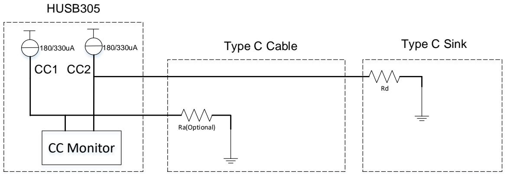  
Figure 5. USB Type-C Source Connection with a Sink

The connected CC pin is monitored to check whether a valid USB Type-C attachment or detachment happens.

# VBUS

The VBUS pin is the output of power FET. It is connected to the USB Type-C connector. During detachment or hiccup mode, an integrated RDSCG is enabled to dissipate the energy at VBUS pin timely.

# FAULT RESPONSE

HUSB305 monitors the VIN voltage, VBUS voltage, load current from VIN to VBUS and the internal junction temperature.

Once VIN is above OVP threshold (VOVP), OVP fault is triggered. The internal power FET shuts down. Only after the OVP fault is cleared, the HUSB305 enters hiccup mode.

The VBUS voltage is also monitored. There is a VBUS UVP fault mechanism implemented for VBUS voltage, see th section of “ISET AND CURRENT LIMIT MODE” for more details.

HUSB305 has internal over-temperature protection, OTP. It is used to protect the internal FET from damage and assist with overall safety of the system. OTP fault is triggered when the junction temperature exceeds TOTP.

The hiccup mode is applied for the VBUS UVP, OTP and OVP, when the VBUS UVP, OTP and OVP flags are cleared, the HUSB305 is going to perform restart after ttry.

# TYPICAL APPLICATION CIRCUITS

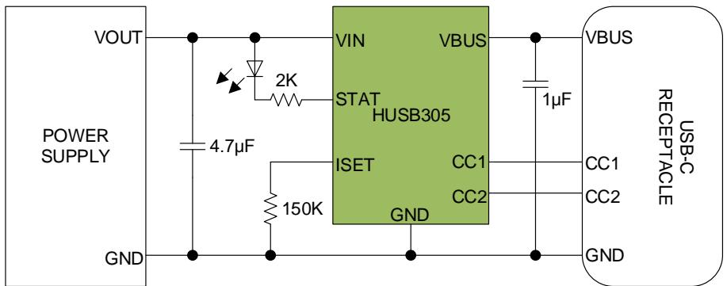  
Figure 6. USB Type-C 5V3A Single Source Port

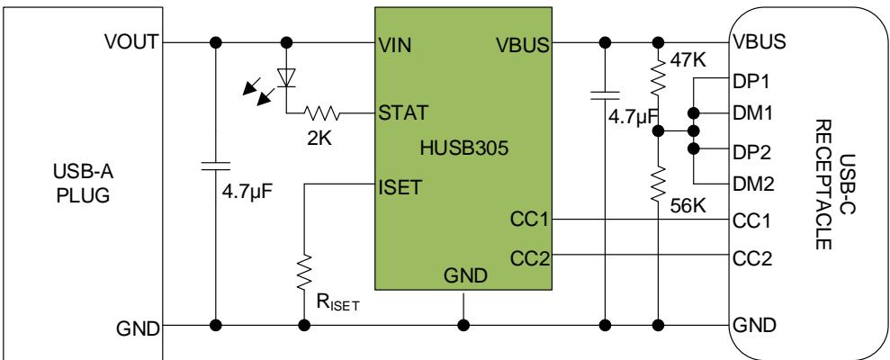  
Figure 7. USB A to C Conversion Connector

# PACKAGE OUTLINE DIMENSIONS

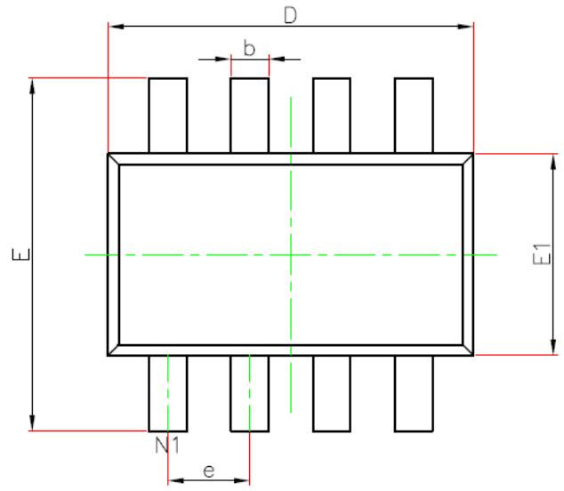  
TOP VIEW

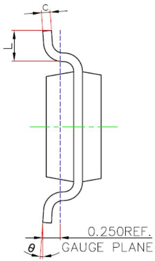  
SIDE VIEW

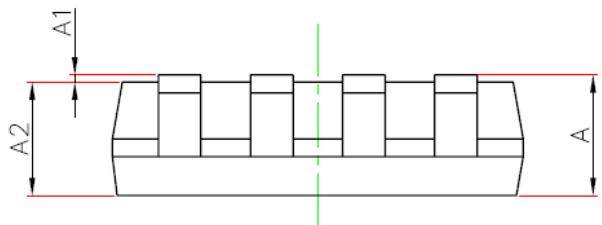

SIDE VIEW   

<table><tr><td rowspan=2 colspan=1>Symbol</td><td rowspan=1 colspan=2>Dimensions In Millimeters</td><td rowspan=1 colspan=2>Dimensions In Inches</td></tr><tr><td rowspan=1 colspan=1>Min</td><td rowspan=1 colspan=1>Max</td><td rowspan=1 colspan=1>Min</td><td rowspan=1 colspan=1>Max</td></tr><tr><td rowspan=1 colspan=1>A</td><td rowspan=1 colspan=1>----</td><td rowspan=1 colspan=1>1.100</td><td rowspan=1 colspan=1></td><td rowspan=1 colspan=1>0.043</td></tr><tr><td rowspan=1 colspan=1>A1</td><td rowspan=1 colspan=1>0.000</td><td rowspan=1 colspan=1>0.100</td><td rowspan=1 colspan=1>0.000</td><td rowspan=1 colspan=1>0.004</td></tr><tr><td rowspan=1 colspan=1>A2</td><td rowspan=1 colspan=1>0.700</td><td rowspan=1 colspan=1>1.000</td><td rowspan=1 colspan=1>0.028</td><td rowspan=1 colspan=1>0.039</td></tr><tr><td rowspan=1 colspan=1>D</td><td rowspan=1 colspan=1>2.850</td><td rowspan=1 colspan=1>2.950</td><td rowspan=1 colspan=1>0.112</td><td rowspan=1 colspan=1>0.116</td></tr><tr><td rowspan=1 colspan=1>E</td><td rowspan=1 colspan=1>2.650</td><td rowspan=1 colspan=1>2.950</td><td rowspan=1 colspan=1>0.104</td><td rowspan=1 colspan=1>0.116</td></tr><tr><td rowspan=1 colspan=1>E1</td><td rowspan=1 colspan=1>1.550</td><td rowspan=1 colspan=1>1.650</td><td rowspan=1 colspan=1>0.061</td><td rowspan=1 colspan=1>0.065</td></tr><tr><td rowspan=1 colspan=1>b</td><td rowspan=1 colspan=1>0.200</td><td rowspan=1 colspan=1>0.400</td><td rowspan=1 colspan=1>0.008</td><td rowspan=1 colspan=1>0.016</td></tr><tr><td rowspan=1 colspan=1>C</td><td rowspan=1 colspan=1>0.080</td><td rowspan=1 colspan=1>0.200</td><td rowspan=1 colspan=1>0.003</td><td rowspan=1 colspan=1>0.008</td></tr><tr><td rowspan=1 colspan=1>e</td><td rowspan=1 colspan=2>0.650(BSC)</td><td rowspan=1 colspan=2>0.026(BSC)</td></tr><tr><td rowspan=1 colspan=1>L</td><td rowspan=1 colspan=1>0.300</td><td rowspan=1 colspan=1>0.600</td><td rowspan=1 colspan=1>0.012</td><td rowspan=1 colspan=1>0.024</td></tr><tr><td rowspan=1 colspan=1>θ</td><td rowspan=1 colspan=1>0°</td><td rowspan=1 colspan=1>8°</td><td rowspan=1 colspan=1>0°</td><td rowspan=1 colspan=1>8°</td></tr></table>

Figure 8. TSOT23-8 Package

# PACKAGE TOP MARKING

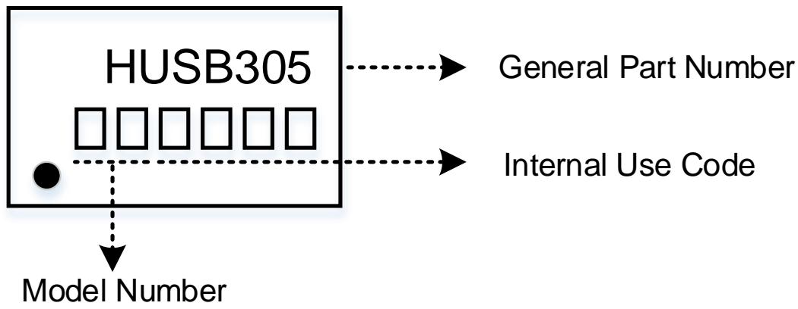  
Figure 9. HUSB305 Package Top Marking

# ORDERING GUIDE

<table><tr><td>Model</td><td>Temperature Range ()</td><td>STAT Configuration</td><td>Package Option</td><td>Quantity</td></tr><tr><td>HUSB305-01</td><td>-40 to 125</td><td>LLD Indication</td><td>TSOT23-8L</td><td>Tape &amp; Reel, 4K</td></tr><tr><td>HUSB305-02</td><td>-40 to 125</td><td>Fault Indication</td><td>TSOT23-8L</td><td>Tape &amp; Reel, 4K</td></tr></table>

# IMPORTANT NOTICE

Hynetek Semiconductor Co., Ltd. and its subsidiaries (Hynetek) reserve the right to make corrections, enhancements, improvements and other changes to its semiconductor products and services per JESD46, latest issue, and to discontinue any product or service per JESD48, latest issue. Buyers should obtain the latest relevant information before placing orders and should verify that such information is current and complete. All semiconductor products (also referred to herein as “components”) are sold subject to Hynetek’s terms and conditions of sale supplied at the time of order acknowledgment.

Hynetek warrants performance of its components to the specifications applicable at the time of sale, in accordance with the warranty in Hynetek’s terms and conditions of sale of semiconductor products. Testing and other quality control techniques are used to the extent Hynetek deems necessary to support this warranty. Except where mandated by applicable law, testing of all parameters of each component is not necessarily performed.

Hynetek assumes no liability for applications assistance or the design of Buyers’ products. Buyers are responsible for their products and applications using Hynetek components. To minimize the risks associated with Buyers’ products and applications, Buyers should provide adequate design and operating safeguards.

Hynetek does not warrant or represent that any license, either express or implied, is granted under any patent right, copyright, mask work right, or other intellectual property right relating to any combination, machine, or process in which Hynetek components or services are used. Information published by Hynetek regarding third-party products or services does not constitute a license to use such products or services or a warranty or endorsement thereof. Use of such information may require a license from a third party under the patents or other intellectual property of the third party, or a license from Hynetek under the patents or other intellectual property of Hynetek.

Reproduction of significant portions of Hynetek information in Hynetek data books or data sheets is permissible only if reproduction is without alteration and is accompanied by all associated warranties, conditions, limitations, and notices. Hynetek is not responsible or liable for such altered documentation. Information of third parties may be subject to additional restrictions.

Resale of Hynetek components or services with statements different from or beyond the parameters stated by Hynetek for that component or service voids all express and any implied warranties for the associated Hynetek component or service and is an unfair and deceptive business practice.

Hynetek is not responsible or liable for any such statements.

Buyer acknowledges and agrees that it is solely responsible for compliance with all legal, regulatory and safety-related requirements concerning its products, and any use of Hynetek components in its applications, notwithstanding any applicationsrelated information or support that may be provided by Hynetek. Buyer represents and agrees that it has all the necessary expertise to create and implement safeguards which anticipate dangerous consequences of failures, monitor failures and their consequences, lessen the likelihood of failures that might cause harm and take appropriate remedial actions. Buyer will fully indemnify Hynetek and its representatives against any damages arising out of the use of any Hynetek components in safety-critica applications.

In some cases, Hynetek components may be promoted specifically to facilitate safety-related applications. With such components, Hynetek’s goal is to help enable customers to design and create their own end-product solutions that meet applicable functional safety standards and requirements. Nonetheless, such components are subject to these terms.

No Hynetek components are authorized for use in FDA Class III (or similar life-critical medical equipment) unless authorized officers of the parties have executed a special agreement specifically governing such use.

Only those Hynetek components which Hynetek has specifically designated as military grade or “enhanced plastic” are designed and intended for use in military/aerospace applications or environments. Buyer acknowledges and agrees that any military or aerospace use of Hynetek components which have not been so designated is solely at the Buyer's risk, and that Buyer is solely responsible for compliance with all legal and regulatory requirements in connection with such use.

Hynetek has specifically designated certain components as meeting ISO/TS16949 requirements, mainly for automotive use. In any case of use of non-designated products, Hynetek will not be responsible for any failure to meet ISO/TS16949.

Please refer to below URL for other products and solutions of Hynetek Semiconductor Co., Ltd.