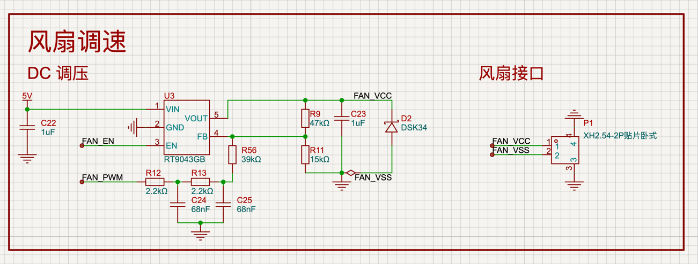

# UPS 主控两线风扇调速规范

> 版本：2025-10-19  
> 适用分支：`feature/fan-control`  
> 撰写：心羽（ESP32‑S3 主控项目猫娘）

---

## 1. 设计目标

1. 通过 MCU 产生的 25 kHz PWM、两级 RC 滤波及 LDO（RT9043GB）反馈调节，实现对两线直流风扇的线性调压控制。
2. 依据芯片内部温度传感器（TSENS）实时调节风扇转速，确保 UPS 主控在 0 °C–80 °C 范围内稳定运行。
3. 提供完整的安全保护、诊断日志与测试流程，便于现场调试和后续扩展（如闭环 RPM）。

---

## 2. 硬件设计

### 2.1 拓扑与接口

- 电源路径：`5 V → RT9043GB → FAN_VCC → 风扇 (+)`，风扇负端接 `FAN_VSS`。
- 控制引脚：
  - `FAN_PWM = GPIO40`（LEDC 低速组，25 kHz 方波）；
  - `FAN_EN = GPIO39`（推挽输出，高有效，直连 LDO EN）。
- RC 滤波：双极 RC（`R12/R13` + `C24/C25`）对 PWM 进行低通过滤。
- 反馈注入：经 `R56` 将滤波后的电压注入 LDO FB；`R9/R11` 作为主分压；`D2` 负责钳位 FB 下限。

参考原理图如下：



| 项目 | 数值 / 器件 | 备注 |
| ---- | ----------- | ---- |
| LDO 型号 | RT9043GB | 1.2 V 基准，EN 高有效 |
| 分压网络 | R9 = 47 kΩ，R11 = 15 kΩ | 理论空载输出 `VOUT0 = 1.2 × (1 + 47k/15k) ≈ 5.0 V` |
| PWM 注入 | R56 = 39 kΩ | 与分压点并联注入电流 |
| RC 滤波 | R12 = R13 = 2.2 kΩ，C24 = C25 = 68 nF | 25 kHz 时提供双极低通 |
| 钳位保护 | D2 = DSK34 Schottky | 正向约 0.3 V，限制 FB 最低电位 |
| 输入/输出电容 | C22 = 1 µF，C23 = 1 µF | 依据原理图 |

### 2.2 PWM → 电压近似

忽略钳位影响时，可推得：

```
VOUT(d) ≈ VOUT0 − k · d
VOUT0 ≈ 4.96 V
k ≈ (R9/R56) × 3.3 V ≈ 3.98 V
```

因此：

| 占空比 d | 理论输出 |
| ------- | -------- |
| 0% | ≈ 5.0 V |
| 60% | ≈ 2.6 V |
| 80% | ≈ 1.8 V |
| 100% | ≈ 1.0 V |

Schottky 钳位会把最小电压限制在约 1.4 V（按 `Vout_min ≈ Vin − (Vin − Vf)·R9/(R9+R11)` 估算，取 `Vin=5 V`、`Vf≈0.3 V`）。实际最小电压取决于风扇载流与二极管温度。

---

## 3. 软件设计

软件部分围绕 TSENS 采样、温控调速、保护/诊断三个层面展开。

### 3.1 温度采样（TSENS）

1. 参考 ESP-IDF `temperature_sensor_hal` 与 `sar_periph_ctrl_common` 初始化流程：开启 `APB_SARADC` 时钟 → REGI2C 供电 → TSENS XPD → 设置初始量程（默认 `-10°C~80°C`）。
2. 读取 eFuse `TEMP_CALIB` 字段（Block2 bit132..140），判断 `rtc_calib_version()==1` 后按 0.1 °C 缩放补偿；若 eFuse 未烧录，退回默认偏移并打印警告。
3. 初次启用后延时 ≥300 µs 再取值；正常循环每 500 ms 采一次，使用 3 点中值滤波抵御抖动。

### 3.2 转速控制算法

1. 温度 → 占空比分段（默认值，可编程）：
   - ≤35 °C：0%
   - 40 °C：20%
   - 50 °C：40%
   - 60 °C：70%
   - ≥70 °C：100%
2. 温度滞回：±3 °C（防抖）；占空比限斜率：每周期最大 ±5%。
3. 风扇开启流程：占空比由 0 增大时，先 `FAN_EN=High`，再调整 PWM；关闭则先把 PWM 拉到 0，再拉低 EN。
4. 保护逻辑：
   - TSENS 读数无效或超限 → 进入安全模式（默认 50% 占空比，`FAN_EN=High`）；
   - `Temp ≥ 80 °C` → 强制 100%，并记录一次“overheat”事件。

### 3.3 配置与扩展性

- 建议将阈值、占空比、滞回、限斜率、保护占空比等封装成 `const FAN_CONFIG` 结构，便于未来改成外部配置或运行时调节。

---

## 4. 日志与诊断

每 2 s 输出一次 `INFO` 日志，格式示例：

```
TEMP=42.3°C RAW=137 ATTR=2 DELTA=-10.3°C DUTY=35% MODE=NORMAL VOUT≈2.5V
```

字段说明：

- `RAW`：TSENS 原始值；
- `ATTR`：当前量程索引；
- `DELTA`：eFuse 校准值（°C）；
- `DUTY`：目标占空比；
- `MODE`：`NORMAL` / `SAFE` / `OVERTEMP`；
- `VOUT`：根据线性模型推算的目标电压（用于调试）。

异常情况下追加 `WARN` 或 `ERROR`：

```
WARN fan.safe_mode reason=tsens_fault raw=0
ERROR fan.overheat temp=82.1°C forcing=100%
```

---

## 5. 验收测试

1. **校准验证**：室温 25–32 °C 时 TSENS 读数应与外部温度计差距 <10 °C；若 eFuse 缺失，应打印 `tsens.calib_missing` 并进入安全模式。
2. **线性调压**：在关机状态用示波器或万用表测量 `FAN_VCC`，验证占空比 0%/60%/100% 对应电压约 5 V/2.6 V/1.4 V（允许 ±0.2 V 浮动）。
3. **功能回归**：加热或模拟负载升温，观察占空比随温度递增；≥80 °C 时风扇全速。
4. **异常处理**：短暂禁用 TSENS、插拔风扇或模拟二极管短路，确认软件能进入安全模式并恢复。
5. **日志检查**：通过 `cat /dev/cu.usbmodemXXXX` 读取日志，确认字段齐全、节奏满足 2 s/条。

---

## 6. 未来扩展建议

- **闭环控制**：添加 PCNT 测 RPM，构建 PI 调节，兼容三线风扇。
- **外部传感器**：支持 I²C 温度传感器（如 TMP117）作补偿，减少芯温偏差。
- **自适应曲线**：在 EEPROM/Flash 中存储标定曲线，允许用户按环境和风扇型号调节。
- **健康监测**：记录累计运行时间、过温次数，提供预警接口。

---

## 7. 参考

- 原理图：`docs/assets/fan-speed-control-sch.png`
- 旧版三线方案参考：`docs/pwm_fan_control_circuit_design.md`
- 两线实现说明：`docs/active_cooling_2wire.md`
- 任务拆解：`docs/fan_control_requirements.md`
- ESP-IDF 文档：`temperature_sensor_hal`、`esp_efuse_rtc_calib`
